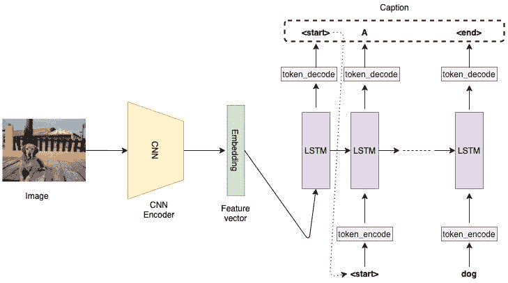
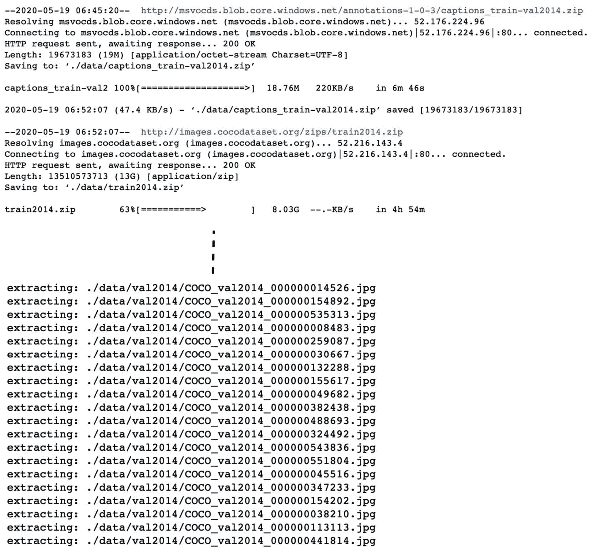
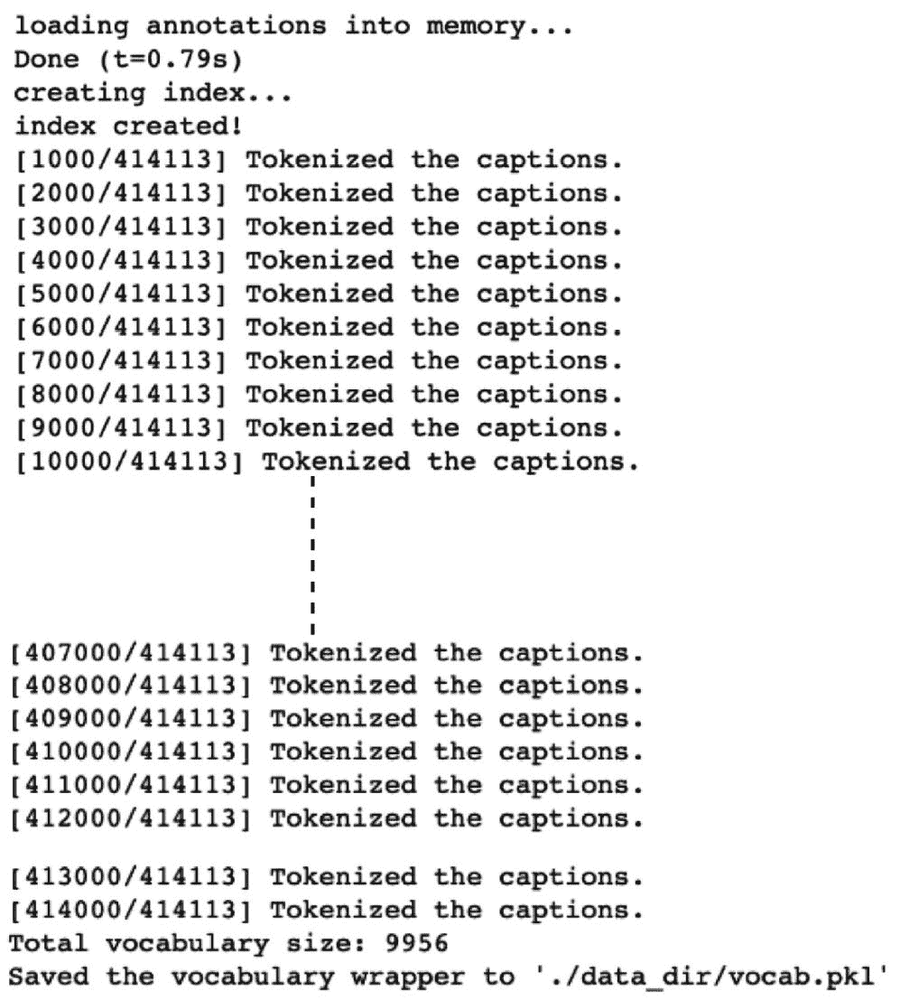
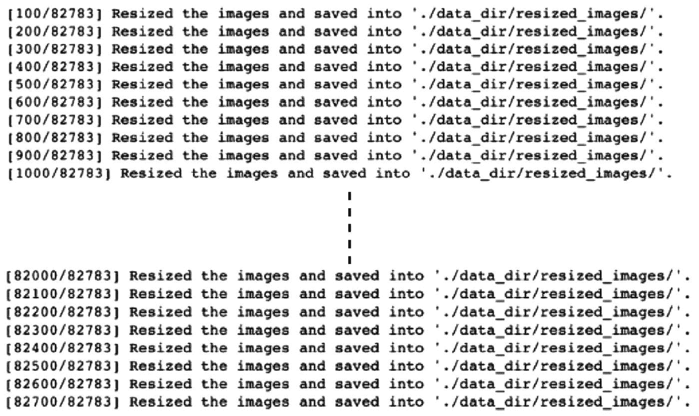
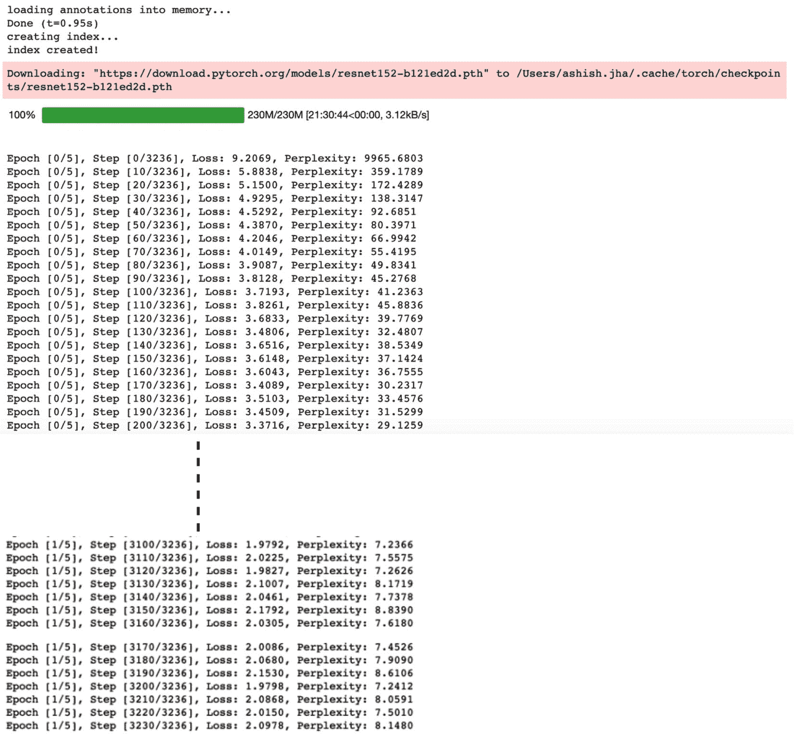
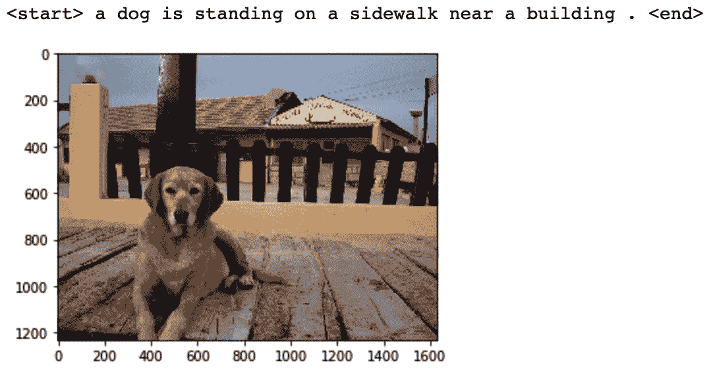

# 第二章：结合 CNN 和 LSTM

## 加入我们的书籍社区 Discord

[`packt.link/EarlyAccessCommunity`](https://packt.link/EarlyAccessCommunity)


**卷积神经网络**（**CNNs**）是一种深度学习模型，已知可以解决与图像和视频相关的机器学习问题，如图像分类、目标检测、分割等。这是因为 CNN 使用一种称为**卷积层**的特殊层，它具有共享的可学习参数。权重或参数共享之所以有效，是因为图像中要学习的模式（如边缘或轮廓）被假定独立于图像中像素的位置。正如 CNN 适用于图像一样，**长短期记忆网络**（**LSTM**）——它们是**循环神经网络**（**RNN**）的一种类型——在解决**顺序数据**相关的机器学习问题时非常有效。顺序数据的一个例子可以是文本。例如，在一个句子中，每个单词依赖于前面的单词。LSTM 模型旨在建模这种顺序依赖关系。

这两种不同类型的网络——CNN 和 LSTM——可以级联以形成一个混合模型，接受图像或视频并输出文本。这种混合模型的一个众所周知的应用是图像字幕生成，模型接收图像并输出图像的一个合理的文本描述。自 2010 年以来，机器学习已被用于执行图像字幕生成任务[2.1]。

然而，神经网络最初成功地用于这项任务大约是在 2014/2015 年[2.2]。自那时以来，图像字幕生成一直在积极研究中。每年都有显著改进，这种深度学习应用可以成为现实世界应用的一部分，例如在网站上自动生成视觉障碍者友好的替代文本。

本章首先讨论这种混合模型的架构，以及在 PyTorch 中相关的实现细节，最后我们将使用 PyTorch 从头开始构建一个图像字幕系统。本章涵盖以下主题：

+   使用 CNN 和 LSTM 构建神经网络

+   使用 PyTorch 构建图像标题生成器

## 使用 CNN 和 LSTM 构建神经网络

CNN-LSTM 网络架构包括一个或多个卷积层，用于从输入数据（图像）中提取特征，然后是一个或多个 LSTM 层，用于执行顺序预测。这种模型在空间和时间上都很深。模型的卷积部分通常被用作一个**编码器**，它接受输入图像并输出高维特征或嵌入。

在实践中，用于这些混合网络的 CNN 通常是在图像分类任务上预训练的。预训练 CNN 模型的最后一个隐藏层然后作为 LSTM 组件的输入，LSTM 作为一个**解码器**用于生成文本。

当我们处理文本数据时，我们需要将单词和其他符号（标点符号、标识符等）一起转换为数字，统称为**标记**。我们通过用唯一对应的数字表示文本中的每个标记来实现这一点。在下一小节中，我们将演示文本编码的示例。

## 文本编码演示

让我们假设我们正在构建一个使用文本数据的机器学习模型；例如，我们的文本如下：

```py
<start> PyTorch is a deep learning library. <end>
```

然后，我们将每个单词/标记映射为数字，如下所示：

```py
<start> : 0
PyTorch : 1
is : 2
a : 3
deep : 4
learning : 5
library : 6
. : 7
<end> : 8
```

一旦我们有了映射，我们可以将这个句子表示为一个数字列表：

```py
<start> PyTorch is a deep learning library. <end> -> [0, 1, 2, 3, 4, 5, 6, 7, 8]
```

另外，例如 `<start> PyTorch is deep. <end>` 将被编码为 `-> [0, 1, 2, 4, 7, 8]` 等等。这种映射通常被称为**词汇表**，构建词汇表是大多数文本相关的机器学习问题的关键部分。

作为解码器的 LSTM 模型在 `t=0` 时以 CNN 嵌入作为输入。然后，每个 LSTM 单元在每个时间步进行标记预测，这些预测作为下一个 LSTM 单元的输入。因此生成的整体架构可以如下图所示：



图 2.1 – 示例 CNN-LSTM 架构

所演示的架构适用于图像字幕任务。如果我们不仅仅有单个图像，而是有一个图像序列（比如视频）作为 CNN 层的输入，那么我们将在每个时间步将 CNN 嵌入作为 LSTM 单元的输入，而不仅仅是在 `t=0`。这种架构对于诸如活动识别或视频描述等应用非常有用。

在接下来的章节中，我们将在 PyTorch 中实现一个图像字幕系统，包括构建混合模型架构、数据加载、预处理、模型训练和模型评估流程。

## 使用 PyTorch 构建图像字幕生成器

在这个练习中，我们将使用**通用物体上下文**（**COCO**）数据集 [2.3]，这是一个大规模的对象检测、分割和字幕数据集。

这个数据集包含超过 20 万张带有每张图像五个标题的标注图像。COCO 数据集于 2014 年出现，并显著促进了与对象识别相关的计算机视觉任务的进展。它是最常用于基准测试任务的数据集之一，例如对象检测、对象分割、实例分割和图像字幕。

在这个练习中，我们将使用 PyTorch 在这个数据集上训练一个 CNN-LSTM 模型，并使用训练好的模型为未见样本生成标题。在此之前，我们需要处理一些先决条件。

> 注意
> 
> > 我们将仅参考一些重要的代码片段来进行说明。完整的练习代码可以在我们的 GitHub 仓库 [2.4] 中找到。

## 下载图像字幕数据集

在我们开始构建图像字幕系统之前，我们需要下载所需的数据集。如果您尚未下载数据集，请在 Jupyter Notebook 的帮助下运行以下脚本。这应该可以帮助您在本地下载数据集。

> 注意
> 
> > 我们使用稍旧版本的数据集，因为它的大小稍小，这样可以更快地得到结果。

训练和验证数据集分别为 13 GB 和 6 GB。下载和提取数据集文件以及清理和处理它们可能需要一些时间。一个好主意是按照以下步骤执行，并让它们在夜间完成：

```py
# download images and annotations to the data directory
!wget http://msvocds.blob.core.windows.net/annotations-1-0-3/captions_train-val2014.zip -P ./data_dir/
!wget http://images.cocodataset.org/zips/train2014.zip -P ./data_dir/
!wget http://images.cocodataset.org/zips/val2014.zip -P ./data_dir/
# extract zipped images and annotations and remove the zip files
!unzip ./data_dir/captions_train-val2014.zip -d ./data_dir/
!rm ./data_dir/captions_train-val2014.zip
!unzip ./data_dir/train2014.zip -d ./data_dir/
!rm ./data_dir/train2014.zip
!unzip ./data_dir/val2014.zip -d ./data_dir/
!rm ./data_dir/val2014.zip
```

您应该看到以下输出：



图 2.2 – 数据下载和提取

此步骤基本上创建了一个数据文件夹（`./data_dir`），下载了压缩的图像和注释文件，并将它们提取到数据文件夹中。

## 预处理字幕（文本）数据

下载的图像字幕数据集包含文本（字幕）和图像。在本节中，我们将预处理文本数据，使其可用于我们的 CNN-LSTM 模型。这项练习按步骤进行。前三个步骤专注于处理文本数据：

1.  对于这个练习，我们需要导入一些依赖项。本章的一些关键模块如下：

```py
import nltk
from pycocotools.coco import COCO
import torch.utils.data as data
import torchvision.models as models
import torchvision.transforms as transforms
from torch.nn.utils.rnn import pack_padded_sequence
```

`nltk` 是自然语言工具包，将有助于构建我们的词汇表，而 `pycocotools` 是与 COCO 数据集一起工作的辅助工具。我们在这里导入的各种 Torch 模块已在前一章中讨论过，除了最后一个 - `pack_padded_sequence`。此函数将有助于通过应用填充，将具有不同长度（单词数）的句子转换为固定长度的句子。

除了导入`nltk`库之外，我们还需要下载其`punkt`分词模型，如下所示：

```py
nltk.download('punkt')
```

这将使我们能够将给定文本标记为组成单词。

1.  接下来，我们构建词汇表 - 即可以将实际文本标记（如单词）转换为数值标记的字典。这一步在大多数与文本相关的任务中都是必不可少的：

```py
def build_vocabulary(json, threshold):
    """Build a vocab wrapper."""
    coco = COCO(json)
    counter = Counter()
    ids = coco.anns.keys()
    for i, id in enumerate(ids):
        caption = str(coco.anns[id]['caption'])
        tokens = nltk.tokenize.word_tokenize(caption.lower())
        counter.update(tokens)
        if (i+1) % 1000 == 0:
            print("[{}/{}] Tokenized the captions.".format(i+1, len(ids)))
```

首先，在词汇构建器函数内部，加载了 JSON 文本注释，并将注释/字幕中的个别单词进行了标记化或转换为数字并存储在计数器中。

然后，丢弃少于某个数量出现次数的标记，并将剩余的标记添加到词汇对象中，同时添加一些通配符标记 - `start`（句子的开头）、`end`、`unknown_word`和填充标记，如下所示：

```py
 # If word freq < 'thres', then word is discarded.
    tokens = [token for token, cnt in counter.items() if cnt >= threshold]
    # Create vocab wrapper + add special tokens.
    vocab = Vocab()
    vocab.add_token('<pad>')
    vocab.add_token('<start>')
    vocab.add_token('<end>')
    vocab.add_token('<unk>')
    # Add words to vocab.
    for i, token in enumerate(tokens):
        vocab.add_token(token)
    return vocab
```

最后，使用词汇构建器函数创建并保存了一个词汇对象 vocab，以便进一步重用，如下所示：

```py
vocab = build_vocabulary(json='data_dir/annotations/captions_train2014.json', threshold=4)
vocab_path = './data_dir/vocabulary.pkl'
with open(vocab_path, 'wb') as f:
    pickle.dump(vocab, f)
print("Total vocabulary size: {}".format(len(vocab)))
print("Saved the vocabulary wrapper to '{}'".format(vocab_path))
```

此操作的输出如下：



图 2.3 – 词汇表创建

一旦构建了词汇表，我们可以在运行时将文本数据转换为数字。

## 图像数据预处理

下载数据并为文本标题构建词汇表后，我们需要对图像数据进行一些预处理。

因为数据集中的图像可能有不同的尺寸或形状，我们需要将所有图像重塑为固定的形状，以便它们可以输入到我们 CNN 模型的第一层，如下所示：

```py
def reshape_images(image_path, output_path, shape):
    images = os.listdir(image_path)
    num_im = len(images)
    for i, im in enumerate(images):
        with open(os.path.join(image_path, im), 'r+b') as f:
            with Image.open(f) as image:
                image = reshape_image(image, shape)
                image.save(os.path.join(output_path, im), image.format)
        if (i+1) % 100 == 0:
            print ("[{}/{}] Resized the images and saved into '{}'.".format(i+1, num_im, output_path))
reshape_images(image_path, output_path, image_shape)
```

结果如下：



图 2.4 – 图像预处理（重塑）

我们已将所有图像重塑为 256 x 256 像素，使其与我们的 CNN 模型架构兼容。

## 定义图像字幕数据加载器

我们已经下载并预处理了图像字幕数据。现在是将此数据转换为 PyTorch 数据集对象的时候了。这个数据集对象随后可以用来定义一个 PyTorch 数据加载器对象，在训练循环中使用以获取数据批次，如下所示：

1.  现在，我们将实现自己的定制 `Dataset` 模块和一个自定义的数据加载器：

```py
class CustomCocoDataset(data.Dataset):
    """COCO Dataset compatible with torch.utils.data.DataLoader."""
    def __init__(self, data_path, coco_json_path, vocabulary, transform=None):
        """Set path for images, texts and vocab wrapper.

        Args:
            data_path: image directory.
            coco_json_path: coco annotation file path.
            vocabulary: vocabulary wrapper.
            transform: image transformer.
        """
        ...
    def __getitem__(self, idx):
        """Returns one data sample (X, y)."""
        ...
        return image, ground_truth
    def __len__(self):
        return len(self.indices)
```

首先，为了定义我们自定义的 PyTorch `Dataset` 对象，我们已经为实例化、获取项目和返回数据集大小定义了自己的 `__init__`、`__get_item__` 和 `__len__` 方法。

1.  接下来，我们定义 `collate_function`，它以 `X`、`y` 的形式返回数据的小批量，如下所示：

```py
def collate_function(data_batch):
    """Creates mini-batches of data
    We build custom collate function rather than using standard collate function,
    because padding is not supported in the standard version.
    Args:
        data: list of (image, caption)tuples.
            - image: tensor of shape (3, 256, 256).
            - caption: tensor of shape (:); variable length.
    Returns:
        images: tensor of size (batch_size, 3, 256, 256).
        targets: tensor of size (batch_size, padded_length).
        lengths: list.
    """
    ...       
    return imgs, tgts, cap_lens
```

通常情况下，我们不需要编写自己的 `collate` 函数，但我们需要处理变长句子，以便当句子的长度（例如 `k`）小于固定长度 `n` 时，使用 `pack_padded_sequence` 函数填充 `n-k` 个标记。

1.  最后，我们将实现 `get_loader` 函数，该函数返回一个用于 `COCO` 数据集的自定义数据加载器，代码如下：

```py
def get_loader(data_path, coco_json_path, vocabulary, transform, batch_size, shuffle):
    # COCO dataset
    coco_dataset = CustomCocoDataset(data_path=data_path,
                       coco_json_path=coco_json_path,
                       vocabulary=vocabulary,
                       transform=transform)
    custom_data_loader = torch.utils.data.DataLoader(dataset=coco_dataset, batch_size=batch_size, shuffle=shuffle,  collate_fn=collate_function)
    return custom_data_loader
```

在训练循环中，此函数将非常有用且高效，用于获取数据的小批量。

这完成了为模型训练设置数据流水线所需的工作。现在我们将朝着实际模型本身迈进。

## 定义 CNN-LSTM 模型

现在我们已经设置好了数据流水线，我们将按照 *图 2.1* 中的描述定义模型架构，如下所示：

```py
class CNNModel(nn.Module):
    def __init__(self, embedding_size):
        """Load pretrained ResNet-152 & replace last fully connected layer."""
        super(CNNModel, self).__init__()
        resnet = models.resnet152(pretrained=True)
        module_list = list(resnet.children())[:-1]
      # delete last fully connected layer.
        self.resnet_module = nn.Sequential(*module_list)
        self.linear_layer = nn.Linear(resnet.fc.in_features, embedding_size)
        self.batch_norm = nn.BatchNorm1d(embedding_size, momentum=0.01)
            def forward(self, input_images):
        """Extract feats from images."""
        with torch.no_grad():
            resnet_features = self.resnet_module(input_images)
        resnet_features = resnet_features.reshape(resnet_features.size(0), -1)
        final_features = self.batch_norm(self.linear_layer(resnet_features))
        return final_features
```

我们定义了两个子模型，即 CNN 模型和 RNN 模型。对于 CNN 部分，我们使用了 PyTorch 模型库中可用的预训练 CNN 模型：ResNet 152 架构。在下一章节中，我们将详细学习 ResNet，这个具有 152 层的深度 CNN 模型已在 ImageNet 数据集上进行了预训练 [2.5] 。ImageNet 数据集包含超过 140 万张 RGB 图像，标注了超过 1000 个类别。这些 1000 个类别包括植物、动物、食物、运动等多个类别。

我们移除了预训练的 ResNet 模型的最后一层，并替换为一个全连接层，接着是一个批归一化层。

> FAQ - 为什么我们能够替换全连接层？
> 
> > 神经网络可以被看作是一系列权重矩阵，从输入层到第一个隐藏层之间的权重矩阵开始，直到倒数第二层和输出层之间的权重矩阵。预训练模型可以被看作是一系列精调的权重矩阵。
> > 
> > 通过替换最终层，实质上是替换最终的权重矩阵（K x 1000 维度，假设 K 为倒数第二层的神经元数）为一个新的随机初始化的权重矩阵（K x 256 维度，其中 256 是新的输出大小）。

批归一化层将全连接层输出归一化，使得整个批次中的均值为`0`，标准偏差为`1`。这类似于我们使用 `torch.transforms` 进行的标准输入数据归一化。执行批归一化有助于限制隐藏层输出值波动的程度。它还通常有助于更快的学习。由于优化超平面更加均匀（均值为`0`，标准偏差为`1`），我们可以使用更高的学习率。

由于这是 CNN 子模型的最终层，批归一化有助于隔离 LSTM 子模型免受 CNN 可能引入的任何数据变化的影响。如果我们不使用批归一化，那么在最坏的情况下，CNN 最终层可能会在训练期间输出具有均值 > 0.5 和标准偏差 = 1 的值。但是在推断期间，如果对于某个图像，CNN 输出具有均值 < 0.5 和标准偏差 = 1 的值，那么 LSTM 子模型将难以处理这种未预见的数据分布。

回到全连接层，我们引入自己的层是因为我们不需要 ResNet 模型的 1,000 类概率。相反，我们想要使用这个模型为每个图像生成一个嵌入向量。这个嵌入可以被看作是一个给定输入图像的一维数字编码版本。然后将这个嵌入送入 LSTM 模型。

我们将在*第四章*详细探讨 LSTM，*深度递归模型架构*。但正如我们在*图 2.1*中看到的，LSTM 层将嵌入向量作为输入，并输出一系列理想情况下应描述生成该嵌入的图像的单词：

```py
class LSTMModel(nn.Module):
    def __init__(self, embedding_size, hidden_layer_size, vocabulary_size, num_layers, max_seq_len=20):
        ...
        self.lstm_layer = nn.LSTM(embedding_size, hidden_layer_size, num_layers, batch_first=True)
        self.linear_layer = nn.Linear(hidden_layer_size, vocabulary_size)
        ...

    def forward(self, input_features, capts, lens):
        ...
        hidden_variables, _ = self.lstm_layer(lstm_input)
        model_outputs = self.linear_layer(hidden_variables[0])
        return model_outputs
```

LSTM 模型由 LSTM 层后跟一个全连接线性层组成。LSTM 层是一个递归层，可以想象为沿时间维度展开的 LSTM 单元，形成 LSTM 单元的时间序列。对于我们的用例，这些单元将在每个时间步输出单词预测概率，而具有最高概率的单词将被附加到输出句子中。

每个时间步的 LSTM 单元还会生成一个内部单元状态，这将作为下一个时间步 LSTM 单元的输入。这个过程持续进行，直到一个 LSTM 单元输出一个`<end>`标记/词。`<end>`标记将附加到输出句子中。完成的句子就是我们对图像的预测标题。

请注意，我们还在`max_seq_len`变量下指定了允许的最大序列长度为`20`。这基本上意味着任何少于 20 个词的句子将在末尾填充空词标记，而超过 20 个词的句子将被截断为前 20 个词。

为什么我们这样做，以及为什么选择 20？如果我们真的希望我们的 LSTM 处理任意长度的句子，我们可能会将这个变量设置为一个非常大的值，比如 9999 个词。然而，(a)不多的图像标题包含那么多词，而且(b)更重要的是，如果有这样的超长异常句子，LSTM 将在学习跨如此多时间步的时间模式时遇到困难。

我们知道 LSTM 在处理较长序列时比 RNN 更好；然而，跨这种序列长度保持记忆是困难的。考虑到通常的图像标题长度和我们希望模型生成的最大标题长度，我们选择`20`作为一个合理的数字。

前面代码中 LSTM 层和线性层对象都是从`nn.module`派生的，我们定义了`__init__`和`forward`方法来构建模型并通过模型运行前向传播。对于 LSTM 模型，我们还额外实现了一个`sample`方法，如下所示，用于为给定图像生成标题：

```py
 def sample(self, input_features, lstm_states=None):
        """Generate caps for feats with greedy search."""
        sampled_indices = []
        ...
        for i in range(self.max_seq_len):
...
            sampled_indices.append(predicted_outputs)
            ...
        sampled_indices = torch.stack(sampled_indices, 1)
        return sampled_indices
```

`sample`方法利用贪婪搜索生成句子；也就是说，它选择具有最高总体概率的序列。

这将我们带到图像标注模型定义步骤的最后。现在我们已经准备好训练这个模型了。

## 训练 CNN-LSTM 模型

由于我们已经在前一节中定义了模型架构，现在我们将训练 CNN-LSTM 模型。让我们一步一步地检查这一步骤的详细信息：

1.  首先，我们定义设备。如果有 GPU 可用，则用于训练；否则，使用 CPU：

```py
# Device configuration device = torch.device('cuda' if torch.cuda.is_available() else 'cpu')
```

虽然我们已经将所有图像重塑为固定形状`(256, 256)`，但这还不够。我们仍然需要对数据进行归一化。

> FAQ - 为什么我们需要对数据进行归一化？
> 
> > 数据归一化很重要，因为不同的数据维度可能具有不同的分布，这可能会偏移整体优化空间并导致梯度下降效率低下（想象椭圆与圆的区别）。

1.  我们将使用 PyTorch 的`transform`模块来归一化输入图像像素值：

```py
# Image pre-processing, normalization for pretrained resnet
transform = transforms.Compose([
    transforms.RandomCrop(224),
    transforms.RandomHorizontalFlip(),
    transforms.ToTensor(),
    transforms.Normalize((0.485, 0.456, 0.406),
                         (0.229, 0.224, 0.225))])
```

此外，我们增加了可用数据集。

> FAQ - 为什么我们需要数据增强？
> 
> > 增强不仅有助于生成更大量的训练数据，还有助于使模型在输入数据的潜在变化中变得更加健壮。

在这里，我们使用 PyTorch 的`transform`模块实现了两种数据增强技术：

i) 随机裁剪，将图像大小从`(256, 256)`减小为`(224, 224)`。

ii) 图像的水平翻转。

1.  接下来，我们加载在*预处理字幕（文本）数据*部分中构建的词汇表。我们还使用在*定义图像字幕数据加载器*部分中定义的`get_loader`函数初始化数据加载器：

```py
# Load vocab wrapper
with open('data_dir/vocabulary.pkl', 'rb') as f:
    vocabulary = pickle.load(f)

# Instantiate data loader
custom_data_loader = get_loader('data_dir/resized_images', 'data_dir/annotations/captions_train2014.json', vocabulary,
                         transform, 128,
                         shuffle=True)
```

1.  接下来，我们进入本步骤的主要部分，在这里，我们以编码器和解码器模型的形式实例化 CNN 和 LSTM 模型。此外，我们还定义损失函数 – **交叉熵损失** – 和优化调度 – **Adam 优化器** – 如下所示：

```py
# Build models
encoder_model = CNNModel(256).to(device)
decoder_model = LSTMModel(256, 512, len(vocabulary), 1).to(device)

# Loss & optimizer
loss_criterion = nn.CrossEntropyLoss()
parameters = list(decoder_model.parameters()) + list(encoder_model.linear_layer.parameters()) + list(encoder_model.batch_norm.parameters())
optimizer = torch.optim.Adam(parameters, lr=0.001)
```

如*第一章*中讨论的，使用 PyTorch 进行深度学习的概述中，Adam 可能是处理稀疏数据时最佳选择的优化调度。在这里，我们处理图像和文本 – 这两者都是稀疏数据的完美例子，因为并非所有像素包含有用信息，而数值化/向量化的文本本身就是一个稀疏矩阵。

1.  最后，我们运行训练循环（五个 epoch），使用数据加载器获取一个 CO​​CO 数据集的小批量数据，通过编码器和解码器网络对小批量进行前向传递，最后使用反向传播调整 CNN-LSTM 模型的参数（LSTM 网络的时间反向传播）：

```py
for epoch in range(5):
    for i, (imgs, caps, lens) in enumerate(custom_data_loader):
        tgts = pack_padded_sequence(caps, lens, batch_first=True)[0]
        # Forward pass, backward propagation
        feats = encoder_model(imgs)
        outputs = decoder_model(feats, caps, lens)
        loss = loss_criterion(outputs, tgts)
        decoder_model.zero_grad()
        encoder_model.zero_grad()
        loss.backward()
        optimizer.step()
```

每 1,000 次迭代进入训练循环时，我们保存一个模型检查点。为了演示目的，我们只运行了两个 epoch 的训练，如下所示：

```py
 # Log training steps
        if i % 10 == 0:
            print('Epoch [{}/{}], Step [{}/{}], Loss: {:.4f}, Perplexity: {:5.4f}'
                  .format(epoch, 5, i, total_num_steps, loss.item(), np.exp(loss.item())))
        # Save model checkpoints
        if (i+1) % 1000 == 0:
            torch.save(decoder_model.state_dict(), os.path.join(
                'models_dir/', 'decoder-{}-{}.ckpt'.format(epoch+1, i+1)))
            torch.save(encoder_model.state_dict(), os.path.join(
                'models_dir/', 'encoder-{}-{}.ckpt'.format(epoch+1, i+1)))
```

输出将如下所示：



图 2.5 – 模型训练循环

## 使用训练模型生成图像标题

在前一节中，我们训练了一个图像字幕模型。在本节中，我们将使用训练好的模型为模型以前未见的图像生成字幕：

1.  我们已经存储了一个样本图像，`sample.jpg`，用于运行推理。我们定义一个函数来加载图像并将其重塑为`(224, 224)`像素。然后，我们定义转换模块来规范化图像像素，如下所示：

```py
image_file_path = 'sample.jpg'
# Device config
device = torch.device('cuda' if torch.cuda.is_available() else 'cpu')
def load_image(image_file_path, transform=None):
    img = Image.open(image_file_path).convert('RGB')
    img = img.resize([224, 224], Image.LANCZOS)
    if transform is not None:
        img = transform(img).unsqueeze(0)
    return img
# Image pre-processing
transform = transforms.Compose([
    transforms.ToTensor(),
    transforms.Normalize((0.485, 0.456, 0.406),
                         (0.229, 0.224, 0.225))])
```

1.  接下来，我们加载词汇表并实例化编码器和解码器模型：

```py
# Load vocab wrapper
with open('data_dir/vocabulary.pkl', 'rb') as f:
    vocabulary = pickle.load(f)
# Build models
encoder_model = CNNModel(256).eval()  # eval mode (batchnorm uses moving mean/variance)
decoder_model = LSTMModel(256, 512, len(vocabulary), 1)
encoder_model = encoder_model.to(device)
decoder_model = decoder_model.to(device)
```

1.  一旦我们有了模型框架，我们将使用训练的两个 epoch 中最新保存的检查点来设置模型参数：

```py
# Load trained model params
encoder_model.load_state_dict(torch.load('models_dir/encoder-2-3000.ckpt'))
decoder_model.load_state_dict(torch.load('models_dir/decoder-2-3000.ckpt'))
```

在此之后，模型已准备好用于推理。

1.  接下来，我们加载图像并进行模型推理 – 首先使用编码器模型从图像生成嵌入，然后将嵌入传递给解码器网络以生成序列，如下所示：

```py
# Prepare image
img = load_image(image_file_path, transform)
img_tensor = img.to(device)
# Generate caption text from image
feat = encoder_model(img_tensor)
sampled_indices = decoder_model.sample(feat)
sampled_indices = sampled_indices[0].cpu().numpy()
          # (1, max_seq_length) -> (max_seq_length)
```

1.  此时，字幕预测仍以数字标记的形式存在。我们需要使用反向词汇表将数字标记转换为实际文本：

```py
# Convert numeric tokens to text tokens
predicted_caption = []
for token_index in sampled_indices:
    word = vocabulary.i2w[token_index]
    predicted_caption.append(word)
    if word == '<end>':
        break
predicted_sentence = ' '.join(predicted_caption)
```

1.  一旦我们将输出转换为文本，我们可以同时可视化图像及生成的标题：

```py
# Print image & generated caption text
print (predicted_sentence)
img = Image.open(image_file_path)
plt.imshow(np.asarray(img))
```

输出如下：



图 2.6 – 在样本图像上的模型推理

看起来虽然模型并非完美无缺，但在两个 epochs 内，已经训练得足够好以生成合理的标题。

## 总结

本章讨论了在编码器-解码器框架中结合 CNN 模型和 LSTM 模型的概念，联合训练它们，并使用组合模型为图像生成标题。

我们在本章和上一章的练习中都使用了 CNN。

在下一章中，我们将深入探讨多年来开发的不同 CNN 架构的全貌，它们各自的独特用途，以及如何使用 PyTorch 轻松实现它们。
