# 3 个深度 CNN 架构

## 加入我们的书籍社区 Discord

[`packt.link/EarlyAccessCommunity`](https://packt.link/EarlyAccessCommunity)


在本章中，我们将首先简要回顾 CNN 的演变（在架构方面），然后详细研究不同的 CNN 架构。我们将使用 PyTorch 实现这些 CNN 架构，并在此过程中，我们旨在全面探索 PyTorch 在构建**深度 CNN**时提供的工具（模块和内置函数）。在 PyTorch 中建立强大的 CNN 专业知识将使我们能够解决涉及 CNN 的多个深度学习问题。这也将帮助我们构建更复杂的深度学习模型或 CNN 是其一部分的应用程序。

本章将涵盖以下主题：

+   CNN 如此强大的原因是什么？

+   CNN 架构的演变

+   从头开始开发 LeNet

+   微调 AlexNet 模型

+   运行预训练的 VGG 模型

+   探索 GoogLeNet 和 Inception v3

+   讨论 ResNet 和 DenseNet 架构

+   理解 EfficientNets 和 CNN 架构的未来

## CNN 如此强大的原因是什么？

CNN 是解决诸如图像分类、物体检测、物体分割、视频处理、自然语言处理和语音识别等挑战性问题中最强大的机器学习模型之一。它们的成功归因于各种因素，例如以下几点：

+   **权重共享**：这使得 CNN 在参数效率上更为高效，即使用相同的权重或参数集合来提取不同的特征。**特征**是模型使用其参数生成的输入数据的高级表示。

+   **自动特征提取**：多个特征提取阶段帮助 CNN 自动学习数据集中的特征表示。

+   **分层学习**：多层 CNN 结构帮助 CNN 学习低、中和高级特征。

+   能够探索数据中的**空间和时间**相关性，例如在视频处理任务中。

除了这些现有的基本特征之外，多年来，CNN 在以下领域的改进帮助下不断进步：

+   使用更好的**激活**和**损失函数**，例如使用**ReLU**来克服**梯度消失问题**。

+   参数优化，例如使用基于自适应动量（Adam）而非简单随机梯度下降的优化器。

+   正则化：除了 L2 正则化外，应用了丢弃法和批量归一化。

> FAQ - 什么是梯度消失问题？
> 
> > 在神经网络中的反向传播基于微分的链式法则。根据链式法则，损失函数对输入层参数的梯度可以写成每层梯度的乘积。如果这些梯度都小于 1，甚至趋近于 0，那么这些梯度的乘积将会是一个接近于零的值。梯度消失问题可能会在优化过程中造成严重问题，因为它会阻止网络参数改变其值，这相当于限制了学习能力。

然而，多年来推动 CNN 发展的一些最重要的因素之一是各种*架构创新*：

+   **基于空间探索的 CNNs**：**空间探索**的理念是使用不同的核尺寸来探索输入数据中不同级别的视觉特征。以下图表展示了一个基于空间探索的 CNN 模型的示例架构：

    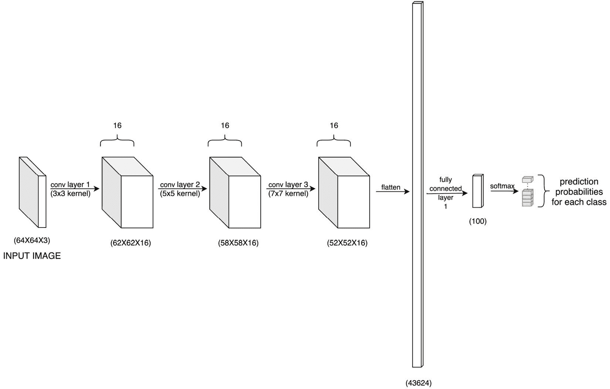

    图 3.1 – 基于空间探索的 CNN

+   **基于深度的 CNNs**：这里的**深度**指的是神经网络的深度，也就是层数。因此，这里的理念是创建一个带有多个卷积层的 CNN 模型，以提取高度复杂的视觉特征。以下图表展示了这样一个模型架构的示例：

    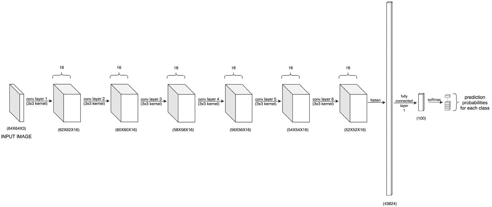

    图 3.2 – 基于深度的 CNN

+   **基于宽度的 CNNs**：**宽度**指的是数据中的通道数或特征图数量。因此，基于宽度的 CNNs 旨在从输入到输出层增加特征图的数量，如以下图表所示：

    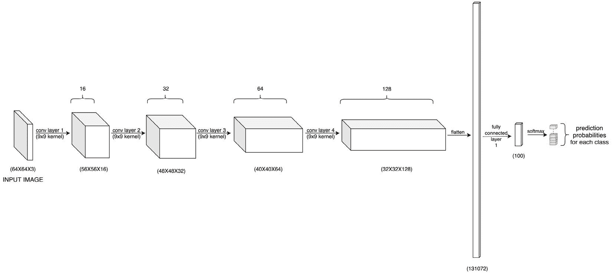

    图 3.3 – 基于宽度的 CNN

+   **基于多路径的 CNNs**：到目前为止，前面提到的三种架构在层之间的连接上是单调的，即仅存在于连续层之间的直接连接。**多路径 CNNs**引入了在非连续层之间建立快捷连接或跳跃连接的理念。以下图表展示了一个多路径 CNN 模型架构的示例：

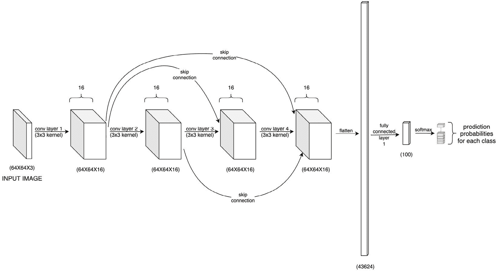

图 3.4 – 多路径 CNN

多路径架构的一个关键优势是信息在多个层之间的更好流动，这要归功于跳跃连接。这反过来也使得梯度能够回流到输入层而不会有太多损耗。

现在我们已经看过 CNN 模型中不同的架构设置，接下来我们将看看自从它们首次使用以来，CNN 如何在这些年来发展。

## CNN 架构的演变

1989 年以来，CNN 一直存在，当时第一个多层次 CNN，称为**ConvNet**，是由 Yann LeCun 开发的。这个模型可以执行视觉认知任务，如识别手写数字。1998 年，LeCun 开发了一个改进的 ConvNet 模型称为**LeNet**。由于其在光学识别任务中的高准确性，LeNet 很快就被工业界采用。从那时起，CNN 一直是最成功的机器学习模型之一，无论在工业界还是学术界。以下图表显示了从 1989 年到 2020 年 CNN 架构发展的简要时间轴：

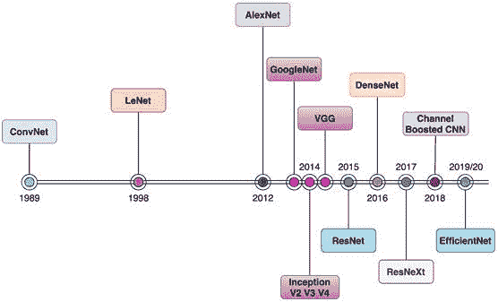

图 3.5 – CNN 架构演进 – 大局览

我们可以看到，1998 年和 2012 年之间存在显著差距。这主要是因为当时没有足够大且合适的数据集来展示 CNN，特别是深度 CNN 的能力。在当时现有的小数据集（如 MNIST）上，传统的机器学习模型如 SVM 开始击败 CNN 的性能。在这些年里，进行了一些 CNN 的发展。

ReLU 激活函数的设计旨在处理反向传播过程中的梯度爆炸和衰减问题。网络参数值的非随机初始化被证明是至关重要的。**Max-pooling**被发明作为一种有效的子采样方法。GPU 在训练神经网络，尤其是大规模 CNN 时变得流行。最后但也是最重要的是，由斯坦福研究团队创建的大规模带注释图像数据集**ImageNet** [3.1]，至今仍然是 CNN 模型的主要基准数据集之一。

随着这些发展多年来的叠加，2012 年，一种不同的架构设计在`ImageNet`数据集上显著改善了 CNN 性能。这个网络被称为**AlexNet**（以创建者 Alex Krizhevsky 命名）。AlexNet 除了具有随机裁剪和预训练等各种新颖特点外，还确立了统一和模块化卷积层设计的趋势。这种统一和模块化的层结构通过反复堆叠这些模块（卷积层）被推广，导致了非常深的 CNN，也被称为**VGGs**。

另一种分支卷积层块/模块并将这些分支块堆叠在一起的方法对定制视觉任务非常有效。这种网络被称为**GoogLeNet**（因为它是在 Google 开发的）或**Inception v1**（inception 是指那些分支块的术语）。随后出现了几个**VGG**和**Inception**网络的变体，如**VGG16**、**VGG19**、**Inception v2**、**Inception v3**等。

开发的下一阶段始于**跳跃连接**。为了解决训练 CNN 时梯度衰减的问题，非连续层通过跳跃连接连接，以免信息因小梯度而在它们之间消失。利用这一技巧出现了一种流行的网络类型，其中包括批量归一化等其他新特性，即**ResNet**。

ResNet 的一个逻辑扩展是**DenseNet**，其中各层之间密集连接，即每一层都从前面所有层的输出特征图中获取输入。此外，混合架构随后发展，结合了过去成功的架构，如**Inception-ResNet**和**ResNeXt**，其中块内的并行分支数量增加。

近年来，**通道增强**技术在提高 CNN 性能方面证明了其实用性。其思想是通过迁移学习学习新特征并利用预先学习的特征。最近，自动设计新块并找到最优 CNN 架构已成为 CNN 研究的一个趋势。这些 CNN 的例子包括**MnasNets**和**EfficientNets**。这些模型背后的方法是执行神经架构搜索，以推断具有统一模型缩放方法的最优 CNN 架构。

在接下来的部分，我们将回顾最早的一些 CNN 模型，并深入研究自那时以来发展的各种 CNN 架构。我们将使用 PyTorch 构建这些架构，训练其中一些模型并使用真实数据集。我们还将探索 PyTorch 的预训练 CNN 模型库，通常称为**模型动物园**。我们将学习如何微调这些预训练模型以及在它们上运行预测。

## 从头开始开发 LeNet

LeNet，最初称为**LeNet-5**，是最早的 CNN 模型之一，于 1998 年开发。LeNet-5 中的数字*5*代表了该模型中的总层数，即两个卷积层和三个全连接层。这个模型总共大约有 60,000 个参数，在 1998 年的手写数字图像识别任务中表现出色。与当时的经典机器学习模型（如 SVM）不同，后者将图像的每个像素分别处理，LeNet 则利用了相邻像素之间的相关性，展示了旋转、位置和尺度不变性以及对图像扭曲的鲁棒性。

请注意，尽管 LeNet 最初是为手写数字识别而开发的，但它当然可以扩展到其他图像分类任务，正如我们将在下一个练习中看到的那样。以下图显示了 LeNet 模型的架构：

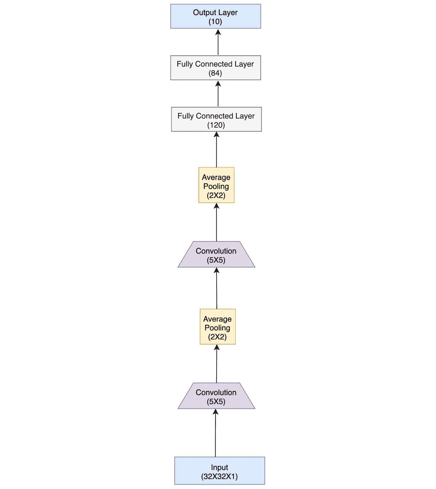

图 3.6 – LeNet 架构

正如前面提到的，图中有两个卷积层，接着是三个全连接层（包括输出层）。这种先堆叠卷积层，然后后续使用全连接层的方法后来成为 CNN 研究的趋势，并且仍然应用于最新的 CNN 模型。除了这些层外，中间还有池化层。这些基本上是减少图像表示的空间大小的子采样层，从而减少参数和计算量。LeNet 中使用的池化层是一个具有可训练权重的平均池化层。不久之后，**最大池化**成为 CNN 中最常用的池化函数。

图中每个层中括号中的数字显示了维度（对于输入、输出和全连接层）或窗口大小（对于卷积和池化层）。灰度图像的预期输入大小为 32x32 像素。然后该图像经过 5x5 的卷积核操作，接着是 2x2 的池化操作，依此类推。输出层大小为 10，代表 10 个类别。

在本节中，我们将使用 PyTorch 从头开始构建 LeNet，并在图像分类任务的图像数据集上对其进行训练和评估。我们将看到使用 PyTorch 根据*图 3.6*中的概述构建网络架构是多么简单和直观。

此外，我们将演示 LeNet 的有效性，即使在与其最初开发的数据集（即 MNIST）不同的数据集上，并且 PyTorch 如何在几行代码中轻松训练和测试模型。

### 使用 PyTorch 构建 LeNet

遵循以下步骤构建模型：

1.  对于此练习，我们需要导入几个依赖项。执行以下`import`语句：

```py
import numpy as np
import matplotlib.pyplot as plt
import torch
import torchvision
import torch.nn as nn
import torch.nn.functional as F
import torchvision.transforms as transforms
torch.use_deterministic_algorithms(True) 
```

除了通常的导入之外，我们还调用了`use_deterministic_algorithms`函数，以确保此练习的可重现性。

1.  接下来，我们将根据*图 3.6*中的概述定义模型架构：

```py
class LeNet(nn.Module):
    def __init__(self):
        super(LeNet, self).__init__()
        # 3 input image channel, 6 output feature maps and 5x5 conv kernel
        self.cn1 = nn.Conv2d(3, 6, 5)
        # 6 input image channel, 16 output feature maps and 5x5 conv kernel
        self.cn2 = nn.Conv2d(6, 16, 5)
        # fully connected layers of size 120, 84 and 10
        self.fc1 = nn.Linear(16 * 5 * 5, 120)  # 5*5 is the spatial dimension at this layer
        self.fc2 = nn.Linear(120, 84)
        self.fc3 = nn.Linear(84, 10)
    def forward(self, x):
        # Convolution with 5x5 kernel
        x = F.relu(self.cn1(x))
        # Max pooling over a (2, 2) window
        x = F.max_pool2d(x, (2, 2))
        # Convolution with 5x5 kernel
        x = F.relu(self.cn2(x))
        # Max pooling over a (2, 2) window
        x = F.max_pool2d(x, (2, 2))
        # Flatten spatial and depth dimensions into a single vector
        x = x.view(-1, self.flattened_features(x))
        # Fully connected operations
        x = F.relu(self.fc1(x))
        x = F.relu(self.fc2(x))
        x = self.fc3(x)
        return x
    def flattened_features(self, x):
        # all except the first (batch) dimension
        size = x.size()[1:]  
        num_feats = 1
        for s in size:
            num_feats *= s
        return num_feats
lenet = LeNet()
print(lenet)
```

在最后两行，我们实例化模型并打印网络架构。输出将如下所示：

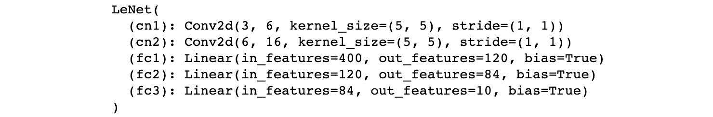

图 3.7 – LeNet PyTorch 模型对象

架构定义和运行前向传播的通常`__init__`和`forward`方法。额外的`flattened_features`方法旨在计算图像表示层（通常是卷积层或池化层的输出）中的总特征数。此方法有助于将特征的空间表示展平为单个数字向量，然后作为全连接层的输入使用。

除了前面提到的架构细节，ReLU 被用作整个网络的激活函数。与原始的 LeNet 网络相反，该模型被修改为接受 RGB 图像（即三个通道）作为输入。这样做是为了适应用于此练习的数据集。

1.  接下来我们定义训练例程，即实际的反向传播步骤：

```py
def train(net, trainloader, optim, epoch):
    # initialize loss
    loss_total = 0.0
     for i, data in enumerate(trainloader, 0):
        # get the inputs; data is a list of [inputs, labels]
        # ip refers to the input images, and ground_truth refers to the output classes the images belong to
        ip, ground_truth = data
        # zero the parameter gradients
        optim.zero_grad()
        # forward-pass + backward-pass + optimization -step
        op = net(ip)
        loss = nn.CrossEntropyLoss()(op, ground_truth)
        loss.backward()
        optim.step()
        # update loss
        loss_total += loss.item()
         # print loss statistics
        if (i+1) % 1000 == 0:    # print at the interval of 1000 mini-batches
            print('[Epoch number : %d, Mini-batches: %5d] loss: %.3f' % (epoch + 1, i + 1, loss_total / 200))
            loss_total = 0.0
```

每个 epoch，此函数会遍历整个训练数据集，通过网络进行前向传播，并使用反向传播根据指定的优化器更新模型参数。在遍历训练数据集的每 1,000 个小批次后，该方法还会记录计算得到的损失。

1.  类似于训练例程，我们将定义用于评估模型性能的测试例程：

```py
def test(net, testloader):
    success = 0
    counter = 0
    with torch.no_grad():
        for data in testloader:
            im, ground_truth = data
            op = net(im)
            _, pred = torch.max(op.data, 1)
            counter += ground_truth.size(0)
            success += (pred == ground_truth).sum().item()
    print('LeNet accuracy on 10000 images from test dataset: %d %%' % (100 * success / counter))
```

此函数为每个测试集图像执行模型的前向传播，计算正确预测的数量，并打印出测试集上的正确预测百分比。

1.  在我们开始训练模型之前，我们需要加载数据集。对于此练习，我们将使用`CIFAR-10`数据集。

> 数据集引用
> 
> > *从小图像中学习多层特征*，Alex Krizhevsky，2009

该数据集包含 60,000 个 32x32 的 RGB 图像，分为 10 个类别，每个类别 6000 张图像。这 60,000 张图像分为 50,000 张训练图像和 10,000 张测试图像。更多详细信息可以在数据集网站 [3.2] 找到。Torch 在`torchvision.datasets`模块下提供了`CIFAR`数据集。我们将使用该模块直接加载数据，并按照以下示例代码实例化训练和测试的数据加载器：

```py
# The mean and std are kept as 0.5 for normalizing pixel values as the pixel values are originally in the range 0 to 1
train_transform = transforms.Compose([transforms.RandomHorizontalFlip(),
transforms.RandomCrop(32, 4),
transforms.ToTensor(),
transforms.Normalize((0.5, 0.5, 0.5), (0.5, 0.5, 0.5))])
trainset = torchvision.datasets.CIFAR10(root='./data', train=True, download=True, transform=train_transform)
trainloader = torch.utils.data.DataLoader(trainset, batch_size=8, shuffle=True)
test_transform = transforms.Compose([transforms.ToTensor(), transforms.Normalize((0.5, 0.5, 0.5), (0.5, 0.5, 0.5))])
testset = torchvision.datasets.CIFAR10(root='./data', train=False, download=True, transform=test_transform)
testloader = torch.utils.data.DataLoader(testset, batch_size=10000, shuffle=False)
# ordering is important
classes = ('plane', 'car', 'bird', 'cat', 'deer', 'dog', 'frog', 'horse', 'ship', 'truck')
```

> 注意
> 
> > 在上一章中，我们手动下载了数据集并编写了自定义数据集类和`dataloader`函数。在这里，由于`torchvision.datasets`模块的存在，我们无需再次编写这些内容。

因为我们将`download`标志设置为`True`，数据集将被下载到本地。然后，我们将看到以下输出：

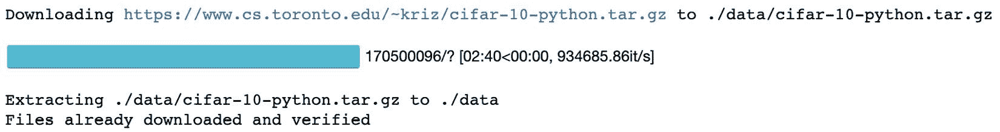

图 3.8 – CIFAR-10 数据集下载

用于训练和测试数据集的转换不同，因为我们对训练数据集应用了一些数据增强，例如翻转和裁剪，这些对测试数据集不适用。此外，在定义`trainloader`和`testloader`之后，我们使用预定义的顺序声明了该数据集中的 10 个类别。

1.  加载数据集后，让我们来看看数据的情况：

```py
# define a function that displays an image
def imageshow(image):
    # un-normalize the image
    image = image/2 + 0.5     
    npimage = image.numpy()
    plt.imshow(np.transpose(npimage, (1, 2, 0)))
    plt.show()
# sample images from training set
dataiter = iter(trainloader)
images, labels = dataiter.next()
# display images in a grid
num_images = 4
imageshow(torchvision.utils.make_grid(images[:num_images]))
# print labels
print('    '+'  ||  '.join(classes[labels[j]] for j in range(num_images)))
```

上述代码展示了来自训练数据集的四个样本图像及其相应的标签。输出将如下所示：

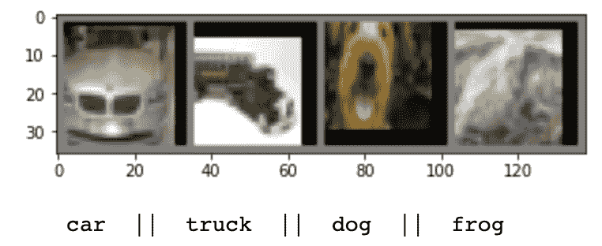

图 3.9 – CIFAR-10 数据集样本

上述输出展示了四张颜色图像，每张图像大小为 32x32 像素。这四张图片属于四个不同的标签，如下文所示。

现在我们将训练 LeNet 模型。

### 训练 LeNet

让我们通过以下步骤训练模型：

1.  我们将定义 `optimizer` 并开始如下的训练循环：

```py
# define optimizer
optim = torch.optim.Adam(lenet.parameters(), lr=0.001)
# training loop over the dataset multiple times
for epoch in range(50):  
    train(lenet, trainloader, optim, epoch)
    print()
    test(lenet, testloader)
    print()
print('Finished Training')
```

输出如下所示：

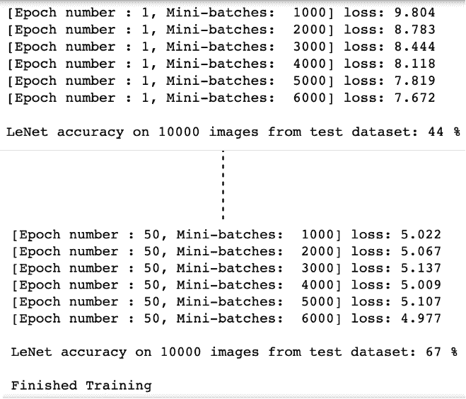

图 3.10 – 训练 LeNet

1.  训练完成后，我们可以将模型文件保存到本地：

```py
model_path = './cifar_model.pth'
torch.save(lenet.state_dict(), model_path)
```

在训练完 LeNet 模型后，我们将在下一节中测试其在测试数据集上的表现。

### 测试 LeNet

测试 LeNet 模型需要遵循以下步骤：

1.  通过加载保存的模型并在测试数据集上运行，让我们进行预测：

```py
# load test dataset images
d_iter = iter(testloader)
im, ground_truth = d_iter.next()
# print images and ground truth
imageshow(torchvision.utils.make_grid(im[:4]))
print('Label:      ', ' '.join('%5s' % classes[ground_truth[j]] for j in range(4)))
# load model
lenet_cached = LeNet()
lenet_cached.load_state_dict(torch.load(model_path))
# model inference
op = lenet_cached(im)
# print predictions
_, pred = torch.max(op, 1)
print('Prediction: ', ' '.join('%5s' % classes[pred[j]] for j in range(4)))
```

输出如下所示：

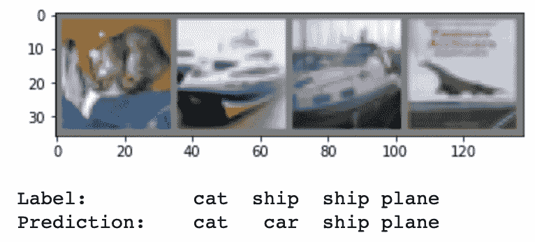

图 3.11 – LeNet 预测

显然，四次预测中有三次是正确的。

1.  最后，我们将检查该模型在测试数据集上的总体准确度以及每类准确度：

```py
success = 0
counter = 0
with torch.no_grad():
    for data in testloader:
        im, ground_truth = data
        op = lenet_cached(im)
        _, pred = torch.max(op.data, 1)
        counter += ground_truth.size(0)
        success += (pred == ground_truth).sum().item()
print('Model accuracy on 10000 images from test dataset: %d %%' % (
    100 * success / counter))
```

输出如下所示：

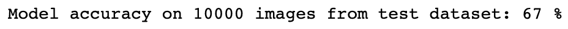

图 3.12 – LeNet 总体准确度

1.  对于每类准确度，代码如下：

```py
class_sucess = list(0\. for i in range(10))
class_counter = list(0\. for i in range(10))
with torch.no_grad():
    for data in testloader:
        im, ground_truth = data
        op = lenet_cached(im)
        _, pred = torch.max(op, 1)
        c = (pred == ground_truth).squeeze()
        for i in range(10000):
            ground_truth_curr = ground_truth[i]
            class_sucess[ground_truth_curr] += c[i].item()
            class_counter[ground_truth_curr] += 1
for i in range(10):
    print('Model accuracy for class %5s : %2d %%' % (
        classes[i], 100 * class_sucess[i] / class_counter[i]))
```

输出如下所示：

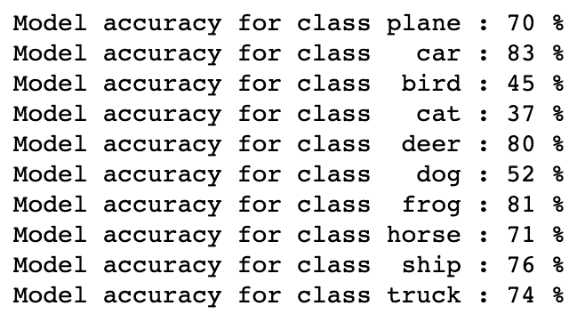

图 3.13 – LeNet 每类准确度

有些类别的表现比其他类别好。总体而言，该模型远非完美（即 100% 准确率），但比随机预测的模型要好得多，后者的准确率为 10%（由于有 10 个类别）。

在从头开始构建 LeNet 模型并评估其在 PyTorch 中的表现后，我们现在将转向 LeNet 的后继者 – **AlexNet**。对于 LeNet，我们从头开始构建了模型，进行了训练和测试。对于 AlexNet，我们将使用预训练模型，对其在较小数据集上进行微调，并进行测试。

## 对 AlexNet 模型进行微调

在本节中，我们首先快速浏览 AlexNet 的架构以及如何使用 PyTorch 构建一个。然后我们将探索 PyTorch 的预训练 CNN 模型库，最后，使用预训练的 AlexNet 模型进行微调，用于图像分类任务以及进行预测。

AlexNet 是 LeNet 的后继者，其架构有所增强，例如由 5 层（5 个卷积层和 3 个全连接层）增加到 8 层，并且模型参数从 6 万增加到 6000 万，同时使用 `MaxPool` 而不是 `AvgPool`。此外，AlexNet 是在更大的数据集 ImageNet 上训练和测试的，ImageNet 数据集超过 100 GB，而 LeNet 是在 MNIST 数据集上训练的，后者只有几 MB 大小。AlexNet 在图像相关任务中显著领先于其他传统机器学习模型，如 SVM。*图 3.14* 展示了 AlexNet 的架构：

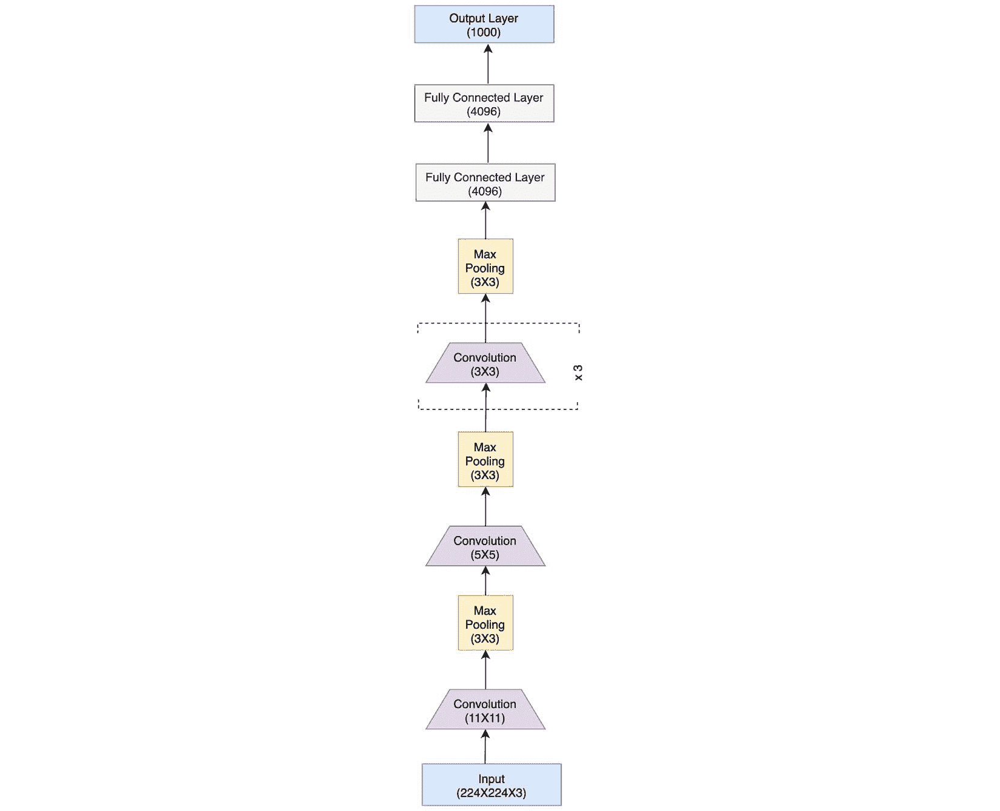

图 3.14 – AlexNet 架构

如我们所见，该架构遵循了 LeNet 的常见主题，即由卷积层顺序堆叠，然后是一系列全连接层朝向输出端。PyTorch 使得将这样的模型架构转化为实际代码变得容易。可以在以下 PyTorch 代码中看到这一点- 该架构的等效代码：

```py
class AlexNet(nn.Module):
    def __init__(self, number_of_classes):
        super(AlexNet, self).__init__()
        self.feats = nn.Sequential(
            nn.Conv2d(in_channels=3, out_channels=64, kernel_size=11, stride=4, padding=5),
            nn.ReLU(),
            nn.MaxPool2d(kernel_size=2, stride=2),
            nn.Conv2d(in_channels=64, out_channels=192, kernel_size=5, padding=2),
            nn.ReLU(),
            nn.MaxPool2d(kernel_size=2, stride=2),
            nn.Conv2d(in_channels=192, out_channels=384, kernel_size=3, padding=1),
            nn.ReLU(),
            nn.Conv2d(in_channels=384, out_channels=256, kernel_size=3, padding=1),
            nn.ReLU(),
            nn.Conv2d(in_channels=256, out_channels=256, kernel_size=3, padding=1),
            nn.ReLU(),
            nn.MaxPool2d(kernel_size=2, stride=2),
        )
        self.clf = nn.Linear(in_features=256, out_features=number_of_classes)
    def forward(self, inp):
        op = self.feats(inp)
        op = op.view(op.size(0), -1)
        op = self.clf(op)
        return op
```

代码相当自解释，`__init__`函数包含了整个分层结构的初始化，包括卷积、池化和全连接层，以及 ReLU 激活函数。`forward`函数简单地通过初始化的网络运行数据点*x*。请注意，`forward`方法的第二行已经执行了扁平化操作，因此我们无需像为 LeNet 那样单独定义该函数。

除了初始化模型架构并自行训练的选项外，PyTorch 还提供了一个`torchvision`包，其中包含用于解决不同任务（如图像分类、语义分割、目标检测等）的 CNN 模型的定义。以下是用于图像分类任务的可用模型的非详尽列表 [3.3]：

+   AlexNet

+   VGG

+   ResNet

+   SqueezeNet

+   DenseNet

+   Inception v3

+   GoogLeNet

+   ShuffleNet v2

+   MobileNet v2

+   ResNeXt

+   Wide ResNet

+   MNASNet

+   EfficientNet

在接下来的部分，我们将使用一个预训练的 AlexNet 模型作为示例，并展示如何使用 PyTorch 对其进行微调，形式上是一个练习。

### 使用 PyTorch 对 AlexNet 进行微调

在接下来的练习中，我们将加载一个预训练的 AlexNet 模型，并在一个与 ImageNet 不同的图像分类数据集上进行微调。最后，我们将测试微调后模型的性能，看它是否能够从新数据集中进行迁移学习。练习中的部分代码为了可读性而进行了修剪，但你可以在我们的 github 库[3.4]中找到完整的代码。

对于这个练习，我们需要导入几个依赖项。执行以下`import`语句：

```py
import os
import time
import copy
import numpy as np
import matplotlib.pyplot as plt
import torch
import torchvision
import torch.nn as nn
import torch.optim as optim
from torch.optim import lr_scheduler
from torchvision import datasets, models, transforms
torch.use_deterministic_algorithms(True) 
```

接下来，我们将下载并转换数据集。对于这次的微调练习，我们将使用一个小型的昆虫图像数据集，包括蜜蜂和蚂蚁。共有 240 张训练图像和 150 张验证图像，均等分为两类（蜜蜂和蚂蚁）。

我们从 kaggel [3.5]下载数据集，并存储在当前工作目录中。有关数据集的更多信息可以在数据集的网站[3.6]找到。

> 数据集引用
> 
> > Elsik CG, Tayal A, Diesh CM, Unni DR, Emery ML, Nguyen HN, Hagen DE。Hymenoptera Genome Database：在 HymenopteraMine 中整合基因组注释。Nucleic Acids Research 2016 年 1 月 4 日;44(D1):D793-800。doi: 10.1093/nar/gkv1208。在线发表于 2015 年 11 月 17 日。PubMed PMID: 26578564。

为了下载数据集，您需要登录 Kaggle。如果您还没有 Kaggle 账户，您需要注册：

```py
ddir = 'hymenoptera_data'
# Data normalization and augmentation transformations for train dataset
# Only normalization transformation for validation dataset
# The mean and std for normalization are calculated as the mean of all pixel values for all images in the training set per each image channel - R, G and B
data_transformers = {
    'train': transforms.Compose([transforms.RandomResizedCrop(224), transforms.RandomHorizontalFlip(),
                                    transforms.ToTensor(),
                                    transforms.Normalize([0.490, 0.449, 0.411], [0.231, 0.221, 0.230])]),
    'val': transforms.Compose([transforms.Resize(256), transforms.CenterCrop(224), transforms.ToTensor(), transforms.Normalize([0.490, 0.449, 0.411], [0.231, 0.221, 0.230])])}
img_data = {k: datasets.ImageFolder(os.path.join(ddir, k), data_transformers[k]) for k in ['train', 'val']}
dloaders = {k: torch.utils.data.DataLoader(img_data[k], batch_size=8, shuffle=True)
            for k in ['train', 'val']}
dset_sizes = {x: len(img_data[x]) for x in ['train', 'val']}
classes = img_data['train'].classes
dvc = torch.device("cuda:0" if torch.cuda.is_available() else "cpu")
```

现在我们已经完成了先决条件，让我们开始吧：

1.  让我们可视化一些样本训练数据集图像：

```py
def imageshow(img, text=None):
    img = img.numpy().transpose((1, 2, 0))
    avg = np.array([0.490, 0.449, 0.411])
    stddev = np.array([0.231, 0.221, 0.230])
    img = stddev * img + avg
    img = np.clip(img, 0, 1)
    plt.imshow(img)
    if text is not None:
        plt.title(text)
# Generate one train dataset batch
imgs, cls = next(iter(dloaders['train']))
# Generate a grid from batch
grid = torchvision.utils.make_grid(imgs)
imageshow(grid, text=[classes[c] for c in cls])
```

输出如下所示：

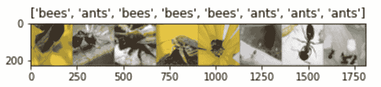

图 3.15 – 蜜蜂与蚂蚁数据集

1.  现在我们定义微调例程，这本质上是在预训练模型上执行的训练例程：

```py
def finetune_model(pretrained_model, loss_func, optim, epochs=10):
    ...
    for e in range(epochs):
        for dset in ['train', 'val']:
            if dset == 'train':
                pretrained_model.train()  # set model to train mode (i.e. trainbale weights)
            else:
                pretrained_model.eval()   # set model to validation mode
            # iterate over the (training/validation) data.
            for imgs, tgts in dloaders[dset]:
                ...
                optim.zero_grad()
                with torch.set_grad_enabled(dset == 'train'):
                    ops = pretrained_model(imgs)
                    _, preds = torch.max(ops, 1)
                    loss_curr = loss_func(ops, tgts)
                    # backward pass only if in training mode
                    if dset == 'train':
                        loss_curr.backward()
                        optim.step()
                loss += loss_curr.item() * imgs.size(0)
                successes += torch.sum(preds == tgts.data)
            loss_epoch = loss / dset_sizes[dset]
            accuracy_epoch = successes.double() / dset_sizes[dset]
            if dset == 'val' and accuracy_epoch > accuracy:
                accuracy = accuracy_epoch
                model_weights = copy.deepcopy(pretrained_model.state_dict())
    # load the best model version (weights)
    pretrained_model.load_state_dict(model_weights)
    return pretrained_model
```

在这个函数中，我们需要预训练模型（即架构和权重）作为输入，还需要损失函数、优化器和 epoch 数。基本上，我们不是从随机初始化权重开始，而是从 AlexNet 的预训练权重开始。这个函数的其他部分与我们之前的练习非常相似。

1.  在开始微调（训练）模型之前，我们将定义一个函数来可视化模型预测：

```py
def visualize_predictions(pretrained_model, max_num_imgs=4):
    was_model_training = pretrained_model.training
    pretrained_model.eval()
    imgs_counter = 0
    fig = plt.figure()
    with torch.no_grad():
        for i, (imgs, tgts) in enumerate(dloaders['val']):
            imgs = imgs.to(dvc)
            tgts = tgts.to(dvc)
            ops = pretrained_model(imgs)
            _, preds = torch.max(ops, 1)
             for j in range(imgs.size()[0]):
                imgs_counter += 1
                ax = plt.subplot(max_num_imgs//2, 2, imgs_counter)
                ax.axis('off')
                ax.set_title(f'Prediction: {class_names[preds[j]]}, Ground Truth: {class_names[tgts[j]]}')
                imshow(inputs.cpu().data[j])
                if imgs_counter == max_num_imgs:
pretrained_model.train(mode=was_training)
                    return
        model.train(mode=was_training)
```

1.  最后，我们来到了有趣的部分。让我们使用 PyTorch 的 `torchvision.models` 子包加载预训练的 AlexNet 模型：

```py
model_finetune = models.alexnet(pretrained=True)
```

该模型对象有以下两个主要组件：

i) `features`: 特征提取组件，包含所有卷积和池化层

ii) `classifier`: 分类器块，包含所有通向输出层的全连接层

1.  我们可以像这样可视化这些组件：

```py
print(model_finetune.features)
```

应该输出如下内容：

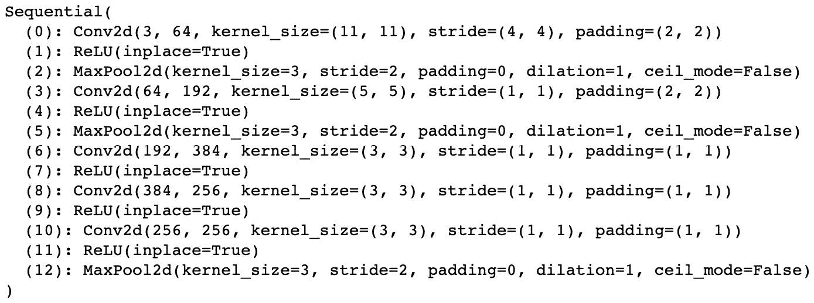

图 3.16 – AlexNet 特征提取器

1.  接下来，我们检查 `classifier` 块如下所示：

```py
print(model_finetune.classifier)
```

应该输出如下内容：

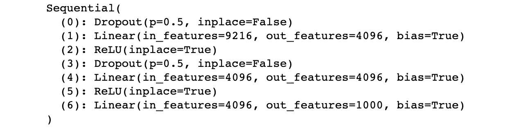

图 3.17 – AlexNet 分类器

1.  正如您可能注意到的那样，预训练模型的输出层大小为 `1000`，但我们在微调数据集中只有 `2` 类。因此，我们将进行修改，如下所示：

```py
# change the last layer from 1000 classes to 2 classes
model_finetune.classifier[6] = nn.Linear(4096, len(classes))
```

1.  现在，我们准备定义优化器和损失函数，并随后运行训练例程，如下所示：

```py
loss_func = nn.CrossEntropyLoss()
optim_finetune = optim.SGD(model_finetune.parameters(), lr=0.0001)
# train (fine-tune) and validate the model
model_finetune = finetune_model(model_finetune, loss_func, optim_finetune, epochs=10)
```

输出如下所示：

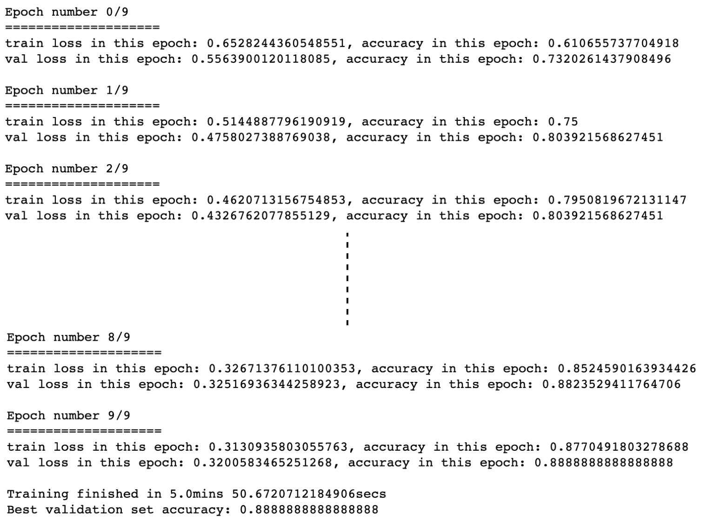

图 3.18 – AlexNet 微调循环

1.  让我们可视化一些模型预测结果，看看模型是否确实学习了来自这个小数据集的相关特征：

```py
visualize_predictions(model_finetune)
```

应该输出如下内容：

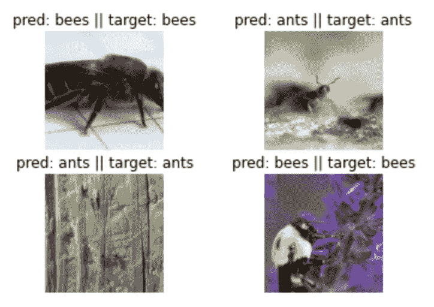

图 3.19 – AlexNet 预测

显然，预训练的 AlexNet 模型已经能够在这个相当小的图像分类数据集上进行迁移学习。这既展示了迁移学习的强大之处，也展示了使用 PyTorch 很快和轻松地微调已知模型的速度。

在下一节中，我们将讨论 AlexNet 的更深入和更复杂的后继者 – VGG 网络。我们已经详细展示了 LeNet 和 AlexNet 的模型定义、数据集加载、模型训练（或微调）和评估步骤。在随后的章节中，我们将主要关注模型架构的定义，因为 PyTorch 代码在其他方面（如数据加载和评估）将是类似的。

## 运行预训练的 VGG 模型

我们已经讨论了 LeNet 和 AlexNet，这两个基础的 CNN 架构。随着章节的进展，我们将探索越来越复杂的 CNN 模型。虽然在构建这些模型架构时的关键原则是相同的。我们将看到在组合卷积层、池化层和全连接层到块/模块中以及顺序或分支堆叠这些块/模块时的模块化模型构建方法。在本节中，我们将看到 AlexNet 的继任者 – VGGNet。

名称 VGG 源自于**牛津大学视觉几何组**，这个模型在那里被发明。相比于 AlexNet 的 8 层和 6000 万参数，VGG 由 13 层（10 个卷积层和 3 个全连接层）和 1.38 亿参数组成。VGG 基本上在 AlexNet 架构上堆叠更多层，使用较小尺寸的卷积核（2x2 或 3x3）。因此，VGG 的新颖之处在于它带来的前所未有的深度。*图 3.20* 展示了 VGG 的架构：

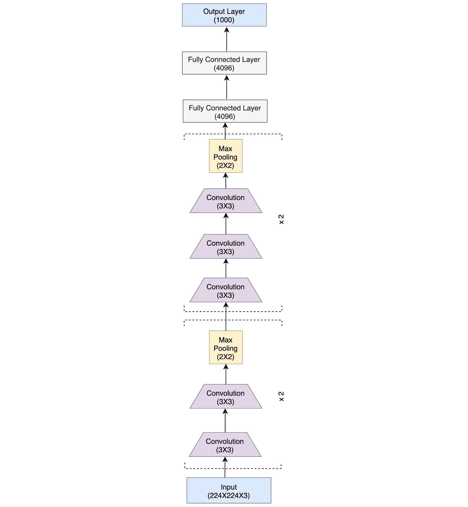

图 3.20 – VGG16 架构

前述的 VGG 架构被称为**VGG13**，因为它有 13 层。其他变体包括 VGG16 和 VGG19，分别包含 16 层和 19 层。还有另一组变体 – **VGG13_bn**、**VGG16_bn** 和 **VGG19_bn**，其中 **bn** 表示这些模型也包含**批处理归一化层**。

PyTorch 的`torchvision.model`子包提供了在 ImageNet 数据集上训练的预训练`VGG`模型（包括前述的六个变体）。在下面的练习中，我们将使用预训练的`VGG13`模型对一小组蚂蚁和蜜蜂（用于前面的练习）进行预测。我们将专注于这里的关键代码部分，因为我们的大部分代码将与之前的练习重叠。我们可以随时查阅我们的笔记本来探索完整的代码 [3.7]：

1.  首先，我们需要导入依赖项，包括`torchvision.models`。

1.  下载数据并设置蚂蚁和蜜蜂数据集以及数据加载器，同时进行转换。

1.  为了对这些图像进行预测，我们需要下载 ImageNet 数据集的 1,000 个标签 [3.8] 。

1.  下载后，我们需要创建类索引 0 到 999 和相应类标签之间的映射，如下所示：

```py
import ast
with open('./imagenet1000_clsidx_to_labels.txt') as f:
    classes_data = f.read()
classes_dict = ast.literal_eval(classes_data)
print({k: classes_dict[k] for k in list(classes_dict)[:5]})
```

这应该输出前五个类映射，如下截图所示：

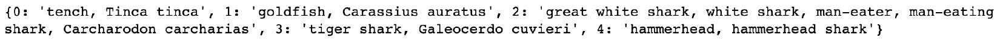

图 3.21 – ImageNet 类映射

1.  定义模型预测可视化函数，该函数接受预训练模型对象和要运行预测的图像数量。该函数应输出带有预测的图像。

1.  加载预训练的`VGG13`模型：

```py
model_finetune = models.vgg13(pretrained=True)
```

这应该输出以下内容：

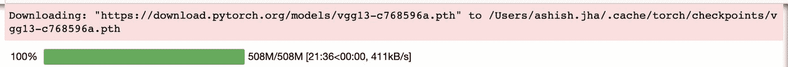

图 3.22 – 加载 VGG13 模型

`VGG13`模型在这一步下载完成。

> 常见问题 - VGG13 模型的磁盘大小是多少？
> 
> > VGG13 模型在您的硬盘上大约占用 508 MB。

1.  最后，我们使用这个预训练模型对我们的蚂蚁和蜜蜂数据集进行预测：

```py
visualize_predictions(model_finetune)
```

这应该输出以下内容：

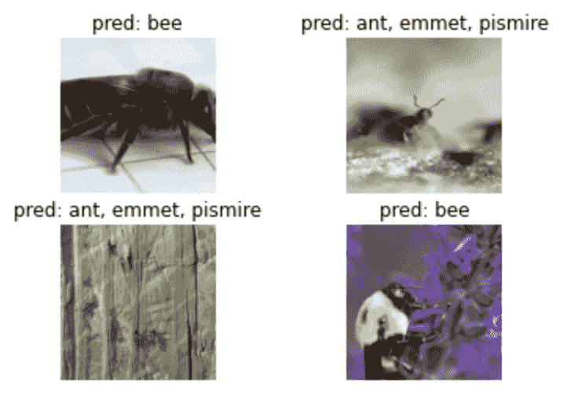

图 3.23 – VGG13 预测

在完全不同的数据集上训练的`VGG13`模型似乎能够在蚂蚁和蜜蜂数据集上正确预测所有测试样本。基本上，该模型从数据集中提取了两个最相似的动物，并在图像中找到它们。通过这个练习，我们看到模型仍能从图像中提取相关的视觉特征，并且这个练习展示了 PyTorch 的开箱即用推断功能的实用性。

在下一节中，我们将研究一种不同类型的 CNN 架构 - 这种架构涉及具有多个并行卷积层的模块。这些模块被称为**Inception 模块**，生成的网络被称为**Inception 网络**。我们将探索该网络的各个部分以及其成功背后的原因。我们还将使用 PyTorch 构建 Inception 模块和 Inception 网络架构。

## 探索 GoogLeNet 和 Inception v3

我们迄今为止已经发现了从 LeNet 到 VGG 的 CNN 模型的发展过程，观察到了更多卷积层和全连接层的顺序堆叠。这导致了参数众多的深度网络需要训练。*GoogLeNet*以一种完全不同的 CNN 架构出现，由称为 inception 模块的并行卷积层模块组成。正因为如此，GoogLeNet 也被称为**Inception v1**（v1 标志着后续出现了更多版本）。GoogLeNet 引入的一些显著新元素包括以下内容：

+   **inception 模块** – 由几个并行卷积层组成的模块

+   使用**1x1 卷积**来减少模型参数数量

+   **全局平均池化**而不是完全连接层 – 减少过拟合

+   使用**辅助分类器**进行训练 - 用于正则化和梯度稳定性

GoogLeNet 有 22 层，比任何 VGG 模型变体的层数都多。然而，由于使用了一些优化技巧，GoogLeNet 中的参数数量为 500 万，远少于 VGG 的 1.38 亿参数。让我们更详细地介绍一些这个模型的关键特性。

### Inception 模块

或许这个模型最重要的贡献之一是开发了一个卷积模块，其中包含多个并行运行的卷积层，最终将它们串联以产生单个输出向量。这些并行卷积层使用不同的核大小，从 1x1 到 3x3 到 5x5。其想法是从图像中提取所有级别的视觉信息。除了这些卷积层外，一个 3x3 的最大池化层还增加了另一级特征提取。*Figure 3.24*展示了 Inception 模块的块图以及整体的 GoogLeNet 架构：

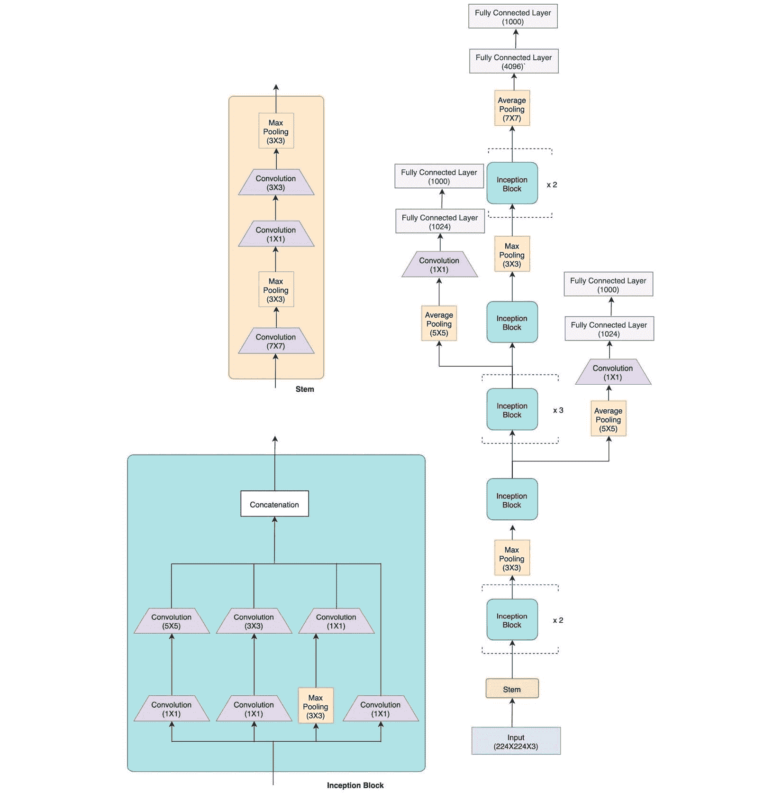

Figure 3.24 – GoogLeNet 架构

利用这个架构图，我们可以在 PyTorch 中构建 Inception 模块，如下所示：

```py
class InceptionModule(nn.Module):
    def __init__(self, input_planes, n_channels1x1, n_channels3x3red, n_channels3x3, n_channels5x5red, n_channels5x5, pooling_planes):
        super(InceptionModule, self).__init__()
        # 1x1 convolution branch
        self.block1 = nn.Sequential(
            nn.Conv2d(input_planes, n_channels1x1, kernel_size=1),nn.BatchNorm2d(n_channels1x1),nn.ReLU(True),)
        # 1x1 convolution -> 3x3 convolution branch
        self.block2 = nn.Sequential(
            nn.Conv2d(input_planes, n_channels3x3red, kernel_size=1),nn.BatchNorm2d(n_channels3x3red),
            nn.ReLU(True),nn.Conv2d(n_channels3x3red, n_channels3x3, kernel_size=3, padding=1),nn.BatchNorm2d(n_channels3x3),nn.ReLU(True),)
        # 1x1 conv -> 5x5 conv branch
        self.block3 = nn.Sequential(
            nn.Conv2d(input_planes, n_channels5x5red, kernel_size=1),nn.BatchNorm2d(n_channels5x5red),nn.ReLU(True),
            nn.Conv2d(n_channels5x5red, n_channels5x5, kernel_size=3, padding=1),nn.BatchNorm2d(n_channels5x5),nn.ReLU(True),
            nn.Conv2d(n_channels5x5, n_channels5x5, kernel_size=3, padding=1),nn.BatchNorm2d(n_channels5x5),
            nn.ReLU(True),)
        # 3x3 pool -> 1x1 conv branch
        self.block4 = nn.Sequential(
            nn.MaxPool2d(3, stride=1, padding=1),
            nn.Conv2d(input_planes, pooling_planes, kernel_size=1),
            nn.BatchNorm2d(pooling_planes),
            nn.ReLU(True),)
    def forward(self, ip):
        op1 = self.block1(ip)
        op2 = self.block2(ip)
        op3 = self.block3(ip)
        op4 = self.block4(ip)
        return torch.cat([op1,op2,op3,op4], 1)
```

接下来，我们将看另一个 GoogLeNet 的重要特性 – 1x1 卷积。

### 1x1 卷积

除了 Inception 模块中的并行卷积层外，每个并行层还有一个前置的**1x1 卷积层**。使用这些 1x1 卷积层的原因是*降维*。1x1 卷积不改变图像表示的宽度和高度，但可以改变图像表示的深度。这个技巧用于在并行进行 1x1、3x3 和 5x5 卷积之前减少输入视觉特征的深度。减少参数数量不仅有助于构建更轻量的模型，还有助于对抗过拟合。

### 全局平均池化

如果我们看一下*Figure 3.24*中的整体 GoogLeNet 架构，模型的倒数第二输出层之前是一个 7x7 平均池化层。这一层再次帮助减少模型的参数数量，从而减少过拟合。如果没有这一层，由于完全连接层的密集连接，模型将具有数百万额外的参数。

### 辅助分类器

*Figure 3.24* 还展示了模型中的两个额外或辅助输出分支。这些辅助分类器旨在通过在反向传播过程中增加梯度的幅度来解决梯度消失问题，尤其是对于靠近输入端的层次。由于这些模型具有大量层次，梯度消失可能成为一个瓶颈。因此，使用辅助分类器已被证明对这个 22 层深的模型非常有用。此外，辅助分支还有助于正则化。请注意，在进行预测时这些辅助分支是关闭/丢弃的。

一旦我们用 PyTorch 定义了 Inception 模块，我们可以如下轻松地实例化整个 Inception v1 模型：

```py
class GoogLeNet(nn.Module):
    def __init__(self):
        super(GoogLeNet, self).__init__()
        self.stem = nn.Sequential(
            nn.Conv2d(3, 192, kernel_size=3, padding=1),
            nn.BatchNorm2d(192),
            nn.ReLU(True),)
        self.im1 = InceptionModule(192,  64,  96, 128, 16, 32, 32)
        self.im2 = InceptionModule(256, 128, 128, 192, 32, 96, 64)
        self.max_pool = nn.MaxPool2d(3, stride=2, padding=1)
        self.im3 = InceptionModule(480, 192,  96, 208, 16,  48,  64)
        self.im4 = InceptionModule(512, 160, 112, 224, 24,  64,  64)
        self.im5 = InceptionModule(512, 128, 128, 256, 24,  64,  64)
        self.im6 = InceptionModule(512, 112, 144, 288, 32,  64,  64)
        self.im7 = InceptionModule(528, 256, 160, 320, 32, 128, 128)
        self.im8 = InceptionModule(832, 256, 160, 320, 32, 128, 128)
        self.im9 = InceptionModule(832, 384, 192, 384, 48, 128, 128)
        self.average_pool = nn.AvgPool2d(7, stride=1)
        self.fc = nn.Linear(4096, 1000)
    def forward(self, ip):
        op = self.stem(ip)
        out = self.im1(op)
        out = self.im2(op)
        op = self.maxpool(op)
        op = self.a4(op)
        op = self.b4(op)
        op = self.c4(op)
        op = self.d4(op)
        op = self.e4(op)
        op = self.max_pool(op)
        op = self.a5(op)
        op = self.b5(op)
        op = self.avgerage_pool(op)
        op = op.view(op.size(0), -1)
        op = self.fc(op)
        return op
```

除了实例化我们自己的模型外，我们还可以只用两行代码加载预训练的 GoogLeNet：

```py
import torchvision.models as models
model = models.googlenet(pretrained=True)
```

最后，如前所述，后来开发了多个版本的 Inception 模型。其中一个显赫的是 Inception v3，我们接下来将简要讨论它。

### Inception v3

这是 Inception v1 的后继者，总共有 2400 万个参数，而 v1 中仅有 500 万个参数。除了增加了几个更多的层外，该模型引入了不同种类的 Inception 模块，这些模块按顺序堆叠。*图 3.25* 展示了不同的 Inception 模块和完整的模型架构：

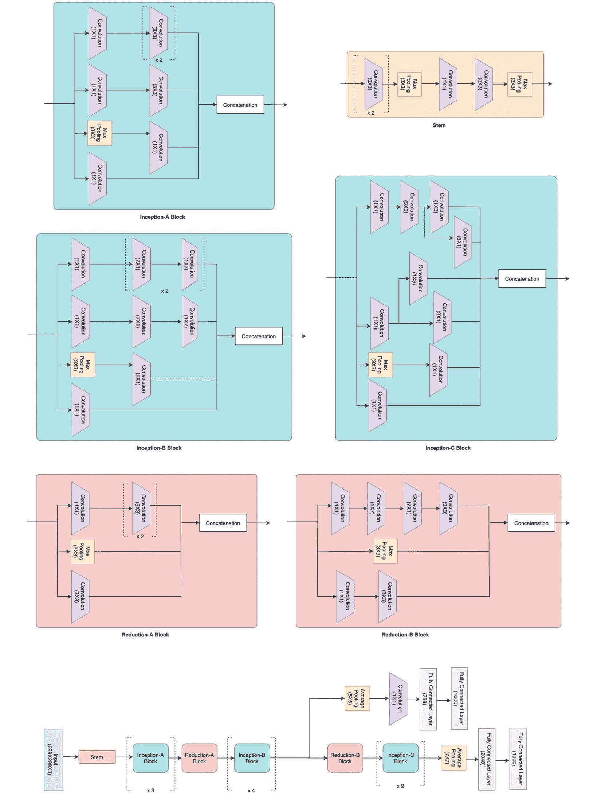

图 3.25 – Inception v3 架构

从架构中可以看出，该模型是 Inception v1 模型的架构扩展。除了手动构建模型外，我们还可以按如下方式使用 PyTorch 的预训练模型：

```py
import torchvision.models as models
model = models.inception_v3(pretrained=True)
```

在下一节中，我们将详细讨论在非常深的 CNNs 中有效对抗消失梯度问题的 CNN 模型的类别 – **ResNet** 和 **DenseNet**。我们将学习跳跃连接和密集连接的新技术，并使用 PyTorch 编写这些先进架构背后的基础模块。

## 讨论 ResNet 和 DenseNet 架构

在前一节中，我们探讨了 Inception 模型，随着层数的增加，由于 1x1 卷积和全局平均池化的使用，模型参数数量减少。此外，还使用了辅助分类器来对抗消失梯度问题。

ResNet 引入了 **跳跃连接** 的概念。这个简单而有效的技巧克服了参数溢出和消失梯度问题。如下图所示，其思想非常简单。首先，输入经过非线性变换（卷积后跟非线性激活），然后将这个变换的输出（称为残差）加到原始输入上。每个这样的计算块称为 **残差块**，因此模型被称为 **残差网络** 或 **ResNet**。

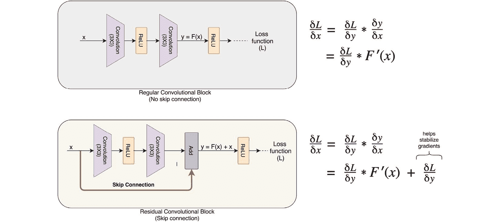

图 3.26 – 跳跃连接

使用这些跳跃（或快捷）连接，参数数量仅限于 2600 万个参数，共计 50 层（ResNet-50）。由于参数数量有限，即使层数增至 152 层（ResNet-152），ResNet 仍然能够很好地泛化，而不会过拟合。以下图表显示了 ResNet-50 的架构：

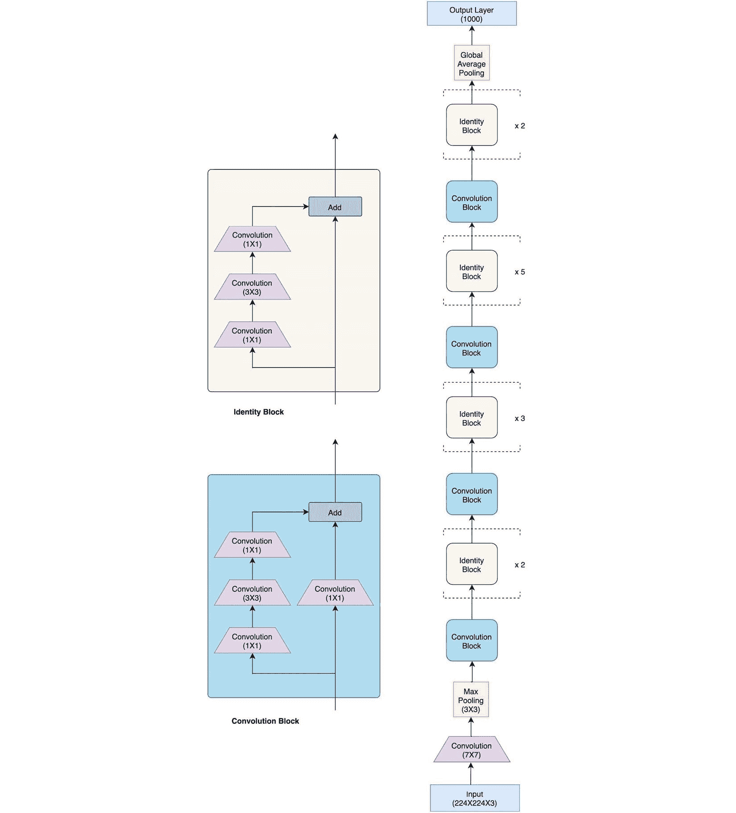

图 3.27 – ResNet 架构

有两种残差块 – **卷积** 和 **恒等**，两者均具有跳跃连接。对于卷积块，还添加了一个额外的 1x1 卷积层，这进一步有助于降低维度。在 PyTorch 中，可以如下实现 ResNet 的残差块：

```py
class BasicBlock(nn.Module):
    multiplier=1
    def __init__(self, input_num_planes, num_planes, strd=1):
        super(BasicBlock, self).__init__()
        self.conv_layer1 = nn.Conv2d(in_channels=input_num_planes, out_channels=num_planes, kernel_size=3, stride=stride, padding=1, bias=False)
        self.batch_norm1 = nn.BatchNorm2d(num_planes)
        self.conv_layer2 = nn.Conv2d(in_channels=num_planes, out_channels=num_planes, kernel_size=3, stride=1, padding=1, bias=False)
        self.batch_norm2 = nn.BatchNorm2d(num_planes)
        self.res_connnection = nn.Sequential()
        if strd > 1 or input_num_planes != self.multiplier*num_planes:
            self.res_connnection = nn.Sequential(
                nn.Conv2d(in_channels=input_num_planes, out_channels=self.multiplier*num_planes, kernel_size=1, stride=strd, bias=False),
                nn.BatchNorm2d(self.multiplier*num_planes))
    def forward(self, inp):
        op = F.relu(self.batch_norm1(self.conv_layer1(inp)))
        op = self.batch_norm2(self.conv_layer2(op))
        op += self.res_connnection(inp)
        op = F.relu(op)
        return op
```

要快速开始使用 ResNet，我们可以随时从 PyTorch 的仓库中使用预训练的 ResNet 模型：

```py
import torchvision.models as models
model = models.resnet50(pretrained=True)
```

ResNet 使用身份函数（通过直接连接输入到输出）来在反向传播过程中保持梯度（梯度将为 1）。然而，对于极深的网络，这个原则可能不足以保持从输出层到输入层的强梯度。

我们接下来将讨论的 CNN 模型旨在确保强大的梯度流动，以及进一步减少所需参数的数量。

### DenseNet

ResNet 的跳跃连接将残差块的输入直接连接到其输出。但是，残差块之间的连接仍然是顺序的，即残差块 3 与块 2 有直接连接，但与块 1 没有直接连接。

DenseNet 或密集网络引入了将每个卷积层与称为**密集块**的每个其他层连接的想法。并且每个密集块都与整体 DenseNet 中的每个其他密集块连接。密集块只是两个 3x3 密集连接的卷积层的模块。

这些密集连接确保每一层都从网络中所有前面的层接收信息。这确保了从最后一层到第一层有一个强大的梯度流动。出乎意料的是，这种网络设置的参数数量也很低。由于每一层都从前面所有层的特征图中接收到信息，所需的通道数（深度）可以更少。在早期的模型中，增加的深度代表了从早期层积累的信息，但现在我们不再需要这些，多亏了网络中到处存在的密集连接。

ResNet 和 DenseNet 之间的一个关键区别是，在 ResNet 中，输入通过跳跃连接添加到输出中。但在 DenseNet 中，前面层的输出与当前层的输出串联在一起。并且串联是在深度维度上进行的。

随着网络的进一步进行，输出大小的急剧增加可能会引发一个问题。为了抵消这种累积效应，为这个网络设计了一种特殊类型的块，称为**过渡块**。由 1x1 卷积层和随后的 2x2 池化层组成，这个块标准化或重置深度维度的大小，以便将该块的输出馈送到后续的稠密块。下图显示了 DenseNet 的架构：

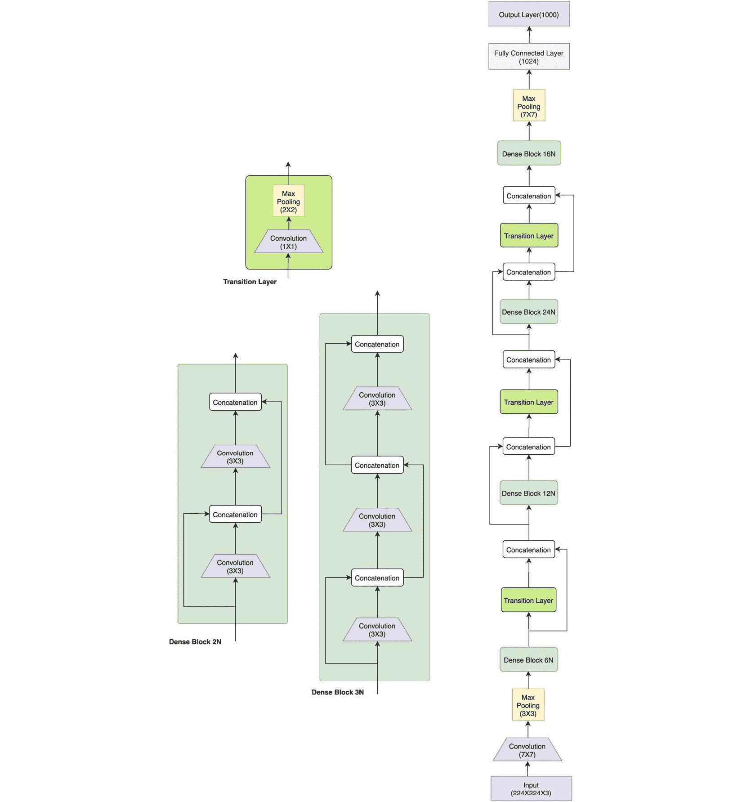

图 3.28 - DenseNet 架构

正如前面提到的，涉及两种类型的块 - **密集块**和**过渡块**。这些块可以写成 PyTorch 中的几行代码，如下所示：

```py
class DenseBlock(nn.Module):
    def __init__(self, input_num_planes, rate_inc):
        super(DenseBlock, self).__init__()
        self.batch_norm1 = nn.BatchNorm2d(input_num_planes)
        self.conv_layer1 = nn.Conv2d(in_channels=input_num_planes, out_channels=4*rate_inc, kernel_size=1, bias=False)
        self.batch_norm2 = nn.BatchNorm2d(4*rate_inc)
        self.conv_layer2 = nn.Conv2d(in_channels=4*rate_inc, out_channels=rate_inc, kernel_size=3, padding=1, bias=False)
    def forward(self, inp):
        op = self.conv_layer1(F.relu(self.batch_norm1(inp)))
        op = self.conv_layer2(F.relu(self.batch_norm2(op)))
        op = torch.cat([op,inp], 1)
        return op
class TransBlock(nn.Module):
    def __init__(self, input_num_planes, output_num_planes):
        super(TransBlock, self).__init__()
        self.batch_norm = nn.BatchNorm2d(input_num_planes)
        self.conv_layer = nn.Conv2d(in_channels=input_num_planes, out_channels=output_num_planes, kernel_size=1, bias=False)
    def forward(self, inp):
        op = self.conv_layer(F.relu(self.batch_norm(inp)))
        op = F.avg_pool2d(op, 2)
        return op
```

然后，这些块被密集堆叠以形成整体的 DenseNet 架构。像 ResNet 一样，DenseNet 有各种变体，如**DenseNet121**、**DenseNet161**、**DenseNet169**和**DenseNet201**，其中数字代表总层数。通过在输入端重复堆叠密集块和过渡块以及固定的 7x7 卷积层和输出端的固定全连接层，可以获得这些大量的层。PyTorch 为所有这些变体提供了预训练模型：

```py
import torchvision.models as models
densenet121 = models.densenet121(pretrained=True)
densenet161 = models.densenet161(pretrained=True)
densenet169 = models.densenet169(pretrained=True)
densenet201 = models.densenet201(pretrained=True)
```

在 ImageNet 数据集上，DenseNet 优于迄今讨论的所有模型。通过混合和匹配前几节中提出的思想，开发了各种混合模型。Inception-ResNet 和 ResNeXt 模型是这种混合网络的示例。下图显示了 ResNeXt 架构：

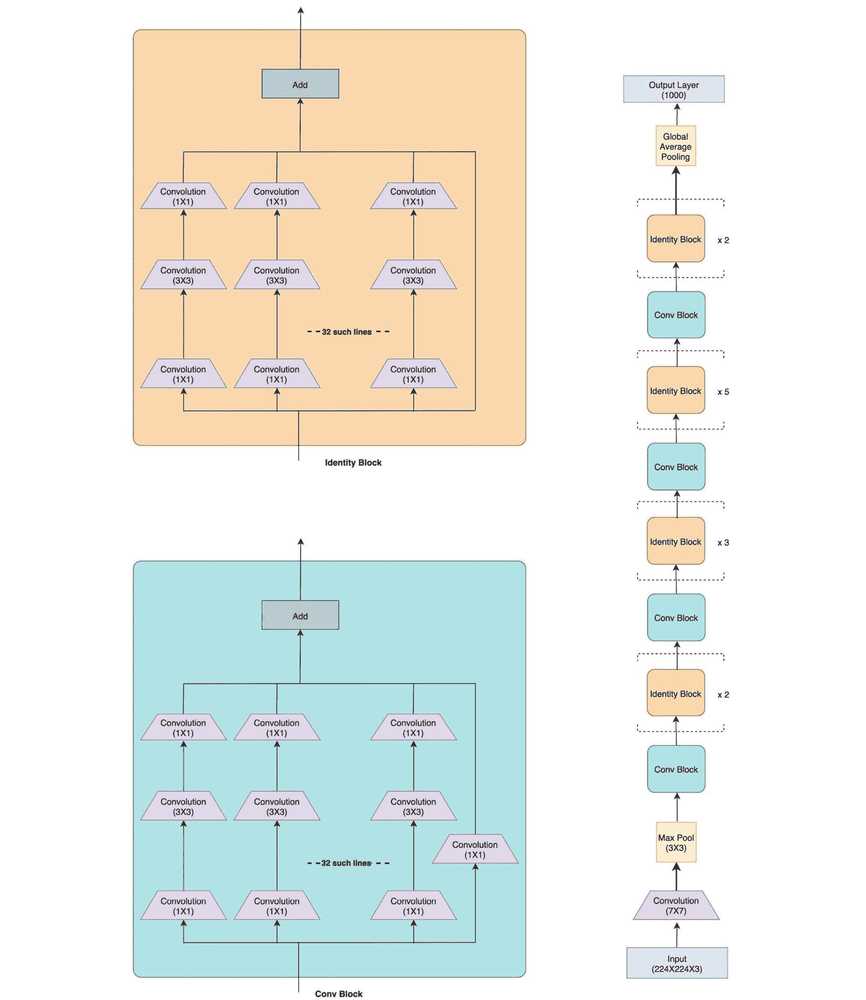

图 3.29 – ResNeXt 架构

正如您所看到的，它看起来像是*ResNet + Inception*混合的更广泛变体，因为残差块中有大量并行的卷积分支——并行的概念源于 Inception 网络。

在本章的下一部分，我们将探讨当前表现最佳的 CNN 架构——EfficientNets。我们还将讨论 CNN 架构发展的未来，同时涉及 CNN 架构在超越图像分类的任务中的应用。

## 理解 EfficientNets 和 CNN 架构的未来

到目前为止，从 LeNet 到 DenseNet 的探索中，我们已经注意到 CNN 架构进步的一个潜在主题。这一主题是通过以下一种方式扩展或缩放 CNN 模型：

+   层数增加

+   在卷积层中特征映射或通道数的增加

+   从 LeNet 的 32x32 像素图像到 AlexNet 的 224x224 像素图像等空间维度的增加

可进行缩放的三个不同方面分别被确定为*深度*、*宽度*和*分辨率*。EfficientNets 不再手动调整这些属性，这通常会导致次优结果，而是使用神经架构搜索来计算每个属性的最优缩放因子。

增加深度被认为很重要，因为网络越深，模型越复杂，因此可以学习到更复杂的特征。然而，增加深度也存在一定的权衡，因为随着深度的增加，梯度消失问题以及过拟合问题普遍加剧。

类似地，理论上增加宽度应该有助于性能，因为通道数越多，网络应该能够学习更细粒度的特征。然而，对于极宽的模型，精度往往会迅速饱和。

最后，从理论上讲，更高分辨率的图像应该效果更好，因为它们包含更精细的信息。然而，经验上，分辨率的增加并不会线性等效地提高模型性能。总之，这些都表明在确定缩放因子时需要权衡，因此神经架构搜索有助于找到最优缩放因子。

EfficientNet 提出了找到具有正确深度、宽度和分辨率平衡的架构，这三个方面通过全局缩放因子一起进行缩放。EfficientNet 架构分为两步。首先，通过将缩放因子固定为`1`来设计一个基本架构（称为**基础网络**）。在这个阶段，决定了给定任务和数据集的深度、宽度和分辨率的相对重要性。所得到的基础网络与一个著名的 CNN 架构非常相似，即**MnasNet**，全称**Mobile Neural Architecture Search Network**。PyTorch 提供了预训练的`MnasNet`模型，可以像这样加载：

```py
import torchvision.models as models
model = models.mnasnet1_0()
```

一旦在第一步得到了基础网络，就会计算出最优的全局缩放因子，目标是最大化模型的准确性并尽量减少计算量（或浮点运算）。基础网络称为**EfficientNet B0**，而为不同最优缩放因子衍生的后续网络称为**EfficientNet B1-B7**。PyTorch 为所有这些变体提供了预训练模型：

```py
import torchvision.models as models
efficientnet_b0 = models.efficientnet_b0(pretrained=True)
efficientnet_b1 = models.efficientnet_b1(pretrained=True)
...
efficientnet_b7 = models.efficientnet_b7(pretrained=True) 
```

随着我们的进展，CNN 架构的高效扩展将成为研究的一个突出方向，同时还将开发受到启发的更复杂的模块，例如 inception、残差和密集模块。CNN 架构发展的另一个方面是在保持性能的同时最小化模型大小。**MobileNets** [3.9] 就是一个主要的例子，目前在这个领域有大量的研究。

除了上述从架构上修改预先存在的模型的自上而下方法之外，还将继续采用从根本上重新思考 CNN 单元的自下而上方法，例如卷积核、池化机制、更有效的展平方式等。一个具体的例子是**胶囊网络** [3.10] ，它重新设计了卷积单元以适应图像中的第三维度（深度）。

CNN 本身就是一个广泛研究的话题。在本章中，我们主要讨论了 CNN 在图像分类背景下的架构发展。然而，这些相同的架构被广泛应用于各种应用中。一个著名的例子是在对象检测和分割中使用 ResNets 的形式，如**RCNNs** [3.11] 。RCNNs 的改进变体包括**Faster R-CNN**、**Mask-RCNN**和**Keypoint-RCNN**。PyTorch 为这三个变体提供了预训练模型：

```py
faster_rcnn = models.detection.fasterrcnn_resnet50_fpn()
mask_rcnn = models.detection.maskrcnn_resnet50_fpn()
keypoint_rcnn = models.detection.keypointrcnn_resnet50_fpn()
```

PyTorch 还提供了预训练模型用于 ResNets，这些模型应用于视频相关任务，比如视频分类。用于视频分类的两个基于 ResNet 的模型分别是**ResNet3D**和**混合卷积 ResNet**：

```py
resnet_3d = models.video.r3d_18()
resnet_mixed_conv = models.video.mc3_18()
```

虽然我们在本章没有详细涵盖这些不同的应用及相应的 CNN 模型，但我们鼓励您深入了解它们。PyTorch 的网站可以作为一个很好的起点 [3.12]。

## 总结

本章主要讲述了 CNN 的架构。在下一章中，我们将探索另一类重要的神经网络——递归神经网络。我们将讨论各种递归网络的架构，并使用 PyTorch 来有效地实现、训练和测试它们。
