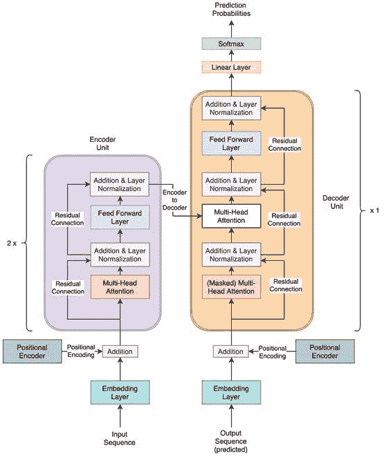
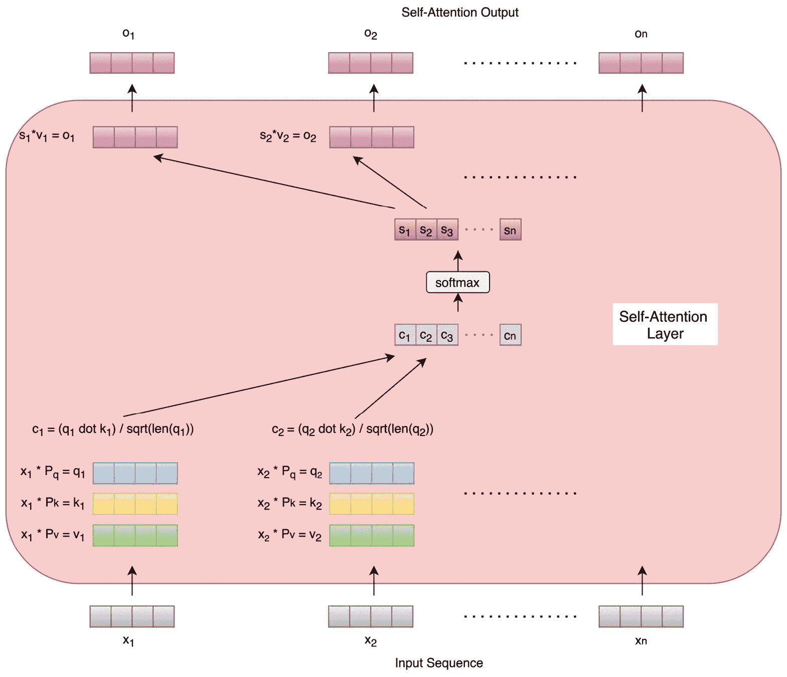
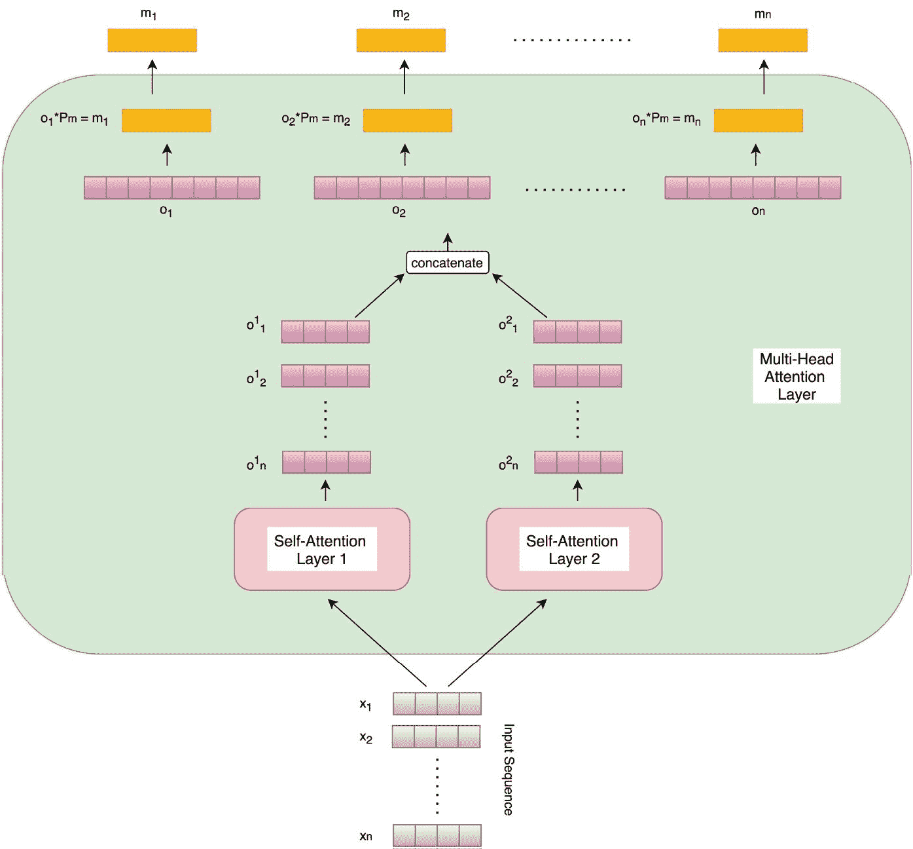
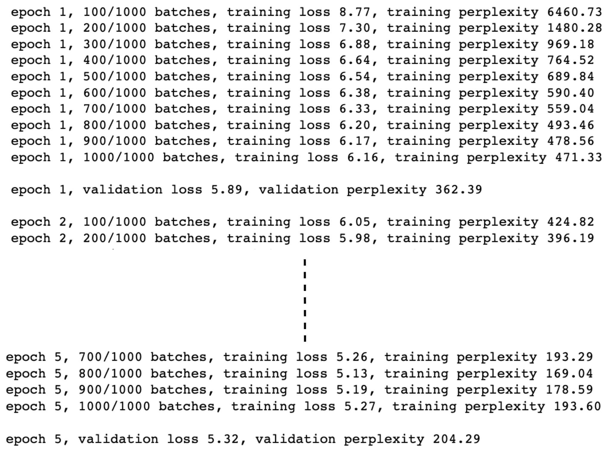
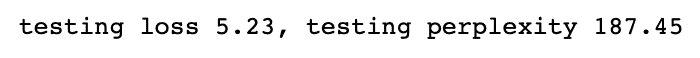
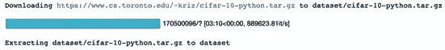
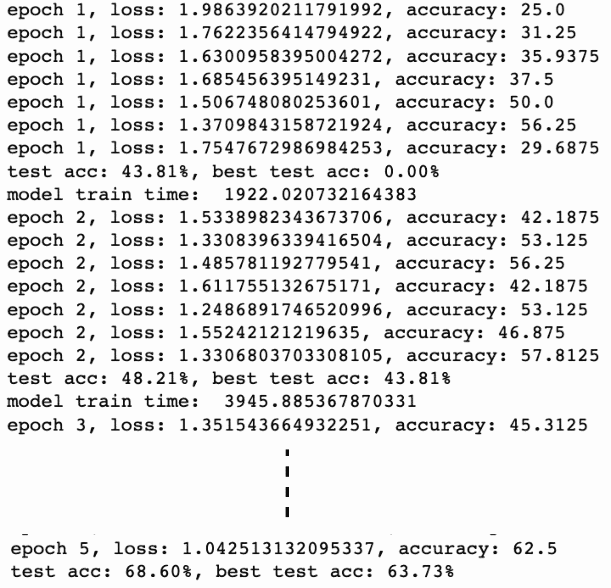
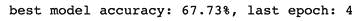
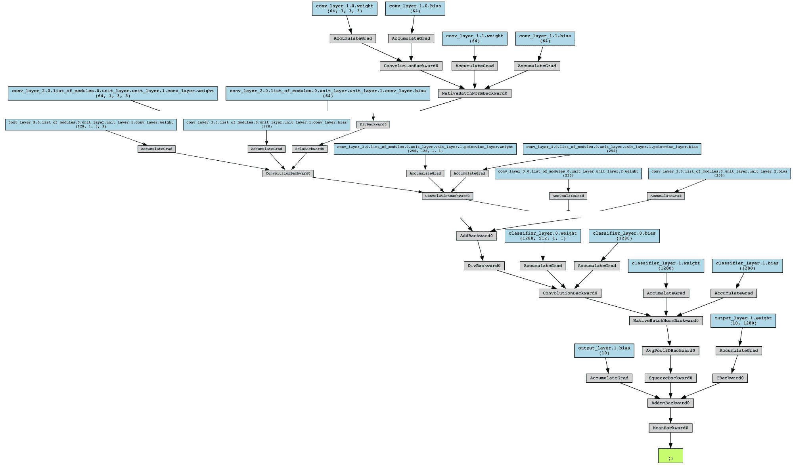

# 5 混合高级模型

## 加入我们的书籍 Discord 社区

[`packt.link/EarlyAccessCommunity`](https://packt.link/EarlyAccessCommunity)


在前两章中，我们广泛学习了各种卷积和递归网络架构，以及它们在 PyTorch 中的实现。在本章中，我们将深入研究一些在各种机器学习任务中证明成功的其他深度学习模型架构，它们既不是纯卷积的，也不是循环的。我们将继续探讨*第三章 深度 CNN 架构*和*第四章 深度递归模型结构*中的内容。

首先，我们将探讨 transformers，正如我们在*第四章 深度递归模型结构*末尾学到的，它们在各种顺序任务上表现优于循环架构。接着，我们将从*第三章 深度 CNN 架构*末尾的**EfficientNets**讨论中继续，并探索生成随机连线神经网络的概念，也称为**RandWireNNs**。

通过本章，我们的目标是结束本书中对不同神经网络架构的讨论。完成本章后，您将深入了解 transformers 及如何使用 PyTorch 将这些强大的模型应用于顺序任务。此外，通过构建自己的 RandWireNN 模型，您将有机会在 PyTorch 中执行神经架构搜索。本章分为以下主题：

+   建立一个用于语言建模的 transformer 模型

+   从头开始开发 RandWireNN 模型

## 建立一个用于语言建模的 transformer 模型

在本节中，我们将探索 transformers 是什么，并使用 PyTorch 为语言建模任务构建一个。我们还将学习如何通过 PyTorch 的预训练模型库使用其后继模型，如**BERT**和**GPT**。在我们开始构建 transformer 模型之前，让我们快速回顾一下语言建模是什么。

## 回顾语言建模

**语言建模**是一项确定一个词或一系列词出现概率的任务，它们应该跟在给定的一系列词后面。例如，如果我们给定*French is a beautiful _____*作为我们的词序列，下一个词将是*language*或*word*的概率是多少？这些概率是通过使用各种概率和统计技术对语言建模来计算的。其思想是通过观察文本语料库并学习语法，学习哪些词汇经常一起出现，哪些词汇从不会一起出现。这样，语言模型建立了关于不同词或序列出现概率的概率规则。

递归模型一直是学习语言模型的一种流行方法。然而，与许多序列相关任务一样，变压器在这个任务上也超过了递归网络。我们将通过在维基百科文本语料库上训练一个基于变压器的英语语言模型来实现。

现在，让我们开始训练一个变压器进行语言建模。在这个练习过程中，我们将仅演示代码的最重要部分。完整的代码可以在我们的 github 仓库[5.1]中找到。

在练习之间，我们将深入探讨变压器架构的各个组成部分。

在这个练习中，我们需要导入一些依赖项。其中一个重要的`import`语句如下所示：

```py
from torch.nn import TransformerEncoder, TransformerEncoderLayer
```

除了导入常规的`torch`依赖项外，我们还必须导入一些特定于变压器模型的模块；这些模块直接在 torch 库下提供。我们还将导入`torchtext`，以便直接从`torchtext.datasets`下的可用数据集中下载文本数据集。

在接下来的部分中，我们将定义变压器模型的架构并查看模型组件的详细信息。

## 理解变压器模型架构

这可能是这个练习中最重要的步骤。在这里，我们定义变压器模型的架构。

首先，让我们简要讨论模型架构，然后看一下定义模型的 PyTorch 代码。以下图表显示了模型架构：



图 5.1 – 变压器模型架构

首先要注意的是，这基本上是一个基于编码器-解码器的架构，左侧是**编码器单元**（紫色），右侧是**解码器单元**（橙色）。编码器和解码器单元可以多次平铺以实现更深层的架构。在我们的示例中，我们有两个级联的编码器单元和一个单独的解码器单元。这种编码器-解码器设置的本质是，编码器接受一个序列作为输入，并生成与输入序列中的单词数量相同的嵌入（即每个单词一个嵌入）。然后，这些嵌入与模型迄今为止的预测一起馈送到解码器中。

让我们来看看这个模型中的各个层：

**嵌入层**：这一层的作用很简单，即将序列的每个输入单词转换为数字向量，即嵌入。在这里，我们使用`torch.nn.Embedding`模块来实现这一层。

**位置编码器**：请注意，变压器在其架构中没有任何递归层，然而它们在顺序任务上表现出色。怎么做到的？通过一个称为*位置编码*的巧妙技巧，模型能够感知数据中的顺序性或顺序。基本上，按照特定的顺序模式添加到输入单词嵌入中的向量。

这些向量是通过一种方法生成的，使模型能够理解第二个词跟在第一个词后面，依此类推。这些向量是使用`正弦`和`余弦`函数生成的，分别用来表示连续单词之间的系统周期性和距离。我们在这个练习中的这一层的实现如下：

```py
class PosEnc(nn.Module):
    def __init__(self, d_m, dropout=0.2, size_limit=5000):
        # d_m is same as the dimension of the embeddings
        pos = torch.arange(     size_limit, dtype=torch.float).unsqueeze(1)
        divider = torch.exp(torch.arange(0, d_m, 2).float() * (-math.log(10000.0) / d_m))
        # divider is the list of radians, multiplied by position indices of words, and fed to the sinusoidal and cosinusoidal function.  
        p_enc[:, 0, 0::2] = torch.sin(pos * divider)
        p_enc[:, 0, 1::2] = torch.cos(pos * divider)
    def forward(self, x):
        return self.dropout(x + self.p_enc[:x.size(0)     ])
```

如您所见，交替使用`正弦`和`余弦`函数来给出顺序模式。虽然有多种实现位置编码的方式。如果没有位置编码层，模型将对单词的顺序一无所知。

**多头注意力**：在我们看多头注意力层之前，让我们先了解什么是**自注意力层**。在*第四章*，*深度递归模型架构*中，我们已经涵盖了关于递归网络中注意力的概念。这里，正如其名称所示，注意机制应用于自身；即序列中的每个单词。序列的每个单词嵌入通过自注意力层，并生成与单词嵌入长度完全相同的单独输出。下面的图解详细描述了这一过程：



图 5.2 – 自注意力层

正如我们所见，对于每个单词，通过三个可学习的参数矩阵（**Pq**，**Pk** 和 **Pv**）生成三个向量。这三个向量是查询、键和值向量。查询和键向量进行点乘，为每个单词产生一个数字。这些数字通过将每个单词的键向量长度的平方根进行归一化来规范化。然后同时对所有单词的结果进行 Softmax 操作，以产生最终乘以相应值向量的概率。这导致序列的每个单词都有一个输出向量，其长度与输入单词嵌入的长度相同。

多头注意力层是自注意力层的扩展，其中多个自注意力模块为每个单词计算输出。这些个别输出被串联并与另一个参数矩阵（**Pm**）进行矩阵乘法，以生成最终的输出向量，其长度与输入嵌入向量的长度相等。下图展示了多头注意力层，以及我们在本练习中将使用的两个自注意力单元：



图 5.3 – 具有两个自注意力单元的多头注意力层

多个自注意力头有助于不同的头集中于序列单词的不同方面，类似于不同特征映射学习卷积神经网络中的不同模式。因此，多头注意力层的性能优于单个自注意力层，并将在我们的练习中使用。

此外，请注意，在解码器单元中，掩码多头注意力层的工作方式与多头注意力层完全相同，除了增加的掩码；也就是说，在处理序列的时间步 *t* 时，从 *t+1* 到 *n*（序列长度）的所有单词都被掩盖/隐藏。

在训练期间，解码器接收两种类型的输入。一方面，它从最终编码器接收查询和键向量作为其（未掩码的）多头注意力层的输入，其中这些查询和键向量是最终编码器输出的矩阵变换。另一方面，解码器接收其自己在前一个时间步的预测作为其掩码多头注意力层的顺序输入。

**加法和层归一化**：我们在 *第三章* *深度 CNN 架构* 中讨论了残差连接的概念，当讨论 ResNets 时。在 *图 5.1* 中，我们可以看到在加法和层归一化层之间存在残差连接。在每个实例中，通过直接将输入单词嵌入向量加到多头注意力层的输出向量上，建立了一个残差连接。这有助于网络中更容易的梯度流动，避免梯度爆炸和梯度消失问题。此外，它有助于在各层之间有效地学习身份函数。

> 此外，层归一化被用作一种规范化技巧。在这里，我们独立地对每个特征进行归一化，以使所有特征具有统一的均值和标准差。请注意，这些加法和归一化逐个应用于网络每个阶段的每个单词向量。

**前馈层**：在编码器和解码器单元内部，所有序列中单词的归一化残差输出向量通过一个共同的前馈层传递。由于单词间存在一组共同的参数，这一层有助于学习序列中更广泛的模式。

**线性和 Softmax 层**：到目前为止，每个层都输出一个单词序列的向量。对于我们的语言建模任务，我们需要一个单一的最终输出。线性层将向量序列转换为一个与我们的单词词汇长度相等的单一向量。**Softmax**层将这个输出转换为一个概率向量，其总和为`1`。这些概率是词汇表中各个单词（在序列中）作为下一个单词出现的概率。

现在我们已经详细阐述了变压器模型的各种要素，让我们看一下用于实例化模型的 PyTorch 代码。

## 在 PyTorch 中定义一个变压器模型

使用前面部分描述的架构细节，我们现在将编写必要的 PyTorch 代码来定义一个变压器模型，如下所示：

```py
class Transformer(nn.Module):
    def __init__(self, num_token, num_inputs, num_heads, num_hidden, num_layers, dropout=0.3):
        self.position_enc = PosEnc(num_inputs, dropout)
        layers_enc = TransformerEncoderLayer(num_inputs, num_heads, num_hidden, dropout)
        self.enc_transformer = TransformerEncoder(layers_enc, num_layers)
        self.enc = nn.Embedding(num_token, num_inputs)
        self.num_inputs = num_inputs
        self.dec = nn.Linear(num_inputs, num_token)
```

正如我们所看到的，在类的`__init__`方法中，由于 PyTorch 的`TransformerEncoder`和`TransformerEncoderLayer`函数，我们无需自己实现这些。对于我们的语言建模任务，我们只需要输入单词序列的单个输出。因此，解码器只是一个线性层，它将来自编码器的向量序列转换为单个输出向量。位置编码器也是使用我们之前讨论的定义初始化的。

在`forward`方法中，输入首先进行位置编码，然后通过编码器，接着是解码器：

```py
 def forward(self, source):
        source = self.enc(source) * math.sqrt(self.num_inputs)
        source = self.position_enc(source)
        op = self.enc_transformer(source, self.mask_source)
        op = self.dec(op)
        return op
```

现在我们已经定义了变压器模型架构，我们将载入文本语料库进行训练。

## 加载和处理数据集

在本节中，我们将讨论与加载文本数据集和使其适用于模型训练例程有关的步骤。让我们开始吧：

本练习中，我们将使用维基百科的文本，这些文本都可作为`WikiText-2`数据集使用。

> **数据集引用**
> 
> > [`blog.einstein.ai/the-wikitext-long-term-dependency-language-modeling-dataset/.`](https://blog.einstein.ai/the-wikitext-long-term-dependency-language-modeling-dataset/.)

我们将使用`torchtext`的功能来下载训练数据集（在`torchtext`数据集中可用）并对其词汇进行标记化：

```py
tr_iter = WikiText2(split='train')
tkzer = get_tokenizer('basic_english')
vocabulary = build_vocab_from_iterator(map(tkzer, tr_iter), specials=['<unk>'])
vocabulary.set_default_index(vocabulary['<unk>'])
```

1.  然后我们将使用词汇表将原始文本转换为张量，用于训练、验证和测试数据集：

```py
def process_data(raw_text):
    numericalised_text = [torch.tensor(vocabulary(tkzer(text)), dtype=torch.long) for text in raw_text]
    return torch.cat(tuple(filter(lambda t: t.numel() > 0, numericalised_text)))
tr_iter, val_iter, te_iter = WikiText2()
training_text = process_data(tr_iter)
validation_text = process_data(val_iter)
testing_text = process_data(te_iter) 
```

1.  我们还将为训练和评估定义批量大小，并声明批处理生成函数，如下所示：

```py
def gen_batches(text_dataset, batch_size):
    num_batches = text_dataset.size(0) // batch_size
    text_dataset = text_dataset[:num_batches * batch_size]
    text_dataset = text_dataset.view(batch_size, num_batches).t().contiguous()
    return text_dataset.to(device)
training_batch_size = 32
evaluation_batch_size = 16
training_data = gen_batches(training_text, training_batch_size) 
```

1.  接下来，我们必须定义最大序列长度，并编写一个函数，根据每个批次生成输入序列和输出目标：

```py
max_seq_len = 64
def return_batch(src, k):
    sequence_length = min(max_seq_len, len(src) - 1 - k)
    sequence_data = src[k:k+sequence_length]
    sequence_label = src[k+1:k+1+sequence_length].reshape(-1)
    return sequence_data, sequence_label 
```

定义了模型并准备好训练数据后，我们将开始训练变压器模型。

## 训练变压器模型

在本节中，我们将为模型训练定义必要的超参数，定义模型训练和评估例程，最后执行训练循环。让我们开始吧：

在这一步中，我们定义所有模型超参数并实例化我们的变压器模型。以下代码是不言而喻的：

```py
num_tokens = len(vocabulary) # vocabulary size
embedding_size = 256 # dimension of embedding layer
num_hidden_params = 256 # transformer encoder's hidden (feed forward) layer dimension
num_layers = 2 # num of transformer encoder layers within transformer encoder
num_heads = 2 # num of heads in (multi head) attention models
dropout = 0.25 # value (fraction) of dropout
loss_func = nn.CrossEntropyLoss()
lrate = 4.0 # learning rate
optim_module = torch.optim.SGD(transformer_model.parameters(), lr=lrate)
sched_module = torch.optim.lr_scheduler.StepLR(optim_module, 1.0, gamma=0.88)
transformer_model = Transformer(num_tokens, embedding_size, num_heads, num_hidden_params, num_layers, dropout).to(device) 
```

在开始模型训练和评估循环之前，我们需要定义训练和评估例程：

```py
def train_model():     )
    for b, i in enumerate(range(0, training_data.size(0) - 1, max_seq_len)):
        train_data_batch, train_label_batch = return_batch(training_data, i)
        sequence_length = train_data_batch.size(0)
        if sequence_length != max_seq_len:  # only on last batch
            mask_source = mask_source[:sequence_length, :sequence_length]

        op = transformer_model(train_data_batch, mask_source)
        loss_curr = loss_func(op.view(-1, num_tokens), train_label_batch)
       optim_module.zero_grad()
        loss_curr.backward()
torch.nn.utils.clip_grad_norm_(transformer_model.parameters(), 0.6)
        optim_module.step()
        loss_total += loss_curr.item()
def eval_model(eval_model_obj, eval_data_source):
...
```

最后，我们必须运行模型训练循环。为了演示目的，我们将为模型训练`5`个时代，但建议您训练更长时间以获得更好的性能：

```py
min_validation_loss = float("inf")
eps = 5
best_model_so_far = None
for ep in range(1, eps + 1):
    ep_time_start = time.time()
    train_model()
    validation_loss = eval_model(transformer_model, validation_data)
    if validation_loss < min_validation_loss:
        min_validation_loss = validation_loss
        best_model_so_far = transformer_model
```

这应产生以下输出：



图 5.4 - 变压器训练日志

除了交叉熵损失，还报告了困惑度。**困惑度**是自然语言处理中常用的指标，用于表示一个**概率分布**（在我们的情况下是语言模型）对样本的拟合或预测能力。困惑度越低，模型在预测样本时表现越好。从数学上讲，困惑度只是交叉熵损失的指数。直观地说，这个度量用来指示模型在进行预测时的困惑或混乱程度。

一旦模型训练完毕，我们可以通过在测试集上评估模型的性能来完成这个练习：

```py
testing_loss = eval_model(best_model_so_far, testing_data)
print(f"testing loss {testing_loss:.2f}, testing perplexity {math.exp(testing_loss):.2f}")
```

这应该导致以下输出：



Figure 5.5 – Transformer evaluation results

在这个练习中，我们使用 PyTorch 构建了一个用于语言建模任务的变压器模型。我们详细探讨了变压器的架构以及如何在 PyTorch 中实现它。我们使用了`WikiText-2`数据集和`torchtext`功能来加载和处理数据集。然后我们训练了变压器模型，进行了`5`个 epochs 的评估，并在一个独立的测试集上进行了评估。这将为我们提供开始使用变压器所需的所有信息。

除了原始的变压器模型，该模型是在 2017 年设计的，多年来已经开发了许多后续版本，特别是在语言建模领域，例如以下几种：

**BERT**（**Bidirectional Encoder Representations from Transformers**），2018

**GPT**（**Generative Pretrained Transformer**），2018

**GPT-2**, 2019

**CTRL**（**Conditional Transformer Language Model**），2019

**Transformer-XL**, 2019

**DistilBERT**（**Distilled BERT**），2019

**RoBERTa**（**RoBustly optimized BERT pretraining Approach**），2019

**GPT-3**, 2020

虽然我们在本章不会详细介绍这些模型，但是你仍然可以通过 PyTorch 和`transformers`库开始使用这些模型。我们将在第十九章详细探讨 HuggingFace。transformers 库为各种任务提供了预训练的变压器系列模型，例如语言建模、文本分类、翻译、问答等。

除了模型本身，它还提供了各自模型的分词器。例如，如果我们想要使用预训练的 BERT 模型进行语言建模，我们需要在安装了`transformers`库后写入以下代码：

```py
import torch
from transformers import BertForMaskedLM, BertTokenizer
bert_model = BertForMaskedLM.from_pretrained('bert-base-uncased')
token_gen = BertTokenizer.from_pretrained('bert-base-uncased')
ip_sequence = token_gen("I love PyTorch !", return_tensors="pt")["input_ids"]
op = bert_model(ip_sequence, labels=ip_sequence)
total_loss, raw_preds = op[:2]
```

正如我们所看到的，仅需几行代码就可以开始使用基于 BERT 的语言模型。这展示了 PyTorch 生态系统的强大性。你被鼓励使用`transformers`库探索更复杂的变种，如*Distilled BERT*或*RoBERTa*。有关更多详细信息，请参阅它们的 GitHub 页面，之前已经提到过。

这结束了我们对 transformer 的探索。我们既通过从头构建一个 transformer，也通过重用预训练模型来做到这一点。在自然语言处理领域，transformer 的发明与计算机视觉领域的 ImageNet 时刻齐头并进，因此这将是一个活跃的研究领域。PyTorch 将在这些模型的研究和部署中发挥关键作用。

在本章的下一个也是最后一个部分中，我们将恢复我们在*第三章，深度 CNN 架构*末尾提供的神经架构搜索讨论，那里我们简要讨论了生成最优网络架构的想法。我们将探索一种模型类型，我们不决定模型架构的具体形式，而是运行一个网络生成器，为给定任务找到最优架构。由此产生的网络称为**随机连线神经网络**（**RandWireNN**），我们将使用 PyTorch 从头开始开发一个。

## 从零开始开发 RandWireNN 模型

我们在*第三章，深度 CNN 架构*中讨论了 EfficientNets，在那里我们探讨了找到最佳模型架构而不是手动指定的想法。RandWireNNs，或随机连线神经网络，顾名思义，是建立在类似概念上的。在本节中，我们将研究并使用 PyTorch 构建我们自己的 RandWireNN 模型。

## 理解 RandWireNNs

首先，使用随机图生成算法生成一个预定义节点数的随机图。这个图被转换成一个神经网络，通过对其施加一些定义，比如以下定义：

+   **有向性**：图被限制为有向图，并且边的方向被认为是等效神经网络中数据流的方向。

+   **聚合**：多个入边到一个节点（或神经元）通过加权和进行聚合，其中权重是可学习的。

+   **转换**：在该图的每个节点内部，应用了一个标准操作：ReLU 接着 3x3 可分离卷积（即常规的 3x3 卷积接着 1x1 点卷积），然后是批量归一化。这个操作也被称为**ReLU-Conv-BN 三重组合**。

+   **分布**：最后，每个神经元有多个出边，每个出边携带前述三重组合的副本。

拼图中的最后一块是向该图添加一个单一的输入节点（源）和一个单一的输出节点（汇），以完全将随机图转化为神经网络。一旦图被实现为神经网络，它可以被训练用于各种机器学习任务。

在**ReLU-Conv-BN 三元组单元**中，出口通道数/特征与输入通道数/特征相同，出于可重复性考虑。然而，根据手头任务的类型，您可以将几个这样的图阶段性地配置为向下游增加通道数（和减少数据/图像的空间尺寸）。最后，这些分段图可以按顺序连接，将一个的末端连接到另一个的起始端。

接下来，作为一项练习，我们将使用 PyTorch 从头开始构建一个 RandWireNN 模型。

## 使用 PyTorch 开发 RandWireNN

我们现在将为图像分类任务开发一个 RandWireNN 模型。这将在 CIFAR-10 数据集上执行。我们将从一个空模型开始，生成一个随机图，将其转换为神经网络，为给定的任务在给定的数据集上进行训练，评估训练后的模型，最后探索生成的模型。在这个练习中，我们仅展示代码的重要部分以示范目的。要访问完整的代码，请访问书籍的 GitHub 仓库[5.3]。

## 定义训练例程和加载数据

在这个练习的第一个子部分中，我们将定义训练函数，该函数将由我们的模型训练循环调用，并定义我们的数据集加载器，该加载器将为我们提供用于训练的数据批次。让我们开始吧：

首先，我们需要导入一些库。本练习中将使用的一些新库如下：

```py
from torchviz import make_dot
import networkx as nx
```

接下来，我们必须定义训练例程，该例程接受一个经过训练的模型，该模型能够根据 RGB 输入图像产生预测概率：

```py
def train(model, train_dataloader, optim, loss_func, epoch_num, lrate):
    for training_data, training_label in train_dataloader:
        pred_raw = model(training_data)
        curr_loss = loss_func(pred_raw, training_label)
        training_loss += curr_loss.data
    return training_loss / data_size, training_accuracy / data_size
```

接下来，我们定义数据集加载器。对于这个图像分类任务，我们将使用`CIFAR-10`数据集，这是一个知名的数据库，包含 60,000 个 32x32 的 RGB 图像，分为 10 个不同的类别，每个类别包含 6,000 张图像。我们将使用`torchvision.datasets`模块直接从 torch 数据集仓库加载数据。

> **数据集引用**
> 
> > *从小图像中学习多层特征*，Alex Krizhevsky，2009 年。

代码如下：

```py
def load_dataset(batch_size):
    train_dataloader = torch.utils.data.DataLoader(
        datasets.CIFAR10('dataset', transform=transform_train_dataset, train=True, download=True),
        batch_size=batch_size,  shuffle=True)
    return train_dataloader, test_dataloader
train_dataloader, test_dataloader = load_dataset(batch_size)
```

这应该给我们以下输出：



图 5.6 – RandWireNN 数据加载

现在我们将继续设计神经网络模型。为此，我们需要设计随机连通图。

## 定义随机连通图

在本节中，我们将定义一个图生成器，以生成稍后将用作神经网络的随机图。让我们开始吧：

如下面的代码所示，我们必须定义随机图生成器类：

```py
class RndGraph(object):
    def __init__(self, num_nodes, graph_probability, nearest_neighbour_k=4, num_edges_attach=5):
    def make_graph_obj(self):
        graph_obj = nx.random_graphs.connected_watts_strogatz_graph(self.num_nodes, self.nearest_neighbour_k,self.graph_probability)
        return graph_obj
```

在本练习中，我们将使用一个众所周知的随机图模型——**Watts Strogatz (WS)** 模型。这是在原始研究论文中对 RandWireNN 进行实验的三个模型之一。在这个模型中，有两个参数：

每个节点的邻居数（应严格偶数），*K*

重连概率，*P*

首先，图的所有*N*个节点按环形排列，每个节点与其左侧的*K/2*个节点和右侧的*K/2*个节点相连。然后，我们顺时针遍历每个节点*K/2*次。在第*m*次遍历（*0<m<K/2*）时，当前节点与其右侧第*m*个邻居之间的边以概率*P*被*重连*。

在这里，重连意味着将边替换为与当前节点及其不同的另一节点之间的另一条边，以及第*m*个邻居。在前面的代码中，我们的随机图生成器类的`make_graph_obj`方法使用了`networkx`库来实例化 WS 图模型。

在前面的代码中，我们的随机图生成器类的`make_graph_obj`方法使用了`networkx`库来实例化 WS 图模型。

此外，我们还添加了一个`get_graph_config`方法来返回图中节点和边的列表。在将抽象图转换为神经网络时，这将非常有用。我们还将为缓存生成的图定义一些图保存和加载方法，以提高可重现性和效率：

```py
 def get_graph_config(self, graph_obj):
        return node_list, incoming_edges
    def save_graph(self, graph_obj, path_to_write):
        nx.write_yaml(graph_obj, "./cached_graph_obj/" + path_to_write)
    def load_graph(self, path_to_read):
        return nx.read_yaml("./cached_graph_obj/" + path_to_read)
```

接下来，我们将开始创建实际的神经网络模型。

## 定义 RandWireNN 模型模块

现在我们有了随机图生成器，需要将其转换为神经网络。但在此之前，我们将设计一些神经模块来促进这种转换。让我们开始吧：

从神经网络的最低级别开始，首先我们将定义一个可分离的 2D 卷积层，如下所示：

```py
class SepConv2d(nn.Module):
    def __init__(self, input_ch, output_ch, kernel_length=3, dilation_size=1, padding_size=1, stride_length=1, bias_flag=True):
        super(SepConv2d, self).__init__()
        self.conv_layer = nn.Conv2d(input_ch, input_ch, kernel_length, stride_length, padding_size, dilation_size, bias=bias_flag, groups=input_ch)
        self.pointwise_layer = nn.Conv2d(input_ch, output_ch, kernel_size=1, stride=1, padding=0, dilation=1, groups=1, bias=bias_flag)
    def forward(self, x):
        return self.pointwise_layer(self.conv_layer(x))
```

可分离卷积层是常规 3x3 的 2D 卷积层级联，后跟点态 1x1 的 2D 卷积层。

定义了可分离的 2D 卷积层后，我们现在可以定义 ReLU-Conv-BN 三元组单元：

```py
class UnitLayer(nn.Module):
    def __init__(self, input_ch, output_ch, stride_length=1):
        self.unit_layer = nn.Sequential(
            nn.ReLU(),
            SepConv2d(input_ch, output_ch, stride_length=stride_length),nn.BatchNorm2d(output_ch),nn.Dropout(self.dropout)
        )
    def forward(self, x):
        return self.unit_layer(x)
```

正如我们之前提到的，三元组单元是 ReLU 层级联，后跟可分离的 2D 卷积层，再跟批量归一化层。我们还必须添加一个 dropout 层进行正则化。

有了三元组单元的存在，我们现在可以定义图中的节点，具备我们在本练习开始时讨论的所有`聚合`、`转换`和`分布`功能：

```py
class GraphNode(nn.Module):
    def __init__(self, input_degree, input_ch, output_ch, stride_length=1):
        self.unit_layer = UnitLayer(input_ch, output_ch, stride_length=stride_length)
    def forward(self, *ip):
        if len(self.input_degree) > 1:
            op = (ip[0] * torch.sigmoid(self.params[0]))
            for idx in range(1, len(ip)):
                op += (ip[idx] * torch.sigmoid(self.params[idx]))
            return self.unit_layer(op)
        else:
            return self.unit_layer(ip[0])
```

在`forward`方法中，如果节点的入边数大于`1`，则计算加权平均值，并使这些权重成为该节点的可学习参数。然后将三元组单元应用于加权平均值，并返回变换后的（ReLU-Conv-BN-ed）输出。

现在我们可以整合所有图和图节点的定义，以定义一个随机连线图类，如下所示：

```py
class RandWireGraph(nn.Module):
    def __init__(self, num_nodes, graph_prob, input_ch, output_ch, train_mode, graph_name):
        # get graph nodes and in edges
        rnd_graph_node = RndGraph(self.num_nodes, self.graph_prob)
        if self.train_mode is True:
            rnd_graph = rnd_graph_node.make_graph_obj()
            self.node_list, self.incoming_edge_list = rnd_graph_node.get_graph_config(rnd_graph)
        else:
        # define source Node
        self.list_of_modules = nn.ModuleList([GraphNode(self.incoming_edge_list[0], self.input_ch, self.output_ch,
stride_length=2)])
        # define the sink Node
self.list_of_modules.extend([GraphNode(self.incoming_edge_list[n], self.output_ch, self.output_ch)
                                     for n in self.node_list if n > 0])
```

在这个类的 `__init__` 方法中，首先生成一个抽象的随机图。推导出其节点和边缘。使用 `GraphNode` 类，将该抽象随机图的每个抽象节点封装为所需神经网络的神经元。最后，向网络添加一个源或输入节点和一个汇或输出节点，使神经网络准备好进行图像分类任务。

`forward` 方法同样非传统，如下所示：

```py
 def forward(self, x):
        # source vertex
        op = self.list_of_modules[0].forward(x)
        mem_dict[0] = op
        # the rest of the vertices
        for n in range(1, len(self.node_list) - 1):
            if len(self.incoming_edge_list[n]) > 1:
                op = self.list_of_modules[n].forward(*[mem_dict[incoming_vtx]
                                                       for incoming_vtx in self.incoming_edge_list[n]])
            mem_dict[n] = op
        for incoming_vtx in range(1, len(self.incoming_edge_list[self.num_nodes + 1])):
            op += mem_dict[self.incoming_edge_list[self.num_nodes + 1][incoming_vtx]]
        return op / len(self.incoming_edge_list[self.num_nodes + 1])
```

首先，为源神经元执行前向传递，然后根据图中 `list_of_nodes` 运行一系列后续神经元的前向传递。使用 `list_of_modules` 执行单独的前向传递。最后，通过汇流神经元的前向传递给出了该图的输出。

接下来，我们将使用这些定义的模块和随机连接的图类来构建实际的 RandWireNN 模型类。

## 将随机图转换为神经网络

在上一步中，我们定义了一个随机连接的图。然而，正如我们在本练习开始时提到的，随机连接的神经网络由多个分阶段的随机连接图组成。其背后的原理是，在图像分类任务中，从输入神经元到输出神经元的通道/特征数量会随着进展而不同（增加）。这是因为设计上，在一个随机连接的图中，通道的数量是恒定的，这是不可能的。让我们开始吧：

在这一步中，我们定义了最终的随机连接的神经网络。这将由三个相邻的随机连接的图级联组成。每个图都会比前一个图的通道数量增加一倍，以帮助我们符合图像分类任务中增加通道数量（在空间上进行下采样）的一般实践：

```py
class RandWireNNModel(nn.Module):
    def __init__(self, num_nodes, graph_prob, input_ch, output_ch, train_mode):
        self.conv_layer_1 = nn.Sequential(
            nn.Conv2d(in_channels=3, out_channels=self.output_ch, kernel_size=3, padding=1),
            nn.BatchNorm2d(self.output_ch) )
        self.conv_layer_2 = …
        self.conv_layer_3 = …
        self.conv_layer_4 = …
        self.classifier_layer = nn.Sequential(
            nn.Conv2d(in_channels=self.input_ch*8, out_channels=1280, kernel_size=1), nn.BatchNorm2d(1280))
        self.output_layer = nn.Sequential(nn.Dropout(self.dropout), nn.Linear(1280, self.class_num))
```

`__init__` 方法以一个常规的 3x3 卷积层开始，然后是三个分阶段的随机连接图，通道数量随着图像分类任务中的增加而增加。接下来是一个完全连接的层，将最后一个随机连接图的卷积输出展平为大小为 `1280` 的向量。

最后，另一个完全连接的层产生一个大小为 10 的向量，其中包含 10 个类别的概率，如下所示：

```py
 def forward(self, x):
        x = self.conv_layer_1(x)
        x = self.conv_layer_2(x)
        x = self.conv_layer_3(x)
        x = self.conv_layer_4(x)
        x = self.classifier_layer(x)
        # global average pooling
        _, _, h, w = x.size()
        x = F.avg_pool2d(x, kernel_size=[h, w])
        x = torch.squeeze(x)
        x = self.output_layer(x)
        return x
```

`forward` 方法相当不言自明，除了在第一个完全连接层之后应用的全局平均池化。这有助于减少网络中的维度和参数数量。

在这个阶段，我们已成功定义了 RandWireNN 模型，加载了数据集，并定义了模型训练流程。现在，我们已经准备好运行模型训练循环。

## 训练 RandWireNN 模型

在这一节中，我们将设置模型的超参数并训练 RandWireNN 模型。让我们开始吧：

我们已经定义了我们练习的所有构建块。现在是执行它的时候了。首先，让我们声明必要的超参数：

```py
num_epochs = 5
graph_probability = 0.7
node_channel_count = 64
num_nodes = 16
lrate = 0.1
batch_size = 64
train_mode = True
```

在声明了超参数之后，我们实例化了 RandWireNN 模型，以及优化器和损失函数：

```py
rand_wire_model = RandWireNNModel(num_nodes, graph_probability, node_channel_count, node_channel_count, train_mode).to(device)
optim_module = optim.SGD(rand_wire_model.parameters(), lr=lrate, weight_decay=1e-4, momentum=0.8)
loss_func = nn.CrossEntropyLoss().to(device)
```

最后，我们开始训练模型。在这里我们演示目的训练了`5`个 epochs，但建议您延长训练时间以提高性能：

```py
for ep in range(1, num_epochs + 1):
    epochs.append(ep)
    training_loss, training_accuracy = train(rand_wire_model, train_dataloader, optim_module, loss_func, ep, lrate)
    test_accuracy = accuracy(rand_wire_model, test_dataloader)
    test_accuracies.append(test_accuracy)
    training_losses.append(training_loss)
    training_accuracies.append(training_accuracy)
    if best_test_accuracy < test_accuracy:
        torch.save(model_state, './model_checkpoint/' + model_filename + 'ckpt.t7')
    print("model train time: ", time.time() - start_time)
```

这应该会产生以下输出：



图 5.7 – RandWireNN 训练日志

从这些日志中可以明显看出，随着 epochs 的增加，模型正在逐步学习。验证集上的性能似乎在持续提升，这表明模型具有良好的泛化能力。

有了这个，我们创建了一个没有特定架构的模型，可以在 CIFAR-10 数据集上合理地执行图像分类任务。

## 评估和可视化 RandWireNN 模型

最后，在简要探索模型架构之前，我们将查看此模型在测试集上的性能。让我们开始吧：

模型训练完成后，我们可以在测试集上进行评估：

```py
rand_wire_nn_model.load_state_dict(model_checkpoint['model'])
for test_data, test_label in test_dataloader:
    success += pred.eq(test_label.data).sum()
    print(f"test accuracy: {float(success) * 100\. / len(test_dataloader.dataset)} %")
```

这应该会产生以下输出：



图 5.8 – RandWireNN 评估结果

最佳表现模型在第四个 epoch 时找到，准确率超过 67%。虽然模型尚未完美，但我们可以继续训练更多 epochs 以获得更好的性能。此外，对于此任务，一个随机模型的准确率将为 10%（因为有 10 个同等可能的类别），因此 67.73%的准确率仍然是有希望的，特别是考虑到我们正在使用随机生成的神经网络架构。

结束这个练习之前，让我们看看所学的模型架构。原始图像太大不能在这里显示。您可以在我们的 github 仓库中找到完整的图像，分别以.svg 格式 [5.4] 和 .pdf 格式 [5.5] 。在下图中，我们垂直堆叠了三部分 - 输入部分，中间部分和输出部分，原始神经网络的：



图 5.9 – RandWireNN 架构

从这张图中，我们可以观察到以下关键点：

在顶部，我们可以看到这个神经网络的开头，它由一个 64 通道的 3x3 的 2D 卷积层组成，后面是一个 64 通道的 1x1 的点卷积 2D 层。

在中间部分，我们可以看到第三阶段和第四阶段随机图之间的过渡，其中我们可以看到第三阶段随机图的汇聚神经元`conv_layer_3`，以及第四阶段随机图的源神经元`conv_layer_4`。

最后，图的最底部显示了最终的输出层 - 随机图第 4 阶段的汇聚神经元（一个 512 通道的可分离二维卷积层），接着是一个全连接的展平层，结果是一个 1280 大小的特征向量，然后是一个全连接的 softmax 层，产生 10 个类别的概率。

因此，我们已经构建、训练、测试和可视化了一个用于图像分类的神经网络模型，未指定任何特定的模型架构。我们确实对结构施加了一些总体约束，比如笔架特征向量的长度（`1280`），可分离二维卷积层中的通道数（`64`），RandWireNN 模型中的阶段数（`4`），每个神经元的定义（ReLU-Conv-BN 三元组），等等。

然而，我们并没有指定这个神经网络架构应该是什么样的。我们使用了一个随机图生成器来为我们完成这项工作，这为找到最佳神经网络架构开启了几乎无限的可能性。

神经架构搜索是深度学习领域一个不断发展且富有前景的研究领域。在很大程度上，这与为特定任务训练定制的机器学习模型的领域相契合，被称为 AutoML。

**AutoML** 代表**自动化机器学习**，因为它消除了手动加载数据集，预定义特定神经网络模型架构来解决给定任务，并手动将模型部署到生产系统的必要性。在 *第十六章，PyTorch 和 AutoML* 中，我们将详细讨论 AutoML，并学习如何使用 PyTorch 构建这样的系统。

## 总结

在本章中，我们看了两种不同的混合类型的神经网络。首先，我们看了变压器模型 - 基于注意力的模型，没有循环连接，已在多个顺序任务上表现出色。我们进行了一个练习，在这个练习中我们使用 PyTorch 在 WikiText-2 数据集上构建、训练和评估了一个变压器模型来执行语言建模任务。在本章的第二个也是最后一个部分中，我们接着上一章 *第三章，深度卷积神经网络架构* 的内容，讨论了优化模型架构而不仅仅是优化模型参数的想法。我们探讨了一种方法 - 使用随机连线神经网络（RandWireNNs）- 在这种网络中我们生成随机图，给这些图的节点和边赋予含义，然后将这些图相互连接形成一个神经网络。

在下一章中，我们将转变思路，远离模型架构，看看一些有趣的 PyTorch 应用。我们将学习如何使用 PyTorch 通过生成式深度学习模型来生成音乐和文本。
