# 第七章：使用 PyTorch 进行音乐和文本生成

## 加入我们的书籍社区在 Discord 上

[`packt.link/EarlyAccessCommunity`](https://packt.link/EarlyAccessCommunity)


PyTorch 既是研究深度学习模型又是开发基于深度学习的应用程序的绝佳工具。在前几章中，我们探讨了跨多个领域和模型类型的模型架构。我们使用 PyTorch 从头开始构建了这些架构，并使用了 PyTorch 模型动物园中的预训练模型。从本章开始，我们将转变方向，深入探讨生成模型。

在前几章中，我们的大多数示例和练习都围绕开发分类模型展开，这是一个监督学习任务。然而，当涉及到无监督学习任务时，深度学习模型也被证明非常有效。深度生成模型就是其中一个例子。这些模型使用大量未标记的数据进行训练。训练完成后，模型可以生成类似的有意义数据。它通过学习输入数据的潜在结构和模式来实现这一点。

在本章中，我们将开发文本和音乐生成器。为了开发文本生成器，我们将利用我们在*第五章*《混合高级模型》中训练的基于 Transformer 的语言模型。我们将使用 PyTorch 扩展 Transformer 模型，使其成为文本生成器。此外，我们还将演示如何在 PyTorch 中使用先进的预训练 Transformer 模型来设置几行代码中的文本生成器。最后，我们将展示如何使用 PyTorch 从头开始训练一个基于 MIDI 数据集的音乐生成模型。

在本章结束时，您应该能够在 PyTorch 中创建自己的文本和音乐生成模型。您还将能够应用不同的采样或生成策略，以从这些模型生成数据。本章涵盖以下主题：

+   使用 PyTorch 构建基于 Transformer 的文本生成器

+   使用预训练的 GPT 2 模型作为文本生成器

+   使用 PyTorch 生成 MIDI 音乐的 LSTMs

## 使用 PyTorch 构建基于 Transformer 的文本生成器

在上一章中，我们使用 PyTorch 构建了基于 Transformer 的语言模型。因为语言模型建模了在给定一系列单词之后某个单词出现的概率，所以我们在构建自己的文本生成器时已经过了一半的路程。在本节中，我们将学习如何将这个语言模型扩展为一个深度生成模型，它可以在给定一系列初始文本提示的情况下生成任意但有意义的句子。

### 训练基于 Transformer 的语言模型

在前一章中，我们对语言模型进行了 5 个 epoch 的训练。在本节中，我们将按照相同的步骤进行训练，但将模型训练更长时间 - 25 个 epoch。目标是获得一个表现更好的语言模型，可以生成更真实的句子。请注意，模型训练可能需要几个小时。因此，建议在后台进行训练，例如过夜。为了按照训练语言模型的步骤进行操作，请在 GitHub [7.1] 上查看完整代码。

在训练了 25 个 epoch 之后，我们得到了以下输出：

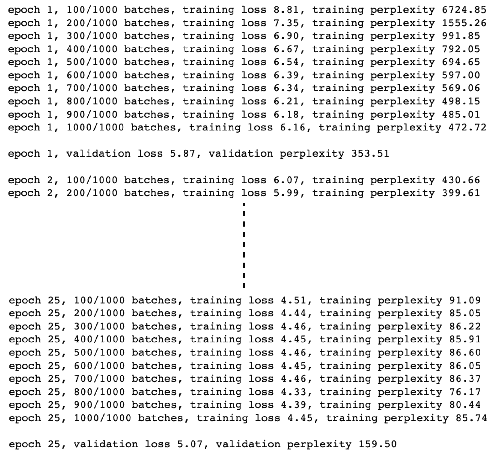

图 7 .1 – 语言模型训练日志

现在我们已经成功地训练了 25 个 epoch 的 Transformer 模型，我们可以进入实际的练习阶段，在这里我们将扩展这个训练好的语言模型作为一个文本生成模型。

### 保存和加载语言模型

在这里，我们将在训练完成后简单保存表现最佳的模型检查点。然后，我们可以单独加载这个预训练模型：

1.  一旦模型训练完成，最好将其保存在本地，以避免需要从头开始重新训练。可以按以下步骤保存：

```py
mdl_pth = './transformer.pth'
torch.save(best_model_so_far.state_dict(), mdl_pth)
```

1.  现在，我们可以加载保存的模型，以便将这个语言模型扩展为文本生成模型：

```py
# load the best trained model
transformer_cached = Transformer(num_tokens, embedding_size, num_heads, num_hidden_params, num_layers, dropout).to(device)
transformer_cached.load_state_dict(torch.load(mdl_pth))
```

在本节中，我们重新实例化了一个 Transformer 模型对象，然后将预训练的模型权重加载到这个新的模型对象中。接下来，我们将使用这个模型来生成文本。

### 使用语言模型生成文本

现在模型已经保存和加载完毕，我们可以扩展训练好的语言模型来生成文本：

1.  首先，我们必须定义我们想要生成的目标单词数量，并提供一个初始单词序列作为模型的线索：

```py
ln = 5     
sntc = 'They are       _'
sntc_split = sntc.split()
mask_source = gen_sqr_nxt_mask(max_seq_len).to(device)
```

1.  最后，我们可以在循环中逐个生成单词。在每次迭代中，我们可以将该迭代中预测的单词附加到输入序列中。这个扩展的序列成为下一个迭代中模型的输入，依此类推。添加随机种子是为了确保一致性。通过更改种子，我们可以生成不同的文本，如下面的代码块所示：

```py
torch.manual_seed(34     )
with torch.no_grad():
    for i in range(ln):
        sntc = ' '.join(sntc_split)
        txt_ds = Tensor(vocabulary(sntc_split)).unsqueeze(0).to(torch.long)
        num_b = txt_ds.size(0)
        txt_ds = txt_ds.narrow(0, 0, num_b)
        txt_ds = txt_ds.view(1, -1).t().contiguous().to(device)
        ev_X, _ = return_batch(txt_ds, i+1)
        sequence_length = ev_X.size(0)
        if sequence_length != max_seq_len:
            mask_source = mask_source[:sequence_length, :sequence_length]
        op = transformer_cached(ev_X, mask_source)
        op_flat = op.view(-1, num_tokens)
        res = vocabulary.get_itos()[op_flat.argmax(1)[0]]
        sntc_split.insert(-1, res)

print(sntc[:-2])
```

这应该会输出以下内容：

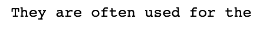

图 7 .2 – Transformer 生成的文本

我们可以看到，使用 PyTorch，我们可以训练一个语言模型（在本例中是基于 Transformer 的模型），然后通过几行额外的代码来生成文本。生成的文本似乎是有意义的。这种文本生成器的结果受到底层语言模型训练数据量和语言模型强度的限制。在本节中，我们基本上是从头开始构建了一个文本生成器。

在下一节中，我们将加载预训练语言模型，并将其用作文本生成器。我们将使用变压器模型的高级继任者 – **生成式预训练变压器**（**GPT**-2）。我们将演示如何在不到 10 行代码的情况下，使用 PyTorch 构建一个即时高级文本生成器。我们还将探讨从语言模型生成文本涉及的一些策略。

## 使用预训练的 GPT-2 模型作为文本生成器

使用`transformers`库和 PyTorch，我们可以加载大多数最新的先进变压器模型，用于执行诸如语言建模、文本分类、机器翻译等各种任务。我们在*第五章*，*混合先进模型*中展示了如何做到这一点。

在本节中，我们将加载预训练的基于 GPT-2 的语言模型。然后，我们将扩展此模型，以便我们可以将其用作文本生成器。然后，我们将探索各种策略，以便从预训练的语言模型中生成文本，并使用 PyTorch 演示这些策略。

### 使用 GPT-2 的即时文本生成

作为练习形式，我们将加载一个使用 transformers 库预训练的 GPT-2 语言模型，并将此语言模型扩展为文本生成模型以生成任意但有意义的文本。为了演示目的，我们仅显示代码的重要部分。要访问完整的代码，请转到 github [7.2] 。按照以下步骤进行：

1.  首先，我们需要导入必要的库：

```py
from transformers import GPT2LMHeadModel, GPT2Tokenizer
import torch
```

我们将导入 GPT-2 多头语言模型和相应的分词器来生成词汇表。

1.  接下来，我们将实例化`GPT2Tokenizer`和语言模型。然后，我们将提供一组初始单词作为模型的线索，如下所示：

```py
torch.manual_seed(799)
tkz = GPT2Tokenizer.from_pretrained("gpt2")
mdl = GPT2LMHeadModel.from_pretrained('gpt2')
ln = 10
cue = "They     "
gen = tkz(cue, return_tensors="pt")     
to_ret      = gen["input_ids"][0] 
```

1.  最后，我们将迭代地预测给定输入单词序列的下一个单词，使用语言模型。在每次迭代中，预测的单词将附加到下一次迭代的输入单词序列中：

```py
prv=None
for i in range(ln):
    outputs = mdl(**gen)
    next_token_logits = torch.argmax(outputs.logits[-1, :])
    to_ret = torch.cat([to_ret, next_token_logits.unsqueeze(0)])
    gen = {"input_ids": to_ret}
seq = tkz.decode(to_ret)
print(seq) 
```

输出应该如下所示：

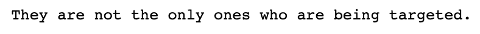

图 7.3 – GPT-2 生成的文本

这种生成文本的方式也称为**贪婪搜索**。在接下来的部分，我们将更详细地讨论贪婪搜索以及其他一些文本生成策略。

### 使用 PyTorch 的文本生成策略

当我们使用训练过的文本生成模型生成文本时，通常是逐词预测。然后，我们将预测出的一系列单词序列合并为预测文本。当我们在循环中迭代单词预测时，我们需要指定一种方法来找到/预测给定前*k*个预测后的下一个单词。这些方法也被称为文本生成策略，我们将在本节讨论一些著名的策略。

### 贪婪搜索

*贪婪*一词的正当性在于，该模型选择当前迭代中具有最大概率的单词，而不考虑它们在未来多少时间步骤后。通过这种策略，模型可能会错过一个概率高的单词，而选择了一个概率低的单词，因为模型没有追求概率低的单词。以下图表展示了贪婪搜索策略，用一个假设情景来说明在前一个练习的*第 3 步*中可能发生的情况。在每个时间步骤，文本生成模型输出可能的单词及其概率：

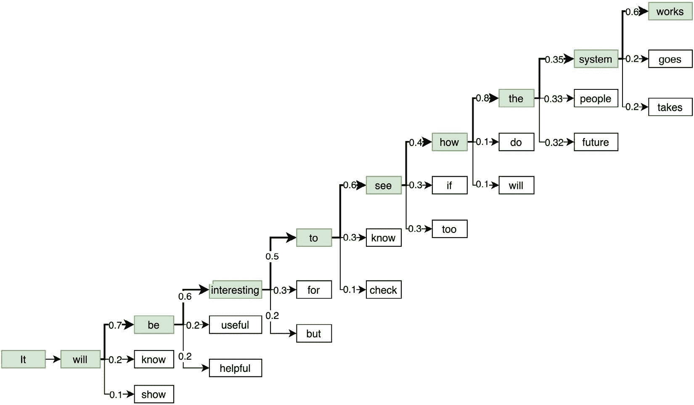

图 7 .4 – 贪婪搜索

我们可以看到，在每个步骤中，根据文本生成的贪婪搜索策略，模型会选择具有最高概率的单词。请注意倒数第二步，在这一步中，模型预测单词**system**、**people**和**future**的概率几乎相等。通过贪婪搜索，**system**被选为下一个单词，因为它的概率略高于其他单词。然而，你可以认为**people**或**future**可能会导致更好或更有意义的生成文本。

这是贪婪搜索方法的核心局限性。此外，贪婪搜索还因缺乏随机性而导致重复结果。如果有人想要艺术地使用这样的文本生成器，贪婪搜索并不是最佳选择，仅仅因为它的单调性。

在前一节中，我们手动编写了文本生成循环。由于`transformers`库的帮助，我们可以用三行代码编写文本生成步骤：

```py
ip_ids = tkz.encode(cue, return_tensors='pt')
op_greedy = mdl.generate(ip_ids, max_length=ln, pad_token_id=tkz.eos_token_id)
seq = tkz.decode(op_greedy[0], skip_special_tokens=True)
print(seq) 
```

这应该输出如下内容：

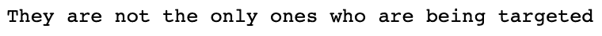

图 7 .5 – GPT-2 生成的简明文本

请注意，图 7 .5 中生成的句子比图 7 .3 中生成的句子少一个标记（句号）。这一差异是因为在后者的代码中，`max_length`参数包括了提示词。因此，如果我们有一个提示词，那么仅会预测出九个新单词，正如在这里的情况一样。

### 光束搜索

生成文本不仅仅是贪婪搜索的一种方式。**束搜索**是贪婪搜索方法的发展，其中我们维护一个基于整体预测序列概率的潜在候选序列列表，而不仅仅是下一个单词的概率。要追求的候选序列数量即为单词预测树中的光束数。

以下图表展示了如何使用光束搜索和光束大小为 3 来生成五个单词的三个候选序列（按照整体序列概率排序）：

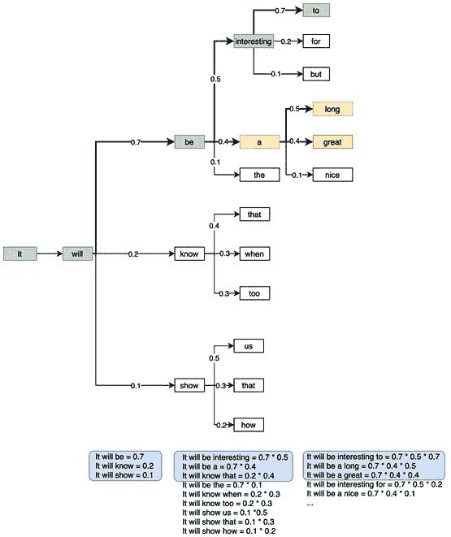

图 7 .6 – 光束搜索

在这个束搜索示例的每次迭代中，会保留三个最有可能的候选序列。随着序列的推进，可能的候选序列数呈指数增长。然而，我们只关注前三个序列。这样，我们不会像贪婪搜索那样错过潜在更好的序列。

在 PyTorch 中，我们可以使用一行代码轻松使用束搜索。以下代码演示了基于束搜索的文本生成，使用三个束生成三个最有可能的句子，每个句子包含五个单词：

```py
op_beam = mdl.generate(
    ip_ids,
    max_length=5,
    num_beams=3,
    num_return_sequences=3,
    pad_token_id=tkz.eos_token_id
)
for op_beam_cur in op_beam:
    print(tkz.decode(op_beam_cur, skip_special_tokens=True))
```

这给我们以下输出：

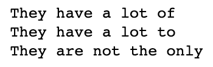

图 7 .7 – 束搜索结果

使用束搜索仍然存在重复性或单调性问题。不同的运行会得到相同的结果集，因为它确定性地寻找具有最大总体概率的序列。在接下来的部分中，我们将探讨一些方法，使生成的文本更加不可预测或创造性。

### Top-k 和 top-p 抽样

我们可以随机抽样下一个单词，而不总是选择具有最高概率的下一个单词，基于它们相对概率的可能集合。例如，在 *图 7 .6* 中，单词**be**，**know**和**show**的概率分别为 0.7，0.2 和 0.1。我们可以基于它们的概率随机抽样其中任何一个单词。如果我们重复此过程 10 次以生成 10 个单独的文本，**be**将被选择大约七次，**know**和**show**将分别被选择两次和一次。这给了我们很多贪婪或束搜索永远无法生成的可能单词组合。

使用抽样技术生成文本的两种最流行方式称为**top-k**和**top-p**抽样。在 top-k 抽样中，我们预先定义一个参数*k*，它是在抽样下一个词时应考虑的候选词数。所有其他词都将被丢弃，并且在前*k*个词中的概率将被归一化。在我们的先前示例中，如果*k*为 2，则单词**show**将被丢弃，单词**be**和**know**的概率（分别为 0.7 和 0.2）将被归一化为 0.78 和 0.22。

以下代码演示了 top-k 文本生成方法：

```py
for i in range(3):
    torch.manual_seed(i+10)
    op = mdl.generate(
        ip_ids,
        do_sample=True,
        max_length=5,
        top_k=2,
        pad_token_id=tkz.eos_token_id
    )
    seq = tkz.decode(op[0], skip_special_tokens=True)
    print(seq)
```

这应该生成以下输出：

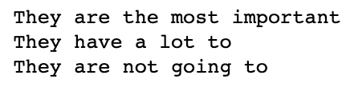

图 7 .8 – Top-k 搜索结果

要从所有可能的单词中抽样，而不仅仅是前*k*个单词，请在我们的代码中将`top-k`参数设置为`0`。如前面的屏幕截图所示，不同的运行产生不同的结果，而不是贪婪搜索，每次运行都会产生相同的结果，如以下代码所示：

```py
for i in range(3):
    torch.manual_seed(i+10)
    op_greedy = mdl.generate(ip_ids, max_length=5, pad_token_id=tkz.eos_token_id)
    seq = tkz.decode(op_greedy[0], skip_special_tokens=True)
    print(seq) 
```

这应该输出以下内容：

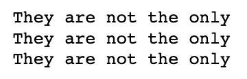

图 7 .9 – 重复的贪婪搜索结果

在 top-p 抽样策略下，与其定义要查看的前*k*个词汇不同，我们可以定义一个累积概率阈值(*p*)，然后保留那些概率总和达到*p*的词汇。在我们的例子中，如果*p*介于**0.7**和**0.9**之间，则舍弃**know**和**show**；如果*p*介于**0.9**和**1.0**之间，则舍弃**show**；如果*p*为**1.0**，则保留所有三个词汇，即**be**，**know**和**show**。

在概率分布是平坦的情况下，top-k 策略有时可能不公平。这是因为它剪切掉几乎与保留的词汇一样可能的词汇。在这些情况下，top-p 策略将保留一个更大的词汇池供抽样，并在概率分布较为尖锐时保留较小的词汇池。

以下代码展示了 top-p 抽样方法的操作：

```py
for i in range(3):
    torch.manual_seed(i+10)
    op = mdl.generate(
        ip_ids,
        do_sample=True,
        max_length=5,
        top_p=0.75,
        top_k=0,
        pad_token_id=tkz.eos_token_id
    )
    seq = tkz.decode(op[0], skip_special_tokens=True)
    print(seq)
```

这应该输出以下内容：

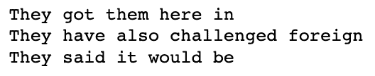

图 7 .10 – Top-p 搜索结果

我们可以同时设置 top-k 和 top-p 策略。在这个例子中，我们将`top-k`设置为`0`以基本上禁用 top-k 策略，而`p`设置为`0.75`。再次运行时，这会导致不同的句子，使我们能够生成更具创造性的文本，而不是贪婪或波束搜索。在这个领域有许多更多的文本生成策略可供选择，并且正在进行大量的研究。我们鼓励您进一步关注此问题。

一个很好的起点是在`transformers`库中玩转可用的文本生成策略。您可以从他们的博客文章[7.3]中了解更多信息。

这篇文章总结了我们使用 PyTorch 生成文本的探索。在下一节中，我们将执行类似的练习，但这次是针对音乐而不是文本。其思想是在音乐数据集上训练一个无监督模型，并使用训练好的模型生成类似训练数据集中的旋律。

## 使用 PyTorch 生成 MIDI 音乐的 LSTM 方法

转向音乐，本节中我们将使用 PyTorch 创建一个可以生成类似古典音乐的机器学习模型。在上一节中，我们使用 transformers 生成文本。在这里，我们将使用 LSTM 模型处理序列音乐数据。我们将在莫扎特的古典音乐作品上训练模型。

每个音乐作品本质上将被分解为一系列钢琴音符。我们将以**音乐器件数字接口**（**MIDI**）文件的形式读取音乐数据，这是一种用于跨设备和环境方便读写音乐数据的常用格式。

在将 MIDI 文件转换为钢琴音符序列（我们称之为钢琴卷轴）之后，我们将使用它们来训练一个下一个钢琴音符检测系统。在这个系统中，我们将构建一个基于 LSTM 的分类器，用于预测给定钢琴音符前序列的下一个钢琴音符，总共有 88 个（符合标准的 88 个钢琴键）。

现在，我们将展示构建 AI 音乐作曲家的整个过程，这是一个练习形式。我们的重点将放在用于数据加载、模型训练和生成音乐样本的 PyTorch 代码上。请注意，模型训练过程可能需要几个小时，因此建议在后台运行训练过程，例如过夜。出于保持文本简短的考虑，此处呈现的代码已被削减。

关于处理 MIDI 音乐文件的详细信息超出了本书的范围，尽管鼓励你探索完整的代码，该代码可在 github [7.4] 找到。

### 加载 MIDI 音乐数据

首先，我们将演示如何加载以 MIDI 格式可用的音乐数据。我们将简要介绍处理 MIDI 数据的代码，然后说明如何将其转换为 PyTorch 数据加载器。让我们开始吧：

1.  如往常一样，我们将从导入重要的库开始。在这个练习中，我们将使用一些新的库，具体如下：

```py
import skimage.io as io
from struct import pack, unpack
from io import StringIO, BytesIO
```

`skimage` 用于可视化模型生成的音乐样本序列。`struct` 和 `io` 用于处理将 MIDI 音乐数据转换为钢琴卷轴的过程。

1.  接下来，我们将编写用于加载 MIDI 文件并将其转换为钢琴音符序列（矩阵）的辅助类和函数。首先，我们定义一些 MIDI 常量，以配置各种音乐控制，如音高、通道、序列开始、序列结束等：

```py
NOTE_MIDI_OFF = 0x80
NOTE_MIDI_ON = 0x90
CHNL_PRESS = 0xD0
MIDI_PITCH_BND = 0xE0
...
```

1.  接下来，我们将定义一系列类，用于处理 MIDI 数据的输入和输出流、MIDI 数据解析器等，如下所示：

```py
class MOStrm:
# MIDI Output Stream
...
class MIFl:
# MIDI Input File Reader
...
class MOFl(MOStrm):
# MIDI Output File Writer
...
class RIStrFl:
# Raw Input Stream File Reader
...
class ROStrFl:
# Raw Output Stream File Writer
...
class MFlPrsr:
# MIDI File Parser
...
class EvtDspch:
# Event Dispatcher
...
class MidiDataRead(MOStrm):
# MIDI Data Reader
...
```

1.  处理完所有 MIDI 数据 I/O 相关的代码后，我们现在可以实例化我们自己的 PyTorch 数据集类了。在此之前，我们必须定义两个关键函数——一个用于将读取的 MIDI 文件转换为钢琴卷轴，另一个用于用空音符填充钢琴卷轴。这将使数据集中的音乐片段长度标准化：

```py
def md_fl_to_pio_rl(md_fl):
    md_d = MidiDataRead(md_fl, dtm=0.3)
    pio_rl = md_d.pio_rl.transpose()
    pio_rl[pio_rl > 0] = 1    
    return pio_rl
def pd_pio_rl(pio_rl, mx_l=132333, pd_v=0):        
    orig_rol_len = pio_rl.shape[1]    
    pdd_rol = np.zeros((88, mx_l))
    pdd_rol[:] = pd_v    
    pdd_rol[:, - orig_rol_len:] = pio_rl
    return pdd_rol
```

1.  现在，我们可以定义我们的 PyTorch 数据集类，如下所示：

```py
class NtGenDataset(data.Dataset):    
    def __init__(self, md_pth, mx_seq_ln=1491):        
        ...    
    def mx_len_upd(self):        
        ...   
    def __len__(self):        
        return len(self.md_fnames_ful)    
    def __getitem__(self, index):        
        md_fname_ful = self.md_fnames_ful[index]        
        pio_rl = md_fl_to_pio_rl(md_fname_ful)
        seq_len = pio_rl.shape[1] - 1
        ip_seq = pio_rl[:, :-1]
        gt_seq = pio_rl[:, 1:]
        ...
        return (torch.FloatTensor(ip_seq_pad),
                torch.LongTensor(gt_seq_pad), torch.LongTensor([seq_len]))
```

1.  除了数据集类之外，我们还必须添加另一个辅助函数，将训练数据批次中的音乐序列后处理为三个单独的列表。这些列表将是输入序列、输出序列和序列的长度，按序列长度降序排列：

```py
def pos_proc_seq(btch):
    ip_seqs, op_seqs, lens = btch    
    ...
    ord_tr_data_tups = sorted(tr_data_tups,
                                         key=lambda c: int(c[2]),
                                         reverse=True)
    ip_seq_splt_btch, op_seq_splt_btch, btch_splt_lens = zip(*ord_tr_data_tups)
    ...  
    return tps_ip_seq_btch, ord_op_seq_btch, list(ord_btch_lens_l)
```

1.  为了这个练习，我们将使用一组莫扎特的作品。您可以从钢琴 MIDI 网站[7.5]下载数据集：。下载的文件夹包含 21 个 MIDI 文件，我们将它们分成 18 个训练集文件和 3 个验证集文件。下载的数据存储在`./mozart/train`和`./mozart/valid`下。下载完成后，我们可以读取数据并实例化我们自己的训练和验证数据集加载器：

```py
training_dataset = NtGenDataset('./mozart/train', mx_seq_ln=None)
training_datasetloader = data.DataLoader(training_dataset, batch_size=5,shuffle=True, drop_last=True)
validation_dataset = NtGenDataset('./mozart/valid/', mx_seq_ln=None)
validation_datasetloader = data.DataLoader(validation_dataset, batch_size=3, shuffle=False, drop_last=False)
X_validation = next(iter(validation_datasetloader))
X_validation[0].shape
```

这应该会给我们以下输出：


图 7 .11 – 莫扎特作品数据示例维度

如我们所见，第一个验证批次包含三个长度为 1,587 的序列（音符），每个序列编码为一个 88 大小的向量，其中 88 是钢琴键的总数。对于那些训练有素的音乐家，以下是验证集音乐文件的前几个音符的乐谱等价物：

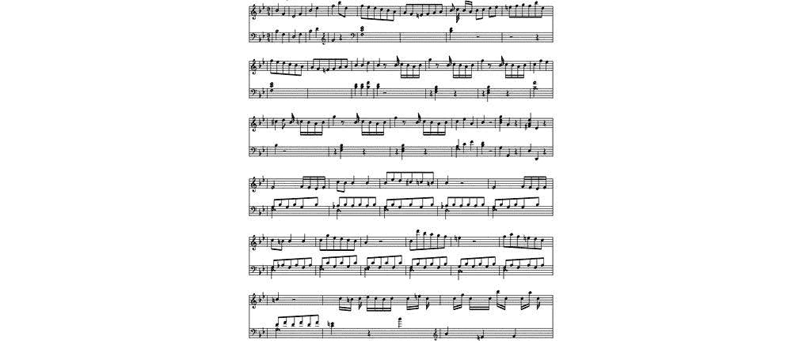

图 7 .12 – 莫扎特作品的乐谱

或者，我们可以将音符序列可视化为一个具有 88 行的矩阵，每行代表一个钢琴键。以下是前述旋律（1,587 个音符中的前 300 个）的视觉矩阵表示：

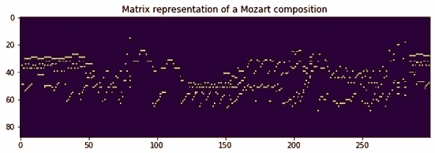

图 7 .13 – 莫扎特作品的矩阵表示

> **数据集引用**
> 
> > Bernd Krueger 的 MIDI、音频（MP3、OGG）和视频文件受 CC BY-SA Germany 许可证的保护。姓名：Bernd Krueger 来源：[`www.piano-midi.de`](http://www.piano-midi.de)。这些文件的分发或公共播放仅允许在相同的许可条件下进行。乐谱是开源的。

现在我们将定义 LSTM 模型和训练例程。

### 定义 LSTM 模型和训练例程

到目前为止，我们已成功加载了一个 MIDI 数据集，并用它创建了自己的训练和验证数据加载器。在本节中，我们将定义 LSTM 模型架构以及在模型训练循环中运行的训练和评估过程。让我们开始吧：

1.  首先，我们必须定义模型架构。如前所述，我们将使用一个 LSTM 模型，该模型由编码器层组成，在序列的每个时间步骤将输入数据的 88 维表示编码为 512 维隐藏层表示。编码器之后是两个 LSTM 层，再接一个全连接层，最终通过 softmax 函数映射到 88 个类别。

根据我们在*第四章 深度递归模型架构*中讨论的不同类型的**递归神经网络**（**RNNs**），这是一个多对一的序列分类任务，其中输入是从时间步 *0* 到时间步 *t* 的整个序列，输出是时间步 *t+1* 处的 88 个类别之一，如下所示：

```py
class MusicLSTM(nn.Module):    
    def __init__(self, ip_sz, hd_sz, n_cls, lyrs=2):        
        ...       
        self.nts_enc = nn.Linear(in_features=ip_sz, out_features=hd_sz)        
        self.bn_layer = nn.BatchNorm1d(hd_sz)        
        self.lstm_layer = nn.LSTM(hd_sz, hd_sz, lyrs)        
        self.fc_layer = nn.Linear(hd_sz, n_cls)

    def forward(self, ip_seqs, ip_seqs_len, hd=None):
        ...
        pkd = torch.nn.utils.rnn.pack_padded_sequence(nts_enc_ful, ip_seqs_len)
        op, hd = self.lstm_layer(pkd, hd)
        ...
        lgts = self.fc_layer(op_nrm_drp.permute(2,0,1))
        ...
        zero_one_lgts = torch.stack((lgts, rev_lgts), dim=3).contiguous()
        flt_lgts = zero_one_lgts.view(-1, 2)
        return flt_lgts, hd
```

1.  一旦模型架构被定义，我们就可以指定模型训练例程。我们将使用 Adam 优化器并进行梯度裁剪以避免过拟合。作为对抗过拟合的另一个措施，我们已经在先前的步骤中使用了一个 dropout 层：

```py
def lstm_model_training(lstm_model, lr, ep=10, val_loss_best=float("inf")):
    ...
    for curr_ep in range(ep):
        ...
        for batch in training_datasetloader:
            ...
            lgts, _ = lstm_model(ip_seq_b_v, seq_l)
            loss = loss_func(lgts, op_seq_b_v)
            ...
        if vl_ep_cur < val_loss_best:
            torch.save(lstm_model.state_dict(), 'best_model.pth')
            val_loss_best = vl_ep_cur
    return val_loss_best, lstm_model
```

1.  同样地，我们将定义模型评估例程，其中模型的前向传播在其参数保持不变的情况下运行：

```py
def evaluate_model(lstm_model):
    ...
    for batch in validation_datasetloader:
        ...
        lgts, _ = lstm_model(ip_seq_b_v, seq_l)
        loss = loss_func(lgts, op_seq_b_v)
        vl_loss_full += loss.item()
        seq_len += sum(seq_l)
    return vl_loss_full/(seq_len*88)
```

现在，让我们来训练和测试音乐生成模型。

### 训练和测试音乐生成模型

在最后的部分，我们将实际训练 LSTM 模型。然后，我们将使用训练好的音乐生成模型生成一段我们可以听并分析的音乐样本。让我们开始吧：

1.  我们已准备好实例化我们的模型并开始训练。对于这个分类任务，我们使用了分类交叉熵作为损失函数。我们将以学习率`0.01`进行`10`个 epoch 的模型训练：

```py
loss_func = nn.CrossEntropyLoss().cpu()
lstm_model = MusicLSTM(ip_sz=88, hd_sz=512, n_cls=88).cpu()
val_loss_best, lstm_model = lstm_model_training(lstm_model, lr=0.01, ep=10)
```

这将输出以下内容：

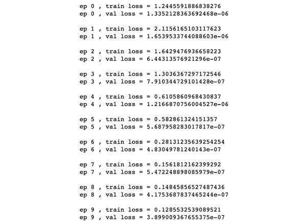

图 7 . 14 – 音乐 LSTM 训练日志

1.  现在是有趣的部分。一旦我们有了一个下一个音符预测器，我们就可以将其用作音乐生成器。我们所需做的就是通过提供一个初始音符作为线索来启动预测过程。模型然后可以在每个时间步骤递归地预测下一个音符，在此过程中，*t*时间步的预测将附加到*t+1*时间步的输入序列中。

在这里，我们将编写一个音乐生成函数，该函数接收训练好的模型对象、生成音乐的长度、序列的起始音符和温度作为输入。温度是在分类层上标准的数学操作。它用于操纵 softmax 概率分布，可以通过扩展或缩小 softmax 概率分布来调整 softmax 概率的分布。代码如下：

```py
def generate_music(lstm_model, ln=100, tmp=1, seq_st=None):
    ...
    for i in range(ln):
        op, hd = lstm_model(seq_ip_cur, [1], hd)
        probs = nn.functional.softmax(op.div(tmp), dim=1)
        ...
    gen_seq = torch.cat(op_seq, dim=0).cpu().numpy()
    return gen_seq
```

最后，我们可以使用此函数来创建全新的音乐作品：

```py
seq = generate_music(lstm_model, ln=100, tmp=1, seq_st=None)
midiwrite('generated_music.mid', seq, dtm=0.2)
```

这将创建音乐作品并将其保存为当前目录下的 MIDI 文件。我们可以打开文件并播放它以听听模型产生了什么。此外，我们还可以查看所产生音乐的视觉矩阵表示：

```py
io.imshow(seq)
```

这将给我们以下输出：

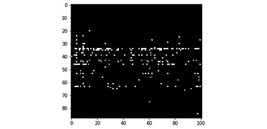

图 7 .15 – AI 生成音乐示例的矩阵表示

此外，以下是生成音乐作品作为乐谱的样子：

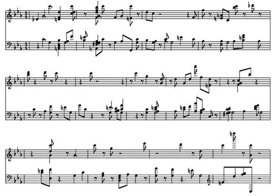

图 7 . 16 – AI 生成音乐示例的乐谱

在这里，我们可以看到生成的旋律似乎不像莫扎特的原创作品那样悦耳动听。尽管如此，您可以看到模型已学会了一些关键组合的一致性。此外，通过在更多数据上训练模型并增加训练轮次，生成音乐的质量可以得到提升。

这就结束了我们关于使用机器学习生成音乐的练习。在本节中，我们演示了如何使用现有的音乐数据从头开始训练一个音符预测模型，并使用训练好的模型生成音乐。事实上，你可以将生成模型的思路扩展到生成任何类型数据的样本上。PyTorch 在这类用例中非常有效，特别是由于其简单直观的数据加载、模型构建/训练/测试的 API，以及将训练好的模型用作数据生成器的能力。我们鼓励你在不同的用例和数据类型上尝试更多类似的任务。

## 总结

在本章中，我们探讨了使用 PyTorch 的生成模型。在同样的艺术风格中，在下一章中，我们将学习如何使用机器学习将一幅图像的风格转移到另一幅图像上。有了 PyTorch 的支持，我们将使用 CNN 从各种图像中学习艺术风格，并将这些风格应用于不同的图像上——这一任务更为人熟知的是神经风格转移。
