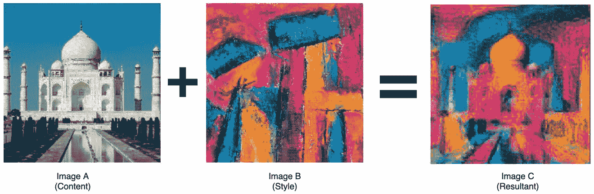

# 8 神经风格转移

## 加入我们的书籍社区 Discord

[`packt.link/EarlyAccessCommunity`](https://packt.link/EarlyAccessCommunity)


在前一章中，我们开始探索使用 PyTorch 的生成模型。我们构建了可以在文本和音乐数据上无监督训练的机器学习模型，从而能够生成文本和音乐。在本章中，我们将继续探索生成建模，通过类似的方法应用于图像数据。

我们将混合两幅不同图像**A**和**B**的不同方面，生成一幅结果图像**C**，其中包含图像**A**的内容和图像**B**的风格。这项任务也被称为**神经风格转移**，因为在某种程度上，我们正在将图像**B**的风格转移到图像**A**，以实现图像**C**，如下图所示：



图 8.1 – 神经风格转移示例

首先，我们将简要讨论如何解决这个问题，并理解实现风格转移背后的想法。然后，我们将使用 PyTorch 实现自己的神经风格转移系统，并将其应用于一对图像。通过这个实现练习，我们还将试图理解风格转移机制中不同参数的影响。

到本章末，您将理解神经风格转移背后的概念，并能够使用 PyTorch 构建和测试自己的神经风格转移模型。

本章涵盖以下主题：

+   理解如何在图像之间转移风格

+   使用 PyTorch 实现神经风格转移

## 理解如何在图像之间转移风格

在*第三章*，*深度 CNN 结构*中，我们详细讨论了**卷积神经网络**（**CNNs**）。当处理图像数据时，CNNs 是最成功的模型类之一。我们已经看到，基于 CNN 的架构在图像分类、物体检测等任务上是表现最佳的神经网络架构之一。这一成功的核心原因之一是卷积层学习空间表示的能力。

例如，在狗与猫分类器中，CNN 模型基本上能够捕捉图像中的内容在其更高级别的特征中，这帮助它检测狗特有的特征与猫特有的特征。我们将利用图像分类器 CNN 的这种能力来把握图像的内容。

我们知道 VGG 是一个强大的图像分类模型，如*第三章*，*深度 CNN 结构*中所述。我们将使用 VGG 模型的卷积部分（不包括线性层）来从图像中提取与内容相关的特征。

我们知道每个卷积层都会生成 *N* 个尺寸为 *X*Y* 的特征图。例如，假设我们有一个单通道（灰度）输入图像尺寸为（3,3），一个卷积层的输出通道数 (*N*) 为 3，核大小为（2,2），步幅为（1,1），且没有填充。这个卷积层将产生 3 个尺寸为 2x2 的特征图，因此在这种情况下 *X*=2，*Y*=2。

我们可以将卷积层产生的这些 *N* 个特征图表示为大小为 *N*M* 的 2D 矩阵，其中 *M=X*Y*。通过定义每个卷积层的输出为 2D 矩阵，我们可以定义一个损失函数，将其附加到每个卷积层上。这个损失函数称为**内容损失**，是预期输出与卷积层预测输出之间的平方损失，如下图所示，其中 *N*=3，*X*=2，*Y*=2：


图 8\. 2 – 内容损失示意图

正如我们所见，输入图像（图像 *C*，如我们在 *图 8.* *1* 中的标记）在本示例中通过**卷积层**转换为**三个特征图**。这三个尺寸为 2x2 的特征图每个都被格式化为一个 3x4 的矩阵。该矩阵与通过相同流程将图像 *A*（内容图像）通过的预期输出进行比较。然后计算像素逐点的平方和损失，我们称之为**内容损失**。

现在，为了从图像中提取风格，我们将使用由减少的 2D 矩阵表示的行之间内积得出的格拉姆矩阵 [8.1]，如下图所示：


图 8\. 3 – 风格损失示意图

在这里，与内容损失计算相比，格拉姆矩阵的计算是唯一的额外步骤。同时，正如我们所见，像素逐点平方和损失的输出数值相比内容损失而言相当大。因此，通过将其除以 *N*X*Y*，即特征图的数量 (*N*) 乘以长度 (*X*) 乘以宽度 (*Y*)，来对这个数值进行标准化。这也有助于在具有不同 *N*、*X* 和 *Y* 的不同卷积层之间标准化**风格损失**指标。关于实现的详细信息可以在引入神经风格迁移的原始论文 [8.2] 中找到。

现在我们理解了内容和风格损失的概念，让我们来看看神经风格迁移的工作原理，如下所示：

1.  对于给定的 VGG（或任何其他 CNN）网络，我们定义网络中哪些卷积层应该附加内容损失。重复此操作以进行风格损失。

1.  一旦我们有了这些列表，我们将内容图像通过网络，并计算在应计算内容损失的卷积层处的预期卷积输出（2D 矩阵）。

1.  接下来，我们将风格图像通过网络并在卷积层计算预期的格拉姆矩阵。这就是风格损失将被计算的地方，如下图所示。

在下图中，例如，将在第二和第三个卷积层计算内容损失，同时在第二、第三和第五个卷积层计算风格损失：


图 8\. 4 – 风格转移架构图示

现在我们在决定的卷积层具有内容和风格目标后，我们准备好生成一幅图像，其中包含内容图像的内容和风格图像的风格。

对于初始化，我们可以使用随机噪声矩阵作为生成图像的起始点，或直接使用内容图像作为起点。我们将此图像通过网络并在预选卷积层计算风格和内容损失。我们将风格损失相加以获得总风格损失，并将内容损失相加以获得总内容损失。最后，通过加权的方式将这两个组件相加，我们获得总损失。

如果我们更注重风格组件，生成的图像将更多地反映其风格，反之亦然。使用梯度下降，我们将损失反向传播到输入，以更新我们生成的图像。几个时期后，生成的图像应该以一种方式演变，以产生最小化相应损失的内容和风格表示，从而产生风格转移的图像。

在前面的图表中，池化层是基于平均池化而不是传统的最大池化。平均池化被有意地用于风格转移，以确保平滑的梯度流。我们希望生成的图像不会在像素之间产生剧烈变化。此外，值得注意的是，前面图表中的网络在计算最后一个风格或内容损失的层结束。因此，在这种情况下，因为原始网络的第六个卷积层没有关联的损失，所以在风格转移的背景下谈论第五个卷积层之后的层是没有意义的。

在接下来的部分中，我们将使用 PyTorch 实现自己的神经风格转移系统。借助预训练的 VGG 模型，我们将使用本节讨论的概念生成艺术风格的图像。我们还将探讨调整各种模型参数对生成图像的内容和纹理/风格的影响。

## 使用 PyTorch 实现神经风格转移

在讨论了神经风格迁移系统的内部之后，我们已经准备好使用 PyTorch 构建一个系统。作为练习，我们将加载一个风格图像和一个内容图像。然后，我们将加载预训练的 VGG 模型。在定义要计算风格和内容损失的层之后，我们将修剪模型，使其仅保留相关层。最后，我们将训练神经风格迁移模型，逐步改进生成的图像。

### 加载内容和风格图像

在这个练习中，我们只会展示代码的重要部分以示例。要获取完整的代码，请访问我们的 github 代码库 [8.3] 。请按照以下步骤进行：

1.  首先，我们需要导入必要的库：

```py
from PIL import Image
import matplotlib.pyplot as pltimport torch
import torch.nn as nn
import torch.optim as optim
import torchvisiondvc = torch.device("cuda" if torch.cuda.is_available() else "cpu")
```

除了其他库外，我们导入`torchvision`库以加载预训练的 VGG 模型和其他计算机视觉相关的工具。

1.  接下来，我们需要一个风格图像和一个内容图像。我们将使用 unsplash 网站 [8.4] 下载这两种图像。这些下载的图像已包含在本书的代码库中。在下面的代码中，我们编写一个函数来将图像加载为张量：

```py
def image_to_tensor(image_filepath,  image_dimension=128):
    img = Image.open(image_filepath).convert('RGB')
    # display image
    …
    torch_transformation =       torchvision.transforms.Compose([
        torchvision.transforms.Resize(img_size),
        torchvision.transforms.ToTensor()
                              ])
    img = torch_transformation(img).unsqueeze(0)
    return img.to(dvc, torch.float)
style_image = image_to_tensor("./images/style.jpg")
content_image =image_to_tensor("./images/content.jpg")
```

输出应如下所示：


图 8\. 5 – 风格和内容图像

因此，内容图像是*泰姬陵*的真实照片，而风格图像是一幅艺术画作。通过风格迁移，我们希望生成一幅艺术性的*泰姬陵*画作。然而，在此之前，我们需要加载并修剪 VGG19 模型。

### 加载并修剪预训练的 VGG19 模型

在这部分练习中，我们将使用预训练的 VGG 模型并保留其卷积层。我们将对模型进行一些小的更改，使其适用于神经风格迁移。让我们开始吧：

1.  我们将首先加载预训练的 VGG19 模型，并使用其卷积层生成内容和风格目标，从而产生内容和风格损失：

```py
vgg19_model = torchvision.models.vgg19(pretrained=True).to(dvc)
print(vgg19_model)
```

输出应如下所示：


图 8\. 6 – VGG19 模型

1.  我们不需要线性层；也就是说，我们只需要模型的卷积部分。在前面的代码中，可以通过仅保留模型对象的`features`属性来实现：

```py
vgg19_model = vgg19_model.features
```

> 注意
> 
> > 在这个练习中，我们不会调整 VGG 模型的参数。我们只会调整生成图像的像素，即模型输入端。因此，我们将确保加载的 VGG 模型的参数是固定的。

1.  我们必须使用以下代码冻结 VGG 模型的参数：

```py
for param in vgg19_model.parameters():
    param.requires_grad_(False)
```

1.  现在我们已经加载了 VGG 模型的相关部分，我们需要将`maxpool`层改为平均池化层，如前面讨论的那样。在此过程中，我们将注意到模型中卷积层的位置：

```py
conv_indices = []for i in range(len(vgg19_model)):
    if vgg19_model[i]._get_name() == 'MaxPool2d':
        vgg19_model[i] =  nn.AvgPool2d(kernel_size=vgg19_model[i].kernel_size,
stride=vgg19_model[i].stride, padding=vgg19_model[i].padding)
    if vgg19_model[i]._get_name() == 'Conv2d':
        conv_indices.append(i)
conv_indices = dict(enumerate(conv_indices, 1))print(vgg19_model)
```

输出应如下所示：


图 8\. 7 – 修改后的 VGG19 模型

正如我们所看到的，线性层已被移除，并且最大池化层已被替换为平均池化层，如前图中的红色框所示。

在前面的步骤中，我们加载了一个预训练的 VGG 模型，并对其进行了修改，以便将其用作神经风格迁移模型。接下来，我们将把这个修改后的 VGG 模型转换成一个神经风格迁移模型。

### 构建神经风格迁移模型

此时，我们可以定义希望计算内容和风格损失的卷积层。在原始论文中，风格损失是在前五个卷积层上计算的，而内容损失仅在第四个卷积层上计算。我们将遵循相同的惯例，尽管您可以尝试不同的组合并观察它们对生成图像的影响。请按照以下步骤进行：

1.  首先，我们列出我们需要在其上进行风格和内容损失的层：

```py
layers = {1: 's', 2: 's', 3: 's', 4: 'sc', 5: 's'}
```

在这里，我们定义了第一到第五个卷积层，这些层与风格损失相关联，并且第四个卷积层与内容损失相关联。

1.  现在，让我们删除 VGG 模型中不必要的部分。我们将仅保留它到第五个卷积层，如下所示：

```py
vgg_layers = nn.ModuleList(vgg19_model)
last_layer_idx = conv_indices[max(layers.keys())]
vgg_layers_trimmed = vgg_layers[:last_layer_idx+1]
neural_style_transfer_model = nn.Sequential(*vgg_layers_trimmed)
print(neural_style_transfer_model)
```

这应该给我们以下输出：


图 8\. 8 – 神经风格迁移模型对象

正如我们所看到的，我们已经将具有 16 个卷积层的 VGG 模型转换为具有五个卷积层的神经风格迁移模型。

### 训练风格迁移模型

在本节中，我们将开始处理将生成的图像。我们可以通过多种方式初始化这个图像，例如使用随机噪声图像或使用内容图像作为初始图像。目前，我们将从随机噪声开始。稍后，我们还将看到使用内容图像作为起点对结果的影响。请按照以下步骤进行：

1.  下面的代码演示了使用随机数初始化`torch`张量的过程：

```py
# initialize as the content image
# ip_image = content_image.clone()
# initialize as random noise:
ip_image = torch.randn(content_image.data.size(), device=dvc)
plt.figure()
plt.imshow(ip_image.squeeze(0).cpu().detach().numpy().transpose(1,2,0).clip(0,1));
```

这应该给我们以下输出：


图 8\. 9 – 随机噪声图像

1.  最后，我们可以开始模型训练循环。首先，我们将定义训练的时代数，为风格和内容损失提供的相对权重，并使用学习率为`0.1`的 Adam 优化器进行基于梯度下降的优化实例化：

```py
num_epochs=180
wt_style=1e6
wt_content=1
style_losses = []
content_losses = []
opt = optim.Adam([ip_image.requires_grad_()], lr=0.1)
```

1.  在开始训练循环时，我们在时代开始时将风格和内容损失初始化为零，然后为了数值稳定性将输入图像的像素值剪切在`0`和`1`之间。

```py
for curr_epoch in range(1, num_epochs+1):    
    ip_image.data.clamp_(0, 1)
    opt.zero_grad()
    epoch_style_loss = 0
    epoch_content_loss = 0
```

1.  在这个阶段，我们已经达到了训练迭代的关键步骤。在这里，我们必须计算每个预定义的风格和内容卷积层的风格和内容损失。将各自层的单独风格损失和内容损失相加，得到当前时代的总风格和内容损失：

```py
 for k in layers.keys():
        if 'c' in layers[k]:
            target = neural_style_transfer_model[:conv_indices[k]+1](content_image).detach()
            ip = neural_style_transfer_model[:conv_indices[k]+1](ip_image)
            epoch_content_loss += torch.nn.functional.mse_loss(ip, target)
        if 's' in layers[k]:
            target = gram_matrix(neural_style_transfer_model[:conv_indices[k]+1](style_image)).detach()
            ip = gram_matrix(neural_style_transfer_model[:conv_indices[k]+1](ip_image))
            epoch_style_loss += torch.nn.functional.mse_loss(ip, target)
```

正如前面的代码所示，对于风格和内容损失，首先，我们使用风格和内容图像计算风格和内容目标（地面真值）。我们使用`.detach()`来表示这些目标不可训练，而只是固定的目标值。接下来，我们根据生成的图像作为输入，在每个风格和内容层计算预测的风格和内容输出。最后，我们计算风格和内容损失。

1.  关于风格损失，我们还需要使用预定义的 Gram 矩阵函数来计算 Gram 矩阵，如下面的代码所示：

```py
def gram_matrix(ip):
    num_batch, num_channels, height, width = ip.size()
    feats = ip.view(num_batch * num_channels, width *   height)
    gram_mat = torch.mm(feats, feats.t())
    return gram_mat.div(num_batch * num_channels *        width * height)
```

正如我们之前提到的，我们可以使用`torch.mm`函数计算内部点积。这将计算 Gram 矩阵并通过特征映射数乘以每个特征映射的宽度和高度来归一化矩阵。

1.  在我们的训练循环中继续进行，现在我们已经计算出了总风格和内容损失，我们需要计算最终的总损失，作为这两者的加权和，使用我们之前定义的权重：

```py
 epoch_style_loss *= wt_style
    epoch_content_loss *= wt_content
    total_loss = epoch_style_loss + epoch_content_loss
    total_loss.backward()
```

最后，在每*k*个时代，我们可以通过查看损失以及查看生成的图像来看到我们训练的进展。以下图表显示了前一个代码的生成风格转移图像的演变，总共记录了 180 个时代，每 20 个时代一次：


图 8\. 10 – 神经风格转移逐时代生成的图像

很明显，模型开始时将风格从风格图像应用于随机噪声。随着训练的进行，内容损失开始发挥作用，从而为风格化图像赋予内容。到第**180**个时代，我们可以看到生成的图像，看起来像是塔吉马哈尔的艺术绘画的良好近似。以下图表显示了从**0**到**180**个时代随着时代的推移逐渐减少的风格和内容损失：


图 8\. 11 – 风格和内容损失曲线

显然，风格损失在最初急剧下降，这也在*图 8.* *10*中有所体现，即初始时期更多地将风格施加在图像上而不是内容。在训练的高级阶段，两种损失逐渐下降，导致风格转移图像，这是风格图像艺术性和以相机拍摄的照片逼真性之间的一个不错的折衷。

### 对风格转移系统进行实验

在上一节成功训练了样式迁移系统后，我们现在将看看系统如何响应不同的超参数设置。按照以下步骤进行：

1.  在前一节中，我们将内容权重设置为`1`，将样式权重设置为`1e6`。让我们进一步增加样式权重 10 倍，即到`1e7`，并观察它如何影响样式迁移过程。使用新权重进行 600 个时期的训练后，我们得到了以下样式迁移的进展：


图 8\. 12 – 高风格权重的样式迁移时期

这里我们可以看到，与之前的情况相比，最初需要更多的时期才能达到合理的结果。更重要的是，较高的样式权重似乎对生成的图像有影响。当我们将前一张图像与*图 8.* *10*中的图像进行比较时，我们发现前者更像*图 8.* *5*中展示的样式图像。

1.  同样地，将样式权重从`1e6`减少到`1e5`会产生更加注重内容的结果，如下图所示：


图 8\. 13 – 低风格权重的样式迁移时期

与较高样式权重的情况相比，降低样式权重意味着需要更少的时期才能得到看起来合理的结果。生成图像中的样式量要小得多，主要填充了内容图像数据。我们仅对此情况进行了 6 个时期的训练，因为在那之后结果就会饱和。

1.  最后的改变可能是将生成的图像初始化为内容图像，而不是随机噪声，同时使用原始的样式和内容权重`1e6`和`1`。以下图显示了这种情况下的时期逐步进展：


图 8\. 14 – 使用内容图像初始化的样式迁移时期

通过比较前一张图与*图 8.* *10*，我们可以看到，将内容图像作为起点确实为我们得到合理的样式迁移图像提供了不同的进展路径。似乎生成图像上同时施加了内容和样式组件，而不像*图 8.* *10*中那样，先施加样式，然后是内容。以下图表证实了这一假设：


图 8\. 15 – 使用内容图像初始化的样式和内容损失曲线

正如我们所看到的，随着训练周期的推进，风格损失和内容损失一起减少，最终朝向饱和状态发展。尽管如此，*图 8.* *10*和 8\. *14*甚至*图 8.* *12*和 8\. *13*的最终结果都展示了*泰姬陵*的合理艺术印象。

我们成功地使用 PyTorch 构建了一个神经风格转移模型，在这个模型中，使用了一个内容图像——*泰姬陵*的照片——和一个风格图像——一幅画布绘画——我们生成了*泰姬陵*的一个合理的艺术画作近似。这个应用可以扩展到各种其他组合。交换内容和风格图像也可能产生有趣的结果，并更深入地了解模型的内部工作原理。

鼓励您通过以下方式扩展本章中讨论的练习：

+   更改风格和内容层列表

+   使用更大的图像尺寸

+   尝试更多的风格和内容损失权重组合

+   使用其他优化器，如 SGD 和 LBFGS

+   使用不同的学习率进行更长的训练周期，以便观察所有这些方法生成的图像之间的差异

## 总结

在本章中，我们将生成式机器学习的概念应用于图像，通过生成一幅包含一张图像内容和另一张风格的图像，这被称为神经风格转移的任务。在下一章中，我们将扩展这一范式，我们将拥有一个生成器生成*虚假*数据，还有一个鉴别器区分*虚假*数据和*真实*数据。这样的模型通常被称为**生成对抗网络（GANs）**。在下一章中，我们将探索深度卷积 GANs（DCGANs）。
