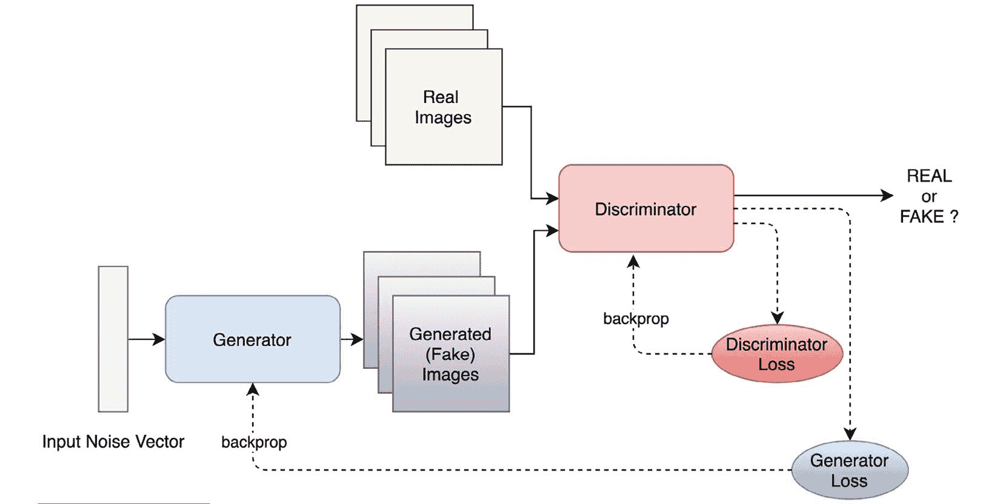
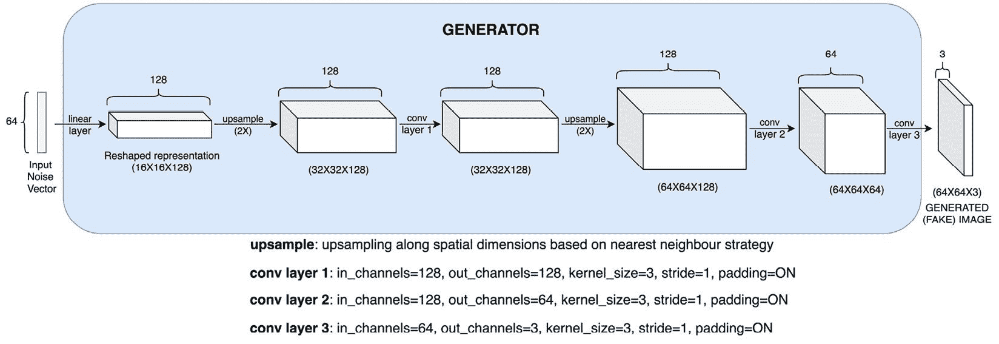
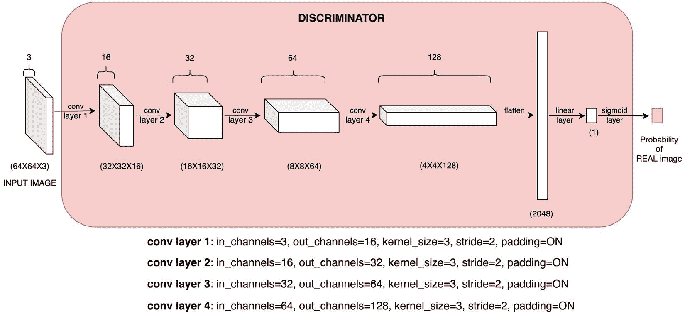
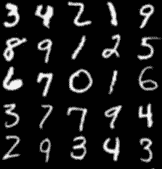
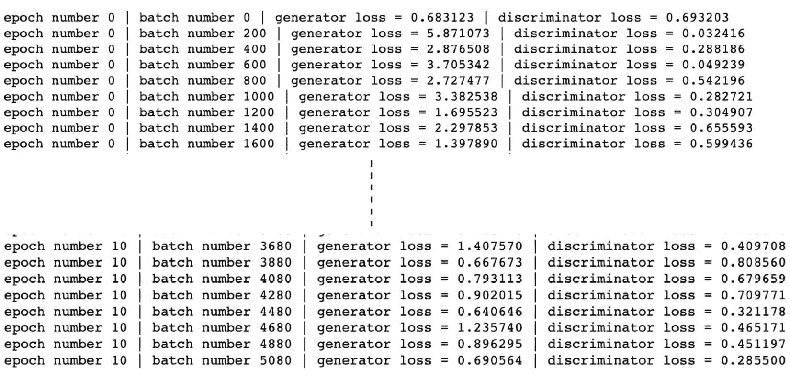
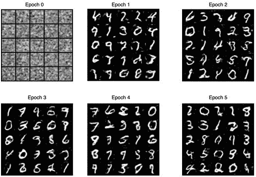
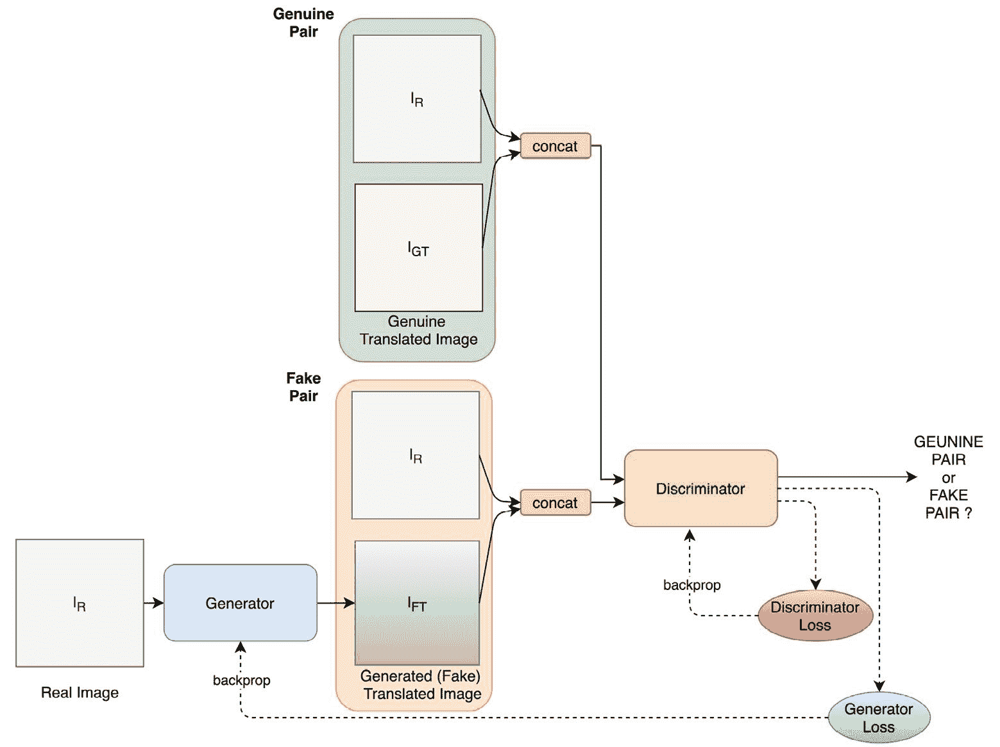
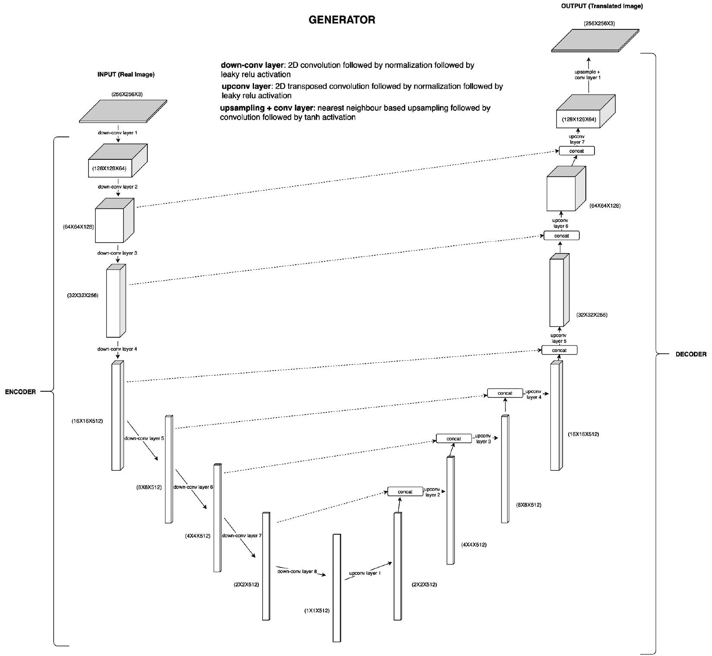
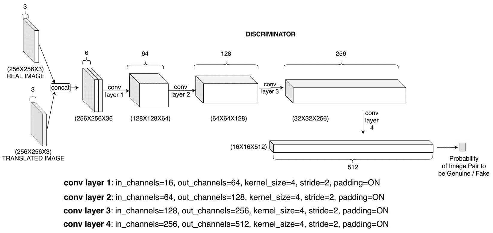

# 6 Deep Convolutional GANs

## 加入我们的书籍社区 Discord

[`packt.link/EarlyAccessCommunity`](https://packt.link/EarlyAccessCommunity)


生成神经网络已成为一个流行且活跃的研究和开发领域。这种趋势的巨大推动归功于我们将在本章讨论的一类模型。这些模型被称为**生成对抗网络**（**GANs**），并于 2014 年提出。自基本 GAN 模型提出以来，各种类型的 GAN 已被发明并被用于不同的应用场景。

本质上，GAN 由两个神经网络组成 - 一个**生成器**和一个**判别器**。让我们看一个用于生成图像的 GAN 的示例。对于这样的 GAN，生成器的任务是生成看起来逼真的假图像，而判别器的任务是区分真实图像和假图像。

在联合优化过程中，生成器最终将学会生成如此逼真的假图像，以至于判别器基本无法将其与真实图像区分开来。一旦训练了这样的模型，其生成器部分就可以作为可靠的数据生成器使用。除了用作无监督学习的生成模型外，GAN 在半监督学习中也被证明是有用的。

在图像示例中，例如，判别器模型学习到的特征可以用来提高基于图像数据训练的分类模型的性能。除了半监督学习，GAN 在强化学习中也被证明是有用的，这是我们将在《深度强化学习第十章》中讨论的一个主题。

本章将重点介绍的一种特定类型的 GAN 是**深度卷积 GAN**（**DCGAN**）。DCGAN 本质上是一个无监督**卷积神经网络**（**CNN**）模型。DCGAN 中的生成器和判别器都是纯粹的*CNN，没有全连接层*。DCGAN 在生成逼真图像方面表现良好，可以作为学习如何从头开始构建、训练和运行 GAN 的良好起点。

在本章中，我们首先会了解 GAN 内部的各个组件 - 生成器和判别器模型以及联合优化计划。然后，我们将专注于使用 PyTorch 构建 DCGAN 模型。接下来，我们将使用图像数据集来训练和测试 DCGAN 模型的性能。最后，我们将回顾图像的风格转移概念，并探索 Pix2Pix GAN 模型，该模型可以高效地在任意给定的图像对上执行风格转移。

我们还将学习 Pix2Pix GAN 模型的各个组件与 DCGAN 模型的关系。完成本章后，我们将真正理解 GAN 的工作原理，并能够使用 PyTorch 构建任何类型的 GAN 模型。本章分为以下几个主题：

+   定义生成器和鉴别器网络

+   使用 PyTorch 训练 DCGAN

+   使用 GAN 进行风格转移

## 定义生成器和鉴别器网络

如前所述，GAN 由两个组件组成 – 生成器和鉴别器。这两者本质上都是神经网络。具有不同神经架构的生成器和鉴别器会产生不同类型的 GAN。例如，DCGAN 纯粹将 CNN 作为生成器和鉴别器。您可以在 [9.1] 处找到包含它们 PyTorch 实现的不同类型的 GAN 清单。

对于任何用于生成某种真实数据的 GAN，生成器通常以随机噪声作为输入，并生成与真实数据相同维度的输出。我们称这个生成的输出为**假数据**。鉴别器则作为**二元分类器**运作。它接受生成的假数据和真实数据（一个接一个地）作为输入，并预测输入数据是真实的还是假的。*图 9* *.1* 显示了整体 GAN 模型框图：



图 9 .1 – GAN 框图

鉴别器网络像任何二元分类器一样进行优化，即使用二元交叉熵函数。因此，鉴别器模型的目标是正确地将真实图像分类为真实的，将假图像分类为假的。生成器网络具有相反的动机。生成器损失在数学上表示为*-log(D(G(x)))*，其中*x*是输入到生成器模型*G*中的随机噪声，*G(x)*是生成的假图像，*D(G(x))*是鉴别器模型*D*的输出概率，即图像为真实的概率。

因此，当鉴别器认为生成的假图像是真实的时，生成器损失最小化。本质上，在这个联合优化问题中，生成器试图欺骗鉴别器。

在执行过程中，这两个损失函数是交替反向传播的。也就是说，在训练的每个迭代中，首先冻结鉴别器，然后通过反向传播生成器损失的梯度来优化生成器网络的参数。

然后，调整好的生成器被冻结，同时通过反向传播鉴别器损失来优化鉴别器。这就是我们所说的联合优化。在原始 GAN 论文中也被称为等效于双人最小最大游戏 [9.2] 。

### 理解 DCGAN 生成器和鉴别器

对于特定的 DCGAN 情况，让我们看看生成器和鉴别器模型架构是什么样的。如前所述，它们都是纯卷积模型。*图 9* *.2* 展示了 DCGAN 的生成器模型架构：



图 9 .2 – DCGAN 生成器模型架构

首先，大小为**64**的随机噪声输入向量被重塑并投影到大小为**16x16**的**128**个特征图中。这个投影是通过线性层实现的。然后，一系列上采样和卷积层接连而来。第一个上采样层简单地使用最近邻上采样策略将**16x16**特征图转换为**32x32**特征图。

然后是一个 2D 卷积层，卷积核大小为**3x3**，输出**128**个特征图。这个卷积层输出的**128**个**32x32**特征图进一步上采样为**64x64**大小的特征图，然后是两个 2D 卷积层，生成（伪造的）RGB 图像大小为**64x64**。

> 注意
> 
> > 我们省略了批量归一化和泄漏 ReLU 层，以避免在前面的架构表示中混乱。下一节的 PyTorch 代码将详细说明和解释这些细节。

现在我们知道生成器模型的样子，让我们看看鉴别器模型的样子。*图 9*.3 展示了鉴别器模型的架构：



图 9 .3 – DCGAN 鉴别器模型架构

正如您所见，在这个架构中，每个卷积层的步幅设置为**2**有助于减少空间维度，而深度（即特征图的数量）不断增加。这是一种经典的基于 CNN 的二进制分类架构，用于区分真实图像和生成的伪造图像。

理解了生成器和鉴别器网络的架构之后，我们现在可以根据*图 9*.1 的示意图构建整个 DCGAN 模型，并在图像数据集上训练 DCGAN 模型。

在接下来的部分，我们将使用 PyTorch 完成这个任务。我们将详细讨论 DCGAN 模型的实例化，加载图像数据集，联合训练 DCGAN 生成器和鉴别器，并从训练后的 DCGAN 生成器生成样本假图像。

## 使用 PyTorch 训练 DCGAN

在本节中，我们将通过一个练习构建、训练和测试一个 PyTorch 中的 DCGAN 模型。我们将使用一个图像数据集来训练模型，并测试训练后的 DCGAN 模型的生成器在生成伪造图像时的性能。

### 定义生成器

在下一个练习中，我们只展示代码的重要部分以进行演示。要访问完整的代码，您可以参考我们的 github 仓库 [9.3] ：

1.  首先，我们需要`import`所需的库，如下所示：

```py
import os
import numpy as np
import torch
import torch.nn as nn
import torch.nn.functional as F
from torch.utils.data import DataLoader
from torch.autograd import Variable
import torchvision.transforms as transforms
from torchvision.utils import save_image
from torchvision import datasets
```

在这个练习中，我们只需要`torch`和`torchvision`来构建 DCGAN 模型。

1.  导入库后，我们指定了一些模型超参数，如下所示的代码：

```py
num_eps=10
bsize=32
lrate=0.001
lat_dimension=64
image_sz=64
chnls=1
logging_intv=200
```

我们将使用批大小为`32`和学习率为`0.001`来训练模型`10`个时期。预期的图像大小为*64x64x3*。`lat_dimension`是随机噪声向量的长度，这意味着我们将从一个*64*维的潜在空间中提取随机噪声作为生成模型的输入。

1.  现在我们定义生成器模型对象。以下代码与*图 9* *.2*中显示的架构直接一致：

```py
class GANGenerator(nn.Module):
    def __init__(self):
        super(GANGenerator, self).__init__()
        self.inp_sz = image_sz // 4
        self.lin =   nn.Sequential(nn.Linear(lat_dimension, 128 * self.inp_sz ** 2))
        self.bn1 = nn.BatchNorm2d(128)
        self.up1 = nn.Upsample(scale_factor=2)
        self.cn1 = nn.Conv2d(128, 128, 3, stride=1, padding=1)
        self.bn2 = nn.BatchNorm2d(128, 0.8)
        self.rl1 = nn.LeakyReLU(0.2, inplace=True)
        self.up2 = nn.Upsample(scale_factor=2)
        self.cn2 = nn.Conv2d(128, 64, 3, stride=1, padding=1)
        self.bn3 = nn.BatchNorm2d(64, 0.8)
        self.rl2 = nn.LeakyReLU(0.2, inplace=True)
        self.cn3 = nn.Conv2d(64, chnls, 3, stride=1, padding=1)
        self.act = nn.Tanh()
```

1.  在定义 `_init_` 方法之后，我们定义了 `forward` 方法，本质上只是按顺序调用层：

```py
 def forward(self, x):
        x = self.lin(x)
        x = x.view(x.shape[0], 128, self.inp_sz, self.inp_sz)
        x = self.bn1(x)
        x = self.up1(x)
        x = self.cn1(x)
        x = self.bn2(x)
        x = self.rl1(x)
        x = self.up2(x)
        x = self.cn2(x)
        x = self.bn3(x)
        x = self.rl2(x)
        x = self.cn3(x)
        out = self.act(x)
        return out
```

在这个练习中，我们使用了逐层显式定义而不是 `nn.Sequential` 方法；这是因为如果模型出现问题，逐层定义可以更容易调试。我们还可以看到代码中的批量归一化和泄漏的 ReLU 层，这些在*图 9* *.2*中没有提到。

> FAQ - 为什么我们使用批量归一化？
> 
> > 批量归一化用于在线性或卷积层之后，既加快训练过程，又减少对初始网络权重的敏感性。
> > 
> > FAQ - 为什么我们使用泄漏的 ReLU？
> > 
> > ReLU 可能会对带有负值输入的信息丢失。设置斜率为 0.2 的泄漏 ReLU 可以给入射的负信息赋予 20% 的权重，这有助于我们在训练 GAN 模型时避免梯度消失。

接下来，我们将查看 PyTorch 代码来定义判别器网络。

### 定义判别器

类似生成器，我们现在将定义判别器模型如下：

1.  再次强调，以下代码是 PyTorch 中显示的*图 9* *.3*模型架构的等效代码：

```py
class GANDiscriminator(nn.Module):
    def __init__(self):
        super(GANDiscriminator, self).__init__()
        def disc_module(ip_chnls, op_chnls, bnorm=True):
            mod = [nn.Conv2d(ip_chnls, op_chnls, 3, 2, 1), nn.LeakyReLU(0.2, inplace=True),
                   nn.Dropout2d(0.25)] if bnorm:
                mod += [nn.BatchNorm2d(op_chnls, 0.8)]
            return mod
        self.disc_model = nn.Sequential(
            *disc_module(chnls, 16, bnorm=False),
            *disc_module(16, 32),
            *disc_module(32, 64),
            *disc_module(64, 128),
        )
        # width and height of the down-sized image
        ds_size = image_sz // 2 ** 4
        self.adverse_lyr = nn.Sequential(nn.Linear(128 * ds_size ** 2, 1), nn.Sigmoid())
```

首先，我们定义了一个通用的判别器模块，它是一个级联的卷积层、可选的批量归一化层、泄漏的 ReLU 层和一个 dropout 层。为了构建判别器模型，我们依次重复这个模块四次——每次使用不同的卷积层参数集。

目标是输入一张 64x64x3 的 RGB 图像，并通过卷积层增加深度（即通道数），同时减少图像的高度和宽度。

最终的判别器模块的输出被展平，并通过对抗层传递。实质上，对抗层将展平的表示完全连接到最终模型输出（即二进制输出）。然后，将该模型输出通过 Sigmoid 激活函数传递，以给出图像为真实图像的概率（或非假图像）。

1.  下面是判别器的 `forward` 方法，它将一张 64x64 的 RGB 图像作为输入，并产生它是真实图像的概率：

```py
 def forward(self, x):
        x = self.disc_model(x)
        x = x.view(x.shape[0], -1)
        out = self.adverse_lyr(x)
        return out
```

1.  定义了生成器和判别器模型之后，我们现在可以实例化每个模型。我们还将对抗损失函数定义为以下代码中的二元交叉熵损失函数：

```py
# instantiate the discriminator and generator models
gen = GANGenerator()
disc = GANDiscriminator()
# define the loss metric
adv_loss_func = torch.nn.BCELoss()
```

对抗损失函数将用于定义后续训练循环中生成器和鉴别器损失函数。从概念上讲，我们使用二元交叉熵作为损失函数，因为目标基本上是二进制的——即真实图像或假图像。而二元交叉熵损失是二元分类任务的合适损失函数。

### 加载图像数据集

对于训练 DCGAN 以生成看起来逼真的假图像的任务，我们将使用著名的 `MNIST` 数据集，该数据集包含从 0 到 9 的手写数字图像。通过使用 `torchvision.datasets`，我们可以直接下载 `MNIST` 数据集，并创建一个 `dataset` 和一个 `dataloader` 实例：

```py
# define the dataset and corresponding dataloader
dloader = torch.utils.data.DataLoader(
    datasets.MNIST(
        "./data/mnist/", download=True,
        transform=transforms.Compose(
            [transforms.Resize((image_sz, image_sz)),
             transforms.ToTensor(), transforms.Normalize([0.5], [0.5])]),), batch_size=bsize, shuffle=True,)
```

这里是 MNIST 数据集中真实图像的示例：



图 9\. 4 – MNIST 数据集中的真实图像

> 数据集引用
> 
> > [LeCun et al., 1998a] Y. LeCun, L. Bottou, Y. Bengio, and P. Haffner. "基于梯度的学习应用于文档识别." 《IEEE 会议录》，86(11):2278-2324，1999 年 11 月。
> > 
> > Yann LeCun（纽约大学库兰特研究所）和 Corinna Cortes（Google 实验室，纽约）拥有 MNIST 数据集的版权，这是原始 NIST 数据集的一个衍生作品。MNIST 数据集根据知识共享署名-相同方式共享 3.0 许可证的条款提供。

到目前为止，我们已经定义了模型架构和数据管道。现在是时候实际编写 DCGAN 模型训练程序了，我们将在下一节中进行。

### DCGAN 的训练循环

在本节中，我们将训练 DCGAN 模型：

1.  **定义优化计划**：在开始训练循环之前，我们将为生成器和鉴别器定义优化计划。我们将使用 `Adam` 优化器来优化我们的模型。在原始 DCGAN 论文 [9\. 4] 中，Adam 优化器的 *beta1* 和 *beta2* 参数设置为 *0.5* 和 *0.999*，而不是通常的 *0.9* 和 *0.999*。

在我们的练习中，我们保留了 *0.9* 和 *0.999* 的默认值。但是，您可以使用论文中提到的确切数值以获得类似的结果：

```py
# define the optimization schedule for both G and D
opt_gen = torch.optim.Adam(gen.parameters(), lr=lrate)
opt_disc = torch.optim.Adam(disc.parameters(), lr=lrate)
```

1.  **训练生成器**：最后，我们现在可以运行训练循环来训练 DCGAN。由于我们将联合训练生成器和鉴别器，训练过程将包括以下两个步骤——训练生成器模型和训练鉴别器模型——交替进行。我们将从训练生成器开始，如下代码所示：

```py
os.makedirs("./images_mnist", exist_ok=True)
for ep in range(num_eps):
    for idx, (images, _) in enumerate(dloader):
        # generate ground truths for real and fake images
        good_img = Variable(torch.FloatTensor(images.shape[0], 1).fill_(1.0), requires_grad=False)
        bad_img = Variable(torch.FloatTensor(images.shape[0], 1) .fill_(0.0), requires_grad=False)
        # get a real image
        actual_images = Variable(images.type(torch.FloatTensor))
        # train the generator model
        opt_gen.zero_grad()
        # generate a batch of images based on random noise as input
        noise = Variable(torch.FloatTensor(np.random.normal(0, 1, (images.shape[0], lat_dimension))))
        gen_images = gen(noise)
        # generator model optimization - how well can it fool the discriminator
        generator_loss = adv_loss_func(disc(gen_images), good_img)
        generator_loss.backward()
        opt_gen.step()
```

在上述代码中，我们首先生成了真实和假图像的地面真值标签。真实图像标记为 `1`，假图像标记为 `0`。这些标签将作为鉴别器模型的目标输出，该模型是一个二元分类器。

接下来，我们从 MINST 数据集加载器中加载一批真实图像，并使用生成器生成一批使用随机噪声作为输入的假图像。

最后，我们将生成器的损失定义为以下两者之间的对抗损失：

i) 生成器模型生成的假图像被鉴别器模型预测为真实的概率。

ii) 目标值为`1`。

基本上，如果鉴别器被愚弄成将生成的假图像视为真实图像，那么生成器在其角色上就成功了，生成器损失将很低。一旦我们制定了生成器损失，我们就可以使用它来沿着生成器模型反向传播梯度，以调整其参数。

在生成器模型的前述优化步骤中，我们保持鉴别器模型参数不变，并且仅仅使用鉴别器模型进行一次前向传播。

1.  **训练鉴别器**：接下来，我们将执行相反操作，即保留生成器模型的参数并训练鉴别器模型：

```py
 # train the discriminator model
        opt_disc.zero_grad()
        # calculate discriminator loss as average of mistakes(losses) in confusing real images as fake and vice versa
        actual_image_loss = adv_loss_func(disc(actual_images), good_img)
        fake_image_loss = adv_loss_func(disc(gen_images.detach()), bad_img)
        discriminator_loss = (actual_image_loss + fake_image_loss) / 2
        # discriminator model optimization
        discriminator_loss.backward()
        opt_disc.step()
        batches_completed = ep * len(dloader) + idx
        if batches_completed % logging_intv == 0:
            print(f"epoch number {ep} | batch number {idx} | generator loss = {generator_loss.item()} \
            | discriminator loss = {discriminator_loss.item()}")
            save_image(gen_images.data[:25], f"images_mnist/{batches_completed}.png", nrow=5, normalize=True)
```

请记住我们有一批真实和假图像。为了训练鉴别器模型，我们将需要这两者。我们简单地将鉴别器损失定义为对抗损失或二元交叉熵损失，就像我们对任何二元分类器一样。

我们计算真实图像和假图像批次的鉴别器损失，保持真实图像批次的目标值为`1`，假图像批次的目标值为`0`。然后我们使用这两个损失的均值作为最终的鉴别器损失，并用它来反向传播梯度以调整鉴别器模型参数。

每隔几个 epoch 和批次后，我们记录模型的性能结果，即生成器损失和鉴别器损失。对于前述代码，我们应该得到类似以下的输出：



图 9\. 5 – DCGAN 训练日志

注意损失如何波动一点；这通常在训练 GAN 模型期间由于联合训练机制的对抗性质而发生。除了输出日志外，我们还定期保存一些网络生成的图像。*图 9.* *6* 展示了这些生成图像在前几个 epoch 中的进展：



图 9\. 6 – DCGAN 逐 epoch 生成图像

如果将后续 epoch 的结果与*图 9.* *4* 中的原始 MNIST 图像进行比较，可以看出 DCGAN 已经相当好地学会如何生成看起来逼真的手写数字的假图像。

就是这样了。我们已经学会了如何使用 PyTorch 从头开始构建 DCGAN 模型。原始 DCGAN 论文中有一些微妙的细节，比如生成器和鉴别器模型的层参数的正常初始化，使用 Adam 优化器的特定 *beta1* 和 *beta2* 值，等等。出于关注 GAN 代码主要部分的兴趣，我们省略了其中一些细节。鼓励你包含这些细节并查看其如何改变结果。

此外，我们在练习中只使用了 *MNIST* 数据库。然而，我们可以使用任何图像数据集来训练 DCGAN 模型。鼓励你尝试在其他图像数据集上使用这个模型。用于 DCGAN 训练的一种流行的图像数据集是名人面孔数据集 [9\. 5] 。

使用这种模型训练的 DCGAN 可以生成不存在的名人脸部。*ThisPersonDoesntExist* [9\. 6] 就是这样一个项目，它生成了不存在的人类面孔。鬼魅吗？是的。这就是 DCGAN 和总体上的 GAN 的强大之处。还要感谢 PyTorch，现在我们可以用几行代码构建自己的 GAN。

在本章的下一节，我们将超越 DCGAN，简要介绍另一种 GAN 类型——*pix2pix* 模型。*pix2pix* 模型可以用于在图像中推广风格转移的任务，更一般地说，是图像到图像的翻译任务。我们将讨论 *pix2pix* 模型的架构、其生成器和鉴别器，并使用 PyTorch 定义生成器和鉴别器模型。我们还将比较 Pix2Pix 与 DCGAN 在架构和实现方面的不同。

## 使用 GAN 进行风格转移

到目前为止，我们只详细讨论了 DCGAN。虽然已经存在数百种不同类型的 GAN 模型，并且还有更多正在开发中，但一些著名的 GAN 模型包括以下几种：

+   GAN

+   DCGAN

+   Pix2Pix

+   CycleGAN

+   超分辨率 GAN（SRGAN）

+   上下文编码器

+   文本到图像

+   最小二乘 GAN（LSGAN）

+   SoftmaxGAN

+   Wasserstein GAN

每种 GAN 变体的不同之处在于它们服务的应用程序，它们的基础模型架构，或者由于一些优化策略的调整，例如修改损失函数。例如，SRGAN 用于增强低分辨率图像的分辨率。CycleGAN 使用两个生成器而不是一个，并且生成器由类似 ResNet 的块组成。LSGAN 使用均方误差作为鉴别器损失函数，而不是大多数 GAN 中使用的交叉熵损失。

不可能在一章甚至一本书中讨论所有这些 GAN 变体。然而，在本节中，我们将探索另一种与前一节讨论的 DCGAN 模型和第八章“神经风格转移”中讨论的神经风格转移模型相关的 GAN 模型。

这种特殊类型的 GAN 推广了图像之间的风格转移任务，并提供了一个通用的图像到图像的翻译框架。它被称为**Pix2Pix**，我们将简要探讨其架构以及其生成器和鉴别器组件的 PyTorch 实现。

### 理解 pix2pix 的架构

在*第八章*，*神经风格转移*中，您可能会记得一个完全训练好的神经风格转移模型只能在给定的一对图像上工作。Pix2Pix 是一个更通用的模型，一旦成功训练，可以在任意一对图像之间进行风格转移。事实上，该模型不仅限于风格转移，还可以用于任何图像到图像的翻译应用，如背景掩蔽、调色板补充等。

实质上，Pix2Pix 的工作原理与任何 GAN 模型相似。涉及到一个生成器和一个鉴别器。与接收随机噪声并生成图像不同的是，如*图 9.* *1*所示，`pix2pix`模型中的生成器接收真实图像作为输入，并尝试生成该图像的翻译版本。如果任务是风格转移，那么生成器将尝试生成风格转移后的图像。

随后，鉴别器现在查看一对图像而不是仅仅单个图像，就像*图 9.* *1*中的情况一样。真实图像及其等效的翻译图像被作为输入馈送到鉴别器。如果翻译图像是真实的，那么鉴别器应该输出*1*，如果翻译图像是由生成器生成的，则鉴别器应该输出*0*。*图 9.* *7*显示了`pix2pix`模型的示意图： 



图 9\. 7 – Pix2Pix 模型示意图

*图 9.* *7*显示与*图 9.* *1*有显著相似之处，这意味着其基本思想与常规 GAN 相同。唯一的区别在于，鉴别器的真假问题是针对一对图像而不是单个图像提出的。

### 探索 Pix2Pix 生成器

在`pix2pix`模型中使用的生成器子模型是用于图像分割的著名 CNN——**UNet**。*图 9.* *8*展示了 UNet 的架构，它被用作`pix2pix`模型的生成器：



图 9\. 8 – Pix2Pix 生成器模型架构

首先，UNet 的名称来源于网络的*U*形状，正如前面的图表所显示的。该网络有两个主要组成部分，如下所示：

+   从左上角到底部是网络的编码器部分，它将**256x256**的 RGB 输入图像编码成大小为**512**的特征向量。

+   从右上角到底部是网络的解码器部分，它从大小为**512**的嵌入向量生成图像。

UNet 的一个关键特性是**跳跃连接**，即来自编码器部分到解码器部分的特征串联（沿深度维度），如 *图 9.8* 中的虚线箭头所示。

> FAQ - 为什么 U-Net 中有编码器-解码器跳跃连接？
> 
> > 使用编码器部分的特征帮助解码器在每个上采样步骤中更好地定位高分辨率信息。

本质上，编码器部分是一系列下卷积块，其中每个下卷积块本身是一系列 2D 卷积层、实例归一化层和渗漏的 ReLU 激活。类似地，解码器部分包括一系列上卷积块，其中每个块是一系列 2D 转置卷积层、实例归一化层和 ReLU 激活层。

这个 UNet 生成器架构的最后部分是一个基于最近邻的上采样层，随后是一个 2D 卷积层，最后是一个 `tanh` 激活。现在让我们来看看 UNet 生成器的 PyTorch 代码：

1.  这是定义基于 UNet 的生成器架构的等效 PyTorch 代码：

```py
class UNetGenerator(nn.Module):
    def __init__(self, chnls_in=3, chnls_op=3):
        super(UNetGenerator, self).__init__()
        self.down_conv_layer_1 = DownConvBlock(chnls_in, 64, norm=False)
        self.down_conv_layer_2 = DownConvBlock(64, 128)
        self.down_conv_layer_3 = DownConvBlock(128, 256)
        self.down_conv_layer_4 = DownConvBlock(256, 512, dropout=0.5)
        self.down_conv_layer_5 = DownConvBlock(512, 512, dropout=0.5)
        self.down_conv_layer_6 = DownConvBlock(512, 512, dropout=0.5)
        self.down_conv_layer_7 = DownConvBlock(512, 512, dropout=0.5)
        self.down_conv_layer_8 = DownConvBlock(512, 512, norm=False, dropout=0.5)
        self.up_conv_layer_1 = UpConvBlock(512, 512, dropout=0.5)
        self.up_conv_layer_2 = UpConvBlock(1024, 512, dropout=0.5)
        self.up_conv_layer_3 = UpConvBlock(1024, 512, dropout=0.5)
        self.up_conv_layer_4 = UpConvBlock(1024, 512, dropout=0.5)
        self.up_conv_layer_5 = UpConvBlock(1024, 256)
        self.up_conv_layer_6 = UpConvBlock(512, 128)
        self.up_conv_layer_7 = UpConvBlock(256, 64)
        self.upsample_layer = nn.Upsample(scale_factor=2)
        self.zero_pad = nn.ZeroPad2d((1, 0, 1, 0))
        self.conv_layer_1 = nn.Conv2d(128, chnls_op, 4, padding=1)
        self.activation = nn.Tanh()
```

正如您所看到的，有 8 个下卷积层和 7 个上卷积层。上卷积层有两个输入，一个来自前一个上卷积层的输出，另一个来自等效的下卷积层的输出，如 *图 9.* *7* 中所示的虚线所示。

1.  我们使用了 `UpConvBlock` 和 `DownConvBlock` 类来定义 UNet 模型的层。以下是这些块的定义，从 `UpConvBlock` 类开始：

```py
class UpConvBlock(nn.Module):
    def __init__(self, ip_sz, op_sz, dropout=0.0):
        super(UpConvBlock, self).__init__()
        self.layers = [
            nn.ConvTranspose2d(ip_sz, op_sz, 4, 2, 1),
            nn.InstanceNorm2d(op_sz), nn.ReLU(),]
        if dropout:
            self.layers += [nn.Dropout(dropout)]
    def forward(self, x, enc_ip):
        x = nn.Sequential(*(self.layers))(x)
        op = torch.cat((x, enc_ip), 1)
        return op
```

在这个上卷积块中的转置卷积层由一个步幅为 `2` 步的 4x4 核组成，这在输出空间维度上将其输出与输入相比几乎增加了一倍。

在这个转置卷积层中，4x4 核通过输入图像的每隔一个像素（由于步幅为 `2`）传递。在每个像素处，像素值与 4x4 核中的每个 16 个值相乘。

在整个图像中，核乘法结果的重叠值然后相加，导致输出长度和宽度是输入图像的两倍。此外，在前述的 `forward` 方法中，拼接操作是在通过上卷积块的前向传递完成之后执行的。

1.  接下来，这里是定义 `DownConvBlock` 类的 PyTorch 代码：

```py
class DownConvBlock(nn.Module):
    def __init__(self, ip_sz, op_sz, norm=True, dropout=0.0):
        super(DownConvBlock, self).__init__()
        self.layers = [nn.Conv2d(ip_sz, op_sz, 4, 2, 1)]
        if norm:
            self.layers.append(nn.InstanceNorm2d(op_sz))
        self.layers += [nn.LeakyReLU(0.2)]
        if dropout:
            self.layers += [nn.Dropout(dropout)]
    def forward(self, x):
        op = nn.Sequential(*(self.layers))(x)
        return op
```

下卷积块内的卷积层具有 4x4 大小的核，步幅为 `2`，并且激活了填充。因为步幅值为 `2`，所以此层的输出是其输入的空间尺寸的一半。

为了处理类似 DCGANs 中的负输入问题，还使用了一个渗漏的 ReLU 激活，这也有助于缓解消失梯度问题。

到目前为止，我们已经看到了基于 UNet 的生成器的 `__init__` 方法。接下来的 `forward` 方法非常简单：

```py
 def forward(self, x):
        enc1 = self.down_conv_layer_1(x)
        enc2 = self.down_conv_layer_2(enc1)
        enc3 = self.down_conv_layer_3(enc2)
        enc4 = self.down_conv_layer_4(enc3)
        enc5 = self.down_conv_layer_5(enc4)
        enc6 = self.down_conv_layer_6(enc5)
        enc7 = self.down_conv_layer_7(enc6)
        enc8 = self.down_conv_layer_8(enc7)
        dec1 = self.up_conv_layer_1(enc8, enc7)
        dec2 = self.up_conv_layer_2(dec1, enc6)
        dec3 = self.up_conv_layer_3(dec2, enc5)
        dec4 = self.up_conv_layer_4(dec3, enc4)
        dec5 = self.up_conv_layer_5(dec4, enc3)
        dec6 = self.up_conv_layer_6(dec5, enc2)
        dec7 = self.up_conv_layer_7(dec6, enc1)
        final = self.upsample_layer(dec7)
        final = self.zero_pad(final)
        final = self.conv_layer_1(final)
        return self.activation(final)
```

在讨论了 `pix2pix` 模型的生成器部分之后，让我们也来看看判别器模型。

### 探索 Pix2Pix 判别器

在这种情况下，判别器模型也是一个二元分类器，就像 DCGAN 一样。唯一的区别是，这个二元分类器接受两个图像作为输入。两个输入沿深度维度连接。*图 9.* *9* 展示了判别器模型的高级架构：



图 9\. 9 – Pix2Pix 判别器模型架构

这是一个 CNN 模型，最后的 3 个卷积层后跟一个归一化层以及一个泄漏 ReLU 激活函数。定义这个判别器模型的 PyTorch 代码如下：

```py
class Pix2PixDiscriminator(nn.Module):
    def __init__(self, chnls_in=3):
        super(Pix2PixDiscriminator, self).__init__()
        def disc_conv_block(chnls_in, chnls_op, norm=1):
            layers = [nn.Conv2d(chnls_in, chnls_op, 4, stride=2, padding=1)]
            if normalization:
                layers.append(nn.InstanceNorm2d(chnls_op))
            layers.append(nn.LeakyReLU(0.2, inplace=True))
            return layers
        self.lyr1 = disc_conv_block(chnls_in * 2, 64, norm=0)
        self.lyr2 = disc_conv_block(64, 128)
        self.lyr3 = disc_conv_block(128, 256)
        self.lyr4 = disc_conv_block(256, 512)
```

正如您所见，第 `4` 个卷积层在每个步骤后会加倍空间表示的深度。第 `2`、`3` 和 `4` 层在卷积层后添加了归一化层，并且每个卷积块的末尾应用了泄漏 ReLU 激活，负斜率为 20%。最后，这是判别器模型在 PyTorch 中的 `forward` 方法：

```py
 def forward(self, real_image, translated_image):
        ip = torch.cat((real_image, translated_image), 1)
        op = self.lyr1(ip)
        op = self.lyr2(op)
        op = self.lyr3(op)
        op = self.lyr4(op)
        op = nn.ZeroPad2d((1, 0, 1, 0))(op)
        op = nn.Conv2d(512, 1, 4, padding=1)(op)
        return op
```

首先，输入图像被连接并通过四个卷积块传递，最终进入一个单一的二进制输出，告诉我们图像对的真假概率（即由生成器模型生成的）。这样，在运行时训练 `pix2pix` 模型，使得生成器可以接受任何图像作为输入，并应用其在训练期间学到的图像翻译函数。

如果 `pix2pix` 模型生成的伪翻译图像很难与原始图像的真实翻译版本区分开来，则认为 `pix2pix` 模型是成功的。

这结束了我们对 `pix2pix` 模型的探索。原则上，Pix2Pix 的整体模型框图与 DCGAN 模型非常相似。这两个模型的判别器网络都是基于 CNN 的二元分类器。而 `pix2pix` 模型的生成器网络则是受 UNet 图像分割模型启发的稍微复杂一些的架构。

总的来说，我们已经成功地使用 PyTorch 定义了 DCGAN 和 Pix2Pix 的生成器和判别器模型，并理解了这两个 GAN 变体的内部工作原理。

完成本节后，您应该能够开始编写其他许多 GAN 变体的 PyTorch 代码。使用 PyTorch 构建和训练各种 GAN 模型可以是一次很好的学习经验，而且肯定是一个有趣的练习。我们鼓励您使用本章的信息来开展自己的 GAN 项目。

## 总结

近年来，生成对抗网络（GANs）已成为研究和开发的活跃领域，自其 2014 年问世以来如此。本章探讨了 GANs 背后的概念，包括 GANs 的组成部分，即生成器和鉴别器。我们讨论了每个组件的架构以及 GAN 模型的整体框图。

在下一章中，我们将进一步探索生成模型的研究。我们将探讨如何使用尖端深度学习技术从文本生成图像。
