# 第十一章：深度强化学习

## 在我们的书籍社区 Discord 上加入我们

[`packt.link/EarlyAccessCommunity`](https://packt.link/EarlyAccessCommunity)


机器学习通常分为三种不同的范式：**监督学习**、**无监督学习**和**强化学习**（**RL**）。监督学习需要标记数据，迄今为止一直是最受欢迎的机器学习范式。然而，基于无监督学习的应用，即不需要标签的学习，近年来稳步增长，尤其是生成模型的形式。

另一方面，RL 是机器学习的一个不同分支，被认为是我们迄今为止模拟人类学习方式最接近的分支。这是一个积极研究和开发的领域，处于早期阶段，已取得一些有 promising 的结果。一个著名的例子是由 Google 的 DeepMind 构建的 AlphaGo 模型，它击败了世界顶级围棋选手。

在监督学习中，我们通常向模型提供原子输入输出数据对，并希望模型学习将输出作为输入的函数。而在 RL 中，我们不关心学习这种单个输入到单个输出的函数。相反，我们感兴趣的是学习一种策略（或政策），使我们能够从输入（状态）开始采取一系列步骤（或行动），以获取最终输出或实现最终目标。

查看照片并决定它是猫还是狗是一个原子输入输出学习任务，可以通过监督学习解决。然而，查看棋盘并决定下一步如何走以达到赢得比赛的目标则需要策略，我们需要 RL 来处理这类复杂任务。

在前几章中，我们遇到了监督学习的例子，比如使用 MNIST 数据集构建分类器对手写数字进行分类。我们还在构建文本生成模型时探索了无监督学习，使用了一个无标签的文本语料库。

在本章中，我们将揭示 RL 和**深度强化学习（DRL）**的一些基本概念。然后，我们将专注于一种特定且流行的 DRL 模型 - **深度 Q-learning 网络（DQN）**模型。使用 PyTorch，我们将构建一个 DRL 应用程序。我们将训练一个 DQN 模型来学习如何与计算机对手（bot）玩乒乓球游戏。

在本章结束时，您将具备开始在 PyTorch 上进行自己的 DRL 项目所需的所有背景知识。此外，您还将亲自体验在真实问题上构建 DQN 模型的经验。本章中您将获得的技能对处理其他 RL 问题也将非常有用。

本章内容分为以下几个主题：

+   回顾强化学习概念

+   讨论 Q-learning

+   理解深度 Q-learning

+   在 PyTorch 中构建 DQN 模型

## 回顾强化学习概念

在某种意义上，RL 可以被定义为从错误中学习。与监督学习中每个数据实例都得到反馈的情况不同，RL 在一系列行动之后接收反馈。以下图表显示了 RL 系统的高级示意图：

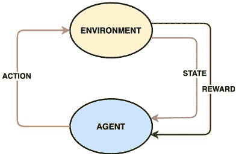

图 11\. 1 – 强化学习示意图

在 RL 设置中，通常有一个**代理**进行学习。代理学习如何根据这些决策做出决定并采取**行动**。代理操作在一个提供的**环境**中。这个环境可以被视为一个有限的世界，在这个世界中，代理生活、采取行动并从其行动中学习。在这里，行动就是代理基于其所学内容做出决策的实施。

我们前面提到，与监督学习不同，RL 对于每个输入并不都有一个输出；也就是说，代理不一定会为每个动作都接收到反馈。相反，代理在**状态**中工作。假设它从初始状态*S*0 开始。然后它执行一个动作，比如*a*0。这个动作将代理的状态从*S*0 转换到*S*1，之后代理执行另一个动作*a*1，循环进行。

偶尔，代理根据其状态接收**奖励**。代理遍历的状态和行动序列也称为**轨迹**。假设代理在状态*S*2 收到奖励。在这种情况下，导致该奖励的轨迹将是*S*0, *a*0, *S*1, *a*1, *S*2。

> 注
> 
> > 奖励可以是正的也可以是负的。

基于奖励，代理学习调整其行为，以便以最大化长期奖励的方式采取行动。这就是 RL 的本质。代理根据给定的状态和奖励学习一种如何行动最优化的策略。

这种学习到的策略，基本上是行动作为状态和奖励的函数表达，被称为代理的**策略**。RL 的最终目标是计算一个策略，使代理能够始终从其所处的情况中获得最大奖励。

视频游戏是展示 RL 的最佳例子之一。让我们以视频游戏《乒乓球》的虚拟版本——Pong 为例。以下是该游戏的快照：

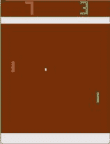

图 11\. 2 – 乒乓视频游戏

考虑右侧的玩家是代理，用一个短竖线表示。请注意，这里有一个明确定义的环境。环境包括玩区，用棕色像素表示。环境还包括一个球，用白色像素表示。除此之外，环境还包括玩区边界，用灰色条纹和球可能反弹的边缘表示。最后，而且最重要的是，环境包括一个对手，看起来像代理，但位于左侧，与代理相对。

通常，在强化学习设置中，代理在任何给定状态下有一组有限的可能动作，称为离散动作空间（与连续动作空间相对）。在这个例子中，代理在所有状态下有两种可能的动作 - 向上移动或向下移动，但有两个例外。首先，它只能在处于最上位置（状态）时向下移动，其次，它只能在处于最下位置（状态）时向上移动。

在这种情况下，奖励的概念可以直接映射到实际乒乓球比赛中发生的情况。如果你未能击中球，你的对手会得分。首先得到 21 分的人赢得比赛并获得正奖励。输掉比赛意味着负奖励。得分或失分也会导致较小的中间正奖励和负奖励。从 0-0 的得分到任一玩家得分 21 分的玩法序列被称为一个**episode**。

使用强化学习训练我们的代理玩乒乓球游戏相当于从头开始训练某人打乒乓球。训练会产生一个政策，代理在游戏中遵循这个政策。在任何给定的情况下 - 包括球的位置、对手的位置、记分牌以及先前的奖励 - 训练良好的代理会向上或向下移动，以最大化其赢得比赛的机会。

到目前为止，我们已通过提供一个例子来讨论强化学习背后的基本概念。在这样做的过程中，我们反复提到了策略、政策和学习等术语。但是代理实际上是如何学习策略的呢？答案是通过一个基于预定义算法的强化学习模型。接下来，我们将探讨不同类型的强化学习算法。

### 强化学习算法的类型

在本节中，我们将按照文献中的分类来查看强化学习算法的类型。然后我们将探索这些类型中的一些子类型。广义上讲，强化学习算法可以分为以下两种类型之一：

+   **基于模型**

+   **无模型**

让我们逐一看看这些。

#### 基于模型

正如名称所示，在基于模型的算法中，智能体了解环境的模型。这里的模型指的是一个数学公式，可用于估计奖励以及环境中状态的转移方式。因为智能体对环境有一定的了解，这有助于减少选择下一步行动的样本空间。这有助于学习过程的效率。

然而，在现实中，建模环境大多数情况下并不直接可用。尽管如此，如果我们想使用基于模型的方法，我们需要让智能体通过自身经验学习环境模型。在这种情况下，智能体很可能会学习到模型的偏见表达，并在真实环境中表现不佳。因此，基于模型的方法在实施强化学习系统时使用较少。在本书中，我们将不详细讨论基于这种方法的模型，但这里有一些示例：

+   **基于模型的深度强化学习与无模型微调**（**MBMF**）。

+   **基于模型的价值估计**（**MBVE**）用于高效的无模型强化学习。

+   **想象增强智能体**（**I2A**）用于深度强化学习。

+   **AlphaZero**，这位著名的 AI 机器人击败了国际象棋和围棋冠军。

现在，让我们看看另一组采用不同哲学的强化学习算法。

#### 无模型

无模型方法在没有环境模型的情况下运作，目前在强化学习研究与开发中更为流行。在无模型强化学习设置中，主要有两种训练智能体的方法：

+   **政策优化**

+   **Q 学习**

#### 政策优化

在这种方法中，我们将政策制定为一个关于行动的函数形式，给定当前状态，如以下方程所示：

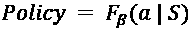

– 方程式 11.1

在这里，*β*代表这个函数的内部参数，通过梯度上升更新以优化政策函数。目标函数使用政策函数和奖励定义。在某些情况下，可能会使用目标函数的近似来进行优化过程。此外，在某些情况下，可能会使用政策函数的近似来代替实际的政策函数进行优化过程。

通常，在这种方法下进行的优化是**在政策内**的，这意味着参数是基于使用最新政策版本收集的数据进行更新的。一些基于政策优化的强化学习算法的示例如下：

+   **政策梯度**：这是最基本的政策优化方法，我们直接使用梯度上升优化政策函数。政策函数输出在每个时间步骤下采取不同行动的概率。

+   **演员-批评家**：由于在政策梯度算法下的优化是基于政策的，算法的每次迭代都需要更新政策。这需要很长时间。演员-批评家方法引入了值函数和政策函数的使用。演员模拟政策函数，批评家模拟值函数。

通过使用批评者，策略更新过程变得更快。我们将在下一节更详细地讨论价值函数。然而，本书不会深入讨论演员-批评家方法的数学细节。

+   **信任区域策略优化** (**TRPO**): 类似于策略梯度方法，TRPO 包含一个基于政策的优化方法。在策略梯度方法中，我们使用梯度来更新政策函数参数 *β*。由于梯度是一阶导数，对于函数中的尖锐曲率可能会产生噪声。这可能导致我们进行大幅度的政策更改，从而可能不稳定代理的学习轨迹。

为了避免这种情况，TRPO 提出了信任区域。它定义了政策在给定更新步骤中可以改变的上限。这确保了优化过程的稳定性。

+   **近端策略优化** (**PPO**): 类似于 TRPO，PPO 旨在稳定优化过程。在策略梯度方法中，每个数据样本都会进行梯度上升更新。然而，PPO 使用了一个替代的目标函数，可以在数据样本批次上进行更新。这导致更加保守地估计梯度，从而提高了梯度上升算法收敛的可能性。

策略优化函数直接工作于优化策略，因此这些算法非常直观。然而，由于这些算法大多是基于政策的，每次更新政策后都需要重新对数据进行采样。这可能成为解决 RL 问题的限制因素。接下来，我们将讨论另一种更加样本高效的无模型算法，称为 Q 学习。

#### Q 学习

与策略优化算法相反，**Q 学习**依赖于值函数而不是策略函数。从这一点开始，本章将重点讨论 Q 学习。我们将在下一节详细探讨 Q 学习的基础知识。

## 讨论 Q 学习

策略优化和 Q 学习之间的关键区别在于，后者并没有直接优化策略。相反，我们优化一个值函数。什么是**值函数**？我们已经学到 RL 的关键在于代理学习如何在经过一系列状态和动作的轨迹时获得最大的总奖励。值函数是一个关于当前代理所处状态的函数，其输出为代理在当前回合结束时将获得的预期奖励总和。

在 Q-learning 中，我们优化一种特定类型的值函数，称为**动作值函数**，它取决于当前状态和动作。在给定状态 *S*，动作值函数确定代理程序将为采取动作 *a* 而获得的长期奖励（直到结束的奖励）。此函数通常表示为 *Q(S, a)*，因此也称为 Q 函数。动作值也称为**Q 值**。

每个（状态，动作）对的 Q 值可以存储在一个表中，其中两个维度分别是状态和动作。例如，如果有四个可能的状态 *S*1、*S*2、*S*3 和 *S*4，并且有两种可能的动作 *a*1 和 *a*2，那么这八个 Q 值将存储在一个 4x2 的表中。因此，Q-learning 的目标是创建这个 Q 值表。一旦表格可用，代理程序可以查找给定状态的所有可能动作的 Q 值，并采取具有最大 Q 值的动作。但问题是，我们从哪里获取 Q 值？答案在于**贝尔曼方程**，其数学表达如下：

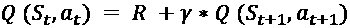

– 方程 11.2

贝尔曼方程是计算 Q 值的递归方式。在此方程中，*R* 是在状态 *S*t 采取动作 *a*t 后获得的奖励，而 γ（gamma）是**折扣因子**，它是一个介于 *0* 和 *1* 之间的标量值。基本上，这个方程表明当前状态 *S*t 和动作 *a*t 的 Q 值等于在状态 *S*t 采取动作 *a*t 后获得的奖励 *R*，加上从下一个状态 *S*t*+1 采取的最优动作 *a*t*+1 的 Q 值，乘以折扣因子。折扣因子定义了在即时奖励与长期未来奖励之间给予多大的权重。

现在我们已经定义了 Q-learning 的大部分基础概念，让我们通过一个示例来演示 Q-learning 的工作原理。以下图示展示了一个包含五个可能状态的环境：

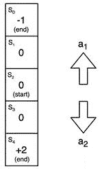

图 11\. 3 – Q-learning 示例环境

有两种不同的可能动作 – 向上移动（**a**1）或向下移动（**a**2）。在不同状态下有不同的奖励，从状态 **S**4 的 **+2** 到状态 **S**0 的 **-1**。每个环境中的一轮从状态 **S**2 开始，并以 **S**0 或 **S**4 结束。由于有五个状态和两种可能的动作，Q 值可以存储在一个 5x2 的表中。以下代码片段展示了如何在 Python 中编写奖励和 Q 值：

```py
rwrds = [-1, 0, 0, 0, 2]
Qvals = [[0.0, 0.0],
         [0.0, 0.0],
         [0.0, 0.0],
         [0.0, 0.0],
         [0.0, 0.0]]
```

我们将所有的 Q 值初始化为零。此外，由于有两个特定的结束状态，我们需要以列表的形式指定这些状态，如下所示：

```py
end_states = [1, 0, 0, 0, 1]
```

这基本上表明状态 **S**0 和 **S**4 是终止状态。在运行完整的 Q 学习循环之前，我们还需要查看一个最后的部分。在 Q 学习的每一步，代理有两种选择下一步行动的选项：

+   选择具有最高 Q 值的动作。

+   随机选择下一个动作。

为什么代理程序会随机选择一个动作？

记住，在*第七章*，使用 PyTorch 进行音乐和文本生成中，*文本生成*部分，我们讨论了贪婪搜索或波束搜索导致重复结果的问题，因此引入随机性有助于产生更好的结果。同样地，如果代理程序总是基于 Q 值选择下一步动作，那么它可能会陷入重复选择立即高奖励的动作的子优化条件。因此，偶尔随机采取行动将有助于代理程序摆脱这种次优条件。

现在我们已经确定代理在每一步都有两种可能的行动方式，我们需要决定代理选择哪种方式。这就是**epsilon-greedy-action**机制发挥作用的地方。下图展示了它的工作原理：

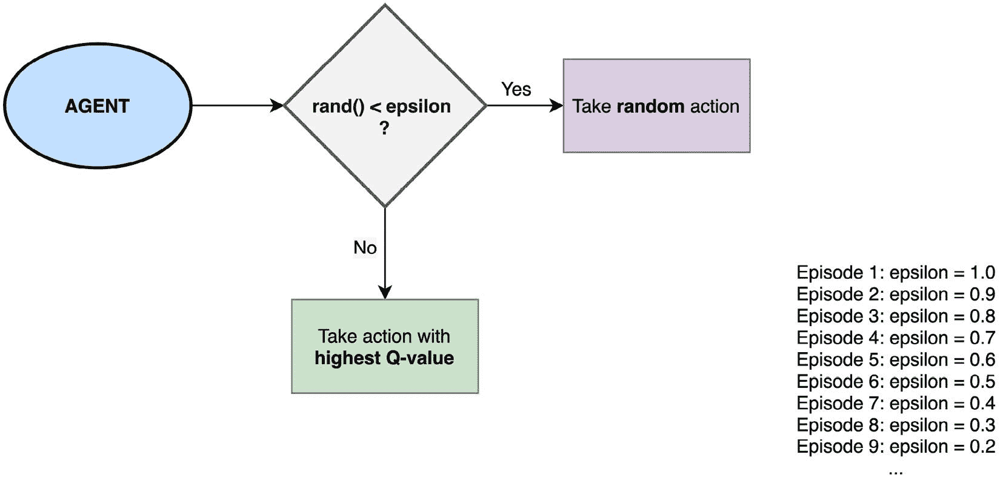

图 11\. 4 – Epsilon-greedy-action 机制

在此机制下，每个周期中预先决定一个 epsilon 值，它是一个介于 `0` 和 `1` 之间的标量值。在给定的周期内，对于每次选择下一个动作，代理生成一个介于 `0` 到 `1` 之间的随机数。如果生成的数字小于预定义的 epsilon 值，则代理随机从可用的下一个动作集中选择下一个动作。否则，从 Q 值表中检索每个可能的下一个动作的 Q 值，并选择具有最高 Q 值的动作。epsilon-greedy-action 机制的 Python 代码如下：

```py
def eps_greedy_action_mechanism(eps, S):
  rnd = np.random.uniform()
  if rnd < eps:
    return np.random.randint(0, 2)
  else:
    return np.argmax(Qvals[S])
```

通常情况下，我们在第一个周期以 `1` 的 epsilon 值开始，然后随着周期的进展线性减少它。这里的想法是，我们希望代理程序最初探索不同的选项。然而，随着学习过程的进行，代理程序对收集短期奖励不那么敏感，因此它可以更好地利用 Q 值表。

现在我们可以编写主要的 Q 学习循环的 Python 代码，如下所示：

```py
n_epsds = 100
eps = 1
gamma = 0.9
for e in range(n_epsds):
  S_initial = 2 # start with state S2
  S = S_initial
  while not end_states[S]:
    a = eps_greedy_action_mechanism(eps, S)
    R, S_next = take_action(S, a)
    if end_states[S_next]:
      Qvals[S][a] = R
    else:
      Qvals[S][a] = R + gamma * max(Qvals[S_next])
    S = S_next
  eps = eps - 1/n_epsds
```

首先，我们确定代理程序将被训练 `100` 个周期。我们从 epsilon 值为 `1` 开始，并定义折扣因子（gamma）为 `0.9`。接下来，我们运行 Q 学习循环，该循环遍历周期数。在此循环的每次迭代中，我们通过整个周期运行。在周期内，我们首先将代理的状态初始化为 `S2`。

接着，我们运行另一个内部循环，仅在代理达到结束状态时中断。在这个内部循环中，我们使用ε-贪婪动作机制为代理决定下一步动作。代理然后执行该动作，转移代理到一个新状态，并可能获得奖励。`take_action`函数的实现如下：

```py
def take_action(S, a):
  if a == 0: # move up
    S_next = S - 1
  else:
    S_next = S + 1
  return rwrds[S_next], S_next
```

一旦我们获得奖励和下一个状态，我们使用方程 11.2 更新当前状态-动作对的 Q 值。下一个状态现在成为当前状态，过程重复进行。在每个 episode 结束时，ε值线性减小。一旦整个 Q 学习循环结束，我们获得一个 Q 值表。这个表基本上是代理在这个环境中操作所需的一切，以获得最大的长期奖励。

理想情况下，针对这个示例训练良好的代理总是向下移动，以获得*S*4 处的最大奖励*+2*，并避免向*S*0 移动，该位置含有*-1*的负奖励。

这完成了我们关于 Q 学习的讨论。前面的代码应该帮助您在提供的简单环境中开始使用 Q 学习。对于视频游戏等更复杂和现实的环境，这种方法将不起作用。为什么呢？

我们注意到，Q 学习的本质在于创建 Q 值表。在我们的示例中，只有 5 个状态和 2 个动作，因此表的大小为 10，这是可以管理的。但是在如 Pong 等视频游戏中，可能的状态太多了。这导致 Q 值表的大小爆炸增长，使得我们的 Q 学习算法极其占用内存且不可实际运行。

幸运的是，有一个解决方案，可以在不使我们的机器内存不足的情况下仍然使用 Q 学习的概念。这个解决方案将 Q 学习和深度神经网络的世界结合起来，提供了极其流行的 RL 算法，被称为**DQN**。在下一节中，我们将讨论 DQN 的基础知识和一些其新颖的特性。

## 理解深度 Q 学习

**DQN**不创建一个 Q 值表，而是使用一个**深度神经网络**（**DNN**），该网络为给定的状态-动作对输出一个 Q 值。DQN 在诸如视频游戏之类的复杂环境中使用，这些环境中的状态太多，无法在 Q 值表中管理。视频游戏的当前图像帧用来表示当前状态，并与当前动作一起作为输入传递给底层 DNN 模型。

DNN 为每个这样的输入输出一个标量 Q 值。在实践中，与其仅传递当前图像帧不如将给定时间窗口内的*N*个相邻图像帧作为输入传递给模型。

我们正在使用一个深度神经网络来解决强化学习（RL）问题。这引发了一个固有的问题。在使用深度神经网络时，我们始终使用**独立同分布**（iid）的数据样本。然而，在强化学习中，每一个当前输出都会影响到下一个输入。例如，在 Q-learning 中，贝尔曼方程本身表明，Q 值依赖于另一个 Q 值；也就是说，下一个状态-动作对的 Q 值影响了当前状态-动作对的 Q 值。

这意味着我们在处理一个不断移动的目标，并且目标与输入之间有很高的相关性。DQN 通过两个新特性来解决这些问题：

+   使用两个单独的深度神经网络（DNNs）

+   经验重放缓冲区

让我们更详细地看一下这些内容。

### 使用两个单独的深度神经网络（DNNs）

让我们重新写 DQNs 的贝尔曼方程：

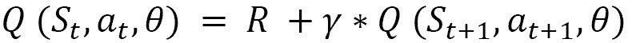

– 方程 11.3

这个方程大部分与 Q-learning 的方程相同，只是引入了一个新术语，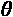(θ)。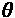代表了 DQN 模型用于获取 Q 值的 DNN 的权重。但是这个方程有些奇怪。注意到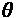被放在了方程的左边和右边。这意味着在每一步中，我们使用同一个神经网络来获取当前状态-动作对和下一个状态-动作对的 Q 值。这意味着我们在追踪一个非静态目标，因为每一步，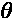都会被更新，这将改变下一步的方程的左边和右边，导致学习过程中的不稳定性。

通过查看损失函数，可以更清楚地看到这一点。神经网络将试图使用梯度下降来最小化损失函数。损失函数如下：

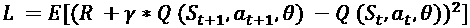

– 方程 11.4

暂且将*R*（奖励）放在一边，对于同一个网络生成当前和下一个状态-动作对的 Q 值将导致损失函数的波动性增加。为了解决这个问题，DQN 使用两个独立的网络——一个主 DNN 和一个目标 DNN。两个 DNN 具有完全相同的架构。

主要的 DNN 用于计算当前状态-动作对的 Q 值，而目标 DNN 用于计算下一个（或目标）状态-动作对的 Q 值。然而，虽然主网络的权重在每一次学习步骤中都会更新，目标网络的权重却是冻结的。每经过*K*次梯度下降迭代，主网络的权重被复制到目标网络。这种机制保持了训练过程的相对稳定性。权重复制机制确保了来自目标网络的准确预测。

### 经验重放缓冲区

因为 DNN 期望的输入是 iid 数据，我们只需将视频游戏的最后*X*个步骤（帧）缓存在一个缓冲区内，然后从缓冲区中随机抽样数据批次。这些批次然后作为 DNN 的输入。因为批次由随机抽样的数据组成，其分布看起来类似于 iid 数据样本的分布。这有助于稳定 DNN 训练过程。

> 注意
> 
> > 如果没有缓冲区技巧，DNN 将接收到相关的数据，这将导致优化结果不佳。

这两个技巧在贡献 DQN 成功方面已被证明非常重要。现在我们对 DQN 模型的工作原理和其新颖特性有了基本了解，让我们继续本章的最后一节，我们将实现自己的 DQN 模型。使用 PyTorch，我们将构建一个基于 CNN 的 DQN 模型，该模型将学习玩名为 Pong 的 Atari 视频游戏，并可能学会击败电脑对手。

## 在 PyTorch 中构建 DQN 模型

我们在前一节讨论了 DQN 背后的理论。在这一节中，我们将采取实际操作的方式。使用 PyTorch，我们将构建一个基于 CNN 的 DQN 模型，该模型将训练一个代理人玩称为 Pong 的视频游戏。这个练习的目标是展示如何使用 PyTorch 开发强化学习应用程序。让我们直接进入练习。

### 初始化主要和目标 CNN 模型

在这个练习中，我们仅展示代码的重要部分以演示目的。要访问完整代码，请访问我们的 github 仓库 [11.1]。请按照以下步骤进行：

1.  首先，我们需要导入必要的库：

```py
# general imports
import cv2
import math
import numpy as np
import random
# reinforcement learning related imports
import re
import atari_py as ap
from collections import deque
from gym import make, ObservationWrapper, Wrapper
from gym.spaces import Box
# pytorch imports
import torch
import torch.nn as nn
from torch import save
from torch.optim import Adam
```

在这个练习中，除了常规的与 Python 和 PyTorch 相关的导入之外，我们还使用了一个名为`gym`的 Python 库。这是 OpenAI [11.2]开发的一个 Python 库，提供了一套用于构建强化学习应用的工具。基本上，导入`gym`库消除了为 RL 系统的内部编写所有支撑代码的需要。它还包括一些内置的环境，包括一个用于视频游戏 Pong 的环境，在这个练习中我们将使用它。

1.  导入库后，我们必须为 DQN 模型定义 CNN 架构。这个 CNN 模型主要接受当前状态输入，并输出所有可能动作的概率分布。代理人选择具有最高概率的动作作为下一个动作。与使用回归模型预测每个状态-动作对的 Q 值不同，我们巧妙地将其转换为分类问题。

Q 值回归模型将必须单独运行所有可能的动作，并且我们将选择预测 Q 值最高的动作。但是使用这个分类模型将计算 Q 值和预测最佳下一个动作的任务合并为一个：

```py
class ConvDQN(nn.Module):
    def __init__(self, ip_sz, tot_num_acts):
        super(ConvDQN, self).__init__()
        self._ip_sz = ip_sz
        self._tot_num_acts = tot_num_acts
        self.cnv1 = nn.Conv2d(ip_sz[0], 32, kernel_size=8, stride=4)
        self.rl = nn.ReLU()
        self.cnv2 = nn.Conv2d(32, 64, kernel_size=4, stride=2)
        self.cnv3 = nn.Conv2d(64, 64, kernel_size=3, stride=1)
        self.fc1 = nn.Linear(self.feat_sz, 512)
        self.fc2 = nn.Linear(512, tot_num_acts)
```

正如我们所见，模型由三个卷积层`cnv1`、`cnv2`和`cnv3`组成，它们之间有 ReLU 激活函数，并跟随两个全连接层。现在，让我们看看通过该模型的前向传播包含哪些内容：

```py
 def forward(self, x):
        op = self.cnv1(x)
        op = self.rl(op)
        op = self.cnv2(op)
        op = self.rl(op)
        op = self.cnv3(op)
        op = self.rl(op).view(x.size()[0], -1)
        op = self.fc1(op)
        op = self.rl(op)
        op = self.fc2(op)
        return op
```

`forward` 方法简单地演示了模型的前向传播，其中输入通过卷积层，展平，最后馈送到全连接层。最后，让我们看看其他模型方法：

```py
 @property
    def feat_sz(self):
        x = torch.zeros(1, *self._ip_sz)
        x = self.cnv1(x)
        x = self.rl(x)
        x = self.cnv2(x)
        x = self.rl(x)
        x = self.cnv3(x)
        x = self.rl(x)
        return x.view(1, -1).size(1)
    def perf_action(self, stt, eps, dvc):
        if random.random() > eps:
            stt=torch.from_numpy(np.float32(stt)).unsqueeze(0).to(dvc)
            q_val = self.forward(stt)
            act = q_val.max(1)[1].item()
        else:
            act = random.randrange(self._tot_num_acts)
        return act
```

在上述代码片段中，`feat_size` 方法只是用于计算将最后一个卷积层输出展平后的特征向量大小。最后，`perf_action` 方法与我们之前在*讨论 Q 学习*部分讨论的 `take_action` 方法相同。

1.  在这一步中，我们定义一个函数，实例化主神经网络和目标神经网络：

```py
def models_init(env, dvc):
    mdl = ConvDQN(env.observation_space.shape, env.action_space.n).to(dvc)
    tgt_mdl = ConvDQN(env.observation_space.shape, env.action_space.n).to(dvc)
    return mdl, tgt_mdl
```

这两个模型是同一类的实例，因此共享相同的架构。然而，它们是两个独立的实例，因此将随不同的权重集合而有所不同。

### 定义经验重播缓冲区

正如我们在*理解深度 Q 学习*部分讨论的那样，经验重播缓冲区是 DQN 的一个重要特性。借助该缓冲区，我们可以存储几千个游戏转换（帧），然后随机采样这些视频帧来训练 CNN 模型。以下是定义重播缓冲区的代码：

```py
class RepBfr:
    def __init__(self, cap_max):
        self._bfr = deque(maxlen=cap_max)
    def push(self, st, act, rwd, nxt_st, fin):
        self._bfr.append((st, act, rwd, nxt_st, fin))
    def smpl(self, bch_sz):
        idxs = np.random.choice(len(self._bfr), bch_sz, False)
        bch = zip(*[self._bfr[i] for i in idxs])
        st, act, rwd, nxt_st, fin = bch
        return (np.array(st), np.array(act), np.array(rwd,      dtype=np.float32),np.array(nxt_st), np.array(fin, dtype=np.uint8))
    def __len__(self):
        return len(self._bfr)
```

在这里，`cap_max` 是定义的缓冲区大小；即，将存储在缓冲区中的视频游戏状态转换数量。`smpl` 方法在 CNN 训练循环中用于采样存储的转换并生成训练数据批次。

### 设置环境

到目前为止，我们主要关注于 DQN 的神经网络方面。在本节中，我们将专注于构建 RL 问题的基础方面之一 - 环境。请按照以下步骤进行操作：

1.  首先，我们必须定义一些与视频游戏环境初始化相关的函数：

```py
def gym_to_atari_format(gym_env):
    ...
def check_atari_env(env):
    ...
```

使用 `gym` 库，我们可以访问预先构建的 Pong 视频游戏环境。但在这里，我们将通过一系列步骤增强环境，包括降低视频游戏图像帧率，将图像帧推送到经验重播缓冲区，将图像转换为 PyTorch 张量等。

1.  以下是实现每个环境控制步骤的定义类：

```py
class CCtrl(Wrapper):
    ...
class FrmDwSmpl(ObservationWrapper):
    ...
class MaxNSkpEnv(Wrapper):
    ...
class FrRstEnv(Wrapper):
    ...
class FrmBfr(ObservationWrapper):
    ...
class Img2Trch(ObservationWrapper):
    ...
class NormFlts(ObservationWrapper):
    ... 
```

这些类现在将用于初始化和增强视频游戏环境。

1.  一旦定义了与环境相关的类，我们必须定义一个最终方法，该方法将原始 Pong 视频游戏环境作为输入，并增强环境，如下所示：

```py
def wrap_env(env_ip):
    env = make(env_ip)
    is_atari = check_atari_env(env_ip)
    env = CCtrl(env, is_atari)
    env = MaxNSkpEnv(env, is_atari)
    try:
        env_acts = env.unwrapped.get_action_meanings()
        if "FIRE" in env_acts:
            env = FrRstEnv(env)
    except AttributeError:
        pass
    env = FrmDwSmpl(env)
    env = Img2Trch(env)
    env = FrmBfr(env, 4)
    env = NormFlts(env)
    return env
```

在这一步中的部分代码已经省略，因为我们的重点是这个练习中的 PyTorch 方面。请参考本书的 GitHub 仓库 [11.3] 获取完整的代码。

### 定义 CNN 优化函数

在本节中，我们将定义用于训练我们的深度强化学习模型的损失函数，并定义每个模型训练迭代结束时需要执行的操作。按照以下步骤进行：

1.  我们在“初始化主神经网络和目标神经网络”部分的“步骤 2”中初始化了我们的主要和目标 CNN 模型。现在我们已经定义了模型架构，我们将定义损失函数，该函数将被训练以最小化：

```py
def calc_temp_diff_loss(mdl, tgt_mdl, bch, gm, dvc):
    st, act, rwd, nxt_st, fin = bch        st = torch.from_numpy(np.float32(st)).to(dvc)
    nxt_st =      torch.from_numpy(np.float32(nxt_st)).to(dvc)
    act = torch.from_numpy(act).to(dvc)
    rwd = torch.from_numpy(rwd).to(dvc)
    fin = torch.from_numpy(fin).to(dvc)     q_vals = mdl(st)
    nxt_q_vals = tgt_mdl(nxt_st)        q_val = q_vals.gather(1, act.unsqueeze(-1)).squeeze(-1)
    nxt_q_val = nxt_q_vals.max(1)[0]
    exp_q_val = rwd + gm * nxt_q_val * (1 - fin)        loss = (q_val -exp_q_val.data.to(dvc)).pow(2).   mean()
    loss.backward()
```

此处定义的损失函数源自方程 11.4。此损失称为**时间差异损失**，是 DQN 的基础概念之一。

1.  现在神经网络架构和损失函数已经就位，我们将定义模型“更新”函数，该函数在神经网络训练的每次迭代时调用：

```py
def upd_grph(mdl, tgt_mdl, opt, rpl_bfr, dvc, log):
    if len(rpl_bfr) > INIT_LEARN:
        if not log.idx % TGT_UPD_FRQ:
            tgt_mdl.load_state_dict(mdl.state_dict())
        opt.zero_grad()
        bch = rpl_bfr.smpl(B_S)
        calc_temp_diff_loss(mdl, tgt_mdl, bch, G, dvc)
        opt.step()
```

此函数从经验重播缓冲区中抽取一批数据，计算这批数据的时间差损失，并在每 `TGT_UPD_FRQ` 次迭代时将主神经网络的权重复制到目标神经网络中。`TGT_UPD_FRQ` 将在稍后分配一个值。

### 管理和运行剧集

现在，让我们学习如何定义 epsilon 值：

1.  首先，我们将定义一个函数，该函数将在每个剧集后更新 epsilon 值：

```py
def upd_eps(epd):
    last_eps = EPS_FINL
    first_eps = EPS_STRT
    eps_decay = EPS_DECAY
    eps = last_eps + (first_eps - last_eps) * math.exp(-1 * ((epd + 1) / eps_decay))
    return eps
```

此函数与我们在“讨论 Q-learning”部分中讨论的 Q-learning 循环中的 epsilon 更新步骤相同。该函数的目标是按剧集线性减少 epsilon 值。

1.  下一个函数是定义剧集结束时发生的情况。如果当前剧集中得分的总奖励是迄今为止我们取得的最佳成绩，我们会保存 CNN 模型的权重并打印奖励值：

```py
def fin_epsd(mdl, env, log, epd_rwd, epd, eps):
    bst_so_far = log.upd_rwds(epd_rwd)
    if bst_so_far:
        print(f"checkpointing current model weights. highest running_average_reward of\
{round(log.bst_avg, 3)} achieved!")
        save(mdl.state_dict(), f"{env}.dat")
    print(f"episode_num {epd}, curr_reward: {epd_rwd},       best_reward: {log.bst_rwd},\running_avg_reward: {round(log.avg, 3)}, curr_epsilon: {round(eps, 4)}")
```

每个剧集结束时，我们还会记录剧集编号、剧集结束时的奖励、过去几个剧集奖励值的滚动平均值，以及当前的 epsilon 值。

1.  我们终于到达了本练习中最关键的函数定义之一。在这里，我们必须指定 DQN 循环。这是我们定义在一个剧集中执行的步骤：

```py
def run_epsd(env, mdl, tgt_mdl, opt, rpl_bfr, dvc, log, epd):
    epd_rwd = 0.0
    st = env.reset()
    while True:
        eps = upd_eps(log.idx)
        act = mdl.perf_action(st, eps, dvc)
        env.render()
        nxt_st, rwd, fin, _ = env.step(act)
        rpl_bfr.push(st, act, rwd, nxt_st, fin)
        st = nxt_st
        epd_rwd += rwd
        log.upd_idx()
        upd_grph(mdl, tgt_mdl, opt, rpl_bfr, dvc, log)
        if fin:
            fin_epsd(mdl, ENV, log, epd_rwd, epd, eps)
            break
```

奖励和状态会在每个剧集开始时重置。然后，我们运行一个无限循环，只有当代理达到其中一个终止状态时才会退出。在这个循环中，每次迭代执行以下步骤：

i) 首先，按线性折旧方案修改 epsilon 值。

ii) 下一个动作由主 CNN 模型预测。执行此动作会导致下一个状态和一个奖励。这个状态转换被记录在经验重播缓冲区中。

iii) 接下来的状态现在成为当前状态，并计算时间差异损失，用于更新主 CNN 模型，同时保持目标 CNN 模型冻结。

iv) 如果新的当前状态是一个终止状态，那么我们中断循环（即结束剧集），并记录本剧集的结果。

1.  我们在整个训练过程中提到了记录结果。为了存储围绕奖励和模型性能的各种指标，我们必须定义一个训练元数据类，其中将包含各种指标作为属性：

```py
class TrMetadata:
    def __init__(self):
        self._avg = 0.0
        self._bst_rwd = -float("inf")
        self._bst_avg = -float("inf")
        self._rwds = []
        self._avg_rng = 100
        self._idx = 0
```

我们将使用这些指标稍后在这个练习中可视化模型性能，一旦我们训练完模型。

1.  我们在上一步中将模型度量属性存储为私有成员，并公开它们相应的获取函数：

```py
 @property
    def bst_rwd(self):
        ...
    @property
    def bst_avg(self):
        ...
    @property
    def avg(self):
        ...
    @property
    def idx(self):
        ...
    ...
```

`idx` 属性对于决定何时从主 CNN 复制权重到目标 CNN 非常关键，而 `avg` 属性对于计算过去几集收到的奖励的运行平均值非常有用。

### 训练 DQN 模型以学习 Pong

现在，我们拥有开始训练 DQN 模型所需的所有必要组件。让我们开始吧：

1.  下面是一个训练包装函数，它将做我们需要做的一切：

```py
def train(env, mdl, tgt_mdl, opt, rpl_bfr, dvc):
    log = TrMetadata()
    for epd in range(N_EPDS):
        run_epsd(env, mdl, tgt_mdl, opt, rpl_bfr, dvc, log, epd)
```

本质上，我们初始化了一个记录器，只需运行预定义数量的情节的 DQN 训练系统。

1.  在我们实际运行训练循环之前，我们需要定义以下超参数值：

i) 每次梯度下降迭代的批量大小，用于调整 CNN 模型

ii) 环境，本例中是 Pong 游戏

iii) 第一集的 epsilon 值

iv) 最后一集的 epsilon 值

v) epsilon 值的折旧率

vi) Gamma；即折现因子

vii) 最初仅用于向回放缓冲区推送数据的迭代次数

viii) 学习率

ix) 经验回放缓冲区的大小或容量

x) 训练代理程序的总集数

xi) 多少次迭代后，我们从主 CNN 复制权重到目标 CNN

我们可以在下面的代码中实例化所有这些超参数：

```py
B_S = 64
ENV = "Pong-v4"
EPS_STRT = 1.0
EPS_FINL = 0.005
EPS_DECAY = 100000
G = 0.99
INIT_LEARN = 10000
LR = 1e-4
MEM_CAP = 20000
N_EPDS = 2000
TGT_UPD_FRQ = 1000
```

这些值是实验性的，我鼓励您尝试更改它们并观察对结果的影响。

1.  这是练习的最后一步，也是我们实际执行 DQN 训练例程的地方，如下所示：

i) 首先，我们实例化游戏环境。

ii) 然后，我们定义训练将在其上进行的设备 – 根据可用性为 CPU 或 GPU。

iii) 接下来，我们实例化主 CNN 模型和目标 CNN 模型。我们还将 *Adam* 定义为 CNN 模型的优化器。

iv) 然后，我们实例化经验回放缓冲区。

v) 最后，我们开始训练主 CNN 模型。一旦训练例程完成，我们关闭实例化的环境。

代码如下所示：

```py
env = wrap_env(ENV)
dvc = torch.device("cuda") if torch.cuda.is_available() else torch.device("cpu")
mdl, tgt_mdl = models_init(env, dvc)
opt = Adam(mdl.parameters(), lr=LR)
rpl_bfr = RepBfr(MEM_CAP)
train(env, mdl, tgt_mdl, opt, rpl_bfr, dvc)
env.close()
```

这应该给我们以下输出：

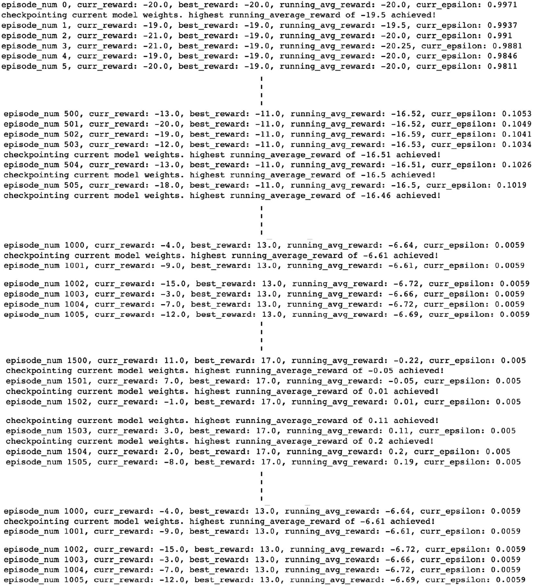

图 11\. 5 – DQN 训练日志

此外，下图显示了当前奖励、最佳奖励和平均奖励的进展，以及 epsilon 值与情节进展的关系：

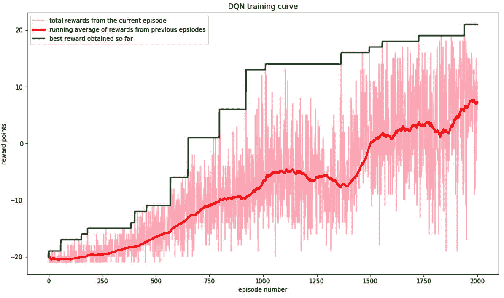

图 11\. 6 – DQN 训练曲线

下图显示了在训练过程中 epsilon 值随着回合数的减少情况：

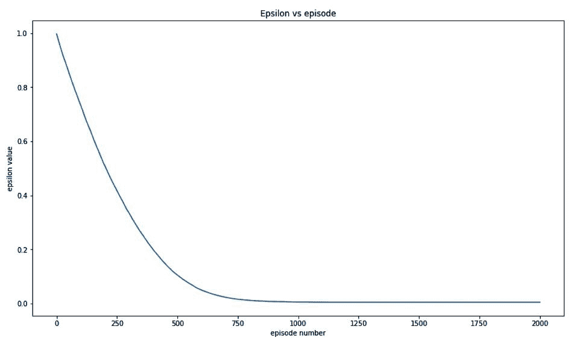

图 11\. 7 – 回合内的 epsilon 变化

注意，在*图 11.* *6*中，一个回合内奖励的运行平均值（红色曲线）从**-20**开始，这是代理在游戏中得**0**分而对手得**20**分的情况。随着回合的进行，平均奖励不断增加，到第**1500**回合时，越过了零点标记。这意味着在经过**1500**回合的训练后，代理已经超越了对手。

从这里开始，平均奖励变为正值，这表明代理平均上在对手手上占有优势。我们仅仅训练了**2000**回合，代理已经以超过**7**分的平均分数优势击败了对手。我鼓励你延长训练时间，看看代理是否能够始终得分，并以**20**分的优势击败对手。

这就结束了我们对 DQN 模型实现的深入挖掘。DQN 在强化学习领域取得了巨大成功并广受欢迎，绝对是探索该领域的一个很好的起点。PyTorch 与 gym 库一起，为我们在各种 RL 环境中工作和处理不同类型的 DRL 模型提供了极大的帮助。

在本章中，我们只关注了 DQNs，但我们所学到的经验可以应用到其他变体的 Q 学习模型和其他深度强化学习算法中。

## 摘要

强化学习是机器学习的一个基础分支，目前是研究和开发中最热门的领域之一。像谷歌 DeepMind 的 AlphaGo 这样基于 RL 的 AI 突破进一步增加了人们对这一领域的热情和兴趣。本章概述了强化学习和深度强化学习，并通过使用 PyTorch 构建 DQN 模型的实际练习带领我们深入探讨。

强化学习是一个广泛的领域，一章篇幅远远不够覆盖所有内容。我鼓励你利用本章的高层次讨论去探索这些细节。从下一章开始，我们将专注于使用 PyTorch 处理实际工作中的各个方面，比如模型部署、并行化训练、自动化机器学习等等。在下一章中，我们将讨论如何有效地使用 PyTorch 将训练好的模型投入生产系统。
