# 13 将 PyTorch 模型操作化为生产环境

## 加入我们的书籍社区 Discord

[`packt.link/EarlyAccessCommunity`](https://packt.link/EarlyAccessCommunity)


到目前为止，在本书中，我们已经介绍了如何使用 PyTorch 训练和测试不同类型的机器学习模型。我们首先回顾了 PyTorch 的基本元素，使我们能够高效地处理深度学习任务。然后，我们探索了使用 PyTorch 编写的广泛的深度学习模型架构和应用程序。

本章中，我们将重点讨论将这些模型投入生产环境的过程。但这意味着什么呢？基本上，我们将讨论不同的方式，将经过训练和测试的模型（对象）带入一个独立的环境，使其能够对输入数据进行预测或推断。这就是所谓的模型**生产化**，因为模型正在部署到生产系统中。

我们将从讨论一些常见的方法开始，这些方法可以用来在生产环境中服务 PyTorch 模型，从定义简单的模型推断函数开始，一直到使用模型微服务。然后，我们将介绍 TorchServe，这是一个可扩展的 PyTorch 模型服务框架，由 AWS 和 Facebook 联合开发。

然后，我们将深入探讨使用**TorchScript**导出 PyTorch 模型的世界，通过**序列化**使我们的模型独立于 Python 生态系统，从而可以在基于**C++**的环境中加载，例如。我们还将超越 Torch 框架和 Python 生态系统，探索**ONNX** - 一种用于机器学习模型的开放源代码通用格式，这将帮助我们将 PyTorch 训练的模型导出到非 PyTorch 和非 Python 环境中。

最后，我们将简要讨论如何使用 PyTorch 在一些著名的云平台（如**亚马逊网络服务**（**AWS**）、**Google Cloud**和**Microsoft Azure**）上提供模型服务。

在本章中，我们将使用我们在《第一章，使用 PyTorch 进行深度学习概述》中训练的手写数字图像分类**卷积神经网络**（**CNN**）模型作为参考。我们将演示如何使用本章讨论的不同方法部署和导出该训练过的模型。

本章分为以下几个部分：

+   PyTorch 中的模型服务

+   使用 TorchServe 提供 PyTorch 模型服务

+   使用 TorchScript 和 ONNX 导出通用 PyTorch 模型

+   在云中提供 PyTorch 模型服务

## PyTorch 中的模型服务

在本节中，我们将开始构建一个简单的 PyTorch 推断管道，该管道可以在给定一些输入数据和先前训练和保存的 PyTorch 模型的位置的情况下进行预测。之后，我们将把这个推断管道放在一个模型服务器上，该服务器可以监听传入的数据请求并返回预测结果。最后，我们将从开发模型服务器进阶到使用 Docker 创建模型微服务。

### 创建 PyTorch 模型推断管道

我们将继续在*第一章，PyTorch 使用深度学习的概述*中构建的手写数字图像分类 CNN 模型上进行工作，使用`MNIST`数据集。利用这个训练过的模型，我们将构建一个推断管道，能够为给定的手写数字输入图像预测 0 到 9 之间的数字。

对于构建和训练模型的过程，请参考*第一章，PyTorch 使用深度学习的概述*中的*训练神经网络使用 PyTorch*部分。关于这个练习的完整代码，您可以参考我们的 github 仓库[13.1]。

## 保存和加载训练好的模型

在本节中，我们将演示如何有效地加载保存的预训练 PyTorch 模型，这些模型稍后将用于处理请求。

因此，使用来自*第一章，PyTorch 使用深度学习的概述*的笔记本代码，我们训练了一个模型，并对测试数据样本进行了评估。但接下来呢？在现实生活中，我们希望关闭这个笔记本，并且以后仍然能够使用我们辛苦训练过的模型来推断手写数字图像。这就是模型服务概念的应用之处。

从这里开始，我们将处于一个位置，可以在一个单独的 Jupyter 笔记本中使用先前训练过的模型，而无需进行任何（重新）训练。关键的下一步是将模型对象保存到一个文件中，稍后可以恢复/反序列化。PyTorch 提供了两种主要的方法来实现这一点：

+   不推荐的方式是保存整个模型对象，如下所示：

```py
torch.save(model, PATH_TO_MODEL)
```

然后，稍后可以按如下方式读取保存的模型：

```py
model = torch.load(PATH_TO_MODEL)
```

尽管这种方法看起来最直接，但在某些情况下可能会有问题。这是因为我们不仅保存了模型参数，还保存了我们源代码中使用的模型类和目录结构。如果以后我们的类签名或目录结构发生变化，加载模型可能会以无法修复的方式失败。

+   第二种更推荐的方法是仅保存模型参数，如下所示：

```py
torch.save(model.state_dict(), PATH_TO_MODEL)
```

当我们需要恢复模型时，首先我们实例化一个空模型对象，然后将模型参数加载到该模型对象中，如下所示：

```py
model = ConvNet()
model.load_state_dict(torch.load(PATH_TO_MODEL))
```

我们将使用更推荐的方式保存模型，如下代码所示：

```py
PATH_TO_MODEL = "./convnet.pth"
torch.save(model.state_dict(), PATH_TO_MODEL)
```

`convnet.pth`文件本质上是一个包含模型参数的 pickle 文件。

此时，我们可以安全地关闭我们正在工作的笔记本，并打开另一个可以在我们的 github 仓库[13.2]中找到的笔记本：

1.  作为第一步，我们再次需要导入库：

```py
import torch
```

1.  接下来，我们需要再次实例化一个空的 CNN 模型。理想情况下，模型定义可以写在一个 Python 脚本中（比如 `cnn_model.py`），然后我们只需要写如下代码：

```py
from cnn_model import ConvNet
model = ConvNet()
```

然而，在这个练习中，由于我们正在使用 Jupyter 笔记本，我们将重写模型定义，然后像这样实例化它：

```py
class ConvNet(nn.Module):
    def __init__(self):
       …
    def forward(self, x):
        …
model = ConvNet()
```

1.  现在，我们可以将保存的模型参数恢复到实例化的模型对象中，方法如下：

```py
PATH_TO_MODEL = "./convnet.pth"
model.load_state_dict(torch.load(PATH_TO_MODEL, map_location="cpu"))
```

您将看到以下输出：


图 13 .1 – 模型参数加载

这基本上意味着参数加载成功。也就是说，我们实例化的模型与保存并现在正在恢复其参数的模型具有相同的结构。我们指定在 CPU 设备上加载模型，而不是 GPU（CUDA）。

1.  最后，我们希望指定不希望更新或更改加载模型的参数值，并将使用以下代码行来执行：

```py
model.eval()
```

这应该给出以下输出：

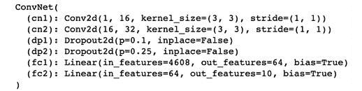

图 13 .2 – 加载模型并进行评估模式

这再次验证我们确实使用与训练过的相同模型（架构）进行工作。

## 构建推断流水线

在前一节成功在新环境（笔记本）中加载了预训练模型后，我们现在将构建我们的模型推断流水线，并用它来运行模型预测：

1.  此时，我们已经完全恢复了之前训练过的模型对象。现在，我们将加载一张图像，然后可以使用以下代码对其进行模型预测：

```py
image = Image.open("./digit_image.jpg")
```

图像文件应该在练习文件夹中，并且如下所示：

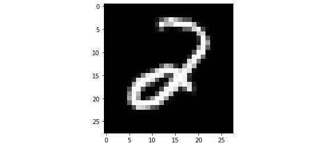

图 13 .3 – 模型推断输入图像

在本练习中不必使用此特定图像。您可以使用任何图像来检查模型对其的反应。

1.  在任何推断流水线中，核心有三个主要组件：(a) 数据预处理组件，(b) 模型推断（神经网络的前向传播），以及 (c) 后处理步骤。

我们将从第一部分开始，通过定义一个函数，该函数接收图像并将其转换为作为模型输入的张量：

```py
def image_to_tensor(image):
    gray_image = transforms.functional.to_grayscale(image)
    resized_image = transforms.functional.resize(gray_image, (28, 28))
    input_image_tensor = transforms.functional.to_tensor(resized_image)
    input_image_tensor_norm = transforms.functional.normalize(input_image_tensor, (0.1302,), (0.3069,))
    return input_image_tensor_norm
```

这可以看作是以下一系列步骤的一部分：

1.  首先，RGB 图像转换为灰度图像。

1.  然后，将图像调整为 `28x28` 像素的图像，因为这是模型训练时使用的图像尺寸。

1.  接下来，将图像数组转换为 PyTorch 张量。

1.  最后，对张量中的像素值进行归一化，归一化使用与模型训练时相同的均值和标准差值。

定义了此函数后，我们调用它将加载的图像转换为张量：

```py
input_tensor = image_to_tensor(image)
```

1.  接下来，我们定义**模型推断功能**。这是模型接收张量作为输入并输出预测的地方。在这种情况下，预测将是 0 到 9 之间的任何数字，输入张量将是输入图像的张量化形式：

```py
def run_model(input_tensor):
    model_input = input_tensor.unsqueeze(0)
    with torch.no_grad():
        model_output = model(model_input)[0]
    model_prediction = model_output.detach().numpy().argmax()
    return model_prediction
```

`model_output`包含模型的原始预测，其中包含每个图像预测的列表。因为我们只有一个输入图像，所以这个预测列表只有一个在索引`0`处的条目。索引`0`处的原始预测本质上是一个张量，其中有 10 个数字 0 到 9 的概率值，按顺序排列。这个张量被转换为一个`numpy`数组，最后我们选择具有最高概率的数字。

1.  现在我们可以使用这个函数生成我们的模型预测。下面的代码使用*第 3 步*的`run_model`模型推断函数来为给定的输入数据`input_tensor`生成模型预测：

```py
output = run_model(input_tensor)
print(output)
print(type(output))
```

这应该会输出以下内容：


图 13 .4 – 模型推断输出

如前面的截图所示，模型输出为一个`numpy`整数。基于*图 13 .3*中显示的图像，模型输出似乎相当正确。

1.  除了仅输出模型预测外，我们还可以编写调试函数来更深入地了解诸如原始预测概率等指标，如下面的代码片段所示：

```py
def debug_model(input_tensor):
    model_input = input_tensor.unsqueeze(0)
    with torch.no_grad():
        model_output = model(model_input)[0]
    model_prediction = model_output.detach().numpy()
    return np.exp(model_prediction)
```

这个函数与`run_model`函数完全相同，只是它返回每个数字的原始概率列表。由于模型最终层使用了`log_softmax`层，所以模型原始返回的是 softmax 输出的对数（参考本练习的*第 2 步*）。

因此，我们需要对这些数字进行指数运算，以返回 softmax 输出，这些输出等同于模型预测的概率。使用这个调试函数，我们可以更详细地查看模型的表现，比如概率分布是否平坦或者是否有明显的峰值：

```py
print(debug_model(input_tensor))
```

这应该会产生类似以下的输出：

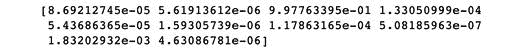

图 13 .5 – 模型推断调试输出

我们可以看到列表中第三个概率远远最高，对应数字 2。

1.  最后，我们将对模型预测进行后处理，以便其他应用程序可以使用。在我们的情况下，我们将仅将模型预测的数字从整数类型转换为字符串类型。

在其他场景中，后处理步骤可能会更复杂，比如语音识别，我们可能希望通过平滑处理、移除异常值等方式处理输出波形：

```py
def post_process(output):
    return str(output)
```

因为字符串是可序列化格式，这使得模型预测可以在服务器和应用程序之间轻松传递。我们可以检查我们的最终后处理数据是否符合预期：

```py
final_output = post_process(output)
print(final_output)
print(type(final_output))
```

这应该会为您提供以下输出：


图 13 .6 – 后处理模型预测

如预期，现在输出的类型为字符串。

这结束了我们加载保存的模型架构，恢复其训练权重，并使用加载的模型为样本输入数据（一张图像）生成预测的练习。我们加载了一个样本图像，对其进行预处理以将其转换为 PyTorch 张量，将其作为输入传递给模型以获取模型预测，并对预测进行后处理以生成最终输出。

这是朝着为经过训练的模型提供明确定义的输入和输出接口的方向迈出的一步。在这个练习中，输入是一个外部提供的图像文件，输出是一个包含 0 到 9 之间数字的生成字符串。这样的系统可以通过复制并粘贴提供的代码嵌入到任何需要手写数字转换功能的应用程序中。

在接下来的部分，我们将深入探讨模型服务的更高级别，我们的目标是构建一个可以被任何应用程序交互使用的系统，以使用数字化功能，而无需复制和粘贴任何代码。

### 构建一个基本的模型服务器

到目前为止，我们已经构建了一个模型推断管道，其中包含独立执行预训练模型预测所需的所有代码。在这里，我们将致力于构建我们的第一个模型服务器，这本质上是一个托管模型推断管道的机器，通过接口主动监听任何传入的输入数据，并通过接口对任何输入数据输出模型预测。

## 使用 Flask 编写一个基本应用

为了开发我们的服务器，我们将使用一个流行的 Python 库 – Flask [13.3]。**Flask**将使我们能够用几行代码构建我们的模型服务器。关于该库如何工作的一个很好的示例如下所示：

```py
from flask import Flask
app = Flask(__name__)
@app.route('/')
def hello_world():
    return 'Hello, World!'
if __name__ == '__main__':
    app.run(host='localhost', port=8890)
```

假设我们将这个 Python 脚本保存为`example.py`并从终端运行它：

```py
python example.py
```

它将在终端显示以下输出：

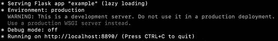

图 13 .7 – Flask 示例应用启动

基本上，它将启动一个 Flask 服务器，用于提供名为**example**的应用程序。让我们打开一个浏览器，并转到以下 URL：

```py
http://localhost:8890/
```

它将在浏览器中产生以下输出：


图 13 .8 – Flask 示例应用测试

本质上，Flask 服务器在 IP 地址为`0.0.0.0（localhost）`的端口号`8890`上监听端点`/`。当我们在浏览器搜索栏中输入`localhost:8890/`并按*Enter*时，该服务器将接收到一个请求。然后，服务器运行`hello_world`函数，该函数根据`example.py`中提供的函数定义返回字符串`Hello, World!`。

## 使用 Flask 构建我们的模型服务器

使用前面部分演示的运行 Flask 服务器的原则，我们现在将使用前一部分构建的模型推理管道来创建我们的第一个模型服务器。 在练习结束时，我们将启动服务器以侦听传入请求（图像数据输入）。

此外，我们还将编写另一个 Python 脚本，通过向此服务器发送*图 13* *.3*中显示的示例图像，向此服务器发出请求。 Flask 服务器将对该图像进行模型推理并输出后处理的预测结果。

此练习的完整代码在 GitHub 上可用，包括 Flask 服务器代码 [13.4] 和客户端（请求生成器）代码 [13.5]。

### 为 Flask 服务设置模型推理

在本节中，我们将加载预训练模型并编写模型推理管道代码：

1.  首先，我们将构建 Flask 服务器。 为此，我们再次开始导入必要的库：

```py
from flask import Flask, request
import torch
```

除了`numpy`和`json`等其他基本库外，`flask`和`torch`对于这个任务都是至关重要的。

1.  接下来，我们需要定义模型类（架构）：

```py
class ConvNet(nn.Module):
    def __init__(self):
    def forward(self, x):
```

1.  现在我们已经定义了空模型类，我们可以实例化一个模型对象，并将预训练模型参数加载到该模型对象中，方法如下：

```py
model = ConvNet()
PATH_TO_MODEL = "./convnet.pth"
model.load_state_dict(torch.load(PATH_TO_MODEL, map_location="cpu"))
model.eval()
```

1.  我们将重复使用在“构建推理管道”部分“步骤 3”中定义的精确`run_model`函数：

```py
def run_model(input_tensor):
    …
    return model_prediction
```

作为提醒，此函数接受张量化的输入图像并输出模型预测，即介于 0 到 9 之间的任何数字。

1.  接下来，我们将重复使用在“构建推理管道”部分的“第 6 步”中定义的精确`post_process`函数：

```py
def post_process(output):
    return str(output)
```

这将从`run_model`函数的整数输出转换为字符串。

### 构建一个用于提供模型的 Flask 应用

在上一节中建立了推理管道之后，我们现在将构建我们自己的 Flask 应用并使用它来提供加载的模型服务：

1.  我们将如下代码示例化我们的 Flask 应用：

```py
app = Flask(__name__)
```

这将创建一个与 Python 脚本同名的 Flask 应用，这在我们的案例中是`server(.py)`。

1.  这是关键步骤，我们将在 Flask 服务器中定义端点功能。 我们将暴露`/test`端点并定义在服务器上进行`POST`请求时发生的事件如下：

```py
@app.route("/test", methods=["POST"])
def test():
    data = request.files['data'].read()
    md = json.load(request.files['metadata'])
    input_array = np.frombuffer(data, dtype=np.float32)
    input_image_tensor = torch.from_numpy(input_array).view(md["dims"])
    output = run_model(input_image_tensor)
    final_output = post_process(output)
    return final_output
```

让我们逐步进行这些步骤：

1.  首先，在函数下面定义一个装饰器`test`。 此装饰器告诉 Flask 应用程序，每当有人向`/test`端点发出`POST`请求时，运行此函数。

1.  接下来，我们将定义`test`函数内部发生的确切事件。 首先，我们从`POST`请求中读取数据和元数据。 因为数据是序列化形式，所以我们需要将其转换为数值格式 - 我们将其转换为`numpy`数组。 从`numpy`数组中，我们迅速将其转换为 PyTorch 张量。

1.  接下来，我们使用元数据中提供的图像尺寸来重塑张量。

1.  最后，我们对之前加载的模型执行前向传播。这会给我们模型的预测结果，然后经过后处理并由我们的测试函数返回。

1.  我们已经准备好启动我们的 Flask 应用程序所需的所有组件。我们将这最后两行添加到我们的`server.py` Python 脚本中：

```py
if __name__ == '__main__':
    app.run(host='0.0.0.0', port=8890)
```

这表明 Flask 服务器将托管在 IP 地址`0.0.0.0`（也称为`localhost`）和端口号`8890`。我们现在可以保存 Python 脚本，并在新的终端窗口中执行以下操作：

```py
python server.py
```

这将运行前面步骤中编写的整个脚本，并将看到以下输出：

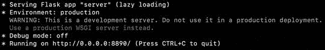

图 13 .9 - Flask 服务器启动

这看起来类似于图 13 *.7* 中演示的示例。唯一的区别是应用程序名称。

### 使用 Flask 服务器运行预测。

我们已成功启动了我们的模型服务器，它正在积极监听请求。现在让我们继续处理发送请求的工作：

1.  接下来的几步我们将编写一个单独的 Python 脚本来完成这项工作。我们首先导入库：

```py
import requests
from PIL import Image
from torchvision import transforms
```

`requests`库将帮助我们向 Flask 服务器发起实际的`POST`请求。`Image`帮助我们读取样本输入图像文件，而`transforms`则帮助我们预处理输入图像数组。

1.  接下来，我们读取一个图像文件：

```py
image = Image.open("./digit_image.jpg")
```

这里读取的图像是 RGB 图像，可能具有任意尺寸（不一定是模型期望的 28x28 尺寸）。

1.  现在我们定义一个预处理函数，将读取的图像转换为模型可读取的格式：

```py
def image_to_tensor(image):
    gray_image = transforms.functional.to_grayscale(image)
    resized_image = transforms.functional.resize(gray_image, (28, 28))
    input_image_tensor = transforms.functional.to_tensor(resized_image)
    input_image_tensor_norm = transforms.functional.normalize(input_image_tensor, (0.1302,), (0.3069,))
    return input_image_tensor_norm
```

定义了函数之后，我们可以执行它：

```py
image_tensor = image_to_tensor(image)
```

`image_tensor`是我们需要发送给 Flask 服务器的输入数据。

1.  现在让我们将数据打包在一起发送过去。我们希望发送图像的像素值以及图像的形状（28x28），这样接收端的 Flask 服务器就知道如何将像素值流重构为图像：

```py
dimensions = io.StringIO(json.dumps({'dims': list(image_tensor.shape)}))
data = io.BytesIO(bytearray(image_tensor.numpy()))
```

我们将张量的形状转换为字符串，并将图像数组转换为字节，使其可序列化。

1.  这是客户端代码中最关键的一步。这是我们实际发起`POST`请求的地方：

```py
r = requests.post('http://localhost:8890/test',
                  files={'metadata': dimensions,                          'data' : data})
```

使用`requests`库，我们在 URL`localhost:8890/test`发起`POST`请求。这是 Flask 服务器监听请求的地方。我们将实际图像数据（以字节形式）和元数据（以字符串形式）发送为字典的形式。

1.  在上述代码中，`r`变量将接收来自 Flask 服务器请求的响应。这个响应应该包含经过后处理的模型预测结果。我们现在读取该输出：

```py
response = json.loads(r.content)
```

`response`变量实际上将包含 Flask 服务器输出的内容，这是一个介于 0 和 9 之间的数字字符串。

1.  我们可以打印响应以确保一切正常：

```py
print("Predicted digit :", response)
```

此时，我们可以将此 Python 脚本保存为`make_request.py`，并在终端中执行以下命令：

```py
python make_request.py
```

这应该输出以下内容：


图 13 .10 – Flask 服务器响应

基于输入图像（见*图 13* *.3*），响应看起来相当正确。这结束了我们当前的练习。

因此，我们已成功构建了一个独立的模型服务器，可以为手写数字图像进行预测。同样的步骤集可以轻松扩展到任何其他机器学习模型，因此使用 PyTorch 和 Flask 创建机器学习应用程序的可能性是无限的。

到目前为止，我们已经不仅仅是编写推理函数，而是创建了可以远程托管并在网络上进行预测的模型服务器。在我们接下来和最后的模型服务冒险中，我们将再进一步。您可能已经注意到，在遵循前两个练习的步骤时，有一些固有的依赖需要考虑。我们需要安装某些库，保存和加载模型在特定位置，读取图像数据等等。所有这些手动步骤都会减慢模型服务器的开发速度。

接下来，我们将致力于创建一个可以通过一条命令快速启动并在多台机器上复制的模型微服务。

### 创建模型微服务

想象一下，您对训练机器学习模型一无所知，但希望使用已经训练好的模型，而不必涉及任何 PyTorch 代码。这就是诸如机器学习模型微服务 [13.6] 这样的范式发挥作用的地方。

可以将机器学习模型微服务看作是一个黑盒子，您向其发送输入数据，它向您发送预测。而且，仅需几行代码就可以在给定的机器上快速启动这个黑盒子。最好的部分是它可以轻松扩展。您可以通过使用更大的机器（更多内存、更多处理能力）来垂直扩展微服务，也可以通过在多台机器上复制微服务来水平扩展。

我们如何部署一个机器学习模型作为微服务？多亏了在前面的练习中使用 Flask 和 PyTorch 所做的工作，我们已经领先了几步。我们已经使用 Flask 构建了一个独立的模型服务器。

在本节中，我们将这个想法推向前进，并构建一个独立的模型服务环境，使用**Docker**。 Docker 有助于容器化软件，这基本上意味着它帮助虚拟化整个**操作系统**（**OS**），包括软件库、配置文件，甚至数据文件。

> **注意**
> 
> > Docker 本身是一个广泛讨论的话题。然而，由于本书专注于 PyTorch，我们只会涵盖 Docker 的基本概念和用法，以适应我们有限的目的。如果您有兴趣进一步了解 Docker，他们自己的文档是一个很好的起点 [13.7] 。

在我们的案例中，到目前为止，在构建我们的模型服务器时，我们已经使用了以下库：

+   Python

+   PyTorch

+   Pillow（用于图像 I/O）

+   Flask

此外，我们使用了以下数据文件：

+   预训练模型检查点文件 (`convnet.pth`)

我们不得不通过安装库并将文件放置在当前工作目录中手动安排这些依赖关系。如果我们需要在新机器上重新执行所有操作会怎样？我们将不得不手动安装库并再次复制粘贴文件。这种工作方式既不高效，也不可靠，例如，我们可能会在不同的机器上安装不同版本的库。

为了解决这个问题，我们想创建一个可以在各个机器上一致重复的操作系统级蓝图。这就是 Docker 发挥作用的地方。Docker 让我们可以创建一个 Docker 镜像的形式来实现这个蓝图。这个镜像可以在任何空白的机器上构建，不需要假设预先安装了 Python 库或已经可用的模型。

让我们实际上使用 Docker 为我们的数字分类模型创建这样的蓝图。作为一个练习，我们将从基于 Flask 的独立模型服务器转向基于 Docker 的模型微服务。在深入练习之前，您需要安装 Docker [13.8]：

1.  首先，我们需要列出 Flask 模型服务器的 Python 库需求。需求（及其版本）如下：

```py
torch==1.5.0
torchvision==0.5.0
Pillow==6.2.2
Flask==1.1.1
```

作为一般惯例，我们将把这个列表保存为一个文本文件 – `requirements.txt`。这个文件也可以在我们的 GitHub 仓库中找到 [13.9]。这个列表将有助于在任何给定的环境中一致地安装这些库。

1.  接下来，我们直接进入蓝图，用 Docker 术语来说，这将是 `Dockerfile`。`Dockerfile` 是一个脚本，实质上是一系列的指令。运行这个 `Dockerfile` 的机器需要执行文件中列出的指令。这会生成一个 Docker 镜像，这个过程称为 *构建镜像*。

在这里，一个 **镜像** 是一个系统快照，可以在任何机器上执行，只要该机器具备最低必要的硬件资源（例如，仅安装 PyTorch 就需要多个 GB 的磁盘空间）。

让我们看看我们的`Dockerfile`并逐步理解它的作用。完整的`Dockerfile`代码可在我们的 GitHub 仓库中找到 [13.10]。

。

1.  `FROM` 关键字指示 Docker 获取一个预先安装了 `python 3.8` 的标准 Linux 操作系统：

```py
FROM python:3.8-slim
```

这确保我们将安装 Python。

1.  接下来，安装 `wget`，这是一个 Unix 命令，有助于通过命令行下载互联网资源：

```py
RUN apt-get -q update && apt-get -q install -y wget
```

`&&` 符号表示在符号前后写的命令是顺序执行的。

1.  在这里，我们正在将两个文件从我们的本地开发环境复制到这个虚拟环境中：

```py
COPY ./server.py ./
COPY ./requirements.txt ./
```

我们复制了在 *步骤 1* 中讨论过的 requirements 文件，以及在前一个练习中工作过的 Flask 模型服务器代码。

1.  接下来，我们下载预训练的 PyTorch 模型检查点文件：

```py
RUN wget -q https://github.com/arj7192/MasteringPyTorchV2/raw/main/Chapter13/convnet.pth 
```

这是我们在本章的*保存和加载训练好的模型*部分中保存的同一模型检查点文件。

1.  在这里，我们正在安装`requirements.txt`下列出的所有相关库：

```py
RUN pip install -r requirements.txt
```

这个`txt`文件是我们在*步骤 1*下编写的文件。

1.  接下来，我们给 Docker 客户端赋予`root`访问权限：

```py
USER root
```

这一步在本练习中非常重要，因为它确保客户端具有执行所有必要操作的凭据，例如在磁盘上保存模型推断日志。

> **注意**
> 
> > 总体而言，建议根据数据安全的最小特权原则[13.11]，不要赋予客户端 root 权限。

1.  最后，我们指定在执行了所有前面的步骤之后，Docker 应该执行`python server.py`命令：

```py
ENTRYPOINT ["python", "server.py"]
```

这将确保在虚拟机中启动一个 Flask 模型服务器。

1.  现在让我们运行这个 Dockerfile。换句话说，让我们使用*步骤 2*中的 Dockerfile 构建一个 Docker 镜像。在当前工作目录中，只需在命令行上运行以下命令：

```py
docker build -t digit_recognizer .
```

我们正在为我们的 Docker 镜像分配一个名为`digit_recognizer`的标签。这应该输出以下内容：

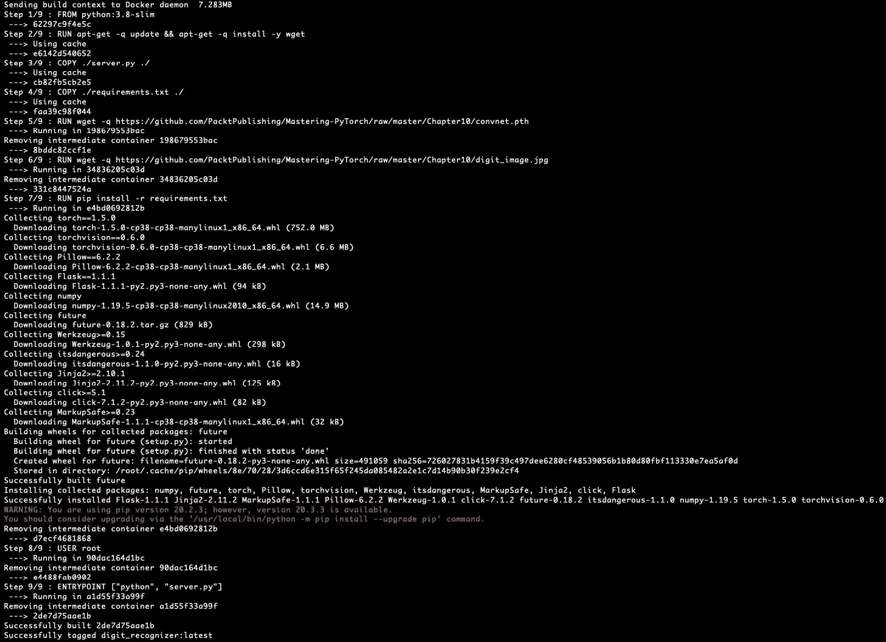

图 13 .11 – 构建 Docker 镜像

*图 13* *.11*显示了*步骤 2*中提到的步骤的顺序执行。根据您的互联网连接速度，此步骤的运行时间可能会有所不同，因为它需要下载整个 PyTorch 库等内容以构建镜像。

1.  在这个阶段，我们已经有一个名为`digit_recognizer`的 Docker 镜像。我们已经准备好在任何机器上部署这个镜像。为了暂时在您自己的机器上部署这个镜像，只需运行以下命令：

```py
docker run -p 8890:8890 digit_recognizer
```

使用这个命令，我们本质上是在我们的机器内部启动一个虚拟机，使用`digit_recognizer` Docker 镜像。因为我们原来的 Flask 模型服务器设计为监听端口`8890`，我们使用`-p`参数将我们实际机器的端口`8890`转发到虚拟机的端口`8890`。运行这个命令应该输出以下内容：

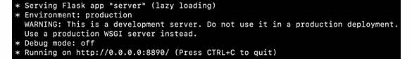

图 13 .12 – 运行 Docker 实例

前面的截图与上一练习中的*图 13* *.9*非常相似，这并不奇怪，因为 Docker 实例正在运行我们之前手动运行的相同 Flask 模型服务器。

1.  现在，我们可以测试我们的 Docker 化 Flask 模型服务器（模型微服务）是否按预期工作，方法是使用前一练习中使用的`make_request.py`文件向我们的模型发送预测请求。从当前本地工作目录，简单执行以下命令：

```py
python make_request.py
```

这应该输出以下内容：


图 13 .13 – 微服务模型预测

微服务似乎在发挥作用，因此我们成功地使用 Python、PyTorch、Flask 和 Docker 构建和测试了自己的机器学习模型微服务。

1.  完成前面的步骤后，可以按照 *第 4 步* 中指示的方式，通过按下 *Ctrl*+*C* 关闭启动的 Docker 实例（见 *图 13* *.12*）。一旦运行的 Docker 实例停止，可以通过运行以下命令删除该实例：

```py
docker rm $(docker ps -a -q | head -1)
```

此命令基本上移除了最近不活跃的 Docker 实例，也就是我们刚刚停止的 Docker 实例。

1.  最后，还可以通过运行以下命令删除我们在 *第 3 步* 下构建的 Docker 镜像：

```py
docker rmi $(docker images -q "digit_recognizer")
```

这将基本上删除已标记为 `digit_recognizer` 标签的镜像。

这结束了我们为 PyTorch 编写模型服务的部分。我们首先设计了一个本地模型推理系统。然后，我们将这个推理系统包装成基于 Flask 的模型服务器，创建了一个独立的模型服务系统。

最后，我们使用基于 Flask 的模型服务器放置在 Docker 容器内，实质上创建了一个模型服务微服务。使用本节讨论的理论和练习，您应该能够开始在不同的用例、系统配置和环境中托管/提供您训练好的模型。

在接下来的部分中，我们将继续与模型服务主题保持一致，但会讨论一种特定的工具，该工具正是为了精确为 PyTorch 模型提供服务而开发的：**TorchServe**。我们还将进行一个快速练习，演示如何使用这个工具。

## 使用 TorchServe 服务 PyTorch 模型

TorchServe 是一个专用的 PyTorch 模型服务框架，于 2020 年 4 月发布。使用 TorchServe 提供的功能，我们可以同时为多个模型提供服务，具有低预测延迟，并且无需编写大量自定义代码。此外，TorchServe 还提供模型版本控制、指标监控以及数据预处理和后处理等功能。

显然，TorchServe 是一个更高级的模型服务替代方案，比我们在前一节中开发的模型微服务更为先进。然而，创建定制的模型微服务仍然被证明是解决复杂机器学习流水线问题的强大解决方案（这比我们想象的更常见）。

在本节中，我们将继续使用我们的手写数字分类模型，并演示如何使用 TorchServe 进行服务。阅读本节后，您应该能够开始使用 TorchServe 并进一步利用其完整的功能集。

### 安装 TorchServe

在开始练习之前，我们需要安装 Java 11 SDK 作为先决条件。对于 Linux 操作系统，请运行以下命令：

```py
sudo apt-get install openjdk-11-jdk
```

对于 macOS，我们需要在命令行上运行以下命令：

```py
brew tap AdoptOpenJDK/openjdk
brew      install --cask adoptopenjdk11
```

然后，我们需要运行以下命令安装 `torchserve`：

```py
pip install torchserve==0.6.0 torch-model-archiver==0.6.0
```

有关详细的安装说明，请参阅 torchserve 文档 [13.12]。

注意，我们还安装了一个名为`torch-model-archiver`的库 [13.13]。这个归档工具旨在创建一个模型文件，该文件将包含模型参数以及模型架构定义，以独立序列化格式存储为`.mar`文件。

## 启动和使用 TorchServe 服务器。

现在我们已经安装了所有需要的东西，可以开始组合先前练习中的现有代码来使用 TorchServe 提供我们的模型。以下是我们将通过练习步骤进行的几个步骤：

1.  首先，我们将现有的模型架构代码放入一个名为`convnet.py`的模型文件中：

```py
==========================convnet.py===========================
import torch
import torch.nn as nn
import torch.nn.functional as F
class ConvNet(nn.Module):
    def __init__(self):
        …
    def forward(self, x):
        …
```

我们将需要将这个模型文件作为`torch-model-archiver`的输入之一，以产生一个统一的`.mar`文件。您可以在我们的 GitHub 仓库 [13.14] 中找到完整的模型文件。

记得我们曾讨论过模型推断流程的三个部分：数据预处理、模型预测和后处理。TorchServe 提供了*处理程序*来处理流行的机器学习任务的预处理和后处理部分：`image_classifier`、`image_segmenter`、`object_detector`和`text_classifier`。

由于在撰写本书时 TorchServe 正在积极开发中，因此这个列表可能会在未来增加。

1.  对于我们的任务，我们将创建一个自定义的图像处理程序，它是从默认的`Image_classifier`处理程序继承而来。我们选择创建一个自定义处理程序，因为与处理彩色（RGB）图像的常规图像分类模型不同，我们的模型处理特定尺寸（28x28 像素）的灰度图像。以下是我们的自定义处理程序的代码，您也可以在我们的 GitHub 仓库 [13.15] 中找到：

```py
========================convnet_handler.py=======================
from torchvision import transforms
from ts.torch_handler.image_classifier import ImageClassifier
class ConvNetClassifier(ImageClassifier):
    image_processing = transforms.Compose([
        transforms.Grayscale(), transforms.Resize((28, 28)),
        transforms.ToTensor(),  transforms.Normalize((0.1302,), (0.3069,))])
    def postprocess(self, output):
        return output.argmax(1).tolist()
```

首先，我们导入了`image_classifier`默认处理程序，它将提供大部分基本的图像分类推断流程处理能力。接下来，我们继承`ImageClassifer`处理程序类来定义我们的自定义`ConvNetClassifier`处理程序类。

这里有两个自定义代码块：

1.  数据预处理步骤，我们将数据应用一系列变换，正如我们在“构建推断流程”部分的“步骤 3”中所做的那样。

1.  后处理步骤，在`postprocess`方法下定义，我们从所有类别预测概率的列表中提取预测的类标签。

1.  在本章的“保存和加载训练模型”部分我们已经生成了一个`convnet.pth`文件用于创建模型推断流程。使用`convnet.py`、`convnet_handler.py`和`convnet.pth`，我们最终可以通过运行以下命令使用`torch-model-archiver`来创建`.mar`文件：

```py
torch-model-archiver --model-name convnet --version 1.0 --model-file ./convnet.py --serialized-file ./convnet.pth --handler  ./convnet_handler.py
```

这个命令应该会在当前工作目录写入一个`convnet.mar`文件。我们指定了一个`model_name`参数，它为`.mar`文件命名。我们指定了一个`version`参数，在同时处理多个模型变体时有助于模型版本控制。

我们已经找到了我们的 `convnet.py`（用于模型架构）、`convnet.pth`（用于模型权重）和 `convnet_handler.py`（用于前处理和后处理）文件的位置，分别使用了 `model_file`、`serialzed_file` 和 `handler` 参数。

1.  接下来，我们需要在当前工作目录中创建一个新目录，并将*第 3 步* 中创建的 `convnet.mar` 文件移动到该目录中，通过以下命令完成：

```py
mkdir model_store
mv convnet.mar model_store/
```

我们必须这样做来遵循 TorchServe 框架的设计要求。

1.  最后，我们可以使用 TorchServe 启动我们的模型服务器。在命令行上，只需运行以下命令：

```py
torchserve --start --ncs --model-store model_store --models convnet.mar
```

这将静默地启动模型推断服务器，并在屏幕上显示一些日志，包括以下内容：

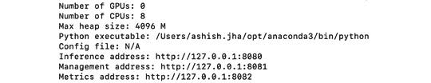

图 13 .14 – TorchServe 启动输出

正如你所见，TorchServe 会检查机器上可用的设备及其他详细信息。它为*推断*、*管理*和*指标*分配了三个独立的 URL。为了检查启动的服务器是否确实在为我们的模型提供服务，我们可以使用以下命令来 ping 管理服务器：

```py
curl http://localhost:8081/models
```

这应该输出以下内容：


图 13 .15 – TorchServe 服务模型

这验证了 TorchServe 服务器确实在托管模型。

1.  最后，我们可以通过发送推断请求来测试我们的 TorchServe 模型服务器。这一次，我们不需要编写 Python 脚本，因为处理程序已经处理任何输入图像文件。因此，我们可以通过运行以下命令，直接使用 `digit_image.jpg` 示例图像文件进行请求：

```py
curl http://127.0.0.1:8080/predictions/convnet -T ./digit_image.jpg
```

这应该在终端输出 `2`，这确实是正确的预测，正如*图 13* *.3* 所示。

1.  最后，一旦我们完成了对模型服务器的使用，可以通过在命令行上运行以下命令来停止它：

```py
torchserve --stop
```

这结束了我们如何使用 TorchServe 快速启动自己的 PyTorch 模型服务器并用其进行预测的练习。这里还有很多内容需要挖掘，比如模型监控（指标）、日志记录、版本控制、性能基准测试等 [13.16] 。TorchServe 的网站是深入研究这些高级主题的好地方。

完成本节后，您将能够使用 TorchServe 来为自己的模型提供服务。我鼓励您为自己的用例编写自定义处理程序，探索各种 TorchServe 配置设置 [13.17] ，并尝试 TorchServe 的其他高级功能 [13.18] 。

> **注意**
> 
> > TorchServe 在不断发展中，充满了许多潜力。我的建议是密切关注 PyTorch 领域的快速更新。

在下一节中，我们将探讨如何导出 PyTorch 模型，以便在不同的环境、编程语言和深度学习库中使用。

## 使用 TorchScript 和 ONNX 导出通用 PyTorch 模型

我们已经在本章前几节广泛讨论了提供 PyTorch 模型服务，这也许是在生产系统中实现 PyTorch 模型操作的最关键方面。在这一部分，我们将探讨另一个重要方面 – 导出 PyTorch 模型。我们已经学会了如何在经典的 Python 脚本环境中保存 PyTorch 模型并从磁盘加载它们。但是，我们需要更多导出 PyTorch 模型的方式。为什么呢？

对于初学者来说，Python 解释器一次只允许一个线程运行，使用**全局解释器锁**（**GIL**）。这使得我们无法并行操作。其次，Python 可能不受我们希望在其上运行模型的每个系统或设备的支持。为了解决这些问题，PyTorch 提供了支持以高效的格式导出其模型，并以与平台或语言无关的方式，使模型能够在与其训练环境不同的环境中运行。

首先，我们将探讨 TorchScript，它使我们能够将序列化和优化的 PyTorch 模型导出为一个中间表示，然后可以在独立于 Python 的程序（比如说，C++ 程序）中运行。

接下来，我们将看看 ONNX 及其如何让我们将 PyTorch 模型保存为通用格式，然后加载到其他深度学习框架和不同编程语言中。

### 理解 TorchScript 的实用性

当涉及将 PyTorch 模型投入生产时，TorchScript 是一个至关重要的工具的两个关键原因：

+   PyTorch 基于急切执行，正如本书第一章“使用 PyTorch 进行深度学习概述”中讨论的那样。这有其优点，如更容易调试。然而，逐步执行步骤/操作，通过写入和读取中间结果到内存，可能导致高推理延迟，同时限制整体操作优化。为了解决这个问题，PyTorch 提供了自己的**即时**（**JIT**）编译器，基于 Python 的 PyTorch 中心部分。

JIT 编译器编译 PyTorch 模型而不是解释，这相当于一次性查看模型的所有操作并创建一个复合图。JIT 编译的代码是 TorchScript 代码，它基本上是 Python 的静态类型子集。这种编译带来了多种性能改进和优化，比如去除 GIL，从而实现多线程。

+   PyTorch 本质上是与 Python 编程语言一起使用的。请记住，本书几乎完全使用了 Python。然而，在将模型投入生产时，有比 Python 更高效（即更快）的语言，如 C++。而且，我们可能希望在不支持 Python 的系统或设备上部署训练过的模型。

这就是 TorchScript 的作用。一旦我们将 PyTorch 代码编译成 TorchScript 代码，这是我们的 PyTorch 模型的中间表示，我们可以使用 TorchScript 编译器将这个表示序列化为一个符合 C++ 格式的文件。此后，可以在 C++ 模型推理程序中使用 LibTorch（PyTorch 的 C++ API）读取这个序列化文件。

我们在本节中已多次提到 PyTorch 模型的 JIT 编译。现在让我们看看将我们的 PyTorch 模型编译成 TorchScript 格式的两种可能选项中的两种。

### 使用 TorchScript 进行模型跟踪

将 PyTorch 代码转换为 TorchScript 的一种方法是跟踪 PyTorch 模型。跟踪需要 PyTorch 模型对象以及一个模型的虚拟示例输入。正如其名称所示，跟踪机制跟踪这个虚拟输入通过模型（神经网络）的流程，记录各种操作，并生成 TorchScript **中间表示**（**IR**），可以将其视为图形以及 TorchScript 代码进行可视化。

现在，我们将逐步介绍使用手写数字分类模型跟踪 PyTorch 模型的步骤。此练习的完整代码可在我们的 github 仓库 [13.19] 中找到。

此练习的前五个步骤与“保存和加载训练模型”和“构建推理流水线”部分的步骤相同，我们在这些部分构建了模型推理流水线：

1.  我们将通过运行以下代码开始导入库：

```py
import torch
...
```

1.  接下来，我们将定义并实例化 `model` 对象：

```py
class ConvNet(nn.Module):
    def __init__(self):
       …
    def forward(self, x):
        …
model = ConvNet()
```

1.  接下来，我们将使用以下代码恢复模型权重：

```py
PATH_TO_MODEL = "./convnet.pth"
model.load_state_dict(torch.load(PATH_TO_MODEL, map_location="cpu"))
model.eval()
```

1.  然后我们加载一个示例图像：

```py
image = Image.open("./digit_image.jpg")
```

1.  接下来，我们定义数据预处理函数：

```py
def image_to_tensor(image):
    gray_image = transforms.functional.to_grayscale(image)
    resized_image = transforms.functional.resize(gray_image, (28, 28))
    input_image_tensor = transforms.functional.to_tensor(resized_image)
    input_image_tensor_norm = transforms.functional.normalize(input_image_tensor, (0.1302,), (0.3069,))
    return input_image_tensor_norm
```

然后，我们将对样本图像应用预处理函数：

```py
input_tensor = image_to_tensor(image)
```

1.  除了 *步骤 3* 下的代码之外，我们还执行以下代码：

```py
for p in model.parameters():
    p.requires_grad_(False)
```

如果我们不这样做，跟踪的模型将具有所有需要梯度的参数，我们将不得不在 `torch.no_grad()` 上下文中加载模型。

1.  我们已经加载了带有预训练权重的 PyTorch 模型对象。接下来，我们将使用一个虚拟输入跟踪该模型：

```py
demo_input = torch.ones(1, 1, 28, 28)
traced_model = torch.jit.trace(model, demo_input)
```

虚拟输入是一个所有像素值都设为 `1` 的图像。

1.  现在我们可以通过运行这个来查看跟踪的模型图：

```py
print(traced_model.graph)
```

这将输出以下内容：

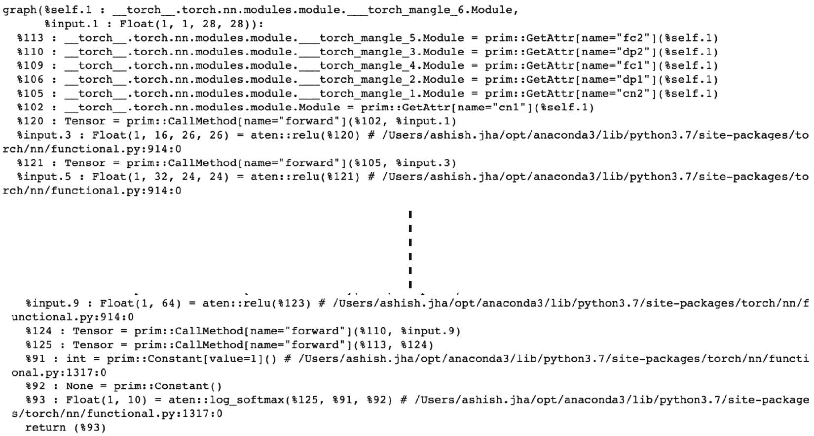

图 13 .16 – 跟踪模型图

直观地，图中的前几行展示了该模型层的初始化，如`cn1`、`cn2`等。到了最后，我们看到了最后一层，也就是 softmax 层。显然，该图是用静态类型变量编写的低级语言，与 TorchScript 语言非常相似。

1.  除了图形之外，我们还可以通过运行以下内容查看跟踪模型背后的确切 TorchScript 代码：

```py
print(traced_model.code)
```

这将输出以下类似 Python 代码的行，定义了模型的前向传递方法：

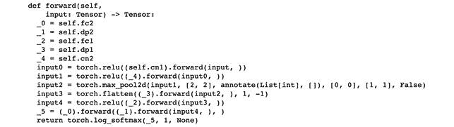

图 13.17 – 跟踪模型代码

这恰好是我们在*步骤 2*中使用 PyTorch 编写的代码的 TorchScript 等效代码。

1.  接下来，我们将导出或保存跟踪模型：

```py
torch.jit.save(traced_model, 'traced_convnet.pt')
```

1.  现在我们加载保存的模型：

```py
loaded_traced_model = torch.jit.load('traced_convnet.pt')
```

注意，我们无需分别加载模型的架构和参数。

1.  最后，我们可以使用此模型进行推断：

```py
loaded_traced_model(input_tensor.unsqueeze(0))
```

输出如下：

这应该输出以下内容：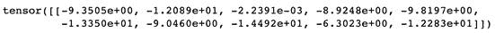

图 13.18 – 跟踪模型推断

1.  我们可以通过在原始模型上重新运行模型推断来检查这些结果：

```py
model(input_tensor.unsqueeze(0))
```

这应该产生与*图 13* *.18*相同的输出，从而验证我们的跟踪模型正常工作。

您可以使用跟踪模型而不是原始 PyTorch 模型对象来构建更高效的 Flask 模型服务器和 Docker 化的模型微服务，这要归功于 TorchScript 无 GIL 的特性。尽管跟踪是 JIT 编译 PyTorch 模型的可行选项，但它也有一些缺点。

例如，如果模型的前向传播包含诸如`if`和`for`语句等控制流，则跟踪只会呈现流程中的一条可能路径。为了准确地将 PyTorch 代码转换为 TorchScript 代码，以处理这种情况，我们将使用另一种称为脚本化的编译机制。

### 使用 TorchScript 进行模型脚本化

请按照*上一练习*中的 1 到 6 步骤，然后按照此练习中给出的步骤进行操作。完整代码可在我们的 github 仓库[13.20]中找到：

1.  对于脚本化，我们无需为模型提供任何虚拟输入，并且以下代码行将 PyTorch 代码直接转换为 TorchScript 代码：

```py
scripted_model = torch.jit.script(model)
```

1.  让我们通过运行以下代码来查看脚本化模型图：

```py
print(scripted_model.graph)
```

这应该以与跟踪模型代码图类似的方式输出脚本化模型图，如下图所示：

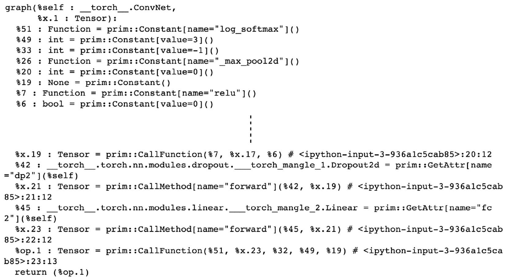

图 13.20 – 脚本模型代码

再次可以看到类似的冗长低级脚本，按行列出图的各种边缘。请注意，此处的图表与*图 13* *.16*中的不同，这表明在使用跟踪而不是脚本化的代码编译策略时存在差异。

1.  我们还可以通过运行此命令查看等效的 TorchScript 代码：

```py
print(scripted_model.code)
```

这应该输出以下内容：

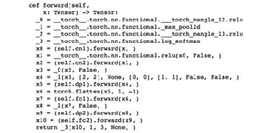

图 13.20 – 脚本模型代码

本质上，流程与*图 13* *.17*中的流程类似；但是，由于编译策略的不同，代码签名中存在细微差异。

1.  再次，可以按以下方式导出脚本化模型并重新加载：

```py
torch.jit.save(scripted_model, 'scripted_convnet.pt')
loaded_scripted_model = torch.jit.load('scripted_convnet.pt')
```

1.  最后，我们使用此脚本化模型进行推断：

```py
loaded_scripted_model(input_tensor.unsqueeze(0))
```

这应该产生与*图 13* *.18*完全相同的结果，从而验证脚本化模型按预期工作。

与追踪类似，脚本化的 PyTorch 模型是 GIL-free 的，因此在与 Flask 或 Docker 一起使用时，可以提高模型服务的性能。*表 13* *.1* 快速比较了模型追踪和脚本化的方法：

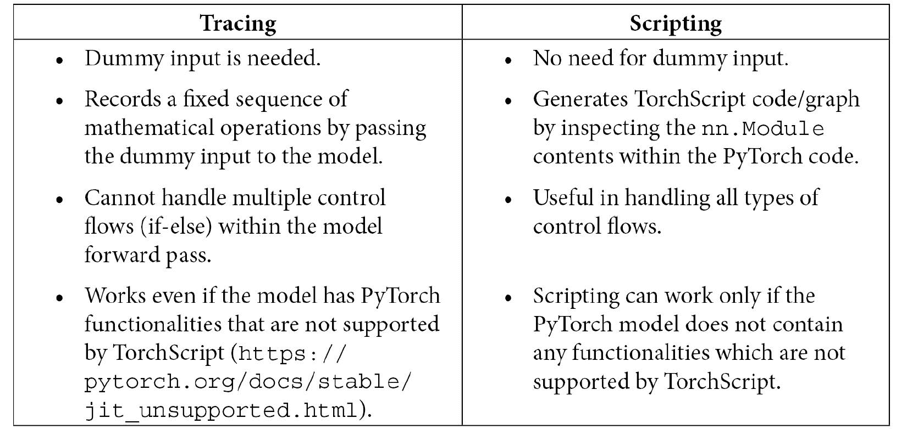

表 13 .1 – 追踪与脚本化的比较

到目前为止，我们已经演示了如何将 PyTorch 模型转换并序列化为 TorchScript 模型。在接下来的部分中，我们将完全摆脱 Python，并演示如何使用 C++ 加载 TorchScript 序列化模型。

### 在 C++ 中运行 PyTorch 模型

Python 有时可能有限，或者我们可能无法运行使用 PyTorch 和 Python 训练的机器学习模型。在本节中，我们将使用在前一节中导出的序列化 TorchScript 模型对象（使用追踪和脚本化）来在 C++ 代码中运行模型推理。

> **注意**
> 
> > 假设你具备基本的 C++ 工作知识 [13.21] 。本节专门讨论了关于 C++ 代码编译的内容 [13.22]

为了完成这个练习，我们需要按照 [13.23] 中提到的步骤安装 CMake 以便能够构建 C++ 代码。之后，我们将在当前工作目录下创建一个名为 `cpp_convnet` 的文件夹，并从该目录中工作：

1.  让我们直接开始编写运行模型推理流水线的 C++ 文件。完整的 C++ 代码可以在我们的 github 仓库 [13.24] 中找到：

```py
#include <torch/script.h>
...
int main(int argc, char **argv) {
    Mat img = imread(argv[2], IMREAD_GRAYSCALE);
```

首先，使用 OpenCV 库将 .`jpg` 图像文件读取为灰度图像。你需要根据你的操作系统要求安装 OpenCV 库 - Mac [13.25]，Linux [13.26] 或 Windows [13.27]。

1.  灰度图像随后被调整大小为 `28x28` 像素，因为这是我们 CNN 模型的要求：

```py
resize(img, img, Size(28, 28));
```

1.  然后，将图像数组转换为 PyTorch 张量：

```py
auto input_ = torch::from_blob(img.data, { img.rows, img.cols, img.channels() }, at::kByte);
```

对于所有与 `torch` 相关的操作，如本步骤中所示，我们使用 `libtorch` 库，这是所有 `torch` C++ 相关 API 的家园。如果你已经安装了 PyTorch，就不需要单独安装 LibTorch。

1.  因为 OpenCV 读取的灰度图像维度是 (28, 28, 1)，我们需要将其转换为 (1, 28, 28) 以符合 PyTorch 的要求。然后，张量被重塑为形状为 (1,1,28,28)，其中第一个 `1` 是推断的 `batch_size`，第二个 `1` 是通道数，对于灰度图像为 `1`：

```py
    auto input = input_.permute({2,0,1}).unsqueeze_(0).reshape({1, 1, img.rows, img.cols}).toType(c10::kFloat).div(255);
    input = (input – 0.1302) / 0.3069;
```

因为 OpenCV 读取的图像像素值范围是从 `0` 到 `255`，我们将这些值归一化到 `0` 到 `1` 的范围。然后，我们使用平均值 `0.1302` 和标准差 `0.3069` 对图像进行标准化，就像我们在前面的章节中做的那样（参见*构建推理流水线的第二步*）。

1.  在这一步中，我们加载了在前一个练习中导出的 JIT-ed TorchScript 模型对象：

```py
    auto module = torch::jit::load(argv[1]);
    std::vector<torch::jit::IValue> inputs;
    inputs.push_back(input);
```

1.  最后，我们来到模型预测阶段，在这里我们使用加载的模型对象对提供的输入数据进行前向传播（在本例中是一幅图像）：

```py
auto output_ = module.forward(inputs).toTensor();
```

`output_` 变量包含每个类别的概率列表。让我们提取具有最高概率的类别标签并打印出来：

```py
auto output = output_.argmax(1);
cout << output << '\n';
```

最后，我们成功退出 C++ 程序：

```py
    return 0;
}
```

1.  虽然 *步骤 1-6* 关注于我们 C++ 的各个部分，但我们还需要在相同的工作目录下编写一个 `CMakeLists.txt` 文件。此文件的完整代码可在我们的 github 仓库 [13.28] 中找到：

```py
cmake_minimum_required(VERSION 3.0 FATAL_ERROR)
project(cpp_convnet)
find_package(Torch REQUIRED)
find_package(OpenCV REQUIRED)
add_executable(cpp_convnet cpp_convnet.cpp)
...
```

此文件基本上是类似于 Python 项目中的 `setup.py` 的库安装和构建脚本。除此代码外，还需要将 `OpenCV_DIR` 环境变量设置为 OpenCV 构建产物的路径，如下面的代码块所示：

```py
export OpenCV_DIR=/Users/ashish.jha/code/personal/MasteringPyTorchV2     /     Chapter13     /cpp_convnet/build_opencv/
```

1.  接下来，我们需要实际运行 `CMakeLists` 文件以创建构建产物。我们通过在当前工作目录中创建一个新目录并从那里运行构建过程来完成这一步。在命令行中，我们只需运行以下命令：

```py
mkdir build
cd build
cmake -DCMAKE_PREFIX_PATH=/Users/ashish.jha/opt/anaconda3/envs/mastering_pytorch/lib/python3.9/site-packages/torch     /share/cmake/ ..
cmake --build . --config Release
```

在第三行中，您应提供 LibTorch 的路径。要找到您自己的路径，请打开 Python 并执行以下操作：

```py
import torch; torch.__path__
```

对于我来说，输出如下所示：

```py
['/Users/ashish.jha/opt/anaconda3/envs/mastering_pytorch/lib/python3.9/site-packages/torch     ']_
```

执行第三行将输出以下内容：

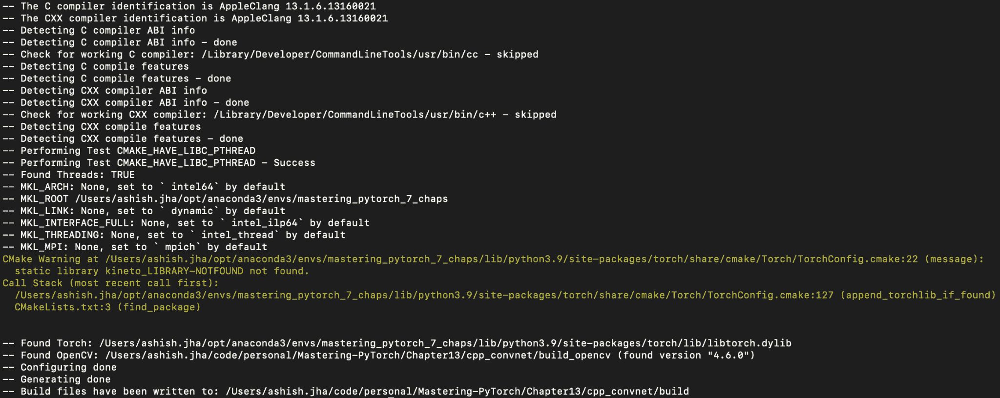

图 13 .21 – C++ CMake 输出的结果

第四行应输出如下内容：

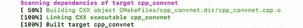

图 13 .22 – C++ 模型构建

1.  在成功执行上一步骤后，我们将生成一个名为 `cpp_convnet` 的 C++ 编译二进制文件。现在是执行这个二进制程序的时候了。换句话说，我们现在可以向我们的 C++ 模型提供一个样本图像进行推断。我们可以使用脚本化的模型作为输入：

```py
./cpp_convnet ../../scripted_convnet.pt ../../digit_image.jpg
```

或者，我们可以使用跟踪的模型作为输入：

```py
./cpp_convnet ../../traced_convnet.pt ../../digit_image.jpg
```

任何一种方法都应该产生以下输出：


图 13 .23 – C++ 模型预测

根据 *图 13* *.3*，C++ 模型似乎工作正常。由于我们在 C++ 中使用了不同的图像处理库（即 OpenCV），与 Python（PIL）相比，像素值稍有不同编码，这将导致略有不同的预测概率，但如果应用正确的归一化，两种语言的最终模型预测应该没有显著差异。

这结束了我们关于使用 C++ 进行 PyTorch 模型推断的探索。这个练习将帮助您开始将使用 PyTorch 编写和训练的喜爱深度学习模型转移到 C++ 环境中，这样做不仅可以使预测更高效，还可以在无 Python 环境（例如某些嵌入式系统、无人机等）中托管模型成为可能。

在接下来的部分，我们将远离 TorchScript，并讨论一个通用的神经网络建模格式 – ONNX，它使得模型可以跨深度学习框架、编程语言和操作系统进行使用。我们将在 TensorFlow 中加载一个 PyTorch 训练的模型进行推断。

### 使用 ONNX 导出 PyTorch 模型

在生产系统的某些场景中，大多数已部署的机器学习模型都是使用某种特定的深度学习库编写的，比如 TensorFlow，并配备了自己复杂的模型服务基础设施。但是，如果某个模型是使用 PyTorch 编写的，我们希望它能够在 TensorFlow 中运行，以符合服务策略。这是 ONNX 等框架在各种其他用例中有用的一个例子。

ONNX 是一个通用格式，用于标准化深度学习模型的基本操作，例如矩阵乘法和激活函数，在不同的深度学习库中编写时会有所不同。它使我们能够在不同的深度学习库、编程语言甚至操作环境中互换地运行相同的深度学习模型。

在这里，我们将演示如何在 TensorFlow 中运行使用 PyTorch 训练的模型。我们首先将 PyTorch 模型导出为 ONNX 格式，然后在 TensorFlow 代码中加载 ONNX 模型。

ONNX 与受限版本的 TensorFlow 兼容，因此我们将使用`tensorflow==1.15.0`。由于这个原因，我们将使用 Python 3.7，因为`tensorflow==1.15.0`在更新的 Python 版本中不可用。您可以使用以下命令创建并激活一个新的带有 Python 3.7 的 conda 环境：

```py
conda create -n <env_name> python=3.7
source activate <env_name> 
```

我们还需要为本练习安装`onnx==1.7.0`和`onnx-tf==1.5.0`库。本练习的完整代码可在我们的 github 仓库[13.29]中找到。请按照*TorchScript 模型跟踪*部分的第 1 到 11 步，然后执行本练习中的步骤：

1.  类似于模型跟踪，我们再次通过加载的模型传递一个虚拟输入：

```py
demo_input = torch.ones(1, 1, 28, 28)
torch.onnx.export(model, demo_input, "convnet.onnx")
```

这将保存一个模型`onnx`文件。在底层，序列化模型所使用的机制与模型跟踪中使用的相同。

1.  接下来，我们加载保存的`onnx`模型并将其转换为 TensorFlow 模型：

```py
import onnx
from onnx_tf.backend import prepare
model_onnx = onnx.load("./convnet.onnx")
tf_rep = prepare(model_onnx)
tf_rep.export_graph("./convnet.pb")
```

1.  接下来，我们加载序列化的`tensorflow`模型以解析模型图。这将帮助我们验证已正确加载模型架构并标识图的输入和输出节点：

```py
with tf.gfile.GFile("./convnet.pb", "rb") as f:
    graph_definition = tf.GraphDef()
    graph_definition.ParseFromString(f.read())
with tf.Graph().as_default() as model_graph:
    tf.import_graph_def(graph_definition, name="")
for op in model_graph.get_operations():
    print(op.values())
```

这应输出以下内容：

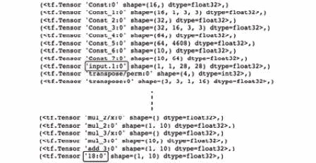

图 13 .24 – TensorFlow 模型图

从图中，我们能够识别标记的输入和输出节点。

1.  最后，我们可以为神经网络模型的输入和输出节点分配变量，实例化 TensorFlow 会话，并运行图以生成样本图像的预测：

```py
model_output = model_graph.get_tensor_by_name('18:0')
model_input = model_graph.get_tensor_by_name('input.1:0')
sess = tf.Session(graph=model_graph)
output = sess.run(model_output, feed_dict={model_input: input_tensor.unsqueeze(0)})
print(output)
```

这应输出以下内容：

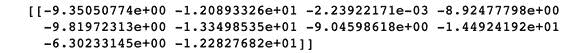

图 13 .25 – TensorFlow 模型预测

如您所见，在与 *Figure 13* *.18* 进行比较后，我们模型的 TensorFlow 和 PyTorch 版本的预测完全相同。这验证了 ONNX 框架成功运行的有效性。我鼓励您进一步分析 TensorFlow 模型，了解 ONNX 如何通过利用模型图中的基础数学操作，在不同的深度学习库中重现完全相同的模型。

我们已经讨论了导出 PyTorch 模型的不同方式。本节介绍的技术将在将 PyTorch 模型部署到生产系统以及在各种平台上使用时非常有用。随着深度学习库、编程语言甚至操作系统的新版本不断推出，这一领域将迅速发展。

因此，强烈建议密切关注发展动态，并确保使用最新和最高效的模型导出和操作化方法。

到目前为止，我们一直在本地机器上为服务和导出 PyTorch 模型进行工作。在本章的下一个也是最后一个部分中，我们将简要介绍如何在一些知名的云平台上为 PyTorch 模型提供服务，例如 AWS、Google Cloud 和 Microsoft Azure。

## 在云中提供 PyTorch 模型

深度学习计算成本高，因此需要强大和复杂的计算硬件。并非每个人都能访问到本地机器，其具备足够的 CPU 和 GPU 来在合理时间内训练庞大的深度学习模型。此外，对于为推断服务提供训练好的模型的本地机器，我们无法保证其百分之百的可用性。出于这些原因，云计算平台是训练和服务深度学习模型的重要选择。

在本节中，我们将讨论如何在一些最流行的云平台上使用 PyTorch — **AWS**、**Google Cloud** 和 **Microsoft Azure**。我们将探讨在每个平台上为训练好的 PyTorch 模型提供服务的不同方式。我们在本章早期部分讨论的模型服务练习是在本地机器上执行的。本节的目标是让您能够使用云上的 **虚拟机** (**VMs**) 执行类似的练习。

### 使用 PyTorch 和 AWS

AWS 是最古老和最流行的云计算平台之一。它与 PyTorch 有深度集成。我们已经在 TorchServe 中看到了一个例子，它是由 AWS 和 Facebook 共同开发的。

在本节中，我们将介绍一些使用 AWS 为服务 PyTorch 模型的常见方法。首先，我们将简单了解如何使用 AWS 实例来替代我们的本地机器（笔记本电脑）来服务 PyTorch 模型。然后，我们将简要讨论 Amazon SageMaker，这是一个专门的云机器学习平台。我们将简要讨论如何将 TorchServe 与 SageMaker 结合使用进行模型服务。

> **注意**
> 
> > 本节假设您对 AWS 有基本的了解。因此，我们不会详细讨论诸如 AWS EC2 实例是什么、AMI 是什么、如何创建实例等主题[13.30]。相反，我们将专注于与 PyTorch 相关的 AWS 组件的组成部分。

## 使用 AWS 实例为 PyTorch 模型提供服务

在本节中，我们将演示如何在 VM 中使用 PyTorch —— 在这种情况下是 AWS 实例。阅读本节后，您将能够在 AWS 实例中执行 *PyTorch 模型服务* 部分讨论的练习。

首先，如果您还没有 AWS 账户，您需要创建一个。创建账户需要一个电子邮件地址和支付方式（信用卡）[13.31]。

一旦您拥有 AWS 账户，您可以登录 AWS 控制台[13.32] 。从这里，我们基本上需要实例化一个虚拟机（AWS 实例），在这里我们可以开始使用 PyTorch 进行模型训练和服务。创建虚拟机需要做出两个决定[13.33]：

+   选择虚拟机的硬件配置，也称为**AWS 实例类型**

+   选择**Amazon Machine Image**（**AMI**），它包含了所需的所有软件，如操作系统（Ubuntu 或 Windows）、Python、PyTorch 等

. 通常情况下，当我们提到 AWS 实例时，我们指的是**弹性云计算**实例，也称为**EC2**实例。

根据虚拟机的计算需求（RAM、CPU 和 GPU），您可以从 AWS 提供的 EC2 实例长列表中进行选择[13.34] 。由于 PyTorch 需要大量 GPU 计算能力，建议选择包含 GPU 的 EC2 实例，尽管它们通常比仅有 CPU 的实例更昂贵。

关于 AMI，选择 AMI 有两种可能的方法。您可以选择仅安装操作系统（如 Ubuntu（Linux））的基本 AMI。在这种情况下，您可以手动安装 Python[13.35] ，随后安装 PyTorch[13.36] 。

另一种更推荐的方法是从已安装了 PyTorch 的预构建 AMI 开始。AWS 提供了深度学习 AMI，这大大加快了在 AWS 上开始使用 PyTorch 的过程[13.37] 。

一旦您成功启动了一个实例，可以使用各种可用的方法简单地连接到该实例[13.38] 。

SSH 是连接实例的最常见方式之一。一旦您进入实例，它将与在本地机器上工作的布局相同。然后，其中一个首要逻辑步骤将是测试 PyTorch 是否在该机器内正常工作。

要进行测试，首先在命令行上输入 `python` 来打开 Python 交互会话。然后执行以下代码：

```py
import torch
```

如果执行时没有错误，这意味着您已经在系统上安装了 PyTorch。

此时，您可以简单地获取本章前几节中编写的所有代码。在您的主目录命令行中，通过运行以下命令简单地克隆本书的 GitHub 仓库：

```py
git clone https://github.com/arj7192/MasteringPyTorchV2.git 
```

然后，在`Chapter13`子文件夹内，您将拥有在前几节中处理的 MNIST 模型的所有代码。您可以基本上重新运行这些练习，这次在 AWS 实例上而不是您的本地计算机上。

让我们回顾一下在 AWS 上使用 PyTorch 需要采取的步骤：

1.  创建一个 AWS 账号。

1.  登录到 AWS 控制台。

1.  在控制台上，单击**启动虚拟机**按钮。

1.  选择一个 AMI。例如，选择 Deep Learning AMI（Ubuntu）。

1.  选择一个 AWS 实例类型。例如，选择**p.2x large**，因为它包含 GPU。

1.  单击**启动**。

1.  单击**创建新的密钥对**。为密钥对命名并在本地下载。

1.  通过在命令行上运行以下命令修改此密钥对文件的权限：

```py
chmod 400 downloaded-key-pair-file.pem
```

1.  在控制台上，单击**查看实例**以查看启动实例的详细信息，并特别注意实例的公共 IP 地址。

1.  使用 SSH，在命令行上运行以下命令连接到实例：

```py
ssh -i downloaded-key-pair-file.pem ubuntu@<Public IP address>
```

公共 IP 地址与上一步获取的相同。

1.  连接后，在`python` shell 中启动并运行`import torch`，确保 PyTorch 正确安装在实例上。

1.  在实例的命令行上运行以下命令，克隆本书的 GitHub 仓库：

```py
git clone https://github.com/arj7192/MasteringPyTorchV2.git 
```

1.  转到仓库中的`chapter13`文件夹，并开始处理本章前几节中涉及的各种模型服务练习。

这将带我们来到本节的结束，我们基本上学会了如何在远程 AWS 实例上开始使用 PyTorch [13.39]。接下来，我们将了解 AWS 的完全专用云机器学习平台 – Amazon SageMaker。

## 使用 TorchServe 与 Amazon SageMaker

我们已经在前面的章节详细讨论了 TorchServe。正如我们所知，TorchServe 是由 AWS 和 Facebook 开发的 PyTorch 模型服务库。您可以使用 TorchServe 而不是手动定义模型推理流水线、模型服务 API 和微服务，TorchServe 提供所有这些功能。

另一方面，Amazon SageMaker 是一个云机器学习平台，提供诸如训练大规模深度学习模型以及在自定义实例上部署和托管训练模型等功能。在使用 SageMaker 时，我们只需执行以下操作：

+   指定我们想要启动以服务模型的 AWS 实例类型和数量。

+   提供存储的预训练模型对象的位置。

我们不需要手动连接到实例并使用 TorchServe 提供模型服务。SageMaker 会处理所有事务。AWS 网站有一些有用的博客文章，可以帮助您开始使用 SageMaker 和 TorchServe 在工业规模上使用 PyTorch 模型，并在几次点击内完成 [13.40] 。AWS 博客还提供了在使用 PyTorch 时使用 Amazon SageMaker 的用例 [13.41] 。

诸如 SageMaker 等工具在模型训练和服务期间非常有用。然而，在使用这类一键式工具时，我们通常会失去一些灵活性和可调试性。因此，您需要决定哪一套工具最适合您的用例。这结束了我们关于使用 AWS 作为 PyTorch 的云平台的讨论。接下来，我们将看看另一个云平台 - Google Cloud。

### 在 Google Cloud 上提供 PyTorch 模型

与 AWS 类似，如果您还没有 Google 账户（*@gmail.com），则首先需要创建一个。此外，要能够登录 Google Cloud 控制台 [13.42] ，您需要添加一个付款方式（信用卡详细信息）。

> **注意**
> 
> > 我们这里不会涵盖 Google Cloud 的基础知识 [13.43] 。相反，我们将专注于在 VM 中用于提供 PyTorch 模型的 Google Cloud 使用方法。

一旦进入控制台，我们需要按照类似 AWS 的步骤启动一个 VM，在其中可以提供我们的 PyTorch 模型。您始终可以从基础的 VM 开始，并手动安装 PyTorch。但是，我们将使用预先安装了 PyTorch 的 Google Deep Learning VM 镜像 [13.44] 。以下是启动 Google Cloud VM 并用其提供 PyTorch 模型的步骤：

1.  在 Google Cloud Marketplace 上启动深度学习 VM 镜像 [13.45] 。

1.  在命令窗口中输入部署名称。该名称后缀为 `-vm` 作为已启动 VM 的名称。该 VM 内的命令提示符如下：

```py
<user>@<deployment-name>-vm:~/
```

在这里，`user` 是连接到 VM 的客户端，`deployment-name` 是在此步骤中选择的 VM 的名称。

1.  在下一个命令窗口中选择 `PyTorch` 作为 `Framework` 。这告诉平台在 VM 中预安装 PyTorch。

1.  为此机器选择区域。最好选择地理位置最接近您的区域。此外，不同的区域有略微不同的硬件配置（VM 配置），因此您可能需要为特定的机器配置选择特定的区域。

1.  在 *步骤 3* 中指定了软件要求后，现在我们将指定硬件要求。在命令窗口的 GPU 部分，我们需要指定 GPU 类型，并随后指定要包含在 VM 中的 GPU 数量。

Google Cloud 提供各种 GPU 设备/配置 [13.46] 。在 GPU 部分，还要勾选自动安装 NVIDIA 驱动程序的复选框，这是利用深度学习 GPU 所必需的。

1.  同样，在 CPU 部分下，我们需要提供机器类型[13.47]。关于*步骤 5*和*步骤 6*，请注意，不同区域提供不同的机器和 GPU 类型，以及不同的 GPU 类型和 GPU 数量的组合。

1.  最后，点击**Deploy**按钮。这将启动虚拟机，并带您到一个页面，该页面包含连接本地计算机到虚拟机所需的所有指令。

1.  在此时，您可以连接到虚拟机，并通过尝试在 Python shell 中导入 PyTorch 来确保 PyTorch 已正确安装。验证后，克隆本书的 GitHub 存储库。转到`Chapter13`文件夹，并开始在该虚拟机中进行模型服务练习。

您可以阅读有关在 Google Cloud 博客上创建 PyTorch 深度学习虚拟机的更多信息[13.48]。这结束了我们关于使用 Google Cloud 作为与 PyTorch 模型服务相关的云平台的讨论。正如您可能注意到的那样，该过程与 AWS 非常相似。在接下来的最后一节中，我们将简要介绍使用 Microsoft 的云平台 Azure 来使用 PyTorch。

### 在 Azure 上提供 PyTorch 模型

再次强调，与 AWS 和 Google Cloud 类似，Azure 需要一个 Microsoft 认可的电子邮件 ID 来注册，以及一个有效的支付方式。

> **注意**
> 
> > 我们假设您对 Microsoft Azure 云平台有基本的了解[13.49]。

一旦您访问到 Azure 门户[13.50]，有两种推荐的方法可以开始使用 PyTorch 在 Azure 上进行工作：

+   **数据科学虚拟机**（**DSVM**）

+   **Azure 机器学习**

现在我们将简要讨论这些方法。

## 在 Azure 的数据科学虚拟机上工作

与 Google Cloud 的深度学习虚拟机映像类似，Azure 提供了其自己的 DSVM 映像[13.51]，这是一个专门用于数据科学和机器学习（包括深度学习）的完全专用虚拟机映像。

这些映像适用于 Windows[13.52]以及 Linux/Ubuntu[13.53]。

使用此映像创建 DSVM 实例的步骤与讨论的 Google Cloud 的步骤非常相似，适用于 Windows[13.54]和 Linux/Ubuntu[13.55]。

创建 DSVM 后，您可以启动 Python shell 并尝试导入 PyTorch 库，以确保其已正确安装。您还可以进一步测试 Linux[13.56]和 Windows[13.57]上此 DSVM 可用的功能。

最后，您可以在 DSVM 实例内克隆本书的 GitHub 存储库，并使用`Chapter13`文件夹中的代码来进行本章讨论的 PyTorch 模型服务练习。

## 讨论 Azure 机器学习服务

与 Amazon SageMaker 相似且早于其，Azure 提供了一个端到端的云机器学习平台。Azure 机器学习服务（AMLS）包括以下内容（仅举几例）：

+   Azure 机器学习虚拟机

+   笔记本

+   虚拟环境

+   数据存储

+   跟踪机器学习实验

+   数据标记

AMLS VMs 和 DSVMs 之间的一个关键区别在于前者是完全托管的。例如，它们可以根据模型训练或服务的需求进行横向扩展或缩减 [13.58]。

就像 SageMaker 一样，Azure 机器学习既适用于训练大规模模型，也适用于部署和提供这些模型的服务。Azure 网站提供了一个很好的教程，用于在 AMLS 上训练 PyTorch 模型，以及在 Windows [13.59] 和 Linux [13.60] 上部署 PyTorch 模型。

Azure 机器学习旨在为用户提供一键式界面，用于所有机器学习任务。因此，重要的是要考虑灵活性的权衡。虽然我们在这里没有涵盖 Azure 机器学习的所有细节，但 Azure 的网站是进一步阅读的好资源 [13.61]。

这就是我们对 Azure 作为云平台为处理 PyTorch 提供的一切的讨论的结束 [13.62]。

这也结束了我们关于在云端使用 PyTorch 为模型提供服务的讨论。在本节中，我们讨论了 AWS、Google Cloud 和 Microsoft Azure。虽然还有更多的云平台可供选择，但它们的提供方式以及在这些平台上使用 PyTorch 的方式与我们讨论的类似。这一节将帮助您开始在云端的 VM 上处理您的 PyTorch 项目。

## 总结

在本章中，我们探讨了在生产系统中部署训练好的 PyTorch 深度学习模型的世界。

在下一章中，我们将探讨与在 PyTorch 中使用模型相关的另一个实用方面，这在训练和验证深度学习模型时能极大地节省时间和资源。
