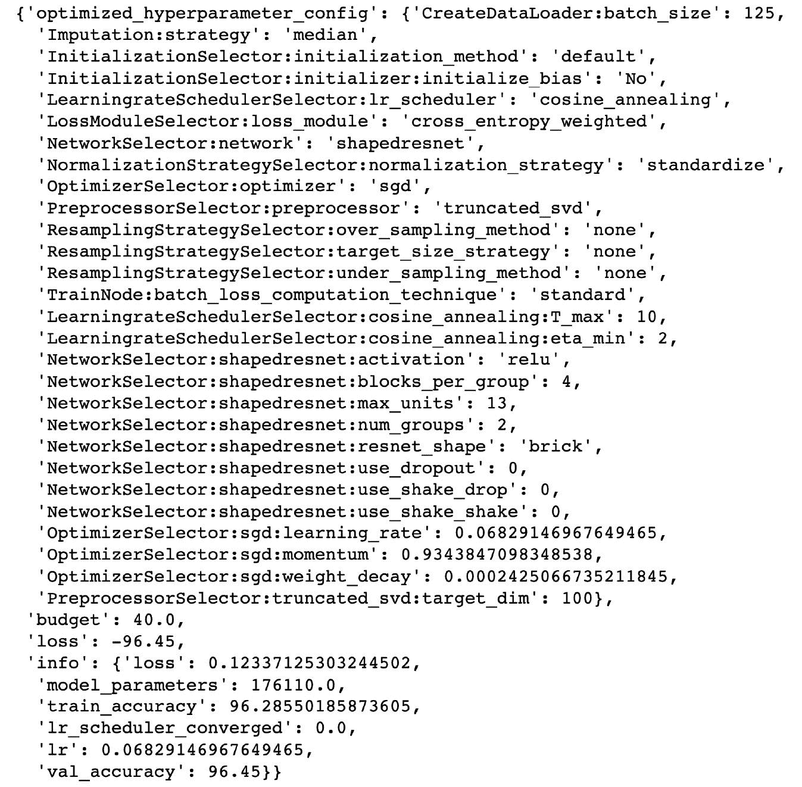
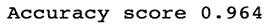
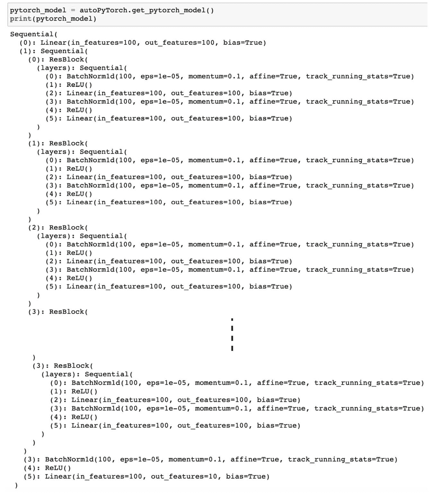
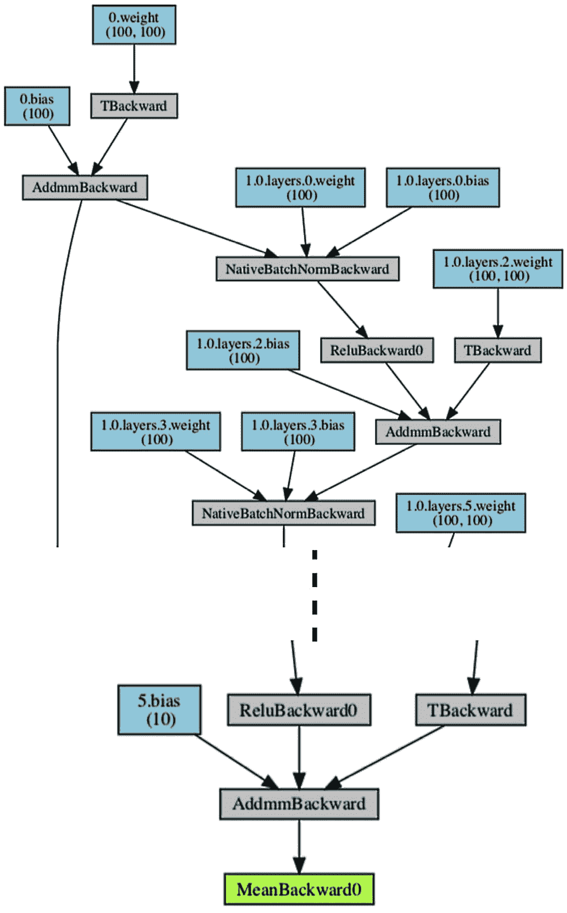
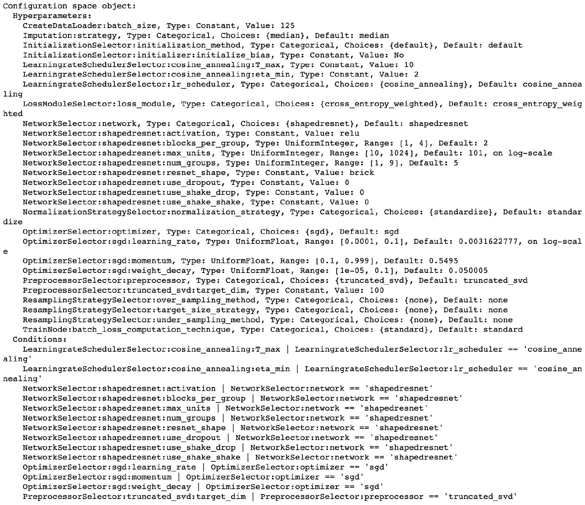
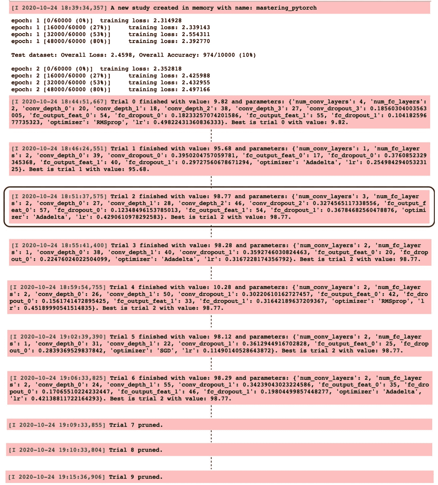
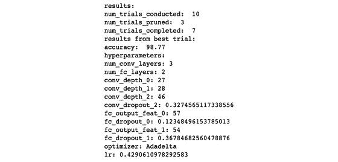

# 第十六章：PyTorch 和 AutoML

## 加入我们的书籍社区，在 Discord 上交流讨论。

[`packt.link/EarlyAccessCommunity`](https://packt.link/EarlyAccessCommunity)


**自动化机器学习**（**AutoML**）为给定神经网络提供了寻找最佳神经架构和最佳超参数设置的方法。在讨论*第五章*，*混合高级模型*中详细介绍了神经架构搜索，例如`RandWireNN`模型。

在本章中，我们将更广泛地探讨用于 PyTorch 的 AutoML 工具——**Auto-PyTorch**——它既执行神经架构搜索又执行超参数搜索。我们还将研究另一个名为**Optuna**的 AutoML 工具，它专门为 PyTorch 模型执行超参数搜索。

在本章末尾，非专家将能够设计具有少量领域经验的机器学习模型，而专家将大大加快其模型选择过程。

本章分解为以下主题：

+   使用 AutoML 寻找最佳神经架构

+   使用 Optuna 进行超参数搜索

## 使用 AutoML 寻找最佳神经架构

想象一下机器学习算法的一种方式是它们自动化了学习给定输入和输出之间关系的过程。在传统软件工程中，我们必须明确地编写/编码这些关系，以函数形式接受输入并返回输出。在机器学习世界中，机器学习模型为我们找到这样的函数。尽管我们在一定程度上实现了自动化，但还有很多工作要做。除了挖掘和清理数据外，还有一些例行任务需要完成以获得这些函数：

+   选择机器学习模型（或者模型家族，然后再选择模型）

+   决定模型架构（特别是在深度学习情况下）

+   选择超参数

+   根据验证集性能调整超参数

+   尝试不同的模型（或者模型家族）

这些是需要人类机器学习专家的任务类型。大多数步骤都是手动的，要么耗时很长，要么需要大量专业知识以缩短所需时间，而我们缺少足够数量的机器学习专家来创建和部署越来越受欢迎、有价值且有用的机器学习模型，这在工业界和学术界都如此。

这就是 AutoML 发挥作用的地方。AutoML 已成为机器学习领域内的一个学科，旨在自动化前述步骤及更多内容。

在本节中，我们将看看 Auto-PyTorch——一个专为与 PyTorch 配合使用而创建的 AutoML 工具。通过一项练习，我们将找到一个最优的神经网络以及执行手写数字分类的超参数——这是我们在*第一章*，*使用 PyTorch 进行深度学习概述*中进行的任务。

与第一章的不同之处在于，这一次我们不决定架构或超参数，而是让 Auto-PyTorch 为我们找出最佳方案。我们将首先加载数据集，然后定义一个 Auto-PyTorch 模型搜索实例，最后运行模型搜索例程，以提供最佳性能模型。

> **工具引用**
> 
> > Auto-PyTorch [16.1] *Auto-PyTorch Tabular: 多精度元学习以实现高效和稳健的 AutoDL*，*Lucas Zimmer*，*Marius Lindauer* 和 *Frank Hutter [16.2]*

### 使用 Auto-PyTorch 进行最佳 MNIST 模型搜索

我们将以 Jupyter Notebook 的形式执行模型搜索。在文本中，我们只展示代码的重要部分。完整的代码可以在我们的 github 代码库中找到 [16.3]

### 加载 MNIST 数据集

现在我们将逐步讨论加载数据集的代码，如下所示：

1.  首先，我们导入相关的库，如下所示：

```py
import torch
from autoPyTorch import AutoNetClassification
```

最后一行非常关键，因为我们在这里导入相关的 Auto-PyTorch 模块。这将帮助我们设置和执行模型搜索会话。

1.  接下来，我们使用 Torch 的**应用程序编程接口** (**APIs**)加载训练和测试数据集，如下所示：

```py
train_ds = datasets.MNIST(...)
test_ds = datasets.MNIST(...)
```

1.  然后，我们将这些数据集张量转换为训练和测试的输入（`X`）和输出（`y`）数组，如下所示：

```py
X_train, X_test, y_train, y_test = train_ds.data.numpy().reshape(-1, 28*28), test_ds.data.numpy().reshape(-1, 28*28) ,train_ds.targets.numpy(), test_ds.targets.numpy()
```

注意，我们正在将图像重塑为大小为 784 的扁平化向量。在下一节中，我们将定义一个期望扁平化特征向量作为输入的 Auto-PyTorch 模型搜索器，因此我们进行了重塑。

在撰写本文时，Auto-PyTorch 目前仅支持以特征化和图像数据的形式提供支持，分别为`AutoNetClassification`和`AutoNetImageClassification`。虽然在本练习中我们使用的是特征化数据，但我们留给读者的练习是改用图像数据[16.4] 。

### 运行使用 Auto-PyTorch 进行神经架构搜索

在上一节加载了数据集之后，我们现在将使用 Auto-PyTorch 定义一个模型搜索实例，并使用它来执行神经架构搜索和超参数搜索的任务。我们将按以下步骤进行：

1.  这是练习中最重要的一步，我们在此定义一个`autoPyTorch`模型搜索实例，如下所示：

```py
autoPyTorch = AutoNetClassification("tiny_cs",  # config preset
             log_level='info', max_runtime=2000, min_budget=100, max_budget=1500)
```

这里的配置是从 Auto-PyTorch 仓库提供的示例中衍生出来的 [16.5] 。但通常情况下，`tiny_cs`用于更快速的搜索，且硬件要求较少。

预算参数主要是为了设置对 Auto-PyTorch 过程资源消耗的限制。默认情况下，预算的单位是时间，即我们愿意在模型搜索上花费多少**中央处理单元**/**图形处理单元**（**CPU**/**GPU**）时间。

1.  实例化了一个 Auto-PyTorch 模型搜索实例后，我们通过尝试将实例适配到训练数据集上来执行搜索，如下所示：

```py
autoPyTorch.fit(X_train, y_train, validation_split=0.1)
```

内部，Auto-PyTorch 将基于原始论文中提到的方法运行多个`试验`，尝试不同的模型架构和超参数设置 [16.2] 。

不同的`试验`将与 10%的验证数据集进行基准测试，并将最佳性能的`试验`作为输出返回。前述代码片段中的命令应该会输出以下内容：



图 16 .1 – Auto-PyTorch 模型准确性

*图 16* *.1* 基本上展示了 Auto-PyTorch 为给定任务找到的最佳超参数设置，例如学习率为`0.068`，动量为`0.934`等。前面的截图还显示了所选最佳模型配置的训练集和验证集准确性。

1.  已经收敛到最佳训练模型后，我们现在可以使用该模型对测试集进行预测，如下所示：

```py
y_pred = autoPyTorch.predict(X_test)print("Accuracy score", np.mean(y_pred.reshape(-1) == y_test))
```

它应该输出类似于这样的内容：



图 16 .2 – Auto-PyTorch 模型准确性

正如我们所见，我们获得了一个测试集性能达到了 96.4%的模型。为了对比，随机选择将导致 10%的性能水平。我们在没有定义模型架构或超参数的情况下获得了这样的良好性能。在设置更高预算后，更广泛的搜索可能会导致更好的性能。

此外，性能将根据执行搜索的硬件（机器）而变化。具有更多计算能力和内存的硬件可以在相同的时间预算内运行更多搜索，因此可能导致更好的性能。

### 可视化最优 AutoML 模型

在本节中，我们将查看通过在前一节中运行模型搜索例程获得的最佳性能模型。我们将按以下步骤进行：

1.  在前面的章节中已经查看了超参数，现在让我们看一下 Auto-PyTorch 为我们设计的最佳模型架构，如下所示：

```py
pytorch_model = autoPyTorch.get_pytorch_model()
print(pytorch_model)
```

它应该输出类似于这样的内容：



图 16 .3 – Auto-PyTorch 模型架构

该模型由一些结构化的残差块组成，其中包含全连接层、批量归一化层和 ReLU 激活函数。最后，我们看到一个最终的全连接层，具有 10 个输出，每个输出对应于从 0 到 9 的一个数字。

1.  我们还可以使用`torchviz`来可视化实际的模型图，如下代码片段所示：

```py
x = torch.randn(1, pytorch_model[0].in_features)
y = pytorch_model(x)
arch = make_dot(y.mean(), params=dict(pytorch_model.named_parameters()))
arch.format="pdf"
arch.filename = "convnet_arch"
arch.render(view=False)
```

这应该会在当前工作目录中保存一个`convnet_arch.pdf`文件，在打开时应该看起来像这样：



图 16 .4 – Auto-PyTorch 模型图示

1.  要查看模型如何收敛到此解决方案，我们可以查看在模型查找过程中使用的搜索空间代码如下：

```py
autoPyTorch.get_hyperparameter_search_space()
```

这应该会输出以下内容：



图 16 .5 – Auto-PyTorch 模型搜索空间

它基本上列出了构建模型所需的各种要素，并为每个要素分配了一个范围。例如，学习率被分配了**0.0001**到**0.1**的范围，并且这个空间是以对数尺度进行采样——这不是线性采样而是对数采样。

在*图 16 .1*中，我们已经看到了 Auto-PyTorch 从这些范围中采样的确切超参数值作为给定任务的最优值。我们还可以手动更改这些超参数范围，甚至添加更多超参数，使用 Auto-PyTorch 模块下的`HyperparameterSearchSpaceUpdates`子模块 [16.6] 。

这就结束了我们对 Auto-PyTorch 的探索——一个用于 PyTorch 的自动机器学习工具。我们成功地使用 Auto-PyTorch 构建了一个 MNIST 数字分类模型，而无需指定模型架构或超参数。此练习将帮助您开始使用此类和其他自动机器学习工具以自动化方式构建 PyTorch 模型。这里列出了一些类似的其他工具 - Hyperopt [16.7]、Tune [16.8]、Hypersearch [16.9]、Skorcj [16.10]、BoTorch [16.11] 和 Optuna [16.12]。

虽然我们在本章中无法涵盖所有这些工具，在下一节中我们将讨论 Optuna，这是一个专注于查找最佳超参数集的工具，并且与 PyTorch 兼容良好。

## 使用 Optuna 进行超参数搜索

Optuna 是支持 PyTorch 的超参数搜索工具之一。您可以详细了解该工具使用的搜索策略，如*TPE*（树形结构帕尔森估计）和*CMA-ES*（协方差矩阵适应进化策略），在*Optuna*论文 [16.13] 中。除了先进的超参数搜索方法，该工具还提供了一个简洁的 API，我们将在下一节中探讨。

> **工具引用**
> 
> > *Optuna: 下一代超参数优化框架。*
> > 
> > *Takuya Akiba*, *Shotaro Sano*, *Toshihiko Yanase*, *Takeru Ohta* 和 *Masanori Koyama*（2019 年，KDD）。

在本节中，我们将再次构建和训练`MNIST`模型，这次使用 Optuna 来找出最佳的超参数设置。我们将逐步讨论代码的重要部分，以练习的形式进行。完整的代码可以在我们的 github [16.14]上找到。

## 定义模型架构和加载数据集

首先，我们将定义一个符合 Optuna 要求的模型对象。所谓 Optuna 兼容，是指在模型定义代码中添加 Optuna 提供的 API，以便对模型超参数进行参数化。为此，我们将按照以下步骤进行：

1.  首先，我们导入必要的库，如下所示：

```py
import torch
import optuna
```

`optuna`库将在整个练习中管理超参数搜索。

1.  接下来，我们定义模型架构。因为我们希望对一些超参数（如层数和每层单位数）保持灵活，所以需要在模型定义代码中包含一些逻辑。因此，首先，我们声明需要在 `1` 到 `4` 个卷积层和之后的 `1` 到 `2` 个全连接层，如下面的代码片段所示：

```py
class ConvNet(nn.Module):
    def __init__(self, trial):
        super(ConvNet, self).__init__()
        num_conv_layers =  trial.suggest_int("num_conv_layers", 1, 4)
        num_fc_layers = trial.suggest_int("num_fc_layers", 1, 2)
```

1.  然后，我们逐个添加卷积层。每个卷积层紧接着一个 `ReLU` 激活层，对于每个卷积层，我们声明该层的深度在 `16` 到 `64` 之间。

步幅和填充分别固定为 `3` 和 `True`，整个卷积块之后是一个 `MaxPool` 层，然后是一个 `Dropout` 层，dropout 概率范围在 `0.1` 到 `0.4` 之间（另一个超参数），如下面的代码片段所示：

```py
 self.layers = []
        input_depth = 1 # grayscale image
        for i in range(num_conv_layers):
            output_depth = trial.suggest_int(f"conv_depth_{i}", 16, 64)
            self.layers.append(nn.Conv2d(input_depth, output_depth, 3, 1))
            self.layers.append(nn.ReLU())
            input_depth = output_depth
        self.layers.append(nn.MaxPool2d(2))
        p = trial.suggest_float(f"conv_dropout_{i}", 0.1, 0.4)
        self.layers.append(nn.Dropout(p))
        self.layers.append(nn.Flatten())
```

1.  接下来，我们添加一个展平层，以便后续可以添加全连接层。我们必须定义一个 `_get_flatten_shape` 函数来推导展平层输出的形状。然后，我们逐步添加全连接层，其中单位数声明为介于 `16` 和 `64` 之间。每个全连接层后面跟着一个 `Dropout` 层，再次使用概率范围为 `0.1` 到 `0.4`。

最后，我们附加一个固定的全连接层，输出 `10` 个数字（每个类别/数字一个），然后是一个 `LogSoftmax` 层。定义了所有层之后，我们实例化我们的模型对象，如下所示：

```py
 input_feat = self._get_flatten_shape()
        for i in range(num_fc_layers):
            output_feat = trial.suggest_int(f"fc_output_feat_{i}", 16, 64)
            self.layers.append(nn.Linear(input_feat, output_feat))
            self.layers.append(nn.ReLU())
            p = trial.suggest_float(f"fc_dropout_{i}", 0.1, 0.4)
            self.layers.append(nn.Dropout(p))
            input_feat = output_feat
        self.layers.append(nn.Linear(input_feat, 10))
        self.layers.append(nn.LogSoftmax(dim=1))
        self.model = nn.Sequential(*self.layers)
    def _get_flatten_shape(self):
        conv_model = nn.Sequential(*self.layers)
        op_feat = conv_model(torch.rand(1, 1, 28, 28))
        n_size = op_feat.data.view(1, -1).size(1)
        return n_size
```

这个模型初始化函数是依赖于 `trial` 对象的条件设置，该对象由 Optuna 轻松处理，并决定我们模型的超参数设置。最后，`forward` 方法非常简单，可以在下面的代码片段中看到：

```py
 def forward(self, x):
        return self.model(x)
```

因此，我们已经定义了我们的模型对象，现在可以继续加载数据集。

1.  数据集加载的代码与 *第一章，使用 PyTorch 进行深度学习概述* 中相同，并在下面的代码片段中再次显示：

```py
train_dataloader = torch.utils.data.DataLoader(...)
test_dataloader = ...
```

在本节中，我们成功地定义了我们的参数化模型对象，并加载了数据集。现在，我们将定义模型训练和测试程序，以及优化调度。

### 定义模型训练程序和优化调度

模型训练本身涉及超参数，如优化器、学习率等。在本练习的这一部分中，我们将定义模型训练过程，同时利用 Optuna 的参数化能力。我们将按以下步骤进行：

1.  首先，我们定义训练例程。再次强调，这段代码与 *第一章，使用 PyTorch 进行深度学习概述* 中此模型的训练例程代码相同，并在此处再次显示：

```py
def train(model, device, train_dataloader, optim, epoch):
    for b_i, (X, y) in enumerate(train_dataloader):
        …
```

1.  模型测试例程需要稍作调整。为了按照 Optuna API 的要求操作，测试例程需要返回一个模型性能指标——在本例中是准确率，以便 Optuna 可以根据这一指标比较不同的超参数设置，如以下代码片段所示：

```py
def test(model, device, test_dataloader):
    with torch.no_grad():
        for X, y in test_dataloader:
            …
    accuracy = 100\. * success/ len(test_dataloader.dataset)
    return accuracy
```

1.  以前，我们会使用学习率来实例化模型和优化函数，并在任何函数外部启动训练循环。但是为了遵循 Optuna API 的要求，我们现在将所有这些都放在一个`objective`函数中进行，该函数接受与我们模型对象的`__init__`方法中传递的`trial`对象相同的参数。

这里也需要`trial`对象，因为涉及到决定学习率值和选择优化器的超参数，如以下代码片段所示：

```py
def objective(trial):
    model = ConvNet(trial)
    opt_name = trial.suggest_categorical("optimizer", ["Adam", "Adadelta", "RMSprop", "SGD"])
    lr = trial.suggest_float("lr", 1e-1, 5e-1, log=True)
    optimizer = getattr(optim,opt_name)(model.parameters(), lr=lr)    
    for epoch in range(1, 3):
        train(model, device, train_dataloader, optimizer, epoch)
        accuracy = test(model, device,test_dataloader)
        trial.report(accuracy, epoch)
        if trial.should_prune():
            raise optuna.exceptions.TrialPruned()
    return accuracy
```

对于每个 epoch，我们记录模型测试例程返回的准确率。此外，在每个 epoch，我们还检查是否会剪枝——即是否会跳过当前 epoch。这是 Optuna 提供的另一个功能，用于加速超参数搜索过程，以避免在糟糕的超参数设置上浪费时间。

### 运行 Optuna 的超参数搜索

在这个练习的最后部分，我们将实例化所谓的**Optuna study**，并利用模型定义和训练例程，为给定的模型和给定的数据集执行 Optuna 的超参数搜索过程。我们将按如下步骤进行：

1.  在前面的章节中准备了所有必要的组件后，我们已经准备好开始超参数搜索过程——在 Optuna 术语中称为`study`。一个`trial`是`study`中的一个超参数搜索迭代。代码可以在以下代码片段中看到：

```py
study = optuna.create_study(study_name="mastering_pytorch", direction="maximize")
study.optimize(objective, n_trials=10, timeout=2000)
```

`direction`参数帮助 Optuna 比较不同的超参数设置。因为我们的指标是准确率，我们将需要`maximize`这个指标。我们允许最多 2000 秒的`study`或最多 10 个不同的搜索——以先完成者为准。前述命令应输出以下内容：



图 16 .6 – Optuna 日志

正如我们所见，第三个`trial`是最优的试验，产生了 98.77%的测试集准确率，最后三个`trials`被剪枝。在日志中，我们还可以看到每个未剪枝`trial`的超参数。例如，在最优的`trial`中，有三个分别具有 27、28 和 46 个特征映射的卷积层，然后有两个分别具有 57 和 54 个单元/神经元的全连接层，等等。

1.  每个`trial`都有一个完成或被剪枝的状态。我们可以用以下代码标记它们：

```py
pruned_trials = [t for t in study.trials if t.state == optuna.trial.TrialState.PRUNED]complete_trials = [t for t in study.trials if t.state == optuna.trial.TrialState.COMPLETE]
```

1.  最后，我们可以具体查看最成功`trial`的所有超参数，使用以下代码：

```py
print("results: ")
trial = study.best_trial
for key, value in trial.params.items():
    print("{}: {}".format(key, value))
```

您将看到以下输出：



图 16 .7 – Optuna 最优超参数

正如我们所见，输出显示了总`trials`数和执行的成功`trials`数。它进一步显示了最成功`trial`的模型超参数，如层数、层中神经元数量、学习率、优化进度等。

这将我们带到了练习的尾声。我们成功地使用 Optuna 定义了不同类型超参数的值范围，适用于手写数字分类模型。利用 Optuna 的超参数搜索算法，我们运行了 10 个不同的`trials`，在其中一个`trial`中获得了 98.77% 的最高准确率。最成功`trial`中的模型（架构和超参数）可以用于在更大数据集上进行训练，从而服务于生产系统。

使用本节的教训，您可以使用 Optuna 找到任何用 PyTorch 编写的神经网络模型的最佳超参数。如果模型非常庞大和/或需要调整的超参数过多，Optuna 也可以在分布式环境中使用 [16.15]。

最后，Optuna 不仅支持 PyTorch，还支持其他流行的机器学习库，如`TensorFlow`、`Sklearn`、`MXNet`等等。

## 摘要

在本章中，我们讨论了自动机器学习（AutoML），旨在提供模型选择和超参数优化的方法。AutoML 对于初学者非常有用，他们在做出诸如模型中应放置多少层、使用哪种优化器等决策时缺乏专业知识。AutoML 对于专家也很有用，可以加快模型训练过程，发现给定任务的优越模型架构，这些任务手动推断几乎是不可能的。

在下一章中，我们将研究另一个越来越重要和关键的机器学习方面，特别是深度学习。我们将密切关注如何解释由 PyTorch 模型生成的输出——这一领域通常被称为模型可解释性或可解释性。
