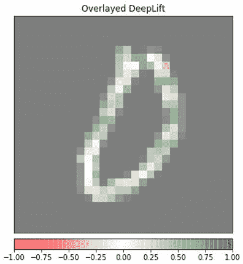

# 第十七章：PyTorch 和可解释 AI

## 在我们的 Discord 书籍社区中加入我们

[`packt.link/EarlyAccessCommunity`](https://packt.link/EarlyAccessCommunity)


在本书中，我们构建了几个可以为我们执行不同任务的深度学习模型。例如，手写数字分类器，图像字幕生成器，情感分类器等等。尽管我们已经掌握了如何使用 PyTorch 训练和评估这些模型，但我们不知道这些模型在做出预测时内部究竟发生了什么。模型可解释性或解释性是机器学习的一个领域，我们在这个领域的目标是回答这样一个问题，为什么模型做出了那个预测？更详细地说，模型在输入数据中看到了什么，以做出特定的预测？

在本章中，我们将使用来自 *第一章*《使用 PyTorch 概述深度学习》的手写数字分类模型，来理解其内部工作原理，并因此解释模型为给定输入做出特定预测的原因。我们将首先使用纯粹的 PyTorch 代码来解剖模型。然后，我们将使用一种专门的模型可解释性工具包，称为**Captum**，进一步调查模型内部发生的情况。Captum 是一个专门为 PyTorch 提供模型解释工具的第三方库，包括基于图像和文本的模型。

本章应该为您提供解开深度学习模型内部的技能所必需的知识。以这种方式查看模型内部可以帮助您理解模型的预测行为。在本章的结尾，您将能够利用实践经验开始解释您自己的深度学习模型，使用 PyTorch（和 Captum）。

本章分解为以下主题：

+   PyTorch 中的模型可解释性

+   使用 Captum 解释模型

## PyTorch 中的模型可解释性

在本节中，我们将使用 PyTorch 对已训练的手写数字分类模型进行解剖，作为一项练习。更确切地说，我们将查看训练的手写数字分类模型的卷积层的详细信息，以了解模型从手写数字图像中学到了哪些视觉特征。我们将查看卷积滤波器/核心以及这些滤波器产生的特征图。

这些细节将帮助我们理解模型如何处理输入图像，从而进行预测。练习的完整代码可以在我们的 github 仓库 [13.1] 中找到。

### 训练手写数字分类器 - 重温

我们将快速回顾涉及训练手写数字分类模型的步骤，如下所示：

1.  首先，我们导入相关的库，然后设置随机种子，以便能够重现这次练习的结果：

```py
import torch
np.random.seed(123)
torch.manual_seed(123)
```

1.  接下来，我们将定义模型架构：

```py
class ConvNet(nn.Module):
    def __init__(self):
    def forward(self, x):
```

1.  接下来，我们将定义模型的训练和测试过程：

```py
def train(model, device, train_dataloader, optim,  epoch):
def test(model, device, test_dataloader):
```

1.  然后，我们定义训练和测试数据集加载器：

```py
train_dataloader = torch.utils.data.DataLoader(...)
test_dataloader = torch.utils.data.DataLoader(...)
```

1.  接下来，我们实例化我们的模型，并定义优化计划：

```py
device = torch.device("cpu")
model = ConvNet()
optimizer = optim.Adadelta(model.parameters(), lr=0.5)
```

1.  最后，我们开始模型训练循环，训练我们的模型进行 20 个 epochs：

```py
for epoch in range(1, 20):
    train(model, device, train_dataloader, optimizer, epoch)
    test(model, device, test_dataloader)
```

这应该输出以下内容：


图 13.1 – 模型训练日志

1.  最后，我们可以在一个样本测试图像上测试训练好的模型。这个样本测试图像的加载方式如下：

```py
test_samples = enumerate(test_dataloader)
b_i, (sample_data, sample_targets) = next(test_samples)
plt.imshow(sample_data[0][0], cmap='gray', interpolation='none')
plt.show()
```

这应该输出以下内容：


图 13.2 – 一个手写图像示例

1.  然后，我们使用这个样本测试图像进行模型预测，如下所示：

```py
print(f"Model prediction is : {model(sample_data).data.max(1)[1][0]}")
print(f"Ground truth is : {sample_targets[0]}")
```

这应该输出以下内容：


图 13.3 – 模型预测

因此，我们已经训练了一个手写数字分类模型，并用它对一个样本图像进行了推断。现在我们将看看训练模型的内部结构。我们还将研究这个模型学习到了哪些卷积滤波器。

### 可视化模型的卷积滤波器

在本节中，我们将详细讨论已训练模型的卷积层，并查看模型在训练期间学习到的滤波器。这将告诉我们卷积层在输入图像上的操作方式，正在提取哪些特征等等：

1.  首先，我们需要获取模型中所有层的列表，如下所示：

```py
model_children_list = list(model.children())
convolutional_layers = []
model_parameters = []
model_children_list
```

这应该输出以下内容：


图 13.4 – 模型层

正如您所看到的，这里有 2 个卷积层，它们都有 3x3 大小的滤波器。第一个卷积层使用了**16**个这样的滤波器，而第二个卷积层使用了**32**个。我们重点在本练习中可视化卷积层，因为它们在视觉上更直观。然而，您可以通过类似的方式探索其他层，比如线性层，通过可视化它们学到的权重。

1.  接下来，我们从模型中选择只有卷积层，并将它们存储在一个单独的列表中：

```py
for i in range(len(model_children_list)):
    if type(model_children_list[i]) == nn.Conv2d:
        model_parameters.append(model_children_list[i].w      eight)
        convolutional_layers.append(model_children_list[i])
```

在这个过程中，我们还确保存储每个卷积层中学到的参数或权重。

1.  现在我们准备好可视化卷积层学到的滤波器。我们从第一层开始，该层每个都有 16 个 3x3 大小的滤波器。下面的代码为我们可视化了这些滤波器：

```py
plt.figure(figsize=(5, 4))
for i, flt in enumerate(model_parameters[0]):
    plt.subplot(4, 4, i+1)
    plt.imshow(flt[0, :, :].detach(), cmap='gray')
    plt.axis('off')
plt.show()
```

这应该输出以下内容：


图 13.5 – 第一个卷积层的滤波器

首先，我们可以看到所有学习到的滤波器都略有不同，这是一个好迹象。这些滤波器通常在内部具有对比值，以便在图像周围卷积时提取某些类型的梯度。在模型推断期间，这 16 个滤波器中的每一个都会独立地在输入的灰度图像上操作，并产生 16 个不同的特征图，我们将在下一节中进行可视化。

1.  类似地，我们可以使用与前一步骤相同的代码来可视化第二个卷积层学习到的 32 个滤波器，但需要进行以下更改：

```py
plt.figure(figsize=(5, 8))
for i, flt in enumerate(model_parameters[1]):
plt.show()
```

这应该输出以下内容：


图 13.6 – 第二个卷积层的滤波器

再次，我们有 32 个不同的滤波器/内核，它们具有对比值，旨在从图像中提取梯度。这些滤波器已经应用于第一个卷积层的输出，因此产生了更高级别的输出特征图。具有多个卷积层的 CNN 模型通常的目标是持续生成更复杂或更高级别的特征，可以表示复杂的视觉元素，例如面部的鼻子，道路上的交通灯等。

接下来，我们将看看这些卷积层在它们的输入上操作/卷积时产生了什么。

### 可视化模型的特征图

在这一部分中，我们将通过卷积层运行一个样本手写图像，并可视化这些层的输出：

1.  首先，我们需要将每个卷积层输出的结果收集到一个列表中，可以通过以下代码实现：

```py
per_layer_results = convolutional_layers[0]
for i in range(1, len(convolutional_layers)):
    per_layer_results.append(convolutional_layersi)
```

请注意，我们分别为每个卷积层调用前向传播，同时确保第 n 个卷积层接收第（n-1）个卷积层的输出作为输入。

1.  现在我们可以可视化由这两个卷积层产生的特征图。我们将从第一层开始运行以下代码：

```py
plt.figure(figsize=(5, 4))
layer_visualisation = per_layer_results[0][0, :, :, :]
layer_visualisation = layer_visualisation.data
print(layer_visualisation.size())
for i, flt in enumerate(layer_visualisation):
    plt.subplot(4, 4, i + 1)
    plt.imshow(flt, cmap='gray')
    plt.axis("off")
plt.show()
```

1.  这应该输出以下内容：


图 13.7 – 第一个卷积层的特征图

数字**(16, 26, 26)**表示第一卷积层的输出维度。实际上，样本图像尺寸为(28, 28)，滤波器尺寸为(3,3)，并且没有填充。因此，生成的特征图大小为(26, 26)。由于有 16 个这样的特征图由 16 个滤波器产生（请参考*图 13.5*），因此总体输出维度为(16, 26, 26)。

正如您所看到的，每个滤波器从输入图像中生成一个特征图。此外，每个特征图代表图像中的不同视觉特征。例如，左上角的特征图基本上颠倒了图像中的像素值（请参考*图 13.2*），而右下角的特征图表示某种形式的边缘检测。

这些 16 个特征图然后传递到第二个卷积层，其中另外 32 个滤波器分别在这 16 个特征图上卷积，产生 32 个新的特征图。我们接下来将查看这些特征图。

1.  我们可以使用与前面类似的代码，稍作更改（如下面的代码所示），来可视化下一个卷积层产生的 32 个特征图：

```py
plt.figure(figsize=(5, 8))
layer_visualisation = per_layer_results[1][0, :, :, :]
    plt.subplot(8, 4, i + 1)
plt.show()
```

这应该输出以下内容：


图 13.8 – 第二个卷积层的特征图

与之前的 16 个特征图相比，这 32 个特征图显然更复杂。它们似乎不仅仅是边缘检测，这是因为它们已经在第一个卷积层的输出上操作，而不是原始输入图像。

在这个模型中，2 个卷积层之后是 2 个线性层，分别有（4,608x64）和（64x10）个参数。虽然线性层的权重也有助于可视化，但参数数量（4,608x64）的视觉化分析看起来实在太多了。因此，在本节中，我们将仅限于卷积权重的视觉分析。

幸运的是，我们有更复杂的方法来解释模型预测，而不需要查看如此多的参数。在下一节中，我们将探讨 Captum，这是一个与 PyTorch 配合使用的机器学习模型解释工具包，可以在几行代码内帮助我们解释模型决策。

## 使用 Captum 解释模型

**Captum** [13.2] 是由 Facebook 在 PyTorch 上构建的开源模型解释库，目前（撰写本文时）正在积极开发中。在本节中，我们将使用前面章节中训练过的手写数字分类模型。我们还将使用 Captum 提供的一些模型解释工具来解释该模型所做的预测。此练习的完整代码可以在我们的 github 代码库 [13.3] 中找到。

### 设置 Captum

模型训练代码类似于“训练手写数字分类器 – 总结”部分中显示的代码。在接下来的步骤中，我们将使用训练好的模型和一个样本图像，来理解模型在为给定图像进行预测时内部发生了什么：

1.  有几个与 Captum 相关的额外导入，我们需要执行，以便使用 Captum 的内置模型解释功能：

```py
from captum.attr import IntegratedGradients
from captum.attr import Saliency
from captum.attr import DeepLift
from captum.attr import visualization as viz
```

1.  要对输入图像进行模型的前向传递，我们将输入图像重塑为与模型输入大小相匹配：

```py
captum_input = sample_data[0].unsqueeze(0)
captum_input.requires_grad = True
```

1.  根据 Captum 的要求，输入张量（图像）需要参与梯度计算。因此，我们将输入的 `requires_grad` 标志设置为 `True`。

1.  接下来，我们准备样本图像，以便通过模型解释方法进行处理，使用以下代码：

```py
orig_image = np.tile(np.transpose((sample_data[0].cpu().detach().numpy() / 2) + 0.5, (1, 2, 0)), (1,1,3))
_ = viz.visualize_image_attr(None, orig_image, cmap='gray', method="original_image", title="Original Image")
```

这应该输出以下内容：


图 13.9 – 原始图像

我们已经在深度维度上平铺了灰度图像，以便 Captum 方法能够处理，这些方法期望一个 3 通道图像。

接下来，我们将实际应用一些 Captum 的解释性方法，通过预训练的手写数字分类模型对准备的灰度图像进行前向传递。

### 探索 Captum 的可解释性工具

在本节中，我们将探讨 Captum 提供的一些模型可解释性方法。

解释模型结果的最基本方法之一是观察显著性，它表示输出（在本例中是类别 0）关于输入（即输入图像像素）的梯度。对于特定输入，梯度越大，该输入越重要。您可以在原始的显著性论文[13.4]中详细了解这些梯度的计算方式。Captum 提供了显著性方法的实现：

1.  在以下代码中，我们使用 Captum 的 `Saliency` 模块计算梯度：

```py
saliency = Saliency(model)
gradients = saliency.attribute(captum_input, target=sample_targets[0].item())
gradients = np.reshape(gradients.squeeze().cpu().detach().numpy(), (28, 28, 1))
_ = viz.visualize_image_attr(gradients, orig_image, method="blended_heat_map", sign="absolute_value",
show_colorbar=True, title="Overlayed Gradients")
```

这应该输出如下结果：


图 13.10 – 叠加梯度

在前面的代码中，我们将获得的梯度重塑为 `(28,28,1)` 的大小，以便在原始图像上叠加显示，如前面的图示所示。Captum 的 `viz` 模块为我们处理了可视化。我们还可以使用以下代码仅可视化梯度，而不显示原始图像：

```py
plt.imshow(np.tile(gradients/(np.max(gradients)), (1,1,3)));
```

我们将获得以下输出：


图 13.11 – 梯度

正如你所看到的，梯度分布在图像中那些可能包含数字`0`的像素区域。

1.  接下来，我们将采用类似的代码方式，研究另一种可解释性方法 - 综合梯度。通过这种方法，我们将寻找**特征归因**或**特征重要性**。也就是说，我们将寻找在进行预测时使用的哪些像素是重要的。在综合梯度技术下，除了输入图像外，我们还需要指定一个基线图像，通常将其设置为所有像素值均为零的图像。

然后，沿着从基线图像到输入图像的路径计算梯度的积分。关于综合梯度技术的实现细节可以在原始论文[13.5]中找到。以下代码使用 Captum 的 `IntegratedGradients` 模块推导每个输入图像像素的重要性：

```py
integ_grads = IntegratedGradients(model)
attributed_ig, delta=integ_grads.attribute(captum_input, target=sample_targets[0], baselines=captum_input * 0, return_convergence_delta=True)
attributed_ig = np.reshape(attributed_ig.squeeze().cpu().detach().numpy(), (28, 28, 1))
_ = viz.visualize_image_attr(attributed_ig, orig_image, method="blended_heat_map",sign="all",show_colorbar=True, title="Overlayed Integrated Gradients")
```

这应该输出如下结果：


图 13.12 – 叠加的综合梯度

如预期的那样，梯度在包含数字`0`的像素区域中较高。

1.  最后，我们将研究另一种基于梯度的归因技术，称为**深度提升**。除了输入图像外，深度提升还需要一个基线图像。再次，我们使用所有像素值设置为零的图像作为基线图像。深度提升计算非线性激活输出相对于从基线图像到输入图像的输入变化的梯度（*图 13.9*）。以下代码使用 Captum 提供的 `DeepLift` 模块计算梯度，并将这些梯度叠加显示在原始输入图像上：

```py
deep_lift = DeepLift(model)
attributed_dl = deep_lift.attribute(captum_input, target=sample_targets[0], baselines=captum_input * 0, return_convergence_delta=False)
attributed_dl = np.reshape(attributed_dl.squeeze(0).cpu().detach().numpy(), (28, 28, 1))
_ = viz.visualize_image_attr(attributed_dl, orig_image, method="blended_heat_map",sign="all",show_colorbar=True, title="Overlayed DeepLift")
```

你应该看到以下输出：



图 13.13 – 覆盖的 deeplift

再次强调，梯度值在包含数字`0`的像素周围是极端的。

这就结束了本练习和本节。Captum 提供了更多的模型解释技术，例如*LayerConductance*、*GradCAM*和*SHAP [13.6]*。模型解释性是一个活跃的研究领域，因此像 Captum 这样的库可能会迅速发展。在不久的将来，可能会开发出更多类似的库，这些库将使模型解释成为机器学习生命周期的标准组成部分。

## 摘要

在本章中，我们简要探讨了如何使用 PyTorch 解释或解读深度学习模型所做决策的方法。

在本书的下一章中，我们将学习如何在 PyTorch 上快速训练和测试机器学习模型——这是一个用于快速迭代各种机器学习想法的技能。我们还将讨论一些能够使用 PyTorch 进行快速原型设计的深度学习库和框架。
