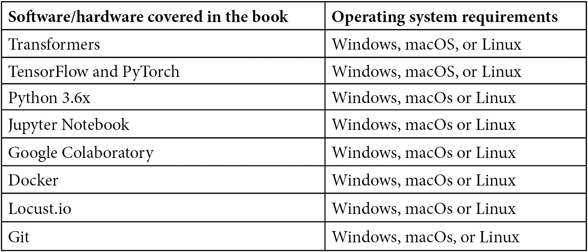

# 第一章：序

在过去的 20 年间，我们在**自然语言处理**（**NLP**）领域已经见证了巨大的变化。在此期间，我们经历了不同的范式，最终进入了由神奇的变压器架构主宰的新时代。这种深度学习架构是通过继承多种方法而形成的。诸如上下文词嵌入、多头自注意力、位置编码、可并行化的架构、模型压缩、迁移学习和跨语言模型等方法都在其中。从各种基于神经网络的自然语言处理方法开始，变压器架构逐渐演变成为一个基于注意力的编码器-解码器架构，并持续至今。现在，我们在文献中看到了这种架构的新成功变体。有些出色的模型只使用了其编码器部分，比如 BERT，或者只使用了其解码器部分，比如 GPT。

在整本书中，我们将涉及这些自然语言处理方法，并且能够轻松使用来自 Hugging Face 社区的 Transformers 库与变压器模型进行交互。我们将逐步提供各种自然语言处理问题的解决方案，涵盖从摘要到问答等广泛的话题。我们将看到，借助变压器的帮助，我们可以取得最先进的结果。

# 本书的受众

本书适合深度学习研究人员、实践型自然语言处理从业者，以及希望以变压器架构开始自己学习之旅的机器学习/自然语言处理教育者和学生。初级机器学习知识和良好的 Python 掌握能力将帮助您更好地理解本书的内容。

# 本书涵盖的内容

*第一章*，*从词袋模型到变压器*，简要介绍了自然语言处理的历史，对比了传统方法、深度学习模型（如 CNN、RNN 和 LSTM）与变压器模型。

*第二章*，*主题的实践导论*，深入探讨了如何使用变压器模型。我们将通过实例描述分词器和 BERT 等模型。

*第三章*，*自编码语言模型*，将让您了解如何从头开始在任何给定语言上训练自编码语言模型。此训练将包括模型的预训练和特定任务的训练。

*第四章*，*自回归和其他语言模型*，探讨了自回归语言模型的理论细节，并教会您如何在其特定语料库上进行预训练。您将学会如何在自己的文本上预训练 GPT-2 等任何语言模型，并将其用于诸如语言生成等各种任务。

*第五章*，*微调语言模型进行文本分类*，是您将学习如何配置预训练模型进行文本分类以及如何为任何文本分类下游任务，例如情感分析或多类分类进行微调的地方。

*第六章*，*微调语言模型进行标记分类*，教您如何微调语言模型以用于诸如 NER、POS 标注和问答等标记分类任务。

*第七章*，*文本表示*，是您将学习有关文本表示技术以及如何有效利用 Transformer 架构，特别是对于无监督任务，例如聚类、语义搜索和主题建模的地方。

*第八章*，*高效 Transformer 的工作*，向您展示了如何通过蒸馏、修剪和量化将经过训练的模型制作成高效模型。然后，您将了解到关于高效稀疏 Transformer 的知识，例如 Linformer 和 BigBird，以及如何与它们一起工作。

*第九章*，*跨语言和多语言语言建模*，是您将学习有关多语言和跨语言语言模型预训练以及单语和多语预训练之间的区别的地方。该章节还涵盖了因果语言建模和翻译语言建模等其他主题。

*第十章*，*服务 Transformer 模型*，将详细介绍如何在具有 CPU/GPU 的环境中提供基于 Transformer 的 NLP 解决方案。还将在此处描述使用 **TensorFlow Extended**（**TFX**）进行机器学习部署。

*第十一章*，*注意力可视化和实验跟踪*，将涵盖两个不同的技术概念：注意力可视化和实验跟踪。我们将使用诸如 exBERT 和 BertViz 等复杂工具来进行实践。

# 要充分利用本书

要遵循本书，您需要具备 Python 编程语言的基本知识。您还需要了解自然语言处理、深度学习以及深度神经网络的基础知识。

重要提示

本书中的所有代码都是在 Python 3.6 版本中执行的，因为 Python 3.9 版本中的一些库仍处于开发阶段。



**如果您使用的是本书的数字版，我们建议您自己输入代码或从本书的 GitHub 代码库中获取代码（链接在下一节中提供）。这样做可以帮助您避免与复制粘贴代码相关的任何潜在错误。**

# 下载示例代码文件

您可以从 GitHub 上下载本书的示例代码文件，网址为[`github.com/PacktPublishing/Mastering-Transformers`](https://github.com/PacktPublishing/Mastering-Transformers)。若代码有更新，将在 GitHub 仓库中更新。

我们还有其他代码捆绑包，来自我们丰富的图书和视频目录，可在[`github.com/PacktPublishing/`](https://github.com/PacktPublishing/)找到。欢迎查阅！

# 代码实践

本书的代码实践视频可在[`bit.ly/3i4vFzJ`](https://bit.ly/3i4vFzJ)观看。

# 下载彩色图片

我们还提供了一个 PDF 文件，其中包含本书中使用的截图和图表的彩色图像。您可以在此处下载：[`static.packt-cdn.com/downloads/9781801077651_ColorImages.pdf`](https://static.packt-cdn.com/downloads/9781801077651_ColorImages.pdf)。

# 使用的惯例

本书中使用了许多文本惯例。

`文本中的代码`：表示文本中的代码单词、数据库表名、文件夹名、文件名、文件扩展名、路径名、废弃的 URL、用户输入和 Twitter 句柄。举个例子："短于`max_sen_len`（最大句子长度）的序列将使用`PAD`值填充，直到其长度达到`max_sen_len`。"

代码块显示如下：

```py
max_sen_len=max([len(s.split()) for s in sentences])
words = ["PAD"]+ list(set([w for s in sentences for w in s.split()]))
word2idx= {w:i for i,w in enumerate(words)}
max_words=max(word2idx.values())+1
idx2word= {i:w for i,w in enumerate(words)}
train=[list(map(lambda x:word2idx[x], s.split())) for s in sentences]
```

当我们希望引起您对代码块的特别关注时，相关行或条目将以粗体显示：

```py
[default]
exten => s,1,Dial(Zap/1|30)
exten => s,2,Voicemail(u100)
exten => s,102,Voicemail(b100)
exten => i,1,Voicemail(s0)
```

任何命令行输入或输出均以以下形式呈现：

```py
$ conda activate transformers
$ conda install -c conda-forge tensorflow
```

**粗体**：表示新术语、重要词汇或屏幕上看到的词语。例如，菜单或对话框中的词以**粗体**显示。举个例子："现在我们必须关注特定模型在给定环境下的计算成本（**随机存取存储器（RAM）**，CPU 和 GPU），包括内存使用和速度。"

提示或重要笔记

如此呈现。

# 联系我们

我们非常欢迎读者的反馈。

发送邮件至`customercare@packtpub.com`，并在主题中提及书名。

**勘误表**：尽管我们竭尽全力确保内容准确无误，但错误不可避免。如果您在本书中发现错误，我们将不胜感激您向我们报告。请访问[www.packtpub.com/support/errata](http://www.packtpub.com/support/errata)并填写表格。

发送至`copyright@packt.com`，并附上材料链接。

**如果您有兴趣成为作者**：如果您在某个专题上有专长并且有兴趣撰写或贡献书籍，请访问[authors.packtpub.com](http://authors.packtpub.com)。

# 分享您的想法

阅读完《掌握变压器》后，我们很想听听您的想法！请点击此处前往亚马逊翻页，分享您的反馈。

您的评论对我们和技术社区非常重要，将帮助我们确保我们提供优质的内容。
