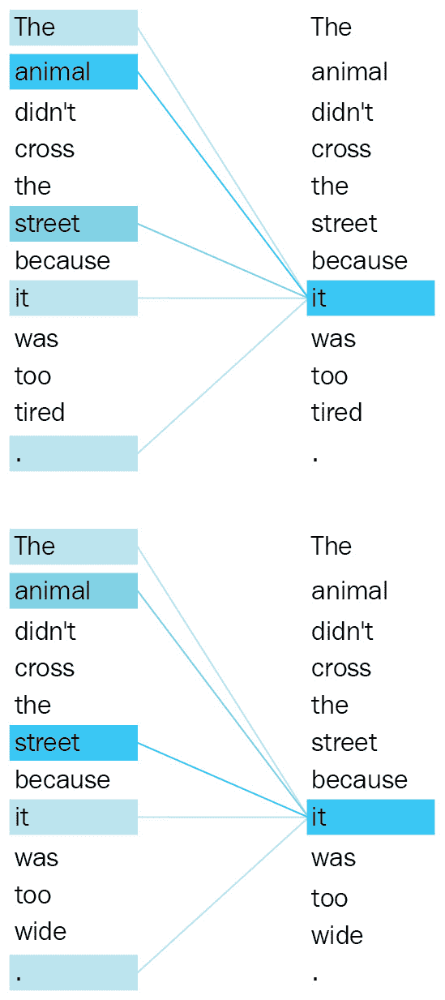
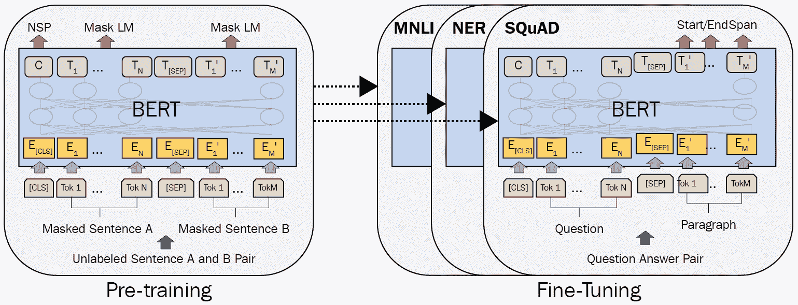

# 第二章：从词袋模型到 Transformer

在本章中，我们将讨论在过去的 20 年中**自然语言处理**（**NLP**）发生了什么变化。我们经历了不同的范式，最终进入了 Transformer 架构的时代。所有这些范式都帮助我们更好地表示单词和文档以解决问题。分布语义描述了单词或文档的意义，具有矢量表示，观察在文集中的分布证据。矢量用于在受控和非受控流程中解决许多问题。对于语言生成问题，n-gram 语言模型长期以来一直被用作传统方法。然而，这些传统方法存在许多缺点，在整整一章中我们将进行讨论。

我们将进一步讨论经典的**深度学习**（**DL**）架构，如**循环神经网络**（**RNNs**），**前馈神经网络**（**FFNNs**）和**卷积神经网络**（**CNNs**）。这些架构已经改善了该领域问题的性能，并克服了传统方法的局限。然而，这些模型也存在各自的问题。最近，由于 Transformer 模型在从文本分类到文本生成的所有 NLP 任务中的有效性，它们引起了巨大的兴趣。然而，主要的成功在于 Transformer 有效地提高了多语言和多任务 NLP 问题的性能，以及单语言和单任务。这些贡献使得**迁移学习**(**TL**)在 NLP 中更为可能，其目标是使模型可在不同任务或不同语言中重复使用。

从注意机制开始，我们将简要讨论 Transformer 架构和之前 NLP 模型的区别。与理论讨论并行，我们将展示流行的 NLP 框架的实际示例。为简单起见，我们将选择尽可能简短的入门代码示例。

在本章中，我们将涵盖以下主题：

+   NLP 向 Transformer 的演变

+   理解分布语义

+   利用深度学习

+   Transformer 架构概述

+   使用 Transformer 进行迁移学习

# 技术要求

我们将使用 Jupyter Notebook 来运行需要安装`python >=3.6.0`及以下包的编码练习：

+   `sklearn`

+   `nltk==3.5.0`

+   `gensim==3.8.3`

+   `fasttext`

+   `keras>=2.3.0`

+   `Transformers >=4.00`

所有带有编码练习的笔记本都可在以下 GitHub 链接处找到：[`github.com/PacktPublishing/Advanced-Natural-Language-Processing-with-Transformers/tree/main/CH01`](https://github.com/PacktPublishing/Advanced-Natural-Language-Processing-with-Transformers/tree/main/CH01)。

查看以下链接以查看视频代码示例：[`bit.ly/2UFPuVd`](https://bit.ly/2UFPuVd)

# NLP 向 Transformer 的发展

过去 20 年来，我们已经看到了自然语言处理（NLP）领域的深刻变化。在这段时间里，我们经历了不同的范式，最终进入了一个主要由神奇的*Transformer*架构主导的新时代。这种架构并非从天而降。从各种基于神经网络的 NLP 方法开始，它逐渐演变成了基于注意力的编码-解码类型的架构，并且仍在不断发展。过去十年中，由于以下发展，该架构及其各种变体取得了成功：

+   上下文词嵌入

+   更好的子词标记算法，用于处理未知单词或稀有单词

+   将额外的记忆标记注入到句子中，比如`Doc2vec`中的`段落 ID`或**来自 Transformer 的双向编码器表示**（**BERT**）中的**分类**（**CLS**）标记

+   注意力机制，克服将输入句子强制编码到一个上下文向量中的问题

+   多头自注意力

+   用于处理单词顺序的位置编码

+   可并行化的架构，使训练和微调更快

+   模型压缩（蒸馏、量化等）

+   TL（跨语言、多任务学习）

多年来，我们使用了传统的 NLP 方法，例如*n-gram 语言模型*、*基于 TF-IDF 的信息检索模型*和*one-hot 编码的文档-术语矩阵*。所有这些方法都为解决许多 NLP 问题（如*序列分类*、*语言生成*、*语言理解*等）做出了很大贡献。另一方面，这些传统的 NLP 方法也有其自身的弱点—例如，在解决稀疏性、未知单词表示、跟踪长期依赖关系等问题上存在不足。为了应对这些弱点，我们开发了基于深度学习的方法，如以下所示：

+   RNNs

+   CNNs

+   FFNNs

+   几种 RNNs、CNNs 和 FFNNs 的变种

2013 年，作为两层 FFNN 单词编码器模型，`Word2vec`通过产生短而稠密的单词表示（称为**词嵌入**）解决了维度问题。这个早期模型成功地产生了快速而有效的静态词嵌入。它通过预测上下文中的目标单词或基于滑动窗口预测相邻单词，将无监督的文本数据转换为受监督的数据（*自监督学习*）。**GloVe**，另一个被广泛使用和普遍流行的模型，认为基于计数的模型可能比神经模型更好。它利用语料库的全局和局部统计数据来学习基于单词共现统计的嵌入。它在一些句法和语义任务上表现良好，如下面的截图所示。截图告诉我们，术语之间的嵌入偏移有助于应用矢量导向推理。我们可以学习性别关系的泛化，这是从*男人*和*女人*之间的偏移关系推导出来的语义关系（*男人-> 女人*）。然后，我们可以通过将*男演员*的矢量和之前计算出的偏移矢量相加来算出*女演员*的矢量。同样，我们可以学习词的复数形式。例如，如果给出**Actor**，**Actors**和**Actress**的矢量，我们可以估算**Actresses**的矢量：


图 1.1 - 用于关系提取的单词嵌入偏移

递归和卷积架构，比如 RNN、**长短期记忆**（**LSTM**）和 CNN，开始在**序列到序列**（**seq2seq**）问题中被用作编码器和解码器。这些早期模型的主要挑战是多义词。由于给每个单词分配了单一的固定表示，因此忽略了单词的含义，这对多义词和句子语义尤其是一个严重的问题。

进一步的先驱神经网络模型，比如**通用语言模型微调**（**ULMFit**）和**语言模型嵌入**（**ELMo**），成功地对句子级信息进行编码，并最终缓解了一词多义的问题，与静态词嵌入不同。这两种重要方法基于 LSTM 网络。它们还引入了预训练和微调的概念。它们帮助我们应用迁移学习，利用在大量文本数据集上进行常规任务训练的预训练模型。然后，我们可以很容易地通过在目标任务上继续对预训练网络进行训练，进行微调。这些表示与传统的词嵌入不同，每个单词表示是整个输入句子的函数。现代 Transformer 架构充分利用了这个想法。

与此同时，注意力机制的想法在自然语言处理领域引起了强烈的印象，并取得了显著的成功，特别是在 seq2seq 问题上。早期的方法会传递最后一个状态（称为输入句子中的`加拿大政府`，用于英语到土耳其语的翻译任务。在输出句子中，`Kanada Hükümeti` 标记与输入短语建立了强连接，并与输入中的其他单词建立了较弱的连接，如下方截图所示：


图 1.2 – 注意力机制的草图可视化

因此，这种机制使得模型在翻译、问答和文本摘要等 seq2seq 问题中更加成功。

2017 年，基于 Transformer 的编码器-解码器模型被提出并被发现成功。该设计基于 FFNN，丢弃了 RNN 的递归，并仅使用注意力机制（*Vaswani et al., All you need is attention, 2017*）。到目前为止，基于 Transformer 的模型已经克服了其他方法所面临的许多困难，并成为了一个新的范式。在本书中，你将探索并理解 Transformer 模型的工作原理。

# 理解分布语义

分布语义描述了单词的含义，并通过矢量表示，最好是查看其分布证据，而不是查看其预定义的词典定义。该理论表明，在相似环境中共同出现的单词倾向于共享相似的含义。这最早由学者哈里斯提出（*Distributional Structure Word, 1954*）。例如，诸如*狗*和*猫*这样的相似单词大多在相同的上下文中共同出现。分布式方法的一个优点是帮助研究人员理解和监测单词随时间和领域的语义演变，也被称为**词汇语义变化问题**。

多年来，传统方法一直应用**词袋模型**（**BoW**）和 n-gram 语言模型来构建单词和句子的表示。在词袋模型中，单词和文档以一种稀疏的方式表示为 one-hot 编码，也被称为**向量空间模型**（**VSM**）。

多年来，这些 one-hot 编码技术已解决了文本分类、单词相似度、语义关系提取、单词意义消歧等许多自然语言处理问题。另一方面，n-gram 语言模型为单词序列分配概率，以便我们可以计算一个序列属于语料库的概率，或者基于给定语料库生成一个随机序列。

## BoW 实现

一种词袋（BoW）是一种文档的表征技术，通过计算其中的单词来实现。该技术的主要数据结构是文档词项矩阵。让我们用 Python 看一个 BoW 的简单实现。以下代码片段说明了如何使用 Python 的 `sklearn` 库为一个三句话的玩具语料库构建文档词项矩阵：

```py
from sklearn.feature_extraction.text import TfidfVectorizer 
import numpy as np
import pandas as pd
toy_corpus= ["the fat cat sat on the mat",
             "the big cat slept",
             "the dog chased a cat"]
vectorizer=TfidfVectorizer() 
corpus_tfidf=vectorizer.fit_transform(toy_corpus)
print(f"The vocabulary size is \
                 {len(vectorizer.vocabulary_.keys())} ")
print(f"The document-term matrix shape is\
                           {corpus_tfidf.shape}")
df=pd.DataFrame(np.round(corpus_tfidf.toarray(),2))
df.columns=vectorizer.get_feature_names()
```

代码的输出是一个文档词项矩阵，如下图所示。其大小为 (3 x 10)，但在现实场景中，矩阵的大小可以增长到更大的数字，例如 10K x 10M：


图 1.3 – 文档词项矩阵

表格表示的是一种基于计数的数学矩阵，在其中单元格的值按照**词频-逆文档频率**（**TF-IDF**）加权模式进行转换。此方法不关心单词的位置。由于单词顺序强烈决定了含义，忽略它会导致意义丧失。这是 BoW 方法中的常见问题，最终通过 RNN 中的递归机制和变压器中的位置编码得到解决。

矩阵中的每一列代表词汇表中一个词的向量，每一行代表一个文档的向量。可以应用语义相似性指标来计算单词和文档的相似性或非相似性。大多数情况下，我们使用二元组，例如 `cat_sat` 和 `the_street` 来丰富文档的表示。例如，当参数 `ngram_range=(1,2)` 传递给 `TfidfVectorizer` 时，它构建一个包含 unigrams (`big, cat, dog`) 和 bigrams (`big_cat`, `big_dog`) 的向量空间。因此，这样的模型也被称为**词袋式 n-grams**，它是**BoW**的自然扩展。

如果一个词在每篇文章中都经常出现，那么它可以被视为高频词，例如 *and* 和 *the*。相反，一些词在文章中很少出现，称为低频（或稀有）词。由于高频和低频词可能会妨碍模型的正常工作，因此在这里使用了 TF-IDF 作为解决方案，这是最重要和著名的加权机制之一。

`the` 没有区分力，而 `chased` 可能具有高信息量，可以提供关于文本主题的线索。这是因为高频词（停用词，功能词）在理解文档时具有很少的区分能力。

词的区分度也取决于领域，例如，DL 文章列表中几乎每篇文章都可能有单词 `network`。IDF 可以通过使用单词的**文档频率**（**DF**）来缩小所有词的权值，其中单词的 DF 通过单词出现在的文档数计算得出。**词频**（**TF**）是文档中词（术语）的原始计数。

一种基于 TF-IDF 的 BoW 模型的一些优缺点列举如下：


表 1 - TF-IDF BoW 模型的优缺点

## 克服维度问题

为了克服 BoW 模型的维度问题，**潜在语义分析**（**LSA**）被广泛用于在低维空间中捕捉语义。它是一种线性方法，捕捉术语之间的成对相关性。基于 LSA 的概率方法仍然可以被看作是一个隐藏主题变量的单层。然而，当前的 DL 模型包括多个隐藏层，参数量达到数十亿。除此之外，基于 Transformer 的模型表明，它们可以比传统模型更好地发现潜在表示。

对于**自然语言理解**（**NLU**）任务，传统的流水线从一些准备步骤开始，如 *tokenization*、*stemming*、*noun phrase detection*、*chunking*、*stop-word elimination* 等等。之后，使用任何加权模式构建文档-术语矩阵，其中 TF-IDF 是最流行的。最后，该矩阵作为 **机器学习**（**ML**）流水线、情感分析、文档相似性、文档聚类或测量查询与文档之间关联分数的表格化输入。同样，术语被表示为一个表格矩阵，并且可以作为一个 token 分类问题的输入，其中我们可以应用命名实体识别、语义关系提取等。

分类阶段包括对监督式机器学习算法的直接实现，如**支持向量机**（**SVM**）、随机森林、逻辑回归、朴素贝叶斯和多个学习器（Boosting 或 Bagging）。实际上，这样一个流水线的实现可以简单地编码如下：

```py
from sklearn.pipeline import make_pipeline
from sklearn.svm import SVC
labels= [0,1,0]
clf = SVC()
clf.fit(df.to_numpy(), labels)
```

如前面的代码所示，我们可以轻松地应用 `sklearn` **应用程序编程接口**（**API**）来进行适配操作。为了将学习到的模型应用于训练数据，执行以下代码：

```py
clf.predict(df.to_numpy())
Output: array([0, 1, 0])
```

让我们继续下一节吧！

## 语言建模与生成

对于语言生成问题，传统方法是基于利用 n-gram 语言模型。这也被称为**马尔可夫过程**，它是一种随机模型，其中每个词（事件）都依赖于前面的一部分词—*unigram*、*bigram* 或 *n-gram*，如下所述：

+   **一元组**（所有词都是独立的，没有链）：这估计了词汇表中每个词的概率，简单地通过它在总词数中的频率计算得到。

+   **二元组**（一阶马尔可夫过程）：这估计了 *P（wordi | wordi-1）*，即 *wordi* 取决于 *wordi-1* 的概率，简单地通过 *P（wordi，wordi-1）* 与 *P（wordi-1）* 的比率计算得到。

+   **N 元组**（N 阶马尔可夫过程）：这估计了 *P（wordi | word0, ..., wordi-1）*。

让我们用**自然语言工具包**（**NLTK**）库进行一个简单的语言模型实现。在以下实现中，我们使用**最大似然估计器**（**MLE**）训练了一个*n=2*的模型。我们可以选择任何 n-gram 顺序，比如*n=1*代表 unigrams，*n=2*代表 bigrams，*n=3*代表 trigrams 等等：

```py
import nltk
from nltk.corpus import gutenberg
from nltk.lm import MLE
from nltk.lm.preprocessing import padded_everygram_pipeline
nltk.download('gutenberg')
nltk.download('punkt')
macbeth = gutenberg.sents('shakespeare-macbeth.txt')
model, vocab = padded_everygram_pipeline(2, macbeth)
lm=MLE(2)
lm.fit(model,vocab)
print(list(lm.vocab)[:10])
print(f"The number of words is {len(lm.vocab)}")
```

`nltk`包首先下载`古腾堡`语料库，其中包括来自*古腾堡项目*电子文本存档的一些文本，托管在[`www.gutenberg.org`](https://www.gutenberg.org)。它还下载用于标点处理的`punkt`分词器工具。该分词器使用无监督算法将原始文本划分为句子列表。`nltk`包已经包含了一个预先训练的英文`punkt`分词器模型，用于缩写词和搭配词。在使用之前，可以对任何语言的一系列文本进行训练。在后续章节中，我们将讨论如何为 Transformer 模型训练不同和更高效的分词器。以下代码展示了语言模型目前学到的内容：

```py
print(f"The frequency of the term 'Macbeth' is {lm.counts['Macbeth']}")
print(f"The language model probability score of 'Macbeth' is {lm.score('Macbeth')}")
print(f"The number of times 'Macbeth' follows 'Enter' is {lm.counts[['Enter']]['Macbeth']} ")
print(f"P(Macbeth | Enter) is {lm.score('Macbeth', ['Enter'])}")
print(f"P(shaking | for) is {lm.score('shaking', ['for'])}")
```

这是输出：

```py
The frequency of the term 'Macbeth' is 61
The language model probability score of 'Macbeth' is 0.00226
The number of times 'Macbeth' follows 'Enter' is 15 
P(Macbeth | Enter) is 0.1875
P(shaking | for) is 0.0121
```

n-gram 语言模型保留*n-gram*计数，并计算生成句子的条件概率。`lm=MLE(2)`代表最大似然估计，在每个令牌的概率中得出最可能的句子。以下代码使用`<s>`开头条件生成一个包含 10 个单词的随机句子：

```py
lm.generate(10, text_seed=['<s>'], random_seed=42)
```

输出如下所示：

```py
['My', 'Bosome', 'franchis', "'", 's', 'of', 'time', ',', 'We', 'are']
```

我们可以通过`text_seed`参数提供特定的起始条件，使得生成受到前文的影响。在我们先前的例子中，前文是`<s>`，这是一个特殊的令牌，表示句子的开头。

到目前为止，我们已经讨论了传统 NLP 模型的基础范式，并用流行的框架提供了非常简单的实现。现在我们将转向 DL 部分，讨论神经语言模型如何塑造 NLP 领域，以及神经模型如何克服传统模型的局限性。

# 利用 DL

NLP 是 DL 架构广泛且成功应用的领域之一。几十年来，在词和句子表示中特别出现了成功的架构。在本节中，我们将分享这些不同方法的故事，并介绍常用的框架。

## 学习词嵌入

自从能够在更大的数据集上训练更复杂的神经架构以构建短而密集的表示以来，基于神经网络的语言模型有效地解决了特征表示和语言建模问题。2013 年，**Word2vec 模型**，这是一种流行的词嵌入技术，使用了简单而有效的架构来学习高质量的连续词表示。它在各种句法和语义语言任务上的表现优于其他模型，如*情感分析*、*释义检测*、*关系提取*等等。该模型的另一个关键因素是其*更低的计算复杂性*。它最大化了给定任何周围上下文词的当前词的概率，或者反之亦然。

以下代码段说明了如何为剧作 *麦克白* 的句子训练词向量：

```py
from gensim.models import Word2vec
model = Word2vec(sentences=macbeth, size=100, window= 4, min_count=10, workers=4, iter=10)
```

该代码通过一个长度为 5 的滑动窗口训练具有 100 个向量大小的词嵌入。为了可视化词嵌入，我们需要通过应用**主成分分析**（**PCA**）将维度降低到 3，如下面的代码片段所示：

```py
import matplotlib.pyplot as plt
from sklearn.decomposition import PCA
import random
np.random.seed(42)
words=list([e for e in model.wv.vocab if len(e)>4]) 
random.shuffle(words)
words3d = PCA(n_components=3,random_state=42).fit_transform(model.wv[words[:100]])
def plotWords3D(vecs, words, title):
   ...
plotWords3D(words3d, words, "Visualizing Word2vec Word Embeddings using PCA")
```

这是输出：


图 1.4 – 用 PCA 可视化词嵌入

如图所示，莎士比亚剧作的主要角色——**麦克白**、**马尔科姆**、**班克**、**麦克达夫**等——被映射到彼此附近。同样，辅助动词**shall**、**should** 和 **would** 出现在*图 1.4*的左下方，彼此靠近。我们还可以通过使用嵌入偏移来捕获类似 *man-woman= uncle-aunt* 的类比。有关此主题的更多有趣视觉示例，请查看以下项目：[`projector.tensorflow.org/`](https://projector.tensorflow.org/)。

类似 Word2vec 的模型通过采用基于预测的神经架构来学习词嵌入。它们对一些目标函数和附近词预测进行梯度下降。虽然传统方法采用基于计数的方法，但神经模型设计了一个基于预测的架构用于分布语义。*基于计数的方法还是基于预测的方法对于分布式词表示更好？* GloVe 方法解决了这个问题，并认为这两种方法并没有明显的区别。Jeffrey Penington 等人甚至支持基于计数的方法可能更成功，因为它们捕捉了全局统计信息。他们指出 GloVe 在词类比、词相似性和**命名实体识别**（**NER**）任务上胜过其他神经网络语言模型。

然而，这两种范式对于未知单词和单词语义问题并没有提供有效的解决方案。它们不利用子词信息，因此无法学习稀有和未知单词的嵌入。

**FastText**，另一个广泛使用的模型，提出了一种使用子词信息的新的丰富方法，其中每个单词被表示为一组字符 n-gram。该模型为每个字符 n-gram 设置一个常量向量，并将单词表示为其子向量的和，这是 Hinrich Schütze 首次引入的一种想法（*Word Space, 1993*）。模型可以计算即使对于未见过的单词也可以学习单词的内部结构，例如后缀/词缀，这在形态丰富的语言（如芬兰语、匈牙利语、土耳其语、蒙古语、韩语、日语、印尼语等）中尤为重要。当前，现代 Transformer 架构使用各种子词标记化方法，例如**WordPiece**，**SentencePiece**或**字节对编码**（**BPE**）。

## RNN 的简要概述

RNN 模型可以通过在较早的时间步中滚动其他标记的信息来学习每个标记表示，并在最后一个时间步学习句子表示。这种机制在许多方面都被发现有益，概述如下：

+   首先，RNN 可以在语言生成或音乐生成的一对多模型中进行重新设计。

+   其次，多对一模型可用于文本分类或情感分析。

+   最后，多对多模型用于 NER 问题。多对多模型的第二个用途是解决编码器-解码器问题，例如*机器翻译*，*问答*和*文本摘要*。

与其他神经网络模型一样，RNN 模型接受通过令牌化算法生成的标记，该算法将整个原始文本分解为原子单位，也称为标记。此外，它将标记单元与数字向量（标记嵌入）相关联，这些向量在训练期间学习。作为替代方案，我们可以事先将嵌入式学习任务分配给著名的单词嵌入算法，例如 Word2vec 或 FastText。

以下是句子`The cat is sad.`的 RNN 架构的简单示例，其中 x0 是`the`的向量嵌入，x1 是`cat`的向量嵌入，依此类推。*图 1.5*说明了一个被展开成完整**深度神经网络**（**DNN**）的 RNN。

`The cat is sad.`序列，我们关心一个包含五个词的序列。每一层的隐藏状态充当网络的记忆。它编码了所有先前时间步和当前时间步发生了什么的信息。这在下图中表示：


图 1.5 - 一个 RNN 架构

以下是 RNN 架构的一些优势：

+   **可变长度输入**：具有处理可变长度输入的能力，无论输入的句子大小如何。我们可以将 3 个或 300 个词的句子喂给网络而不更改参数。

+   **关注单词顺序**：它按顺序逐个处理序列中的单词，关心单词的位置。

+   **适用于各种模式**（**多对多，一对多**）：我们可以使用相同的循环范式训练机器翻译模型或情感分析。这两种架构都将基于 RNN。

RNN 架构的缺点如下：

+   **长期依赖问题**：当我们处理一个非常长的文档并尝试链接相距很远的术语时，我们需要关心并编码这些术语之间的所有不相关的其他术语。

+   **容易出现梯度爆炸或消失问题**：当处理长文档时，更新最初几个单词的权重是一个大问题，这会导致模型由于梯度消失问题而无法训练。

+   **难以应用并行训练**：并行化将主问题分解为更小的问题，并同时执行解决方案，但是 RNN 遵循经典的顺序方法。每一层都强烈依赖于前面的层，这使得并行化变得不可能。

+   **计算速度随序列长度增加而变慢**：对于短文本问题，RNN 可能非常高效。但它在处理长文档时速度非常慢，而且存在长期依赖问题。

尽管理论上 RNN 可以在许多时间步骤上处理信息，但在现实世界中，长文档和长期依赖等问题是不可能发现的。长序列在许多深层中被表示。许多研究已经解决了这些问题，其中一些概述如下：

+   *Hochreiter 和 Schmidhuber。长短期记忆。1997 年*。

+   *Bengio 等人。用梯度下降学习长期依赖性是困难的。1993 年*。

+   *K. Cho 等人。使用 RNN 编码器-解码器学习短语表示的统计机器翻译。2014 年*。

## LSTM 和门控循环单元

LSTM（*Schmidhuber，1997*）和**门控循环单元**（**GRUs**）（*Cho，2014*）是 RNN 的新变种，已经解决了长期依赖问题，并引起了极大关注。LSTM 特别是针对长期依赖问题进行了开发。LSTM 模型的优势在于它使用了额外的细胞状态，这是 LSTM 单元顶部的水平序列线。该细胞状态由专用门控制，用于忘记、插入或更新操作。LSTM 架构的复杂单元如下图所示：


图 1.6 – 一个 LSTM 单元

它能够决定以下内容：

+   我们将在细胞状态中存储什么样的信息

+   哪些信息将被遗忘或删除

在原始 RNN 中，为了学习 I 令牌的状态，它会在 timestep0 和 timestepi-1 之间递归处理先前令牌的整个状态。携带来自较早时间步的完整信息会导致梯度消失问题，使得模型无法训练。LSTM 中的门机制允许架构在某个时间步跳过一些不相关的令牌或记住长期状态以便学习当前令牌状态。

GRU 在很多方面与 LSTM 相似，主要区别在于 GRU 不使用细胞状态。相反，该架构简化了，将细胞状态的功能转移到隐藏状态，并且只包括两个门：一个 *更新门* 和一个 *重置门*。更新门确定了来自先前和当前时间步的信息将被推送多远。这个特性帮助模型保留了过去的相关信息，从而最小化了梯度消失问题的风险。重置门检测到不相关的数据并使模型忘记它们。

### 一个使用 Keras 的 LSTM 的温和实现

我们需要从 **通用语言理解评估**（**GLUE**）基准中下载 **斯坦福情感树库**（**SST-2**）情感数据集。我们可以通过运行以下代码来实现这一点：

```py
$ wget https://dl.fbaipublicfiles.com/glue/data/SST-2.zip 
$ unzip SST-2.zip
```

重要提示

**SST-2**：这是一个完全标记的解析树，允许在英语中进行完整的情感分析。该语料库最初包括约 12K 个从电影评论中提取的单个句子。它使用斯坦福解析器进行解析，并包含由三名人类评审员注释的 200K 多个唯一短语。有关更多信息，请参见 *Socher 等人，用组合矢量语法解析，EMNLP。2013* ([`nlp.stanford.edu/sentiment`](https://nlp.stanford.edu/sentiment))。

下载数据后，让我们将其作为 pandas 对象读取，如下所示：

```py
import tensorflow as tf
import pandas as pd 
df=pd.read_csv('SST-2/train.tsv',sep="\t")
sentences=df.sentence
labels=df.label
```

我们需要设置最大句子长度，构建词汇表和字典（`word2idx`，`idx2words`），最后将每个句子表示为索引列表而不是字符串。我们可以通过运行以下代码来实现这一点：

```py
max_sen_len=max([len(s.split()) for s in sentences])
words = ["PAD"]+\
     list(set([w for s in sentences for w in s.split()]))
word2idx= {w:i for i,w in enumerate(words)}
max_words=max(word2idx.values())+1
idx2word= {i:w for i,w in enumerate(words)}
train=[list(map(lambda x:word2idx[x], s.split()))\
                                 for s in sentences]
```

比 `max_sen_len`（最大句子长度）短的序列将使用 `PAD` 值填充，直到它们的长度达到 `max_sen_len`。另一方面，更长的序列将被截断，以使其适合 `max_sen_len`。以下是实现：

```py
from keras import preprocessing
train_pad = preprocessing.sequence.pad_sequences(train,
                                    maxlen=max_sen_len)
print('Train shape:', train_pad.shape)
Output: Train shape: (67349, 52)
```

我们准备设计和训练一个 LSTM 模型，如下所示：

```py
from keras.layers import LSTM, Embedding, Dense
from keras.models import Sequential
model = Sequential()
model.add(Embedding(max_words, 32))
model.add(LSTM(32))
model.add(Dense(1, activation='sigmoid'))
model.compile(optimizer='rmsprop',loss='binary_crossentropy', metrics=['acc'])
history = model.fit(train_pad,labels, epochs=30, batch_size=32, validation_split=0.2)
```

模型将训练 30 个 epochs。为了绘制 LSTM 模型到目前为止学到了什么，我们可以执行以下代码：

```py
import matplotlib.pyplot as plt
def plot_graphs(history, string):
    ...
plot_graphs(history, 'acc')
plot_graphs(history, 'loss')
```

该代码生成以下图表，显示了基于 LSTM 的文本分类的训练和验证性能：


图 1.7 – LSTM 网络的分类性能

正如我们之前提到的，基于 RNN 的编码器-解码器模型的主要问题是它为一个序列生成一个固定的表示。 但是，注意机制使得 RNN 能够专注于输入标记的某些部分，并将它们映射到输出标记的某些部分。 发现这种注意机制非常有用，并已成为 Transformer 架构的基本思想之一。 我们将在接下来的部分以及整本书的讨论中讨论 Transformer 架构如何利用注意力。

## CNN 的简要概述

CNN 在计算机视觉方面取得成功后，也被用于 NLP，用于建模句子或语义文本分类等任务。 在许多实践中，CNN 由卷积层组成，然后是一个密集的神经网络。 卷积层对数据进行处理以提取有用的特征。 与任何 DL 模型一样，卷积层扮演自动化特征提取的角色。 在 NLP 的情况下，这个特征层是由一个嵌入层提供输入，该层将句子以 one-hot 矢量化格式作为输入。 这些 one-hot 矢量是通过为组成句子的每个单词生成一个`token-id`来生成的。 以下截图的左侧显示了句子的 one-hot 表示：


图 1.8 - One-hot 矢量

每个由 one-hot 矢量表示的标记都被送入嵌入层。 嵌入层可以通过随机值或使用预训练的单词向量（如 GloVe、Word2vec 或 FastText）进行初始化。 然后，该句子将转换为一个 NxE 形状的密集矩阵（其中**N**是句子中标记的数量，**E**是嵌入的大小）。 以下截图说明了 1D CNN 如何处理该密集矩阵：


图 1.9 - 五个标记的句子的 1D CNN 网络

卷积将在不同层和核之上进行。 卷积层的超参数是核大小和核的数量。 值得注意的是，这里应用的是 1D 卷积，原因是标记嵌入不能被视为局部的，我们希望应用能够依次看到多个标记的核。 您可以将其视为具有指定窗口的 n-gram。 使用浅层 TL 结合 CNN 模型也是这些模型的另一个良好的能力。 正如以下截图所示，我们还可以用许多标记的表示的组合来传播网络，正如 2014 年由 Yoon Kim 提出的研究中所建议的那样，《句子分类的卷积神经网络》:


图 1.10 - CNN 中许多表示的组合

例如，我们可以使用三个嵌入层而不是一个，并为每个令牌连接它们。在这种设置下，如果所有三个不同的嵌入的大小为 128，则诸如**fell**的令牌将具有大小为 3x128 的向量。这些嵌入可以使用来自 Word2vec、GloVe 和 FastText 的预训练向量进行初始化。每一步的卷积运算将使用其各自的三个向量来查看 N 个单词（N 是卷积滤波器的大小）。这里使用的卷积类型是 1D 卷积。这里的维度表示进行操作时可能的移动。例如，2D 卷积将沿两个轴移动，而 1D 卷积只沿一个轴移动。下面的屏幕截图显示了它们之间的区别：


图 1.11 – 卷积方向

以下代码片段是一个处理与 LSTM 管道中使用的相同数据的 1D CNN 实现。它包括`Conv1D`和`MaxPooling`层的组合，以及`GlobalMaxPooling`层。我们可以通过调整参数并添加更多层来扩展该管道以优化模型：

```py
from keras import layers
model = Sequential()
model.add(layers.Embedding(max_words, 32, input_length=max_sen_len))
model.add(layers.Conv1D(32, 8, activation='relu'))
model.add(layers.MaxPooling1D(4))
model.add(layers.Conv1D(32, 3, activation='relu'))
model.add(layers.GlobalMaxPooling1D())
model.add(layers.Dense(1, activation= 'sigmoid')
model.compile(loss='binary_crossentropy', metrics=['acc'])
history = model.fit(train_pad,labels, epochs=15, batch_size=32, validation_split=0.2)
```

结果表明，CNN 模型与其 LSTM 对应物表现出可比较的性能。虽然 CNN 在图像处理中已成为标准，但我们已经看到了许多成功应用 CNN 在 NLP 中。而 LSTM 模型被训练用于识别跨越时间的模式，CNN 模型则识别跨越空间的模式。

# Transformer 架构概述

**Transformer**模型因其在从文本分类到文本生成等巨大范围的 NLP 问题中的有效性而受到极大关注。注意力机制是这些模型的重要部分，并发挥着非常关键的作用。在 Transformer 模型出现之前，注意力机制被提出作为帮助改进传统 DL 模型（如 RNNs）的工具。为了更好地理解 Transformer 及其对 NLP 的影响，我们将首先研究注意力机制。

## 注意力机制

*Bahdanau 等人（2015 年）*提出了注意力机制的第一个变体之一。该机制基于这样一个事实，即基于 RNN 的模型（如 GRUs 或 LSTMs）在诸如`token-id`之类的任务上存在信息瓶颈，并以递归方式处理它（编码器）。然后，处理过的中间表示被馈送到另一个递归单元（解码器）以提取结果。这种雪崩般的信息就像一个滚动的球，消耗了所有的信息，而将其滚动出来对于解码器部分来说是困难的，因为解码器部分并没有看到所有的依赖关系，只获得中间表示（上下文向量）作为输入。

为了调整这个机制，Bahdanau 提出了一种注意机制，在中间隐藏值上使用权重。这些权重可以调整模型在每个解码步骤中对输入的关注程度。这种出色的指导帮助模型在特定任务中，比如 NMT（许多对许多任务），做出了很大的帮助。这里提供了一个典型注意机制的示意图：


图 1.12 – 注意机制

不同的注意机制提出了不同的改进。 *加性*，*乘性*，*一般* 和 *点积* 注意机制出现在这些机制家族中。后者，这是一个带有缩放参数的修改版本，被称为缩放点积注意力。这种特定的注意类型是 Transformer 模型的基础，被称为**多头注意力机制**。加性注意力也是之前在 NMT 任务中引入的一项显着变化。你可以在这里看到不同类型的注意机制的概述：


表 2 – 注意机制的类型（图片灵感来自 https://lilianweng.github.io/lil-log/2018/06/24/attention-attention.html）

由于注意机制不仅限于 NLP，它们也被用于各种领域的不同用例，从计算机视觉到语音识别。以下截图展示了一个用于神经图像字幕训练的多模态方法的可视化（*K Xu 等，Show, attend and tell: Neural image caption generation with visual attention, 2015*）：


图 1.13 – 计算机视觉中的注意机制

下图所示的多头注意机制是 Transformer 架构中的一个重要部分：


图 1.14 – 多头注意机制

接下来，让我们了解多头注意机制。

## 多头注意机制

在深入研究缩放点积注意力机制之前，最好先对自注意力有一个良好的理解。如*图 1.15*所示，**自注意力**是一种缩放自注意力机制的基本形式。该机制使用一个显示为*X*的输入矩阵，并在*X*中的各个项目之间产生注意力分数。我们将*X*视为一个 3x4 矩阵，其中 3 代表令牌的数量，4 代表嵌入大小。*图 1.15*中的*Q*也称为**查询**，*K*称为**键**，*V*称为**值**。在产生*Q*、*K*和*V*之前，三种类型的矩阵被称为*theta*、*phi*和*g*，它们与*X*相乘。查询（*Q*）和键（*K*）之间的乘积结果产生一个注意力分数矩阵。这也可以看作是一个数据库，我们使用查询和键来了解各种项目在数值评估方面的关联程度。注意力分数和*V*矩阵的乘积产生这种类型的注意力机制的最终结果。其被称为**自注意力**的主要原因是因为它的统一输入*X*; *Q*、*K*和*V*是从*X*计算出来的。你可以在下图中看到所有这些的描述：


图 1.15 – 注意力机制的数学表示（图片来源于 https://blogs.oracle.com/datascience/multi-head-self-attention-in-nlp）

一个缩放点积注意力机制与自注意力（点积）机制非常相似，只是它使用了一个缩放因子。另一方面，多头部分确保模型能够在各个层面上查看输入的各个方面。Transformer 模型关注编码器注释和来自过去层的隐藏值。Transformer 模型的架构没有逐步流程; 相反，它使用位置编码来获取有关输入序列中每个令牌位置的信息。嵌入值（随机初始化）和位置编码的固定值的串联值是输入传递到第一个编码器部分中的层，并通过体系结构传播，如下图所示：


图 1.16 – 一个 Transformer

通过评估不同频率的正弦和余弦波来获取位置信息。位置编码的一个示例在以下截图中可视化：


图 1.17 – 位置编码（图片来源于 http://jalammar.github.io/illustrated-Transformer/）

在下面的流行截图中给出了 Transformer 架构和缩放点积注意力机制的性能的一个很好的例子：



图 1.18 – Transformer 的注意力映射（图片灵感来自 https://ai.googleblog.com/2017/08/Transformer-novel-neural-network.html）

**它** 这个词在不同的语境中指代不同的实体，正如前面的截图所示。使用 Transformer 架构的另一个改进在于并行性。传统的顺序循环模型如 LSTM 和 GRU 并没有这样的能力，因为它们逐个处理输入标记。另一方面，前馈层的速度会更快一些，因为单个矩阵乘法比循环单元要快得多。多头注意力层的堆叠可以更好地理解复杂的句子。一个很好的多头注意力机制的可视化示例如下截图所示：


图 1.19 – 多头注意力机制（图片灵感来自 https://imgur.com/gallery/FBQqrxw）

在注意力机制的解码器侧，采用了与编码器非常相似的方法，但有一些小的修改。多头注意力机制是相同的，但也使用了编码器堆栈的输出。这个编码被提供给第二个多头注意力层中的每个解码器堆栈。这个小修改在解码时引入了编码器堆栈的输出。这个修改让模型在解码时意识到编码器输出，并同时在训练期间帮助它在各个层之间有更好的梯度流动。解码器层末端的最终 softmax 层用于为各种用例提供输出，例如原始 Transformer 架构引入的 NMT。

这个架构有两个输入，分别标注为输入和输出（向右移动）。一个始终存在（输入），无论是训练还是推断，而另一个只存在于训练和推断中，它由模型产生。我们之所以不在推断中使用模型预测，是为了防止模型自行出错。但这是什么意思呢？想象一个神经机器翻译模型试图将一句英文翻译成法文——在每个步骤中，它都会对一个词进行预测，并使用该预测的词来预测下一个词。但如果在某个步骤出错了，那么后面的所有预测都会错误。为了防止模型像这样出错，我们提供正确的词作为右移版本。

下图显示了一个 Transformer 模型的可视化示例。它展示了一个具有两个编码器和两个解码器层的 Transformer 模型。这张图中的 **加法 & 标准化** 层从这张图中的 **前馈** 层接收输入后添加和标准化它：


图 1.20 – Transformer 模型（图片灵感来自 http://jalammar.github.io/illustrated-Transformer/）

另一个由基于 Transformer 架构使用的主要改进是基于一种简单的通用文本压缩方案，以防止输入端出现未见标记。这种方法通过使用不同的方法（如字节对编码和句子片段编码）进行，提高了 Transformer 在处理未见标记时的性能。它还在模型遇到形态接近的标记时指导模型。这样的标记在过去是不可见的，并且在训练中很少使用，然而，在推理中可能会看到。在某些情况下，训练中会看到其部分内容；在形态丰富的语言（如土耳其语、德语、捷克语和拉脱维亚语）的情况下会发生后者。例如，模型可能看到单词 *training*，但没有看到 *trainings*。在这种情况下，它可以将 *trainings* 标记为 *training+s*。当我们将它们视为两个部分时，这两者是常见的。

基于 Transformer 的模型具有相当普遍的特征——例如，它们都是基于这种原始架构的，不同之处在于它们使用和不使用的步骤。在某些情况下，会做出较小的改进——例如，改进多头注意力机制。

# 使用 Transformer 进行 TL

**TL** 是人工智能（**AI**）和机器学习（ML）的一个领域，旨在使模型可在不同任务中重用，例如，在给定任务（如 *A*）上训练的模型可在不同任务（如 *B*）上重用（微调）。在 NLP 领域，通过使用可以捕获语言理解的 Transformer-like 架构来实现这一目标。这种模型称为语言模型——它们为其训练的语言提供了一个模型。TL 不是一种新技术，它已经被用于各种领域，如计算机视觉。ResNet、Inception、VGG 和 EfficientNet 是可以用作预训练模型的示例，可在不同的计算机视觉任务上进行微调。

浅层 TL 使用诸如 *Word2vec*、*GloVe* 和 *Doc2vec* 这样的模型在 NLP 中也是可能的。它被称为 *浅层*，因为这种 TL 背后没有模型，而是利用了预训练的单词/标记向量。你可以使用这些标记或文档嵌入模型，接着使用分类器，或者将它们与其他模型（如 RNNs）结合使用，而不是使用随机嵌入。

在 NLP 中使用 Transformer 模型进行 TL 也是可能的，因为这些模型可以在没有任何标注数据的情况下学习一门语言本身。语言建模是一种用于为各种问题训练可转移权重的任务。掩码语言建模是用于学习一门语言本身的方法之一。与 Word2vec 的基于窗口的模型预测中心词元相似，掩码语言建模采用类似的方法，但有关键差异。给定一个概率，每个词都被掩码并替换为特殊标记，如 *[MASK]*。语言模型（在我们的情况下是基于 Transformer 的模型）必须预测被掩码的词。与 Word2vec 不同，不是使用一个窗口，而是给出整个句子，模型的输出必须是相同的带有掩码词的句子。

使用 Transformer 架构进行语言建模的第一个模型之一是**BERT**，它基于 Transformer 架构的编码器部分。通过在训练语言模型之前和之后使用相同的方法，BERT 完成了掩码语言建模。BERT 是一个可转移的语言模型，适用于不同的 NLP 任务，如标记分类、序列分类，甚至问答任务。

每一个任务都是对 BERT 进行微调的任务，一旦一个语言模型被训练完成。BERT 最为人所知的是其在基础 Transformer 编码器模型上的关键特性，通过改变这些特性，提出了不同版本的它——小型、微型、基础、大型和超大型。上下文嵌入使得模型能够根据所处的上下文正确理解每个单词的含义——例如，单词 *冷* 在两个不同的句子中可能有不同的含义：*冷酷无情的杀手* 和 *寒冷的天气*。编码器部分的层数、输入维度、输出嵌入维度和多头注意机制的数量是这些关键特性，如下面的截图所示：



图 1.21 – BERT 的预训练和微调流程（图片灵感来自 J. Devlin 等人，《Bert: Pre-training of deep bidirectional Transformers for language understanding》，2018 年）

如你所见，在*图 1.21*中，预训练阶段还包括另一个称为**下一句预测**的目标。我们知道，每个文档由相互跟随的句子组成，而模型理解语言的另一个重要部分是理解句子之间的关系，换句话说，它们是否相关。为了完成这些任务，BERT 引入了特殊的标记，如*[CLS]*和*[SEP]*。*[CLS]*标记是一个最初没有意义的标记，用作所有任务的起始标记，并包含关于句子的所有信息。在诸如 NSP 之类的序列分类任务中，会在此标记的输出（*0*位置的输出）之上使用分类器。它还有助于评估句子的意义或捕获其语义，例如，当使用孪生 BERT 模型时，通过诸如余弦相似度之类的度量来比较不同句子的这两个*[CLS]*标记非常有帮助。另一方面，*[SEP]*用于区分两个句子，它仅用于分隔两个句子。在预训练之后，如果有人打算在情感分析等序列分类任务上对 BERT 进行微调，那么他们将在*[CLS]*的输出嵌入之上使用一个分类器。值得注意的是，在微调期间，所有 TL 模型都可以被冻结或释放；冻结意味着将模型内的所有权重和偏差视为常量，并停止对它们进行训练。在情感分析的示例中，如果模型被冻结，只有分类器会被训练，而不是模型。

# 摘要

通过这一章，我们现在来到了结束。你现在应该对 NLP 方法和方法的演变有所了解，从 BoW 到 Transformers。我们看了如何实现基于 BoW、RNN 和 CNN 的方法，并了解了 Word2vec 是什么，以及它如何通过浅层 TL 改进传统的 DL 方法。我们还深入了解了 Transformer 架构的基础，以 BERT 为例。到本章结束时，我们已经了解了 TL 以及 BERT 如何利用它。

到目前为止，我们已经学习了继续阅读下一章所必需的基本信息。我们了解了基于 Transformer 的架构的主要思想以及如何使用此架构应用 TL。  

在下一节中，我们将看到如何从头开始运行一个简单的 Transformer 示例。将提供有关安装步骤的相关信息，并且还将详细调查与数据集和基准的工作。

# 参考文献

+   *Mikolov, T., Chen, K., Corrado, G. & Dean, J. (2013). Efficient estimation of word representations in vector space. arXiv preprint arXiv:1301.3781.*

+   *Bahdanau, D., Cho, K. & Bengio, Y. (2014). Neural machine translation by jointly learning to align and translate. arXiv preprint arXiv:1409.0473.*

+   *Pennington, J., Socher, R. & Manning, C. D. (2014, 十月). GloVe: 用于词表示的全局向量. 在 2014 年自然语言处理会议（EMNLP）论文集中的论文 (pp. 1532-1543).*

+   *Hochreiter, S. & Schmidhuber, J. (1997). 长短期记忆网络. 神经计算, 9(8), 1735-1780.*

+   *Bengio, Y., Simard, P, & Frasconi, P. (1994). 使用梯度下降学习长期依赖关系困难. IEEE 神经网络交易, 5(2), 157-166.*

+   *Cho, K., Van Merriënboer, B., Gulcehre, C., Bahdanau, D., Bougares, F., Schwenk, H. & Bengio, Y. (2014). 使用 RNN 编码器-解码器学习短语表示进行统计机器翻译. arXiv 预印本 arXiv:1406.1078.*

+   *Kim, Y. (2014). 句子分类的卷积神经网络. CoRR abs/1408.5882 (2014). arXiv 预印本 arXiv:1408.5882.*

+   *Vaswani, A., Shazeer, N., Parmar, N., Uszkoreit, J., Jones, L., Gomez, A. N. & Polosukhin, I. (2017). 注意力就是一切. arXiv 预印本 arXiv:1706.03762.*

+   *Devlin, J., Chang, M. W., Lee, K. & Toutanova, K. (2018). Bert: 深度双向 Transformer 的预训练用于语言理解. arXiv 预印本 arXiv:1810.04805.*
