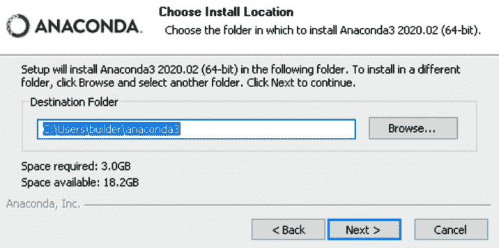

# 第三章：主题的实践介绍

到目前为止，我们已经总体了解了基于**深度学习**（**DL**）方法的**自然语言处理**（**NLP**）的演变。我们也学习了一些有关 Transformer 及其各自架构的基本信息。在本章中，我们将深入研究如何使用 transformer 模型。在本章中，像**双向编码器表示的 Transformer**（**BERT**）这样的分词器和模型将以更加技术性的细节进行描述，并提供实际示例，包括如何加载分词器/模型和使用社区提供的预训练模型。但在使用任何特定模型之前，我们需要了解使用安装 Anaconda 所需的安装步骤以提供必要的环境。在安装步骤中，将涵盖在各种操作系统如 Linux、Windows 和 macOS 上安装库和程序的内容。还会展示**PyTorch**和**TensorFlow**的安装，在**CPU**和**GPU**的两个版本上。还提供了一个**Google Colaboratory**（**Google Colab**）安装 Transformer 库的快速指南。还有一个专门讨论在 PyTorch 和 TensorFlow 框架中使用模型的部分。

HuggingFace 模型存储库也是本章的另一个重要部分，讨论了查找不同模型和使用各种管道的步骤，例如，详细介绍了像**双向自回归 Transformer**（**BART**）、BERT 和**表格解析**（**TAPAS**）这样的模型，以及一瞥**生成式预训练 Transformer 2**（**GPT-2**）文本生成。然而，这只是一个概述，在本章中涉及到的部分是准备环境和使用预训练模型，这里不讨论模型训练，因为这在接下来的章节中被赋予了更重要的意义。

一切就绪，我们已经了解了如何通过社区提供的模型使用`Transformer`库进行推理，接下来介绍`datasets`库。在这里，我们将介绍加载各种数据集、基准测试和使用指标的方法。加载特定数据集并从中获取数据是我们在这里主要关注的领域之一。这里还会考虑跨语言数据集以及如何使用`datasets`库中的本地文件。`datasets`库中的`map`和`filter`函数是模型训练的重要函数，并且在本章中也会被研究。

本章是书中的重要部分，因为这里更详细地介绍了`datasets`库。了解如何使用社区提供的模型并准备好系统以供接下来的内容是非常重要的。

总而言之，本章中我们将涵盖以下主题：

+   使用 Anaconda 安装 Transformer

+   使用语言模型和分词器进行工作

+   使用社区提供的模型进行工作

+   处理基准测试和数据集

+   速度和内存的基准测试

# 技术要求

您需要安装接下来列出的库和软件。虽然拥有最新版本是一个优点，但是强制安装与彼此兼容版本是必须的。有关 HuggingFace Transformer 的最新版本安装的更多信息，请查看它们在[`huggingface.co/transformers/installation.html`](https://huggingface.co/transformers/installation.html)的官方网页：

+   Anaconda

+   Transformer 4.0.0

+   PyTorch 1.1.0

+   TensorFlow 2.4.0

+   数据集 1.4.1

最后，本章中显示的所有代码都可以在本书的 GitHub 存储库 https://github.com/PacktPublishing/Mastering-Transformer/tree/main/CH02 中找到。

点击以下链接查看动态代码演示视频：[`bit.ly/372ek48`](https://bit.ly/372ek48)

# 使用 Anaconda 安装 Transformer

`Transformer`库。但是，也可以在没有 Anaconda 的帮助下安装此库。使用 Anaconda 的主要动机是更容易解释过程并调节使用的软件包。

要开始安装相关库，安装 Anaconda 是必须的一步。Anaconda 文档提供了官方指南，简单介绍了为常见操作系统（macOS，Windows 和 Linux）安装 Anaconda 的步骤。

## Linux 安装

用户可以享受许多 Linux 发行版，但其中**Ubuntu**是偏爱的之一。在本节中，将介绍安装 Anaconda 的步骤。请按以下步骤进行：

1.  从 https://www.anaconda.com/products/individual#Downloads 下载 Linux 版本的 Anaconda 安装程序并转到 Linux 部分，如下截图所示：

    图 2.1 - Linux 的 Anaconda 下载链接

1.  运行`bash`命令来安装它并完成以下步骤：

1.  打开终端并运行以下命令：

    ```py
    bash Terminal./FilePath/For/Anaconda.sh
    ```

1.  按下*Enter*键查看许可协议，如果你不想全部阅读，按*Q*键，然后执行以下操作：

1.  点击**是**同意。

1.  点击`conda`根环境。

1.  在终端中运行`python`命令后，您应该看到 Python 版本信息后出现 Anaconda 提示符。

1.  您可以通过从终端运行`anaconda-navigator`命令来访问 Anaconda Navigator。结果，您将看到 Anaconda **图形用户界面**（**GUI**）开始加载相关模块，如下面的截图所示：


图 2.2 - Anaconda Navigator

让我们继续下一节！

## Windows 安装

下面的步骤描述了如何在 Windows 操作系统上安装 Anaconda：

1.  从 https://www.anaconda.com/products/individual#Downloads 下载安装程序并转到 Windows 部分，如下截图所示：

    图 2.3 – Windows 上的 Anaconda 下载链接

1.  打开安装程序并通过点击**我同意**按钮按照指南进行操作。

1.  选择安装位置，如下截图所示：

    图 2.4 – Windows 上的 Anaconda 安装程序

1.  不要忘记从 Windows shell 或 Windows 命令行检查`python`命令：

    图 2.5 – Windows 上的 Anaconda 安装程序高级选项

1.  按照其余的安装说明进行操作并完成安装。

现在您应该能够从**开始**菜单启动 Anaconda Navigator。

## macOS 上的安装

安装 Anaconda 在 macOS 上必须遵循以下步骤：

1.  从 https://www.anaconda.com/products/individual#Downloads 下载安装程序并转到 macOS 部分，如下截图所示：

    图 2.6 – macOS 上的 Anaconda 下载链接

1.  打开安装程序。

1.  按照说明并点击**安装**按钮在预定义位置安装 macOS，如下截图所示。你可以更改默认目录，但不建议这样做：


图 2.7 – macOS 上的 Anaconda 安装程序

完成安装后，您应该能够访问 Anaconda Navigator。

## 安装 TensorFlow、PyTorch 和 Transformer

安装 TensorFlow 和 PyTorch 作为用于 DL 的两个主要库可以通过`pip`或`conda`本身进行。`conda`提供了一个用于更轻松安装这些库的**命令行界面**（**CLI**）。

为了进行干净的安装并避免中断其他环境，最好为`huggingface`库创建一个`conda`环境。您可以通过运行以下代码来实现：

```py
conda create -n Transformer
```

此命令将创建一个空的环境以安装其他库。一旦创建，我们需要激活它，如下：

```py
conda activate Transformer
```

安装`Transformer`库非常简单，只需运行以下命令：

```py
conda install -c conda-forge tensorflow
conda install -c conda-forge pytorch
conda install -c conda-forge Transformer
```

`conda install`命令中的`-c`参数让 Anaconda 使用额外的渠道来搜索库。

请注意，必须安装 TensorFlow 和 PyTorch，因为`Transformer`库同时使用这两个库。另一个注意事项是，通过 Conda 轻松处理 TensorFlow 的 CPU 和 GPU 版本。如果在`tensorflow`之后简单地放置`–gpu`，它将自动安装 GPU 版本。通过`cuda`库（GPU 版本）安装 PyTorch 时，需要相关库，如`cuda`，但`conda`会自动处理这个，不需要进一步的手动设置或安装。以下屏幕截图显示了`conda`如何自动处理安装 PyTorch GPU 版本，安装相关的`cudatoolkit`和`cudnn`库：


图 2.8 – 使用 Conda 安装 PyTorch 和相关 cuda 库

请注意，所有这些安装也可以在没有`conda`的情况下进行，但使用 Anaconda 的原因是它的易用性。在使用环境或安装 TensorFlow 或 PyTorch 的 GPU 版本方面，Anaconda 像魔术一样工作，是一个很好的时间节省工具。

## 使用 Google Colab 进行安装

即使使用 Anaconda 节省时间且有用，但在大多数情况下，不是每个人都有这样好的和合理的计算资源可用。在这种情况下，Google Colab 是一个很好的替代方案。在 Colab 中安装`Transformer`库的命令如下进行：

```py
!pip install Transformer
```

在语句前加上感叹号会使代码在 Colab shell 中运行，这相当于在终端中而不是使用 Python 解释器运行代码。这将自动安装`Transformer`库。

# 使用语言模型和分词器

在本节中，我们将介绍如何使用`Transformer`库与语言模型及其相关的**分词器**。为了使用任何指定的语言模型，我们首先需要导入它。我们将从谷歌提供的 BERT 模型开始，并使用其预训练版本，如下所示：

```py
>>> from Transformer import BERTTokenizer
>>> tokenizer = \
BERTTokenizer.from_pretrained('BERT-base-uncased')
```

前面代码片段的第一行导入了 BERT 分词器，第二行下载了 BERT 基础版本的预训练分词器。请注意，无大小写版本是使用无大小写字母训练的，因此字母出现在大写或小写中都没有关系。要测试并查看输出，必须运行以下代码行：

```py
>>> text = "Using Transformer is easy!"
>>> tokenizer(text)
```

这将是输出：

```py
{'input_ids': [101, 2478, 19081, 2003, 3733, 999, 102], 'token_type_ids': [0, 0, 0, 0, 0, 0, 0], 'attention_mask': [1, 1, 1, 1, 1, 1, 1]}
```

`input_ids` 显示每个标记的标记 ID，`token_type_ids` 显示每个标记的类型，它们分隔了第一个和第二个序列，如下面的屏幕截图所示：


图 2.9 – BERT 的序列分隔

`attention_mask` 是用于显示变压器模型序列的起始和结束的 0 和 1 的掩码，以防止不必要的计算。每个分词器都有将特殊标记添加到原始序列的自己方式。对于 BERT 分词器，它在序列的开头添加了一个 `[CLS]` 标记，在序列的结尾添加了一个 `[SEP]` 标记，可以通过 101 和 102 观察到。这些数字来自预训练分词器的标记 ID。

分词器可用于基于 PyTorch 和 TensorFlow 的 `Transformer` 模型。为了每个模型都有输出，必须在 `return_tensors` 中使用 `pt` 和 `tf` 关键字。例如，您可以通过简单运行以下命令来使用分词器：

```py
>>> encoded_input = tokenizer(text, return_tensors="pt")
```

`encoded_input` 具有将被 PyTorch 模型使用的标记化文本。为了运行模型，例如 BERT 基础模型，可以使用以下代码从 `huggingface` 模型存储库下载模型：

```py
>>> from Transformer import BERTModel
>>> model = BERTModel.from_pretrained("BERT-base-uncased")
```

分词器的输出可以通过以下代码行传递给已下载的模型：

```py
>>> output = model(**encoded_input)
```

这将以嵌入和交叉注意输出的形式给您模型的输出。

在加载和导入模型时，您可以指定要使用的模型的版本。如果您只需在模型名称前加上 `TF`，`Transformer` 库将加载其 TensorFlow 版本。以下代码显示了如何加载和使用 TensorFlow 版本的 BERT base：

```py
from Transformer import BERTTokenizer, TFBERTModel
tokenizer = \
BERTTokenizer.from_pretrained('BERT-base-uncased')
model = TFBERTModel.from_pretrained("BERT-base-uncased")
text = " Using Transformer is easy!"
encoded_input = tokenizer(text, return_tensors='tf')
output = model(**encoded_input)
```

对于特定任务，如使用语言模型填充掩码，`huggingface` 设计了准备就绪的管道。例如，可以在以下代码片段中看到填充掩码的任务：

```py
>>> from Transformer import pipeline
>>> unmasker = \
pipeline('fill-mask', model='BERT-base-uncased')
>>> unmasker("The man worked as a [MASK].")
```

此代码将生成以下输出，显示分数和可能放置在 `[MASK]` 标记中的标记：

```py
[{'score': 0.09747539460659027,  'sequence': 'the man worked as a carpenter.',  'token': 10533,  'token_str': 'carpenter'}, {'score': 0.052383217960596085,  'sequence': 'the man worked as a waiter.',  'token': 15610,  'token_str': 'waiter'}, {'score': 0.049627091735601425,  'sequence': 'the man worked as a barber.',  'token': 13362,  'token_str': 'barber'}, {'score': 0.03788605332374573,  'sequence': 'the man worked as a mechanic.',  'token': 15893,  'token_str': 'mechanic'}, {'score': 0.03768084570765495,  'sequence': 'the man worked as a salesman.',  'token': 18968,  'token_str': 'salesman'}]
```

要使用 pandas 获取清晰的视图，请运行以下代码：

```py
>>> pd.DataFrame(unmasker("The man worked as a [MASK]."))
```

结果可以在以下截图中看到：


图 2.10 – BERT 填充掩码的输出

到目前为止，我们已经学习了如何加载和使用预训练的 BERT 模型，并了解了分词器的基础知识，以及模型的 PyTorch 和 TensorFlow 版本之间的区别。在下一节中，我们将学习如何使用社区提供的模型，通过加载不同的模型，阅读模型作者提供的相关信息，并使用不同的管道，如文本生成或**问答**（**QA**）管道。

# 使用社区提供的模型

**Hugging Face** 拥有大量由来自大型**人工智能**（**AI**）和**信息技术**（**IT**）公司（如谷歌和 Facebook）的合作者提供的社区模型。还有许多个人和大学提供的有趣模型。访问和使用它们也非常容易。要开始，请访问他们网站上提供的 Transformer 模型目录（https://huggingface.co/models），如下截图所示：


图 2.11 – Hugging Face 模型库

除了这些模型，还有很多好用的数据集可供 NLP 任务使用。要开始使用其中一些模型，你可以通过关键字搜索或只需指定你的主要 NLP 任务和流水线来探索它们。

例如，我们正在寻找一个表格 QA 模型。在找到我们感兴趣的模型之后，从 Hugging Face 网站（[`huggingface.co/google/tapas-base-finetuned-wtq`](https://huggingface.co/google/tapas-base-finetuned-wtq)）会提供类似下面这个页面：


图 2.12 – TAPAS 模型页面

右侧有一个面板，你可以在这里测试这个模型。请注意，这是一个可以回答关于提供给模型的表格的问题的表格 QA 模型。如果你问一个问题，它会用高亮显示的方式来回复你。以下截图展示了它如何获取输入并为特定表格提供答案：


图 2.13 – 使用 TAPAS 进行表格 QA

每个模型都有一个由模型作者提供的页面，也被称为`huggingface`库页面，并查看作者提供的示例（[`huggingface.co/gpt2`](https://huggingface.co/gpt2)），如下截图所示：


图 2.14 – 来自 Hugging Face GPT-2 页面的文本生成代码示例

使用流水线是推荐的，因为所有繁琐的工作都由`Transformer`库处理好了。举个例子，假设你需要一个开箱即用的零-shot 分类器。下面的代码片段展示了实现和使用这样一个预训练模型是多么容易：

```py
>>> from Transformer import pipeline
>>> classifier = pipeline("zero-shot-classification", model="facebook/bart-large-mnli")
>>> sequence_to_classify = "I am going to france."
>>> candidate_labels = ['travel', 'cooking', 'dancing']
>>> classifier(sequence_to_classify, candidate_labels)
```

上述代码将提供以下结果：

```py
{'labels': ['travel', 'dancing', 'cooking'], 'scores': [0.9866883158683777, 0.007197578903287649, 0.006114077754318714], 'sequence': 'I am going to france.'}
```

我们已经完成了安装和`hello-world`应用程序部分。到目前为止，我们介绍了安装过程，完成了环境设置，并体验了第一个 transformer 流水线。接下来，我们将介绍`datasets`库，这将是我们接下来的实验章节中的必备工具。

# 与基准和数据集一起工作

在介绍`datasets`库之前，我们最好先谈谈重要的基准，比如`Transformer`库，我们可以将从一个特定任务学到的内容转移到一个相关任务中，这被称为**迁移学习**（**TL**）。通过在相关问题之间迁移表示，我们能够训练出共享通用语言知识的通用模型，也就是**多任务学习**（**MTL**）。TL 的另一个方面是跨语言传递知识（多语言模型）。

## 重要的基准指标

在这一部分中，我们将介绍被基于 Transformer 的架构广泛使用的重要基准。这些基准专门对 MTL 和多语言以及零-shot 学习做出了很大贡献，包括许多具有挑战性的任务。我们将看看以下基准：

+   **GLUE**

+   **SuperGLUE**

+   **XTREME**

+   **XGLUE**

+   **SQuAD**

为了使用更少的页面，我们只详细介绍 GLUE 基准的任务，所以我们先看看这个基准。

### GLUE 基准

最近的研究指出，多任务训练方法可以比单任务学习获得更好的结果，作为一个特定任务的特定模型。在这个方向上，为了 MTL 引入了 GLUE 基准，这是一个用于评估 MTL 模型在一系列任务上的性能的工具和数据集集合。它提供了一个公共排行榜，用于监控基准测试提交的性能，以及一个总结 11 个任务的单一数字度量标准。该基准包括许多基于现有任务的理解句子任务，这些任务涵盖了各种数据集，包括不同大小、文本类型和难度级别的文本。这些任务按照以下三种类型分类：

+   **单句子任务**

+   **CoLA**：**Corpus of Linguistic Acceptability** 数据集。这个任务由来自语言学理论文章的英语可接受性判断组成。

+   `pos`/`neg` 标签。

+   **相似度和释义任务**

+   **MRPC**：**Microsoft Research Paraphrase Corpus** 数据集。这个任务是看一对句子是否语义上等价。

+   **QQP**：**Quora Question Pairs** 数据集。这个任务决定一对问题是否语义上等价。

+   **STS-B**：**Semantic Textual Similarity Benchmark** 数据集。这个任务是从新闻标题中抽取的句子对集合，其相似性得分在 1 到 5 之间。

+   **推理任务**

+   **MNLI**：**Multi-Genre Natural Language Inference** 语料库。这是一组带有文本蕴涵的句子对。任务是预测文本是否蕴涵假设（蕴涵）、否定假设（否定）或者既不是（中性）。

+   **QNLI**：**Question Natural Language Inference** 数据集。这是 SQuAD 的转换版本。任务是检查一个句子是否包含问题的答案。

+   **RTE**：**Recognizing Textual Entailment** 数据集。这是一个文本蕴涵挑战任务，将来自各种来源的数据结合起来。这个数据集类似于前面的 QNLI 数据集，其中任务是检查第一个文本是否蕴涵第二个文本。

+   **WNLI**：**Winograd Natural Language Inference** 架构挑战。这原本是一个代词解析任务，将一个代词和一个句子中的短语联系起来。GLUE 将问题转换为句子对分类，如下面详细说明。

### SuperGLUE 基准

与 Glue 类似，**SuperGLUE**是一个新的基准测试，具有一组更难的语言理解任务，并提供大约八项语言任务的公共排行榜，借鉴了现有数据，与 GLUE 的类似，都使用单一数字性能指标。其背后的动机是，截至撰写本书，在写作时间，当前的 GLUE 得分（90.8）超过人类表现（87.1）。因此，SuperGLUE 提供了一个更具挑战性和多样化的任务，以实现通用目的的语言理解技术。

你可以在[gluebenchmark.com](http://gluebenchmark.com)上访问 GLUE 和 SuperGLUE 基准测试。

### XTREME 基准测试

近年来，自然语言处理研究人员越来越注重学习通用表示而不是单一任务，可以应用于许多相关任务。构建通用语言模型的另一种方法是使用多语言任务。已经观察到最近的多语言模型，如**多语言 BERT**（**mBERT**）和 XLM-R，预训练了大量的多语言语料库，当将它们转移到其他语言时表现更好。因此，这里的主要优势是跨语言泛化使我们能够通过零样本跨语言传输在资源匮乏的语言中构建成功的自然语言处理应用程序。

在这个方向上，**XTREME**基准测试已经设计好。它目前包括约 40 种属于 12 个语言家族的不同语言，并包括需要在各种句法或语义水平上进行推理的 9 个不同任务。然而，将模型扩展到覆盖超过 7000 种世界语言仍然具有挑战性，并存在语言覆盖和模型能力之间的权衡。有关此事的更多详细信息，请查看以下链接：[`sites.research.google/xtreme`](https://sites.research.google/xtreme)。

### XGLUE 基准测试

**XGLUE**是另一个跨语言基准测试，用于评估和改进**自然语言理解**（**NLU**）和**自然语言生成**（**NLG**）的跨语言预训练模型的性能。它最初由 19 种语言的 11 项任务组成。与 XTREME 的主要区别在于，每项任务的训练数据仅在英语中可用。这迫使语言模型仅从英语文本数据中学习，并将这些知识传递给其他语言，这被称为零样本跨语言传输能力。第二个区别是它同时具有 NLU 和 NLG 任务。有关此事的更多详细信息，请查看以下链接：[`microsoft.github.io/XGLUE/`](https://microsoft.github.io/XGLUE/)。

### SQuAD 基准测试

**SQuAD**是 NLP 领域中广泛使用的 QA 数据集。它提供了一组 QA 对，用于评估 NLP 模型的阅读理解能力。它包含一系列问题、一个阅读段落和由众包工作者在一系列维基百科文章上注释的答案。问题的答案是阅读段落中的一段文本。最初的版本，SQuAD1.1，在数据集收集时没有一个无法回答的选项，因此每个问题都有一个在阅读段落中某处可以找到的答案。即使这看起来不可能，NLP 模型也被强制回答问题。SQuAD2.0 是一个改进版本，其中 NLP 模型不仅在可能时必须回答问题，而且在不可能回答时也必须弃权。SQuAD2.0 包含由众包工作者以与可回答问题相似的方式编写的 50,000 个无法回答的问题。此外，它还有来自 SQuAD1.1 的 100,000 个问题。

## 使用应用程序编程接口访问数据集

`datasets`库通过 Hugging Face hub 为加载、处理和共享数据集提供了非常高效的实用工具。与 TensorFlow 数据集一样，它使直接从原始数据集主机下载、缓存和动态加载集合变得更加容易。该库还提供了与数据一起的评估指标。事实上，hub 不持有或分发数据集。相反，它保留了关于数据集的所有信息，包括所有者、预处理脚本、描述和下载链接。我们需要检查我们是否有权限使用相应许可证下的数据集。要查看其他功能，请查看相应数据集在 GitHub 存储库下的`dataset_infos.json`和`DataSet-Name.py`文件，网址为[`github.com/huggingface/datasets/tree/master/datasets`](https://github.com/huggingface/datasets/tree/master/datasets)。

让我们从安装`dataset`库开始，如下所示：

```py
pip install datasets
```

以下代码自动使用 Hugging Face hub 加载`cola`数据集。`datasets.load_dataset()`函数如果数据尚未缓存，则从实际路径下载加载脚本：

```py
from datasets import load_dataset
cola = load_dataset('glue', 'cola')
cola['train'][25:28]
```

重要提示

数据集的可重用性：当您多次运行代码时，`datasets`库会开始缓存您的加载和操作请求。它首先存储数据集，并开始缓存您在数据集上的操作，例如拆分、选择和排序。您会看到一条警告消息，例如**reusing dataset xtreme (/home/savas/.cache/huggingface/dataset...)**或**loading cached sorted...**。

在前面的示例中，我们从 GLUE 基准测试中下载了`cola`数据集，并从其中的`train`拆分中选择了一些示例。

目前，有 661 个 NLP 数据集和 21 个度量标准用于各种任务，如以下代码片段所示：

```py
from pprint import pprint
from datasets import list_datasets, list_metrics
all_d = list_datasets()
metrics = list_metrics()
print(f"{len(all_d)} datasets and {len(metrics)} metrics exist in the hub\n")
pprint(all_d[:20], compact=True)
pprint(metrics, compact=True)
```

这是输出结果：

```py
661 datasets and 21 metrics exist in the hub.
['acronym_identification', 'ade_corpus_v2', 'adversarial_qa', 'aeslc', 'afrikaans_ner_corpus', 'ag_news', 'ai2_arc', 'air_dialogue', 'ajgt_twitter_ar', 'allegro_reviews', 'allocine', 'alt', 'amazon_polarity', 'amazon_reviews_multi', 'amazon_us_reviews', 'ambig_qa', 'amttl', 'anli', 'app_reviews', 'aqua_rat']
['accuracy', 'BERTscore', 'bleu', 'bleurt', 'comet', 'coval', 'f1', 'gleu', 'glue', 'indic_glue', 'meteor', 'precision', 'recall', 'rouge', 'sacrebleu', 'sari', 'seqeval', 'squad', 'squad_v2', 'wer', 'xnli']
```

数据集可能具有多个配置。例如，作为一个聚合基准的 GLUE 有许多子集，如前面提到的 CoLA、SST-2 和 MRPC。要访问每个 GLUE 基准数据集，我们传递两个参数，第一个是`glue`，第二个是其示例数据集（`cola`或`sst2`）中的特定数据集。同样，维基百科数据集提供了几种语言的几种配置。

数据集带有`DatasetDict`对象，包括多个`Dataset`实例。当使用拆分选择`(split='...')`时，我们会得到`Dataset`实例。例如，`CoLA`数据集带有`DatasetDict`，其中包含三个拆分：*train*、*validation*和*test*。虽然训练和验证数据集包括两个标签（`1`表示可接受，`0`表示不可接受），但测试拆分的标签值为`-1`，表示无标签。

让我们看一下`CoLA`数据集对象的结构，如下所示：

```py
>>> cola = load_dataset('glue', 'cola')
>>> cola
DatasetDict({
train: Dataset({
features: ['sentence', 'label', 'idx'],
        num_rows: 8551 })    
validation: Dataset({
features: ['sentence', 'label', 'idx'],
        num_rows: 1043 })
test: Dataset({
      features: ['sentence', 'label', 'idx'], 
       num_rows: 1063  })
}) 
cola['train'][12]
{'idx': 12, 'label':1,'sentence':'Bill rolled out of the room.'}
>>> cola['validation'][68]
{'idx': 68, 'label': 0, 'sentence': 'Which report that John was incompetent did he submit?'}
>>> cola['test'][20]
{'idx': 20, 'label': -1, 'sentence': 'Has John seen Mary?'}
```

数据集对象具有一些额外的元数据信息，这可能对我们有所帮助：`split`、`description`、`citation`、`homepage`、`license`和`info`。让我们运行以下代码：

```py
>>> print("1#",cola["train"].description)
>>> print("2#",cola["train"].citation)
>>> print("3#",cola["train"].homepage)
1# GLUE, the General Language Understanding Evaluation benchmark(https://gluebenchmark.com/) is a collection of resources for training,evaluating, and analyzing natural language understanding systems.2# @article{warstadt2018neural,  title={Neural Network Acceptability Judgments},  author={Warstadt, Alex and Singh, Amanpreet and Bowman, Samuel R},  journal={arXiv preprint arXiv:1805.12471},  year={2018}}@inproceedings{wang2019glue,  title={{GLUE}: A Multi-Task Benchmark and Analysis Platform for Natural Language Understanding},  author={Wang, Alex and Singh, Amanpreet and Michael, Julian and Hill, Felix and Levy, Omer and Bowman, Samuel R.},  note={In the Proceedings of ICLR.},  year={2019}}3# https://nyu-mll.github.io/CoLA/
```

GLUE 基准提供了许多数据集，如前所述。让我们下载 MRPC 数据集，如下所示：

```py
>>> mrpc = load_dataset('glue', 'mrpc')
```

类似地，要访问其他 GLUE 任务，我们将更改第二个参数，如下所示：

```py
>>> load_dataset('glue', 'XYZ')
```

为了对数据可用性进行合理性检查，运行以下代码片段：

```py
>>> glue=['cola', 'sst2', 'mrpc', 'qqp', 'stsb', 'mnli',
       'mnli_mismatched', 'mnli_matched', 'qnli', 'rte',
       'wnli', 'ax']
>>> for g in glue: 
        _=load_dataset('glue', g)
```

XTREME（使用跨语言数据集）是另一个我们已经讨论过的流行跨语言数据集。让我们从 XTREME 集中选择`MLQA`示例。MLQA 是 XTREME 基准的子集，专为评估跨语言问答模型的性能而设计。它包括约 5,000 个基于 SQuAD 格式的抽取式问答实例，涵盖七种语言，即英语、德语、阿拉伯语、印地语、越南语、西班牙语和简体中文。

例如，`MLQA.en.de`是一个英德问答示例数据集，可以按如下方式加载：

```py
>>> en_de = load_dataset('xtreme', 'MLQA.en.de')
>>> en_de \
DatasetDict({
test: Dataset({features: ['id', 'title', 'context', 'question', 'answers'], num_rows: 4517
}) validation: Dataset({ features: ['id', 'title', 'context', 'question', 'answers'], num_rows: 512})})
```

将其视为 pandas DataFrame 可能更方便，如下所示：

```py
>>> import pandas as pd
>>> pd.DataFrame(en_de['test'][0:4])
```

以下是前述代码的输出：


图 2.15 – 英德跨语言问答数据集

### 使用 datasets 库进行数据操作

数据集带有许多子集的字典，其中`split`参数用于决定要加载哪些子集或子集的哪一部分。如果默认情况下为`none`，它将返回所有子集（`train`、`test`、`validation`或任何其他组合）的数据集字典。如果指定了`split`参数，它将返回单个数据集而不是字典。对于以下示例，我们只检索`cola`数据集的`train`子集：

```py
>>> cola_train = load_dataset('glue', 'cola', split ='train')
```

我们可以得到一个`train`和`validation`子集的混合，如下所示：

```py
>>> cola_sel = load_dataset('glue', 'cola', split = 'train[:300]+validation[-30:]')
```

`split`表达式意味着获取`train`的前 300 个示例和`validation`的最后 30 个示例，结果为`cola_sel`。

我们可以应用不同的组合，如下所示的拆分示例：

+   如下所示是来自 `train` 和 `validation` 的前 100 个示例：

    ```py
    split='train[:100]+validation[:100]'
    ```

+   `train` 的 50%和 `validation` 的最后 30%，如下所示：

    ```py
    split='train[:50%]+validation[-30%:]'
    ```

+   `train` 的前 20%和从 `validation` 的切片 [30:50] 中的示例，如下所示：

    ```py
    split='train[:20%]+validation[30:50]'
    ```

#### 排序、索引和洗牌

以下执行调用 `cola_sel` 对象的 `sort()` 函数。我们看到前 15 个和最后 15 个标签：

```py
>>> cola_sel.sort('label')['label'][:15]
[0, 0, 0, 0, 0, 0, 0, 0, 0, 0, 0, 0, 0, 0, 0]
>>> cola_sel.sort('label')['label'][-15:]
[1, 1, 1, 1, 1, 1, 1, 1, 1, 1, 1, 1, 1, 1, 1]
```

我们已经熟悉 Python 的切片表示法。同样，我们也可以使用类似的切片表示法或索引列表来访问多行，如下所示：

```py
>>> cola_sel[6,19,44]
{'idx': [6, 19, 44], 
'label': [1, 1, 1],
 'sentence':['Fred watered the plants flat.',
  'The professor talked us into a stupor.',  
  'The trolley rumbled through the tunnel.']}
```

我们按以下方式洗牌数据集：

```py
>>> cola_sel.shuffle(seed=42)[2:5]
{'idx': [159, 1022, 46], 
'label': [1, 0, 1], 
'sentence': ['Mary gets depressed if she listens to the Grateful Dead.',
'It was believed to be illegal by them to do that.',  
'The bullets whistled past the house.']}
```

重要提示

种子值：在洗牌时，我们需要传递一个种子值来控制随机性，实现作者和读者之间的一致输出。

#### 缓存和可重用性

使用缓存文件可以通过内存映射（如果数据集适合驱动器）使用快速后端加载大型数据集。这种智能缓存有助于保存和重用在驱动器上执行的操作结果。要查看关于数据集的缓存日志，运行以下代码：

```py
>>> cola_sel.cache_files
[{'filename': '/home/savas/.cache/huggingface...,'skip': 0,  'take': 300}, {'filename': '/home/savas/.cache/huggingface...','skip': 1013,  'take': 30}]
```

#### 数据集过滤和映射函数

我们可能想要处理数据集的特定选择。例如，我们可以仅检索具有 `cola` 数据集中包含术语 `kick` 的句子，如下面的执行所示。`datasets.Dataset.filter()` 函数返回包含 `kick` 的句子，其中应用了匿名函数和 `lambda` 关键字：

```py
>>> cola_sel = load_dataset('glue', 'cola', split='train[:100%]+validation[-30%:]')
>>> cola_sel.filter(lambda s: "kick" in s['sentence'])["sentence"][:3]
['Jill kicked the ball from home plate to third base.', 'Fred kicked the ball under the porch.', 'Fred kicked the ball behind the tree.']
```

以下过滤用于从集中获取正面（可接受的）示例：

```py
>>> cola_sel.filter(lambda s: s['label']== 1 )["sentence"][:3]
["Our friends won't buy this analysis, let alone the next one we propose.", 
"One more pseudo generalization and I'm giving up.", 
"One more pseudo generalization or I'm giving up."]
```

在某些情况下，我们可能不知道类标签的整数代码。假设我们有许多类，而 `culture` 类的代码难以记住在 10 个类中。我们可以在我们之前的示例中传递一个 `acceptable` 标签给 `str2int()` 函数，代替在我们之前的示例中给出整数代码 `1`，即 `acceptable` 的代码，如下所示：

```py
>>> cola_sel.filter(lambda s: s['label']== cola_sel.features['label'].str2int('acceptable'))["sentence"][:3]
```

这产生与之前执行相同的输出。

#### 用映射函数处理数据

`datasets.Dataset.map()` 函数在数据集上迭代，对集合中的每个示例应用处理函数，并修改示例的内容。以下执行显示添加一个新的 `'len'` 特征，表示句子的长度：

```py
>>> cola_new=cola_sel.map(lambda e:{'len': len(e['sentence'])})
>>> pd.DataFrame(cola_new[0:3])
```

这是前面代码片段的输出：


图 2.16 – 带有附加列的 Cola 数据集

作为另一个示例，以下代码片段在 20 个字符后剪切句子。我们不创建新特征，而是更新句子特性的内容，如下所示：

```py
>>> cola_cut=cola_new.map(lambda e: {'sentence': e['sentence'][:20]+ '_'})
```

输出如下所示：


图 2.17 – 带有更新的 Cola 数据集

#### 使用本地文件工作

要从本地文件加载数据集（在`csv`、`text`或`json`中），以及加载脚本`load_dataset()`到通用加载脚本。如下代码片段所示，在`../data/`文件夹中，有三个 CSV 文件（`a.csv`、`b.csv`和`c.csv`），这些文件是从 SST-2 数据集中随机选择的玩具示例。我们可以加载单个文件，如`data1`对象所示，合并多个文件，如`data2`对象所示，或进行数据集分割，如`data3`所示：

```py
from datasets import load_dataset
data1 = load_dataset('csv', data_files='../data/a.csv', delimiter="\t")
data2 = load_dataset('csv', data_files=['../data/a.csv','../data/b.csv', '../data/c.csv'], delimiter="\t")
data3 = load_dataset('csv', data_files={'train':['../data/a.csv','../data/b.csv'], 'test':['../data/c.csv']}, delimiter="\t")
```

为了以其他格式获取文件，我们传递`json`或`text`而不是`csv`，如下所示：

```py
>>> data_json = load_dataset('json', data_files='a.json')
>>> data_text = load_dataset('text', data_files='a.txt')
```

到目前为止，我们已经讨论了如何加载、处理和操作数据集，这些数据集要么已经托管在 Hub 上，要么在我们的本地驱动器上。现在，我们将研究如何为 Transformer 模型训练准备数据集。

#### 准备数据集以进行模型训练

让我们从标记化过程开始吧。每个模型都有自己的标记化模型，在实际的语言模型之前进行了训练。我们将在下一章节详细讨论这个问题。为了使用标记器，我们应该已经安装了`Transformer`库。下面的示例从预训练的`distilBERT-base-uncased`模型加载了标记器模型。我们使用`map`和带有`lambda`的匿名函数将标记器应用于`data3`中的每个拆分。如果在`map`函数中选择了`batched`为`True`，它会将一批例子传递给`tokenizer`函数。`batch_size`值默认为`1000`，这是传递给函数的每批例子的数量。如果没有选择，则整个数据集作为单个批次传递。代码可以在这里看到：

```py
from Transformer import DistilBERTTokenizer
tokenizer = \ DistilBERTTokenizer.from_pretrained('distilBERT-base-uncased')
encoded_data3 = data3.map(lambda e: tokenizer( e['sentence'], padding=True, truncation=True, max_length=12), batched=True, batch_size=1000)
```

如下输出所示，我们看到了`data3`和`encoded_data3`之间的区别，这里添加了两个额外特征——`attention_mask`和`input_ids`——并相应地添加到了数据集中。我们已经在本章的前面部分介绍了这两个特征。简而言之，`input_ids`是与句子中每个标记对应的索引。这些特征是 Transformer 的`Trainer`类需要的特征，我们将在接下来的微调章节中讨论。

我们通常一次传递多个句子（称为`max_length`参数，在这个玩具示例中为`12`）。我们还截断较长的句子以符合最大长度。代码可以在下面的代码片段中看到：

```py
>>> data3
DatasetDict({    
train: Dataset({
   features: ['sentence','label'], num_rows: 199 })    
test: Dataset({
   features: ['sentence','label'], num_rows: 100 })})
>>> encoded_data3
DatasetDict({    
train: Dataset({
  features: ['attention_mask', 'input_ids', 'label',   'sentence'],
   num_rows: 199 })
test: Dataset({
features: ['attention_mask', 'input_ids', 'label', 'sentence'],
 num_rows: 100 })})
>>> pprint(encoded_data3['test'][12])
{'attention_mask': [1, 1, 1, 1, 1, 1, 1, 0, 0, 0, 0, 0], 'input_ids': [101, 2019, 5186, 16010, 2143, 1012, 102, 0, 0, 0, 0, 0], 'label': 0, 'sentence': 'an extremely unpleasant film . '}
```

我们已经完成了`datasets`库的使用。到目前为止，我们已经评估了数据集的所有方面。我们涵盖了类似于 GLUE 的基准测试，在这里，我们考虑了分类指标。在接下来的部分中，我们将专注于如何对速度和内存的计算性能进行基准测试，而不是分类。

# 速度和内存基准测试

仅仅比较大型模型在特定任务或基准上的分类性能已经不再足够。现在，我们必须关注特定环境对于特定模型的计算成本（`Transformer`库，`PyTorchBenchmark`和`TensorFlowBenchmark`使得可以为 TensorFlow 和 PyTorch 的模型进行基准测试。

在我们开始实验之前，我们需要检查我们的 GPU 能力，采用以下执行：

```py
>>> import torch
>>> print(f"The GPU total memory is {torch.cuda.get_device_properties(0).total_memory /(1024**3)} GB")
The GPU total memory is 2.94921875 GB
```

输出是从 NVIDIA GeForce GTX 1050 (3 `Transformer`库当前仅支持单设备基准测试。当我们在 GPU 上进行基准测试时，我们需要指示 Python 代码将在哪个 GPU 设备上运行，这是通过设置`CUDA_VISIBLE_DEVICES`环境变量来完成的。例如，`export CUDA_VISIBLE_DEVICES=0`。 `0`表示将使用第一个`cuda`设备。

在接下来的代码示例中，我们探索了两个网格。我们比较了四个随机选择的预训练 BERT 模型，如`models`数组中所列。要观察的第二个参数是`sequence_lengths`。我们将批量大小保持为`4`。如果您有更好的 GPU 容量，可以将批量值扩展到 4-64 的范围以及其他参数的搜索空间：

```py
from Transformer import PyTorchBenchmark, PyTorchBenchmarkArguments
models= ["BERT-base-uncased","distilBERT-base-uncased","distilroBERTa-base", "distilBERT-base-german-cased"]
batch_sizes=[4]
sequence_lengths=[32,64, 128, 256,512]
args = PyTorchBenchmarkArguments(models=models, batch_sizes=batch_sizes, sequence_lengths=sequence_lengths, multi_process=False)
benchmark = PyTorchBenchmark(args)
```

重要注意事项

TensorFlow 的基准测试：本部分的代码示例是用于 PyTorch 基准测试的。对于 TensorFlow 的基准测试，我们简单地使用`TensorFlowBenchmarkArguments`和`TensorFlowBenchmark`相应的类。

我们已准备通过运行以下代码进行基准测试实验：

```py
>>> results = benchmark.run() 
```

这可能会花费一些时间，这取决于您的 CPU/GPU 容量和参数选择。如果遇到内存不足的问题，您应该采取以下措施来解决问题：

+   重新启动您的内核或操作系统。

+   在开始之前删除内存中所有不必要的对象。

+   设置较低的批处理大小，例如 2，甚至 1。

以下输出显示了推理速度性能。由于我们的搜索空间有四种不同的模型和五种不同的序列长度，我们在结果中看到了 20 行：


图 2.18 – 推理速度性能

同样，我们将看到 20 种不同情景的推理内存使用情况，如下所示：


图 2.19 – 推理内存使用情况

为了观察跨参数的内存使用情况，我们将使用存储统计数据的`results`对象进行绘制。以下执行将绘制模型和序列长度的推理时间性能：

```py
import matplotlib.pyplot as plt
plt.figure(figsize=(8,8))
t=sequence_lengths
models_perf=[list(results.time_inference_result[m]['result'][batch_sizes[0]].values()) for m in models]
plt.xlabel('Seq Length')
plt.ylabel('Time in Second')
plt.title('Inference Speed Result')
plt.plot(t, models_perf[0], 'rs--', t, models_perf[1], 'g--.', t, models_perf[2], 'b--^', t, models_perf[3], 'c--o')
plt.legend(models) 
plt.show()
```

如下截图所示，两个 DistillBERT 模型表现出近似的结果，并且比其他两个模型表现更好。`BERT-based-uncased`模型在特别是序列长度增加时表现不佳：


图 2.20 – 推理速度结果

要绘制内存性能，请使用`results`对象的`memory_inference_result`结果，而不是前述代码中显示的`time_inference_result`。

欲了解更多有趣的基准测试示例，请查看以下链接：

+   [`huggingface.co/transformers/benchmarks.html`](https://huggingface.co/transformers/benchmarks.html)

+   [`github.com/huggingface/transformers/tree/master/notebooks`](https://github.com/huggingface/transformers/tree/master/notebooks)

现在我们完成了本节，成功地完成了本章。恭喜您完成安装，运行第一个`hello-world`变换器程序，使用`datasets`库并进行基准测试！

# 总结

在本章中，我们涵盖了各种入门主题，并且也亲手操作了`hello-world`变换器应用程序。另一方面，这一章在将迄今所学应用于即将到来的章节方面起着关键作用。那么，到目前为止学到了什么呢？我们迈出了第一小步，设置了环境和系统安装。在这个背景下，`anaconda`软件包管理器帮助我们安装了主要操作系统所需的模块。我们还介绍了语言模型、社区提供的模型和分词过程。此外，我们介绍了多任务（GLUE）和跨语言基准测试（XTREME），这使得这些语言模型变得更强大和更准确。我们介绍了`datasets`库，该库为社区提供的 NLP 数据集提供了高效的访问方式。最后，我们学会了如何评估特定模型在内存使用和速度方面的计算成本。变换器框架使得可以为 TensorFlow 和 PyTorch 的模型进行基准测试。

本节中使用的模型已由社区预先训练并与我们共享。现在，轮到我们训练语言模型并将其传播给社区了。

在下一章中，我们将学习如何训练 BERT 语言模型以及分词器，并了解如何与社区共享它们。
