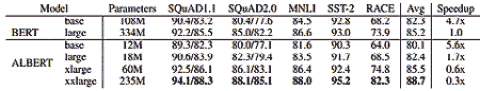

# 自动编码语言模型

在上一章中，我们查看并研究了如何使用 HuggingFace 的 Transformers 的典型 Transformer 模型。到目前为止，所有主题都包括如何使用预定义或预构建模型，而对于特定模型及其训练的信息较少。

在本章中，我们将了解如何从头开始在任何给定语言上训练自动编码语言模型。这种训练将包括模型的预训练和任务特定训练。首先，我们将从 BERT 模型的基本知识和其工作原理开始。然后，我们将使用一个简单且小型的语料库来训练语言模型。之后，我们将看看如何将该模型用于任何 Keras 模型内。

为了了解本章将学到的内容，我们将讨论以下主题：

+   BERT——其中之一自动编码语言模型

+   任何语言的自动编码语言模型训练

+   与社区共享模型

+   了解其他自动编码模型

+   使用标记化算法工作

# 技术要求

本章的技术要求如下：

+   Anaconda

+   Transformers >= 4.0.0

+   PyTorch >= 1.0.2

+   TensorFlow >= 2.4.0

+   数据集 >= 1.4.1

+   标记器

请还要检查`第三章`对应的 GitHub 代码：

[`github.com/PacktPublishing/Advanced-Natural-Language-Processing-with-Transformers/tree/main/CH03`](https://github.com/PacktPublishing/Advanced-Natural-Language-Processing-with-Transformers/tree/main/CH03).

查看以下链接以查看代码实战视频：[`bit.ly/3i1ycdY`](https://bit.ly/3i1ycdY)

# BERT——其中之一自动编码语言模型

**来自变换器的双向编码器表示**，也被称为**BERT**，是最早使用编码器 Transformer 堆栈的自动编码语言模型之一，稍作修改用于语言建模。

BERT 架构是基于 Transformer 原始实现的多层 Transformer 编码器。Transformer 模型本身最初用于机器翻译任务，但 BERT 所做的主要改进是利用该体系结构的这一部分来提供更好的语言建模。这种语言模型在预训练之后，能够提供对其训练语言的全局理解。

## BERT 语言模型预训练任务

要清楚了解 BERT 所使用的遮罩语言建模，让我们更详细地定义它。**遮罩语言建模**是训练模型的任务，输入是一句话，其中有一些遮罩标记，输出是填满遮罩标记的完整句子。但是这样做为什么能帮助模型在分类等下游任务中获得更好的结果呢？答案很简单：如果模型能够完成完形填空测试（一种通过填写空白来评估语言理解能力的语言测试），那么它就对语言本身有了一般的理解。对于其他任务，它已经进行了预训练（通过语言建模），并且将表现更好。

这是一道完形填空的例子：

乔治·华盛顿是 ___ 州的第一任总统。

预期 *United* 应该填入空白处。对于遮罩语言模型，应用了同样的任务，需要填补遮罩标记。不过，遮罩标记是从一句话中随机选择的。

BERT 受训的另一个任务是**下一句预测**（**NSP**）。这个预训练任务确保 BERT 不仅学习了预测遮罩标记中所有令牌之间的关系，还帮助其理解两个句子之间的关系。会选择一对句子，并在它们之间放上一个*[SEP]* 分隔符令牌。数据集中还知道第二个句子是在第一个句子之后还是之前。

以下是 NSP 的示例：

*读者需要填写空白。比特币价格相比其他替代币高得太多了。*

在这个例子中，模型需要预测为否定（这两个句子之间没有关联）。

这两种预训练任务使 BERT 能够对语言本身有所了解。BERT 令牌嵌入为每个令牌提供上下文嵌入。**上下文嵌入**意味着每个令牌的嵌入与周围令牌完全相关。与 Word2Vec 和其他模型不同，BERT 为每个令牌嵌入提供更好的信息。另一方面，NSP 任务使 BERT 能够为*[CLS]* 令牌提供更好的嵌入。正如在第一章中讨论的那样，此令牌提供关于整个输入的信息。*[CLS]* 用于分类任务，并且在预训练部分学习整个输入的总体嵌入。下图显示了 BERT 模型的整体外观。*图 3.1* 显示了 BERT 模型的相应输入和输出：


图 3.1 – BERT 模型

让我们继续下一部分！

## 深入了解 BERT 语言模型

标记器是许多 NLP 应用程序中各自流水线中最重要的部分之一。 对于 BERT，使用的是 WordPiece 标记。 通常，**WordPiece**，**SentencePiece**和**BytePairEncoding**（**BPE**）是最广为人知的三种标记器，由不同的基于 Transformer 的架构使用，也将在接下来的部分中介绍。 BERT 或任何其他基于 Transformer 的架构使用子词标记化的主要原因是这些标记器处理未知标记的能力。

BERT 还使用位置编码来确保将标记的位置提供给模型。如果您还记得*章节 1*，*从词袋模型到 Transformer*，BERT 和类似的模型使用非顺序操作，如密集神经层。 传统模型，如基于 LSTM 和 RNN 的模型，通过序列中标记的顺序获得位置。 为了为 BERT 提供这些额外信息，位置编码非常有用。

BERT 的预训练（如自动编码模型）为模型提供了语言信息，但在实践中，当处理不同的问题，如序列分类，标记分类或问题回答时，会使用模型输出的不同部分。

例如，在序列分类任务（如情感分析或句子分类）的情况下，原始 BERT 文章提出了必须使用最后一层的*[CLS]*嵌入。然而，还有其他研究使用 BERT 进行分类，使用不同的技术（使用所有标记的平均标记嵌入，在最后一层部署 LSTM，甚至在最后一层之上使用 CNN）。 序列分类的最后一个*[CLS]*嵌入可以被任何分类器使用，但提出的，也是最常见的方法是使用具有输入大小等于最终标记嵌入大小和输出大小等于类数量的 softmax 激活函数的密集层。 当输出可能是多标签并且问题本身是多标签分类问题时，使用 sigmoid 也是另一种选择。

为了给您更详细的关于 BERT 如何实际工作的信息，以下说明显示了一个 NSP 任务的示例。请注意，这里对标记化进行了简化，以便更好地理解：


图 3.2 - 用于 NSP 任务的 BERT 示例

BERT 模型有不同的变体，具有不同的设置。例如，输入大小是可变的。在前面的示例中，它被设置为*512*，而模型可以接受的最大序列大小是*512*。但是，这个大小包括特殊标记*[CLS]*和*[SEP]*，因此它会被缩减为*510*。另一方面，使用 WordPiece 作为标记器会产生子词标记，作为序列输入之前可以有较少的词，标记化之后，大小会增加，因为标记器会将词分解为子词，如果在预训练语料库中没有看到它们常见。

以下图显示了 BERT 用于不同任务的示例。对于 NER 任务，使用每个令牌的输出，而不是*[CLS]*。在问答情景中，使用*[SEP]*分隔符令牌将问题和答案连接起来，然后使用最后一层的*Start/End*和*Span*输出标记答案。在这种情况下，*Paragraph*是*Question*所询问的*Context*：


图 3.3 – 用于各种 NLP 任务的 BERT 模型

不管这些任务如何，BERT 最重要的能力是对文本的上下文表示。它成功的原因在于 Transformer 编码器架构，它以密集向量的形式表示输入。这些向量可以通过非常简单的分类器轻松转换为输出。

到目前为止，您已经了解了 BERT 以及它的工作原理。您已经详细了解了 BERT 可以用于的各种任务的重要信息以及这种架构的重要要点。

在下一节中，您将学习如何预先训练 BERT，并在训练后使用它。

# 任何语言的自编码语言模型训练

我们已经讨论了 BERT 的工作原理以及可以使用 HuggingFace 库提供的预训练版本。在本节中，您将学习如何使用 HuggingFace 库来训练您自己的 BERT。

在开始之前，有一个很重要的问题，那就是需要有良好的训练数据，这将用于语言建模。这些数据称为**语料库**，通常是一大堆数据（有时经过预处理和清理）。这些无标签的语料库必须适合您希望训练语言模型的用例；例如，如果您尝试为英语单独创建一个特殊的 BERT。尽管有成千上万的巨大优秀数据集，比如 Common Crawl（[`commoncrawl.org/`](https://commoncrawl.org/)），我们更倾向于一个小一点的数据集，以便更快地训练。

50K 电影评论的 IMDB 数据集（可在[`www.kaggle.com/lakshmi25npathi/imdb-dataset-of-50k-movie-reviews`](https://www.kaggle.com/lakshmi25npathi/imdb-dataset-of-50k-movie-reviews)找到）是一个用于情感分析的大型数据集，但如果您将其用作语料库来训练语言模型，则算是小型的：

1.  你可以使用以下代码轻松下载并保存为`.txt`格式，用于语言模型和分词器训练：

    ```py
    import pandas as pd
    imdb_df = pd.read_csv("IMDB Dataset.csv")
    reviews = imdb_df.review.to_string(index=None)
    with open("corpus.txt", "w") as f:
          f.writelines(reviews)
    ```

1.  在准备语料库之后，必须训练分词器。`tokenizers`库提供了快速简单的 WordPiece 分词器训练。为了在你的语料库上训练它，需要运行以下代码：

    ```py
    >>> from tokenizers import BertWordPieceTokenizer
    >>> bert_wordpiece_tokenizer =BertWordPieceTokenizer()
    >>> bert_wordpiece_tokenizer.train("corpus.txt")
    ```

1.  这将训练分词器。你可以通过使用训练好的`tokenizer`对象的`get_vocab()`函数来访问训练好的词汇表。你可以通过以下代码获取词汇表：

    ```py
    >>> bert_wordpiece_tokenizer.get_vocab()
    ```

    以下是输出：

    ```py
    {'almod': 9111, 'events': 3710, 'bogart': 7647, 'slapstick': 9541, 'terrorist': 16811, 'patter': 9269, '183': 16482, '##cul': 14292, 'sophie': 13109, 'thinki': 10265, 'tarnish': 16310, '##outh': 14729, 'peckinpah': 17156, 'gw': 6157, '##cat': 14290, '##eing': 14256, 'successfully': 12747, 'roomm': 7363, 'stalwart': 13347,...}
    ```

1.  保存分词器以供以后使用是必不可少的。使用对象的`save_model()`函数并提供目录将保存分词器词汇表供以后使用：

    ```py
    >>> bert_wordpiece_tokenizer.save_model("tokenizer")
    ```

1.  你可以使用`from_file()`函数重新加载它：

    ```py
    >>> tokenizer = \ BertWordPieceTokenizer.from_file("tokenizer/vocab.txt")
    ```

1.  你可以按照以下示例使用分词器：

    ```py
    >>> tokenized_sentence = \
    tokenizer.encode("Oh it works just fine")
    >>> tokenized_sentence.tokens
    ['[CLS]', 'oh', 'it', 'works', 'just', 'fine','[SEP]']
    ```

    特殊的标记`[CLS]`和`[SEP]`将自动添加到标记列表中，因为 BERT 需要它们来处理输入。

1.  让我们尝试使用我们的分词器来另一个句子：

    ```py
    >>> tokenized_sentence = \
    tokenizer.encode("ohoh i thougt it might be workingg well")
    ['[CLS]', 'oh', '##o', '##h', 'i', 'thoug', '##t', 'it', 'might', 'be', 'working', '##g', 'well', '[SEP]']
    ```

1.  对于嘈杂和拼写错误的文本，似乎是一个很好的分词器。现在你已经准备好并保存了你的分词器，你可以训练你自己的 BERT。第一步是使用`Transformers`库中的`BertTokenizerFast`。你需要使用以下命令加载上一步训练好的分词器：

    ```py
    >>> from Transformers import BertTokenizerFast
    >>> tokenizer = \ BertTokenizerFast.from_pretrained("tokenizer")
    ```

    我们使用了`BertTokenizerFast`，因为它是由 HuggingFace 文档建议使用的。还有`BertTokenizer`，根据库文档中的定义，它没有实现快速版本那么快。在大多数预训练模型的文档和卡片中，强烈建议使用`BertTokenizerFast`版本。

1.  下一步是通过以下命令准备语料库以加快训练速度：

    ```py
    >>> from Transformers import LineByLineTextDataset
    >>> dataset = \ 
    LineByLineTextDataset(tokenizer=tokenizer,
                          file_path="corpus.txt", 
                          block_size=128)
    ```

1.  并且需要为掩码语言建模提供数据收集器：

    ```py
    >>> from Transformers import DataCollatorForLanguageModeling
    >>> data_collator = DataCollatorForLanguageModeling(
                          tokenizer=tokenizer, 
                          mlm=True, 
                          mlm_probability=0.15)
    ```

    数据收集器获取数据并为训练准备好。例如，上面的数据收集器获取数据并准备好使用概率为`0.15`的掩码语言建模。使用这种机制的目的是在运行时进行预处理，这样可以使用更少的资源。另一方面，它会减慢训练过程，因为每个样本都必须在训练时动态进行预处理。

1.  训练参数还为训练器在训练阶段提供信息，可以使用以下命令设置：

    ```py
    >>> from Transformers import TrainingArguments
    >>> training_args = TrainingArguments(
                          output_dir="BERT",
                          overwrite_output_dir=True,
                          num_train_epochs=1,
                          per_device_train_batch_size=128)
    ```

1.  现在我们将创建 BERT 模型本身，我们将使用默认配置（注意力头数、Transformer 编码器层数等）：

    ```py
    >>> from Transformers import BertConfig, BertForMaskedLM
    >>> bert = BertForMaskedLM(BertConfig())
    ```

1.  最后一步是创建一个训练器对象：

    ```py
    >>> from Transformers import Trainer
    >>> trainer = Trainer(model=bert, 
                          args=training_args,
                          data_collator=data_collator,
                          train_dataset=dataset)
    ```

1.  最后，你可以使用以下命令训练你的语言模型：

    ```py
    >>> trainer.train()
    ```

    它会显示一个进度条，指示训练的进度：

    

    图 3.4 - BERT 模型训练进度

    在模型训练过程中，将使用名为`runs`的日志目录存储步骤检查点：

    

    图 3.5 – BERT 模型检查点

1.  训练结束后，您可以使用以下命令轻松保存模型：

    ```py
    >>> trainer.save_model("MyBERT")
    ```

    直到目前为止，您已经学会了如何训练您希望的任何特定语言的 BERT。您已经学会了如何训练标记器和 BERT 模型，使用您准备的语料库。

1.  您提供的 BERT 默认配置是此训练过程中最关键的部分，它定义了 BERT 的架构和超参数。您可以使用以下代码查看这些参数：

    ```py
    >>> from Transformers import BertConfig
    >>> BertConfig()
    ```

    输出如下：

    

    图 3.6 – BERT 模型配置

    如果您希望复制`max_position_embedding`、`num_attention_heads`、`num_hidden_layers`、`intermediate_size`和`hidden_size`，直接影响训练时间。将它们增加会显著增加大型语料库的训练时间。

1.  例如，您可以使用以下代码轻松为小型 BERT 制作新配置以加快训练速度：

    ```py
    >>> tiny_bert_config = \ BertConfig(max_position_embeddings=512, hidden_size=128, 
               num_attention_heads=2, 
               num_hidden_layers=2, 
               intermediate_size=512)
    >>> tiny_bert_config
    ```

    以下是代码的结果：

    

    图 3.8 – 小型 BERT 模型配置

1.  使用相同的方法，我们可以使用这个配置制作一个微小的 BERT 模型：

    ```py
    >>> tiny_bert = BertForMaskedLM(tiny_bert_config)
    ```

1.  并且使用相同的参数进行训练，您可以训练这个微小的新 BERT：

    ```py
    >>> trainer = Trainer(model=tiny_bert, args=training_args,
                         data_collator=data_collator,
                         train_dataset=dataset)
    >>> trainer.train()
    ```

    输出如下：

    

    图 3.9 – 小型 BERT 模型配置

    显然，训练时间显著减少，但您应该意识到这是一个具有更少层和参数的微小版 BERT，不如 BERT Base 好。

    到目前为止，您已经学会了如何从头开始训练自己的模型，但需要注意的是在处理用于训练语言模型的数据集或利用它执行特定任务的数据集时，使用`datasets`库是更好的选择。

1.  BERT 语言模型也可以作为嵌入层与任何深度学习模型结合使用。例如，您可以加载任何预训练的 BERT 模型或您在上一步中训练过的自己的版本。以下代码显示了如何加载它以在 Keras 模型中使用：

    ```py
    >>>  from Transformers import\
    TFBertModel, BertTokenizerFast
    >>>  bert = TFBertModel.from_pretrained(
    "bert-base-uncased")
    >>> tokenizer = BertTokenizerFast.from_pretrained(
    "bert-base-uncased")
    ```

1.  但您不需要整个模型；相反，您可以使用以下代码访问层：

    ```py
    >>> bert.layers
    [<Transformers.models.bert.modeling_tf_bert.TFBertMainLayer at 0x7f72459b1110>]
    ```

1.  如您所见，只有一个来自`TFBertMainLayer`的单层，您可以在 Keras 模型中访问它。但在使用之前，最好先测试它，看看它提供了什么样的输出：

    ```py
    >>> tokenized_text = tokenizer.batch_encode_plus(
                       ["hello how is it going with you",
                       "lets test it"], 
                        return_tensors="tf", 
                        max_length=256, 
                        truncation=True, 
                        pad_to_max_length=True)
    >>> bert(tokenized_text)
    ```

    输出如下：

    

    图 3.10 – BERT 模型输出

    如结果所示，有两个输出：一个是最后的隐藏状态，一个是 pooler 输出。最后的隐藏状态提供了来自 BERT 的所有标记嵌入，同时在开头和结尾分别加上了*[CLS]*和*[SEP]*标记。

1.  现在你已经了解了 TensorFlow 版本的 BERT 更多信息，你可以使用这个新的嵌入创建一个 keras 模型：

    ```py
    from tensorflow import keras
    import tensorflow as tf
    max_length = 256
    tokens = keras.layers.Input(shape=(max_length,),
                               dtype=tf.dtypes.int32)
    masks = keras.layers.Input(shape=(max_length,),
                              dtype=tf.dtypes.int32)
    embedding_layer = bert.layers0[0][:,0,:]
    dense = tf.keras.layers.Dense(units=2, 
            activation="softmax")(embedding_layer)
    model = keras.Model([tokens,masks],dense)
    ```

1.  模型对象，即一个 Keras 模型，有两个输入：一个用于标记，一个用于掩码。标记具有来自分词器输出的`token_ids`，掩码将具有`attention_mask`。让我们试一试，看会发生什么：

    ```py
    >>> tokenized = tokenizer.batch_encode_plus(
    ["hello how is it going with you",
    "hello how is it going with you"], 
    return_tensors="tf", 
    max_length= max_length, 
    truncation=True, 
    pad_to_max_length=True)
    ```

1.  使用`tokenizer`时重要的是使用`max_length`、`truncation`和`pad_to_max_length`这些参数。这些参数确保你通过将其填充到之前定义的 256 的最大长度来获得可用形状的输出。现在你可以使用这个样本运行模型了：

    ```py
    >>>model([tokenized["input_ids"],tokenized["attention_mask"]])
    ```

    以下是输出结果：

    

    图 3.11 – BERT 模型分类输出

1.  当训练模型时，你需要使用`compile`函数进行编译：

    ```py
    >>> model.compile(optimizer="Adam",
    loss="categorical_crossentropy", 
    metrics=["accuracy"])
    >>> model.summary()
    ```

    输出如下：

    

    图 3.12 – BERT 模型摘要

1.  从模型摘要中，你可以看到模型有 109,483,778 个可训练参数，包括 BERT。但如果你有预训练好的 BERT 模型，并且想要在特定任务的训练中冻结它，你可以使用以下命令：

    ```py
    >>> model.layers[2].trainable = False
    ```

    据我们所知，嵌入层的层索引为 2，因此我们可以简单地冻结它。如果你重新运行 summary 函数，你会看到可训练参数减少到了 1,538，这是最后一层的参数个数：

    

    图 3.13 – BERT 模型摘要，包括较少的可训练参数

1.  如你所记得的，我们使用了 IMDB 情感分析数据集来训练语言模型。现在你可以用它来训练基于 Keras 的情感分析模型。但首先，你需要准备输入和输出：

    ```py
    import pandas as pd
    imdb_df = pd.read_csv("IMDB Dataset.csv")
    reviews = list(imdb_df.review)
    tokenized_reviews = \
    tokenizer.batch_encode_plus(reviews, return_tensors="tf",
                               max_length=max_length,
                               truncation=True,
                               pad_to_max_length=True)
    import numpy as np
    train_split = int(0.8 * \ len(tokenized_reviews["attention_mask"]))
    train_tokens = tokenized_reviews["input_ids"]\
    [:train_split]
    test_tokens = tokenized_reviews["input_ids"][train_split:]
    train_masks = tokenized_reviews["attention_mask"]\
    [:train_split]
    test_masks = tokenized_reviews["attention_mask"]\
    [train_split:]
    sentiments = list(imdb_df.sentiment)
    labels = np.array([[0,1] if sentiment == "positive" else\
    [1,0] for sentiment in sentiments])
    train_labels = labels[:train_split]
    test_labels = labels[train_split:]
    ```

1.  最后，你的数据准备好了，你可以拟合你的模型：

    ```py
    >>> model.fit([train_tokens,train_masks],train_labels, 
                 epochs=5)
    ```

在拟合模型之后，你的模型就准备好使用了。到目前为止，你已经学会了如何对分类任务进行模型训练。你已经学会了如何保存它，在下一节中，你将学会如何与社区分享训练好的模型。

# 与社区共享模型

HuggingFace 提供了一个非常方便的模型共享机制：

1.  你可以简单地使用以下`cli`工具进行登录：

    ```py
    Transformers-cli login
    ```

1.  使用你自己的凭据登录后，你可以创建一个仓库：

    ```py
    Transformers-cli repo create a-fancy-model-name
    ```

1.  你可以为`a-fancy-model-name`参数随意取任何模型名称，然后确保你安装了 git-lfs 是非常重要的：

    ```py
    git lfs install
    ```

    Git LFS 是一个用于处理大文件的 Git 扩展。HuggingFace 预训练模型通常是大文件，需要额外的库（如 LFS）来处理 Git。

1.  然后，你可以克隆你刚刚创建的仓库：

    ```py
    git clone https://huggingface.co/username/a-fancy-model-name
    ```

1.  随后，您可以随意向仓库中添加和删除，然后，就像使用 Git 一样，您必须运行以下命令：

    ```py
    git add . && git commit -m "Update from $USER"
    git push
    ```

自编码模型依赖于原始 Transformer 左编码器一侧，非常有效地解决分类问题。尽管 BERT 是自编码模型的典型示例，但文献中讨论了许多替代方案。让我们看一下这些重要的替代方案。

# 理解其他自编码模型

在这部分中，我们将回顾略微修改原始 BERT 的自编码模型替代方案。这些替代方案的重新实现通过利用许多来源（优化预训练过程和层或头的数量、改进数据质量、设计更好的目标函数等）导致了更好的下游任务。改进的来源大致分为两部分：*更好的架构设计选择* 和 *预训练控制*。

最近共享了许多有效的替代方案，因此不可能在这里理解和解释它们全部。我们可以看一些文献中引用最多的模型和 NLP 基准测试中使用最多的模型。让我们从 **Albert** 开始，作为对架构设计选择特别关注的 BERT 的重新实现。

## 引入 ALBERT

语言模型的性能被认为随着其规模的增大而提高。然而，由于内存限制和较长的训练时间，训练这些模型变得更加具有挑战性。为了解决这些问题，Google 团队提出了 **Albert 模型**（**A Lite BERT** 用于语言表示的自监督学习），这实际上是通过利用几种新技术对 BERT 架构进行重新实现，从而减少了内存消耗并增加了训练速度。新设计导致语言模型比原始 BERT 更好地扩展。与原始 BERT-large 模型相比，Albert 参数减少了 18 倍，训练速度提高了 1.7 倍。

Albert 模型主要由对原始 BERT 的三种修改组成：

+   因子化嵌入参数化

+   跨层参数共享

+   句间连贯性损失

前两种修改是与原始 BERT 中模型大小和内存消耗问题相关的参数减少方法。第三种对应于一个新的目标函数：**句子顺序预测**（**SOP**），取代了原始 BERT 的 **下一句预测**（**NSP**）任务，从而导致了一个更薄的模型和更好的性能。

使用分解嵌入参数化将大词汇嵌入矩阵分解为两个小矩阵，这两个矩阵将隐藏层的大小与词汇表的大小分开。这种分解将嵌入参数从 *O(V × H)* 减少到 *O(V × E + E × H)*，其中 *V* 是 *词汇表*，*H* 是 *隐藏层大小*，*E* 是 *嵌入*，如果满足 *H >> E*，则可以更有效地利用总模型参数。

跨层参数共享可以防止网络加深时总参数数量的增加。这一技术被认为是提高参数效率的另一种方式，因为我们可以通过共享或复制来保持参数大小较小。在原始论文中，他们尝试了许多共享参数的方法，例如跨层仅共享 FF 参数、仅共享注意力参数或整个参数。

Albert 的另一个修改是跨句连贯性损失。正如我们已经讨论过的，BERT 架构利用了两种损失计算，即 **Masked Language Modeling** (**MLM**) 损失和 NSP。NSP 使用二进制交叉熵损失来预测原始文本中是否连续出现两个段落。负例通过从不同文档中选择两个段落获得。然而，Albert 团队批评 NSP 是一个主题检测问题，被认为是一个相对容易的问题。因此，团队提出了一个基于连贯性而不是主题预测的损失。他们利用了 SOP 损失，它主要关注建模句子间的连贯性而不是主题预测。SOP 损失使用与 BERT 相同的正例技术（即来自同一文档的两个连续段落），并将相同的两个连续段落作为负例，但交换它们的顺序。然后，模型被迫学习更细粒度的话语层面的连贯性特性之间的区别。

1.  让我们使用 `Transformers` 库来比较原始的 BERT 和 Albert 配置。以下代码片段展示了如何配置一个 BERT-Base 初始模型。如您在输出中所见，参数数量约为 110 M：

    ```py
    #BERT-BASE (L=12, H=768, A=12, Total Parameters=110M) 
    >> from Transformers import BertConfig, BertModel
    >> bert_base= BertConfig()
    >> model = BertModel(bert_base)
    >> print(f"{model.num_parameters() /(10**6)}\
     million parameters")
    109.48224 million parameters
    ```

1.  以下代码片段显示了如何使用 `Transformers` 库定义具有两个类 `AlbertConfig` 和 `AlbertModel` 的 Albert 模型：

    ```py
    # Albert-base Configuration
    >>> from Transformers import AlbertConfig, AlbertModel
    >>> albert_base = AlbertConfig(hidden_size=768,
                                  num_attention_heads=12,
                                  intermediate_size=3072,)
    >>> model = AlbertModel(albert_base)
    >>> print(f"{model.num_parameters() /(10**6)}\
    million parameters")
    11.683584 million parameters
    ```

    由此，**默认 Albert 配置指向 Albert-xxlarge**。我们需要设置隐藏大小、注意力头数和中间大小以适应 Albert-base。代码显示 Albert-base 模式为 11M，比 BERT-base 模型小 10 倍。ALBERT 的原始论文报告了以下表格中的基准性能：

    

    图 3.14 – Albert 模型基准测试

1.  从这一点开始，为了从头开始训练一个 Albert 语言模型，我们需要通过使用统一的 Transformers API 在前面的章节中已经说明过的类似阶段。在这里没有必要解释相同的步骤！相反，让我们加载一个已经训练好的 Albert 语言模型，如下所示：

    ```py
    from Transformers import AlbertTokenizer, AlbertModel
    tokenizer = \
    AlbertTokenizer.from_pretrained("albert-base-v2")
    model = AlbertModel.from_pretrained("albert-base-v2")
    text = "The cat is so sad ."
    encoded_input = tokenizer(text, return_tensors='pt')
    output = model(**encoded_input)
    ```

1.  上述代码片段从 HuggingFace hub 或我们的本地缓存目录下载 Albert 模型权重及其配置，如果已经缓存，则表示您已经调用了 `AlbertTokenizer.from_pretrained()` 函数。由于该模型对象是一个预训练语言模型，目前我们可以对该模型做的事情是有限的。我们需要在下游任务上对其进行训练，以便将其用于推理，这将是后续章节的主要主题。相反，我们可以利用其掩码语言模型目标，如下所示：

    ```py
    from Transformers import pipeline
    fillmask= pipeline('fill-mask', model='albert-base-v2')
    pd.DataFrame(fillmask("The cat is so [MASK] ."))
    ```

    以下是输出：


图 3.15 – albert-base-v2 的填充遮罩输出结果

`fill-mask` 管道使用 `SoftMax()` 函数计算每个词汇标记的分数，并对概率最高的标记进行排序，其中 `cute` 是获胜者，概率得分为 0.281。您可能注意到 *token_str* 列中的条目以 `_` 字符开头，这是由于 Albert 的分词器的 metaspace 组件造成的。

让我们来看看下一个备选项，*RoBERTa*，它主要侧重于预训练阶段。

## RoBERTa

**鲁棒优化的 BERT 预训练方法**（**RoBERTa**）是另一种流行的 BERT 重新实现。它在训练策略上提供了更多的改进，而不是架构设计。它在 GLUE 上的几乎所有单个任务中都优于 BERT。动态遮罩是其原始设计选择之一。虽然对于某些任务来说，静态遮罩更好，但 RoBERTa 团队表明，动态遮罩可以在整体性能方面表现良好。让我们比较与 BERT 的变化并总结所有功能如下：

架构的变化如下：

+   移除下一句预测训练目标

+   动态地改变遮罩模式，而不是静态的遮罩，这是通过在将序列馈送到模型时生成遮罩模式来完成的

+   **BPE** 子词分词器

训练的变化如下：

+   控制训练数据：使用更多的数据，如 160 GB，而不是最初在 BERT 中使用的 16 GB。在研究中考虑到的不仅是数据的大小，还有质量和多样性。

+   较长的迭代次数，最多达到 500K 的预训练步骤。

+   更长的批量大小。

+   更长的序列，这导致更少的填充。

+   一个大的 50K BPE 词汇表，而不是 30K BPE 词汇表。

多亏了Transformers统一的 API，就像上面的 Albert 模型管道一样，我们将 RoBERTa 模型初始化如下：

```py
>>> from Transformers import RobertaConfig, RobertaModel
>>> conf= RobertaConfig()
>>> model = RobertaModel(conf)
>>> print(f"{model.num_parameters() /(10**6)}\
million parameters")
109.48224 million parameters
```

为了加载预训练模型，我们执行以下代码片段：

```py
from Transformers import RobertaTokenizer, RobertaModel
tokenizer = \
RobertaTokenizer.from_pretrained('roberta-base')
model = RobertaModel.from_pretrained('roberta-base')
text = "The cat is so sad ."
encoded_input = tokenizer(text, return_tensors='pt')
output = model(**encoded_input)
```

这些行说明了模型如何处理给定的文本。目前，最后一层的输出表示并不有用。正如我们已经多次提到的那样，我们需要对主要语言模型进行微调。以下执行使用 `roberta-base` 模型应用 `fill-mask` 函数：

```py
>>> from Transformers import pipeline
>>> fillmask= pipeline("fill-mask ",model="roberta-base",
                       tokenizer=tokenizer)
>>> pd.DataFrame(fillmask("The cat is so <mask> ."))
```

以下是输出：


图 3.16 – roberta-base 的填充掩码任务结果

类似于之前的 ALBERT `fill-mask` 模型，这个流水线对适当的候选词进行排名。请忽略令牌中的前缀 `Ġ` – 这是由字节级 BPE 分词器生成的编码空格字符，我们稍后会讨论。您应该已经注意到我们在 ALBERT 和 RoBERTa 流水线中使用了 `[MASK]` 和 `<mask>` 令牌，以便为掩码令牌留出位置。这是由于 `tokenizer` 的配置。要了解将使用哪个令牌表达式，您可以检查 `tokenizer.mask_token`。请参阅以下执行：

```py
>>> tokenizer = \ 
 AlbertTokenizer.from_pretrained('albert-base-v2')
>>> print(tokenizer.mask_token)
[MASK] 
>>> tokenizer = \
RobertaTokenizer.from_pretrained('roberta-base')
>>> print(tokenizer.mask_token)
<mask>
```

为了确保正确使用掩码令牌，我们可以将 `fillmask.tokenizer.mask_token` 表达式添加到管道中，如下所示：

```py
fillmask(f"The cat is very\
{fillmask.tokenizer.mask_token}.")
```

## ELECTRA

**ELECTRA** 模型（*由 Kevin Clark 等人于 2020 年提出*）专注于利用被替换的令牌检测训练目标的新掩码语言模型。在预训练期间，模型被迫学习区分真实输入令牌和合成生成的替换令牌，其中合成的负例是从可信令牌而不是随机抽样的令牌中抽样的。Albert 模型批评了 BERT 的 NSP 目标，认为它是一个主题检测问题，并且使用了低质量的负例。ELECTRA 训练两个神经网络，一个生成器和一个鉴别器，前者产生高质量的负例，而后者区分原始令牌和替换令牌。我们从计算机视觉领域知道了 GAN 网络，在这个网络中，生成器*G*产生假图像，并试图欺骗鉴别器*D*，而鉴别器网络试图避免被欺骗。ELECTRA 模型几乎应用了相同的生成器-鉴别器方法来用高质量的合成生成的可信替换替换原始令牌。

为了不重复与其他示例相同的代码，我们只提供了一个简单的 `fill-mask` 示例作为 Electra 生成器，如下所示：

```py
fillmask = \
pipeline("fill-mask", model="google/electra-small-generator")
fillmask(f"The cat is very \{fillmask.tokenizer.mask_token} .")
```

您可以在以下链接中看到完整的模型列表：[`huggingface.co/Transformers/model_summary.html`](https://huggingface.co/transformers/model_summary.html)。

模型检查点可以在 [`huggingface.co/models`](https://huggingface.co/models) 找到。

干得好！我们终于完成了自动编码模型部分。现在我们将转向标记化算法，这对于 Transformers 的成功具有重要影响。

# 使用标记化算法工作

在本章的开头部分，我们使用了特定的分词器，即`BertWordPieceTokenizer`来训练 BERT 模型。现在值得在这里详细讨论标记化过程。标记化是将文本输入分割成标记并在将其馈送到神经网络架构之前为每个标记分配一个标识符的一种方式。最直观的方法是根据空格将序列分割成较小的块。然而，这种方法不符合一些语言的要求，例如日语，并且也可能导致巨大的词汇问题。几乎所有的 Transformer 模型都利用子词标记化来降低维度，不仅编码训练中未见过的罕见（或未知）单词，而且还为每个单词分配一个唯一的标识符。标记化依赖于这样一个思想，即包括罕见单词或未知单词在内的每个单词都可以分解为在训练语料库中广泛出现的有意义的较小块。

一些传统的标记器是在 Moses 和`nltk`库中开发的，应用了先进的基于规则的技术。但是与 Transformers 一起使用的标记化算法基于自监督学习，并从语料库中提取规则。基于规则的标记化的简单直观解决方案是使用字符、标点符号或空格。基于字符的标记化会导致语言模型丢失输入的含义。尽管它可以减少词汇量，这是好的，但它使模型难以通过字符`c`、`a`和`t`的编码来捕获`cat`的含义。此外，输入序列的维度变得非常大。同样，基于标点符号的模型不能正确处理一些表达，例如*haven't*或*ain't*。

最近，一些先进的子词标记化算法，如 BPE，已成为 Transformer 架构的一个组成部分。这些现代标记化过程由两个阶段组成：预标记化阶段只是使用空格或语言相关的规则将输入分割为标记。其次，标记化训练阶段是为了训练分词器并基于标记构建一个合理大小的基本词汇表。在训练我们自己的分词器之前，让我们加载一个预训练的分词器。以下代码加载了一个土耳其分词器，类型为`BertTokenizerFast`，词汇量为 32K：

```py
>>> from Transformers import AutoModel, AutoTokenizer
>>> tokenizerTUR = AutoTokenizer.from_pretrained(
                   "dbmdz/bert-base-turkish-uncased")
>>> print(f"VOC size is: {tokenizerTUR.vocab_size}")
>>> print(f"The model is: {type(tokenizerTUR)}")
VOC size is: 32000 
The model is: Transformers.models.bert.tokenization_bert_fast.BertTokenizerFast
```

以下代码加载了一个英语 BERT 分词器，用于`bert-base-uncased`模型：

```py
>>> from Transformers import AutoModel, AutoTokenizer
>>> tokenizerEN = \
 AutoTokenizer.from_pretrained("bert-base-uncased")
>>> print(f"VOC size is: {tokenizerEN.vocab_size}")
>>> print(f"The model is {type(tokenizerEN)}")
VOC size is: 30522
The model is ... BertTokenizerFast
```

让我们看看它们是如何工作的！我们使用这两个标记器对单词`telecommunication`进行标记化：

```py
>>> word_en="telecommunication"
>>> print(f"is in Turkish Model ? \
{word_en in tokenizerTUR.vocab}")
>>> print(f"is in English Model ? \
{word_en in tokenizerEN.vocab}")
is in Turkish Model ? False
is in English Model ? True
```

`word_en`标记已经在英语分词器的词汇表中，但不在土耳其分词器的词汇表中。所以让我们看看土耳其分词器会发生什么：

```py
>>> tokens=tokenizerTUR.tokenize(word_en)
>>> tokens
['tel', '##eco', '##mm', '##un', '##ica', '##tion']
```

由于土耳其分词器模型的词汇表中没有这样一个词，它需要将单词分解成对它有意义的部分。所有这些分割的标记已经存储在模型词汇表中。请注意以下执行的输出：

```py
>>> [t in tokenizerTUR.vocab for t in tokens]
[True, True, True, True, True, True]
```

让我们使用我们已经加载的英语分词器对相同的单词进行分词：

```py
>>> tokenizerEN.tokenize(word_en)
['telecommunication']
```

由于英语模型在基础词汇表中有单词`telecommunication`，它不需要将其分割成部分，而是将其作为一个整体。通过从语料库中学习，分词器能够将一个单词转换为大部分语法逻辑的子部分。让我们以土耳其语的一个难例为例。作为一种聚合语言，土耳其语允许我们在一个词干上加入许多后缀，构成非常长的单词。以下是土耳其语中使用的最长单词之一（来源于[`en.wikipedia.org/wiki/Longest_word_in_Turkish`](https://en.wikipedia.org/wiki/Longest_word_in_Turkish)）：

*Muvaffakiyetsizleştiricileştiriveremeyebileceklerimizdenmişsinizcesine*

它的意思是*仿佛你是我们中那些我们不能轻易快速地使成为失败者的人之一*。土耳其 BERT 分词器可能在训练中没有见过这个单词，但它已经看到了它的部分；*muvaffak（成功）作为词干，##iyet（成功性），##siz（不成功），##leş（变得不成功）*，等等。当将结果与维基百科文章进行比较时，土耳其分词器提取出了在土耳其语中看起来是语法合乎逻辑的组件。

```py
>>> print(tokenizerTUR.tokenize(long_word_tur))
['muvaffak', '##iyet', '##siz', '##les', '##tir', '##ici', '##les', '##tir', '##iver', '##emeye', '##bilecekleri', '##mi', '##z', '##den', '##mis', '##siniz', '##cesine']
```

土耳其分词器是 WordPiece 算法的一个例子，因为它与 BERT 模型协同工作。几乎所有的语言模型，包括 BERT、DistilBERT 和 ELECTRA，都需要一个 WordPiece 分词器。

现在，我们准备研究用于 Transformers 的分词方法。首先，我们将简要讨论一下 BPE、WordPiece 和 SentencePiece 的广泛使用的分词，然后用 HuggingFace 的快速`分词器`库进行训练。

## 字节对编码

**BPE** 是一种数据压缩技术。它会扫描数据序列，并迭代地用一个单一的符号替换最常见的字节对。它最初是在*Neural Machine Translation of Rare Words with Subword Units, Sennrich et al. 2015*中提出来解决机器翻译中未知单词和稀有单词的问题。目前，它成功应用于 GPT-2 和许多其他领先的模型中。许多现代分词算法都是基于这样的压缩技术。

它将文本表示为字符 n-gram 的序列，也称为字符级子词。训练首先从语料库中看到的所有 Unicode 字符（或符号）的词汇表开始。对于英语来说，这可能很小，但对于日语等字符丰富的语言来说可能很大。然后，它迭代计算字符二元组，并将最常见的字符替换为特殊的新符号。例如，*t* 和 *h* 是频繁出现的符号。我们用 *th* 符号替换连续的符号。该过程一直迭代运行，直到词汇表达到所需的词汇量为止。最常见的词汇量约为 30K。

BPE 在表示未知词时特别有效。然而，它可能无法保证处理包含罕见子词或罕见词的情况。在这种情况下，它将罕见字符与特殊符号 *<UNK>* 关联起来，这可能会导致词义稍微丢失。作为潜在解决方案，**Byte-Level BPE** (**BBPE**) 已被提出，它使用 256 字节的词汇表，而不是 Unicode 字符，以确保每个基本字符都包含在词汇表中。

## WordPiece 分词

**WordPiece** 是另一种广泛与 BERT、DistilBERT 和 Electra 配合使用的流行分词算法。它由 Schuster 和 Nakajima 在 2012 年提出，旨在解决日语和韩语语音问题。该工作的动机是，虽然对于英语来说不是一个大问题，但对于许多亚洲语言来说，分词是重要的预处理，因为在这些语言中，空格很少使用。因此，在亚洲语言的自然语言处理研究中，我们经常会遇到分词方法。与 BPE 类似，WordPiece 使用大型语料库来学习词汇和合并规则。虽然 BPE 和 BBPE 基于共现统计学习合并规则，但 WordPiece 算法使用最大似然估计从语料库中提取合并规则。它首先用 Unicode 字符（也称为词汇符号）初始化词汇表。它将训练语料库中的每个词视为符号列表（最初是 Unicode 字符），然后根据最大似然估计从所有可能的候选符号对中选择两个符号进行合并，而不是根据频率。该生产管道持续进行，直到达到所需的词汇量为止。

## Sentence piece 分词

以前的标记化算法将文本视为以空格分隔的单词列表。这种基于空格的分割在一些语言中不起作用。在德语中，复合名词是没有空格的，例如 menschenrechte（人权）。解决方案是使用特定于语言的预标记器。在德语中，NLP 流水线利用复合分割模块来检查一个词是否可以分解为较小的词。然而，东亚语言（例如中文、日文、韩文和泰文）之间不使用空格。下划线`_`字符，这也是我们之前在 Albert 模型示例的输出中看到`_`的原因。其他使用 SentencePiece 的流行语言模型有 XLNet、Marian 和 T5。

到目前为止，我们已经讨论了子词标记化方法。现在是时候开始使用`tokenizers`库进行训练实验了。

## 标记化器库

您可能已经注意到，以前的代码示例中土耳其语和英语的已经训练好的标记化器是`Transformers`库的一部分。另一方面，HuggingFace 团队独立于`Transformers`库提供了`tokenizers`库，以便更快地给我们更多的自由。该库最初是用 Rust 编写的，这使得多核并行计算成为可能，并且用 Python 进行了包装（[`github.com/huggingface/tokenizers`](https://github.com/huggingface/tokenizers)）。

要安装`tokenizers`库，我们使用这个：

```py
$ pip install tokenizers
```

`tokenizers`库提供了几个组件，以便我们从预处理原始文本到解码标记化单元 ID 构建端到端的分词器：

*Normalizer→ PreTokenizer → 建模 → 后处理 → 解码*

下图描述了标记化流水线：


图 3.17 – 标记化流水线

+   **规范化器**允许我们应用原始文本处理，例如小写处理、剥离、Unicode 规范化和去除重音。

+   **预标记器**为下一个训练阶段准备语料库。它根据规则（例如空格）将输入拆分为标记。

+   **模型训练**是一个子词标记化算法，例如*BPE*、*BBPE*和*WordPiece*，我们已经讨论过了。它发现子词/词汇并学习生成规则。

+   **后处理**提供了与 Transformer 模型（如 BertProcessors）兼容的高级类构造。我们主要是在馈送给架构之前，向标记化的输入中添加特殊标记，例如*[CLS]*和*[SEP]*。

+   **解码器**负责将标记 ID 转换回原始字符串。它只是用来检查发生了什么。

### 训练 BPE

让我们使用莎士比亚的戏剧来训练一个 BPE 分词器：

1.  加载如下：

    ```py
    import nltk 
    from nltk.corpus import gutenberg 
    nltk.download('gutenberg') 
    nltk.download('punkt') 
    plays=['shakespeare-macbeth.txt','shakespeare-hamlet.txt',
          'shakespeare-caesar.txt']
    shakespeare=[" ".join(s) for ply in plays \
    for s in gutenberg.sents(ply)]
    ```

    对于所有的分词算法，我们需要一个后处理器（`TemplateProcessing`）。我们需要自定义后处理器以便为特定的语言模型提供方便的输入。例如，以下模板适用于 BERT 模型，因为它需要在输入开头有*[CLS]*标记，在末尾和中间都有*[SEP]*标记。

1.  我们如下定义模板：

    ```py
    from tokenizers.processors import TemplateProcessing
    special_tokens=["[UNK]","[CLS]","[SEP]","[PAD]","[MASK]"]
    temp_proc= TemplateProcessing(
        single="[CLS] $A [SEP]",
        pair="[CLS] $A [SEP] $B:1 [SEP]:1",
        special_tokens=[
            ("[CLS]", special_tokens.index("[CLS]")),
            ("[SEP]", special_tokens.index("[SEP]")),
        ],
    )
    ```

1.  我们导入必要的组件来构建一个端到端的分词流程：

    ```py
    from tokenizers import Tokenizer
    from tokenizers.normalizers import \
    (Sequence,Lowercase, NFD, StripAccents)
    from tokenizers.pre_tokenizers import Whitespace
    from tokenizers.models import BPE
    from tokenizers.decoders import BPEDecoder
    ```

1.  我们首先实例化**BPE**如下：

    ```py
    tokenizer = Tokenizer(BPE())
    ```

1.  预处理部分有两个组件：*normalizer*和*pre-tokenizer*。我们可能有多个 normalizer。因此，我们组成一个包含多个 normalizer 的`Sequence`，其中`NFD()`是一个 Unicode 正规化组件，而`StripAccents()`会移除重音符号。对于 pre-tokenization，`Whitespace()`会根据空格来分隔文本。由于解码器组件必须与模型兼容，因此选择了`BPEDecoder`作为`BPE`模型的解码器：

    ```py
    tokenizer.normalizer = Sequence(
    [NFD(),Lowercase(),StripAccents()])
    tokenizer.pre_tokenizer = Whitespace()
    tokenizer.decoder = BPEDecoder()
    tokenizer.post_processor=temp_proc
    ```

1.  好了！我们已经准备好对数据进行分词器训练。以下代码实例化`BpeTrainer()`，它帮助我们通过设置超参数来组织整个训练过程。由于我们的莎士比亚语料库相对较小，我们将词汇表大小参数设置为 5K。对于大规模项目，我们使用更大的语料库，通常将词汇表大小设置在 30K 左右：

    ```py
    >>> from tokenizers.trainers import BpeTrainer
    >>> trainer = BpeTrainer(vocab_size=5000, 
                            special_tokens= special_tokens)
    >>> tokenizer.train_from_iterator(shakespeare,
                                      trainer=trainer)
    >>> print(f"Trained vocab size:\
    {tokenizer.get_vocab_size()}" )
    Trained vocab size: 5000
    ```

    我们已经完成了训练！

    重要提示

    从文件系统训练：为了开始训练过程，我们将一个内存中的莎士比亚对象作为字符串列表传递给`tokenizer.train_from_iterator()`。对于一个具有大语料库的大规模项目，我们需要设计一个 Python 生成器，主要通过消耗文件系统的文件而不是内存存储来产生字符串行。您还应该在上面的 BERT 训练部分检查`tokenizer.train()`，以便从文件系统存储中进行训练。

1.  让我们随机选取一句来自 Macbeth 剧本的句子，将其命名为`sen`，并使用我们的新分词器对其进行分词：

    ```py
    >>> sen= "Is this a dagger which I see before me,\
     the handle toward my hand?"
    >>> sen_enc=tokenizer.encode(sen)
    >>> print(f"Output: {format(sen_enc.tokens)}")
    Output: ['[CLS]', 'is', 'this', 'a', 'dagger', 'which', 'i', 'see', 'before', 'me', ',', 'the', 'hand', 'le', 'toward', 'my', 'hand', '?', '[SEP]']
    ```

1.  多亏了上面的后处理器函数，我们在正确的位置看到了额外的*[CLS]*和*[SEP]*标记。由于我们传递给模型的是 Macbeth 剧本中的一句话，模型已经知道这个句子，所以只有一个分割单词*handle*（*hand*，*le*）。此外，我们使用了一个小语料库，分词器没有强制使用压缩。让我们传递一个有挑战性的短语`Hugging Face`，分词器可能不认识：

    ```py
    >>> sen_enc2=tokenizer.encode("Macbeth and Hugging Face") 
    >>> print(f"Output: {format(sen_enc2.tokens)}")
    Output: ['[CLS]', 'macbeth', 'and', 'hu', 'gg', 'ing', 'face', '[SEP]']
    ```

1.  术语`Hugging`被转换为小写，并拆分为三段`hu`，`gg`，`ing`，因为模型的词汇表包含了除`Hugging`之外的所有其他标记。现在让我们传递两个句子：

    ```py
    >>> two_enc=tokenizer.encode("I like Hugging Face!",
    "He likes Macbeth!")
    >>> print(f"Output: {format(two_enc.tokens)}")
    Output: ['[CLS]', 'i', 'like', 'hu', 'gg', 'ing', 'face', '!', '[SEP]', 'he', 'li', 'kes', 'macbeth', '!', '[SEP]']
    ```

    请注意，后处理器将`[SEP]`标记作为指示器插入。

1.  是时候保存模型了。我们可以保存子词分词模型，也可以保存整个分词流程。首先，让我们仅保存 BPE 模型：

    ```py
    >>> tokenizer.model.save('.')
    ['./vocab.json', './merges.txt']
    ```

1.  有关词汇和合并规则，模型保存了两个文件。`merge.txt`文件由 4948 个合并规则组成：

    ```py
    $ wc -l ./merges.txt
    4948 ./merges.txt
    ```

1.  前五条规则按如下所示排名，我们会发现 (`t`, `h`) 是由于成为最常见的一对而排名第一。对于测试，模型会扫描文本输入，如果适用，会首先尝试合并这两个符号：

    ```py
    $ head -3 ./merges.txt
    t h
    o u
    a n
    th e
    r e
    ```

    BPE 算法根据频率对规则进行排序。当您在莎士比亚语料库中手动计算字符二元组时，您会发现 (`t`, `h`) 是最常见的一对。

1.  现在让我们保存和加载整个分词流程：

    ```py
    >>> tokenizer.save("MyBPETokenizer.json")
    >>> tokenizerFromFile = \
    Tokenizer.from_file("MyBPETokenizer.json")
    >>> sen_enc3 = \
    tokenizerFromFile.encode("I like Hugging Face and Macbeth")
    >>> print(f"Output: {format(sen_enc3.tokens)}")
    Output: ['[CLS]', 'i', 'like', 'hu', 'gg', 'ing', 'face', 'and', 'macbeth', '[SEP]']
    ```

我们成功重新加载了分词器！

### 训练 WordPiece 模型

在本节中，我们将训练 WordPiece 模型：

1.  我们首先导入必要的模块：

    ```py
    from tokenizers.models import WordPiece
    from tokenizers.decoders import WordPiece \
    as WordPieceDecoder
    from tokenizers.normalizers import BertNormalizer 
    ```

1.  以下代码示例创建一个空的 WordPiece 分词器，并准备好进行训练。`BertNormalizer`是一个预定义的规范化序列，包括文本清理、变换重音、处理中文字符和小写化的过程：

    ```py
    tokenizer = Tokenizer(WordPiece())
    tokenizer.normalizer=BertNormalizer()
    tokenizer.pre_tokenizer = Whitespace()
    tokenizer.decoder= WordPieceDecoder()
    ```

1.  现在，我们创建一个适当的训练器，`WordPieceTrainer()`用于`WordPiece()`，以组织训练过程：

    ```py
    >>> from tokenizers.trainers import WordPieceTrainer
    >>> trainer = WordPieceTrainer(vocab_size=5000,\
                 special_tokens=["[UNK]", "[CLS]", "[SEP]",\
                 "[PAD]", "[MASK]"])
    >>> tokenizer.train_from_iterator(shakespeare,
    trainer=trainer)
    >>> output = tokenizer.encode(sen)
    >>> print(output.tokens)
    ['is', 'this', 'a', 'dagger', 'which', 'i', 'see', 'before', 'me', ',', 'the', 'hand', '##le', 'toward', 'my', 'hand', '?']
    ```

1.  让我们使用`WordPieceDecoder()`正确处理句子：

    ```py
    >>> tokenizer.decode(output.ids)
    'is this a dagger which i see before me, the handle toward my hand?'
    ```

1.  我们在输出中没有遇到任何`[UNK]`标记，因为分词器以某种方式知道或分割输入进行编码。让我们强制模型生成`[UNK]`标记，就像下面的代码中所示。让我们向分词器传递一句土耳其语的句子：

    ```py
    >>> tokenizer.encode("Kralsın aslansın Macbeth!").tokens
    '[UNK]', '[UNK]', 'macbeth', '!']
    ```

    做得好！我们有一些未知标记，因为分词器无法从合并规则和基础词汇中找到给定单词的拆分方式。

到目前为止，我们已经设计好了从规范化组件到解码器组件的分词流程。另一方面，`tokenizers`库为我们提供了一个已经准备好的（未经训练的）空的分词流程，其中包括适当的组件，用于快速创建生产原型。以下是一些预先制作的分词器：

+   `CharBPETokenizer`：原始的 BPE

+   `ByteLevelBPETokenizer`：BPE 的字节级版本

+   `SentencePieceBPETokenizer`：与*SentencePiece*使用的 BPE 兼容的 BPE 实现

+   `BertWordPieceTokenizer`：著名的 BERT 分词器，使用 WordPiece

以下代码导入了这些分词流程：

```py
>>> from tokenizers import (ByteLevelBPETokenizer,
                            CharBPETokenizer,
                            SentencePieceBPETokenizer,
                            BertWordPieceTokenizer)
```

所有这些分词流程都已经为我们设计好。其余的流程（如训练、保存模型和使用分词器）与之前的 BPE 和 WordPiece 训练过程相同。

做得好！我们取得了巨大的进展，并且已经训练了我们的第一个 Transformer 模型以及其分词器。

# 摘要

在本章中，我们从理论和实践两方面体验了自动编码模型。从对 BERT 的基本知识开始，我们从零开始训练了它以及相应的分词器。我们还讨论了如何在其他框架内工作，例如 Keras。除了 BERT，我们还回顾了其他自动编码模型。为了避免过多的代码重复，我们没有提供训练其他模型的完整实现。在 BERT 训练期间，我们训练了 WordPiece 分词算法。在最后一部分，我们检查了其他分词算法，因为讨论和理解它们都是值得的。

自动编码模型使用原始 Transformer 的左解码器侧，主要用于分类问题的微调。在下一章中，我们将讨论并学习 Transformer 的右解码器部分，以实现语言生成模型。
