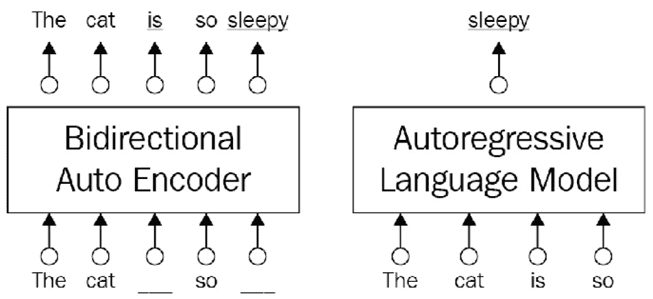
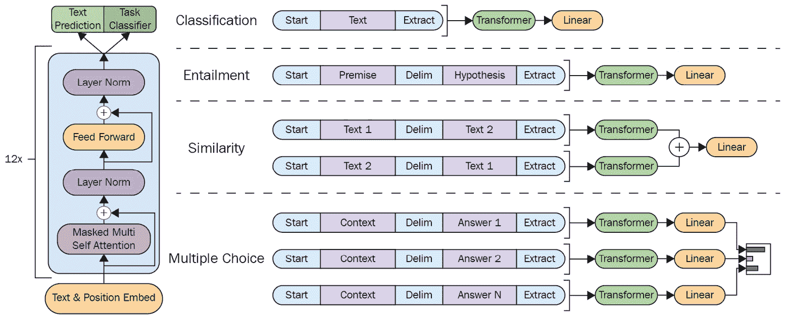
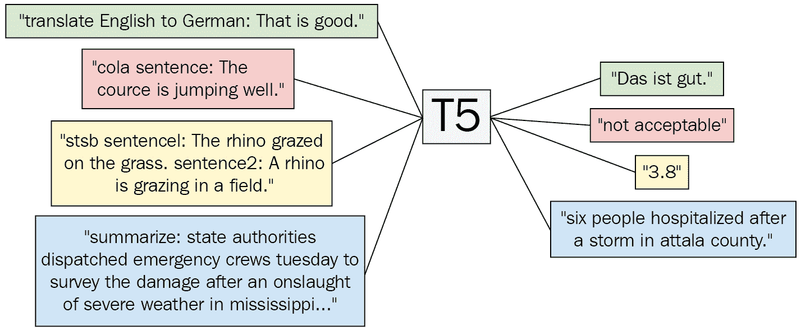
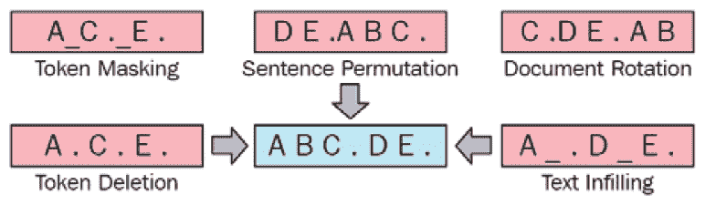
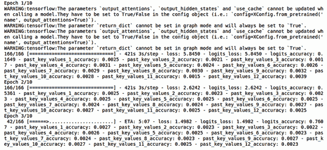
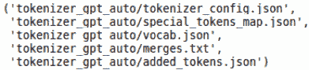
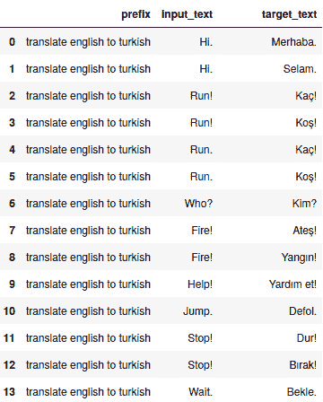
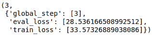

# 第五章：自回归模型与其他语言模型

我们研究了`text2tex`t 应用的细节，例如总结，释义和机器翻译。

本章将涵盖以下主题：

+   使用 AR 模型工作

+   使用**序列到序列**（**Seq2Seq**）模型工作

+   AR 语言模型训练

+   使用 AR 模型进行自然语言生成

+   使用`simpletransformers`进行总结和机器翻译微调

# 技术要求

为成功完成本章，需要以下库/软件包：

+   Anaconda

+   `transformers 4.0.0`

+   `pytorch 1.0.2`

+   `tensorflow 2.4.0`

+   `datasets 1.4.1`

+   `tokenizers`

+   `simpletransformers 0.61`

所有具有编码练习的笔记本将在以下 GitHub 链接上提供：[`github.com/PacktPublishing/Mastering-Transformers/tree/main/CH04`](https://github.com/PacktPublishing/Mastering-Transformers/tree/main/CH04)。

点击以下链接查看代码运行的实例：[`bit.ly/3yjn55X`](https://bit.ly/3yjn55X)

# 使用 AR 模型工作

变压器架构最初旨在对诸如机器翻译或总结之类的 Seq2Seq 任务有效，但随后它已被用于各种 NLP 问题，从标记分类到指代消解。随后的作品开始分别并更有创意地使用架构的左部分和右部分。在预训练阶段使用的目标，也被称为`[MASK]`符号，在微调阶段的数据中不存在，导致预训练和微调之间存在不一致。其次，BERT 模型可以说假定遮盖的标记是彼此独立的。

另一方面，AR 模型避免了关于独立性的假设，并且不会受到预训练和微调不一致引起的困扰，因为它们依赖于对先前标记的下一个标记的预测而不对其进行遮盖。它们仅利用具有遮盖自我注意力的解码器部分的变压器。它们阻止模型向当前词的右侧（或向当前词的左侧）的字词进行前向方向（或后向方向）的访问，这称为**单向性**。它们也称为**因果语言模型**（**CLMs**），因为它们是单向的。

AE 和 AR 模型之间的区别在这里简单地描述了：



图 4.1 - AE 与 AR 语言模型

GPT 及其两个后继者（GPT-2，GPT-3），**Transformer-XL**和**XLNet**是文献中流行的 AR 模型之一。尽管 XLNet 基于自回归，但它以某种方式成功地以双向方式利用了单词的上下文，借助基于排列的语言目标。现在，我们开始介绍它们，并展示如何训练这些模型以进行各种实验。让我们先看一下 GPT。

## 介绍以及使用 GPT 训练模型

AR 模型由多个 transformer 块组成。每个块包含一个掩码多头自注意力层和一个逐点前馈层。最后一个 transformer 块中的激活被馈入 softmax 函数，产生整个词汇表上的单词概率分布，以预测下一个单词。

在原始的 GPT 论文《通过生成预训练来改善语言理解》（2018）中，作者们解决了传统的基于**机器学习**（**ML**）的**自然语言处理**（**NLP**）流水线面临的几个瓶颈。例如，这些流水线首先需要大量的任务特定数据和任务特定的架构。其次，很难应用具有最小架构更改的任务感知输入转换到预训练模型中。由 OpenAI 团队设计的原始 GPT 及其后继者（GPT-2 和 GPT-3）专注于缓解这些瓶颈。原始 GPT 研究的主要贡献是，预训练模型不仅为单一任务取得了令人满意的结果，而且为各种任务取得了令人满意的结果。通过从未标记的数据中学习生成模型，这称为无监督预训练，该模型只需通过相对少量的任务特定数据进行**监督微调**，这称为**监督微调**。这种两阶段方案在其他 transformer 模型中被广泛使用，其中无监督预训练后跟着监督微调。

为了尽可能使 GPT 架构尽可能通用，只有输入被以任务特定的方式转换，而整个架构保持几乎不变。这种遍历式方法将文本输入转换为根据任务的有序序列，以便预训练模型能够从中理解任务。*图 4.2* 的左侧（启发自原始论文）说明了原始 GPT 工作中使用的 transformer 架构和训练目标。右侧显示了如何为几个任务进行微调时转换输入。

简单来说，对于单序列任务，如文本分类，输入原样通过网络，并且线性层采用最后的激活来做出决策。对于句对任务，如文本蕴涵，由两个序列组成的输入用分隔符标记，如 *图 4.2* 中的第二个示例所示。在这两种情况下，架构看到统一的令牌序列被预训练模型处理。在文本蕴涵的情况下，这种转换中使用的分隔符帮助预训练模型知道哪一部分是前提或假设。多亏了输入转换，我们不必在任务之间对架构进行重大更改。

你可以在这里看到输入转换的表示：



图 4.2 - 输入转换（灵感来自论文）

GPT 及其两个后继模型主要关注寻找特定的架构设计，其中不需要进行微调阶段。基于这个想法，一个模型可以非常熟练，也就是说，它在预训练阶段可以学习到关于语言的大部分信息，微调阶段所需的工作很少。因此，大多数任务的微调过程可以在三个时期内完成，并且对于大部分任务，相对较小的示例即可。极端情况下，零样本学习旨在禁用微调阶段。其基本思想是，模型可以在预训练阶段学习到关于语言的大量信息。对于所有基于 Transformer 的模型来说尤其如此。

### 原始 GPT 的后继模型

GPT-2（参见论文*语言模型是无监督多任务学习者*（2019））是原始 GPT-1 的后继者，它是在比原始模型更多的训练数据 WebText 上训练的一个更大的模型。它在没有进行微调的零样本设置中，在八个任务中的七个任务上取得了最新的结果，但在一些任务中成功有限。在测量长程依赖性的较小数据集上取得了可比较的结果。GPT-2 的作者认为语言模型不一定需要明确的监督来学习一个任务。相反，当它们在一个巨大而多样的网页数据集上进行训练时，它们可以学习这些任务。GPT-2 被认为是一个通用系统，用*P(output|input, task-i)*替换了原始 GPT 中的学习目标*P(output|input)*，其中模型在相同输入情况下，根据特定任务来生成不同的输出，也就是说，GPT-2 通过训练相同的无监督模型学习了多个任务。一个单独的预训练模型通过学习目标便能学习到不同的能力。我们在其他研究中也看到了类似的多任务和元任务设置。这种转变到**多任务学习**（**MTL**）使得可以对同一个输入进行多种不同的任务。但是这些模型是如何确定执行哪个任务呢？他们通过零样本任务转移来实现。

与原始 GPT 相比，GPT-2 没有具体任务的微调，并且能够在零样本任务转移的设置中工作，在这个设置中，所有下游任务都是预测条件概率的一部分。任务在输入中以某种方式组织，模型应该理解下游任务的性质，并相应地提供答案。例如，对于英文到土耳其语的 MT 任务，它不仅取决于输入，还取决于任务。输入被排列成英文句子后跟随土耳其句子，有一个分隔符，模型可以从中了解到任务是英文到土耳其语的翻译。

OpenAI 团队使用了 1750 亿个参数训练了 GPT-3 模型（参见论文*语言模型是几次学习者*（2020）），比 GPT-2 大 100 倍。GPT-2 和 GPT-3 的架构类似，主要区别通常在于模型大小和数据集数量/质量。由于数据集中的大量数据和所训练的大量参数，它在零次学习、一次学习和少次学习（*K=32*）设置下在许多下游任务上取得了更好的结果，而无需进行任何基于梯度的微调。团队表明，对于许多任务，包括翻译、**问答**（**QA**）和掩码标记任务，随着参数大小和示例数量的增加，模型性能也提高了。

## Transformer-XL

由于在最初的设计和上下文分段中缺乏循环，变压器模型受固定长度上下文的困扰，尽管它们能够学习长期依赖关系。大多数变压器将文档分成一系列固定长度（主要为 512）的段，其中跨段的任何信息流均不可能。因此，语言模型无法捕捉超出这个固定长度限制之外的长期依赖性。此外，分段过程不考虑句子边界。一个段可能荒谬地由一个句子的后半部分和它的后继者的前半部分组成，因此在预测下一个标记时，语言模型可能会缺少必要的上下文信息。这一问题被研究称为*上下文分段*问题。

为了解决和克服这些问题，变压器-XL 作者（参见论文*变压器-XL：超越固定长度上下文的专注语言模型*（2019））提出了一种新的变压器架构，包括一个段级别的循环机制和一种新的位置编码方案。这种方法启发了许多后续模型。它不仅限于两个连续的段，因为有效的上下文可以延伸到两个段之外。循环机制在每两个连续段之间起作用，导致对若干段的跨度到一定程度。模型可以处理的最大可能依赖长度受层数和段长度的限制。

## XLNet

**屏蔽语言建模**（**MLM**）主导了基于变压器的体系结构的预训练阶段。然而，它在过去面临过批评，因为在预训练阶段存在屏蔽标记，但在微调阶段不存在，这导致了预训练和微调之间的差异。由于这种缺失，模型可能无法利用在预训练阶段学到的所有信息。 XLNet（参见论文*XLNet: Generalized Autoregressive Pretraining for Language Understanding*（2019））用**置换语言建模**（**PLM**）取代了 MLM，这是输入标记的随机排列，以克服这一瓶颈。排列语言建模使每个标记位置利用来自所有位置的上下文信息，从而捕捉到双向上下文。客观函数只是对因子化顺序进行排列，并定义标记预测的顺序，但不改变序列的自然位置。简而言之，模型在置换后选择一些标记作为目标，然后在其余标记和目标的自然位置的条件下进一步尝试预测它们。这使得可以双向使用 AR 模型。

XLNet 利用了 AE 和 AR 模型的优势。它确实是一个广义的 AR 模型，然而，由于基于排列的语言建模，它可以关注来自左右上下文的标记。除了其客观函数，XLNet 由两个重要机制组成：它将 Transformer-XL 的段级循环机制集成到其框架中，并包括了针对目标感知表示的两流注意力机制的慎重设计。

让我们在接下来的部分讨论这些模型，使用变压器的两部分。

# 与 Seq2Seq 模型一起工作

变压器的左编码器和右解码器部分通过交叉注意力相连，这有助于每个解码器层关注最终编码器层。这自然地促使模型产生与原始输入紧密相关的输出。原始变压器——Seq2Seq 模型通过以下方案实现了这一点：

*输入标记-> 嵌入-> 编码器-> 解码器-> 输出标记*

Seq2Seq 模型保留了变压器的编码器和解码器部分。T5，**双向和自回归变压器**（**BART**）和**用于抽象摘要序列到序列模型的提取间隙句子进行预训练**（**PEGASUS**）是流行的 Seq2Seq 模型之一。

## T5

大多数 NLP 架构，从 Word2Vec 到变压器，通过预测使用上下文（相邻）词语的掩码词来学习嵌入和其他参数。我们将 NLP 问题视为词预测问题。一些研究将几乎所有 NLP 问题都视为问答或令牌分类。同样，T5（参见 2019 年的论文*探索统一文本到文本变压器的迁移学习极限*）提出了一个统一框架，通过将它们转换为文本到文本问题来解决许多任务。T5 的潜在理念是将所有 NLP 任务都转换为文本到文本（Seq2Seq）问题，其中输入和输出都是标记列表，因为已发现文本到文本框架有益于将相同模型应用于从问答到文本摘要等不同的 NLP 任务中。

下图，受原始论文启发，展示了 T5 如何在一个统一框架内解决四种不同的 NLP 问题—MT，语言可接受性，语义相似性和摘要：



图 4.3 – T5 框架图

T5 模型大致遵循原始编码器-解码器变压器模型。修改是在层归一化和位置嵌入方案中进行的。T5 使用相对位置嵌入，而不是使用正弦位置嵌入或学习嵌入，这在变压器架构中变得越来越普遍。T5 是一个单一模型，可以处理各种任务，例如语言生成。更重要的是，它将任务转换为文本格式。该模型接受由任务前缀和附加的输入组成的文本。我们将标记的文本数据集转换为`{'inputs': '....', 'targets': ...'}`格式，其中我们将目的作为前缀插入输入。然后，我们用标记数据训练模型，使其学会做什么以及如何做。如前图所示，在英语-德语翻译任务中，输入`"translate English to German: That is good."`会产生`"das is gut."`。同样，任何带有`"summarize:"`前缀的输入都将由该模型汇总。

## 介绍 BART

与 XLNet 一样，BART 模型（参见 2019 年的论文*BART：用于自然语言生成、翻译和理解的去噪序列到序列预训练*）利用了 AE 和 AR 模型的方案。它使用标准 Seq2Seq 变压器架构，稍作修改。BART 是一个使用各种破坏性方法来破坏文档的预训练模型。该研究对该领域的主要贡献在于它允许我们应用多种类型的创造性破坏方案，如下图所示：



图 4.4 – 受原始 BART 论文启发的图

我们将详细查看每个方案，如下所示：

+   `[MASK]` 符号，与 BERT 模型相同。

+   **标记删除**：从文档中随机删除标记。模型被迫确定哪些位置被删除。

+   `[MASK]` 标记。还有 `[MASK]` 标记插入。

+   **句子重排**：输入中的句子被分割并随机打乱顺序。

+   **文档旋转**：文档被旋转，以便以随机选择的标记（在前面的图表中为 **C**）开头。目标是找到文档的起始位置。

BART 模型可以通过多种方式进行微调，用于下游应用，如 BERT。对于序列分类任务，输入经过编码器和解码器，并将解码器的最终隐藏状态视为学习到的表示。然后，简单的线性分类器可以进行预测。同样，对于标记分类任务，整个文档被馈送到编码器和解码器中，并且最终解码器的最后状态是每个标记的表示。基于这些表示，我们可以解决标记分类问题，我们将在*第六章*中讨论，*用于标记分类的微调语言模型*。 **命名实体识别**（**NER**）和 **词性标注**（**POS**）任务可以使用这个最终表示来解决，其中 NER 识别文本中的人物和组织等实体，而 POS 将每个标记与它们的词汇类别联系起来，比如名词、形容词等。

对于序列生成，BART 模型的解码器块，即 AR 解码器，可以直接微调用于生成序列的任务，例如抽象 QA 或摘要。BART 的作者（Lewis，Mike 等）使用了两个标准摘要数据集：CNN/DailyMail 和 XSum 来训练模型。作者还表明，可以使用编码器部分——消耗源语言——和解码器部分——生成目标语言中的词语——作为单个预训练解码器用于 MT。他们用一个新的随机初始化的编码器替换了编码器嵌入层，以学习源语言中的词语。然后，模型以端到端的方式进行训练，该方式训练新编码器将外语单词映射到 BART 可以去噪到目标语言的输入。新编码器可以使用单独的词汇表，包括原始 BART 模型中的外语。

在 HuggingFace 平台上，我们可以通过以下代码行访问原始预训练的 BART 模型：

```py
AutoModel.from_pretrained('facebook/bart-large')
```

当我们调用`transformers`库中的标准`summarization`流水线时，如下代码行所示，将加载一个经过精简预训练的 BART 模型。此调用隐式加载了`"sshleifer/distilbart-cnn-12-6"`模型及其相应的分词器，如下所示：

```py
summarizer = pipeline("summarization")
```

以下代码明确加载相同的模型和相应的分词器。代码示例接受要进行总结的文本并输出结果：

```py
from transformers import BartTokenizer, BartForConditionalGeneration, BartConfig
from transformers import pipeline
model = \
BartForConditionalGeneration.from_pretrained('sshleifer/distilbart-cnn-12-6')
tokenizer = BartTokenizer.from_pretrained('sshleifer/distilbart-cnn-12-6')
nlp=pipeline("summarization", model=model, tokenizer=tokenizer)
text='''
We order two different types of jewelry from this
company the other jewelry we order is perfect.
However with this jewelry I have a few things I
don't like. The little Stone comes out of these
and customers are complaining and bringing them
back and we are having to put new jewelry in their
holes. You cannot sterilize these in an autoclave
as well because it heats up too much and the glue
does not hold up so the second group of these that
we used I did not sterilize them that way and the
stones still came out. When I use a dermal clamp
to put the top on the stones come out immediately.
DO not waste your money on this particular product
buy the three mm. that has the claws that hold the
jewelry in those are perfect. So now I'm stuck
with jewelry that I can't sell not good for
business.'''
q=nlp(text)
import pprint
pp = pprint.PrettyPrinter(indent=0, width=100)
pp.pprint(q[0]['summary_text'])
(' The little Stone comes out of these little stones and customers are complaining and bringing ' 'them back and we are having to put new jewelry in their holes . You cannot sterilize these in an ' 'autoclave because it heats up too much and the glue does not hold up so the second group of ' 'these that we used I did not sterilize them that way and the stones still came out .')
```

在下一节中，我们将动手学习如何训练这样的模型。

# AR 语言模型训练

在本节中，您将了解如何训练自己的 AR 语言模型。我们将从 GPT-2 开始，并深入了解其用于训练的不同功能，使用`transformers`库。

您可以找到任何特定的语料库来训练您自己的 GPT-2，但是在本示例中，我们使用了简·奥斯汀的《爱玛》，这是一部浪漫小说。强烈建议在更大的语料库上进行训练，以获得更一般的语言生成。

在我们开始之前，值得注意的是，我们使用了 TensorFlow 的本地训练功能来展示所有 Hugging Face 模型都可以直接在 TensorFlow 或 PyTorch 上进行训练，如果您愿意的话。请按照以下步骤：

1.  您可以使用以下命令下载*Emma*小说的原始文本：

    ```py
    wget https://raw.githubusercontent.com/teropa/nlp/master/resources/corpora/gutenberg/austen-emma.txt
    ```

1.  第一步是在你打算训练 GPT-2 的语料库上训练`BytePairEncoding`分词器。以下代码将从`tokenizers`库导入`BPE`分词器：

    ```py
    from tokenizers.models import BPE
    from tokenizers import Tokenizer
    from tokenizers.decoders import ByteLevel as ByteLevelDecoder
    from tokenizers.normalizers import Sequence, Lowercase
    from tokenizers.pre_tokenizers import ByteLevel
    from tokenizers.trainers import BpeTrainer
    ```

1.  如您所见，在此示例中，我们打算通过添加更多功能（如`Lowercase`规范化）来训练更高级的分词器。要创建一个`tokenizer`对象，可以使用以下代码：

    ```py
    tokenizer = Tokenizer(BPE())
    tokenizer.normalizer = Sequence([
        Lowercase()
    ])
    tokenizer.pre_tokenizer = ByteLevel()
    tokenizer.decoder = ByteLevelDecoder()
    ```

    第一行从`BPE`分词器类创建一个分词器。对于规范化部分，已添加`Lowercase`，并将`pre_tokenizer`属性设置为`ByteLevel`以确保我们的输入为字节。`decoder`属性也必须设置为`ByteLevelDecoder`以能够正确解码。

1.  接下来，将使用`50000`的最大词汇量和来自`ByteLevel`的初始字母训练分词器，如下所示：

    ```py
    trainer = BpeTrainer(vocab_size=50000, inital_alphabet=ByteLevel.alphabet(), special_tokens=[
                "<s>",
                "<pad>",
                "</s>",
                "<unk>",
                "<mask>"
            ])
    tokenizer.train(["austen-emma.txt"], trainer)
    ```

1.  还需要添加特殊的标记以进行考虑。为了保存分词器，需要创建一个目录，如下所示：

    ```py
    !mkdir tokenizer_gpt
    ```

1.  您可以通过运行以下命令保存分词器：

    ```py
    tokenizer.save("tokenizer_gpt/tokenizer.json")
    ```

1.  现在分词器已保存，是时候预处理语料库并使其准备好进行 GPT-2 训练了，但首先，重要的导入不能被遗忘。执行导入的代码如下所示：

    ```py
    from transformers import GPT2TokenizerFast, GPT2Config, TFGPT2LMHeadModel
    ```

1.  分词器可以通过使用`GPT2TokenizerFast`加载，如下所示：

    ```py
    tokenizer_gpt = GPT2TokenizerFast.from_pretrained("tokenizer_gpt")
    ```

1.  还必须添加特殊标记及其标记，如下所示：

    ```py
    tokenizer_gpt.add_special_tokens({
      "eos_token": "</s>",
      "bos_token": "<s>",
      "unk_token": "<unk>",
      "pad_token": "<pad>",
      "mask_token": "<mask>"
    })
    ```

1.  您还可以通过运行以下代码来双重检查是否一切都正确：

    ```py
    tokenizer_gpt.eos_token_id
    >> 2
    ```

    此代码将输出当前分词器的`2`。

1.  您也可以通过执行以下代码对一个句子进行测试：

    ```py
    tokenizer_gpt.encode("<s> this is </s>")
    >> [0, 265, 157, 56, 2]
    ```

    对于此输出，`0`是句子的开头，`265`、`157`和`56`与句子本身相关，EOS 被标记为`2`，即`</s>`。

1.  创建配置对象时必须使用这些设置。以下代码将创建一个`config`对象和 GPT-2 模型的 TensorFlow 版本：

    ```py
    config = GPT2Config(
      vocab_size=tokenizer_gpt.vocab_size,
      bos_token_id=tokenizer_gpt.bos_token_id,
      eos_token_id=tokenizer_gpt.eos_token_id
    )
    model = TFGPT2LMHeadModel(config)
    ```

1.  在运行`config`对象时，您可以看到配置以字典格式显示，如下所示：

    ```py
    config
    >> GPT2Config {  "activation_function": "gelu_new",  "attn_pdrop": 0.1,  "bos_token_id": 0,  "embd_pdrop": 0.1,  "eos_token_id": 2,  "gradient_checkpointing": false,  "initializer_range": 0.02,  "layer_norm_epsilon": 1e-05,  "model_type": "gpt2",  "n_ctx": 1024,  "n_embd": 768,  "n_head": 12,  "n_inner": null,  "n_layer": 12,  "n_positions": 1024,  "resid_pdrop": 0.1,  "summary_activation": null,  "summary_first_dropout": 0.1,  "summary_proj_to_labels": true,  "summary_type": "cls_index",  "summary_use_proj": true,  "transformers_version": "4.3.2",  "use_cache": true,  "vocab_size": 11750}
    ```

    如您所见，其他设置未被触及，有趣的部分是`vocab_size`被设置为`11750`。背后的原因是我们将最大词汇量设置为`50000`，但语料库较少，只有`11750`。

1.  现在，您可以准备好为预训练做好语料库的准备，如下所示：

    ```py
    with open("austen-emma.txt", "r", encoding='utf-8') as f:
        content = f.readlines()
    ```

1.  现在，内容将包括原始文件中的所有原始文本，但需要删除每一行的`'\n'`并删除少于`10`个字符的行，如下所示：

    ```py
    content_p = []
    for c in content:
        if len(c)>10:
            content_p.append(c.strip())
    content_p = " ".join(content_p)+tokenizer_gpt.eos_token
    ```

1.  删除短行将确保模型在长序列上进行训练，以生成更长的序列。在前述代码段的末尾，`content_p`具有经连接的原始文件，并在末尾添加了`eos_token`。但您也可以采取不同的策略—例如，您可以通过在每一行后添加`</s>`来将每一行分开，这将帮助模型识别句子何时结束。但我们的目的是使其能够更长的序列而无需遇到 EOS。代码见如下片段：

    ```py
    tokenized_content = tokenizer_gpt.encode(content_p)
    ```

    前述代码片段中的 GPT 标记生成器将对整个文本进行标记化，使其成为一个整体的长令牌 ID 序列。

1.  现在，是时候为训练制作样本了，如下所示：

    ```py
    sample_len = 100
    examples = []
    for i in range(0, len(tokenized_content)):
        examples.append(tokenized_content[i:i + sample_len])
    ```

1.  前述代码使`examples`从给定文本的特定部分开始，每个大小为`100`，并在`100`个令牌后结束：

    ```py
    train_data = []
    labels = []
    for example in examples:
        train_data.append(example[:-1])
        labels.append(example[1:])
    ```

    在`train_data`中，将会有一系列从头到第 99 个令牌的大小为`99`的序列，标签将具有从`1`到`100`的令牌序列。

1.  为了加快训练速度，需要将数据制作成 TensorFlow 数据集的形式，如下所示：

    ```py
    Import tensorflow as tf
    buffer = 500
    batch_size = 16   
    dataset = tf.data.Dataset.from_tensor_slices((train_data, labels))
    dataset = dataset.shuffle(buffer).batch(batch_size, drop_remainder=True)
    ```

    `buffer`是用于对数据进行洗牌的缓冲区大小，`batch_size`是训练的批量大小。`drop_remainder`用于丢弃余数，如果余数小于`16`，则丢弃。

1.  现在，您可以指定您的`optimizer`，`loss`和`metrics`属性，如下所示：

    ```py
    optimizer = tf.keras.optimizers.Adam(learning_rate=3e-5, epsilon=1e-08, clipnorm=1.0)
    loss = tf.keras.losses.SparseCategoricalCrossentropy(from_logits=True)
    metric = tf.keras.metrics.SparseCategoricalAccuracy('accuracy')
    model.compile(optimizer=optimizer, loss=[loss, *[None] * model.config.n_layer], metrics=[metric])
    ```

1.  你希望，该模型已经编译并准备好进行训练的周期数量，如下所示：

    ```py
    epochs = 10
    model.fit(dataset, epochs=epochs)
    ```

    您将看到类似于这样的输出：



图 4.5 – 使用 TensorFlow/Keras 进行 GPT-2 训练

现在，我们将看看如何使用 AR 模型进行 NLG。现在你已经保存了模型，它将用于在下一节中生成句子。

到目前为止，你已经学会了如何训练自己的 NLG 模型。在下一节中，我们描述如何利用 NLG 模型进行语言生成。

# 使用 AR 模型进行 NLG

在上一节中，你已经学会了如何在自己的语料库上训练 AR 模型。结果，你已经训练了自己的 GPT-2 版本。但对于问题“我该如何使用它？”的缺失答案仍然存在。为了回答这个问题，让我们继续如下进行：

1.  让我们从您刚刚训练的模型开始生成句子，如下所示：

    ```py
    def generate(start, model): 
        input_token_ids = tokenizer_gpt.encode(start, return_tensors='tf') 
        output = model.generate( 
            input_token_ids, 
            max_length = 500, 
            num_beams = 5, 
            temperature = 0.7, 
            no_repeat_ngram_size=2, 
            num_return_sequences=1 
        ) 
        return tokenizer_gpt.decode(output[0])
    ```

    在前面代码片段中定义的`generate`函数接受一个`start`字符串，并生成遵循该字符串的序列。您可以更改参数，例如将`max_length`设置为较小的序列大小或将`num_return_sequences`设置为不同的生成。

1.  让我们尝试一个空字符串，如下所示：

    ```py
    generate(" ", model)
    ```

    我们得到以下输出：

    

    图 4.6 – GPT-2 文本生成示例

    正如您从之前的输出中所看到的那样，即使文本的语义不太动人，但在许多情况下，语法几乎是正确的。

1.  现在，让我们尝试不同的开始，将`max_length`设置为较低值，比如`30`，如下所示：

    ```py
    generate("wetson was very good")
    >> 'wetson was very good; but it, that he was a great must be a mile from them, and a miss taylor in the house;'
    ```

    正如您回忆`西斯顿`是小说中的一个角色。

1.  要保存模型，您可以使用以下代码使其可重复使用以发布或在不同应用程序中使用：

    ```py
    model.save_pretrained("my_gpt-2/")
    ```

1.  为确保您的模型正确保存，您可以尝试加载它，如下所示：

    ```py
    model_reloaded = TFGPT2LMHeadModel.from_pretrained("my_gpt-2/")
    ```

    两个文件被保存——一个`config`文件和一个`model.h5`文件，用于 TensorFlow 版本。我们可以在以下截图中看到这两个文件：

    

    图 4.7 – 语言模型 save_pretrained 输出

1.  Hugging Face 还有一个必须使用的标准文件名标准——这些标准文件名可通过以下导入获得：

    ```py
    from transformers import WEIGHTS_NAME, CONFIG_NAME, TF2_WEIGHTS_NAME
    ```

    但是，在使用`save_pretrained`函数时，不需要放置文件名，只需目录即可。

1.  Hugging Face 还有`AutoModel`和`AutoTokenizer`类，正如您从之前的章节中所见。您也可以使用这个功能来保存模型，但在这之前仍然需要手动完成一些配置。第一件事就是将分词器以适当的格式保存以供`AutoTokenizer`使用。您可以通过使用`save_pretrained`来实现这一点，如下所示：

    ```py
    tokenizer_gpt.save_pretrained("tokenizer_gpt_auto/")
    ```

    这是输出：

    

    图 4.8 – Tokenizer save_pretrained 输出

1.  在您指定的目录中显示了文件列表，但`tokenizer_config`必须手动更改以便可用。首先，您应该将其重命名为`config.json`，其次，您应该在`model_type`属性中添加一个属性为`gpt2`，如下所示：

    ```py
    {"model_type":"gpt2",
    ...
    }
    ```

1.  现在，一切准备就绪，您可以简单地使用这两行代码加载`model`和`tokenizer`：

    ```py
    model = AutoModel.from_pretrained("my_gpt-2/", from_tf=True)
    tokenizer = AutoTokenizer.from_pretrained("tokenizer_gpt_auto")
    ```

    然而，不要忘记将`from_tf`设置为`True`，因为您的模型是以 TensorFlow 格式保存的。

到目前为止，您已经学会了如何使用`tensorflow`和`transformers`预训练和保存自己的文本生成模型。您还学会了如何保存一个预训练模型并准备将其用作自动模型。在接下来的部分，您将学习如何使用其他模型的基础知识。

# 使用 simpletransformers 进行摘要和 MT 微调

到目前为止，你已经学会了从头开始训练语言模型的基础知识和高级方法，但是从头开始训练自己的语言模型并不总是可行的，因为有时会存在低计算能力等障碍。在本节中，你将学习如何针对特定的 MT 和摘要任务对自己的数据集进行语言模型的微调。请按照以下步骤进行操作：

1.  要开始，你需要安装`simpletransformers`库，如下所示：

    ```py
    pip install simpletransformers
    ```

1.  下一步是下载包含你的平行语料库的数据集。这个平行语料库可以是任何类型的 Seq2Seq 任务。对于本例，我们将使用 MT 示例，但你可以使用任何其他数据集来完成其他任务，比如释义、摘要，甚至将文本转换为 **SQL**。

    你可以从 [`www.kaggle.com/seymasa/turkish-to-english-translation-dataset/version/1`](https://www.kaggle.com/seymasa/turkish-to-english-translation-dataset/version/1) 下载数据集。

1.  下载并解压数据后，需要为列标题添加 `EN` 和 `TR`，以便更容易使用。你可以使用`pandas`加载数据集，如下所示：

    ```py
    import pandas as pd
    df = pd.read_csv("TR2EN.txt",sep="\t").astype(str)
    ```

1.  必须向数据集添加 T5 特定的命令，以使其了解正在处理的命令。你可以使用以下代码完成这项工作：

    ```py
    data = []
    for item in digitrons():
        data.append(["translate english to turkish", item[1].EN, item[1].TR])
    ```

1.  然后，你可以重组 DataFrame，就像这样：

    ```py
    df = pd.DataFrame(data, columns=["prefix", "input_text", "target_text"])
    ```

    结果如下截图所示：

    

    图 4.9 – 英-土机器翻译平行语料库

1.  接下来，运行以下代码导入所需的类：

    ```py
    from simpletransformers.t5 import T5Model, T5Args
    ```

1.  使用以下代码定义训练参数：

    ```py
    model_args = T5Args()
    model_args.max_seq_length = 96
    model_args.train_batch_size = 20
    model_args.eval_batch_size = 20
    model_args.num_train_epochs = 1
    model_args.evaluate_during_training = True
    model_args.evaluate_during_training_steps = 30000
    model_args.use_multiprocessing = False
    model_args.fp16 = False
    model_args.save_steps = -1
    model_args.save_eval_checkpoints = False
    model_args.no_cache = True
    model_args.reprocess_input_data = True
    model_args.overwrite_output_dir = True
    model_args.preprocess_inputs = False
    model_args.num_return_sequences = 1
    model_args.wandb_project = "MT5 English-Turkish Translation"
    ```

1.  最后，你可以加载任何你想微调的模型。以下是我们选择的一个：

    ```py
    model = T5Model("mt5", "google/mt5-small", args=model_args, use_cuda=False)
    ```

    如果你的 **CUDA** 内存不足以容纳 mT5，不要忘记将`use_cuda`设置为`False`。

1.  使用以下代码可以拆分 `train` 和 `eval` DataFrames：

    ```py
    train_df = df[: 470000]
    eval_df = df[470000:]
    ```

1.  最后一步是使用以下代码开始训练：

    ```py
    model.train_model(train_df, eval_data=eval_df)
    ```

    训练结果将如下所示：

    

    图 4.10 – mT5 模型评估结果

    这表明了评估和训练损失。

1.  你可以使用以下代码简单加载和使用模型：

    ```py
    model_args = T5Args()
    model_args.max_length = 512
    model_args.length_penalty = 1
    model_args.num_beams = 10
    model = T5Model("mt5", "outputs", args=model_args, use_cuda=False)
    ```

    现在可以使用`model_predict`函数进行从英语到土耳其语的翻译。

`simpletransformers`库使得从序列标记到 Seq2Seq 模型的训练变得非常简单和可用。

干得漂亮！我们已经学会了如何训练自己的 AR 模型，并且到达了本章的结束。

# 摘要

在本章中，我们学习了关于 AR 语言模型的各个方面，从预训练到微调。我们通过训练生成语言模型和在诸如 MT 等任务上进行微调来查看此类模型的最佳特征。我们了解了更复杂模型如 T5 的基础知识，并使用这种模型执行了 MT。我们还使用了`simpletransformers`库。我们在自己的语料库上训练了 GPT-2，并使用它生成了文本。我们学会了如何保存它，并使用`AutoModel`。我们还深入研究了如何训练和使用 BPE，使用`tokenizers`库。

在下一章中，我们将看到如何为文本分类微调模型。

# 参考文献

这里有一些参考资料，你可以用来扩展我们在本章学到的内容：

+   *Radford, A.*, *Wu, J.*, *Child, R.*, *Luan, D.*, *Amodei, D.* 和 *Sutskever, I.*（*2019*）。*语言模型是无监督多任务学习者*。*OpenAI 博客*，*1(8)*，*9*。

+   *Lewis, M.*, *Liu, Y.*, *Goyal, N.*, *Ghazvininejad, M.*, *Mohamed, A*.，*Levy, O.* 和 *Zettlemoyer, L.*（*2019*）。*BART: 用于自然语言生成、翻译和理解的去噪序列到序列预训练*。*arXiv 预印本 arXiv:1910.13461*。

+   *Xue, L.*, *Constant, N.*, *Roberts, A.*, *Kale, M.*, *Al-Rfou, R*.，*Siddhant, A.* 和 *Raffel, C.*（*2020*）。*mT5: 一个大规模多语言预训练文本到文本转换器*。*arXiv 预印本 arXiv:2010.11934*。

+   *Raffel, C.*，*Shazeer, N.*，*Roberts, A.*，*Lee, K.*，*Narang, S.*，*Matena, M*. 和 *Liu, P. J.*（*2019*）。*探索统一文本到文本转换器的迁移学习极限*。*arXiv 预印本 arXiv:1910.10683*。

+   *Yang, Z.*，*Dai, Z.*，*Yang, Y.*，*Carbonell, J.*，*Salakhutdinov, R.* 和 *Le, Q. V.*（*2019*）。*XLNet: 用于语言理解的广义自回归预训练*。*arXiv 预印本 arXiv:1906.08237*。

+   *Dai, Z.*, *Yang, Z.*, *Yang, Y.*, *Carbonell, J*.，*Le, Q. V.* 和 *Salakhutdinov, R.*（*2019*）。*Transformer-xl: 超越固定长度上下文的关注语言模型*。*arXiv 预印本 arXiv:1901.02860*。
