# 第六章：文本分类的语言模型微调

在本章中，我们将学习如何配置预训练模型进行文本分类，并如何对其进行微调以适应任何文本分类的下游任务，例如情感分析或多类分类。我们还将讨论如何处理句对和回归问题，涵盖一个实现。我们将使用 GLUE 等知名数据集，以及我们自己的定制数据集。然后，我们将利用 Trainer 类，该类处理了训练和微调过程的复杂性。

首先，我们将学习如何使用 Trainer 类进行单句二元情感分类微调。然后，我们将使用原生 PyTorch 进行情感分类的训练，而不使用 Trainer 类。在多类分类中，将考虑超过两个类别。我们将有七个类别分类微调任务要执行。最后，我们将训练一个文本回归模型，以预测具有句子对的数值。

本章将涵盖以下主题：

+   文本分类简介

+   对单句二元分类微调 BERT 模型

+   使用原生 PyTorch 训练分类模型

+   使用自定义数据集对 BERT 进行多类分类微调

+   对句对回归进行 BERT 的微调

+   利用 `run_glue.py` 对模型进行微调

# 技术要求

我们将使用 Jupyter Notebook 运行我们的编程练习。您需要 Python 3.6+。确保已安装以下软件包：

+   `sklearn`

+   Transformers 4.0+

+   `datasets`

所有本章编程练习的笔记本将在以下 GitHub 链接上提供：[`github.com/PacktPublishing/Mastering-Transformers/tree/main/CH05`](https://github.com/PacktPublishing/Mastering-Transformers/tree/main/CH05)。

查看以下链接以观看代码演示视频：

[`bit.ly/3y5Fe6R`](https://bit.ly/3y5Fe6R)

# 文本分类简介

文本分类（也称为文本分类）是将文档（句子、Twitter 帖子、书籍章节、电子邮件内容等）映射到预定义列表（类别）中的一种方式。在具有正负标签的两类情况下，我们称之为**二元分类** - 更具体地说，是**情感分析**。对于多于两个类别的情况，我们称之为**多类分类**，其中类别是相互排斥的，或者称之为**多标签分类**，其中类别不是相互排斥的，这意味着一个文档可以获得多个标签。例如，一篇新闻文章的内容可能同时涉及体育和政治。除了这种分类之外，我们可能希望对文档进行范围为[-1,1]的评分或在[1-5]范围内对其进行排名。我们可以用回归模型解决这种问题，其中输出的类型是数值而不是分类。

幸运的是，变换器架构使我们能够高效地解决这些问题。对于句对任务，如文档相似性或文本蕴涵，输入不是单一句子，而是两个句子，如下图所示。我们可以评分两个句子在语义上相似的程度，或者预测它们是否在语义上相似。另一个句对任务是**文本蕴涵**，其中问题定义为多类分类。在 GLUE 基准测试中，两个序列被消耗：蕴含/矛盾/中性：

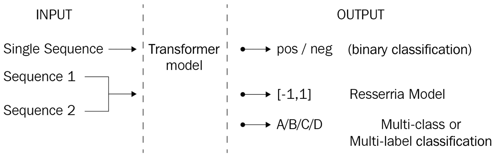

图 5.1 – 文本分类方案

让我们通过微调预训练的 BERT 模型开始我们的训练过程，针对一个常见问题：情感分析。

# 为单句二元分类微调 BERT 模型

在本节中，我们将讨论如何使用流行的`IMDb 情感`数据集，通过微调预训练的 BERT 模型进行情感分析。使用 GPU 可以加快我们的学习过程，但如果您没有这样的资源，您也可以通过 CPU 进行微调。让我们开始吧：

1.  要了解并保存当前设备的信息，我们可以执行以下代码行：

    ```py
    from torch import cuda
    device = 'cuda' if cuda.is_available() else 'cpu'
    ```

1.  我们将在这里使用 `DistilBertForSequenceClassification` 类，它是从 `DistilBert` 类继承而来，顶部有一个特殊的序列分类头。我们可以利用这个*分类头*来训练分类模型，其中默认类别数为`2`：

    ```py
    from transformers import DistilBertTokenizerFast, DistilBertForSequenceClassification
    model_path= 'distilbert-base-uncased'
    tokenizer = DistilBertTokenizerFast.from_pre-trained(model_path)
    model = \ DistilBertForSequenceClassification.from_pre-trained(model_path, id2label={0:"NEG", 1:"POS"}, label2id={"NEG":0, "POS":1})
    ```

1.  注意传递给模型的两个参数称为`id2label`和`label2id`，用于推理。或者，我们可以实例化一个特定的`config`对象并将其传递给模型，如下所示：

    ```py
    config = AutoConfig.from_pre-trained(....)
    SequenceClassification.from_pre-trained(.... config=config)
    ```

1.  现在，让我们选择一个名为`IMDB Dataset`的流行情感分类数据集。原始数据集包含两组数据：25,000 个训练示例和 25 个测试示例。我们将数据集分成测试集和验证集。请注意，数据集的前一半示例为正面，而后一半的示例都为负面。我们可以按以下方式分布示例：

    ```py
    from datasets import load_dataset
    imdb_train= load_dataset('imdb', split="train")
    imdb_test= load_dataset('imdb', split="test[:6250]+test[-6250:]")
    imdb_val= \
    load_dataset('imdb', split="test[6250:12500]+test[-12500:-6250]")
    ```

1.  让我们检查数据集的形状：

    ```py
    >>> imdb_train.shape, imdb_test.shape, imdb_val.shape
    ((25000, 2), (12500, 2), (12500, 2))
    ```

1.  您可以根据计算资源的情况从数据集中取出一小部分。对于较小的部分，您应该运行以下代码，选择 4,000 个示例进行训练，1,000 个进行测试，以及 1,000 个进行验证，如下所示：

    ```py
    imdb_train= load_dataset('imdb', split="train[:2000]+train[-2000:]")
    imdb_test= load_dataset('imdb', split="test[:500]+test[-500:]")
    imdb_val= load_dataset('imdb', split="test[500:1000]+test[-1000:-500]")
    ```

1.  现在，我们可以将这些数据集通过`tokenizer`模型，使它们准备好进行训练：

    ```py
    enc_train = imdb_train.map(lambda e: tokenizer( e['text'], padding=True, truncation=True), batched=True, batch_size=1000) 
    enc_test =  imdb_test.map(lambda e: tokenizer( e['text'], padding=True, truncation=True), batched=True, batch_size=1000) 
    enc_val =   imdb_val.map(lambda e: tokenizer( e['text'], padding=True, truncation=True), batched=True, batch_size=1000)
    ```

1.  让我们看看训练集的样子。注意力掩码和输入 ID 是由分词器添加到数据集中的，以便 BERT 模型进行处理：

    ```py
    import pandas as pd
    pd.DataFrame(enc_train)
    ```

    输出如下：

    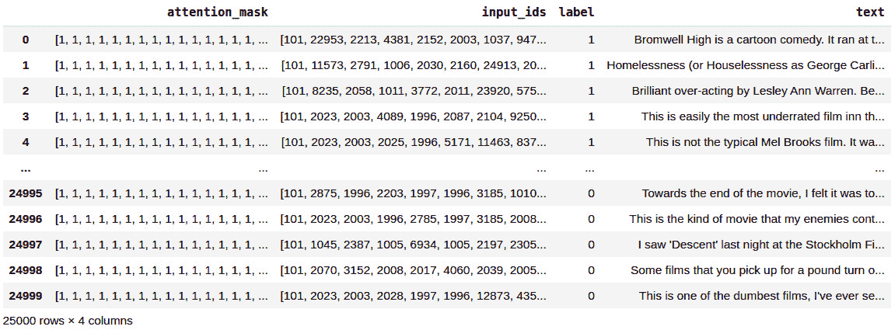

    图 5.2 – 编码后的训练数据集

    此时，数据集已准备好用于训练和测试。`Trainer`类（`TFTrainer`用于 TensorFlow）和`TrainingArguments`类（`TFTrainingArguments`用于 TensorFlow）将帮助我们处理训练的许多复杂性。我们将在`TrainingArguments`类中定义我们的参数集，然后将其传递给`Trainer`对象。

    让我们定义每个训练参数的作用：

    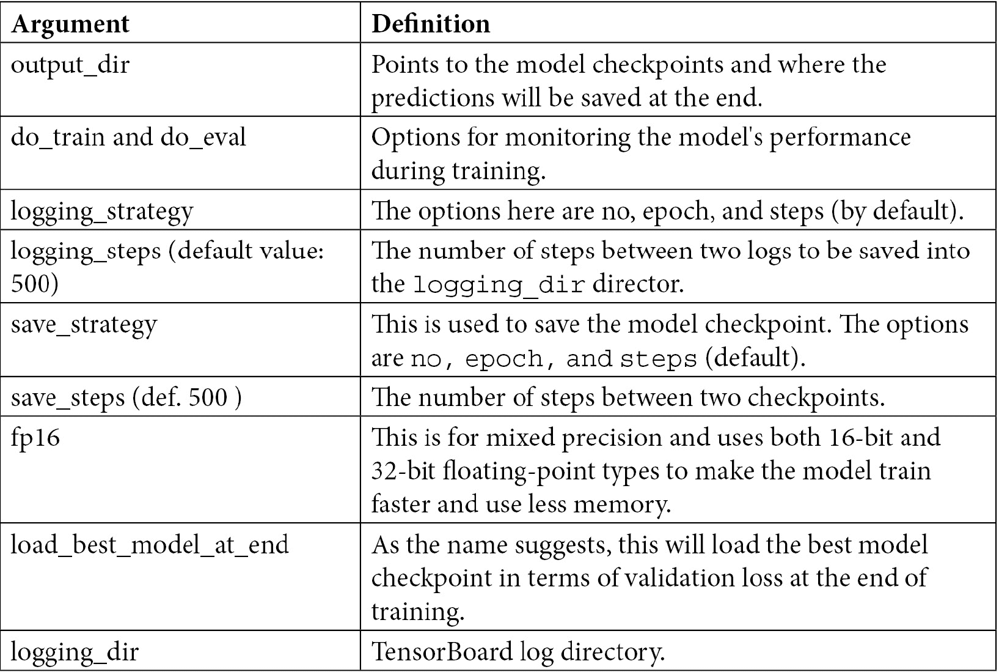

    表 1 - 不同训练参数定义表

1.  若要获取更多信息，请查看`TrainingArguments`的 API 文档，或在 Python notebook 中执行以下代码：

    ```py
    TrainingArguments?
    ```

1.  虽然像 LSTM 这样的深度学习架构需要许多 epoch，有时超过 50 个，但对于基于 transformer 的微调，由于迁移学习，我们通常会满足于 3 个 epoch 的数量。大部分时间，这个数量已经足够进行微调，因为预训练模型在预训练阶段已经学到了很多关于语言的知识，通常需要大约 50 个 epoch。要确定正确的 epoch 数量，我们需要监控训练和评估损失。我们将学习如何在*第十一章*中跟踪训练，*注意力可视化和实验追踪*。

1.  对于许多下游任务问题，这将足够用。在训练过程中，我们的模型检查点将被保存在`./MyIMDBModel`文件夹中，每 200 步保存一次：

    ```py
    from transformers import TrainingArguments, Trainer
    training_args = TrainingArguments(
        output_dir='./MyIMDBModel', 
        do_train=True,
        do_eval=True,
        num_train_epochs=3,              
        per_device_train_batch_size=32,  
        per_device_eval_batch_size=64,
        warmup_steps=100,                
        weight_decay=0.01,
        logging_strategy='steps',               
        logging_dir='./logs',            
        logging_steps=200,
        evaluation_strategy= 'steps',
             fp16= cuda.is_available(),
        load_best_model_at_end=True
    )
    ```

1.  在实例化`Trainer`对象之前，我们将定义`compute_metrics()`方法，它可以帮助我们监控训练过程中特定指标的进展，如 Precision、RMSE、Pearson 相关性、BLEU 等。文本分类问题（如情感分类或多类分类）大多使用**微平均**或**宏平均 F1** 进行评估。而宏平均方法平等对待每个类别，微平均对每个文本或每个标记的分类决策平等对待。微平均等于模型正确决策的次数与总决策次数的比率。而宏平均方法计算每个类别的 Precision、Recall 和 F1 的平均分数。对于我们的分类问题，宏平均更方便进行评估，因为我们希望给每个标签平等的权重，如下所示：

    ```py
    from sklearn.metrics import accuracy_score, Precision_Recall_fscore_support
    def compute_metrics(pred):
        labels = pred.label_ids
        preds = pred.predictions.argmax(-1)
        Precision, Recall, f1, _ = \                        
        Precision_Recall_fscore_support(labels, preds, average='macro')
        acc = accuracy_score(labels, preds)
        return {
            'Accuracy': acc,
            'F1': f1,
            'Precision': Precision,
            'Recall': Recall
        }
    ```

1.  我们几乎已经准备好开始训练过程。现在，让我们实例化`Trainer`对象并启动它。`Trainer`类是一个非常强大和优化的工具，用于组织 PyTorch 和 TensorFlow（`TFTrainer`用于 TensorFlow）的复杂训练和评估过程，这得益于`transformers`库：

    ```py
    trainer = Trainer(
        model=model,                     
        args=training_args,                 
        train_dataset=enc_train,         
        eval_dataset=enc_val,            
        compute_metrics= compute_metrics
    )
    ```

1.  最后，我们可以开始训练过程：

    ```py
    results=trainer.train()
    ```

    前面的调用开始记录指标，我们将在*第十一章*，*注意力可视化和实验跟踪*中更详细地讨论这些内容。整个 IMDb 数据集包括 25,000 个训练示例。使用批量大小为 32，我们有 25K/32 约等于 782 个步骤，并且对于 3 个时期还有 2,346 个步骤（782 x 3），如下所示的进度条显示：

    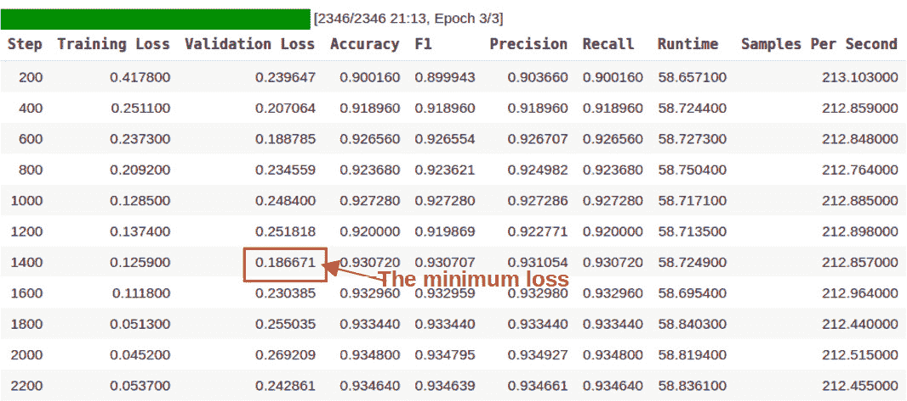

    图 5.3 – Trainer 对象生成的输出

1.  `Trainer`对象保留了验证损失最小的检查点。它选择了步骤 1,400 处的检查点，因为该步骤的验证损失最小。让我们在三个（训练/测试/验证）数据集上评估最佳检查点：

    ```py
    >>> q=[trainer.evaluate(eval_dataset=data) for data in [enc_train, enc_val, enc_test]]
    >>> pd.DataFrame(q, index=["train","val","test"]).iloc[:,:5]
    ```

    输出如下：

    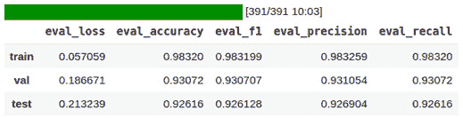

    图 5.4 – 分类模型在训练/验证/测试数据集上的性能

1.  干得好！我们成功完成了训练/测试阶段，并获得了 92.6 的准确度和 92.6 的宏平均 F1 值。为了更详细地监视您的训练过程，您可以调用高级工具，如 TensorBoard。这些工具会解析日志，并使我们能够跟踪各种指标以进行全面分析。我们已经在`./logs`文件夹下记录了性能和其他指标。只需在我们的 Python 笔记本中运行`tensorboard`函数就足够了，如下面的代码块所示（我们将在*第十一章*中详细讨论 TensorBoard 和其他监控工具的可视化和实验跟踪）：

    ```py
    %reload_ext tensorboard
    %tensorboard --logdir logs
    ```

1.  现在，我们将使用模型进行推理以检查其是否正常工作。让我们定义一个预测函数来简化预测步骤，如下所示：

    ```py
    def get_prediction(text):
        inputs = tokenizer(text, padding=True,truncation=True,
        max_length=250, return_tensors="pt").to(device)
        outputs = \ model(inputs["input_ids"].to(device),inputs["attention_mask"].to(device))
        probs = outputs[0].softmax(1)
        return probs, probs.argmax() 
    ```

1.  现在，运行模型进行推理：

    ```py
    >>> text = "I didn't like the movie it bored me "
    >>> get_prediction(text)[1].item()
    0 
    ```

1.  我们在这里得到的是`0`，表示的是负面。我们已经定义了哪个 ID 表示哪个标签。我们可以使用这种映射方案来获取标签。或者，我们可以将所有这些乏味的步骤简单地传递给一个专用的 API，即 Pipeline，这是我们已经熟悉的。在实例化之前，让我们保存最佳模型以进行进一步的推理：

    ```py
    model_save_path = "MyBestIMDBModel"
    trainer.save_model(model_save_path)
    tokenizer.save_pre-trained(model_save_path)
    ```

    Pipeline API 是使用预训练模型进行推理的简便方法。我们从保存模型的位置加载模型并将其传递给 Pipeline API，其余工作由其完成。我们可以跳过保存步骤，而是直接将`model`和`tokenizer`对象在内存中传递给 Pipeline API。如果这样做，将获得相同的结果。

1.  如下面的代码所示，当我们执行二元分类时，需要将 Pipeline 的任务名称参数指定为`sentiment-analysis`：

    ```py
    >>> from transformers import pipeline, \ DistilBertForSequenceClassification, DistilBertTokenizerFast
    >>> model = \ DistilBertForSequenceClassification.from_pre-trained("MyBestIMDBModel")
    >>> tokenizer= \ DistilBertTokenizerFast.from_pre-trained("MyBestIMDBModel")
    >>> nlp= pipeline("sentiment-analysis", model=model, tokenizer=tokenizer)
    >>> nlp("the movie was very impressive")
    Out:  [{'label': 'POS', 'score': 0.9621992707252502}]
    >>> nlp("the text of the picture was very poor")
    Out:  [{'label': 'NEG', 'score': 0.9938313961029053}]
    ```

    Pipeline 知道如何处理输入，并某种方式学会了哪个 ID 表示哪个（`POS`或`NEG`）标签。它还产生类别概率。

    干得好！我们已经使用`Trainer`类为 IMDb 数据集微调了情感预测模型。在接下来的部分中，我们将使用原生 PyTorch 进行相同的二元分类培训。我们还将使用其他数据集。

# 使用原生 PyTorch 训练分类模型

`Trainer`类非常强大，我们要感谢 HuggingFace 团队提供了这样一个有用的工具。然而，在本节中，我们将从头开始微调预训练模型，以了解其内部运行原理。让我们开始吧：

1.  首先，让我们加载用于微调的模型。我们将在这里选择`DistilBERT`，因为它是 BERT 的一个小型、快速和廉价版本：

    ```py
    from transformers import DistilBertForSequenceClassification
    model = DistilBertForSequenceClassification.from_pre-trained('distilbert-base-uncased')
    ```

1.  要对任何模型进行微调，我们需要将其设置为训练模式，如下所示：

    ```py
    model.train()
    ```

1.  现在，我们必须加载分词器：

    ```py
    from transformers import DistilBertTokenizerFast
    tokenizer = DistilBertTokenizerFast.from_pre-trained('bert-base-uncased')
    ```

1.  由于`Trainer`类已经为我们组织好了整个过程，我们在之前的 IMDb 情感分类练习中没有处理优化和其他训练设置。现在，我们需要自己实例化优化器。在这里，我们必须选择`AdamW`，它是 Adam 算法的一个实现，但修复了权重衰减。最近的研究表明，`AdamW`产生的训练损失和验证损失比使用 Adam 训练的模型更好。因此，在许多 transformer 训练过程中，它是一个广泛使用的优化器：

    ```py
    from transformers import AdamW
    optimizer = AdamW(model.parameters(), lr=1e-3)
    ```

    要从头开始设计微调过程，我们必须了解如何实现单步前向传播和反向传播。我们可以通过 transformer 层传递一个批次并获得输出，该输出由分词器生成的`input_ids`和`attention_mask`组成，并使用真实标签计算损失。正如我们所看到的，输出包含`loss`和`logits`两部分。现在，`loss.backward()`通过使用输入和标签评估模型来计算张量的梯度。`optimizer.step()`执行单个优化步骤并使用计算的梯度更新权重，这称为反向传播。当我们很快将所有这些行放入一个循环中时，我们还将添加`optimizer.zero_grad()`，它清除所有参数的梯度。在循环开始时调用这一点非常重要；否则，我们可能会积累多个步骤的梯度。输出的第二个张量是**logits**。在深度学习的上下文中，logits（logistic units 的缩写）是神经架构的最后一层，由实数作为预测值组成。在分类的情况下，logits 需要通过 softmax 函数转换为概率。否则，它们只是用于回归的标准化值。

1.  如果我们想要手动计算损失，我们就不能将标签传递给模型。由于这个原因，模型只产生 logits，而不计算损失。在下面的示例中，我们正在手动计算交叉熵损失：

    ```py
    from torch.nn import functional
    labels = torch.tensor([1,0,1])
    outputs = model(input_ids, attention_mask=attention_mask)
    loss = functional.cross_entropy(outputs.logits, labels)
    loss.backward()
    optimizer.step()
    loss
    Output: tensor(0.6101, grad_fn=<NllLossBackward>)
    ```

1.  有了这个，我们学会了如何将批量输入通过网络的前向方向在单个步骤中进行传递。现在，是时候设计一个循环，以批量迭代整个数据集来训练模型进行多个 epochs。为此，我们将首先设计`Dataset`类。它是`torch.Dataset`的子类，继承成员变量和函数，并实现`__init__()`和`__getitem()__`抽象函数：

    ```py
    from torch.utils.data import Dataset
    class MyDataset(Dataset):
        def __init__(self, encodings, labels):
            self.encodings = encodings
            self.labels = labels
        def __getitem__(self, idx):
            item = {key: torch.tensor(val[idx]) for key, val in self.encodings.items()}
            item['labels'] = torch.tensor(self.labels[idx])
            return item
        def __len__(self):
            return len(self.labels) 
    ```

1.  通过拿取另一个情感分析数据集 SST-2 数据集，即**斯坦福情感树库 v2**（**SST2**）来对情感分析的模型进行微调。我们还将加载 SST-2 的相应度量进行评估，如下所示：

    ```py
    import datasets
    from datasets import load_dataset
    sst2= load_dataset("glue","sst2")
    from datasets import load_metric
    metric = load_metric("glue", "sst2")
    ```

1.  我们将相应地提取句子和标签：

    ```py
    texts=sst2['train']['sentence']
    labels=sst2['train']['label']
    val_texts=sst2['validation']['sentence']
    val_labels=sst2['validation']['label']
    ```

1.  现在，我们可以通过标记器传递数据集并实例化`MyDataset`对象，使 BERT 模型可以与它们一起工作：

    ```py
    train_dataset= MyDataset(tokenizer(texts, truncation=True, padding=True), labels)
    val_dataset=  MyDataset(tokenizer(val_texts, truncation=True, padding=True), val_labels)
    ```

1.  让我们实例化一个`Dataloader`类，它提供了通过加载顺序迭代数据样本的接口。这也有助于批处理和内存固定：

    ```py
    from torch.utils.data import DataLoader
    train_loader = DataLoader(train_dataset, batch_size=16, shuffle=True)
    val_loader =  DataLoader(val_dataset, batch_size=16, shuffle=True)
    ```

1.  以下行检测设备并适当地定义`AdamW`优化器：

    ```py
    from transformers import  AdamW 
    device = \
    torch.device('cuda') if torch.cuda.is_available() else torch.device('cpu')
    model.to(device)
    optimizer = AdamW(model.parameters(), lr=1e-3)
    ```

    到目前为止，我们知道如何实现前向传播，这是我们处理一批示例的地方。在这里，批量数据通过神经网络的前向方向进行传递。在单个步骤中，每层从第一层到最后一层都由批量数据处理，根据激活函数，传递到下一层。为了在多个 epochs 中遍历整个数据集，我们设计了两个嵌套循环：外部循环是为了 epochs，而内部循环是为了每批次的步骤。内部部分由两个块组成；一个用于训练，另一个用于评估每个 epochs。您可能已经注意到，我们在第一个训练循环中调用了`model.train()`，当移动第二个评估块时，我们调用了`model.eval()`。这很重要，因为我们使模型处于训练和推理模式。

1.  我们已经讨论了内部块。注意，我们通过相应的`metric`对象跟踪模型的性能：

    ```py
    for epoch in range(3):
        model.train()
        for batch in train_loader:
            optimizer.zero_grad()
            input_ids = batch['input_ids'].to(device)
            attention_mask = batch['attention_mask'].to(device)
            labels = batch['labels'].to(device)
            outputs = \
    model(input_ids, attention_mask=attention_mask, labels=labels)
            loss = outputs[0]
            loss.backward()
            optimizer.step()
        model.eval()
        for batch in val_loader:
            input_ids = batch['input_ids'].to(device)
            attention_mask = batch['attention_mask'].to(device)
            labels = batch['labels'].to(device)
            outputs = \
    model(input_ids, attention_mask=attention_mask, labels=labels)
            predictions=outputs.logits.argmax(dim=-1)  
            metric.add_batch(
                    predictions=predictions,
                    references=batch["labels"],
                )
        eval_metric = metric.compute()
        print(f"epoch {epoch}: {eval_metric}")
    OUTPUT:
    epoch 0: {'accuracy': 0.9048165137614679} 
    epoch 1: {'accuracy': 0.8944954128440367} 
    epoch 2: {'accuracy': 0.9094036697247706}
    ```

    做得好！我们已经对模型进行了微调，并获得了大约 90.94 的准确度。剩下的流程，如保存、加载和推理，将类似于我们在`Trainer`类中所做的。

有了这个，我们已经完成了二元分类。在下一节中，我们将学习如何为非英语语言实现多类分类模型。

# 用自定义数据集对多类分类进行 BERT 微调

在本节中，我们将对土耳其 BERT，即**BERTurk**，进行多类分类下游任务的微调，其自定义数据集包含从土耳其报纸编制的七个类别。我们将从获取数据集开始。或者，您可以在本书的 GitHub 存储库中找到它，或者从[`www.kaggle.com/savasy/ttc4900`](https://www.kaggle.com/savasy/ttc4900) 获取它：

1.  首先，在 Python 笔记本中运行以下代码以获取数据：

    ```py
    !wget https://raw.githubusercontent.com/savasy/TurkishTextClassification/master/TTC4900.csv
    ```

1.  从加载数据开始：

    ```py
    import pandas as pd
    data= pd.read_csv("TTC4900.csv")
    data=data.sample(frac=1.0, random_state=42)
    ```

1.  让我们用`id2label`和`label2id`组织 ID 和标签，以使模型弄清楚哪个 ID 指代哪个标签。我们还将`NUM_LABELS`的数量传递给模型，以指定 BERT 模型顶部薄分类头层的大小：

    ```py
    labels=["teknoloji","ekonomi","saglik","siyaset","kultur","spor","dunya"]
    NUM_LABELS= len(labels)
    id2label={i:l for i,l in enumerate(labels)}
    label2id={l:i for i,l in enumerate(labels)}
    data["labels"]=data.category.map(lambda x: label2id[x.strip()])
    data.head()
    ```

    输出如下：

    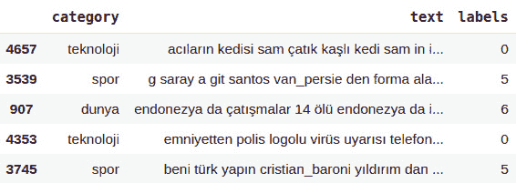

    图 5.5 – 文本分类数据集 – TTC 4900

1.  让我们使用 pandas 对象计算并绘制类别数量：

    ```py
    data.category.value_counts().plot(kind='pie')
    ```

    如下图所示，数据集的类别已经被相当分配：

    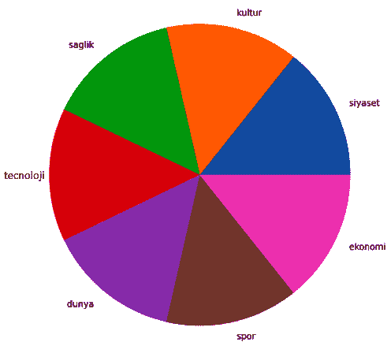

    图 5.6 – 类别分布

1.  以下执行实例化一个序列分类模型，带有标签数量（`7`）、标签 ID 映射和一个土耳其 BERT 模型（`dbmdz/bert-base-turkish-uncased`），即 BERTurk。要检查这一点，请执行以下操作：

    ```py
    >>> model
    ```

1.  输出将是模型的摘要，太长了，无法在此处显示。相反，让我们通过以下代码关注最后一层：

    ```py
    (classifier): Linear(in_features=768, out_features=7, bias=True)
    ```

1.  你可能已经注意到我们没有选择`DistilBert`，因为没有预先训练好的*uncased* `DistilBert`适用于土耳其语：

    ```py
    from transformers import BertTokenizerFast
    tokenizer = BertTokenizerFast.from_pre-trained("dbmdz/bert-base-turkish-uncased", max_length=512)
     from transformers import BertForSequenceClassification
    model = BertForSequenceClassification.from_pre-trained("dbmdz/bert-base-turkish-uncased", num_labels=NUM_LABELS, id2label=id2label, label2id=label2id)
    model.to(device)
    ```

1.  现在，让我们准备训练（%50）、验证（%25）和测试（%25）数据集，如下所示：

    ```py
    SIZE= data.shape[0]
    ## sentences
    train_texts= list(data.text[:SIZE//2])
    val_texts=   list(data.text[SIZE//2:(3*SIZE)//4 ])
    test_texts=  list(data.text[(3*SIZE)//4:])
    ## labels
    train_labels= list(data.labels[:SIZE//2])
    val_labels=   list(data.labels[SIZE//2:(3*SIZE)//4])
    test_labels=  list(data.labels[(3*SIZE)//4:])
    ## check the size
    len(train_texts), len(val_texts), len(test_texts)
    (2450, 1225, 1225)
    ```

1.  以下代码将三个数据集的句子进行标记化，并将它们的标记转换为整数（`input_ids`），然后将它们输入 BERT 模型：

    ```py
    train_encodings = tokenizer(train_texts, truncation=True, padding=True)
    val_encodings  = tokenizer(val_texts, truncation=True,
    padding=True)
    test_encodings = tokenizer(test_texts, truncation=True, padding=True)
    ```

1.  我们已经实现了`MyDataset`类（请参阅第 14 页）。该类继承自抽象的`Dataset`类，通过重写`__getitem__`和`__len__()`方法来使用任何数据加载器返回数据集的项目和大小，分别预期返回：

    ```py
    train_dataset = MyDataset(train_encodings, train_labels)
    val_dataset = MyDataset(val_encodings, val_labels)
    test_dataset = MyDataset(test_encodings, test_labels)
    ```

1.  由于我们有一个相对较小的数据集，我们将保持批处理大小为`16`。请注意，`TrainingArguments`的其他参数几乎与之前的情感分析实验相同：

    ```py
    from transformers import TrainingArguments, Trainer
    training_args = TrainingArguments(
        output_dir='./TTC4900Model', 
        do_train=True,
        do_eval=True,
        num_train_epochs=3,              
        per_device_train_batch_size=16,  
        per_device_eval_batch_size=32,
        warmup_steps=100,                
        weight_decay=0.01,
        logging_strategy='steps',                 
        logging_dir='./multi-class-logs',            
        logging_steps=50,
        evaluation_strategy="steps",
        eval_steps=50,
        save_strategy="epoch", 
        fp16=True,
        load_best_model_at_end=True
    ) 
    ```

1.  情感分析和文本分类是相同评估指标的对象；即宏平均的宏平均 F1、精度和召回率。因此，我们不会重新定义`compute_metric()`函数。以下是实例化`Trainer`对象的代码：

    ```py
    trainer = Trainer(
        model=model,                     
        args=training_args,                 
        train_dataset=train_dataset,         
        eval_dataset=val_dataset,            
        compute_metrics= compute_metrics
    )
    ```

1.  最后，让我们开始训练过程：

    ```py
    trainer.train()
    ```

    输出如下：

    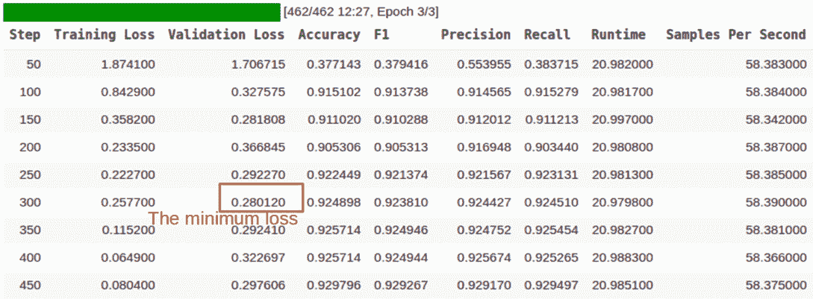

    图 5.7 – 文本分类的 Trainer 类的输出

1.  要检查训练好的模型，我们必须在三个数据集拆分上评估微调的模型，如下所示。我们的最佳模型是在步骤 300 微调的，损失为 0.28012：

    ```py
    q=[trainer.evaluate(eval_dataset=data) for data in [train_dataset, val_dataset, test_dataset]]
    pd.DataFrame(q, index=["train","val","test"]).iloc[:,:5]
    ```

    输出如下：

    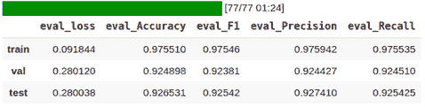

    图 5.8 – 文本分类模型在训练/验证/测试数据集上的性能

    分类准确率约为 92.6，而 F1 宏平均约为 92.5。在文献中，许多方法都在这个土耳其基准数据集上进行了测试。它们大多采用 TF-IDF 和线性分类器、word2vec 嵌入，或基于 LSTM 的分类器，最好的 F1 也达到了 90.0。与这些方法相比，除了 transformer，微调的 BERT 模型表现更佳。

1.  与任何其他实验一样，我们可以通过 TensorBoard 跟踪实验：

    ```py
    %load_ext tensorboard
    %tensorboard --logdir multi-class-logs/
    ```

1.  让我们设计一个运行推理模型的函数。如果你想看到真实标签而不是 ID，你可以使用我们模型的`config`对象，如下面的`predict`函数所示：

    ```py
    def predict(text):
        inputs = tokenizer(text, padding=True, truncation=True, max_length=512, return_tensors="pt").to("cuda")
        outputs = model(**inputs)
        probs = outputs[0].softmax(1)
        return probs, probs.argmax(),model.config.id2label[probs.argmax().item()]
    ```

1.  现在，我们准备调用`predict`函数进行文本分类推理。以下代码对一个关于足球队的句子进行分类：

    ```py
    text = "Fenerbahçeli futbolcular kısa paslarla hazırlık çalışması yaptılar"
    predict(text)
    (tensor([[5.6183e-04, 4.9046e-04, 5.1385e-04, 9.9414e-04, 3.4417e-04, 9.9669e-01, 4.0617e-04]], device='cuda:0', grad_fn=<SoftmaxBackward>), tensor(5, device='cuda:0'), 'spor') 
    ```

1.  正如我们所看到的，该模型正确地预测了句子为体育（`spor`）。现在，是时候保存模型并使用`from_pre-trained()`函数重新加载它了。以下是代码：

    ```py
    model_path = "turkish-text-classification-model"
    trainer.save_model(model_path)
    tokenizer.save_pre-trained(model_path)
    ```

1.  现在，我们可以重新加载已保存的模型，并借助`pipeline`类进行推理：

    ```py
    model_path = "turkish-text-classification-model"
    from transformers import pipeline, BertForSequenceClassification, BertTokenizerFast
    model = BertForSequenceClassification.from_pre-trained(model_path)
    tokenizer= BertTokenizerFast.from_pre-trained(model_path)
    nlp= pipeline("sentiment-analysis", model=model, tokenizer=tokenizer)
    ```

1.  您可能已经注意到任务的名称是`sentiment-analysis`。这个术语可能令人困惑，但这个参数实际上会返回最终的`TextClassificationPipeline`。让我们运行 pipeline：

    ```py
    >>> nlp("Sinemada hangi filmler oynuyor bugün")
    [{'label': 'kultur', 'score': 0.9930670261383057}]
    >>> nlp("Dolar ve Euro bugün yurtiçi piyasalarda yükseldi")
    [{'label': 'ekonomi', 'score': 0.9927696585655212}]
    >>> nlp("Bayern Münih ile Barcelona bugün karşı karşıya geliyor. Maçı İngiliz hakem James Watts yönetecek!")
    [{'label': 'spor', 'score': 0.9975664019584656}]
    ```

    这就是我们的模型！它已经成功预测了。

到目前为止，我们已经实现了两个单句任务；即情感分析和多类分类。在下一节，我们将学习如何处理句对输入，以及如何使用 BERT 设计回归模型。

# 为句对回归微调 BERT 模型

回归模型被认为是用于分类的，但最后一层只包含一个单元。这不是通过 softmax logistic 回归进行处理，而是进行了归一化。为了指定模型并在顶部放置单单元头层，我们可以直接通过`BERT.from_pre-trained()`方法传递`num_labels=1`参数，或者通过`Config`对象传递此信息。最初，这需要从预训练模型的`config`对象中复制，如下所示：

```py
from transformers import DistilBertConfig, DistilBertTokenizerFast, DistilBertForSequenceClassification
model_path='distilbert-base-uncased'
config = DistilBertConfig.from_pre-trained(model_path, num_labels=1)
tokenizer = DistilBertTokenizerFast.from_pre-trained(model_path)
model = \
DistilBertForSequenceClassification.from_pre-trained(model_path, config=config)
```

嗯，我们的预训练模型由于`num_labels=1`参数具有单单元头层。现在，我们准备用我们的数据集对模型进行微调。在这里，我们将使用**语义文本相似性基准**（**STS-B**），它是从各种内容中引用的句对集合，如新闻标题等。每对句子都被注释了从 1 到 5 的相似度分数。我们的任务是微调 BERT 模型以预测这些分数。我们将遵循文献，使用皮尔逊/斯皮尔曼相关系数评估模型。让我们开始吧：

1.  以下代码加载了数据。原始数据被分成了三部分。然而，测试分组没有标签，因此我们可以将验证数据分为两部分，如下所示：

    ```py
    import datasets
    from datasets import load_dataset
    stsb_train= load_dataset('glue','stsb', split="train")
    stsb_validation = load_dataset('glue','stsb', split="validation")
    stsb_validation=stsb_validation.shuffle(seed=42)
    stsb_val= datasets.Dataset.from_dict(stsb_validation[:750])
    stsb_test= datasets.Dataset.from_dict(stsb_validation[750:])
    ```

1.  让我们通过 pandas 将`stsb_train`训练数据整理整齐：

    ```py
    pd.DataFrame(stsb_train)
    ```

    训练数据如下所示：

    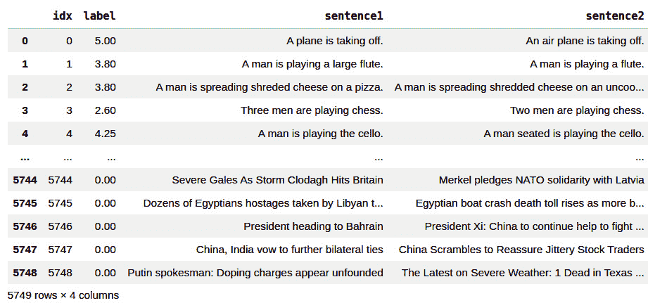

    图 5.9 – STS-B 训练数据集

1.  运行以下代码以检查三个集合的形状：

    ```py
    stsb_train.shape, stsb_val.shape, stsb_test.shape
    ((5749, 4), (750, 4), (750, 4))
    ```

1.  运行以下代码对数据集进行分词：

    ```py
    enc_train = stsb_train.map(lambda e: tokenizer( e['sentence1'],e['sentence2'], padding=True, truncation=True), batched=True, batch_size=1000) 
    enc_val =   stsb_val.map(lambda e: tokenizer( e['sentence1'],e['sentence2'], padding=True, truncation=True), batched=True, batch_size=1000) 
    enc_test =  stsb_test.map(lambda e: tokenizer( e['sentence1'],e['sentence2'], padding=True, truncation=True), batched=True, batch_size=1000)
    ```

1.  分词器使用 `[SEP]` 分隔符合并两个句子，并为句对生成单个 `input_ids` 和一个 `attention_mask`，如下所示：

    ```py
    pd.DataFrame(enc_train)
    ```

    输出如下：

    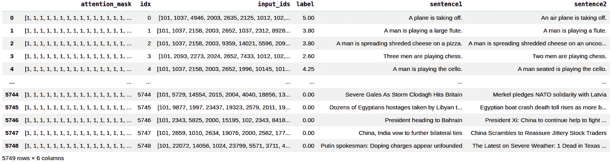

    ```py
    from transformers import TrainingArguments, Trainer
    training_args = TrainingArguments(
        output_dir='./stsb-model', 
        do_train=True,
        do_eval=True,
        num_train_epochs=3,              
        per_device_train_batch_size=32,  
        per_device_eval_batch_size=64,
        warmup_steps=100,                
        weight_decay=0.01,
        logging_strategy='steps',                
        logging_dir='./logs',            
        logging_steps=50,
        evaluation_strategy="steps",
        save_strategy="epoch",
        fp16=True,
        load_best_model_at_end=True
    )
    ```

1.  当前回归任务与以前的分类任务之间的另一个重要区别是 `compute_metrics` 的设计。在这里，我们的评估指标将基于**皮尔逊相关系数**和**斯皮尔曼秩相关**，遵循文献中提供的通用做法。我们还提供了**均方误差**（**MSE**）、**均方根误差**（**RMSE**）和**平均绝对误差**（**MAE**）等常用的度量标准，特别是对于回归模型：

    ```py
    import numpy as np
    from scipy.stats import pearsonr
    from scipy.stats import spearmanr
    def compute_metrics(pred):
        preds = np.squeeze(pred.predictions) 
        return {"MSE": ((preds - pred.label_ids) ** 2).mean().item(),
                "RMSE": (np.sqrt ((  (preds - pred.label_ids) ** 2).mean())).item(),
                "MAE": (np.abs(preds - pred.label_ids)).mean().item(),
         "Pearson" : pearsonr(preds,pred.label_ids)[0],
         "Spearman's Rank":spearmanr(preds,pred.label_ids)[0]
                }
    ```

1.  现在，让我们实例化 `Trainer` 对象：

    ```py
    trainer = Trainer(
            model=model,
            args=training_args,
            train_dataset=enc_train,
            eval_dataset=enc_val,
            compute_metrics=compute_metrics,
            tokenizer=tokenizer
        )
    ```

    运行训练，像这样：

    ```py
    train_result = trainer.train()
    ```

    输出如下：

    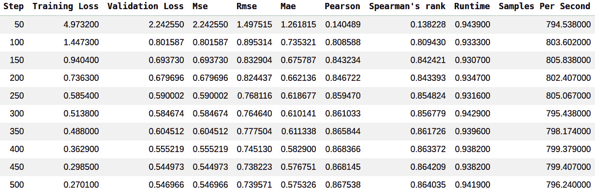

    图 5.11 – 文本回归的训练结果

1.  计算的最佳验证损失为 `0.544973`，在步骤 `450`。让我们在该步骤评估最佳检查点模型，如下所示：

    ```py
    q=[trainer.evaluate(eval_dataset=data) for data in [enc_train, enc_val, enc_test]]
    pd.DataFrame(q, index=["train","val","test"]).iloc[:,:5]
    ```

    输出如下：

    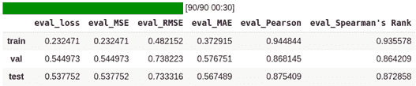

    图 5.12 – 训练/验证/测试数据集上的回归性能

    在测试数据集上，皮尔逊和斯皮尔曼相关分数分别约为 87.54 和 87.28。我们没有得到 SoTA 结果，但基于 GLUE Benchmark 排行榜，我们得到了一个可比较的 STS-B 任务结果。请查看排行榜！

1.  现在我们准备好进行推断模型了。让我们来看以下两个意思相同的句子，并将它们传递给模型：

    ```py
    s1,s2="A plane is taking off.","An air plane is taking off."
    encoding = tokenizer(s1,s2, return_tensors='pt', padding=True, truncation=True, max_length=512)
    input_ids = encoding['input_ids'].to(device)
    attention_mask = encoding['attention_mask'].to(device)
    outputs = model(input_ids, attention_mask=attention_mask)
    outputs.logits.item()
    OUTPUT: 4.033723831176758
    ```

1.  以下代码使用了负面句对，这意味着句子在语义上是不同的：

    ```py
    s1,s2="The men are playing soccer.","A man is riding a motorcycle."
    encoding = tokenizer("hey how are you there","hey how are you", return_tensors='pt', padding=True, truncation=True, max_length=512)
    input_ids = encoding['input_ids'].to(device)
    attention_mask = encoding['attention_mask'].to(device)
    outputs = model(input_ids, attention_mask=attention_mask)
    outputs.logits.item()
    OUTPUT: 2.3579328060150146
    ```

1.  最后，我们将保存模型，如下所示：

    ```py
    model_path = "sentence-pair-regression-model"
    trainer.save_model(model_path)
    tokenizer.save_pre-trained(model_path)
    ```

干得好！我们可以祝贺自己，因为我们成功完成了三项任务：情感分析、多类别分类和句对回归。

# 利用 run_glue.py 对模型进行微调

我们目前已经使用原生 PyTorch 和 `Trainer` 类从头设计了一个微调架构。HuggingFace 社区还提供了另一个强大的脚本，称为 `run_glue.py`，用于 GLUE 基准测试和 GLUE 类似的分类下游任务。这个脚本可以为我们处理和组织整个训练/验证过程。如果你想进行快速原型设计，应该使用这个脚本。它可以微调 HuggingFace hub 上的任何预训练模型。我们也可以用任何格式的自己的数据来提供给它。

请转到以下链接获取脚本并了解更多信息：[`github.com/huggingface/transformers/tree/master/examples`](https://github.com/huggingface/transformers/tree/master/examples)。

该脚本可以执行九种不同的 GLUE 任务。通过该脚本，我们可以做到目前为止我们使用`Trainer`类所做的一切。任务名称可以是以下 GLUE 任务之一：`cola`、`sst2`、`mrpc`、`stsb`、`qqp`、`mnli`、`qnli`、`rte`或`wnli`。

以下是微调模型的脚本方案：

```py
export TASK_NAME= "My-Task-Name" 
python run_glue.py \  
 --model_name_or_path bert-base-cased \
 --task_name $TASK_NAME \
 --do_train \  --do_eval \
 --max_seq_length 128 \ 
 --per_device_train_batch_size 32 \
 --learning_rate 2e-5 \  
 --num_train_epochs 3 \
 --output_dir /tmp/$TASK_NAME/
```

社区提供了另一个名为`run_glue_no_trainer.py`的脚本。与原始脚本的主要区别在于，这个无 Trainer 的脚本给了我们更多改变优化器选项或添加任何自定义的机会。

# 总结

在本章中，我们讨论了如何针对任何文本分类的下游任务对预训练模型进行微调。我们使用情感分析、多类别分类和句子对分类（具体而言，句子对回归）对模型进行了微调。我们使用了一个著名的 IMDb 数据集和我们自己的自定义数据集来训练模型。虽然我们利用了`Trainer`类来处理训练和微调过程的复杂性，但我们学会了如何使用原生库从头开始训练，以了解`transformers`库中的前向传播和反向传播。总而言之，我们讨论并进行了使用 Trainer 进行微调单句分类、使用原生 PyTorch 进行情感分类、单句多类别分类以及微调句子对回归。

在下一章中，我们将学习如何针对任何标记分类的下游任务（如词性标注或命名实体识别）对预训练模型进行微调。
