# 第七章：为标记分类对语言模型进行微调

在本章中，我们将学习为标记分类对语言模型进行微调。本章探讨了诸如**命名实体识别**（**NER**）、**词性**（**POS**）标注和**问答**（**QA**）等任务。我们将学习如何将特定语言模型微调用于此类任务。我们将更多地关注 BERT，而不是其他语言模型。您将学习如何使用 BERT 应用 POS、NER 和 QA。您将熟悉这些任务的理论细节，如它们各自的数据集以及如何执行它们。完成本章后，您将能够使用 Transformers 执行任何标记分类。

在本章中，我们将为以下任务微调 BERT：为 NER 和 POS 等标记分类问题微调 BERT，为 NER 问题微调语言模型，并将 QA 问题视为起始/终止标记分类。

本章将涵盖以下主题：

+   介绍标记分类

+   为 NER 进行语言模型微调

+   使用标记分类进行问答

# 技术要求

我们将使用 Jupyter Notebook 运行我们的编码练习，并且需要安装 Python 3.6+ 和以下软件包：

+   `sklearn`

+   `transformers 4.0+`

+   `数据集`

+   `seqeval`

所有带有编码练习的笔记本都将在以下 GitHub 链接中提供：[`github.com/PacktPublishing/Mastering-Transformers/tree/main/CH06`](https://github.com/PacktPublishing/Mastering-Transformers/tree/main/CH06)。

查看以下链接以查看实际代码视频：[`bit.ly/2UGMQP2`](https://bit.ly/2UGMQP2)

# 介绍标记分类

将标记序列中的每个标记分类的任务称为**标记分类**。该任务要求特定模型能够将每个标记分类到一个类别中。POS 和 NER 是这一标准中最知名的两个任务。然而，QA 也是另一个属于这一类别的重要 NLP 任务。我们将在以下章节讨论这三个任务的基础知识。

## 理解 NER

在标记分类类别中一个著名的任务是 NER - 将每个标记识别为实体或非实体，并识别每个检测到的实体的类型。例如，文本可以同时包含多个实体 - 人名、地名、组织名和其他类型的实体。以下文本是 NER 的明显示例：

`乔治·华盛顿是美利坚合众国的总统之一。`

*乔治·华盛顿*是一个人名，而*美利坚合众国*是一个地名。序列标注模型应该能够以标签的形式标记每个单词，每个标签都包含有关该标签的信息。BIO 的标签是标准 NER 任务中通用的标签。

以下表格是标签及其描述的列表：

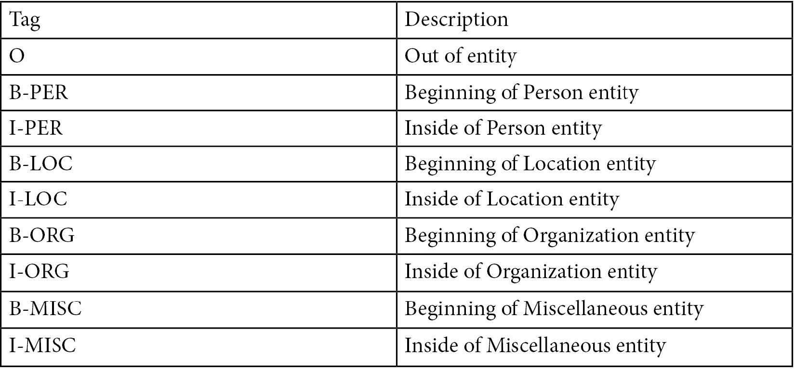

表 1 – BIOS 标签及其描述表

从这个表格可以看出，**B** 表示标记的开始，**I** 表示标记的内部，而 **O** 则表示实体的外部。这就是为什么这种类型的标注被称为 **BIO**。例如，前面显示的句子可以使用 BIO 进行标注：

```py
[B-PER|George] [I-PER|Washington] [O|is] [O|one] [O|the] [O|presidents] [O|of] [B-LOC|United] [I-LOC|States] [I-LOC|of] [I-LOC|America] [O|.]
```

因此，序列必须以 BIO 格式进行标记。一个样本数据集可以使用如下格式：

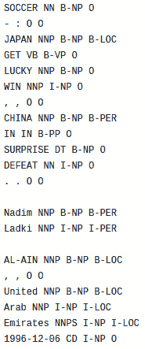

图 6.1 – CONLL2003 数据集

除了我们见过的 NER 标签外，该数据集还包含了 POS 标签

## 理解 POS 标记

POS 标记，或语法标记，是根据给定文本中的各自词的词性对其进行标注。举个简单的例子，在给定文本中，识别每个词的角色，如名词、形容词、副词和动词都被认为是词性标注。然而，从语言学角度来看，除了这四种角色外还有很多其他角色。

在 POS 标签的情况下，有各种变化，但是宾州树库的 POS 标签集是最著名的之一。下面的截图显示了这些角色的摘要和相应的描述：

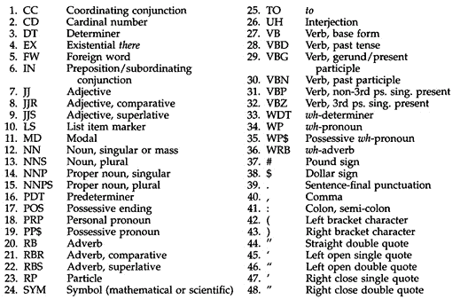

图 6.2 – 宾州树库 POS 标签

POS 任务的数据集如 *图 6.1* 所示进行了标注。

这些标签的标注在特定的 NLP 应用中非常有用，是许多其他方法的基石之一。变压器和许多先进模型在其复杂的结构中某种程度上能理解单词之间的关系。

## 理解 QA

QA 或阅读理解任务包括一组阅读理解文本，并相应地提出问题。这个范围内的示例数据集包括 **SQUAD** 或 **斯坦福问答数据集**。该数据集由维基百科文本和关于它们提出的问题组成。答案以原始维基百科文本的片段形式给出。

以下截图显示了这个数据集的一个示例：

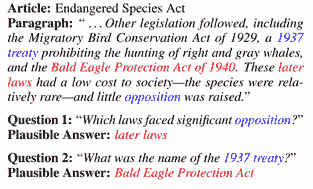

图 6.3 – SQUAD 数据集示例

突出显示的红色部分是答案，每个问题的重要部分用蓝色突出显示。要求一个良好的 NLP 模型按照问题对文本进行分割，这种分割可以通过序列标注的形式进行。模型会将答案的开始和结束部分标记为答案的起始和结束部分。

到目前为止，你已经学会了现代 NLP 序列标注任务的基础知识，如 QA、NER 和 POS。在接下来的部分，你将学习如何对这些特定任务进行 BERT 微调，并使用 `datasets` 库中相关的数据集。

# 为 NER 微调语言模型

在本节中，我们将学习如何为 NER 任务微调 BERT。我们首先从 `datasets` 库开始，并加载 `conll2003` 数据集。

数据集卡片可在 [`huggingface.co/datasets/conll2003`](https://huggingface.co/datasets/conll2003) 上访问。以下截图显示了来自 HuggingFace 网站的此模型卡片：

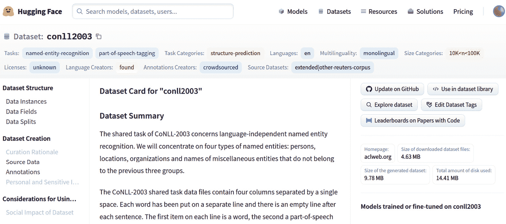

图 6.4 – 来自 HuggingFace 的 CONLL2003 数据集卡片

从此截图中可以看出，模型是在此数据集上进行训练的，目前可用，并在右侧面板中列出。但是，还有关于数据集的描述，例如其大小和特征：

1.  要加载数据集，使用以下命令：

    ```py
    import datasets
    conll2003 = datasets.load_dataset("conll2003")
    ```

    将出现一个下载进度条，下载和缓存完成后，数据集将准备好供使用。以下截图显示了进度条：

    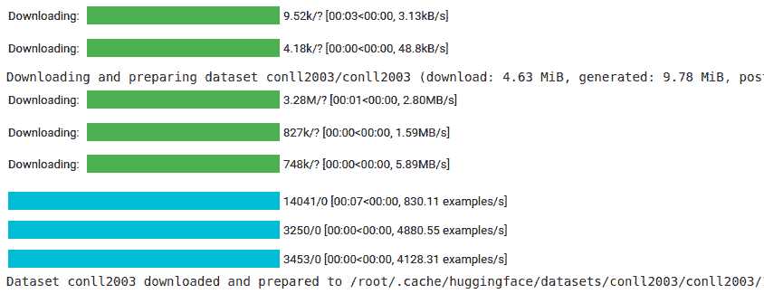

    图 6.5 – 下载和准备数据集

1.  您可以通过使用以下命令访问训练样本轻松地检查数据集：

    ```py
    >>> conll2003["train"][0]
    ```

    下图显示了结果：

    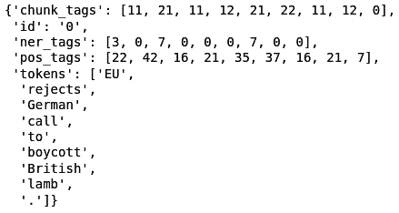

    图 6.6 – 从 datasets 库获取的 CONLL2003 训练样本

1.  前述截图显示了 POS 和 NER 的相应标签。我们将仅使用此部分的 NER 标签。您可以使用以下命令获取此数据集中可用的 NER 标签：

    ```py
    >>> conll2003["train"].features["ner_tags"]
    ```

1.  结果也显示在 *图 6.7* 中。所有 BIO 标签都显示在此处，共有九个标签：

    ```py
    >>> Sequence(feature=ClassLabel(num_classes=9, names=['O', 'B-PER', 'I-PER', 'B-ORG', 'I-ORG', 'B-LOC', 'I-LOC', 'B-MISC', 'I-MISC'], names_file=None, id=None), length=-1, id=None)
    ```

1.  下一步是加载 BERT 分词器：

    ```py
    from transformers import BertTokenizerFast
    tokenizer = BertTokenizerFast.from_pretrained("bert-base-uncased")
    ```

1.  `tokenizer` 类也可以处理基于空格的分词句子。我们需要启用我们的分词器以处理基于空格的分词句子，因为命名实体识别任务为每个标记有一个基于标记的标签。在这个任务中，标记通常是基于空格分词的单词，而不是 BPE 或任何其他分词器的标记。根据所说的内容，让我们看看 `tokenizer` 如何与基于空格的分词句子一起使用：

    ```py
    >>> tokenizer(["Oh","this","sentence","is","tokenized","and", "splitted","by","spaces"], is_split_into_words=True)
    ```

    正如您所见，仅需将 `is_split_into_words` 设置为 `True`，问题就解决了。

1.  在使用数据进行训练之前，必须对数据进行预处理。为此，我们必须使用以下函数并将其映射到整个数据集中：

    ```py
    def tokenize_and_align_labels(examples):
        tokenized_inputs = tokenizer(examples["tokens"], 
               truncation=True, is_split_into_words=True)
        labels = []
        for i, label in enumerate(examples["ner_tags"]):
            word_ids = \   
             tokenized_inputs.word_ids(batch_index=i)
            previous_word_idx = None
            label_ids = []
            for word_idx in word_ids:
                if word_idx is None:
                    label_ids.append(-100)
                elif word_idx != previous_word_idx:
                     label_ids.append(label[word_idx])
                else:
                     label_ids.append(label[word_idx] if label_all_tokens else -100)
                previous_word_idx = word_idx
            labels.append(label_ids)
        tokenized_inputs["labels"] = labels
        return tokenized_inputs
    ```

1.  此函数将确保我们的标记和标签正确对齐。此对齐是必需的，因为标记是分割成片段的，但单词必须是一个整体。要测试并查看此函数的工作原理，您可以将单个样本提供给它并运行它：

    ```py
    q = tokenize_and_align_labels(conll2003['train'][4:5])
    print(q)
    ```

    结果如下所示：

    ```py
    >>> {'input_ids': [[101, 2762, 1005, 1055, 4387, 2000, 1996, 2647, 2586, 1005, 1055, 15651, 2837, 14121, 1062, 9328, 5804, 2056, 2006, 9317, 10390, 2323, 4965, 8351, 4168, 4017, 2013, 3032, 2060, 2084, 3725, 2127, 1996, 4045, 6040, 2001, 24509, 1012, 102]], 'token_type_ids': [[0, 0, 0, 0, 0, 0, 0, 0, 0, 0, 0, 0, 0, 0, 0, 0, 0, 0, 0, 0, 0, 0, 0, 0, 0, 0, 0, 0, 0, 0, 0, 0, 0, 0, 0, 0, 0, 0, 0]], 'attention_mask': [[1, 1, 1, 1, 1, 1, 1, 1, 1, 1, 1, 1, 1, 1, 1, 1, 1, 1, 1, 1, 1, 1, 1, 1, 1, 1, 1, 1, 1, 1, 1, 1, 1, 1, 1, 1, 1, 1, 1]], 'labels': [[-100, 5, 0, -100, 0, 0, 0, 3, 4, 0, -100, 0, 0, 1, 2, -100, -100, 0, 0, 0, 0, 0, 0, 0, -100, -100, 0, 0, 0, 0, 5, 0, 0, 0, 0, 0, 0, 0, -100]]}
    ```

1.  但是这个结果是不可读的，所以您可以运行以下代码以获得可读版本：

    ```py
    for token, label in zip(tokenizer.convert_ids_to_tokens(q["input_ids"][0]),q["labels"][0]):
        print(f"{token:_<40} {label}")
    ```

    结果如下所示：

    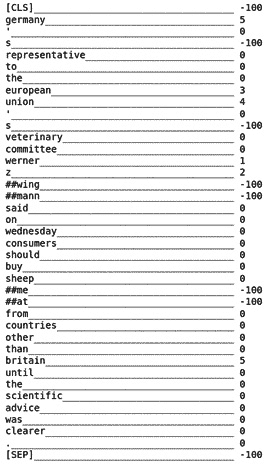

    图 6.7 – tokenize 和 align 函数的结果

1.  这个函数与数据集的映射可以通过`datasets`库的`map`函数完成：

    ```py
    >>> tokenized_datasets = \ conll2003.map(tokenize_and_align_labels, batched=True)
    ```

1.  接下来，需要加载具有相应标签数量的 BERT 模型:

    ```py
    from transformers import\ AutoModelForTokenClassification
    model = AutoModelForTokenClassification.from_pretrained("bert-base-uncased", num_labels=9)
    ```

1.  模型将被加载并准备好进行训练。在接下来的步骤中，我们必须准备好训练器和训练参数：

    ```py
    from transformers import TrainingArguments, Trainer
    args = TrainingArguments(
    "test-ner",
    evaluation_strategy = "epoch",
    learning_rate=2e-5,
    per_device_train_batch_size=16,
    per_device_eval_batch_size=16,
    num_train_epochs=3,
    weight_decay=0.01,
    )
    ```

1.  需要准备数据收集器。它将在训练数据集上应用批量操作，以使用更少的内存并执行更快。您可以像下面这样做:

    ```py
    from transformers import \ DataCollatorForTokenClassification
    data_collator = \ DataCollatorForTokenClassification(tokenizer)
    ```

1.  为了能够评估模型的性能，在 HuggingFace 的`datasets`库中有许多任务的许多指标可用。我们将使用用于 NER 的序列评估指标。seqeval 是一个用于评估序列标记算法和模型的良好 Python 框架。需要安装`seqeval`库:

    ```py
    pip install seqeval
    ```

1.  之后，您可以加载指标：

    ```py
    >>> metric = datasets.load_metric("seqeval")
    ```

1.  通过以下代码，很容易看出指标是如何工作的:

    ```py
    example = conll2003['train'][0] 
    label_list = \ conll2003["train"].features["ner_tags"].feature.names
    labels = [label_list[i] for i in example["ner_tags"]]
    metric.compute(predictions=[labels], references=[labels])
    ```

    结果如下:

    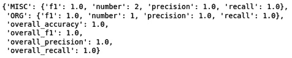

    图 6.8 – seqeval 指标的输出

    对于样本输入，计算各种指标，如准确率、F1 分数、精确度和召回率。

1.  以下函数用于计算指标:

    ```py
    import numpy as np def compute_metrics(p):
        predictions, labels = p
        predictions = np.argmax(predictions, axis=2)
        true_predictions = [
            [label_list[p] for (p, l) in zip(prediction, label) if l != -100]
            for prediction, label in zip(predictions, labels)    ]
        true_labels = [
        [label_list[l] for (p, l) in zip(prediction, label) if l != -100]
           for prediction, label in zip(predictions, labels)
       ]
       results = \ 
           metric.compute(predictions=true_predictions,  
           references=true_labels)
       return {
       "precision": results["overall_precision"],
       "recall": results["overall_recall"],
       "f1": results["overall_f1"],
      "accuracy": results["overall_accuracy"],
      }
    ```

1.  最后一步是制作训练器并相应地对其进行训练:

    ```py
    trainer = Trainer(
        model,
        args,
       train_dataset=tokenized_datasets["train"],
       eval_dataset=tokenized_datasets["validation"],
       data_collator=data_collator,
       tokenizer=tokenizer,
       compute_metrics=compute_metrics
    )
    trainer.train()
    ```

1.  运行`trainer`的`train`函数后，结果如下所示: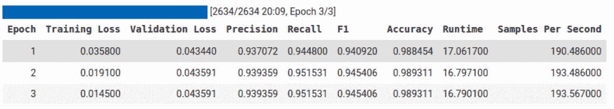

    图 6.9-运行 train 后的 Trainer 结果

1.  在训练后，必须保存模型和分词器:

    ```py
    model.save_pretrained("ner_model")
    tokenizer.save_pretrained("tokenizer")
    ```

1.  如果您希望使用管道（pipeline）使用模型，则必须读取配置文件，并根据`label_list`对象中使用的标签正确分配`label2id`和`id2label`:

    ```py
    id2label = {
    str(i): label for i,label in enumerate(label_list)
    }
    label2id = {
    label: str(i) for i,label in enumerate(label_list)
    }
    import json
    config = json.load(open("ner_model/config.json"))
    config["id2label"] = id2label
    config["label2id"] = label2id
    json.dump(config, open("ner_model/config.json","w"))
    ```

1.  之后，您可以像以下示例一样轻松使用模型:

    ```py
    from transformers import pipeline
    model = \ AutoModelForTokenClassification.from_pretrained("ner_model")
    nlp = \
    pipeline("ner", model=mmodel, tokenizer=tokenizer)
    example = "I live in Istanbul"
    ner_results = nlp(example)
    print(ner_results)
    ```

    然后结果将如下所示:

    ```py
    [{'entity': 'B-LOC', 'score': 0.9983942, 'index': 4, 'word': 'istanbul', 'start': 10, 'end': 18}] 
    ```

到目前为止，您已经学会了如何使用 BERT 应用 POS。您了解了如何使用 Transformers 训练自己的 POS 标注模型，并对模型进行了测试。在接下来的部分，我们将专注于 QA。

# 使用令牌分类进行问答

一个**QA**问题通常被定义为一个 NLP 问题，给定一个文本和一个问题，需要 AI 返回一个答案。通常，这个答案可以在原始文本中找到，但对于这个问题存在不同的方法。在**视觉问答**（**VQA**）的情况下，问题涉及的是视觉实体或视觉概念，而不是文本，但问题本身是以文本形式呈现的。

一些 VQA 的示例如下:

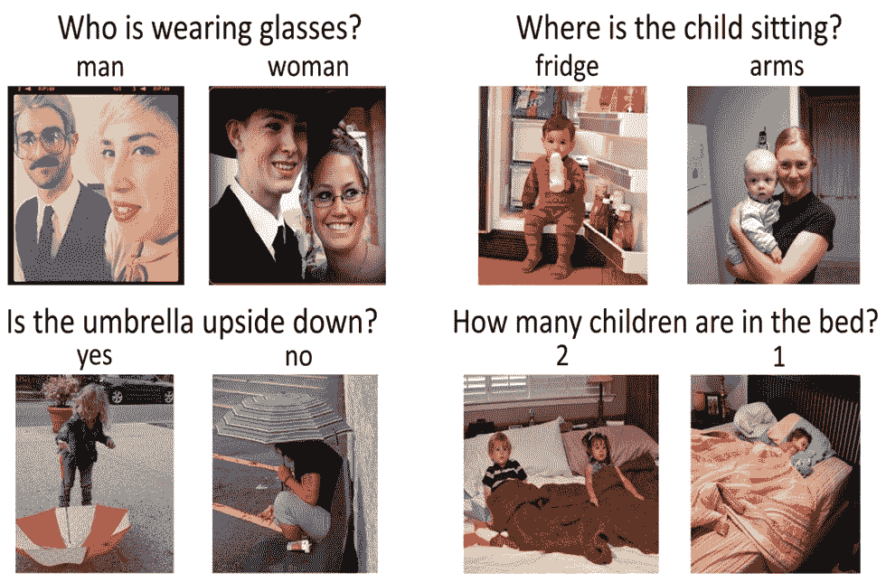

图 6.10 – VQA 示例

VQA 中大多数模型都是多模态模型，可以理解视觉上下文以及问题，并能正确生成答案。然而，单模全文本 QA 或者仅 QA 是基于文本上下文和文本问题以及相应的文本答案：

1.  SQUAD 是问答领域中最知名的数据集之一。要查看 SQUAD 的示例并对其进行检查，您可以使用以下代码：

    ```py
    from pprint import pprint
    from datasets import load_dataset
    squad = load_dataset("squad")
    for item in squad["train"][1].items():
        print(item[0])
        pprint(item[1])
        print("="*20)
    ```

    以下是结果：

    ```py
    answers
    {'answer_start': [188], 'text': ['a copper statue of Christ']}
    ====================
    Context
    ('Architecturally, the school has a Catholic character. Atop the Main ' "Building's gold dome is a golden statue of the Virgin Mary. Immediately in " 'front of the Main Building and facing it, is a copper statue of Christ with ' 'arms upraised with the legend "Venite Ad Me Omnes". Next to the Main ' 'Building is the Basilica of the Sacred Heart. Immediately behind the ' 'basilica is the Grotto, a Marian place of prayer and reflection. It is a ' 'replica of the grotto at Lourdes, France where the Virgin Mary reputedly ' 'appeared to Saint Bernadette Soubirous in 1858\. At the end of the main drive ' '(and in a direct line that connects through 3 statues and the Gold Dome), is ' 'a simple, modern stone statue of Mary.')
    ====================
    Id
    '5733be284776f4190066117f'
    ====================
    Question
    'What is in front of the Notre Dame Main Building?'
    ====================
    Title
    'University_of_Notre_Dame'
    ====================
    ```

    但是，SQUAD 数据集还有第 2 版，其中有更多的训练样本，并且强烈建议使用它。为了全面了解如何为 QA 问题训练模型的可能性，我们将重点放在解决这个问题的当前部分上。

1.  要开始，使用以下代码加载 SQUAD 第 2 版：

    ```py
    from datasets import load_dataset
    squad = load_dataset("squad_v2")
    ```

1.  在加载 SQUAD 数据集之后，您可以通过使用以下代码查看此数据集的详细信息：

    ```py
    >>> squad
    ```

    结果如下：

    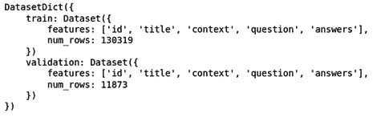

    图 6.11 – SQUAD 数据集（第 2 版）详细信息

    SQUAD 数据集的详细信息将显示在*图 6.11*中。正如您所看到的，有超过 130,000 个训练样本和超过 11,000 个验证样本。

1.  就像我们对 NER 所做的那样，我们必须预处理数据，使其具有适合模型使用的正确形式。为此，您必须首先加载您的分词器，只要您使用预训练模型并希望为 QA 问题进行微调：

    ```py
    from transformers import AutoTokenizer
    model = "distilbert-base-uncased"
    tokenizer = AutoTokenizer.from_pretrained(model)
    ```

    正如您所看到的，我们将使用`distillBERT`模型。

    根据我们的 SQUAD 示例，我们需要向模型提供不止一个文本，一个用于问题，一个用于上下文。因此，我们的分词器需要将这两个文本并排放在一起，并使用特殊的`[SEP]`标记将它们分开，因为`distillBERT`是基于 BERT 的模型。

    在 QA 范围内还有另一个问题，即上下文的大小。上下文的大小可以比模型输入大小长，但我们不能将其缩减到模型接受的大小。对于某些问题，我们可能可以这样做，但在 QA 中，答案可能在被截断的部分中。我们将向您展示一个示例，展示我们如何使用文档步幅来解决此问题。

1.  以下是一个示例，展示了如何使用`tokenizer`：

    ```py
    max_length = 384
    doc_stride = 128
    example = squad["train"][173]
    tokenized_example = tokenizer(
    example["question"],
    example["context"],
    max_length=max_length,
    truncation="only_second",
    return_overflowing_tokens=True,
    stride=doc_stride
    )
    ```

1.  步幅是用于返回第二部分的窗口的文档步幅，而`return_overflowing_tokens`标志向模型提供有关是否应返回额外标记的信息。`tokenized_example`的结果不止一个标记化输出，而是有两个输入 ID。在以下，您可以看到结果：

    ```py
    >>> len(tokenized_example['input_ids'])
    >>> 2
    ```

1.  因此，您可以通过运行以下`for`循环看到完整的结果：

    ```py
    for input_ids in tokenized_example["input_ids"][:2]:
        print(tokenizer.decode(input_ids))
        print("-"*50)
    ```

    结果如下：

    ```py
    [CLS] beyonce got married in 2008 to whom? [SEP] on april 4, 2008, beyonce married jay z. she publicly revealed their marriage in a video montage at the listening party for her third studio album, i am... sasha fierce, in manhattan's sony club on october 22, 2008\. i am... sasha fierce was released on november 18, 2008 in the united states. the album formally introduces beyonce's alter ego sasha fierce, conceived during the making of her 2003 single " crazy in love ", selling 482, 000 copies in its first week, debuting atop the billboard 200, and giving beyonce her third consecutive number - one album in the us. the album featured the number - one song " single ladies ( put a ring on it ) " and the top - five songs " if i were a boy " and " halo ". achieving the accomplishment of becoming her longest - running hot 100 single in her career, " halo "'s success in the us helped beyonce attain more top - ten singles on the list than any other woman during the 2000s. it also included the successful " sweet dreams ", and singles " diva ", " ego ", " broken - hearted girl " and " video phone ". the music video for " single ladies " has been parodied and imitated around the world, spawning the " first major dance craze " of the internet age according to the toronto star. the video has won several awards, including best video at the 2009 mtv europe music awards, the 2009 scottish mobo awards, and the 2009 bet awards. at the 2009 mtv video music awards, the video was nominated for nine awards, ultimately winning three including video of the year. its failure to win the best female video category, which went to american country pop singer taylor swift's " you belong with me ", led to kanye west interrupting the ceremony and beyonce [SEP]
    --------------------------------------------------
    [CLS] beyonce got married in 2008 to whom? [SEP] single ladies " has been parodied and imitated around the world, spawning the " first major dance craze " of the internet age according to the toronto star. the video has won several awards, including best video at the 2009 mtv europe music awards, the 2009 scottish mobo awards, and the 2009 bet awards. at the 2009 mtv video music awards, the video was nominated for nine awards, ultimately winning three including video of the year. its failure to win the best female video category, which went to american country pop singer taylor swift's " you belong with me ", led to kanye west interrupting the ceremony and beyonce improvising a re - presentation of swift's award during her own acceptance speech. in march 2009, beyonce embarked on the i am... world tour, her second headlining worldwide concert tour, consisting of 108 shows, grossing $ 119\. 5 million. [SEP]
    --------------------------------------------------
    ```

    正如您可以从前面的输出中看到的那样，使用 128 个标记的窗口，剩余的上下文再次复制到了第二个输出的输入 ID 中。

    另一个问题是结束跨度，在数据集中不可用，而是给出了答案的开始跨度或开始字符。很容易找到答案的长度并将其添加到起始跨度，这将自动产生结束跨度。

1.  现在，我们已经了解了该数据集的所有细节以及如何处理它们，我们可以轻松地将它们组合在一起，制作一个预处理函数（链接：[`github.com/huggingface/transformers/blob/master/examples/pytorch/question-answering/run_qa.py`](https://github.com/huggingface/transformers/blob/master/examples/pytorch/question-answering/run_qa.py)）：

    ```py
    def prepare_train_features(examples):
        # tokenize examples
        tokenized_examples = tokenizer(
            examples["question" if pad_on_right else "context"],
            examples["context" if pad_on_right else "question"],
            truncation="only_second" if pad_on_right else "only_first",
            max_length=max_length,
            stride=doc_stride,
            return_overflowing_tokens=True,
            return_offsets_mapping=True,
            padding="max_length",
        )
        # map from a feature to its example
        sample_mapping = \ tokenized_examples.pop("overflow_to_sample_mapping")
        offset_mapping = \ tokenized_examples.pop("offset_mapping")
        tokenized_examples["start_positions"] = []
        tokenized_examples["end_positions"] = []
        # label impossible answers with CLS
        # start and end token are the answers for each one
        for i, offsets in enumerate(offset_mapping):
            input_ids = tokenized_examples["input_ids"][i]
            cls_index = \ input_ids.index(tokenizer.cls_token_id)
            sequence_ids = \ tokenized_examples.sequence_ids(i)
            sample_index = sample_mapping[i]
            answers = examples["answers"][sample_index]
            if len(answers["answer_start"]) == 0:
                tokenized_examples["start_positions"].\ append(cls_index)
                tokenized_examples["end_positions"].\ append(cls_index)
            else:
                start_char = answers["answer_start"][0]
                end_char = \                        
                   start_char + len(answers["text"][0])
                token_start_index = 0
                while sequence_ids[token_start_index] != / (1 if pad_on_right else 0):
                    token_start_index += 1
                token_end_index = len(input_ids) - 1
                while sequence_ids[token_end_index] != (1 if pad_on_right else 0):
                    token_end_index -= 1
                if not (offsets[token_start_index][0] <= start_char and offsets[token_end_index][1] >= end_char):
                    tokenized_examples["start_positions"].append(cls_index)
                    tokenized_examples["end_positions"].append(cls_index)
                else:
                    while token_start_index < len(offsets) and offsets[token_start_index][0] <= start_char:
                        token_start_index += 1
                    tokenized_examples["start_positions"].append(token_start_index - 1)
                    while offsets[token_end_index][1] >= end_char:
                        token_end_index -= 1
                    tokenized_examples["end_positions"].append(token_end_index + 1)
        return tokenized_examples
    ```

1.  将此函数映射到数据集将应用所有所需的更改：

    ```py
    >>> tokenized_datasets = squad.map(prepare_train_features, batched=True, remove_columns=squad["train"].column_names)
    ```

1.  就像其他示例一样，您现在可以加载预训练的模型进行微调：

    ```py
    from transformers import AutoModelForQuestionAnswering, TrainingArguments, Trainer
    model = AutoModelForQuestionAnswering.from_pretrained(model)
    ```

1.  下一步是创建训练参数：

    ```py
    args = TrainingArguments(
    "test-squad",
    evaluation_strategy = "epoch",
    learning_rate=2e-5,
    per_device_train_batch_size=16,
    per_device_eval_batch_size=16,
    num_train_epochs=3,
    weight_decay=0.01,
    )
    ```

1.  如果我们不打算使用数据收集器，我们将为模型训练器提供一个默认的数据收集器：

    ```py
    from transformers import default_data_collator
    data_collator = default_data_collator
    ```

1.  现在，一切准备就绪，可以制作训练器：

    ```py
    trainer = Trainer(
    model,
    args,
    train_dataset=tokenized_datasets["train"],
    eval_dataset=tokenized_datasets["validation"],
    data_collator=data_collator,
    tokenizer=tokenizer,
    )
    ```

1.  训练器可以与`train`函数一起使用：

    ```py
    trainer.train()
    ```

    结果将如下所示：

    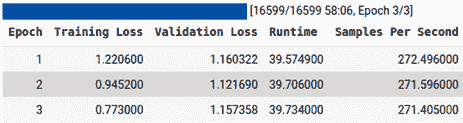

    图 6.12 - 训练结果

    如您所见，该模型使用三个 epochs 进行训练，并报告验证和训练中的损失输出。

1.  像其他模型一样，您可以轻松地使用以下函数保存此模型：

    ```py
    >>> trainer.save_model("distillBERT_SQUAD")
    ```

    如果您想使用您保存的模型或任何在 QA 上训练的其他模型，则`transformers`库提供了一个易于使用和实施的管道，无需额外努力。

1.  通过使用这个管道功能，您可以使用任何模型。以下是使用 QA 管道的示例：

    ```py
    from transformers import pipeline
    qa_model = pipeline('question-answering', model='distilbert-base-cased-distilled-squad', tokenizer='distilbert-base-cased')
    ```

    管道只需要两个输入，即模型和 tokenizer，即可使模型准备就绪。但是，在给定示例中，您还需要给它一个管道类型，即 QA。

1.  下一步是给它提供所需的输入，即`context`和`question`：

    ```py
    >>> question = squad["validation"][0]["question"]
    >>> context = squad["validation"][0]["context"]
    The question and the context can be seen by using following code:
    >>> print("Question:")
    >>> print(question)
    >>> print("Context:")
    >>> print(context)
    Question:
    In what country is Normandy located?
    Context:
    ('The Normans (Norman: Nourmands; French: Normands; Latin: Normanni) were the ' 'people who in the 10th and 11th centuries gave their name to Normandy, a ' 'region in France. They were descended from Norse ("Norman" comes from ' '"Norseman") raiders and pirates from Denmark, Iceland and Norway who, under ' 'their leader Rollo, agreed to swear fealty to King Charles III of West ' 'Francia. Through generations of assimilation and mixing with the native ' 'Frankish and Roman-Gaulish populations, their descendants would gradually ' 'merge with the Carolingian-based cultures of West Francia. The distinct ' 'cultural and ethnic identity of the Normans emerged initially in the first ' 'half of the 10th century, and it continued to evolve over the succeeding ' 'centuries.')
    ```

1.  该模型可以使用以下示例：

    ```py
    >>> qa_model(question=question, context=context)
    ```

    结果如下所示：

    ```py
    {'answer': 'France', 'score': 0.9889379143714905, 'start': 159, 'end': 165,}
    ```

到目前为止，您已经学会了如何在想要的数据集上进行训练。您还学会了如何使用管道使用训练好的模型。

# 概述

在本章中，我们讨论了如何对预训练模型进行微调以适用于任何令牌分类任务。我们探讨了在 NER 和 QA 问题上微调模型的方法。使用预训练和微调后的模型在特定任务中使用管道进行详细说明，并给出了示例。我们还了解了这两个任务的各种预处理步骤。保存在特定任务上微调的预训练模型是本章的另一个重点学习内容。我们还看到了如何将具有比模型输入更长序列大小的 QA 等任务的有限输入大小的模型进行训练的可能性。在本章中，更高效地使用标记器以具有文档间距和文档步幅的文档分割也是另一个重要内容。

在下一章中，我们将讨论使用 Transformer 进行文本表示的方法。通过学习本章，您将学习如何执行零/少量样本学习和语义文本聚类。
