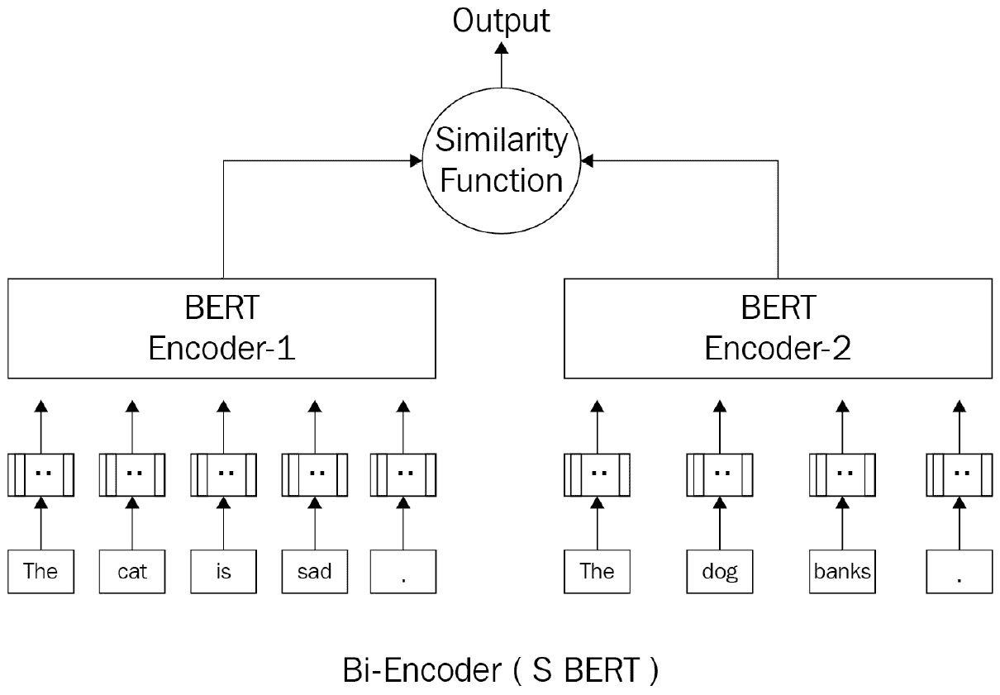
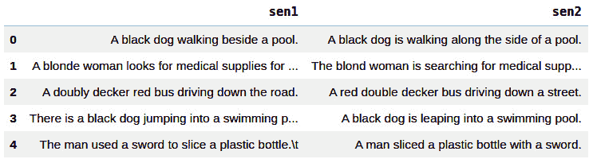
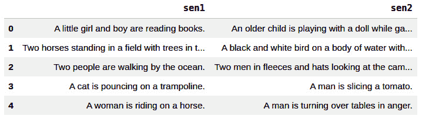
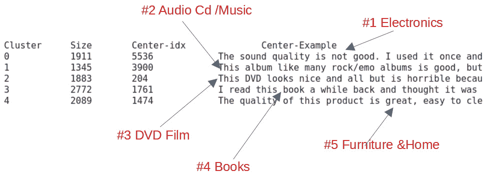
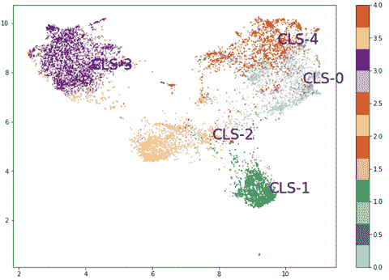
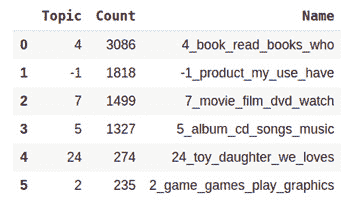
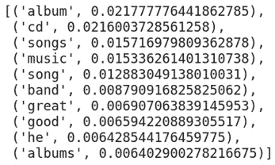
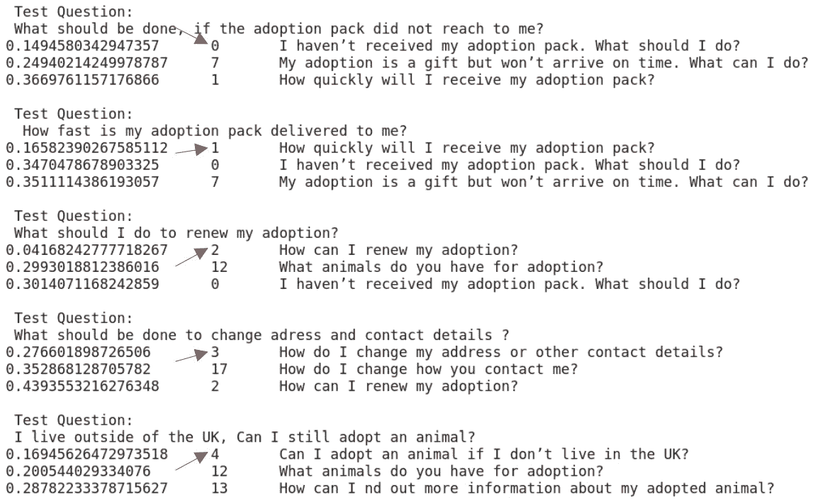
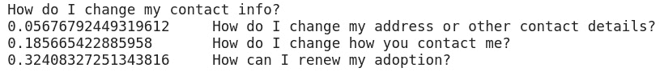
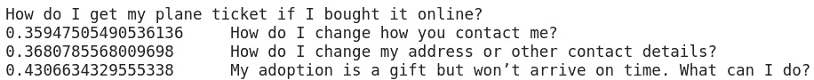

# 文本表示

到目前为止，我们已经使用`transformers`库解决了分类和生成问题。文本表示是现代**自然语言处理**（**NLP**）中的另一个关键任务，特别是对于无监督任务，如聚类、语义搜索和主题建模。通过使用诸如**Universal Sentence Encoder**（**USE**）和带有附加库（如句子转换器）的 Siamese BERT（Sentence-BERT）等各种模型来表示句子将在此处进行解释。还将解释使用 BART 进行零样本学习，并学习如何利用它。还将描述少样本学习方法和无监督使用案例，如语义文本聚类和主题建模。最后，将涵盖一次性学习用例，如语义搜索。

本章将涵盖以下主题：

+   句子嵌入简介

+   句子相似度模型的基准测试

+   使用 BART 进行零样本学习

+   使用 FLAIR 进行语义相似性实验

+   使用 Sentence-BERT 进行文本聚类

+   使用 Sentence-BERT 进行语义搜索

# 技术要求

我们将使用 Jupyter 笔记本来运行我们的编程练习。为此，您将需要 Python 3.6+和以下软件包：

+   `sklearn`

+   `transformers >=4.00`

+   `datasets`

+   `sentence-transformers`

+   `tensorflow-hub`

+   `flair`

+   `umap-learn`

+   `bertopic`

本章中编程练习的所有笔记本将在以下 GitHub 链接上提供：

[`github.com/PacktPublishing/Mastering-Transformers/tree/main/CH07`](https://github.com/PacktPublishing/Mastering-Transformers/tree/main/CH07)

查看以下链接以查看代码演示视频：[`bit.ly/2VcMCyI`](https://bit.ly/2VcMCyI)

# 句子嵌入简介

预训练的 BERT 模型不能产生高效且独立的句子嵌入，因为它们始终需要在端到端的监督设置中进行微调。这是因为我们可以将预训练的 BERT 模型视为一个不可分割的整体，语义分布在所有层中，而不仅仅是最后一层。如果不进行微调，单独使用其内部表示可能是无效的。而且，难以处理无监督任务，如聚类、主题建模、信息检索或语义搜索。例如，在聚类任务中，我们必须评估许多句子对，这导致了巨大的计算开销。

幸运的是，对原始 BERT 模型进行了许多修改，如**Sentence-BERT**（**SBERT**），以生成语义有意义且独立的句子嵌入。我们将在接下来讨论这些方法。在自然语言处理文献中，提出了许多神经句子嵌入方法，用于将单个句子映射到一个公共特征空间（向量空间模型），其中通常使用余弦函数（或点积）来衡量相似度，欧氏距离用于衡量不相似度。

以下是一些可以通过句子嵌入有效解决的应用程序：

+   句子对任务

+   信息检索

+   问答

+   重复问题检测

+   释义检测

+   文档聚类

+   主题建模

最简单但最有效的神经句子嵌入操作是对句子中单词的嵌入进行平均池化。为了更好地表示这一点，一些早期的神经方法以无监督方式学习句子嵌入，例如 Doc2Vec、Skip-Thought、FastSent 和 Sent2Vec。Doc2Vec 利用了令牌级的分布理论和一个目标函数来预测相邻的单词，类似于 Word2Vec。该方法注入了一个额外的内存令牌（称为`transformers`库），这个额外的令牌充当了表示上下文或文档嵌入的一部分的内存。SkipThought 和 FastSent 被认为是句子级方法，其中目标函数用于预测相邻的句子。这些模型从相邻的句子及其上下文中提取句子的含义，以获取必要的信息。

一些其他方法，例如 InferSent，利用监督学习和多任务迁移学习来学习通用句子嵌入。InferSent 训练各种监督任务以获得更高效的嵌入。基于 RNN 的监督模型，如 GRU 或 LSTM，利用最后的隐藏状态（或堆叠的整个隐藏状态）在监督设置中获取句子嵌入。我们在*第一章*中涉及了 RNN 方法，*从词袋模型到 Transformer*。

## 交叉编码器与双编码器

到目前为止，我们已经讨论了如何训练基于 Transformer 的语言模型，并在半监督和监督环境中对其进行微调。正如我们在前几章中所学到的，多亏了 Transformer 架构，我们取得了成功的结果。一旦在预训练模型的顶部放置了特定于任务的稀疏线性层，在特定于任务的标记数据上对网络的所有权重进行了微调（不仅仅是最后一个特定于任务的稀疏层），我们也经历了 BERT 架构如何在不需要任何架构修改的情况下，对两个不同组的任务（单句或句对）进行微调。唯一的不同之处在于，对于句对任务，句子被连接并用 SEP 标记标记。因此，自注意力应用于连接句子的所有标记。这是 BERT 模型的一个巨大优势，即输入句子可以在每一层从彼此那里获取必要的信息。最终，它们同时被编码。这被称为交叉编码。

然而，关于交叉编码器存在两个缺点，SBERT 作者和*Humeau 等人，2019 年*已经解决了这些缺点，具体如下：

+   由于需要处理太多可能的组合，交叉编码器设置对许多句子对任务并不方便。例如，要从 1,000 个句子的列表中获取两个最接近的句子，交叉编码器模型（BERT）需要大约 500,000（*n*（n-1）/2）个推断计算。因此，与 SBERT 或 USE 等替代方案相比，速度会非常慢。这是因为这些替代方案产生独立的句子嵌入，其中相似性函数（余弦相似性）或不相似性函数（欧氏或曼哈顿距离）可以轻松应用。请注意，这些相似性/不相似性函数可以在现代架构上有效执行。此外，借助优化的索引结构，我们可以将比较或聚类许多文档的计算复杂度从许多小时减少到几分钟。

+   由于其监督特性，BERT 模型无法推导出独立的有意义的句子嵌入。很难将预训练的 BERT 模型直接用于无监督任务，例如聚类、语义搜索或主题建模。BERT 模型为文档中的每个标记生成固定大小的向量。在无监督设置中，可以通过对标记向量进行平均或汇总，再加上 SEP 和 CLS 标记，来获得文档级表示。稍后，我们将看到 BERT 的这种表示产生的句子嵌入低于平均水平，并且其性能分数通常比 Word2Vec、FastText 或 GloVe 等词嵌入汇聚技术差。

或者，双编码器（如 SBERT）将一个句子对独立映射到语义向量空间，如下图所示。由于表示是分开的，双编码器可以为每个输入缓存编码的输入表示，从而实现快速推断时间。 BERT 的成功双编码器修改之一是 SBERT。基于孪生网络和三重网络结构，SBERT 微调 BERT 模型以产生语义上有意义且独立的句子嵌入。

以下图显示了双编码器架构：



图 7.1 - 双编码器架构

您可以在[`public.ukp.informatik.tu-darmstadt.de/reimers/sentence-transformers/v0.2/`](https://public.ukp.informatik.tu-darmstadt.de/reimers/sentence-transformers/v0.2/)找到数百个已经通过不同目标训练的预训练 SBERT 模型。

我们将在下一节中使用其中一些。

## 对句子相似度模型进行基准测试。

有许多*语义文本相似性*模型可用，但强烈建议您使用度量标准对它们的能力和差异进行基准测试并加以理解。*Papers With Code*提供了这些数据集的列表，网址为[`paperswithcode.com/task/semantic-textual-similarity`](https://paperswithcode.com/task/semantic-textual-similarity)。

此外，在每个数据集中有许多模型输出，这些输出是按其结果排名的。这些结果是从上述文章中获取的。

GLUE 提供了大多数这些数据集和测试，但它不仅适用于语义文本相似性。**GLUE**，代表**General Language Understanding Evaluation**，是一个用于评估具有不同 NLP 特性的模型的通用基准。有关 GLUE 数据集及其用法的更多详细信息，请参阅*第二章*，*主题的实际介绍*。让我们在继续之前先看看它：

1.  要从 GLUE 基准加载度量标准和 MRPC 数据集，您可以使用以下代码：

    ```py
    from datasets import load_metric, load_dataset
    metric = load_metric('glue', 'mrpc')
    mrpc = load_dataset('glue', 'mrpc')
    ```

    此数据集中的样本标记为`1`和`0`，这表示它们是否相似或不相似。您可以使用任何模型，无论其体系结构如何，来为给定的两个句子生成值。换句话说，模型应将这两个句子分类为零和一。

1.  假设模型产生值，并且这些值存储在一个名为`predictions`的数组中。您可以轻松地使用这个度量标准与预测一起查看 F1 和准确度值：

    ```py
    labels = [i['label'] for i in dataset['test']]
    metric.compute(predictions=predictions, references=labels)
    ```

1.  一些语义文本相似性数据集，如**Semantic Textual Similarity Benchmark** (**STSB**)，具有不同的度量标准。例如，此基准使用 Spearman 和 Pearson 相关性，因为输出和预测值在 0 到 5 之间，并且是浮点数，而不是在 0 和 1 之间，这是一个回归问题。以下代码显示了此基准的一个示例：

    ```py
    metric = load_metric('glue', 'stsb')
    metric.compute(predictions=[1,2,3],references=[5,2,2])
    ```

    预测和参考与**Microsoft Research Paraphrase Corpus** (**MRPC**)中的相同；预测是模型的输出，而参考是数据集的标签。

1.  为了得到两个模型之间的比较结果，我们将使用 RoBERTa 的精简版本，并在 STSB 上测试这两个模型。首先，您必须加载两个模型。以下代码显示了如何在加载和使用模型之前安装所需的库：

    ```py
    pip install tensorflow-hub
    pip install sentence-transformers
    ```

1.  正如我们之前提到的，下一步是加载数据集和度量标准：

    ```py
    from datasets import load_metric, load_dataset
    stsb_metric = load_metric('glue', 'stsb')
    stsb = load_dataset('glue', 'stsb')
    ```

1.  然后，我们必须加载两个模型：

    ```py
    import tensorflow_hub as hub
    use_model = hub.load(
       "https://tfhub.dev/google/universal-sentence-encoder/4")
    from sentence_transformers import SentenceTransformer
    distilroberta = SentenceTransformer(
                          'stsb-distilroberta-base-v2')
    ```

1.  这两个模型都为给定的句子提供嵌入。为了比较两个句子之间的相似性，我们将使用余弦相似度。以下函数以批量形式接受句子，并利用 USE 为每对句子提供余弦相似度：

    ```py
    import tensorflow as tf
    import math
    def use_sts_benchmark(batch):
      sts_encode1 = \
      tf.nn.l2_normalize(use_model(tf.constant(batch['sentence1'])), axis=1)
      sts_encode2 = \
      tf.nn.l2_normalize(use_model(tf.constant(batch['sentence2'])),   axis=1)
      cosine_similarities = \
                  tf.reduce_sum(tf.multiply(sts_encode1,sts_encode2),axis=1)
      clip_cosine_similarities = \
              tf.clip_by_value(cosine_similarities,-1.0, 1.0)
      scores = 1.0 - \
               tf.acos(clip_cosine_similarities) / math.pi
    return scores
    ```

1.  通过小幅修改，相同的函数也可以用于 RoBERTa。这些小修改仅用于替换嵌入函数，该函数对于 TensorFlow Hub 模型和 transformers 是不同的。以下是修改后的函数：

    ```py
    def roberta_sts_benchmark(batch):
      sts_encode1 = \
      tf.nn.l2_normalize(distilroberta.encode(batch['sentence1']), axis=1)
      sts_encode2 = \
        tf.nn.l2_normalize(distilroberta.encode(batch['sentence2']), axis=1)
      cosine_similarities = \
              tf.reduce_sum(tf.multiply(sts_encode1, sts_encode2),  axis=1)
      clip_cosine_similarities = tf.clip_by_value(cosine_similarities, -1.0, 1.0)
      scores = 1.0  - tf.acos(clip_cosine_similarities) / math.pi
    return scores
    ```

1.  将这些函数应用于数据集将为每个模型生成相似性得分：

    ```py
    use_results = use_sts_benchmark(stsb['validation'])
    distilroberta_results = roberta_sts_benchmark(
                                          stsb['validation'])
    ```

1.  对两个结果使用度量标准会产生 Spearman 和 Pearson 相关值：

    ```py
    results = {
          "USE":stsb_metric.compute(
                    predictions=use_results,
                    references=references),
          "DistillRoberta":stsb_metric.compute(
                    predictions=distilroberta_results,
                    references=references)
    }
    ```

1.  您可以简单地使用 pandas 以对比的方式查看结果：

    ```py
    import pandas as pd
    pd.DataFrame(results)
    ```

    输出如下所示：


图 7.2 – DistilRoberta 和 USE 上的 STSB 验证结果

在本节中，你了解了语义文本相似性的重要基准。无论模型如何，你学会了如何使用这些度量标准之一来量化模型表现。在接下来的部分，你将了解几种少样本学习模型。

## 使用 BART 进行零样本学习

在机器学习领域，零样本学习指的是可以执行任务而无需明确训练的模型。在 NLP 的情况下，假设有一个模型可以预测一些文本被分配给模型给出的类别的概率。然而，这种学习方式的有趣之处在于模型并没有接受这些类别的训练。

随着许多可以进行迁移学习的高级语言模型的崛起，零样本学习应运而生。在 NLP 的情况下，这种学习是由 NLP 模型在测试时执行的，模型在那里看到属于新类别的样本，以前没有看到过这些样本。

这种学习通常用于分类任务，其中类别和文本都被表示，比较两者的语义相似性。这两者的表现形式是嵌入向量，而相似度度量（如余弦相似度或一个预训练分类器如一个稠密层）输出句子/文本被分类为类别的概率。

我们可以使用许多方法和方案来训练这些模型，但最早使用的方法之一是从包含在元部分中的关键字标签的互联网页面中提取。欲了解更多信息，请阅读以下文章和博文：[`amitness.com/2020/05/zero-shot-text-classification/`](https://amitness.com/2020/05/zero-shot-text-classification/)。

而不是使用如此庞大的数据，有像 BART 这样使用**多样式自然语言推理**（MNLI）数据集对其进行微调并检测两个不同句子之间关系的语言模型。此外，HuggingFace 模型存储库包含许多为零样本学习实现的模型。他们还提供了一个零样本学习流水线，以方便使用。

例如，来自**Facebook AI Research（FAIR）**的 BART 正在以下代码中用于执行零样本文本分类：

```py
from transformers import pipeline
import pandas as pd
classifier = pipeline("zero-shot-classification",
                      model="facebook/bart-large-mnli")
sequence_to_classify = "one day I will see the world"
candidate_labels = ['travel',
                    'cooking',
                    'dancing',
                    'exploration']
result = classifier(sequence_to_classify, candidate_labels)
pd.DataFrame(result)
```

结果如下：


图 7.3 – 使用 BART 进行零样本学习的结果

你可以看到，旅行和探索标签的概率最高，但最可能的是旅行。

然而，有时一个样本可能属于多个类别（多标签）。HuggingFace 为此提供了一个名为`multi_label`的参数。以下示例使用了这个参数：

```py
result = classifier(sequence_to_classify, 
                      candidate_labels, 
                      multi_label=True)
Pd.DataFrame(result)
```

因此，它更改为以下内容：


图 7.4 – 使用 BART 进行零样本学习的结果（multi_label = True）

您可以进一步测试结果，看看模型在使用与旅行标签非常相似的标签时的表现。例如，您可以看看在标签列表中添加`moving`和`going`后，模型的表现如何。

还有其他模型也利用标签和上下文之间的语义相似性来进行零样本分类。在少样本学习的情况下，模型会给出一些样本，但这些样本不足以单独训练一个模型。模型可以利用这些样本来执行诸如语义文本聚类之类的任务，稍后将会解释。

现在您已经学会了如何使用 BART 进行零样本学习，您应该了解它的工作原理。例如，BART 是在`旅行`上进行了微调，并将第二个句子的内容（例如`有一天我会看到世界`）。根据这一点，如果这两个句子可以相互接续，那么这意味着标签和内容在语义上相关。以下的代码示例展示了如何直接使用 BART 模型，而不需要零样本分类的流程以前的描述：

```py
from transformers \
      import AutoModelForSequenceClassification,\
      AutoTokenizer
nli_model = AutoModelForSequenceClassification\
                .from_pretrained(
                    "facebook/bart-large-mnli")
tokenizer = AutoTokenizer\
                .from_pretrained(
           "facebook/bart-large-mnli")
premise = "one day I will see the world"
label = "travel"
hypothesis = f'This example is {label}.'
x = tokenizer.encode(
    premise,
    hypothesis,
    return_tensors='pt',
    truncation_strategy='only_first')
logits = nli_model(x)[0]
entail_contradiction_logits = logits[:,[0,2]]
probs = entail_contradiction_logits.softmax(dim=1)
prob_label_is_true = probs[:,1]
print(prob_label_is_true)
```

结果如下：

```py
tensor([0.9945], grad_fn=<SelectBackward>)
```

您也可以将第一个句子称为假设，将包含标签的句子称为前提。根据结果，前提可以蕴涵假设，这意味着假设被标签为前提。

到目前为止，您已经学会了如何使用基于 NLI 微调模型的零样本学习。接下来，您将学习如何利用语义文本聚类和语义搜索来进行少样本/一样本学习。

# 使用 FLAIR 进行语义相似性实验

在这个实验中，我们将通过`flair`库对句子表示模型进行定性评估，这对我们来说真的简化了获取文档嵌入的过程。

我们将采用以下方法进行实验：

+   文档平均池嵌入

+   基于 RNN 的嵌入

+   BERT 嵌入

+   SBERT 嵌入

在开始实验之前，我们需要安装这些库：

```py
!pip install sentence-transformers
!pip install dataset
!pip install flair
```

对于定性评估，我们定义了一组相似的句子对和一组不相似的句子对（每组各五对）。我们期望嵌入模型应该分别度量高分和低分。

句子对是从 SBS Benchmark 数据集中提取的，我们在*第六章*中已经熟悉了句对回归部分，*用于令牌分类的语言模型微调*。对于相似的句对，两个句子完全等价，并且它们分享相同的含义。

在 STSB 数据集中，随机抽取了相似分数约为 5 的对，如下所示：

```py
import pandas as pd
similar=[
 ("A black dog walking beside a pool.",
 "A black dog is walking along the side of a pool."),
 ("A blonde woman looks for medical supplies for work in a  suitcase. ",
 " The blond woman is searching for medical supplies in a  suitcase."),
 ("A doubly decker red bus driving down the road.",
 "A red double decker bus driving down a street."),
 ("There is a black dog jumping into a swimming pool.",
 "A black dog is leaping into a swimming pool."),
 ("The man used a sword to slice a plastic bottle.",
 "A man sliced a plastic bottle with a sword.")]
pd.DataFrame(similar, columns=["sen1", "sen2"])
```

输出如下：



图 7.5 – 相似对列表

这是来自 STS-B 数据集的相似度得分约为 0 的不相似句子列表：

```py
import pandas as pd
dissimilar= [
("A little girl and boy are reading books. ",
 "An older child is playing with a doll while gazing out the window."),
 ("Two horses standing in a field with trees in the background.",
 "A black and white bird on a body of water with grass in the background."),
 ("Two people are walking by the ocean.",
 "Two men in fleeces and hats looking at the camera."),
 ("A cat is pouncing on a trampoline.",
 "A man is slicing a tomato."),
("A woman is riding on a horse.",
 "A man is turning over tables in anger.")]
pd.DataFrame(dissimilar, columns=["sen1", "sen2"])
```

输出如下：



图 7.6 – 不相似对列表

现在，让我们准备好评估嵌入模型所需的函数。以下`sim()`函数计算两个句子之间的余弦相似度；即，`s1`，`s2`：

```py
import torch, numpy as np
def sim(s1,s2):
    s1=s1.embedding.unsqueeze(0)
    s2=s2.embedding.unsqueeze(0)
    sim=torch.cosine_similarity(s1,s2).item() 
    return np.round(sim,2)
```

在这个实验中使用的文档嵌入模型都是预训练模型。我们将文档嵌入模型对象和句子对列表（相似或不相似）传递给以下`evaluate()`函数，一旦模型编码了句子嵌入，它将计算列表中每对的相似度得分，以及列表的平均值。函数的定义如下：

```py
from flair.data import Sentence
def evaluate(embeddings, myPairList):
    scores=[]
    for s1, s2 in myPairList:
        s1,s2=Sentence(s1), Sentence(s2)
        embeddings.embed(s1)
        embeddings.embed(s2)
        score=sim(s1,s2)
        scores.append(score)
    return scores, np.round(np.mean(scores),2)
```

现在，是时候评估句子嵌入模型了。我们将从平均池化方法开始！

## 平均词嵌入

平均词嵌入（或**文档池化**）对句子中的所有单词应用均值池化操作，其中所有单词嵌入的平均值被视为句子嵌入。以下执行实例化了基于 GloVe 向量的文档池嵌入。请注意，虽然我们这里只使用了 GloVe 向量，但 flair API 允许我们使用多个单词嵌入。以下是代码定义：

```py
from flair.data import Sentence
from flair.embeddings\
     import WordEmbeddings, DocumentPoolEmbeddings
glove_embedding = WordEmbeddings('glove')
glove_pool_embeddings = DocumentPoolEmbeddings(
                                      [glove_embedding]
                                      )
```

让我们评估 GloVe 池模型的相似对，如下所示：

```py
>>> evaluate(glove_pool_embeddings, similar)
([0.97, 0.99, 0.97, 0.99, 0.98], 0.98)
```

结果似乎很好，因为那些得到的值非常高，这是我们期望的。然而，模型也产生了高得分，例如对于不相似列表的平均得分为 0.94。我们的期望值应该小于 0.4。我们稍后在本章将讨论为什么会得到这个值。以下是执行情况：

```py
>>> evaluate(glove_pool_embeddings, dissimilar)
([0.94, 0.97, 0.94, 0.92, 0.93], 0.94)
```

接下来，让我们对同一问题评估一些 RNN 嵌入。

## 基于 RNN 的文档嵌入

让我们基于 GloVe 嵌入实例化一个 GRU 模型，默认的`DocumentRNNEmbeddings`模型是 GRU：

```py
from flair.embeddings \
      import WordEmbeddings, DocumentRNNEmbeddings
gru_embeddings = DocumentRNNEmbeddings([glove_embedding])
```

运行评估方法：

```py
>>> evaluate(gru_embeddings, similar)
([0.99, 1.0, 0.94, 1.0, 0.92], 0.97)
>>> evaluate(gru_embeddings, dissimilar)
([0.86, 1.0, 0.91, 0.85, 0.9], 0.9)
```

同样，我们得到了不相似列表的高分。这并不是我们从句子嵌入中想要的。

## 基于 Transformer 的 BERT 嵌入

以下执行实例化了一个池化最终层的`bert-base-uncased`模型：

```py
from flair.embeddings import TransformerDocumentEmbeddings
from flair.data import Sentence
bert_embeddings = TransformerDocumentEmbeddings(
                                      'bert-base-uncased')
```

运行评估，如下所示：

```py
>>> evaluate(bert_embeddings, similar)
([0.85, 0.9, 0.96, 0.91, 0.89], 0.9)
>>> evaluate(bert_embeddings, dissimilar)
([0.93, 0.94, 0.86, 0.93, 0.92], 0.92)
```

这更糟糕！不相似列表的得分高于相似列表的得分。

## 句子-BERT 嵌入

现在，让我们将 Sentence-BERT 应用于区分相似对和不相似对的问题，如下所示：

1.  首先，警告：我们需要确保`sentence-transformers`包已经被安装：

    ```py
    !pip install sentence-transformers
    ```

1.  正如我们之前提到的，Sentence-BERT 提供了各种预训练模型。我们将选择`bert-base-nli-mean-tokens`模型进行评估。以下是代码：

    ```py
    from flair.data import Sentence
    from flair.embeddings \
          import SentenceTransformerDocumentEmbeddings
    sbert_embeddings = SentenceTransformerDocumentEmbeddings(
                       'bert-base-nli-mean-tokens')
    ```

1.  让我们评估模型：

    ```py
    >>> evaluate(sbert_embeddings, similar)
    ([0.98, 0.95, 0.96, 0.99, 0.98], 0.97)
    >>> evaluate(sbert_embeddings, dissimilar)
    ([0.48, 0.41, 0.19, -0.05, 0.0], 0.21)
    ```

    干得好！SBERT 模型产生了更好的结果。模型为不相似列表产生了较低的相似度得分，这是我们所期望的。

1.  现在，我们将进行一个更难的测试，我们将向模型传递相互矛盾的句子。我们将定义一些棘手的句子对，如下所示：

    ```py
    >>> tricky_pairs=[
    ("An elephant is bigger than a lion",
    "A lion is bigger than an elephant") ,
    ("the cat sat on the mat",
    "the mat sat on the cat")]
    >>> evaluate(glove_pool_embeddings, tricky_pairs)
    ([1.0, 1.0], 1.0)
    >>> evaluate(gru_embeddings, tricky_pairs)
    ([0.87, 0.65], 0.76)
    >>> evaluate(bert_embeddings, tricky_pairs)
    ([1.0, 0.98], 0.99) 
    >>> evaluate(sbert_embeddings, tricky_pairs)
    ([0.93, 0.97], 0.95)
    ```

    有趣！分数非常高，因为句子相似性模型类似于主题检测，并且衡量内容相似性。当我们看句子时，它们分享相同的内容，尽管它们彼此矛盾。内容是关于狮子和大象或猫和垫子。因此，模型产生了高相似度分数。由于 GloVe 嵌入方法池化了单词的平均值而不关心单词顺序，它将两个句子视为相同。另一方面，GRU 模型产生了较低的值，因为它关心单词顺序。令人惊讶的是，即使是 SBERT 模型也没有产生有效的分数。这可能是由于 SBERT 模型中使用的基于内容相似性的监督。

1.  要正确检测具有三个类别（即中性、矛盾和蕴含）的两个句子对的语义，我们必须在 MNLI 上使用一个经过微调的模型。以下代码块显示了一个示例，使用了在 XNLI 上进行了微调的 XLM-Roberta，使用相同的例子：

    ```py
    from transformers \
    Import AutoModelForSequenceClassification, AutoTokenizer
    nli_model = AutoModelForSequenceClassification\
                    .from_pretrained(
                          'joeddav/xlm-roberta-large-xnli')
    tokenizer = AutoTokenizer\
                    .from_pretrained(
                          'joeddav/xlm-roberta-large-xnli')
    import numpy as np
    for permise, hypothesis in tricky_pairs:
      x = tokenizer.encode(premise, 
                          hypothesis,
                          return_tensors='pt',
                          truncation_strategy='only_first')
      logits = nli_model(x)[0]
      print(f"Permise: {permise}")
      print(f"Hypothesis: {hypothesis}")
      print("Top Class:")
     print(nli_model.config.id2label[np.argmax(
                           logits[0].detach().numpy()). ])
      print("Full softmax scores:")
      for i in range(3):
        print(nli_model.config.id2label[i],
               logits.softmax(dim=1)[0][i].detach().numpy())
      print("="*20)
    ```

1.  输出将显示每个正确的标签：

    ```py
    Permise: An elephant is bigger than a lion
    Hypothesis: A lion is bigger than an elephant
    Top Class:
    contradiction
    Full softmax scores:
    contradiction 0.7731286
    neutral 0.2203285
    entailment 0.0065428796
    ====================
    Permise: the cat sat on the mat
    Hypothesis: the mat sat on the cat
    Top Class:
    entailment
    Full softmax scores:
    contradiction 0.49365467
    neutral 0.007260764
    entailment 0.49908453
    ====================
    ```

在某些问题中，NLI 比语义文本更优先，因为它旨在找到矛盾或蕴含，而不是原始的相似度得分。对于下一个样本，同时使用两个句子进行蕴含和矛盾。这有点主观，但对于模型来说，第二个句子对似乎是在蕴含和矛盾之间的非常微妙的选择。

# 使用 Sentence-BERT 进行文本聚类

对于聚类算法，我们将需要一个适用于文本相似度的模型。让我们在这里使用`paraphrase-distilroberta-base-v1`模型进行变化。我们将首先加载亚马逊极性数据集进行我们的聚类实验。该数据集包括了从 18 年前到 2013 年 3 月期间的亚马逊网页评论。原始数据集包含超过 3500 万条评论。这些评论包括产品信息、用户信息、用户评分和用户评论。让我们开始吧：

1.  首先，通过洗牌随机选择 10K 条评论，如下所示：

    ```py
    import pandas as pd, numpy as np
    import torch, os, scipy
    from datasets import load_dataset
    dataset = load_dataset("amazon_polarity",split="train")
    corpus=dataset.shuffle(seed=42)[:10000]['content']
    ```

1.  现在语料库已准备好进行聚类。以下代码示例实例化了一个使用预训练的`paraphrase-distilroberta-base-v1`模型的句子转换器对象：

    ```py
    from sentence_transformers import SentenceTransformer
    model_path="paraphrase-distilroberta-base-v1"
    model = SentenceTransformer(model_path)
    ```

1.  使用以下执行对整个语料库进行编码，其中模型将一系列句子映射到一系列嵌入向量：

    ```py
    >>> corpus_embeddings = model.encode(corpus)
    >>> corpus_embeddings.shape
    (10000, 768)
    ```

1.  这里，向量大小为`768`，这是 BERT-base 模型的默认嵌入大小。从现在开始，我们将继续使用传统的聚类方法。我们选择*Kmeans*，因为它是一种快速且广泛使用的聚类算法。我们只需要将聚类数目（*K*）设置为`5`。实际上，这个数目可能不是最优的。有许多技术可以确定最优的聚类数目，比如肘部法或轮廓法。然而，让我们把这些问题放在一边。以下是执行过程：

    ```py
    >>> from sklearn.cluster import KMeans
    >>> K=5
    >>> kmeans = KMeans(
               n_clusters=5,
               random_state=0).fit(corpus_embeddings)
    >>> cls_dist=pd.Series(kmeans.labels_).value_counts()
    >>> cls_dist
    3 2772 
    4 2089 
    0 1911 
    2 1883 
    1 1345 
    ```

    在这里，我们得到了五个评论的聚类。从输出中我们可以看到，我们有相当均匀的聚类。聚类的另一个问题是我们需要了解这些聚类意味着什么。作为一个建议，我们可以对每个聚类应用主题分析或检查基于聚类的 TF-IDF 来了解内容。现在，让我们基于聚类中心来看另一种做法。Kmeans 算法计算聚类中心，称为质心，它们保存在`kmeans.cluster_centers_`属性中。质心只是每个聚类中向量的平均值。因此，它们都是虚拟点，不是现有的数据点。让我们假设距离质心最近的句子将是相应聚类的最具代表性的例子。

1.  让我们尝试找到每个中心点最接近的一个真实句子嵌入。如果你愿意，你可以捕捉多于一个句子。以下是代码：

    ```py
    distances = \
    scipy.spatial.distance.cdist(kmeans.cluster_centers_, corpus_embeddings)
    centers={}
    print("Cluster", "Size", "Center-idx", 
                          "Center-Example", sep="\t\t")
    for i,d in enumerate(distances):
        ind = np.argsort(d, axis=0)[0]
        centers[i]=ind
        print(i,cls_dist[i], ind, corpus[ind] ,sep="\t\t")
    ```

    输出如下：

    

    图 7.7 – 聚类中心

    通过这些代表性句子，我们可以推断出聚类。看起来 Kmeans 将评论聚类成了五个不同的类别：*电子产品*、*音频 CD/音乐*、*DVD 电影*、*书籍* 和 *家具与家居*。现在，让我们在 2D 空间中可视化句子点和聚类中心。我们将使用**均匀流形近似和投影**（**UMAP**）库来降低维度。你还可以使用其他广泛使用的 NLP 降维技术，如 t-SNE 和 PCA（参见*第一章*，*从词袋模型到Transformers*）。

1.  我们需要安装`umap`库，如下所示：

    ```py
    !pip install umap-learn
    ```

1.  以下执行将所有嵌入都降维并映射到 2D 空间：

    ```py
    import matplotlib.pyplot as plt
    import umap
    X = umap.UMAP(
               n_components=2,
               min_dist=0.0).fit_transform(corpus_embeddings)
    labels= kmeans.labels_fig, ax = plt.subplots(figsize=(12,
    8))
    plt.scatter(X[:,0], X[:,1], c=labels, s=1, cmap='Paired')
    for c in centers:
        plt.text(X[centers[c],0], X[centers[c], 1],"CLS-"+ str(c), fontsize=18) 
        plt.colorbar()
    ```

    输出如下：



图 7.8 – 聚类点可视化

在前面的输出中，点根据其聚类成员资格和质心的颜色进行了着色。看起来我们选择了正确的聚类数目。

为了捕捉主题并解释聚类，我们简单地将句子（每个聚类一个句子）定位在聚类的中心附近。现在，让我们用主题建模的更准确方法来捕捉主题。

## 使用 BERTopic 进行主题建模

您可能熟悉许多用于从文档中提取主题的无监督主题建模技术；**潜在狄利克雷分配** (**LDA**) 主题建模和**非负矩阵分解** (**NMF**) 是文献中广泛应用的传统技术。BERTopic 和 Top2Vec 是两个重要的基于转换器的主题建模项目。在本节中，我们将把 BERTopic 模型应用到我们的亚马逊语料库中。它利用了 BERT 嵌入和基于类的 TF-IDF 方法，以获取易于解释的主题。

首先，BERTopic 模型通过使用句子转换器或任何句子嵌入模型对句子进行编码，然后进行聚类步骤。聚类步骤分为两个阶段：首先通过**UMAP**减少了嵌入的维度，然后通过**Hierarchical Density-Based Spatial Clustering of Applications with Noise** (**HDBSCAN**)对减少的向量进行了聚类，从而得到了相似文档的分组。在最后阶段，通过每个聚类的 TF-IDF 来捕获主题，模型提取了每个聚类的最重要单词，而不是每个文档，并为每个聚类获取主题的描述。让我们开始吧：

1.  首先，让我们安装必要的库，如下所示：

    ```py
    !pip install bertopic
    ```

    重要提示

    您可能需要重新启动运行时，因为此安装将更新一些已加载的包。因此，从 Jupyter 笔记本中，转到**运行时** | **重新启动运行时**。

1.  如果您想使用自己的嵌入模型，您需要实例化并将其传递给 BERTopic 模型。我们将实例化一个句子转换器模型，并将其传递给 BERTopic 的构造函数，如下所示：

    ```py
    from bertopic import BERTopic
    sentence_model = SentenceTransformer(
                      "paraphrase-distilroberta-base-v1")
    topic_model = BERTopic(embedding_model=sentence_model)
         topics, _ = topic_model.fit_transform(corpus)
         topic_model.get_topic_info()[:6]
    ```

    输出如下：



图 7.9 – BERTopic 结果

请注意，使用相同参数的不同 BERTopic 运行可能会产生不同的结果，因为 UMAP 模型是随机的。现在，让我们看看第五个主题的词分布，如下所示：

```py
topic_model.get_topic(5)
```

输出如下：



图 7.10 – 主题模型的第五个主题词

主题词是那些在语义空间中与主题向量接近的词语。在这个实验中，我们没有对语料库进行聚类，而是将这种技术应用到整个语料库中。在我们之前的例子中，我们分析了最接近的句子的聚类。现在，我们可以通过将主题模型分别应用到每个聚类中来找到主题。这非常简单，您可以自己运行它。

有关更多详细信息和有趣的主题建模应用，请参阅 Top2Vec 项目[`github.com/ddangelov/Top2Vec`](https://github.com/ddangelov/Top2Vec)。

# 使用 Sentence-BERT 进行语义搜索

我们可能已经熟悉基于关键字的搜索（布尔模型），在这种模型中，对于给定的关键字或模式，我们可以检索与模式匹配的结果。或者，我们可以使用正则表达式，我们可以定义高级模式，例如词法-句法模式。这些传统方法无法处理同义词（例如，*car* 与 *automobile* 相同）或词义问题（例如，*bank* 是指河流的一侧还是金融机构）。虽然第一个同义词情况由于漏掉了不应错过的文件而导致低召回率，但第二个情况由于捕获了不应捕获的文件而导致低精度。基于向量或语义的搜索方法可以通过构建查询和文档的密集数值表示来克服这些缺点。

让我们为**常见问题**（**FAQs**）建立一个案例研究，这些问题在网站上处于闲置状态。我们将利用语义搜索问题内的常见问题资源。常见问题包含经常被问到的问题。我们将使用来自**世界自然基金会**（**WWF**）的常见问题，这是一个自然非政府组织（[`www.wwf.org.uk/`](https://www.wwf.org.uk/)）。

给定这些描述，很容易理解使用语义模型执行语义搜索与一次性学习问题非常相似，其中我们只有一个类别的一次性学习（一个样本），并且我们希望根据它重新排序其余的数据（句子）。您可以重新定义问题，即根据给定样本搜索与给定样本在语义上接近的样本，或者根据样本进行二元分类。您的模型可以提供相似度度量，并且将使用此度量对所有其他样本进行重新排序。最终的有序列表是搜索结果，根据语义表示和相似度度量进行重新排序。

WWF 在他们的网页上有 18 个问题和答案。我们将它们定义为 Python 列表对象，称为 `wf_faq`，用于此实验：

+   我还没有收到我的领养包裹。我该怎么办？

+   我将多快收到我的领养包裹？

+   我该如何续订我的领养？

+   我该如何更改我的地址或其他联系方式？

+   如果我不住在英国，我可以领养一只动物吗？

+   如果我领养了一只动物，我会是唯一领养该动物的人吗？

+   我的包裹中没有包含证书？

+   我的领养是一份礼物，但不会准时送达。我该怎么办？

+   我可以用一次性付款支付领养费用吗？

+   在下订单后，我可以更改领养包裹的交付地址吗？

+   我的领养将持续多久？

+   我将多久收到有关我所领养动物的更新？

+   你们有哪些动物可以领养？

+   如何查找更多关于我所领养动物的信息？

+   我的领养费用如何使用？

+   你们的退款政策是什么？

+   我的直接付款出现了错误；我可以收到退款吗？

+   我该如何更改你们与我联系的方式？

用户可以自由提出任何问题。我们需要评估 FAQ 中哪个问题与用户的问题最相似，这是`quora-distilbert-base`模型的目标。SBERT hub 中有两个选项 - 一个用于英语，另一个用于多语言，如下所示：

+   `quora-distilbert-base`：这是为 Quora 重复问题检测检索而微调的。

+   `quora-distilbert-multilingual`：这是`quora-distilbert-base`的多语言版本。它使用 50 多种语言的平行数据进行微调。

让我们按照以下步骤构建一个语义搜索模型：

1.  以下是 SBERT 模型的实例化：

    ```py
    from sentence_transformers import SentenceTransformer
    model = SentenceTransformer('quora-distilbert-base')
    ```

1.  让我们对 FAQ 进行编码，如下所示：

    ```py
    faq_embeddings = model.encode(wwf_faq)
    ```

1.  让我们准备五个问题，使它们分别与常见问题解答中的前五个问题相似；也就是说，我们的第一个测试问题应该与常见问题解答中的第一个问题相似，第二个问题应该与第二个问题相似，依此类推，这样我们就可以轻松地跟踪结果。让我们将问题定义在`test_questions`列表对象中并对其进行编码，如下所示：

    ```py
    test_questions=["What should be done, if the adoption pack did not reach to me?",
    " How fast is my adoption pack delivered to me?",
    "What should I do to renew my adoption?",
    "What should be done to change address and contact details ?",
    "I live outside of the UK, Can I still adopt an animal?"]
    test_q_emb= model.encode(test_questions)
    ```

1.  以下代码测量每个测试问题与常见问题解答中每个问题之间的相似度，然后对它们进行排名：

    ```py
    from scipy.spatial.distance import cdist
    for q, qe in zip(test_questions, test_q_emb):
        distances = cdist([qe], faq_embeddings, "cosine")[0]
        ind = np.argsort(distances, axis=0)[:3]
        print("\n Test Question: \n "+q)
        for i,(dis,text) in enumerate(
                               zip(
                               distances[ind],
                               [wwf_faq[i] for i in ind])):
            print(dis,ind[i],text, sep="\t")
    ```

    输出如下所示：

    

    图 7.11 – 问题-问题相似度

    在这里，我们可以看到按顺序的索引`0`、`1`、`2`、`3`和`4`，这意味着模型成功地找到了预期的相似问题。

1.  对于部署，我们可以设计以下`getBest()`函数，它接受一个问题并返回 FAQ 中最相似的`K`个问题：

    ```py
    def get_best(query, K=5):
        query_emb = model.encode([query])
        distances = cdist(query_emb,faq_embeddings,"cosine")[0]
        ind = np.argsort(distances, axis=0)
        print("\n"+query)
        for c,i in list(zip(distances[ind], ind))[:K]:
            print(c,wwf_faq[i], sep="\t")
    ```

1.  让我们提出一个问题：

    ```py
    get_best("How do I change my contact info?",3)
    ```

    输出如下所示：

    

    图 7.12 – 相似问题的相似度结果

1.  如果输入的问题与常见问题解答中的问题不相似怎么办？以下是这样一个问题：

    ```py
    get_best("How do I get my plane ticket \
        if I bought it online?")
    ```

    输出如下所示：



图 7.13 – 不相似问题的相似度结果

最佳不相似度分数为 0.35。因此，我们需要定义一个阈值，例如 0.3，以便模型忽略高于该阈值的问题，并显示`未找到相似答案`。

除了问题-问题对称搜索相似度之外，我们还可以利用 SBERT 的问题-答案不对称搜索模型，例如`msmarco-distilbert-base-v3`，它是在大约 50 万个 Bing 搜索查询数据集上训练的。它被称为 MSMARCO Passage Ranking。该模型帮助我们衡量问题和上下文的相关性，并检查答案是否在段落中。

# 总结

在本章中，我们学习了关于文本表示方法的知识。我们学习了如何使用不同和多样的语义模型执行零/少/一次学习等任务。我们还学习了关于 NLI 及其在捕获文本语义方面的重要性。此外，我们还研究了一些有用的用例，如基于 Transformer 的语义模型进行语义搜索、语义聚类和主题建模。我们学习了如何可视化聚类结果，并了解了在此类问题中中心点的重要性。

在下一章中，您将学习关于高效 Transformer 模型的知识。您将学习有关蒸馏、修剪和量化基于 Transformer 的模型的知识。您还将学习有关不同和高效的 Transformer 架构，这些架构改进了计算和内存效率，并学习如何在 NLP 问题中使用它们。

# 进一步阅读

请参阅本章中涉及的以下作品/论文，以获取有关涉及主题的更多信息：

+   Lewis, M., Liu, Y., Goyal, N., Ghazvininejad, M., Mohamed, A., Levy, O., ... & Zettlemoyer, L. (2019). *Bart：用于自然语言生成、翻译和理解的去噪序列到序列预训练*。arXiv 预印本 arXiv:1910.13461。

+   Pushp, P. K., & Srivastava, M. M. (2017). *一次训练，随处测试：用于文本分类的零样本学习*。arXiv 预印本 arXiv:1712.05972。

+   Reimers, N., & Gurevych, I. (2019). *Sentence-bert：使用孪生 BERT 网络的句子嵌入*。arXiv 预印本 arXiv:1908.10084。

+   Liu, Y., Ott, M., Goyal, N., Du, J., Joshi, M., Chen, D., ... & Stoyanov, V. (2019). *Roberta：一个鲁棒优化的 BERT 预训练方法*。arXiv 预印本 arXiv:1907.11692。

+   Williams, A., Nangia, N., & Bowman, S. R. (2017). *用于通过推理理解句子的广覆盖挑战语料库*。arXiv 预印本 arXiv:1704.05426。

+   Cer, D., Yang, Y., Kong, S. Y., Hua, N., Limtiaco, N., John, R. S., ... & Kurzweil, R. (2018). *通用句子编码器*。arXiv 预印本 arXiv:1803.11175。

+   Yang, Y., Cer, D., Ahmad, A., Guo, M., Law, J., Constant, N., ... & Kurzweil, R. (2019). *用于语义检索的多语言通用句子编码器*。arXiv 预印本 arXiv:1907.04307。

+   Humeau, S., Shuster, K., Lachaux, M. A., & Weston, J. (2019). *Poly-encoders：用于快速和准确的多句子评分的 Transformer 架构和预训练策略*。arXiv 预印本 arXiv:1905.01969。
