# 第九章：使用高效的变压器

到目前为止，您已经学会了如何设计**自然语言处理**（**NLP**）架构，以实现使用变压器的成功任务执行。在本章中，您将学习如何使用蒸馏、修剪和量化将训练模型变为高效的模型。其次，您还将了解到关于高效稀疏变压器的知识，如 Linformer、BigBird、Performer 等。您将看到它们在各种基准测试中的表现，例如内存与序列长度和速度与序列长度的比较。您还将看到模型尺寸缩减的实际用途。

随着在有限的计算能力下运行大型神经模型变得困难，本章的重要性凸显出来。拥有像 DistilBERT 这样的轻量级通用语言模型是很重要的。然后可以像其未蒸馏的对应物一样对其进行微调以获得良好的性能。基于变压器的架构由于变压器中注意力点积的二次复杂度而面临复杂性瓶颈，尤其是对于长上下文 NLP 任务。字符级语言模型、语音处理和长文档是长上下文问题的一部分。近年来，我们已经看到了使自注意更加高效的许多进展，例如 Reformer、Performer 和 BigBird。

简而言之，在本章中，您将学习以下主题：

+   介绍高效、轻量和快速的变压器

+   用于模型尺寸缩减的实施

+   使用高效的自注意力

# 技术要求

我们将使用 Jupyter Notebook 运行我们的编码练习，需要 Python 3.6+，并且需要安装以下软件包：

+   TensorFlow

+   PyTorch

+   变压器 >=4.00

+   数据集

+   句子变压器

+   py3nvml

所有包含编码练习的笔记本都可以在以下 GitHub 链接中找到：

[`github.com/PacktPublishing/Mastering-Transformers/tree/main/CH08`](https://github.com/PacktPublishing/Mastering-Transformers/tree/main/CH08)

查看以下链接以查看代码演示视频：

[`bit.ly/3y5j9oZ`](https://bit.ly/3y5j9oZ)

# 介绍高效、轻量和快速的变压器

基于变压器的模型在许多 NLP 问题上已经明显取得了最先进的结果，但代价是二次内存和计算复杂度。我们可以总结如下有关复杂性的问题：

+   由于自注意机制的存在，模型无法有效地处理长序列，这是因为其随序列长度呈二次方增长。

+   通过使用典型 GPU 进行的实验设置，可以处理包含 512 个标记的句子进行训练和推断。然而，较长的条目可能会引起问题。

+   NLP 模型从 BERT-base 的 1.1 亿参数增长到 Turing-NLG 的 170 亿参数，再到 GPT-3 的 1750 亿参数。这一概念引起了人们对计算和内存复杂性的担忧。

+   我们还需要关注成本、生产、可复制性和可持续性。因此，我们需要更快、更轻的转换器，特别是在边缘设备上。

已经提出了几种方法来减少计算复杂性和内存占用。其中一些方法侧重于改变体系结构，而其他一些方法不改变原始体系结构，而是改进已训练模型或训练阶段。我们将它们分为两组，模型大小缩减和高效自注意力。

可以使用三种不同的方法来实现模型大小缩减：

+   知识蒸馏

+   剪枝

+   量化

这三个方法都有各自的方式来缩小模型的大小，我们将在 *模型大小缩减的实现* 部分进行简要描述。

在知识蒸馏中，较小的转换器（学生）可以传输大型模型（教师）的知识。我们训练学生模型，使其能够模仿教师的行为或对相同的输入产生相同的输出。蒸馏模型可能性能不如教师模型。压缩、速度和性能之间存在权衡。

剪枝是机器学习中用于通过删除对产生结果的贡献较小的模型部分来减小模型尺寸的模型压缩技术。最典型的例子是决策树剪枝，它有助于减少模型复杂性并增加模型的泛化能力。量化将模型权重类型从较高分辨率更改为较低分辨率。例如，我们使用典型的浮点数(`float64`)，每个权重占用 64 位内存。相反，我们可以在量化中使用 `int8`，每个权重占用 8 位内存，并且在表示数字时自然精度较低。

自注意力头不适用于长序列。为了解决这个问题，已经提出了许多不同的方法。最有效的方法是**自注意力稀疏化**，我们将很快讨论。另一个最常用的方法是**内存高效的反向传播**。该方法在缓存中间结果和重新计算之间平衡了权衡。在正向传播期间计算的中间激活在反向传播期间需要用来计算梯度。梯度检查点可以减少内存占用和计算量。另一种方法是**管道并行算法**。小批量被分成微批量，并行管道利用了正向和反向操作期间的等待时间，同时将批量传输到 GPU 或 TPU 等深度学习加速器中。

**参数共享**可以被看作是朝向高效深度学习的第一种方法之一。 最典型的例子是循环神经网络（RNN），如*第一章*中所述，*从词袋模型到 Transformer*，在展开表示的单元中使用了共享参数。 因此，可训练参数的数量不受输入大小的影响。 一些共享的参数，也称为权重绑定或权重复制，会扩展网络，以减少可训练参数的数量。 例如，Linformer 在头和层之间共享投影矩阵。 Reformer 通过牺牲性能来共享查询和键。

现在让我们试着用相应的实际例子来理解这些问题。

# 模型大小缩减的实现

尽管基于 Transformer 的模型在 NLP 许多方面取得了最先进的成果，它们通常共享同样的问题：它们是庞大的模型，速度不够快无法使用。 在业务案例中，如果需要将它们嵌入到移动应用程序或 Web 界面中，如果尝试使用原始模型，似乎是不可能的。

为了提高这些模型的速度和大小，提出了一些技术，列举如下：

+   蒸馏（又称为知识蒸馏）

+   精简

+   量化

对于每种技术，我们提供一个单独的小节来解决技术和理论洞察。

## 使用 DistilBERT 进行知识蒸馏

从一个更大的模型向一个更小的模型转移知识的过程称为**知识蒸馏**。 换句话说，有一个老师模型和一个学生模型；老师通常是一个更大更强大的模型，而学生则更小更弱。

这种技术被用于各种问题，从视觉到声学模型和自然语言处理。 这种技术的典型实现如*图 8.1*所示：

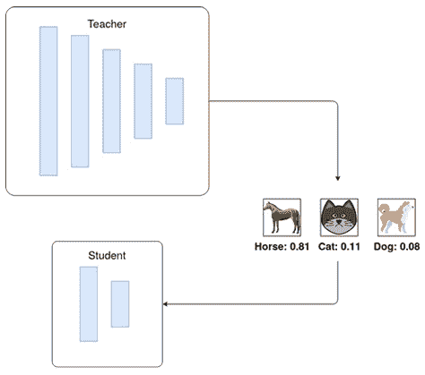

图 8.1 - 用于图像分类的知识蒸馏

DistilBERT 是这一领域最重要的模型之一，引起了研究者甚至企业的关注。 这个模型试图模仿 BERT-Base 的行为，参数少了 50%，但实现了老师模型 95%的性能。

细节如下：

+   DistilBert 压缩了 1.7 倍，速度提高了 1.6 倍，相对性能提高了 97%（与原始 BERT 相比）。

+   Mini-BERT 压缩了 6 倍，速度提高了 3 倍，相对性能提高了 98%。

+   TinyBERT 压缩了 7.5 倍，速度提高了 9.4 倍，相对性能提高了 97%。

用于训练模型的蒸馏训练步骤在 PyTorch 中非常简单（原始描述和代码可在[`medium.com/huggingface/distilbert-8cf3380435b5`](https://medium.com/huggingface/distilbert-8cf3380435b5)找到）：

```py
import torch
import torch.nn as nn
import torch.nn.functional as F
from torch.optim import Optimizer
KD_loss = nn.KLDivLoss(reduction='batchmean')
def kd_step(teacher: nn.Module,
            student: nn.Module,
            temperature: float,
            inputs: torch.tensor,
            optimizer: Optimizer):
    teacher.eval()
    student.train()
    with torch.no_grad():
        logits_t = teacher(inputs=inputs)
    logits_s = student(inputs=inputs)
    loss = KD_loss(input=F.log_softmax(
                            logits_s/temperature, 
                            dim=-1),
                   target=F.softmax(
                            logits_t/temperature, 
                            dim=-1))
    loss.backward()
    optimizer.step()
    optimizer.zero_grad()
```

这种模型监督训练为我们提供了一个行为非常类似于基础模型的较小模型。然而，这里使用的损失函数是**Kullback-Leibler**损失，以确保学生模型模仿了老师模型的好坏方面，并且对最后 softmax logits 的决策没有修改。这个损失函数显示了两个分布之间的不同程度；差异越大，损失值越高。使用这个损失函数的原因是使学生模型尽可能地模仿老师的行为。BERT 和 DistilBERT 的 GLUE 宏分数只相差 2.8%。

## 精简变压器

精简包括根据预先指定的标准在每一层上将权重设置为零的过程。例如，一个简单的精简算法可以获取每层的权重并将低于阈值的权重设置为零。这种方法消除了值非常低且不会对结果产生太大影响的权重。

同样地，我们还精简了变压器网络的一些多余部分。精简后的网络更有可能比原始网络更好地泛化。我们看到了成功的精简操作，因为精简过程可能保留了真实的潜在解释因素并且丢弃了多余的子网络。但是我们仍然需要训练一个大型网络。合理的策略是尽可能地训练一个大型神经网络。然后，丢弃一些不太明显的权重或单元，这些权重或单元的移除对模型性能的影响很小。

有两种方法：

+   **非结构化精简**：不管它们位于神经网络的哪个部分，都移除具有较小显著性（或最小权重幅度）的个别权重。

+   **结构化精简**：此方法精简头部或层。

然而，精简过程必须与现代 GPU 兼容。

大多数库，如 Torch 或 TensorFlow，都具有此功能。我们将描述如何使用 Torch 对模型进行精简。有许多不同的精简方法（基于幅度或基于互信息）。其中一个最容易理解和实现的方法是 L1 精简方法。此方法获取每一层的权重并将具有最低 L1 范数的权重置为零。您还可以指定在精简后必须将多少百分比的权重转换为零。为了使这个示例更容易理解并展示它对模型的影响，我们将使用 *第七章* 中的文本表示示例。我们将精简模型并查看精简后的表现：

1.  我们将使用 Roberta 模型。您可以使用以下代码加载模型：

    ```py
    from sentence_transformers import SentenceTransformer
    distilroberta = SentenceTransformer('stsb-distilroberta-base-v2')
    ```

1.  您还需要加载指标和数据集进行评估：

    ```py
    from datasets import load_metric, load_dataset
    stsb_metric = load_metric('glue', 'stsb')
    stsb = load_dataset('glue', 'stsb')
    mrpc_metric = load_metric('glue', 'mrpc')
    mrpc = load_dataset('glue','mrpc')
    ```

1.  为了评估模型，就像在 *第七章* 中，*文本表示*，您可以使用以下函数：

    ```py
    import math
    import tensorflow as tf
    def roberta_sts_benchmark(batch):
        sts_encode1 = tf.nn.l2_normalize(
                    distilroberta.encode(batch['sentence1']),
                    axis=1)
        sts_encode2 = tf.nn.l2_normalize(
            distilroberta.encode(batch['sentence2']), axis=1)
        cosine_similarities = tf.reduce_sum(
            tf.multiply(sts_encode1, sts_encode2), axis=1)
        clip_cosine_similarities = tf.clip_by_value(cosine_similarities,-1.0,1.0)
        scores = 1.0 -\
                  tf.acos(clip_cosine_similarities) / math.pi
    return scores
    ```

1.  当然，还必须设置标签：

    ```py
    references = stsb['validation'][:]['label']
    ```

1.  并且运行基础模型而不对其进行任何更改：

    ```py
    distilroberta_results = roberta_sts_benchmark(stsb['validation'])
    ```

1.  在所有这些事情完成之后，这是我们实际开始修剪模型的步骤：

    ```py
    from torch.nn.utils import prune
    pruner = prune.L1Unstructured(amount=0.2)
    ```

1.  上述代码使用每层 20％的 L1 范数修剪创建了一个修剪对象。要将其应用于模型，可以使用以下代码：

    ```py
    state_dict = distilroberta.state_dict()
    for key in state_dict.keys():
        if "weight" in key:
            state_dict[key] = pruner.prune(state_dict[key])
    ```

    它将迭代地修剪所有具有权重名称的层；换句话说，我们将修剪所有重量层，而不触及有偏差的层。当然，您也可以出于实验目的尝试这样做。

1.  再次加载状态字典到模型中是很有必要的：

    ```py
    distilroberta.load_state_dict(state_dict)
    ```

1.  现在我们已经完成了所有事情，可以测试新模型：

    ```py
    distilroberta_results_p = roberta_sts_benchmark(stsb['validation'])
    ```

1.  为了对结果进行良好的可视化表示，可以使用以下代码：

    ```py
    import pandas as pd
    pd.DataFrame({
    "DistillRoberta":stsb_metric.compute(predictions=distilroberta_results, references=references),
    "DistillRobertaPruned":stsb_metric.compute(predictions=distilroberta_results_p, references=references)
    })
    ```

    以下截图显示了结果：

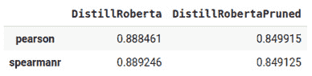

图 8.2 - 原始模型和修剪模型的比较

但你所做的是，你消除了模型 20%的所有权重，减少了它的大小和计算成本，并且性能下降了 4%。但是，这一步骤可以与量化等其他技术结合使用，在下一小节中进行探索。

这种修剪类型应用于层中的一些权重；但是，也有可能完全丢弃某些部分或层的变压器架构，例如，可以丢弃一部分关注头，并跟踪更改。

PyTorch 还提供了其他类型的修剪算法，例如迭代和全局修剪，值得一试。

## 量化

量化是一种信号处理和通信术语，通常用于强调所提供的数据的准确度。更多的位数意味着数据分辨率方面的更高准确度和精度。例如，如果您有一个用 4 位表示的变量，并且您想将其量化为 2 位，这意味着您需要降低分辨率的准确度。使用 4 位，您可以指定 16 个不同的状态，而使用 2 位，您只能区分 4 个状态。换句话说，通过将数据的分辨率从 4 位降低到 2 位，您可以节省 50％的空间和复杂度。

许多流行的库，例如 TensorFlow，PyTorch 和 MXNET，都支持混合精度运算。回想一下`第五章`中`TrainingArguments`类中使用的`fp16`参数。`fP16`可以提高计算效率，因为现代 GPU 对降低精度的数学运算提供了更高的效率，但结果是在`fP32`中累积。混合精度可以减少训练所需的内存使用，从而允许我们增加批处理大小或模型大小。

量化可以应用于模型权重，以减少其分辨率并节省计算时间，内存和存储空间。在本小节中，我们将尝试为我们在上一小节中修剪的模型进行量化：

1.  为此，使用以下代码以 8 位整数表示量化模型，而不是浮点数：

    ```py
    import torch
    distilroberta = torch.quantization.quantize_dynamic(
                model=distilroberta,
                qconfig_spec = {
                torch.nn.Linear :
                torch.quantization.default_dynamic_qconfig,
                               },
                dtype=torch.qint8)
    ```

1.  然后，使用以下代码获得评估结果：

    ```py
    distilroberta_results_pq = roberta_sts_benchmark(stsb['validation'])
    ```

1.  而且，你可以看到结果：

    ```py
    pd.DataFrame({
    "DistillRoberta":stsb_metric.compute(predictions=distilroberta_results, references=references),
    "DistillRobertaPruned":stsb_metric.compute(predictions=distilroberta_results_p, references=references),
    "DistillRobertaPrunedQINT8":stsb_metric.compute(predictions=distilroberta_results_pq, references=references)
    })
    ```

    结果如下：

    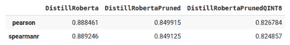

    图 8.3 - 原始模型、修剪模型和量化模型的比较

1.  到目前为止，你只是使用了一个经蒸馏的模型，对其进行了修剪，然后对其进行了量化，以减少其大小和复杂性。让我们看看通过保存模型你节省了多少空间：

    ```py
    distilroberta.save("model_pq")
    ```

    为了查看模型大小，使用以下代码：

    ```py
    ls model_pq/0_Transformer/ -l --block-size=M | grep pytorch_model.bin
    -rw-r--r-- 1 root 191M May 23 14:53 pytorch_model.bin
    ```

    如你所见，它是 191MB。模型的初始大小为 313MB，这意味着我们设法将模型的大小减小到其原始大小的 61%，并且在性能方面只损失了 6%-6.5%。请注意，`block-size`参数可能在 Mac 上失败，必须使用`-lh`。

直到这一点，你已经了解了在工业使用中实际模型准备方面的修剪和量化。然而，你也获得了关于蒸馏过程及其如何有用的信息。有许多其他方法可以进行修剪和量化，在阅读本节之后可以迈出的良好一步。有关更多信息和指南，你可以查看[`github.com/huggingface/block_movement_pruning`](https://github.com/huggingface/block_movement_pruning)的**运动修剪**。这种修剪是一种简单且确定性的一阶权重修剪方法。它利用训练中的权重变化来找出哪些权重更有可能未被使用以减少对结果的影响。

# 使用高效的自注意力

高效的方法限制了注意机制以实现有效的变压器模型，因为变压器的计算和存储复杂度大部分都是由自注意机制导致的。关于输入序列长度的注意机制以二次方式进行缩放。对于短输入，二次复杂度可能不是一个问题。但是，要处理更长的文件，我们需要改进能够与序列长度线性缩放的注意机制。

我们大致可以将高效的注意力解决方案分为三种类型：

+   使用固定模式的稀疏注意力

+   可学习的稀疏模式

+   低秩因式分解/核函数

接下来，让我们以基于固定模式的稀疏注意力开始。

## 使用固定模式的稀疏注意力

回想一下，注意力机制由查询、键和值组成，可能如此粗略地表述：

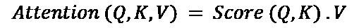

在这里，`Score`函数，大多数情况下是 softmax，执行 QKT 乘法，需要 O(n2)的内存和计算复杂度，因为一个标记位置在完全自注意力模式下会关注所有其他标记位置以构建其位置嵌入。我们对所有标记位置重复相同的过程以获取它们的嵌入，从而导致了二次复杂性问题。这是一种非常昂贵的学习方式，特别是对于长文本 NLP 问题。自然而然地会问，我们是否需要如此密集的交互，或者是否有更廉价的方法来进行计算？许多研究人员已经解决了这个问题，并采用了各种技术来缓解复杂性负担，并降低自注意机制的二次复杂性。他们在性能、计算和内存之间进行了权衡，特别是对于长文档。

减少复杂性的最简单方法是使完全自注意力矩阵稀疏化，或者找到另一种更廉价的方式来近似完全注意力。稀疏注意力模式制定了如何在不干扰层间信息流的情况下连接/断开某些位置，这有助于模型跟踪长期依赖关系并构建句子级编码。

完全自注意力和稀疏注意力依次在*图 8.4*中描述，其中行对应输出位置，列对应输入位置。完全自注意力模型会直接在任意两个位置之间传递信息。另一方面，在局部滑动窗口注意力中，也就是稀疏注意力，如图右侧所示，空白单元格意味着相应的输入-输出位置之间没有交互。图中的稀疏模型基于特定手动设计的规则，也就是固定模式。更具体地说，它是局部滑动窗口注意力，是最早提出的方法之一，也被称为基于本地固定模式的方法。其背后的假设是有用的信息位于每个位置的相邻位置。每个查询标记都会关注到其位置左侧和右侧窗口/2 个关键标记。在下面的示例中，窗口大小选为 4。这个规则在 transformer 的每一层中都适用。在一些研究中，随着向更深层移动，窗口大小会增加。

以下图简要描述了完全注意力和稀疏注意力之间的区别：

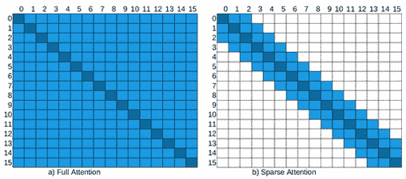

图 8.4 - 完全注意力与稀疏注意力

在稀疏模式下，信息通过模型中的连接节点（非空单元格）传输。例如，稀疏注意力矩阵的输出位置 7 不能直接关注输入位置 3（请参见*Figure 8.4*右侧的稀疏矩阵），因为单元格（7,3）被视为空。但是，位置 7 间接关注位置 3 通过标记位置 5，即（7->5, 5->3 => 7->3）。该图还说明了，虽然全自注意会产生 n2 个活动单元格（顶点），但稀疏模型大致为*5×n*。

另一个重要类型是全局注意力。少量选定的标记或少量注入的标记被用作全局注意力，可以关注所有其他位置，并被它们关注。因此，任意两个标记位置之间的最大路径距离等于 2。假设我们有一个句子*[GLB, the, cat, is, very, sad]*，其中**Global**（**GLB**）是一个注入的全局标记，窗口大小为 2，这意味着一个标记只能关注其直接的左右标记以及 GLB。 *cat* 到 *sad* 之间没有直接交互。但我们可以遵循 *cat-> GLB, GLB-> sad* 交互，这通过 GLB 标记创建了一个超链接。全局标记可以从现有标记中选择或像*(CLS)*那样添加。如下截图所示，前两个标记位置被选为全局标记：

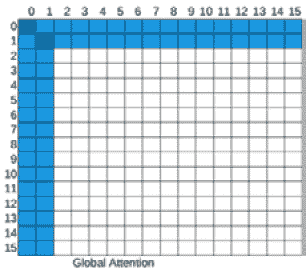

图 8.5 – 全局注意力

顺便说一句，这些全局标记也不必在句子开头。例如，longformer 模型除了前两个标记外，还会随机选择全局标记。

有四种更常见的模式。**随机注意力**（*Figure 8.6*中的第一个矩阵）用于通过从现有标记中随机选择来促进信息流动。但大多数情况下，我们将随机注意力作为**组合模式**（左下角矩阵）的一部分，该模式由其他模型的组合组成。**扩张注意力**类似于滑动窗口，但在窗口中加入了一些间隙，如*Figure 8.6*右上方所示：

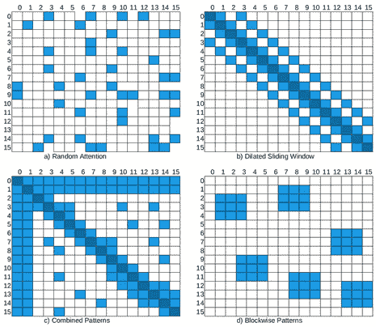

图 8.6 – 随机、扩张、组合和分块

**分块模式**（*Figure 8.6*右下角）为其他模式提供了基础。它将标记分块成固定数量的块，这对于长文本问题特别有用。例如，当使用块大小为 512 来分块 4096x4096 的注意力矩阵时，就形成了 8 个（512x512）查询块和键块。许多高效的模型，如 BigBird 和 Reformer，大多数将标记分块以减少复杂性。

需要注意的是，提出的模式必须得到加速器和库的支持。一些注意力模式，如扩张模式，需要特殊的矩阵乘法，在撰写本章时，当前的深度学习库，如 PyTorch 或 TensorFlow，不直接支持。

我们已经准备好进行一些高效 transformer 的实验。我们将使用 Transformers 库支持的模型，并具有 HuggingFace 平台上的检查点。**Longformer**是使用稀疏注意力的模型之一。它使用滑动窗口和全局注意力的组合。它还支持扩张的滑动窗口注意力：

1.  在开始之前，我们需要安装`py3nvml`包进行基准测试。请记住，我们已经讨论过如何在*第二章*，*对主题的实际介绍*中应用基准测试：

    ```py
    !pip install py3nvml
    ```

1.  我们还需要检查我们的设备，以确保没有正在运行的进程：

    ```py
    !nvidia-smi
    ```

    输出如下：

    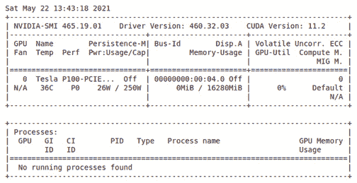

    图 8.7 – GPU 使用情况

1.  目前，Longformer 的作者分享了一些检查点。以下代码片段加载了 Longformer 检查点`allenai/longformer-base-4096`并处理了一个长文本：

    ```py
    from transformers import LongformerTokenizer, LongformerForSequenceClassification
    import torch
    tokenizer = LongformerTokenizer.from_pretrained(
        'allenai/longformer-base-4096')
    model=LongformerForSequenceClassification.from_pretrained(
        'allenai/longformer-base-4096')
    sequence= "hello "*4093
    inputs = tokenizer(sequence, return_tensors="pt")
    print("input shape: ",inputs.input_ids.shape)
    outputs = model(**inputs)
    ```

1.  输出如下：

    ```py
    input shape:  torch.Size([1, 4096])
    ```

    如图所示，Longformer 可以处理长度达`4096`的序列。当我们传递长度超过`4096`的序列时，这是限制时，您将收到错误`IndexError: index out of range in self`。

Longformer 的默认`attention_window`是`512`，这是每个标记周围的关注窗口的大小。通过以下代码，我们实例化了两个 Longformer 配置对象，第一个是默认 Longformer，第二个是一个更轻量级的 Longformer，我们将窗口大小设置为较小的值，例如 4，这样模型就变得更轻：

1.  请注意以下示例。我们将始终调用`XformerConfig.from_pretrained()`。这个调用不会下载模型检查点的实际权重，而是仅从 HuggingFace Hub 下载配置。在本节中，由于我们不会进行微调，我们只需要配置：

    ```py
    from transformers import LongformerConfig, \
    PyTorchBenchmark, PyTorchBenchmarkArguments
    config_longformer=LongformerConfig.from_pretrained(
        "allenai/longformer-base-4096")
    config_longformer_window4=LongformerConfig.from_pretrained(
        "allenai/longformer-base-4096", 
         attention_window=4)
    ```

1.  有了这些配置实例，您可以将配置对象传递给 Longformer 模型，使用自己的数据集训练您的 Longformer 语言模型，如下所示：

    ```py
    from transformers import LongformerModel
    model = LongformerModel(config_longformer)
    ```

    除了训练 Longformer 模型，您还可以将训练过的检查点微调到下游任务。要这样做，您可以继续应用`第三章`中所示的代码进行语言模型训练，以及`第 05-06 章`进行微调。

1.  现在我们将利用`PyTorchBenchmark`比较这两种配置在各种输入长度[`128, 256, 512, 1024, 2048, 4096`]下的时间和内存性能，如下所示：

    ```py
    sequence_lengths=[128,256,512,1024,2048,4096]
    models=["config_longformer","config_longformer_window4"]
    configs=[eval(m) for m in models]
    benchmark_args = PyTorchBenchmarkArguments(
        sequence_lengths= sequence_lengths, 
        batch_sizes=[1], 
        models= models)
    benchmark = PyTorchBenchmark(
        configs=configs, 
        args=benchmark_args)
    results = benchmark.run()
    ```

1.  输出如下：

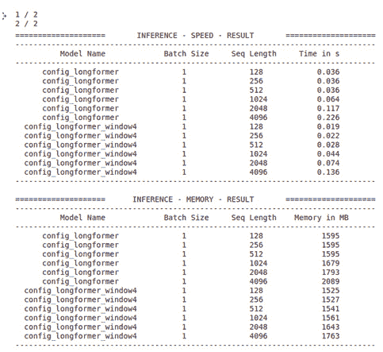

图 8.8 – 基准结果

一些关于`PyTorchBenchmarkArguments`的提示：如果你想看到训练和推断的性能，你应该将参数`training`设置为`True`（默认为`False`）。你可能还想看到您当前的环境信息。您可以通过设置`no_env_print`为`False`来做到这一点；默认为`True`。

让我们通过可视化性能来使其更易解释。为此，我们定义了一个`plotMe()`函数，因为我们将来在进一步的实验中也将需要该函数。该函数默认情况下绘制推断性能，以及正确限制的运行时间复杂性或内存占用：

1.  这里是函数定义：

    ```py
    import matplotlib.pyplot as plt 
    def plotMe(results,title="Time"):
        plt.figure(figsize=(8,8))
        fmts= ["rs--","go--","b+-","c-o"]
        q=results.memory_inference_result
        if title=="Time": 
            q=results.time_inference_result
        models=list(q.keys())
        seq=list(q[models[0]]['result'][1].keys())
        models_perf=[list(q[m]['result'][1].values()) \
            for m in models] 
        plt.xlabel('Sequence Length') 
        plt.ylabel(title) 
        plt.title('Inference Result') 
        for perf,fmt in zip(models_perf,fmts):
            plt.plot(seq, perf,fmt)
        plt.legend(models) 
        plt.show()
    ```

1.  让我们看看两个 Longformer 配置的计算性能，如下所示：

    ```py
    plotMe(results)
    ```

    这绘制了以下图表：

    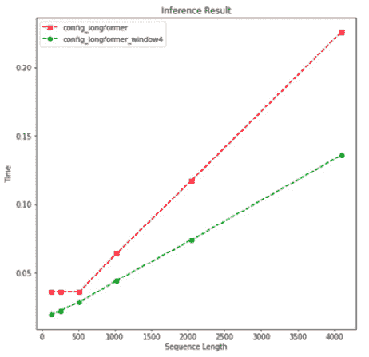

    图 8.9 – 随序列长度的速度性能（Longformer）

    在这个和后面的例子中，我们看到重型模型和轻型模型之间的主要差异是从长度 512 开始。前图显示了长子模型（窗口长度为 4）在时间复杂度方面如预期的表现更好。我们还看到两个 Longformer 模型用线性时间复杂度处理输入。

1.  让我们从内存性能的角度评估这两个模型：

    ```py
    plotMe(results, "Memory")
    ```

    这绘制了以下内容：

    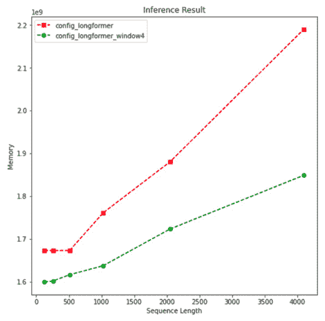

    图 8.10 – 随序列长度的内存性能（Longformer）

    再次强调，直到长度 512，没有实质性的差异。从长度 512 开始，我们看到与时间性能类似的内存性能。显然，Longformer 自注意力的内存复杂性是线性的。另一方面，我要提醒你的是，我们尚未对模型任务性能做出任何评论。

    非常感谢`PyTorchBenchmark`脚本，我们已经交叉检验了这些模型。当我们选择应该用哪种配置来训练语言模型时，这个脚本非常有用。这在开始真正的语言模型训练和微调之前将是至关重要的。

    另一个利用稀疏注意力的表现最佳模型是 BigBird（Zohen 等，2020）。作者声称他们的稀疏注意力机制（他们将其称为广义注意力机制）在线性时间内保留了香草变压器的全自注意机制的所有功能。作者将注意力矩阵视为有向图，因此他们利用了图论算法。他们从图稀疏化算法中汲取灵感，该算法用较少的边或顶点逼近给定图`G`的图`G'`。

    BigBird 是一个分块注意力模型，可以处理长度达 `4096` 的序列。它首先通过打包查询和密钥一起将注意力模式分块化，然后对这些块定义注意力。他们利用了随机、滑动窗口和全局注意力。

1.  让我们加载并使用与 Longformer 变压器模型相似的 BigBird 模型检查点配置。HuggingFace Hub 的开发人员共享了几个 BigBird 检查点。我们选择了原始的 BigBird 模型，`google/bigbird-roberta-base`，它从一个 RoBERTa 检查点开始预热。再次强调，我们不是下载模型检查点权重，而是下载配置。`BigBirdConfig`实现允许我们比较完全自注意和稀疏注意。因此，我们可以观察和检查稀疏化是否将完全注意的 O(n²)复杂性降低到更低的水平。再次强调，最多达到 512 的长度，我们并没有清楚地观察到二次复杂性。我们可以从这个级别开始观察复杂性。将注意类型设置为原始全功能将为我们提供完全自注意模型。为了比较，我们创建了两种类型的配置：第一个是 BigBird 的原始稀疏方法，第二个是使用完全自注意模型的模型。

1.  我们依次称它们为`sparseBird`和`fullBird`：

    ```py
    from transformers import BigBirdConfig
    # Default Bird with num_random_blocks=3, block_size=64
    sparseBird = BigBirdConfig.from_pretrained(
        "google/bigbird-roberta-base")
    fullBird = BigBirdConfig.from_pretrained(
        "google/bigbird-roberta-base", 
        attention_type="original_full")
    ```

1.  请注意，对于最多 512 个序列长度，由于块大小和序列长度不一致，BigBird 模型将作为完全自注意模式运行：

    ```py
    sequence_lengths=[256,512,1024,2048, 3072, 4096]
    models=["sparseBird","fullBird"]
    configs=[eval(m) for m in models]
    benchmark_args = PyTorchBenchmarkArguments(
        sequence_lengths=sequence_lengths,
        batch_sizes=[1],
        models=models)
    benchmark = PyTorchBenchmark(
        configs=configs, 
        args=benchmark_args)
    results = benchmark.run()
    ```

    输出如下：

    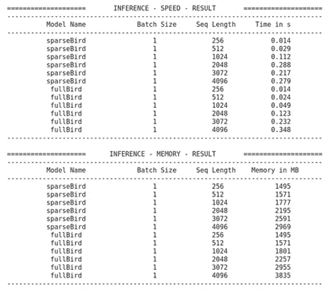

    图 8.11 – 基准结果（BigBird）

1.  再次，我们将时间性能绘制如下：

    ```py
    plotMe(results)
    ```

    这绘制了以下内容：

    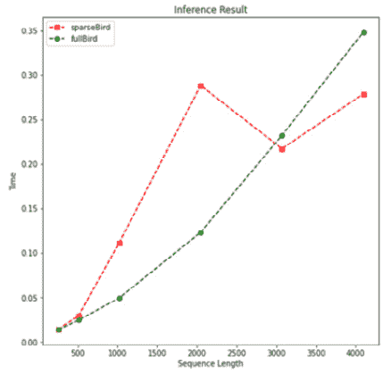

    图 8.12 – 速度性能（BigBird）

    在一定程度上，完全自注意模型的性能优于稀疏模型。然而，我们可以观察到`fullBird`的二次时间复杂性。因此，在一定程度上，当接近尾声时，我们也看到稀疏注意模型突然超越它。

1.  让我们按如下方式检查内存复杂性：

    ```py
    plotMe(results,"Memory")
    ```

    这是输出：

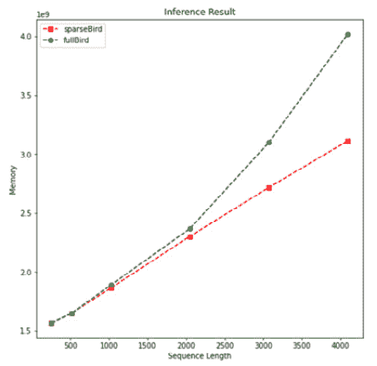

图 8.13 – 内存性能（BigBird）

在上图中，我们可以清楚地看到线性和二次内存复杂性。再次强调，在某一点（本例中长度为 2,000），我们无法说出清晰的区别。

接下来，让我们讨论可学习模式，并使用可以处理更长输入的模型。

## 可学习模式

基于学习的模式是固定（预定义）模式的替代方案。这些方法以无监督数据驱动的方式提取模式。它们利用一些技术来衡量查询和键之间的相似性，以正确地对它们进行聚类。这个变压器家族首先学习如何对令牌进行聚类，然后限制交互以获得注意矩阵的最佳视图。

现在，我们将对 Reformer 进行一些实验，作为基于可学习模式的重要高效模型之一。在此之前，让我们先了解 Reformer 模型对 NLP 领域的贡献，如下所示：

1.  它采用了`[a,b,c]`和`[d,e,f]`，标记`d`无法参与到其直接上下文`c`中。为了解决这个问题，Reformer 会用参数增加每个块的前面相邻块的数量。

1.  Reformer 最重要的贡献是利用**局部敏感哈希**（**LSH**）函数，它将相似的查询向量分配相同的值。通过仅比较最相似的向量来近似注意力，可以帮助我们减少维度，然后将矩阵稀疏化。这是一个安全的操作，因为 softmax 函数受大值的影响很大，可以忽略不相似的向量。此外，与其查找给定查询的相关键，只查找相似的查询并进行桶分配。也就是说，查询的位置只能参与到其他具有高余弦相似度的查询的位置。

1.  为了减少内存占用，Reformer 使用可逆残差层，避免了需要存储所有层的激活以便后续反向传播的需要，遵循**可逆残差网络**（**RevNet**）的方式，因为任意层的激活都可以从后续层的激活中恢复。

    需要注意的是，Reformer 模型和许多其他高效的 transformer 在实践中被批评为，只有当输入长度非常长时才比普通 transformer 更高效（*REF：Efficient Transformers*：A Survey，Yi Tay，Mostafa Dehghani，Dara Bahri，Donald Metzler）。我们在早期的实验中也有类似的观察（请参见 BigBird 和 Longformer 实验）。

1.  现在我们将对 Reformer 进行一些实验。再次感谢 HuggingFace 社区，Transformers 库为我们提供了 Reformer 的实现及其预训练检查点。我们将加载原始检查点`google/reformer-enwik8`的配置，并调整一些设置以使其在完全自注意模式下工作。当我们将`lsh_attn_chunk_length`和`local_attn_chunk_length`设置为`16384`时，这是 Reformer 可以处理的最大长度，Reformer 实例将没有进行局部优化的机会，而是自动以完全注意力的方式工作，我们称之为`fullReformer`。至于原始的 Reformer，我们使用来自原始检查点的默认参数实例化它，并称之为`sparseReformer`如下：

    ```py
    from transformers import ReformerConfig
    fullReformer = ReformerConfig\
        .from_pretrained("google/reformer-enwik8",  
            lsh_attn_chunk_length=16384, 
            local_attn_chunk_length=16384)
    sparseReformer = ReformerConfig\
        .from_pretrained("google/reformer-enwik8")
    sequence_lengths=[256, 512, 1024, 2048, 4096, 8192, 12000]
    models=["fullReformer","sparseReformer"]
    configs=[eval(e) for e in models]
    ```

    请注意，Reformer 模型可以处理长度最长为`16384`的序列。但是对于完全自注意模式，由于我们环境的加速器容量限制，注意力矩阵无法适应 GPU，并且我们会收到 CUDA 内存不足的警告。因此，我们将最大长度设置为`12000`。如果您的环境适合，您可以增加它。

1.  让我们进行基准实验如下：

    ```py
    benchmark_args = PyTorchBenchmarkArguments(
        sequence_lengths=sequence_lengths,
        batch_sizes=[1],
        models=models)
    benchmark = PyTorchBenchmark(
        configs=configs, 
        args=benchmark_args)
    result = benchmark.run()
    ```

    输出如下：

    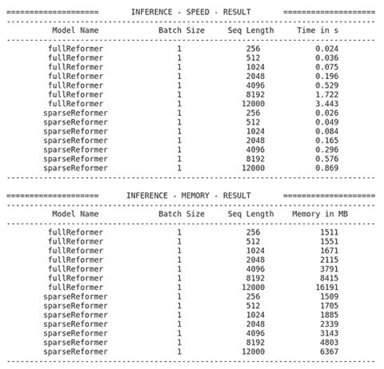

    图 8.14 – 基准结果

1.  让我们将时间性能结果可视化如下：

    ```py
    plotMe(result)
    ```

    输出如下：

    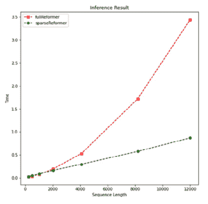

    图 8.15 – 速度性能（Reformer）

1.  我们可以看到模型的线性和二次复杂度。通过运行以下行，我们可以观察到内存占用的类似特征：

    ```py
    plotMe(result,"Memory Footprint")
    ```

    它绘制了以下内容：

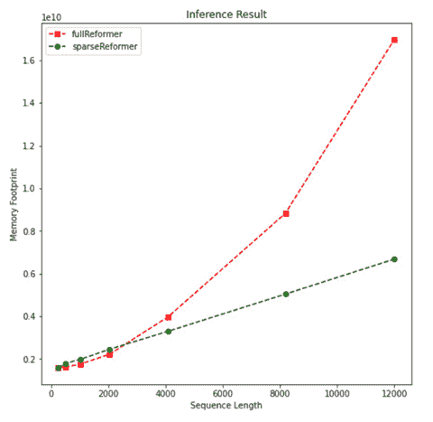

图 8.16 – 内存使用（Reformer）

正如预期的那样，具有稀疏注意力的 Reformer 产生了一个轻量级模型。然而，正如之前所说的，我们在某个长度上难以观察到二次/线性复杂度。正如所有这些实验所指示的，高效变压器可以减轻长文本的时间和内存复杂度。那么任务性能呢？它们在分类或摘要任务中的准确性如何？为了回答这个问题，我们将开始一个实验或查看相关模型的性能报告中的性能。对于实验，您可以通过实例化一个高效模型而不是一个普通的变压器来重复`chapter 04`和`chapter 05`中的代码。您可以使用我们将在*Chapter 11*中详细讨论的模型跟踪工具来跟踪模型性能并对其进行优化，*注意可视化和实验跟踪*。

## 低秩分解、核方法和其他方法

高效模型的最新趋势是利用完整自注意力矩阵的低秩近似。这些模型被认为是最轻量级的，因为它们可以将自注意力的复杂度从*O(n2)*降低到*O(n)*，无论是在计算时间还是内存占用上。选择一个非常小的投影维度*k*，使得*k << n*，那么内存和空间复杂度会大大降低。Linformer 和 Synthesizer 是能够通过低秩分解高效近似完整注意力的模型。它们通过线性投影来分解原始变压器的点积* N×N* 注意力。

核关注是另一种最近我们看到的方法家族，通过核化来改善效率。核是一个将两个向量作为参数并返回它们的投影与特征映射的乘积的函数。它使我们能够在高维特征空间中操作，甚至不需要计算数据在该高维空间中的坐标，因为在该空间内的计算变得更加昂贵。这就是核技巧发挥作用的时候。基于核化的高效模型使我们能够重写自注意力机制，以避免显式计算*N×N*矩阵。在机器学习中，我们最常听到的有关核方法的算法是支持向量机，其中径向基函数核或多项式核被广泛使用，特别是用于非线性。对于变压器，最引人注目的例子是**Performer**和**线性变压器**。

# 摘要

本章的重要性在于我们学会了如何在有限的计算能力下减轻运行大型模型的负担。我们首先讨论并实施了如何使用蒸馏、剪枝和量化使训练模型变得高效的方法。预训练一个较小的通用语言模型，比如 DistilBERT，是很重要的。这样的轻量化模型可以与非蒸馏的模型相比，在各种问题上都能够取得良好的性能。

其次，我们了解了如何使用近似技术，例如 Linformer、BigBird、Performer 等，将完整的自注意力矩阵替换为稀疏矩阵的高效稀疏 Transformer。我们已经看到它们在各种基准测试中的性能表现，如计算复杂度和内存复杂度。这些例子向我们展示了这些方法能够将二次复杂度降低到线性复杂度，而不损害性能。

在下一章中，我们将讨论其他重要主题：跨语言/多语言模型。

# 参考文献

+   Sanh, V., Debut, L., Chaumond, J., & Wolf, T. (2019). *DistilBERT，BERT 的精简版：更小、更快、更便宜、更轻量化*. arXiv 预印本 arXiv:1910.01108。

+   Choromanski, K., Likhosherstov, V., Dohan, D., Song, X., Gane, A., Sarlos, T., & Weller, A. (2020). *重新思考注意力机制：表演者方法*. arXiv 预印本 arXiv:2009.14794。

+   Wang, S., Li, B., Khabsa, M., Fang, H., & Ma, H. (2020). *Linformer：具有线性复杂性的自注意力机制*. arXiv 预印本 arXiv:2006.04768。

+   Zaheer, M., Guruganesh, G., Dubey, A., Ainslie, J., Alberti, C., Ontanon, S., ... & Ahmed, A. (2020). *大鸟：针对更长序列的 Transformer*. arXiv 预印本 arXiv:2007.14062。

+   Tay, Y., Dehghani, M., Bahri, D., & Metzler, D. (2020). *高效 Transformer：一项调查*. arXiv 预印本 arXiv:2009.06732。

+   Tay, Y., Bahri, D., Metzler, D., Juan, D. C., Zhao, Z., & Zheng, C. (2020). *合成器：重新思考 Transformer 模型中的自注意力机制*. arXiv 预印本 arXiv:2005.00743。

+   Kitaev, N., Kaiser, Ł., & Levskaya, A. (2020). *Reformer：高效 Transformer*. arXiv 预印本 arXiv:2001.04451。

+   Fournier, Q., Caron, G. M., & Aloise, D. (2021). *关于更快、更轻量化 Transformer 的实用调查*. arXiv 预印本 arXiv:2103.14636。
