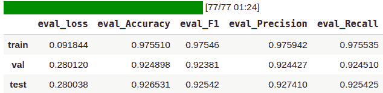

# 跨语言和多语言语言建模

到目前为止，你已经学习了很多关于基于 transformer 的架构的知识，从仅编码器模型到仅解码器模型，从高效的 transformers 到长上下文的 transformers。你还学习了基于 Siamese 网络的语义文本表示。然而，我们讨论了所有这些模型都是从单语问题的角度出发的。我们假设这些模型只是理解单一语言，并且无法对文本进行通用的理解，无论语言本身如何。事实上，其中一些模型具有多语言变体；**多语言双向编码器表示模型**（**mBERT**），**多语言文本到文本转换 transformer**（**mT5**），以及**多语言双向和自回归 transformer**（**mBART**），仅举几例。另一方面，一些模型专门设计用于多语言目的，采用跨语言目标进行训练。例如，**跨语言语言模型**（**XLM**）就是这样一种方法，本章将详细介绍。

在本章中，将介绍语言之间的知识共享概念，以及**Byte-Pair 编码**（**BPE**）对分词部分的影响，也是另一个重要的主题，为了实现更好的输入。将详细说明使用**跨语言自然语言推理**（**XNLI**）语料库进行跨语言句子相似性的任务。将通过实际的现实问题的具体例子，如多语言意图分类等**自然语言处理**（**NLP**）中的跨语言分类和跨语言句子表示利用另一种语言进行训练和测试的任务。

简而言之，你将在本章学习以下主题：

+   翻译语言建模和跨语言知识共享

+   XLM 和 mBERT

+   跨语言相似性任务

+   跨语言分类

+   跨语言零-shot 学习

+   多语言模型的基本局限性

# 技术要求

本章的代码在该书的 GitHub 仓库中的[`github.com/PacktPublishing/Mastering-Transformers/tree/main/CH09`](https://github.com/PacktPublishing/Mastering-Transformers/tree/main/CH09)下找到。我们将使用 Jupyter Notebook 来运行我们的编码练习，需要 Python 3.6.0+，并且需要安装以下软件包：

+   `tensorflow`

+   `pytorch`

+   `transformers >=4.00`

+   `datasets`

+   `sentence-transformers`

+   `umap-learn`

+   `openpyxl`

查看以下链接，观看《代码实战》视频：

[`bit.ly/3zASz7M`](https://bit.ly/3zASz7M)

# 翻译语言建模和跨语言知识共享

迄今为止，你已经了解了**遮罩语言建模**（**MLM**）作为填空任务。然而，基于神经网络的语言建模根据方法本身和其实际用途分为三类，如下所示：

+   MLM

+   **因果语言建模**（**CLM**）

+   **翻译语言建模**（**TLM**）

也很重要的是，还有其他预训练方法，例如**下一句预测**（**NSP**）和**句子顺序预测**（**SOP**），但我们只考虑了基于令牌的语言建模。这三种方法是文献中使用的主要方法。如前几章中描述和详细介绍的**MLM**，与语言学习中的填空任务非常接近。

**CLM**的定义是预测下一个令牌，后面跟着一些前面的令牌。例如，如果你看到以下上下文，你可以轻松预测下一个令牌：

*<s> Transformers改变了自然语言...*

正如你所看到的，只有最后一个令牌被屏蔽，前面的令牌都给了模型，让它预测最后一个。这个令牌将会是*processing*，如果再次给你这个令牌的上下文，你可能会以一个*"</s>"*令牌结束。为了在这种方法上进行良好的训练，需要不屏蔽第一个令牌，因为模型只有一个句子的开始令牌来组成一个句子。这个句子可以是任何东西！下面是一个例子：

*<s> ...*

你会预测出什么？可以是任何东西。为了更好的训练和更好的结果，需要至少给出第一个令牌，如下所示：

*<s> Transformers...*

而模型需要预测*变化*；在给出*Transformers改变...*后，需要预测*the*，依此类推。这种方法非常类似于 N-grams 和`P(wn|wn-1, wn-2 ,…,w0)`，其中`wn`是要预测的令牌，而其余令牌是它前面的令牌。具有最大概率的令牌是预测的令牌。

这些是用于单语模型的目标。那么，对于跨语言模型可以做些什么？答案是**TLM**，它与 MLM 非常相似，但有一些变化。不是给定一个单一语言的句子，而是给模型一个包含不同语言的句子对，用一个特殊的令牌分隔开。模型需要预测这些语言中任意一个中的随机屏蔽的令牌。

下面的句子对就是这样一个任务的例子：


图 9.1 - 土耳其和英语之间的跨语言关系示例

给定这两个屏蔽的句子，模型需要预测缺失的令牌。在这个任务中，有些场合下，模型可以访问到其中一个语言中缺失的令牌（例如，在*图 9.1*中的句子对中分别为**doğal**和**language**）。

另一个例子，你可以看到波斯语和土耳其语句子的同一对。在第二个句子中，**değiştirdiler** 标记可以被第一个句子中的多个标记（一个被掩码）关注到。在下面的例子中，单词 **تغییر** 缺失，但 **değiştirdiler** 的含义是 **تغییر دادند****。**


图 9.2 – 波斯语和土耳其语之间的跨语言关系示例

因此，一个模型可以学习这些含义之间的映射。就像一个翻译模型一样，我们的 TLM 也必须学习这些语言之间的复杂性，因为**机器翻译**（**MT**）不仅仅是一个标记到标记的映射。

# XLM 和 mBERT

在本节中我们选择了两个模型进行解释：mBERT 和 XLM。我们选择这些模型是因为它们对应于写作本文时最好的两种多语言类型。mBERT 是一个在不同语言语料库上使用 MLM 建模训练的多语言模型。它可以单独为许多语言进行操作。另一方面，XLM 是使用 MLM、CLM 和 TLM 语言建模在不同语料库上训练的，可以解决跨语言任务。例如，它可以通过将它们映射到共同的向量空间来测量两种不同语言句子的相似度，而这在 mBERT 中是不可能的。

## mBERT

你对来自*第三章*的 BERT 自动编码器模型以及如何在指定语料库上使用 MLM 进行训练已经很熟悉了。想象一下提供了一个广泛且庞大的语料库，不是来自单一语言，而是来自 104 种语言。在这样的语料库上进行训练将会产生一个多语言版本的 BERT。然而，在如此广泛的语言上进行训练将会增加模型的大小，在 BERT 的情况下是不可避免的。词汇量会增加，因此嵌入层的大小会因为更多的词汇而变大。

与单语言预训练的 BERT 相比，这个新版本能够在一个模型内处理多种语言。然而，这种建模的缺点是，该模型不能在语言之间进行映射。这意味着在预训练阶段，模型并未学习到关于不同语言的这些标记的语义含义之间的映射。为了为这个模型提供跨语言映射和理解，有必要在一些跨语言监督任务上对其进行训练，比如`XNLI`数据集中提供的任务。

使用这个模型与你在之前章节中使用的模型一样简单（更多详情请参见 [`huggingface.co/bert-base-multilingual-uncased`](https://huggingface.co/bert-base-multilingual-uncased)）。以下是你需要开始的代码：

```py
from transformers import pipeline
unmasker = pipeline('fill-mask', model='bert-base- 
                    multilingual-uncased')
sentences = [
"Transformers changed the [MASK] language processing",
"Transformerlar [MASK] dil işlemeyi değiştirdiler",
"ترنسفرمرها پردازش زبان [MASK] را تغییر دادند"
]
for sentence in sentences:
    print(sentence)
    print(unmasker(sentence)[0]["sequence"])
    print("="*50)
```

输出结果将如下代码片段所示呈现：

```py
Transformers changed the [MASK] language processing
transformers changed the english language processing
==================================================
Transformerlar [MASK] dil işlemeyi değiştirdiler
transformerlar bu dil islemeyi degistirdiler
==================================================
ترنسفرمرها پردازش زبان [MASK] را تغییر دادند
ترنسفرمرها پردازش زبانی را تغییر دادند
==================================================
```

正如你所见，它可以为各种语言执行 `fill-mask`。

## XLM

语言模型的跨语言预训练，例如 XLM 方法所示，基于三种不同的预训练目标。MLM、CLM 和 TLM 被用来预训练 XLM 模型。这种预训练的顺序是使用所有语言之间共享的 BPE 分词器执行的。共享标记的原因在于，在具有相似标记或子词的语言情况下，共享标记提供了较少的标记，而另一方面，这些标记可以在预训练过程中提供共享的语义。例如，一些标记在许多语言中的书写和含义非常相似，因此这些标记对所有语言都使用 BPE 进行共享。另一方面，一些在不同语言中拼写相同的标记可能具有不同的含义——例如，在德语和英语环境中 *was* 是共享的。幸运的是，自注意力机制帮助我们使用周围的上下文消除 *was* 的含义歧义。

这种跨语言建模的另一个主要改进是它还在 CLM 上进行了预训练，这使得它在需要句子预测或完成时更加合理。换句话说，这个模型对语言有一定的理解，能够完成句子、预测缺失的标记，并利用其他语言源预测缺失的标记。

下图显示了跨语言建模的整体结构。你可以在 [`arxiv.org/pdf/1901.07291.pdf`](https://arxiv.org/pdf/1901.07291.pdf) 上阅读更多内容。


图 9.3 – MLM 和 TLM 跨语言建模的预训练

XLM 模型的更新版本也被发布为**XLM-R**，其在训练和使用的语料库中有轻微的更改。XLM-R 与 XLM 模型相同，但在更多的语言和更大的语料库上进行了训练。CommonCrawl 和 Wikipedia 语料库被聚合，XLM-R 在其中进行 MLM 的训练。然而，XNLI 数据集也用于 TLM。下图显示了 XLM-R 预训练使用的数据量：


图 9.4 – 数据量（GB）（对数刻度）

在添加新语言进行训练数据时，有许多优点和缺点——例如，添加新语言并不总是会提高**自然语言推理**（**NLI**）的整体模型。**XNLI 数据集**通常用于多语言和跨语言 NLI。从前面的章节中，您已经看到了**多样化体裁 NLI**（**MNLI**）数据集用于英语；XNLI 数据集与之几乎相同，但具有更多的语言，而且还有句子对。然而，仅在此任务上进行训练是不够的，它不会涵盖 TLM 预训练。对于 TLM 预训练，会使用更广泛的数据集，例如**OPUS**（**开源平行语料库**的缩写）的平行语料库。该数据集包含来自不同语言的字幕，经过对齐和清理，由许多软件来源提供的翻译，如 Ubuntu 等。

以下截图显示了 OPUS ([`opus.nlpl.eu/trac/`](https://opus.nlpl.eu/trac/)) 及其用于搜索和获取数据集信息的组件：

.jpg)

图 9.5 – OPUS

描述使用跨语言模型的步骤如下：

1.  对先前的代码进行简单更改，您就可以看到 XLM-R 如何执行掩码填充。首先，您必须更改模型，如下所示：

    ```py
    unmasker = pipeline('fill-mask', model='xlm-roberta-base')
    ```

1.  之后，您需要将掩码标记从`[MASK]`更改为`<mask>`，这是 XLM-R 的特殊标记（或简称为`tokenizer.mask_token`）。以下是完成此操作的代码：

    ```py
    sentences = [
    "Transformers changed the <mask> language processing",
    "Transformerlar <mask> dil işlemeyi değiştirdiler",
    "ترنسفرمرها پردازش زبان <mask" را تغییر دادند
    ]
    ```

1.  然后，您可以运行相同的代码，如下所示：

    ```py
    for sentence in sentences:
      print(sentence)
      print(unmasker(sentence)[0]["sequence"])
      print("="*50)
    ```

1.  结果将如此显示：

    ```py
    Transformers changed the <mask> language processing
    Transformers changed the human language processing
    ==================================================
    Transformerlar <mask> dil işlemeyi değiştirdiler
    Transformerlar, dil işlemeyi değiştirdiler
    ================================================== ترنسفرمرها پردازش زبان [MASK] را تغییر دادند
     ترنسفرمرها پردازش زبانی را تغییر دادند
    ==================================================
    ```

1.  但从土耳其语和波斯语的例子中可以看出，模型仍然犯了错误；例如，在波斯文本中，它只是添加了`ی`，在土耳其版本中，它添加了`,`。对于英文句子，它添加了`human`，这不是我们所期望的。这些句子并没有错，但不是我们所期望的。然而，这一次，我们有一个使用 TLM 训练的跨语言模型；所以，让我们通过连接两个句子并给模型一些额外的提示来使用它。我们开始吧：

    ```py
    print(unmasker("Transformers changed the natural language processing. </s> Transformerlar <mask> dil işlemeyi değiştirdiler.")[0]["sequence"])
    ```

1.  结果将如下所示：

    ```py
    Transformers changed the natural language processing. Transformerlar doğal dil işlemeyi değiştirdiler.
    ```

1.  就这样！模型现在已经做出了正确的选择。让我们再玩一会儿，看看它的表现如何，如下所示：

    ```py
    print(unmasker("Earth is a great place to live in. </s> زمین جای خوبی برای <mask> کردن است.")[0]["sequence"])
    ```

    这是结果：

    ```py
    Earth is a great place to live in. زمین جای خوبی برای زندگی کردن است.
    ```

干得好！到目前为止，您已经了解了诸如 mBERT 和 XLM 等多语言和跨语言模型。在下一节中，您将学习如何使用这些模型进行多语言文本相似性。您还将看到一些用例，例如多语言抄袭检测。

# 跨语言相似性任务

跨语言模型能够以统一的形式表示文本，其中句子来自不同的语言，但意思相近的句子在向量空间中被映射到相似的向量上。XLM-R，正如前一节详细介绍的那样，是这个领域中成功的模型之一。现在，让我们看一些在这方面的应用。

## 跨语言文本相似性

在以下示例中，您将看到如何使用在 XNLI 数据集上预训练的跨语言语言模型来从不同语言中找到相似的文本。一个使用情景是需要为此任务提供抄袭检测系统。我们将使用来自阿塞拜疆语的句子，并查看 XLM-R 是否能找到相似的英语句子——如果有的话。两种语言的句子是相同的。下面是要执行的步骤：

1.  首先，您需要为此任务加载一个模型，如下所示：

    ```py
    from sentence_transformers import SentenceTransformer, util
    model = SentenceTransformer("stsb-xlm-r-multilingual")
    ```

1.  随后，我们假设已经准备好两个单独列表形式的句子，如下代码段所示：

    ```py
    azeri_sentences = ['Pişik çöldə oturur',
                  'Bir adam gitara çalır',
                  'Mən makaron sevirəm',
                  'Yeni film möhtəşəmdir',
                  'Pişik bağda oynayır',
                  'Bir qadın televizora baxır',
                  'Yeni film çox möhtəşəmdir',
                  'Pizzanı sevirsən?']
    english_sentences = ['The cat sits outside',
                 'A man is playing guitar',
                 'I love pasta',
                 'The new movie is awesome',
                 'The cat plays in the garden',
                 'A woman watches TV',
                 'The new movie is so great',
                 'Do you like pizza?']
    ```

1.  接下来的步骤是利用 XLM-R 模型将这些句子表示为向量空间。您只需简单地使用模型的`encode`函数即可实现这一点，如下所示：

    ```py
    azeri_representation = model.encode(azeri_sentences)
    english_representation = \ 
    model.encode(english_sentences)
    ```

1.  最后一步，我们将在另一种语言表示中搜索第一种语言的语义相似句子，如下所示：

    ```py
    results = []
    for azeri_sentence, query in zip(azeri_sentences, azeri_representation):
      id_, score = util.semantic_search(
              query,english_representation)[0][0].values()
      results.append({
          "azeri": azeri_sentence,
          "english": english_sentences[id_],
          "score": round(score, 4)
      })
    ```

1.  为了看到这些结果的清晰形式，您可以使用 pandas DataFrame，如下所示：

    ```py
    import pandas as pd
    pd.DataFrame(results)
    ```

    然后，您将看到结果及其匹配分数，如下所示：


图 9.6 – 抄袭检测结果（XLM-R）

如果我们接受最高分句子被改写或翻译的话，在一种情况下模型会错（第 *4* 行），但是有一个阈值并接受比它高的值是有用的。我们将在接下来的章节中展示更全面的实验。

另外，还有可用的双编码器。这些方法提供了两个句子的对编码，并对结果进行分类以训练模型。在这种情况下，**语言无关 BERT 句子嵌入**（**LaBSE**）也可能是一个不错的选择，并且在**sentence-transformers**库和**TensorFlow Hub**中也有提供。LaBSE 是基于 Transformers 的双编码器，类似于 Sentence-BERT，其中两个具有相同参数的编码器与基于双语句子相似性的损失函数相结合。

使用相同的示例，您可以很简单地将模型更改为 LaBSE，并重新运行之前的代码（*步骤 1*），如下所示：

```py
model = SentenceTransformer("LaBSE")
```

结果显示在下面的屏幕截图中：


图 9.7 – 抄袭检测结果（LaBSE）

正如您所见，LaBSE 在这种情况下表现更好，第 *4* 行的结果这次是正确的。LaBSE 的作者声称它在查找句子的翻译方面效果非常好，但在查找不完全相同的句子方面则不那么好。对于在翻译用于窃取知识产权材料的情况下查找抄袭，它是一个非常有用的工具。然而，还有许多其他因素会改变结果—例如，每种语言的预训练模型的资源大小和语言对的性质也很重要。为了进行合理的比较，我们需要进行更全面的实验，并考虑许多因素。

## 可视化跨语言文本相似性

现在，我们将测量和可视化两个句子之间的文本相似度程度，其中一个句子是另一个的翻译。**Tatoeba**是这样的句子和翻译的免费集合，它是 XTREME 基准测试的一部分。社区的目标是在许多参与者的支持下获得高质量的句子翻译。我们现在将采取以下步骤：

1.  我们将从这个集合中获取俄语和英语句子。在开始工作之前，请确保安装了以下库：

    ```py
    !pip install sentence_transformers datasets transformers umap-learn
    ```

1.  加载句子对，如下所示：

    ```py
    from datasets import load_dataset
    import pandas as pd
    data=load_dataset("xtreme","tatoeba.rus", 
                       split="validation")
    pd.DataFrame(data)[["source_sentence","target_sentence"]]
    ```

    让我们来看一下输出，如下所示：

    

    图 9.8 – 俄语-英语句子对

1.  首先，我们将取前 *K=30* 个句子对进行可视化，稍后我们将对整个集合运行实验。现在，我们将使用我们已经在上一个示例中使用过的句子转换器对它们进行编码。以下是代码的执行：

    ```py
    from sentence_transformers import SentenceTransformer 
    model = SentenceTransformer("stsb-xlm-r-multilingual")
    K=30
    q=data["source_sentence"][:K] + data["target_sentence"][:K]
    emb=model.encode(q)
    len(emb), len(emb[0])
    Output: (60, 768)
    ```

1.  现在我们有了长度为 768 的 60 个向量。我们将用 `id 12`）坚持不靠近。

1.  为了全面分析，现在让我们测量整个数据集。我们将对所有源和目标句子—1K 对—进行如下编码：

    ```py
    source_emb=model.encode(data["source_sentence"])
    target_emb=model.encode(data["target_sentence"])
    ```

1.  我们计算所有对之间的余弦相似度，将它们保存在 `sims` 变量中，并绘制一个直方图，如下所示：

    ```py
    from scipy import spatial
    sims=[ 1 - spatial.distance.cosine(s,t) \
            for s,t in zip(source_emb, target_emb)]
    plt.hist(sims, bins=100, range=(0.8,1))
    plt.show()
    ```

    这是输出：

    

    图 9.10 – 英语和俄语句子对的相似性直方图

1.  可以看到，得分非常接近 1。这是我们对一个良好的跨语言模型的期望。所有相似性测量的平均值和标准差也支持跨语言模型的性能，如下所示：

    ```py
    >>> np.mean(sims), np.std(sims)
    (0.946, 0.082)
    ```

1.  您可以自行运行相同的代码以用于除俄语外的其他语言。当您将其与 `fra`）、`tam`）等一起运行时，您将得到以下结果表。该表表明，在您的实验中，该模型在许多语言中表现良好，但在其他语言中失败，例如**南非荷兰语**或**泰米尔语**：


表 1 - 其他语言的跨语言模型性能

在本节中，我们将跨语言模型应用于衡量不同语言之间的相似性。在下一节中，我们将以监督的方式利用跨语言模型。

# 跨语言分类

到目前为止，你已经了解到跨语言模型能够在语义向量空间中理解不同语言，其中相似的句子无论其语言如何，在向量距离上都是接近的。但是在我们只有少量样本可用的用例中，如何利用这种能力呢？

例如，你正在尝试为一个聊天机器人开发意图分类，其中第二语言只有少量或没有样本可用；但是对于第一语言——比如英语——你有足够的样本。在这种情况下，可以冻结跨语言模型本身，只需为任务训练一个分类器。训练好的分类器可以在第二语言上进行测试，而不是在其训练语言上进行测试。

在本节中，你将学习如何在英语中训练跨语言模型进行文本分类，并在其他语言中进行测试。我们选择了一个被称为**高棉语**（[`en.wikipedia.org/wiki/Khmer_language`](https://en.wikipedia.org/wiki/Khmer_language)）的非常低资源语言，该语言在柬埔寨、泰国和越南共有 1600 万人口使用。网络上几乎没有相关资源，很难找到用于训练模型的好数据集。然而，我们可以使用一个好的**互联网电影数据库**（**IMDb**）情感数据集，其中包含了电影评论的情感分析数据。我们将使用该数据集来评估我们的模型在其未经训练的语言上的表现。

下图清晰地展示了我们将要遵循的流程。模型在左侧使用训练数据进行训练，然后将该模型应用于右侧的测试集。请注意，MT 和句子编码器映射在流程中起着重要作用：


图 9.11 - 跨语言分类流程

加载和训练用于跨语言测试的模型所需的步骤概述如下：

1.  第一步是加载数据集，如下所示：

    ```py
    from datasets import load_dataset
    sms_spam = load_dataset("imdb")
    ```

1.  在使用数据之前，你需要对数据集进行洗牌以打乱样本顺序，如下所示：

    ```py
    imdb = imdb.shuffle()
    ```

1.  下一步是从该数据集中制作一个良好的测试分割，该数据集使用的是高棉语。为了做到这一点，你可以使用诸如谷歌翻译之类的翻译服务。首先，你应该将该数据集保存为 Excel 格式，如下所示：

    ```py
    imdb_x = [x for x in imdb['train'][:1000]['text']]
    labels = [x for x in imdb['train'][:1000]['label']]
    import pandas as pd  
    pd.DataFrame(imdb_x,
                 columns=["text"]).to_excel(
                                     "imdb.xlsx",
                                      index=None)
    ```

1.  随后，你可以将其上传到谷歌翻译，并获取该数据集的高棉语翻译（[`translate.google.com/?sl=en&tl=km&op=docs`](https://translate.google.com/?sl=en&tl=km&op=docs)），如下面的截图所示：

    图 9.12 - 谷歌文档翻译器

1.  选择并上传文档后，它将为您提供高棉语的翻译版本，您可以将其复制并粘贴到 Excel 文件中。还需要将其再次保存为 Excel 格式。结果将是一个 Excel 文档，是原始垃圾邮件/正常邮件英文数据集的翻译。您可以通过运行以下命令使用 pandas 读取它：

    ```py
    pd.read_excel("KHMER.xlsx")
    ```

    结果将如下所示：

    

    图 9.13 – IMDb 数据集高棉语版。

1.  但是，只需要文本，因此您应该使用以下代码：

    ```py
    imdb_khmer = list(pd.read_excel("KHMER.xlsx").text)
    ```

1.  现在您有了两种语言和标签的文本，您可以按如下方式拆分训练和测试验证：

    ```py
    from sklearn.model_selection import train_test_split 
    train_x, test_x, train_y, test_y, khmer_train, khmer_test = train_test_split(imdb_x, labels, imdb_khmer, test_size = 0.2, random_state = 1)
    ```

1.  下一步是使用 XLM-R 跨语言模型提供这些句子的表征。首先，您应该加载模型，如下所示：

    ```py
    from sentence_transformers import SentenceTransformer
    model = SentenceTransformer("stsb-xlm-r-multilingual")
    ```

1.  现在，您可以像这样获取表征：

    ```py
    encoded_train = model.encode(train_x)
    encoded_test = model.encode(test_x)
    encoded_khmer_test = model.encode(khmer_test)
    ```

1.  但是，您不应忘记将标签转换为`numpy`格式，因为当使用 Keras 模型的`fit`函数时，TensorFlow 和 Keras 只处理`numpy`数组。以下是如何执行此操作的方式：

    ```py
    import numpy as np
    train_y = np.array(train_y)
    test_y = np.array(test_y)
    ```

1.  现在一切准备就绪，让我们为分类表征制作一个非常简单的模型，如下所示：

    ```py
    import tensorflow as tf
    input_ = tf.keras.layers.Input((768,))
    classification = tf.keras.layers.Dense(
                           1,
                          activation="sigmoid")(input_)
    classification_model = \
               tf.keras.Model(input_, classification)
    classification_model.compile(
             loss=tf.keras.losses.BinaryCrossentropy(),
             optimizer="Adam",
             metrics=["accuracy", "Precision", "Recall"])
    ```

1.  您可以使用以下函数拟合您的模型：

    ```py
    classification_model.fit(
                         x = encoded_train,
                         y = train_y,
                 validation_data=(encoded_test, test_y),
                         epochs = 10)
    ```

1.  并且显示了`20`个时期的训练结果，如下所示：

    图 9.14 – IMDb 数据集英文版的训练结果

1.  正如您所见，我们使用了英文测试集来查看模型在不同时期的性能，并且在最终时期报告如下：

    ```py
    val_loss: 0.5226
    val_accuracy: 0.7150 
    val_precision: 0.7600
    val_recall: 0.6972
    ```

1.  现在我们已经训练了我们的模型并在英文上进行了测试，让我们在高棉语测试集上进行测试，因为我们的模型从未见过任何英文或高棉语的样本。以下是完成此操作的代码：

    ```py
    classification_model.evaluate(x = encoded_khmer_test,
                                  y = test_y)
    ```

    以下是结果：

    ```py
    loss: 0.5949
    accuracy: 0.7250
    precision: 0.7014
    recall: 0.8623
    ```

到目前为止，您已经学会了如何利用跨语言模型在资源稀缺的语言中发挥作用。当您可以在很少的样本或没有样本的情况下使用这种能力时，它会产生巨大的影响和差异。在接下来的部分中，您将学习如何在没有样本可用的情况下使用零样本学习，即使是对于像英语这样的高资源语言也是如此。

# 跨语言零样本学习

在之前的部分中，您已经学会了如何使用单语模型执行零样本文本分类。使用 XLM-R 进行多语言和跨语言零样本分类与先前使用的方法和代码相同，因此我们将在这里使用**mT5**。

mT5 是基于 Transformers 的编码器-解码器架构的大规模多语言预训练语言模型，也与**T5**相同。 T5 在英语上预训练，而 mT5 在来自**多语言通用爬虫**（**mC4**）的 101 种语言上进行了训练。

在 HuggingFace 存储库（[`huggingface.co/alan-turing-institute/mt5-large-finetuned-mnli-xtreme-xnli`](https://huggingface.co/alan-turing-institute/mt5-large-finetuned-mnli-xtreme-xnli)）上可以找到经过 XNLI 数据集精调的 mT5 模型。

T5 模型及其变体 mT5 是完全的文本-to-文本模型，这意味着它将为它所给的任何任务生成文本，即使任务是分类或 NLI。因此，在推断这个模型的情况下，需要额外的步骤。我们将采取以下步骤：

1.  第一步是加载模型和分词器，如下所示：

    ```py
    from torch.nn.functional import softmax
    from transformers import\
        MT5ForConditionalGeneration, MT5Tokenizer
    model_name = "alan-turing-institute/mt5-large-finetuned-mnli-xtreme-xnli"
    tokenizer = MT5Tokenizer.from_pretrained(model_name)
    model = MT5ForConditionalGeneration\
        .from_pretrained(model_name)
    ```

1.  接下来，让我们提供用于零样本分类的样本 - 一个句子和标签，如下所示：

    ```py
    sequence_to_classify = \
        "Wen werden Sie bei der nächsten Wahl wählen? "
    candidate_labels = ["spor", "ekonomi", "politika"]
    hypothesis_template = "Dieses Beispiel ist {}."
    ```

    正如您所看到的，序列本身是德语的（`"在下次选举中你会投票给谁？"`），但标签是用土耳其语写的（`"spor"`，`"ekonomi"`，`"politika"`）。`hypothesis_template`说：`"这个例子是 ..."`，用德语表达。

1.  下一步是设置蕴涵、`CONTRADICTS`和`NEUTRAL`的标签`IDs`，这将在将来推断生成的结果时使用。以下是您需要执行此操作的代码：

    ```py
    ENTAILS_LABEL = "_0"
    NEUTRAL_LABEL = "_1"
    CONTRADICTS_LABEL = "_2"
    label_inds = tokenizer.convert_tokens_to_ids([
                               ENTAILS_LABEL,
                               NEUTRAL_LABEL,
                               CONTRADICTS_LABEL])
    ```

1.  您会记得，T5 模型使用前缀来知道它应该执行的任务。以下函数提供了 XNLI 前缀，以及用适当格式表示的前提和假设：

    ```py
    def process_nli(premise, hypothesis):
        return f'xnli: premise: {premise} hypothesis: {hypothesis}'
    ```

1.  接下来，对于每个标签，将生成一个句子，如下面的代码片段所示：

    ```py
    pairs =[(sequence_to_classify,\  
          hypothesis_template.format(label)) for label in
          candidate_labels]
    seqs = [process_nli(premise=premise,
                        hypothesis=hypothesis)
                        for premise, hypothesis in pairs]
    ```

1.  您可以通过打印它们来查看生成的序列，如下所示：

    ```py
    print(seqs)
    ['xnli: premise: Wen werden Sie bei der nächsten Wahl wählen?  hypothesis: Dieses Beispiel ist spor.',
    'xnli: premise: Wen werden Sie bei der nächsten Wahl wählen?  hypothesis: Dieses Beispiel ist ekonomi.',
    'xnli: premise: Wen werden Sie bei der nächsten Wahl wählen?  hypothesis: Dieses Beispiel ist politika.']
    ```

    这些序列简单地表明任务是由`xnli:`编码的；前提句子是`"在下次选举中你会投票给谁？"`（德语），而假设是`"这个例子是政治"`, `"这个例子是体育"`, 或者`"这个例子是经济"`。

1.  在下一步中，您可以对序列进行标记化，并将它们提供给模型根据其生成文本，如下所示：

    ```py
    inputs = tokenizer.batch_encode_plus(seqs,  
             return_tensors="pt", padding=True)
    out = model.generate(**inputs, output_scores=True, 
            return_dict_in_generate=True,num_beams=1)
    ```

1.  生成的文本实际上为词汇表中的每个标记给出了分数，而我们要找的是蕴涵、矛盾和中性分数。您可以使用它们的标记`IDs`获取它们的分数，如下所示：

    ```py
    scores = out.scores[0]
    scores = scores[:, label_inds]
    ```

1.  您可以通过打印它们来查看这些分数，就像这样：

    ```py
    >>> print(scores)
    tensor([[-0.9851,  2.2550, -0.0783],
            [-5.1690, -0.7202, -2.5855],
            [ 2.7442,  3.6727,  0.7169]])
    ```

1.  对于我们的目的，中性分数是不需要的，我们只需要与蕴涵相比较的矛盾。因此，您可以使用以下代码仅获取这些分数：

    ```py
    entailment_ind = 0
    contradiction_ind = 2
    entail_vs_contra_scores = scores[:, [entailment_ind, contradiction_ind]]
    ```

1.  现在您有了这些对样本序列的每个分数，您可以在其上应用`softmax`层来获得概率，如下所示：

    ```py
    entail_vs_contra_probas = softmax(entail_vs_contra_scores, dim=1)
    ```

1.  要查看这些概率，您可以使用`print`，像这样：

    ```py
    >>> print(entail_vs_contra_probas)
    tensor([[0.2877, 0.7123],
            [0.0702, 0.9298],
            [0.8836, 0.1164]])
    ```

1.  现在，您可以通过选择它们并在其上应用`softmax`层来比较这三个样本的蕴涵概率，如下所示：

    ```py
    entail_scores = scores[:, entailment_ind]
    entail_probas = softmax(entail_scores, dim=0)
    ```

1.  要查看值，可以使用`print`，如下所示：

    ```py
    >>> print(entail_probas)
    tensor([2.3438e-02, 3.5716e-04, 9.7620e-01])
    ```

1.  结果意味着最高概率属于第三个序列。为了更好地看到它，使用以下代码：

    ```py
    >>> print(dict(zip(candidate_labels, entail_probas.tolist())))
    {'ekonomi': 0.0003571564157027751,
    'politika': 0.9762046933174133,
    'spor': 0.023438096046447754}
    ```

整个过程可以总结如下：每个标签都赋予模型前提，并且模型为词汇表中的每个标记生成分数。我们使用这些分数来找出蕴涵标记在矛盾上的分数有多少。

# 多语言模型的基本限制

尽管多语言和跨语言模型前景可期，将影响自然语言处理工作的方向，但它们仍然存在一些局限性。许多最近的工作都解决了这些局限性。目前，与其单语言对应模型相比，mBERT 模型在许多任务中表现略逊一筹，并且可能并不是训练良好的单语言模型的潜在替代品，这就是为什么单语言模型仍然被广泛使用的原因。

该领域的研究表明，多语言模型遭受所谓的*多语言诅咒*，因为它们试图适当地代表所有语言。将新语言添加到多语言模型会提高其性能，直到某一点为止。然而，也有观察到，在此点之后添加语言会降低性能，这可能是由于共享的词汇表。与单语言模型相比，多语言模型在参数预算方面受到了显著的限制。它们需要将其词汇表分配给 100 多种语言中的每一种。

通过指定的分词器的能力，可以归因于现有的单语和多语言模型之间的性能差异。Rust 等人在 2021 年的研究*How Good is Your Tokenizer? On the Monolingual Performance of Multilingual Language Models*（[`arxiv.org/abs/2012.15613`](https://arxiv.org/abs/2012.15613)）表明，当在多语言模型上附加专用的语言特定分词器而不是通用分词器（共享的多语言分词器）时，它会提高该语言的性能。

一些其他的发现表明，目前不可能通过一个单一模型来代表世界上所有的语言，原因是不同语言的资源分配不平衡。作为解决方案，可以过度采样资源稀缺语言，而对资源充足的语言进行欠采样。另一个观察结果是，两种语言之间的知识转移如果这些语言相近会更加高效。如果它们是远离的语言，这种转移可能几乎没有效果。这个观察结果可能解释了我们在先前的跨语言句对实验中为南非荷兰语和泰米尔语获得更差的结果。

然而，关于这个主题有大量的工作，并且这些局限性随时可能被克服。在撰写本文时，XML-R 团队最近提出了两个新模型——XLM-R XL 和 XLM-R XXL，它们分别在 XNLI 上比原始 XLM-R 模型提高了 1.8%和 2.4%的平均准确性。

## 调优多语言模型的性能

现在，让我们检查多语言模型的微调性能是否真的比单语言模型差。例如，让我们回想一下在*第五章*中的七个类别的土耳其文本分类示例，*文本分类的语言模型微调*。在那个实验中，我们对土耳其特定的单语言模型进行了微调，并取得了良好的结果。我们将重复相同的实验，保持一切不变，但将土耳其单语模型分别替换为 mBERT 和 XLM-R 模型。我们将这样做：

1.  让我们再次回顾一下那个例子中的代码。我们对`"dbmdz/bert-base-turkish-uncased"`模型进行了微调，如下所示：

    ```py
    from transformers import BertTokenizerFast
    tokenizer = BertTokenizerFast.from_pretrained(
                       "dbmdz/bert-base-turkish-uncased")
    from transformers import BertForSequenceClassification
    model = \ BertForSequenceClassification.from_pretrained("dbmdz/bert-base-turkish-uncased",num_labels=NUM_LABELS, 
                         id2label=id2label, 
                         label2id=label2id)
    ```

    使用单语言模型，我们得到了以下性能值：

    

    图 9.15 – 单语言文本分类性能（来自第五章，文本分类的语言模型微调）

1.  要使用 mBERT 进行微调，我们只需替换前面的模型实例化行。现在，我们将使用`"bert-base-multilingual-uncased"`多语言模型。我们像这样实例化它：

    ```py
    from transformers import \ BertForSequenceClassification, AutoTokenizer
    tokenizer = AutoTokenizer.from_pretrained(
                       "bert-base-multilingual-uncased")
    model = BertForSequenceClassification.from_pretrained(
                        "bert-base-multilingual-uncased",
                         num_labels=NUM_LABELS,
                         id2label=id2label,
                         label2id=label2id)
    ```

1.  编码上没有太大的区别。当我们保持所有其他参数和设置完全相同运行实验时，我们得到以下性能值：

    图 9.16 – mBERT 微调性能

    哦！与单语言模型相比，多语言模型在所有指标上的表现差约 2.2%。

1.  让我们为相同问题微调`"xlm-roberta-base"` XLM-R 模型。我们将执行以下 XLM-R 模型初始化代码：

    ```py
    from transformers import AutoTokenizer, XLMRobertaForSequenceClassification
    tokenizer = AutoTokenizer.from_pretrained(
                                   "xlm-roberta-base")
    model = XLMRobertaForSequenceClassification\
                   .from_pretrained("xlm-roberta-base",
                   num_labels=NUM_LABELS,
                  id2label=id2label,label2id=label2id)
    ```

1.  再次，我们保持所有其他设置完全相同。我们得到以下 XML-R 模型的性能值：


图 9.17 – XLM-R 微调性能

不错！XLM 模型确实给出了可比较的结果。获得的结果与单语言模型相当接近，差异约为 1.0%。因此，虽然单语言结果在某些任务中可能比多语言模型更好，但我们可以通过多语言模型获得令人满意的结果。这样想吧：我们可能不想为了持续 10 天或更长时间的 1%的性能而训练整个单语言模型。对我们来说，这种小的性能差异可能是可以忽略不计的。

# 摘要

在本章中，您了解了多语言和跨语言语言模型预训练，以及单语言和多语言预训练之间的区别。还涵盖了 CLM 和 TLM，并且您对它们有了了解。您了解了如何在各种用例中使用跨语言模型，比如语义搜索，抄袭和零样本文本分类。您还了解到，可以使用跨语言模型在来自一种语言的数据集上进行训练，然后在完全不同的语言上进行测试。评估了多语言模型的微调性能，并得出结论，一些多语言模型可以替代单语言模型，显著地将性能损失降至最低。

在下一章中，您将学习如何部署Transformers模型以解决实际问题，并以工业规模进行生产训练。

# 参考文献

+   *Conneau, A., Lample, G., Rinott, R., Williams, A., Bowman, S. R., Schwenk, H. and Stoyanov, V. (2018). XNLI: 评估跨语言句子表示. arXiv 预印本 arXiv:1809.05053.*

+   *薛，L.，康斯坦特，N.，罗伯茨，A.，卡勒，M.，阿尔-福，R.，西达，A. and 拉菲尔，C. (2020). mT5：一个大规模多语种预训练文本到文本Transformers. arXiv 预印本 arXiv:2010.11934.*

+   *Lample, G. and Conneau, A. (2019). 跨语言语言模型预训练. arXiv 预印本 arXiv:1901.07291.*

+   *Conneau, A., Khandelwal, K., Goyal, N., Chaudhary, V., Wenzek, G., Guzmán, F. and Stoyanov, V. (2019). 在规模上无监督的跨语言表示学习. arXiv 预印本 arXiv:1911.02116.*

+   *冯，F.，杨，Y.，Cer，D.，阿里瓦扎甘，N.和王，W.（2020）. 无语言 bert 句子嵌入. arXiv 预印本 arXiv:2007.01852.*

+   *Rust, P., Pfeiffer, J., Vulić, I., Ruder, S. and Gurevych, I. (2020). 你的分词器有多好？关于多语言语言模型的单语性能. arXiv 预印本 arXiv:2012.15613.*

+   *Goyal, N., Du, J., Ott, M., Anantharaman, G. and Conneau, A. (2021). 用于多语言掩模语言建模的大规模Transformers. arXiv 预印本 arXiv:2105.00572.*
