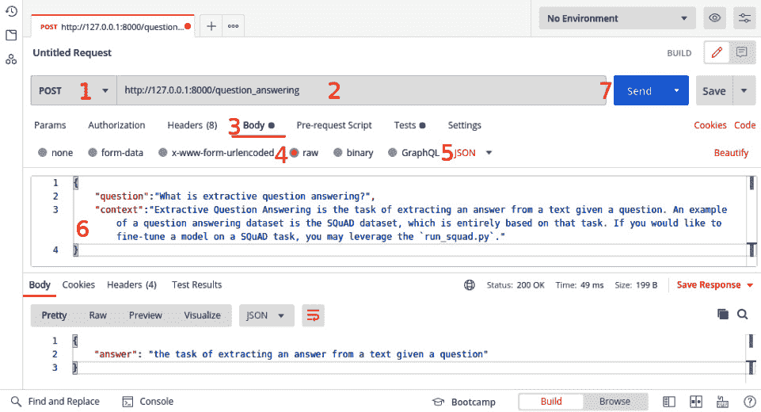
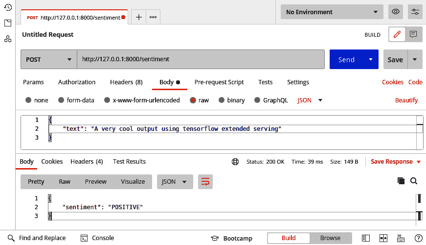
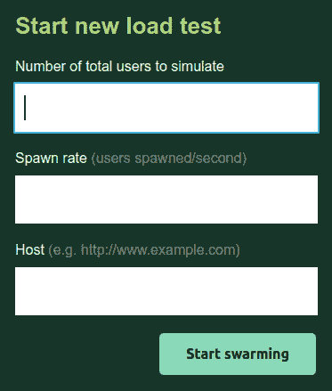

# 第十一章：提供 Transformer 模型

到目前为止，我们已经探讨了围绕 Transformer 的许多方面，你已经学会了如何从头开始训练和使用 Transformer 模型。您还学会了如何为许多任务进行微调。然而，我们仍然不知道如何在生产中提供这些模型。与任何其他现实生活和现代解决方案一样，基于**自然语言处理**（**NLP**）的解决方案必须能够在生产环境中提供服务。然而，在开发这种解决方案时必须考虑响应时间等指标。

本章将介绍如何在具有 CPU/GPU 的环境中提供基于 Transformer 的 NLP 解决方案。将在此处描述用于机器学习部署的**TensorFlow Extended**（**TFX**）解决方案。还将说明用于作为 API 提供 Transformer 的其他解决方案，例如 FastAPI。您还将了解 Docker 的基础知识，以及如何将您的服务 docker 化并使其可部署。最后，您将学习如何使用 Locust 对基于 Transformer 的解决方案进行速度和负载测试。

在本章中，我们将涵盖以下主题：

+   快速 API 变换器模型服务

+   Docker 化 APIs

+   使用 TFX 进行更快的变换器模型服务

+   使用 Locust 进行负载测试

# 技术要求

我们将使用 Jupyter Notebook、Python 和 Dockerfile 来运行我们的编码练习，这将需要 Python 3.6.0。需要安装以下软件包：

+   TensorFlow

+   PyTorch

+   Transformer >=4.00

+   快速 API

+   Docker

+   Locust

现在，让我们开始吧！

本章中的所有编码练习笔记本将在以下 GitHub 链接中提供: [`github.com/PacktPublishing/Mastering-Transformers/tree/main/CH10`](https://github.com/PacktPublishing/Mastering-Transformers/tree/main/CH10)。

点击以下链接查看动态演示视频: [`bit.ly/375TOPO`](https://bit.ly/375TOPO)

# 快速 API 变换器模型服务

有许多我们可以用来提供服务的 web 框架。 Sanic、Flask 和 fastAPI 只是一些例子。然而，fastAPI 最近因其速度和可靠性而备受关注。在本节中，我们将使用 fastAPI 并根据其文档学习如何构建服务。我们还将使用`pydantic`来定义我们的数据类。让我们开始吧！

1.  在开始之前，我们必须安装`pydantic`和 fastAPI：

    ```py
    $ pip install pydantic
    $ pip install fastapi
    ```

1.  下一步是使用`pydantic`为装饰 API 输入的数据模型进行建模。但是在形成数据模型之前，我们必须了解我们的模型是什么，并确定其输入。

    我们将使用**问答**（**QA**）模型。正如你从*第六章*中所知，*Fine-Tuning Language Models for Token Classification*，输入是问题和上下文的形式。

1.  通过使用以下数据模型，您可以创建 QA 数据模型：

    ```py
    from pydantic import BaseModel
    class QADataModel(BaseModel):
         question: str
         context: str
    ```

1.  我们必须只加载模型一次，而不是为每个请求加载它；相反，我们将预加载它一次并重复使用它。因为每次我们向服务器发送请求时，端点函数都会被调用，这将导致模型每次都被加载：

    ```py
    from transformers import pipeline
    model_name = 'distilbert-base-cased-distilled-squad'
    model = pipeline(model=model_name, tokenizer=model_name,   
                              task='question-answering')
    ```

1.  下一步是为调节应用程序创建一个 fastAPI 实例：

    ```py
    from fastapi import FastAPI
    app = FastAPI()
    ```

1.  然后，您必须使用以下代码创建一个 fastAPI 端点：

    ```py
    @app.post("/question_answering")
    async def qa(input_data: QADataModel):
         result = model(question = input_data.question, context=input_data.context)
         return {"result": result["answer"]}
    ```

1.  对于使该函数以异步模式运行，重要的是使用 `async`；这将使请求并行运行。您还可以使用 `workers` 参数来增加 API 的工作线程数，并使其同时回答不同和独立的 API 调用。

1.  使用 `uvicorn`，您可以运行应用程序并将其作为 API 提供。**Uvicorn** 是用于 Python API 的高速服务器实现，使其尽可能快速运行。使用以下代码：

    ```py
    if __name__ == '__main__':
               uvicorn.run('main:app', workers=1)
    ```

1.  请记住，上述代码必须保存在 `.py` 文件中（例如 `main.py`）。您可以使用以下命令运行它：

    ```py
    $ python main.py
    ```

    结果如下，您将在终端中看到以下输出：

    

    图 10.1 – fastAPI 实战

1.  下一步是使用并测试它。我们可以使用许多工具来做这件事，但 Postman 是其中之一。在学习如何使用 Postman 之前，请使用以下代码：

    ```py
    $ curl --location --request POST 'http://127.0.0.1:8000/question_answering' \
    --header 'Content-Type: application/json' \
    --data-raw '{
        "question":"What is extractive question answering?",
        "context":"Extractive Question Answering is the task of extracting an answer from a text given a question. An example of a question answering dataset is the SQuAD dataset, which is entirely based on that task. If you would like to fine-tune a model on a SQuAD task, you may leverage the `run_squad.py`."
    }'
    ```

    结果如下：

    ```py
    {"answer":"the task of extracting an answer from a text given a question"}
    ```

    Curl 是一个有用的工具，但不如 Postman 方便。Postman 带有图形用户界面，比起是一个 CLI 工具的 curl 更易于使用。要使用 Postman，请从[`www.postman.com/downloads/`](https://www.postman.com/downloads/)安装它。

1.  安装完 Postman 后，您可以轻松使用它，如下截图所示：

    图 10.2 – Postman 使用

1.  设置 Postman 以使用您的服务的每个步骤在上述截图中都有编号。让我们来看看它们：

1.  选择 **POST** 作为您的方法。

1.  输入完整的端点 URL。

1.  选择 **Body**。

1.  将 **Body** 设置为 **raw**。

1.  选择 **JSON** 数据类型。

1.  以 JSON 格式输入您的输入数据。

1.  单击 **Send**。

    您将在 Postman 的底部部分看到结果。

在下一节中，您将学习如何将基于 fastAPI 的 API docker 化。学习 Docker 基础知识对于使您的 API 可打包并更容易部署至关重要。

# Docker 化 API

为了在生产过程中节省时间并简化部署过程，使用 Docker 是至关重要的。对于隔离您的服务和应用程序非常重要。此外，请注意，相同的代码可以在任何地方运行，而不受底层操作系统的限制。为了实现这一点，Docker 提供了出色的功能和打包。在使用它之前，您必须按照 Docker 文档中推荐的步骤安装它([`docs.docker.com/get-docker/`](https://docs.docker.com/get-docker/))：

1.  首先，将 `main.py` 文件放置在 app 目录中。

1.  接下来，您必须通过指定以下内容来删除代码的最后一部分：

    ```py
    if __name__ == '__main__':
         uvicorn.run('main:app', workers=1)
    ```

1.  下一步是为您的 fastAPI 创建一个 Dockerfile；您之前已经创建过了。为此，您必须创建一个包含以下内容的 Dockerfile：

    ```py
    FROM python:3.7
    RUN pip install torch
    RUN pip install fastapi uvicorn transformers
    EXPOSE 80
    COPY ./app /app
    CMD ["uvicorn", "app.main:app", "--host", "0.0.0.0", "--port", "8000"]
    ```

1.  然后，您可以构建您的 Docker 容器：

    ```py
    $ docker build -t qaapi .
    And easily start it:
    $ docker run -p 8000:8000 qaapi
    ```

    因此，您现在可以使用`8000`端口访问您的 API。但是，您仍然可以使用 Postman，如前一节所述，*fastAPI Transformer model serving*。

到目前为止，您已经学会了如何基于 Transformer 模型创建自己的 API，并使用 fastAPI 提供服务。然后学习了如何 dockerize 它。重要的是要知道，关于 Docker，您必须学习许多选项和设置；我们这里只覆盖了 Docker 的基础知识。

在下一节中，您将学习如何使用 TFX 来改进您的模型服务。

# 使用 TFX 进行更快的 Transformer 模型服务

TFX 提供了一种更快速和更高效的方式来提供基于深度学习的模型。但是在使用之前，您必须了解一些重要的关键点。模型必须是来自 TensorFlow 的保存模型类型，以便它可以被 TFX Docker 或 CLI 使用。让我们来看一看：

1.  您可以通过使用来自 TensorFlow 的保存模型格式来执行 TFX 模型服务。有关 TensorFlow 保存模型的更多信息，请阅读官方文档：[`www.tensorflow.org/guide/saved_model`](https://www.tensorflow.org/guide/saved_model)。要从 Transformers 创建保存模型，您只需使用以下代码：

    ```py
    from transformers import TFBertForSequenceClassification
    model = \ TFBertForSequenceClassification.from_pretrained("nateraw/bert-base-uncased-imdb", from_pt=True)
    model.save_pretrained("tfx_model", saved_model=True)
    ```

1.  在理解如何使用它来为 Transformers 提供服务之前，需要拉取 TFX 的 Docker 镜像：

    ```py
    $ docker pull tensorflow/serving
    ```

1.  这将拉取正在提供的 TFX Docker 容器。下一步是运行 Docker 容器并将保存的模型复制到其中：

    ```py
    $ docker run -d --name serving_base tensorflow/serving
    ```

1.  您可以使用以下代码将保存的文件复制到 Docker 容器中：

    ```py
    $ docker cp tfx_model/saved_model tfx:/models/bert
    ```

1.  这将把保存的模型文件复制到容器中。但是，您必须提交更改：

    ```py
    $ docker commit --change "ENV MODEL_NAME bert" tfx my_bert_model
    ```

1.  现在一切都准备就绪，您可以终止 Docker 容器：

    ```py
    $ docker kill tfx
    ```

    这将停止容器的运行。

    现在模型已经准备好，并且可以通过 TFX Docker 提供服务，您可以简单地与另一个服务一起使用它。我们需要另一个服务来调用 TFX 的原因是，基于 Transformer 的模型有一个由 tokenizer 提供的特殊输入格式。

1.  为此，您必须创建一个 fastAPI 服务，该服务将模拟由 TensorFlow 服务容器提供的 API。在编写代码之前，您应该通过给予它运行 BERT-based 模型的参数来启动 Docker 容器。这将帮助您修复任何错误：

    ```py
    $ docker run -p 8501:8501 -p 8500:8500 --name bert my_bert_model
    ```

1.  下面的代码包含了`main.py`文件的内容：

    ```py
    import uvicorn
    from fastapi import FastAPI
    from pydantic import BaseModel
    from transformers import BertTokenizerFast, BertConfig
    import requests
    import json
    import numpy as np
    tokenizer =\
     BertTokenizerFast.from_pretrained("nateraw/bert-base-uncased-imdb")
    config = BertConfig.from_pretrained("nateraw/bert-base-uncased-imdb")
    class DataModel(BaseModel):
        text: str
    app = FastAPI()
    @app.post("/sentiment")
    async def sentiment_analysis(input_data: DataModel):
        print(input_data.text)
        tokenized_sentence = [dict(tokenizer(input_data.text))]
        data_send = {"instances": tokenized_sentence}
        response = \    requests.post("http://localhost:8501/v1/models/bert:predict", data=json.dumps(data_send))
        result = np.abs(json.loads(response.text)["predictions"][0])
        return {"sentiment": config.id2label[np.argmax(result)]}
    if __name__ == '__main__': 
         uvicorn.run('main:app', workers=1)
    ```

1.  我们加载了`config`文件，因为标签存储在其中，我们需要它们以在结果中返回。您可以简单地使用`python`运行此文件：

    ```py
    $ python main.py
    ```

    现在，您的服务已经启动并准备就绪。您可以使用 Postman 访问它，如下图所示：



图 10.3—基于 TFX 服务的 Postman 输出

TFX Docker 中新服务的整体架构如下图所示：


图 10.4—基于 TFX 服务的架构

到目前为止，您已经学会了如何使用 TFX 提供模型。然而，您还需要学会如何使用 Locust 进行负载测试。了解服务的限制以及何时通过量化或修剪进行优化是非常重要的。在下一节中，我们将描述如何使用 Locust 在高负载下测试模型性能。

# 使用 Locust 进行负载测试

我们可以使用许多应用程序来对服务进行负载测试。这些应用程序和库中的大多数都提供了有关服务的响应时间和延迟的有用信息。它们还提供了有关故障率的信息。Locust 是这一目的最好的工具之一。我们将使用它来对三种用于提供基于 Transformer 的模型的方法进行负载测试：仅使用 fastAPI、使用 docker 化的 fastAPI 以及使用 fastAPI 进行 TFX-based 服务。让我们开始吧：

1.  首先，我们必须安装 Locust：

    ```py
    $ pip install locust
    ```

    此命令将安装 Locust。下一步是使提供相同任务的所有服务使用相同的模型。修正此测试的最重要的两个参数将确保所有服务均被设计成满足单一目的。使用相同的模型将帮助我们凝固其他任何内容，并集中于方法的部署性能。

1.  一切准备就绪后，您可以开始测试 API 的负载。您必须准备一个`locustfile`来定义您的用户及其行为。以下代码是一个简单的`locustfile`：

    ```py
    from locust import HttpUser, task
    from random import choice
    from string import ascii_uppercase
    class User(HttpUser):
        @task
        def predict(self):
            payload = {"text": ''.join(choice(ascii_uppercase) for i in range(20))}
            self.client.post("/sentiment", json=payload)
    ```

    通过使用`HttpUser`并创建从中继承的`User`类，我们可以定义一个`HttpUser`类。`@task`装饰器对于定义用户生成后必须执行的任务至关重要。`predict`函数是用户生成后将重复执行的实际任务。它将生成一个长度为`20`的随机字符串并发送到您的 API。

1.  要开始测试，您必须启动您的服务。一旦您启动了服务，运行以下代码以启动 Locust 负载测试：

    ```py
    $ locust -f locust_file.py
    ```

    Locust 将根据您在`locustfile`中提供的设置启动。您的终端将显示以下内容：

    

    图 10.5—启动 Locust 负载测试后的终端

    正如您所看到的，您可以打开网络接口的 URL，即 http://0.0.0.0:8089。

1.  打开 URL 之后，您将看到一个界面，如下截图所示：

    图 10.6—Locust 网络接口

1.  我们将把**要模拟的总用户数**设定为**10**，**生成速率**设定为**1**，**主机**设定为**http://127.0.0.1:8000**，这是我们服务运行的地方。在设置这些参数之后，点击**开始 swarming**。

1.  此时，界面将会改变，测试将开始。要随时停止测试，点击**停止**按钮。

1.  你还可以点击**Charts**选项卡查看结果的可视化：

    图 10.7 – 来自 Charts 选项卡的 Locust 测试结果

1.  现在 API 的测试准备好了，让我们测试所有三个版本并比较结果，看哪个执行效果更好。请记住，服务必须在你要提供服务的机器上独立测试。换句话说，你必须一次运行一个服务并测试它，关闭服务，运行另一个服务并测试它，依此类推。

    结果显示在下表中：


表 1 – 比较不同实现的结果

在上表中，**每秒请求数**（**RPS**）表示 API 每秒响应的请求数，而**平均响应时间**（**RT**）表示服务响应给定调用所需的毫秒数。这些结果显示了基于 TFX 的 fastAPI 是最快的。它具有更高的 RPS 和较低的平均 RT。所有这些测试都是在一台配有 Intel(R) Core(TM) i7-9750H CPU 和 32 GB RAM、GPU 禁用的机器上进行的。

在这一节中，你学习了如何测试你的 API 并测量其性能，重要参数如 RPS 和 RT。然而，真实世界的 API 还可以执行许多其他压力测试，比如增加用户数量使其表现得像真实用户一样。要执行这样的测试并以更真实的方式报告其结果，重要的是阅读 Locust 的文档并学习如何执行更高级的测试。

# 总结

在这一章中，你学习了使用 fastAPI 提供 Transformer 模型的基础知识。你还学会了如何以更高级和更有效的方式提供模型，比如使用 TFX。然后，你学习了负载测试和创建用户的基础知识。让这些用户分组生成或逐个生成，然后报告压力测试的结果，是本章的另一个主要主题。之后，你学习了 Docker 的基础知识以及如何将你的应用程序打包成 Docker 容器的形式。最后，你学会了如何提供基于 Transformer 的模型。

在下一章中，你将学习 Transformer 的解构、模型视图，并使用各种工具和技术监视训练。

# 参考资料

+   Locust 文档：[`docs.locust.io`](https://docs.locust.io)

+   TFX 文档：[`www.tensorflow.org/tfx/guide`](https://www.tensorflow.org/tfx/guide)

+   FastAPI 文档：[`fastapi.tiangolo.com`](https://fastapi.tiangolo.com)

+   Docker 文档：[`docs.docker.com`](https://docs.docker.com)

+   HuggingFace TFX 服务：[`huggingface.co/blog/tf-serving`](https://huggingface.co/blog/tf-serving)
