# *第十一章*：注意力可视化和实验跟踪

在本章中，我们将涵盖两个不同的技术概念，**注意力可视化** 和 **实验跟踪**，并通过诸如 **exBERT** 和 **BertViz** 等复杂工具来实践它们。这些工具提供了重要的可解释性和可解释性功能。首先，我们将讨论如何利用这些工具来可视化注意力的内部部分。解释所学的表示是很重要的，也要理解 Transformer 中自注意力头所编码的信息。我们将看到某些头部对应于语法或语义的某个方面。其次，我们将学习如何通过记录和使用 **TensorBoard** 和 **Weights & Biases**（**W&B**）来监视实验。这些工具使我们能够高效地托管和跟踪实验结果，例如损失或其他指标，这有助于我们优化模型训练。通过本章的学习，您将学会如何使用 exBERT 和 BertViz 查看自己模型的内部部分，并最终能够利用 TensorBoard 和 W&B 监视和优化模型。

我们将在本章中涵盖以下主题：

+   解释注意力头

+   跟踪模型指标

# 技术要求

本章的代码可在 [`github.com/PacktPublishing/Mastering-Transformers/tree/main/CH11`](https://github.com/PacktPublishing/Mastering-Transformers/tree/main/CH11) 找到，这是本书的 GitHub 代码库。我们将使用 Jupyter Notebook 运行需要 Python 3.6.0 或更高版本的编码练习，并且需要安装以下包：

+   `tensorflow`

+   `pytorch`

+   `Transformers >=4.00`

+   `tensorboard`

+   `wandb`

+   `bertviz`

+   `ipywidgets`

查看以下链接以查看代码演示视频：

[`bit.ly/3iM4Y1F`](https://bit.ly/3iM4Y1F)

# 解释注意力头

与大多数**深度学习**（**DL**）架构一样，Transformer 模型的成功以及它们如何学习尚未完全理解，但我们知道，Transformer —— 令人惊讶地 —— 学到了许多语言特征。大量的学到的语言知识分布在预训练模型的隐藏状态和自注意头中。已经发表了大量的最新研究，并开发了许多工具，以理解和更好地解释这些现象。

感谢一些**自然语言处理**（**NLP**）社区工具，我们能够解释 Transformer 模型中自注意力头所学到的信息。由于令牌之间的权重，头部可以被自然地解释。我们很快会在本节的进一步实验中看到，某些头对应于语法或语义的某个方面。我们还可以观察到表面级模式和许多其他语言特征。

在本节中，我们将使用社区工具进行一些实验来观察这些模式和注意头部的特征。最近的研究已经揭示了自注意的许多特征。在我们进行实验之前，让我们先介绍一些。例如，大多数头部倾向于关注分隔符标记，如**分隔符**（**SEP**）和**分类**（**CLS**），因为这些标记永远不被屏蔽，并且特别携带段级信息。另一个观察是，大多数头部很少关注当前标记，但一些头部专门关注下一个或上一个标记，特别是在较早的层中。以下是最近研究中发现的其他模式列表，我们可以在我们的实验中轻松观察到：

+   同一层中的注意头表现出类似的行为。

+   特定头对应于语法或语义关系的特定方面。

+   一些头部对直接对象倾向于关注它们的动词，例如*<lesson, take>*或*<car, drive>*。

+   在一些头中，名词修饰语会关注它们的名词（例如*the hot water*；*the next layer*），或所有格代词会关注头部（例如*her car*）。

+   一些头部对被动助动词进行编码，例如*Been damaged, was taken*。

+   在一些头部中，指代提及关注自己，例如*talks-negotiation, she-her, President-Biden*。

+   较低的层通常包含有关词位置的信息。

+   语法特征在 transformer 中较早出现，而高级语义信息出现在更上层。

+   最终层是最具任务特异性的，并因此对下游任务非常有效。

为了观察这些模式，我们可以在这里使用两个重要工具**exBERT**和**BertViz**。这些工具功能几乎相同。我们将从 exBERT 开始。

## 用 exBERT 可视化注意力头部

exBERT 是一个可视化工具，用于查看 Transformers 内部部分。我们将使用它来可视化*BERT-base-cased*模型的自注意头部，这是 exBERT 界面的默认模型。除非另有说明，我们将在以下示例中使用*BERT-base-cased*模型。这包含 12 层，每层 12 个自注意头部，共计 144 个自注意头部。

我们将逐步学习如何使用 exBERT，如下所示：

1.  让我们点击由*Hugging Face*托管的 exBERT 链接：[`huggingface.co/exbert`](https://huggingface.co/exbert)。

1.  输入句子**The cat is very sad.**并查看输出，如下所示：

    图 11.1 – exBERT 界面

    在上面的屏幕截图中，左侧的标记关注右侧的标记。线条的厚度代表权重的值。由于 CLS 和 SEP 标记具有非常频繁和密集的连接，我们简化起见切断了与它们相关的链接。请参阅**隐藏特殊标记**切换按钮。现在我们看到的是第 1 层的关注映射，其中线条对应于所有头部上权重的总和。这被称为**多头注意力机制**，其中 12 个头部并行工作。这个机制可以让我们捕捉比单头注意力更广泛的关系。这就是为什么我们在*图 11.1*中看到一个广泛的关注模式。我们还可以通过点击**头部**列观察任何特定的头部。

    如果您在左侧悬停在一个标记上，您将看到将它连接到右侧的具体权重。有关使用界面的更详细信息，请阅读文章*exBERT：一个用于探索变压器模型中学到表示的可视分析工具*，作者*本杰明·胡佛*，*亨德里克·施特罗贝尔特*，*塞巴斯蒂安·格赫尔曼*，*2019 年*，或观看以下链接的视频：[`exbert.net/`](https://exbert.net/)。

1.  现在，我们将尝试支持本节介绍部分中其他研究人员的发现。让我们以*某些头部专门关注下一个或前一个标记，尤其是在较早的层*模式为例，看是否有一个头部支持这一点。

1.  在本章的其余部分中，我们将使用**<层编号，头部编号>**符号来表示特定的自注意头部，在这里，指数从 exBERT 的 1 开始，从 BertViz 的 0 开始。例如，*<3,7>*表示 exBERT 第三层的第七个头部。当您选择**<2,5>（或<4,12>或<6,2>）**头部时，您将得到以下输出，其中每个标记只关注前一个标记：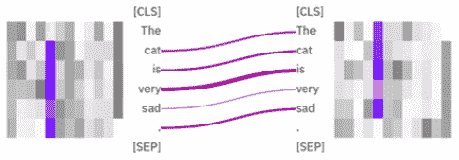

    图 11.2 – 上一个标记关注模式

1.  对于**<2, 12>**和**<3, 4>**头部，您将得到一个模式，其中每个标记都与下一个标记关联，如下所示：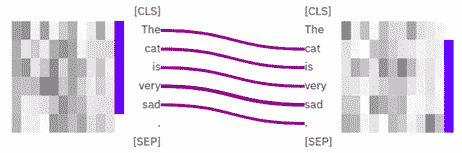

    图 11.3 – 下一个标记关注模式

    这些头部对其他输入句子具有相同的功能，即它们独立于输入工作。您可以自己尝试不同的句子。

    我们可以使用注意力头部进行先进的语义任务，例如使用**探测分类器**进行代词消解。首先，我们将从定性上检查内部表示是否具有代词消解（或核指代消解）的能力。代词消解被认为是一项具有挑战性的语义关系任务，因为代词与其先行词之间的距离通常非常大。

1.  现在，我们拿句子*The cat is very sad. Because it could not find food to eat.* 作为例子。当你检查每个头部时，你会注意到*<9,9>*和*<9,12>*头部编码了代词关系。当你悬停在*<9,9>*头上的**it**时，我们会得到以下输出：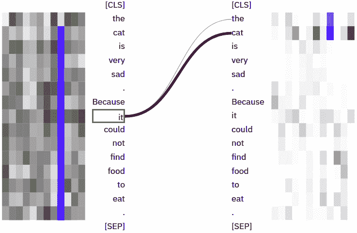

    图 11.4 – <9,9>头部的指代模式

    *<9,12>*头也用于代词关系。同样，在悬停在**it**上时，我们得到以下输出：

    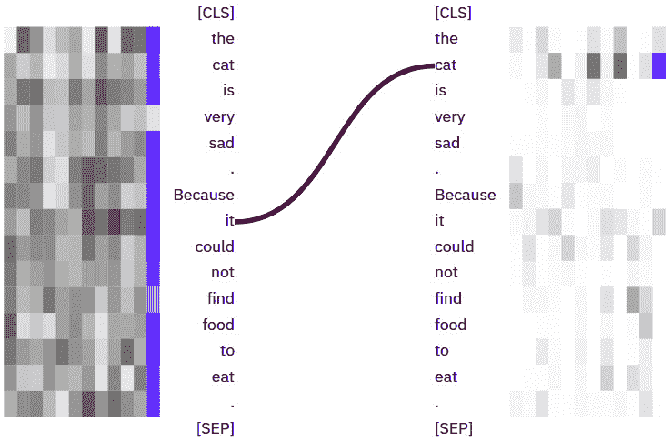

    图 11.5 – <9,12>头部的指代模式

    从上述截图中，我们看到**it**代词强烈关注它的先行词**cat**。我们稍微改变一下句子，让**it**代词现在指代**food**标记而不是**cat**，就像**the cat did not eat the food because it was not fresh**中一样。如下截图所示，与*<9,9>*头相关的截图中，**it**正确地关注了它的先行词**food**，如预期所示：

    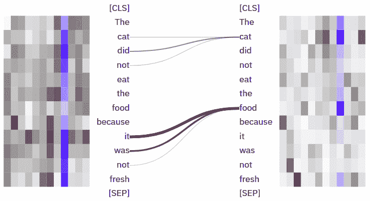

    图 11.6 – 第二个例子的<9,9>头部的模式

1.  让我们再做一次运行，这次代词指代的是**cat**，就像**The cat did not eat the food because it was very angry**中一样。在*<9,9>*头中，**it** 标记大部分关注**cat**标记，如下截图所示：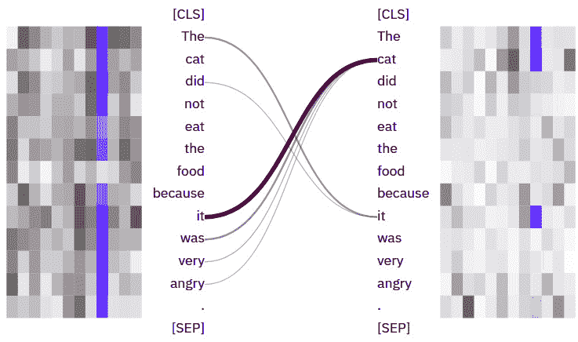

    图 11.7 – 第二个输入的<9,9>头部的模式

1.  我觉得这些例子已经足够了。现在，我们将以不同的方式使用 exBERT 模型来评估模型的容量。让我们重新启动 exBERT 界面，选择最后一层（*第 12 层*），并保留所有头部。然后，输入句子**the cat did not eat the food.**并将**food**标记掩码。双击掩码掩码了**food**标记，如下所示：

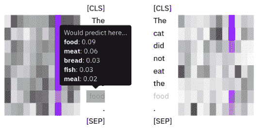

图 11.8 – 通过掩码评估模型

当你悬停在那个被掩码的标记上时，你可以看到*Bert-base-cased*模型的预测分布，如上述截图所示。第一个预测是**food**，这是预期的。有关工具的更详细信息，你可以使用 exBERT 的网页，位于[`exbert.net/`](https://exbert.net/)。

干得好！在下一节中，我们将使用 BertViz 并编写一些 Python 代码来访问注意力头。

## 使用 BertViz 进行多尺度注意力头的可视化

现在，我们将编写一些代码来使用 BertViz 可视化头，这是一个可视化 Transformer 模型中注意力的工具，就像 exBERT 一样。它是由 Jesse Vig 在 2019 年开发的（*Transformer 模型中注意力的多尺度可视化*，*Jesse Vig*，*2019*）。它是 Tensor2Tensor 可视化工具（Jones, 2017）工作的延伸。我们可以通过 Python **应用程序编程接口**（**API**）监视模型的内部部分进行多尺度定性分析。BertViz 的优点在于，我们可以通过 Python **应用程序编程接口**（**API**）使用大多数 Hugging Face 托管的模型（如**双向编码器转换器表示**（**BERT**）、**生成的预训练转换器**（**GPT**）和**跨语言语言模型**（**XLM**））。因此，我们也将能够使用非英语模型或任何预训练模型。我们将很快一起检查这样的示例。您可以从以下 GitHub 链接访问 BertViz 资源和其他信息：[`github.com/jessevig/bertviz`](https://github.com/jessevig/bertviz)。

与 exBERT 类似，BertViz 在一个界面中可视化注意力头。此外，它支持**鸟瞰视角**和低级别的**神经元视角**，我们可以观察个别神经元如何相互作用以构建注意力权重。一个有用的演示视频可在以下链接找到：[`vimeo.com/340841955`](https://vimeo.com/340841955)。

在开始之前，我们需要安装必要的库，如下所示：

```py
!pip install bertviz ipywidgets
```

然后我们导入以下模块：

```py
from bertviz import head_view
from Transformers import BertTokenizer, BertModel
```

BertViz 支持三种视图：**头视图**、**模型视图**和**神经元视图**。让我们逐一检查这些视图。不过，首先需要指出的是，在 exBERT 中，我们从 1 开始索引层和头。但在 BertViz 中，我们从 0 开始索引，与 Python 编程相同。如果我说 exBERT 中的一个 *<9,9>* 头，它的 BertViz 对应物是 *<8,8>*。

让我们从头视图开始。

### 注意力头视图

头视图是 BertViz 中我们在前一节中使用 exBERT 已经体验过的等价物。**注意力头视图**可视化基于一个或多个注意力头的注意力模式在所选层中：

1.  首先，我们定义一个`get_bert_attentions()`函数，用于检索给定模型和给定句对的注意力和标记。函数定义如下代码块所示：

    ```py
    def get_bert_attentions(model_path, sentence_a, sentence_b):
        model = BertModel.from_pretrained(model_path,
            output_attentions=True)
        tokenizer = BertTokenizer.from_pretrained(model_path)
        inputs = tokenizer.encode_plus(sentence_a,
            sentence_b, return_tensors='pt',
            add_special_tokens=True) 
        token_type_ids = inputs['token_type_ids']
        input_ids = inputs['input_ids']
        attention = model(input_ids,
            token_type_ids=token_type_ids)[-1]
        input_id_list = input_ids[0].tolist()
        tokens = tokenizer.convert_ids_to_tokens(input_id_list)
        return attention, tokens
    ```

1.  在下面的代码片段中，我们加载了 `bert-base-cased` 模型，并检索了给定两个句子的标记和相应的注意力。然后我们在最后调用了 `head_view()` 函数来可视化注意力。以下是代码执行：

    ```py
    model_path = 'bert-base-cased'
    sentence_a = "The cat is very sad."
    sentence_b = "Because it could not find food to eat."
    attention, tokens=get_bert_attentions(model_path, 
        sentence_a, sentence_b)
    head_view(attention, tokens)
    ```

    代码输出是一个界面，如下所示：

    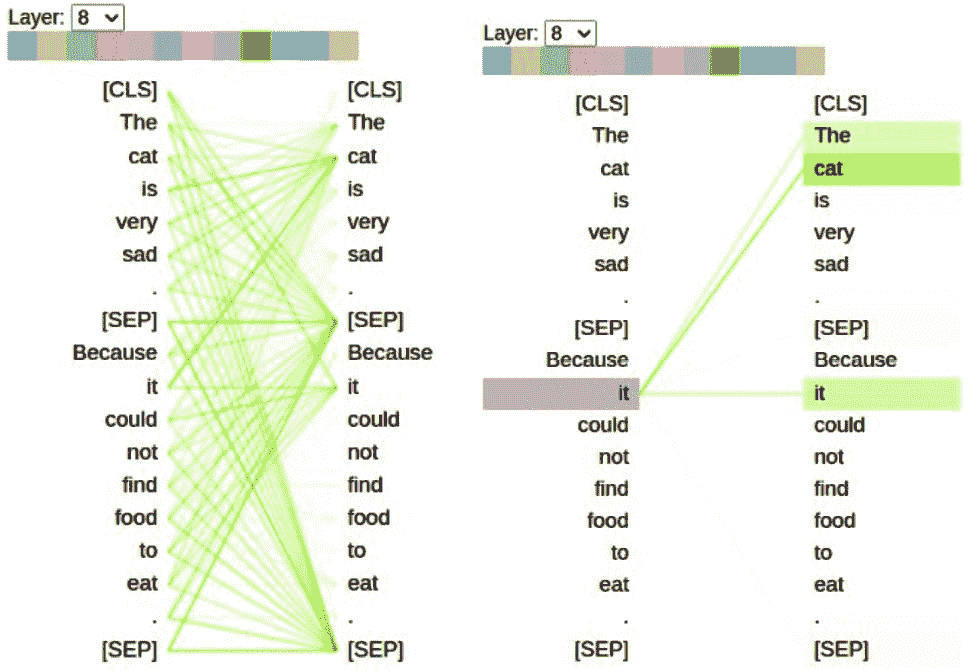

    图 11.9 - BertViz 的头视图输出

    *图 11.9* 左侧是首先出现的界面。在任何左侧的令牌上悬停将显示从该令牌出发的注意力。顶部的彩色块对应于注意力头。双击其中的任何一个将选择它并丢弃其余部分。较粗的注意力线表示更高的注意力权重。

    请记住，在前面的 exBERT 示例中，我们观察到 *<9,9>* 头（由于索引的原因，在 BertViz 中等效于 *<8, 8>*）具有代词-先行关系。我们观察到相同的模式在 *图 11.9* 中，选择第 8 层和第 8 头。然后，当我们悬停在 *它* 上时，在 *图 11.9* 的右侧看到了界面，*它* 强烈关注 *cat* 和 *it* 令牌。那么，在其他预训练语言模型中我们能观察到这些语义模式吗？虽然其它模型中头部不一定完全相同，但一些头部可能会编码这些语义特性。我们也从最近的工作中得知，语义特征主要编码在较高的层中。

1.  让我们在土耳其语言模型中寻找一个指代模式。以下代码加载了一个土耳其`bert-base`模型并取了一个句子对。我们在这里观察到，*<8,8>* 头在土耳其语言模型中具有与英语模型相同的语义特征，如下所示：

    ```py
    model_path = 'dbmdz/bert-base-turkish-cased'
    sentence_a = "Kedi çok üzgün."
    sentence_b = "Çünkü o her zamanki gibi çok fazla yemek yedi."
    attention, tokens=\
    get_bert_attentions(model_path, sentence_a, sentence_b)
    head_view(attention, tokens)
    ```

    从前面的代码中，`sentence_a` 和 `sentence_b` 意味着 *The cat is sad* 和 *Because it ate too much food as usual*，当悬停在 **o**（**它**）上时，**它** 关注 **Kedi**（**猫**），如下所示：

    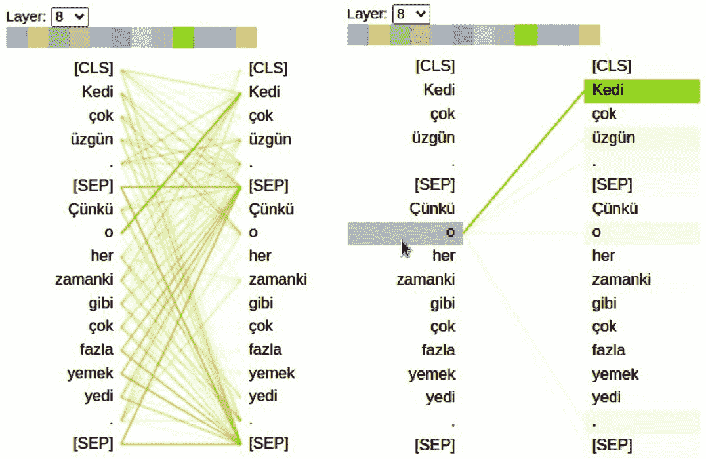

    图 11.10 – 土耳其语言模型中的指代模式

    除了 **o** 之外的所有其他标记大多数关注到了 SEP 分隔符标记，这是 BERT 架构中所有头部中的一种主导行为模式。

1.  作为头视图的最后一个示例，我们将解释另一个语言模型，并继续查看模型视图特性。这次，我们选择`bert-base-german-cased`德语语言模型并将其可视化为输入——即，我们用于土耳其语的同一个句对的德语等价句对。

1.  以下代码加载了一个德语模型，消耗了一对句子，并对其进行了可视化：

    ```py
    model_path = 'bert-base-german-cased'
    sentence_a = "Die Katze ist sehr traurig."
    sentence_b = "Weil sie zu viel gegessen hat"
    attention, tokens=\
    get_bert_attentions(model_path, sentence_a, sentence_b)
    head_view(attention, tokens)
    ```

1.  当我们检查头部时，我们可以再次在第 8 层中看到指代模式，但这次是在第 11 个头部。要选择 *<8,11>* 头部，从下拉菜单中选择第 8 层并双击最后的头部，如下所示：

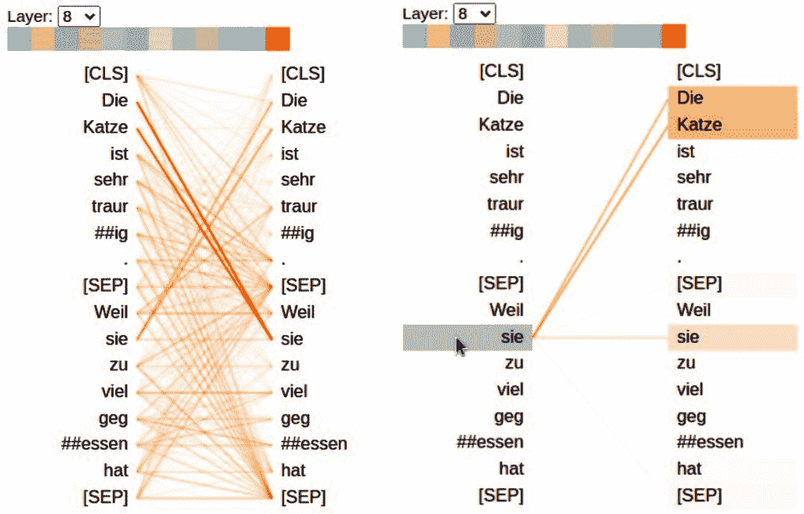

图 11.11 – 德语语言模型中的指代关系模式

如你所见，在悬停在 **sie** 上时，你会看到对 **Die Katze** 的强烈关注。虽然这个 *<8,11>* 头是最强大的指代关系头（在计算语言学文献中被称为先行关系），这种关系可能已经传播到许多其他头中。为了观察它，我们必须逐个检查所有的头。

另一方面，BertViz 的模型视图功能让我们基本了解所有头一次看到。 让我们在下一节中看一下。

### 模型视图

**模型视图**允许我们全面查看所有头和层的注意力。 自注意力头以表格形式显示，行和列分别对应层和头。 每个头以可点击的缩略图形式呈现，其中包括注意力模型的总体形状。

这个视图可以告诉我们 BERT 是如何工作的，并且更容易解释。 许多最近的研究，比如*BERTology 初级入门：我们知道 BERT 如何工作*，*Anna Rogers*，*Olga Kovaleva*，*Anna Rumshisky*，*2021*，找到了一些关于层行为的线索并达成了共识。 我们已经在*解释注意头*部分列出了其中一些。 您可以使用 BertViz 的模型视图自行测试这些事实。

让我们查看一下我们刚刚使用的德语语言模型，如下：

1.  首先，导入以下模块：

    ```py
    from bertviz import model_view
    from Transformers import BertTokenizer, BertModel
    ```

1.  现在，我们将使用 Jesse Vig 开发的`show_model_view()`包装函数。 您可以在以下链接找到原始代码：[`github.com/jessevig/bertviz/blob/master/notebooks/model_view_bert.ipynb`](https://github.com/jessevig/bertviz/blob/master/notebooks/model_view_bert.ipynb)。

1.  您还可以在我们书本的 GitHub 链接中找到函数定义，链接地址为[`github.com/PacktPublishing/Mastering-Transformers/tree/main/CH11`](https://github.com/PacktPublishing/Mastering-Transformers/tree/main/CH11)。 这里只是放出函数头部：

    ```py
    def show_model_view(model, tokenizer, sentence_a,
         sentence_b=None, hide_delimiter_attn=False,
         display_mode="dark"):
    . . . 
    ```

1.  让我们再次加载德语模型。 如果您已经加载了它，可以跳过前五行。 这是您需要的代码：

    ```py
    model_path='bert-base-german-cased'
    sentence_a = "Die Katze ist sehr traurig."
    sentence_b = "Weil sie zu viel gegessen hat"
    model = BertModel.from_pretrained(model_path, output_attentions=True)
    tokenizer = BertTokenizer.from_pretrained(model_path)
    show_model_view(model, tokenizer, sentence_a, sentence_b, 
        hide_delimiter_attn=False, 
        display_mode="light")
    ```

    这是输出结果：

    

    图 11.12 – 德语语言模型的模型视图

    这个视图帮助我们轻松观察到许多模式，比如下一个令牌（或上一个令牌）的注意力模式。 正如我们在*解释注意头*部分中提到的，令牌通常倾向于关注定界符，具体来说是在下层关注 CLS 定界符，在上层关注 SEP 定界符。 因为这些令牌未被屏蔽，它们可以促进信息的流动。 在最后的层中，我们只观察到 SEP 定界符为中心的注意力模式。 可以推测，SEP 用于收集段级信息，然后用于跨句任务，比如**下一句预测**（**NSP**）或编码句级含义。

    另一方面，我们观察到指代关系模式主要编码在 *<8,1>, <8,11>, <10,1>, and <10,7>* 头部。 再次可以明确说，*<8, 11>* 头部是编码德语模型中指代关系的最强头部，我们已经讨论过。

1.  当您点击该缩略图时，您将看到相同的输出，如下：

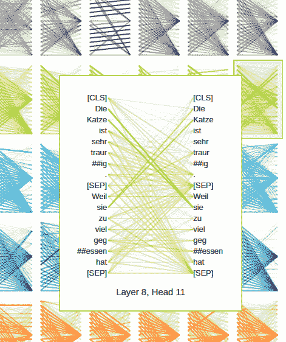

图 11.13 – 模型视图中<8,11>头部的放大图

你可以再次悬停在标记上，查看映射关系。

我认为头视图和模型视图的工作已经足够了。现在，让我们通过神经元视图拆解模型，并试图理解这些头部是如何计算权重的。

### 神经元视图

到目前为止，我们已经可视化了给定输入的计算权重。**神经元视图**可视化了查询中的神经元和关键向量，以及基于相互作用计算标记之间的权重。我们可以追踪任意两个标记之间的计算阶段。

接下来，我们将加载德语模型，并可视化刚刚处理过的同一句对，以保持连贯性。我们执行以下代码：

```py
from bertviz.Transformers_neuron_view import BertModel, BertTokenizer
from bertviz.neuron_view import show
model_path='bert-base-german-cased'
sentence_a = "Die Katze ist sehr traurig."
sentence_b = "Weil sie zu viel gegessen hat"
model = BertModel.from_pretrained(model_path, output_attentions=True)
tokenizer = BertTokenizer.from_pretrained(model_path)
model_type = 'bert'
show(model, model_type, tokenizer, sentence_a, sentence_b, layer=8, head=11)
```

这就是输出：

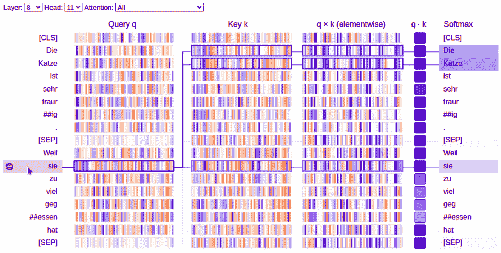

图 11.14 – 核指关系模式的神经元视图（头部<8,11>）

这个视图帮助我们追踪了我们在左边选择的**sie**标记到右边其他标记的注意力计算。正值是蓝色的，负值是橙色的。颜色的强度代表了数值的大小。查询**sie**与**Die**和**Katze**的键非常相似。如果你仔细观察图案，你会注意到这些向量有多么相似。因此，它们的点积要比其他的比较更高，这建立了这些标记之间强烈的注意力。我们还可以追踪点积和 Softmax 函数的输出，当我们向右移动时。当点击左边的其他标记时，你也可以追踪其他的计算。

现在，让我们为相同的输入选择一个头部承载的下一个标记的注意力模式，并对其进行追踪。为此，我们选择*<2,6>* 头部。在这个模式中，几乎所有的注意力都集中在下一个字上。我们再次点击**sie**标记，如下所示：

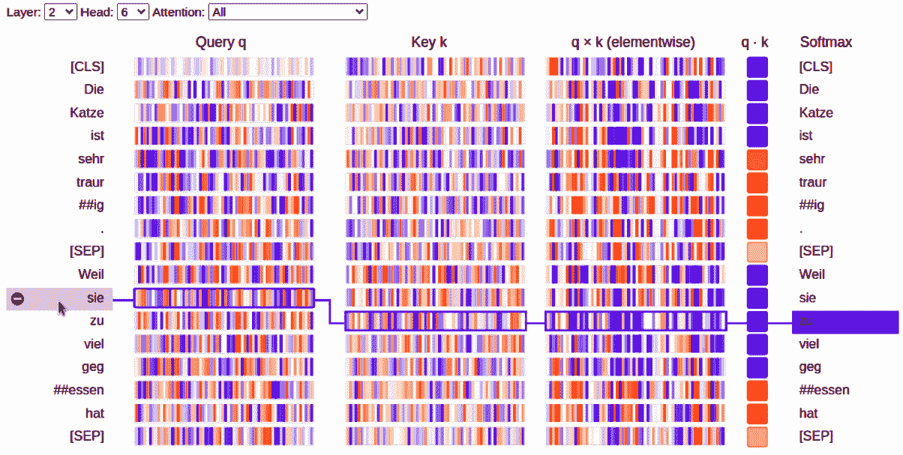

图 11.15 – 下一个标记注意力模式的神经元视图（<2,6>头部）

现在，**sie** 标记的注意力集中在下一个标记上，而不是它自己的先行词(**Die Katze**)。当我们仔细观察查询和候选键时，我们会发现与**sie**的查询最相似的键是下一个标记**zu**。同样地，在这过程中我们可以看到点乘和 Softmax 函数是如何应用的。

在下一节，我们将简要讨论解释变压器（Transformers）的探针分类器。

## 通过解读变压器的探针分类器理解 BERT 的内部部分

DL 学到的内容的不透明性导致了许多关于这些模型解释的研究。我们试图回答这样的问题：Transformer 模型的哪些部分负责某些语言特征，或者输入的哪些部分导致模型做出特定的决定。为了做到这一点，除了可视化内部表示之外，我们还可以对表示进行分类器训练，以预测一些外部形态、句法或语义属性。因此，我们可以确定是否将内部 *表示* 与外部 *属性* 关联起来。模型的成功训练将是这种关联的定量证据——即，语言模型已经学会了与外部属性相关的信息。这种方法称为 **探测分类器** 方法，是自然语言处理和其他 DL 研究中的一种重要分析技术。基于注意力的探测分类器以注意力映射作为输入，并预测外部属性，如共指关系或头部修饰关系。

如前面的实验所示，我们可以使用`get_bert_attention()`函数获取给定输入的自注意权重。我们可以直接将这些权重传递到分类管道中，而不是将它们可视化。因此，在监督下，我们可以确定哪个头适合哪个语义特征——例如，我们可以通过标记数据找出哪些头适合共指。

现在，让我们转向模型跟踪部分，这对于构建高效的模型至关重要。

# 跟踪模型指标

到目前为止，我们已经训练了语言模型，并简单分析了最终结果。我们还没有观察训练过程或比较使用不同选项进行训练。在本节中，我们将简要讨论如何监视模型训练。为此，我们将处理如何跟踪之前在*第五章*中开发的模型的训练，*文本分类的语言模型微调*。

在这个领域开发了两个重要的工具——一个是 TensorBoard，另一个是 W&B。前者可以将训练结果保存到本地驱动器，并在实验结束时将其可视化。后者则可以在云平台上实时监视模型训练进度。

本节将是对这些工具的简要介绍，不会详细讨论它们，因为这超出了本章的范围。

让我们从 TensorBoard 开始。

## 使用 TensorBoard 跟踪模型训练

TensorBoard 是专门用于 DL 实验的可视化工具。它有许多功能，如跟踪、训练、将嵌入投射到较低的空间和可视化模型图。我们主要用它来跟踪和可视化诸如损失之类的指标。对于 Transformers 来说，使用 TensorBoard 跟踪指标是如此容易，只需在模型训练代码中添加几行就足够了。一切几乎保持不变。

现在，我们将重复*第五章*中进行的**互联网电影数据库**（**IMDb**）情感微调实验，*对文本分类进行语言模型微调*，并将跟踪指标。在该章节中，我们已经使用由**4 千**（**4K**）个训练数据集、1 千验证集和 1 千测试集组成的 IMDb 数据集训练了一个情感模型。现在，我们将其调整为适用于 TensorBoard。有关 TensorBoard 的更多详细信息，请访问 [`www.tensorflow.org/tensorboard`](https://www.tensorflow.org/tensorboard)。

让我们开始：

1.  首先，如果尚未安装 TensorBoard，我们要这样安装：

    ```py
    !pip install tensorboard 
    ```

1.  从*第五章*，*对文本分类进行语言模型微调*，保持 IMDb 情感分析的其他代码行不变，我们将训练参数设置如下：

    ```py
    from Transformers import TrainingArguments, Trainer
    training_args = TrainingArguments(
        output_dir='./MyIMDBModel', 
        do_train=True,
        do_eval=True,
        num_train_epochs=3, 
        per_device_train_batch_size=16, 
        per_device_eval_batch_size=32,
        logging_strategy='steps', 
        logging_dir='./logs', 
        logging_steps=50,
        evaluation_strategy="steps",
        save_strategy="epoch",
        fp16=True,
        load_best_model_at_end=True
    )
    ```

1.  在上述代码片段中，`logging_dir` 的值将很快作为参数传递给 TensorBoard。由于训练数据集大小为 4K，训练批大小为 16，每个时期有 250 步（4K/16），意味着三个时期有 750 步。

1.  我们将 `logging_steps` 设置为 50，这是一个采样间隔。随着间隔的减小，记录了有关模型性能上升或下降的更多细节。稍后我们将做另一个实验，在第 27 步降低这个采样间隔。

1.  现在，每隔 50 步，模型性能将根据我们在 `compute_metrics()` 中定义的指标进行测量。所要测量的指标包括准确率、F1 值、精确率和召回率。因此，我们将记录 15 次（750/50）性能测量。当我们运行 `trainer.train()` 时，这将开始训练过程，并在 `logging_dir='./logs'` 目录下记录日志。

1.  我们将 `load_best_model_at_end` 设置为 `True`，以便管道加载在损失方面表现最佳的任何检查点。一旦训练完成，您将注意到最佳模型从 `checkpoint-250` 加载，其损失得分为 `0.263`。

1.  现在，我们唯一需要做的就是调用以下代码来启动 TensorBoard：

    ```py
    %reload_ext tensorboard
    %tensorboard --logdir logs
    ```

    这是输出：

    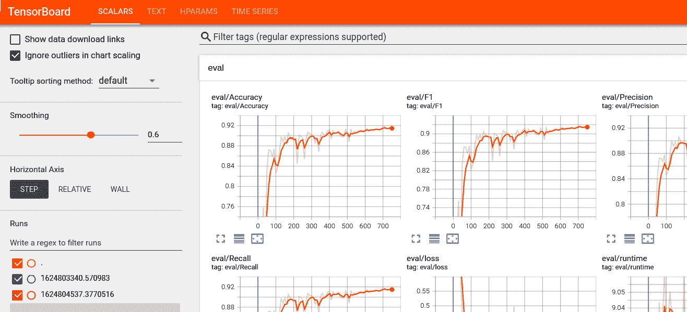

    图 11.16 – TensorBoard 训练历史可视化

    您可能已经注意到，我们可以跟踪之前定义的指标。水平轴从 0 到 750 步，这是我们之前计算的步数。我们不会在这里详细讨论 TensorBoard。让我们只看一下**eval/loss** 图表。当您点击左下角的最大化图标时，您将会看到以下图表：

    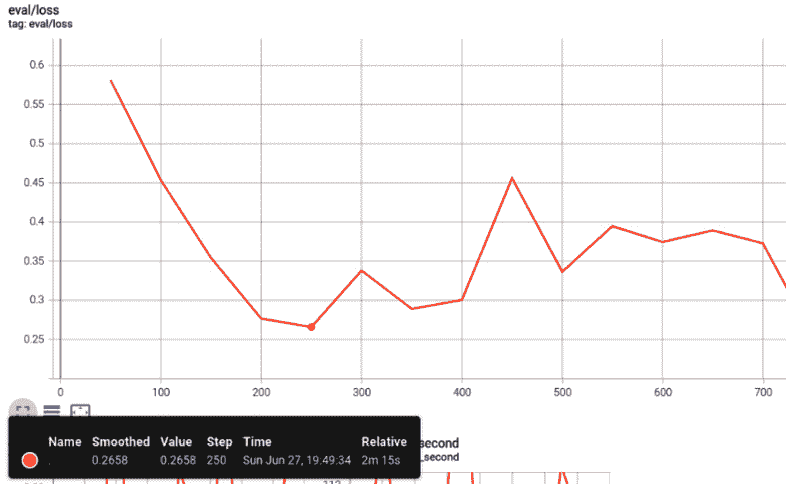

    图 11.17 – TensorBoard eval/loss 图表，记录步长为 50

    在前面的截图中，我们将 TensorBoard 仪表板左侧的滑块控制器的平滑度设置为 0，以更精确地查看分数并关注全局最小值。如果你的实验波动性很高，平滑功能可以很好地显示整体趋势。它的功能类似于**滑动平均**（**MA**）。这张图表支持我们之前的观察，最佳损失测量值为**0.2658**，在第**250**步时获得。

1.  由于`logging_steps`设置为**10**，我们获得了高分辨率，如下面的截图所示。因此，我们将记录 75（750 步/10 步）个性能测量值。当我们以这个分辨率重新运行整个流程时，我们在第 220 步获得了最佳模型，损失得分为 0.238，比之前的实验更好。结果可以在下面的截图中看到。由于分辨率更高，我们自然会观察到更多的波动：

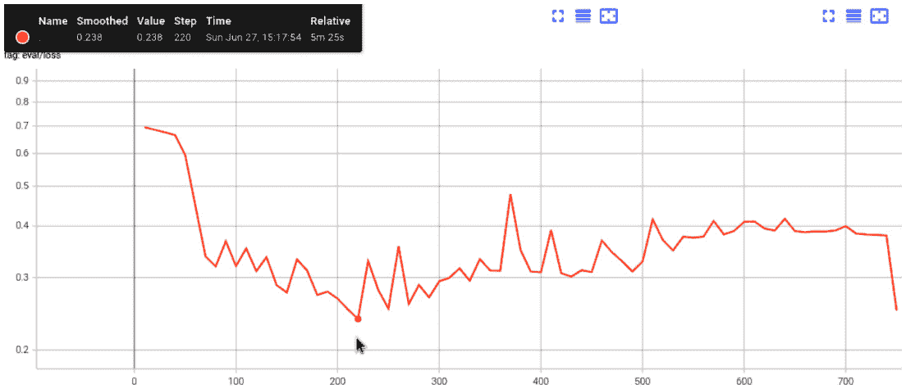

图 11.18 - 记录步骤为 10 的更高分辨率 eval/loss 图表

目前我们不再使用 TensorBoard。让我们开始使用 W&B！

## 使用 W&B 实时跟踪模型训练

与 TensorBoard 不同，W&B 在云平台提供了一个仪表板，我们可以在一个单一的中心追踪和备份所有实验。它还允许我们与团队进行开发和共享。训练代码在我们的本地机器上运行，而日志保存在 W&B 云中。最重要的是，我们可以实时跟踪训练过程并立即与社区或团队分享结果。

我们可以通过对现有代码进行非常小的更改来为我们的实验启用 W&B：

1.  首先，我们需要在`wandb.ai`创建一个帐户，然后安装 Python 库，如下所示：

    ```py
    !pip install wandb
    ```

1.  再次，我们将采用 IMDb 情感分析代码并进行微小的更改。首先，让我们导入库并登录到`wandB`，如下所示：

    ```py
    import wandb
    !wandb login
    ```

    `wandb`请求一个 API 密钥，你可以很容易地在以下链接找到：[`wandb.ai/authorize`](https://wandb.ai/authorize)。

1.  或者，你可以将`WANDB_API_KEY`环境变量设置为你的 API 密钥，如下所示：

    ```py
    !export WANDB_API_KEY=e7d*********
    ```

1.  再次保持整个代码不变，我们只需向`TrainingArguments`添加两个参数，`report_to="wandb"`和`run_name="..."`，即可在 W&B 中启用日志记录，如下所示：

    ```py
    training_args = TrainingArguments(
        ...  the rest is same ...
        run_name="IMDB-batch-32-lr-5e-5",
        report_to="wandb"
    )
    ```

1.  当你调用`trainer.train()`后，日志将开始记录在云端。调用后，请检查云端仪表板并查看其变化。一旦`trainer.train()`调用成功完成，我们执行以下代码告诉`wandB`我们已完成：

    ```py
    wandb.finish()
    ```

    执行还会在本地输出运行历史，如下所示：

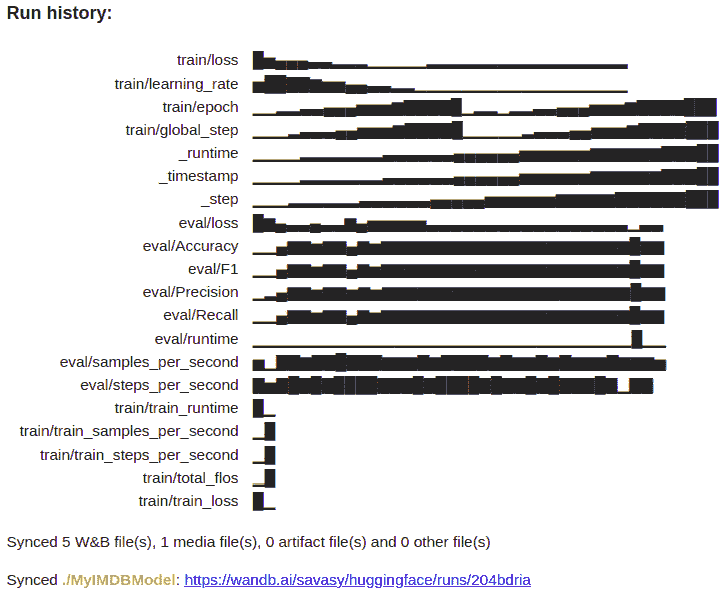

图 11.19 - W&B 的本地输出

当你连接到 W&B 提供的链接时，你将进入一个看起来类似于这样的界面：

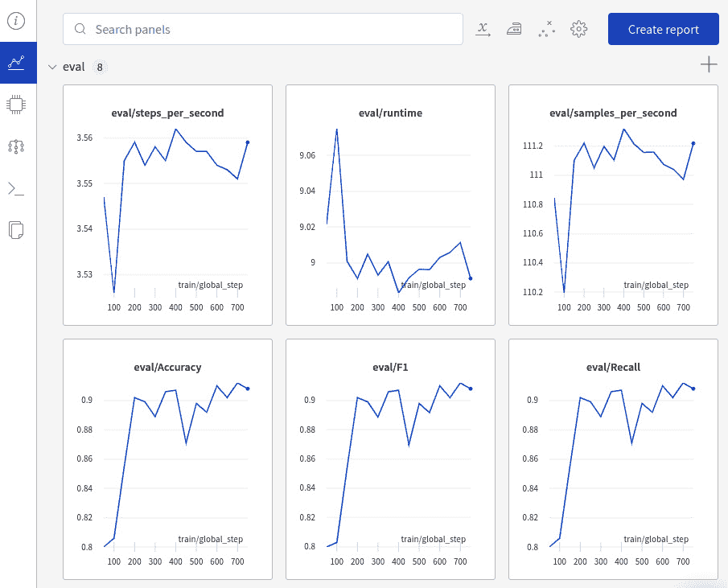

图 11.20 – 在 W&B 仪表板上单次运行的在线可视化

该可视化为单次运行的结果提供了一个总结的性能结果。正如您所看到的，我们可以追踪在`compute_metric()`函数中定义的指标。

现在，让我们来看一下评估损失。下面的截图显示了与 TensorBoard 提供的完全相同的绘图，其中最小损失约为 0.2658，在第 250 步发生：

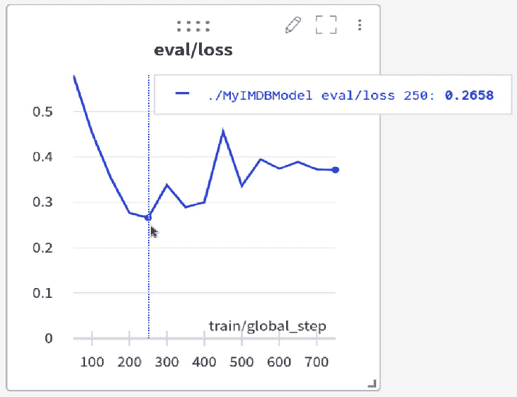

图 11.21 – 在 W&B 仪表板上 IMDb 实验的 eval/loss 绘图

到目前为止，我们只对单次运行进行了可视化。W&B 允许我们跨多次运行动态地探索结果—例如，我们可以可视化使用不同超参数的模型的结果，如学习率或批量大小。为此，我们适当地实例化一个`TrainingArguments`对象，并为每次运行相应地更改`run_name="..."`。

下面的截图显示了我们使用不同超参数进行的几个 IMDb 情感分析运行。我们还可以看到我们更改的批量大小和学习率：

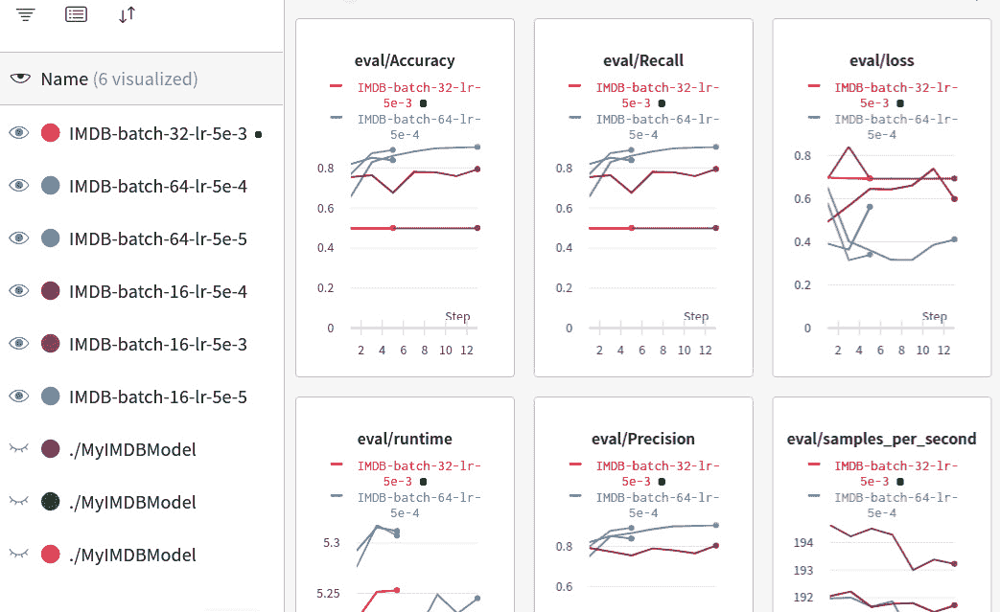

图 11.22 – 在 W&B 仪表板上探索多次运行的结果

W&B 提供了有用的功能—例如，它自动化了超参数优化和搜索可能模型的空间，称为 W&B Sweeps。除此之外，它还提供了与**图形处理单元**(**GPU**)消耗有关的系统日志，**中央处理单元**(**CPU**)利用率等等。更详细的信息，请查看以下网站：[`wandb.ai/home`](https://wandb.ai/home)。

干得好！在最后一节*参考资料*中，我们将更多关注技术工具，因为使用这样的实用工具对于开发更好的模型至关重要。

# 总结

在本章中，我们介绍了两个不同的技术概念：注意力可视化和实验跟踪。我们首先使用 exBERT 在线界面可视化了注意力头。然后，我们研究了 BertViz，我们编写 Python 代码来查看三个 BertViz 可视化：头部视图，模型视图和神经元视图。BertViz 界面给了我们更多控制，以便我们可以使用不同的语言模型。此外，我们还能观察到如何计算 tokens 之间的注意权重。这些工具为我们提供了解释性和利用性的重要功能。我们还学会了如何跟踪我们的实验以获得更高质量的模型和进行错误分析。我们利用了两种工具来监视训练：TensorBoard 和 W&B。这些工具用来有效地跟踪实验并优化模型训练。

恭喜！你通过展现出的极大毅力和坚持不懈完成了这本书的阅读之旅。现在你可以放心了，因为你已经装备好了需要的工具，并且准备好开发和实现高级自然语言处理应用。

# 参考文献

+   *exBERT：一种用于探索 Transformer 模型中学习表示的视觉分析工具*，*本杰明·胡佛*，*亨德里克·斯特罗贝尔特*，*塞巴斯蒂安·盖尔曼*，*2019*。

+   *Vig, J.*, *2019*. *Transformer 模型中的多尺度注意力可视化*。*arXiv 预印本 arXiv:1906.05714*。

+   *Clark, K.*, *Khandelwal, U.*, *Levy, O.* 和 *Manning, C.D.*, *2019*. *BERT 看什么？BERT 注意力分析*。*arXiv 预印本 arXiv:1906.04341.7*

+   *Biewald, L.*, *权重与偏差的实验追踪*, *2020*。软件可在 `wandb.com` 获得，*2(5)*。

+   *Rogers, A.*, *Kovaleva, O.* 和 *Rumshisky, A.*, *2020*. *BERT 学习入门：我们对 BERT 如何工作的了解*. *计算语言学协会交易*, *8*, *pp.842-866*。

+   *W&B*：[`wandb.ai`](https://wandb.ai)

+   *TensorBoard*：[`www.tensorflow.org/tensorboard`](https://www.tensorflow.org/tensorboard)

+   *exBert—Hugging Face*：[`huggingface.co/exbert`](https://huggingface.co/exbert)

+   *exBERT*：[`exbert.net/`](https://exbert.net/)
