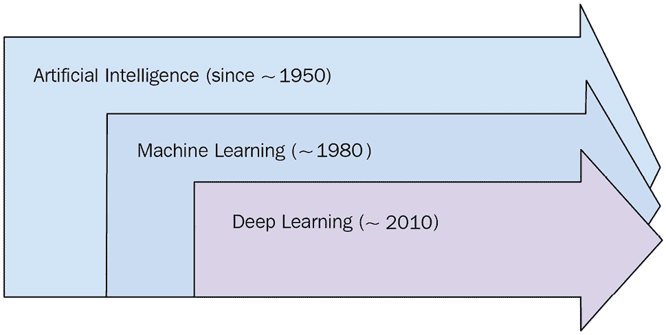
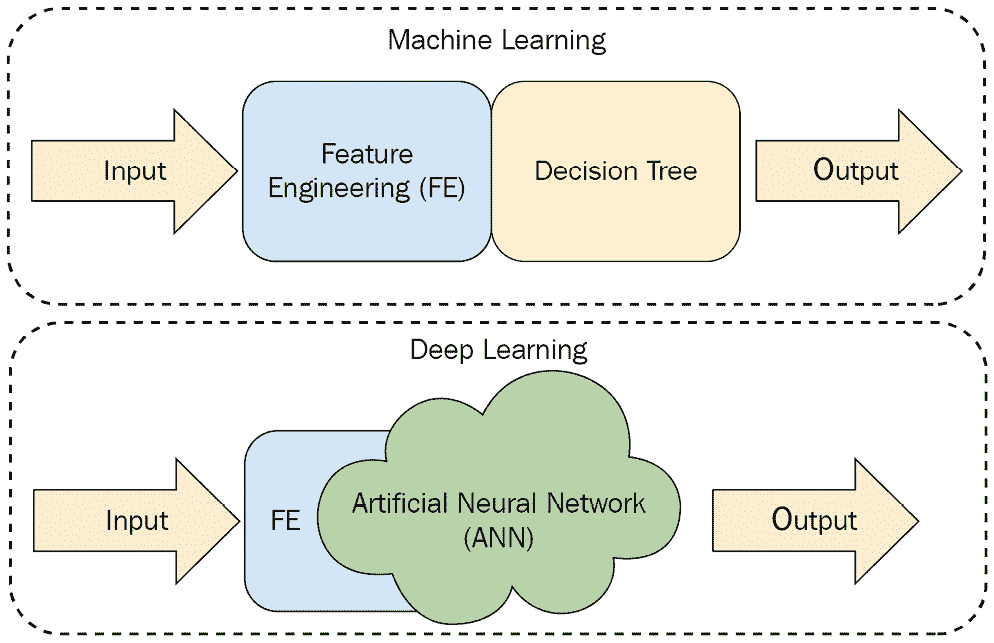
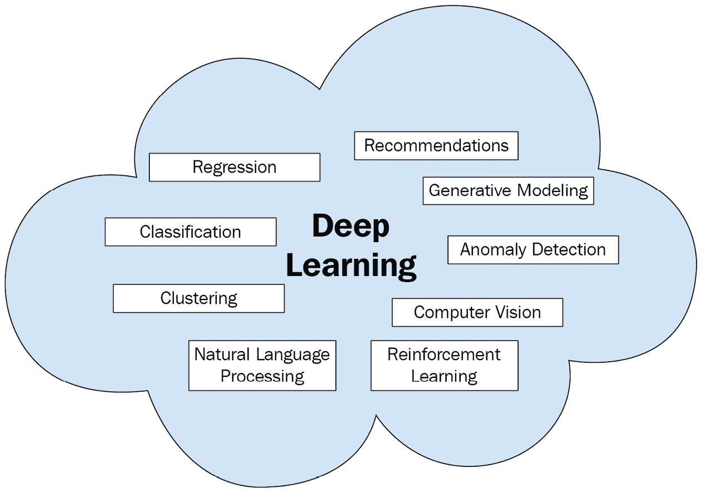
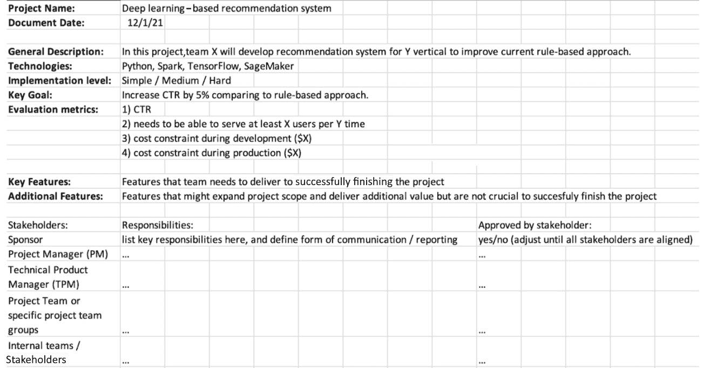
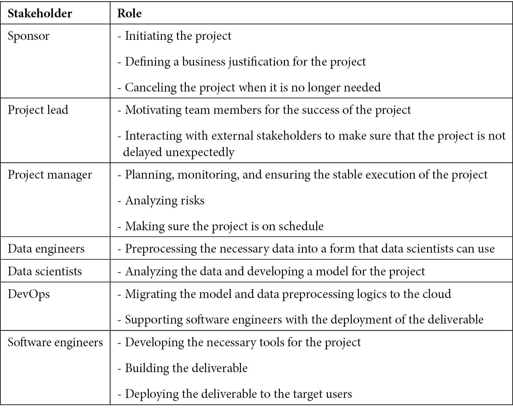
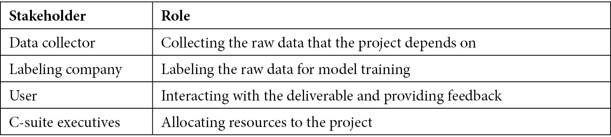
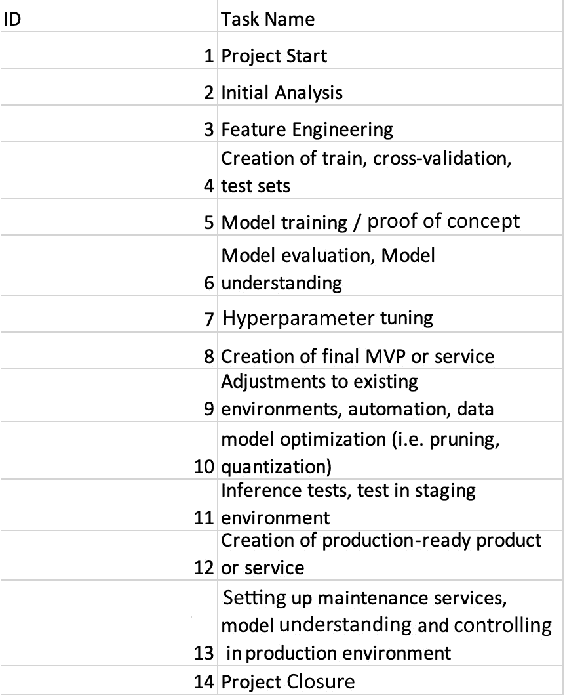
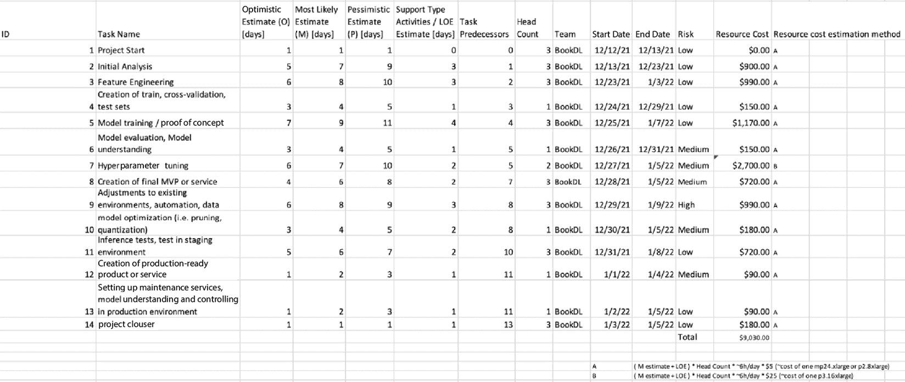
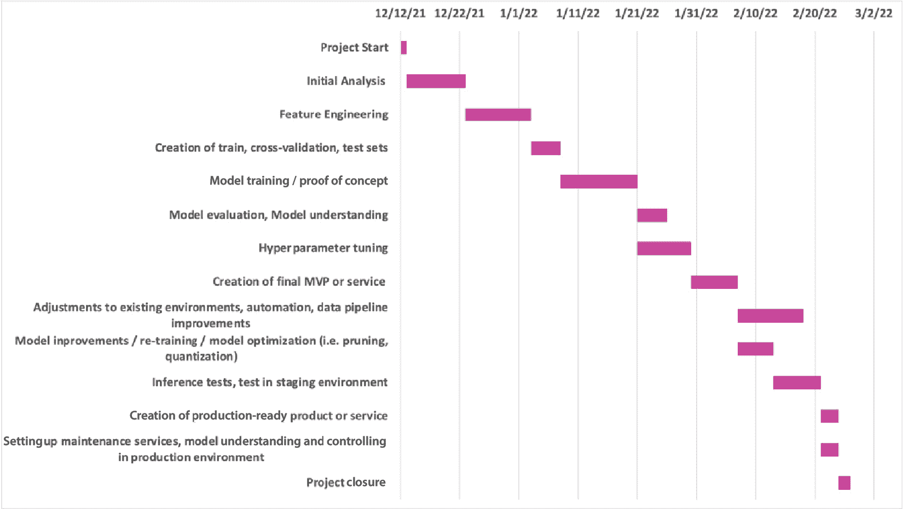

# 1

# 有效规划深度学习驱动项目

在书的第一章中，我们将介绍什么是**深度学习**（**DL**），以及 DL 项目通常如何进行。本章以对 DL 的介绍开始，提供一些关于它如何影响我们日常生活的见解。然后，我们将把重点转移到 DL 项目上，描述它们的结构。在整个章节中，我们将特别强调第一阶段，即项目规划；您将学习到关键概念，如理解业务目标、如何定义适当的评估指标、识别利益相关者、资源规划，以及**最小可行产品**（**MVP**）和**完全特性产品**（**FFP**）之间的区别。到本章末，您应该能够制定一个 DL 项目手册，清楚地描述项目的目标、里程碑、任务、资源分配及其时间表。

在本章中，我们将讨论以下主要主题：

+   DL 是什么？

+   理解 DL 在我们日常生活中的作用

+   DL 项目概述

+   规划 DL 项目

# 技术要求

您可以从以下 GitHub 链接下载本章的补充材料：

[`github.com/PacktPublishing/Production-Ready-Applied-Deep-Learning/tree/main/Chapter_1`](https://github.com/PacktPublishing/Production-Ready-Applied-Deep-Learning/tree/main/Chapter_1)

# DL 是什么？

自 DL 出现以来仅过去了十年，但它已经迅速开始在我们的日常生活中扮演重要角色。在**人工智能**（**AI**）领域内，存在一套被归类为**机器学习**（**ML**）的流行方法。通过从历史数据中提取有意义的模式，ML 的目标是构建一个能为新收集的数据做出合理预测和决策的模型。DL 是一种 ML 技术，利用**人工神经网络**（**ANNs**）来捕捉给定模式。*图 1.1*展示了自 20 世纪 50 年代开始的 AI 演变的关键组成部分，包括艾伦·图灵等 AI 领域的先驱讨论智能机器。虽然自 AI 问世以来引入了各种 ML 算法，但实际上，这个领域花了几十年才真正开花结果。同样地，自 DL 成为主流也只有大约十年，因为这个领域的许多算法需要大量的计算能力。

图 1.1 – AI 的历史

如*图 1.2*所示，DL 的关键优势来自于人工神经网络（ANNs），它们能够自动选择必要的特征。类似于人类大脑的结构，ANNs 也由称为**神经元**的组件组成。一组神经元形成一个**层**，多个层链接在一起形成一个**网络**。这种架构可以理解为多个嵌套指令的多步骤。随着输入数据通过网络传递，每个神经元提取不同的信息，模型被训练为选择给定任务最相关的特征。考虑到神经元作为模式识别的构建块，更深的网络通常导致更好的性能，因为它们更好地学习细节。

图 1.2 - 机器学习与深度学习之间的区别

虽然典型的机器学习技术需要手动选择特征，但 DL 学会了自动选择重要的特征。因此，它可能适用于更广泛的问题。然而，这种优势并非免费。为了正确训练 DL 模型，训练数据集需要足够大且多样化，这导致训练时间增加。有趣的是，**图形处理单元**（**GPU**）在缩短训练时间方面发挥了重要作用。虽然**中央处理单元**（**CPU**）通过其广泛的指令集在执行复杂计算方面表现有效，但 GPU 更适合通过其大规模并行性处理更简单但更大的计算。通过利用 DL 模型严重依赖的矩阵乘法中的这种优势，GPU 已成为 DL 中的关键组成部分。

由于我们仍处于人工智能时代的早期阶段，芯片技术正在不断发展，目前尚不清楚这些技术将如何在未来发生变化。值得一提的是，新设计不仅来自初创企业，还来自大型科技公司。这场持续的竞争清楚地显示出，基于人工智能的产品和服务将不断推出。考虑到市场增长和工作机会的增加，我们认为现在是学习 DL 的绝佳时机。

要记住的事情

a. DL 是一种利用人工神经网络进行模式识别的机器学习技术。

b. DL 非常灵活，因为它在整个训练过程中自动选择给定任务的最相关特征。

c. GPU 可以通过其大规模并行性加速 DL 模型的训练。

现在我们高层次地理解了 DL 是什么，接下来我们将在下一节中描述它如何塑造我们的日常生活。

# 理解 DL 在我们日常生活中的角色

通过利用 DL 的灵活性，研究人员在传统 ML 技术性能有限的领域取得了显著进展（见*图 1.3*）。首先在**计算机视觉**（**CV**）领域为数字识别和目标检测任务打下了基础。然后，DL 被采用于**自然语言处理**（**NLP**），在翻译和语音识别任务中显示出显著进展。它还展示了在**强化学习**（**RL**）以及**生成建模**中的有效性。

本章的*进一步阅读*部分列出了与 DL 相关的论文的流行用例。

下图显示了 DL 的各种应用：

图 1.3 – DL 的应用

然而，将 DL 集成到现有技术基础设施中并非易事；困难可能来自各个方面，包括但不限于预算、时间以及人才。因此，对 DL 的深入理解已成为那些管理 DL 项目的人必备的技能：项目经理、技术负责人以及高管。此外，对这一快速增长领域的了解将使他们能够在特定垂直领域及整个组织中找到未来的机会，因为从事 AI 项目的人积极收集新知识以获得创新和竞争优势。总体而言，深入了解 DL 管道并开发可投入生产的输出使管理者能够通过有效避免已知的常见问题更好地执行项目。

不幸的是，DL 项目尚未达到即插即用的状态。在许多情况下，它们涉及广泛的研究和调整阶段，这可能迅速耗尽可用资源。最重要的是，我们注意到许多公司在从**概念验证**转向生产时遇到困难，因为关键决策是由少数只对项目需求和 DL 管道有有限理解的人做出的。话虽如此，我们的书旨在全面介绍 DL 项目的全貌；我们将从项目规划开始，然后讨论如何开发 MVP 和 FFP，如何利用云服务进行扩展，最后讨论如何将产品交付给目标用户。

需要记住的事情

a. DL 已应用于各个领域的许多问题，包括但不限于 CV、NLP、RL 和生成建模。

b. 对 DL 的深入理解对于领导 DL 项目的人员至关重要，无论其职位或背景如何。

c. 本书通过描述 DL 项目从项目规划到部署的过程，提供了对 DL 项目的全面理解。

接下来，我们将仔细研究 DL 项目的结构。

# DL 项目概述

尽管深度学习和其他软件工程项目有很多共同点，但深度学习项目强调规划，主要来自模型复杂性和涉及的大量数据的资源需求。一般而言，深度学习项目可以分为以下阶段：

1.  项目规划

1.  构建 MVP

1.  构建 FFP

1.  部署和维护

1.  项目评估

在本节中，我们提供了这些阶段的高级概述。接下来的部分将详细介绍每个阶段。

## 项目规划

作为第一步，项目负责人必须明确定义项目需要实现的目标，并了解可能影响或被项目影响的群体。必须定义并达成一致的评估指标，因为它们将在项目评估期间重新审视。然后，团队成员集结在一起，讨论个人责任，并利用现有资源实现业务目标。这个过程自然而然地导致了一个时间表，即项目需要多长时间完成的估计。总体而言，项目规划应该产生一个称为 playbook 的文件，其中包括项目如何进行和评估的详细描述。

## 构建最小可行产品

一旦方向对每个人都清晰，下一步是构建 MVP，这是目标交付物的简化版本，展示项目的价值。此阶段的另一个重要方面是了解项目的困难，并通过“快速失败，频繁失败”的哲学拒绝风险更大或前景不明确的路径。因此，数据科学家和工程师通常在开发环境中使用部分采样的数据集，并忽略不重要的优化。

## 构建完整功能产品

一旦 MVP 项目的可行性得到确认，必须将其打包成 FFP。此阶段旨在优化 MVP，构建一个可投入生产的交付成果，并进行各种优化。对于深度学习项目，引入额外的数据准备技术以提高输入数据的质量，或者稍微增强模型管道以获得更好的模型性能。此外，数据准备管道和模型训练管道可能会迁移到云端，利用各种网络服务提高吞吐量和质量。在这种情况下，整个管道通常会使用不同的工具和服务重新实现。本书专注于处理大量数据和昂贵计算的最流行网络服务**亚马逊网络服务（AWS）**。

## 部署和维护

在许多情况下，部署设置与开发设置不同。因此，在将 FFP 移至生产环境时通常涉及不同的工具集。此外，部署过程可能会引入在开发过程中看不到的问题，这主要是由于计算资源有限而引起的。因此，许多工程师和科学家在此阶段花费额外时间来改善用户体验。大多数人认为部署是最后一步。然而，还有一个步骤：维护。需要持续监控数据质量和模型性能，以向目标用户提供稳定的服务。

## 项目评估

在最后阶段，项目评估阶段，团队应重新审视项目规划期间所做的讨论，评估项目是否成功进行。此外，需要记录项目的详细信息，并讨论潜在的改进措施，以便更有效地完成下一个项目。

需记住的事情

a. DL 项目内的阶段包括项目规划、构建 MVP、构建 FFP、部署和维护以及项目评估。

b. 在项目规划阶段，确定项目目标和评估指标，团队讨论个人责任、可用资源和项目的时间表。

c. 建立 MVP 的目的是了解项目的困难之处，并拒绝存在更大风险或提供较少前景的路径。

d. FFP 是一个生产就绪的可交付成果，是 MVP 的优化版本。数据准备管道和模型训练管道可以迁移到云端，利用各种网络服务以获得更高的吞吐量和质量。

e. 部署设置通常提供有限的计算资源。在这种情况下，系统需要进行调优，以向目标用户提供稳定的服务。

f. 项目完成后，团队需要重新审视时间表、分配的责任和业务需求，评估项目的成功与否。

在接下来的部分中，我们将详细介绍如何正确规划一个 DL 项目。

# 规划一个 DL 项目

每个项目都始于规划。在规划过程中，需要清晰定义项目的目的，并且关键成员应该对可以分配给项目的可用资源有深入了解。一旦确定了团队成员和利益相关者，下一步是讨论每个人的责任，并为项目制定时间表。

这个阶段应该产生一个详细记录的项目手册，精确定义业务目标以及项目评估方式。典型的手册包括主要交付内容概述、利益相关者列表、**甘特图**定义的步骤和瓶颈、责任定义、时间表和评估标准。在高度复杂的项目中，强烈建议遵循**项目管理知识体系指南**（**PMBOK®**）（[`www.pmi.org/pmbok-guide-standards/foundational/pmbok`](https://www.pmi.org/pmbok-guide-standards/foundational/pmbok)），并考虑每个知识领域（例如，整合管理、项目范围管理和时间管理）。当然，还有其他的项目管理框架，如**PRINCE2**（[`www.prince2.com/usa/what-is-prince2`](https://www.prince2.com/usa/what-is-prince2)），它可以作为一个很好的起点。一旦手册编制完成，每个利益相关者都必须审查和修订，直到所有人都同意内容。

在现实生活中，很多人低估了规划的重要性。特别是在初创公司中，工程师们渴望投入到 MVP 开发中，并尽量少花时间在规划上。然而，在 DL 项目中这样做是非常危险的，因为训练过程可能会迅速消耗所有可用资源。

## 定义目标和评估指标

规划的第一步是理解项目的目的。目标可能是开发新产品、改善现有服务的性能或节省运营成本。项目的动机自然有助于定义评估指标。

在 DL 项目中，有两种评估指标：与业务相关的指标和基于模型的指标。一些业务相关的指标的例子如下：**转化率**，**点击率**（**CTR**），**用户生命周期价值**，**用户参与度度量**，**运营成本节约**，**投资回报率**（**ROI**）和**收入**。这些在广告、营销和产品推荐领域中广泛使用。

另一方面，基于模型的指标包括**准确率**，**精确率**，**召回率**，**F1 分数**，**排名准确度指标**，**平均绝对误差**（**MAE**），**均方误差**（**MSE**），**均方根误差**（**RMSE**）和**标准化平均绝对误差**（**NMAE**）。通常，可以在这些指标之间进行权衡。例如，如果满足延迟要求对项目更为关键，那么稍微降低准确率可能是可以接受的。

除了因项目而异的目标评估指标外，大多数项目中还包括其他常见的指标，如截止日期和资源使用情况。必须利用现有资源，在特定日期达到目标状态。

目标及相应的评估指标需要公平。如果目标过于难以实现，项目成员可能会失去动力。如果评估指标不正确，理解项目的影响也变得困难。因此，建议将选择的评估指标与他人分享，并确保公平对待每个人。

图 1.4 – 一个填写了项目描述部分的示例 playbook

如*图 1.4*所示，playbook 的第一部分从一般描述开始，估计技术方面的复杂性，并列出所需的工具和框架。接下来，它清晰地描述了项目的目标及其评估方式。

## **利益相关者识别**

就像“利益相关者”这个术语在业务中使用一样，项目的利益相关者指的是可以影响或受到项目影响的人或群体。利益相关者可以分为两类，即内部和外部。内部利益相关者直接参与项目执行，而外部利益相关者可能在外围支持项目的执行。

每个利益相关者在项目中扮演不同的角色。首先，我们来看内部利益相关者。内部利益相关者是项目的主要推动者。因此，他们密切合作处理和分析数据，开发模型并建立可交付成果。*表 1.1*列出了在 DL 项目中常见的内部利益相关者：

表 1.1 – DL 项目的常见内部利益相关者

另一方面，外部利益相关者通常扮演支持角色，例如收集项目所需的数据或对可交付成果提供反馈。在*表 1.2*中，我们描述了一些 DL 项目的常见外部利益相关者：

表 1.2 – DL 项目的常见外部利益相关者

Playbook 的第二部分描述了利益相关者。如*图 1.4*所示，playbook 必须列出项目中的利益相关者及其责任。

## 任务组织

里程碑指的是项目中发生重大事件的时间点。因此，有一系列要求导致里程碑。一旦满足了这些要求，就可以宣称已经达到了里程碑。项目规划中最重要的步骤之一是定义里程碑及其相关任务。通向目标的任务排序称为**关键路径**。值得一提的是，任务并不总是需要按顺序处理。理解关键路径很重要，因为它允许团队适当地优先考虑任务，以确保项目的成功。

在这一步骤中，还需要识别**工作量评估**（**LOE**）活动和支持活动，这些活动对项目的执行至关重要。在软件开发项目中，工作量评估活动包括辅助任务，如设置 Git 仓库或审查他人的合并请求。下图（*图 1.5*）描述了深度学习项目的典型关键路径。如果底层项目包含不同的任务、需求、技术和所需的详细级别，则其结构将有所不同：

图 1.5 – 深度学习项目的典型关键路径

## 资源分配

对于深度学习项目，需要明确分配两大主要资源：人力资源和计算资源。人力资源指的是将积极参与个人任务的员工。通常，他们担任数据工程、数据科学、DevOps 或软件工程等职位。在谈论人力资源时，人们往往只考虑人数。然而，个人所掌握的知识和技能也是其他重要因素。人力资源与项目能够快速进行的相关性密切。

计算资源指的是分配给项目的硬件和软件资源。与典型的软件工程项目（如移动应用程序开发或网页开发）不同，深度学习项目需要大量的计算和大量的数据。加速开发过程的常见技术包括并行处理或使用计算能力更强的机器。在某些情况下，需要在它们之间进行权衡，因为一台高计算能力的单机可能比多台低计算能力的机器成本更高。

总体上说，新颖的深度学习流水线利用灵活和无状态的资源，例如具有容错代码的 AWS Spot 实例。除了硬件资源外，还有可能提供必要功能的框架和服务。如果所需服务需要付费，了解它如何改变项目执行以及如果团队决定自行处理它时对人力资源的需求是非常重要的。

在这一步中，需要将可用资源分配给每个任务。*图 1.6*列出了前一节中描述的任务，并描述了分配的资源，以及操作成本的估计。每个任务都有自己的风险水平指示器。它适用于一个由三人组成的小团队，在几个 AWS **弹性计算云**（**EC2**）实例上进行简单的 DL 项目工作，预计为 4 至 6 个月。请注意，人力资源的成本估算未包含在示例中，因为它根据地理位置和团队资历有很大差异：

图 1.6 – 深度学习项目示例资源分配部分

在我们继续下一步之前，我们想提到，将一部分资源作为备份非常重要，以防里程碑所需资源超过分配的资源。

## 定义时间表

现在我们知道了可用资源，我们应该能够为项目制定时间表。在这一步中，团队需要讨论每个步骤需要多长时间完成。值得一提的是，事情并不总是按计划进行。在项目过程中会遇到许多困难，这些困难可能会延迟最终产品的交付。

因此，在时间表中包含缓冲区是许多组织的常见做法。每位利益相关者都同意时间表是非常重要的。如果有人认为这不合理，需要立即进行调整。*图 1.7*是根据*图 1.6*所示信息的最有可能估计时间表的样本甘特图：

图 1.7 – 描述时间表的样本甘特图

值得一提的是，该图表还可用于监视每个任务及整体项目的进度。在这种情况下，可以附加每个指示条的附加注释或可视化，总结进展情况。

## 管理项目

在项目规划阶段讨论的深度学习项目的另一个重要方面是团队将如何更新其他团队成员并确保项目按时交付的流程。在各种项目管理方法中，敏捷方法尤为适用，因为它有助于将工作分解为较小的部分，并快速迭代开发周期，直至 FFP 出现。由于深度学习项目通常被认为是高度复杂的，因此在研究、开发和优化阶段内工作在短周期内更为便利。在每个周期结束时，利益相关者审查结果并调整其长期目标。**敏捷方法论**特别适合经验丰富的小团队。在典型情况下，发现 2 周冲刺最为有效，特别是在清晰定义短期目标时。

在冲刺会议期间，团队回顾了上个冲刺的目标，并为即将到来的冲刺定义了目标。还建议每天进行短暂的日常会议，回顾前一天的工作并计划下一天的工作，因为这个过程有助于团队快速识别瓶颈并根据需要调整优先级。用于此过程的常用工具包括**Jira**、**Asana**和**Quickbase**。前述工具中大多数还支持预算管理、时间线审查、想法管理和资源跟踪。

需要记住的事情

a. 项目规划应该产生一个清晰描述项目用途及团队如何共同前进达到特定目标状态的操作手册。

b. 项目规划的第一步是定义目标及其相应的评估指标。在深度学习项目的情况下，有两种类型的评估指标：与业务相关的指标和基于模型的指标。

c. 利益相关者是指可以影响或被项目影响的个人或群体。利益相关者可以分为两类：内部和外部。

d. 项目规划的下一个阶段是任务组织。团队需要确定里程碑，识别任务以及 LOE 活动，并理解关键路径。

e. 对于深度学习项目，有两个主要资源需要明确分配：人力资源和计算资源。在资源分配期间，将资源的一部分作为备用非常重要。

f. 在估计项目时间表时，必须与团队共享，并且每个利益相关者必须同意时间表。

g. 敏捷方法论非常适合管理深度学习项目，因为它有助于将工作分解为较小的部分，并快速迭代开发周期。

# 总结

这一章是我们旅程的介绍。在前两节中，我们描述了深度学习在人工智能大局中的定位，以及它如何不断地塑造我们的日常生活。关键要点是深度学习由于其独特的模型架构而具有高度的灵活性，并且已经积极应用于传统机器学习技术未能显示显著成就的领域。

接下来，我们提供了深度学习项目的高层视角。一般来说，深度学习项目可以分为以下阶段：项目规划、建立最小可行产品（MVP）、建立最终可行产品（FFP）、开发与维护以及项目评估。

本章的主要内容涵盖了深度学习项目中最重要的步骤：项目规划。在这个阶段，项目的目的需要明确定义，评估指标需要明确，每个人必须对利益相关者及其各自的角色有深入了解，最后，参与者需要就任务、里程碑和时间表达成共识。这个阶段的结果将会是一个名为“playbook”的格式良好的文档。在下一章中，我们将学习如何为深度学习项目准备数据。

# 进一步阅读

这里是一些参考资料，可以帮助您更深入地了解与本章相关的主题。以下研究论文总结了深度学习的流行用例：

+   计算机视觉

    +   *基于梯度的学习在文档识别中的应用* by *LeCun et al*.

    +   *ImageNet：大规模分层图像数据库* by *Deng et al*.

+   自然语言处理

    +   *神经概率语言模型* by *Bengio et al*.

    +   *深度递归神经网络语音识别* by *Grave et al*.

+   强化学习

    +   *深度强化学习简介* by *François-Lavet et al*.

+   生成建模

    +   *生成对抗网络* by *Goodfellow et al*.
