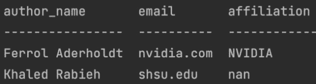
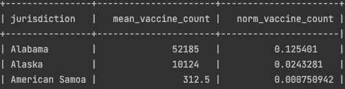

# 2

# 准备深度学习项目的数据

**机器学习**（**ML**）项目的第一步是数据收集和数据准备。作为机器学习的一个子集，**深度学习**（**DL**）涉及相同的数据处理过程。我们将从使用 Anaconda 设置标准的 DL Python 笔记本环境开始这一章节。然后，我们将提供在各种格式（JSON、CSV、HTML 和 XML）中收集数据的具体示例。在许多情况下，收集到的数据会进行清理和预处理，因为它包含不必要的信息或无效的格式。

本章将介绍该领域中的流行技术：填补缺失值、删除不必要的条目和归一化值。接下来，您将学习常见的特征提取技术：词袋模型、词频-逆文档频率、独热编码和降维。此外，我们将介绍最流行的数据可视化库 `matplotlib` 和 `seaborn`。最后，我们将介绍 Docker 镜像，这些镜像是工作环境的快照，通过将应用程序及其依赖项捆绑在一起，最大限度地减少潜在的兼容性问题。

在本章中，我们将涵盖以下主要主题：

+   设置笔记本环境

+   数据收集、数据清洗和数据预处理

+   从数据中提取特征

+   执行数据可视化

+   Docker 简介

# 技术要求

本章的补充材料可以从 GitHub 上下载，网址为 [`github.com/PacktPublishing/Production-Ready-Applied-Deep-Learning/tree/main/Chapter_2`](https://github.com/PacktPublishing/Production-Ready-Applied-Deep-Learning/tree/main/Chapter_2)。

# 设置笔记本环境

Python 是一种最流行的编程语言之一，广泛用于数据分析。其优势在于动态类型和无需编译。凭借其灵活性，它已成为数据科学家最常用的语言。在本节中，我们将介绍如何使用 **Anaconda** 和 **Preferred Installer Program**（**PIP**）为 DL 项目设置 Python 环境。这些工具允许您为每个项目创建独立的环境，同时简化包管理。Anaconda 提供了一个名为 Anaconda Navigator 的带有 GUI 的桌面应用程序。我们将指导您如何设置 Python 环境，并安装用于 DL 项目的流行 Python 库，如 **TensorFlow**、**PyTorch**、**NumPy**、**pandas**、**scikit-learn**、**Matplotlib** 和 **Seaborn**。

## 设置 Python 环境

Python 可以从 [www.python.org/downloads](http://www.python.org/downloads) 安装。但是，Python 版本通常可以通过操作系统提供的包管理器（例如 Linux 上的 **高级包管理工具** (**APT**) 和 macOS 上的 **Homebrew**）获取。建立 Python 环境的第一步是使用 PIP 安装必要的软件包，PIP 是一个允许您安装和管理各种 Python 软件包的软件包管理系统。

## 安装 Anaconda

当在计算机上设置了多个 Python 项目时，将环境分开可能是理想的，因为每个项目可能依赖于这些软件包的不同版本。Anaconda 可以帮助您管理环境，因为它既设计用于 Python 软件包管理，又设计用于环境管理。它允许您创建虚拟环境，其中安装的软件包绑定到当前活动的每个环境。此外，Anaconda 超越了 Python 的界限，允许用户安装非 Python 库依赖项。

首先，可以从其官方网站 [www.anaconda.com](http://www.anaconda.com) 安装 Anaconda。为了完整起见，我们已经在 [`github.com/PacktPublishing/Production-Ready-Applied-Deep-Learning/blob/main/Chapter_2/anaconda/anaconda_graphical_installer.md`](https://github.com/PacktPublishing/Production-Ready-Applied-Deep-Learning/blob/main/Chapter_2/anaconda/anaconda_graphical_installer.md) 上用图片描述了安装过程。

也可以直接从终端安装。Anaconda 为每个操作系统提供安装脚本（[repo.anaconda.com/archive](http://repo.anaconda.com/archive)）。您可以简单地下载适合您系统的脚本的正确版本，并运行它来在您的计算机上安装 Anaconda。例如，我们将描述如何从这些脚本之一为 macOS 安装 Anaconda：[`github.com/PacktPublishing/Production-Ready-Applied-Deep-Learning/blob/main/Chapter_2/anaconda/anaconda_zsh.md`](https://github.com/PacktPublishing/Production-Ready-Applied-Deep-Learning/blob/main/Chapter_2/anaconda/anaconda_zsh.md)。

## 使用 Anaconda 设置 DL 项目

在此时，您应该已经准备好使用 Anaconda 环境。现在，我们将创建我们的第一个虚拟环境，并安装 DL 项目所需的必要软件包：

```py
conda create --name bookenv python=3.8
```

您可以使用以下命令列出可用的 `conda` 环境：

```py
conda info --envs
```

您应该看到我们之前创建的 `bookenv` 环境。要激活此环境，您可以使用以下命令：

```py
conda activate bookenv
```

同样地，通过以下命令可以实现去激活：

```py
conda deactivate
```

通过 `pip` 命令可以安装 Python 包。可以通过 `conda install <package name>` 或 `pip install <package name>` 安装 Python 包。在下面的代码片段中，首先我们通过 `pip` 命令下载了 NumPy，这是科学计算的基础包。然后，我们将通过 `conda` 命令安装 PyTorch。在安装 PyTorch 时，你必须为 CUDA 提供版本，CUDA 是一种用于通用计算的并行计算平台和编程模型。CUDA 可以通过允许 GPU 并行处理来加速 DL 模型训练：

```py
pip install numpy
conda install pytorch torchvision torchaudio \
cudatoolkit=<cuda version> -c pytorch -c nvidia
```

TensorFlow 是另一个用于深度学习项目的流行包。与 PyTorch 类似，TensorFlow 为每个 CUDA 版本提供不同的包。完整列表可以在这里找到：[`www.tensorflow.org/install/source#gpu`](https://www.tensorflow.org/install/source#gpu)。为了使所有与深度学习相关的库能够无缝工作，必须保证 Python 版本、TensorFlow 版本、GCC 编译器版本、CUDA 版本和 Bazel 构建工具版本之间的兼容性，如下图所示：


图 2.1 – TensorFlow、Python、GCC、Bazel、cuDNN 和 CUDA 版本的兼容矩阵

回到 `pip` 命令，你可以通过生成一个文本文件来安装所有必需的包，并在单个命令中安装它们，而不是重复输入 `install` 命令。为了实现这一点，可以将 `--requirement` (`-r`) 选项与 `pip install` 命令一起使用，如下所示：

```py
pip install -r requirements.txt
```

CPU-only 环境中列出的常见所需包在示例 `requirements.txt` 文件中列出：[`github.com/PacktPublishing/Production-Ready-Applied-Deep-Learning/blob/main/Chapter_2/anaconda/requirements.txt`](https://github.com/PacktPublishing/Production-Ready-Applied-Deep-Learning/blob/main/Chapter_2/anaconda/requirements.txt)。列表中的主要包括 TensorFlow 和 PyTorch。

现在，让我们看一些有用的 Anaconda 命令。就像 `pip install` 可以与 `requirements.txt` 文件一起使用一样，你也可以使用 YAML 文件创建一个包含一组包的环境。在以下示例中，我们使用了一个 `env.yml` 文件来保存现有环境中的库列表。稍后，可以使用 `env.yml` 创建一个具有相同包的新环境，如下代码片段所示：

```py
conda create -n env_1
conda activate env_1
# save environment to a file
conda env export > env.yml
# clone existing environment 
conda create -n env_2 --clone env_1
# delete existing environment (env_1)
conda remove -n env_1 --all
# create environment (env_1) from the yaml file
conda env create -f env.yml
# using conda to install the libraries from requirements.txt
conda install --force-reinstall -y -q --name py37 -c conda-forge --file requirements.txt
```

下面的代码片段描述了从 `conda env export` 生成的样本 YAML 文件：

```py
# env.yml
name: env_1
channels:
  - defaults
dependencies:
  - appnope=0.1.2=py39hecd8cb5_1001
  - ipykernel=6.4.1=py39hecd8cb5_1
  - ipython=7.29.0=py39h01d92e1_0
prefix: /Users/userA/opt/anaconda3/envs/new_env
```

此 YAML 文件的主要组件是环境的名称 (`name`)、库的来源 (`channels`) 和库的列表 (`dependencies`)。

需要记住的事情

a. Python 是由于其简单的语法而成为数据分析的标准语言

b. Python 不需要显式编译

c. PIP 用于安装 Python 包

d. Anaconda 可同时处理 Python 包管理和环境管理

在接下来的部分中，我们将解释如何从各种来源收集数据。然后，我们将对收集到的数据进行清理和预处理，以供后续处理使用。

# 数据收集、数据清理和数据预处理

在本节中，我们将向您介绍数据收集过程中涉及的各种任务。我们将描述如何从多个来源收集数据，并将其转换为数据科学家可以使用的通用形式，而不论底层任务是什么。这个过程可以分解为几个部分：数据收集、数据清理和数据预处理。值得一提的是，任务特定的转换被认为是特征提取，这将在下一节中讨论。

## 收集数据

首先，我们将介绍用于构建初始数据集的不同数据收集方法。根据原始数据的格式，需要使用不同的技术。大多数数据集要么作为 HFML 文件在线可用，要么作为 JSON 对象存储。一些数据以 **逗号分隔值**（**CSV**）格式存储，可以通过流行的数据分析和操作工具 pandas 轻松加载。因此，我们将主要专注于在本节中收集 HTML 和 JSON 数据，并将其保存为 CSV 格式。此外，我们还将介绍一些流行的数据集库。

### 爬取网页

作为 Web 的基本组成部分，**超文本标记语言**（**HTML**）数据易于访问，包含多样化的信息。因此，通过爬取网页可以帮助您收集大量有趣的数据。在本节中，我们将使用 BeautifulSoup，这是一个基于 Python 的网络爬虫库（[`www.crummy.com/software/BeautifulSoup/`](https://www.crummy.com/software/BeautifulSoup/)）。作为示例，我们将演示如何爬取 Google 学术页面，并将爬取的数据保存为 CSV 文件。

在这个示例中，将使用 BeautifulSoup 的多个函数来提取作者的名字、姓氏、电子邮件、研究兴趣、引用次数、h 指数（高指数）、共同作者和论文标题。下表显示了我们希望在此示例中收集的数据：


表 2.1 – 可从 Google 学术页面收集的数据

爬取网页是一个两步过程：

1.  利用请求库获取 HTML 数据，并存储在 `response` 对象中。

1.  构建一个 `BeautifulSoup` 对象，用于解析 `response` 对象中的 HTML 标签。

这两个步骤可以用以下代码片段总结：

```py
# url points to the target google scholar page 
response = requests.get(url) 
html_soup = BeautifulSoup(response.text, 'html.parser')
```

下一步是从 `BeautifulSoup` 对象获取感兴趣的内容。 *表 2.2* 总结了常见的 `BeautifulSoup` 函数，允许您从解析的 HTML 数据中提取感兴趣的内容。 由于我们在这个例子中的目标是将收集的数据存储为 CSV 文件，我们将简单地生成页面的逗号分隔字符串表示，并将其写入文件。 完整的实现可以在 [`github.com/PacktPublishing/Production-Ready-Applied-Deep-Learning/blob/main/Chapter_2/google_scholar/google_scholar.py`](https://github.com/PacktPublishing/Production-Ready-Applied-Deep-Learning/blob/main/Chapter_2/google_scholar/google_scholar.py) 找到。

以下表格提供了从 Google Scholar 页面处理原始数据所需的方法列表：


表 2.2 – 可能的特征提取技术

接下来，我们将学习另一种流行的原始数据格式 JSON。

### 收集 JSON 数据

JSON 是一种与语言无关的格式，将数据存储为键-值和/或键-数组字段。 由于大多数编程语言支持键-值数据结构（例如 Python 中的 Dictionary 或 Java 中的 HashMap），因此 JSON 被认为是可互换的（独立于程序）。 以下代码片段显示了一些示例 JSON 数据：

```py
{
    "first_name": "Ryan",
    "last_name": "Smith",
    "phone": [{"type": "home",
               "number": "111 222-3456"}],
    "pets": ["ceasor", "rocky"],
    "job_location": null
}
```

查看 Awesome JSON Datasets GitHub 仓库 ([`github.com/jdorfman/awesome-json-datasets`](https://github.com/jdorfman/awesome-json-datasets))，其中包含一些有用的 JSON 数据源的列表。 此外，Public API’s GitHub 仓库 ([`github.com/public-apis/public-apis`](https://github.com/public-apis/public-apis)) 包含一些可以检索各种 JSON 数据的 Web 服务器端点的列表。 此外，我们提供一个脚本，从端点收集 JSON 数据，并将必要的字段存储为 CSV 文件： [`github.com/PacktPublishing/Production-Ready-Applied-Deep-Learning/blob/main/Chapter_2/rest/get_rest_api_data.py`](https://github.com/PacktPublishing/Production-Ready-Applied-Deep-Learning/blob/main/Chapter_2/rest/get_rest_api_data.py)。 此示例使用位于 [`www.reddit.com/r/all.json`](https://www.reddit.com/r/all.json) 的 Reddit 数据集。

接下来，我们将介绍数据科学领域中流行的公共数据集。

### 流行的数据集存储库

除了网页和 JSON 数据之外，许多公共数据集可以用于各种目的。例如，您可以从流行的数据集中心如*Kaggle* ([`www.kaggle.com/datasets`](https://www.kaggle.com/datasets))或*MIT Data Hub* ([`datahub.csail.mit.edu/browse/public`](https://datahub.csail.mit.edu/browse/public))获取数据集。这些公共数据集经常被许多研究机构和企业用于广泛的活动。从各种领域如医疗保健、政府、生物学和计算机科学的数据在研究过程中收集，并捐赠给仓库以造福更多人。就像这些组织如何管理和提供多样化的数据集一样，社区也在努力管理各种公共数据集：[`github.com/awesomedata/awesome-public-datasets`](https://github.com/awesomedata/awesome-public-datasets#government)。

另一个常见的数据集来源是数据分析库，如*sklearn*、*Keras*和*TensorFlow*。每个库提供的数据集列表可以在以下链接找到：[`scikit-learn.org/stable/datasets`](https://scikit-learn.org/stable/datasets)，[`keras.io/api/datasets/`](https://keras.io/api/datasets/)和[`www.tensorflow.org/datasets`](https://www.tensorflow.org/datasets)。

最后，政府机构也向公众提供许多数据集。例如，您可以在由 AWS 托管的数据湖中找到与 COVID 相关的有趣且经过精心策划的数据集：[`dj2taa9i652rf.cloudfront.net`](https://dj2taa9i652rf.cloudfront.net/)。从这些数据集列表中，您可以轻松下载关于 Moderna 疫苗在不同州分布的 CSV 格式数据，方法是导航至`cdc-moderna-vaccine-distribution`页面。

现在您已经收集了初始数据集，接下来的步骤是清理它。

## 清理数据

数据清理是将原始数据精磨以保持条目一致的过程。常见的操作包括使用默认值填充空字段，移除非字母数字字符如`?`或`!`，去除停用词，以及删除 HTML 标记如`<p></p>`。数据清理还侧重于保留从收集的数据中提取的相关信息。例如，用户个人资料页面可能包含广泛的信息，如传记、名字、电子邮件和隶属关系。在数据收集过程中，目标信息被按原样提取，以便保留在原始 HTML 或 JSON 标记中。换句话说，已收集的传记信息可能仍然带有换行的 HTML 标签(`<br>`)或加粗(`<b></b>`)，这些对后续分析任务并不增加多少价值。在整个数据清理过程中，这些不必要的组件应该被丢弃。

在讨论单个数据清理操作之前，了解一下 DataFrames 将会很有帮助，DataFrames 是由 pandas 库提供的类似表格的数据结构（[`pandas.pydata.org/`](https://pandas.pydata.org/)）。它们拥有行和列，就像 SQL 表或 Excel 表格一样。它们的一个基本功能是`pandas.read_csv`，它允许你将 CSV 文件加载到一个 DataFrame 中，就像下面的代码片段所演示的那样。在终端上显示内容时，`tabulate`库是一个不错的选择，因为 DataFrame 可以将数据结构化成表格格式。

下面的代码片段显示了如何读取 CSV 文件并使用`tabulate`库打印数据（在上面的例子中，`tabulate`将模仿 Postgres psql CLI 的格式，因为我们使用了`tablefmt="psql"`选项）：

```py
import pandas as pd
from tabulate import tabulate
in_file = "../csv_data/data/cdc-moderna-covid-19-vaccine-distribution-by-state.csv"
# read the CSV file and store the returned dataframe to a variable "df_vacc"
df_vacc = pd.read_csv(in_file)
print(tabulate(df_vacc.head(5), headers="keys", tablefmt="psql"))
```

下面的截图显示了前述代码片段中 DataFrame 在终端上使用`tabulate`库显示的内容（你可以通过使用`df_vacc.head(5)`而不使用`tabulate`库来查看类似的输出）。以下截图显示了每个司法管辖区疫苗剂量的分配情况：


图 2.2 – 使用 pandas 加载 CSV 文件并使用 tabulate 显示内容

我们将讨论的第一个数据清理操作是使用默认值填充缺失字段。

### 使用默认值填充空字段

我们将使用本章早些时候抓取的 Google Scholar 数据来演示如何使用默认值填充空字段。在数据检查后，您会发现一些作者没有填写他们的机构，因为这些信息没有明确指定：



图 2.3 – 机构列包含缺失值（nan）

每个字段的默认值根据上下文和数据类型而异。例如，将 9 到 6 作为操作时间的典型默认值，将空字符串作为缺少中间名的良好选择。短语“不适用（N/A）”经常用于明确指出字段为空。在我们的示例中，我们将填写包含`na`的空字段，以指示这些值在原始网页中缺失，而不是在整个收集过程中由于错误而丢失。我们将在这个例子中演示的技术涉及`pandas`库；DataFrame 有一个`fillna`方法，它填充指定值中的空值。`fillna`方法接受一个参数`True`，用于在原地更新对象而不创建副本。

下面的代码片段解释了如何使用`fillna`方法填充 DataFrame 中的缺失值：

```py
df = pd.read_csv(in_file)
# Fill out the empty "affiliation" with "na"
df.affiliation.fillna(value="na", inplace=True)
```

在上述代码片段中，我们将 CSV 文件加载到 DataFrame 中，并将缺失的关联条目设置为`na`。此操作将在原地执行，而不会创建额外的副本。

在下一节中，我们将描述如何移除停用词。

### 移除停用词

停用词是从信息检索角度来看没有多大价值的词语。常见的英文停用词包括*its*、*and*、*the*、*for*和*that*。例如，在 Google Scholar 数据的研究兴趣字段中，我们看到*security and privacy preservation for wireless networks*。像*and*和*for*这样的词在解释这段文本的含义时并不有用。因此，在**自然语言处理**（**NLP**）任务中建议移除这些词。**自然语言工具包**（**NLTK**）提供了一个流行的停用词移除功能，它是一套用于符号和统计 NLP 的库和程序。以下是 NLTK 库认为是停用词标记的一些单词：

`['doesn', "doesn't", 'hadn', "hadn't", 'hasn', "hasn't", 'haven', "haven't", 'isn', "isn't", 'ma', …]`

单词标记化是将句子分解为单词标记（单词向量）的过程。通常在停用词移除之前应用。下面的代码片段演示了如何标记化 Google Scholar 数据的`research_interest`字段并移除停用词：

```py
import pandas as pd
import nltk
from nltk.stem import PorterStemmer
from nltk.tokenize import word_tokenize
import traceback
from nltk.corpus import stopwords
# download nltk corpuses
nltk.download('punkt')
nltk.download('stopwords')
# create a set of stop words
stop_words = set(stopwords.words('english'))
# read each line in dataframe (i.e., each line of input file)
for index, row in df.iterrows():
   curr_research_interest = str(row['research_interest'])\
       .replace("##", " ")\
       .replace("_", " ")
   # tokenize text data.
   curr_res_int_tok = tokenize(curr_research_interest)
   # remove stop words from the word tokens
   curr_filtered_research = [w for w in curr_res_int_tok\
                             if not w.lower() in stop_words]
```

正如您所见，我们首先使用`stopwords.words('english')`下载 NLTK 的停用词语料库，并移除不在语料库中的单词标记。完整版本位于[`github.com/PacktPublishing/Production-Ready-Applied-Deep-Learning/blob/main/Chapter_2/data_preproessing/bag_of_words_tf_idf.py`](https://github.com/PacktPublishing/Production-Ready-Applied-Deep-Learning/blob/main/Chapter_2/data_preproessing/bag_of_words_tf_idf.py)。

与停用词类似，非字母数字文本在信息检索角度上也没有多大价值。因此，我们将在下一节中说明如何移除它们。

### 移除非字母数字文本

字母数字字符是既不是英文字母字符也不是数字的字符。例如，在文本“*Hi, How are you?*”中，有两个非字母数字字符：`,`和`?`。与停用词类似，它们可以被去除，因为它们对上下文的信息贡献不大。一旦这些字符被移除，文本将变成*Hi How are you*。

要删除一组特定字符，我们可以使用**正则表达式**（**regex**）。正则表达式是一系列字符，表示搜索模式。下面的*表 2.3*显示了一些重要的正则表达式搜索模式，并解释了每个模式的含义：


表 2.3 – 关键正则表达式搜索模式

您可以在[`docs.python.org/3/library/re.html`](https://docs.python.org/3/library/re.html)找到其他有用的模式。

Python 提供了一个内置的`regex`库，支持查找和删除匹配给定正则表达式的一组文本。以下代码片段展示了如何删除非字母数字字符。`\W`模式匹配任何非单词字符。模式后面的`+`表示我们想保留前面的元素一次或多次。将它们组合在一起，我们将在以下代码片段中找到一个或多个字母数字字符：

```py
def clean_text(in_str):
   clean_txt = re.sub(r'\W+', ' ', in_str)
   return clean_txt
# remove non alpha-numeric characters for feature "text"
text = clean_text(text)
```

作为最后的数据清理操作，我们将介绍如何高效地删除换行符。

### 移除换行符

最后，收集的文本数据可能包含不必要的换行符。在许多情况下，即使是结尾的换行符也可以毫无损害地删除，而不管接下来的任务是什么。可以使用 Python 的内置`replace`功能将这些字符轻松地替换为空字符串。

以下代码片段展示了如何在文本中删除换行符：

```py
# replace the new line in the given text with empty string. 
text = input_text.replace("\n", "")
```

在上述代码片段中，`"abc\n"`将会变成`"abc"`。

清理后的数据通常会进一步处理，以更好地表示底层数据。这个过程称为数据预处理。我们将在下一节深入研究这个过程。

## 数据预处理

数据预处理的目标是将清洗后的数据转换为适合各种数据分析任务的通用形式。数据清理和数据预处理之间没有明确的区别。因此，像替换一组文本或填充缺失值这样的任务既可以归类为数据清理，也可以归类为数据预处理。在本节中，我们将重点介绍前一节未涵盖的技术：标准化、将文本转换为小写、将文本转换为词袋模型，并对单词应用词干提取。

完整的示例实现可以在[`github.com/PacktPublishing/Production-Ready-Applied-Deep-Learning/tree/main/Chapter_2/data_preproessing`](https://github.com/PacktPublishing/Production-Ready-Applied-Deep-Learning/tree/main/Chapter_2/data_preproessing)找到。

### 标准化

有时候，字段的值可能以不同的方式表示，尽管它们表示相同的含义。在谷歌学术数据的情况下，研究兴趣的条目可能用不同的词汇，尽管它们指的是类似的领域。例如，数据科学，ML 和**人工智能**（**AI**）在更大的上下文中指的是 AI 的相同领域。在数据预处理阶段，我们通常通过将 ML 和数据科学转换为 AI 来标准化它们，这样可以更好地表示底层信息。这有助于数据科学算法利用特征来完成目标任务。

如在示例存储库中的`normalize.py`脚本中所示，可以通过保持一个映射预期值到标准化值的字典来轻松实现前述案例的标准化。在以下代码片段中，`artificial_intelligence`将是`research_interests`中`data_science`和`machine_learning`特征的标准化值：

```py
# dictionary mapping the values are commonly used for normalization
dict_norm = {"data_science": "artificial_intelligence",
    "machine_learning": "artificial_intelligence"}
# normalize.py
if curr in dict_norm:
   return dict_norm[curr]
else:
   return curr
```

字段的数值也需要标准化。对于数值，标准化将是将每个值重新缩放到特定范围内的过程。在以下示例中，我们将每个州的每周疫苗分配的平均计数缩放到 0 和 1 之间。首先，我们计算每个州的平均计数。然后，通过将平均计数除以最大平均计数来计算标准化的平均计数：

```py
# Step 1: calculate state-wise mean number for weekly corora vaccine distribution
df = df_in.groupby("jurisdiction")["_1st_dose_allocations"]\
   .mean().to_frame("mean_vaccine_count").reset_index()
# Step 2: calculate normalized mean vaccine count
df["norm_vaccine_count"] = df["mean_vaccine_count"] / df["mean_vaccine_count"].max()
```

标准化的结果可以在以下屏幕截图中看到。此屏幕截图的表格包含两列 - 标准化之前和之后的平均疫苗计数：



图 2.4 - 各州标准化平均疫苗分配量

接下来介绍的下一个数据预处理是文本数据的大小写转换。

### 大小写转换

在许多情况下，文本数据会被转换为小写或大写作为标准化的一种方式。这在涉及比较的任务时带来了一定的一致性。在停用词移除示例中，`curr_res_int_tok`变量中的单词标记将在 NLTK 库的标准英文停用词中搜索。为了成功比较，大小写应保持一致。在以下代码片段中，在停用词搜索之前，标记会转换为小写：

```py
# word tokenize
curr_resh_int_tok = word_tokenize(curr_research_interest)
# remove stop words from the word tokens
curr_filtered_research = [w for w in curr_res_int_tok\
                         if not w.lower() in stop_words]
```

另一个示例可以在`get_rest_api_data.py`中找到，我们从 Reddit 收集和处理数据。在从脚本中提取的以下代码片段中，每个文本字段在收集时都转换为小写：

```py
def convert_lowercase(in_str):
   return str(in_str).lower()
# convert string to lowercase
text = convert_lowercase(text)
```

接下来，您将了解如何通过词干化来改善数据质量。

### 词干化

词干化是将一个词转换为其根词的过程。词干化的好处在于，如果它们的基本含义相同，可以保持单词的一致性。例如，“*信息*”，“*通知*”和“*通知*”有相同的词根 - “*通知*”。以下示例展示了如何利用 NLTK 库进行词干化。NLTK 库提供了基于*波特词干算法（Porter, Martin F. “An algorithm for suffix stripping.” Program (1980))*的词干化功能：

```py
from nltk.stem import PorterStemmer
# porter stemmer for stemming word tokens
ps = PorterStemmer()
word = "information"
stemmed_word = ps.stem(word) // "inform"
```

在上述代码片段中，我们从`nltk.stem`库实例化了`PosterStemmer`，并将文本传递给`stem`函数。

需要记住的事项

a. 数据以不同格式出现，如 JSON，CSV，HTML 和 XML。每种类型的数据都有许多数据收集工具可用。

b. 数据清洗是将原始数据整理成一致性条目的过程。常见操作包括用默认值填充空特征、删除非字母数字字符、删除停用词和不必要的标记。

c. 数据预处理的目标是应用通用数据增强技术，将清洗后的数据转换为适用于任何数据分析任务的形式。

d. 数据清洗和数据预处理的领域有重叠，这意味着某些操作可用于两个过程之一。

到目前为止，我们已讨论了数据准备的通用过程。接下来，我们将讨论最后一个过程：特征提取。与我们讨论过的其他过程不同，特征提取涉及特定于任务的操作。让我们更详细地看一下。

# 从数据中提取特征

**特征提取**（**特征工程**）是将数据转换为表达特定任务底层信息的特征的过程。数据预处理应用通用技术，通常对大多数数据分析任务都是必需的。但是，特征提取要求利用领域知识，因为它是特定于任务的。在本节中，我们将介绍流行的特征提取技术，包括文本数据的词袋模型、词频-逆文档频率、将彩色图像转换为灰度图像、序数编码、独热编码、降维和用于比较两个字符串的模糊匹配。

这些示例的完整实现可以在[`github.com/PacktPublishing/Production-Ready-Applied-Deep-Learning/tree/main/Chapter_2/data_preproessing`](https://github.com/PacktPublishing/Production-Ready-Applied-Deep-Learning/tree/main/Chapter_2/data_preproessing)在线找到。

首先，我们将从词袋模型技术开始。

## 使用词袋模型转换文本

Sklearn 的 `CountVectorizer` 类可帮助从文本创建词袋模型。以下代码演示了如何使用 Sklearn 的功能进行词袋模型：

```py
import pandas as pd
from sklearn.feature_extraction.text import CountVectorizer
document_1 = "This is a great place to do holiday shopping"
document_2 = "This is a good place to eat food"
document_3 = "One of the best place to relax is home"
# 1-gram (i.e., single word token used for BoW creation)
count_vector = CountVectorizer(ngram_range=(1, 1), stop_words='english')
# transform the sentences
count_fit = count_vector.fit_transform([document_1, document_2, document_3])
# create dataframe
df = pd.DataFrame(count_fit.toarray(), columns=count_vector.get_feature_names_out())
print(tabulate(df, headers="keys", tablefmt="psql"))
```

下面的屏幕截图总结了词袋模型的输出，采用表格格式：


图 2.5 – 词袋模型在三个样本文档上的输出

接下来，我们将介绍**词频-逆文档频率**（**TF-IDF**）用于文本数据。

## 应用词频-逆文档频率（TF-IDF）转换

使用词频的问题在于具有更高频率的文档将主导模型或分析。因此，更好的方法是根据单词在所有文档中出现的频率重新调整频率。这种缩放有助于惩罚那些高频单词（如*the*和*have*），使文本的数值表示更好地表达上下文。

在介绍 TF-IDF 的公式之前，我们必须定义一些符号。让*n*表示文档的总数，*t*表示一个单词（术语）。*df(t)*指的是单词*t*的文档频率（包含单词*t*的文档数），而*tf(t, d)*指的是单词*t*在文档*d*中的频率（单词*t*在文档*d*中出现的次数）。有了这些定义，我们可以定义*idf(t)*，即逆文档频率，为*log [ n / df(t) ] + 1*。

总体而言，*tf-idf(t, d)*，即单词*t*在文档*d*中的 tf-idf 值，可以表示为*tf(t, d) * idf(t)*。

在样本代码脚本`bag_of_words_tf_idf.py`中，我们使用 Google Scholar 数据的研究兴趣领域来计算 TF-IDF。在这里，我们利用 Sklearn 的`TfidfVectorizer`函数。`fit_transform`函数接受一组文档并生成 TF-IDF 加权的文档-术语矩阵。从这个矩阵中，我们可以打印出前*N*个研究兴趣：

```py
tfidf_vectorizer = TfidfVectorizer(use_idf=True)
# use the tf-idf instance to fit list of research_interest 
tfidf = tfidf_vectorizer.fit_transform(research_interest_list)
# tfidf[0].T.todense() provides the tf-idf dense vector 
# calculated for the research_interest
df = pd.DataFrame(tfidf[0].T.todense(), index=tfidf_vectorizer.get_feature_names_out(), columns=["tf-idf"])
# sort the tf-idf calculated using 'sort_values' of dataframe.
df = df.sort_values('tf-idf', ascending=False)
# top 3 words with highest tf-idf
print(df.head(3))
```

在前面的示例中，我们创建了一个`TfidfVectorizer`实例，并使用研究兴趣文本列表(`research_interest_list`)触发了`fit_transform`函数。然后，我们在输出上调用`todense`方法，以获取结果矩阵的稠密表示。该矩阵被转换为 DataFrame 并排序以显示前几条条目。下面的屏幕截图显示了`df.head(3)`的输出 – 研究兴趣领域中具有最高 TF-IDF 值的三个单词：


图 2.6 – 研究兴趣领域中具有最高 TF-IDF 值的三个单词

接下来，您将学习如何使用独热编码处理分类数据。

## 创建独热编码（one-of-k）

独热编码（one-hot 编码）是将离散值转换为一系列二进制值的过程。让我们从一个简单的例子开始，其中一个字段可以具有"猫"或"狗"的分类值。独热编码将被表示为两位，其中一位指代"猫"，另一位指代"狗"。编码中数值为 1 的位表示该字段具有相应的值。因此，1 0 表示猫，而 0 1 表示狗：

| **品种** | **宠物类型** | **狗** | **猫** |
| --- | --- | --- | --- |
| 猎犬 | 狗 | 1 | 0 |
| 缅因库恩 | 猫 | 0 | 1 |
| 德国牧羊犬 | 狗 | 1 | 0 |

表 2.4 – 将宠物类型(`pet_type`)中的分类值转换为独热编码（狗和猫）

`one_hot_encoding.py`中展示了独热编码的演示。在以下代码片段中，我们专注于核心操作，涉及 Sklearn 中的`OneHotEncoder`：

```py
from sklearn.preprocessing import LabelEncoder
labelencoder = LabelEncoder()
encoded_data = labelencoder.fit_transform(df_research ['is_artifical_intelligent'])
```

在前述代码片段中使用的`is_artificial_intelligence`列包含两个不同的值："yes"和"no"。以下屏幕截图总结了独热编码的结果：


图 2.7 – `is_artificial_intelligence`字段的独热编码

在接下来的部分中，我们将介绍另一种称为序数编码的编码类型。

## 创建序数编码

序数编码是将分类值转换为数值的过程。在*表 2.5*中，有两种宠物类型，狗和猫。狗分配值为 1，猫分配值为 2：

| **品种** | **宠物类型** | **序数编码** |
| --- | --- | --- |
| 猎犬 | 狗 | 1 |
| 缅因库恩猫 | 猫 | 2 |
| 德国牧羊犬 | 狗 | 1 |

表 2.5 – pet_type 字段中的分类值在 ordinal_encoding 中被编码为序数

在下面的代码片段中，我们使用 Sklearn 中的`LabelEncoder`类将研究兴趣领域转换为数值。有关序数编码的完整示例可以在`ordinal_encoding.py`中找到：

```py
from sklearn.preprocessing import LabelEncoder
labelencoder = LabelEncoder()
encoded_data = labelencoder.fit_transform(df_research ['research_interest'])
```

前面的代码片段几乎是自解释的 - 我们只需构造一个`LabelEncoder`实例，并将目标列传递给`fit_transform`方法。下图显示了生成的 DataFrame 的前三行：


图 2.8 – 研究兴趣的序数编码结果

接下来，我们将解释一种图像技术：将彩色图像转换为灰度图像。

## 将彩色图像转换为灰度图像

在计算机视觉任务中，最常见的技术之一是将彩色图像转换为灰度图像。*OpenCV*是图像处理的标准库（[`opencv.org/`](https://opencv.org/)）。在以下示例中，我们只是导入 OpenCV 库（`import cv2`）并使用`cvtColor`函数将加载的图像转换为灰度图：

```py
image = cv2.imread('./images/tiger.jpg')
# filter to convert color tiger image to gray one
gray_image = cv2.cvtColor(image, cv2.COLOR_BGR2GRAY)
# write the gray image to a file
cv2.imwrite('./images/tiger_gray.jpg', gray_image)
```

在处理包含多个字段的大量数据时，通常需要减少维度。在下一节中，我们将探讨此过程的可用选项。

## 执行降维

在许多情况下，任务需要的特征多于实际需要的特征；并非所有特征都包含有用信息。在这种情况下，可以使用降维技术，如**主成分分析**（**PCA**）、**奇异值分解**（**SVD**）、**线性判别分析**（**LDA**）、**t-SNE**、**UMAP**和**ISOMAP**等。另一种选择是使用 DL。您可以构建用于降维的自定义模型，或者使用预定义的网络结构，如**AutoEncoder**。在本节中，我们将详细描述 PCA，因为它是我们提到的技术中最流行的一种。

*给定一组特征，PCA 识别特征之间的关系，并生成一组新的变量，以最有效的方式捕捉样本之间的差异*。这些新变量称为主成分，并按重要性排名；在构建第一个主成分时，它压缩了不重要的变量，并将它们留给第二个主成分。因此，第一个主成分与其余变量不相关。这个过程重复进行，以构建后续顺序的主成分。

如果我们更正式地描述 PCA 过程，我们可以说该过程有两个步骤：

1.  构建代表每对特征的相关性的协方差矩阵。

1.  通过计算协方差矩阵的特征值，生成能够捕获不同信息量的新功能集。

新功能集是主要组件。通过按从最高到最低排序相应的特征值，您可以在顶部获得最有用的新功能。

为了理解细节，我们将查看 Iris 数据集（[`archive.ics.uci.edu/ml/datasets/iris`](https://archive.ics.uci.edu/ml/datasets/iris)）。该数据集包括三类鸢尾植物（山鸢尾、变色鸢尾和维吉尼亚鸢尾），以及四个特征（花萼宽度、花萼长度、花瓣宽度和花瓣长度）。在下图中，我们使用从 PCA 构建的两个新特征绘制每个条目。根据这个图表，我们可以轻松地得出结论，我们只需要前两个主成分来区分这三个类别：


图 2.9 - Iris 数据集上 PCA 的结果

在下面的示例中，我们将使用来自 Kaggle 的人力资源数据来演示 PCA。初始数据集包括多个字段，如工资、过去五年内是否晋升以及员工是否离开公司。一旦构建了主成分，就可以使用 matplotlib 绘制它们：

```py
import matplotlib.pyplot as plt
import numpy as np
import pandas as pd
from sklearn.decomposition import PCA
from sklearn.preprocessing import StandardScaler, 
# read the HR data in csv format
df_features = pd.read_csv("./HR.csv")
# Step 1: Standardize features by removing the mean and scaling to unit variance
scaler = StandardScaler()
# train = scaler.fit(X)
X_std = scaler.fit_transform(X)
# Step 2: Instantiate PCA & choose minimum number of 
# components such that it covers 95% variance
pca = PCA(0.95).fit(X_std)
```

在前面的代码片段中，首先使用 pandas 库的`read_csv`函数加载数据，使用 Sklearn 的`StandardScaler`对条目进行标准化，并使用 Sklearn 应用 PCA。完整示例可以在`pca.py`中找到。

作为特征提取的最后一种技术，我们将解释如何有效地计算两个序列之间的距离度量。

## 应用模糊匹配来处理字符串之间的相似性

**模糊匹配** ([`pypi.org/project/fuzzywuzzy/`](https://pypi.org/project/fuzzywuzzy/)) 使用距离度量来衡量两个序列的差异，并且如果它们被认为是相似的，则对待它们相同。在这一部分中，我们将演示如何使用*莱文斯坦距离*（Levenshtein, Vladimir I. (February 1966). "Binary codes capable of correcting deletions, insertions, and reversals". Soviet Physics Doklady. 10 (8): 707–710\. Bibcode: 1966SPhD...10..707L）来应用模糊匹配。

模糊字符串匹配最流行的库是 `fuzzywuzzy`。`ratio` 函数将提供莱文斯坦距离分数，我们可以用它来决定是否要在接下来的过程中将两个字符串视为相同。下面的代码片段描述了 `ratio` 函数的使用方式：

```py
from fuzzywuzzy import fuzz
# compare strings using ratio method
fuzz.ratio("this is a test", "this is a test!") // 91
fuzz.ratio("this is a test!", "this is a test!") // 100
```

如前例所示，`ratio` 函数将在两个文本更相似时输出较高的分数。

记住的事情

a. **特征提取** 是将数据转换为能更好地表达目标任务下潜在信息的特征的过程。

b. BoW 是基于单词出现情况的文档表示。TF-IDF 可以通过惩罚高频词语更好地表达文档的上下文。

c. 使用 OpenCV 库，可以将彩色图像更新为灰度图像。

d. 分类特征可以使用序数编码或独热编码进行数值表示。

e. 当数据集具有过多特征时，降维可以减少具有最多信息的特征数量。PCA 构建新特征同时保留大部分信息。

f. 在评估两个文本之间的相似性时，可以应用模糊匹配方法。

一旦数据被转换为合理的格式，通常需要可视化数据以理解其特性。在下一节中，我们将介绍用于数据可视化的流行库。

# 执行数据可视化

当应用机器学习技术分析数据集时，第一步必须是理解可用数据，因为每个算法的优势与底层数据密切相关。数据科学家需要理解的数据关键方面包括数据格式、分布和特征之间的关系。当数据量较小时，可以通过手动分析每个条目来收集必要信息。然而，随着数据量的增长，可视化在理解数据中扮演关键角色。

Python 中有许多用于数据可视化的工具。**Matplotlib** 和 **Seaborn** 是最流行的用于统计数据可视化的库。我们将在本节逐一介绍这两个库。

## 使用 Matplotlib 执行基本可视化

在以下示例中，我们将演示如何使用 Matplotlib 生成条形图和饼图。我们使用的数据代表 COVID 疫苗的周分布。要使用 `matplotlib` 功能，必须首先导入该包 (`import matplotlib.pyplot as plt`)。`plt.bar` 函数接受前 10 个州名称的列表和其平均分布列表，以生成条形图。类似地，`plt.pie` 函数用于从字典生成饼图。`plt.figure` 函数调整绘图大小，并允许用户在同一画布上绘制多个图表。完整的实现可以在 `visualize_matplotlib.py` 中找到：

```py
# PIE CHART PLOTTING
# colors for pie chart
colors = ['orange', 'green', 'cyan', 'skyblue', 'yellow', 'red', 'blue', 'white', 'black', 'pink']
# pie chart plot
plt.pie(list(dict_top10.values()), labels=dict_top10.keys(), colors=colors, autopct='%2.1f%%', shadow=True, startangle=90)
# show the actual plot
plt.show()
# BAR CHART PLOTTING
x_states = dict_top10.keys()
y_vaccine_dist_1 = dict_top10.values()
fig = plt.figure(figsize=(12, 6))  # figure chart with size
ax = fig.add_subplot(111)
# bar values filling with x-axis/y-axis values
ax.bar(np.arange(len(x_states)), y_vaccine_dist_1, log=1)
plt.show()
```

前述代码的结果如下：


图 2.10 – 使用 Matplotlib 生成的条形图和饼图

在接下来的部分中，我们将介绍 `Seaborn`，另一个流行的数据可视化库。

## 使用 Seaborn 绘制统计图

`Seaborn` 是建立在 `Matplotlib` 之上的库，提供了绘制统计图形的高级接口，这是 `Matplotlib` 不支持的。在本节中，我们将学习如何使用 `Seaborn` 为相同的数据集生成折线图和直方图。首先，我们需要导入 `Seaborn` 库以及 `Matplotlib` (`import seaborn as sns`)。`sns.line_plot` 函数设计用于接受 DataFrame 和列名。因此，我们必须提供包含分布最高的前 10 个州的平均值的 `df_mean_sorted_top10`，以及两个列名 `state_names` 和 `count_vaccine` 作为 *X* 和 *Y* 轴。要绘制直方图，可以使用 `sns.dist_plot` 函数，该函数接受具有 *Y* 轴列值的 DataFrame。如果我们要使用相同的平均值，可以这样做 `sns.displot(df_mean_sorted_top10['count_vaccine'], kde=False)`：

```py
import seaborn as sns 
# top 10 stats by largest mean
df_mean_sorted_top10 = ... # top 10 stats by largest mean
# LINE CHART PLOT
sns.lineplot(data=df_mean_sorted_top10, x="state_names", y="count_vaccine")
# show the actual plot
plt.show()
# HISTOGRAM CHART PLOTTING
# plot histogram bars with top 10 states mean distribution count of vaccine
sns.displot(df_mean_sorted_top10['count_vaccine'], kde=False)
plt.show()
```

下图显示了生成的图形：


图 2.11 – 使用 Seaborn 生成的折线图和直方图

完整的实现可以在本书的 GitHub 仓库中找到 (`visualize_seaborn.py`)。

许多库可用于增强可视化：**pyROOT**，这是来自 CERN 的数据分析框架，通常用于研究项目 ([`root.cern/manual/python`](https://root.cern/manual/python/))，**Streamlit**，用于轻松创建 Web 应用 ([`streamlit.io`](https://streamlit.io/))，**Plotly**，一个免费开源的绘图库 ([`plotly.com`](https://plotly.com/))，和**Bokeh**，用于交互式 Web 可视化 ([`docs.bokeh.org/en/latest`](https://docs.bokeh.org/en/latest/))。

记住的事情

a. 可视化数据有助于分析和理解对选择正确的机器学习算法至关重要的数据。

b. Matplotlib 和 Seaborn 是最流行的数据可视化工具。其他工具包括 pyRoot、Streamlit、Plotly 和 Bokeh。

本章的最后一节将描述 Docker，它允许你为项目实现**操作系统**（**OS**）级别的虚拟化。

# Docker 简介

在上一节 *设置笔记本环境* 中，你学习了如何使用`conda`和`pip`命令设置带有各种包的虚拟环境用于深度学习。此外，你还知道如何将环境保存到 YAML 文件并重新创建相同的环境。然而，基于虚拟环境的项目在需要在多台机器上复制环境时可能不够，因为可能会出现来自非明显的操作系统级别依赖项的问题。在这种情况下，Docker 将是一个很好的解决方案。使用 Docker，你可以创建一个包含操作系统版本的工作环境快照。总之，Docker 允许你将应用程序与基础设施分开，以便快速交付软件。安装 Docker 可以按照 [`www.docker.com/get-started`](https://www.docker.com/get-started) 上的说明进行。在本书中，我们将使用版本 3.5.2。

在本节中，我们将介绍 Docker 镜像，即 Docker 上下文中虚拟环境的表示，并解释如何为目标 Docker 镜像创建 Dockerfile。

## Dockerfile 简介

Docker 镜像由所谓的 Dockerfile 创建。每个 Docker 镜像都有一个基础（或父）镜像。对于深度学习环境，作为基础镜像的一个很好选择是为 Linux Ubuntu 操作系统开发的镜像之一：*ubuntu:18.04*（[`releases.ubuntu.com/18.04`](https://releases.ubuntu.com/18.04)）或 *ubuntu:20.04*（[`releases.ubuntu.com/20.04`](https://releases.ubuntu.com/20.04/)）。除了基础操作系统的镜像，还有安装了特定包的镜像。例如，建立基于 TensorFlow 的环境的最简单方法是下载已安装 TensorFlow 的镜像。TensorFlow 开发人员已经创建了一个基础镜像，并可以通过使用 `docker pull tensorflow/serving` 命令轻松下载（[`hub.docker.com/r/tensorflow/serving`](https://hub.docker.com/r/tensorflow/serving)）。还提供了一个带有 PyTorch 的环境：[`github.com/pytorch/serve/blob/master/docker/README.md`](https://github.com/pytorch/serve/blob/master/docker/README.md)。

接下来，你将学习如何使用自定义 Docker 镜像进行构建。

## 构建自定义 Docker 镜像

创建自定义镜像也很简单。但是，它涉及许多命令，我们将详细信息委托给 [`github.com/PacktPublishing/Production-Ready-Applied-Deep-Learning/tree/main/Chapter_2/dockerfiles`](https://github.com/PacktPublishing/Production-Ready-Applied-Deep-Learning/tree/main/Chapter_2/dockerfiles)。一旦构建了 Docker 镜像，您可以使用称为 Docker 容器的东西来实例化它。Docker 容器是一个独立的可执行软件包，包括运行目标应用程序所需的所有内容。通过按照 `README.md` 文件中的说明操作，您可以创建一个 Docker 镜像，该镜像将在本章中描述的标准库中运行一个容器化的 Jupyter 笔记本服务。

要记住的事情

a. Docker 创建了您工作环境的快照，包括底层操作系统。创建的镜像可用于在不同的机器上重新创建相同的环境。

b. Docker 帮助您将环境与基础设施分离。这使得您可以将应用程序轻松移动到不同的云服务提供商（如 AWS 或 Google Cloud）。

此时，您应该能够为您的深度学习项目创建一个 Docker 镜像。通过实例化 Docker 镜像，您应该能够在本地机器或各种云服务提供商上收集所需的数据并进行处理。

# 总结

在本章中，我们描述了如何为数据分析任务准备数据集。第一个关键点是如何使用 Anaconda 和 Docker 实现环境虚拟化，并使用 `pip` 进行 Python 包管理。

数据准备过程可以分解为四个步骤：数据收集、数据清理、数据预处理和特征提取。首先，我们介绍了支持不同数据类型的数据收集工具。一旦数据被收集，它就会被清理和预处理，以便能够转换为通用形式。根据目标任务，我们经常应用各种特定于任务的特征提取技术。此外，我们介绍了许多数据可视化工具，可以帮助您了解准备好的数据的特性。

现在我们已经学习了如何为分析任务准备数据，下一章中，我们将解释深度学习模型开发。我们将介绍基本概念以及如何使用两个最流行的深度学习框架：TensorFlow 和 PyTorch。
