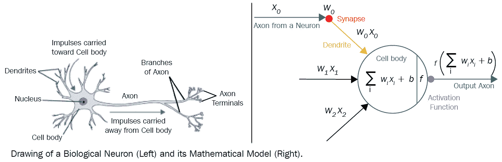
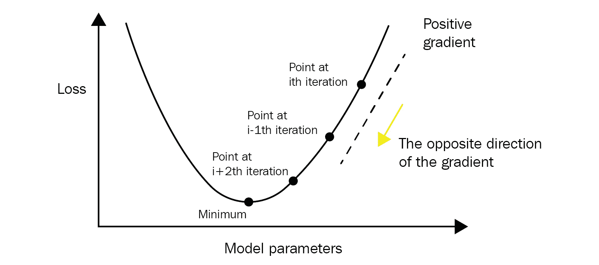
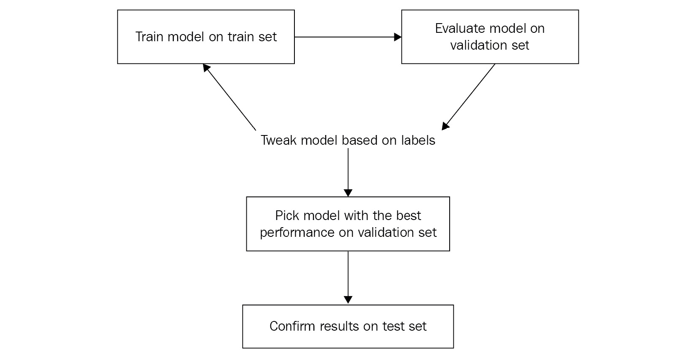
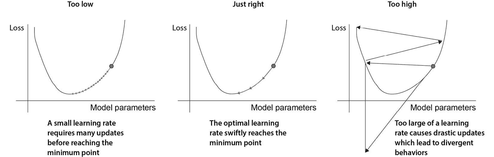
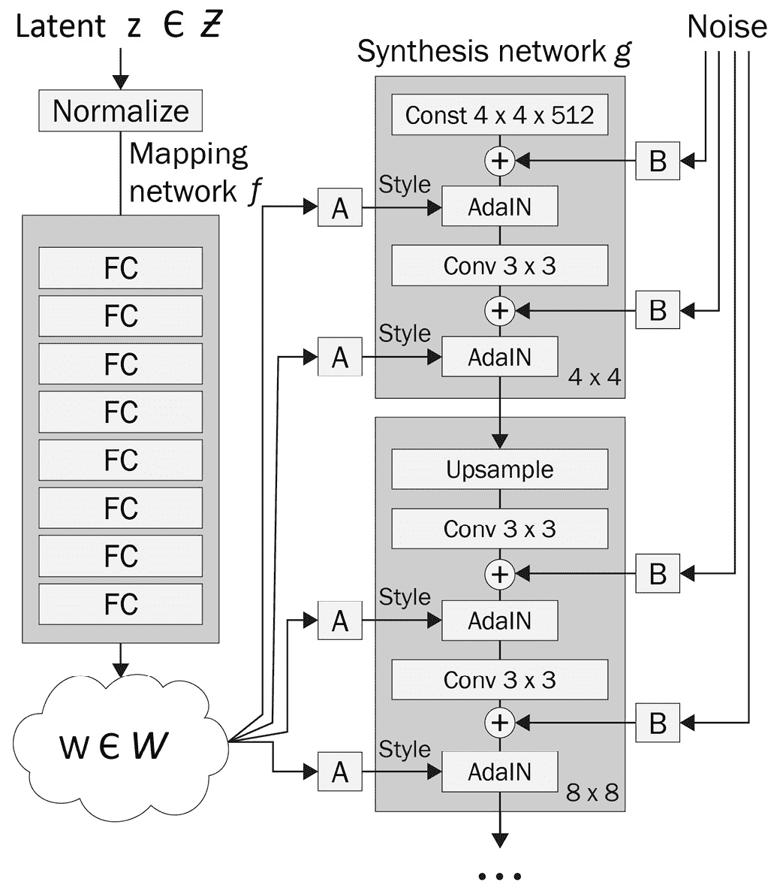
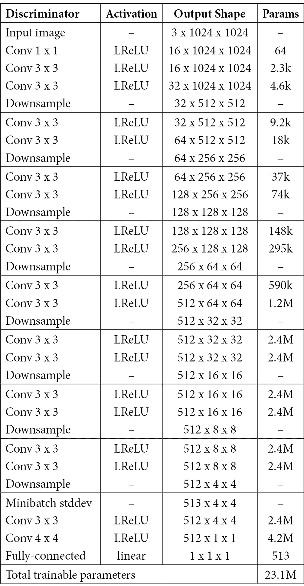

# 第三章：开发一个强大的深度学习模型

在本章中，我们将描述如何设计和训练**深度学习**（DL）模型。在上一章节中描述的笔记本上下文中，数据科学家们调查各种网络设计和模型训练设置，以生成适合给定任务的工作模型。本章的主要内容包括 DL 的理论以及如何使用最流行的 DL 框架**PyTorch**和**TensorFlow**（**TF**）训练模型。在本章末尾，我们将解构**StyleGAN**的实现，这是一个用于图像生成的流行 DL 模型，以解释如何使用我们在本章介绍的组件构建复杂模型。

在本章中，我们将涵盖以下主要内容：

+   学习深度学习基础理论

+   理解 DL 框架的组成部分

+   在 PyTorch 中实现和训练模型

+   在 TF 中实现和训练模型

+   解构复杂的最新模型实现

# 技术要求

您可以从以下 GitHub 链接下载本章的补充材料：[`github.com/PacktPublishing/Production-Ready-Applied-Deep-Learning/tree/main/Chapter_3`](https://github.com/PacktPublishing/Production-Ready-Applied-Deep-Learning/tree/main/Chapter_3)。

本章中的示例可以在安装了必要包的任何 Python 环境中执行。您可以使用上一章介绍的示例环境：[`github.com/PacktPublishing/Production-Ready-Applied-Deep-Learning/tree/main/Chapter_2/dockerfiles`](https://github.com/PacktPublishing/Production-Ready-Applied-Deep-Learning/tree/main/Chapter_2/dockerfiles)。

# 学习深度学习基础理论

如*第一章*中简要描述的，*深度学习驱动项目的有效规划*，DL 是基于**人工神经网络**（ANNs）的**机器学习**（ML）技术。本节的目标是在不深入数学的情况下解释 ANNs 的工作原理。

## DL 是如何工作的？

**人工神经网络**（ANN）基本上是一组相连的神经元。如*图 3.1*所示，ANN 中的神经元和我们大脑中的神经元表现出类似的行为。在 ANN 中，每个连接都有一个可调参数称为**权重**。当神经元 A 到神经元 B 有连接时，神经元 A 的输出乘以连接的权重，得到的加权值成为神经元 B 的输入。**偏置**是神经元内的另一个可调参数；神经元将所有输入求和并加上偏置。最后的操作是激活函数，将计算得到的值映射到不同的范围。新范围内的值是神经元的输出，根据连接传递给其他神经元。

在研究中发现，神经元组根据其组织方式捕捉不同的模式。一些强大的组织形式被标准化为**层**，已成为 ANN 的主要构建模块，为复杂的神经元间互动提供了一层抽象。



图 3.1 – 生物神经元与 ANN 神经元数学模型的比较

正如前面的图表所述，DL 中的操作基于数值。因此，网络的输入数据必须转换为数值。例如，**红、绿、蓝**（**RGB**）颜色代码是用数值表示图像的标准方式。对于文本数据，通常使用词嵌入。类似地，网络的输出将是一组数值。这些值的解释可以根据任务和定义而异。

## DL 模型训练

总体而言，训练 ANN 是一个寻找一组权重、偏差和激活函数的过程，使得网络能够从数据中提取有意义的模式。接下来的问题是：*我们如何找到合适的参数集？* 许多研究人员尝试使用各种技术解决这个问题。在所有尝试中，发现的最有效算法是一种称为**梯度下降**的优化算法，这是一个迭代过程，用于找到局部或全局最小值。

在训练 DL 模型时，我们需要定义一个函数，将预测值与地面实况标签之间的差异量化为一个称为**损失**的数值。一旦损失函数被明确定义，我们就会迭代生成中间预测，计算损失值，并朝向最小损失方向更新模型参数。

鉴于优化的目标是找到最小损失，模型参数需要根据**训练集**样本在梯度的反方向上进行更新（见*图 3.2*）。为了计算梯度，网络在预测过程中跟踪计算中间值（**前向传播**）。然后，从最后一层开始，利用链式法则计算每个参数的梯度（**反向传播**）。有趣的是，模型的性能和训练时间可能会根据每次迭代中参数更新的方式有很大的差异。不同的参数更新规则包含在优化器的概念中。DL 的一个主要任务之一是选择能够产生最佳性能模型的优化器类型。



图 3.2 – 使用梯度下降，模型参数将在每次迭代中朝着梯度的反方向更新

然而，这个过程有一个需要注意的地方。如果模型被训练来在训练集上获得最佳性能，那么在未见数据上的性能可能会下降。这被称为**过拟合**；模型专门针对它以前见过的数据进行训练，无法正确预测新数据。另一方面，训练不足会导致**欠拟合**，即模型未能捕获训练集的潜在模式。为了避免这些问题，训练集的一部分被保留用于在训练过程中评估训练好的模型：**验证集**。总体而言，DL 的训练涉及根据训练集更新模型参数的过程，但选择在验证集上表现最佳的模型。最后一种数据集，**测试集**，代表了模型部署后可能与之交互的数据。测试集在模型训练时可能可用，也可能不可用。测试集的目的是了解训练好的模型在生产环境中的表现。为了进一步理解整体的训练逻辑，我们可以看一下*图 3.3*：



图 3.3 – 训练 DL 模型的步骤

这张图清晰地描述了迭代过程中的步骤，以及每种类型数据集在场景中的角色。

需要记住的事情

a. 训练人工神经网络（ANN）是一个寻找一组权重、偏置和激活函数的过程，使网络能够从数据中提取有意义的模式。

b. 在训练流程中有三种类型的数据集。使用训练集更新模型参数，并选择在验证集上表现最佳的模型。测试集反映了训练好的模型在部署时将与之交互的数据分布。

接下来，我们将看看旨在帮助我们进行模型训练的 DL 框架。

# DL 框架的组成部分

由于模型训练的配置遵循相同的流程，无论底层任务如何，许多工程师和研究人员已经将常见的构建模块整合到框架中。大多数框架通过将数据加载逻辑和模型定义与训练逻辑分离，简化了 DL 模型的开发。

## 数据加载逻辑

**数据加载**逻辑包括从内存加载原始数据到为每个样本准备训练和评估所需的所有步骤。在许多情况下，训练集、验证集和测试集的数据存储在不同的位置，因此每个集合都需要不同的加载和准备逻辑。标准框架将这些逻辑与其他构建模块分开，以便可以以动态方式使用不同的数据集进行模型训练，并在模型方面进行最小更改。此外，这些框架已经标准化了这些逻辑的定义方式，以提高可重用性和可读性。

## 模型定义

另一个基础模块，**模型定义**，指的是人工神经网络的架构本身及其对应的前向和反向传播逻辑。尽管使用算术运算建立模型是一种选择，但标准框架提供了常见的层定义，用户可以组合这些定义以构建复杂的模型。因此，用户需负责实例化必要的网络组件，连接这些组件，并定义模型在训练和推断时的行为方式。

在接下来的两个部分中，*在 PyTorch 中实现和训练模型* 和 *在 TF 中实现和训练模型*，我们将介绍如何在 PyTorch 和 TF 中实例化流行的层：稠密（线性）、池化、归一化、dropout、卷积和循环层。

## 模型训练逻辑

最后，我们需要结合这两个组件并定义训练逻辑的详细信息。这个包装组件必须清晰描述模型训练的关键部分，例如损失函数、学习率、优化器、epochs、迭代次数和批处理大小。

损失函数可以根据学习任务的类型分为两大类：**分类损失**和**回归损失**。这两类之间的主要区别来自输出格式；分类任务的输出是分类的，而回归任务的输出是连续值。在不同的损失中，我们将主要讨论用于回归损失的**均方误差**（**MSE**）和**平均绝对误差**（**MAE**）损失，以及用于分类损失的**交叉熵**（**CE**）和**二元交叉熵**（**BCE**）损失。

**学习率**（**LR**）定义了梯度下降在局部最小值方向上迈出的步伐大小。选择适当的学习率可以帮助过程更快地收敛，但如果学习率过高或过低，收敛性将无法保证（见*图 3.4*）：



图 3.4 – 学习率在梯度下降中的影响

谈到**优化器**，我们关注两个主要的优化器：**随机梯度下降**（**SGD**），一个具有固定学习率的基本优化器，以及**自适应矩估计**（**Adam**），一种基于自适应学习率的优化器，在大多数情况下表现最佳。如果你有兴趣了解不同优化器及其背后的数学原理，我们推荐阅读 Choi 等人的调查论文（[`arxiv.org/pdf/1910.05446.pdf`](https://arxiv.org/pdf/1910.05446.pdf)）。

一个**epoch**表示训练集中的每个样本都已经通过网络进行了前向和反向传播，并且网络参数已经更新。在许多情况下，训练集中的样本数量太大，无法一次通过，因此会将其分成**mini-batches**。**batch size**指的是单个 mini-batch 中的样本数量。给定一组 mini-batches 组成整个数据集，迭代次数指的是模型需要与每个样本进行梯度更新事件（更确切地说是 mini-batch 的数量）。例如，如果一个 mini-batch 有 100 个样本，总共有 1,000 个样本，那么完成一个 epoch 需要 10 次迭代。选择合适的 epoch 数量并不容易。这取决于其他训练参数，如学习率和 batch size。因此，通常需要通过试验和错误的过程来确定，同时注意欠拟合和过拟合的问题。

需要记住的事情

a. 模型训练的组成部分可以分为数据加载逻辑、模型定义和模型训练逻辑。

b. 数据加载逻辑包括从内存加载原始数据到为训练和评估准备每个样本的所有步骤。

c. 模型定义指的是网络架构及其正向和反向传播逻辑的定义。

d. 模型训练逻辑通过将数据加载逻辑和模型定义结合起来处理实际的训练过程。

在众多可用的框架中，我们将在本书中讨论两个最流行的框架：**TF**和**PyTorch**。在今天，运行在 TF 上的 Keras 已经变得非常流行，而 PyTorch 以其出色的灵活性和简易性在研究中被广泛使用。

# 在 PyTorch 中实现和训练模型

PyTorch 是一个用于 Lua 的 ML 包的 Python 库。 PyTorch 的主要特性包括**图形处理单元**（**GPU**）加速的矩阵计算和用于构建和训练神经网络的自动微分。在代码执行过程中动态创建计算图，PyTorch 因其灵活性、易用性以及在模型训练中的高效性而受到青睐。

基于 PyTorch，**PyTorch Lightning**（**PL**）提供了另一层抽象，隐藏了许多样板代码。新框架更多关注研究人员，通过将 PyTorch 的研究相关组件与工程相关组件解耦。PL 的代码通常比 PyTorch 代码更可扩展和易读。尽管本书中的代码片段更加强调 PL，但 PyTorch 和 PL 共享许多功能，因此大多数组件是可互换的。如果您愿意深入了解细节，我们推荐访问官方网站，[`pytorch.org`](https://pytorch.org)。

市场上还有其他扩展 PyTorch 的选择：

+   Skorch ([`github.com/skorch-dev/skorch`](https://github.com/skorch-dev/skorch)) – 一个与 scikit-learn 兼容的神经网络库，包装了 PyTorch。

+   Catalyst ([`github.com/catalyst-team/catalyst`](https://github.com/catalyst-team/catalyst)) – 一个专为可复现性、快速实验和代码库重用而设计的 PyTorch 框架。

+   Fastai ([`github.com/fastai/fastai`](https://github.com/fastai/fastai)) – 一个不仅为实践者提供高级组件，还为研究人员提供低级组件的库。

+   PyTorch Ignite ([`pytorch.org/ignite/`](https://pytorch.org/ignite/)) – 一个专为实践者提供训练和评估帮助的库。

我们不会在本书中涵盖这些库，但如果您对这个领域是新手，可能会发现它们很有帮助。

现在，让我们深入了解 PyTorch 和 PL。

## PyTorch 数据加载逻辑

为了可读性和模块化，PyTorch 和 PL 利用名为`Dataset`的类进行数据管理，并利用另一个名为`DataLoader`的类来迭代访问样本。

虽然`Dataset`类处理获取单个样本，但模型训练会批量输入数据，并需要重排以减少模型过拟合。`DataLoader`通过提供简单的 API 来为用户抽象这种复杂性。此外，它在后台利用 Python 的多进程功能加速数据检索。

`Dataset`子类必须实现的两个核心函数是`__len__`和`__getitem__`。如下课程大纲所述，`__len__`应返回总样本数，`__getitem__`应返回给定索引的样本：

```py
from torch.utils.data import Dataset
class SampleDataset(Dataset):
   def __len__(self):
      """return number of samples"""
   def __getitem__(self, index):
      """loads and returns a sample from the dataset at the given index"""
```

PL 的`LightningDataModule`封装了处理数据所需的所有步骤。关键组件包括下载和清理数据，预处理每个样本，并将每种数据集包装在`DataLoader`中。以下代码片段描述了如何创建`LightningDataModule`类。该类具有`prepare_data`函数用于下载和预处理数据，以及三个函数用于实例化每种数据集的`DataLoader`，分别是`train_dataloader`、`val_dataloader`和`test_dataloader`：

```py
from torch.utils.data import DataLoader
from pytorch_lightning.core.lightning import LightningDataModule
class SampleDataModule(LightningDataModule):
   def prepare_data(self):
       """download and preprocess the data; triggered only on single GPU"""
       ...
   def setup(self):
       """define necessary components for data loading on each GPU"""
       ...
   def train_dataloader(self):
       """define train data loader"""
       return data.DataLoader(
         self.train_dataset, 
           batch_size=self.batch_size, 
           shuffle=True)
   def val_dataloader(self):
       """define validation data loader"""
       return data.DataLoader(
          self.validation_dataset, 
          batch_size=self.batch_size, 
          shuffle=False)             
   def test_dataloader(self):
       """define test data loader"""
       return data.DataLoader(
          self.test_dataset, 
          batch_size=self.batch_size, 
          shuffle=False)
```

`LightningDataModule` 的官方文档可以在 [`pytorch-lightning.readthedocs.io/en/stable/extensions/datamodules.html`](https://pytorch-lightning.readthedocs.io/en/latest/data/datamodule.html) 找到。

## PyTorch 模型定义

PL 的关键优势来自 `LightningModule`，它将复杂的 PyTorch 代码简化为六个部分：

+   计算（`__init__`）

+   训练循环（`training_step`）

+   验证循环（`validation_step`）

+   测试循环（`test_step`）

+   预测循环（`predict_step`）

+   优化器和学习率调度器（`configure_optimizers`）

模型架构是计算部分的一部分。必要的层在 `__init__` 方法中实例化，计算逻辑在 `forward` 方法中定义。在以下代码片段中，三个线性层在 `__init__` 方法内注册到 `LightningModule` 模块，并在 `forward` 方法内定义它们之间的关系：

```py
from pytorch_lightning import LightningModule
from torch import nn
class SampleModel(LightningModule):
   def __init__(self):
      """instantiate necessary layers"""
       self.individual_layer_1 = nn.Linear(..., ...)
       self.individual_layer_2 = nn.Linear(..., ...)
       self.individual_layer_3 = nn.Linear(..., ...)
   def forward(self, input):
       """define forward propagation logic"""
       output_1 = self.individual_layer_1(input)
       output_2 = self.individual_layer_2(output_1)
       final_output = self.individual_layer_3(output_2)
       return final_output
```

另一种定义网络的方法是使用 `torch.nn.Sequential`，如下所示。使用此模块，一组层可以被组合在一起，并且自动实现输出链式化：

```py
class SampleModel(LightningModule):
   def __init__(self):
       """instantiate necessary layers"""
       self.multiple_layers = nn.Sequential(
       nn.Linear(    ,    ),
       nn.Linear(    ,    ),
       nn.Linear(    ,    ))
   def forward(self, input):
       """define forward propagation logic"""
       final_output = self.multiple_layers(input)
       return final_output
```

在前面的代码中，三个线性层被组合在一起并存储为单个实例变量 `self.multiple_layers`。在 `forward` 方法中，我们只需触发 `self.multiple_layers` 与输入张量以逐个通过每个层传递张量。

以下部分旨在介绍常见的层实现。

### PyTorch DL 层

DL 框架的一个主要优势来自于各种层定义：梯度计算逻辑已经成为层定义的一部分，因此您可以专注于找到适合任务的最佳模型架构。在本节中，我们将了解跨项目常用的层。如果您感兴趣的层在本节中未涵盖，请参阅官方文档（[`pytorch.org/docs/stable/nn.html`](https://pytorch.org/docs/stable/nn.html)）。

#### PyTorch 密集（线性）层

第一种类型的层是 `torch.nn.Linear`。顾名思义，它对输入张量应用线性变换。函数的两个主要参数是 `in_features` 和 `out_features`，分别定义输入和输出张量的维度：

```py
linear_layer = torch.nn.Linear(
              in_features,   # Size of each input sample
              out_features,  # Size of each output sample)
# N = batch size
# * = any number of additional dimensions
input_tensor = torch.rand(N, *, in_features)
output_tensor = linear_layer(input_tensor) # (N, *, out_features)
```

来自 `torch.nn` 模块的层实现已经定义了 `forward` 函数，因此您可以将层变量像函数一样使用，以触发前向传播。

#### PyTorch 池化层

池化层通常用于对张量进行下采样。最流行的两种类型是最大池化和平均池化。这些层的关键参数是 `kernel_size` 和 `stride`，分别定义窗口的大小以及每个池化操作的移动方式。

最大池化层通过选择每个窗口中的最大值来对输入张量进行下采样：

```py
# 2D max pooling
max_pool_layer = torch.nn.MaxPool2d(
   kernel_size,         # the size of the window to take a max over
   stride=None,         # the stride of the window. Default value is kernel_size
   padding=0,           # implicit zero padding to be added on both sides
   dilation=1,          # a parameter that controls the stride of elements in the window)
# N = batch size
# C = number of channels
# H = height of input planes in pixels
# W = width of input planes in pixels
input_tensor = torch.rand(N, C, H, W)
output_tensor = max_pool_layer(input_tensor) # (N, C, H_out, W_out) 
```

另一方面，平均池化层通过计算每个窗口的平均值来降低输入张量的分辨率：

```py
# 2D average pooling
avg_pool_layer = torch.nn.AvgPool2d(
   kernel_size,         # the size of the window to take a max over
   stride=None,         # the stride of the window. Default value is kernel_size
   padding=0,           # implicit zero padding to be added on both sides)
# N = batch size
# C = number of channels
# H = height of input planes in pixels
# W = width of input planes in pixels
input_tensor = torch.rand(N, C, H, W)
output_tensor = avg_pool_layer(input_tensor) # (N, C, H_out, W_out)
```

你可以在 [`pytorch.org/docs/stable/nn.html#pooling-layers`](https://pytorch.org/docs/stable/nn.html#pooling-layers) 找到其他类型的池化层。

#### PyTorch 归一化层

在数据处理中常用的归一化的目的是将数值数据缩放到一个公共尺度，而不改变其分布。在深度学习中，归一化层用于以更大的数值稳定性训练网络 ([`pytorch.org/docs/stable/nn.html#normalization-layers`](https://pytorch.org/docs/stable/nn.html#normalization-layers))。

最常用的归一化层是批量归一化层，它对一个小批量的值进行缩放。在下面的代码片段中，我们介绍了 `torch.nn.BatchNorm2d`，一个为带有额外通道维度的二维张量小批量设计的批量归一化层：

```py
batch_norm_layer = torch.nn.BatchNorm2d(
   num_features,      # Number of channels in the input image
   eps=1e-05,         # A value added to the denominator for numerical stability
   momentum=0.1,      # The value used for the running_mean and running_var computation
   affine=True,       # a boolean value that when set to True, this module has learnable affine parameters)
# N = batch size
# C = number of channels
# H = height of input planes in pixels
# W = width of input planes in pixels
input_tensor = torch.rand(N, C, H, W)
output_tensor = batch_norm_layer(input_tensor) # same shape as input (N, C, H, W)
```

在各种参数中，你应该了解的主要参数是 `num_features`，它表示通道数。层的输入是一个四维张量，其中每个索引表示批量大小 (`N`)，通道数 (`C`)，图像高度 (`H`) 和图像宽度 (`W`)。

#### PyTorch 丢弃层

丢弃层帮助模型通过随机将一组值设为零来提取通用特征。这种操作可以防止模型过度拟合训练集。话虽如此，PyTorch 的丢弃层主要通过一个参数 `p` 控制一个元素被设为零的概率：

```py
drop_out_layer = torch.nn.Dropout2d(
   p=0.5,  # probability of an element to be zeroed )
# N = batch size
# C = number of channels
# H = height of input planes in pixels
# W = width of input planes in pixels
input_tensor = torch.rand(N, C, H, W)
output_tensor = drop_out_layer(input_tensor) # same shape as input (N, C, H, W)
```

在这个例子中，我们将元素的 50%设为零 (`p=0.5`)。与批量归一化层类似，`torch.nn.Dropout2d` 的输入张量大小为 `N, C, H, W`。

#### PyTorch 卷积层

针对图像处理专门设计的卷积层，使用滑动窗口技术在输入张量上应用卷积操作。在图像处理中，中间数据以 `N, C, H, W` 大小的四维张量表示，`torch.nn.Conv2d` 是标准选择：

```py
conv_layer = torch.nn.Conv2d(
   in_channels,         # Number of channels in the input image
   out_channels,        # Number of channels produced by the convolution
   kernel_size,         # Size of the convolving kernel
   stride=1,            # Stride of the convolution
   padding=0,           # Padding added to all four sides of the input.
   dilation=1,          # Spacing between kernel elements)
# N = batch size
# C = number of channels
# H = height of input planes in pixels
# W = width of input planes in pixels
input_tensor = torch.rand(N, C_in, H, W)
output_tensor = conv_layer(input_tensor) # (N, C_out, H_out, W_out)
```

`torch.nn.Conv2d` 类的第一个参数 `in_channels` 表示输入张量中的通道数。第二个参数 `out_channels` 表示输出张量中的通道数，即滤波器的数量。其他参数 `kernel_size`，`stride` 和 `padding` 决定了如何对该层进行卷积操作。

#### PyTorch 循环层

递归层设计用于序列数据。在各种类型的递归层中，本节将介绍`torch.nn.RNN`，它将多层 Elman**递归神经网络**（**RNN**）应用于给定的序列（[`onlinelibrary.wiley.com/doi/abs/10.1207/s15516709cog1402_1`](https://onlinelibrary.wiley.com/doi/abs/10.1207/s15516709cog1402_1)）。如果您想尝试不同的递归层，可以参考官方文档：[`pytorch.org/docs/stable/nn.html#recurrent-layers`](https://pytorch.org/docs/stable/nn.html#recurrent-layers)：

```py
# multi-layer Elman RNN with tanh or ReLU non-linearity to an input sequence.
rnn = torch.nn.RNN(
   input_size,                     # The number of expected features in the input x
   hidden_size,                    # The number of features in the hidden state h
   num_layers = 1,                 # Number of recurrent layers
   nonlinearity="tanh",            # The non-linearity to use. Can be either 'tanh' or 'relu'
   bias=True,                      # If False, then the layer does not use bias weights
   batch_first=False,              # If True, then the input and output tensors are provided
                                                                                                 # as (batch, seq, feature) instead of (seq, batch, feature)
             dropout=0,                                                # If non-zero, introduces a Dropout layer on the outputs of each RNN layer
                                                                                                 # except the last layer, with dropout probability equal to dropout
   bidirectional=False,             # If True, becomes a bidirectional RNN)
# N = batch size
# L = sequence length
# D = 2 if bidirectionally, otherwise 1
# H_in = input_size
# H_out = hidden_size
rnn = nn.RNN(H_in, H_out, num_layers)
input_tensor = torch.randn(L, N, H_in)
# H_0 = tensor containing the initial hidden state for each element in the batch
h0 = torch.randn(D * num_layers, N, H_out)
# output_tensor (L, N, D * H_out)
# hn (D * num_layers, N, H_out) 
output_tensor, hn = rnn(input_tensor, h0)
```

`torch.nn.RNN`的三个关键参数是`input_size`、`hidden_size`和`num_layers`。它们分别指的是输入张量中预期的特征数、隐藏状态中的特征数以及要使用的递归层数。为了触发前向传播，您需要传递两个东西，一个输入张量和一个包含初始隐藏状态的张量。

## PyTorch 模型训练

在本节中，我们描述了 PL 的模型训练组件。如下面的代码块所示，`LightningModule`是您必须继承的基类。它的`configure_optimizers`函数用于定义训练的优化器。然后，实际的训练逻辑在`training_step`函数中定义：

```py
class SampleModel(LightningModule):
   def configure_optimizers(self):
      """Define optimizer to use"""
      return torch.optim.Adam(self.parameters(), lr=0.02)
   def training_step(self, batch, batch_idx):
      """Define single training iteration"""
      x, y = batch
      y_hat = self(x)
      loss = F.cross_entropy(y_hat, y)
      return loss
```

验证、预测和测试循环具有类似的函数定义；一个批次被馈送到网络中以计算必要的预测和损失值。收集的数据也可以使用 PL 的内置日志记录系统进行存储和显示。有关详细信息，请参阅官方文档（[`pytorch-lightning.readthedocs.io/en/latest/common/lightning_module.html`](https://pytorch-lightning.readthedocs.io/en/latest/common/lightning_module.html)）：

```py
   def validation_step(self, batch, batch_idx):
      """Define single validation iteration"""
      loss, acc = self._shared_eval_step(batch, batch_idx)
      metrics = {"val_acc": acc, "val_loss": loss}
      self.log_dict(metrics)
      return metrics
   def test_step(self, batch, batch_idx):
      """Define single test iteration"""
      loss, acc = self._shared_eval_step(batch, batch_idx)
      metrics = {"test_acc": acc, "test_loss": loss}
      self.log_dict(metrics)
      return metrics
   def _shared_eval_step(self, batch, batch_idx):
      x, y = batch
      outputs = self(x)
      loss = self.criterion(outputs, targets)
      acc = accuracy(outputs.round(), targets.int())
      return loss, acc
   def predict_step(self, batch, batch_idx, dataloader_idx=0):
      """Compute prediction for the given batch of data"""
      x, y = batch
      y_hat = self(x)
      return y_hat
```

在幕后，`LightningModule`执行以下一系列简化的 PyTorch 代码：

```py
model.train()
torch.set_grad_enabled(True)
outs = []
for batch_idx, batch in enumerate(train_dataloader):
   loss = training_step(batch, batch_idx)
   outs.append(loss.detach())
   # clear gradients
   optimizer.zero_grad()
   # backward
   loss.backward()
   # update parameters
   optimizer.step()
   if validate_at_some_point
      model.eval()
      for val_batch_idx, val_batch in enumerate(val_dataloader):
         val_out = model.validation_step(val_batch, val_batch_idx)
         model.train()
```

将`LightningDataModule`和`LightningModule`结合在一起，可以简单地实现对测试集的训练和推理如下：

```py
from pytorch_lightning import Trainer
data_module = SampleDataModule()
trainer = Trainer(max_epochs=num_epochs)
model = SampleModel()
trainer.fit(model, data_module)
result = trainer.test()
```

到目前为止，您应该已经学会了如何使用 PyTorch 设置模型训练。接下来的两节专门介绍了损失函数和优化器，这两个模型训练的主要组成部分。

### PyTorch 损失函数

首先，我们将查看 PL 中提供的不同损失函数。本节中的损失函数可以在`torch.nn`模块中找到。

#### PyTorch MSE / L2 损失函数

可以使用`torch.nn.MSELoss`创建 MSE 损失函数。但是，这仅计算平方误差分量，并利用`reduction`参数提供变体。当`reduction`为`None`时，返回计算值。另一方面，当设置为`sum`时，输出将被累加。为了获得精确的 MSE 损失，必须将 reduction 设置为`mean`，如下面的代码片段所示：

```py
loss = nn.MSELoss(reduction='mean')
input = torch.randn(3, 5, requires_grad=True)
target = torch.randn(3, 5)
output = loss(input, target)
```

接下来，让我们看看 MAE 损失。

#### PyTorch MAE / L1 损失函数

MAE（Mean Absolute Error，平均绝对误差）损失函数可以通过`torch.nn.L1Loss`来实例化。与 MSE 损失函数类似，此函数根据`reduction`参数计算不同的值：

```py
Loss = nn.L1Loss(reduction='mean')
input = torch.randn(3, 5, requires_grad=True)
target = torch.randn(3, 5)
output = loss(input, target)
```

现在我们可以转向 CE 损失，它在多类分类任务中使用。

#### PyTorch 交叉熵损失函数

`torch.nn.CrossEntropyLoss`在训练多类别分类问题的模型时非常有用。正如下面的代码片段所示，此类别还具有`reduction`参数以计算不同的变体。您还可以使用`weight`和`ignore_index`参数来进一步改变损失的行为，分别对每个类别进行加权并忽略特定索引：

```py
loss = nn.CrossEntropyLoss(reduction="mean")
input = torch.randn(3, 5, requires_grad=True)
target = torch.empty(3, dtype=torch.long).random_(5)
output = loss(input, target)
```

类似地，我们可以定义 BCE 损失。

#### PyTorch BCE 损失函数

类似于 CE 损失，PyTorch 将 BCE 损失定义为`torch.nn.BCELoss`，具有相同的参数集。然而，利用`torch.nn.BCELoss`与 sigmoid 操作之间的密切关系，PyTorch 提供了`torch.nn.BCEWithLogitsLoss`，通过在一个类中组合`softmax`操作和 BCE 损失计算，实现了更高的数值稳定性。其使用方法如下面的代码片段所示：

```py
loss = torch.nn.BCEWithLogitsLoss(reduction="mean")
input = torch.randn(3, requires_grad=True)
target = torch.empty(3).random_(2)
output = loss(input, target)
```

最后，让我们看一下如何构建 PyTorch 中的自定义损失。

#### PyTorch 自定义损失函数

定义自定义损失函数非常简单。任何使用 PyTorch 操作定义的函数都可以用作损失函数。

下面是使用`mean`操作符实现的`torch.nn.MSELoss`的样本实现：

```py
def custom_mse_loss(output, target):
   loss = torch.mean((output - target)**2)
   return loss
input = torch.randn(3, 5, requires_grad=True)
target = torch.randn(3, 5)
output = custom_mse_loss(input, target)
```

现在，我们将转到 PyTorch 优化器的概述。

### PyTorch 优化器

如*PyTorch 模型训练*部分所述，`LightningModule`的`configure_optimizers`函数指定了训练的优化器。在 PyTorch 中，可以从`torch.optim`模块中找到预定义的优化器。优化器实例化需要模型参数，可以通过在模型上调用`parameters`函数来获取，如以下部分所示。

#### PyTorch SGD 优化器

下面的代码片段实例化了一个 LR 为`0.1`的 SGD 优化器，并展示了如何实现模型参数更新的单步操作。

`torch.optim.SGD`内置支持动量和加速，进一步提高了训练性能。可以使用`momentum`和`nesterov`参数进行配置：

```py
optimizer = torch.optim.SGD(model.parameters(), lr=0.1 momentum=0.9, nesterov=True)
```

#### PyTorch Adam 优化器

同样地，可以使用`torch.optim.Adam`来实例化 Adam 优化器，如下面的代码行所示：

```py
optimizer = torch.optim.Adam(model.parameters(), lr=0.1) 
```

如果您对 PyTorch 中优化器的工作原理感兴趣，我们建议阅读官方文档：[`pytorch.org/docs/stable/optim.html`](https://pytorch.org/docs/stable/optim.html)。

要记住的事情

a. PyTorch 是一种流行的深度学习框架，提供了 GPU 加速的矩阵计算和自动微分功能。PyTorch 因其灵活性、易用性以及在模型训练中的效率而受到欢迎。

b. 为了提高可读性和模块化性，PyTorch 利用名为`Dataset`的类来进行数据管理，并使用另一个名为`DataLoader`的类来迭代访问样本。

c. PL 的关键优势来自于`LightningModule`，它简化了复杂的 PyTorch 代码结构组织为六个部分：计算、训练循环、验证循环、测试循环、预测循环，以及优化器和学习率调度器。

d. PyTorch 和 PL 共享`torch.nn`模块，用于各种层和损失函数。预定义的优化器可以在`torch.optim`模块中找到。

在接下来的部分中，我们将看一看另一个深度学习框架，TF。使用 TF 进行的训练设置与使用 PyTorch 的设置非常相似。

# 在 TF 中实现和训练模型

虽然 PyTorch 偏向于研究项目，TF 更加注重行业应用案例。尽管 PyTorch 的部署功能，如 Torch Serve 和 Torch Mobile 仍处于实验阶段，TF 的部署功能，如 TF Serve 和 TF Lite 已经稳定并且在积极使用中。TF 的第一个版本由 Google Brain 团队于 2011 年推出，并且他们持续更新 TF 以使其更加灵活、用户友好和高效。TF 和 PyTorch 的关键区别最初相差较大，因为 TF 的第一个版本使用静态图。然而，随着版本 2 的推出，情况已经改变，它引入了急切执行，模仿了 PyTorch 中的动态图。TF 版本 2 经常与**Keras**一起使用，这是一个用于人工神经网络的接口（[`keras.io`](https://keras.io/getting_started/)）。Keras 允许用户快速开发深度学习模型并运行实验。在接下来的部分中，我们将介绍 TF 的关键组件。

## TF 数据加载逻辑

TF 模型可以以多种方式加载数据。你应该了解的一个关键数据操作模块是`tf.data`，它帮助你构建高效的输入管道。`tf.data`提供了`tf.data.Dataset`和`tf.data.TFRecordDataset`类，专门设计用于加载不同数据格式的数据集。此外，还有`tensorflow_datasets`（`tfds`）模块（[`www.tensorflow.org/datasets/api_docs/python/tfds`](https://www.tensorflow.org/datasets/api_docs/python/tfds)）和`tensorflow_addons`模块（[`www.tensorflow.org/addons`](https://www.tensorflow.org/addons)），它们进一步简化了许多情况下的数据加载过程。还值得一提的是 TF I/O 包（[`www.tensorflow.org/io/overview`](https://www.tensorflow.org/io/overview)），它扩展了标准 TF 文件系统交互的功能。

无论你将使用哪个包，你都应该考虑创建一个`DataLoader`类。在这个类中，你将清晰地定义目标数据如何加载以及在训练之前如何预处理。以下代码片段展示了一个加载逻辑的示例实现：

```py
import tensorflow_datasets as tfds
class DataLoader: 
   """ DataLoader class"""
   @staticmethod 
   def load_data(config): 
      return tfds.load(config.data_url)
```

在前面的例子中，我们使用`tfds`从外部 URL（`config.data_url`）加载数据。关于`tfds.load`的更多信息可以在线找到：[`www.tensorflow.org/datasets/api_docs/python/tfds/load`](https://www.tensorflow.org/datasets/api_docs/python/tfds/load)。

数据以各种格式可用。因此，重要的是将其预处理为 TF 模型可以使用的格式，使用`tf.data`模块提供的功能。因此，让我们看一下如何使用这个包来读取常见格式的数据：

+   首先，可以按如下方式读取以`tfrecord`格式存储的数据序列：

    ```py
    import tensorflow as tf 
    dataset = tf.data.TFRecordDataset(list_of_files)
    ```

+   我们可以使用`tf.data.Dataset.from_tensor_slices`函数从 NumPy 数组创建数据集对象，如下所示：

    ```py
    dataset = tf.data.Dataset.from_tensor_slices(numpy_array)
    ```

+   Pandas DataFrames 也可以使用相同的`tf.data.Dataset.from_tensor_slices`函数加载为数据集：

    ```py
    dataset = tf.data.Dataset.from_tensor_slices((df_features.values, df_target.values))
    ```

+   另一种选项是使用 Python 生成器。以下是一个简单的示例，演示如何使用生成器来提供配对的图像和标签：

    ```py
    def data_generator(images, labels):
       def fetch_examples(): 
           i = 0 
           while True: 
              example = (images[i], labels[i]) 
              i += 1 
              i %= len(labels) 
              yield example 
           return fetch_examples
    training_dataset = tf.data.Dataset.from_generator(
       data_generator(images, labels),
       output_types=(tf.float32, tf.int32), 
       output_shapes=(tf.TensorShape(features_shape), tf.TensorShape(labels_shape)))
    ```

如上一段代码片段所示，`tf.data.Dataset` 提供了内置的数据加载功能，例如批处理、重复和洗牌。这些选项都是不言自明的：批处理创建特定大小的小批量数据，重复允许我们多次迭代数据集，而洗牌则在每个 epoch 中混淆数据条目。

在结束本节之前，我们想提到，使用 Keras 实现的模型可以直接消耗 NumPy 数组和 Pandas DataFrames。

## TF 模型定义

类似于 PyTorch 和 PL 如何处理模型定义，TF 提供了多种定义网络架构的方法。首先，我们将看看`Keras.Sequential`，它链式连接一组层以构建网络。这个类为您处理了层之间的链接，因此您不需要显式地定义它们的连接：

```py
import tensorflow as tf
from tensorflow import keras
from tensorflow.keras import layers
input_shape = 50
model = keras.Sequential(
   [
      keras.Input(shape=input_shape),
      layers.Dense(128, activation="relu", name="layer1"),
      layers.Dense(64, activation="relu", name="layer2"),
      layers.Dense(1, activation="sigmoid", name="layer3"),
   ])
```

在前面的例子中，我们创建了一个模型，包括一个输入层、两个密集层和一个生成单个神经元输出的输出层。这是一个简单的模型，可以用于二元分类。

如果模型定义更复杂，无法按顺序构建，另一种选择是使用`keras.Model`类，如下面的代码片段所示：

```py
num_classes = 5 
input_1 = layers.Input(50)
input_2 = layers.Input(10)
x_1 = layers.Dense(128, activation="relu", name="layer1x")(input_1)
x_1 = layers.Dense(64, activation="relu", name="layer1_2x")(x_1)
x_2 = layers.Dense(128, activation="relu", name="layer2x")(input_2)
x_2 = layers.Dense(64, activation="relu", name="layer2_1x")(x_2)
x = layers.concatenate([x_1, x_2], name="concatenate")
out = layers.Dense(num_classes, activation="softmax", name="output")(x)
model = keras.Model((input_1,input_2), out)
```

在这个例子中，我们有两个输入，并进行了不同的计算。这两条路径在最后的串联层中合并，将串联的张量传输到最终的具有五个神经元的密集层中。考虑到最后一层使用了`softmax`激活函数，这个模型可以用于多类分类。

第三个选项如下，是创建一个继承了`keras.Model`的类。这个选项给了你最大的灵活性，允许你自定义模型的每个部分和训练过程：

```py
class SimpleANN(keras.Model):
   def __init__(self):
      super().__init__()
      self.dense_1 = layers.Dense(128, activation="relu", name="layer1")
      self.dense_2 = layers.Dense(64, activation="relu", name="layer2")
      self.out = layers.Dense(1, activation="sigmoid", name="output")
   def call(self, inputs):
      x = self.dense_1(inputs)
      x = self.dense_3(x)
      return self.out(x)
model = SimpleANN()
```

`SimpleANN`，来自前面的代码，继承自 `Keras.Model`。在 `__init__` 函数中，我们需要使用 `tf.keras.layers` 模块或基本的 TF 操作来定义网络架构。前向传播逻辑在 `call` 方法内部定义，就像 PyTorch 中有 `forward` 方法一样。

当模型被定义为一个独立的类时，您可以将额外的功能链接到该类。在下面的示例中，添加了 `build_graph` 方法以返回一个 `keras.Model` 实例，因此您可以例如使用 `summary` 函数来可视化网络架构作为更简单的表示：

```py
class SimpleANN(keras.Model):
   def __init__(self):
   ...
   def call(self, inputs):
   ...
   def build_graph(self, raw_shape):
      x = tf.keras.layers.Input(shape=raw_shape)
      return keras.Model(inputs=[x], outputs=self.call(x))
```

现在，让我们看看 TF 如何通过 Keras 提供一组层实现。

### TF 深度学习层

如前一节所述，`tf.keras.layers` 模块提供了一组层实现，您可以用来构建 TF 模型。在本节中，我们将涵盖与我们在 *PyTorch 中实现和训练模型* 部分描述的相同一组层。此模块中可用的层的完整列表可以在 [`www.tensorflow.org/api_docs/python/tf/keras/layers`](https://www.tensorflow.org/api_docs/python/tf/keras/layers) 找到。

#### TF 密集（线性）层

第一个是 `tf.keras.layers.Dense`，执行线性转换：

```py
tf.keras.layers.Dense(units, activation=None, use_bias=True, kernel_initializer='glorot_uniform', bias_initializer='zeros', kernel_regularizer=None, bias_regularizer=None, activity_regularizer=None, kernel_constraint=None, bias_constraint=None, **kwargs)
```

`units` 参数定义了密集层中神经元的数量（输出的维度）。如果未定义 `activation` 参数，则层的输出将原样返回。如下面的代码所示，我们也可以在层定义之外应用 `Activation` 操作：

```py
X = layers.Dense(128, name="layer2")(input)
x = tf.keras.layers.Activation('relu')(x)
```

在某些情况下，您需要构建一个自定义层。下面的示例演示了如何使用基本的 TF 操作创建一个密集层，通过继承 `tensorflow.keras.layers.Layer` 类：

```py
import tensorflow as tf
from tensorflow.keras.layers import Layer
class CustomDenseLayer(Layer):
   def __init__(self, units=32):
      super(SimpleDense, self).__init__()
      self.units = units
   def build(self, input_shape):
      w_init = tf.random_normal_initializer()
      self.w = tf.Variable(name="kernel", initial_value=w_init(shape=(input_shape[-1], self.units),
      dtype='float32'),trainable=True)
      b_init = tf.zeros_initializer()
      self.b = tf.Variable(name="bias",initial_value=b_init(shape=(self.units,), dtype='float32'),trainable=True)
   def call(self, inputs):
      return tf.matmul(inputs, self.w) + self.b
```

在 `CustomDenseLayer` 类的 `__init__` 函数中，我们定义输出的维度（`units`）。然后，在 `build` 方法中实例化层的状态；我们为层创建并初始化权重和偏置。最后的 `call` 方法定义了计算本身。对于密集层，它包括将输入与权重相乘并添加偏置。

#### TF 池化层

`tf.keras.layers` 提供不同类型的池化层：平均池化、最大池化、全局平均池化和全局最大池化层，用于一维时间数据、二维或三维空间数据。在本节中，我们将展示二维最大池化和平均池化层：

```py
tf.keras.layers.MaxPool2D(
   pool_size=(2, 2), strides=None, padding='valid', data_format=None,
   kwargs)
tf.keras.layers.AveragePooling2D(
   pool_size=(2, 2), strides=None, padding='valid', data_format=None,
   kwargs)
```

这两个层都使用 `pool_size` 参数，定义窗口的大小。`strides` 参数用于定义窗口在池化操作中如何移动。

#### TF 标准化层

在下面的示例中，我们演示了一个批量标准化层，`tf.keras.layers.BatchNormalization`：

```py
tf.keras.layers.BatchNormalization(
   axis=-1, momentum=0.99, epsilon=0.001, center=True, scale=True,
   beta_initializer='zeros', gamma_initializer='ones',
   moving_mean_initializer='zeros',
   moving_variance_initializer='ones', beta_regularizer=None,
   gamma_regularizer=None, beta_constraint=None, gamma_constraint=None, **kwargs)
```

该层的输出将具有接近 `0` 的均值和接近 `1` 的标准差。有关每个参数的详细信息，请查看 [`www.tensorflow.org/api_docs/python/tf/keras/layers/BatchNormalization`](https://www.tensorflow.org/api_docs/python/tf/keras/layers/BatchNormalization)。

#### TF dropout 层

`Tf.keras.layers.Dropout` 层应用了 dropout，这是一种将随机选择的数值设为零的正则化方法：

```py
tf.keras.layers.Dropout(rate, noise_shape=None, seed=None, **kwargs)
```

在上述层的实例化中，`rate` 参数是一个介于 `0` 和 `1` 之间的浮点值，确定将被丢弃的输入单元的分数。

#### TF 卷积层

`tf.keras.layers` 提供了各种卷积层的实现，包括 `tf.keras.layers.Conv1D`，`tf.keras.layers.Conv2D`，`tf.keras.layers.Conv3D`，以及相应的转置卷积层（反卷积层） `tf.keras.layers.Conv1DTranspose`，`tf.keras.layers.Conv2DTranspose`，`tf.keras.layers.Conv3DTranspose`。

以下代码片段描述了二维卷积层的实例化：

```py
tf.keras.layers.Conv2D(
   filters, kernel_size, strides=(1, 1), padding='valid',
   data_format=None, dilation_rate=(1, 1), groups=1,
   activation=None, use_bias=True,
   kernel_initializer='glorot_uniform',
   bias_initializer='zeros', kernel_regularizer=None,
   bias_regularizer=None, activity_regularizer=None,
   kernel_constraint=None, bias_constraint=None, **kwargs)
```

在上述层定义中的主要参数是 `filters` 和 `kernel_size`。`filters` 参数定义了输出的维度，`kernel_size` 参数定义了二维卷积窗口的大小。有关其他参数，请查看 [`www.tensorflow.org/api_docs/python/tf/keras/layers/Conv2D`](https://www.tensorflow.org/api_docs/python/tf/keras/layers/Conv2D)。

#### TF 循环层

在 Keras 中实现了以下一系列的循环层：`LSTM` 层，`GRU` 层，`SimpleRNN` 层，`TimeDistributed` 层，`Bidirectional` 层，`ConvLSTM2D` 层和 `Base RNN` 层。

在下面的代码片段中，我们展示了如何实例化 `Bidirectional` 和 `LSTM` 层：

```py
model = Sequential()
model.add(Bidirectional(LSTM(10, return_sequences=True), input_shape=(5, 10)))
model.add(Bidirectional(LSTM(10)))
model.add(Dense(5))
model.add(Activation('softmax'))
```

在上面的例子中，`LSTM` 层通过 `Bidirectional` 封装器进行了修改，以向两个隐藏层的两个副本提供初始序列和反向序列。这两层的输出被合并以得到最终的输出。默认情况下，输出是连接的，但是 `merge_mode` 参数允许我们选择不同的合并选项。输出空间的维度由第一个参数定义。要在每个时间步访问每个输入的隐藏状态，可以启用 `return_sequences`。更多细节，请查看 [`www.tensorflow.org/api_docs/python/tf/keras/layers/LSTM`](https://www.tensorflow.org/api_docs/python/tf/keras/layers/LSTM)。

## TF 模型训练

对于 Keras 模型，只需在调用带有优化器和损失函数的 `compile` 函数后，通过在模型上调用 `fit` 函数即可完成模型训练。`fit` 函数使用提供的数据集进行指定轮数的训练。

以下代码片段描述了 `fit` 函数的参数：

```py
model.fit(
   x=None, y=None, batch_size=None, epochs=1,
   verbose='auto', callbacks=None, validation_split=0.0,
   validation_data=None, shuffle=True,
   class_weight=None, sample_weight=None, 
   initial_epoch=0, steps_per_epoch=None,
   validation_steps=None, validation_batch_size=None,
   validation_freq=1, max_queue_size=10, workers=1,
   use_multiprocessing=False)
```

`x`和`y`表示输入张量和标签。它们可以以多种格式提供：NumPy 数组、TF 张量、TF 数据集、生成器或`tf.keras.utils.experimental.DatasetCreator`。除了`fit`，Keras 模型还具有`train_on_batch`函数，仅在单个数据批次上执行梯度更新。

在 TF 版本 1 中，训练循环需要计算图编译，而 TF 版本 2 允许我们在不进行任何编译的情况下定义训练逻辑，就像 PyTorch 一样。典型的训练循环如下所示：

```py
Optimizer = tf.keras.optimizers.Adam()
loss_fn = tf.keras.losses.CategoricalCrossentropy()
train_acc_metric = tf.keras.metrics.CategoricalAccuracy()
for epoch in range(epochs):
   for step, (x_batch_train, y_batch_train) in enumerate(train_dataset):
       with tf.GradientTape() as tape:
          logits = model(x_batch_train, training=True)
          loss_value = loss_fn(y_batch_train, logits)
       grads = tape.gradient(loss_value, model.trainable_weights)
       optimizer.apply_gradients(zip(grads, model.trainable_weights))
       train_acc_metric.update_state(y, logits)
```

在上述代码片段中，外部循环遍历各个 epoch，内部循环遍历训练集。前向传播和损失计算在`GradientTape`的范围内，该范围记录每个批次的自动微分操作。在范围外，优化器使用计算出的梯度更新权重。在上述示例中，TF 函数立即执行操作，而不是像急切执行中那样将操作添加到计算图中。我们想提到的是，如果您使用的是 TF 版本 1，那么需要使用`@tf.function`装饰器，因为那里需要显式构建计算图。

接下来，我们将研究 TF 中的损失函数。

### TF 损失函数

在 TF 中，当模型编译时需要指定损失函数。虽然您可以从头开始构建自定义损失函数，但您可以通过`tf.keras.losses`模块提供的预定义损失函数来使用 Keras 提供的损失函数。以下示例演示了如何使用 Keras 的损失函数来编译模型：

```py
model.compile(loss=tf.keras.losses.BinaryFocalCrossentropy(gamma=2.0, from_logits=True), ...)
```

此外，您可以将字符串别名传递给损失参数，如以下代码片段所示：

```py
model.compile(loss='sparse_categorical_crossentropy', ...)
```

在本节中，我们将解释如何在 TF 中实例化*PyTorch 损失函数*部分中描述的损失函数。

#### TF MSE / L2 损失函数

MSE / L2 损失函数可以定义如下（[`www.tensorflow.org/api_docs/python/tf/keras/losses/MeanSquaredError`](https://www.tensorflow.org/api_docs/python/tf/keras/losses/MeanSquaredError)）：

```py
mse = tf.keras.losses.MeanSquaredError()
```

这是回归中最常用的损失函数，它计算标签和预测之间平方差的`平均`值。默认设置将计算 MSE。然而，类似于 PyTorch 的实现，我们可以提供一个`reduction`参数来改变这种行为。例如，如果您希望应用`sum`操作而不是平均操作，您可以在损失函数中添加`reduction=tf.keras.losses.Reduction.SUM`。鉴于 PyTorch 中的`torch.nn.MSELoss`返回原始的平方差，您可以通过将`reduction=tf.keras.losses.Reduction.NONE`传递给构造函数，在 TF 中获得相同的损失。

接下来，我们将研究 MAE 损失。

#### TF MAE / L1 损失函数

`tf.keras.losses.MeanAbsoluteError`是 Keras 中用于 MAE 损失的函数（[`www.tensorflow.org/api_docs/python/tf/keras/losses/MeanAbsoluteError`](https://www.tensorflow.org/api_docs/python/tf/keras/losses/MeanAbsoluteError)）:

```py
mae = tf.keras.losses.MeanAbsoluteError()
```

正如其名称所示，此损失计算真实值和预测值之间的绝对差的平均值。它还有一个`reduction`参数，可以像`tf.keras.losses.MeanSquaredError`中描述的那样使用。

现在，让我们来看看分类损失，交叉熵损失。

#### TF 交叉熵损失函数

交叉熵损失计算两个概率分布之间的差异。Keras 提供了`tf.keras.losses.CategoricalCrossentropy`类，专门用于多类分类（[`www.tensorflow.org/api_docs/python/tf/keras/losses/CategoricalCrossentropy`](https://www.tensorflow.org/api_docs/python/tf/keras/losses/CategoricalCrossentropy)）。以下代码片段展示了其实例化：

```py
cce = tf.keras.losses.CategoricalCrossentropy()
```

在 Keras 的情况下，标签需要格式化为独热向量。例如，当目标类是五类中的第一类时，它会是`[1, 0, 0, 0, 0]`。

用于二元分类的交叉熵损失，BCE 损失，也存在。

#### TF 二元交叉熵损失函数

在二元分类的情况下，标签是`0`或`1`。专门为二元分类设计的损失函数，BCE 损失，可以定义如下（[`www.tensorflow.org/api_docs/python/tf/keras/losses/BinaryFocalCrossentropy`](https://www.tensorflow.org/api_docs/python/tf/keras/losses/BinaryFocalCrossentropy)）：

```py
loss = tf.keras.losses.BinaryFocalCrossentropy(from_logits=True)
```

此损失的关键参数是`from_logits`。当此标志设置为`False`时，我们需要提供概率，即介于`0`和`1`之间的连续值。当设置为`True`时，我们需要提供 logits，即介于`-无穷大`和`+无穷大`之间的值。

最后，让我们看看如何在 TF 中定义自定义损失。

#### TF 自定义损失函数

要构建一个自定义损失函数，我们需要创建一个接受预测值和标签作为参数并执行所需计算的函数。虽然 TF 的语法只期望这两个参数，但我们可以通过将函数包装到另一个返回损失的函数中来添加一些额外的参数。以下示例展示了如何创建 Huber Loss 作为自定义损失函数：

```py
def custom_huber_loss(threshold=1.0):
   def huber_fn(y_true, y_pred):
       error = y_true - y_pred
       is_small_error = tf.abs(error) < threshold
       squared_loss = tf.square(error) / 2
       linear_loss = threshold * tf.abs(error) - threshold**2 / 2
       return tf.where(is_small_error, squared_loss, linear_loss)
   return huber_fn
model.compile(loss=custom_huber_loss (2.0), optimizer="adam"
```

另一种选择是创建一个继承`tf.keras.losses.Loss`类的类。在这种情况下，我们需要实现`__init__`和`call`方法，如下所示：

```py
class CustomLoss(tf.keras.losses.Loss):
   def __init__(self, threshold=1.0):
      super().__init__()
      self.threshold = threshold
   def call(self, y_true, y_pred):
      error = y_true - y_pred 
      is_small_error = tf.abs(error) < threshold
      squared_loss = tf.square(error) / 2 
      linear_loss = threshold*tf.abs(error) - threshold**2 / 2 
      return tf.where(is_small_error, squared_loss, linear_loss)
model.compile(optimizer="adam", loss=CustomLoss(),
```

要使用这个损失类，您必须实例化它，并通过一个`loss`参数将其传递给`compile`函数，就像本节开头所描述的那样。

### TF 优化器

在本节中，我们将描述如何在 TF 中设置不同的优化器来进行模型训练。与前一节中的损失函数类似，Keras 通过`tf.keras.optimizers`提供了一组优化器。在各种优化器中，我们将在接下来的章节中看到两个主要的优化器，SGD 和 Adam 优化器。

#### TF SGD 优化器

设计为固定学习率的 SGD 优化器是许多模型中最典型的优化器。以下代码片段描述了如何在 TF 中实例化 SGD 优化器：

```py
tf.keras.optimizers.SGD(
   learning_rate=0.01,
   momentum=0.0,
   nesterov=False,
   name='SGD',
   kwargs)
```

类似于 PyTorch 的实现，`tf.keras.optimizers.SGD`还支持使用`momentum`和`nesterov`参数的增强型 SGD 优化器。

#### TF Adam 优化器

如“模型训练逻辑”部分所述，Adam 优化器采用自适应学习率。在 TF 中，可以按以下方式实例化：

```py
tf.keras.optimizers.Adam(
   learning_rate=0.001, beta_1=0.9, beta_2=0.999,
   epsilon=1e-07, amsgrad=False, name='Adam', **kwargs)
```

对于这两种优化器，虽然`learning_rate`在定义初始学习率时起着最重要的作用，但我们建议您查阅官方文档，以熟悉其他参数：[`www.tensorflow.org/api_docs/python/tf/keras/optimizers`](https://www.tensorflow.org/api_docs/python/tf/keras/optimizers)。

### TF 回调函数

在本节中，我们想简要描述回调函数。这些是在训练的各个阶段执行特定操作的对象。最常用的回调函数是`EarlyStopping`、`ModelCheckpoint`和`TensorBoard`，它们分别在满足特定条件时停止训练、在每个 epoch 后保存模型并可视化训练状态。

这里是一个监控验证损失并在监控的损失停止减少时停止训练的`EarlyStopping`回调的示例：

```py
tf.keras.callbacks.EarlyStopping(
   monitor='val_loss', min_delta=0.1, patience=2, 
   verbose=0, mode='min', baseline=None, 
   restore_best_weights=False)
```

`min_delta`参数定义了被监控数量的最小变化量，以便将变化视为改进，而`patience`参数定义了在训练停止之前经过的没有改进的 epoch 数量。

通过继承`keras.callbacks.Callback`可以构建自定义回调函数。通过覆盖其方法可以定义特定事件的逻辑，清晰地描述其绑定的事件：

+   `on_train_begin`

+   `on_train_end`

+   `on_epoch_begin`

+   `on_epoch_end`

+   `on_test_begin`

+   `on_test_end`

+   `on_predict_begin`

+   `on_predict_end`

+   `on_train_batch_begin`

+   `on_train_batch_end`

+   `on_predict_batch_begin`

+   `on_predict_batch_end`

+   `on_test_batch_begin`

+   或者`on_test_batch_end`

对于完整的详细信息，建议您查看[`www.tensorflow.org/api_docs/python/tf/keras/callbacks/Callback`](https://www.tensorflow.org/api_docs/python/tf/keras/callbacks/Callback)。

要记住的事项

a. `tf.data`允许您构建高效的数据加载逻辑。诸如`tfds`、`tensorflow addons`或 TF I/O 等包可以用于读取不同格式的数据。

b. TF 通过 Keras 支持三种不同的模型构建方法：顺序模型、函数式模型和子类化模型。

c. 为了简化使用 TF 进行模型开发，`tf.keras.layers`模块提供了各种层的实现，`tf.keras.losses`模块包含不同的损失函数，`tf.keras.optimizers`模块提供了一组标准优化器。

d. `Callbacks`可以用于在训练的各个阶段执行特定操作。常用的回调包括`EarlyStopping`和`ModelCheckpoint`。

到目前为止，我们已经学习了如何使用最流行的深度学习框架 PyTorch 和 TF 设置 DL 模型训练。在接下来的部分中，我们将探讨我们在本节描述的组件在实际中如何使用。

# 分解复杂的最新模型实现

即使您已掌握了 TF 和 PyTorch 的基础知识，从头开始设置模型训练可能会让人感到不知所措。幸运的是，这两个框架都有详细的文档和易于跟随的教程：

+   TF

    +   使用卷积层进行图像分类：[`www.tensorflow.org/tutorials/images/classification`](https://www.tensorflow.org/tutorials/images/classification)。

    +   使用循环层进行文本分类：[`www.tensorflow.org/text/tutorials/text_classification_rnn`](https://www.tensorflow.org/text/tutorials/text_classification_rnn)。

+   PyTorch

    +   使用卷积层进行目标检测：[`pytorch.org/tutorials/intermediate/torchvision_tutorial.html`](https://pytorch.org/tutorials/intermediate/torchvision_tutorial.html)。

    +   使用循环层进行机器翻译：[`pytorch.org/tutorials/intermediate/seq2seq_translation_tutorial.html`](https://pytorch.org/tutorials/intermediate/seq2seq_translation_tutorial.html)。

在这一部分中，我们将介绍一个更复杂的模型，StyleGAN。我们的主要目标是解释如何将前面描述的组件组合起来用于复杂的深度学习项目。关于模型架构和性能的完整描述，我们建议参阅由 NVIDIA 发布的文章，网址为[`ieeexplore.ieee.org/document/8953766`](https://ieeexplore.ieee.org/document/8953766)。

## StyleGAN

StyleGAN 作为**生成对抗网络**（**GAN**）的一个变体，旨在从潜在代码（随机噪声向量）生成新的图像。其架构可以分解为三个元素：映射网络、生成器和鉴别器。在高层次上，映射网络和生成器共同作用，从一组随机值生成图像。鉴别器在训练过程中发挥了指导生成器生成逼真图像的关键作用。让我们更详细地看看每个组件。

### 映射网络和生成器

在传统的 GAN 中，生成器设计为直接处理潜在代码，而在 StyleGAN 中，潜在代码首先被馈送到映射网络，如 *图 3.5* 所示。映射网络的输出然后被馈送到生成器的每个步骤，改变生成图像的风格和细节。生成器从较低分辨率开始，以 4 x 4 或 8 x 8 的张量尺寸构建图像的轮廓。随着生成器处理更大的张量，图像的细节被填充。在最后几层，生成器与 64 x 64 和 1024 x 1024 尺寸的张量交互，构建高分辨率特征：



图 3.5 – StyleGAN 的映射网络（左）和生成器（右）

在上述图中，接受潜在向量 **z** 并生成 **w** 的网络是映射网络。右侧的网络是生成器 **g**，它接受一组噪声向量以及 **w**。与生成器相比，鉴别器相对简单。图层显示在 *图 3.6* 中：



图 3.6 – StyleGAN 在 FFHQ 数据集上的 1024 × 1024 分辨率的鉴别器架构

如前所示的图像所示，鉴别器由多个卷积层块和下采样操作组成。它接收大小为 1024 x 1024 的图像并生成介于 `0` 和 `1` 之间的数值，描述图像的真实性。

### 训练 StyleGAN

训练 StyleGAN 需要大量计算，因此需要多个 GPU 才能达到合理的训练时间。估算结果总结在 *图 3.7* 中：


图 3.7 – 使用 Tesla V100 GPU 训练 StyleGAN 的训练时间

因此，如果您想尝试使用 StyleGAN，我们建议按照官方 GitHub 存储库中提供的预训练模型的说明进行操作：[`github.com/NVlabs/stylegan`](https://github.com/NVlabs/stylegan)。

## 在 PyTorch 中的实现

不幸的是，NVIDIA 尚未分享 StyleGAN 在 PyTorch 中的公共实现。相反，他们发布了 StyleGAN2，它与大多数相同组件共享。因此，我们将使用 StyleGAN2 实现作为我们的 PyTorch 示例：[`github.com/NVlabs/stylegan2-ada-pytorch`](https://github.com/NVlabs/stylegan2-ada-pytorch)。

所有网络组件都位于 `training/network.py` 下。三个组件的命名如前所述：`MappingNetwork`、`Generator` 和 `Discriminator`。

### PyTorch 中的映射网络

`MappingNetwork` 的实现是不言自明的。以下代码片段包含映射网络的核心逻辑：

```py
class MappingNetwork(torch.nn.Module):
   def __init__(self, ...):
       ...
       for idx in range(num_layers):
          in_features = features_list[idx]
          out_features = features_list[idx + 1]
          layer = FullyConnectedLayer(in_features, out_features, activation=activation, lr_multiplier= lr_multiplier) setattr(self, f'fc{idx}', layer)

   def forward(self, z, ...):
       # Embed, normalize, and concat inputs.
       x = normalize_2nd_moment(z.to(torch.float32))

       # Main layers
       for idx in range(self.num_layers):
          layer = getattr(self, f'fc{idx}')
          x = layer(x)
       return x
```

在这个网络定义中，`MappingNetwork`也继承了`torch.nn.Module`。在`__init__`函数中初始化了必要的`FullyConnectedLayer`实例。`forward`方法将潜在向量`z`传递给每一层。

### PyTorch 中的生成器

以下代码片段描述了生成器的实现方式。它包括`MappingNetwork`和`SynthesisNetwork`，如*图 3.5*所示：

```py
class Generator(torch.nn.Module):
   def __init__(self, …):
       self.z_dim = z_dim
       self.c_dim = c_dim
       self.w_dim = w_dim
       self.img_resolution = img_resolution
       self.img_channels = img_channels
       self.synthesis = SynthesisNetwork(
          w_dim=w_dim, 
          img_resolution=img_resolution,
          img_channels=img_channels,
          synthesis_kwargs)
       self.num_ws = self.synthesis.num_ws
       self.mapping = MappingNetwork(
          z_dim=z_dim, c_dim=c_dim, w_dim=w_dim,
          num_ws=self.num_ws, **mapping_kwargs)
   def forward(self, z, c, truncation_psi=1, truncation_cutoff=None, **synthesis_kwargs):
       ws = self.mapping(z, c, 
       truncation_psi=truncation_psi, 
       truncation_cutoff=truncation_cutoff)
       img = self.synthesis(ws, **synthesis_kwargs)
       return img
```

生成器网络`Generator`也继承了`torch.nn.Module`。`SynthesisNetwork`和`MappingNetwork`在`__init__`函数中被实例化，并在`forward`函数中按顺序触发。`SynthesisNetwork`的实现总结如下代码片段：

```py
class SynthesisNetwork(torch.nn.Module):
   def __init__(self, ...):
       for res in self.block_resolutions:
          block = SynthesisBlock(
             in_channels, out_channels, w_dim=w_dim,
             resolution=res, img_channels=img_channels,
             is_last=is_last, use_fp16=use_fp16,
             block_kwargs)
          setattr(self, f'b{res}', block)
       ...
   def forward(self, ws, **block_kwargs):
       ...
       x = img = None
       for res, cur_ws in zip(self.block_resolutions, block_ws):
          block = getattr(self, f'b{res}')
          x, img = block(x, img, cur_ws, **block_kwargs)
       return img
```

`SynthesisNetwork`包含多个`SynthesisBlock`。`SynthesisBlock`接收噪声向量和`MappingNetwork`的输出，生成最终成为输出图像的张量。

### PyTorch 中的判别器

以下代码片段总结了`Discriminator`的 PyTorch 实现。网络架构遵循*图 3.6*中描述的结构：

```py
class Discriminator(torch.nn.Module):
   def __init__(self, ...):
       self.block_resolutions = [2 ** i for i in range(self.img_resolution_log2, 2, -1)]
       for res in self.block_resolutions:
          block = DiscriminatorBlock(
              in_channels, tmp_channels, out_channels,
              resolution=res,
              first_layer_idx = cur_layer_idx,
              use_fp16=use_fp16, **block_kwargs, 
              common_kwargs)
          setattr(self, f'b{res}', block)
   def forward(self, img, c, **block_kwargs):
       x = None
       for res in self.block_resolutions:
          block = getattr(self, f'b{res}')
          x, img = block(x, img, **block_kwargs)
       return x
```

类似于`SynthesisNetwork`，`Discriminator`利用`DiscriminatorBlock`类动态创建一组不同尺寸的卷积层。它们在`__init__`函数中定义，并且张量在`forward`函数中按顺序传递给每个块。

### PyTorch 中的模型训练逻辑

训练逻辑在`training/train_loop.py`的`training_loop`函数中定义。原始实现包含许多细节。在以下代码片段中，我们将查看与*PyTorch 模型训练*部分所学内容相符的主要组件：

```py
def training_loop(...):
   ...
training_set_iterator = iter(torch.utils.data.DataLoader(dataset=training_set, sampler=training_set_sampler, batch_size=batch_size//num_gpus, **data_loader_kwargs))
   loss = dnnlib.util.construct_class_by_name(device=device, **ddp_modules, **loss_kwargs) # subclass of training.loss.Loss
   while True:
      # Fetch training data.
      with torch.autograd.profiler.record_function('data_fetch'):
         phase_real_img, phase_real_c = next(training_set_iterator)
      # Execute training phases.
      for phase, phase_gen_z, phase_gen_c in zip(phases, all_gen_z, all_gen_c):
         # Accumulate gradients over multiple rounds.
      for round_idx, (real_img, real_c, gen_z, gen_c) in enumerate(zip(phase_real_img, phase_real_c, phase_gen_z, phase_gen_c)):
         loss.accumulate_gradients(phase=phase.name, real_img=real_img, real_c=real_c, gen_z=gen_z, gen_c=gen_c, sync=sync, gain=gain)
      # Update weights.
      phase.module.requires_grad_(False)
      with torch.autograd.profiler.record_function(phase.name + '_opt'):
         phase.opt.step()
```

该函数接收各种训练组件的配置，并训练`Generator`和`Discriminator`。外部循环迭代训练样本，内部循环处理梯度计算和模型参数更新。训练设置由单独的脚本`main/train.py`配置。

这总结了 PyTorch 实现的结构。尽管存储库由于大量文件而显得庞大，我们已经指导您如何将实现分解为*在 PyTorch 中实现和训练模型*部分所描述的组件。在接下来的部分中，我们将查看 TF 中的实现。

## TF 中的实现

即使官方实现是基于 TF 的（[`github.com/NVlabs/stylegan`](https://github.com/NVlabs/stylegan)），我们将看一个不同的实现，该实现出现在*Hands-On Image Generation with TensorFlow:* *A Practical Guide to Generating Images and Videos Using Deep Learning* by Soon Yau Cheong。这个版本基于 TF 版本 2，更符合我们在本书中描述的内容。该实现可以在以下链接找到：[`github.com/PacktPublishing/Hands-On-Image-Generation-with-TensorFlow-2.0/blob/master/Chapter07/ch7_faster_stylegan.ipynb`](https://github.com/PacktPublishing/Hands-On-Image-Generation-with-TensorFlow-2.0/blob/master/Chapter07/ch7_faster_stylegan.ipynb)。

类似于前一节中描述的 PyTorch 实现，原始的 TF 实现包括 `G_mapping` 作为映射网络，`G_style` 作为生成器，以及 `D_basic` 作为判别器。

### TF 中的映射网络

让我们看一下在以下链接定义的映射网络：[`github.com/NVlabs/stylegan/blob/1e0d5c781384ef12b50ef20a62fee5d78b38e88f/training/networks_stylegan.py#L384`](https://github.com/NVlabs/stylegan/blob/1e0d5c781384ef12b50ef20a62fee5d78b38e88f/training/networks_stylegan.py#L384)，以及其 TF 版本 2 的实现如下所示：

```py
def Mapping(num_stages, input_shape=512):
   z = Input(shape=(input_shape))
   w = PixelNorm()(z)
   for i in range(8):
      w = DenseBlock(512, lrmul=0.01)(w)
      w = LeakyReLU(0.2)(w)
      w = tf.tile(tf.expand_dims(w, 1), (1,num_stages,1))
   return Model(z, w, name='mapping') 
```

`MappingNetwork` 的实现几乎是不言自明的。我们可以看到映射网络从潜在向量 z 构建出向量 w，使用了一个 PixelNorm 自定义层。该自定义层定义如下：

```py
class PixelNorm(Layer):
   def __init__(self, epsilon=1e-8):
      super(PixelNorm, self).__init__()
      self.epsilon = epsilon                
   def call(self, input_tensor):
      return input_tensor / tf.math.sqrt(tf.reduce_mean(input_tensor**2, axis=-1, keepdims=True) + self.epsilon)
```

正如*TF dense (linear) layers*部分所述，`PixelNorm` 继承了 `tensorflow.keras.layers.Layer` 类，并在 `call` 函数中定义计算。

`Mapping` 的其余组件是一组具有 `LeakyReLU` 激活函数的稠密层。

接下来，我们将看一下生成器网络。

### TF 中的生成器

原始代码中的生成器 `G_style` 由两个网络组成：`G_mapping` 和 `G_synthesis`。参见以下链接：[`github.com/NVlabs/stylegan/blob/1e0d5c781384ef12b50ef20a62fee5d78b38e88f/training/networks_stylegan.py#L299`](https://github.com/NVlabs/stylegan/blob/1e0d5c781384ef12b50ef20a62fee5d78b38e88f/training/networks_stylegan.py#L299)。

从仓库中获取的完整实现一开始可能看起来非常复杂。然而，你很快会发现 `G_style` 只是依次调用 `G_mapping` 和 `G_synthesis`。

`SynthesisNetwork` 的实现总结在以下代码片段中：[`github.com/NVlabs/stylegan/blob/1e0d5c781384ef12b50ef20a62fee5d78b38e88f/training/networks_stylegan.py#L440`](https://github.com/NVlabs/stylegan/blob/1e0d5c781384ef12b50ef20a62fee5d78b38e88f/training/networks_stylegan.py#L440)。

在 TF 版本 2 中，生成器的实现如下：

```py
def GenBlock(filter_num, res, input_shape, is_base):
   input_tensor = Input(shape=input_shape, name=f'g_{res}')
   noise = Input(shape=(res, res, 1), name=f'noise_{res}')
   w = Input(shape=512)
   x = input_tensor
   if not is_base:
      x = UpSampling2D((2,2))(x)
      x = ConvBlock(filter_num, 3)(x)
   x = AddNoise()([x, noise])
   x = LeakyReLU(0.2)(x)
   x = InstanceNormalization()(x)
   x = AdaIN()([x, w])
   # Adding noise
   x = ConvBlock(filter_num, 3)(x)
   x = AddNoise()([x, noise])
   x = LeakyReLU(0.2)(x)
   x = InstanceNormalization()(x)                    
   x = AdaIN()([x, w])
   return Model([input_tensor, w, noise], x, name=f'genblock_{res}x{res}')
```

这个网络遵循了*图 3.5*中描述的架构；`SynthesisNetwork`由一组自定义层 `AdaIn` 和 `ConvBlock` 构成。

让我们继续看鉴别器网络。

### TF 中的鉴别器

函数 `D_basic` 实现了 *图 3.6* 中描述的鉴别器。（[`github.com/NVlabs/stylegan/blob/1e0d5c781384ef12b50ef20a62fee5d78b38e88f/training/networks_stylegan.py#L562`](https://github.com/NVlabs/stylegan/blob/1e0d5c781384ef12b50ef20a62fee5d78b38e88f/training/networks_stylegan.py#L562)）。由于鉴别器由一组卷积层块组成，`D_basic` 有一个专用函数 `block`，根据输入张量大小构建块。函数的核心组件如下：

```py
def block(x, res): # res = 2 … resolution_log2
   with tf.variable_scope('%dx%d' % (2**res, 2**res)):
       x = act(apply_bias(conv2d(x, fmaps=nf(res-1), kernel=3, gain=gain, use_wscale=use_wscale)))
       x = act(apply_bias(conv2d_downscale2d(blur(x), fmaps=nf(res-2), kernel=3, gain=gain, use_wscale=use_wscale, fused_scale=fused_scale)))
   return x
```

在上述代码中，`block` 函数处理通过结合卷积和下采样层创建鉴别器中的每个块。`D_basic` 的剩余逻辑很简单，因为它只是通过将一个块的输出作为下一个块的输入来链式连接一组卷积层块。

#### TF 中的模型训练逻辑

TF 实现的训练逻辑可以在 `train_step` 函数中找到。理解实现细节不应该是个难题，因为它们遵循了我们在 *TF 模型训练* 部分的描述。

总的来说，我们学习了如何在 TF 版本 2 中使用我们在本章中描述的 TF 构建块实现 StyleGAN。

要记住的事情

a. 无论实现的复杂性如何，任何 DL 模型训练实现都可以分解为三个组件（数据加载逻辑、模型定义和模型训练逻辑）。

在这个阶段，您应该了解 StyleGAN 仓库在每个框架中的结构。我们强烈建议您玩弄预训练模型以生成有趣的图像。如果掌握了 StyleGAN，那么跟随 StyleGAN2 ([`arxiv.org/abs/1912.04958`](https://arxiv.org/abs/1912.04958))、StyleGAN3 ([`arxiv.org/abs/2106.12423`](https://arxiv.org/abs/2106.12423)) 和 HyperStyle ([`arxiv.org/abs/2111.15666`](https://arxiv.org/abs/2111.15666)) 的实现就会很容易。

# 总结

在本章中，我们探讨了 DL 的灵活性来自何处。DL 使用数学神经元网络来学习数据集中的隐藏模式。训练网络涉及根据训练集更新模型参数的迭代过程，并选择在验证集上表现最佳的模型，以期在测试集上实现最佳性能。

在模型训练中实现重复过程时，许多工程师和研究人员将常见的构建块整合到框架中。我们描述了两个最流行的框架：PyTorch 和 TF。这两个框架的结构方式相似，允许用户使用三个构建块设置模型训练：数据加载逻辑、模型定义和模型训练逻辑。作为本章的最后一个主题，我们分解了 StyleGAN，这是最流行的 GAN 实现之一，以了解这些构建块在实际中的使用方式。

由于深度学习需要大量数据进行成功训练，高效管理数据、模型实现以及各种训练结果对于任何项目的成功至关重要。在接下来的章节中，我们将介绍用于深度学习实验监控的有用工具。
