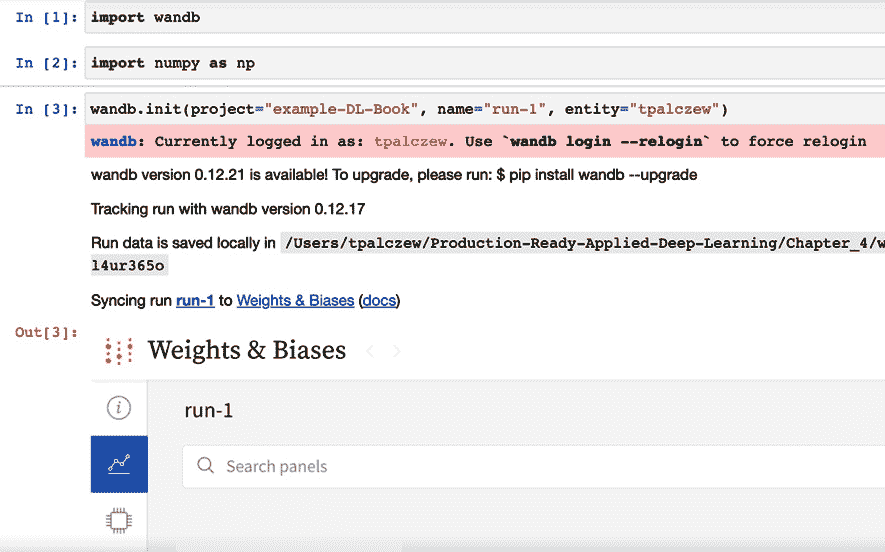
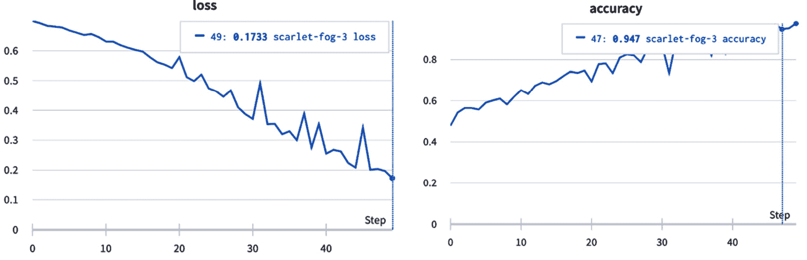

# 4

# 实验跟踪，模型管理和数据集版本控制

在本章中，我们将介绍一组用于实验跟踪、模型管理和数据集版本控制的实用工具，这些工具可以帮助您有效管理深度学习（DL）项目。本章讨论的工具可以帮助我们跟踪许多实验并更高效地解释结果，从而自然而然地减少运营成本并加速开发周期。通过本章，您将能够亲自体验最流行的工具，并能够为您的项目选择适当的工具集。

在本章中，我们将涵盖以下主要内容：

+   DL 项目跟踪概述

+   使用 Weights & Biases 进行 DL 项目跟踪

+   使用 MLflow 和 DVC 进行 DL 项目跟踪

+   数据集版本控制 – 超越 Weights & Biases, MLflow 和 DVC

# 技术要求

您可以从本书的 GitHub 仓库下载本章的补充材料，网址为[`github.com/PacktPublishing/Production-Ready-Applied-Deep-Learning/tree/main/Chapter_4`](https://github.com/PacktPublishing/Production-Ready-Applied-Deep-Learning/tree/main/Chapter_4)。

# DL 项目跟踪概述

训练 DL 模型是一个消耗大量时间和资源的迭代过程。因此，跟踪所有实验并始终有条理地组织它们可以防止我们浪费时间在无需重复训练相似模型的操作上。换句话说，有关所有模型架构及其超参数集合以及实验过程中使用的数据版本的详细记录可以帮助我们从实验中得出正确的结论，这自然而然地有助于项目的成功。

## DL 项目跟踪的组成部分

DL 项目跟踪的基本组成部分包括实验跟踪，模型管理和数据集版本控制。让我们详细看看每个组件。

### 实验跟踪

实验跟踪背后的概念很简单：存储每个实验的描述和动机，以便我们不为了相同目的再次运行一组实验。总体而言，有效的实验跟踪将节省我们运营成本，并允许我们从最小的实验结果集中得出正确的结论。有效实验跟踪的基本方法之一是为每个实验添加唯一标识符。我们需要跟踪每个实验的信息包括项目依赖关系、模型架构定义、使用的参数和评估指标。实验跟踪还包括实时可视化进行中的实验，并能够直观地比较一组实验。例如，如果我们可以检查模型训练过程中每个时期的训练和验证损失，我们可以更快地识别过拟合，从而节省一些资源。此外，通过比较两个实验之间的结果和一组变化，我们可以理解这些变化如何影响模型性能。

### 模型管理

模型管理不仅仅涵盖实验跟踪，还涵盖了模型的整个生命周期：数据集信息、工件（从训练模型生成的任何数据）、模型的实施、评估指标以及管道信息（如开发、测试、暂存和生产）。模型管理使我们能够快速选择感兴趣的模型，并有效地设置模型可用的环境。

### 数据集版本控制

DL 项目跟踪的最后一个组成部分是数据集版本控制。在许多项目中，数据集会随时间改变。这些变化可能来自数据模式（数据组织的蓝图）、文件位置，甚至是应用于数据集的筛选器，从而操作底层数据的含义。工业中发现的许多数据集结构复杂，并且通常以多种数据格式存储在多个位置。因此，变化可能比预期的更加显著和难以跟踪。因此，在记录这些变化方面至关重要，以在整个项目中复制一致的结果。

数据集跟踪可以总结如下：将存储为工件的一组数据，在基础数据修改时应成为工件的新版本。话虽如此，每个工件应具有元数据，其中包含关于数据集的重要信息：创建时间、创建者以及与上一版本的差异。

例如，应该如下制定具有数据集版本控制的数据集。数据集应在其名称中具有时间戳：

```py
dataset_<timestamp>
> metadata.json
> img1.png
> img2.png
> img3.png
```

正如前面所述，元数据应包含关于数据集的关键信息：

```py
{
   "created_by": "Adam"
   "created_on": "2022-01-01"
   "labelled_by": "Bob"
   "number_of_samples": 3
}
```

请注意，由元数据跟踪的信息集可能因项目而异。

## DL 项目跟踪工具

DL 跟踪可以通过多种方式实现，从简单的文本文件中的注释、电子表格，到在 GitHub 或专用网页上保存信息，再到自建平台和外部工具。模型和数据工件可以按原样存储，也可以应用更复杂的方法以避免冗余并提高效率。

DL 项目跟踪领域正在快速增长，并不断引入新工具。因此，为底层项目选择合适的工具并不容易。我们必须考虑业务和技术限制。尽管定价模型是基本的，但其他限制可能由现有的开发设置引入；集成现有工具应该很容易，基础设施必须易于维护。还要考虑 MLOps 团队的工程能力。话虽如此，在选择项目工具时，以下列表将是一个很好的起点。

+   TensorBoard ([`www.tensorflow.org/tensorboard`](https://www.tensorflow.org/tensorboard))：

    +   TensorFlow 团队开发的一款开源可视化工具。

    +   用于跟踪和可视化实验结果的标准工具。

+   Weights & Biases ([`wandb.ai`](https://wandb.ai/site/experiment-tracking))：

    +   一款云端服务，提供有效的交互式仪表板，用于可视化和组织实验结果。

    +   服务器可以在本地运行，也可以托管在私有云中。

    +   提供名为 Sweeps 的自动化超参数调整功能。

    +   个人项目免费。定价基于跟踪小时数和存储空间。

+   Neptune ([`neptune.ai`](https://neptune.ai/product))：

    +   用于监视和存储机器学习（ML）实验结果的在线工具。

    +   可轻松集成其他 ML 工具。

    +   以其强大的仪表板而闻名，实时总结实验结果。

+   MLflow ([`mlflow.org`](https://mlflow.org/docs/latest/tracking.html))：

    +   一个提供端到端 ML 生命周期管理的开源平台。

    +   它支持基于 Python 和 R 的系统。通常与**数据版本控制**（**DVC**）结合使用。

+   SageMaker Studio ([`aws.amazon.com/sagemaker/studio/`](https://aws.amazon.com/sagemaker/studio/))：

    +   一个基于 Web 的可视化界面，用于管理与 SageMaker 设置的 ML 实验。

    +   该工具允许用户通过提供与 AWS 的其他有用功能简单集成，高效地构建、训练和部署模型。

+   Kubeflow ([`www.kubeflow.org`](https://www.kubeflow.org/))：

    +   由 Google 设计的开源平台，用于端到端 ML 编排和管理。

    +   也设计用于将 ML 系统高效地部署到各种开发和生产环境中。

+   Valohai ([`valohai.com`](https://valohai.com/product/))：

    +   一款专为自动化机器编排、版本控制和数据管道管理而设计的 DL 管理平台。

    +   它并非免费软件，而是专为企业设计的

    +   它因技术不限和响应迅速的支持团队而日益受欢迎

在各种工具中，我们将介绍两种最常用的设置：Weights & Biases 和 MLflow 结合 DVC。

需记住的事项

a. DL 跟踪的基本组件包括实验跟踪、模型管理和数据集版本控制。近期的 DL 跟踪工具通常具有用户友好的仪表板，总结实验结果。

b. 该领域正在快速发展，并且有许多具有不同优势的工具。选择合适的工具需要理解业务和技术约束。

首先，让我们看看使用 **Weights & Biases** (**W&B**) 进行 DL 项目跟踪。

# 使用 Weights & Biases 进行 DL 项目跟踪

W&B 是一个实验管理平台，为模型和数据提供版本控制。

W&B 提供了一个交互式仪表板，可以嵌入到 Jupyter 笔记本中或用作独立的网页。简单的 Python API 也为简单集成打开了可能性。此外，其功能侧重于简化 DL 实验管理：记录和监控模型和数据版本、超参数值、评估指标、工件和其他相关信息。

W&B 的另一个有趣功能是其内置的超参数搜索功能称为 **Sweeps** ([`docs.wandb.ai/guides/sweeps`](https://docs.wandb.ai/guides/sweeps))。可以使用 Python API 轻松设置 Sweeps，并在 W&B 网页上交互比较结果和模型。

最后，W&B 会自动为您创建报告，直观地总结和组织一组实验（[`docs.wandb.ai/guides/reports`](https://docs.wandb.ai/guides/reports)）。

总体而言，W&B 的关键功能可以总结如下：

+   **实验跟踪和管理**

+   **工件管理**

+   **模型评估**

+   **模型优化**

+   **协同分析**

W&B 是一种订阅服务，但个人账户是免费的。

## 设置 W&B

W&B 拥有 Python API，为多种 DL 框架（包括 TensorFlow 和 PyTorch）提供简单的集成方法。记录的信息，如项目、团队和运行列表，可在线管理和查看，或者在自托管服务器上进行管理。

设置 W&B 的第一步是安装 Python API 并登录 W&B 服务器。您必须预先通过 [`wandb.ai`](https://wandb.ai) 创建一个账户：

```py
pip install wandb
wandb login
```

在您的 Python 代码中，您可以通过以下代码注册一个称为 `run-1` 的单个实验：

```py
import wandb
run_1 = wandb.init(project="example-DL-Book", name="run-1") 
```

更具体地说，`wandb.init` 函数在名为 `example-DL-Book` 的项目中创建了一个名为 `run_1` 的新 `wandb.Run` 实例。如果未提供名称，W&B 将为您生成一个随机的双字名称。如果项目名称为空，W&B 将将您的运行放入 `Uncategorized` 项目中。`wandb.init` 的所有参数列在 [`docs.wandb.ai/ref/python/init`](https://docs.wandb.ai/ref/python/init)，但我们想介绍您最常与之交互的参数：

+   `id` 为您的运行设置一个唯一的 ID

+   `resume` 允许您在不创建新运行的情况下恢复实验

+   `job_type` 允许您将运行分配给特定类型，例如训练、测试、验证、探索或任何其他可以用于分组运行的名称

+   `tags` 提供了额外的灵活性，用于组织您的运行

当触发 `wandb.init` 函数时，关于运行的信息将开始出现在 W&B 仪表板上。您可以在 W&B 网页或直接在 Jupyter 笔记本环境中监视仪表板，如下面的截图所示：



图 4.1 – Jupyter 笔记本环境中的 W&B 仪表板

创建运行后，您可以开始记录信息；`wandb.log` 函数允许您记录任何您想要的数据。例如，您可以通过在训练循环中添加 `wandb.log({"custom_loss": custom_loss})` 来记录损失。同样，您可以记录验证损失和任何其他您想要跟踪的详细信息。

有趣的是，W&B 通过为 DL 模型提供内置的日志记录功能，使这个过程变得更加简单。在撰写本文时，您可以找到大多数框架的集成，包括 Keras、PyTorch、PyTorch Lightning、TensorFlow、fast.ai、scikit-learn、SageMaker、Kubeflow、Docker、Databricks 和 Ray Tune（有关详细信息，请参见 [`docs.wandb.ai/guides/integrations`](https://docs.wandb.ai/guides/integrations)）。

`wandb.config` 是跟踪模型超参数的绝佳位置。对于来自实验的任何工件，您可以使用 `wandb.log_artifact` 方法（有关更多详细信息，请参见 [`docs.wandb.ai/guides/artifacts`](https://docs.wandb.ai/guides/artifacts)）。在记录工件时，您需要定义文件路径，然后指定您的工件的名称和类型，如以下代码片段所示：

```py
wandb.log_artifact(file_path, name='new_artifact', type='my_dataset')
```

然后，您可以重复使用已存储的工件，如下所示：

```py
run = wandb.init(project="example-DL-Book")
artifact = run.use_artifact('example-DL-Book/new_artifact:v0', type='my_dataset')
artifact_dir = artifact.download()
```

到目前为止，您已经学会了如何为您的项目设置 `wandb` 并在整个训练过程中单独记录您选择的指标和工件。有趣的是，`wandb` 为许多深度学习框架提供了自动日志记录。在本章中，我们将更详细地了解如何将 W&B 集成到 Keras 和 **PyTorch Lightning** (**PL**) 中。

### 将 W&B 集成到 Keras 项目中

在 Keras 的情况下，可以通过 `WandbCallback` 类实现集成。完整版本可以在本书的 GitHub 存储库中找到：

```py
import wandb
from wandb.keras import WandbCallback
from tensorflow import keras
from tensorflow.keras import layers
wandb.init(project="example-DL-Book", name="run-1")
wandb.config = {
   "learning_rate": 0.001,
   "epochs": 50,
   "batch_size": 128
}
model = keras.Sequential()
logging_callback = WandbCallback(log_evaluation=True)
model.fit(
   x=x_train, y=y_train,
   epochs=wandb.config['epochs'],
   batch_size=wandb.config['batch_size'], 
   verbose='auto', 
   validation_data=(x_valid, y_valid),
   callbacks=[logging_callback])
```

如前一节所述，关于模型的关键信息被记录并在 W&B 仪表板上可用。您可以监视损失、评估指标和超参数。*图 4.2* 展示了由前述代码自动生成的示例图：




图 4.2 – W&B 根据记录的指标生成的示例图

将 W&B 集成到 PL 项目中类似于将其集成到 Keras 项目中。

### 将 W&B 集成到 PyTorch Lightning 项目中

对于基于 PL 的项目，W&B 提供了自定义记录器，并隐藏了大部分样板代码。您只需要实例化 `WandbLogger` 类，并通过 `logger` 参数将其传递给 `Trainer` 实例：

```py
import pytorch_lightning as pl
from pytorch_lightning.loggers import WandbLogger
wandb_logger = WandbLogger(project="example-DL-Book")
trainer = Trainer(logger=wandb_logger)
class LitModule(LightningModule):
   def __init__(self, *args, **kwarg):
       self.save_hyperparameters()
   def training_step(self, batch, batch_idx):
       self.log("train/loss", loss)
```

关于集成的详细说明可在 [`pytorch-lightning.readthedocs.io/en/stable/extensions/generated/pytorch_lightning.loggers.WandbLogger.html`](https://pytorch-lightning.readthedocs.io/en/stable/extensions/generated/pytorch_lightning.loggers.WandbLogger.html) 找到。

需记住的事项

a. W&B 是一个实验管理平台，有助于跟踪模型和数据的不同版本。它还支持存储配置、超参数、数据和模型工件，并提供实时实验跟踪。

b. W&B 安装简便。它为多个 DL 框架提供了内置的集成功能，包括 TensorFlow 和 PyTorch。

c. 可以使用 W&B 进行超参数调优/模型优化。

虽然 W&B 在 DL 项目跟踪领域占据主导地位，但 MLflow 和 DVC 的组合是另一种流行的 DL 项目设置。

# 使用 MLflow 和 DVC 进行 DL 项目跟踪

MLflow 是一个流行的框架，支持跟踪技术依赖项、模型参数、指标和工件。MLflow 的关键组件如下：

+   **跟踪**：每次模型运行时跟踪结果变化

+   **项目**：它以可重现的方式打包模型代码

+   **模型**：它为未来便捷的部署组织模型工件

+   **模型注册表**：它管理 MLflow 模型的完整生命周期

+   **插件**：由于提供了灵活的插件，可以轻松集成其他 DL 框架

正如您可能已经注意到的那样，W&B 和 MLflow 之间存在一些相似之处。然而，在 MLflow 的情况下，每个实验都与一组 Git 提交关联。Git 并不会阻止我们保存数据集，但是在数据集较大时会显示出许多限制，即使使用了专为大文件构建的扩展（Git LFS）。因此，MLflow 通常与 DVC 结合使用，DVC 是一个解决 Git 限制的开源版本控制系统。

## 设置 MLflow

可以使用 `pip` 安装 MLflow：

```py
pip install mlflow
```

类似于 W&B，MLflow 还提供了一个 Python API，允许您跟踪超参数（`log_param`）、评估指标（`log_metric`）和工件（`log_artifacts`）：

```py
import os
import mlflow
from mlflow import log_metric, log_param, log_artifacts
log_param("epochs", 30)
log_metric("custom", 0.6)
log_metric("custom", 0.75) # metrics can be updated
if not os.path.exists("artifact_dir"):
   os.makedirs("artifact_dir")
with open("artifact_dir/test.txt", "w") as f:
   f.write("simple example")
log_artifacts("artifact_dir")
```

实验定义可以通过以下代码初始化并标记：

```py
exp_id = mlflow.create_experiment("DLBookModel_1")
exp = mlflow.get_experiment(exp_id)
with mlflow.start_run(experiment_id=exp.experiment_id, run_name='run_1') as run:
   # logging starts here
   mlflow.set_tag('model_name', 'model1_dev')
```

MLflow 提供了一系列教程，介绍了其 API：[`www.mlflow.org/docs/latest/tutorials-and-examples/tutorial.html`](https://www.mlflow.org/docs/latest/tutorials-and-examples/tutorial.html)。

现在您已经熟悉了 MLflow 的基本用法，我们将描述如何将其集成到 Keras 和 PL 项目中。

### 将 MLflow 集成到 Keras 项目中

首先，让我们看一下 Keras 的集成。通过 `log_model` 函数可以记录 Keras 模型的详细信息：

```py
history = keras_model.fit(...)
mlflow.keras.log_model(keras_model, model_dir)
```

`mlflow.keras` 和 `mlflow.tensorflow` 模块提供了一组 API，用于记录关于 Keras 和 TensorFlow 模型的各种信息。有关更多详细信息，请查看 [`www.mlflow.org/docs/latest/python_api/index.html`](https://www.mlflow.org/docs/latest/python_api/index.html)。

### 将 MLflow 集成到 PyTorch Lightning 项目中

类似于 W&B 支持 PL 项目的方式，MLflow 也提供了一个 `MLFlowLogger` 类。这可以传递给 `Trainer` 实例，用于在 MLflow 中记录模型详细信息：

```py
import pytorch_lightning as pl 
from pytorch_lightning import Trainer
from pytorch_lightning.loggers import MLFlowLogger
mlf_logger = MLFlowLogger(experiment_name="example-DL-Book ", tracking_uri="file:./ml-runs")
trainer = Trainer(logger=mlf_logger)
class DLBookModel(pl.LightningModule):
   def __init__(self):
       super(DLBookModel, self).__init__()
       ...
   def training_step(self, batch, batch_nb):
       loss = self.log("train_loss", loss, on_epoch=True)
```

在上述代码中，我们传递了一个 `MLFlowLogger` 实例来替换 PL 的默认记录器。`tracking_uri` 参数控制记录的数据去向。

关于 PyTorch 集成的其他详细信息可以在官方网站找到：[`pytorch-lightning.readthedocs.io/en/stable/api/pytorch_lightning.loggers.mlflow.html`](https://pytorch-lightning.readthedocs.io/en/stable/api/pytorch_lightning.loggers.mlflow.html)。

## 使用 DVC 设置 MLflow

要使用 DVC 管理大型数据集，需要使用诸如 `pip`、`conda` 或 `brew`（适用于 macOS 用户）之类的包管理器安装它：

```py
pip install dvc
```

所有的安装选项可以在 [`dvc.org/doc/install`](https://dvc.org/doc/install/) 找到。

使用 DVC 管理数据集需要按特定顺序执行一组命令：

1.  第一步是使用 DVC 设置一个 Git 仓库：

    ```py
    git init
    dvc init
    git commit -m 'initialize repo'
    ```

1.  现在，我们需要配置 DVC 的远程存储：

    ```py
    dvc remote add -d myremote /tmp/dvc-storage
    git commit .dvc/config -m "Added local remote storage"
    ```

1.  让我们创建一个样本数据目录，并填充一些示例数据：

    ```py
    mkdir data
    cp example_data.csv data/
    ```

1.  在这个阶段，我们已经准备好开始跟踪数据集了。我们只需要将文件添加到 DVC 中。此操作将创建一个额外的文件 `example_data.csv.dvc`。此外，`example_data.csv` 文件会自动添加到 `.gitignore` 中，使得 Git 不再跟踪原始文件：

    ```py
    dvc add data/example_data.csv
    ```

1.  接下来，您需要提交并上传 `example_data.csv.dvc` 和 `.gitignore` 文件。我们将我们的第一个数据集标记为 `v1`：

    ```py
    git add data/.gitignore data/example_data.csv.dvc
    git commit -m 'data tracking'
    git tag -a 'v1' -m 'test_data'
    dvc push
    ```

1.  使用 `dvc push` 命令后，我们的数据将在远程存储中可用。这意味着我们可以删除本地版本。要恢复 `example_data.csv`，只需简单地调用 `dvc pull`：

    ```py
    dvc pull data/example_data.csv.dvc
    ```

1.  当修改 `example_data.csv` 后，我们需要再次添加并推送以更新远程存储中的版本。我们将修改后的数据集标记为 `v2`：

    ```py
    dvc add data/example_data.csv
    git add data/example_data.csv.dvc
    git commit -m 'data modification description'
    git tag -a 'v2' -m 'modified test_data'
    dvc push
    ```

执行这些命令后，您将通过 Git 和 DVC 跟踪同一数据集的两个版本：`v1`和`v2`。

接下来，让我们看看如何将 MLflow 与 DVC 结合使用：

```py
import mlflow
import dvc.api
import pandas as pd
data_path='data/example_data.csv'
repo='/Users/BookDL_demo/'
version='v2'
data_url=dvc.api.get_url(path=path, repo=repo, rev=version)
# this will fetch the right version of our data file
data = pd.read_csv(data_url)
# log important information using mlflow
mlflow.start_run()
mlflow.log_param("data_url", data_url)
mlflow.log_artifact(...)
```

在前面的代码片段中，使用了`mlflow.log_artifact`来保存有关实验特定列的信息。

总体而言，我们可以通过 MLflow 运行多个实验，使用 DVC 跟踪不同版本的数据集。与 W&B 类似，MLflow 还提供一个网页，我们可以在其中比较我们的实验。您只需在终端中输入以下命令即可：

```py
mlflow ui 
```

这个命令将启动一个托管在[`127.0.0.1:5000`](http://127.0.0.1:5000)上的 Web 服务器，以下屏幕截图显示了 MLflow 仪表板：

![图 4.3 – MLflow 仪表板；新运行将显示在页面底部

![图 4.3 – MLflow 仪表板；新运行将显示在页面底部

图 4.3 – MLflow 仪表板；新运行将显示在页面底部

记住的事情

a. MLflow 可以跟踪依赖关系、模型参数、指标和工件。通常与 DVC 结合使用，以实现高效的数据集版本控制。

b. MLflow 可以轻松集成到包括 Keras、TensorFlow 和 PyTorch 在内的 DL 框架中。

c. MLflow 提供交互式可视化，可以同时分析多个实验。

到目前为止，我们已经学习了如何在 W&B、MLflow 和 DVC 中管理 DL 项目。在下一节中，我们将介绍用于数据集版本控制的流行工具。

# 数据集版本控制 – 超越 Weights & Biases、MLflow 和 DVC

在本章中，我们看到了如何通过 DL 项目跟踪工具管理数据集。在 W&B 的情况下，我们可以使用工件，而在 MLflow 和 DVC 的情况下，DVC 运行在 Git 存储库之上，以跟踪数据集的不同版本，从而解决了 Git 的限制。

是否还有其他对数据集版本控制有用的方法和/或工具？简单的答案是肯定的，但更精确的答案取决于具体的情况。为了做出正确的选择，您必须考虑多个方面，包括成本、易用性和集成难度。在本节中，我们将提及一些我们认为值得探索的工具，如果数据集版本控制是项目的关键组成部分：

+   **Neptune** ([`docs.neptune.ai`](https://docs.neptune.ai/)) 是一个用于 MLOps 的元数据存储。Neptune 工件允许在本地或云中存储的数据集上进行版本控制。

+   **Delta Lake** ([`delta.io`](https://delta.io/)) 是一个在数据湖顶层运行的开源存储抽象。Delta Lake 与 Apache Spark API 配合使用，并使用分布式处理来提高吞吐量和效率。

记住的事情

a. 市场上有许多数据版本控制工具。要选择合适的工具，您必须考虑多个方面，包括成本、易用性和集成难度。

b. 诸如 W&B、MLflow、DVC、Neptune 和 Delta Lake 的工具可以帮助您进行数据集版本控制。

至此，我们介绍了数据集版本控制的流行工具。适合的工具因项目而异。因此，在将任何工具集成到您的项目之前，您必须评估每个工具的利弊。

# 摘要

由于深度学习项目涉及多次模型训练和评估迭代，有效管理实验、模型和数据集可以帮助团队更快地实现目标。在本章中，我们探讨了两种最流行的深度学习项目跟踪设置：W&B 和与 DVC 集成的 MLflow。这两种设置都内置支持 Keras 和 PyTorch，这两个最流行的深度学习框架。我们还花了一些时间描述了更加强调数据集版本控制的工具：Neptune 和 Delta Lake。请记住，您必须仔细评估每个工具，以选择适合您项目的正确工具。

目前为止，您已经熟悉了构建概念验证和训练必要深度学习模型的框架和流程。从下一章开始，我们将讨论如何通过将深度学习管道的各个组件移至云端来实现规模化。
