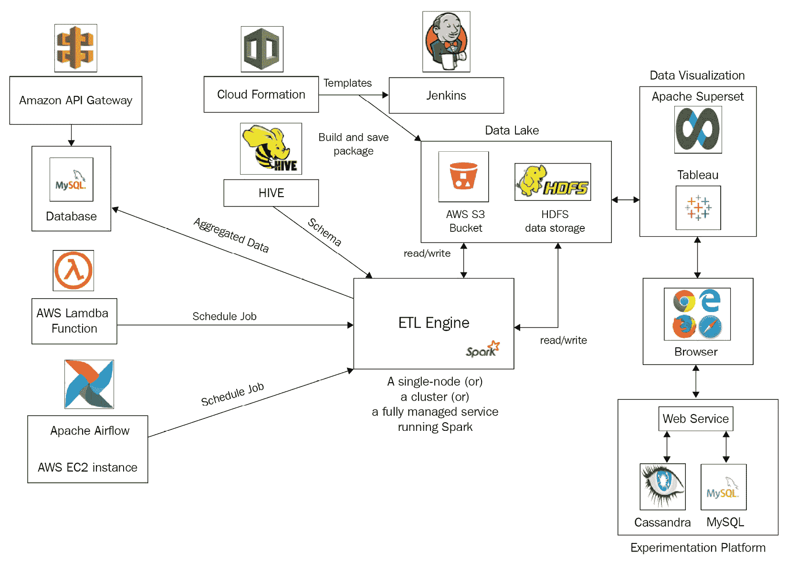

# 第五章：云中的数据准备

在本章中，我们将学习如何通过利用各种 AWS 云服务在云中设置数据准备。考虑到在数据准备中的抽取、转换和加载（ETL）操作的重要性，我们将深入研究如何以成本效益的方式设置和调度 ETL 作业。我们将涵盖四种不同的设置：在单节点 EC2 实例和 EMR 集群上运行 ETL，然后利用 Glue 和 SageMaker 进行 ETL 作业。本章还将介绍 Apache Spark，这是最流行的 ETL 框架。通过完成本章，您将能够利用所提供的不同设置的优势，并为项目选择合适的工具集。

本章将涵盖以下主要主题：

+   云中的数据处理

+   Apache Spark 简介

+   设置单节点 EC2 实例用于 ETL

+   设置用于 ETL 的 EMR 集群

+   创建用于 ETL 的 Glue 作业

+   利用 SageMaker 进行 ETL

# 技术要求

您可以从本书的 GitHub 存储库下载本章的补充材料：[`github.com/PacktPublishing/Production-Ready-Applied-Deep-Learning/tree/main/Chapter_5`](https://github.com/PacktPublishing/Production-Ready-Applied-Deep-Learning/tree/main/Chapter_5)。

# 云中的数据处理

深度学习（DL）项目的成功取决于数据的质量和数量。因此，用于数据准备的系统必须稳定且可扩展，以有效地处理 TB 和 PB 级数据。这通常需要不止一台机器；必须设置一组运行强大的 ETL 引擎的机器集群，以便存储和处理大量数据。

首先，我们想介绍 ETL，即云中数据处理的核心概念。接下来，我们将概述用于数据处理的分布式系统设置。

## ETL 简介

*在整个 ETL 过程中，数据将从一个或多个来源收集，根据需要转换为不同的形式，并保存在数据存储中。* 简而言之，ETL 本身涵盖了整个数据处理管道。ETL 在整个过程中与三种不同类型的数据交互：**结构化**、**非结构化**和**半结构化**。结构化数据表示具有模式的数据集（例如表），非结构化数据没有明确定义的显式模式（例如文本、图像或 PDF 文件），而半结构化数据在数据本身内部具有部分结构（例如 HTML 或电子邮件）。

流行的 ETL 框架包括**Apache Hadoop** ([`hadoop.apache.org`](https://hadoop.apache.org/))，**Presto** ([`prestodb.io`](https://prestodb.io/))，**Apache Flink** ([`flink.apache.org`](https://flink.apache.org/))和**Apache Spark** ([`spark.apache.org`](https://spark.apache.org/))。Hadoop 是最早利用分布式处理优势的数据处理引擎之一。Presto 专门用于处理 SQL 中的数据，而 Apache Flink 则专注于处理流数据。在这四个框架中，Apache Spark 是最流行的工具，因为它可以处理各种数据类型。*Apache Spark 利用内存数据处理来增加吞吐量*，并提供比 Hadoop 更可扩展的数据处理解决方案。此外，它可以轻松集成其他 ML 和 DL 工具。因此，我们在本书中主要关注 Spark。

## 数据处理系统架构

为数据处理系统设置环境并不是一项简单的任务，因为它涉及定期获取高端机器、正确链接各种数据处理软件，并确保在发生故障时不丢失数据。因此，许多公司利用云服务，这是一种通过互联网按需提供的各种软件服务。虽然许多公司提供各种云服务，但**亚马逊云服务** (**AWS**)以其稳定且易于使用的服务脱颖而出。

为了让您对现实生活中的数据处理系统有一个更广泛的了解，让我们看一个基于 AWS 服务的样例系统架构。这个系统的*核心组件*是开源的*Apache Spark*，执行主要的 ETL 逻辑。一个典型的系统还包括用于调度个别作业、存储数据和可视化处理后数据的组件：



图 5.1 – 数据处理管道的通用架构，同时包括可视化和实验平台

让我们逐个看看这些组件：

+   **数据存储**：数据存储负责保存数据和相关的元数据：

    +   **Hadoop 分布式文件系统** (**HDFS**)：开源的 HDFS 是一个*可按需扩展的分布式文件系统* ([`hadoop.apache.org`](https://hadoop.apache.org/docs/r1.2.1/hdfs_design.html))。HDFS 一直是数据存储的传统选择，因为 Apache Spark 和 Apache Hadoop 在 HDFS 上表现最佳。

    +   **Amazon Simple Storage Service (S3)**: 这是 AWS 提供的*数据存储服务*（[`aws.amazon.com/s3`](https://aws.amazon.com/s3/)）。S3 使用对象和存储桶的概念，其中对象指单个文件，存储桶指对象的容器。对于每个项目或子模块，您可以创建一个存储桶，并为读写操作配置不同的权限。存储桶还可以对数据应用版本控制，跟踪更改记录。

+   `ml`，成本大约比其他 EC2 实例高 30%到 40%（[`aws.amazon.com/sagemaker/pricing`](https://aws.amazon.com/sagemaker/pricing/)）。在*利用 SageMaker 进行 ETL*部分，我们将描述如何在 EC2 实例上设置 SageMaker 进行 ETL 流程。

考虑到需要处理的数据量，正确选择的 ETL 服务以及适当的数据存储选择可以显著提高管道的效率。需要考虑的关键因素包括数据源、数据量、可用的硬件资源和可伸缩性等。

+   **Scheduling**: 经常需要定期运行 ETL 作业（例如每天、每周或每月），因此需要调度器：

    +   **AWS Lambda functions**: Lambda 函数（[`aws.amazon.com/lambda`](https://aws.amazon.com/lambda/)）旨在在 EMR 上运行作业，无需提供或管理基础设施。执行时间可以动态配置；作业可以立即运行，也可以计划在不同时间运行。*AWS Lambda 函数以无服务器方式运行代码，因此无需维护*。如果执行期间出现错误，EMR 集群将自动关闭。

    +   **Airflow**: 调度器在自动化 ETL 过程中发挥重要作用。Airflow（[`airflow.apache.org`](https://airflow.apache.org/)）*是数据工程师使用的最流行的调度框架之一*。Airflow 的**有向无环图**（**DAG**）可用于定期调度管道。Airflow 比 AWS Lambda 函数更常见，用于定期运行 Spark 作业，因为 Airflow 在前面的执行失败时可以轻松地回填数据。

+   **Build**: Build 是将代码包部署到 AWS 计算资源（如 EMR 或 EC2）或根据预定义规范设置一组 AWS 服务的过程：

    +   **CloudFormation**: CloudFormation 模板（[`aws.amazon.com/cloudformation`](https://aws.amazon.com/cloudformation/)）*帮助以代码形式配置云基础设施*。CloudFormation 通常用于执行特定任务，比如创建 EMR 集群、准备具体规格的 S3 存储桶或终止正在运行的 EMR 集群。它有助于标准化重复性任务。

    +   **Jenkins**：Jenkins ([`www.jenkins.io`](https://www.jenkins.io/)) 构建用 Java 和 Scala 编写的可执行文件。我们使用 Jenkins 构建 Spark 流水线工件（例如.jar 文件）并部署到 EMR 节点。Jenkins 还利用 CloudFormation 模板以标准化方式执行任务。

+   **数据库（Database）**：数据存储与数据库的关键区别在于数据库用于存储结构化数据。在这里，我们将讨论两种流行的数据库类型：*关系数据库*和*键-值存储数据库*。我们将描述它们的区别，并解释适当的使用案例。

    +   **关系数据库（Relational databases）**：*关系数据库以表格格式存储带有模式的结构化数据*。以结构化方式存储数据的主要优点来自于数据管理；存储的数据值受到严格控制，保持值的一致格式。这使得数据库能够在存储和检索特定数据集时进行额外的优化。ETL 作业通常从一个或多个数据存储服务中读取数据，处理数据，并将处理后的数据存储在关系数据库中，例如**MySQL** ([`www.mysql.com`](https://www.mysql.com/)) 和 **PostgreSQL** ([`www.postgresql.org`](https://www.postgresql.org/))。AWS 还提供关系数据库服务，例如**Amazon RDS** ([`aws.amazon.com/rds`](https://aws.amazon.com/rds/))。

    +   **键-值存储数据库（Key-value storage databases）**：与传统的关系数据库不同，这些是*专为高频率读写操作优化的数据库*。这些数据库以独特的键-值对方式存储数据。一般来说，数据由一组键和一组值组成，每个键持有各自的属性。许多数据库支持模式，但它们的主要优势在于它们也支持非结构化数据。换句话说，您可以存储任何数据，即使每个数据具有不同的结构。这类数据库的流行例子包括**Cassandra** ([`cassandra.apache.org`](https://cassandra.apache.org/)) 和 **MongoDB** ([`www.mongodb.com`](https://www.mongodb.com/))。有趣的是，AWS 提供了一个称为**DynamoDB**的键-值存储数据库服务 ([`aws.amazon.com/dynamodb`](https://aws.amazon.com/dynamodb))。

+   **元数据存储库（Metastore）**：在某些情况下，最初收集和存储的数据集可能缺少关于自身的任何信息：例如，可能缺少列类型或关于数据源的详细信息。当工程师们管理和处理数据时，这些信息通常对他们有所帮助。因此，工程师们引入了*元数据存储库*的概念。这是一个存储元数据的仓库。存储为表格的元数据提供了数据指向的位置、模式以及更新历史。

在 AWS 的情况下，**Glue Data Catalog** 充当元数据存储库的角色，为 S3 提供内置支持。而 Hive ([`hive.apache.org`](https://hive.apache.org/)) 则是一个针对 HDFS 的开源元数据存储库。Hive 的主要优势来自于数据查询、汇总和分析，这些功能天然支持基于类 SQL 语言的交互。

+   **应用程序编程接口** (**API**) **服务**：*API 端点允许数据科学家和工程师有效地与数据进行交互*。例如，可以设置 API 端点以便轻松访问存储在 S3 存储桶中的数据。许多框架专为 API 服务而设计。例如，**Flask API** ([`flask.palletsprojects.com`](https://flask.palletsprojects.com/)) 和 **Django** ([`www.djangoproject.com`](https://www.djangoproject.com/)) 框架基于 Python，而 **Play** 框架 ([`www.playframework.com`](https://www.playframework.com/)) 则经常用于 Scala 项目。

+   **实验平台**：在生产中评估系统性能通常通过一种称为 A/B 测试的流行用户体验研究方法来实现。*通过部署系统的两个不同版本并比较用户体验，A/B 测试使我们能够了解最近的更改是否对系统产生了积极影响*。一般来说，设置 A/B 测试涉及两个组成部分：

    +   **Rest API**：*Rest API 在处理带有不同参数的请求和返回经过处理的数据方面提供了更大的灵活性*。因此，通常会设置一个 Rest API 服务，从数据库或数据存储中聚合必要的数据以供分析目的，并以 JSON 格式提供数据给 A/B 实验平台。

    +   **A/B 实验平台**：数据科学家通常使用一个带有**图形用户界面** (**GUI**) 的应用程序安排各种 A/B 测试实验，并直观地可视化聚合数据进行分析。GrowthBook ([`www.growthbook.io`](https://www.growthbook.io/)) 是这类平台的开源示例。

+   **数据可视化工具**: 公司内的几个团队和组别（例如市场营销、销售和高管团队）可以从直观地可视化数据中受益。数据可视化工具通常支持创建自定义仪表板，有助于数据分析过程。Tableau ([`www.tableau.com`](https://www.tableau.com/)) 是项目领导者中广受欢迎的工具，但它是专有软件。另一方面，Apache Superset ([`superset.apache.org`](https://superset.apache.org/)) 是一款开源数据可视化工具，支持大多数标准数据库。如果担心管理成本，可以配置 Apache Superset 来读取和绘制使用无服务器数据库（例如 AWS Athena ([`aws.amazon.com/athena`](https://aws.amazon.com/athena/))）存储的数据的可视化图表。

+   **身份访问管理** (**IAM**): IAM 是一种权限系统，用于管理对 AWS 资源的访问。通过 IAM，可以控制用户可以访问的一组资源以及他们可以对提供的资源执行的一组操作。有关 IAM 的更多详细信息，请访问 [`aws.amazon.com/iam`](https://aws.amazon.com/iam)。

记住的事情

a. 在整个 ETL 过程中，数据将从一个或多个源收集，根据需要转换为不同的形式，并保存到数据存储或数据库中。

b. Apache Spark 是一款开源的 ETL 引擎，广泛用于处理各种类型的大量数据：结构化、非结构化和半结构化数据。

c. 为数据处理作业设置的典型系统包括各种组件，包括数据存储、数据库、ETL 引擎、数据可视化工具和实验平台。

d. ETL 引擎可以在多种设置中运行 - 单机器、集群、完全托管的云端 ETL 服务以及为深度学习项目设计的端到端服务。

在接下来的部分，我们将介绍 Apache Spark 的关键编程概念，这是最流行的 ETL 工具。

# Apache Spark 简介

Apache Spark 是一个开源的数据分析引擎，用于数据处理。最流行的用例是 ETL。作为 Spark 的介绍，我们将涵盖围绕 Spark 的关键概念以及一些常见的 Spark 操作。具体来说，我们将从介绍**弹性分布式数据集**（**RDDs**）和 DataFrames 开始。然后，我们将讨论用于 ETL 任务的 Spark 基础知识：如何从数据存储加载数据集合，应用各种转换，并存储处理后的数据。Spark 应用可以使用多种编程语言实现：Scala、Java、Python 和 R。在本书中，我们将使用 Python，以便与其他实现保持一致。本节中的代码片段可以在本书的 GitHub 代码库中找到：[`github.com/PacktPublishing/Production-Ready-Applied-Deep-Learning/tree/main/Chapter_5/spark`](https://github.com/PacktPublishing/Production-Ready-Applied-Deep-Learning/tree/main/Chapter_5/spark)。我们在示例中使用的数据集包括 Google Scholar 和我们在 *第二章* *深度学习项目的数据准备* 中爬取的 COVID 数据集，以及由纽约时报提供的另一个 COVID 数据集（[`github.com/nytimes/covid-19-data`](https://github.com/nytimes/covid-19-data)）。我们将最后一个数据集称为 NY Times COVID。

## 弹性分布式数据集和 DataFrames

Spark 的独特优势来自于 RDDs，即不可变的分布式数据对象集合。通过利用 RDDs，Spark 能够高效处理利用并行性的数据。Spark 内置的操作基于 RDDs 的并行处理有助于数据处理，即使其中一个或多个处理器失败。当触发 Spark 作业时，输入数据的 RDD 表示会被分割成多个分区，并分发到每个节点进行转换，从而最大化吞吐量。

类似于 pandas 的 DataFrames，Spark 也有 DataFrames 的概念，它们表示关系数据库中的表，具有命名列。DataFrame 也是一个 RDD，因此我们在下一节描述的操作也可以应用于它们。DataFrame 可以从结构化为表格的数据创建，例如 CSV 数据、Hive 中的表或现有的 RDDs。DataFrame 包含 RDD 不提供的模式。因此，RDD 用于非结构化和半结构化数据，而 DataFrame 用于结构化数据。

### 在 RDDs 和 DataFrames 之间转换

任何 Spark 操作的第一步是创建一个 `SparkSession` 对象。具体来说，使用 `pyspark.sql` 中的 `SparkSession` 模块创建 `SparkSession` 对象。如下所示，使用该模块中的 `getOrCreate` 函数创建会话对象。`SparkSession` 对象是 Spark 应用程序的入口点。它提供了在不同上下文（如 Spark 上下文、Hive 上下文和 SQL 上下文）下与 Spark 应用程序交互的方式：

```py
from pyspark.sql import SparkSession
spark_session = SparkSession.builder\
        .appName("covid_analysis")\
        .getOrCreate()
```

将 RDD 转换为 DataFrame 很简单。鉴于 RDD 没有任何模式，因此可以如下创建一个没有模式的 DataFrame：

```py
# convert to df without schema
df_ri_freq = rdd_ri_freq.toDF() 
```

要将 RDD 转换为具有模式的 DataFrame，您需要使用`pyspark.sql.types`模块中的`StructType`类。一旦使用`StructType`方法创建了模式，就可以使用 Spark 会话对象的`createDataFrame`方法将 RDD 转换为 DataFrame：

```py
from pyspark.sql.types import StructType, StructField, StringType, IntegerType
# rdd for research interest frequency data
rdd_ri_freq = ... 
# convert to df with schema
schema = StructType(
          [StructField("ri", StringType(), False), 
           StructField("frequency", IntegerType(), False)])
df = spark.createDataFrame(rdd_ri_freq, schema)
```

现在我们已经学会如何在 Python 中设置 Spark 环境，让我们学习如何将数据集加载为 RDD 或 DataFrame。

## 加载数据

Spark 可以加载存储在各种数据存储中的不同格式的数据。加载存储在 CSV 格式中的数据是 Spark 的基本操作。可以使用`spark_session.read.csv`函数轻松实现这一点。它将本地或云端（如 S3 桶中）的 CSV 文件读取为 DataFrame。在下面的代码片段中，我们正在加载存储在 S3 中的 Google Scholar 数据。可以使用`header`选项指示 CSV 文件包含标题行：  

```py
# datasets location
google_scholar_dataset_path = "s3a://my-bucket/dataset/dataset_csv/dataset-google-scholar/output.csv"
# load google scholar dataset
df_gs = spark_session. \
        .read \
        .option("header", True) \
        .csv(google_scholar_dataset_path)
```

下图显示了`df_gs.show(n=3)`的结果。`show`函数打印了前*n*行以及列标题：


图 5.2 – 通过加载 CSV 文件创建的样本 DataFrame

同样地，可以使用`SparkSession`模块的`read.json`函数读取数据存储中的 JSON 文件：

```py
# loada json file
json_file_path="s3a://my-bucket/json/cities.json"
df = spark_session.read.json(json_file_path)
```

在下一节中，我们将学习如何使用 Spark 操作处理加载的数据。

## 使用 Spark 操作处理数据

Spark 提供了一组操作，可以将 RDD 转换为不同结构的 RDD。实现 Spark 应用程序是在 RDD 上链接一组 Spark 操作以将数据转换为目标格式的过程。在本节中，我们将讨论最常用的操作 – 即`filter`、`map`、`flatMap`、`reduceByKey`、`take`、`groupBy`和`join`。

### 过滤器

在大多数情况下，通常首先应用过滤器以丢弃不必要的数据。对 DataFrame 应用`filter`方法可以帮助您从给定的 DataFrame 中选择感兴趣的行。在下面的代码片段中，我们使用这种方法仅保留`research_interest`不为`None`的行：

```py
# research_interest cannot be None
df_gs_clean = df_gs.filter("research_interest != 'None'")
```

### map

与其他编程语言中的`map`函数类似，Spark 中的`map`操作将给定函数应用于每个数据条目。在这里，我们使用`map`函数仅保留`research_interest`列：

```py
# we are only interested in research_interest column
rdd_ri = df_gs_clean.rdd.map(lambda x: (x["research_interest"]))
```

### flatMap

`flatMap`函数在对每个条目应用给定函数后展开 RDD，并返回新的 RDD。在本例中，`flatMap`操作使用`##`分隔符拆分每个数据条目，然后创建具有值为`1`的默认频率的`research_interest`对：

```py
# raw research_interest data into pairs of research area and a frequency count
rdd_flattened_ri = rdd_ri.flatMap(lambda x: [(w.lower(), 1) for w in x.split('##')])
```

### reduceByKey

`reduceByKey`基于其键对输入 RDD 进行分组。在这里，我们使用`reduceByKey`来对频率进行求和，以了解每个`research_interest`的出现次数：

```py
# The pairs are grouped based on research area and the frequencies are summed up
rdd_ri_freq = rdd_flattened_ri.reduceByKey(add)
```

### `take`

Spark 的基本操作之一是`take`。此函数用于从 RDD 中获取前*n*个元素：

```py
# we are interested in the first 5 entries
rdd_ri_freq_5 = rdd_ri_freq.take(5)
```

### 分组操作

分组的概念是将 DataFrame 中相同的数据条目收集到组中，并对这些组执行聚合（例如平均值或求和）。

例如，让我们使用 Moderna COVID 数据集通过`groupby`操作获取每个司法管辖区（州）分配的平均剂量数。在这里，我们使用`sort`函数对州级平均剂量进行排序。`toDF`和`alias`函数可以帮助为新 DataFrame 添加名称：

```py
# calculate average number of 1st corona vaccine per jurisdiction (state)
df_avg_1 = df_covid.groupby("jurisdiction")\
  .agg(F.avg("_1st_dose_allocations")
  .alias("avg"))\
  .sort(F.col("avg").desc())\
  .toDF("state", "avg")
```

在应用`groupby`时，可以在单个命令中应用多个聚合（`sum`和`avg`）。从聚合函数（如`F.avg`或`F.sum`）创建的列可以使用`alias`重命名。在以下示例中，正在对 Moderna COVID 数据集执行聚合操作，以获取第一剂和第二剂的平均数和总数：

```py
# At jurisdiction (state) level, calculate at average weekly 1st & 2nd dose vaccine distribution. Similarly calculate sum for 1st and 2nd dose
df_avg = df_covid.groupby(F.lower("jurisdiction").alias("state"))\
  .agg(F.avg("_1st_dose_allocations").alias("avg_1"), \
       F.avg("_2nd_dose_allocations").alias("avg_2"), \
       F.sum("_1st_dose_allocations").alias("sum_1"), \
       F.sum("_2nd_dose_allocations").alias("sum_2")
       ) \
  .sort(F.col("avg_1").desc())
```

使用`groupby`函数在州级别执行计算。该数据集总共包含 63 个州，包括某些实体（联邦机构）作为州。

### `join`

`join`功能有助于组合来自两个 DataFrame 的行。

为了演示如何使用`join`，我们将 Moderna COVID 数据集与 NY Times COVID 数据集进行连接。在解释任何`join`操作之前，我们必须像之前处理 Moderna COVID 数据集一样，在 NY Times COVID 数据集上应用聚合。在以下代码片段中，正在应用`groupby`操作以州级别获取聚合（`sum`）值，代表总死亡人数和总病例数：

```py
# at jurisdiction (state) level, calculate total number of deaths and total number of cases
df_cases = df_covid2 \
          .groupby(F.lower("state").alias("state")) \
          .agg(F.sum("deaths").alias("sum_deaths"), \
               F.sum("cases").alias("sum_cases"))
```

*Figure 5.3* 显示了`df_cases.show(n=3)`操作的结果，可视化处理后 DataFrame 的前三行：

![Figure 5.3 – 使用 df_inner.show(n=3)操作的输出结果![Figure 5.3 – 聚合结果的前三行 Figure 5.3 – 可视化处理后 DataFrame 的前三行结果现在我们准备演示两种类型的连接：equi-join 和左连接。#### Equi-join（内连接）`Equi-join`，也称为内连接，是 Spark 中默认的`join`操作。内连接用于在两个 DataFrame 之间基于共同列值进行连接。在最终的 DataFrame 中，键不匹配的行将被丢弃。在本例中，将应用 equi-join 到`state`列，作为 Moderna COVID 数据集和 NY Times COVID 数据集之间的共同列。第一步是使用`alias`为 DataFrame 创建别名。然后，在一个 DataFrame 上调用`join`函数，同时传递另一个 DataFrame 来定义列关系和连接类型：```py# creating an alias for each DataFramedf_moderna = df_avg.alias("df_moderna")df_ny = df_cases.alias("df_ny")df_inner = df_moderna.join(df_ny, F.col("df_moderna.state") == F.col("df_ny.state"), 'inner')```下面是`df_inner.show(n=3)`操作的输出：

图 5.4 – 使用`df_inner.show(n=3)`操作的输出

现在，让我们看看另一种类型的连接，左连接。

#### 左连接

左连接是另一种用于数据分析的`join`操作。左连接返回来自一个 DataFrame 的所有行，不管在另一个 DataFrame 上是否找到匹配项。当`join`表达式不匹配时，它会为缺失的条目分配`null`。

左连接语法类似于等值连接。唯一的区别在于，在指定连接类型时，您需要使用`left`关键字而不是`inner`。左连接获取第一个 DataFrame（`df_m`）中提到的指定列（`df_m.state`）的所有值。然后，它试图在第二个提到的 DataFrame（`df_ny`）中的指定列（`df_ny.state`）上匹配条目。在本例中，如果某个特定状态在两个 DataFrame 中都出现，则`join`操作的输出将是该状态及来自两个 DataFrame 的值。如果某个特定状态仅在第一个 DataFrame（`df_m`）中可用，而不在第二个 DataFrame（`df_ny`）中，则它将添加该状态及第一个 DataFrame 的值，保留其他条目为`null`：

```py
# join results in all rows from the left table. Missing entries from the right table will result in "null"
df_left = df_moderna.join(df_ny, F.col("df_m.state") == F.col("df_ny.state"), 'left')
```

使用`df_left.show(n=3`)命令的输出如下所示：


图 5.5 – 使用`df_inner.show(n=3)`操作的输出

尽管 Spark 提供了广泛的操作来涵盖不同的用例，但由于逻辑复杂性，构建自定义操作可能更有用。

## 使用用户定义函数处理数据

**用户定义函数**（**UDF**）*是一种可重复使用的自定义函数，用于对 RDD 执行转换*。UDF 函数可以在多个 DataFrame 上重复使用。在本节中，我们将提供一个完整的代码示例，用于使用 UDF 处理 Google Scholar 数据集。

首先，我们想介绍`pyspark.sql.function`模块，它允许您使用`udf`方法定义 UDF，并提供各种基于列的操作。`pyspark.sql.function`还包括用于聚合的函数，如用于计算平均值和总和的`avg`或`sum`：

```py
import pyspark.sql.functions as F
```

在 Google Scholar 数据集中，`data_science`，`artificial_intelligence`和`machine_learning`都指向相同的`research_interest`数据领域，并检查是否可以将任何数据归类为 AI。如果找到匹配项，则在新列中放置`1`值。否则，将分配`0`。UDF 的结果使用`withColumn`方法存储在名为`is_artificial_intelligence`的新列中。在以下代码片段中，`@F.udf`注解通知 Spark 该函数是一个 UDF。`pyspark.sql.functions`中的`col`方法经常用于将列作为 UDF 的参数传递。在这里，`F.col("research_interest")`已传递给 UDF `is_ai`方法，指示该 UDF 应操作的列：

```py
# list of research_interests that are under same domain
lst_ai  = ["data_science", "artificial_intelligence",
           "machine_learning"]
@F.udf
def is_ai(research):
    """ return 1 if research in AI domain else 0"""
    try:
      # split the research interest with delimiter "##"  
      lst_research = [w.lower() for w in str(research).split("##")]
      for res in lst_research:
        # if present in AI domain
        if res in lst_ai:
          return 1
      # not present in AI domain
      return 0
    except:
      return -1
# create a new column "is_artificial_intelligence"
df_gs_new = df_gs.withColumn("is_artificial_intelligence",\ is_ai(F.col("research_interest")))
```

在处理原始数据后，我们希望将其存储在数据存储中，以便可以为其他目的重复使用。

## 导出数据

在本节中，我们将学习如何将 DataFrame 保存到 S3 存储桶中。对于 RDD，必须将其转换为 DataFrame 才能适当保存。

通常，数据分析师希望将聚合数据写入 CSV 文件以进行后续操作。要将 DataFrame 导出为 CSV 文件，必须使用 `df.write.csv` 函数。对于文本值，建议使用 `option("quoteAll", True)`，这将用引号括起每个值。

在以下示例中，我们提供了一个 S3 路径来生成 S3 存储桶中的 CSV 文件。使用 `coalesce(1)` 以写入单个 CSV 文件而不是多个 CSV 文件：

```py
S3_output_path = "s3a:\\my-bucket\output\vaccine_state_avg.csv"
# writing a DataFrame as a CSVfile
sample_data_frame.\
        .coalesce(1) \
        .write \
        .mode("overwrite") \
        .option("header", True) \
        .option("quoteAll",True) \
        .csv(s3_output_path)
```

如果要将 DataFrame 保存为 JSON 文件，可以使用 `write.json`：

```py
S3_output_path = "s3a:\\my-bucket\output\vaccine_state_avg.json"
# Writing a DataFrame as a json file
sample_data_frame \
        .write \
        .json(s3_output_path)
```

此时，您应该看到一个文件已存储在 S3 存储桶中。

需记住的事项

a. RDD 是一个不可变的分布式集合，被分割成多个分区并在集群的不同节点上计算。

b. Spark DataFrame 相当于关系数据库中的表，具有命名列。

c. Spark 提供了一系列操作，可以将一个 RDD 转换为具有不同结构的另一个 RDD。实现 Spark 应用程序是在 RDD 上链接一系列 Spark 操作，将数据转换为目标格式的过程。您可以使用 UDF 构建自定义的 Spark 操作。

在本节中，我们描述了 Apache Spark 的基础知识，这是最常用的 ETL 工具。从下一节开始，我们将讨论如何在云中为 ETL 设置 Spark 作业。首先，让我们看看如何在单个 EC2 实例上运行 ETL。

# 为 ETL 设置单节点 EC2 实例

EC2 实例可以具有各种 CPU/GPU、内存、存储和网络容量的组合。您可以在官方文档中找到 EC2 的可配置选项：[`aws.amazon.com/ec2/instance-types`](https://aws.amazon.com/ec2/instance-types)。

创建 EC2 实例时，可以选择预定义的 Docker 镜像来运行各种项目。这些称为**Amazon Machine Images**（**AMIs**）。例如，有一个安装了 TF 版本 2 用于 DL 项目的镜像，以及一个为通用 ML 项目设置了 Anaconda 的镜像，如下截图所示。有关完整的 AMI 列表，请参阅 [`docs.aws.amazon.com/AWSEC2/latest/UserGuide/AMIs.html`](https://docs.aws.amazon.com/AWSEC2/latest/UserGuide/AMIs.html)：


图 5.6 – 选择 EC2 实例的 AMI

AWS 提供了用于 DL 项目的**Deep Learning AMIs**（**DLAMIs**），这些 AMIs 是专为 DL 项目创建的；这些镜像利用不同的 CPU 和 GPU 配置以及不同的计算架构（[`docs.aws.amazon.com/dlami/latest/devguide/options.html`](https://docs.aws.amazon.com/dlami/latest/devguide/options.html)）。

如在 *第一章* 中提到的 *深度学习驱动项目的有效规划*，许多数据科学家利用 EC2 实例开发他们的算法，利用动态资源分配的灵活性。创建 EC2 实例并安装 Spark 的步骤如下：

1.  创建一个 **虚拟专用网络**（**VPN**），以限制访问 EC2 实例以增强安全性。

1.  使用 EC2 密钥对创建一个 `.pem` 密钥。 `.pem` 文件用于在用户尝试从终端登录 EC2 实例时执行身份验证。

1.  使用包含所需工具和包的 Docker 镜像创建 EC2 实例。

1.  添加一个入站规则，允许从本地终端访问新实例。

1.  使用 SSH 访问 EC2 实例，并使用在 *第 2 步* 中创建的 `.pem` 文件。

1.  启动 Spark shell。

我们为每个步骤提供了详细的描述和屏幕截图，位于 [`github.com/PacktPublishing/Production-Ready-Applied-Deep-Learning/tree/main/Chapter_5/ec2`](https://github.com/PacktPublishing/Production-Ready-Applied-Deep-Learning/tree/main/Chapter_5/ec2)。

要记住的事情

a. 一个 EC2 实例可以具有不同的 CPU/GPU、内存、存储和网络容量组合。

b. 可以从 AWS Web 控制台上的预定义 Docker 镜像（AMI）中创建 EC2 实例。

接下来，我们将学习如何设置一个运行一组 Spark 工作节点的集群。

# 为 ETL 设置 EMR 集群

在 DL 的情况下，单个 EC2 实例的计算能力可能不足以进行模型训练或数据处理。因此，通常将一组 EC2 实例放在一起以增加吞吐量。AWS 为此提供了专门的服务：**Amazon Elastic MapReduce**（**EMR**）。它是一个完全托管的集群平台，提供用于大数据框架（如 Apache Spark 和 Hadoop）的分布式系统。通常，为 ETL 设置的 EMR 集群从 AWS 存储（Amazon S3）读取数据，处理数据，然后将数据写回 AWS 存储。Spark 作业通常用于处理与 S3 交互的 ETL 逻辑。EMR 提供了一个名为 **Workspace** 的有趣功能，帮助开发人员组织笔记本，并与其他 EMR 用户共享以进行协作工作。

典型的 EMR 设置包括一个主节点和几个核心节点。在多节点集群中，必须至少有一个核心节点。主节点管理运行分布式应用程序（例如 Spark 或 Hadoop）的集群。核心节点由主节点管理，运行数据处理任务并将数据存储在数据存储中（例如 S3 或 HDFS）。

任务节点由主节点管理，是可选的。它们通过在计算过程中引入另一种并行性，提高了集群上运行的分布式应用程序的吞吐量。它们运行数据处理任务，但不将数据存储在数据存储中。

下面的屏幕截图显示了 EMR 集群创建页面。在整个表单中，我们需要提供集群名称、启动模式、EMR 版本、要在集群上运行的应用程序（例如用于数据处理的 Apache Spark 和笔记本的 Jupyter）以及 EC2 实例的规格。DL 的数据处理通常需要高计算能力的实例。在其他情况下，您可以构建具有增加内存限制的集群：


图 5.7 – EMR 集群创建

详细步骤如下：

+   **步骤 1：软件和步骤**：在这里，您必须选择与软件相关的配置 – 即 EMR 版本和应用程序（Spark、JupyterHub 等）。

+   **步骤 2：硬件**：在这里，您必须选择与硬件相关的配置 – 即实例类型、实例数量和 VPN 网络。

+   **步骤 3：通用集群设置**：选择集群名称和用于操作日志的 S3 存储桶路径。

+   `.pem` 文件：

    +   `.pem` 文件只在您想要登录到 EC2 主节点并在 Spark shell 上工作时才需要，就像在单个 EC2 实例的情况下一样。

完成这些步骤后，您需要等待几分钟，直到集群状态变为`running`。然后，您可以导航到 EMR 集群提供的端点以打开 Jupyter 笔记本。用户名为`jovyan`，密码为`jupyter`。

我们的 GitHub 存储库提供了这一过程的逐步说明，以及屏幕截图（[`github.com/PacktPublishing/Production-Ready-Applied-Deep-Learning/tree/main/Chapter_5/emr`](https://github.com/PacktPublishing/Production-Ready-Applied-Deep-Learning/tree/main/Chapter_5/emr)）。

需记住的事项

a. EMR 是一个完全托管的集群平台，运行大数据 ETL 框架，如 Apache Spark。

b. 您可以通过 AWS Web 控制台创建具有各种 EC2 实例的 EMR 集群。

EMR 的缺点在于需要明确管理。一个组织通常有专门处理与 EMR 集群相关问题的开发人员小组。不幸的是，如果组织很小，这可能会很难做到。在接下来的部分中，我们将介绍 Glue，它不需要任何显式的集群管理。

# 创建用于 ETL 的 Glue 作业

AWS Glue（[`aws.amazon.com/glue`](https://aws.amazon.com/glue/)）支持以无服务器方式进行数据处理。Glue 的计算资源由 AWS 管理，因此与专用集群（例如 EMR）相比，维护工作量较少。除了资源的最小维护工作外，Glue 还提供额外功能，如内置调度器和 Glue 数据目录，稍后将进行讨论。

首先，让我们学习如何使用 Glue 设置数据处理作业。在开始定义数据处理逻辑之前，您必须创建一个包含 S3 中数据架构的 Glue 数据目录。一旦为输入数据定义了 Glue 数据目录，您可以使用 Glue Python 编辑器定义数据处理逻辑的细节（*图 5.8*）。该编辑器为您的应用提供了一个基本设置，以减少设置 Glue 作业时的困难：[`docs.aws.amazon.com/glue/latest/dg/edit-script.html`](https://docs.aws.amazon.com/glue/latest/dg/edit-script.html)。在这个模板代码的基础上，您将读取 Glue 数据目录作为输入，对其进行处理，并存储处理后的输出。由于 Glue 数据目录与 Spark 高度集成，Glue 作业内的操作通常使用 Spark 完成：


图 5.8 – AWS Glue 作业脚本编辑器

在接下来的章节中，您将学习如何使用存储在 S3 存储桶中的 Google Scholar 数据集设置 Glue 作业。完整的实现可以在 [`github.com/PacktPublishing/Production-Ready-Applied-Deep-Learning/tree/main/Chapter_5/glue`](https://github.com/PacktPublishing/Production-Ready-Applied-Deep-Learning/tree/main/Chapter_5/glue) 找到。

## 创建 Glue 数据目录

首先，我们将创建一个 Glue 数据目录（见 *图 5.9*）。Glue 只能读取数据集，其中元数据存储在 Glue 数据目录中。数据目录由数据库组成，这些数据库是以表格形式存储的元数据集合。Glue 提供了一个称为 **crawler** 的功能，*用于创建存储在数据存储中的数据文件的元数据*（例如，一个 S3 存储桶）：


图 5.9 – 设置爬虫的第一步

上述截图显示了创建爬虫的第一步。每个步骤的详细信息可以在 [`docs.aws.amazon.com/glue/latest/dg/add-crawler.html`](https://docs.aws.amazon.com/glue/latest/dg/add-crawler.html) 找到。

## 设置 Glue 上下文

如果您查看 AWS 为 Glue 提供的模板代码，您会发现已经导入了一些关键包。`awsglue.utils` 模块中的 `getResolvedOptions` 帮助利用在运行时传递给 Glue 脚本的参数：

```py
from awsglue.utils import getResolvedOptions
args = getResolvedOptions(sys.argv, ['JOB_NAME'])
```

对于使用 Spark 的 Glue 作业，必须创建一个 Spark 上下文并将其传递给 `GlueContext`。可以从 Glue 上下文中访问 Spark 会话对象。可以通过传递 Glue 上下文对象来实例化使用 `awsglue.job` 模块的 Glue 作业：

```py
from pyspark.context import SparkContext
from awsglue.context import GlueContext
from awsglue.job import Job
# glue_job_google_scholar.py
# spark context
spark_context = SparkContext()
# glue context
glueContext = GlueContext(spark_context)
# spark
spark_session = glueContext.spark_session
# job
job = Job(glueContext)
# initialize job
job.init(args['JOB_NAME'], args)
```

接下来，我们将学习如何从 Glue 数据目录中读取数据。

## 读取数据

在本节中，您将学习如何在创建 Glue 表目录后，在 Glue 上下文中读取位于 S3 存储桶中的数据。

*在 Glue 中，数据通过称为 DynamicFrame 的特定数据结构从转换到转换传递*，它是 Apache Spark DataFrame 的扩展。DynamicFrame 具有自描述特性，不需要任何模式。与 Spark DataFrame 不同，DynamicFrame 的这一额外属性有助于容纳不符合固定模式的数据。可以从 `awsglue.dynamicframe` 导入所需的库。该包可以轻松地将 DynamicFrame 转换为 Spark DataFrame：

```py
from awsglue.dynamicframe import DynamicFrame
```

在下面的示例中，我们正在创建一个名为 `google_authors` 的 Glue 数据目录表，存储在名为 `google_scholar` 的数据库中。一旦数据库可用，可以使用 `glueContext.create_dynamic_frame.from_catalog` 读取 `google_scholar` 数据库中的 `google_authors` 表，并将其加载为 Glue DynamicFrame：

```py
# glue context
google_authors = glueContext.create_dynamic_frame.from_catalog(
           database="google_scholar",
           table_name="google_authors")
```

可以使用 `toDF` 方法将 Glue DynamicFrame 转换为 Spark DataFrame。此转换需要将 Spark 操作应用于数据：

```py
# convert the glue DynamicFrame to Spark DataFrame
google_authors_df = google_authors.toDF()
```

现在，让我们定义数据处理逻辑。

## 定义数据处理逻辑

Glue DynamicFrame 可以执行的基本转换由 `awsglue.transforms` 模块提供。这些转换包括 `join`、`filter`、`map` 等等（[`docs.aws.amazon.com/glue/latest/dg/built-in-transforms.html`](https://docs.aws.amazon.com/glue/latest/dg/built-in-transforms.html)）。您可以类似于*Apache Spark 简介*部分中所介绍的方式来使用它们：

```py
from awsglue.transforms import *
```

此外，如果 Glue DynamicFrame 已转换为 Spark DataFrame，则可以将*使用 Spark 操作处理数据*部分中描述的每个 Spark 操作应用于 Glue 数据。

## 写入数据

在本节中，我们将学习如何将 Glue DynamicFrame 中的数据写入 S3 存储桶。

给定一个 Glue DynamicFrame，您可以使用 Glue 上下文的 `write_dynamic_frame.from_options` 将数据存储在指定的 S3 路径中。您需要在作业结束时调用 `commit` 方法来执行各个操作：

```py
# path for output file
path_s3_write= "s3://google-scholar-csv/write/"
# write to s3 as a CSV file with separator |
glueContext.write_dynamic_frame.from_options(
    frame = dynamic_frame_write,
    connection_type = "s3",
    connection_options = {
            "path": path_s3_write
                         },
    format = "csv",
    format_options={
            "quoteChar": -1,
            "separator": "|"
                   })
job.commit()
```

对于 Spark DataFrame，必须在存储数据之前将其转换为 DynamicFrame。`DynamicFrame.fromDF` 函数接受 Spark DataFrame 对象、Glue 上下文对象和新 DynamicFrame 的名称：

```py
# create a DynamicFrame from a Spark DataFrame
dynamic_frame = DynamicFrame.fromDF(df_sort, glueContext, "dynamic_frame")
```

现在，您可以同时使用 Spark 操作和 Glue 转换来处理您的数据。

需要记住的事项

a. AWS Glue 是一个专为 ETL 操作设计的完全托管服务

b. AWS Glue 是一个无服务器架构，这意味着底层服务器将由 AWS 维护

c. AWS Glue 提供了一个带有 Python 样板代码的内置编辑器。在此编辑器中，您可以定义您的 ETL 逻辑，并利用 Spark。

作为 ETL 的最后设置，我们将看一下 SageMaker。

# 利用 SageMaker 进行 ETL

在本节中，我们将描述如何使用 SageMaker 设置 ETL 流程（下图显示了 SageMaker 的 Web 控制台）。*SageMaker 的主要优势在于它是一个完全托管的基础设施，用于构建、训练和部署 ML 模型*。缺点是它比 EMR 和 Glue 更昂贵。

SageMaker Studio 是面向 SageMaker 的基于 Web 的开发环境。SageMaker 的理念是提供一个集成的数据分析管道。使用 SageMaker Studio 可以完成 ML 管道的每个阶段：数据处理、算法设计、作业调度、实验管理、模型开发和训练、创建推断端点、检测数据漂移以及可视化模型性能。SageMaker Studio 的笔记本也可以连接到 EMR 进行计算，但有一些限制；只能使用部分限定的 Docker 镜像（如`Data Science`或`SparkMagic`）（[`docs.aws.amazon.com/sagemaker/latest/dg/studio-notebooks-emr-cluster.html`](https://docs.aws.amazon.com/sagemaker/latest/dg/studio-notebooks-emr-cluster.html)）：


图 5.10 – SageMaker Web 控制台

SageMaker 提供各种预定义的开发环境作为 Docker 镜像。流行的环境包括已经安装了 PyTorch、TF 和 Anaconda 的 DL 项目环境。可以轻松地从 Web 开发环境将笔记本附加到任何这些镜像中，如下面的截图所示：


图 5.11 – 动态更新 SageMaker 笔记本的开发环境

创建 ETL 作业的过程可以分解为四个步骤：

1.  在 SageMaker Studio 内创建一个用户。

1.  通过选择正确的 Docker 镜像在用户下创建一个笔记本。

1.  定义数据处理逻辑。

1.  安排一个作业。

在 SageMaker Web 控制台中，*步骤 1* 和 *步骤 2* 只需一键即可完成。*步骤 3* 可以使用 Spark 设置。要安排作业（*步骤 4*），首先需要通过`pip`命令安装`run-notebook`命令行实用程序：

```py
pip install https://github.com/aws-samples/sagemaker-run-notebook/releases/download/v0.20.0/sagemaker_run_notebook-0.20.0.tar.gz
```

在讨论安排笔记本的`run-notebook`命令之前，我们将简要介绍`cron`命令，它定义了一个调度的格式。如下图所示，使用六个数字表示时间戳。例如，`45 22 ** 6*`表示每周六晚上 10:45 的调度。`*`（星号）通配符表示相应单位的每个值：


图 5.12 – Cron 调度格式

`run-notebook`命令接受用`cron`表示的调度和一个笔记本。在以下示例中，`notebook.ipynb`已安排在 2021 年每天上午 8 点运行：

```py
run-notebook schedule --at "cron(0 8 * * * 2021)" --name nightly notebook.ipynb
```

我们在 GitHub 仓库的每个步骤中都提供了一组截图：[`github.com/PacktPublishing/Production-Ready-Applied-Deep-Learning/blob/main/Chapter_5/sagemaker/sagemaker_studio.md`](https://github.com/PacktPublishing/Production-Ready-Applied-Deep-Learning/blob/main/Chapter_5/sagemaker/sagemaker_studio.md)。

在接下来的章节中，我们将深入研究如何利用 SageMaker 笔记本运行数据处理作业。

## 创建 SageMaker 笔记本

笔记本实例是运行 Jupyter 笔记本应用程序的 ML 计算实例。SageMaker 将创建此实例以及相关资源。Jupyter 笔记本用于处理数据、训练模型、部署和验证模型。可以在几个步骤内创建笔记本实例。详细描述可在[`docs.aws.amazon.com/sagemaker/latest/dg/howitworks-create-ws.html`](https://docs.aws.amazon.com/sagemaker/latest/dg/howitworks-create-ws.html)找到：

1.  转到 SageMaker Web 控制台：[`console.aws.amazon.com/sagemaker`](https://console.aws.amazon.com/sagemaker)。请注意，您需要使用 AWS 凭据登录。

1.  在**笔记本实例**下，选择**创建笔记本实例**。

1.  在每个新笔记本上进行`pip install tensorflow`）。可以在[`github.com/aws-samples/amazon-sagemaker-notebook-instance-lifecycle-config-samples/tree/master/scripts`](https://github.com/aws-samples/amazon-sagemaker-notebook-instance-lifecycle-config-samples/tree/master/scripts)找到各种示例：


图 5.13 – SageMaker 笔记本的生命周期配置脚本

虽然直接从 SageMaker 笔记本运行一组操作是一种选择，但 SageMaker 笔记本支持运行明确定义在笔记本外部的数据处理作业，以增加吞吐量和重用性。让我们看看如何从笔记本运行 Spark 作业。

## 通过 SageMaker 笔记本运行 Spark 作业

一旦笔记本准备就绪，您可以使用`sagemaker.processing`模块配置 Spark 作业，并使用一组计算资源执行它。SageMaker 提供了`PySparkProcessor`类，它提供了一个处理 Spark 作业的句柄([`sagemaker.readthedocs.io/en/stable/amazon_sagemaker_processing.html#data-processing-with-spark`](https://sagemaker.readthedocs.io/en/stable/amazon_sagemaker_processing.html#data-processing-with-spark))。其构造函数接受基本的设置详细信息，如作业的名称和 Python 版本。它接受三个参数 - `framework_version`、`py_version`和`container_version`，这些参数用于固定预构建的 Spark 容器以运行处理作业。可以注册并在`image_uri`参数上提供自定义映像。`image_uri`将覆盖`framework_version`、`py_version`和`container_version`参数：

```py
From sagemaker.processing import PySparkProcessor, ProcessingInput
# ecr image URI
ecr_image_uri = '664544806723.dkr.ecr.eu-central-1.amazonaws.com/linear-learner:latest'
# create PySparkProcessor instance with initial job setup
spark_processor = PySparkProcessor(
    base_job_name="my-sparkjob", # job name
    framework_version="2.4", # tensorflow version
    py_version="py37", # python version
    container_version="1", # container version
    role="myiamrole", # IAM role
    instance_count=2, # ec2 instance count
    instance_type="ml.c5.xlarge", # ec2 instance type
    max_runtime_in_seconds=1200, # maximum run time
    image_uri=ecr_image_uri # ECR image
)
```

在上述代码中，使用了 `PySparkProcessor` 类来创建一个 Spark 实例。它接受 `base_job_name`（作业名称：`my-sparkjob`）、`framework_version`（TensorFlow 框架版本：`2.0`）、`py_version`（Python 版本：`py37`）、`container_version`（容器版本：`1`）、`role`（SageMaker 的 IAM 角色：`myiamrole`）、`instance_count`（EC2 实例数：`2`）、`instance_type`（EC2 实例类型：`ml.c5.xlarge`）、`max_runtime_in_second`（超时前的最大运行时间秒数：`1200`）和 `image_url`（Docker 镜像的 URL：`ecr_image_uri`）。

接下来，我们将讨论 `PySparkProcessor` 的 `run` 方法，它通过 Spark 启动提供的脚本：

```py
# input s3 path
path_input = "s3://mybucket/input/"
# output s3 path
path_output = "s3://mybucket/output/"
# run method to execute job
spark_processor.run(
    submit_app="process.py", # processing python script
    arguments=['input', path_input, # input argument for script
               'output', path_output # input argument for script
              ])
```

在上述代码中，`PySparkProcessor` 的 `run` 方法执行给定的脚本和提供的参数。它接受 `submit_app`（用 Python 编写的数据处理作业）和参数。在此示例中，我们已经定义了输入数据的位置和输出应存储的位置。

## 通过 SageMaker 笔记本从自定义容器运行作业

在这一部分中，我们将讨论如何从自定义镜像运行数据处理作业。为此，SageMaker 提供了 `sagemaker.processing` 模块中的 `Processor` 类。在本例中，我们将使用 `ProcessingInput` 和 `ProcessingOutput` 类来分别创建输入和输出对象。这些对象将传递给 `Processor` 实例的 `run` 方法。`run` 方法执行数据处理作业：

```py
# ecr image URI
ecr_image_uri = '664544806723.dkr.ecr.eu-central-1.amazonaws.com/linear-learner:latest'
# input data path
path_data = '/opt/ml/processing/input_data'
# output data path
path_data = '/opt/ml/processing/processed_data'
# s3 path for source
path_source = 's3://mybucket/input'
# s3 path for destination
path_dest = 's3://mybucket/output'
# create Processor instance
processor = Processor(image_uri=ecr_image_uri, # ECR image
               role='myiamrole', # IAM role
               instance_count=1, # instance count
               instance_type="ml.m5.xlarge" # instance type
           )
# calling "run" method of Processor instance
processor.run(inputs=[ProcessingInput(
                 source=path_source, # input source
                 destination=path_data # input destination)],
              outputs=[ProcessingOutput(
                 source=path_data, # output source
                 destination=path_dest # output destination)], ))
```

在上述代码中，首先创建了一个 `Processor` 实例。它接受 `image_uri`（ECR 镜像的 URL 路径：`ecr_image_uri`）、`role`（具有访问 ECR 镜像权限的 IAM 角色：`myiamrole`）、`instance_count`（EC2 实例计数：`1`）和 `instance_type`（EC2 实例类型：`ml.m5.xlarge`）。`Processor` 实例的 `run` 方法可以执行作业。它接受 `inputs`（作为 `ProcessingInput` 对象传递的输入数据）和 `outputs`（作为 `ProcessingOutput` 对象传递的输出数据）。虽然 `Processor` 提供了与 `PySparkProcessor` 类似的一组方法，但主要区别在于 `run` 函数接受的内容；`PySparkProcessor` 接受运行 Spark 操作的 Python 脚本，而 `Processor` 接受支持各种数据处理作业的 Docker 镜像。

对于那些愿意深入了解的人，我们建议阅读 [构建自定义处理容器](https://docs.aws.amazon.com/sagemaker/latest/dg/build-your-own-processing-container.html)。

记住的事情

a. SageMaker 是一个完全托管的基础设施，用于构建、训练和部署 ML 模型。

b. SageMaker 提供一组预定义的开发环境，用户可以根据需要动态更改。

c. SageMaker 笔记本支持通过 `sagemaker.processing` 模块定义笔记本之外的数据处理作业。

经过对 AWS 中四种最流行的 ETL 工具的介绍，让我们并排比较这四个选项。

# 比较 AWS 中的 ETL 解决方案

到目前为止，我们已经介绍了四种使用 AWS 设置 ETL 管道的不同方式。在本节中，我们将把这四种设置总结在一张表中（*表 5.1*）。比较点包括支持无服务器架构、内置调度器的可用性以及支持的 EC2 实例类型的多样性。

| **支持** | **单节点 EC2 实例** | **Glue** | **EMR** | **SageMaker** |
| --- | --- | --- | --- | --- |
| 支持无服务器架构的可用性 | 否 | 是 | 否 | 否 |
| 内置用于开发人员协作的工作空间的可用性 | 否 | 否 | 是 | 否 |
| 多种 EC2 实例类型 | 更多 | 更少 | 更多 | 更多 |
| 内置调度器的可用性 | 否 | 是 | 否 | 是 |
| 内置作业监控 UI 的可用性 | 否 | 是 | 否 | 是 |
| 内置模型监控的可用性 | 否 | 否 | 否 | 是 |
| 提供从模型开发到部署的全托管服务 | 否 | 否 | 否 | 是 |
| 内置可视化器以分析处理过的数据的可用性 | 否 | 否 | 否 | 是 |
| 内置用于 ETL 逻辑开发的预定义环境的可用性 | 是 | 否 | 是 | 是 |

表 5.1 – 各种数据处理设置的比较 – 单节点 EC2 实例、Glue、EMR 和 SageMaker

正确的设置取决于技术和非技术因素，包括数据来源、数据量、MLOps 的可用性和成本。

需要记住的事情

a. 我们在本章描述的四种 ETL 设置具有独特的优势。

b. 在选择特定设置时，必须考虑各种因素：数据来源、数据量、MLOps 的可用性和成本。

# 总结

深度学习项目中的一个困难来自于数据量的大小。由于训练深度学习模型需要大量数据，因此数据处理步骤可能会占用大量资源。因此，在本章中，我们学习了如何利用最流行的云服务 AWS 高效处理数千兆字节和百万兆字节的数据。该系统包括调度器、数据存储、数据库、可视化以及用于运行 ETL 逻辑的数据处理工具。

我们额外花费了时间研究 ETL，因为它在数据处理中起着重要作用。我们介绍了 Spark，这是最流行的 ETL 工具，并描述了使用 AWS 设置 ETL 作业的四种不同方式。这四种设置包括使用单节点 EC2 实例、EMR 集群、Glue 和 SageMaker。每种设置都有独特的优势，正确的选择可能因情况而异。这是因为您需要考虑项目的技术和非技术方面。

类似于数据量对数据处理的影响，当训练模型时也会引入多个问题。在下一章中，您将学习如何使用分布式系统高效训练模型。
