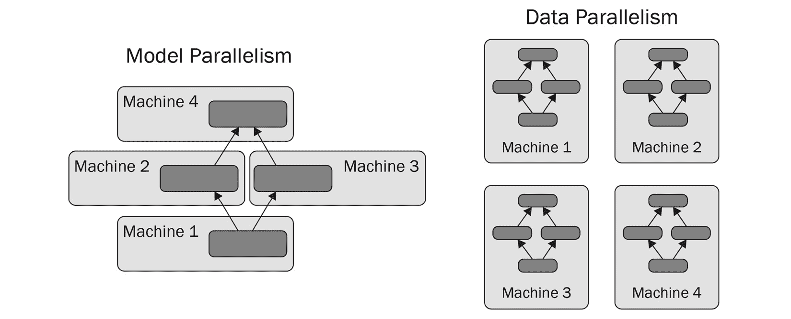

# 第六章：高效模型训练

与我们在前一章中扩展数据处理流水线的方式类似，我们可以通过分配更多计算资源来缩短训练**深度学习**（**DL**）模型所需的时间。在本章中，我们将学习如何配置**TensorFlow**（**TF**）和**PyTorch**的训练逻辑，以利用不同机器上多个 CPU 和 GPU 设备。首先，我们将学习 TF 和 PyTorch 如何支持分布式训练，无需任何外部工具。接下来，我们将描述如何利用 SageMaker，因为它专为从云端到端处理 DL 管道而构建。最后，我们将看看专为分布式训练开发的工具：Horovod、Ray 和 Kubeflow。

在本章中，我们将讨论以下主要主题：

+   在单台机器上训练模型

+   在集群上训练模型

+   使用 SageMaker 训练模型

+   使用 Horovod 训练模型

+   使用 Ray 训练模型

+   使用 Kubeflow 训练模型

# 技术要求

您可以从本书的 GitHub 存储库下载本章的补充材料：https://github.com/PacktPublishing/Production-Ready-Applied-Deep-Learning/tree/main/Chapter_6。

# 在单台机器上训练模型

如*第三章*中所述，*开发强大的深度学习模型*，训练 DL 模型涉及从数据集中提取有意义的模式。当数据集大小较小且模型参数较少时，使用**中央处理单元**（**CPU**）可能足以训练模型。然而，当使用更大的训练集并且模型包含更多神经元时，DL 模型表现出更好的性能。因此，使用**图形处理单元**（**GPU**）进行训练已成为标准，因为您可以利用其在矩阵乘法中的大规模并行性。

## 在 TensorFlow 中利用多个设备进行训练

TF 提供了`tf.distribute.Strategy`模块，允许您使用多个 GPU 或 CPU 设备进行训练，只需非常简单的代码修改，详见[分布式训练](https://www.tensorflow.org/guide/distributed_training)。`tf.distribute.Strategy`与`tf.keras.Model.fit`完全兼容，以及自定义训练循环，如*第三章*中的*在 TensorFlow 中实现和训练模型*部分描述的那样，*开发强大的深度学习模型*。Keras 的各个组件，包括变量、层、模型、优化器、度量、摘要和检查点，均设计为支持各种`tf.distribute.Strategy`类，以尽可能简化转向分布式训练。让我们看看`tf.distribute.Strategy`模块如何使您能够快速修改为多设备上的单机代码集合：

```py
import tensorflow as tf
mirrored_strategy = tf.distribute.MirroredStrategy()
# or 
# mirrored_strategy = tf.distribute.MirroredStrategy(devices=["/gpu:0", "/gpu:1", "/gpu:3"])
# if you want to use only specific devices 
with mirrored_strategy.scope():
    # define your model 
    # …
model.compile(... )
model.fit(... ) 
```

模型保存后，可以在有或无`tf.distribute.Strategy`作用域的情况下加载。为了在自定义训练循环中实现分布式训练，您可以参考示例：[`www.tensorflow.org/tutorials/distribute/custom_training`](https://www.tensorflow.org/tutorials/distribute/custom_training)。话虽如此，让我们来回顾一下最常用的策略。我们将涵盖最常见的方法，其中一些超出了单个实例的训练。它们将用于接下来的几节，涵盖在多台机器上进行训练：

+   提供对`tf.keras.Model.fit`和自定义训练循环全面支持的策略：

    +   `MirroredStrategy`: 在单台机器上使用多个 GPU 进行同步分布式训练

    +   `MultiWorkerMirroredStrategy`: 在多台机器上进行同步分布式训练（可能使用每台机器上的多个 GPU）。此策略类需要使用已配置`TF_CONFIG`环境变量的 TF 集群（[`www.tensorflow.org/guide/distributed_training#TF_CONFIG`](https://www.tensorflow.org/guide/distributed_training#TF_CONFIG)）。

    +   `TPUStrategy`: 在多个**张量处理单元**（**TPU**）上进行训练。

+   具有实验特性的策略（意味着类和方法仍处于开发阶段），适用于`tf.keras.Model.fit`和自定义训练循环：

    +   `ParameterServerStrategy`: 模型参数在多个工作节点间共享（集群包括工作节点和参数服务器）。每次迭代后，工作节点读取和更新在参数服务器上创建的变量。

    +   `CentralStorageStrategy`: 变量存储在中央存储中，并在每个 GPU 上复制。

+   我们想要提及的最后一个策略是`tf.distribute.OneDev`[`iceStrategy`（https://www.tensorflow.org/api_docs/python/tf/distribute/One](https://www.tensorflow.org/api_docs/python/tf/distribute/OneDeviceStrategy)DeviceStrategy）。它在单个 GPU 设备上运行训练代码：

    ```py
    strategy = tf.distribute.OneDeviceStrategy(device="/gpu:0")
    ```

在上述示例中，我们选择了第一个 GPU（`"/gpu:0"`）。

值得一提的是，可以使用`tf.distribute.get_strategy`函数获取当前的`tf.distribute.Strategy`对象。您可以使用此函数动态地为您的训练代码更改`tf.distribute.Strategy`对象，如下面的代码片段所示：

```py
if tf.config.list_physical_devices('GPU'):
    strategy = tf.distribute.MirroredStrategy()
else:  # Use the Default Strategy
    strategy = tf.distribute.get_strategy()
```

在上述代码中，当 GPU 设备可用时，我们使用`tf.distribute.MirroredStrategy`，当 GPU 设备不可用时则回退到默认策略。接下来，让我们看一下 PyTorch 提供的功能。

## 在 PyTorch 中利用多个设备进行训练

要成功训练一个 PyTorch 模型，模型和输入张量需要配置到相同的设备上。如果要使用 GPU 设备，它们需要在训练之前显式地加载到目标 GPU 设备上，可以使用`to(device=torch.device('cuda'))`或`cuda()`函数：

```py
cpu = torch.device(cpu')
cuda = torch.device('cuda')     # Default CUDA device
cuda0 = torch.device('cuda:0')
x = torch.tensor([1., 2.], device=cuda0)
# x.device is device(type='cuda', index=0)
y = torch.tensor([1., 2.]).cuda()
# y.device is device(type='cuda', index=0)
# transfers a tensor from CPU to GPU 1
a = torch.tensor([1., 2.]).cuda()
# a.device are device(type='cuda', index=1)
# to function of a Tensor instance can be used to move the tensor to different devices
b = torch.tensor([1., 2.]).to(device=cuda)
# b.device are device(type='cuda', index=1)
```

前述示例展示了在使用 GPU 设备时需要注意的一些关键操作。这是官方 PyTorch 文档中介绍的一部分内容：https://pytorch.org/docs/stable/notes/cuda.html。

然而，为了进行训练设置各个组件可能会很繁琐。因此，`Trainer`的`gpus`参数：

```py
# Train using CPU
Trainer()
# Specify how many GPUs to use
Trainer(gpus=k)
# Specify which GPUs to use
Trainer(gpus=[0, 1])
# To use all available GPUs put -1 or '-1'
Trainer(gpus=-1)
```

在前述示例中，我们描述了单台机器上的各种训练设置：仅使用 CPU 设备进行训练，使用一组 GPU 设备进行训练以及使用所有 GPU 设备进行训练。

需要记住的事情

a. TF 和 PyTorch 都内置了使用 CPU 和 GPU 设备训练模型的支持。

b. 使用 TF 的`tf.distribute.Strategy`类可以控制训练过程。在单台机器上训练模型时，可以使用`MirroredStrategy`或`OneDeviceStrategy`。

c. 使用 GPU 设备训练 PyTorch 模型时，需要手动将模型和相关张量加载到同一 GPU 设备上。PL 通过`Trainer`类处理放置操作，隐藏了大部分样板代码。

在本节中，我们学习了如何在单台机器上利用多个设备。然而，随着单台机器计算能力的限制，已经有很多努力将集群用于训练。

# 在集群上训练模型

尽管在单台机器上使用多个 GPU 已经大大减少了训练时间，但有些模型仍然非常庞大，需要多天的时间进行训练。增加更多的 GPU 仍然是一种选择，但通常存在物理限制，阻止您充分利用多 GPU 设置的潜力：主板可能仅支持有限数量的 GPU 设备。

幸运的是，许多深度学习框架已经支持在分布式系统上训练模型。尽管在实际实施中存在一些细微差异，但大多数框架都采纳了**模型并行**和**数据并行**的理念。如下图所示，模型并行将模型的组件分布到多台机器上，而数据并行则将训练集的样本分布到多个设备上：



图 6.1 – 模型并行和数据并行之间的区别

在设置分布式系统进行模型训练时，有几个必须注意的细节。首先，集群中的机器需要稳定连接到互联网，因为它们通过网络进行通信。如果不能保证稳定性，集群必须有一种方法来恢复连接问题。理想情况下，分布式系统应该对可用的机器无感知，并且能够在不影响总体进度的情况下添加或删除机器。这样的功能将允许用户动态增加或减少机器数量，以最经济高效的方式进行模型训练。AWS 通过**弹性 MapReduce** (**EMR**) 和 **弹性容器服务** (**ECS**) 提供上述功能。

接下来的两个部分，我们将更深入地研究模型并行 ism 和数据并行 ism。

## 模型并行 ism

在模型并行 ism 的情况下，分布式系统中的每台机器都负责模型的一部分，并管理分配组件的计算。当一个网络太大以至于无法放入单个 GPU 时，通常会考虑这种方法。然而，在实际情况下并不常见，因为 GPU 设备通常有足够的内存来容纳模型，并且设置起来非常复杂。在本节中，我们将描述模型并行 ism 的两种最基本的方法：**模型分片 ism** 和 **模型管道化**。

### 模型分片 ism

模型分片 ism 不过是将模型分割成多个计算子图，分布在多个设备上。让我们假设一个简单的基本单层**深度神经网络** (**DNN**) 模型的简单场景（没有并行路径）。模型可以分成几个连续的子图，并且分片配置可以以图形方式表示如下。数据将从带有第一个子图的设备开始顺序流动。每个设备将将计算值传递给下一个子图的设备，直到到达所需的数据为止，设备将保持空闲状态。在此示例中，我们有四个子图：


图 6.2 – 模型分片示例分布图；每个箭头表示一个小批量

如您所见，模型分片 ism 未充分利用计算资源；设备在等待另一个设备处理其子图。为了解决这个问题，提出了管道化方法。

### 模型管道化

在模型管道化的情况下，一个小批量被分割成微批次，并按照链式提供给系统，如下图所示：


图 6.3 – 模型管道逻辑图示；每个箭头表示一个小批量

然而，模型管道需要反向传播的修改版本。让我们看看如何在模型管道设置中实现单个前向和反向传播。在某些时候，每个设备不仅需要为其子图进行前向计算，还需要进行梯度计算。单个前向和反向传播可以如下实现：


图 6.4 – 模型管道中的单个前向和反向传播

在上图中，我们可以看到每个设备依次运行前向传播和反向传播，以相反的顺序传递计算值给下一个设备。将所有内容汇总在一起，我们得到下面的图表，总结了模型管道的逻辑：


图 6.5 – 基于模型管道的模型并行 ism

为了进一步提高训练时间，每个设备都存储其先前计算的值，并在接下来的计算中利用这些值。

### 在 TensorFlow 中的模型并行 ism

下面的代码片段展示了如何在定义模型架构时将一组层分配给特定设备：

```py
with tf.device('GPU:0'): 
    layer1 = layers.Dense(16, input_dim=8) 
with tf.device('GPU:1'): 
    layer2 = layers.Dense(4, input_dim=16)
```

如果您想进一步探索 TensorFlow 中的模型并行 ism，我们推荐查看 Mesh TF 存储库（https://github.com/tensorflow/mesh）。

### 在 PyTorch 中的模型并行 ism

模型并行 ism 仅适用于 PyTorch，并尚未在 PL 中实现。尽管有许多方法可以使用 PyTorch 实现模型并行 ism，但最标准的方法是使用`torch.distributed.rpc`模块，该模块通过**远程过程调用**（**RPC**）在机器之间进行通信。基于 RPC 的方法的三个主要特征是远程执行函数或网络（远程执行）、访问和引用远程数据对象（远程引用）以及扩展 PyTorch 跨机器边界的梯度更新功能（分布式梯度更新）。我们将详细信息委托给[官方文档](https://pytorch.org/docs/stable/rpc.html)：https://pytorch.org/docs/stable/rpc.html.

## 数据并行 ism

数据并行 ism 与模型并行 ism 不同，其目的是通过将数据集分片到集群中的机器来加速训练。每台机器都获得模型的副本，并与其分配的数据集计算梯度。然后，梯度被聚合，并且模型一次全局更新。

### 在 TensorFlow 中的数据并行 ism

可以通过利用`tf.distribute.MultiWorkerMirroredStrategy`、`tf.distribute.ParameterServerStrategy`和`tf.distribute.CentralStorageStrategy`在 TF 中实现数据并行 ism。

我们在 *TensorFlow 中利用多个设备进行训练* 部分介绍了这些策略，因为特定的 `tf.distributed` 策略也用于在单个机器内多设备上设置训练。

要使用这些策略，您需要设置一个 TF 集群，其中每台机器可以与其他机器通信。

通常，TF 集群使用 `TF_CONFIG` 环境变量定义。 `TF_CONFIG` 只是一个 `JSON` 字符串，通过定义两个组件来指定集群配置：`cluster` 和 `task`。以下 Python 代码展示了如何从 Python 字典生成 `TF_CONFIG` 的 `.json` 文件：

```py
tf_config = {
    'cluster': {
        'worker': ['localhost:12345', 'localhost:23456']
    },
    'task': {'type': 'worker', 'index': 0}
}
js_tf = json.dumps(tf_config)
with open("tf_config.json", "w") as outfile:
    outfile.write(js_tf)
```

[关于 `TF_CONFIG` 的字段和格式，请参阅 https://cloud.google.com/ai-platform/training/docs/distributed-training-details](https://cloud.google.com/ai-platform/training/docs/distributed-training-details)。

正如在 *TensorFlow 中利用多个设备进行训练* 部分演示的，您需要将训练代码放在 `tf.distribute.Strategy` 范围内。在下面的示例中，我们将展示 `tf.distribute.MultiWorkerMirroredStrategy` 类的样例用法。

首先，您必须将您的模型实例放在 `tf.distribute.MultiWorkerMirroredStrategy` 的范围内，如下所示：

```py
strategy = tf.distribute.MultiWorkerMirroredStrategy()
with strategy.scope():
    model = … 
```

接下来，您需要确保每台机器的 `TF_CONFIG` 环境变量已正确设置，并运行训练脚本，如下所示：

```py
# On the first node
TF_CONFIG='{"cluster": {"worker": ['localhost:12345', 'localhost:23456']}, "task": {"index": 0, "type": "worker"}}' python training.py
# On the second node
TF_CONFIG='{"cluster": {"worker": ['localhost:12345', 'localhost:23456']}, "task": {"index": 1, "type": "worker"}}' python training.py
```

要正确保存您的[模型，请查看官方文档：https://www.tensorflow.org/tutorials/distribute/multi_worker_with_keras](https://www.tensorflow.org/tutorials/distribute/multi_worker_with_keras)。

如果使用[自定义训练循环，可以按照 https://www.tensorflow.org/tutorials/distribute/multi_worker_with_ctl](https://www.tensorflow.org/tutorials/distribute/multi_worker_with_ctl) 中的说明操作。

### PyTorch 中的数据并行

与模型并行不同，数据并行在 PyTorch 和 PL 中都可用。在各种实现中，最标准的功能是 `torch.nn.parallel.DistributedDataParallel`（DDP）。本节中，我们将主要讨论 PL，因为其主要优势来自于使用数据并行的训练模型的简易性。

要使用数据并行训练模型，您需要修改训练代码以利用底层分布式系统，并使用 `torch.distributed.run` 模块在每台机器上生成一个进程（[`pytorch.org/docs/stable/distributed.html`](https://pytorch.org/docs/stable/distributed.html)）。

下面的代码片段描述了您需要为 ddp 更改的内容。您只需为 `Trainer` 的 `accelerator` 参数提供 `ddp`。当集群中有多台机器时，需要调整 `num_nodes` 参数：

```py
# train on 8 GPUs (same machine)
trainer = Trainer(gpus=8, accelerator='ddp')
# train on 32 GPUs (4 nodes)
trainer = Trainer(gpus=8, accelerator='ddp', num_nodes=4)
```

一旦脚本设置完毕，您需要在每台机器上运行以下命令。请记住，`MASTER_ADDR`和`MASTER_PORT`必须保持一致，因为每个处理器都会使用它们进行通信。另外，`NODE_RANK`表示机器的索引。换句话说，它必须对每台机器都不同，并且必须从零开始：

```py
python -m torch.distributed.run
    --nnodes=2 # number of nodes you'd like to run with
    --master_addr <MASTER_ADDR>
    --master_port <MASTER_PORT>
    --node_rank <NODE_RANK>
    train.py (--arg1 ... train script args...)
```

根据官方文档，DDP 的工作原理如下：

1.  每个节点上的每个 GPU 都会启动一个进程。

1.  每个进程获取训练集的一个子集。

1.  每个进程初始化模型。

1.  每个进程都并行执行前向和后向传播。

1.  梯度在所有进程之间同步和平均。

1.  每个进程更新其拥有的模型的权重。

要记住的事情

a. TF 和 PyTorch 提供了使用模型并行 ism 和数据并行 ism 在多台机器上训练 DL 模型的选项。

b. 模型并行将模型分成多个组件，并将它们分布在多台机器上。在 TF 和 PyTorch 中设置模型并行 ism，可以使用`Mesh TensorFlow`库和`torch.distributed.rpc`包，分别。

c. 数据并行 ism 将模型复制到每台机器上，并分布小批量数据以进行训练。在 TF 中，可以使用`MultiWorkerMirroredStrategy`、`ParameterServerStrategy`或`CentralStorageStrategy`实现数据并行 ism。PyTorch 中专门用于数据并行 ism 的主要包是`torch.nn.parallel.DistributedDataParallel`。

在本节中，我们学习了如何实现模型训练，其中集群的生命周期得到明确管理。然而，一些工具还管理模型训练的集群。由于它们各自具有不同的优势，您应该理解其差异，以选择适合您开发的正确工具。

首先，我们将查看 SageMaker 的内置功能，以分布式方式训练 DL 模型。

# 使用 SageMaker 训练模型

正如在*第五章*的*在云中利用 SageMaker 进行 ETL*部分中提到的，SageMaker 的动机是帮助工程师和研究人员专注于开发高质量的 DL 流水线，而无需担心基础设施管理。SageMaker 为您管理数据存储和计算资源，使您可以利用分布式系统轻松进行模型训练。此外，SageMaker 支持向模型流式传输数据以进行推断、超参数调整和跟踪实验和工件。

SageMaker Studio 是您定义模型逻辑的地方。SageMaker Studio 笔记本允许您快速探索可用数据并设置模型训练逻辑。当模型训练时间过长时，通过对基础架构配置进行少量修改，可以有效地实现扩展使用多个计算资源和找到最佳超参数集。此外，SageMaker 支持在分布式系统上进行超参数调整以利用并行性。

尽管 SageMaker 听起来像深度学习流水线的魔法钥匙，但也有其不足之处。首先是其成本。分配给 SageMaker 的实例比等效的 EC2 实例贵约 40%。其次，您可能会发现并非所有库都在笔记本中可用。换句话说，您可能需要额外的时间来构建和安装所需的库。

## 设置 SageMaker 的模型训练

现在，你应该能够启动一个笔记本并选择一个预定义的开发环境，因为我们在*第五章*的*利用 SageMaker 进行 ETL*部分已经涵盖了这些内容。假设您已经处理了原始数据并将处理后的数据存储在数据存储中，我们将在本节中专注于模型训练。使用 SageMaker 进行模型训练可以总结为以下三个步骤：

1.  如果存储中的处理数据尚未分割为训练、验证和测试集，则必须首先对其进行分割。

1.  您需要定义模型训练逻辑并指定集群配置。

1.  最后，您需要训练您的模型并将生成的结果保存回数据存储中。当训练完成时，分配的实例将自动终止。

使用 SageMaker 进行模型训练的关键是`sagemaker.estimator.Estimator`。它允许您配置训练设置，包括基础架构设置、要使用的 Docker 镜像类型和超参数。以下是您通常会配置的主要参数：

+   `role` (`str`): AWS IAM 角色

+   `instance_count` (`int`): 用于训练的 SageMaker EC2 实例数量

+   `instance_type` (`str`): 用于训练的 SageMaker EC2 实例类型

+   `volume_size` (`int`): 用于临时下载训练输入数据的 Amazon **弹性块存储**（**EBS**）卷的大小（以 GB 为单位）

+   `output_path` (`str`): 训练结果将存储在的 S3 对象

+   `use_spot_instances` (`bool`): 指定是否使用 SageMaker 管理的 AWS Spot 实例进行训练的标志

+   `checkpoint_s3_uri` (`str`): 训练期间将检查点存储在的 S3 URI

+   `hyperparameters` (`dict`): 包含初始超参数集的字典

+   `entry_point` (`str`): 运行的 Python 文件路径

+   `dependencies` (`list[str]`): 将加载到作业中的目录列表

只要您从 Amazon **弹性容器注册表** (**ECR**)中选择正确的容器，您就可以为 SageMaker 设置任何训练配置。还存在具有不同 CPU 和 GPU 设备配置的容器。您可以在 http://github.com/aws/deep-learning-containers/blob/master/available_images.md 中找到这些信息。

另外，还存在开源工具包的存储库，旨在帮助在 Amazon SageMaker 上进行 TF 和 PyTorch 模型训练。这些存储库还包含已经安装了必要库（如 TF、PyTo[rch 和其他构建 SageMaker ima](https://github.com/aws/sagemaker-tensorflow-training-toolkit)ges 所需的依赖项的 Docker 文件：

+   TF[: https://github.com/aws/sagemaker-tensorflow-traini](https://github.com/aws/sagemaker-pytorch-training-toolkit)ng-toolkit

+   PyTorch: https://github.com/aws/sagemaker-pytorch-training-toolkit

最后，我们想提一下，您可以在本地机器上构建和运行容器。如果需要，您还可以更新安装的库。如果进行任何修改，需要将修改后的容器上传到 Amazon ECR，然后才能在`sagemaker.estimator.Estimator`中使用它。

在接下来的两个部分中，我们将描述训练 TF 和 PyTorch 模型所需的一系列更改。

## 使用 SageMaker 训练 TensorFlow 模型

SageMaker 为 TF 提供了一个`sagemaker.estimator.Estimator`类：`sagemaker.tensorflow.estimator.TensorFlow` ([`sagemaker.readthedocs.io/en/stable/frameworks/tensorflow/sagemaker.tensorflow.html`](https://sagemaker.readthedocs.io/en/stable/frameworks/tensorflow/sagemaker.tensorflow.html)).

以下示例展示了您需要使用`sagemaker.tensorflow.estimator.TensorFlow`类编写的包装脚本，以在 SageMaker 上训练 TF 模型：

```py
import sagemaker
from sagemaker.tensorflow import TensorFlow
# Initializes SageMaker session
sagemaker_session = sagemaker.Session()
bucket = 's3://dataset/'
tf_estimator = TensorFlow(entry_point='training_script.py', 
              source_dir='.',
              role=sagemaker.get_execution_role(),
              instance_count=1, 
              instance_type='ml.c5.18xlarge',
              framework_version=tf_version, 
              py_version='py3',
              script_mode=True,
              hyperparameters={'epochs': 30} )
```

请记住，在训练脚本（`train_script.py`）的`ArgumentParser`中，`hyperparameters`参数的每个键必须有相应的条目定义。在上述示例中，我们仅定义了 epochs (`'epochs': 30`)。

要启动训练，您需要调用`fit`函数。如果您的数据集在 S3 桶上，`fit`函数将如下所示：

```py
tf_estimator.fit({'training': 's3://bucket/training',
                  'validation': 's3://bucket/validation'})   
```

前面的示例将在由 `source_dir` 提供的目录中运行 `entry_point` 参数指定的 `training_script.py`。实例的详细信息可以在 `instance_count` 和 `instance_type` 参数中找到。训练脚本将在 `fit` 函数中定义的训练和验证数据集上使用 `tf_estimator` 的 `hyperparameters` 进行运行。

## 使用 SageMaker 训练 PyTorch 模型

类似于 `sagemaker.tensorflow.estimator.TensorFlow`，存在 `sagemaker.pytorch.PyTorch`（[链接](https://sagemaker.readthedocs.io/en/stable/frameworks/pytorch/sagemaker.pytorch.html)）。您可以按照《在 PyTorch 中实现和训练模型》一节中的描述设置 PyTorch（或 PL）模型的训练，并集成 `sagemaker.pytorch.PyTorch`，如下面的代码片段所示：

```py
import sagemaker
from sagemaker.pytorch import PyTorch
# Initializes SageMaker session
sagemaker_session = sagemaker.Session()
bucket = 's3://dataset/'
pytorch_estimator = PyTorch(
                      entry_point='train.py',
                      source_dir='.',
                      role=sagemaker.get_execution_role(),
                      framework_version='1.10.0',
                      train_instance_count=1,
                      train_instance_type='ml.c5.18xlarge',
                      hyperparameters={'epochs': 6})
…
pytorch_estimator.fit({
                        'training': bucket+'/training',
                        'validation': bucket+'/validation'})   
```

使用 PyTorch 估算器的方法与前一节描述的 TF 估算器相同。

这就完成了使用 SageMaker 进行模型训练的基本用法。接下来，我们将学习如何在 SageMaker 中扩展训练作业。我们将讨论使用分布策略进行分布式训练。我们还将介绍如何通过使用具有更低延迟的其他数据存储服务来加快训练速度。

## 使用 SageMaker 以分布方式训练模型

在 SageMaker 中可以通过使用分布式数据并行库（[链接](https://sagemaker.readthedocs.io/en/stable/api/training/smd_data_parallel.html)）实现数据并行。

您所需做的就是在创建 `sagemaker.estimator.Estimator` 实例时启用 `dataparallel`，如下所示：

```py
distribution = {"smdistributed": {"dataparallel": { "enabled": True}} 
```

下面的代码片段展示了使用 `dataparallel` 创建的 TF 估算器。详细信息可以在 https://docs.aws.amazon.com/en_jp/sagemaker/latest/dg/data-parallel-use-api.html 找到：

```py
tf_estimator = TensorFlow(
                 entry_point='training_script.py', 
                 source_dir='.',
                 role=sagemaker.get_execution_role(),
                 instance_count=4, 
                 instance_type='ml.c5.18xlarge',
                 framework_version=tf_version, 
                 py_version='py3',
                 script_mode=True,
                 hyperparameters={'epochs': 30}
                 distributions={'smdistributed':
                 "dataparallel": {"enabled": True}})
```

对于 PyTorch 估算器，需要进行相同的修改。

SageMaker 支持两种不同的机制来将输入数据传输给底层算法：文件模式和管道模式。默认情况下，SageMaker 使用文件模式，将输入数据下载到用于训练的 EBS 卷中。但是，如果数据量很大，这可能会减慢训练速度。在这种情况下，您可以使用管道模式，它会从 S3（使用 Linux FIFO）流式传输数据，而无需进行额外的复制。

在 TF 的情况下，您可以简单地从 `sagemaker-tensorflow` 扩展中使用 `PipeModeDataset`，如 https://github.com/aws/sagemaker-tensorflow-extensions 所示：

```py
from sagemaker_tensorflow import PipeModeDataset
ds = PipeModeDataset(channel='training', record_format='TFRecord') 
```

然而，使用管道模式训练 PyTorch 模型需要更多的工程化**努力**。因此，我们将为您指引一个笔记本示例，深入描述每个步骤：[`github.com/aws/amazon-sagemaker-examples/blob/main/advanced_functionality/pipe_bring_your_own/pipe_bring_your_own.ipynb`](https://github.com/aws/amazon-sagemaker-examples/blob/main/advanced_functionality/pipe_bring_your_own/pipe_bring_your_own.ipynb)。

分布策略和管道模式应该通过扩展底层计算资源和提高数据传输吞吐量来加速训练。然而，如果它们不足以满足需求，您可以尝试利用另外两种与 SageMaker 兼容的更高效的数据存储服务：亚马逊**弹性文件系统**（**EFS**）和亚马逊**完全托管的共享存储**（**FSx**），它是为 Lustre 文件系统而构建的。有关更多详细信息，请分别参阅它们的官方页面：[`aws.amazon.com/efs/`](https://aws.amazon.com/efs/) 和 [`aws.amazon.com/fsx/lustre/`](https://aws.amazon.com/fsx/lustre/)。

## SageMaker 与 Horovod

SageMaker 分布式训练的另一选择是使用*Horovod*，这是一个基于**消息传递接口**（**MPI**）原理的免费开源框架，用于分布式 DL 训练。MPI 是一种标准消息传递库，在并行计算架构中被广泛使用。Horovod 假设 MPI 用于工作节点的发现和减少协调。Horovod 还可以利用 Gloo 替代 MPI，这是一个开源的集体通信库。这里是为 Horovod 配置的分布参数示例：

```py
distribution={"mpi": {"enabled":True, 
                        "processes_per_host":2 }}
```

在前面的代码片段中，我们使用 MPI 实现了机器之间的协调。`processes_per_host`定义了在每个实例上运行的进程数量。这相当于在 MPI 和 Horovod 中使用`-H`参数定义进程数量，以控制程序在 MPI 和 Horovod 中的执行。

在下面的代码片段中，我们选择了控制训练脚本执行数量的并行进程数（`-np`参数）。然后，使用指定的`-H`参数值将此数目分配到具体的机器上。使用以下命令，每台机器将运行两次`train.py`。这在每台有两个 GPU 的四台机器的典型设置中是典型的。分配给`-H`进程的总和不能超过`-np`值：

```py
mpirun -np 8 -H server1:2,server2:2,server3:2,server4:2 … (other parameters) python train.py  
```

我们将在下一节中深入讨论 Horovod，讲述如何在由 EC2 实例组成的独立 Horovod 集群上训练 DL 模型。

记住的事情

a. SageMaker 提供了一个优秀的工具，SageMaker Studio，允许您快速进行初始数据探索和训练基线模型。

b. `sagemaker.estimator.Estimator`对象是使用 SageMaker 训练模型的重要组件。它还支持在一组具有不同 CPU 和 GPU 配置的机器上进行分布式训练。

c. 使用 SageMaker 进行 TF 和 PyTorch 模型训练可以通过专为每种框架设计的估算器来实现。

现在，让我们看看如何在没有 SageMaker 的情况下使用 Horovod 进行分布式模型训练。

# 使用 Horovod 训练模型

尽管我们在介绍 SageMaker 时介绍了 Horovod，但 Horovod 设计用于仅支持分布式训练（https://horovod.ai/）。它旨在通过为流行的 DL 框架（包括 TensorFlow 和 PyTorch）提供良好的集成来以简单的方式支持分布式训练。

正如在*SageMaker 与 Horovod*部分中提到的，Horovod 的核心原则基于 MPI 概念，例如 size、rank、local rank、allreduce、allgather、broadcast 和 alltoall（https://horovod.readthedocs.io/en/stable/concepts.html）。

在本节中，我们将学习如何使用 EC2 实例设置 Horovod 集群。然后，我们将描述在 TF 和 PyTorch 脚本中进行的修改，以在 Horovod 集群上训练模型所需的步骤。

## 设置 Horovod 集群

要使用 EC2 实例设置 Horovod 集群，您必须按照以下步骤进行：

1.  转到 EC2 实例控制台：https://console.aws.amazon.com/ec2/。

1.  点击右上角的**启动实例**按钮。

1.  选择安装了 TF、PyTorch 和 Horovod 的**Deep Learning AMI**（Amazon Machine Image）。点击右下角的**下一步…**按钮。

1.  为您的训练选择正确的**实例类型**。您可以选择符合需求的 CPU 或 GPU 实例类型。点击右下角的**下一步…**按钮：


图 6.6 – EC2 实例控制台中的实例类型选择

1.  选择您希望组成 Horovod 集群的实例数量。在这里，您还可以请求 AWS Spot 实例（基于稀疏 EC2 容量的廉价实例，可以被中断，因此仅适合容错任务）。但为简单起见，让我们使用按需资源。

1.  选择适当的网络和子网设置。在实际操作中，这些信息将由 DevOps 部门提供。

1.  在同一页上，选择**添加实例到放置组**和**添加到新的放置组**，输入您想要用于组的名称，并选择**cluster**作为**放置组策略**。

1.  在同一页上，提供您的**身份和访问管理**（IAM）角色，以便您可以访问 S3 存储桶。点击右下角的**下一步…**按钮。

1.  为您的实例选择正确的存储大小。在右下角的**下一步……**按钮。

1.  为您的实例选择唯一的标签（https://docs.aws.amazon.com/general/latest/gr/aws_tagging.html）。在实际情况中，这些标签可能被用作额外的安全措施，例如使用特定标签终止实例。点击右下角的**下一步……**按钮。

1.  创建安全组或选择现有的安全组。同样，您必须与 DevOps 部门沟通以获取适当的信息。在右下角的**下一步……**按钮。

1.  审查所有信息并启动。您将被要求提供用于认证的**隐私增强邮件**（**PEM**）密钥。

完成这些步骤后，所需数量的实例将启动。如果您在*步骤 10*中没有添加**名称**标签，则您的实例将没有任何名称。在这种情况下，您可以导航到 EC2 实例控制台并手动更新名称。在写作时，您可以请求称为弹性 IP 的静态 IPv4 地址并将其分配给您的实例（https://docs.aws.amazon.com/AWSEC2/latest/UserGuide/elastic-ip-addresses-eip.html）。

最后，确保实例能够无问题地相互通信。您应检查**安全组**设置，并根据需要为 SSH 和其他流量添加入站规则。

此时，您只需将本地计算机上的 PEM 密钥复制到主 EC2 实例即可。对于 Ubuntu AMI，您可以运行以下命令：

```py
scp -i <your_pem_key_path> ubuntu@<IPv4_Public_IP>:/home/ubuntu/.ssh/ 
```

现在，您可以使用 SSH 连接到主 EC2 实例。接下来要做的是通过以下命令在 EC2 实例之间设置无密码连接，并在 SSH 命令中提供您的 PEM 密钥：

```py
eval 'ssh-agent'
ssh-add <your_pem_key>
```

在上述代码片段中，`eval`命令设置由`ssh-agent`命令提供的环境变量，而`ssh-add`命令将 PEM 身份添加到认证代理中。

现在，集群已准备好支持 Horovod！完成后，必须在 Web 控制台上停止或终止集群。否则，将持续收取资源费用。

在接下来的两个部分中，我们将学习如何更改 Horovod 的 TF 和 PyTorch 训练脚本。

## 为 Horovod 配置 TensorFlow 训练脚本

要使用 Horovod 训练 TF 模型，您需要`horovod.tensorflow.keras`模块。首先，您需要导入`tensorflow`和`horovod.tensorflow.keras`模块。我们将`horovod.tensorflow.keras`称为`hvd`。然后，您需要按以下方式初始化 Horovod 集群：

```py
import tensorflow as tf
import horovod.tensorflow.keras as hvd
# Initialize Horovod
hvd.init()
```

此时，您可以使用`hvd.size`函数检查集群的大小。Horovod 中的每个进程将被分配一个等级（从 0 到集群大小，即您要运行的进程或要使用的设备的数量），您可以通过`hvd.rank`函数访问此等级。在每个实例上，每个进程都被分配一个不同的编号，从 0 到该实例上的进程数，称为本地等级（每个实例唯一的数字，但在不同实例之间重复）。可以使用`hvd.local_rank`函数访问当前进程的本地等级。

您可以使用本地排名来为每个进程固定特定的 GPU 设备。此示例还展示了如何使用`tf.config.experimental.set_memory_growth`设置 GPU 的内存增长：

```py
gpus = tf.config.experimental.list_physical_devices('GPU')
for gpu in gpus:
    tf.config.experimental.set_memory_growth(gpu, True)
if gpus:
    tf.config.experimental.set_visible_devices(gpus[hvd.local_rank()], 'GPU')
```

在下面的代码中，我们根据等级来拆分数据，以便每个进程在不同的示例集上训练：

```py
dataset = np.array_split(dataset, hvd.size())[hvd.rank()]
```

对于模型架构，您可以按照*第三章*中的*在 TensorFlow 中实现和训练模型*部分的说明进行操作：

```py
model = …
```

接下来，您需要配置优化器。在以下示例中，学习率将按照 Horovod 大小进行缩放。此外，优化器需要用 Horovod 优化器包装：

```py
opt = tf.optimizers.Adam(0.001 * hvd.size())
opt = hvd.DistributedOptimizer(opt)
```

下一步是编译您的模型，并将网络架构定义和优化器放在一起。当您使用早于 v2.2 的 TF 版本调用`compile`函数时，您需要禁用`experimental_run_tf_function`，以便 TF 使用`hvd.DistributedOptimizer`来计算梯度：

```py
model.compile(loss=tf.losses.SparseCategoricalCrossentropy(),
              optimizer=opt,
              metrics=['accuracy'],
              experimental_run_tf_function=False)
```

您需要配置的另一个组件是回调函数。您需要添加`hvd.callbacks.BroadcastGlobalVariablesCallback(0)`。这将从等级 0 向所有其他机器和进程广播权重和偏差的初始值。这是确保一致的初始化或正确从检查点恢复训练所必需的：

```py
callbacks=[
    hvd.callbacks.BroadcastGlobalVariablesCallback(0)
]
```

使用`rank`可以在特定实例上执行特定操作。例如，通过检查`rank`是否为 0 (`hvd.rank()==0`)，可以在主节点上记录和保存工件，如下面的代码片段所示：

```py
# Save checkpoints only on the instance with rank 0 to prevent other workers from corrupting them.
If hvd.rank()==0:
    callbacks.append(keras.callbacks.ModelCheckpoint('./checkpoint-{epoch}.h5'))
```

现在，您可以触发`fit`函数。以下示例显示了如何使用 Horovod 集群的大小来缩放每个 epoch 的步数。`fit`函数的消息只会在主节点上可见：

```py
if hvd.rank()==0:
    ver = 1
else:
    ver = 0
model.fit(dataset,
          steps_per_epoch=hvd.size(),
          callbacks=callbacks,
          epochs=num_epochs,
          verbose=ver)
```

这是[您需要更改以在分布式](https://horovod.readthedocs.io/en/stable/tensorflow.html)Horovod 中训练 TF 模型的所有内容。您可以在 https://horovod.rea[找到完整示例](https://horovod.readthedocs.io/en/stable/keras.html). Keras 版本可在 https://horovod.rea[dthedocs.io/en/stable/keras.html 找到。此外，您可以修改](https://horovod.readthedocs.io/en/stable/elastic_include.html)您的训练脚本，使其以容错方式运行：https://horovod.readthedocs.io/en/stable/elastic_include.html。通过此更改，您应该能够使用 AWS Spot 实例并显著降低培训成本。

## 配置用于 Horovod 的 PyTorch 训练脚本

不幸的是，PL 目前尚无适当的 Horovod 支持文档。因此，在本节中，我们将专注于 PyTorch。与前一节中描述的类似，我们将演示您为 PyTorch 训练脚本进行的代码更改。对于 PyTorch，您需要`horovod.torch`模块，我们将再次称之为`hvd`。在以下代码片段中，我们正在导入必要的模块并初始化集群：

```py
import torch
import horovod.torch as hvd
# Initialize Horovod
hvd.init()
```

如 TF 示例所述，您需要使用本地排名为当前进程绑定 GPU 设备：

```py
torch.cuda.set_device(hvd.local_rank())
```

训练脚本的其余部分需要进行类似的修改。数据集需要使用`torch.utils.data.distributed.DistributedSampler`在实例之间分发，并且优化器必须使用`hvd.DistributedOptimizer`进行包装。主要区别在于`hvd.broadcast_parameters(model.state_dict(), root_rank=0)`，用于广播模型权重。您可以在以下代码片段中找到详细信息：

```py
# Define dataset...
train_dataset = ...
# Partition dataset among workers using DistributedSampler
train_sampler = torch.utils.data.distributed.DistributedSampler(
    train_dataset, num_replicas=hvd.size(), rank=hvd.rank())
train_loader = torch.utils.data.DataLoader(train_dataset, batch_size=..., sampler=train_sampler)
# Build model...
model = ...
model.cuda()
optimizer = optim.SGD(model.parameters())
# Add Horovod Distributed Optimizer
optimizer = hvd.DistributedOptimizer(optimizer, named_parameters=model.named_parameters())
# Broadcast parameters from rank 0 to all other processes.
hvd.broadcast_parameters(model.state_dict(), root_rank=0)
```

现在，您已经准备好训练模型了。训练循环不需要任何修改。您只需将输入张量传递给模型，并通过触发`loss`的`backward`函数和`optimizer`的`step`函数来触发反向传播。以下代码片段描述了训练逻辑的主要部分：

```py
for epoch in range(num_ephos):
   for batch_idx, (data, target) in enumerate(train_loader):
       optimizer.zero_grad()
       output = model(data)
       loss = F.nll_loss(output, target)
       loss.backward()
       optimizer.step()
```

完整描述可以在官方 Horovod 文档页面找到：https://horovod.readthedocs.io/en/stable/pytorch.html。

作为*使用 Horovod 训练模型*部分的最后一个内容，接下来的部分将解释如何使用`horovodrun`和`mpirun`命令启动模型训练过程。

## 在 Horovod 集群上训练 DL 模型

Horovod 使用 MPI 原则协调进程之间的工作。要在单台机器上运行四个进程，可以使用以下其中一个命令：

```py
horovodrun -np 4 -H localhost:4 python train.py
mpirun -np 4 python train.py
```

在两种情况下，`-np`参数定义了`train.py`脚本并行运行的次数。`-H`参数可用于定义每台机器上的进程数（请参见上述示例中的`horovodrun`命令）。随着我们学习如何在单台机器上运行，可以省略`-H`，如在`mpirun`命令中所示。其他`mpirun`参数在 https://www.open-mpi.org/doc/v4.0/man1/mpirun.1.php#sect6 中描述。

如果未安装 MPI，可以使用 Gloo 运行`horovodrun`命令。要在`localhost`上使用 Gloo 运行相同脚本四次（四个进程），只需添加`--gloo`标志：

```py
horovodrun --gloo -np 4 -H localhost:4 python train.py
```

扩展到多个实例非常简单。以下命令展示了如何使用`horovodrun`在四台机器上运行训练脚本：

```py
horovodrun -np 4 -H server1:1,server2:1,server3:1,server4:1 python train.py 
```

以下命令展示了如何使用`mpirun`在四台机器上运行训练脚本：

```py
mpirun -np 4 -H server1:1,server2:1,server3:1,server4:1 python train.py
```

当主节点触发上述任一命令后，您将看到每个实例运行一个训练进程。

需要记住的事情

a. 要使用 Horovod，您需要一个具有节点间开放交叉通信的集群。

b. Horovod 提供了一种简单有效的方法，用于实现 TF 和 PyTorch 的数据并行。

c. 可以使用`horovodrun`或`mpirun`命令在 Horovod 集群上执行训练脚本。

在下一节中，我们将描述 Ray，另一个流行的用于[分布式训练](https://www.ray.io/)的框架。

# 使用 Ray 训练模型

Ray 是一个开源的执行框架，用于跨多台机器扩展 Python 工作负载（https://www.ray.io）。Ray 支持以下 Python 工作负载：

+   使用 PyTorch 或 TF 实现的 DL 模型训练

+   通过 Ray Tune 进行超参数调整（https://docs.ray.io/en/latest/tune/index.html）

+   **强化学习**（**RL**）通过 RLlib 实现（https://docs.ray.io/en/latest/rllib/index.html），这是一个开源的 RL 库

+   利用 Ray 数据集进行数据处理（[`docs.ray.io/en/latest/data/dataset.html`](https://docs.ray.io/en/latest/data/dataset.html)）

+   通过 Ray Serve 进行模型服务（[`docs.ray.io/en/latest/serve/index.html`](https://docs.ray.io/en/latest/serve/index.html)）

+   利用 Ray Core 进行通用 Python 应用程序（[`docs.ray.io/en/latest/ray-core/walkthrough.html`](https://docs.ray.io/en/latest/ray-core/walkthrough.html)）

Ray 的关键优势在于其集群定义的简单性；您可以定义具有不同类型和来源的机器的集群。例如，Ray 允许您通过混合 AWS EC2 按需实例和具有不同 CPU 和 GPU 配置的 EC2 Spot 实例来构建实例群集（基于每个节点的灵活和弹性资源策略），从而简化了集群的创建和与 DL 框架的集成，使其成为分布式 DL 模型训练过程的有效工具。

首先，我们将学习如何设置 Ray 集群。

## 设置 Ray 集群

您可以通过两种方式设置 Ray 集群：

+   **Ray 集群启动器**：Ray 提供的工具，用于利用云服务（包括 AWS、GCP 和 Azure）的实例构建集群。

+   **手动集群构建**：所有节点都需要手动连接到 Ray 集群。

Ray 集群包括一个头节点（主节点）和工作节点。形成集群的实例应配置为通过网络互相通信。Ray 实例之间的通信基于**传输控制协议**（**TCP**）连接，必须打开相应的端口。在接下来的两个部分中，我们将更详细地介绍 Ray 集群启动器和手动集群构建。

### 使用 Ray Cluster Launcher 设置 Ray 集群

使用 Ray 集群启动器时，需要使用 YAML 文件来配置集群。您可以在 Ray 的 GitHub 仓库中找到多个用于不同配置的示例 `YAML` 文件：[`github.com/ray-project/ray/tree/master/python/ray/autoscaler`](https://github.com/ray-project/ray/tree/master/python/ray/autoscaler)。

在本节中，我们将介绍最基本的配置。`YAML` 文件从集群的基本信息开始，例如集群名称、最大工作节点数和扩展速度，如下所示：

```py
cluster_name: BookDL
max_workers: 5
upscaling_speed: 1.0
```

接下来，它配置云服务提供商：

```py
provider:
    type: aws
    region: us-east-1
    availability_zone: us-east-1c, us-east-1b, us-east-1a
    cache_stopped_nodes: True 
    ssh_user: ubuntu
    ssh_private_key: /Users/BookDL/.ssh/BookDL.pem
```

在上述示例中，我们指定了提供者类型（`type: aws`），并选择将提供实例的区域和可用区（`region: us-east-1` 和 `availability_zone: us-east-1c, us-east-1b, us-east-1a`）。然后，我们定义节点在未来是否可以重复使用（`cache_stopped_nodes: True`）。最后的配置是用户认证（`ssh_user:ubuntu` 和 `ssh_private_key:/Users/BookDL/.ssh/BookDL.pem`）。

接下来需要指定节点配置。首先，我们将从头节点开始：

```py
available_node_types:
    ray.head.default:
        node_config:
            KeyName:"BookDL.pem"
```

接下来，我们必须设置安全设置。详细设置必须与 DevOps 协商，以监控和保护实例：

```py
            SecurityGroupIds:
                - sg-XXXXX
                - sg-XXXXX
            SubnetIds: [subnet-XXXXX]
```

下面的配置适用于应使用的实例类型和 AMI：

```py
            InstanceType: m5.8xlarge
            ImageId: ami-09ac68f361e5f4a13
```

在以下代码片段中，我们提供了存储配置：

```py
            BlockDeviceMappings:
                  - DeviceName: /dev/sda1
                    Ebs:
                    VolumeSize: 580
```

您可以按如下方式轻松定义 `Tags`：

```py
            TagSpecifications:
                - ResourceType:"instance"
                  Tags:
                      - Key:"Developer"
                        Value:"BookDL"
```

如果需要，可以为访问特定 S3 存储桶提供 IAM 实例配置文件：

```py
            IamInstanceProfile:
                Arn:arn:aws:iam::XXXXX
```

在 `YAML` 文件的下一个部分，我们需要为工作节点提供配置：

```py
    ray.worker.default:
            min_workers: 2
            max_workers: 4
```

首先，我们必须指定工作节点的数量（`min_workers` 和 `max_workers`）。然后，我们可以定义类似于我们定义主节点配置的节点配置：

```py
        node_config:
            KeyName: "BookDL.pem"
            SecurityGroupIds:
                - sg-XXXXX
                - sg-XXXXX
            SubnetIds: [subnet-XXXXX]
            InstanceType: p2.8xlarge
            ImageId: ami-09ac68f361e5f4a13
            TagSpecifications:
                - ResourceType: "instance"
                  Tags:
                      - Key: "Developer"
                        Value: "BookDL"
            IamInstanceProfile:
                Arn: arn:aws:iam::XXXXX
            BlockDeviceMappings:
              - DeviceName: /dev/sda1
                Ebs:
                  VolumeSize: 120
```

此外，您可以在 `YAML` 文件中指定要在每个节点上运行的一系列 shell 命令：

```py
setup_commands:
    - (stat $HOME/anaconda3/envs/tensorflow2_p38/ &> /dev/null && echo 'export PATH="$HOME/anaconda3/envs/tensorflow2_p38/bin:$PATH"' >> ~/.bashrc) || true
    - source activate tensorflow2_p38 && pip install --upgrade pip
    - pip install awscli
    - pip install Cython
    - pip install -U ray
    - pip install -U ray[rllib] ray[tune] ray
    - pip install mlflow
    - pip install dvc
```

在这个例子中，我们将在路径中添加`tensorflow2_p38`以供`conda`环境使用，激活环境，并使用`pip`安装一些其他模块。如果您想在头节点或工作节点上运行其他命令，可以分别在`head_setup_commands`和`worker_setup_commands`中指定它们。它们将在`setup_commands`中定义的命令执行后执行。

最后，YAML 文件以启动 Ray 集群的命令结束：

```py
head_start_ray_commands:
    - ray stop
    - source activate tensorflow2_p38 && ray stop
    - ulimit -n 65536; source activate tensorflow2_p38 && ray start --head --port=6379 --object-manager-port=8076 --autoscaling-config=~/ray_bootstrap_config.yaml
worker_start_ray_commands:      
    - ray stop
    - source activate tensorflow2_p38 && ray stop
    - ulimit -n 65536; source activate tensorflow2_p38 && ray start --address=$RAY_HEAD_IP:6379 --object-manager-port=8076
```

起初，使用 YAML 文件设置 Ray 集群可能看起来很复杂。但是，一旦您习惯了，您会发现为未来项目调整集群设置变得相当简单。此外，它显著减少了启动正确定义的集群所需的时间，因为您可以重用来自先前项目的安全组、子网、标签和 IAM 配置信息。

如果您需要其他详细信息，我们建议您花些时间查阅官方文档：https://docs.ray.io/en/latest/cluster/config.html#cluster-config。

值得一提的是，Ray 集群启动器支持自动缩放和使用实例群，无论是否使用 EC2 Spot 实例。我们在前面的示例中使用了 AMI，但您也可以为您的实例提供特定的 Docker 镜像。通过灵活使用 YAML 配置文件，您可以使用单个文件构建任何集群配置。

正如我们在本节开头提到的，您还可以通过手动添加单独实例来设置 Ray 集群。接下来我们将看看这个选项。

### 手动设置 Ray 集群

鉴于您拥有一组具有网络连接的机器，第一步是在每台机器上安装 Ray。接下来，您需要更改每台机器的安全设置，以便它们可以相互通信。之后，您需要选择一个节点作为头节点，并在其上运行以下命令：

```py
ray start --head --redis-port=6379  
```

上述命令建立了 Ray 集群；Redis 服务器（用于集中控制平面）已启动，并且其 IP 地址在终端上打印出来（例如`123.45.67.89:6379`）。

接下来，您需要在所有其他节点上运行以下命令：

```py
ray start --address=<redis server ip address>
```

您需要提供的地址是从头节点命令打印出的地址。

现在，您的机器已准备好支持 Ray 应用程序。在手动设置的情况下，需要手动执行以下步骤：启动机器，连接到头节点终端，将训练文件复制到所有节点，并停止机器。让我们看看如何利用 Ray 集群启动器来帮助完成这些任务。

在这个阶段，您应该能够使用 YAML 文件指定所需的 Ray 集群设置。一旦准备好，您可以使用以下命令启动您的第一个 Ray 集群：

```py
ray up your_cluster_setting_file.yaml
```

要在头节点上获取远程终端，您可以运行以下命令：

```py
ray attach your_cluster_setting_file.yaml
```

要终止集群，可以使用以下命令：

```py
ray down your_cluster_setting_file.yaml
```

现在，是时候学习如何在 Ray 集群上执行 DL 模型训练了。

## 使用 Ray 进行分布式模型训练

Ray 提供 Ray Train 库，通过处理幕后的分布式训练来帮助您专注于定义训练逻辑。Ray Train 支持 TF 和 PyTorch。此外，Ray Datasets 存在，通过分布式数据转换提供分布式数据加载。最后，Ray 通过 Ray Tune 库提供超参数调整功能。

调整 TF 训练逻辑以适应 Ray 类似于我们在 *TensorFlow 中的数据并行 ism* 部分中描述的方式。主要区别来自 Ray Train 库，它帮助我们设置 `TF_CONFIG`。

调整后的训练逻辑如下所示：

```py
def train_func_distributed():
    per_worker_batch_size = 64
    tf_config = json.loads(os.environ['TF_CONFIG'])
    num_workers = len(tf_config['cluster']['worker'])
    strategy = tf.distribute.MultiWorkerMirroredStrategy()
    global_batch_size = per_worker_batch_size * num_workers
    multi_worker_dataset = dataset(global_batch_size)
    with strategy.scope():
        multi_worker_model = build_and_compile_your_model()
    multi_worker_model.fit(multi_worker_dataset, epochs=20, steps_per_epoch=50)
```

然后，您可以使用 Ray Trainer 运行训练，如下所示：

```py
import ray
from ray.train import Trainer
ray.init()
trainer = Trainer(backend="tensorflow", num_workers=4, use_gpu=True)
trainer.start()
trainer.run(train_func_distributed)
trainer.shutdown()
```

在前面的例子中，模型定义与单设备案例类似，唯一的区别在于应使用特定策略进行编译：`MultiWorkerMirroredStrategy`。数据集在 `dataset` 函数内部分割，为每个工作节点提供不同的样本集。最后，`Trainer` [实例处理分布式训练。](https://docs.ray.io/en/latest/train/examples.html)

[使用 Ray 训练 PyTorch 模型](https://docs.ray.io/en/latest/train/examples.html) 可以通过少量变更来实现。一些示例在 [`docs.ray.io/en/latest/train/examples.html#pytorch`](https://docs.ray.io/en/latest/train/examples.html#pytorch) 上呈现。

此外，您还可以将 Ray 与 Horovod 结合使用，利用 Elastic Horovod 以容错的方式进行训练。Ray [将通过简化主机的发现和 orc](https://docs.ray.io/en/latest/train/examples/horovod/horovod_example.html) 串来自动缩放训练过程。我们不会详细介绍，但您可以在 [`docs.ray.io/en/latest/train/examples/horovod/horovod_example.html`](https://docs.ray.io/en/latest/train/examples/horovod/horovod_example.html) 找到一个很好的起点。

需要记住的事情

a. Ray 的主要优势在于其集群定义的简易性。

b. Ray 集群可以通过手动连接每台机器或使用名为 Ray Cluster Launcher 的内置工具来创建。

c. Ray 提供了良好的支持来自动缩放训练过程。它简化了主机的发现和编排。

最后，让我们学习如何使用 Kubeflow 进行分布式训练。

# 使用 Kubeflow 训练模型

Kubeflow ([`www.kubeflow.org`](https://www.kubeflow.org)) 涵盖了模型开发的每个步骤，包括数据探索、预处理、特征提取、模型训练、模型服务、推断和版本控制。通过利用容器和 Kubernetes，Kubeflow 允许您轻松从本地开发环境扩展到生产集群。

如果您的组织已经在[使用 Kubernetes](https://kubernetes.io)生态系统，那么 Kubeflow 可能是您进行分布式训练的首选。

## 介绍 Kubernetes

Kubernetes 是一个开源的编排平台，用于管理容器化工作负载和服务（[`kubernetes.io`](https://kubernetes.io)）：

+   Kubernetes 有助于持续交付、集成和部署。

+   它将开发环境与部署环境分离。您可以构建一个容器镜像并同时开发应用程序。

+   基于容器的方法确保了开发、测试和生产环境的一致性。环境将在桌面计算机或云中保持一致，从而最大限度地减少从一步到另一步所需的修改。

我们假设您已经安装了 Kubeflow 及其所有依赖项，并且运行着一个 Kubernetes 集群。本节中我们将描述的步骤是通用的，适用于任何集群设置 - **Minikube**（一个本地版本的 Kubernetes）、AWS **弹性 Kubernetes 服务**（**EKS**），或者一个多节点的集群。这正是容器化工作负载和服务的美妙之处。您可以在以下网址找到本地 Minikube 安装步骤：[`minikube.sigs.k8s.io/docs/start/`](https://minikube.sigs.k8s.io/docs/start/)。对于 EKS，我们建议您查阅 AWS 用户指南：[`docs.aws.amazon.com/eks/latest/userguide/getting-started.html`](https://docs.aws.amazon.com/eks/latest/userguide/getting-started.html)。

## 为 Kubeflow 设置模型训练

第一步是将您的[训练代码打包成一个容器。这可以通过一个 Docker 文件实现。取决于您的起始点，您可以使用来自 NVIDIA 容器镜像空间的容器（TF 位于 htt](https://docs.nvidia.com/deeplearning/frameworks/pytorch-release-notes/index.html)ps://docs.nvidia.com/deeplearning/frameworks/tensor[flow-release-notes/running.html 或 PyTorch 在](https://hub.docker.com/r/pytorch/pytorch/) https://docs.nv[idia.com/deeplearning/frameworks/pytorch](https://hub.docker.com/r/tensorflow/tensorflow)-release-notes/index.html)或直接从 DL 框架获取容器（TF 位于 https://hub.docker.com/r/tensorflow/tensorflow 或 PyTorch 位于 https://hub.docker.com/r/pytorch/pytorch）。

让我们看一个 TF Docker 文件的示例（`kubeflow/tf_example_job`）：

```py
FROM tensorflow/tensorflow:latest-gpu-jupyter
RUN pip install minio –upgrade
RUN pip install –upgrade pip 
RUN pip install pandas –upgrade 
… 
RUN mkdir -p /opt/kubeflow
COPY train.py /opt/kubeflow
ENTRYPOINT ["python", "/opt/kubeflow/train.py"]
```

在前述的 Docker 定义中，`train.py`脚本是一个典型的 TF 训练脚本。

现在，我们假设单机将用于训练。换句话说，它将是一个单容器作业。假设您已经准备好一个 Docker 文件和一个训练脚本，您可以使用以下命令构建您的容器并将其推送到仓库：

```py
docker build -t kubeflow/tf_example_job:1.0
docker push kubeflow/tf_example_job:1.0
```

我们将使用`TFJob`，这是 Kubeflow 的一个自定义组件，其中包含一个将`TFJob`表示为描述容器镜像、训练脚本和执行参数的 YAML 文件。让我们看看一个 YAML 文件，`tf_example_job.yaml`，其中包含在单台机器上运行的 Kubeflow 模型训练作业：

```py
apiVersion: "kubeflow.org/v1" 
kind: "TFJob"
metadata:
    name: "tf_example_job"
spec:
    tfReplicaSpecs:
        Worker:
            replicas: 1
        restartPolicy: Never
        template:
            specs:
                containers:
                    - name: tensorflow 
                      image: kubeflow/tf_example_job:1.0
```

API 版本在第一行中定义。然后列出了您自定义资源的类型，`kind: "TFJob"`。`metadata`字段用于通过提供自定义名称来识别您的作业。集群在`tfReplicaSpecs`字段中定义。如前面的示例所示，脚本（`tf_example_job:1.0`）将执行一次（`replicas: 1`）。

要将定义的`TFJob`部署到您的集群中，您可以使用`kubectl`命令，如下所示：

```py
kubectl apply -f tf_example_job.yaml
```

您可以使用以下命令监视您的作业（使用元数据中定义的名称）：

```py
kubectl describe tfjob tf_example_job 
```

要执行分布式训练，您可以使用带有特定`tf.distribute.Strategy`的 TF 代码，创建一个新的容器，并修改`TFJob`。我们将在下一节中查看`TFJob`所需的更改。

## 使用 Kubeflow 在分布式环境中训练 TensorFlow 模型

假设我们已经有了来自`MultiWorkerMirroredStrategy`的 TF 训练代码。为了支持此策略，需要在`spec`字段中调整`tfReplicaSpecs`。我们可以通过 YAML 文件定义以下类型的副本：

+   **主节点（主机）**：编排计算任务

+   **工作节点**：运行计算任务

+   **参数服务器**：管理模型参数的存储

+   **评估节点**：在模型训练期间运行评估

作为最简单的例子，我们将定义一个作为主节点之一的工作节点。参数`server`和`evaluator`不是必须的。

让我们看看调整后的 YAML 文件，`tf_example_job_dist.yaml`，用于分布式 TF 训练：

```py
apiVersion: "kubeflow.org/v1"
kind: "TFJob"
metadata:
    name: "tf_example_job_dist"
spec:
    cleanPodPolicy: None
    tfReplicaSpecs:
        Worker:
            replicas: 4
            restartPolicy: Never
            template:
                specs:
                    containers:
                        - name: tensorflow 
                          image: kubeflow/tf_example_job:1.1
```

前述的 YAML 文件将基于`MultiWorkerMirroredStrategy`在新的容器`kubeflow/tf_example_job:1.1`上运行训练作业。我们可以使用相同的命令将`TFJob`部署到集群：

```py
kubectl apply -f tf_example_job_dist.yaml
```

在下一节中，我们将学习如何使用 PyTorch 和 Ray。

## 使用 Kubeflow 在分布式环境中训练 PyTorch 模型

对于 PyTorch，我们只需将`TFJob`更改为`PyTorchJob`，并提供一个 PyTorch 训练脚本。至于训练脚本本身，请参阅*PyTorch 中的数据并行 ism*部分。如下面的代码片段所示，YAML 文件需要相同的修改：

```py
apiVersion: "kubeflow.org/v1 
kind: "PyTorchJob"
metadata:
    name: "pt_example_job_dist"
spec:
    pytorchReplicaSpecs:
        Master:
            replicas: 1
            restartPolicy: Never
            template:
                specs:
                    containers:
                        - name: pytorch 
                          image: kubeflow/pt_example_job:1.0
        Worker:
            replicas: 5
            restartPolicy: OnFailure
            template:
                specs:
                    containers:
                        - name: pytorch 
                          image: kubeflow/pt_example_job:1.0
```

在此示例中，我们有一个主节点和五个工作节点的副本。完整详情请查看[`www.kubeflow.org/docs/components/training/pytorch`](https://www.kubeflow.org/docs/components/training/pytorch)。

需要记住的事项

a. Kubeflow 允许您轻松地从本地开发环境扩展到利用容器和 Kubernetes 的大型集群。

b. `TFJob`和`PyTorchJob`分别允许您以分布式方式在 Kubeflow 中运行 TF 和 PyTorch 训练作业。

在本节中，我们描述了如何利用 Kubeflow 以分布式方式训练 TF 和 PyTorch 模型。

# 总结

通过意识到多设备和多机器并行带来的好处，我们学习了多种训练深度学习模型的方法。首先，我们学习了如何在单台机器上利用多个 CPU 和 GPU 设备。然后，我们介绍了如何利用 TF 和 PyTorch 的内置功能以分布式方式进行训练，其中底层集群由显式管理。之后，我们学习了如何使用 SageMaker 进行分布式训练和扩展。最后，最后三节描述了专为分布式训练设计的框架：Horovod、Ray 和 Kubeflow。

在下一章中，我们将介绍模型理解。我们将学习关于模型理解的流行技术，这些技术在训练过程中提供一些关于模型内部运行情况的见解。
