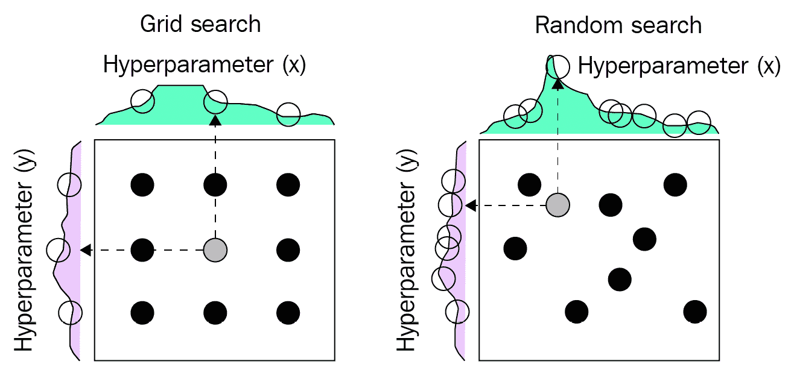

# 7

# 揭示深度学习模型的秘密

到目前为止，我们已经描述了如何构建并高效训练**深度学习**（**DL**）模型。然而，模型训练通常涉及多次迭代，因为针对特定任务正确配置训练的粗略指导仅存。

在本章中，我们将介绍超参数调优，这是寻找正确训练配置的最标准过程。随着我们指导您完成超参数调优的步骤，我们将介绍用于调优过程的流行搜索算法（网格搜索、随机搜索和贝叶斯优化）。我们还将探讨可解释 AI 领域，即在预测过程中理解模型操作的过程。我们将描述这一领域中的三种最常见技术：**置换特征重要性**（**PFI**）、**SHapley 加法解释**（**SHAP**）、**局部可解释模型无关解释**（**LIME**）。

本章中，我们将涵盖以下主要主题：

+   使用超参数调优获取最佳性能模型

+   通过可解释 AI 理解模型行为

# 技术要求

您可以从本书的 GitHub 存储库下载本章的补充材料，链接为 [`github.com/PacktPublishing/Production-Ready-Applied-Deep-Learning/tree/main/Chapter_7`](https://github.com/PacktPublishing/Production-Ready-Applied-Deep-Learning/tree/main/Chapter_7)。

# 使用超参数调优获取最佳性能模型

如在 *第三章* 中描述的，*开发强大的深度学习模型*，获取能够为底层任务提取正确模式的 DL 模型需要适当配置多个组件。尽管构建合适的模型架构通常会引入许多困难，但设置适当的模型训练是大多数人都在努力解决的另一个挑战。

在**机器学习**（**ML**）中，*超参数* *是指控制学习过程的任何参数*。在许多情况下，数据科学家通常关注与模型相关的超参数，例如特定类型层的数量、学习率或优化器类型。然而，超参数还包括数据相关配置，如应用的增强类型和模型训练的抽样策略。将一组超参数进行更改并理解性能变化的迭代过程，以找到目标任务的正确超参数集合，称为*超参数调优*。确切地说，您将有一组要探索的超参数。对于每次迭代，将会以不同的设置配置一个或多个超参数，并使用调整后的设置训练新模型。经过迭代过程，用于最佳模型的超参数配置将是最终输出。

在本章中，我们将学习用于超参数调整的各种技术和工具。

## 超参数调整技术

*超参数调整技术可以通过选择目标超参数的值的方式而异*。在各种技术中，我们将重点介绍最常见的几种：**网格搜索**、**随机搜索**和**贝叶斯优化**。

### 网格搜索

最基本的方法被称为网格搜索，其中*每个可能的值都逐个评估*。例如，如果你想探索从 0 到 1 的学习率，增加幅度为 0.25，那么网格搜索将会为每个可能的学习率（0.25、0.5、0.75 和 1）训练模型，并选择生成最佳模型的学习率。

### 随机搜索

另一方面，*随机搜索生成超参数的随机值，并重复训练，直到达到最大实验次数为止*。如果我们将前面章节的例子转换为随机搜索，我们必须定义最大实验次数和学习率的边界。在这个例子中，我们将最大实验次数设置为 5，边界设置为 0 到 1。然后，随机搜索将在 0 到 1 之间选择一个随机值，并使用所选的学习率训练模型。这个过程将重复 5 次，选择生成最佳模型的学习率作为超参数调整的输出。

为了帮助理解，以下图表总结了网格搜索和随机搜索之间的区别：



图 7.1 – 网格搜索和随机搜索的差异

在上图中，*x*和*y*表示两个不同的超参数。每个轴上的紫色和绿色图表显示了模型性能随每个超参数变化的情况。

虽然网格搜索和随机搜索都很容易实现，但它们都有一个共同的限制：它们不能保证目标超参数的最佳值。这个问题主要源于在选择下一个要探索的值时没有考虑前面的结果。为了克服这个问题，引入了一种新的搜索算法：贝叶斯优化。

### 贝叶斯优化

贝叶斯优化的理念很简单：*构建一个代理模型，映射超参数与底层模型之间的关系，并在整个超参数调整过程中进行调整，以便我们可以选择一个超参数值，这个超参数值很可能会在后续实验中使我们对关系有更好的理解*。利用生成的代理模型，我们可以选择很可能会给我们带来更好模型的超参数值。

有许多构建代理模型的方法。如果我们假设关系可以表示为线性函数，那么代理模型生成过程将简单地是线性回归。实际上，关系要复杂得多，最成功的技术是使用高斯过程回归。在这里，我们假设关系可以用一组正态分布来表示。换句话说，我们选择的每个值都是从多元正态分布中随机选择的。如果我们想详细讨论贝叶斯优化的每个细节，我们将需要引入多个概率和数学术语。我们相信，本节的高层描述和下一节的完整示例足以让您应用使用贝叶斯优化进行超参数调整。如果您想了解贝叶斯优化背后的理论，请访问[`ieeexplore.ieee.org/abstract/document/7352306`](https://ieeexplore.ieee.org/abstract/document/7352306)。

## 超参数调整工具

由于超参数调整在 ML 项目中起着重要作用，因此存在许多旨在简化此过程的库。以下是一些流行的库：

+   **Scikit-Optimize**: [`scikit-optimize.github.io`](https://scikit-optimize.github.io)

+   **Optuna**: [`optuna.org`](https://optuna.org)

+   **HyperOpt**: [`hyperopt.github.io`](http://hyperopt.github.io)

+   **Ray Tune**: [`docs.ray.io/en/latest/tune/index.html`](https://docs.ray.io/en/latest/tune/index.html)

+   **Bayesian Optimization**: [`github.com/fmfn/BayesianOptimization`](https://github.com/fmfn/BayesianOptimization)

+   **Metric Optimization Engine** (**MOE**): [`github.com/Yelp/MOE`](https://github.com/Yelp/MOE)

+   **Spearmint**: [`github.com/HIPS/Spearmint`](https://github.com/HIPS/Spearmint)

+   **GPyOpt**: [`github.com/SheffieldML/GPyOpt`](https://github.com/SheffieldML/GPyOpt)

+   **SigOpt**: [`sigopt.com`](https://sigopt.com/)

+   **FLAML**: [`github.com/microsoft/FLAML`](https://github.com/microsoft/FLAML)

+   **Dragonfly**: [`github.com/dragonfly/dragonfly`](https://github.com/dragonfly/dragonfly)

+   **HpBandSter**: [`github.com/automl/HpBandSter`](https://github.com/automl/HpBandSter)

+   **Nevergrad**: [`github.com/facebookresearch/nevergrad`](https://github.com/facebookresearch/nevergrad)

+   **ZOOpt**: [`github.com/polixir/ZOOpt`](https://github.com/polixir/ZOOpt)

+   **HEBO**: [`github.com/huawei-noah/HEBO/tree/master/HEBO`](https://github.com/huawei-noah/HEBO/tree/master/HEBO)

+   **SageMaker**: [`docs.aws.amazon.com/sagemaker/latest/dg/automatic-model-tuning-how-it-works.html`](https://docs.aws.amazon.com/sagemaker/latest/dg/automatic-model-tuning-how-it-works.html)

在各种工具中，我们将关注 Ray Tune，因为我们在《第六章》*Chapter 6* *Efficient Model Training* 的 *Training a model using Ray* 部分中介绍了如何使用 Ray 进行分布式训练。

### 使用 Ray Tune 进行超参数调整

作为 Ray 的一部分，一个旨在跨多台机器扩展 Python 工作负载的框架，Ray Tune 专为大规模实验执行和超参数调整而设计。在本节中，我们将为您介绍如何使用 **Ray Tune** 进行超参数调整的配置和调度。尽管示例旨在抽象表示模型训练功能，但 Ray Tune 的设置和文档足够清晰，以至于 **PyTorch** 和 **TensorFlow**（**TF**）的集成自然而然地在本节末尾完成。

首先，我们将介绍 Ray Tune 的基础知识。Ray Tune 的核心功能来自 `tune.run` 函数，该函数管理所有实验、日志和检查点。`tune.run` 函数的基本用法如下代码片段所示：

```py
from ray import tune
def tr_function(conf):
    num_iterations = conf["num_it"]
    for i in range(num_iterations):
        … // training logic
        tune.report(mean_accuracy=acc)
tune.run(
    run_or_experiment=tr_function
    conf={"num_it": tune.grid_search([10, 20, 30, 40])})
```

`tune.run` 函数接受 `run_or_experiment` 参数，该参数定义训练逻辑，以及 `conf` 参数，该参数配置超参数调整。每个超参数在 `conf` 中提供的搜索函数类型决定了实验的数量。在上述示例中，我们使用了 `tune.grid_search([10, 20, 30, 40])`，这将启动四个实验，每个实验都会运行为 `num_iterations` 分配的函数 (`tr_function`)，并使用不同的 `num_iterations` 值。在 `tr_function` 中，我们可以通过 `conf` 参数访问分配的超参数。值得一提的是，Ray Tune 提供了大量的采样方法 ([`docs.ray.io/en/latest/tune/api_docs/search_space.html#tune-sample-docs`](https://docs.ray.io/en/latest/tune/api_docs/search_space.html#tune-sample-docs))。

Ray Tune 作为 `tune.suggest` 的一部分整合了许多开源优化库，为超参数调整提供各种先进的搜索算法。流行的算法包括 HyperOpt、Bayesian Optimization、Scitkit-Optimize 和 Optuna。完整列表可以在 [`docs.ray.io/en/latest/tune/api_docs/suggestion.html`](https://docs.ray.io/en/latest/tune/api_docs/suggestion.html) 找到。在下面的示例中，我们将描述如何使用 `BayesOptSearch`，正如其名称所示，它实现了贝叶斯优化：

```py
from ray import tune
from ray.tune.suggest.bayesopt import BayesOptSearch
conf = {"num_it": tune.randint(100, 200)}
bayesopt = BayesOptSearch(metric="mean_accuracy", mode="max")
tune.run(
    run_or_experiment=tr_function
    config = conf,
    search_alg = bayesopt)
```

在上述代码片段中，我们向 `search_alg` 参数提供了 `BayesOptSearch` 的一个实例。该示例将尝试找到 `num_iterations`，以提供具有最高 `mean_accuracy` 的模型。

另一个`tune.run`的关键参数是`stop`。该参数可以接受一个字典、一个函数或一个`Stopper`对象，用于定义停止标准。如果是一个字典，键必须是`run_or_experiment`函数返回结果中的字段之一。如果是一个函数，它应返回一个布尔值，一旦满足停止条件就为`True`。以下是这两种情况的示例：

```py
# dictionary-based stop
tune.run(tr_function,
        stop={"training_iteration": 20, 
              "mean_accuracy": 0.96})
# function-based stop
def stp_function(trial_id, result):
    return result["training_iteration"] > 20 or
           result["mean_accuracy"] > 0.96
tune.run(tr_function, stop=stp_function)
```

在基于字典的示例中，每个试验将在完成 10 次迭代或`mean_accuracy`达到指定值`0.96`时停止。基于函数的示例实现了相同的逻辑，但使用了`stp_function`函数。对于`stopper`类用例，您可以参考[`docs.ray.io/en/latest/tune/tutorials/tune-stopping.html#stopping-with-a-class`](https://docs.ray.io/en/latest/tune/tutorials/tune-stopping.html#stopping-with-a-class)。

*试验是 Ray Tune 的内部数据结构，包含关于每个实验的元数据* ([`docs.ray.io/en/latest/tune/api_docs/internals.html#trial-objects`](https://docs.ray.io/en/latest/tune/api_docs/internals.html#trial-objects))。每个试验都有一个唯一的 ID（`trial.trial_id`），其超参数设置可以通过`trial.config`进行检查。有趣的是，可以通过`tune.run`的`resources_per_trial`参数和`trial.placement_group_factory`为每个试验分配不同规模的机器资源。此外，`num_samples`参数可用于控制试验的数量。

从`ray.tune`返回的`Analysis`实例可以获得您实验的摘要。以下代码片段描述了您可以从`Analysis`实例中检索的一组信息：

```py
# last reported results
df = analysis.results_df
# list of trials
trs = analysis.trials
# max accuracy 
max_acc_df = analysis.dataframe(metric="mean_accuracy", mode="max")
# dict mapping for all trials in the experiment
all_dfs = analysis.trial_dataframes
```

您还可以从`Analysis`实例中检索其他有用的信息。完整详情请参阅[`docs.ray.io/en/latest/tune/api_docs/analysis.html`](https://docs.ray.io/en/latest/tune/api_docs/analysis.html)。

这完成了 Ray Tune 的核心组件。如果您希望为 PyTorch 或 TF 模型训练集成 Ray Tune，您所需做的就是调整示例中的`tr_function`，使其在记录相关性能指标的同时训练您的模型。

总体而言，我们已探讨了超参数调整的不同选项。本节介绍的工具应有助于我们有效地找到 DL 模型的最佳配置。

需要记住的事情

a. 获得特定任务的工作 DL 模型需要找到合适的模型架构并使用适当的训练配置。找到最佳组合的过程称为超参数调整。

b. 三种最流行的超参数调整技术是网格搜索、随机搜索和贝叶斯优化。

c. 流行的超参数调整工具包括 Scikit-Optimize、Optuna、Hyperopt、Ray Tune、Bayesian Optimization、MOE、Spearmint、GpyOpt 和 SigOpt。

到目前为止，我们将 DL 模型视为黑匣子。超参数调优涉及搜索未知空间，无法解释模型如何找到潜在模式。在下一节中，我们将探讨研究人员最近致力于理解 DL 灵活性的工作。

# 通过可解释人工智能理解模型的行为

**可解释人工智能**是一个非常活跃的研究领域。在商业环境中，理解 AI 模型往往能够轻松带来显著的竞争优势。所谓的*黑匣子模型（复杂算法模型）*，尽管能够带来出色的结果，却因其隐含逻辑而常遭批评。高层管理人员很难完全基于 AI 设计核心业务，因为解释模型和预测并不是一件容易的事情。您如何说服您的业务合作伙伴，表明 AI 模型将始终产生预期结果？您如何确保模型在新数据上仍然有效？模型是如何生成结果的？可解释人工智能帮助我们解答这些问题。

在我们进一步探讨之前，让我们先了解两个重要的概念：**可解释性**和**解释性**。乍一听可能很相似。可解释性告诉我们为什么特定的输入会产生特定模型的输出：特定变量对结果的影响。解释性超越了可解释性；它不仅关注输入和输出之间的因果关系，还帮助我们理解模型作为一个整体的工作方式，包括其所有子元素。解释性还由透明性、可复现性和可转移性三个基本理念驱动。这意味着我们应该能够完全理解我们的模型所做的事情，数据如何在经过模型时影响模型，并能够重现结果。

可解释人工智能在每个 ML 项目的各个步骤中发挥作用——开发（模型架构的解释和每个超参数的含义）、训练（训练过程中模型的变化）、以及推理（结果解释）。在 DL 模型的情况下，由于网络架构复杂、算法复杂性高，以及在初始化权重、偏置、正则化和超参数优化时使用随机数，因此实现可解释性是困难的。

在本节中，我们将讨论几种常用于增强 DL 模型可信度的方法：**置换特征重要性**（**PFI**）、**特征重要性**（**FI**）、**SHapley 加性解释**（**SHAP**）和**局部可解释模型无关解释**（**LIME**）。所有这些方法都是模型无关的；它们既可应用于 DL 模型，也可应用于其他支持 ML 模型，常用于设定基线评估指标。

## 置换特征重要性

神经网络缺乏理解输入特征对预测（模型输出）影响所需的内在属性。然而，有一种称为**置换特征重要性**（**PFI**）的模型无关方法可以解决这一困难。*PFI 的思想来自于输入特征与输出之间的关系：对于与输出变量高度相关的输入特征，改变其值会增加模型的预测误差。*如果关系较弱，模型的性能不会受到太多影响。如果关系很强，性能将下降。PFI 经常应用于测试集，以获取对未见数据上模型可解释性的更广泛理解。

PFI 的主要缺点与数据具有一组相关输入特征相关。在这种情况下，即使您改变该组的一个特征，模型的性能也不会改变太多，因为其他特征将保持不变。

深入探讨这个想法，我们可以完全删除该特征并测量模型的性能。这种方法称为**特征重要性**（**FI**），也称为**置换重要性**（**PI**）或**平均减少精度**（**MDA**）。让我们看看如何为任何黑盒模型实现 FI。

## 特征重要性

在本节中，我们将使用*ELI5* Python 包（[`eli5.readthedocs.io`](https://eli5.readthedocs.io)）执行 FI 分析。它在 FI 领域突出的原因是非常简单易用。让我们看一下在 Keras 定义的 TF 模型中使用 ELI5 的最小代码示例（有关模型定义的详细信息，请参见*第三章*，*开发一个强大的深度学习模型*）：

```py
import eli5
from eli5.sklearn import PermutationImportance
def score(self, x, y_true):
    y_pred = model.predict(x)
    return tf.math.sqrt( tf.math.reduce_mean( tf.math.square(y_pred-y_true), axis=-1)) 
perm = PermutationImportance(model, random_state=1, scoring=score).fit(features, labels)
fi_perm=perm.feature_importances_
fi_std=perm.feature_importances_std_
```

正如您所见，代码几乎是自解释的。首先，我们需要为计算目标评估指标的评分函数创建一个包装器。然后，将`tf.keras`模型传递给`PermutationImportance`类的构造函数。`fit`函数负责处理特征和标签的特征重要性计算。计算完成后，我们可以访问每个特征的平均特征重要性（`fi_perm`）和置换结果的标准差（`fi_std`）。以下代码片段展示了如何将置换重要性的结果可视化为条形图：

```py
plt.figure()
for index, row in enumerate(fi_perm):
    plt.bar(index, 
            fi_perm[index], 
            color="b", 
            yerr=fi_std[index], 
            align="center")
plt.show()
```

如果模型既不基于 scikit-learn 也不基于 Keras，则需要使用`permutation_importance.get_score_importance`函数。以下代码片段描述了如何在 PyTorch 模型中使用该函数：

```py
import numpy as np
from eli5.permutation_importance import get_score_importances
# A trained PyTorch model
black_box_model = ...
def score(X, y):
    y_pred = black_box_model.predict(X)
    return accuracy_score(y, y_pred)
base_score, score_decreases = get_score_importances(score, X, y)
feature_importances = np.mean(score_decreases, axis=0)
```

与`PermutationImportance`类不同，`get_score_importances`函数同时接收评分函数、特征和标签。

接下来，我们将看看**SHapley Additive exPlanations**（**SHAP**），这也是一种与模型无关的方法。

## SHapley Additive exPlanations（SHAP）

SHAP 是一种解释方法，利用夏普利值来理解给定黑盒模型。我们不会涵盖 SHAP 基于的合作博弈理论，但我们将以高层次来讨论过程。首先，让我们看看 Shapley 值的定义：*在不同模拟中，所有可能联盟的平均边际贡献*。这究竟意味着什么？假设有四位朋友(*f1*、*f2*、*f3*和*f4*)共同努力为一个在线游戏获得最高分数。要计算一个人的夏普利值，我们需要计算边际贡献，即该人参与游戏与不参与游戏时分数的差异。这个计算必须针对所有可能的子组（**联盟**）进行。

让我们仔细看一看。为了计算*f1*对朋友*f2*、*f3*和*f4*联合体的边际贡献，我们需要执行以下操作：

1.  计算所有朋友(*f1*、*f2*、*f3*和*f4*)生成的分数(*s1*)。

1.  计算朋友*f2*、*f3*和*f4*生成的分数(*s2*)。

1.  最后，朋友*f1*对朋友*f2*、*f3*和*f4*联合体的边际贡献*(v)*等于*s1-s2*。

现在，我们需要计算所有子组合的边际贡献（不仅仅是朋友的联合体；即*f2*、*f3*和*f4*）。这里是每一个可能的组合：

1.  *f1*与*无人*正在贡献(*v1*)

1.  *f1*和*f2*与*f2*(*v2*)

1.  *f1*和*f3*与*f3*(*v3*)

1.  *f1*和*f4*与*f4*(*v4*)

1.  *f1*和*f2*和*f3*与*f2*和*f3*(*v5*)

1.  *f1*和*f2*和*f4*与*f2*和*f4*(*v6*)

1.  *f1*和*f3*和*f4*与*f3*和*f4*(*v7*)

1.  *f1*和*f2*和*f3*和*f4*与*f2*和*f3*和*f4*(*v8*)

总体而言，*f1*的夏普利值(*SV*)为*(v1+v2+...+v8) / 8*。

为了使我们的结果具有统计学意义，我们需要在多次模拟中运行这些计算。您可以看到，如果我们扩展朋友的数量，计算将变得非常复杂，导致计算资源的高消耗。因此，我们使用具体的近似值，产生了不同类型的所谓解释器（夏普利值的近似器），这些解释器可以在`shap`库中找到([`shap.readthedocs.io/en/latest/index.html`](https://shap.readthedocs.io/en/latest/index.html))。通过比较所有朋友的夏普利值，我们可以找出每个个体对最终分数的贡献。

如果我们回到 DL 模型的解释，我们可以看到朋友们变成了一组特征，而分数则是模型的性能。有了这个理念，让我们来看看 SHAP 解释器，它可以用于 DL 模型：

+   `KernelExplainer`：这是最流行的方法，也是与模型无关的。它基于**局部可解释模型无关解释**（**LIME**），我们将在下一节讨论。

+   `DeepExplainer`：这种方法基于 DeepList 方法，它在特定输入上分解输出（[`arxiv.org/abs/1704.02685`](https://arxiv.org/abs/1704.02685)）。

+   `GradientExplainer`：这种方法基于集成梯度的扩展（[`arxiv.org/abs/1703.01365`](https://arxiv.org/abs/1703.01365)）。

例如，我们将展示一个应用于 TF 模型的极简代码示例。完整详情请参阅官方文档 [`shap-lrjball.readthedocs.io/en/latest/index.html`](https://shap-lrjball.readthedocs.io/en/latest/index.html)：

```py
import shap
# initialize visualization
shap.initjs()
model = … # tf.keras model or PyTorch model (nn.Module) 
explainer = shap.KernelExplainer(model, sampled_data)
shap_values = explainer.shap_values(data, nsamples=300)
shap.force_plot(explainer.expected_value, shap_values, data)
shap.summary_plot(shap_values, sampled_data, feature_names=names, plot_type="bar")
```

对于 PyTorch 模型，您需要将模型包装在一个包装器中，以将输入和输出转换为正确的类型（`f=lambda x: model(torch.autograd.Variable(torch.from_numpy(x))).detach().numpy()`）。在下面的示例中，我们定义了 `KernelExplainer`，它接受 DL 模型和 `sampled_data` 作为输入。接下来，我们使用 `explainer.shap_values` 函数计算 SHAP 值（Shapley 值的近似值）。在本例中，我们使用 `300` 个扰动样本来估计给定预测的 SHAP 值。如果我们的 `sampled_data` 包含 `100` 个示例，则将执行 100*300 次模型评估。类似地，您可以使用 `GradientExplainer`（`shap.GradientExplainer(model, sampled_data)`）或 `DeepExplainer`（`shap.DeepExplainer(model, sampled_data)`）。`sampled_data` 的大小需要足够大，以正确表示分布。在最后几行中，我们使用 `shap.force_plot` 函数在加性力布局中可视化 SHAP 值，并使用 `shap.summary_plot` 函数创建全局模型解释图。

现在，让我们看看 LIME 方法。

## 本地可解释的模型无关解释（LIME）

LIME 是一种训练本地替代模型以解释模型预测的方法。首先，您需要准备一个要解释的模型和一个样本。LIME 使用您的模型从一组扰动数据中收集预测，并将它们与原始样本进行比较，以分配相似性权重（如果预测接近初始样本的预测，则权重较高）。LIME 使用特定数量的特征通过相似性权重在采样数据上拟合一个内在可解释的替代模型。最后，LIME 将替代模型解释视为所选示例的黑盒模型的解释。要执行 LIME 分析，我们可以使用 `lime` 包（[`lime-ml.readthedocs.io`](https://lime-ml.readthedocs.io)）。

让我们看一个为 DL 模型设计的示例：

```py
from lime.lime_tabular import LimeTabularExplainer as Lime
from matplotlib import pyplot as plt
expl = Lime(features, mode='classification', class_names=[0, 1])
# explain first sample
exp = expl.explain_instance(x[0], model.predict, num_features=5, top_labels=1)
# show plot
exp.show_in_notebook(show_table=True, show_all=False) 
```

在前面的示例中，我们正在使用 `LimeTabularExplainer` 类。构造函数接受一个训练集、特征、类名和模式类型 (`'classification'`)。同样，您可以通过提供 `'regression'` 模式类型来设置用于回归问题的 LIME。然后，通过展示五个最重要的特征及其影响，我们解释了测试集的第一个预测 (`x[0]`)。最后，我们生成了一个基于计算的 LIME 解释的图表。

要记住的事项

a. 在解释性人工智能中，模型可解释性和解释性是两个关键概念。

b. 解释性人工智能中流行的无关模型技术包括 PFI、FI、SHAP 和 LIME。

c. PFI、FI 和 SHAP 是允许您在本地（单个样本）和全局（一组样本）级别解释您的模型的方法。另一方面，LIME 关注单个样本及其对应的模型预测。

在本节中，我们已经解释了解释性人工智能的概念以及四种最常见的技术：PFI、FI、SHAP 和 LIME。

# 总结

我们从调整超参数开始了本章。我们描述了用于超参数调整的三种基本搜索算法（网格搜索、随机搜索和贝叶斯优化），并介绍了许多可集成到项目中的工具。在列出的工具中，我们涵盖了 Ray Tune，因为它支持分布式超参数调整，并实现了许多即用的最先进搜索算法。

然后，我们讨论了解释性人工智能。我们解释了最标准的技术（PFI、FI、SHAP 和 LIME），以及它们如何用来发现模型在数据集中每个特征变化时的行为变化。

在下一章中，我们将把焦点转向部署。我们将学习 ONNX，这是一种用于机器学习模型的开放格式，并了解如何将 TF 或 PyTorch 模型转换为 ONNX 模型。
