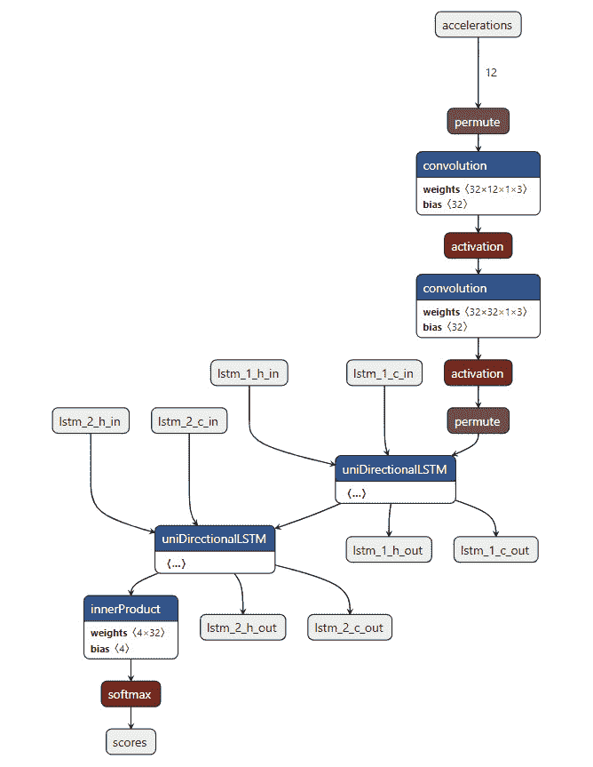
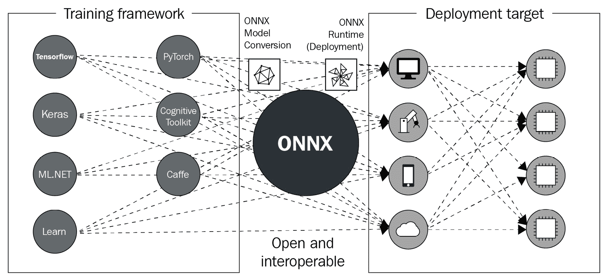

# 第八章：简化深度学习模型部署

在生产环境中部署的 **深度学习** (**DL**) 模型通常与训练过程中的模型有所不同。它们通常被增强以处理传入请求，并具有最高性能。然而，目标环境通常过于广泛，因此需要大量定制以涵盖非常不同的部署设置。为了克服这一困难，您可以利用 **开放神经网络交换** (**ONNX**)，这是一种用于 ML 模型的标准文件格式。在本章中，我们将介绍如何利用 ONNX 在 DL 框架之间转换 DL 模型，并如何将模型开发过程与部署分离。

在本章中，我们将涵盖以下主要内容：

+   ONNX 简介

+   TensorFlow 和 ONNX 之间的转换

+   PyTorch 和 ONNX 之间的转换

# 技术要求

您可以从以下 GitHub 链接下载本章的补充材料：[`github.com/PacktPublishing/Production-Ready-Applied-Deep-Learning/tree/main/Chapter_8`](https://github.com/PacktPublishing/Production-Ready-Applied-Deep-Learning/tree/main/Chapter_8)。

# ONNX 简介

您可以使用多种 DL 框架来训练 DL 模型。然而，*DL 模型部署中的一个主要困难是这些框架之间缺乏互操作性*。例如，PyTorch 和 **TensorFlow** (**TF**) 之间的转换引入了许多困难。

在许多情况下，DL 模型还会为部署环境进一步增强，以提高准确性并减少推断延迟，利用底层硬件提供的加速功能。不幸的是，这需要广泛的软件和硬件知识，因为每种类型的硬件为运行应用程序提供不同的加速。用于 DL 的常用硬件包括 **中央处理单元** (**CPU**)、**图形处理单元** (**GPU**)、**关联处理单元** (**APU**)、**张量处理单元** (**TPU**)、**现场可编程门阵列** (**FPGA**)、**视觉处理单元** (**VPU**)、**神经处理单元** (**NPU**) 和 **JetsonBoard**。

此过程不是一次性操作；一旦模型以任何方式更新，可能需要重复此过程。为了减少这一领域的工程工作量，一组工程师共同努力，提出了一种标准化模型组件的中介：`.onnx` 文件，用于跟踪模型设计及网络内每个操作如何与其他组件链接。`.onnx` 文件 ([`github.com/lutzroeder/netron`](https://github.com/lutzroeder/netron))。以下是一个示例可视化：



图 8.1 – ONNX 文件的 Netron 可视化

如您所见，ONNX 是训练框架和部署环境之间的一层。虽然 ONNX 文件定义了一种交换格式，但也存在支持 ONNX 模型的 **ONNX Runtime** (**ORT**)，后者支持对 ONNX 模型进行硬件无关的加速优化。换句话说，ONNX 生态系统允许您选择任何 DL 框架进行训练，并使得部署时的硬件特定优化变得轻而易举。



图 8.2 – ONNX 在深度学习项目中的位置

总结一下，ONNX 有助于以下任务：

+   简化不同深度学习框架之间的模型转换

+   为深度学习模型提供与硬件无关的优化

在接下来的部分中，我们将更详细地了解 ORT。

## 使用 ONNX Runtime 运行推理

ORT 旨在直接支持使用 ONNX 模型进行训练和推理，无需将其转换为特定框架。然而，训练并不是 ORT 的主要用例，因此我们将专注于推理这一方面，在本节中进行讨论。

ORT 利用不同的硬件加速库，称为 **Execution Providers** (**EPs**)，以提高各种硬件架构的延迟和准确性。无论模型训练期间使用的 DL 框架和底层硬件如何，ORT 推理代码保持不变。

下面的代码片段是一个 ONNX 推理代码示例。完整详情请查阅 [`onnxruntime.ai/docs/get-started/with-python.html`](https://onnxruntime.ai/docs/get-started/with-python.html)。

```py
import onnxruntime as rt
providers = ['CPUExecutionProvider'] # select desired provider or use rt.get_available_providers()
model = rt.InferenceSession("model.onnx", providers=providers)
onnx_pred = model.run(output_names, {"input": x}) # x is your model's input
```

`InferenceSession` 类接受文件名、序列化的 ONNX 模型或 ORT 模型的字节字符串作为输入。在上述示例中，我们指定了一个 ONNX 文件的名称 (`"model.onnx"`)。`providers` 参数和按优先顺序排列的执行提供者列表（如 `CPUExecutionProvider`、`TvmExecutionProvider`、`CUDAExecutionProvider` 等）是可选的，但非常重要，因为它们定义了将应用的硬件加速类型。在最后一行，`run` 函数触发模型预测。`run` 函数有两个主要参数：`output_names`（模型输出的名称）和 `input_feed`（输入字典，包含您希望使用模型进行预测的输入名称和值）。

需要记住的事项

a. ONNX 提供了用于 ML 模型的标准化和跨平台的表示。

b. ONNX 可以用于将一个 DL 框架中实现的模型转换为另一个框架，转换过程需要很少的工作量。

c. ORT 为已部署的模型提供与硬件无关的加速。

在接下来的两节中，我们将看看使用 TF 和 PyTorch 创建 ONNX 模型的过程。

# 在 TensorFlow 和 ONNX 之间的转换

首先，我们将研究 TF 到 ONNX 的转换。我们将这个过程分解为两步：将 TF 模型转换为 ONNX 模型，以及将 ONNX 模型转换回 TF 模型。

## 将 TensorFlow 模型转换为 ONNX 模型

`tf2onnx` 用于将 TF 模型转换为 ONNX 模型 ([`github.com/onnx/tensorflow-onnx`](https://github.com/onnx/tensorflow-onnx))。此库支持 TF 的两个版本（版本 1 和版本 2）。此外，还支持将模型转换为特定部署的 TF 格式，如 TensorFlow.js 和 TensorFlow Lite。

要将使用 `saved_model` 模块生成的 TF 模型转换为 ONNX 模型，可以使用 `tf2onnx.convert` 模块，如下所示：

```py
python -m tf2onnx.convert --saved-model tensorflow_model_path --opset 9 --output model.onnx  
```

在上述命令中，`tensorflow-model-path` 指向磁盘上保存的 TF 模型，`--output` 定义了生成的 ONNX 模型保存的位置，`--opset` 设置了 ONNX 的 `opset`，它定义了 ONNX 的版本和操作符 ([`github.com/onnx/onnx/releases`](https://github.com/onnx/onnx/releases))。如果您的 TF 模型未使用 `tf.saved_model.save` 函数保存，需要按照以下格式指定输入和输出格式：

```py
# model in checkpoint format
python -m tf2onnx.convert --checkpoint tensorflow-model-meta-file-path --output model.onnx --inputs input0:0,input1:0 --outputs output0:0
# model in graphdef format
python -m tf2onnx.convert --graphdef tensorflow_model_graphdef-file --output model.onnx --inputs input0:0,input1:0 --outputs output0:0 
```

上述命令描述了 Checkpoint ([`www.tensorflow.org/api_docs/python/tf/train/Checkpoint`](https://www.tensorflow.org/api_docs/python/tf/train/Checkpoint)) 和 GraphDef ([`www.tensorflow.org/api_docs/python/tf/compat/v1/GraphDef`](https://www.tensorflow.org/api_docs/python/tf/compat/v1/GraphDef)) 格式模型的转换。关键参数是 `--checkpoint` 和 `--graphdef`，它们指示了模型格式以及源模型的位置。

`tf2onnx` 还提供了一个 Python API，您可以在 [`github.com/onnx/tensorflow-onnx`](https://github.com/onnx/tensorflow-onnx) 找到它。

接下来，我们将看一下如何将 ONNX 模型转换为 TF 模型。

## 将 ONNX 模型转换为 TensorFlow 模型

虽然 `tf2onnx` 用于从 TF 到 ONNX 的转换，但 `onnx-tensorflow` ([`github.com/onnx/onnx-tensorflow`](https://github.com/onnx/onnx-tensorflow)) 用于将 ONNX 模型转换为 TF 模型。它与 `tf2onnx` 一样，基于终端命令。以下是一个简单的 `onnx-tf` 命令示例：

```py
onnx-tf convert -i model.onnx -o tensorflow_model_file
```

在上述命令中，`-i` 参数用于指定源 `.onnx` 文件，而 `-o` 参数用于指定新 TF 模型的输出位置。`onnx-tf` 命令的其他用例在 [`github.com/onnx/onnx-tensorflow/blob/main/doc/CLI.md`](https://github.com/onnx/onnx-tensorflow/blob/main/doc/CLI.md) 中有详细说明。

此外，您也可以使用 Python API 执行相同的转换：

```py
import onnx
from onnx_tf.backend import prepare
onnx_model = onnx.load("model.onnx") 
tf_rep = prepare(onnx_model)  
tensorflow-model-file-path = path/to/tensorflow-model
tf_rep.export_graph(tensorflow_model_file_path)
```

在上述 Python 代码中，使用 `onnx.load` 函数加载 ONNX 模型，然后使用从 `onnx_tf.backend` 导入的 `prepare` 进行调整，最后使用 `export_graph` 函数将 TF 模型导出并保存到指定位置 (`tensorflow_model_file_path`)。

需要记住的事情

a. 从 TF 到 ONNX 的转换和从 ONNX 到 TF 的转换分别通过 `onnx-tensorflow` 和 `tf2onnx` 完成。

b. `onnx-tensorflow` 和 `tf2onnx` 都支持命令行界面和提供 Python API。

接下来，我们将描述在 PyTorch 中如何执行从 ONNX 到 ONNX 的转换。

# PyTorch 和 ONNX 之间的转换

在本节中，我们将解释如何将 PyTorch 模型转换为 ONNX 模型，然后再转换回来。在前一节已经覆盖了 TF 和 ONNX 之间的转换，所以通过本节结束时，你应该能够完成 TF 和 PyTorch 之间模型的转换。

## 将 PyTorch 模型转换为 ONNX 模型

有趣的是，PyTorch 内置支持将其模型导出为 ONNX 模型 ([`pytorch.org/tutorials/advanced/super_resolution_with_onnxruntime.html`](https://pytorch.org/tutorials/advanced/super_resolution_with_onnxruntime.html))。给定一个模型，你只需要使用 `torch.onnx.export` 函数，如下面的代码片段所示：

```py
import torch
pytorch_model = ...
# Input to the model
dummy_input = torch.randn(..., requires_grad=True)
onnx_model_path = "model.onnx"
# Export the model
torch.onnx.export(
    pytorch_model,       # model being run
    dummy_input,         # model input (or a tuple for multiple inputs)
    onnx_model_path      # where to save the model (can be a file or file-like object) )
```

`torch.onnx.export` 的第一个参数是你想要转换的 PyTorch 模型。第二个参数必须是一个表示虚拟输入的张量。换句话说，这个张量必须是模型期望输入的大小。最后一个参数是 ONNX 模型的本地路径。

触发 `torch.onnx.export` 函数后，你应该能够看到一个 `.onnx` 文件生成在你提供的路径下 (`onnx_model_path`)。

现在，让我们看看如何将一个 ONNX 模型加载为 PyTorch 模型。

## 将 ONNX 模型转换为 PyTorch 模型。

不幸的是，PyTorch 没有内置支持加载 ONNX 模型的功能。但是，有一个名为 `onnx2pytorch` 的流行库可用于此转换 ([`github.com/ToriML/onnx2pytorch`](https://github.com/ToriML/onnx2pytorch))。假设这个库通过 `pip` 命令安装，下面的代码片段展示了这个转换过程：

```py
import onnx
from onnx2pytorch import ConvertModel
onnx_model = onnx.load("model.onnx")
pytorch_model = ConvertModel(onnx_model)
```

我们从 `onnx2pytorch` 模块中需要的关键类是 `ConverModel`。如前面的代码片段所示，我们将一个 ONNX 模型传递给这个类来生成一个 PyTorch 模型。

需记住的事项

a. PyTorch 内置支持将 PyTorch 模型导出为 ONNX 模型。这个过程涉及到 `torch.onnx.export` 函数。

b. 将 ONNX 模型导入 PyTorch 环境需要使用 `onnx2pytorch` 库。

在本节中，我们描述了在 ONNX 和 PyTorch 之间的转换过程。由于我们已经知道如何在 ONNX 和 TF 之间转换模型，所以 TF 和 PyTorch 之间的转换自然而然地进行了。

# 总结

在本章中，我们介绍了 ONNX，这是一个通用的 ML 模型表示方式。ONNX 的好处主要来自于其模型部署能力，因为它可以通过 ORT 在幕后处理环境特定的优化和转换。ONNX 的另一个优势来自于其互操作性；它可以用来将一个使用某一框架生成的 DL 模型转换为其他框架的模型。在本章中，我们特别介绍了 TensorFlow 和 PyTorch 的转换，因为它们是两个最常见的 DL 框架。

在迈向高效的深度学习模型部署的又一步中，在下一章中，我们将学习如何使用**弹性 Kubernetes 服务**（**EKS**）和 SageMaker 来建立一个模型推理端点。
