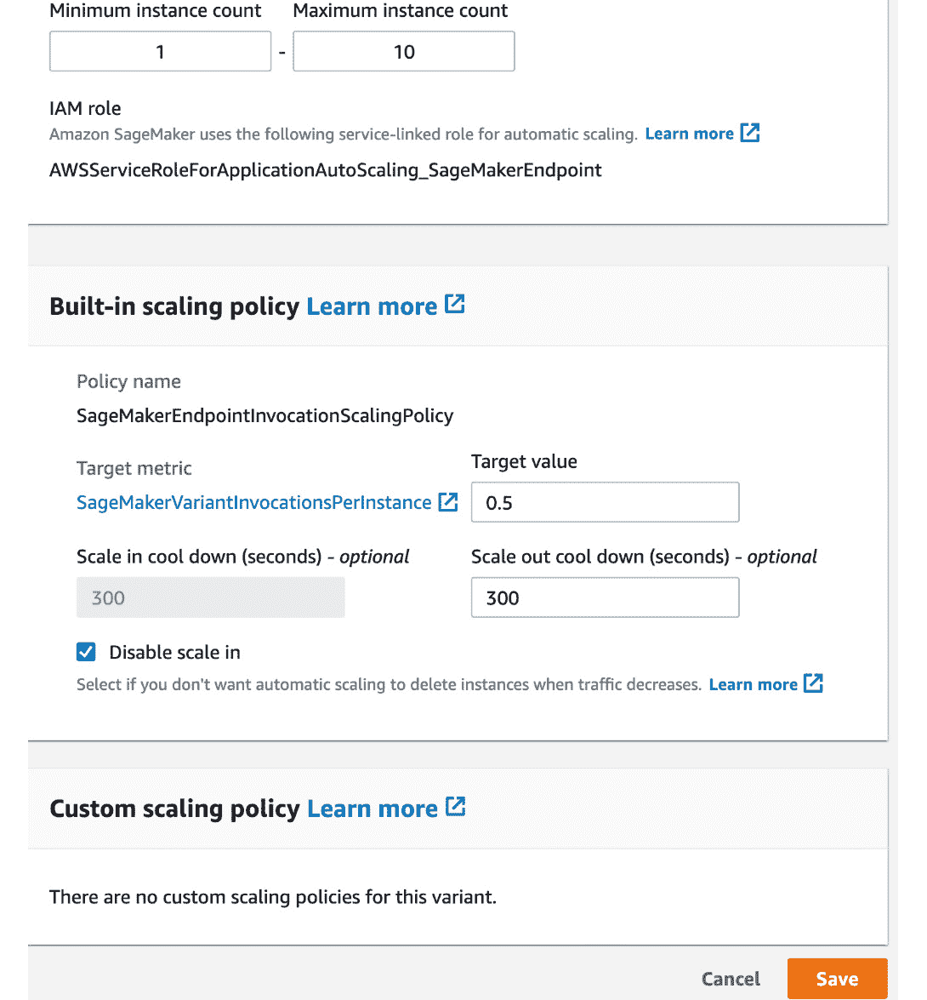
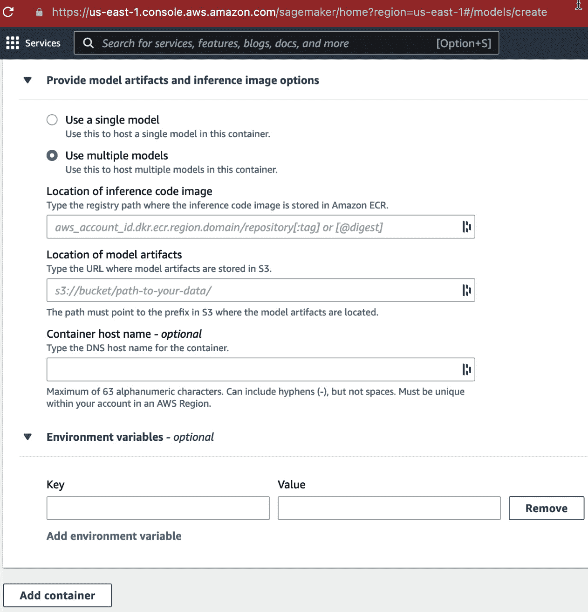

# 9

# 扩展深度学习管道

**亚马逊网络服务**（**AWS**）在**深度学习**（**DL**）模型部署方面提供了许多可能性。在本章中，我们将介绍两种最受欢迎的服务，专为将 DL 模型部署为推理端点而设计：**弹性 Kubernetes 服务**（**EKS**）和**SageMaker**。

在前半部分，我们将描述基于 EKS 的方法。首先，我们将讨论如何为**TensorFlow**（**TF**）和 PyTorch 模型创建推理端点，并使用 EKS 部署它们。我们还将介绍**弹性推理**（**EI**）加速器，它可以提高吞吐量同时降低成本。EKS 集群有托管推理端点的 pod 作为 Web 服务器。作为基于 EKS 的部署的最后一个主题，我们将介绍如何根据动态流量扩展这些 pod。

在后半部分，我们将介绍基于 SageMaker 的部署。我们将讨论如何为 TF、PyTorch 和 ONNX 模型创建推理端点。此外，端点将使用**亚马逊 SageMaker Neo**和 EI 加速器进行优化。然后，我们将设置在 SageMaker 上运行的推理端点的自动扩展。最后，我们将通过描述如何在单个 SageMaker 推理端点中托管多个模型来结束本章。

本章节中，我们将涵盖以下主要主题：

+   使用弹性 Kubernetes 服务进行推理

+   使用 SageMaker 进行推理

# 技术要求

您可以从本书的 GitHub 存储库下载本章的补充材料，网址为[`github.com/PacktPublishing/Production-Ready-Applied-Deep-Learning/tree/main/Chapter_9`](https://github.com/PacktPublishing/Production-Ready-Applied-Deep-Learning/tree/main/Chapter_9)。

# 使用弹性 Kubernetes 服务进行推理

EKS 旨在通过简化复杂的集群管理过程提供用于应用部署的 Kubernetes 集群（[`aws.amazon.com/eks`](https://aws.amazon.com/eks)）。有关创建 EKS 集群的详细步骤，请参阅[`docs.aws.amazon.com/eks/latest/userguide/create-cluster.html`](https://docs.aws.amazon.com/eks/latest/userguide/create-cluster.html)。通常情况下，EKS 集群用于部署任何 Web 服务应用程序，并根据需要进行扩展。EKS 上的推理端点只是处理模型推理请求的 Web 服务应用程序。在本节中，您将学习如何在 EKS 上托管 DL 模型推理端点。

Kubernetes 集群有一个控制平面和一组节点。控制平面根据流入流量的大小进行调度和扩展决策。在调度方面，控制平面管理在给定时间点运行作业的节点。在扩展方面，控制平面根据流入端点的流量大小增加或减少 pod 的大小。EKS 在幕后管理这些组件，以便您可以专注于有效和高效地托管您的服务。

本节首先描述了如何设置 EKS 集群。然后，我们将描述如何使用 TF 和 PyTorch 创建端点，以处理 EKS 集群上的模型推断请求。接下来，我们将讨论 EI 加速器，该加速器提高了推断性能，并降低了成本。最后，我们将介绍一种根据入站流量量动态扩展服务的方法。

## 准备 EKS 集群

基于 EKS 的模型部署的第一步是创建适当硬件资源的 pod。在本节中，我们将使用 AWS 建议的 GPU Docker 镜像（[`github.com/aws/deep-learning-containers/blob/master/available_images.md`](https://github.com/aws/deep-learning-containers/blob/master/available_images.md)）。这些标准镜像已在 Elastic Container Registry（ECR）注册并可用，ECR 提供了一个安全、可扩展和可靠的 Docker 镜像注册表（[`aws.amazon.com/ecr`](https://aws.amazon.com/ecr)）。接下来，我们应该将 NVIDIA 设备插件应用到容器中。此插件使机器学习（ML）操作能够利用底层硬件以实现较低的延迟。关于 NVIDIA 设备插件的更多详细信息，建议阅读 [`github.com/awslabs/aws-virtual-gpu-device-plugin`](https://github.com/awslabs/aws-virtual-gpu-device-plugin)。

在下面的代码片段中，我们将使用 `kubectl`，`kubectl` 需要提供一个关于集群、用户、命名空间和认证机制信息的 YAML 文件（[`kubernetes.io/docs/concepts/configuration/organize-cluster-access-kubeconfig`](https://kubernetes.io/docs/concepts/configuration/organize-cluster-access-kubeconfig)）。最常见的操作是 `kubectl apply`，它在 EKS 集群中创建或修改资源：

```py
kubectl apply -f https://raw.githubusercontent.com/NVIDIA/k8s-device-plugin/v1.12/nvidia-device-plugin.yml
```

在上述用例中，`kubectl apply` 命令根据 YAML 文件中的规范向 Kubernetes 集群应用 NVIDIA 设备插件。

## 配置 EKS

YAML 文件用于配置构成 Kubernetes 集群的机器以及集群内运行的应用程序。根据类型，YAML 文件中的配置可以分为两部分：*deployment* 和 *service*。deployment 部分控制 pod 内运行的应用程序。在本节中，它将用于创建 DL 模型的端点。在 EKS 环境中，运行在一个或多个 pod 上的一组应用程序称为 service。service 部分在集群上创建和配置服务。在整个 service 部分中，我们将为外部连接创建一个唯一的服务 URL，并配置入站流量的负载均衡。

在管理 EKS 集群时，命名空间可以很有用，因为它们在集群内部隔离了一组资源。要创建命名空间，可以简单地使用 `kubectl create namespace` 终端命令，如下所示：

```py
kubectl create namespace tf-inference
```

在上述命令中，我们为接下来将在下一节创建的推断端点和服务构建了 `tf-inference` 命名空间。

## 使用 TensorFlow 模型在 EKS 上创建推断端点

在这一部分中，我们将描述一个设计用于托管 TF 模型推断端点的 EKS 配置文件（`tf.yaml`）。端点由 *TensorFlow Service* 创建，这是一个用于部署 TF 模型的系统（[`www.tensorflow.org/tfx/guide/serving`](https://www.tensorflow.org/tfx/guide/serving)）。由于我们的主要重点是在 EKS 配置上，我们将简单地假设一个训练有素的 TF 模型已经作为 `.pb` 文件存储在 S3 上。

首先，让我们看看配置的 `Deployment` 部分，负责处理端点的创建：

```py
kind: Deployment
  apiVersion: apps/v1
  metadata:
    name: tf-inference # name for the endpoint / deployment
    labels:
      app: demo
      role: master
  spec:
    replicas: 1 # number of pods in the cluster
    selector:
      matchLabels:
        app: demo
        role: master
```

正如我们所见，配置的 `Deployment` 部分以 `kind: Deployment` 开始。在配置的第一部分中，我们提供了有关端点的一些元数据，并通过填写 `spec` 部分定义了系统设置。

端点的最重要配置在 `template` 下指定。我们将创建一个端点，可以通过 **超文本传输协议**（**HTTP**）请求以及 **远程过程调用**（**gRPC**）请求进行访问。HTTP 是用于网络客户端和服务器的最基本的传输数据协议。构建在 HTTP 之上，gRPC 是一个用于以二进制格式发送请求和接收响应的开源协议：

```py
    template:      
      metadata:
        labels:
          app: demo
          role: master
      spec:
        containers:
        - name: demo
          image: 763104351884.dkr.ecr.us-east-1.amazonaws.com/tensorflow-inference:2.1.0-gpu-py36-cu100-ubuntu18.04 # ECR image for TensorFlow inference
          command:
          - /usr/bin/tensorflow_model_server # start inference endpoint
          args: # arguments for the inference serving
          - --port=9000
          - --rest_api_port=8500
          - --model_name=saved_model
          - --model_base_path=s3://mybucket/models
          ports:
          - name: http
            containerPort: 8500 # HTTP port
          - name: gRPC
            containerPort: 9000 # gRPC port
```

在 `template` 部分下，我们指定了要使用的 ECR 镜像（`image: 763104351884.dkr.ecr.us-east-1.amazonaws.com/tensorflow-inference:2.1.0-gpu-py36-cu100-ubuntu18.04`）、创建 TF 推断端点的命令（`command: /usr/bin/tensorflow_model_server`）、TF 服务的参数（`args`）以及容器的端口配置（`ports`）。

TF 服务参数包含模型名称（`--model_name=saved_model`）、模型在 S3 上的位置（`--model_base_path=s3://mybucket/models`）、用于 HTTP 访问的端口（`--rest_api_port=8500`）以及用于 gRPC 访问的端口（`--port=9000`）。`ports` 下的两个 `ContainerPort` 配置用于向外部连接暴露端点（`containerPort: 8500` 和 `containerPort: 9000`）。

接下来，让我们看一下 YAML 文件的第二部分 – `Service` 的配置：

```py
kind: Service
  apiVersion: v1
  metadata:
    name: tf-inference # name for the service
    labels:
      app: demo
  spec:
    Ports:
    - name: http-tf-serving
      port: 8500 # HTTP port for the webserver inside the pods
      targetPort: 8500 # HTTP port for access outside the pods
    - name: grpc-tf-serving
      port: 9000 # gRPC port for the webserver inside the pods
      targetPort: 9000 # gRPC port for access outside the pods
    selector:
      app: demo
      role: master
    type: ClusterIP
```

配置的 `Service` 部分以 `kind: Service` 开始。在 `name: http-tf-serving` 部分下，我们有 `port: 8500`，指的是用于 HTTP 请求的 TF 服务 Web 服务器在 Pod 内监听的端口。`targetPort` 指定了用于暴露相应端口的 Pod 使用的端口。我们在 `name: grpc-tf-serving` 部分下有另一组 gRPC 的端口配置。

要将配置应用于底层集群，您只需将此 YAML 文件提供给 `kubectl apply` 命令。

接下来，我们将在 EKS 上为 PyTorch 模型创建一个端点。

## 在 EKS 上使用 PyTorch 模型创建推断端点

在本节中，您将学习如何在 EKS 上创建 PyTorch 模型推断端点。首先，我们想介绍*TorchServe*，这是一个面向 PyTorch 的开源模型服务框架（[`pytorch.org/serve`](https://pytorch.org/serve)）。它旨在简化大规模部署 PyTorch 模型的过程。用于 PyTorch 模型部署的 EKS 配置与前一节描述的 TF 模型部署非常相似。

首先，需要将 PyTorch 模型的`.pth`文件转换为`.mar`文件，这是 TorchServe 所需的格式（[`github.com/pytorch/serve/blob/master/model-archiver/README.md`](https://github.com/pytorch/serve/blob/master/model-archiver/README.md)）。可以使用`torch-model-archiver`包实现此转换。TorchServe 和`torch-model-archiver`可以通过以下方式使用`pip`下载和安装：

```py
pip install torchserve torch-model-archiver
```

当使用`torch-model-archiver`命令进行转换时，代码如下所示：

```py
torch-model-archiver --model-name archived_model --version 1.0 --serialized-file model.pth --handler run_inference
```

在前面的代码中，`torch-model-archiver`命令接受`model-name`（输出`.mar`文件的名称，即`archived_model`）、`version`（PyTorch 版本 1.0）、`serialized-file`（输入的 PyTorch `.pth`文件，即`model.pth`）和`handler`（定义 TorchServe 推断逻辑的文件名；即`run_inference`，指的是名为`run_inference.py`的文件）。该命令将生成一个`archived_model.mar`文件，该文件将通过 EKS 上传到 S3 存储桶以供端点托管。

在讨论 EKS 配置之前，我们还想介绍另一个命令，即`mxnet-model-server`。该命令在 DLAMI 实例中可用，允许您托管一个运行 PyTorch 推断的 Web 服务器以处理传入请求：

```py
mxnet-model-server --start --mms-config /home/model-server/config.properties --models archived_model=https://dlc-samples.s3.amazonaws.com/pytorch/multi-model-server/archived_model.mar
```

在上面的示例中，`mxnet-model-server`命令使用`start`参数创建了通过`models`参数提供的模型的端点。正如您所看到的，`models`参数指向了位于 S3 上模型的位置（`archived_model=https://dlc-samples.s3.amazonaws.com/pytorch/multi-model-server/archived_model.mar`）。模型的输入参数在传递给命令的`mms-config`参数的`/home/model-server/config.properties`文件中指定。

现在，我们将讨论必须填写 EKS 配置中的`Deployment`部分。每个组件可以保持与 TF 模型版本类似。主要区别在于`template`部分，如下面的代码片段所示：

```py
       containers:
       - name: pytorch-service
         image: "763104351884.dkr.ecr.us-east-1.amazonaws.com/pytorch-inference:1.3.1-gpu-py36-cu101-ubuntu16.04"
         args:
         - mxnet-model-server
         - --start
         - --mms-config /home/model-server/config.properties
         - --models archived_model=https://dlc-samples.s3.amazonaws.com/pytorch/multi-model-server/archived_model.mar
         ports:
         - name: mms
           containerPort: 8080
```

在上述代码中，我们使用了一个不同的 Docker 镜像，其中已安装了 PyTorch（`image: "763104351884.dkr.ecr.us-east-1.amazonaws.com/pytorch-inference:1.3.1-gpu-py36-cu101-ubuntu16.04"`）。配置使用`mxnet-model-server`命令创建推理端点。我们将在此端点上使用的端口是`8080`。我们对`Service`部分所做的唯一更改可以在`Ports`部分找到；我们必须确保分配了外部端口并连接到端口`8080`，即端点托管的端口。同样，您可以使用`kubectl apply`命令来应用更改。

在接下来的部分，我们将描述如何与由 EKS 集群托管的端点进行交互。

## 与 EKS 上端点的通信

现在我们有了一个运行中的端点，我们将解释如何发送请求并检索推理结果。首先，我们需要使用`kubectl get services`命令来识别服务的 IP 地址，如下面的代码片段所示：

```py
kubectl get services --all-namespaces -o wide
```

上述命令将返回服务及其外部 IP 地址的列表：

```py
NAME         TYPE      CLUSTER-IP   EXTERNAL-IP    PORT(S)  AGE 
tf-inference ClusterIP 10.3.xxx.xxx 104.198.xxx.xx 8500/TCP 54s
```

在此示例中，我们将使用在*在 EKS 上使用 TensorFlow 模型创建推理端点*部分中创建的`tf-inference`服务。从`kubectl get services`的示例输出中，我们可以看到该服务正在运行，并且具有`104.198.xxx.xx`的外部 IP 地址。要通过 HTTP 访问该服务，您需要将 HTTP 的端口附加到 IP 地址：`http://104.198.xxx.xx:8500`。如果您有兴趣为 IP 地址创建显式 URL，请访问[`aws.amazon.com/premiumsupport/knowledge-center/eks-kubernetes-services-cluster`](https://aws.amazon.com/premiumsupport/knowledge-center/eks-kubernetes-services-cluster)。

要向端点发送预测请求并接收推理结果，您需要进行 POST 类型的 HTTP 请求。如果您想从终端发送请求，您可以使用以下`curl`命令：

```py
curl -d demo_input.json -X POST http://104.198.xxx.xx:8500/v1/models/demo:predict
```

在前述命令中，我们将 JSON 数据（`demo_input.json`）发送到端点（`http://104.198.xxx.xx:8500/v1/models/demo:predict`）。输入 JSON 文件`demo_input.json`包含以下代码片段：

```py
{
    "instances": [1.0, 2.0, 5.0]
}
```

我们将从端点收到的响应数据也由以下的 JSON 数据组成：

```py
{
    "predictions": [2.5, 3.0, 4.5]
}
```

您可以在官方文档中找到关于输入和输出 JSON 数据结构的详细解释：[`www.tensorflow.org/tfx/serving/api_rest`](https://www.tensorflow.org/tfx/serving/api_rest)。

如果您有兴趣使用 gRPC 而不是 HTTP，您可以在[`aws.amazon.com/blogs/opensource/the-versatility-of-grpc-an-open-source-high-performance-rpc-framework`](https://aws.amazon.com/blogs/opensource/the-versatility-of-grpc-an-open-source-high-performance-rpc-framework)找到详细信息。

恭喜！您已成功为您的模型创建了一个应用程序可以通过网络访问的端点。接下来，我们将介绍 Amazon EI 加速器，它可以降低推理延迟和 EKS 成本。

## 提高 EKS 端点性能使用 Amazon 弹性推理

在本节中，我们将描述如何使用 EI 加速器创建 EKS 集群，这是一种低成本的 GPU 加速。EI 加速器可以链接到 Amazon EC2 和 Sagemaker 实例或 `eia2.*` 类型的实例。eia2.* 实例的完整描述可以在 [`aws.amazon.com/machine-learning/elastic-inference/pricing`](https://aws.amazon.com/machine-learning/elastic-inference/pricing) 找到。

要充分利用 AWS 资源，您还需要使用 *AWS Neuron* ([`aws.amazon.com/machine-learning/neuron`](https://aws.amazon.com/machine-learning/neuron)) 编译您的模型。Neuron 模型的优势在于它们可以利用 Amazon EC2 Inf1 实例。这些类型的机器包含 *AWS Inferentia*，这是 AWS 专为云中的 ML 设计的定制芯片 ([`aws.amazon.com/machine-learning/inferentia`](https://aws.amazon.com/machine-learning/inferentia))。

AWS Neuron SDK 预安装在 AWS DL 容器和 **Amazon Machine Images** (**AMI**) 中。在本节中，我们将重点放在 TF 模型上。然而，PyTorch 模型的编译过程与此相同。有关 TF 的详细步骤可以在 [`docs.aws.amazon.com/dlami/latest/devguide/tutorial-inferentia-tf-neuron.html`](https://docs.aws.amazon.com/dlami/latest/devguide/tutorial-inferentia-tf-neuron.html) 找到，PyTorch 的步骤可以在 [`docs.aws.amazon.com/dlami/latest/devguide/tutorial-inferentia-pytorch-neuron.html`](https://docs.aws.amazon.com/dlami/latest/devguide/tutorial-inferentia-pytorch-neuron.html) 找到。

将 TF 模型编译为 Neuron 模型可以通过使用 TF 的 `tf.neuron.saved_model.compile` 函数来实现。

```py
import tensorflow as tf
tf.neuron.saved_model.compile(
    tf_model_dir, # input TF model dir 
    neuron_model_dir # output neuron compiled model dir
)
```

对于此功能，我们只需提供输入模型的位置 (`tf_model_dir`) 和我们想要存储输出 Neuron 模型的位置 (`neuron_model_dir`)。正如我们将 TF 模型上传到 S3 存储桶以进行端点创建一样，我们还需要将 Neuron 模型移动到 S3 存储桶。

再次提到，您需要对 EKS 配置进行的更改仅需要在 `Deployment` 部分的 `template` 部分完成。以下代码片段描述了配置的更新部分：

```py
       containers:
       - name: neuron-demo
         image: 763104351884.dkr.ecr.us-east-1.amazonaws.com/tensorflow-inference-neuron:1.15.4-neuron-py37-ubuntu18.04
         command:
         - /usr/local/bin/entrypoint.sh
         args:
         - --port=8500
         - --rest_api_port=9000
         - --model_name=neuron_model
         - --model_base_path=s3://mybucket/neuron_model/
         ports:
         - name: http
           containerPort: 8500 # HTTP port
         - name: gRPC
           containerPort: 9000 # gRPC port
```

从上述配置中我们注意到的第一件事是，它与我们在 *在 EKS 上使用 TensorFlow 模型创建推断端点* 部分描述的非常相似。区别主要来自于 `image`、`command` 和 `args` 部分。首先，我们需要使用带有 AWS Neuron 和 TensorFlow Serving 应用程序的 DL 容器（`image: 763104351884.dkr.ecr.us-east-1.amazonaws.com/tensorflow-inference-neuron:1.15.4-neuron-py37-ubuntu18.04`）。接下来，通过 `command` 键传递模型文件的入口点脚本：`/usr/local/bin/entrypoint.sh`。入口点脚本用于使用 `args` 启动 Web 服务器。要从 Neuron 模型创建端点，必须指定存储目标 Neuron 模型的 S3 存储桶作为 `model_base_path` 参数（`--model_base_path=s3://mybucket/neuron_model/`）。

要将更改应用到集群，只需将更新后的 YAML 文件传递给 `kubectl apply` 命令。

最后，我们将看一下 EKS 的自动缩放功能，以提高端点的稳定性。

## 动态调整 EKS 集群大小使用自动缩放

EKS 集群可以根据流量量自动调整集群大小。水平 Pod 自动缩放的理念是根据传入请求的增加来增加运行应用程序的 Pod 数量。类似地，当传入流量减少时，一些 Pod 将被释放。

通过 `kubectl apply` 命令部署应用程序后，可以使用 `kubectl autoscale` 命令设置自动缩放，如下所示：

```py
kubectl autoscale deployment <application-name> --cpu-percent=60 --min=1 --max=10
```

如前例所示，`kubectl autoscale` 命令接受 YAML 文件的 `Deployment` 部分中指定的应用程序名称，`cpu-percent`（用于调整集群大小的 CPU 百分比阈值），`min`（要保留的最小 Pod 数），以及 `max`（要启动的最大 Pod 数）。总结一下，示例命令将根据流量量在 1 到 10 个 Pod 中运行服务，保持 CPU 使用率在 60%。

要记住的事情

a. EKS 旨在通过简化动态流量的复杂集群管理，为应用程序部署提供 Kubernetes 集群。

b. 使用 YAML 文件配置组成 Kubernetes 集群的机器和集群内运行的应用程序。配置的两个部分，`Deployment` 和 `Service`，分别控制 Pod 内运行的应用程序，并为底层目标集群配置服务。

c. 可以使用 TF 和 PyTorch 模型在 EKS 集群上创建和托管推断端点。

d. 利用使用 AWS Neuron 编译的模型来利用 EI 加速器，可以提高推断延迟，同时节省 EKS 集群的运营成本。

b. 可以配置 EKS 集群根据流量量动态调整大小。

在这一部分中，我们讨论了基于 EKS 的 TF 和 PyTorch 模型部署。我们描述了如何使用 AWS Neuron 模型和 EI 加速器来提高服务性能。最后，我们介绍了自动扩展以更有效地利用可用资源。在下一部分中，我们将看看另一个 AWS 服务用于托管推理端点：SageMaker。

# 使用 SageMaker 进行推断

在本节中，您将学习如何使用 SageMaker 而不是 EKS 集群创建端点。首先，我们将描述创建推理端点的与框架无关的方法（即`Model`类）。然后，我们将查看使用`TensorFlowModel`和 TF 特定的`Estimator`类创建 TF 端点的方法。接下来的部分将重点介绍使用`PyTorchModel`类和 PyTorch 特定的`Estimator`类创建 PyTorch 模型的端点。此外，我们还将介绍如何从 ONNX 模型构建端点。到此为止，我们应该有一个正在为传入请求运行模型预测的服务。之后，我们将描述如何使用*AWS SageMaker Neo*和 EI 加速器来提高服务质量。最后，我们将介绍自动扩展并描述如何在单个端点上托管多个模型。

如在《第五章》的*在云中利用 SageMaker 进行 ETL*部分中所述，SageMaker 提供了一个名为 SageMaker Studio 的内置笔记本环境。我们在本节中包含的代码片段是为在这个笔记本中执行而准备的。

## 使用 Model 类设置推理端点

一般来说，SageMaker 提供三种不同的类来创建端点。最基本的是`Model`类，支持各种 DL 框架的模型。另一个选项是使用特定于框架的`Model`类。最后一个选项是使用`Estimator`类。在本节中，我们将看看第一种选项，即`Model`类。

在深入端点创建过程之前，我们需要确保已经适当地准备了必要的组件；为 SageMaker 配置了正确的 IAM 角色，并且训练好的模型应该在 S3 上可用。IAM 角色可以在笔记本中如下准备：

```py
from sagemaker import get_execution_role
from sagemaker import Session
# IAM role of the notebook
role = get_execution_role()
# A Session object for SageMaker
sess = Session()
# default bucket object
bucket = sess.default_bucket()
```

在上述代码中，已设置了 IAM 访问角色和默认存储桶。要加载 SageMaker 笔记本的当前 IAM 角色，您可以使用`sagemaker.get_execution_role`函数。要创建一个 SageMaker 会话，您需要为`Session`类创建一个实例。`Session`实例的`default_bucket`方法将创建一个以`sagemaker-{region}-{aws-account-id}`格式命名的默认存储桶。

在将模型上传到 S3 存储桶之前，模型需要被压缩为`.tar`文件。以下代码片段描述了如何压缩模型并将压缩后的模型上传到笔记本中的目标存储桶：

```py
import tarfile
model_archive = "model.tar.gz"
with tarfile.open(model_archive, mode="w:gz") as archive:
   archive.add("export", recursive=True) 
# model artifacts uploaded to S3 bucket
model_s3_path = sess.upload_data(path=model_archive, key_prefix="model")
```

在前面的代码片段中，使用`tarfile`库执行压缩。`Session`实例的`upload_data`方法用于将编译后的模型上传到与 SageMaker 会话链接的 S3 存储桶。

现在，我们准备创建一个`Model`类的实例。在这个特定的示例中，我们将假设该模型已经使用 TF 训练完成：

```py
from sagemaker.tensorflow.serving import Model
# TF version
tf_framework_version = "2.8"
# Model instance for inference endpoint creation
sm_model = Model(
    model_data=model_s3_path, # S3 path for model
    framework_version=tf_framework_version, # TF version
    role=role) # IAM role of the notebook
predictor = sm_model.deploy(
    initial_instance_count=1, # number of instances used
    instance_type="ml.c5.xlarge")
```

如前面的代码所示，`Model`类的构造函数接受`model_data`（压缩模型文件位于的 S3 路径）、`framework_version`（TF 的版本）和`role`（笔记本的 IAM 角色）。`Model`实例的`deploy`方法处理实际的端点创建。它接受`initial_instance_count`（启动端点的实例数）和`instance_type`（要使用的 EC2 实例类型）。

另外，您可以提供一个指定的`image`和删除`framework_version`。在这种情况下，端点将使用为`image`参数指定的 Docker 镜像创建。它应指向 ECR 上的一个镜像。

接下来，我们将讨论如何使用创建的端点从笔记本触发模型推理。`deploy`方法将返回一个`Predictor`实例。如下代码片段所示，您可以通过`Predictor`实例的`predict`函数实现这一点。您只需传递表示输入的一些 JSON 数据：

```py
input = {
    "instances": [1.0, 2.0, 5.0]
}
results = predictor.predict(input)
```

`predict`函数的输出`results`是 JSON 数据，我们的示例中如下所示：

```py
{
    "predictions": [2.5, 3.0, 4.5]
}
```

`predict`函数支持不同格式的数据，例如 JSON、CSV 和多维数组。如果您需要使用除 JSON 以外的类型，请参考[`sagemaker.readthedocs.io/en/stable/frameworks/tensorflow/using_tf.html#tensorflow-serving-input-and-output`](https://sagemaker.readthedocs.io/en/stable/frameworks/tensorflow/using_tf.html#tensorflow-serving-input-and-output)。

触发模型推理的另一种选项是使用`boto3`库中的`SageMaker.Client`类。`SageMaker.Client`类是代表 Amazon SageMaker 服务的低级客户端。在以下代码片段中，我们正在创建一个`SageMaker.Client`实例，并演示如何使用`invoke_endpoint`方法访问端点：

```py
import boto3
client = boto3.client("runtime.sagemaker")
# SageMaker Inference endpoint name
endpoint_name = "run_model_prediction"
# Payload for inference which consists of the input data
payload = "..."
# SageMaker endpoint called to get HTTP response (inference)
response = client.invoke_endpoint(
   EndpointName=endpoint_name,
   ContentType="text/csv", # content type
   Body=payload # input data to the endpoint)
```

如前面的代码片段所示，`invoke_endpoint`方法接受`EndpointName`（端点名称；即`run_model_prediction`）、`ContentType`（输入数据类型；即`"text/csv"`）和`Body`（用于模型预测的输入数据；即`payload`）。

实际上，许多公司利用 Amazon API Gateway ([`aws.amazon.com/api-gateway`](https://aws.amazon.com/api-gateway)) 和 AWS Lambda ([`aws.amazon.com/lambda`](https://aws.amazon.com/lambda)) 与 SageMaker 端点一起在无服务器架构中通信，以与部署的模型进行交互。有关详细设置，请参阅 [`aws.amazon.com/blogs/machine-learning/call-an-amazon-sagemaker-model-endpoint-using-amazon-api-gateway-and-aws-lambda`](https://aws.amazon.com/blogs/machine-learning/call-an-amazon-sagemaker-model-endpoint-using-amazon-api-gateway-and-aws-lambda)。

接下来，我们将解释创建端点的框架特定方法。

## 使用 TensorFlow 设置推断端点

在本节中，我们将描述专为 TF 设计的 `Model` 类 - `TensorFlowModel` 类。然后，我们将解释如何使用 TF 特定的 `Estimator` 类创建端点。本节代码片段的完整版本可以在 [`github.com/PacktPublishing/Production-Ready-Applied-Deep-Learning/tree/main/Chapter_9/sagemaker`](https://github.com/PacktPublishing/Production-Ready-Applied-Deep-Learning/tree/main/Chapter_9/sagemaker) 找到。

### 使用 `TensorFlowModel` 类设置 TensorFlow 推断端点

`TensorFlowModel` 类是为 TF 模型设计的 `Model` 类。如下代码片段所示，该类可以从 `sagemaker.tensorflow` 模块导入，并且其使用方式与 `Model` 类相同：

```py
from sagemaker.tensorflow import TensorFlowModel
# Model instance
sm_model = TensorFlowModel(
   model_data=model_s3_path,
   framework_version=tf_framework_version,
   role=role) # IAM role of the notebook
# Predictor
predictor = sm_model.deploy(
   initial_instance_count=1,
   instance_type="ml.c5.xlarge")
```

`TensorFlowModel` 类的构造函数接受与 `Model` 类相同的参数：上传模型的 S3 路径 (`model_s3_path`)、TF 框架版本 (`Tf_framework_version`) 和 SageMaker 的 IAM 角色 (`role`)。此外，您可以通过提供 `entry_point` 来提供用于模型推断输入和输出的预处理和后处理的 Python 脚本。在这种情况下，脚本需要命名为 `inference.py`。更多详情，请参阅 [`sagemaker.readthedocs.io/en/stable/frameworks/tensorflow/deploying_tensorflow_serving.html#providing-python-scripts-for-pre-post-processing`](https://sagemaker.readthedocs.io/en/stable/frameworks/tensorflow/deploying_tensorflow_serving.html#providing-python-scripts-for-pre-post-processing)。

`TensorFlowModel` 类作为 `Model` 的子类，通过 `deploy` 方法也提供了一个 `Predictor` 实例。其使用方式与我们在前一节中描述的相同。

接下来，您将学习如何使用 `Estimator` 类部署您的模型，我们已经在*第六章*，*高效模型训练* 中介绍了这一类用于 SageMaker 模型训练。

### 使用 Estimator 类设置 TensorFlow 推断端点

如在*Chapter 6*，*Efficient Model Training*的*Training a TensorFlow model using SageMaker*部分介绍的那样，SageMaker 提供了支持在 SageMaker 上进行模型训练的`Estimator`类。同一类也可用于创建和部署推断端点。在下面的代码片段中，我们使用了为 TF 设计的`Estimator`类，即`sagemaker.tensorflow.estimator.TensorFlow`，来训练一个 TF 模型，并使用训练后的模型部署一个端点：

```py
from sagemaker.tensorflow.estimator import TensorFlow
# create an estimator
estimator = TensorFlow(
    entry_point="tf-train.py",
    ...,
    instance_count=1,    
    instance_type="ml.c4.xlarge",
    framework_version="2.2",
    py_version="py37" )
# train the model
estimator.fit(inputs)
# deploy the model and returns predictor instance for inference
predictor = estimator.deploy(
    initial_instance_count=1, 
    instance_type="ml.c5.xlarge")
```

如前面的代码片段所示，`sagemaker.tensorflow.estimator.TensorFlow`类接受以下参数：`entry_point`（处理训练的脚本，即`"tf-train.py"`）、`instance_count`（使用的实例数，即`1`）、`instance_type`（实例的类型，即`"ml.c4.xlarge"`）、`framework_version`（PyTorch 的版本，即`"2.2"`）和`py_version`（Python 的版本，即`"py37"`）。`Estimator`实例的`fit`方法执行模型训练。用于创建和部署端点的关键方法是`deploy`方法，它基于提供的条件创建和托管一个端点：`initial_instance_count`（`1`）实例，`instance_type`（`"ml.c5.xlarge"`）。`Estimator`类的`deploy`方法返回一个`Predictor`实例，就像`Model`类的情况一样。

本节中，我们解释了如何在 SageMaker 上为 TF 模型创建端点。在下一节中，我们将探讨 SageMaker 如何支持 PyTorch 模型。

## 设置一个 PyTorch 推断端点

本节旨在介绍在 SageMaker 上创建和托管 PyTorch 模型端点的不同方法。首先，我们将介绍为 PyTorch 模型设计的`Model`类：`PyTorchModel`类。接着，我们将描述 PyTorch 模型的`Estimator`类。本节中代码片段的完整实现可以在[`github.com/PacktPublishing/Production-Ready-Applied-Deep-Learning/blob/main/Chapter_9/sagemaker/pytorch-inference.ipynb`](https://github.com/PacktPublishing/Production-Ready-Applied-Deep-Learning/blob/main/Chapter_9/sagemaker/pytorch-inference.ipynb)找到。

### 使用`PyTorchModel`类设置 PyTorch 推断端点

类似于`TensorFlowModel`类，专门为 PyTorch 模型设计了一个`Model`类，即`PyTorchModel`。可以按以下方式实例化它：

```py
from sagemaker.pytorch import PyTorchModel
model = PyTorchModel(
    entry_point="inference.py",
    source_dir="s3://bucket/model",
    role=role, # IAM role for SageMaker
    model_data=pt_model_data, # model file
    framework_version="1.11.0", # PyTorch version
    py_version="py3", # python version
)
```

如前面的代码片段所示，构造函数接受`entry_point`（定义数据的自定义前后处理逻辑）、`source_dir`（入口点脚本的 S3 路径）、`role`（SageMaker 的 IAM 角色）、`model_data`（模型的 S3 路径）、`framework_version`（PyTorch 的版本）和`py_version`（Python 的版本）作为参数。

由于`PyTorchModel`类继承自`Model`类，它提供了`deploy`函数，用于创建和部署端点，如*使用 Model 类设置 PyTorch 推断端点*章节中所述。

接下来，我们将介绍专为 PyTorch 模型设计的`Estimator`类。

### 使用 Estimator 类设置 PyTorch 推断端点

如果没有训练好的 PyTorch 模型可用，可以使用`sagemaker.pytorch.estimator.PyTorch`类来训练和部署模型。训练可以通过`fit`方法来完成，如*Chapter 6*章节*使用 SageMaker 训练 PyTorch 模型*中所述，*高效的模型训练*。作为`Estimator`类，`sagemaker.pytorch.estimator.PyTorch`类提供了与`TensorFlow`中的`Estimator`类相同的功能，我们在*使用 Estimator 类设置 TensorFlow 推断端点*章节中有所涉及。在下面的代码片段中，我们正在为 PyTorch 模型创建一个`Estimator`实例，训练模型，并创建一个端点：

```py
from sagemaker.pytorch.estimator import PyTorch
# create an estimator
estimator = PyTorch(
    entry_point="pytorch-train.py",
    ...,
    instance_count=1,
    instance_type="ml.c4.xlarge",
    framework_version="1.11",
    py_version="py37")
# train the model
estimator.fit(inputs)
# deploy the model and returns predictor instance for inference
predictor = estimator.deploy(
   initial_instance_count=1, 
   instance_type="ml.c5.xlarge")
```

如前面的代码片段所示，`sagemaker.pytorch.estimator.PyTorch`的构造函数接受与为 TF 设计的`Estimator`类相同的参数集：`entry_point`（处理训练的脚本；即`"pytorch-train.py"`）、`instance_count`（要使用的实例数量；即`1`）、`instance_type`（EC2 实例的类型；即`"ml.c4.xlarge"`）、`framework_version`（PyTorch 版本；即`"1.11.0"`）和`py_version`（Python 版本；即`"py37"`）。模型训练（`fit`方法）和部署（`deploy`方法）的方式与*使用 Estimator 类设置 TensorFlow 推断端点*章节中的前例相同。

在本节中，我们介绍了如何以两种不同的方式部署 PyTorch 模型：使用`PyTorchModel`类和`Estimator`类。接下来，我们将学习如何在 SageMaker 上为 ONNX 模型创建端点。

## 建立一个来自 ONNX 模型的推断端点

如前一章节所述，*Chapter 8*章节*简化深度学习模型部署*中，DL 模型通常会转换为**开放神经网络交换**（**ONNX**）模型进行部署。在本节中，我们将描述如何在 SageMaker 上部署 ONNX 模型。

最标准的方法是使用基础的`Model`类。如*使用 Model 类设置 TensorFlow 推断端点*章节中所述，`Model`类支持各种类型的 DL 模型。幸运的是，它也为 ONNX 模型提供了内置支持：

```py
from sagemaker.model import Model
# Load an ONNX model file for endpoint creation
sm_model= Model(    
    model_data=model_data, # path for an ONNX .tar.gz file
    entry_point="inference.py", # an inference script
    role=role,
    py_version="py3",
    framework="onnx",
    framework_version="1.4.1", # ONNX version
)
# deploy model
predictor = sm_model.deploy(
   initial_instance_count=1, # number of instances to use
   instance_type=ml.c5.xlarge) # instance type for deploy
```

在上述示例中，我们在 S3 上有一个训练好的 ONNX 模型。在 `Model` 实例创建中，关键部分来自于 `framework="onnx"`。我们还需要为 `framework_version` 提供 ONNX 框架版本。在本例中，我们使用的是 ONNX 框架版本 1.4.0。其他所有内容几乎与之前的示例完全相同。再次强调，`deploy` 函数用于创建和部署端点；将返回一个 `Predictor` 实例用于模型预测。

常见做法还包括使用 `TensorFlowModel` 和 `PyTorchModel` 类来从 ONNX 模型创建端点。以下代码片段展示了这些用例：

```py
from sagemaker.tensorflow import TensorFlowModel
# Load ONNX model file as a TensorFlowModel
tf_model = TensorFlowModel(    
    model_data=model_data, # path to the ONNX .tar.gz file
    entry_point="tf_inference.py", 
    role=role,
    py_version="py3", # Python version
    framework_version="2.1.1", # TensorFlow version
)
from sagemaker.pytorch import PyTorchModel
# Load ONNX model file as a PyTorchModel
pytorch_model = PyTorchModel(
    model_data=model_data, # path to the ONNX .tar.gz file
    entry_point="pytorch_inference.py",
    role=role,
    py_version="py3", # Python version
    framework_version="1.11.0", # PyTorch version
)
```

上述代码片段不言自明。这两个类都接受一个 ONNX 模型路径 (`model_data`)，一个推断脚本 (`entry_point`)，一个 IAM 角色 (`role`)，一个 Python 版本 (`py_version`)，以及每个框架的版本 (`framework_version`)。与 `Model` 类如何部署端点一样，`deploy` 方法将从每个模型创建并托管一个端点。

尽管端点允许我们随时获取动态输入数据的模型预测结果，但有些情况下，您需要对存储在 S3 存储桶中的整个输入数据进行推断，而不是逐个馈送它们。因此，我们将看看如何利用 Batch Transform 来满足这一需求。

## 使用 Batch Transform 处理批量预测请求

我们可以利用 SageMaker 的 Batch Transform 功能（[`docs.aws.amazon.com/sagemaker/latest/dg/batch-transform.html`](https://docs.aws.amazon.com/sagemaker/latest/dg/batch-transform.html)）在一个队列中对大型数据集进行推断。使用 `sagemaker.transformer.Transformer` 类，您可以在 S3 上对任何数据集进行批量模型预测，而无需持久化端点。具体细节包含在以下代码片段中：

```py
from sagemaker import transformer
bucket_name = "my-bucket" # S3 bucket with data
# location of the input data
input_location = "s3://{}/{}".format(bucket_name, "input_data")
# location where the predictions will be stored
batch_output = "s3://{}/{}".format(bucket_name, "batch-results")
# initialize the transformer object
transformer = transformer.Transformer(
   base_transform_job_name="Batch-Transform", # job name
   model_name=model_name, # Name of the inference endpoint
   max_payload= 5, # maximum payload
   instance_count=1, # instance count to start with
   instance_type="ml.c4.xlarge", # ec2 instance type
   output_path=batch_output # S3 for batch inference output)
# triggers the prediction on the whole dataset
tf_transformer = transformer.transformer(
   input_location, # input S3 path for input data
   content_type="text/csv", # input content type as CSV
   split_type="Line" # split type for input as Line)
```

如上述代码所示，`sagemaker.transformer.Transformer` 类接受 `base_transformer_job_name`（转换作业的作业名称）、`model_name`（保存推断流水线的模型名称）、`max_payload`（允许的最大有效载荷，以 MB 为单位）、`instance_count`（要启动的 EC2 实例数）、`instance_type`（EC2 实例的类型）和 `output_path`（存储输出的 S3 路径）。`transformer` 方法将触发指定数据集上的模型预测。它接受以下参数：`input_location`（输入数据所在的 S3 路径）、`content_type`（输入数据的内容类型；即 `"text/csv"`）、以及 `split_type`（控制如何分割输入数据；使用 `"Line"` 将数据的每一行作为模型的单独输入）。实际上，许多公司还利用 SageMaker 处理作业（[`docs.aws.amazon.com/sagemaker/latest/APIReference/API_ProcessingJob.html`](https://docs.aws.amazon.com/sagemaker/latest/APIReference/API_ProcessingJob.html)）执行批量推断，但我们不会详细讨论此事。

到目前为止，我们已经了解了 SageMaker 如何支持托管推断终端以处理实时预测请求，并对在 S3 上静态数据集进行模型预测。接下来，我们将描述如何使用 **AWS SageMaker Neo** 进一步提高部署模型的推断延迟。

## 提升 SageMaker 终端性能，利用 AWS SageMaker Neo

在本节中，我们将解释 SageMaker 如何通过利用底层硬件资源（EC2 实例或移动设备）进一步提升应用程序的性能。其思想是使用 **AWS SageMaker Neo** 编译经过训练的 DL 模型（[`aws.amazon.com/sagemaker/neo`](https://aws.amazon.com/sagemaker/neo)）。编译后，生成的 Neo 模型可以更好地利用底层设备，从而降低推断延迟。AWS SageMaker Neo 支持不同框架的模型（TF、PyTorch、MxNet 和 ONNX），以及各种类型的硬件（操作系统、芯片、架构和加速器）。支持的完整资源列表详见 [`docs.aws.amazon.com/sagemaker/latest/dg/neo-supported-devices-edge-devices.html`](https://docs.aws.amazon.com/sagemaker/latest/dg/neo-supported-devices-edge-devices.html)。

可通过 `Model` 类的 `compile` 方法生成 Neo 模型。`compile` 方法返回一个支持终端创建的 `Estimator` 实例。让我们看下面的示例以获取详细信息：

```py
# sm_model created from Model
sm_model = Model(...)
# instance type of which the model will be optimized for
instance_family = "ml_c5"
# DL framework
framework = "tensorflow"
compilation_job_name = "tf-compile"
compiled_model_path = "s3:..."
# shape of an input data
data_shape = {"inputs":[1, data.shape[0], data.shape[1]]}
estimator = sm_model.compile(
   target_instance_family=instance_family,
   input_shape=data_shape,
   ob_name=compilation_job_name,
   role=role,
   framework=framework,
   framework_version=tf_framework_version,
   output_path=compiled_model_path)
# deploy the neo model on instances of the target type
predictor = estimator.deploy(
   initial_instance_count=1,
   instance_type=instance_family)
```

在前述代码中，我们从名为 `sm_model` 的 `Model` 实例开始。我们调用 `compile` 方法将加载的模型编译为 Neo 模型。以下是参数列表的描述：

+   `target_instance_family`：优化模型的 EC2 实例类型

+   `input_shape`：输入数据的形状

+   `job_name`：编译作业的名称

+   `role`：编译模型输出的 IAM 角色

+   `framework`：如 TF 或 PyTorch 的 DL 框架

+   `framework_version`：要使用的框架版本

+   `output_path`：编译模型将存储的输出 S3 路径

`Estimator`实例包括一个`deploy`函数，用于创建端点。输出是一个`Predictor`实例，您可以使用它来运行模型预测。在上述示例中，我们优化了我们的模型，以在`ml_c5`类型的实例上表现最佳。

接下来，我们将描述如何将 EI 加速器集成到运行在 SageMaker 上的端点中。

## 使用 Amazon Elastic Inference 改善 SageMaker 端点性能

在*使用 Amazon Elastic Inference 改善 EKS 端点性能*部分，我们描述了如何利用 EI 加速器来降低推断端点的运行成本，同时通过利用可用的 GPU 设备来提高推断延迟。在本节中，我们将涵盖 SageMaker 的 EI 加速器集成。

必要的更改非常简单；您只需在触发`Model`实例的`deploy`方法时提供`accelerator_type`即可：

```py
# deploying a Tensorflow/PyTorch/other model files using EI
predictor = sm_model.deploy(
   initial_instance_count=1, # ec2 initial count
   instance_type="ml.m4.xlarge", # ec2 instance type
   accelerator_type="ml.eia2.medium" # accelerator type)
```

在上述代码中，`deploy`方法为给定的`Model`实例创建端点。要将 EI 加速器附加到端点上，您需要在默认参数（`initial_instance_count`和`instance_type`）之上指定所需的加速器类型（`accelerator_type`）。有关在 SageMaker 端点中使用 EI 的完整说明，请参阅[`docs.aws.amazon.com/sagemaker/latest/dg/ei.html`](https://docs.aws.amazon.com/sagemaker/latest/dg/ei.html)。

在接下来的部分，我们将探讨 SageMaker 的自动扩展功能，这使我们能够更好地处理传入流量的变化。

## 使用自动扩展动态调整 SageMaker 端点的大小

类似于 EKS 集群支持自动扩展根据流量变化自动调整端点的大小，SageMaker 也提供了自动扩展功能。配置自动扩展涉及配置扩展策略，该策略定义了何时进行扩展以及在扩展时创建和销毁多少资源。可以从 SageMaker Web 控制台配置 SageMaker 端点的扩展策略。以下步骤描述了如何在从 SageMaker 笔记本创建的推断端点上配置自动扩展：

1.  访问 SageMaker Web 控制台，[`console.aws.amazon.com/sagemaker/`](https://console.aws.amazon.com/sagemaker/)，并在左侧导航面板中的**推断**下点击**端点**。您可能需要提供凭据以登录。

1.  接下来，您必须选择要配置的端点名称。在**端点运行时**设置下，选择需要配置的模型变体。此功能允许您在单个端点中部署多个模型版本，每个版本都会启动一个容器。有关此功能的详细信息，请参见 [`docs.aws.amazon.com/sagemaker/latest/APIReference/API_runtime_InvokeEndpoint.html`](https://docs.aws.amazon.com/sagemaker/latest/APIReference/API_runtime_InvokeEndpoint.html)。

1.  在**端点运行时**设置下，选择**配置自动扩展**。这将带您进入**配置变体自动扩展**页面：



图 9.1 – SageMaker Web 控制台的配置变体自动扩展页面

1.  在**最小实例数**字段中输入要维护的最小实例数。最小值为 1。此值定义将始终保留的最小实例数量。

1.  在**最大实例数**字段中输入要维护的扩展策略的最大实例数。此值定义了在峰值流量时允许的最大实例数量。

1.  填写**SageMakerVariantInvocationsPerInstance**字段。每个端点可以在一个或多个 EC2 实例上托管的单个端点中部署多个模型（或模型版本）。**SageMakerVariantInvocationsPerInstance**定义了每个模型变体每分钟允许的最大调用次数。此值用于负载均衡。有关计算此字段正确数量的详细信息，请参见 [`docs.aws.amazon.com/sagemaker/latest/dg/endpoint-scaling-loadtest.html`](https://docs.aws.amazon.com/sagemaker/latest/dg/endpoint-scaling-loadtest.html)。

1.  填写缩放缓冲时间和扩展缓冲时间。这些指示 SageMaker 在检查下一轮缩放之前等待多长时间。

1.  选择**禁用缩放**复选框。在流量增加时，作为扩展过程的一部分会启动更多实例。但是，如果在增加后立即减少流量，这些实例可能会在缩小过程中被快速删除。为避免新创建的实例在创建后立即释放，必须选择此复选框。

1.  单击**保存**按钮以应用配置。

一旦单击**保存**按钮，将会将扩展应用于所选的模型变体。SageMaker 将根据传入的流量增加和减少实例数量。有关自动扩展的更多详细信息，请参阅 [`docs.aws.amazon.com/autoscaling/ec2/userguide/as-instance-termination.html`](https://docs.aws.amazon.com/autoscaling/ec2/userguide/as-instance-termination.html)。

作为基于 SageMaker 的端点的最后一个主题，我们将描述如何通过单个端点部署多个模型。

## 在单个 SageMaker 推断端点上托管多个模型

SageMaker 支持通过 **多模态端点** (**MME**) 部署多个模型在一个端点上。在设置 MME 之前，有几件事情需要牢记。首先，建议如果希望保持低延迟，则设置多个端点。其次，容器只能部署来自同一 DL 框架的模型。对于希望托管来自不同框架的模型的用户，建议阅读 [`docs.amazonaws.cn/en_us/sagemaker/latest/dg/multi-container-direct.html`](https://docs.amazonaws.cn/en_us/sagemaker/latest/dg/multi-container-direct.html)。当模型大小和预期表现相似时，MME 的效果最佳。

以下步骤描述了如何设置 MME：

1.  使用您的 AWS 凭证访问 SageMaker Web 控制台 [`console.aws.amazon.com/sagemaker`](https://console.aws.amazon.com/sagemaker)。

1.  在左侧导航面板的 **推理** 部分下选择 **模型**。然后，点击右上角的 **创建模型** 按钮。

1.  为 **模型名称** 字段输入一个值。这将用于在 SageMaker 上下文中唯一标识目标模型。

1.  选择一个具有 **AmazonSageMakerFullAccess** IAM 策略的 IAM 角色。

1.  在**容器定义**部分，选择**多个模型**选项，并提供推理代码镜像的位置以及模型工件的位置（参见 *图 9.2*）：



图 9.2 – SageMaker Web 控制台的多模态端点配置页面

前一个字段用于使用自定义 Docker 镜像部署您的模型（[`docs.aws.amazon.com/sagemaker/latest/dg/your-algorithms-inference-code.html`](https://docs.aws.amazon.com/sagemaker/latest/dg/your-algorithms-inference-code.html)）。在此字段中，您应提供镜像注册路径，其中镜像位于 Amazon ECR 内。后一个字段指定了模型工件所在的 S3 路径。

1.  此外，填写 **容器主机名** 字段。这指定了推理代码镜像将被创建的主机的详细信息。

1.  在最后选择 **创建模型** 按钮。

配置了 MME 后，可以使用 `boto3` 库中的 `SageMaker.Client` 来测试端点，如下面的代码片段所示：

```py
import boto3
# Sagemaker runtime client instance
runtime_sagemaker_client = boto3.client("sagemaker-runtime")
# send a request to the endpoint targeting  specific model 
response = runtime_sagemaker_client.invoke_endpoint(
   EndpointName="<ENDPOINT_NAME>",
   ContentType="text/csv",
   TargetModel="<MODEL_FILENAME>.tar.gz",
   Body=body)
```

在上述代码中，`SageMaker.Client`实例的`invoke_endpoint`函数向创建的端点发送请求。`invoke_endpoint`函数接受`EndpointName`（创建的端点的名称）、`ContentType`（请求主体中的数据类型）、`TargetModel`（以`.tar.gz`格式压缩的模型文件；用于指定请求将调用的目标模型）和`Body`（`ContentType`中的输入数据）。从调用返回的`response`变量包含预测结果。有关与端点通信的完整描述，请参阅[`docs.aws.amazon.com/sagemaker/latest/dg/invoke-multi-model-endpoint.html`](https://docs.aws.amazon.com/sagemaker/latest/dg/invoke-multi-model-endpoint.html)。

记住的事情

a. SageMaker 通过其内置的`Model`类和`Estimator`类支持端点创建。这些类支持使用各种 DL 框架（包括 TF、PyTorch 和 ONNX）训练的模型。专为 TF 和 PyTorch 框架设计的`Model`类也存在：`TensorFlowModel`和`PyTorchModel`。

b. 使用 AWS SageMaker Neo 编译模型后，模型可以更好地利用底层硬件资源，表现出更高的推理性能。

c. SageMaker 可以配置为使用 EI 加速器，从而降低推理端点的运行成本并提高推理延迟。

d. SageMaker 包含自动扩展功能，根据传入流量的量动态调整端点的规模。

e. SageMaker 支持通过 MME 在单个端点上部署多个模型。

在本节中，我们描述了 SageMaker 为部署 DL 模型作为推理端点提供的各种功能。

# 摘要

在本章中，我们描述了两种最受欢迎的 AWS 服务，专为将 DL 模型部署为推理端点设计：EKS 和 SageMaker。对于这两个选项，我们从最简单的设置开始：使用 TF、PyTorch 或 ONNX 模型创建推理端点。然后，我们解释了如何使用 EI 加速器、AWS Neuron 和 AWS SageMaker Neo 来提高推理端点的性能。我们还介绍了如何设置自动扩展以更有效地处理流量变化。最后，我们讨论了 SageMaker 的 MME 功能，用于在单个推理端点上托管多个模型。

在下一章中，我们将探讨各种模型压缩技术：网络量化、权重共享、网络修剪、知识蒸馏和网络架构搜索。这些技术将进一步提高推理效率。
