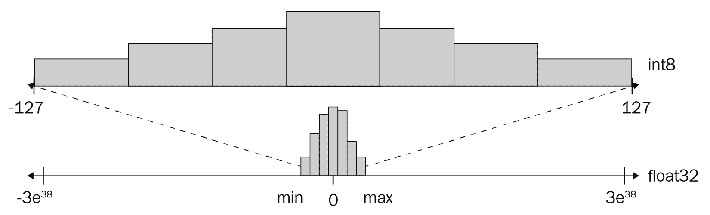
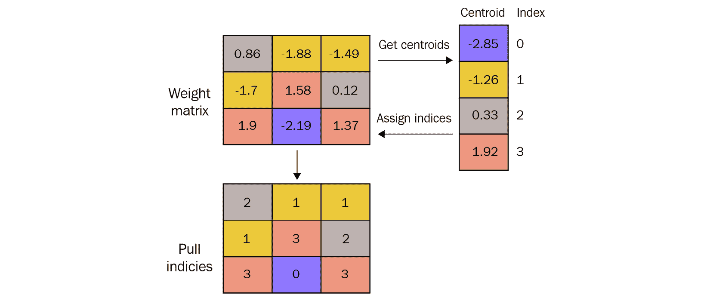
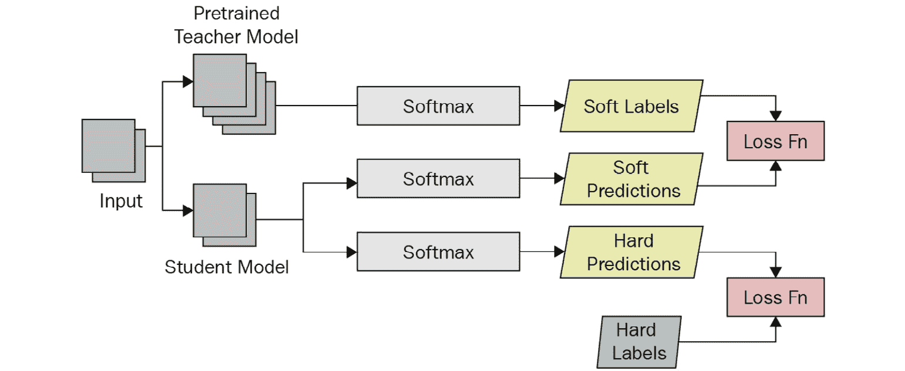

# 第十章：提高推理效率

当**深度学习**（**DL**）模型部署在边缘设备上时，推理效率通常令人不满意。这些问题主要源于训练网络的大小，因为它需要大量计算。因此，许多工程师和科学家在将 DL 模型部署到边缘设备上时通常会在速度和准确性之间进行权衡。此外，他们专注于减少模型大小，因为边缘设备通常具有有限的存储空间。

在本章中，我们将介绍一些技术，以改善推理延迟，同时尽可能保持原始性能。首先，我们将讨论**网络量化**，这是一种通过使用较低精度的数据格式来减小网络尺寸的技术。接下来，我们将谈论**权重共享**，也被称为权重聚类。这是一个非常有趣的概念，其中少量模型权重值在整个网络中共享，从而减少存储训练模型所需的磁盘空间。我们还将讨论**网络修剪**，它涉及消除网络内部的不必要连接。虽然这三种技术最受欢迎，但我们还将介绍另外两个有趣的主题：**知识蒸馏**和**网络架构搜索**。这两种技术通过直接在训练期间修改网络架构来实现模型大小的减小和推理延迟的改进。

在本章中，我们将介绍以下主要内容：

+   网络量化 – 减少模型参数使用的位数

+   权重共享 – 减少不同权重值的数量

+   网络修剪 – 消除网络内部的不必要连接

+   知识蒸馏 – 通过模仿预测获得更小的网络

+   网络架构搜索 – 寻找最有效的网络架构

# 技术要求

您可以从本书的 GitHub 存储库下载本章的补充材料，链接为[`github.com/PacktPublishing/Production-Ready-Applied-Deep-Learning/tree/main/Chapter_10`](https://github.com/PacktPublishing/Production-Ready-Applied-Deep-Learning/tree/main/Chapter_10)。

在深入讨论各个技术之前，我们想介绍两个构建在**TensorFlow**（**TF**）之上的库。第一个是**TensorFlow Lite**（**TF Lite**），它负责在移动设备、微控制器和其他边缘设备上部署 TF 模型（[`www.tensorflow.org/lite`](https://www.tensorflow.org/lite)）。我们将描述的一些技术仅适用于 TF Lite。另一个库称为 TensorFlow Model Optimization Toolkit。此库旨在为 TF 模型提供各种优化技术（[`www.tensorflow.org/model_optimization`](https://www.tensorflow.org/model_optimization)）。

# 网络量化 – 减少模型参数使用的位数

如果我们详细看一下 DL 模型训练，您会注意到模型学习处理噪声输入。换句话说，模型试图为其训练的数据构建一般化，以便即使在传入数据中存在一些噪声时，它也能生成合理的预测。此外，DL 模型在训练后最终会使用特定范围的数值进行推断。基于这种思路，网络量化旨在为这些值使用更简单的表示。

如 *图 10.1* 所示，网络量化，也称为模型量化，是将模型与之交互的数值范围重新映射到可以用较少比特表示的数字系统的过程 - 例如，使用 8 位而不是 32 位来表示浮点数。这样的修改在 DL 模型部署中具有额外的优势，因为边缘设备通常不支持基于 32 位浮点数的稳定算术：



图 10.1 – 展示网络量化中从浮点 32 到整数 8 的数字系统重映射的插图

不幸的是，网络量化涉及的不仅仅是将高精度数字转换为低精度。这是因为 DL 模型推断涉及产生比输入精度更高的数字的算术。在本章中，我们将探讨网络量化中以不同方式克服挑战的各种选项。如果您对了解更多关于网络量化的信息感兴趣，我们推荐阅读 Gholami 等人的《用于高效神经网络推断的量化方法综述》。

网络量化技术可以分为两个领域。第一个是后训练量化，另一个是量化感知训练。前者旨在量化已经训练过的模型，而后者通过以较低精度训练模型来减少由量化过程引起的精度降低。

幸运的是，这两种技术在标准 DL 框架中都可用：TF 和 PyTorch。在接下来的章节中，我们将看看如何在这些框架中执行网络量化。

## 执行后训练量化

首先，我们将看看 TF 和 PyTorch 如何支持后训练量化。修改非常简单，只需要几行额外的代码。让我们从 TF 开始。

### 在 TensorFlow 中执行后训练量化

默认情况下，DL 模型在必要的计算和变量中使用 32 位浮点数。在以下示例中，我们将演示动态范围量化，其中仅将固定参数（如权重）量化为使用 16 位而不是 32 位。请注意，您需要安装 TF Lite 来进行 TF 中的后训练量化：

```py
import tensorflow as tf
converter = tf.lite.TFLiteConverter.from_saved_model(saved_model_dir)
converter.optimizations = [tf.lite.Optimize.DEFAULT]
converter.target_spec.supported_types = [tf.float16]
tflite_quant_model = converter.convert()
```

从量化中，我们获得了一个 TF Lite 模型。在上述代码片段中，我们使用`tf.lite.TFLiteConverter.from_saved_model`函数加载训练好的 TF 模型，并获取了一个量化的 TF Lite 模型。在触发转换之前，我们需要配置一些东西。首先，我们必须设置量化模型权重的优化策略（`converter.optimizations = [tf.lite.Optimize.DEFAULT]`）。然后，我们需要指定我们希望从量化中获取 16 位权重（`converter.target_spec.supported_types = [tf.float16]`）。实际的量化发生在触发`convert`函数时。在上述代码中，如果我们不为`supported_types`指定 16 位浮点类型，我们将使用 8 位整数量化模型。

接下来，我们想介绍全整数量化，其中模型推断的每个组件（输入、激活以及权重）都被量化为较低的精度。对于这种类型的量化，您需要提供一个代表性数据集来估计激活的范围。让我们看下面的示例：

```py
import tensorflow as tf
# A set of data for estimating the range of numbers that the inference requires
representative_dataset = …
converter = tf.lite.TFLiteConverter.from_saved_model(saved_model_dir)
converter.optimizations = [tf.lite.Optimize.DEFAULT]
converter.representative_dataset = representative_dataset
converter.target_spec.supported_ops = [tf.lite.OpsSet.TFLITE_BUILTINS_INT8]
converter.inference_input_type = tf.int8  # or tf.uint8
converter.inference_output_type = tf.int8  # or tf.uint8
tflite_quant_model = converter.convert()
```

上述代码几乎是自说明的。再次使用`TFLiteConverter`类进行量化。首先，我们配置优化策略（`converter.optimizations = [tf.lite.Optimize.DEFAULT]`），并提供一个代表性数据集（`converter.representative_dataset = representative_dataset`）。接下来，我们设置 TF 优化以进行整数表示。此外，我们还需要通过配置`target_spec`、`inference_input_type`和`inference_output_type`来指定输入和输出数据类型。最后一行的`convert`函数触发量化过程。

TF 中的两种后训练量化类型被详细解释在[`www.tensorflow.org/model_optimization/guide/quantization/post_training`](https://www.tensorflow.org/model_optimization/guide/quantization/post_training)。

接下来，我们将看看 PyTorch 如何实现后训练量化。

### 在 PyTorch 中执行后训练量化

对于 PyTorch，在后训练量化中有两种不同的方法：**动态量化**和**静态量化**。它们的区别在于量化发生的时间点，并且具有不同的优缺点。在本节中，我们将为每种算法提供高级描述以及代码示例。

#### 动态量化 - 在运行时对模型进行量化

首先，我们将详细介绍动态量化，在 PyTorch 中是可用的最简单形式的量化。这种类型的算法在权重上提前应用量化，而在推断期间动态进行激活的量化。因此，动态量化通常用于模型执行主要受加载权重限制的情况，而计算矩阵乘法不是问题。这种类型的量化通常用于 LSTM 或 Transformer 网络。

给定训练好的模型，可以按如下方式实现动态量化。完整示例可在[`pytorch.org/tutorials/recipes/recipes/dynamic_quantization.html`](https://pytorch.org/tutorials/recipes/recipes/dynamic_quantization.html)找到：

```py
import torch
model = …
quantized_model = torch.quantization.quantize_dynamic(
    model,  # the original model
    qconfig_spec={torch.nn.Linear},  # a set of layers to quantize
    dtype=torch.qint8)  # data type which the quantized tensors will be
```

要应用动态量化，您需要将训练好的模型传递给`torch.quantization.quantize_dynamic`函数。另外两个参数分别指定要应用量化的模块集（`qconfig_spec={torch.nn.Linear}`）和量化张量的目标数据类型（`dtype=torch.qint8`）。在此示例中，我们将`Linear`层量化为 8 位整数。

接下来，让我们看一下静态量化。

#### 静态量化 - 使用代表性数据集确定最佳量化参数

另一种量化方法称为静态量化。像 TF 的完全整数量化一样，这种量化通过使用代表性数据集估计模型与之交互的数字范围，以最小化模型性能下降。

不幸的是，静态量化比动态量化需要更多的编码。首先，您需要在网络前后插入`torch.quantization.QuantStub`和`torch.quantization.DeQuantStub`操作，以进行必要的张量转换：

```py
import torch
# A model with few layers
class OriginalModel(torch.nn.Module):
    def __init__(self):
        super(M, self).__init__()
        # QuantStub converts the incoming floating point tensors into a quantized tensor
        self.quant = torch.quantization.QuantStub()
        self.linear = torch.nn.Linear(10, 20)
        # DeQuantStub converts the given quantized tensor into a tensor in floating point
        self.dequant = torch.quantization.DeQuantStub()
    def forward(self, x):
        # using QuantStub and DeQuantStub operations, we can indicate the region for quantization
        # point to quantized in the quantized model
        x = self.quant(x)
        x = self.linear(x)
        x = self.dequant(x)
        return x
```

在上述网络中，我们有一个单独的`Linear`层，但在`__init__`函数中还有两个额外的操作初始化：`torch.quantization.QuantStub`和`torch.quantization.DeQuantStub`。前者用于输入张量以指示量化的开始。后者作为`forward`函数中的最后一个操作以指示量化的结束。以下代码片段描述了静态量化的第一步 - 校准过程：

```py
# model is instantiated and trained
model_fp32 = OriginalModel()
…
# Prepare the model for static quantization
model_fp32.eval()
model_fp32.qconfig = torch.quantization.get_default_qconfig('fbgemm')
model_fp32_prepared = torch.quantization.prepare(model_fp32)
# Determine the best quantization settings by calibrating the model on a representative dataset.
calibration_dataset = …
model_fp32_prepared.eval()
for data, label in calibration_dataset:
    model_fp32_prepared(data)
```

上述代码片段以训练好的模型`model_fp32`开头。为了将模型转换为用于校准过程的中间格式，您需要附加一个量化配置（`model_fp32.qconfig`）并将模型传递给`torch.quantization.prepare`方法。如果模型推断在服务器实例上运行，则必须将模型的`qconfig`属性设置为`torch.quantization.get_default_qconfig('fbgemm')`。如果目标环境是移动设备，则必须向`get_default_qconfig`函数传入`'qnnpack'`。通过将代表性数据集传递给生成的模型`model_fp32_prepared`，可以实现校准过程。

最后一步是将校准模型转换为量化模型：

```py
model_int8 = torch.quantization.convert(model_fp32_prepared)
```

在上述代码行中，`torch.quantization.convert`操作量化了校准模型（`model_fp32_prepared`）并生成了模型的量化版本（`model_int8`）。

关于静态量化的其他详细信息可在[`pytorch.org/tutorials/advanced/static_quantization_tutorial.html`](https://pytorch.org/tutorials/advanced/static_quantization_tutorial.html)找到。

在接下来的部分，我们将描述如何在 TF 和 PyTorch 中执行量化感知训练。

## 执行量化感知训练

后训练量化可以显著减少模型大小。然而，它可能会大幅降低模型的准确性。因此，以下问题产生了：我们能否恢复部分丢失的准确性？这个问题的答案可能是**量化感知训练**（**QAT**）。在这种情况下，模型在训练之前被量化，以便可以直接使用较低精度的权重和激活进行泛化学习。

首先，让我们看看如何在 TF 中实现这一点。

### TensorFlow 中的量化感知训练

TF 通过 TensorFlow Model Optimization Toolkit 提供量化感知训练（QAT）。以下代码片段描述了如何在 TF 中设置 QAT：

```py
import tensorflow_model_optimization as tfmot
# A TF model
model = … 
q_aware_model = tfmot.quantization.keras.quantize_model(model)
q_aware_model.compile(
              optimizer=...,
              loss=...,
              metrics=['accuracy'])
q_aware_model.fit(...)
```

如您所见，我们使用了 `tfmot.quantization.keras.quantize_model` 函数来设置 QAT 模型。输出模型需要使用 `compile` 函数进行编译，并可以使用 `fit` 函数进行训练，就像普通 TF 模型一样。令人惊讶的是，这就是您所需的全部。训练过的模型已经被量化，并应该提供比后训练量化生成的模型更高的准确性。

欲了解更多详情，请参阅原始文档：[`www.tensorflow.org/model_optimization/guide/quantization/training_comprehensive_guide`](https://www.tensorflow.org/model_optimization/guide/quantization/training_comprehensive_guide)。

接下来，我们将看一下 PyTorch 的情况。

### PyTorch 中的量化感知训练

在 PyTorch 中，QAT 经历了类似的过程。在训练过程中，会对必要的计算进行处理，这些计算会被夹紧和四舍五入，以模拟量化效果。完整的细节可以在 [`pytorch.org/docs/stable/quantization.html#quantization-aware-training-for-static-quantization`](https://pytorch.org/docs/stable/quantization.html#quantization-aware-training-for-static-quantization) 找到。让我们看看如何为 PyTorch 模型设置 QAT。

设置 QAT 的过程几乎与我们在“静态量化 - 使用代表性数据集确定最佳量化参数”部分所经历的过程相同。对于静态量化和 QAT，模型都需要进行相同的修改；需要在模型定义中插入 `torch.quantization.QuantStub` 和 `torch.quantization.DeQuantStub` 操作，以指示量化区域。主要区别来自网络的中间表示，因为 QAT 包括在整个训练过程中更新模型参数。以下代码片段更好地描述了这种差异：

```py
model_fp32 = OriginalModel()
# model must be set to train mode for QAT
model_fp32.train()
model_fp32.qconfig = torch.quantization.get_default_qat_qconfig('fbgemm')
model_fp32_prepared = torch.quantization.prepare_qat(model_fp32_fused)
# train the model
for data, label in train_dataset:
    pred = model_fp32_prepared(data)
    ...
# Generate quantized version of the trained model
model_fp32_prepared.eval()
model_int8 = torch.quantization.convert(model_fp32_prepared)
```

在前面的示例中，我们使用了在*Static quantization – determining optimal quantization parameters using a representative dataset*部分定义的相同网络：`OriginalModel`。模型应处于 QAT（`model_fp32.train()`）的`train`模式。在这里，我们假设模型将部署在服务器实例上：`torch.quantization.get_default_qat_qconfig('fbgemm')`。在 QAT 的情况下，模型的中间表示是通过将原始模型传递给 `torch.quantization.prepare_qat` 函数来创建的。您需要训练中间表示（`model_fp32_prepared`）而不是原始模型（`model_fp32`）。完成训练后，您可以使用 `torch.quantization.convert` 函数生成量化模型。

总体而言，我们研究了 TF 和 PyTorch 如何提供 QAT 以最小化量化对模型精度的降低。

需记住的事项

a. 网络量化是一种简单的技术，通过将处理数字的精度降低来减少推断延迟。

b. 有两种类型的网络量化：后训练量化，将量化应用于已经训练好的模型，以及 QAT，通过低精度训练模型来最小化精度降低。

c. TF 和 PyTorch 支持在训练代码中进行最小修改的后训练量化和 QAT。

在接下来的部分中，我们将看看另一种改善推断延迟的选项：权重共享。

# 权重共享 - 减少不同权重值的数量

**权重共享**或**权重聚类**是另一种可以显著减小模型大小的技术。这种技术背后的想法相当简单：让我们将权重聚合成组（或簇），并使用中心值而不是单独的权重值。在这种情况下，我们可以仅存储每个中心点的值，而不是每个权重值。因此，我们可以显著压缩模型大小，并可能加快推断过程。权重共享的关键思想在*Figure 10.2*中有图形化展示（改编自官方 TF 博客文章关于权重聚类 API: [`blog.tensorflow.org/2020/08/tensorflow-model-optimization-toolkit-weight-clustering-api.html`](https://blog.tensorflow.org/2020/08/tensorflow-model-optimization-toolkit-weight-clustering-api.html))：



图 10.2 - 权重共享的示例插图

让我们先学习如何在 TF 中执行权重共享，然后再看如何在 PyTorch 中执行相同操作。

## 在 TensorFlow 中执行权重共享

TF 提供了针对 `Sequential` 和 `Functional` TF 模型的权重共享，通过 TensorFlow Model Optimization Toolkit ([`www.tensorflow.org/model_optimization/guide/clustering/clustering_example`](https://www.tensorflow.org/model_optimization/guide/clustering/clustering_example)) 实现。

首先，您需要定义如下代码片段所示的聚类配置：

```py
import tensorflow_model_optimization as tfmot
# A trained model to compress
tf_model = ...
CentroidInitialization = tfmot.clustering.keras.CentroidInitialization
clustering_params = {
  'number_of_clusters': 10,
  'cluster_centroids_init': CentroidInitialization.LINEAR
}
clustered_model = tfmot.clustering.keras.cluster_weights(tf_model, **clustering_params)
```

如您所见，权重聚类涉及`tfmot.clustering.keras.cluster_weights`函数。 我们需要提供训练好的模型（`tf_model`）和一个聚类配置（`clustering_params`）。 聚类配置定义了集群的数量以及如何初始化每个集群。 在此示例中，我们生成了 10 个集群，并使用线性质心初始化（集群质心将均匀分布在最小值和最大值之间）。 可以在[`www.tensorflow.org/model_optimization/api_docs/python/tfmot/clustering/keras/CentroidInitialization`](https://www.tensorflow.org/model_optimization/api_docs/python/tfmot/clustering/keras/CentroidInitialization)找到其他集群初始化选项。

生成带有聚类权重的模型后，您可以使用`tfmot.clustering.keras.strip_clustering`函数删除推断期间不需要的所有变量：

```py
final_model = tfmot.clustering.keras.strip_clustering(clustered_model) 
```

接下来，我们将看看如何在 PyTorch 中执行权重共享。

## 在 PyTorch 中执行权重共享

不幸的是，PyTorch 不支持权重共享。 相反，我们将提供可能实现的高级描述。 在此示例中，我们将尝试实现描述在*Figure 10.2*中的操作。 首先，在模型实现中添加一个名为`cluster_weights`的自定义函数，您可以在训练后调用该函数以对权重进行聚类。 然后，`forward`方法将需要稍作修改，如下面的代码片段所述：

```py
from torch.nn import Module
class SampleModel(Module):
# in the case of PyTorch Lighting, we inherit pytorch_lightning.LightningModule class
  def __init__(self):
    self.layer = …
    self.weights_cluster = … # cluster index for each weight
    self.weights_mapping = … # mapping from a cluster index to a centroid value
  def forward(self, input):
    if self.training: # in training mode
      output = self.layer(input)
    else: # in eval mode
      # update weights of the self.layer by reassigning each value based on self.weights_cluster and self.weights_mapping
    output = self.layer(input)
    return output
def cluster_weights(self):
  # cluster weights of the layer 
  # construct a mapping from a cluster index to a centroid value and store at self.weights_mapping
  # find cluster index for each weight value and store at self.weights_cluster
  # drop the original weights to reduce the model size
# First, we instantiate a model to train
model = SampleModel()
# train the model
…
# perform weight sharing
model.cluster_weights()
model.eval()
```

前面的代码应该是自解释的，因为它是带有注释的伪代码，解释了关键操作。 首先，模型被训练，就像是正常模型一样。 当触发`cluster_weights`函数时，权重被聚类，并且权重共享所需的信息存储在类内部；每个权重的集群索引存储在`self.weights_cluster`中，并且每个集群的质心值存储在`self.weights_mapping`中。 当模型处于`eval`模式时，`forward`操作使用从`self.weights_cluster`和`self.weights_mapping`构建的不同权重集。 另外，您可以添加功能以丢弃部署期间不需要的现有权重以减小模型大小。 我们在我们的存储库中提供了完整的实现：[`github.com/PacktPublishing/Production-Ready-Applied-Deep-Learning/blob/main/Chapter_10/weight_sharing_pytorch.ipynb`](https://github.com/PacktPublishing/Production-Ready-Applied-Deep-Learning/blob/main/Chapter_10/weight_sharing_pytorch.ipynb).

记住的事情

a. 权重共享通过将不同的权重值分组并用质心值替换来减小模型大小。

b. TF 通过 TensorFlow Model Optimization Toolkit 提供了权重共享，但 PyTorch 不提供任何支持。

接下来，让我们学习另一种流行的技术，称为网络修剪。

# 网络修剪 - 消除网络内不必要的连接

**网络修剪**是一种优化过程，可以消除不必要的连接。这种技术可以在训练后应用，但也可以在训练期间应用，从而进一步减少模型精度下降。连接更少意味着需要的权重更少。因此，我们可以减小模型大小以及推断延迟。在接下来的章节中，我们将介绍如何在 TF 和 PyTorch 中应用网络修剪。

## 希望这个翻译能够满足你的要求！

像模型量化和权重共享一样，TF 的网络修剪可以通过 TensorFlow 模型优化工具包实现。因此，进行网络修剪的第一步是使用以下代码行导入该工具包：

```py
import tensorflow_model_optimization as tfmot
```

在训练过程中应用网络修剪，您必须使用`tfmot.sparsity.keras.prune_low_magnitude`函数修改您的模型：

```py
# data and configurations for training
x_train, y_train, x_text, y_test, x_valid, y_valid,  num_examples_train, num_examples_test, num_examples_valid  = …
batch_size = ...
end_step = np.ceil(num_examples_train / batch_size).astype(np.int32) * epochs
# pruning configuration
pruning_params = {
      'pruning_schedule': tfmot.sparsity.keras.PolynomialDecay(initial_sparsity=0.3,
final_sparsity=0.5,
begin_step=0,
end_step=end_step)}
#  Prepare a model that will be pruned
model = ...
model_for_pruning = tfmot.sparsity.keras.prune_low_magnitude(model, **pruning_params)
```

在前述代码中，我们通过为`prune_low_magnitude`函数提供模型和一组参数`pruning_params`来配置网络修剪。正如您所见，我们应用了`PolynomialDecay`修剪，该修剪通过在训练过程中从特定稀疏性（`initial_sparsity`）开始构建到目标稀疏性的网络（[`www.tensorflow.org/model_optimization/api_docs/python/tfmot/sparsity/keras/PolynomialDecay`](https://www.tensorflow.org/model_optimization/api_docs/python/tfmot/sparsity/keras/PolynomialDecay)）。正如最后一行所示，`prune_low_magnitude`函数返回另一个在训练期间执行网络修剪的模型。

在我们查看需要进行训练循环修改之前，我们想介绍另一种修剪配置，即`tfmot.sparsity.keras.ConstantSparsity`（[`www.tensorflow.org/model_optimization/api_docs/python/tfmot/sparsity/keras/ConstantSparsity`](https://www.tensorflow.org/model_optimization/api_docs/python/tfmot/sparsity/keras/ConstantSparsity)）。该修剪配置通过整个训练过程应用恒定稀疏性修剪。要应用此类型的网络修剪，您可以简单地按照以下代码片段修改`pruning_params`：

```py
pruning_params = {
      'pruning_schedule': tfmot.sparsity.keras.ConstantSparsity(0.5, begin_step=0, frequency=100) }
```

如下代码片段所示，训练循环需要进行一项额外的修改以进行回调配置；我们需要使用一个 Keras 回调函数，该函数对每个优化器步骤应用修剪 - 即`tfmot.sparsity.keras.UpdatePruningStep`：

```py
model_for_pruning.compile(…)
callbacks = [tfmot.sparsity.keras.UpdatePruningStep()]
model_for_pruning.fit(x_train, y_train,
    batch_size=batch_size, epochs=epochs,     validation_data=(x_valid, y_vallid),
    callbacks=callbacks)
```

前述代码编译了已准备好进行网络修剪和进行训练的模型。请记住，关键变化来自于为`fit`函数指定的`tfmot.sparsity.keras.UpdatePruningStep`回调函数。

最后，你可以通过将模型传递到 `tfmot.sparsity.keras.strip_pruning` 函数来更新训练过的模型，以仅保留稀疏权重。所有不必要用于模型推理的 `tf.Variable` 实例都将被丢弃：

```py
final_tf_model = tfmot.sparsity.keras.strip_pruning(model_for_pruning)
```

提供的示例可以直接应用于 `Functional` 和 `Sequential` TF 模型。要对特定层或模型子集应用修剪，需要进行以下修改：

```py
def apply_pruning_to_dense(layer):
    if isinstance(layer, tf.keras.layers.Dense):
        return tfmot.sparsity.keras.prune_low_magnitude(layer)
    return layer
model_for_pruning = tf.keras.models.clone_model(model, clone_function=apply_pruning_to_dense)
```

首先，我们定义了一个 `apply_pruning_to_dense` 包装函数，将 `prune_low_magnitude` 函数应用于目标层。然后，我们只需将原始模型和 `apply_pruning_to_dense` 函数传递给 `tf.keras.models.clone_model` 函数，该函数通过在给定模型上运行提供的函数来生成新模型。

值得一提的是，存在 `tfmot.sparsity.keras.PrunableLayer` 抽象类，专为自定义网络修剪而设计。关于此类的更多详细信息，请参见 [`www.tensorflow.org/model_optimization/api_docs/python/tfmot/sparsity/keras/PrunableLayer`](https://www.tensorflow.org/model_optimization/api_docs/python/tfmot/sparsity/keras/PrunableLayer) 和 [`www.tensorflow.org/model_optimization/guide/pruning/comprehensive_guide#custom_training_loop`](https://www.tensorflow.org/model_optimization/guide/pruning/comprehensive_guide#custom_training_loop)。

接下来，我们将看一下如何在 PyTorch 中进行修剪。

## PyTorch 中的网络修剪

PyTorch 通过 `torch.nn.utils.prune` 模块支持训练后的网络修剪。给定一个训练好的网络，可以通过将模型传递给 `global_unstructured` 函数来实现修剪。一旦模型被修剪，就会附加一个二进制掩码，该掩码表示被修剪的参数集合。在 `forward` 操作之前，掩码被应用于目标参数，从而消除不必要的计算。让我们看一个例子：

```py
# model is instantiated and trained
model = …
parameters_to_prune = (
    (model.conv, 'weight'),
    (model.fc, 'weight')
)
prune.global_unstructured(
    parameters_to_prune,
    pruning_method=prune.L1Unstructured, # L1-norm
    amount=0.2
)
```

如前面的代码片段所示，`global_unstructured` 函数的第一个参数定义了将应用修剪的网络组件 (`parameters_to_prune`)。第二个参数定义了修剪算法 (`pruning_method`)。最后一个参数 `amount` 表示要修剪的参数百分比。在本例中，我们基于 L1 范数修剪了连接的最低 20%。如果你对其他算法感兴趣，你可以在 [`pytorch.org/docs/stable/nn.html#utilities`](https://pytorch.org/docs/stable/nn.html#utilities) 找到完整列表。

PyTorch 还支持每层修剪以及迭代修剪。你还可以定义一个自定义修剪算法。关于上述功能的详细信息可以在 https://pytorch.org/tutorials/intermediate/pruning_tutorial.html#pruning-tutorial 找到。

需要记住的事情

a. 网络修剪是通过消除网络中不必要的连接来减小模型大小的优化过程。

b. TensorFlow 和 PyTorch 都支持模型级和层级的网络修剪。

在本节中，我们描述了如何消除网络中的不必要连接以提高推理延迟。在下一节中，我们将学习一种名为知识蒸馏的技术，该技术生成一个新模型而不是修改现有模型。

# 知识蒸馏 – 通过模仿预测获得较小的网络

知识蒸馏的概念最早由希尔顿等人在其题为*Distilling the Knowledge in a Neural Network*的出版物中于 2015 年首次引入。在分类问题中，Softmax 激活通常作为网络的最后操作，以将每个类别的置信度表示为概率。由于最高概率的类别用于最终预测，因此其他类别的概率被认为不重要。然而，作者认为它们仍包含有意义的信息，代表了模型对输入的解释。例如，如果两个类别在多个样本中报告类似的概率，则这两个类别可能具有许多共同的特征，使得区分两者变得困难。当网络较深时，这些信息变得更加丰富，因为它可以从其已见过的数据中提取更多信息。基于这一思想，作者提出了一种将已训练模型的知识转移到较小尺寸模型的技术：知识蒸馏。

知识蒸馏的过程通常被称为老师与学生分享知识；原始模型称为老师模型，而较小的模型称为学生。如下图所示，学生模型从单个输入构建的两个不同标签中进行训练。一个标签是地面实况标签，称为硬标签。另一个标签称为软标签。软标签是老师模型的输出概率。知识蒸馏的主要贡献来自软标签填补硬标签中缺失信息的能力：



图 10.3 – 知识蒸馏过程概述

从许多评估知识蒸馏好处的实验中可以证明，使用较小的网络可以达到可比较的性能。令人惊讶的是，在某些情况下，更简单的网络结构导致正则化，并使学生模型表现优于教师模型。

自该技术首次出现以来，已经引入了许多变体。第一组变体来自于如何定义知识：基于响应的知识（网络输出），基于特征的知识（中间表示），以及基于关系的知识（层次或数据样本之间的关系）。另一组变体集中在如何实现知识传输上：离线蒸馏（从预训练的教师模型训练学生模型），在线蒸馏（在两个模型训练时共享知识），以及自蒸馏（在单个网络内部共享知识）。如果你希望进一步探索这个领域，我们认为由 Gou 等人撰写的名为*知识蒸馏：一项调查*的论文可能是一个很好的起点。

由于训练设置的复杂性，目前没有一个直接支持知识蒸馏的框架。然而，如果模型网络复杂而输出结构简单，这仍然是一个很好的选择。

要记住的事情

a. 知识蒸馏是一种将训练模型的知识转移到较小模型的技术。

b. 在知识蒸馏中，原始模型称为教师模型，而较小模型称为学生模型。学生模型从两个标签进行训练：地面真实标签和教师模型的输出。

最后，我们介绍了一种修改网络架构以减少模型参数数量的技术：网络架构搜索。

# 网络架构搜索 – 寻找最有效的网络架构

**神经架构搜索（NAS）**是为给定问题找到最佳层次结构的过程。由于可能的网络架构搜索空间极其庞大，评估每种可能的网络架构是不可行的。因此，需要一种聪明的方法来识别有前途的网络架构并评估候选者。因此，NAS 方法从三个不同的方面发展：

+   **搜索空间**: 如何构建一个合理大小的搜索空间

+   **搜索策略**: 如何高效探索搜索空间

+   **性能估算策略**: 如何在不完全训练模型的情况下有效估算性能

尽管 NAS 是一个快速发展的研究领域，但针对 TF 和 PyTorch 模型仅有少量工具可用：

+   Optuna ([`dzlab.github.io/dltips/zh/tensorflow/hyperoptim-optuna`](https://dzlab.github.io/dltips/zh/tensorflow/hyperoptim-optuna/))

+   Syne-Tune，可以与 SageMaker 一起使用 ([`aws.amazon.com/blogs/machine-learning/run-distributed-hyperparameter-and-neural-architecture-tuning-jobs-with-syne-tune`](https://aws.amazon.com/blogs/machine-learning/run-distributed-hyperparameter-and-neural-architecture-tuning-jobs-with-syne-tune/))

+   Katib ([`www.kubeflow.org/docs/components/katib/hyperparameter`](https://www.kubeflow.org/docs/components/katib/hyperparameter)),

+   **神经网络智能** (**NNI**) ([`github.com/Microsoft/nni/blob/b6cf7cee0e72671672b7845ab24fcdc5aed9ed48/docs/en_US/GeneralNasInterfaces.md#example-enas-macro-search-space`](https://github.com/Microsoft/nni/blob/b6cf7cee0e72671672b7845ab24fcdc5aed9ed48/docs/en_US/GeneralNasInterfaces.md#example-enas-macro-search-space))

+   SigOpt ([`sigopt.com/blog/simple-neural-architecture-search-nas-intel-sigopt`](https://sigopt.com/blog/simple-neural-architecture-search-nas-intel-sigopt/))

简化版 NAS 实现包括从随机层次组织定义搜索空间。然后，我们简单选择表现最佳的模型。为了减少总体搜索时间，我们可以根据特定评估指标应用早停，这将在评估指标不再改变时快速停止训练。这样的设置将 NAS 重新构造为一个超参数调整问题，其中模型架构已成为一个参数。我们可以通过应用以下技术之一进一步改进搜索算法：

+   贝叶斯优化

+   **强化学习** (**RL**)

+   基于梯度的方法

+   基于层次的方法

如果您想进一步探索这个领域，我们建议自己实施 NAS。首先，您可以利用在*第七章*中介绍的超参数调整技术。您可以从随机参数搜索或结合早停的贝叶斯优化方法开始。然后，我们建议研究基于 RL 的实现。我们还建议阅读一篇名为*神经架构搜索综述：挑战与解决方案*的论文，作者是任鹏振等人。

要记住的事情

a. NAS 是找到解决方案的最佳网络架构的过程。

b. NAS 包括三个组成部分：搜索空间、搜索策略和性能估计策略。它涉及评估不同架构的网络并找到最佳架构。

c. NAS 的几个工具包括：Optuna、Syne-Tune、Katib、NNI 和 SigOpt。

在本节中，我们介绍了 NAS 及其如何生成更小网络的方式。

# 概述

在本章中，我们介绍了一系列技术，可以通过减少模型大小来改善推理延迟。我们介绍了三种最流行的技术，以及在 TF 和 PyTorch 中的完整示例：网络量化、权重共享和网络修剪。我们还描述了通过直接修改网络架构来减少模型大小的技术：知识蒸馏和 NAS。

在下一章中，我们将解释如何在移动设备上部署 TF 和 PyTorch 模型，在这一节描述的技术将会很有用。
