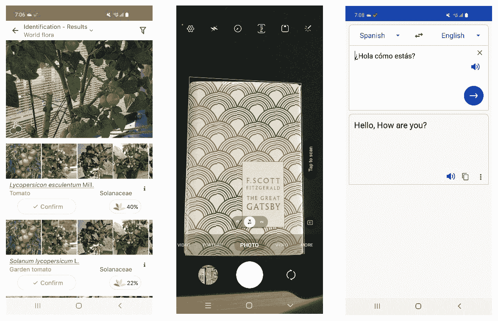

# 11

# 移动设备上的深度学习

本章将介绍如何在移动设备上部署**深度学习**（**DL**）模型，这些模型是使用**TensorFlow**（**TF**）和**PyTorch**开发的，并使用**TensorFlow Lite**（**TF Lite**）和**PyTorch Mobile**分别进行部署。首先，我们将讨论如何将 TF 模型转换为 TF Lite 模型。然后，我们将解释如何将 PyTorch 模型转换为 TorchScript 模型，以便 PyTorch Mobile 可以使用。最后，本章的最后两节将涵盖如何将转换后的模型集成到 Android 和 iOS 应用程序（应用）中。

本章中，我们将涵盖以下主要主题：

+   为移动设备准备 DL 模型

+   使用 DL 模型创建 iOS 应用程序

+   使用 DL 模型创建 Android 应用程序

# 为移动设备准备 DL 模型

移动设备通过便捷地访问互联网改变了我们日常生活的进行方式；我们许多日常任务都严重依赖移动设备。因此，如果我们能在移动应用中部署 DL 模型，我们应该能够实现更高水平的便利。流行的用例包括不同语言之间的翻译、目标检测和数字识别等。

以下截图展示了一些示例用例：



图 11.1 - 从左到右，列出的应用程序处理植物识别、目标检测和机器翻译，利用 DL 的灵活性

移动设备存在许多**操作系统**（**OSs**）。然而，目前两种 OSs 在移动市场占据主导地位：iOS 和 Android。iOS 是苹果设备（如 iPhone 和 iPad）的操作系统。同样，Android 是由三星和谷歌等公司生产的设备的标准操作系统。在本章中，我们专注于针对这两种主导 OSs 的部署。

不幸的是，TF 和 PyTorch 模型不能直接在移动设备上部署。我们需要将它们转换为可以在移动设备上运行推断逻辑的格式。对于 TF，我们需要一个 TF Lite 模型；我们将首先讨论如何使用`tensorflow`库将 TF 模型转换为 TF Lite 模型。另一方面，PyTorch 涉及 PyTorch Mobile 框架，该框架只能消耗 TorchScript 模型。在讨论了 TF Lite 转换后，我们将学习如何将 PyTorch 模型转换为 TorchScript 模型。此外，我们还将解释如何优化 PyTorch 模型的特定层，以适应目标移动环境。

值得注意的是，TF 模型或 PyTorch 模型可以转换为**开放神经网络交换**（**ONNX**）运行时，并部署到移动设备上（[`onnxruntime.ai/docs/tutorials/mobile`](https://onnxruntime.ai/docs/tutorials/mobile)）。此外，SageMaker 提供了内置支持，可将 DL 模型加载到边缘设备上：SageMaker Edge Manager（[`docs.aws.amazon.com/sagemaker/latest/dg/edge-getting-started-step4.html`](https://docs.aws.amazon.com/sagemaker/latest/dg/edge-getting-started-step4.html)）。

## 生成 TF Lite 模型

TF Lite 是一个用于在移动设备、微控制器和其他边缘设备上部署模型的库（[`www.tensorflow.org/lite`](https://www.tensorflow.org/lite)）。训练好的 TF 模型需要转换为 TF Lite 模型，才能在边缘设备上运行。如下面的代码片段所示，`tensorflow` 库内置支持将 TF 模型转换为 TF Lite 模型（`.tflite` 文件）：

```py
import tensorflow as tf
# path to the trained TF model
trained_model_dir = "s3://mybucket/tf_model"
# TFLiteConverter class is necessary for the conversion
converter = tf.lite.TFLiteConverter.from_saved_model(trained_model_dir)
tfl_model = converter.convert()
# save the converted model to TF Lite format 
with open('model_name.tflite', 'wb') as f:
  f.write(tfl_model)
```

在上述 Python 代码中，`tf.lite.TFLiteConverter` 类的 `from_saved_model` 函数加载训练好的 TF 模型文件。该类的 `convert` 方法将加载的 TF 模型转换为 TF Lite 模型。

如*第十章*讨论的那样，*提升推理效率*，TF Lite 支持各种模型压缩技术。从 TF Lite 中流行的技术包括网络剪枝和网络量化。

接下来，让我们看一下如何将 PyTorch 模型转换为 TorchScript 模型以用于 PyTorch Mobile。

## 生成 TorchScript 模型

可以使用 PyTorch Mobile 框架在移动设备上运行 PyTorch 模型（[`pytorch.org/mobile/home/`](https://pytorch.org/mobile/home/)）。类似于 TF 的情况，必须将训练好的 PyTorch 模型转换为 TorchScript 模型，以便使用 PyTorch Mobile 运行模型（[`pytorch.org/docs/master/jit.html`](https://pytorch.org/docs/master/jit.html)）。TorchScript 模块的主要优势在于能够在 Python 以外的环境（如 C++ 环境）中运行 PyTorch 模块。`torch.jit.script` 方法将给定 DL 模型的图导出为低级表示，可以在 C++ 环境中执行。有关跨语言支持的完整细节，请参阅[`pytorch.org/docs/stable/jit_language_reference.html#language-reference`](https://pytorch.org/docs/stable/jit_language_reference.html#language-reference)。请注意，TorchScript 目前仍处于 beta 状态。

要从 PyTorch 模型获取 TorchScript 模型，需要将训练好的模型传递给 `torch.jit.script` 函数，如下面的代码片段所示。可以通过 `torch.utils.mobile_optimizer` 模块的 `optimize_for_mobile` 方法来进一步优化 TorchScript 模型，以适应移动环境，例如融合 `Conv2D` 和 `BatchNorm` 层或者移除不必要的 `Dropout` 层（详情请参考 [`pytorch.org/docs/stable/mobile_optimizer.html`](https://pytorch.org/docs/stable/mobile_optimizer.html)）。请注意，`mobile_optimizer` 方法目前仍处于 beta 状态。

```py
import torch
from torch.utils.mobile_optimizer import optimize_for_mobile
# load a trained PyTorch model
saved_model_file = "model.pt"
model = torch.load(saved_model_file)
# the model should be in evaluate mode for dropout and batch normalization layers
model.eval()
# convert the model into a TorchScript model and apply optimization for mobile environment
torchscript_model = torch.jit.script(model)
torchscript_model_optimized = optimize_for_mobile(torchscript_model)
# save the optimized TorchScript model into a .pt file 
torch.jit.save(torchscript_model_optimized, "mobile_optimized.pt")
```

在上述示例中，我们首先将训练好的模型加载到内存中（`torch.load("model.pt")`）。模型在进行转换时应处于 `eval` 模式。接下来，我们使用 `torch.jit.script` 函数将 PyTorch 模型转换为 TorchScript 模型（`torchscript_model`）。使用 `optimize_for_mobile` 方法进一步优化 TorchScript 模型，生成优化后的 TorchScript 模型（`torch_script_model_optimized`）。最后，可以使用 `torch.jit.save` 方法将优化后的 TorchScript 模型保存为独立的 `.pt` 文件（`mobile_optimized.pt`）。

注意事项

a. 在移动设备上运行 TF 模型涉及 TF Lite 框架。训练好的模型需要转换成 TF Lite 模型。使用 `tensorflow.lite` 库中的 `TFLiteConverter` 类来进行转换。

b. 在移动设备上运行 PyTorch 模型涉及 PyTorch Mobile 框架。鉴于 PyTorch Mobile 仅支持 TorchScript 模型，需要使用 torch.jit 库将训练好的模型转换为 `TorchScript` 模型。

接下来，我们将学习如何将 TF Lite 和 TorchScript 模型集成到 iOS 应用中。

# 使用 DL 模型创建 iOS 应用

在本节中，我们将讨论如何为 iOS 应用编写 TF Lite 和 TorchScript 模型的推断代码。虽然 Swift 和 Objective-C 是 iOS 的本地语言，可以在一个项目中同时使用，但我们主要关注 Swift 的用例，因为它比 Objective-C 更受欢迎。

如果我们详细解释 iOS 应用开发的每一个步骤，本章将会很冗长。因此，我们将基础内容放在了苹果提供的官方教程中：[`developer.apple.com/tutorials/app-dev-training`](https://developer.apple.com/tutorials/app-dev-training)。

## 在 iOS 上运行 TF Lite 模型推断

在本节中，我们展示了如何在 iOS 应用程序中加载 TF Lite 模型，使用`TensorFlowLiteSwift`，这是 TF Lite 的 iOS 本地库（[`github.com/tensorflow/tensorflow/tree/master/tensorflow/lite/swift`](https://github.com/tensorflow/tensorflow/tree/master/tensorflow/lite/swift)）。可以通过 CocoaPods 安装`TensorFlowLiteSwift`，这是 iOS 应用程序开发的标准包管理器（[`cocoapods.org`](https://cocoapods.org)）。要在 macOS 上下载 CocoaPods，可以在终端上运行`brew install cocoapods`命令。每个 iOS 应用程序开发都涉及一个 Podfile，列出了应用程序开发所依赖的库。必须将`TensorFlowLiteSwift`库添加到此文件中，如以下代码片段所示：

```py
pod 'TensorFlowLiteSwift'
```

要在 Podfile 中安装所有库，可以运行`pod install`命令。

下面的步骤描述了如何在您的 iOS 应用程序中加载 TF Lite 模型并运行推理逻辑。有关执行的完整细节，请参阅[`www.tensorflow.org/lite/guide/inference#load_and_run_a_model_in_swift`](https://www.tensorflow.org/lite/guide/inference#load_and_run_a_model_in_swift)：

1.  可以使用`import`关键字加载安装的库：

    ```py
    import TensorFlowLite
    ```

1.  通过提供输入 TF Lite 模型的路径来初始化`Interpreter`类：

    ```py
    let interpreter = try Interpreter(modelPath: modelPath) 
    ```

1.  为了将输入数据传递给模型，您需要使用`self.interpreter.copy`方法将输入数据复制到索引为`0`的输入`Tensor`对象中：

    ```py
    let inputData: Data
    inputData = ...
    try self.interpreter.copy(inputData, toInputAt: 0)
    ```

1.  一旦输入的`Tensor`对象准备好，就可以使用`self.interpreter.invoke`方法运行推理逻辑：

    ```py
    try self.interpreter.invoke()
    ```

1.  可以使用`self.interpreter.output`检索生成的输出，作为可以进一步使用`UnsafeMutableBufferPointer`类反序列化为数组的`Tensor`对象：

    ```py
    let outputTensor = try self.interpreter.output(at: 0)
    let outputSize = outputTensor.shape.dimensions.reduce(1, {x, y in x * y})
    let outputData = UnsafeMutableBufferPointer<Float32>.allocate(capacity: outputSize)
    outputTensor.data.copyBytes(to: outputData)
    ```

在本节中，我们学习了如何在 iOS 应用程序中运行 TF Lite 模型推理。接下来，我们将介绍如何在 iOS 应用程序中运行 TorchScript 模型推理。

## 在 iOS 上运行 TorchScript 模型推理

在这一节中，我们将学习如何在 iOS 应用程序上使用 PyTorch Mobile 部署 TorchScript 模型。我们将从使用`TorchModule`模块加载训练好的 TorchScript 模型的 Swift 代码片段开始。您需要用于 PyTorch Mobile 的库称为`LibTorch_Lite`。该库也可通过 CocoaPods 获得。您只需将以下行添加到 Podfile 中：

```py
pod 'LibTorch_Lite', '~>1.10.0'
```

如上一节所述，您可以运行`pod install`命令来安装库。

鉴于 TorchScript 模型是为 C++ 设计的，Swift 代码不能直接运行模型推断。为了弥合这一差距，存在 `TorchModule` 类，它是 `torch::jit::mobile::Module` 的 Objective-C 包装器。要在应用程序中使用此功能，需要在项目下创建一个名为 `TorchBridge` 的文件夹，其中包含 `TorchModule.mm`（Objective-C 实现文件）、`TorchModule.h`（头文件）和一个命名约定为 `-Bridging-Header.h` 后缀的桥接头文件（以允许 Swift 加载 Objective-C 库）。完整的示例设置可以在 [`github.com/pytorch/ios-demo-app/tree/master/HelloWorld/HelloWorld/HelloWorld/TorchBridge`](https://github.com/pytorch/ios-demo-app/tree/master/HelloWorld/HelloWorld/HelloWorld/TorchBridge) 找到。

在接下来的步骤中，我们将展示如何加载 TorchScript 模型并触发模型预测：

1.  首先，您需要将 `TorchModule` 类导入到项目中：

    ```py
    #include "TorchModule.h"
    ```

1.  接下来，通过提供 TorchScript 模型文件的路径来实例化 `TorchModule`：

    ```py
    let modelPath = "model_dir/torchscript_model.pt"
    let module = TorchModule(modelPath: modelPath)
    ```

1.  `TorchModule` 类的 `predict` 方法处理模型推断。需要向 `predict` 方法提供输入，然后将返回输出。在幕后，`predict` 方法将通过 Objective-C 包装器调用模型的 `forward` 函数。以下代码中有所示：

    ```py
    let inputData: Data
    inputData = ...
    let outputs = module.predict(input: UnsafeMutableRawPointer(&inputData))
    ```

如果您对推断的幕后实际工作原理感兴趣，建议阅读 [`pytorch.org/mobile/ios/`](https://pytorch.org/mobile/ios/) 中的 *Run inference* 部分。

需要记住的事情

a. Swift 和 Objective-C 是开发 iOS 应用程序的标准语言。一个项目可以包含用这两种语言编写的文件。

b. `TensorFlowSwift` 库是 Swift 的 TF 库。`Interpreter` 类支持 iOS 上 TF Lite 模型的推断。

c. `LibTorch_Lite` 库通过 `TorchModule` 类支持在 iOS 应用程序上进行 TorchScript 模型推断。

接下来，我们将介绍如何在 Android 上运行 TF Lite 和 TorchScript 模型的推断。

# 使用 DL 模型创建 Android 应用程序

在本节中，我们将讨论 Android 如何支持 TF Lite 和 PyTorch Mobile。Java 和 **Java 虚拟机**（**JVM**）为 Android 应用程序提供的首选语言（例如 Kotlin）。在本节中，我们将使用 Java。有关 Android 应用程序开发的基础知识，请访问 [`developer.android.com`](https://developer.android.com)。

我们首先专注于使用 `org.tensorflow:tensorflow-lite-support` 库在 Android 上运行 TF Lite 模型推断。然后，我们讨论如何使用 `org.pytorch:pytorch_android_lite` 库运行 TorchScript 模型推断。

## 在 Android 上运行 TF Lite 模型推断

首先，让我们看看如何使用 Java 在 Android 上运行 TF Lite 模型。使用 `org.tensorflow:tensorflow-lite-support` 库可以在 Android 应用上部署 TF Lite 模型。该库支持 Java、C++（测试版）和 Swift（测试版）。支持的环境完整列表可在 [`github.com/tensorflow/tflite-support`](https://github.com/tensorflow/tflite-support) 找到。

Android 应用开发涉及 Gradle，这是一个管理依赖项的构建自动化工具 ([`gradle.org`](https://gradle.org))。每个项目都会有一个 `.gradle` 文件，该文件指定了使用基于 JVM 的语言（如 Groovy 或 Kotlin）的项目规范。在以下代码片段中，我们列出了项目在 `dependencies` 部分下依赖的库：

```py
dependencies {
     implementation 'org.tensorflow:tensorflow-lite-support:0.3.1'
}
```

在前面的 Groovy Gradle 代码中，我们已经指定了 `org.tensorflow:tensorflow-lite-support` 库作为我们的依赖项之一。可以在 [`docs.gradle.org/current/samples/sample_building_java_applications.html`](https://docs.gradle.org/current/samples/sample_building_java_applications.html) 找到一个示例 Gradle 文件。

在接下来的步骤中，我们将学习如何加载 TF Lite 模型并运行推理逻辑。有关此过程的完整详细信息可以在 [`www.tensorflow.org/lite/api_docs/java/org/tensorflow/lite/Interpreter`](https://www.tensorflow.org/lite/api_docs/java/org/tensorflow/lite/Interpreter) 找到：

1.  首先是导入包含用于 TF Lite 模型推理的 `Interpreter` 类的 `org.tensorflow.lite` 库：

    ```py
    import org.tensorflow.lite.Interpreter;
    ```

1.  然后，我们可以通过提供模型路径来实例化 `Interpreter` 类：

    ```py
    let tensorflowlite_model_path = "tflitemodel.tflite";
    Interpreter = new Interpreter(tensorflowlite_model_path);
    ```

1.  `Interpreter` 类的 `run` 方法用于运行推理逻辑。它只接受一个 `input` 类型为 `HashMap` 的实例，并提供一个类型为 `HashMap` 的 `output` 实例：

    ```py
    Map<> input = new HashMap<>();
    Input = ...
    Map<> output = new HashMap<>();
    interpreter.run(input, output);
    ```

在下一节中，我们将学习如何将 TorchScript 模型加载到 Android 应用中。

## 在 Android 上运行 TorchScript 模型推理

在本节中，我们将解释如何在 Android 应用中运行 TorchScript 模型。要在 Android 应用中运行 TorchScript 模型推理，您需要使用 `org.pytorch:pytorch_android_lite` 库提供的 Java 包装器。同样，您可以在 `.gradle` 文件中指定必需的库，如下面的代码片段所示：

```py
dependencies {
    implementation 'org.pytorch:pytorch_android_lite:1.11'
}
```

在 Android 应用中运行 TorchScript 模型推理可以通过以下步骤来实现。关键是使用来自 `org.pytorch` 库的 `Module` 类，该类在后台调用 C++ 函数进行推理（[`pytorch.org/javadoc/1.9.0/org/pytorch/Module.html`](https://pytorch.org/javadoc/1.9.0/org/pytorch/Module.html)）：

1.  首先，您需要导入 `Module` 类：

    ```py
    import org.pytorch.Module;
    ```

1.  `Module` 类提供了一个 `load` 函数，通过加载提供的模型文件创建一个 `Module` 实例：

    ```py
    let torchscript_model_path = "model_dir/torchscript_model.pt";
    Module = Module.load(torchscript_model_path);
    ```

1.  `Module` 实例的 `forward` 方法用于运行推理逻辑并生成 `org.pytorch.Tensor` 类型的输出：

    ```py
    Tensor outputTensor = module.forward(IValue.from(inputTensor)).toTensor();
    ```

虽然前面的步骤涵盖了`org.pytorch`模块的基本用法，您可以在官方文档中找到其他细节：[`pytorch.org/mobile/android`](https://pytorch.org/mobile/android)。

需要记住的事项

a. Java 和基于 JVM 的语言（例如 Kotlin）是 Android 应用程序的本地语言。

b. `org.tensorflow:tensorflow-lite-support`库用于在 Android 上部署 TF Lite 模型。`Interpreter`类实例的`run`方法处理模型推断。

c. `org.pytorch:pytorch_android_lite`库专为在 Android 应用程序中运行 TorchScript 模型而设计。`Module`类的`forward`方法处理推断逻辑。

完成了在 Android 上部署 DL 模型。现在，您应该能够将任何 TF 和 PyTorch 模型集成到 Android 应用程序中。

# 总结

在本章中，我们介绍了如何将 TF 和 PyTorch 模型集成到 iOS 和 Android 应用程序中。我们从描述从 TF 模型到 TF Lite 模型的必要转换以及从 PyTorch 模型到 TorchScript 模型开始本章。接下来，我们提供了加载 TF Lite 和 TorchScript 模型并在 iOS 和 Android 上使用加载模型进行推断的完整示例。

在下一章中，我们将学习如何关注部署模型。我们将查看一组用于模型监控的工具，并描述如何有效监控部署在**亚马逊弹性 Kubernetes 服务**（**Amazon EKS**）和 Amazon SageMaker 上的模型。
