# 开始使用强化学习和 PyTorch

我们开始了实用强化学习和 PyTorch 之旅，使用基本但重要的强化学习算法，包括随机搜索、爬山和策略梯度。我们将从设置工作环境和 OpenAI Gym 开始，通过 Atari 和 CartPole 游乐场熟悉强化学习环境。我们还将逐步演示如何开发算法来解决 CartPole 问题。此外，我们将回顾 PyTorch 的基础知识，并为即将进行的学习示例和项目做准备。

本章包含以下操作：

+   设置工作环境

+   安装 OpenAI Gym

+   模拟 Atari 环境

+   模拟 CartPole 环境

+   回顾 PyTorch 的基本原理

+   实现和评估随机搜索策略

+   开发爬山算法

+   开发策略梯度算法

# 设置工作环境

让我们开始设置工作环境，包括正确版本的 Python 和 Anaconda，以及作为本书主要框架的 PyTorch。

Python 是本书中实现所有强化学习算法和技术的语言。在本书中，我们将使用 Python 3，具体来说是 3.6 或以上版本。如果您仍在使用 Python 2，现在是切换到 Python 3 的最佳时机，因为 Python 2 将在 2020 年后不再受支持。不过过渡非常顺利，不必担心。

**Anaconda**是一个开源的 Python 发行版（[www.anaconda.com/distribution/](http://www.anaconda.com/distribution/)），用于数据科学和机器学习。我们将使用 Anaconda 的包管理器`conda`来安装 Python 包，以及`pip`。

**PyTorch**（[`pytorch.org/`](https://pytorch.org/)），主要由 Facebook AI Research（FAIR）组开发，是基于 Torch（[`torch.ch/`](http://torch.ch/)）的流行机器学习库。PyTorch 中的张量取代了 NumPy 的`ndarrays`，提供了更多的灵活性和与 GPU 的兼容性。由于强大的计算图和简单友好的接口，PyTorch 社区每天都在扩展，越来越多的技术巨头也在采用它。

让我们看看如何正确设置所有这些组件。

# 如何操作…

我们将从安装 Anaconda 开始。如果您的系统已经运行 Python 3.6 或 3.7 的 Anaconda，则可以跳过此步骤。否则，您可以按照以下操作系统的说明安装，链接如下：


设置完成后，可以随意使用 PyTorch 进行实验。要验证你是否正确设置了 Anaconda 和 Python，请在 Linux/Mac 的终端或 Windows 的命令提示符中输入以下命令（从现在起，我们将简称为终端）：

```py
python
```

它将显示你的 Python Anaconda 环境。你应该看到类似以下截图：

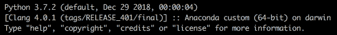

如果未提到 Anaconda 和 Python 3.x，请检查系统路径或 Python 运行路径。

下一步要做的是安装 PyTorch。首先，前往 [`pytorch.org/get-started/locally/`](https://pytorch.org/get-started/locally/)，然后从以下表格中选择你的环境描述：

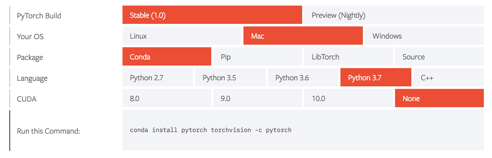

这里我们以 **Mac**，**Conda**，**Python 3.7** 以及在本地运行（没有 CUDA）作为示例，并在终端中输入生成的命令行：

```py
conda install pytorch torchvision -c pytorch
```

要确认 PyTorch 是否正确安装，请在 Python 中运行以下代码：

```py
>>> import torch
>>> x = torch.empty(3, 4)
>>> print(x)
tensor([[ 0.0000e+00,  2.0000e+00, -1.2750e+16, -2.0005e+00],
 [ 9.8742e-37,  1.4013e-45, 9.9222e-37,  1.4013e-45],
 [ 9.9220e-37,  1.4013e-45, 9.9225e-37,  2.7551e-40]])
```

如果显示了一个 3 x 4 的矩阵，则表示 PyTorch 安装正确。

现在我们已成功设置好工作环境。

# 它的工作原理...

我们刚刚在 PyTorch 中创建了一个大小为 3 x 4 的张量。它是一个空矩阵。所谓的 `empty` 并不意味着所有元素都是 `Null` 的值。相反，它们是一堆没有意义的浮点数，被视为占位符。用户需要稍后设置所有的值。这与 NumPy 的空数组非常相似。

# 还有更多...

有些人可能会质疑安装 Anaconda 和使用 `conda` 管理包的必要性，因为使用 `pip` 安装包很容易。事实上，`conda` 是比 `pip` 更好的打包工具。我们主要使用 `conda` 有以下四个理由：

+   **它能很好地处理库依赖关系**：使用 `conda` 安装包会自动下载其所有依赖项。但是，使用 `pip` 则会导致警告并中止安装。

+   **它能优雅地解决包的冲突**：如果安装一个包需要另一个特定版本的包（比如说 2.3 或之后的版本），`conda` 将自动更新另一个包的版本。

+   **它能轻松创建虚拟环境**：虚拟环境是一个自包含的包目录树。不同的应用程序或项目可以使用不同的虚拟环境。所有虚拟环境彼此隔离。建议使用虚拟环境，这样我们为一个应用程序所做的任何操作都不会影响我们的系统环境或任何其他环境。

+   **它也与 pip 兼容**：我们仍然可以在 `conda` 中使用 `pip`，使用以下命令：

```py
conda install pip
```

# 另请参见

如果你对学习使用 `conda` 感兴趣，请随意查看以下资源：

+   **Conda 用户指南**：[`conda.io/projects/conda/en/latest/user-guide/index.html`](https://conda.io/projects/conda/en/latest/user-guide/index.html)

+   **使用 conda 创建和管理虚拟环境**：[`conda.io/projects/conda/en/latest/user-guide/tasks/manage-environments.html`](https://conda.io/projects/conda/en/latest/user-guide/tasks/manage-environments.html)

如果你想更加熟悉 PyTorch，可以查看官方教程中的*入门*部分，位于[`pytorch.org/tutorials/#getting-started`](https://pytorch.org/tutorials/#getting-started)。我们建议至少完成以下内容：

+   **什么是 PyTorch**：[`pytorch.org/tutorials/beginner/blitz/tensor_tutorial.html#sphx-glr-beginner-blitz-tensor-tutorial-py`](https://pytorch.org/tutorials/beginner/blitz/tensor_tutorial.html#sphx-glr-beginner-blitz-tensor-tutorial-py)

+   **学习 PyTorch 的示例**：[`pytorch.org/tutorials/beginner/pytorch_with_examples.html`](https://pytorch.org/tutorials/beginner/pytorch_with_examples.html)

# 安装 OpenAI Gym

设置工作环境后，我们现在可以安装 OpenAI Gym。在不使用 OpenAI Gym 的情况下，您无法进行强化学习，该工具为您提供了多种环境，用于开发学习算法。

**OpenAI** ([`openai.com/`](https://openai.com/)) 是一家致力于构建安全的**人工通用智能**（**AGI**）并确保其造福于人类的非营利性研究公司。**OpenAI Gym** 是一个强大且开源的工具包，用于开发和比较强化学习算法。它为多种强化学习仿真和任务提供接口，涵盖从步行到登月，从汽车赛车到玩 Atari 游戏的各种场景。查看[`gym.openai.com/envs/`](https://gym.openai.com/envs/)获取完整的环境列表。我们可以使用诸如 PyTorch、TensorFlow 或 Keras 等任何数值计算库编写**代理**，与 OpenAI Gym 环境进行交互。

# 如何做到...

有两种方法可以安装 Gym。第一种是使用`pip`，如下所示：

```py
pip install gym
```

对于`conda`用户，请记住在使用`pip`安装 Gym 之前，首先在`conda`中安装`pip`，使用以下命令：

```py
conda install pip
```

这是因为截至 2019 年初，Gym 尚未正式在`conda`中提供。

另一种方法是从源代码构建：

1.  首先，直接从其 Git 仓库克隆该包：

```py
git clone https://github.com/openai/gym
```

1.  转到下载的文件夹，并从那里安装 Gym：

```py
cd gym
pip install -e .
```

现在你可以开始了。随意尝试使用`gym`玩耍。

1.  您还可以通过输入以下代码行来检查可用的`gym`环境：

```py
>>> from gym import envs
>>> print(envs.registry.all())
dict_values([EnvSpec(Copy-v0), EnvSpec(RepeatCopy-v0), EnvSpec(ReversedAddition-v0), EnvSpec(ReversedAddition3-v0), EnvSpec(DuplicatedInput-v0), EnvSpec(Reverse-v0), EnvSpec(CartPole-v0), EnvSpec(CartPole-v1), EnvSpec(MountainCar-v0), EnvSpec(MountainCarContinuous-v0), EnvSpec(Pendulum-v0), EnvSpec(Acrobot-v1), EnvSpec(LunarLander-v2), EnvSpec(LunarLanderContinuous-v2), EnvSpec(BipedalWalker-v2), EnvSpec(BipedalWalkerHardcore-v2), EnvSpec(CarRacing-v0), EnvSpec(Blackjack-v0)
...
...
```

如果您正确安装了 Gym，这将为您提供一个环境的长列表。我们将在下一个示例*模拟 Atari 环境*中尝试其中的一些。

# 它是如何运行的...

与使用简单的`pip`方法安装 Gym 相比，第二种方法在您想要添加新环境和修改 Gym 本身时提供更大的灵活性。

# 还有更多内容...

也许你会想为什么我们需要在 Gym 的环境中测试强化学习算法，因为我们实际工作中的环境可能会大不相同。你会想起强化学习并不对环境做出太多假设，但通过与环境的交互来更多地了解它。此外，在比较不同算法的性能时，我们需要将它们应用于标准化的环境中。Gym 是一个完美的基准测试，涵盖了许多多功能和易于使用的环境。这与我们在监督和无监督学习中经常使用的数据集类似，如 MNIST、Imagenet、MovieLens 和 Thomson Reuters News。

# 另请参阅

查看官方 Gym 文档，请访问[`gym.openai.com/docs/`](https://gym.openai.com/docs/)。

# 模拟 Atari 环境

要开始使用 Gym，让我们玩一些 Atari 游戏。

Atari 环境（[`gym.openai.com/envs/#atari`](https://gym.openai.com/envs/#atari)）是各种 Atari 2600 视频游戏，如 Alien、AirRaid、Pong 和 Space Race。如果你曾经玩过 Atari 游戏，这个步骤应该很有趣，因为你将玩一个 Atari 游戏，Space Invaders。然而，一个代理将代表你行动。

# 如何做...

让我们按照以下步骤模拟 Atari 环境：

1.  第一次运行任何`atari`环境时，我们需要通过在终端中运行以下命令安装`atari`依赖项：

```py
pip install gym[atari]
```

或者，如果你在上一个步骤中使用了第二种方法来`安装 gym`，你可以运行以下命令代替：

```py
pip install -e '.[atari]'
```

1.  安装完 Atari 依赖项后，我们在 Python 中导入`gym`库：

```py
>>> import gym
```

1.  创建一个`SpaceInvaders`环境的实例：

```py
>>> env = gym.make('SpaceInvaders-v0')
```

1.  重置环境：

```py
>>> env.reset()
 array([[[ 0,  0, 0],
         [ 0, 0,  0],
         [ 0, 0,  0],
         ...,
         ...,
         [80, 89, 22],
         [80, 89, 22],
         [80, 89, 22]]], dtype=uint8)
```

正如你所见，这也会返回环境的初始状态。

1.  渲染环境：

```py
>>> env.render()
True
```

你会看到一个小窗口弹出，如下所示：

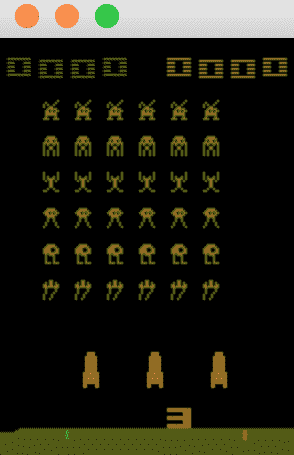

如你从游戏窗口看到的，飞船从三条生命（红色飞船）开始。

1.  随机选择一个可能的动作并执行它：

```py
>>> action = env.action_space.sample()
>>> new_state, reward, is_done, info = env.step(action)
```

`step()`方法返回在执行动作后发生的事情，包括以下内容：

+   **新状态**：新的观察。

+   **奖励**：与该动作在该状态下相关联的奖励。

+   **是否完成**：指示游戏是否结束的标志。在`SpaceInvaders`环境中，如果飞船没有更多生命或者所有外星人都消失了，这将为`True`；否则，它将保持为`False`。

+   **信息**：与环境相关的额外信息。这是关于当前剩余生命的数量。这在调试时非常有用。

让我们来看看`is_done`标志和`info`：

```py
>>> print(is_done)
False
>>> print(info)
{'ale.lives': 3}
```

现在我们渲染环境：

```py
>>> env.render()
 True
```

游戏窗口变成了以下样子：

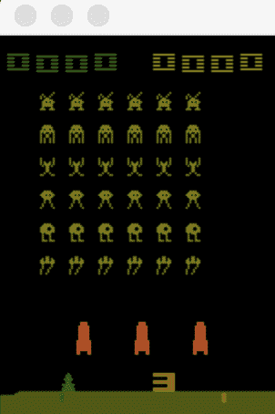

在游戏窗口中你不会注意到太大的差异，因为飞船只是移动了一下。

1.  现在，让我们创建一个`while`循环，让代理尽可能执行多个动作：

```py
>>> is_done = False
>>> while not is_done:
...     action = env.action_space.sample()
...     new_state, reward, is_done, info = env.step(action)
...     print(info)
...     env.render()
{'ale.lives': 3}
True
{'ale.lives': 3}
True
……
……
{'ale.lives': 2}
True
{'ale.lives': 2}
True
……
……
{'ale.lives': 1}
True
{'ale.lives': 1}
True
```

同时，您会看到游戏正在运行，飞船不断移动和射击，外星人也是如此。观看起来也挺有趣的。最后，当游戏结束时，窗口如下所示：

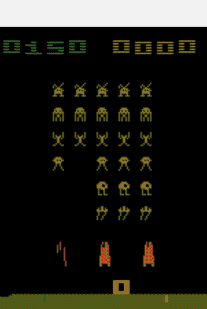

正如您所见，我们在这个游戏中得了 150 分。您可能会得到比这更高或更低的分数，因为代理执行的动作是随机选择的。

我们还确认最后一条信息中没有剩余的生命：

```py
>>> print(info)
{'ale.lives': 0}
```

# 工作原理...

使用 Gym，我们可以通过调用`make()`方法并以环境名称作为参数轻松创建一个环境实例。

正如您可能已经注意到的，代理执行的动作是使用`sample()`方法随机选择的。

请注意，通常情况下，我们会有一个更复杂的由强化学习算法引导的代理。在这里，我们只是演示了如何模拟一个环境以及代理如何无视结果而采取行动。

多次运行这个程序，看看我们能得到什么：

```py
>>> env.action_space.sample()
0
>>> env.action_space.sample()
3
>>> env.action_space.sample()
0
>>> env.action_space.sample()
4
>>> env.action_space.sample()
2
>>> env.action_space.sample()
1
>>> env.action_space.sample()
4
>>> env.action_space.sample()
5
>>> env.action_space.sample()
1
>>> env.action_space.sample()
0
```

总共有六个可能的动作。我们还可以通过运行以下命令来查看：

```py
>>> env.action_space
Discrete(6)
```

从 0 到 5 的动作分别代表无操作、开火、向上、向右、向左和向下，这些是游戏中飞船可以执行的所有移动。

`step()`方法将让代理执行指定为其参数的动作。`render()`方法将根据环境的最新观察更新显示窗口。

环境的观察值`new_state`由一个 210 x 160 x 3 的矩阵表示，如下所示：

```py
>>> print(new_state.shape)
(210, 160, 3)
```

这意味着显示屏的每一帧都是一个大小为 210 x 160 的 RGB 图像。

# 这还不是全部...

您可能会想为什么我们需要安装 Atari 的依赖项。事实上，还有一些环境并没有随`gym`一起安装，比如 Box2d、经典控制、MuJoCo 和机器人学。

以`Box2d`环境为例；在首次运行环境之前，我们需要安装`Box2d`依赖项。再次，以下是两种安装方法：

```py
pip install gym[box2d]
pip install -e '.[box2d]'
```

之后，我们可以尝试使用`LunarLander`环境，如下所示：

```py
>>> env = gym.make('LunarLander-v2')
>>> env.reset()
array([-5.0468446e-04,  1.4135642e+00, -5.1140346e-02,  1.1751971e-01,
 5.9164839e-04,  1.1584054e-02, 0.0000000e+00,  0.0000000e+00],
 dtype=float32)
>>> env.render()
```

一个游戏窗口将弹出：

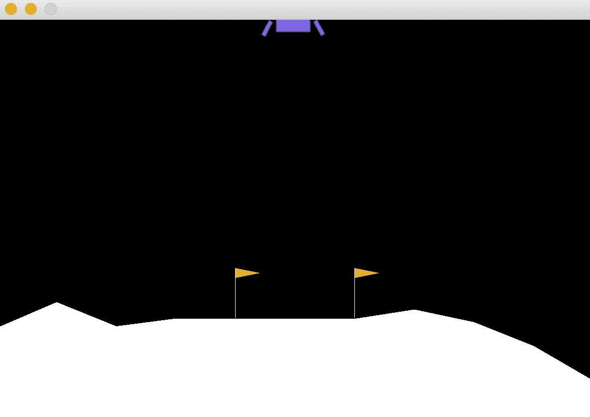

# 另请参阅

如果您想模拟一个环境但不确定在`make()`方法中应该使用的名称，您可以在[`github.com/openai/gym/wiki/Table-of-environments`](https://github.com/openai/gym/wiki/Table-of-environments)的环境表中找到它。除了调用环境时使用的名称外，表还显示了观察矩阵的大小和可能动作的数量。玩转这些环境时尽情享乐吧。

# 模拟 CartPole 环境

在这个教程中，我们将模拟一个额外的环境，以便更加熟悉 Gym。CartPole 环境是强化学习研究中的经典环境之一。

CartPole 是传统的强化学习任务，其中一个杆子直立放在购物车顶部。代理人在每个时间步长内将购物车向左或向右移动 1 单位。目标是平衡杆子，防止其倒下。如果杆子与垂直方向超过 12 度，或者购物车离原点移动超过 2.4 单位，则认为杆子已倒下。当发生以下任何一种情况时，一个 episode 终止：

+   杆子倒下了

+   时间步数达到了 200

# 怎么做…

让我们按照以下步骤模拟 `CartPole` 环境：

1.  要运行 CartPole 环境，让我们首先在[`github.com/openai/gym/wiki/Table-of-environments`](https://github.com/openai/gym/wiki/Table-of-environments)的环境表中搜索其名称。我们得到了 `'CartPole-v0'`，并且还了解到观测空间由一个四维数组表示，有两种可能的动作（这是有道理的）。

1.  我们导入 Gym 库，并创建一个 `CartPole` 环境的实例：

```py
 >>> import gym >>> env = gym.make('CartPole-v0')
```

1.  重置环境：

```py
 >>> env.reset() array([-0.00153354,  0.01961605, -0.03912845, -0.01850426])
```

如您所见，这也返回了由四个浮点数组成的初始状态。

1.  渲染环境：

```py
 >>> env.render() True
```

您将看到一个小窗口弹出，如下所示：

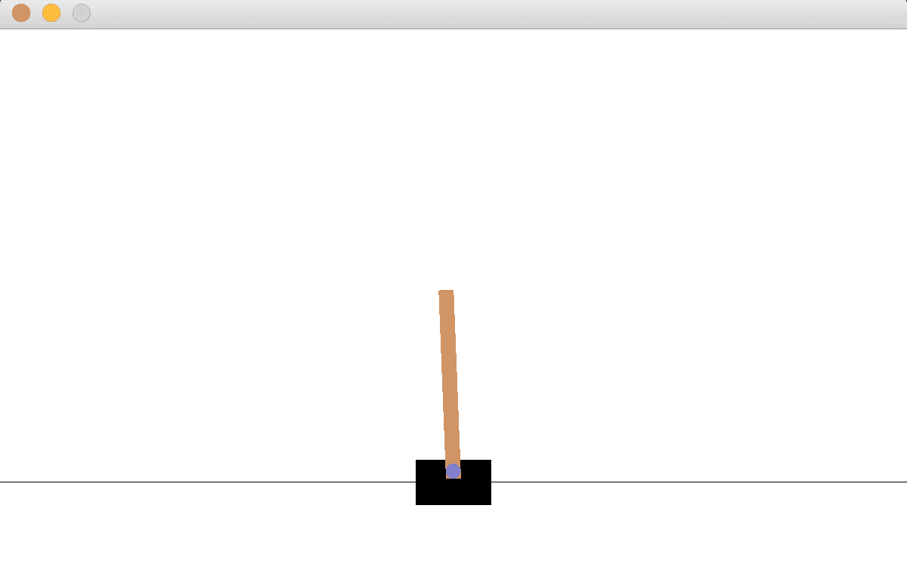

1.  现在，让我们制作一个 `while` 循环，并让代理尽可能执行多个随机动作：

```py
 >>> is_done = False >>> while not is_done:
 ...     action = env.action_space.sample()
 ...     new_state, reward, is_done, info = env.step(action)
 ...     print(new_state)
 ...     env.render()
 ...
 [-0.00114122 -0.17492355 -0.03949854  0.26158095]
 True
 [-0.00463969 -0.36946006 -0.03426692  0.54154857]
 True
 ……
 ……
 [-0.11973207 -0.41075106  0.19355244 1.11780626]
 True
 [-0.12794709 -0.21862176  0.21590856 0.89154351]
 True
```

同时，您将看到购物车和杆子在移动。最后，您将看到它们停止。窗口看起来像这样：

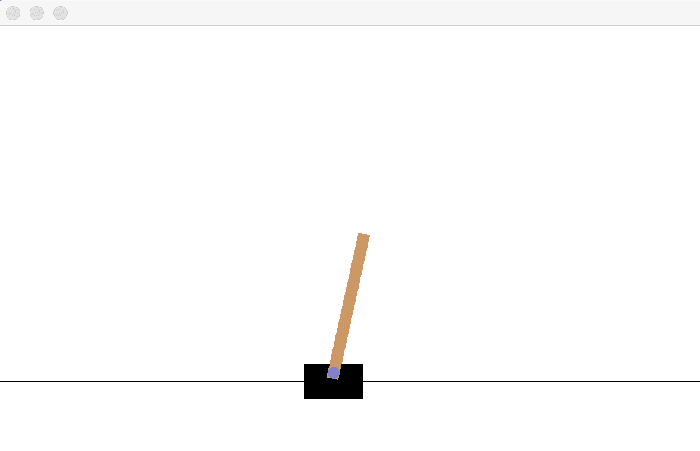

由于随机选择左或右动作，每个 episode 只持续几个步骤。我们能记录整个过程以便之后回放吗？我们可以在 Gym 中仅用两行代码实现，如 *Step 7* 所示。如果您使用的是 Mac 或 Linux 系统，则需要先完成 *Step 6*；否则，您可以直接跳转到 *Step 7*。

1.  要记录视频，我们需要安装 `ffmpeg` 包。对于 Mac，可以通过以下命令安装：

```py
brew install ffmpeg
```

对于 Linux，以下命令应该可以完成：

```py
sudo apt-get install ffmpeg
```

1.  创建 `CartPole` 实例后，添加以下两行：

```py
>>> video_dir = './cartpole_video/' >>> env = gym.wrappers.Monitor(env, video_dir)
```

这将记录窗口中显示的内容，并存储在指定的目录中。

现在重新运行从 *Step 3* 到 *Step 5* 的代码。在一个 episode 结束后，我们可以看到在 `video_dir` 文件夹中创建了一个 `.mp4` 文件。视频非常短暂，可能只有 1 秒左右。

# 工作原理…

在这个示例中，我们每一步都打印出状态数组。但是数组中的每个浮点数代表什么？我们可以在 Gym 的 GitHub wiki 页面上找到有关 CartPole 的更多信息：[`github.com/openai/gym/wiki/CartPole-v0`](https://github.com/openai/gym/wiki/CartPole-v0)。原来这四个浮点数分别表示以下内容：

+   购物车位置：其范围从 -2.4 到 2.4，超出此范围的任何位置都将触发 episode 终止。

+   购物车速度。

+   杆角度：任何小于 -0.209（-12 度）或大于 0.209（12 度）的值将触发 episode 终止。

+   杆末端的极点速度。

在动作方面，要么是 0，要么是 1，分别对应将车推向左侧和右侧。

在这个环境中，**奖励**是在每个时间步之前 +1。我们还可以通过打印每一步的奖励来验证这一点。而总奖励就是时间步数。

# 更多内容…

到目前为止，我们只运行了一个 episode。为了评估代理的表现，我们可以模拟许多 episode，然后对每个 episode 的总奖励取平均值。平均总奖励将告诉我们采取随机行动的代理的表现如何。

让我们设置 10,000 个 episodes：

```py
 >>> n_episode = 10000
```

在每个 episode 中，我们通过累积每一步的奖励来计算总奖励：

```py
 >>> total_rewards = [] >>> for episode in range(n_episode):
 ...     state = env.reset()
 ...     total_reward = 0
 ...     is_done = False
 ...     while not is_done:
 ...         action = env.action_space.sample()
 ...         state, reward, is_done, _ = env.step(action)
 ...         total_reward += reward
 ...     total_rewards.append(total_reward)
```

最后，我们计算平均总奖励：

```py
 >>> print('Average total reward over {} episodes: {}'.format( n_episode, sum(total_rewards) / n_episode))
 Average total reward over 10000 episodes: 22.2473
```

平均而言，随机采取一个动作可以得到 22.25 分。

我们都知道，随机采取行动并不够复杂，我们将在接下来的示例中实施一个高级策略。但是在下一个示例中，让我们休息一下，回顾一下 PyTorch 的基础知识。

# 回顾 PyTorch 的基础知识

正如我们之前提到的，PyTorch 是本书中用来实现强化学习算法的数值计算库。

PyTorch 是由 Facebook 开发的时髦科学计算和机器学习（包括深度学习）库。张量是 PyTorch 的核心数据结构，类似于 NumPy 的`ndarrays`。在科学计算中，PyTorch 和 NumPy 是可以比较的。然而，在数组操作和遍历中，PyTorch 比 NumPy 更快。这主要是因为 PyTorch 中的数组元素访问速度更快。因此，越来越多的人认为 PyTorch 将取代 NumPy。

# 如何做到…

让我们快速回顾一下 PyTorch 的基本编程，以便更加熟悉它：

1.  在之前的一个示例中，我们创建了一个未初始化的矩阵。那么随机初始化一个矩阵怎么样呢？请看以下命令：

```py
 >>> import torch >>> x = torch.rand(3, 4)
 >>> print(x)
 tensor([[0.8052, 0.3370, 0.7676, 0.2442],
        [0.7073, 0.4468, 0.1277, 0.6842],
        [0.6688, 0.2107, 0.0527, 0.4391]])
```

在区间 (0, 1) 内生成随机浮点数。

1.  我们可以指定返回张量的所需数据类型。例如，返回双精度类型（`float64`）的张量如下所示：

```py
 >>> x = torch.rand(3, 4, dtype=torch.double) >>> print(x)
 tensor([[0.6848, 0.3155, 0.8413, 0.5387],
        [0.9517, 0.1657, 0.6056, 0.5794],
        [0.0351, 0.3801, 0.7837, 0.4883]], dtype=torch.float64)
```

默认情况下，返回的数据类型是`float`。

1.  接下来，让我们创建一个全零矩阵和一个全一矩阵：

```py
 >>> x = torch.zeros(3, 4) >>> print(x)
    tensor([[0., 0., 0., 0.],
           [0., 0., 0., 0.],
           [0., 0., 0., 0.]])
    >>> x = torch.ones(3, 4)
    >>> print(x)
    tensor([[1., 1., 1., 1.],
           [1., 1., 1., 1.],
           [1., 1., 1., 1.]])
```

1.  要获取张量的大小，使用以下代码：

```py
 >>> print(x.size()) torch.Size([3, 4])
```

`torch.Size` 实际上是一个元组。

1.  要重新塑造张量，我们可以使用`view()`方法：

```py
 >>> x_reshaped = x.view(2, 6) >>> print(x_reshaped)
 tensor([[1., 1., 1., 1., 1., 1.],
         [1., 1., 1., 1., 1., 1.]])
```

1.  我们可以直接从数据创建张量，包括单个值、列表和嵌套列表：

```py
 >>> x1 = torch.tensor(3) >>> print(x1)
 tensor(3)
 >>> x2 = torch.tensor([14.2, 3, 4])
 >>> print(x2)
 tensor([14.2000,  3.0000, 4.0000])
 >>> x3 = torch.tensor([[3, 4, 6], [2, 1.0, 5]])
 >>> print(x3)
 tensor([[3., 4., 6.],
         [2., 1., 5.]])
```

1.  要访问多个元素的张量中的元素，我们可以类似于 NumPy 使用索引：

```py
 >>> print(x2[1]) tensor(3.)
 >>> print(x3[1, 0])
 tensor(2.)
 >>> print(x3[:, 1])
 tensor([4., 1.])
 >>> print(x3[:, 1:])
 tensor([[4., 6.],
         [1., 5.]])
```

与单元素张量一样，我们使用`item()`方法：

```py
 >>> print(x1.item()) 3
```

1.  张量和 NumPy 数组可以相互转换。使用`numpy()`方法将张量转换为 NumPy 数组：

```py
 >>> x3.numpy() array([[3., 4., 6.],
        [2., 1., 5.]], dtype=float32)
```

使用`from_numpy()`将 NumPy 数组转换为张量：

```py
>>> import numpy as np >>> x_np = np.ones(3)
>>> x_torch = torch.from_numpy(x_np)
>>> print(x_torch)
tensor([1., 1., 1.], dtype=torch.float64)
```

请注意，如果输入的 NumPy 数组是浮点数据类型，则输出张量将是双类型。偶尔可能需要类型转换。

看看以下示例，其中将双类型的张量转换为`float`：

```py
 >>> print(x_torch.float())
 tensor([1., 1., 1.])
```

1.  PyTorch 中的操作与 NumPy 类似。以加法为例，我们可以简单地执行以下操作：

```py
>>> x4 = torch.tensor([[1, 0, 0], [0, 1.0, 0]]) >>> print(x3 + x4)
tensor([[4., 4., 6.],
         [2., 2., 5.]])
```

或者我们可以使用`add()`方法如下所示：

```py
 >>> print(torch.add(x3, x4)) tensor([[4., 4., 6.],
         [2., 2., 5.]])
```

1.  PyTorch 支持原地操作，这些操作会改变张量对象。例如，让我们运行这个命令：

```py
 >>> x3.add_(x4) tensor([[4., 4., 6.],
         [2., 2., 5.]])
```

你会看到`x3`被更改为原始的`x3`加上`x4`的结果：

```py
 >>> print(x3) tensor([[4., 4., 6.],
         [2., 2., 5.]])
```

# 还有更多...

任何带有**_**的方法表示它是一个原地操作，它更新张量并返回结果值。

# 另请参阅

欲查看 PyTorch 中的所有张量操作，请访问官方文档[`pytorch.org/docs/stable/torch.html`](https://pytorch.org/docs/stable/torch.html)。这是在 PyTorch 编程问题上遇到困难时搜索信息的最佳位置。

# 实施和评估随机搜索策略

在使用 PyTorch 编程进行一些实践后，从这个示例开始，我们将致力于比纯粹的随机动作更复杂的策略来解决 CartPole 问题。我们从这个配方开始使用随机搜索策略。

一种简单但有效的方法是将观测映射到表示两个动作的两个数字的向量中。将选择具有较高值的动作。线性映射由一个大小为 4 x 2 的权重矩阵表示，因为在这种情况下，观测是 4 维的。在每个 episode 中，权重是随机生成的，并且用于计算该 episode 中每一步的动作。然后计算总奖励。这个过程重复多个 episode，并且最终能够提供最高总奖励的权重将成为学习策略。这种方法被称为**随机搜索**，因为在每个试验中权重都是随机选择的，希望通过大量的试验找到最佳权重。

# 如何实现...

让我们继续使用 PyTorch 实现一个随机搜索算法：

1.  导入 Gym 和 PyTorch 包，并创建一个环境实例：

```py
>>> import gym >>> import torch
>>> env = gym.make('CartPole-v0')
```

1.  获取观测空间和动作空间的维度：

```py
>>> n_state = env.observation_space.shape[0] >>> n_state
 4
>>> n_action = env.action_space.n
>>> n_action
 2
```

当我们为权重矩阵定义张量时，将使用这些内容，该矩阵的大小为 4 x 2。

1.  定义一个函数，模拟给定输入权重的一个 episode，并返回总奖励：

```py
 >>> def run_episode(env, weight): ...     state = env.reset()
 ...     total_reward = 0
 ...     is_done = False
 ...     while not is_done:
 ...         state = torch.from_numpy(state).float()
 ...         action = torch.argmax(torch.matmul(state, weight))
 ...         state, reward, is_done, _ = env.step(action.item())
 ...         total_reward += reward
 ...     return total_reward
```

在这里，我们将状态数组转换为浮点类型的张量，因为我们需要计算状态和权重张量的乘积`torch.matmul(state, weight)`以进行线性映射。使用`torch.argmax()`操作选择具有更高值的动作。不要忘记使用`.item()`获取结果动作张量的值，因为它是一个单元素张量。

1.  指定 episode 的数量：

```py
>>> n_episode = 1000
```

1.  我们需要实时跟踪最佳总奖励，以及相应的权重。因此，我们指定它们的起始值：

```py
>>> best_total_reward = 0 >>> best_weight = None
```

我们还将记录每个 episode 的总奖励：

```py
>>> total_rewards = []
```

1.  现在，我们可以运行 `n_episode`。对于每个 episode，我们执行以下操作：

+   随机选择权重

+   让代理根据线性映射采取行动

+   一个 episode 结束并返回总奖励

+   根据需要更新最佳总奖励和最佳权重

+   同时，保留总奖励的记录

将其放入代码中如下：

```py
 >>> for episode in range(n_episode): ...     weight = torch.rand(n_state, n_action)
 ...     total_reward = run_episode(env, weight)
 ...     print('Episode {}: {}'.format(episode+1, total_reward))
 ...     if total_reward > best_total_reward:
 ...         best_weight = weight
 ...         best_total_reward =  total_reward
 ...     total_rewards.append(total_reward)
 ...
 Episode 1: 10.0
 Episode 2: 73.0
 Episode 3: 86.0
 Episode 4: 10.0
 Episode 5: 11.0
 ……
 ……
 Episode 996: 200.0
 Episode 997: 11.0
 Episode 998: 200.0
 Episode 999: 200.0
 Episode 1000: 9.0
```

通过 1,000 次随机搜索，我们已经得到了最佳策略。最佳策略由 `best_weight` 参数化。

1.  在我们在测试 episode 上测试最佳策略之前，我们可以计算通过随机线性映射获得的平均总奖励：

```py
 >>> print('Average total reward over {} episode: {}'.format( n_episode, sum(total_rewards) / n_episode))
 Average total reward over 1000 episode: 47.197
```

这比我们从随机动作策略（22.25）获得的要多两倍。

1.  现在，让我们看看学习到的策略在 100 个新 episode 上的表现：

```py
 >>> n_episode_eval = 100 >>> total_rewards_eval = []
 >>> for episode in range(n_episode_eval):
 ...     total_reward = run_episode(env, best_weight)
 ...     print('Episode {}: {}'.format(episode+1, total_reward))
 ...     total_rewards_eval.append(total_reward)
 ...
 Episode 1: 200.0
 Episode 2: 200.0
 Episode 3: 200.0
 Episode 4: 200.0
 Episode 5: 200.0
 ……
 ……
 Episode 96: 200.0
 Episode 97: 188.0
 Episode 98: 200.0
 Episode 99: 200.0
 Episode 100: 200.0
 >>> print('Average total reward over {} episode: {}'.format(
           n_episode, sum(total_rewards_eval) / n_episode_eval))
 Average total reward over 1000 episode: 196.72
```

令人惊讶的是，在测试 episode 中，学习到的策略的平均奖励接近最大的 200 步。请注意，这个值可能会有很大的变化，从 160 到 200 不等。

# 工作原理如下...

随机搜索算法之所以如此有效，主要是因为我们的 CartPole 环境简单。它的观测状态仅由四个变量组成。你可能还记得，在阿塔利 Space Invaders 游戏中，观测超过 100,000（即 210 * 160 * 3）。CartPole 中动作状态的维度是 Space Invaders 的三分之一。总的来说，简单的算法对简单的问题效果很好。在我们的情况下，我们只需从随机池中搜索最佳的从观测到动作的线性映射。

我们还注意到的另一件有趣的事情是，在我们选择和部署最佳策略（最佳线性映射）之前，随机搜索也优于随机动作。这是因为随机线性映射确实考虑了观测值。随着从环境中获得的更多信息，随机搜索策略中做出的决策比完全随机的决策更为智能。

# 还有更多内容...

我们还可以绘制训练阶段每个 episode 的总奖励：

```py
>>> import matplotlib.pyplot as plt >>> plt.plot(total_rewards)
>>> plt.xlabel('Episode')
>>> plt.ylabel('Reward')
>>> plt.show()
```

这将生成以下图表：

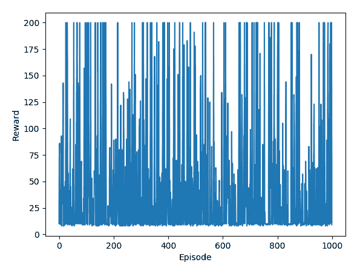

如果你尚未安装 matplotlib，则可以通过以下命令安装：

```py
conda install matplotlib
```

我们可以看到每个 episode 的奖励相当随机，并且在逐个 episode 过程中没有改进的趋势。这基本上是我们预期的。

在奖励与 episode 的绘图中，我们可以看到有些 episode 的奖励达到了 200。一旦出现这种情况，我们可以结束训练阶段，因为没有改进的余地了。经过这一变化，我们现在的训练阶段如下：

```py
 >>> n_episode = 1000 >>> best_total_reward = 0
 >>> best_weight = None
 >>> total_rewards = []
 >>> for episode in range(n_episode):
 ...     weight = torch.rand(n_state, n_action)
 ...     total_reward = run_episode(env, weight)
 ...     print('Episode {}: {}'.format(episode+1, total_reward))
 ...     if total_reward > best_total_reward:
 ...         best_weight = weight
 ...         best_total_reward = total_reward
 ...     total_rewards.append(total_reward)
 ...     if best_total_reward == 200:
 ...         break
 Episode 1: 9.0
 Episode 2: 8.0
 Episode 3: 10.0
 Episode 4: 10.0
 Episode 5: 10.0
 Episode 6: 9.0
 Episode 7: 17.0
 Episode 8: 10.0
 Episode 9: 43.0
 Episode 10: 10.0
 Episode 11: 10.0
 Episode 12: 106.0
 Episode 13: 8.0
 Episode 14: 32.0
 Episode 15: 98.0
 Episode 16: 10.0
 Episode 17: 200.0
```

在第 17 个回合找到了达到最大奖励的策略。再次提醒，由于每个回合的权重是随机生成的，这可能会有很大的变化。为了计算所需的训练回合的期望，我们可以重复前述的训练过程 1,000 次，并取训练回合的平均值：

```py
 >>> n_training = 1000 >>> n_episode_training = []
 >>> for _ in range(n_training):
 ...     for episode in range(n_episode):
 ...         weight = torch.rand(n_state, n_action)
 ...         total_reward = run_episode(env, weight)
 ...         if total_reward == 200:
 ...             n_episode_training.append(episode+1)
 ...             break
 >>> print('Expectation of training episodes needed: ',
            sum(n_episode_training) / n_training)
 Expectation of training episodes needed:  13.442
```

平均来看，我们预计需要大约 13 个回合来找到最佳策略。

# 开发爬坡算法

正如我们在随机搜索策略中看到的，每个回合都是独立的。事实上，随机搜索中的所有回合可以并行运行，并最终选择达到最佳性能的权重。我们还通过奖励与回合的图表验证了这一点，在那里没有上升趋势。在本篇中，我们将开发一种不同的算法，即爬坡算法，以将一个回合中获得的知识转移到下一个回合中。

在爬坡算法中，我们同样从一个随机选择的权重开始。但是在这里，对于每个回合，我们会给权重添加一些噪声。如果总奖励有所改善，我们就用新的权重更新它；否则，我们保留旧的权重。在这种方法中，权重随着回合的进行逐渐改进，而不是在每个回合中跳动。

# 如何做...

让我们继续使用 PyTorch 实现爬坡算法：

1.  如前所述，导入必要的包，创建环境实例，并获取观测空间和动作空间的维度：

```py
>>> import gym >>> import torch
>>> env = gym.make('CartPole-v0')
>>> n_state = env.observation_space.shape[0]
>>> n_action = env.action_space.n
```

1.  我们将重复使用在前一篇中定义的 `run_episode` 函数，因此在此不再赘述。同样，给定输入的权重，它模拟一个回合并返回总奖励。

1.  现在，让我们先做 1,000 个回合：

```py
>>> n_episode = 1000
```

1.  我们需要实时跟踪最佳总奖励，以及相应的权重。因此，让我们指定它们的起始值：

```py
>>> best_total_reward = 0 >>> best_weight = torch.rand(n_state, n_action)
```

我们还将记录每个回合的总奖励：

```py
>>> total_rewards = []
```

1.  正如我们之前提到的，我们将在每个回合为权重添加一些噪声。事实上，我们将为噪声应用一个比例，以防止噪声过多影响权重。在这里，我们将选择 0.01 作为噪声比例：

```py
>>> noise_scale = 0.01
```

1.  现在，我们可以运行 `n_episode` 函数。在我们随机选择了初始权重之后，每个回合，我们都会执行以下操作：

+   向权重添加随机噪声

+   让代理根据线性映射采取行动

+   一个回合终止并返回总奖励

+   如果当前奖励大于迄今为止获得的最佳奖励，则更新最佳奖励和权重

+   否则，最佳奖励和权重保持不变

+   同时，记下总奖励

将其转换为代码如下：

```py
 >>> for episode in range(n_episode): ...     weight = best_weight +
                     noise_scale * torch.rand(n_state, n_action)
 ...     total_reward = run_episode(env, weight)
 ...     if total_reward >= best_total_reward:
 ...         best_total_reward = total_reward
 ...         best_weight = weight
 ...     total_rewards.append(total_reward)
 ...     print('Episode {}: {}'.format(episode + 1, total_reward))
 ...
 Episode 1: 56.0
 Episode 2: 52.0
 Episode 3: 85.0
 Episode 4: 106.0
 Episode 5: 41.0
 ……
 ……
 Episode 996: 39.0
 Episode 997: 51.0
 Episode 998: 49.0
 Episode 999: 54.0
 Episode 1000: 41.0
```

我们还计算了线性映射的爬坡版本所达到的平均总奖励：

```py
 >>> print('Average total reward over {} episode: {}'.format( n_episode, sum(total_rewards) / n_episode))
 Average total reward over 1000 episode: 50.024
```

1.  为了评估使用爬坡算法的训练，我们多次重复训练过程（运行从*第四步*到*第六步*的代码多次）。我们观察到平均总奖励波动很大。以下是我们运行 10 次时得到的结果：

```py
Average total reward over 1000 episode: 9.261   
Average total reward over 1000 episode: 88.565
Average total reward over 1000 episode: 51.796
Average total reward over 1000 episode: 9.41
Average total reward over 1000 episode: 109.758
Average total reward over 1000 episode: 55.787
Average total reward over 1000 episode: 189.251
Average total reward over 1000 episode: 177.624
Average total reward over 1000 episode: 9.146
Average total reward over 1000 episode: 102.311
```

什么会导致这样的差异？事实证明，如果初始权重不好，以小比例添加噪声将对改善性能影响甚微。这将导致收敛不良。另一方面，如果初始权重良好，以大比例添加噪声可能会使权重远离最优权重并危及性能。我们如何使爬坡模型的训练更稳定可靠？实际上，我们可以使噪声比例适应性地根据性能调整，就像梯度下降中的自适应学习率一样。更多详情请参见*第八步*。

1.  为了使噪声适应性，我们采取以下措施：

+   指定一个起始噪声比例。

+   如果一集的表现提高，减少噪声比例。在我们的情况下，我们取比例的一半，但将`0.0001`设为下限。

+   如果一集的表现下降，增加噪声比例。在我们的情况下，我们将比例加倍，但将`2`设为上限。

将其编写成代码：

```py
 >>> noise_scale = 0.01 >>> best_total_reward = 0
 >>> total_rewards = []
 >>> for episode in range(n_episode):
 ...     weight = best_weight +
                       noise_scale * torch.rand(n_state, n_action)
 ...     total_reward = run_episode(env, weight)
 ...     if total_reward >= best_total_reward:
 ...         best_total_reward = total_reward
 ...         best_weight = weight
 ...         noise_scale = max(noise_scale / 2, 1e-4)
 ...     else:
 ...         noise_scale = min(noise_scale * 2, 2)
 ...     print('Episode {}: {}'.format(episode + 1, total_reward))
 ...     total_rewards.append(total_reward)
 ...
 Episode 1: 9.0
 Episode 2: 9.0
 Episode 3: 9.0
 Episode 4: 10.0
 Episode 5: 10.0
 ……
 ……
 Episode 996: 200.0
 Episode 997: 200.0
 Episode 998: 200.0
 Episode 999: 200.0
 Episode 1000: 200.0
```

奖励随着集数的增加而增加。在前 100 集内达到最高值 200 并保持不变。平均总奖励看起来也很有前景：

```py
 >>> print('Average total reward over {} episode: {}'.format( n_episode, sum(total_rewards) / n_episode))
 Average total reward over 1000 episode: 186.11
```

我们还绘制了每一集的总奖励如下：

```py
>>> import matplotlib.pyplot as plt >>> plt.plot(total_rewards)
>>> plt.xlabel('Episode')
>>> plt.ylabel('Reward')
>>> plt.show()
```

在结果图中，我们可以看到一个明显的上升趋势，在达到最大值后趋于平稳：

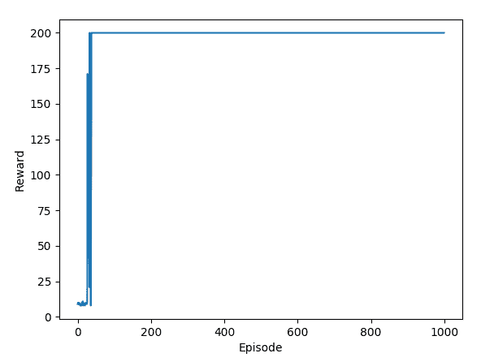

随时运行新的训练过程几次。与使用固定噪声比例进行学习相比，结果非常稳定。

1.  现在，让我们看看学习策略在 100 个新集数上的表现：

```py
 >>> n_episode_eval = 100 >>> total_rewards_eval = []
 >>> for episode in range(n_episode_eval):
 ...     total_reward = run_episode(env, best_weight)
 ...     print('Episode {}: {}'.format(episode+1, total_reward))
 ...     total_rewards_eval.append(total_reward)
 ...
 Episode 1: 200.0
 Episode 2: 200.0
 Episode 3: 200.0
 Episode 4: 200.0
 Episode 5: 200.0
 ……
 ……
 Episode 96: 200.0
 Episode 97: 200.0
 Episode 98: 200.0
 Episode 99: 200.0
 Episode 100: 200.0 
```

让我们来看看平均表现：

```py
>>> print('Average total reward over {} episode: {}'.format(n_episode, sum(total_rewards) / n_episode)) Average total reward over 1000 episode: 199.94
```

测试集合的平均奖励接近我们通过学习策略获得的最高值 200。你可以多次重新运行评估。结果非常一致。

# 运行原理如下...

我们通过简单地在每集中添加自适应噪声，使用爬坡算法能够实现比随机搜索更好的性能。我们可以将其视为一种没有目标变量的特殊梯度下降。额外的噪声就是梯度，尽管是以随机的方式。噪声比例是学习率，并且根据上一集的奖励进行自适应。在爬坡中，目标变量成为达到最高奖励。总之，爬坡算法中的智能体不是将每集孤立开来，而是利用从每集中学到的知识，并在下一集中执行更可靠的操作。正如其名称所示，奖励通过集数向上移动，权重逐渐朝向最优值。

# 还有更多内容...

我们可以观察到，在前 100 个回合内奖励可以达到最大值。当奖励达到 200 时，我们是否可以停止训练，就像我们在随机搜索策略中所做的那样？这可能不是一个好主意。记住，代理在爬坡时在持续改进。即使它找到了生成最大奖励的权重，它仍然可以在这个权重周围搜索最优点。在这里，我们将最优策略定义为能够解决 CartPole 问题的策略。根据以下维基页面，[`github.com/openai/gym/wiki/CartPole-v0`](https://github.com/openai/gym/wiki/CartPole-v0)，"解决"意味着连续 100 个回合的平均奖励不低于 195。

我们相应地完善了停止标准：

```py
 >>> noise_scale = 0.01 >>> best_total_reward = 0
 >>> total_rewards = []
 >>> for episode in range(n_episode):
 ...     weight = best_weight + noise_scale * torch.rand(n_state, n_action)
 ...     total_reward = run_episode(env, weight)
 ...     if total_reward >= best_total_reward:
 ...         best_total_reward = total_reward
 ...         best_weight = weight
 ...         noise_scale = max(noise_scale / 2, 1e-4)
 ...     else:
 ...         noise_scale = min(noise_scale * 2, 2)
 ...     print('Episode {}: {}'.format(episode + 1, total_reward))
 ...     total_rewards.append(total_reward)
 ...     if episode >= 99 and sum(total_rewards[-100:]) >= 19500:
 ...         break
 ...
 Episode 1: 9.0
 Episode 2: 9.0
 Episode 3: 10.0
 Episode 4: 10.0
 Episode 5: 9.0
 ……
 ……
 Episode 133: 200.0
 Episode 134: 200.0
 Episode 135: 200.0
 Episode 136: 200.0
 Episode 137: 200.0
```

在第 137 回合，问题被认为已解决。

# 另见

如果您有兴趣了解更多关于爬坡算法的信息，以下资源是有用的：

+   [`en.wikipedia.org/wiki/Hill_climbing`](https://en.wikipedia.org/wiki/Hill_climbing)

+   [`www.geeksforgeeks.org/introduction-hill-climbing-artificial-intelligence/`](https://www.geeksforgeeks.org/introduction-hill-climbing-artificial-intelligence/)

# 开发策略梯度算法

第一章的最后一个配方是使用策略梯度算法解决 CartPole 环境的问题。对于这个简单的问题，这可能比我们需要的更复杂，随机搜索和爬山算法已经足够了。然而，这是一个很棒的学习算法，我们将在本书后面更复杂的环境中使用它。

在策略梯度算法中，模型权重在每个回合结束时朝着梯度的方向移动。我们将在下一节中解释梯度的计算。此外，在每个步骤中，它根据使用状态和权重计算的概率**随机**采样一个动作。与随机搜索和爬坡算法（通过执行获得更高分数的动作）相反，策略从确定性切换到**随机**。

# 如何做...

现在，是时候用 PyTorch 实现策略梯度算法了：

1.  如前所述，导入必要的包，创建环境实例，并获取观察和动作空间的维度：

```py
>>> import gym >>> import torch
>>> env = gym.make('CartPole-v0')
>>> n_state = env.observation_space.shape[0]
>>> n_action = env.action_space.n
```

1.  我们定义了`run_episode`函数，该函数模拟了给定输入权重的一个回合，并返回总奖励和计算的梯度。具体来说，它在每个步骤中执行以下任务：

+   计算基于当前状态和输入权重的两个动作的概率 `probs`

+   根据得出的概率样本一个动作 `action`

+   计算`softmax`函数的导数 `d_softmax`，其中概率作为输入

+   将得出的导数 `d_softmax` 除以概率 `probs`，得到与策略相关的对数项的导数 `d_log`

+   应用链式法则计算权重`grad`的梯度

+   记录结果梯度，grad

+   执行动作，累积奖励，并更新状态

将所有这些放入代码中，我们得到以下内容：

```py
 >>> def run_episode(env, weight): ...     state = env.reset()
 ...     grads = []
 ...     total_reward = 0
 ...     is_done = False
 ...     while not is_done:
 ...         state = torch.from_numpy(state).float()
 ...         z = torch.matmul(state, weight)
 ...         probs = torch.nn.Softmax()(z)
 ...         action = int(torch.bernoulli(probs[1]).item())
 ...         d_softmax = torch.diag(probs) -
                             probs.view(-1, 1) * probs
 ...         d_log = d_softmax[action] / probs[action]
 ...         grad = state.view(-1, 1) * d_log
 ...         grads.append(grad)
 ...         state, reward, is_done, _ = env.step(action)
 ...         total_reward += reward
 ...         if is_done:
 ...             break
 ...     return total_reward, grads
```

当一集结束后，它返回本集获得的总奖励和个别步骤计算的梯度。这两个输出将用于使用随机梯度上升法更新权重。

1.  暂时让它运行 1,000 集：

```py
>>> n_episode = 1000
```

这意味着我们将运行`run_episode`和`n_episode`次。

1.  初始化权重：

```py
>>> weight = torch.rand(n_state, n_action)
```

我们还会记录每一集的总奖励：

```py
>>> total_rewards = []
```

1.  每集结束时，我们需要使用计算出的梯度更新权重。对于每一集的每一步，权重根据在剩余步骤中计算的*学习率 * 梯度* * 总奖励*的策略梯度移动。在这里，我们选择`0.001`作为学习率：

```py
>>> learning_rate = 0.001
```

现在，我们可以运行`n_episode`集：

```py
 >>> for episode in range(n_episode): ...     total_reward, gradients = run_episode(env, weight)
 ...     print('Episode {}: {}'.format(episode + 1, total_reward))
 ...     for i, gradient in enumerate(gradients):
 ...         weight += learning_rate * gradient * (total_reward - i)
 ...     total_rewards.append(total_reward)
 ……
 ……
 Episode 101: 200.0
 Episode 102: 200.0
 Episode 103: 200.0
 Episode 104: 190.0
 Episode 105: 133.0
 ……
 ……
 Episode 996: 200.0
 Episode 997: 200.0
 Episode 998: 200.0
 Episode 999: 200.0
 Episode 1000: 200.0
```

1.  现在，我们计算策略梯度算法达到的平均总奖励：

```py
 >>> print('Average total reward over {} episode: {}'.format( n_episode, sum(total_rewards) / n_episode))
 Average total reward over 1000 episode: 179.728
```

1.  我们还会绘制每集的总奖励如下：

```py
 >>> import matplotlib.pyplot as plt >>> plt.plot(total_rewards)
 >>> plt.xlabel('Episode')
 >>> plt.ylabel('Reward')
 >>> plt.show()
```

在生成的图表中，我们可以看到在保持最大值之前有一个明显的上升趋势：

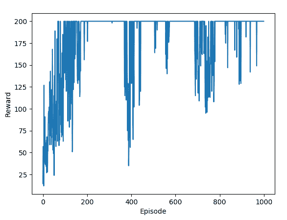

我们还可以看到，即使在收敛后，奖励仍然会波动。这是因为策略梯度算法是一种随机策略。

1.  现在，让我们看看学习策略在 100 个新集上的表现：

```py
 >>> n_episode_eval = 100 >>> total_rewards_eval = []
 >>> for episode in range(n_episode_eval):
 ...     total_reward, _ = run_episode(env, weight)
 ...     print('Episode {}: {}'.format(episode+1, total_reward))
 ...     total_rewards_eval.append(total_reward)
 ...
 Episode 1: 200.0
 Episode 2: 200.0
 Episode 3: 200.0
 Episode 4: 200.0
 Episode 5: 200.0
 ……
 ……
 Episode 96: 200.0
 Episode 97: 200.0
 Episode 98: 200.0
 Episode 99: 200.0
 Episode 100: 200.0
```

让我们看看平均表现：

```py
>>> print('Average total reward over {} episode: {}'.format(n_episode, sum(total_rewards) / n_episode)) Average total reward over 1000 episode: 199.78
```

测试集的平均奖励接近于学习策略的最大值 200。您可以多次重新运行评估。结果非常一致。

# 工作原理...

策略梯度算法通过采取小步骤并根据这些步骤在一集结束时获得的奖励更新权重来训练代理程序。在整个一集结束后根据获得的奖励更新策略的技术被称为**蒙特卡洛**策略梯度。

根据当前状态和模型权重计算的概率分布选择动作。例如，如果左右动作的概率为[0.6, 0.4]，这意味着左动作被选择的概率为 60%；这并不意味着左动作被选择，如在随机搜索和爬山算法中一样。

我们知道，在一集终止之前，每一步的奖励为 1。因此，我们用于在每一步计算策略梯度的未来奖励是剩余步数。在每集结束后，我们通过将梯度历史乘以未来奖励来使用随机梯度上升法更新权重。这样，一集越长，权重更新就越大。这最终会增加获得更大总奖励的机会。

正如我们在本节开头提到的，对于像 CartPole 这样简单的环境来说，策略梯度算法可能有点过头了，但它应该能够让我们准备好处理更复杂的问题。

# 还有更多……

如果我们检查奖励/每轮的图表，似乎在训练过程中当解决问题时也可以提前停止 - 连续 100 轮的平均奖励不少于 195。我们只需在训练会话中添加以下几行代码：

```py
 >>> if episode >= 99 and sum(total_rewards[-100:]) >= 19500: ...     break
```

重新运行训练会话。您应该会得到类似以下的结果，几百轮后停止：

```py
Episode 1: 10.0 Episode 2: 27.0
Episode 3: 28.0
Episode 4: 15.0
Episode 5: 12.0
……
……
Episode 549: 200.0
Episode 550: 200.0
Episode 551: 200.0
Episode 552: 200.0
Episode 553: 200.0
```

# 另见

查看有关策略梯度方法的更多信息，请访问 [`www.scholarpedia.org/article/Policy_gradient_methods`](http://www.scholarpedia.org/article/Policy_gradient_methods)。
