# 马尔可夫决策过程和动态规划

在本章中，我们将通过观察**马尔可夫决策过程**（MDPs）和动态规划来继续我们的实践强化学习旅程。本章将从创建马尔可夫链和 MDP 开始，这是大多数强化学习算法的核心。您还将通过实践策略评估更加熟悉贝尔曼方程。然后我们将继续并应用两种方法解决 MDP 问题：值迭代和策略迭代。我们将以 FrozenLake 环境作为示例。在本章的最后，我们将逐步展示如何使用动态规划解决有趣的硬币抛掷赌博问题。

本章将涵盖以下示例：

+   创建马尔可夫链

+   创建一个 MDP

+   执行策略评估

+   模拟 FrozenLake 环境

+   使用值迭代算法解决 MDP

+   使用策略迭代算法解决 MDP

+   使用值迭代算法解决 MDP

# 技术要求

要成功执行本章中的示例，请确保系统中安装了以下程序：

+   Python 3.6, 3.7 或更高版本

+   Anaconda

+   PyTorch 1.0 或更高版本

+   OpenAI Gym

# 创建马尔可夫链

让我们从创建一个马尔可夫链开始，以便于开发 MDP。

马尔可夫链描述了遵守**马尔可夫性质**的事件序列。它由一组可能的状态 *S = {s0, s1, ... , sm}* 和转移矩阵 *T(s, s')* 定义，其中包含状态 *s* 转移到状态 *s'* 的概率。根据马尔可夫性质，过程的未来状态，在给定当前状态的情况下，与过去状态是条件独立的。换句话说，过程在 *t+1* 时刻的状态仅依赖于 *t* 时刻的状态。在这里，我们以学习和睡眠过程为例，基于两个状态 *s0*（学习）和 *s1*（睡眠），创建了一个马尔可夫链。假设我们有以下转移矩阵：

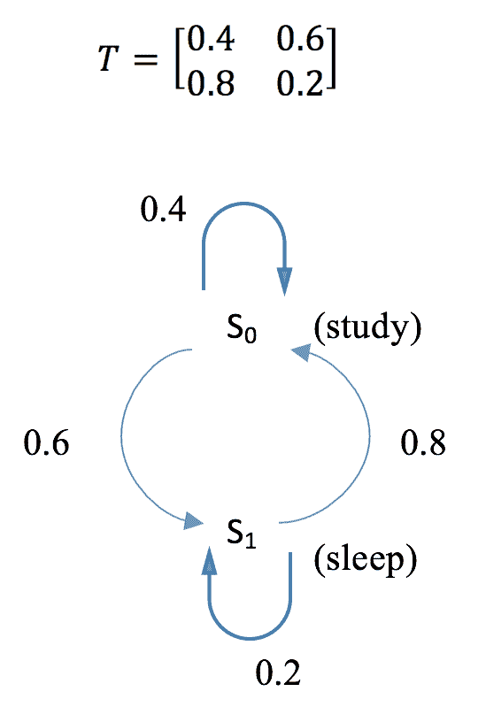

在接下来的部分中，我们将计算经过 k 步后的转移矩阵，以及在初始状态分布（如 *[0.7, 0.3]*，表示有 70% 的概率从学习开始，30% 的概率从睡眠开始）下各个状态的概率。

# 如何做...

要为学习 - 睡眠过程创建一个马尔可夫链，并对其进行一些分析，请执行以下步骤：

1.  导入库并定义转移矩阵：

```py
>>> import torch
>>> T = torch.tensor([[0.4, 0.6],
...                   [0.8, 0.2]])
```

1.  计算经过 k 步后的转移概率。这里，我们以 k = `2`, `5`, `10`, `15`, 和 `20` 为例：

```py
>>> T_2 = torch.matrix_power(T, 2)
>>> T_5 = torch.matrix_power(T, 5)
>>> T_10 = torch.matrix_power(T, 10)
>>> T_15 = torch.matrix_power(T, 15)
>>> T_20 = torch.matrix_power(T, 20)
```

1.  定义两个状态的初始分布：

```py
>>> v = torch.tensor([[0.7, 0.3]])
```

1.  在*步骤 2*中，我们计算了经过 k = `1`, `2`, `5`, `10`, `15`, 和 `20` 步后的转移概率，结果如下：

```py
>>> v_1 = torch.mm(v, T)
>>> v_2 = torch.mm(v, T_2)
>>> v_5 = torch.mm(v, T_5)
>>> v_10 = torch.mm(v, T_10)
>>> v_15 = torch.mm(v, T_15)
>>> v_20 = torch.mm(v, T_20)
```

# 它是如何工作的...

在*步骤 2*中，我们计算了经过 k 步后的转移概率，即转移矩阵的 k 次幂。结果如下：

```py
>>> print("Transition probability after 2 steps:\n{}".format(T_2))
Transition probability after 2 steps:
tensor([[0.6400, 0.3600],
 [0.4800, 0.5200]])
>>> print("Transition probability after 5 steps:\n{}".format(T_5))
Transition probability after 5 steps:
tensor([[0.5670, 0.4330],
 [0.5773, 0.4227]])
>>> print(
"Transition probability after 10 steps:\n{}".format(T_10))
Transition probability after 10 steps:
tensor([[0.5715, 0.4285],
 [0.5714, 0.4286]])
>>> print(
"Transition probability after 15 steps:\n{}".format(T_15))
Transition probability after 15 steps:
tensor([[0.5714, 0.4286],
 [0.5714, 0.4286]])
>>> print(
"Transition probability after 20 steps:\n{}".format(T_20))
Transition probability after 20 steps:
tensor([[0.5714, 0.4286],
 [0.5714, 0.4286]])
```

我们可以看到，经过 10 到 15 步，过渡概率会收敛。这意味着无论过程处于什么状态，转移到 s0（57.14%）和 s1（42.86%）的概率都相同。

在*步骤 4*中，我们计算了 k = `1`，`2`，`5`，`10`，`15`和`20`步后的状态分布，这是初始状态分布和过渡概率的乘积。您可以在这里看到结果：

```py
>>> print("Distribution of states after 1 step:\n{}".format(v_1))
Distribution of states after 1 step:
tensor([[0.5200, 0.4800]])
>>> print("Distribution of states after 2 steps:\n{}".format(v_2))
Distribution of states after 2 steps:
tensor([[0.5920, 0.4080]])
>>> print("Distribution of states after 5 steps:\n{}".format(v_5))
Distribution of states after 5 steps:
tensor([[0.5701, 0.4299]])
>>> print(
 "Distribution of states after 10 steps:\n{}".format(v_10))
Distribution of states after 10 steps:
tensor([[0.5714, 0.4286]])
>>> print(
 "Distribution of states after 15 steps:\n{}".format(v_15))
Distribution of states after 15 steps:
tensor([[0.5714, 0.4286]])
>>> print(
 "Distribution of states after 20 steps:\n{}".format(v_20))
Distribution of states after 20 steps:
tensor([[0.5714, 0.4286]])
```

我们可以看到，经过 10 步后，状态分布会收敛。长期内处于 s0（57.14%）和 s1（42.86%）的概率保持不变。

从[0.7, 0.3]开始，经过一次迭代后的状态分布变为[0.52, 0.48]。其详细计算过程如下图所示：

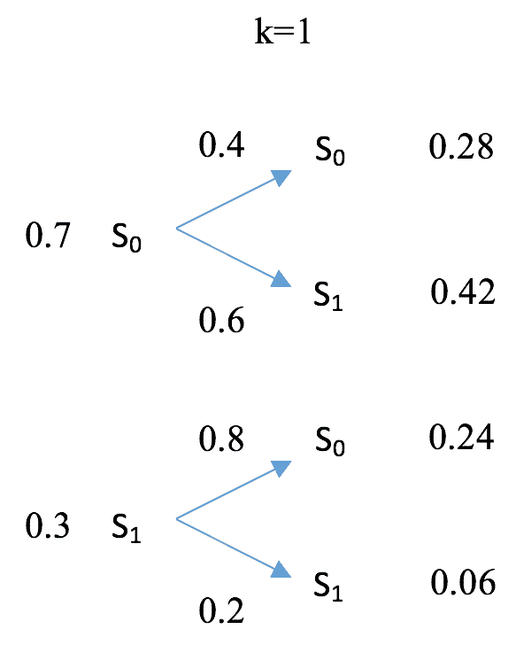

经过另一次迭代，状态分布如下[0.592, 0.408]，如下图所示计算：

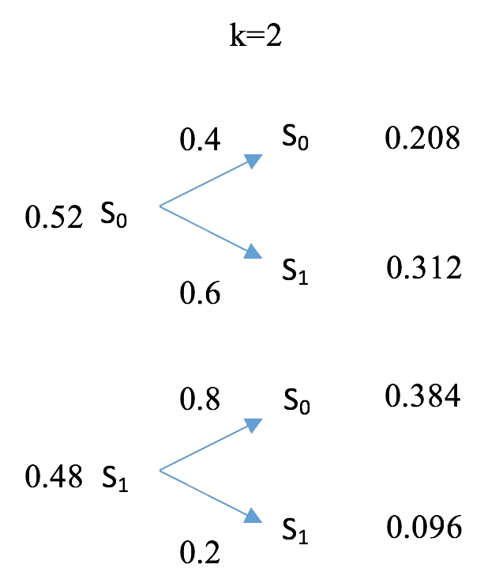

随着时间的推移，状态分布达到平衡。

# 还有更多...

事实上，无论初始状态如何，状态分布都将始终收敛到[0.5714, 0.4286]。您可以尝试其他初始分布，例如[0.2, 0.8]和[1, 0]。分布在经过 10 步后仍将保持为[0.5714, 0.4286]。

马尔可夫链不一定会收敛，特别是当包含瞬态或当前状态时。但如果它确实收敛，无论起始分布如何，它将达到相同的平衡。

# 另见

如果您想阅读更多关于马尔可夫链的内容，以下是两篇具有良好可视化效果的博客文章：

+   [`brilliant.org/wiki/markov-chains/`](https://brilliant.org/wiki/markov-chains/)

+   [`setosa.io/ev/markov-chains/`](http://setosa.io/ev/markov-chains/)

# 创建 MDP

基于马尔可夫链的发展，MDP 涉及代理和决策过程。让我们继续发展一个 MDP，并计算最优策略下的值函数。

除了一组可能的状态，*S = {s0, s1, ... , sm}*，MDP 由一组动作，*A = {a0, a1, ... , an}*；过渡模型，*T(s, a, s')*；奖励函数，*R(s)*；和折现因子𝝲定义。过渡矩阵，*T(s, a, s')*，包含从状态 s 采取动作 a 然后转移到 s'的概率。折现因子𝝲控制未来奖励和即时奖励之间的权衡。

为了使我们的 MDP 稍微复杂化，我们将学习和睡眠过程延伸到另一个状态，`s2 play` 游戏。假设我们有两个动作，`a0 work` 和 `a1 slack`。*3 * 2 * 3* 过渡矩阵 *T(s, a, s')* 如下所示：

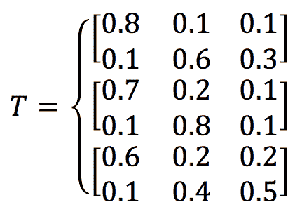

这意味着，例如，当从状态 s0 study 中采取 a1 slack 行动时，有 60%的机会它将变成 s1 sleep（可能会累），有 30%的机会它将变成 s2 play games（可能想放松），还有 10%的机会继续学习（可能是真正的工作狂）。我们为三个状态定义奖励函数为[+1, 0, -1]，以补偿辛勤工作。显然，在这种情况下，**最优策略**是在每个步骤选择 a0 工作（继续学习——不努力就没有收获，对吧？）。此外，我们选择 0.5 作为起始折扣因子。在下一节中，我们将计算**状态值函数**（也称为**值函数**，简称**值**或**期望效用**）在最优策略下的值。

# 如何做...

创建 MDP 可以通过以下步骤完成：

1.  导入 PyTorch 并定义转移矩阵：

```py
 >>> import torch
 >>> T = torch.tensor([[[0.8, 0.1, 0.1],
 ...                    [0.1, 0.6, 0.3]],
 ...                   [[0.7, 0.2, 0.1],
 ...                    [0.1, 0.8, 0.1]],
 ...                   [[0.6, 0.2, 0.2],
 ...                    [0.1, 0.4, 0.5]]]
 ...                  )
```

1.  定义奖励函数和折扣因子：

```py
 >>> R = torch.tensor([1., 0, -1.])
 >>> gamma = 0.5
```

1.  在这种情况下，最优策略是在所有情况下选择动作`a0`：

```py
>>> action = 0
```

1.  我们使用**矩阵求逆**方法计算了最优策略的值`V`：

```py
 >>> def cal_value_matrix_inversion(gamma, trans_matrix, rewards):
 ...     inv = torch.inverse(torch.eye(rewards.shape[0]) 
 - gamma * trans_matrix)
 ...     V = torch.mm(inv, rewards.reshape(-1, 1))
 ...     return V
```

我们将在下一节中展示如何推导下一个部分的值。

1.  我们将所有变量输入函数中，包括与动作`a0`相关的转移概率：

```py
 >>> trans_matrix = T[:, action]
 >>> V = cal_value_matrix_inversion(gamma, trans_matrix, R)
 >>> print("The value function under the optimal 
 policy is:\n{}".format(V))
 The value function under the optimal policy is:
 tensor([[ 1.6787],
 [ 0.6260],
 [-0.4820]])
```

# 它是如何工作的...

在这个过于简化的学习-睡眠-游戏过程中，最优策略，即获得最高总奖励的策略，是在所有步骤中选择动作 a0。然而，在大多数情况下，情况不会那么简单。此外，个别步骤中采取的行动不一定相同。它们通常依赖于状态。因此，在实际情况中，我们将不得不通过找到最优策略来解决一个 MDP 问题。

策略的值函数衡量了在遵循策略的情况下，对于一个 agent 而言处于每个状态的好处。值越大，状态越好。

在*第 4 步*中，我们使用**矩阵求逆法**计算了最优策略的值`V`。根据**贝尔曼方程**，步骤*t+1*的值与步骤*t*的值之间的关系可以表达如下：

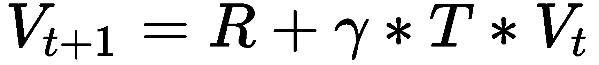

当值收敛时，也就是*Vt+1 = Vt*时，我们可以推导出值`V`，如下所示：

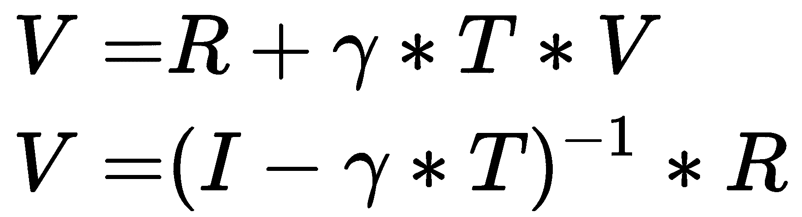

这里，*I*是具有主对角线上的 1 的单位矩阵。

使用矩阵求逆解决 MDP 的一个优点是你总是得到一个确切的答案。但其可扩展性有限。因为我们需要计算一个 m * m 矩阵的求逆（其中*m*是可能的状态数量），如果有大量状态，计算成本会变得很高昂。

# 还有更多...

我们决定尝试不同的折扣因子值。让我们从 0 开始，这意味着我们只关心即时奖励：

```py
 >>> gamma = 0
 >>> V = cal_value_matrix_inversion(gamma, trans_matrix, R)
 >>> print("The value function under the optimal policy is:\n{}".format(V))
 The value function under the optimal policy is:
 tensor([[ 1.],
 [ 0.],
 [-1.]])
```

这与奖励函数一致，因为我们只看下一步的奖励。

随着折现因子向 1 靠拢，未来的奖励被考虑。让我们看看 𝝲=0.99：

```py
 >>> gamma = 0.99
 >>> V = cal_value_matrix_inversion(gamma, trans_matrix, R)
 >>> print("The value function under the optimal policy is:\n{}".format(V))
 The value function under the optimal policy is:
 tensor([[65.8293],
 [64.7194],
 [63.4876]])
```

# 另请参阅

这个速查表，[`cs-cheatsheet.readthedocs.io/en/latest/subjects/ai/mdp.html`](https://cs-cheatsheet.readthedocs.io/en/latest/subjects/ai/mdp.html)，作为马尔可夫决策过程的快速参考。

# 执行策略评估

我们刚刚开发了一个马尔可夫决策过程，并使用矩阵求逆计算了最优策略的值函数。我们还提到了通过求逆大型 m * m 矩阵（例如 1,000、10,000 或 100,000）的限制。在这个方案中，我们将讨论一个更简单的方法，称为**策略评估**。

策略评估是一个迭代算法。它从任意的策略值开始，然后根据**贝尔曼期望方程**迭代更新值，直到收敛。在每次迭代中，状态 *s* 下策略 *π* 的值更新如下：

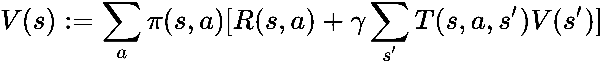

这里，*π(s, a)* 表示在策略 *π* 下在状态 *s* 中采取动作 *a* 的概率。*T(s, a, s')* 是通过采取动作 *a* 从状态 *s* 转移到状态 *s'* 的转移概率，*R(s, a)* 是在状态 *s* 中采取动作 *a* 后获得的奖励。

有两种方法来终止迭代更新过程。一种是设置一个固定的迭代次数，比如 1,000 和 10,000，有时可能难以控制。另一种是指定一个阈值（通常是 0.0001、0.00001 或类似的值），仅在所有状态的值变化程度低于指定的阈值时终止过程。

在下一节中，我们将根据最优策略和随机策略对学习-睡眠-游戏过程执行策略评估。

# 如何操作...

让我们开发一个策略评估算法，并将其应用于我们的学习-睡眠-游戏过程如下：

1.  导入 PyTorch 并定义过渡矩阵：

```py
 >>> import torch
 >>> T = torch.tensor([[[0.8, 0.1, 0.1],
 ...                    [0.1, 0.6, 0.3]],
 ...                   [[0.7, 0.2, 0.1],
 ...                    [0.1, 0.8, 0.1]],
 ...                   [[0.6, 0.2, 0.2],
 ...                    [0.1, 0.4, 0.5]]]
 ...                  )
```

1.  定义奖励函数和折现因子（现在使用 `0.5`）：

```py
 >>> R = torch.tensor([1., 0, -1.])
 >>> gamma = 0.5
```

1.  定义用于确定何时停止评估过程的阈值：

```py
 >>> threshold = 0.0001
```

1.  定义最优策略，其中在所有情况下选择动作 a0：

```py
 >>> policy_optimal = torch.tensor([[1.0, 0.0],
 ...                                [1.0, 0.0],
 ...                                [1.0, 0.0]])
```

1.  开发一个策略评估函数，接受一个策略、过渡矩阵、奖励、折现因子和阈值，并计算 `value` 函数：

```py
>>> def policy_evaluation(
 policy, trans_matrix, rewards, gamma, threshold):
...     """
...     Perform policy evaluation
...     @param policy: policy matrix containing actions and their 
 probability in each state
...     @param trans_matrix: transformation matrix
...     @param rewards: rewards for each state
...     @param gamma: discount factor
...     @param threshold: the evaluation will stop once values 
 for all states are less than the threshold
...     @return: values of the given policy for all possible states
...     """
...     n_state = policy.shape[0]
...     V = torch.zeros(n_state)
...     while True:
...         V_temp = torch.zeros(n_state)
...         for state, actions in enumerate(policy):
...             for action, action_prob in enumerate(actions):
...                 V_temp[state] += action_prob * (R[state] + 
 gamma * torch.dot(
 trans_matrix[state, action], V))
...         max_delta = torch.max(torch.abs(V - V_temp))
...         V = V_temp.clone()
...         if max_delta <= threshold:
...             break
...     return V
```

1.  现在让我们插入最优策略和所有其他变量：

```py
>>> V = policy_evaluation(policy_optimal, T, R, gamma, threshold)
>>> print(
 "The value function under the optimal policy is:\n{}".format(V)) The value function under the optimal policy is:
tensor([ 1.6786,  0.6260, -0.4821])
```

这与我们使用矩阵求逆得到的结果几乎相同。

1.  我们现在尝试另一个策略，一个随机策略，其中动作以相同的概率选择：

```py
>>> policy_random = torch.tensor([[0.5, 0.5],
...                               [0.5, 0.5],
...                               [0.5, 0.5]])
```

1.  插入随机策略和所有其他变量：

```py
>>> V = policy_evaluation(policy_random, T, R, gamma, threshold)
>>> print(
 "The value function under the random policy is:\n{}".format(V))
The value function under the random policy is:
tensor([ 1.2348,  0.2691, -0.9013])
```

# 工作原理...

我们刚刚看到了使用策略评估计算策略值的效果有多么有效。这是一种简单的收敛迭代方法，在**动态规划家族**中，或者更具体地说是**近似动态规划**。它从对值的随机猜测开始，然后根据贝尔曼期望方程迭代更新，直到它们收敛。

在第 5 步中，策略评估函数执行以下任务：

+   将策略值初始化为全零。

+   根据贝尔曼期望方程更新值。

+   计算所有状态中值的最大变化。

+   如果最大变化大于阈值，则继续更新值。否则，终止评估过程并返回最新的值。

由于策略评估使用迭代逼近，其结果可能与使用精确计算的矩阵求逆方法的结果不完全相同。事实上，我们并不真的需要价值函数那么精确。此外，它可以解决**维度诅咒**问题，这可能导致计算扩展到数以千计的状态。因此，我们通常更喜欢策略评估而不是其他方法。

还有一件事要记住，策略评估用于**预测**给定策略的预期回报有多大；它不用于**控制**问题。

# 还有更多内容...

为了更仔细地观察，我们还会绘制整个评估过程中的策略值。

在 `policy_evaluation` 函数中，我们首先需要记录每次迭代的值：

```py
>>> def policy_evaluation_history(
 policy, trans_matrix, rewards, gamma, threshold):
...     n_state = policy.shape[0]
...     V = torch.zeros(n_state)
...     V_his = [V]
...     i = 0
...     while True:
...         V_temp = torch.zeros(n_state)
...         i += 1
...         for state, actions in enumerate(policy):
...             for action, action_prob in enumerate(actions):
...                 V_temp[state] += action_prob * (R[state] + gamma * 
 torch.dot(trans_matrix[state, action], V))
...         max_delta = torch.max(torch.abs(V - V_temp))
...         V = V_temp.clone()
...         V_his.append(V)
...         if max_delta <= threshold:
...             break
...     return V, V_his
```

现在我们将 `policy_evaluation_history` 函数应用于最优策略，折现因子为 `0.5`，以及其他变量：

```py
>>> V, V_history = policy_evaluation_history(
 policy_optimal, T, R, gamma, threshold)
```

然后，我们使用以下代码绘制了值的历史结果：

```py
>>> import matplotlib.pyplot as plt
>>> s0, = plt.plot([v[0] for v in V_history])
>>> s1, = plt.plot([v[1] for v in V_history])
>>> s2, = plt.plot([v[2] for v in V_history])
>>> plt.title('Optimal policy with gamma = {}'.format(str(gamma)))
>>> plt.xlabel('Iteration')
>>> plt.ylabel('Policy values')
>>> plt.legend([s0, s1, s2],
...            ["State s0",
...             "State s1",
...             "State s2"], loc="upper left")
>>> plt.show()
```

我们看到了以下结果：

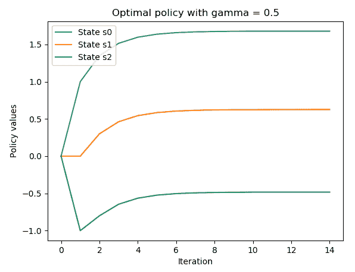

在收敛期间，从第 10 到第 14 次迭代之间的稳定性是非常有趣的。

接下来，我们使用两个不同的折现因子，0.2 和 0.99，运行相同的代码。我们得到了折现因子为 0.2 时的以下绘图：

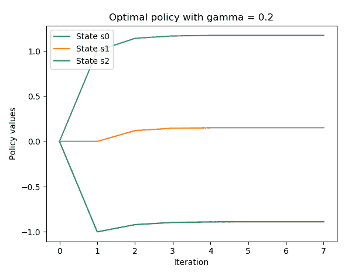

将折现因子为 0.5 的绘图与这个进行比较，我们可以看到因子越小，策略值收敛得越快。

同时，我们也得到了折现因子为 0.99 时的以下绘图：

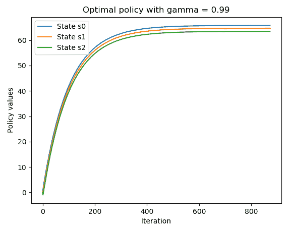

通过将折现因子为 0.5 的绘图与折现因子为 0.99 的绘图进行比较，我们可以看到因子越大，策略值收敛所需的时间越长。折现因子是即时奖励与未来奖励之间的权衡。

# 模拟 FrozenLake 环境

到目前为止，我们处理过的 MDP 的最优策略都相当直观。然而，在大多数情况下，如 FrozenLake 环境，情况并不那么简单。在这个教程中，让我们玩一下 FrozenLake 环境，并准备好接下来的教程，我们将找到它的最优策略。

FrozenLake 是一个典型的 Gym 环境，具有**离散**状态空间。它是关于在网格世界中将代理程序从起始位置移动到目标位置，并同时避开陷阱。网格可以是四乘四 ([`gym.openai.com/envs/FrozenLake-v0/`](https://gym.openai.com/envs/FrozenLake-v0/)) 或者八乘八。

t ([`gym.openai.com/envs/FrozenLake8x8-v0/`](https://gym.openai.com/envs/FrozenLake8x8-v0/))。网格由以下四种类型的方块组成：

+   **S**：代表起始位置

+   **G**：代表目标位置，这会终止一个回合

+   **F**：代表冰面方块，可以行走的位置

+   **H**：代表一个地洞位置，这会终止一个回合

显然有四种动作：向左移动（0）、向下移动（1）、向右移动（2）和向上移动（3）。如果代理程序成功到达目标位置，奖励为+1，否则为 0。此外，观察空间由一个 16 维整数数组表示，有 4 种可能的动作（这是有道理的）。

这个环境的棘手之处在于冰面很滑，代理程序并不总是按其意图移动。例如，当它打算向下移动时，可能会向左或向右移动。

# 准备工作

要运行 FrozenLake 环境，让我们首先在这里的环境表中搜索它：[`github.com/openai/gym/wiki/Table-of-environments`](https://github.com/openai/gym/wiki/Table-of-environments)。搜索结果给出了`FrozenLake-v0`。

# 怎么做……

让我们按以下步骤模拟四乘四的 FrozenLake 环境：

1.  我们导入`gym`库，并创建 FrozenLake 环境的一个实例：

```py
>>> import gym
>>> import torch
>>> env = gym.make("FrozenLake-v0")
>>> n_state = env.observation_space.n
>>> print(n_state)
16
>>> n_action = env.action_space.n
>>> print(n_action)
4
```

1.  重置环境：

```py
>>> env.reset()
0
```

代理程序从状态`0`开始。

1.  渲染环境：

```py
>>> env.render()
```

1.  让我们做一个向下的动作，因为这是可行走的：

```py
>>> new_state, reward, is_done, info = env.step(1)
>>> env.render()
```

1.  打印出所有返回的信息，确认代理程序以 33.33%的概率落在状态`4`：

```py
>>> print(new_state)
4
>>> print(reward)
0.0
>>> print(is_done)
False
>>> print(info)
{'prob': 0.3333333333333333}
```

你得到了`0`作为奖励，因为它尚未到达目标，并且回合尚未结束。再次看到代理程序可能会陷入状态 1，或者因为表面太滑而停留在状态 0。

1.  为了展示在冰面上行走有多困难，实现一个随机策略并计算 1,000 个回合的平均总奖励。首先，定义一个函数，该函数根据给定的策略模拟一个 FrozenLake 回合并返回总奖励（我们知道这要么是 0，要么是 1）：

```py
>>> def run_episode(env, policy):
...     state = env.reset()
...     total_reward = 0
...     is_done = False
...     while not is_done:
...         action = policy[state].item()
...         state, reward, is_done, info = env.step(action)
...         total_reward += reward
...         if is_done:
...             break
...     return total_reward
```

1.  现在运行`1000`个回合，并且在每个回合中都会随机生成并使用一个策略：

```py
>>> n_episode = 1000
>>> total_rewards = []
>>> for episode in range(n_episode):
...     random_policy = torch.randint(
 high=n_action, size=(n_state,))
...     total_reward = run_episode(env, random_policy)
...     total_rewards.append(total_reward)
...
>>> print('Average total reward under random policy: {}'.format(
 sum(total_rewards) / n_episode))
Average total reward under random policy: 0.014
```

这基本上意味着，如果我们随机执行动作，平均只有 1.4%的机会代理程序能够到达目标位置。

1.  接下来，我们将使用随机搜索策略进行实验。在训练阶段，我们随机生成一堆策略，并记录第一个达到目标的策略：

```py
>>> while True:
...     random_policy = torch.randint(
 high=n_action, size=(n_state,))
...     total_reward = run_episode(env, random_policy)
...     if total_reward == 1:
...         best_policy = random_policy
...         break
```

1.  查看最佳策略：

```py
>>> print(best_policy)
tensor([0, 3, 2, 2, 0, 2, 1, 1, 3, 1, 3, 0, 0, 1, 1, 1])
```

1.  现在运行 1,000 个回合，使用我们刚挑选出的策略：

```py
>>> total_rewards = []
>>> for episode in range(n_episode):
...     total_reward = run_episode(env, best_policy)
...     total_rewards.append(total_reward)
...
>>> print('Average total reward under random search 
     policy: {}'.format(sum(total_rewards) / n_episode))
Average total reward under random search policy: 0.208
```

使用随机搜索算法，平均情况下会有 20.8% 的概率达到目标。

请注意，由于我们选择的策略可能由于冰面滑动而达到目标，这可能会导致结果变化很大，可能不是最优策略。

# 工作原理……

在这个示例中，我们随机生成了一个由 16 个动作组成的策略，对应 16 个状态。请记住，在 FrozenLake 中，移动方向仅部分依赖于选择的动作，这增加了控制的不确定性。

在运行 *Step 4* 中的代码后，你将看到一个 4 * 4 的矩阵，代表冰湖和代理站立的瓷砖（状态 0）：


在运行 *Step 5* 中的代码行后，你将看到如下结果网格，代理向下移动到状态 4：

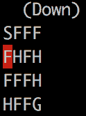

如果满足以下两个条件之一，一个回合将终止：

+   移动到 H 格（状态 5、7、11、12）。这将生成总奖励 0。

+   移动到 G 格（状态 15）。这将产生总奖励 +1。

# 还有更多内容……

我们可以使用 P 属性查看 FrozenLake 环境的详细信息，包括转移矩阵和每个状态及动作的奖励。例如，对于状态 6，我们可以执行以下操作：

```py
>>> print(env.env.P[6])
{0: [(0.3333333333333333, 2, 0.0, False), (0.3333333333333333, 5, 0.0, True), (0.3333333333333333, 10, 0.0, False)], 1: [(0.3333333333333333, 5, 0.0, True), (0.3333333333333333, 10, 0.0, False), (0.3333333333333333, 7, 0.0, True)], 2: [(0.3333333333333333, 10, 0.0, False), (0.3333333333333333, 7, 0.0, True), (0.3333333333333333, 2, 0.0, False)], 3: [(0.3333333333333333, 7, 0.0, True), (0.3333333333333333, 2, 0.0, False), (0.3333333333333333, 5, 0.0, True)]}
```

这会返回一个字典，其键为 0、1、2 和 3，分别代表四种可能的动作。值是一个列表，包含在执行动作后的移动。移动列表的格式如下：（转移概率，新状态，获得的奖励，是否结束）。例如，如果代理处于状态 6 并打算执行动作 1（向下），有 33.33% 的概率它会进入状态 5，获得奖励 0 并终止该回合；有 33.33% 的概率它会进入状态 10，获得奖励 0；有 33.33% 的概率它会进入状态 7，获得奖励 0 并终止该回合。

对于状态 11，我们可以执行以下操作：

```py
>>> print(env.env.P[11])
{0: [(1.0, 11, 0, True)], 1: [(1.0, 11, 0, True)], 2: [(1.0, 11, 0, True)], 3: [(1.0, 11, 0, True)]}
```

由于踩到洞会终止一个回合，所以不会再有任何移动。

随意查看其他状态。

# 使用值迭代算法解决 MDP

如果找到其最优策略，则认为 MDP 已解决。在这个示例中，我们将使用 **值迭代** 算法找出 FrozenLake 环境的最优策略。

值迭代的思想与策略评估非常相似。它也是一种迭代算法。它从任意策略值开始，然后根据贝尔曼最优方程迭代更新值，直到收敛。因此，在每次迭代中，它不是采用跨所有动作的值的期望（平均值），而是选择实现最大策略值的动作：

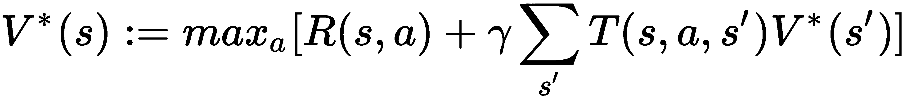

这里，V*(s)表示最优值，即最优策略的值；T(s, a, s')是采取动作 a 从状态 s 转移到状态 s’的转移概率；而 R(s, a)是采取动作 a 时在状态 s 中收到的奖励。

计算出最优值后，我们可以相应地获得最优策略：

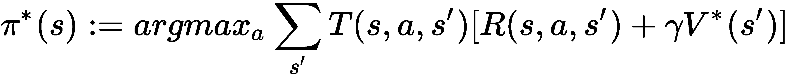

# 如何做…

让我们使用值迭代算法解决 FrozenLake 环境如下：

1.  导入必要的库并创建 FrozenLake 环境的实例：

```py
>>> import torch
>>> import gym
>>> env = gym.make('FrozenLake-v0')
```

1.  将折扣因子设为`0.99`，收敛阈值设为`0.0001`。

```py
>>> gamma = 0.99
>>> threshold = 0.0001
```

1.  现在定义一个函数，根据值迭代算法计算最优值：

```py
>>> def value_iteration(env, gamma, threshold):
...     """
...     Solve a given environment with value iteration algorithm
...     @param env: OpenAI Gym environment
...     @param gamma: discount factor
...     @param threshold: the evaluation will stop once values for 
 all states are less than the threshold
...     @return: values of the optimal policy for the given 
 environment
...     """
...     n_state = env.observation_space.n
...     n_action = env.action_space.n
...     V = torch.zeros(n_state)
...     while True:
...         V_temp = torch.empty(n_state)
...         for state in range(n_state):
...             v_actions = torch.zeros(n_action)
...             for action in range(n_action):
...                 for trans_prob, new_state, reward, _ in 
 env.env.P[state][action]:
...                     v_actions[action] += trans_prob * (reward 
 + gamma * V[new_state])
...             V_temp[state] = torch.max(v_actions)
...         max_delta = torch.max(torch.abs(V - V_temp))
...         V = V_temp.clone()
...         if max_delta <= threshold:
...             break
...     return V
```

1.  插入环境、折扣因子和收敛阈值，然后打印最优值：

```py
>>> V_optimal = value_iteration(env, gamma, threshold)
>>> print('Optimal values:\n{}'.format(V_optimal))
Optimal values:
tensor([0.5404, 0.4966, 0.4681, 0.4541, 0.5569, 0.0000, 0.3572, 0.0000, 0.5905,
 0.6421, 0.6144, 0.0000, 0.0000, 0.7410, 0.8625, 0.0000])
```

1.  现在我们有了最优值，我们开发提取最优策略的函数：

```py
>>> def extract_optimal_policy(env, V_optimal, gamma):
...     """
...     Obtain the optimal policy based on the optimal values
...     @param env: OpenAI Gym environment
...     @param V_optimal: optimal values
...     @param gamma: discount factor
...     @return: optimal policy
...     """
...     n_state = env.observation_space.n
...     n_action = env.action_space.n
...     optimal_policy = torch.zeros(n_state)
...     for state in range(n_state):
...         v_actions = torch.zeros(n_action)
...         for action in range(n_action):
...             for trans_prob, new_state, reward, _ in 
                                   env.env.P[state][action]:
...                 v_actions[action] += trans_prob * (reward 
 + gamma * V_optimal[new_state])
...         optimal_policy[state] = torch.argmax(v_actions)
...     return optimal_policy
```

1.  插入环境、折扣因子和最优值，然后打印最优策略：

```py
>>> optimal_policy = extract_optimal_policy(env, V_optimal, gamma)
>>> print('Optimal policy:\n{}'.format(optimal_policy))
Optimal policy:
tensor([0., 3., 3., 3., 0., 3., 2., 3., 3., 1., 0., 3., 3., 2., 1., 3.])
```

1.  我们想要评估最优策略的好坏程度。因此，让我们使用最优策略运行 1,000 次情节，并检查平均奖励。在这里，我们将重复使用我们在前面的配方中定义的`run_episode`函数：

```py
>>> n_episode = 1000
>>> total_rewards = []
>>> for episode in range(n_episode):
...     total_reward = run_episode(env, optimal_policy)
...     total_rewards.append(total_reward)
>>> print('Average total reward under the optimal 
 policy: {}'.format(sum(total_rewards) / n_episode))
Average total reward under the optimal policy: 0.75
```

在最优策略下，代理将平均 75%的时间到达目标。这是我们能够做到的最好结果，因为冰很滑。

# 工作原理…

在值迭代算法中，我们通过迭代应用贝尔曼最优方程来获得最优值函数。

下面是贝尔曼最优方程的另一版本，适用于奖励部分依赖于新状态的环境：

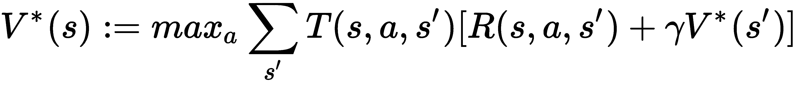

这里，R(s, a, s')表示通过采取动作 a 从状态 s 移动到状态 s'而收到的奖励。由于这个版本更兼容，我们根据它开发了我们的`value_iteration`函数。正如您在*Step 3*中看到的，我们执行以下任务：

+   将策略值初始化为全部为零。

+   根据贝尔曼最优方程更新值。

+   计算所有状态的值的最大变化。

+   如果最大变化大于阈值，则继续更新值。否则，终止评估过程，并返回最新的值作为最优值。

# 还有更多…

我们在折扣因子为 0.99 时获得了 75%的成功率。折扣因子如何影响性能？让我们用不同的因子进行一些实验，包括`0`、`0.2`、`0.4`、`0.6`、`0.8`、`0.99`和`1.`：

```py
>>> gammas = [0, 0.2, 0.4, 0.6, 0.8, .99, 1.]
```

对于每个折扣因子，我们计算了 10,000 个周期的平均成功率：

```py
>>> avg_reward_gamma = []
>>> for gamma in gammas:
...     V_optimal = value_iteration(env, gamma, threshold)
...     optimal_policy = extract_optimal_policy(env, V_optimal, gamma)
...     total_rewards = []
...     for episode in range(n_episode):
...         total_reward = run_episode(env, optimal_policy)
...         total_rewards.append(total_reward)
...     avg_reward_gamma.append(sum(total_rewards) / n_episode)
```

我们绘制了平均成功率与折扣因子的图表：

```py
>>> import matplotlib.pyplot as plt
>>> plt.plot(gammas, avg_reward_gamma)
>>> plt.title('Success rate vs discount factor')
>>> plt.xlabel('Discount factor')
>>> plt.ylabel('Average success rate')
>>> plt.show()
```

我们得到以下的绘图：

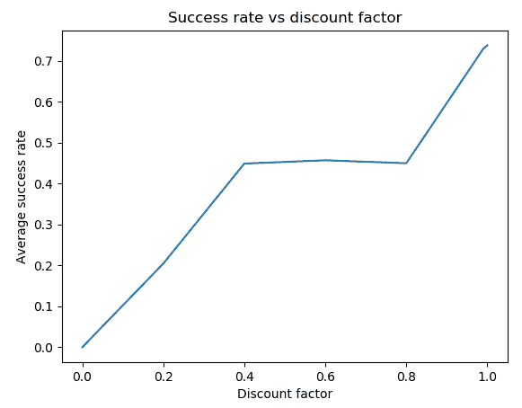

结果显示，当折扣因子增加时，性能有所提升。这证实了一个小的折扣因子目前价值奖励，而一个大的折扣因子则更看重未来的更好奖励。

# 使用策略迭代算法解决 MDP

解决 MDP 的另一种方法是使用**策略迭代**算法，我们将在本配方中讨论它。

策略迭代算法可以分为两个部分：策略评估和策略改进。它从任意策略开始。每次迭代中，它首先根据贝尔曼期望方程计算给定最新策略的策略值；然后根据贝尔曼最优性方程从结果策略值中提取一个改进的策略。它反复评估策略并生成改进版本，直到策略不再改变为止。

让我们开发一个策略迭代算法，并使用它来解决 FrozenLake 环境。之后，我们将解释它的工作原理。

# 如何做…

让我们使用策略迭代算法解决 FrozenLake 环境：

1.  我们导入必要的库并创建 FrozenLake 环境的实例：

```py
>>> import torch
>>> import gym
>>> env = gym.make('FrozenLake-v0')
```

1.  现在，暂将折扣因子设定为`0.99`，收敛阈值设定为`0.0001`：

```py
>>> gamma = 0.99
>>> threshold = 0.0001
```

1.  现在我们定义`policy_evaluation`函数，它计算给定策略的值：

```py
>>> def policy_evaluation(env, policy, gamma, threshold):
...     """
...     Perform policy evaluation
...     @param env: OpenAI Gym environment
...     @param policy: policy matrix containing actions and 
 their probability in each state
...     @param gamma: discount factor
...     @param threshold: the evaluation will stop once values 
 for all states are less than the threshold
...     @return: values of the given policy
...     """
...     n_state = policy.shape[0]
...     V = torch.zeros(n_state)
...     while True:
...         V_temp = torch.zeros(n_state)
...         for state in range(n_state):
...             action = policy[state].item()
...             for trans_prob, new_state, reward, _ in 
 env.env.P[state][action]:
...                 V_temp[state] += trans_prob * (reward 
 + gamma * V[new_state])
...         max_delta = torch.max(torch.abs(V - V_temp))
...         V = V_temp.clone()
...         if max_delta <= threshold:
...             break
...     return V
```

这与我们在*执行策略评估*配方中所做的类似，但输入是 Gym 环境。

1.  接下来，我们开发策略迭代算法的第二个主要组成部分，即策略改进部分：

```py
>>> def policy_improvement(env, V, gamma):
...     """
...     Obtain an improved policy based on the values
...     @param env: OpenAI Gym environment
...     @param V: policy values
...     @param gamma: discount factor
...     @return: the policy
...     """
...     n_state = env.observation_space.n
...     n_action = env.action_space.n
...     policy = torch.zeros(n_state)
...     for state in range(n_state):
...         v_actions = torch.zeros(n_action)
...         for action in range(n_action):
...             for trans_prob, new_state, reward, _ in 
 env.env.P[state][action]:
...                 v_actions[action] += trans_prob * (reward 
 + gamma * V[new_state])
...         policy[state] = torch.argmax(v_actions)
...     return policy
```

这根据贝尔曼最优性方程从给定的策略值中提取了一个改进的策略。

1.  现在我们两个组件都准备好了，我们按以下方式开发策略迭代算法：

```py
>>> def policy_iteration(env, gamma, threshold):
...     """
...     Solve a given environment with policy iteration algorithm
...     @param env: OpenAI Gym environment
...     @param gamma: discount factor
...     @param threshold: the evaluation will stop once values 
 for all states are less than the threshold
...     @return: optimal values and the optimal policy for the given 
 environment
...     """
...     n_state = env.observation_space.n
...     n_action = env.action_space.n
...     policy = torch.randint(high=n_action, size=(n_state,)).float()
...     while True:
...         V = policy_evaluation(env, policy, gamma, threshold)
...         policy_improved = policy_improvement(env, V, gamma)
...         if torch.equal(policy_improved, policy):
...             return V, policy_improved
...         policy = policy_improved
```

1.  插入环境、折扣因子和收敛阈值：

```py
>>> V_optimal, optimal_policy = 
 policy_iteration(env, gamma, threshold)
```

1.  我们已经获得了最优值和最优策略。让我们看一看它们：

```py
>>> print('Optimal values:\n{}'.format(V_optimal))
Optimal values:
tensor([0.5404, 0.4966, 0.4681, 0.4541, 0.5569, 0.0000, 0.3572, 0.0000, 0.5905,
 0.6421, 0.6144, 0.0000, 0.0000, 0.7410, 0.8625, 0.0000])
>>> print('Optimal policy:\n{}'.format(optimal_policy))
Optimal policy:
tensor([0., 3., 3., 3., 0., 3., 2., 3., 3., 1., 0., 3., 3., 2., 1., 3.])
```

这与使用值迭代算法得到的结果完全一样。

# 它是如何工作的…

策略迭代结合了每次迭代中的策略评估和策略改进。在策略评估中，根据贝尔曼期望方程计算给定策略（而非最优策略）的值，直到它们收敛：

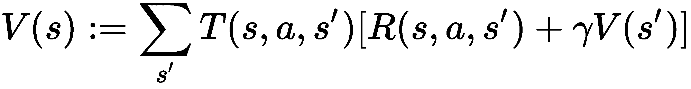

这里，a = π(s)，即在状态 s 下根据策略π采取的动作。

在策略改进中，根据贝尔曼最优性方程使用收敛的策略值 V(s)更新策略：

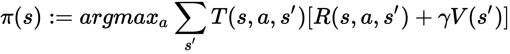

这重复策略评估和策略改进步骤，直到策略收敛。在收敛时，最新的策略和其值函数是最优策略和最优值函数。因此，在第 5 步，`policy_iteration`函数执行以下任务：

+   初始化一个随机策略。

+   使用策略评估算法计算策略的值。

+   基于策略值获取改进的策略。

+   如果新策略与旧策略不同，则更新策略并运行另一次迭代。否则，终止迭代过程并返回策略值和策略。

# 还有更多...

我们刚刚用策略迭代算法解决了 FrozenLake 环境。因此，您可能想知道何时最好使用策略迭代而不是值迭代，反之亦然。基本上有三种情况其中一种比另一种更占优势：

+   如果有大量的动作，请使用策略迭代，因为它可以更快地收敛。

+   如果动作数量较少，请使用值迭代。

+   如果已经有一个可行的策略（通过直觉或领域知识获得），请使用策略迭代。

在这些情况之外，策略迭代和值迭代通常是可比较的。

在下一个案例中，我们将应用每种算法来解决硬币抛掷赌博问题。我们将看到哪种算法收敛得更快。

# 参见

请随意使用我们在这两个案例中学到的知识来解决一个更大的冰格，即 `FrozenLake8x8-v0` 环境 ([`gym.openai.com/envs/FrozenLake8x8-v0/`](https://gym.openai.com/envs/FrozenLake8x8-v0/))。

# 解决硬币抛掷赌博问题

对硬币抛掷赌博应该对每个人都很熟悉。在游戏的每一轮中，赌徒可以打赌硬币是否会正面朝上。如果结果是正面，赌徒将赢得他们下注的相同金额；否则，他们将失去这笔金额。游戏将继续，直到赌徒输掉（最终一无所有）或赢得（赢得超过 100 美元，假设）。假设硬币不公平，并且有 40%的概率正面朝上。为了最大化赢的机会，赌徒应该根据当前资本在每一轮下注多少？这绝对是一个有趣的问题要解决。

如果硬币正面朝上的概率超过 50%，就没什么好讨论的。赌徒可以每轮下注一美元，并且大多数情况下应该能赢得游戏。如果是公平硬币，赌徒每轮下注一美元时，大约一半的时间会赢。当正面朝上的概率低于 50% 时，保守的策略就行不通了。随机策略也不行。我们需要依靠本章学到的强化学习技术来做出明智的投注。

让我们开始将抛硬币赌博问题制定为马尔可夫决策过程（MDP）。它基本上是一个无折扣、周期性的有限 MDP，具有以下特性：

+   状态是赌徒的美元资本。总共有 101 个状态：0、1、2、…、98、99 和 100+。

+   如果达到状态 100+，则奖励为 1；否则，奖励为 0。

+   行动是赌徒在一轮中可能下注的金额。对于状态 s，可能的行动包括 1、2、…，以及 min(s, 100 - s)。例如，当赌徒有 60 美元时，他们可以下注从 1 到 40 的任意金额。超过 40 的任何金额都没有意义，因为它增加了损失并且不增加赢得游戏的机会。

+   在采取行动后，下一个状态取决于硬币正面朝上的概率。假设是 40%。因此，在采取行动 *a* 后，状态 s 的下一个状态将以 40% 的概率为 *s+a*，以 60% 的概率为 *s-a*。

+   过程在状态 0 和状态 100+ 处终止。

# 如何做…

我们首先使用值迭代算法解决抛硬币赌博问题，并执行以下步骤：

1.  导入 PyTorch：

```py
>>> import torch
```

1.  指定折扣因子和收敛阈值：

```py
>>> gamma = 1
>>> threshold = 1e-10
```

在这里，我们将折扣因子设为 1，因为这个 MDP 是一个无折扣的过程；我们设置了一个小阈值，因为我们预期策略值较小，所有奖励都是 0，除了最后一个状态。

1.  定义以下环境变量。

总共有 101 个状态：

```py
>>> capital_max = 100
>>> n_state = capital_max + 1
```

相应的奖励显示如下：

```py
>>> rewards = torch.zeros(n_state)
>>> rewards[-1] = 1
>>> print(rewards)
tensor([0., 0., 0., 0., 0., 0., 0., 0., 0., 0., 0., 0., 0., 0., 0., 0., 0., 0.,
 0., 0., 0., 0., 0., 0., 0., 0., 0., 0., 0., 0., 0., 0., 0., 0., 0., 0.,
 0., 0., 0., 0., 0., 0., 0., 0., 0., 0., 0., 0., 0., 0., 0., 0., 0., 0.,
 0., 0., 0., 0., 0., 0., 0., 0., 0., 0., 0., 0., 0., 0., 0., 0., 0., 0.,
 0., 0., 0., 0., 0., 0., 0., 0., 0., 0., 0., 0., 0., 0., 0., 0., 0., 0.,
 0., 0., 0., 0., 0., 0., 0., 0., 0., 0., 1.])
```

假设正面朝上的概率是 40%：

```py
>>> head_prob = 0.4
```

将这些变量放入字典中：

```py
>>> env = {'capital_max': capital_max,
...        'head_prob': head_prob,
...        'rewards': rewards,
...        'n_state': n_state}
```

1.  现在我们开发一个函数，根据值迭代算法计算最优值：

```py
>>> def value_iteration(env, gamma, threshold):
...     """
...     Solve the coin flipping gamble problem with 
 value iteration algorithm
...     @param env: the coin flipping gamble environment
...     @param gamma: discount factor
...     @param threshold: the evaluation will stop once values 
 for all states are less than the threshold
...     @return: values of the optimal policy for the given 
 environment
...     """
...     head_prob = env['head_prob']
...     n_state = env['n_state']
...     capital_max = env['capital_max']
...     V = torch.zeros(n_state)
...     while True:
...         V_temp = torch.zeros(n_state)
...         for state in range(1, capital_max):
...             v_actions = torch.zeros(
 min(state, capital_max - state) + 1)
...             for action in range(
 1, min(state, capital_max - state) + 1):
...                 v_actions[action] += head_prob * (
 rewards[state + action] +
 gamma * V[state + action])
...                 v_actions[action] += (1 - head_prob) * (
 rewards[state - action] +
 gamma * V[state - action])
...             V_temp[state] = torch.max(v_actions)
...         max_delta = torch.max(torch.abs(V - V_temp))
...         V = V_temp.clone()
...         if max_delta <= threshold:
...             break
...     return V
```

我们只需计算状态 1 到 99 的值，因为状态 0 和状态 100+ 的值为 0。而给定状态 *s*，可能的行动可以是从 1 到 *min(s, 100 - s)*。在计算贝尔曼最优方程时，我们应该牢记这一点。

1.  接下来，我们开发一个函数，根据最优值提取最优策略：

```py
>>> def extract_optimal_policy(env, V_optimal, gamma):
...     """
...     Obtain the optimal policy based on the optimal values
...     @param env: the coin flipping gamble environment
...     @param V_optimal: optimal values
...     @param gamma: discount factor
...     @return: optimal policy
...     """
...     head_prob = env['head_prob']
...     n_state = env['n_state']
...     capital_max = env['capital_max']
...     optimal_policy = torch.zeros(capital_max).int()
...     for state in range(1, capital_max):
...         v_actions = torch.zeros(n_state)
...         for action in range(1, 
 min(state, capital_max - state) + 1):
...             v_actions[action] += head_prob * (
 rewards[state + action] +
 gamma * V_optimal[state + action])
...             v_actions[action] += (1 - head_prob) * (
 rewards[state - action] +
 gamma * V_optimal[state - action])
...         optimal_policy[state] = torch.argmax(v_actions)
...     return optimal_policy
```

1.  最后，我们可以将环境、折扣因子和收敛阈值输入，计算出最优值和最优策略。此外，我们还计时了使用值迭代解决赌博 MDP 所需的时间；我们将其与策略迭代完成所需的时间进行比较：

```py
>>> import time
>>> start_time = time.time()
>>> V_optimal = value_iteration(env, gamma, threshold)
>>> optimal_policy = extract_optimal_policy(env, V_optimal, gamma)
>>> print("It takes {:.3f}s to solve with value 
 iteration".format(time.time() - start_time))
It takes 4.717s to solve with value iteration
```

我们在 `4.717` 秒内使用值迭代算法解决了赌博问题。

1.  查看我们得到的最优策略值和最优策略：

```py
>>> print('Optimal values:\n{}'.format(V_optimal))
>>> print('Optimal policy:\n{}'.format(optimal_policy))
```

1.  我们可以绘制策略值与状态的图表如下：

```py
>>> import matplotlib.pyplot as plt
>>> plt.plot(V_optimal[:100].numpy())
>>> plt.title('Optimal policy values')
>>> plt.xlabel('Capital')
>>> plt.ylabel('Policy value')
>>> plt.show()
```

现在我们已经通过值迭代解决了赌博问题，接下来是策略迭代？我们来看看。

1.  我们首先开发`policy_evaluation`函数，该函数根据策略计算值：

```py
>>> def policy_evaluation(env, policy, gamma, threshold):
...     """
...     Perform policy evaluation
...     @param env: the coin flipping gamble environment
...     @param policy: policy tensor containing actions taken 
 for individual state
...     @param gamma: discount factor
...     @param threshold: the evaluation will stop once values 
 for all states are less than the threshold
...     @return: values of the given policy
...     """
...     head_prob = env['head_prob']
...     n_state = env['n_state']
...     capital_max = env['capital_max']
...     V = torch.zeros(n_state)
...     while True:
...         V_temp = torch.zeros(n_state)
...         for state in range(1, capital_max):
...             action = policy[state].item()
...             V_temp[state] += head_prob * (
 rewards[state + action] +
 gamma * V[state + action])
...             V_temp[state] += (1 - head_prob) * (
 rewards[state - action] +
 gamma * V[state - action])
...         max_delta = torch.max(torch.abs(V - V_temp))
...         V = V_temp.clone()
...         if max_delta <= threshold:
...             break
...     return V
```

1.  接下来，我们开发策略迭代算法的另一个主要组成部分，即策略改进部分：

```py
>>> def policy_improvement(env, V, gamma):
...     """
...     Obtain an improved policy based on the values
...     @param env: the coin flipping gamble environment
...     @param V: policy values
...     @param gamma: discount factor
...     @return: the policy
...     """
...     head_prob = env['head_prob']
...     n_state = env['n_state']
...     capital_max = env['capital_max']
...     policy = torch.zeros(n_state).int()
...     for state in range(1, capital_max):
...         v_actions = torch.zeros(
 min(state, capital_max - state) + 1)
...         for action in range(
 1, min(state, capital_max - state) + 1):
...             v_actions[action] += head_prob * (
 rewards[state + action] + 
 gamma * V[state + action])
...             v_actions[action] += (1 - head_prob) * (
 rewards[state - action] +
 gamma * V[state - action])
...         policy[state] = torch.argmax(v_actions)
...     return policy
```

1.  有了这两个组件，我们可以开发策略迭代算法的主要入口如下：

```py
>>> def policy_iteration(env, gamma, threshold):
...     """
...     Solve the coin flipping gamble problem with policy 
 iteration algorithm
...     @param env: the coin flipping gamble environment
...     @param gamma: discount factor
...     @param threshold: the evaluation will stop once values
 for all states are less than the threshold
...     @return: optimal values and the optimal policy for the 
 given environment
...     """
...     n_state = env['n_state']
...     policy = torch.zeros(n_state).int()
...     while True:
...         V = policy_evaluation(env, policy, gamma, threshold)
...         policy_improved = policy_improvement(env, V, gamma)
...         if torch.equal(policy_improved, policy):
...             return V, policy_improved
...         policy = policy_improved
```

1.  最后，我们将环境、折扣因子和收敛阈值插入以计算最优值和最优策略。我们记录解决 MDP 所花费的时间：

```py
>>> start_time = time.time()
>>> V_optimal, optimal_policy 
 = policy_iteration(env, gamma, threshold)
>>> print("It takes {:.3f}s to solve with policy 
 iteration".format(time.time() - start_time))
It takes 2.002s to solve with policy iteration
```

1.  查看刚刚获得的最优值和最优策略：

```py
>>> print('Optimal values:\n{}'.format(V_optimal))
>>> print('Optimal policy:\n{}'.format(optimal_policy))
```

# 它是如何运作的……

在执行*第 7 步*中的代码行后，您将看到最优策略值：

```py
Optimal values:
tensor([0.0000, 0.0021, 0.0052, 0.0092, 0.0129, 0.0174, 0.0231, 0.0278, 0.0323,
 0.0377, 0.0435, 0.0504, 0.0577, 0.0652, 0.0695, 0.0744, 0.0807, 0.0866,
 0.0942, 0.1031, 0.1087, 0.1160, 0.1259, 0.1336, 0.1441, 0.1600, 0.1631,
 0.1677, 0.1738, 0.1794, 0.1861, 0.1946, 0.2017, 0.2084, 0.2165, 0.2252,
 0.2355, 0.2465, 0.2579, 0.2643, 0.2716, 0.2810, 0.2899, 0.3013, 0.3147,
 0.3230, 0.3339, 0.3488, 0.3604, 0.3762, 0.4000, 0.4031, 0.4077, 0.4138,
 0.4194, 0.4261, 0.4346, 0.4417, 0.4484, 0.4565, 0.4652, 0.4755, 0.4865,
 0.4979, 0.5043, 0.5116, 0.5210, 0.5299, 0.5413, 0.5547, 0.5630, 0.5740,
 0.5888, 0.6004, 0.6162, 0.6400, 0.6446, 0.6516, 0.6608, 0.6690, 0.6791,
 0.6919, 0.7026, 0.7126, 0.7248, 0.7378, 0.7533, 0.7697, 0.7868, 0.7965,
 0.8075, 0.8215, 0.8349, 0.8520, 0.8721, 0.8845, 0.9009, 0.9232, 0.9406,
 0.9643, 0.0000])
```

您还将看到最优策略：

```py
Optimal policy:
tensor([ 0,  1, 2, 3, 4,  5, 6, 7, 8, 9, 10, 11, 12, 13, 14, 15, 16, 17,
 18, 19, 20, 21, 22, 23, 24, 25, 26, 27, 22, 29, 30, 31, 32, 33,  9, 35,
 36, 37, 38, 11, 40,  9, 42, 43, 44, 5, 4,  3, 2, 1, 50, 1, 2, 47,
 4, 5, 44,  7, 8, 9, 10, 11, 38, 12, 36, 35, 34, 17, 32, 19, 30,  4,
 3, 2, 26, 25, 24, 23, 22, 21, 20, 19, 18, 17, 16, 15, 14, 13, 12, 11,
 10, 9, 8,  7, 6, 5, 4,  3, 2, 1], dtype=torch.int32)
```

*第 8 步* 生成了以下最优策略值的图表：

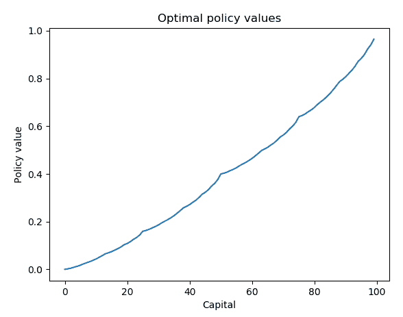

我们可以看到，随着资本（状态）的增加，估计的奖励（策略值）也在增加，这是有道理的。

在*第 9 步*中我们所做的事情与*Solving an MDP with a policy iteration algorithm*配方中的所做的非常相似，但这次是针对抛硬币赌博环境。

在*第 10 步*中，策略改进函数从给定的策略值中提取出改进的策略，基于贝尔曼最优方程。

正如您在*第 12 步*中所看到的，我们通过策略迭代在`2.002`秒内解决了赌博问题，比值迭代所花费的时间少了一半。

我们从*第 13 步*得到的结果包括以下最优值：

```py
Optimal values:
tensor([0.0000, 0.0021, 0.0052, 0.0092, 0.0129, 0.0174, 0.0231, 0.0278, 0.0323,
 0.0377, 0.0435, 0.0504, 0.0577, 0.0652, 0.0695, 0.0744, 0.0807, 0.0866,
 0.0942, 0.1031, 0.1087, 0.1160, 0.1259, 0.1336, 0.1441, 0.1600, 0.1631,
 0.1677, 0.1738, 0.1794, 0.1861, 0.1946, 0.2017, 0.2084, 0.2165, 0.2252,
 0.2355, 0.2465, 0.2579, 0.2643, 0.2716, 0.2810, 0.2899, 0.3013, 0.3147,
 0.3230, 0.3339, 0.3488, 0.3604, 0.3762, 0.4000, 0.4031, 0.4077, 0.4138,
 0.4194, 0.4261, 0.4346, 0.4417, 0.4484, 0.4565, 0.4652, 0.4755, 0.4865,
 0.4979, 0.5043, 0.5116, 0.5210, 0.5299, 0.5413, 0.5547, 0.5630, 0.5740,
 0.5888, 0.6004, 0.6162, 0.6400, 0.6446, 0.6516, 0.6608, 0.6690, 0.6791,
 0.6919, 0.7026, 0.7126, 0.7248, 0.7378, 0.7533, 0.7697, 0.7868, 0.7965,
 0.8075, 0.8215, 0.8349, 0.8520, 0.8721, 0.8845, 0.9009, 0.9232, 0.9406,
 0.9643, 0.0000])
```

它们还包括最优策略：

```py
Optimal policy:
tensor([ 0,  1, 2, 3, 4,  5, 6, 7, 8, 9, 10, 11, 12, 13, 14, 15, 16, 17,
 18, 19, 20, 21, 22, 23, 24, 25, 26, 27, 22, 29, 30, 31, 32, 33,  9, 35,
 36, 37, 38, 11, 40,  9, 42, 43, 44, 5, 4,  3, 2, 1, 50, 1, 2, 47,
 4, 5, 44,  7, 8, 9, 10, 11, 38, 12, 36, 35, 34, 17, 32, 19, 30,  4,
 3, 2, 26, 25, 24, 23, 22, 21, 20, 19, 18, 17, 16, 15, 14, 13, 12, 11,
 10, 9, 8,  7, 6, 5, 4,  3, 2, 1, 0], dtype=torch.int32)
```

来自值迭代和策略迭代的两种方法的结果是一致的。

我们通过值迭代和策略迭代解决了赌博问题。处理强化学习问题中最棘手的任务之一是将过程形式化为 MDP。在我们的例子中，通过下注一定的赌注（动作），将当前资本（状态）的策略转化为新资本（新状态）。最优策略最大化了赢得游戏的概率（+1 奖励），并在最优策略下评估了赢得游戏的概率。

另一个有趣的事情是注意我们的示例中如何确定贝尔曼方程中的转换概率和新状态。在状态 s 中采取动作 a（拥有资本 s 并下注 1 美元），将有两种可能的结果：

+   如果硬币正面朝上，则移动到新状态 s+a。因此，转换概率等于正面朝上的概率。

+   如果硬币反面朝上，则移动到新状态 s-a。因此，转换概率等于反面朝上的概率。

这与 FrozenLake 环境非常相似，代理人只有以一定概率着陆在预期的瓦片上。

我们还验证了在这种情况下，策略迭代比值迭代收敛更快。这是因为可能有多达 50 个可能的行动，这比 FrozenLake 中的 4 个行动更多。对于具有大量行动的马尔可夫决策过程，用策略迭代解决比值迭代更有效率。

# 还有更多...

你可能想知道最优策略是否真的有效。让我们像聪明的赌徒一样玩 10,000 个剧集的游戏。我们将比较最优策略与另外两种策略：保守策略（每轮下注一美元）和随机策略（下注随机金额）：

1.  我们首先通过定义三种上述的投注策略开始。

我们首先定义最优策略：

```py
>>> def optimal_strategy(capital):
...     return optimal_policy[capital].item()
```

然后我们定义保守策略：

```py
>>> def conservative_strategy(capital):
...     return 1
```

最后，我们定义随机策略：

```py
>>> def random_strategy(capital):
...     return torch.randint(1, capital + 1, (1,)).item()
```

1.  定义一个包装函数，用一种策略运行一个剧集，并返回游戏是否获胜：

```py
>>> def run_episode(head_prob, capital, policy):
...     while capital > 0:
...         bet = policy(capital)
...         if torch.rand(1).item() < head_prob:
...             capital += bet
...             if capital >= 100:
...                 return 1
...         else:
...             capital -= bet
...     return 0
```

1.  指定一个起始资本（假设是`50`美元）和一定数量的剧集（`10000`）：

```py
>>> capital = 50
>>> n_episode = 10000
```

1.  运行 10,000 个剧集并跟踪获胜次数：

```py
>>> n_win_random = 0
>>> n_win_conservative = 0
>>> n_win_optimal = 0
>>> for episode in range(n_episode):
...     n_win_random += run_episode(
 head_prob, capital, random_strategy)
...     n_win_conservative += run_episode(
 head_prob, capital, conservative_strategy)
...     n_win_optimal += run_episode(
 head_prob, capital, optimal_strategy)
```

1.  打印出三种策略的获胜概率：

```py
>>> print('Average winning probability under the random 
 policy: {}'.format(n_win_random/n_episode))
Average winning probability under the random policy: 0.2251
>>> print('Average winning probability under the conservative 
 policy: {}'.format(n_win_conservative/n_episode))
Average winning probability under the conservative policy: 0.0
>>> print('Average winning probability under the optimal 
 policy: {}'.format(n_win_optimal/n_episode))
Average winning probability under the optimal policy: 0.3947
```

我们的最优策略显然是赢家！
