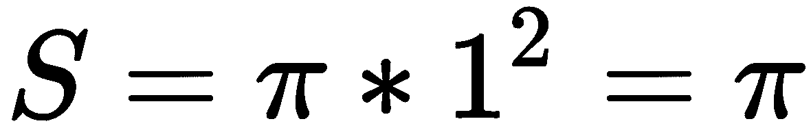

# 第三章：用于进行数值估计的蒙特卡洛方法

在前一章中，我们使用动态规划评估和解决了**马尔可夫决策过程** (**MDP**)。像 DP 这样的模型基方法有一些缺点。它们需要完全了解环境，包括转移矩阵和奖励矩阵。它们的可扩展性也有限，特别是对于具有大量状态的环境。

在本章中，我们将继续我们的学习之旅，采用无模型方法，即**蒙特卡洛** (**MC**) 方法，它不需要环境的先前知识，并且比 DP 具有更高的可扩展性。我们将从使用蒙特卡洛方法估计π的值开始。接下来，我们将讨论如何使用 MC 方法以首次访问和每次访问的方式来预测状态值和状态-动作值。我们将演示如何使用蒙特卡洛训练代理玩二十一点游戏。此外，我们还将实现基于策略和离策略的 MC 控制，以找到二十一点的最优策略。还将介绍具有ε-贪心策略和加权重要性采样的高级 MC 控制。

本章将涵盖以下配方：

+   使用蒙特卡洛方法计算π

+   执行蒙特卡洛策略评估

+   使用蒙特卡洛预测玩二十一点

+   执行基于策略的蒙特卡洛控制

+   开发具有ε-贪心策略的蒙特卡洛控制

+   执行离策略蒙特卡洛控制

+   开发具有加权重要性采样的 MC 控制

# 使用蒙特卡洛方法计算π

让我们开始一个简单的项目：使用蒙特卡洛方法估算π的值，这是无模型强化学习算法的核心。

**蒙特卡洛方法**是使用随机性解决问题的任何方法。该算法重复适当的**随机抽样**，并观察满足特定属性的样本分数，以便进行数值估计。

让我们做一个有趣的练习，使用 MC 方法近似计算π的值。我们在一个边长为 2 的正方形内随机放置大量点（-1<x<1, -1<y<1），并计算落入单位半径圆内的点数。我们都知道正方形的面积为：


圆的面积为：



如果我们将圆的面积除以正方形的面积，我们有以下结果：


*S/C*可以用落入圆内的点的比例来衡量。因此，π的值可以估计为*S/C*的四倍。

# 如何做到...

我们使用 MC 方法来估算π的值如下：

1.  导入必要的模块，包括 PyTorch，π的真实值的`math`，以及用于在正方形内绘制随机点的`matplotlib`：

```py
>>> import torch
>>> import math
>>> import matplotlib.pyplot as plt
```

1.  我们随机生成 1,000 个点在正方形内，范围为-1<x<1 和-1<y<1：

```py
>>> n_point = 1000
>>> points = torch.rand((n_point, 2)) * 2 - 1
```

1.  初始化单位圆内的点数，并存储这些点的列表：

```py
>>> n_point_circle = 0
>>> points_circle = []
```

1.  对于每个随机点，计算到原点的距离。如果距离小于 1，则点落在圆内：

```py
>>> for point in points:
...     r = torch.sqrt(point[0] ** 2 + point[1] ** 2)
...     if r <= 1:
...         points_circle.append(point)
...         n_point_circle += 1
```

1.  统计圆内点的数量，并跟踪这些点：

```py
>>> points_circle = torch.stack(points_circle)
```

1.  绘制所有随机点，并对圆内的点使用不同的颜色：

```py
>>> plt.plot(points[:, 0].numpy(), points[:, 1].numpy(), 'y.')
>>> plt.plot(points_circle[:, 0].numpy(), points_circle[:, 1].numpy(), 'c.')
```

1.  绘制圆以获得更好的可视化效果：

```py
>>> i = torch.linspace(0, 2 * math.pi)
>>> plt.plot(torch.cos(i).numpy(), torch.sin(i).numpy())
>>> plt.axes().set_aspect('equal')
>>> plt.show()
```

1.  最后，计算π的值：

```py
>>> pi_estimated = 4 * (n_point_circle / n_point)
>>> print('Estimated value of pi is:', pi_estimated)
```

# 工作原理是这样的...

在*第 5 步*，您将看到以下图，其中的点是随机放置在圆内：


蒙特卡洛方法之所以如此强大，要归功于**大数定律**（**LLN**）。根据大数定律，大量重复事件或动作的平均表现最终会收敛于期望值。在我们的情况下，大量随机点，`4 * (n_point_circle / n_point)` 最终会收敛于π的真实值。

最后，在*第 8 步*，我们打印π的估计值，得到以下结果：

```py
Estimated value of pi is: 3.156 
```

使用蒙特卡洛方法近似计算π的值非常接近其真实值（3.14159...）。

# 还有更多内容...

我们可以通过比 1,000 次更多的迭代进一步改进我们的估计。在这里，我们将尝试 10,000 次迭代。在每次迭代中，我们在正方形内随机生成一个点，并检查它是否在圆内；根据落入圆内的点的比例，我们即时估算π的值。

然后我们将估计历史与π的真实值一起绘制。将它们放入以下函数中：

```py
>>> def estimate_pi_mc(n_iteration):
...     n_point_circle = 0
...     pi_iteration = []
...     for i in range(1, n_iteration+1):
...         point = torch.rand(2) * 2 - 1
...         r = torch.sqrt(point[0] ** 2 + point[1] ** 2)
...         if r <= 1:
...             n_point_circle += 1
...         pi_iteration.append(4 * (n_point_circle / i))
...     plt.plot(pi_iteration)
...     plt.plot([math.pi] * n_iteration, '--')
...     plt.xlabel('Iteration')
...     plt.ylabel('Estimated pi')
...     plt.title('Estimation history')
...     plt.show()
...     print('Estimated value of pi is:', pi_iteration[-1]) The estimated value of pi is: 3.1364
```

然后我们使用 10,000 次迭代调用这个函数：

```py
>>> estimate_pi_mc(10000)
```

参考以下图表查看估计历史的结果：


我们可以看到，随着更多的迭代次数，π的估计值越来越接近真实值。事件或行动总是存在一些变化。增加重复次数可以帮助平滑这种变化。

# 另请参阅

如果你对蒙特卡洛方法的更多应用感兴趣，这里有一些有趣的应用：

+   *通过 MC 树搜索玩游戏，如围棋*，*哈瓦纳*，*战舰*，*寻找最佳移动*：[`en.wikipedia.org/wiki/Monte_Carlo_tree_search`](https://en.wikipedia.org/wiki/Monte_Carlo_tree_search)

+   *评估投资和投资组合*：[`en.wikipedia.org/wiki/Monte_Carlo_methods_in_finance`](https://en.wikipedia.org/wiki/Monte_Carlo_methods_in_finance)

+   *使用 MC 模拟研究生物系统*：[`en.wikipedia.org/wiki/Bayesian_inference_in_phylogeny`](https://en.wikipedia.org/wiki/Bayesian_inference_in_phylogeny)

# 执行蒙特卡洛策略评估

在第二章，*马尔可夫决策过程与动态规划*中，我们应用 DP 进行策略评估，即策略的值（或状态值）函数。这确实效果很好，但也有一些限制。基本上，它需要完全了解环境，包括转移矩阵和奖励矩阵。然而，在大多数实际情况下，转移矩阵事先是未知的。需要已知 MDP 的强化学习算法被归类为**基于模型**的算法。另一方面，不需要先验知识的转移和奖励的算法被称为**无模型**算法。基于蒙特卡洛的强化学习是一种无模型方法。

在这个示例中，我们将使用蒙特卡洛方法评估值函数。我们再次使用 FrozenLake 环境作为示例，假设我们无法访问其转移和奖励矩阵。你会记得过程的**返回**，即长期内的总奖励，如下所示：


MC 策略评估使用**经验均值返回**而不是**期望返回**（如 DP 中）来估计值函数。有两种方法可以进行 MC 策略评估。一种是**首次访问 MC 预测**，它仅对状态 s 在一个 episode 中的**第一次出现**进行返回平均。另一种是**每次访问 MC 预测**，它对状态 s 在一个 episode 中的**每次出现**进行返回平均。显然，首次访问 MC 预测比每次访问版本计算要少得多，因此更频繁地使用。

# 如何做...

我们对 FrozenLake 的最优策略执行首次访问 MC 预测如下：

1.  导入 PyTorch 和 Gym 库，并创建 FrozenLake 环境的实例：

```py
>>> import torch
>>> import gym >>> env = gym.make("FrozenLake-v0")
```

1.  要使用蒙特卡洛方法评估策略，我们首先需要定义一个函数，该函数模拟给定策略的 FrozenLake episode，并返回每个步骤的奖励和状态：

```py
>>> def run_episode(env, policy):
 ...     state = env.reset()
 ...     rewards = []
 ...     states = [state]
 ...     is_done = False
 ...     while not is_done:
 ...         action = policy[state].item()
 ...         state, reward, is_done, info = env.step(action)
 ...         states.append(state)
 ...         rewards.append(reward)
 ...         if is_done:
 ...             break
 ...     states = torch.tensor(states)
 ...     rewards = torch.tensor(rewards)
 ...     return states, rewards
```

同样，在蒙特卡洛设置中，我们需要跟踪所有步骤的状态和奖励，因为我们无法访问完整的环境，包括转移概率和奖励矩阵。

1.  现在，定义一个使用首次访问 MC 评估给定策略的函数：

```py
>>> def mc_prediction_first_visit(env, policy, gamma, n_episode):
...     n_state = policy.shape[0]
...     V = torch.zeros(n_state)
...     N = torch.zeros(n_state)
...     for episode in range(n_episode):
...         states_t, rewards_t = run_episode(env, policy)
...         return_t = 0
...         first_visit = torch.zeros(n_state)
...         G = torch.zeros(n_state)
...         for state_t, reward_t in zip(reversed(states_t)[1:], 
                                            reversed(rewards_t)):
...             return_t = gamma * return_t + reward_t
...             G[state_t] = return_t
...             first_visit[state_t] = 1
...         for state in range(n_state):
...             if first_visit[state] > 0:
...                 V[state] += G[state]
...                 N[state] += 1
...     for state in range(n_state):
...         if N[state] > 0:
...             V[state] = V[state] / N[state]
...     return V
```

1.  我们将折现率设定为 1 以便计算更加简便，并模拟了 10,000 个 episode：

```py
>>> gamma = 1
>>> n_episode = 10000
```

1.  我们使用前一章节中计算的最优策略，*马尔可夫决策过程与动态规划*，将其输入到首次访问 MC 函数中，同时还包括其他参数：

```py
>>> optimal_policy = torch.tensor([0., 3., 3., 3., 0., 3., 2., 3., 3., 1., 0., 3., 3., 2., 1., 3.])
>>> value = mc_prediction_first_visit(env, optimal_policy, gamma, n_episode)
>>> print('The value function calculated by first-visit MC prediction:\n', value)
The value function calculated by first-visit MC prediction:
tensor([0.7463, 0.5004, 0.4938, 0.4602, 0.7463, 0.0000, 0.3914, 0.0000, 0.7463, 0.7469, 0.6797, 0.0000, 0.0000, 0.8038, 0.8911, 0.0000])
```

我们刚刚使用首次访问 MC 预测解决了最优策略的值函数。

# 它的工作原理...

在*第 3 步*中，我们在 MC 预测中执行以下任务：

+   我们运行`n_episode`个 episode

+   对于每个 episode，我们计算每个状态的首次访问的返回

+   对于每个状态，我们通过平均所有集的首次回报来获取值

正如您所看到的，在基于 MC 的预测中，并不需要了解环境的完整模型。事实上，在大多数真实情况下，过渡矩阵和奖励矩阵事先是未知的，或者极其难以获得。想象一下下棋或围棋中可能的状态数量以及可能的动作数量；几乎不可能计算出过渡矩阵和奖励矩阵。无模型强化学习是通过与环境交互从经验中学习的过程。

在我们的情况下，我们只考虑了可以观察到的内容，这包括每一步中的新状态和奖励，并使用 Monte Carlo 方法进行预测。请注意，我们模拟的集数越多，我们可以获得的预测越精确。如果您绘制每个集后更新的值，您将看到它如何随时间收敛，这与我们估计π值时看到的情况类似。

# 还有更多...

我们决定为冰湖的最优策略也执行每次访问的 MC 预测：

1.  我们定义了使用每次访问 MC 评估给定策略的函数：

```py
>>> def mc_prediction_every_visit(env, policy, gamma, n_episode):
...     n_state = policy.shape[0]
...     V = torch.zeros(n_state)
...     N = torch.zeros(n_state)
...     G = torch.zeros(n_state)
...     for episode in range(n_episode):
...         states_t, rewards_t = run_episode(env, policy)
...         return_t = 0
...         for state_t, reward_t in zip(reversed(states_t)[1:],  
                                            reversed(rewards_t)):
...             return_t = gamma * return_t + reward_t
...             G[state_t] += return_t
...             N[state_t] += 1
...     for state in range(n_state):
...         if N[state] > 0:
...             V[state] = G[state] / N[state]
...     return V
```

与首次访问 MC 类似，每次访问函数执行以下任务：

+   运行`n_episode`集

+   对于每一集，它计算每次访问状态的回报

+   对于每个状态，通过平均所有集的所有回报来获取值

1.  通过在函数中输入策略和其他参数来计算值：

```py
>>> value = mc_prediction_every_visit(env, optimal_policy, gamma, n_episode)
```

1.  显示结果值：

```py
>>> print('The value function calculated by every-visit MC prediction:\n', value)
The value function calculated by every-visit MC prediction:
tensor([0.6221, 0.4322, 0.3903, 0.3578, 0.6246, 0.0000, 0.3520, 0.0000, 0.6428, 0.6759, 0.6323, 0.0000, 0.0000, 0.7624, 0.8801, 0.0000])
```

# 使用 Monte Carlo 预测玩 21 点

在这个示例中，我们将玩 21 点（也称为 21），并评估我们认为可能有效的策略。您将通过 21 点的示例更加熟悉使用 Monte Carlo 预测，并准备在即将到来的示例中使用 Monte Carlo 控制搜索最优策略。

21 点是一种流行的纸牌游戏，目标是使牌的总和尽可能接近 21 点而不超过它。J、K 和 Q 牌的点数为 10，2 到 10 的牌的点数为 2 到 10。A 牌可以是 1 点或 11 点；选择后者称为**可用**A。玩家与庄家竞争。一开始，双方都会得到两张随机牌，但只有一张庄家的牌对玩家可见。玩家可以要求额外的牌（称为**要牌**）或停止接收更多的牌（称为**停牌**）。在玩家停牌之前，如果他们的牌的总和超过 21（称为爆牌），则玩家输。否则，如果庄家的牌总和超过 21，玩家赢。

如果两方都没有爆牌，得分最高的一方将获胜，或者可能是平局。Gym 中的 21 点环境如下所述：

+   Blackjack 有限 MDP 的一轮情节以每方两张牌开始，只有一张庄家的牌是可见的。

+   一个情节以任一方获胜或双方平局结束。情节的最终奖励如下：如果玩家获胜，则为 `+1`；如果玩家输，则为 `-1`；如果平局，则为 `0`。

+   每轮中，玩家可以执行两个动作，要牌（1）和停牌（0），表示请求另一张牌和请求不再接收任何更多的牌。

我们首先尝试一个简单的策略，即只要总点数小于 18（或者您更喜欢的 19 或 20），就继续添加新的牌。

# 如何做到...

让我们从模拟 Blackjack 环境开始，并探索其状态和行动：

1.  导入 PyTorch 和 Gym，并创建一个 `Blackjack` 实例：

```py
>>> import torch
>>> import gym
>>> env = gym.make('Blackjack-v0')
```

1.  重置环境：

```py
>>> env.reset()
>>> env.reset()
(20, 5, False)
```

它返回三个状态变量：

+   玩家的点数（本例中为 `20`）

+   庄家的点数（本例中为 `5`）

+   玩家是否拥有可重复使用的 Ace（本例中为 `False`）

可重复使用的 Ace 意味着玩家拥有一个 Ace，可以将其计为 11 而不会爆牌。如果玩家没有 Ace，或者有 Ace 但使他们爆牌，状态参数将变为 `False`。

查看以下情节：

```py
>>> env.reset()
(18, 6, True)
```

18 点和 `True` 表示玩家有一个 Ace 和一个 7，Ace 被计为 11。

1.  让我们执行一些动作，看看 Blackjack 环境的工作原理。首先，我们要牌（请求额外的一张牌），因为我们有可重复使用的 Ace，这提供了一些灵活性：

```py
>>> env.step(1)
((20, 6, True), 0, False, {})
```

这返回三个状态变量 `(20, 6, True)`，一个奖励（目前为`0`），以及该情节是否结束（目前为`False`）。

然后我们停止抽牌：

```py
>>> env.step(0)
 ((20, 6, True), 1, True, {})
```

在这一情节中我们刚刚赢得了比赛，因此奖励为 `1`，现在情节结束了。再次提醒，一旦玩家选择 **停牌**，庄家将采取他们的行动。

1.  有时我们会输掉；例如：

```py
>>> env.reset()
(15, 10, False)
>>> env.step(1)
((25, 10, False), -1, True, {})
```

接下来，我们将预测一个简单策略的值，在该策略中，当分数达到 18 时停止添加新牌：

1.  和往常一样，我们首先需要定义一个函数，模拟一个简单策略下的 Blackjack 情节：

```py
>>> def run_episode(env, hold_score):
 ...     state = env.reset()
 ...     rewards = []
 ...     states = [state]
 ...     is_done = False
 ...     while not is_done:
 ...         action = 1 if state[0] < hold_score else 0
 ...         state, reward, is_done, info = env.step(action)
 ...         states.append(state)
 ...         rewards.append(reward)
 ...         if is_done:
 ...             break
 ...     return states, rewards
```

1.  现在，我们定义一个评估简单的 Blackjack 策略的函数，使用首次访问 MC 方法：

```py
>>> from collections import defaultdict
>>> def mc_prediction_first_visit(env, hold_score, gamma, 
                                                 n_episode):
 ...     V = defaultdict(float)
 ...     N = defaultdict(int)
 ...     for episode in range(n_episode):
 ...         states_t, rewards_t = run_episode(env, hold_score)
 ...         return_t = 0
 ...         G = {}
 ...         for state_t, reward_t in zip(states_t[1::-1], 
                                             rewards_t[::-1]):
 ...             return_t = gamma * return_t + reward_t
 ...             G[state_t] = return_t
 ...         for state, return_t in G.items():
 ...             if state[0] <= 21:
 ...                 V[state] += return_t
 ...                 N[state] += 1
 ...     for state in V:
 ...         V[state] = V[state] / N[state]
 ...     return V
```

1.  我们将 `hold_score` 设置为 18，折扣率设置为 1，并模拟 500,000 个情节：

```py
>>> hold_score = 18
>>> gamma = 1
>>> n_episode = 500000
```

1.  现在，让我们通过插入所有变量来执行 MC 预测：

```py
>>> value = mc_prediction_first_visit(env, hold_score, gamma, n_episode)
```

我们尝试打印结果值函数：

```py
>>> print('The value function calculated by first-visit MC prediction:\n', value)
```

我们刚刚计算了所有可能状态的值：

```py
>>> print('Number of states:', len(value))
Number of states: 280
```

总共有 280 个状态。

# 它的工作原理...

正如您所见，在 *第 4 步*，我们的点数超过了 21，所以我们输了。再次提醒，Blackjack 的状态实际上是一个三元组。第一个元素是玩家的分数；第二个元素是庄家牌堆中的明牌，其值可以是 1 到 10；第三个元素是是否拥有可重复使用的 Ace。

值得注意的是，在*步骤 5*中，在每一轮的一个回合中，代理根据当前分数是否停止，如果分数小于`hold_score`则停止，否则继续。同样，在蒙特卡罗设置中，我们跟踪所有步骤的状态和奖励。

执行*步骤 8*中的代码行，您将看到以下结果：

```py
The value function calculated by first-visit MC prediction:
defaultdict(<class 'float'>, {(20, 6, False): 0.6923485653560042, (17, 5, False): -0.24390243902439024, (16, 5, False): -0.19118165784832453, (20, 10, False): 0.4326379146490474, (20, 7, False): 0.7686220540168588, (16, 6, False): -0.19249478804725503,
 ……
 ……
(5, 9, False): -0.20612244897959184, (12, 7, True): 0.058823529411764705, (6, 4, False): -0.26582278481012656, (4, 8, False): -0.14937759336099585, (4, 3, False): -0.1680327868852459, (4, 9, False): -0.20276497695852536, (4, 4, False): -0.3201754385964912, (12, 8, True): 0.11057692307692307})
```

我们刚刚体验了使用 MC 预测计算 21 点环境中 280 个状态的值函数的效果。在*步骤 2*中的 MC 预测函数中，我们执行了以下任务：

+   我们在简单的 21 点策略下运行了`n_episode`轮次。

+   对于每一轮次，我们计算了每个状态的首次访问的回报。

+   对于每个状态，我们通过所有轮次的首次回报的平均值来获取价值。

请注意，我们忽略了玩家总分大于 21 分的状态，因为我们知道它们都会是-1。

21 点环境的模型，包括转移矩阵和奖励矩阵，在先验上是不知道的。此外，获取两个状态之间的转移概率是非常昂贵的。事实上，转移矩阵的大小将是 280 * 280 * 2，这将需要大量的计算。在基于 MC 的解决方案中，我们只需模拟足够的轮次，并且对于每一轮次，计算回报并相应地更新值函数即可。

下次你使用简单策略玩 21 点时（如果总分达到某一水平则停止），使用预测的值来决定每局游戏下注金额将会很有趣。

# 还有更多...

因为在这种情况下有很多状态，逐一读取它们的值是困难的。我们实际上可以通过制作三维表面图来可视化值函数。状态是三维的，第三个维度具有两个可能的选项（有可用有效王牌或无）。我们可以将我们的图分为两部分：一部分用于具有可用有效王牌的状态，另一部分用于没有可用有效王牌的状态。在每个图中，*x*轴是玩家的总和，*y*轴是庄家的明牌，*z*轴是值。

让我们按照这些步骤来创建可视化：

1.  导入用于可视化的 matplotlib 中的所有必要模块：

```py
>>> import matplotlib
>>> import matplotlib.pyplot as plt
>>> from mpl_toolkits.mplot3d import Axes3D
```

1.  定义一个创建三维表面图的实用函数：

```py
>>> def plot_surface(X, Y, Z, title):
...     fig = plt.figure(figsize=(20, 10))
...     ax = fig.add_subplot(111, projection='3d')
...     surf = ax.plot_surface(X, Y, Z, rstride=1, cstride=1,
...             cmap=matplotlib.cm.coolwarm, vmin=-1.0, vmax=1.0)
...     ax.set_xlabel('Player Sum')
...     ax.set_ylabel('Dealer Showing')
...     ax.set_zlabel('Value')
...     ax.set_title(title)
...     ax.view_init(ax.elev, -120)
...     fig.colorbar(surf)
...     plt.show()
```

1.  接下来，我们定义一个函数，构建要在三个维度上绘制的数组，并调用`plot_surface`来可视化具有和不具有可用有效王牌的值：

```py
>>> def plot_blackjack_value(V):
...     player_sum_range = range(12, 22)
...     dealer_show_range = range(1, 11)
...     X, Y = torch.meshgrid([torch.tensor(player_sum_range), 
                torch.tensor(dealer_show_range)])
...     values_to_plot = torch.zeros((len(player_sum_range),  
                                  len(dealer_show_range), 2))
...     for i, player in enumerate(player_sum_range):
...         for j, dealer in enumerate(dealer_show_range):
...             for k, ace in enumerate([False, True]):
...                 values_to_plot[i, j, k] = 
                               V[(player, dealer, ace)]
...     plot_surface(X, Y, values_to_plot[:,:,0].numpy(), 
                "Blackjack Value Function Without Usable Ace")
...     plot_surface(X, Y, values_to_plot[:,:,1].numpy(), 
                "Blackjack Value Function With Usable Ace")
```

我们只对玩家得分超过 11 分的状态感兴趣，并创建一个`values_to_plot`张量来存储这些数值。

1.  最后，我们调用`plot_blackjack_value`函数：

```py
>>> plot_blackjack_value(value)
```

无法使用有效王牌的状态的结果值图如下所示：


而对于有可用有效王牌的状态的值函数如下图所示：


随时调整`hold_score`的值并查看它如何影响值函数。

# 另请参阅

如果您对**Blackjack**环境还不熟悉，可以从源代码了解更多信息，位于[`github.com/openai/gym/blob/master/gym/envs/toy_text/blackjack.py`](https://github.com/openai/gym/blob/master/gym/envs/toy_text/blackjack.py)。

有时，阅读代码比阅读简单的英文描述更容易。

# 执行基于策略的 Monte Carlo 控制

在上一个示例中，我们预测了一种策略的值，其中代理如果得分达到 18 则持有。这是每个人都可以轻松提出的一种简单策略，尽管显然不是最优策略。在本示例中，我们将使用基于策略的 Monte Carlo 控制来寻找最优的 Blackjack 玩法策略。

Monte Carlo 预测用于评估给定策略的值，而**Monte Carlo 控制**（**MC 控制**）用于在没有给定策略时寻找最优策略。基本上有两种类型的 MC 控制：基于策略和脱离策略。**基于策略**方法通过执行策略并评估和改进来学习最优策略，而**脱离策略**方法使用由另一个策略生成的数据来学习最优策略。基于策略 MC 控制的工作方式与动态规划中的策略迭代非常相似，有两个阶段，评估和改进：

+   在评估阶段，它评估动作值函数（也称为**行动值**或**效用**），而不是评估值函数（也称为**状态值**或**效用**）。**行动值**更常被称为**Q 函数**，它是在给定策略下，通过在状态*s*中采取动作*a*来获得的状态-动作对*(s, a)*的效用。再次强调，评估可以以首次访问方式或每次访问方式进行。

+   在改进阶段，通过为每个状态分配最优动作来更新策略：


最优策略将通过在大量迭代中交替两个阶段来获取。

# 如何做...

让我们通过以下步骤使用基于策略的 MC 控制来寻找最优的 Blackjack 策略：

1.  导入必要的模块并创建一个 Blackjack 实例：

```py
>>> import torch
>>> import gym
>>> env = gym.make('Blackjack-v0')
```

1.  接下来，让我们开发一个函数，运行一个剧集并根据 Q 函数采取行动。这是改进阶段：

```py
>>> def run_episode(env, Q, n_action):
 ...     """
 ...     Run a episode given a Q-function
 ...     @param env: OpenAI Gym environment
 ...     @param Q: Q-function
 ...     @param n_action: action space
 ...     @return: resulting states, actions and rewards for the entire episode
 ...     """
 ...     state = env.reset()
 ...     rewards = []
 ...     actions = []
 ...     states = []
 ...     is_done = False
 ...     action = torch.randint(0, n_action, [1]).item()
 ...     while not is_done:
 ...         actions.append(action)
 ...         states.append(state)
 ...         state, reward, is_done, info = env.step(action)
 ...         rewards.append(reward)
 ...         if is_done:
 ...             break
 ...         action = torch.argmax(Q[state]).item()
 ...     return states, actions, rewards
```

1.  现在，我们开发了基于策略的 MC 控制算法：

```py
 >>> from collections import defaultdict
 >>> def mc_control_on_policy(env, gamma, n_episode):
 ...     """
 ...     Obtain the optimal policy with on-policy MC control method
 ...     @param env: OpenAI Gym environment
 ...     @param gamma: discount factor
 ...     @param n_episode: number of episodes
 ...     @return: the optimal Q-function, and the optimal policy
 ...     """ ...     n_action = env.action_space.n
 ...     G_sum = defaultdict(float)
 ...     N = defaultdict(int)
 ...     Q = defaultdict(lambda: torch.empty(env.action_space.n))
 ...     for episode in range(n_episode):
 ...         states_t, actions_t, rewards_t = run_episode(env, Q, n_action) 
 ...         return_t = 0
 ...         G = {}
 ...         for state_t, action_t, reward_t in zip(states_t[::-1], 
                     actions_t[::-1], rewards_t[::-1]):
 ...             return_t = gamma * return_t + reward_t
 ...             G[(state_t, action_t)] = return_t
 ...         for state_action, return_t in G.items():
 ...             state, action = state_action
 ...             if state[0] <= 21:
 ...                 G_sum[state_action] += return_t
 ...                 N[state_action] += 1
 ...                 Q[state][action] = G_sum[state_action] 
                                         / N[state_action]
 ...      policy = {}
 ...      for state, actions in Q.items():
 ...          policy[state] = torch.argmax(actions).item()
 ...      return Q, policy
```

1.  我们将折现率设为 1，并将使用 500,000 个剧集：

```py
>>> gamma = 1
>>> n_episode = 500000
```

1.  执行基于策略的 MC 控制，以获取最优的 Q 函数和策略：

```py
>>> optimal_Q, optimal_policy = mc_control_on_policy(env, gamma, n_episode) >>> print(optimal_policy)
```

1.  我们还可以计算最优策略的值函数，并打印出最优值如下：

```py
>>> optimal_value = defaultdict(float)
>>> for state, action_values in optimal_Q.items():
 ...     optimal_value[state] = torch.max(action_values).item() >>> print(optimal_value)
```

1.  使用`plot_blackjack_value`和我们在上一个示例*使用 Monte Carlo 预测玩 Blackjack*中开发的`plot_surface`函数来可视化值：

```py
>>> plot_blackjack_value(optimal_value)
```

# 它是如何工作的...

在这个方案中，我们通过探索启动的 on-policy MC 控制解决了二十一点游戏。通过模拟每个剧集交替进行评估和改进，达到了我们的策略优化目标。

在 *Step 2*，我们运行一个剧集，并根据 Q 函数执行动作，具体任务如下：

+   我们初始化一个剧集。

+   我们以探索启动的方式随机选择一个动作。

+   第一个动作后，我们根据当前 Q 函数采取动作，即 ![]。

+   我们记录剧集中所有步骤的状态、动作和奖励，这将在评估阶段中使用。

需要注意的是，第一个动作是随机选择的，因为只有在这种情况下，MC 控制算法才会收敛到最优解。在 MC 算法中以随机动作开始一个剧集称为 **探索启动**。

在探索启动设置中，为了确保策略收敛到最优解，一个剧集中的第一个动作是随机选择的。否则，一些状态将永远不会被访问，因此它们的状态-动作值永远不会被优化，最终策略将变得次优。

*Step 2* 是改进阶段，*Step 3* 是用于 MC 控制的阶段，在这个阶段我们执行以下任务：

+   用任意小的值初始化 Q 函数。

+   运行 `n_episode` 个剧集。

+   对于每个剧集，执行策略改进，并获得状态、动作和奖励；并使用基于结果状态、动作和奖励的首次访问 MC 预测执行策略评估，更新 Q 函数。

+   最后，最优 Q 函数完成并且通过在最优 Q 函数中为每个状态选择最佳动作获得最优策略。

在每次迭代中，我们通过采取相对于当前动作值函数 Q 的最优动作来使策略贪婪化（即 ![]）。因此，我们将能够获得一个最优策略，即使我们从任意策略开始。

在 *Step 5*，您可以看到最优策略的结果如下：

```py
{(16, 8, True): 1, (11, 2, False): 1, (15, 5, True): 1, (14, 9, False): 1, (11, 6, False): 1, (20, 3, False): 0, (9, 6, False): 0, (12, 9, False): 0, (21, 2, True): 0, (16, 10, False): 1, (17, 5, False): 0, (13, 10, False): 1, (12, 10, False): 1, (14, 10, False): 0, (10, 2, False): 1, (20, 4, False): 0, (11, 4, False): 1, (16, 9, False): 0, (10, 8,
 ……
 ……
1, (18, 6, True): 0, (12, 2, True): 1, (8, 3, False): 1, (13, 3, True): 0, (4, 7, False): 1, (18, 8, True): 0, (6, 5, False): 1, (17, 6, True): 0, (19, 9, True): 0, (4, 4, False): 0, (14, 5, True): 1, (12, 6, True): 0, (4, 9, False): 1, (13, 4, True): 1, (4, 8, False): 1, (14, 3, True): 1, (12, 4, True): 1, (4, 6, False): 0, (12, 5, True): 0, (4, 2, False): 1, (4, 3, False): 1, (5, 4, False): 1, (4, 1, False): 0}
```

在 *Step 6*，您可以看到最优策略的结果值如下：

```py
{(21, 8, False): 0.9262458682060242, (11, 8, False): 0.16684606671333313, (16, 10, False): -0.4662476181983948, (16, 10, True): -0.3643564283847809, (14, 8, False): -0.2743947207927704, (13, 10, False): -0.3887477219104767, (12, 9, False): -0.22795115411281586
 ……
 ……
(4, 3, False): -0.18421052396297455, (4, 8, False): -0.16806723177433014, (13, 2, True): 0.05485232174396515, (5, 5, False): -0.09459459781646729, (5, 8, False): -0.3690987229347229, (20, 2, True): 0.6965699195861816, (17, 2, True): -0.09696969389915466, (12, 2, True): 0.0517241396009922}
```

在 *Step 7*，您将看到没有可用 Ace 的状态的结果值图如下：


并且对于有可用 Ace 的状态，其值函数如下所示：


# 还有更多...

您可能想知道最优策略是否比简单策略表现更好。现在让我们在最优策略和简单策略下模拟 100,000 个二十一点剧集。我们将比较两种策略的获胜和失败的机会：

1.  首先，我们定义一个简单的策略，当分数达到 18 时采取 **stick** 动作：

```py
>>> hold_score = 18
>>> hold_policy = {}
>>> player_sum_range = range(2, 22)
>>> for player in range(2, 22):
...     for dealer in range(1, 11):
...         action = 1 if player < hold_score else 0
...         hold_policy[(player, dealer, False)] = action
...         hold_policy[(player, dealer, True)] = action
```

1.  接下来，我们定义一个包装函数，根据给定的策略运行一个剧集，并返回最终的奖励：

```py
>>> def simulate_episode(env, policy):
...     state = env.reset()
...     is_done = False
...     while not is_done:
...         action = policy[state]
...         state, reward, is_done, info = env.step(action)
...         if is_done:
...             return reward
```

1.  然后，我们指定回合数（100,000），并开始计算胜利和失败的次数：

```py
>>> n_episode = 100000
>>> n_win_optimal = 0
>>> n_win_simple = 0
>>> n_lose_optimal = 0
>>> n_lose_simple = 0
```

1.  然后，我们运行了 100,000 个回合并跟踪了胜利和失败的情况：

```py
>>> for _ in range(n_episode):
...     reward = simulate_episode(env, optimal_policy)
...     if reward == 1:
...         n_win_optimal += 1
...     elif reward == -1:
...         n_lose_optimal += 1
...     reward = simulate_episode(env, hold_policy)
...     if reward == 1:
...         n_win_simple += 1
...     elif reward == -1:
...         n_lose_simple += 1
```

1.  最后，我们打印出我们得到的结果：

```py
>>> print('Winning probability under the simple policy: {}'.format(n_win_simple/n_episode))
Winning probability under the simple policy: 0.39923
>>> print('Winning probability under the optimal policy: {}'.format(n_win_optimal/n_episode))
Winning probability under the optimal policy: 0.41281
```

在最优策略下玩牌有 41.28%的赢的可能性，而在简单策略下玩牌有 39.92%的可能性。然后，我们有输的概率：

```py
>>> print('Losing probability under the simple policy: {}'.format(n_lose_simple/n_episode))
Losing probability under the simple policy: 0.51024
>>> print('Losing probability under the optimal policy: {}'.format(n_lose_optimal/n_episode))
Losing probability under the optimal policy: 0.493
```

另一方面，在最优策略下玩牌有 49.3%的输的可能性，而在简单策略下玩牌有 51.02%的可能性。

我们的最优策略显然是赢家！

# 开发 MC 控制和**ε-贪心策略**：

在前一步骤中，我们使用 MC 控制和贪心搜索搜索最优策略，选择具有最高状态-动作值的动作。然而，在早期回合中的最佳选择并不保证最优解。如果我们只关注临时的最佳选项并忽略整体问题，我们将陷入局部最优解而无法达到全局最优解。解决方法是**ε-贪心策略**。

在**ε-贪心策略**的 MC 控制中，我们不再始终利用最佳动作，而是在一定概率下随机选择动作。顾名思义，该算法有两个方面：

+   ε：给定参数ε，其值从*0*到*1*，每个动作的选择概率如下计算：


这里，|A| 是可能的动作数。

+   贪心：偏爱具有最高状态-动作值的动作，并且它被选择的概率增加了*1-ε*：


**ε-贪心策略**大部分时间都会利用最佳动作，同时也会时不时地探索不同的动作。

# 如何操作...

让我们使用**ε-贪心策略**解决 Blackjack 环境：

1.  导入必要的模块并创建一个 Blackjack 实例：

```py
>>> import torch
>>> import gym
>>> env = gym.make('Blackjack-v0')
```

1.  接下来，让我们开发一个运行回合并执行**ε-贪心**的函数：

```py
>>> def run_episode(env, Q, epsilon, n_action):
...     """
...     Run a episode and performs epsilon-greedy policy
...     @param env: OpenAI Gym environment
...     @param Q: Q-function
...     @param epsilon: the trade-off between exploration and exploitation
...     @param n_action: action space
...     @return: resulting states, actions and rewards for the entire episode
...     """
...     state = env.reset()
...     rewards = []
...     actions = []
...     states = []
...     is_done = False
...     while not is_done:
...         probs = torch.ones(n_action) * epsilon / n_action
...         best_action = torch.argmax(Q[state]).item()
...         probs[best_action] += 1.0 - epsilon
...         action = torch.multinomial(probs, 1).item()
...         actions.append(action)
...         states.append(state)
...         state, reward, is_done, info = env.step(action)
...         rewards.append(reward)
...         if is_done:
...             break
...     return states, actions, rewards
```

1.  现在，开发 on-policy MC 控制和**ε-贪心策略**：

```py
>>> from collections import defaultdict
>>> def mc_control_epsilon_greedy(env, gamma, n_episode, epsilon):
...     """
...     Obtain the optimal policy with on-policy MC control with epsilon_greedy
...     @param env: OpenAI Gym environment
...     @param gamma: discount factor
...     @param n_episode: number of episodes
...     @param epsilon: the trade-off between exploration and exploitation
...     @return: the optimal Q-function, and the optimal policy
...     """
...     n_action = env.action_space.n
...     G_sum = defaultdict(float)
...     N = defaultdict(int)
...     Q = defaultdict(lambda: torch.empty(n_action))
...     for episode in range(n_episode):
...         states_t, actions_t, rewards_t = 
                     run_episode(env, Q, epsilon, n_action)
...         return_t = 0
...         G = {}
...         for state_t, action_t, reward_t in zip(states_t[::-1], 
                                 actions_t[::-1], rewards_t[::-1]):
...             return_t = gamma * return_t + reward_t
...             G[(state_t, action_t)] = return_t
...         for state_action, return_t in G.items():
...             state, action = state_action
...             if state[0] <= 21:
...                 G_sum[state_action] += return_t
...                 N[state_action] += 1
...                 Q[state][action] = 
                         G_sum[state_action] / N[state_action]
...     policy = {}
...     for state, actions in Q.items():
...         policy[state] = torch.argmax(actions).item()
...     return Q, policy
```

1.  我们将折扣率指定为 1，ε指定为 0.1，并将使用 500,000 个回合：

```py
>>> gamma = 1
>>> n_episode = 500000
>>> epsilon = 0.1
```

1.  执行 MC 控制和**ε-贪心策略**以获取最优的 Q 函数和策略：

```py
>>> optimal_Q, optimal_policy = mc_control_epsilon_greedy(env, gamma, n_episode, epsilon)
```

随意打印出最优值，并使用我们开发的`plot_blackjack_value`和`plot_surface`函数进行可视化。我们此处不再重复该过程。

1.  最后，我们想知道**ε-贪心方法**是否真的效果更好。再次，我们模拟了 100,000 个 Blackjack 的回合，在**ε-贪心**生成的最优策略下计算赢和输的概率：

```py
>>> n_episode = 100000
>>> n_win_optimal = 0
>>> n_lose_optimal = 0
>>> for _ in range(n_episode):
...     reward = simulate_episode(env, optimal_policy)
...     if reward == 1:
...         n_win_optimal += 1
...     elif reward == -1:
...         n_lose_optimal += 1
```

这里，我们重新使用了上一个示例中的`simulate_episode`函数。

# 工作原理...

在这个示例中，我们使用**ε-贪心**的 on-policy MC 控制解决了 Blackjack 游戏。

在*第 2 步*中，我们运行一个回合，并执行**ε-贪心**，完成以下任务：

+   我们初始化一个回合。

+   我们计算选择各个动作的概率：基于当前 Q 函数的最佳动作的概率为![]，否则的概率为![]。

+   我们记录了每一集中所有步骤的状态、动作和奖励，这将在评估阶段中使用。

ε贪心方法通过以![]的概率利用最佳动作，并同时允许以![]的概率随机探索其他动作。超参数ε是利用与探索之间的权衡。如果其值为 0，则算法完全贪婪；如果值为 1，则每个动作均匀选择，因此算法只进行随机探索。

ε的值需要根据实验进行调整，没有一个适用于所有实验的通用值。话虽如此，一般来说，我们可以选择 0.1、0.2 或 0.3 作为起点。另一种方法是从稍大的值（如 0.5 或 0.7）开始，并逐渐减少（例如每集减少 0.999）。通过这种方式，策略将在开始时专注于探索不同的动作，并随着时间的推移，趋向于利用好的动作。

最后，在执行*步骤 6*、对来自 10 万集的结果进行平均并打印获胜概率后，我们现在有以下结果：

```py
>>> print('Winning probability under the optimal policy: {}'.format(n_win_optimal/n_episode))
Winning probability under the optimal policy: 0.42436
```

通过ε贪心方法得到的最优策略具有 42.44%的获胜机率，比没有ε贪心的获胜机率（41.28%）要高。

然后，我们还打印出了失利概率：

```py
>>> print('Losing probability under the optimal policy: {}'.format(n_lose_optimal/n_episode))
Losing probability under the optimal policy: 0.48048
```

如您所见，ε贪心方法具有较低的失利机率（48.05%与没有ε贪心的 49.3%相比）。

# 执行离策略蒙特卡洛控制

另一种基于 MC 的方法来解决 MDP 是**离策略**控制，我们将在这个章节中讨论。

**离策略**方法通过由另一个称为**行为策略**b 生成的数据来优化**目标策略**π。目标策略始终进行利用，而行为策略则用于探索目的。这意味着目标策略在当前 Q 函数的贪婪方面是贪婪的，而行为策略生成行为以便目标策略有数据可学习。行为策略可以是任何东西，只要所有状态的所有动作都能以非零概率选择，这保证了行为策略可以探索所有可能性。

由于我们在离策略方法中处理两种不同的策略，我们只能在两种策略中发生的剧集中使用**共同**步骤。这意味着我们从行为策略下执行的最新步骤开始，其行动与贪婪策略下执行的行动不同。为了了解另一个策略的目标策略，并使用一种称为**重要性抽样**的技术，这种技术通常用于估计在给定从不同分布生成的样本下的预期值。状态-动作对的加权重要性计算如下：


这里，π（*ak* | *sk*）是在目标策略下在状态*sk*中采取动作*ak*的概率；*b*（*ak* | *sk*）是在行为策略下的概率；权重*wt*是从步骤*t*到剧集结束时那两个概率的比率的乘积。权重*wt*应用于步骤*t*的回报。

# 如何做...

让我们使用以下步骤来搜索使用离策略蒙特卡洛控制的最优 21 点策略：

1.  导入必要的模块并创建一个 21 点实例：

```py
>>> import torch
>>> import gym
>>> env = gym.make('Blackjack-v0')
```

1.  我们首先定义行为策略，它在我们的情况下随机选择一个动作：

```py
>>> def gen_random_policy(n_action):
...     probs = torch.ones(n_action) / n_action
...     def policy_function(state):
...         return probs
...     return policy_function
>>> random_policy = gen_random_policy(env.action_space.n)
```

行为策略可以是任何东西，只要它以非零概率选择所有状态中的所有动作。

1.  接下来，让我们开发一个函数，运行一个剧集，并在行为策略下执行动作：

```py
>>> def run_episode(env, behavior_policy):
...     """
...     Run a episode given a behavior policy
...     @param env: OpenAI Gym environment
...     @param behavior_policy: behavior policy
...     @return: resulting states, actions and rewards for the entire episode
...     """
...     state = env.reset()
...     rewards = [] ...     actions = []
...     states = []
...     is_done = False
...     while not is_done:
...         probs = behavior_policy(state)
...         action = torch.multinomial(probs, 1).item()
...         actions.append(action)
...         states.append(state)
...         state, reward, is_done, info = env.step(action)
...         rewards.append(reward)
...         if is_done:
...             break
...     return states, actions, rewards
```

这记录了剧集中所有步骤的状态、动作和奖励，这将作为目标策略的学习数据使用。

1.  现在，我们将开发离策略蒙特卡洛控制算法：

```py
>>> from collections import defaultdict
>>> def mc_control_off_policy(env, gamma, n_episode, behavior_policy):
...     """
...     Obtain the optimal policy with off-policy MC control method
...     @param env: OpenAI Gym environment
...     @param gamma: discount factor
...     @param n_episode: number of episodes
...     @param behavior_policy: behavior policy
...     @return: the optimal Q-function, and the optimal policy
...     """
...     n_action = env.action_space.n
...     G_sum = defaultdict(float)
...     N = defaultdict(int)
...     Q = defaultdict(lambda: torch.empty(n_action))
...     for episode in range(n_episode):
...         W = {}
...         w = 1
...         states_t, actions_t, rewards_t = 
                     run_episode(env, behavior_policy)
...         return_t = 0 ...         G = {}
...         for state_t, action_t, reward_t in zip(states_t[::-1], 
                                 actions_t[::-1], rewards_t[::-1]):
...             return_t = gamma * return_t + reward_t
...             G[(state_t, action_t)] = return_t
...             if action_t != torch.argmax(Q[state_t]).item():
...                 break
...             w *= 1./ behavior_policy(state_t)[action_t]
...         for state_action, return_t in G.items():
...             state, action = state_action
...             if state[0] <= 21:
...                 G_sum[state_action] += 
                                 return_t * W[state_action]
...                 N[state_action] += 1
...                 Q[state][action] = 
                             G_sum[state_action] / N[state_action]
...     policy = {}
...     for state, actions in Q.items():
...         policy[state] = torch.argmax(actions).item()
...     return Q, policy
```

1.  我们将折现率设为 1，并将使用 500,000 个剧集：

```py
>>> gamma = 1
>>> n_episode = 500000
```

1.  使用`random_policy`行为策略执行离策略蒙特卡洛控制以获取最优 Q 函数和策略：

```py
>>> optimal_Q, optimal_policy = mc_control_off_policy(env, gamma, n_episode, random_policy)
```

# 它是如何工作的...

在这个示例中，我们使用离策略蒙特卡洛解决 21 点游戏。

在*步骤 4*中，离策略蒙特卡洛控制算法执行以下任务：

+   它用任意小的值初始化 Q 函数。

+   它运行`n_episode`个剧集。

+   对于每个剧集，它执行行为策略以生成状态、动作和奖励；它使用基于**共同**步骤的首次访问蒙特卡洛预测对目标策略进行策略评估；并根据加权回报更新 Q 函数。

+   最后，最优 Q 函数完成，并且通过在最优 Q 函数中为每个状态选择最佳动作来获取最优策略。

它通过观察另一个代理并重复使用从另一个策略生成的经验来学习目标策略。目标策略以贪婪方式优化，而行为策略则继续探索不同的选项。它将行为策略的回报与目标策略中其概率的重要性比率平均起来。你可能会想知道为什么在重要性比率 *wt* 的计算中，π (*ak* | *sk*) 总是等于 1。回想一下，我们只考虑在行为策略和目标策略下采取的共同步骤，并且目标策略总是贪婪的。因此，π (*a* | *s*) = 1 总是成立。

# 还有更多内容…

我们可以实际上以增量方式实现蒙特卡洛方法。在一个 episode 中，我们可以即时计算 Q 函数，而不是为每个首次出现的状态-动作对存储回报和重要性比率。在非增量方式中，Q 函数在 n 个 episode 中的所有存储回报最终计算出来：


而在增量方法中，Q 函数在每个 episode 的每个步骤中更新如下：


增量等价版本更高效，因为它减少了内存消耗并且更具可扩展性。让我们继续实施它：

```py
>>> def mc_control_off_policy_incremental(env, gamma, n_episode, behavior_policy):
...     n_action = env.action_space.n
...     N = defaultdict(int)
...     Q = defaultdict(lambda: torch.empty(n_action))
...     for episode in range(n_episode):
...         W = 1.
...         states_t, actions_t, rewards_t = 
                             run_episode(env, behavior_policy)
...         return_t = 0.
...         for state_t, action_t, reward_t in 
                     zip(states_t[::-1], actions_t[::-1], rewards_t[::-1]):
...             return_t = gamma * return_t + reward_t
...             N[(state_t, action_t)] += 1
...             Q[state_t][action_t] += (W / N[(state_t, action_t)]) * (return_t - Q[state_t][action_t])
...             if action_t != torch.argmax(Q[state_t]).item():
...                 break
...             W *= 1./ behavior_policy(state_t)[action_t]
...     policy = {}
...     for state, actions in Q.items():
...         policy[state] = torch.argmax(actions).item()
...     return Q, policy
```

我们可以调用此增量版本来获得最优策略：

```py
>>> optimal_Q, optimal_policy = mc_control_off_policy_incremental(env, gamma, n_episode, random_policy)
```

# 另请参阅

欲了解重要性抽样的详细解释，请参考以下完美资源：

[`statweb.stanford.edu/~owen/mc/Ch-var-is.pdf`](https://statweb.stanford.edu/~owen/mc/Ch-var-is.pdf)

# 使用加权重要性抽样开发蒙特卡洛控制

在上一个示例中，我们简单地使用了行为策略的回报与目标策略中其概率的重要性比率的平均值。这种技术在形式上称为**普通重要性抽样**。众所周知，它具有很高的方差，因此我们通常更喜欢重要性抽样的加权版本，在本示例中我们将讨论这一点。

加权重要性抽样与普通重要性抽样的不同之处在于它在平均回报方面采用了加权平均值：


它通常与普通版本相比具有更低的方差。如果您对二十一点游戏尝试过普通重要性抽样，您会发现每次实验结果都不同。

# 如何做…

让我们通过以下步骤使用加权重要性抽样来解决二十一点游戏的离策略蒙特卡洛控制问题：

1.  导入必要的模块并创建一个二十一点实例：

```py
>>> import torch
>>> import gym
>>> env = gym.make('Blackjack-v0')
```

1.  我们首先定义行为策略，该策略在我们的情况下随机选择一个动作：

```py
>>> random_policy = gen_random_policy(env.action_space.n)
```

1.  接下来，我们重复使用`run_episode`函数，该函数在行为策略下运行一个 episode 并采取行动。

1.  现在，我们使用加权重要性抽样来开发离策略蒙特卡洛控制算法：

```py
>>> from collections import defaultdict
>>> def mc_control_off_policy_weighted(env, gamma, n_episode, behavior_policy):
...     """
...     Obtain the optimal policy with off-policy MC control method with weighted importance sampling
...     @param env: OpenAI Gym environment
...     @param gamma: discount factor
...     @param n_episode: number of episodes
...     @param behavior_policy: behavior policy
...     @return: the optimal Q-function, and the optimal policy
...     """
...     n_action = env.action_space.n
...     N = defaultdict(float)
...     Q = defaultdict(lambda: torch.empty(n_action))
...     for episode in range(n_episode):
...         W = 1.
...         states_t, actions_t, rewards_t = 
                             run_episode(env, behavior_policy)
...         return_t = 0.
...         for state_t, action_t, reward_t in zip(states_t[::-1], 
                                 actions_t[::-1], rewards_t[::-1]):
...             return_t = gamma * return_t + reward_t
...             N[(state_t, action_t)] += W
...             Q[state_t][action_t] += (W / N[(state_t, action_t)]) 
                                 * (return_t - Q[state_t][action_t])
...             if action_t != torch.argmax(Q[state_t]).item():
...                 break
...             W *= 1./ behavior_policy(state_t)[action_t]
...     policy = {}
...     for state, actions in Q.items():
...         policy[state] = torch.argmax(actions).item()
...     return Q, policy
```

注意这是离策略蒙特卡洛控制的增量版本。

1.  我们将折扣率设定为 1，并将使用 500,000 个情节：

```py
>>> gamma = 1
>>> n_episode = 500000
```

1.  使用`random_policy`行为策略执行离策略蒙特卡洛控制，以获取最优的 Q 函数和策略：

```py
>>> optimal_Q, optimal_policy = mc_control_off_policy_weighted(env, gamma, n_episode, random_policy)
```

# 工作原理如下...

我们在这个示例中使用了带有加权重要性抽样的离策略蒙特卡洛控制来解决二十一点问题。这与普通重要性抽样非常相似，但不是通过比率来缩放回报和平均结果，而是使用加权平均值来缩放回报。实际上，加权重要性抽样的方差比普通重要性抽样低得多，因此被强烈推荐使用。

# 还有更多...

最后，为什么不模拟一些情节，看看在生成的最优策略下获胜和失败的机会如何？

我们重复使用了我们在*执行策略蒙特卡洛控制*食谱中开发的`simulate_episode`函数，并模拟了 100,000 个情节：

```py
>>> n_episode = 100000
>>> n_win_optimal = 0
>>> n_lose_optimal = 0
>>> for _ in range(n_episode):
...     reward = simulate_episode(env, optimal_policy)
...     if reward == 1:
...         n_win_optimal += 1
...     elif reward == -1:
...         n_lose_optimal += 1
```

然后，我们打印出我们得到的结果：

```py
>>> print('Winning probability under the optimal policy: {}'.format(n_win_optimal/n_episode))
Winning probability under the optimal policy: 0.43072
>>> print('Losing probability under the optimal policy: {}'.format(n_lose_optimal/n_episode))
Losing probability under the optimal policy: 0.47756
```

# 另请参阅

有关加权重要性抽样优于普通重要性抽样的证明，请随时查看以下内容：

+   *Hesterberg*, *T*. *C*., *进展中的重要性抽样*, *统计系*, *斯坦福大学*, 1988

+   *Casella*, *G*., *Robert*, *C*. *P.*, *Post*-*processing accept*-*reject samples*: *recycling and rescaling*. *计算与图形统计杂志*, *7*(*2*):*139–157*, *1988*

+   *Precup*, *D*., *Sutton*, *R. S*., *Singh*, *S*., 离策略策略评估的资格痕迹。*在第 17 届国际机器学习大会上的论文集*, *pp. 759*–*766*, *2000*
