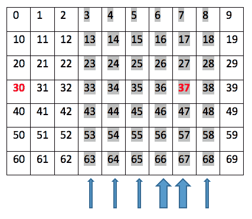
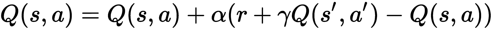
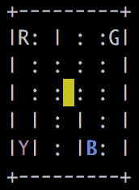
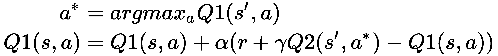

# 时间差分和 Q-learning

在上一章中，我们通过蒙特卡洛方法解决了马尔可夫决策过程（MDP），这是一种无模型方法，不需要环境的先验知识。然而，在 MC 学习中，价值函数和 Q 函数通常在情节结束之前更新。这可能存在问题，因为有些过程非常长，甚至无法正常结束。在本章中，我们将采用**时间差分**（**TD**）方法来解决这个问题。在 TD 方法中，我们在每个时间步更新动作值，显著提高了学习效率。

本章将从设置 Cliff Walking 和 Windy Gridworld 环境的游乐场开始，这些将作为本章 TD 控制方法的主要讨论点。通过我们的逐步指南，读者将获得 Q-learning 用于离策略控制和 SARSA 用于在策略控制的实际经验。我们还将处理一个有趣的项目——出租车问题，并展示如何分别使用 Q-learning 和 SARSA 算法来解决它。最后，我们将额外介绍双 Q-learning 算法。

我们将包括以下的步骤：

+   设置 Cliff Walking 环境的游乐场

+   开发 Q-learning 算法

+   设置 Windy Gridworld 环境的游乐场

+   开发 SARSA 算法

+   用 Q-learning 解决出租车问题

+   用 SARSA 解决出租车问题

+   开发 Double Q-learning 算法

# 设置 Cliff Walking 环境的游乐场

在第一个步骤中，我们将开始熟悉 Cliff Walking 环境，我们将在后续步骤中使用 TD 方法来解决它。

Cliff Walking 是一个典型的 `gym` 环境，具有长时间的不确定结束的情节。这是一个 4 * 12 的网格问题。一个代理在每一步可以向上、向右、向下和向左移动。左下角的方块是代理的起点，右下角是获胜的点，如果到达则会结束一个情节。最后一行剩余的方块是悬崖，代理踩上其中任何一个后会被重置到起始位置，但情节仍继续。每一步代理走的时候会产生一个 -1 的奖励，除非踩到悬崖，那么会产生 -100 的奖励。

# 准备工作

要运行 Cliff Walking 环境，首先在[`github.com/openai/gym/wiki/Table-of-environments`](https://github.com/openai/gym/wiki/Table-of-environments)表格中搜索它的名称。我们得到 `CliffWalking-v0`，并且知道观察空间由整数表示，范围从 0（左上角方块）到 47（右下角目标方块），有四个可能的动作（上 = 0，右 = 1，下 = 2，左 = 3）。

# 怎么做...

让我们通过以下步骤模拟 Cliff Walking 环境：

1.  我们导入 Gym 库，并创建一个 Cliff Walking 环境的实例：

```py
>>> import gym
>>> env = gym.make("CliffWalking-v0")
>>> n_state = env.observation_space.n
>>> print(n_state)
48
>>> n_action = env.action_space.n
>>> print(n_action)
4
```

1.  然后，我们重置环境：

```py
>>> env.reset()
 0
```

代理从状态 36 开始，作为左下角的瓷砖。

1.  然后，我们渲染环境：

```py
>>> env.render()
```

1.  现在，无论是否可行走，让我们进行一个向下的移动：

```py
>>> new_state, reward, is_done, info = env.step(2)
>>> env.render()
 o  o  o  o  o  o  o  o  o  o  o  o
 o  o  o  o  o  o  o  o  o  o  o  o
 o  o  o  o  o  o  o  o  o  o  o  o
 x  C  C  C  C  C  C  C  C  C  C  T
```

代理保持不动。现在，打印出我们刚刚获得的内容：

```py
>>> print(new_state)
36
>>> print(reward)
-1
```

再次，每个移动都会导致 -1 的奖励：

```py
>>> print(is_done)
 False
```

该 episode 还没有完成，因为代理人还没有达到目标：

```py
>>> print(info)
 {'prob': 1.0}
```

这意味着移动是确定性的。

现在，让我们执行一个向上的移动，因为它是可行走的：

```py
>>> new_state, reward, is_done, info = env.step(0)
>>> env.render()
 o  o  o  o  o  o  o  o  o  o  o  o
 o  o  o  o  o  o  o  o  o  o  o  o
 x  o  o  o  o  o  o  o  o  o  o  o
 o  C  C  C  C  C  C  C  C  C  C  T
```

打印出我们刚刚获得的内容：

```py
>>> print(new_state)
 24
```

代理人向上移动：

```py
>>> print(reward)
 -1
```

这导致 -1 的奖励。

1.  现在让我们尝试向右和向下移动：

```py
>>> new_state, reward, is_done, info = env.step(1)
>>> new_state, reward, is_done, info = env.step(2)
>>> env.render()
 o  o  o  o  o  o  o  o  o  o  o  o
 o  o  o  o  o  o  o  o  o  o  o  o
 o  o  o  o  o  o  o  o  o  o  o  o
 x  C  C  C  C  C  C  C  C  C  C  T
```

代理人踩到了悬崖，因此被重置到起点并获得了 -100 的奖励：

```py
>>> print(new_state)
36
>>> print(reward)
-100
>>> print(is_done)
False
```

1.  最后，让我们尝试以最短路径达到目标：

```py
 >>> new_state, reward, is_done, info = env.step(0)
 >>> for _ in range(11):
 ...     env.step(1)
 >>> new_state, reward, is_done, info = env.step(2)
 >>> env.render()
 o  o  o  o  o  o  o  o  o  o  o  o
 o  o  o  o  o  o  o  o  o  o  o  o
 o  o  o  o  o  o  o  o  o  o  o  o
 o  C  C  C  C  C  C  C  C  C  C  x
 >>> print(new_state)
 47
 >>> print(reward)
 -1
 >>> print(is_done)
 True
```

# 工作原理...

在*步骤 1*中，我们导入 Gym 库并创建 Cliff Walking 环境的实例。然后，在*步骤 2*中重置环境。

在*步骤 3*中，我们渲染环境，你会看到一个 4 * 12 的矩阵如下，表示一个网格，其中包括起始瓷砖（x）代表代理人所站的位置，目标瓷砖（T），10 个悬崖瓷砖（C），以及常规瓷砖（o）：


在*步骤 4*、*5*和*6*中，我们进行了各种移动，并看到了这些移动的各种结果和收到的奖励。

如你所想象的，Cliff Walking 的一个场景可能会非常长，甚至是无限的，因为一旦踩到悬崖就会重置游戏。尽早达到目标是更好的，因为每走一步都会导致奖励为 -1 或者 -100。在下一个实例中，我们将通过时间差分方法解决 Cliff Walking 问题。

# 开发 Q-learning 算法

时间差分（TD）学习也是一种无模型学习算法，就像 MC 学习一样。你会记得，在 MC 学习中，Q 函数在整个 episode 结束时更新（无论是首次访问还是每次访问模式）。TD 学习的主要优势在于它在 episode 中的每一步都更新 Q 函数。

在这个示例中，我们将介绍一种名为**Q-learning**的流行时间差分方法。Q-learning 是一种离策略学习算法。它根据以下方程更新 Q 函数：


这里，s' 是采取动作 a 后的结果状态 s；r 是相关的奖励；α 是学习率；γ 是折扣因子。此外，![] 意味着行为策略是贪婪的，选择状态 s' 中最高的 Q 值来生成学习数据。在 Q-learning 中，动作是根据 epsilon-greedy 策略执行的。

# 如何实现...

我们通过 Q-learning 解决 Cliff Walking 环境如下：

1.  导入 PyTorch 和 Gym 库，并创建 Cliff Walking 环境的实例：

```py
>>> import torch
>>> import gym >>> env = gym.make("CliffWalking-v0")
>>> from collections import defaultdict
```

1.  让我们从定义 epsilon-greedy 策略开始：

```py
>>> def gen_epsilon_greedy_policy(n_action, epsilon):
 ...     def policy_function(state, Q):
 ...         probs = torch.ones(n_action) * epsilon / n_action
 ...         best_action = torch.argmax(Q[state]).item()
 ...         probs[best_action] += 1.0 - epsilon
 ...         action = torch.multinomial(probs, 1).item()
 ...         return action
 ...     return policy_function
```

1.  现在定义执行 Q-learning 的函数：

```py
>>> def q_learning(env, gamma, n_episode, alpha):
 ...     """
 ...     Obtain the optimal policy with off-policy Q-learning method
 ...     @param env: OpenAI Gym environment
 ...     @param gamma: discount factor
 ...     @param n_episode: number of episodes
 ...     @return: the optimal Q-function, and the optimal policy
 ...     """
 ...     n_action = env.action_space.n
 ...     Q = defaultdict(lambda: torch.zeros(n_action))
 ...     for episode in range(n_episode):
 ...         state = env.reset()
 ...         is_done = False
 ...         while not is_done:
 ...             action = epsilon_greedy_policy(state, Q)
 ...             next_state, reward, is_done, info = 
                                         env.step(action)
 ...             td_delta = reward + 
                             gamma * torch.max(Q[next_state])
                             - Q[state][action]
 ...             Q[state][action] += alpha * td_delta
 ...             if is_done:
 ...                 break
 ...             state = next_state
 ...     policy = {}
 ...     for state, actions in Q.items():
 ...         policy[state] = torch.argmax(actions).item()
 ...     return Q, policy
```

1.  我们将折扣率设为`1`，学习率设为`0.4`，ε设为`0.1`；然后模拟 500 个回合：

```py
>>> gamma = 1
>>> n_episode = 500
>>> alpha = 0.4
>>> epsilon = 0.1
```

1.  接下来，我们创建ε-贪心策略的一个实例：

```py
>>> epsilon_greedy_policy = gen_epsilon_greedy_policy(env.action_space.n, epsilon)
```

1.  最后，我们使用之前定义的输入参数执行 Q 学习，并打印出最优策略：

```py
>>> optimal_Q, optimal_policy = q_learning(env, gamma, n_episode, alpha) >>> print('The optimal policy:\n', optimal_policy)
 The optimal policy:
 {36: 0, 24: 1, 25: 1, 13: 1, 12: 2, 0: 3, 1: 1, 14: 2, 2: 1, 26: 1, 15: 1, 27: 1, 28: 1, 16: 2, 4: 2, 3: 1, 29: 1, 17: 1, 5: 0, 30: 1, 18: 1, 6: 1, 19: 1, 7: 1, 31: 1, 32: 1, 20: 2, 8: 1, 33: 1, 21: 1, 9: 1, 34: 1, 22: 2, 10: 2, 23: 2, 11: 2, 35: 2, 47: 3}
```

# 工作原理...

在*步骤 2*中，ε-贪心策略接受一个参数ε，其值从 0 到 1，|A|是可能动作的数量。每个动作的概率为ε/|A|，并且以 1-ε+ε/|A|的概率选择具有最高状态-动作值的动作。

在*步骤 3*中，我们在以下任务中执行 Q 学习：

+   我们用全零初始化 Q 表。

+   在每个回合中，我们让代理根据ε-贪心策略选择动作。然后，我们针对每个步骤更新 Q 函数。

+   我们运行`n_episode`个回合。

+   我们基于最优的 Q 函数获得了最优策略。

在*步骤 6*中，再次，up = 0，right = 1，down = 2，left = 3；因此，根据最优策略，代理从状态 36 开始，然后向上移动到状态 24，然后向右一直移动到状态 35，最后向下到达目标：


在 Q 学习中可以看到，它通过学习由另一个策略生成的经验来优化 Q 函数。这与离策略 MC 控制方法非常相似。不同之处在于，它实时更新 Q 函数，而不是在整个回合结束后。这被认为是有利的，特别是对于回合时间较长的环境，延迟学习直到回合结束是低效的。在 Q 学习（或任何其他 TD 方法）的每一个步骤中，我们都会获取更多关于环境的信息，并立即使用此信息来更新值。在我们的案例中，通过仅运行 500 个学习回合，我们获得了最优策略。

# 还有更多...

实际上，在大约 50 个回合后获得了最优策略。我们可以绘制每个回合的长度随时间变化的图表来验证这一点。还可以选择随时间获得的每个回合的总奖励。

1.  我们定义两个列表分别存储每个回合的长度和总奖励：

```py
>>> length_episode = [0] * n_episode
>>> total_reward_episode = [0] * n_episode
```

1.  我们在学习过程中跟踪每个回合的长度和总奖励。以下是更新版本的`q_learning`：

```py
>>> def q_learning(env, gamma, n_episode, alpha):
 ...     n_action = env.action_space.n
 ...     Q = defaultdict(lambda: torch.zeros(n_action))
 ...     for episode in range(n_episode):
 ...         state = env.reset()
 ...         is_done = False
 ...         while not is_done:
 ...             action = epsilon_greedy_policy(state, Q)
 ...             next_state, reward, is_done, info = 
                                        env.step(action)
 ...             td_delta = reward + 
                        gamma * torch.max(Q[next_state])
                        - Q[state][action]
 ...             Q[state][action] += alpha * td_delta
 ...             length_episode[episode] += 1
 ...             total_reward_episode[episode] += reward
 ...             if is_done:
 ...                 break
 ...             state = next_state
 ...      policy = {}
 ...      for state, actions in Q.items():
 ...          policy[state] = torch.argmax(actions).item()
 ...      return Q, policy
```

1.  现在，展示随时间变化的回合长度的图表：

```py
>>> import matplotlib.pyplot as plt
>>> plt.plot(length_episode)
>>> plt.title('Episode length over time')
>>> plt.xlabel('Episode')
>>> plt.ylabel('Length')
>>> plt.show()
```

这将导致以下绘图：


1.  展示随时间变化的回合奖励的图表：

```py
>>> plt.plot(total_reward_episode)
>>> plt.title('Episode reward over time')
>>> plt.xlabel('Episode')
>>> plt.ylabel('Total reward')
>>> plt.show()
```

这将导致以下绘图：


再次，如果减小ε的值，您将看到较小的波动，这是ε-贪心策略中随机探索的效果。

# 设置多风格格子世界环境的游乐场

在上一个示例中，我们解决了一个相对简单的环境，在那里我们可以很容易地获取最优策略。在这个示例中，让我们模拟一个更复杂的网格环境，风格网格世界，在这个环境中，外部力会将代理从某些瓦片移开。这将为我们在下一个示例中使用 TD 方法搜索最优策略做准备。

风格网格世界是一个 7 * 10 的棋盘问题，显示如下：



代理在每一步可以向上、向右、向下和向左移动。第 30 块瓦片是代理的起始点，第 37 块瓦片是获胜点，如果达到则一个 episode 结束。每一步代理走动会产生-1 的奖励。

在这个环境中的复杂性在于，第 4 至 9 列有额外的风力。从这些列的瓦片移动时，代理会额外受到向上的推力。第 7 和第 8 列的风力为 1，第 4、5、6 和 9 列的风力为 2。例如，如果代理试图从状态 43 向右移动，它们将会落在状态 34；如果代理试图从状态 48 向左移动，它们将会落在状态 37；如果代理试图从状态 67 向上移动，它们将会落在状态 37，因为代理会受到额外的 2 单位向上的力；如果代理试图从状态 27 向下移动，它们将会落在状态 17，因为额外的 2 单位向上力抵消了 1 单位向下力。

目前，风格网格世界还没有包含在 Gym 环境中。我们将通过参考 Cliff Walking 环境来实现它：[`github.com/openai/gym/blob/master/gym/envs/toy_text/cliffwalking.py`](https://github.com/openai/gym/blob/master/gym/envs/toy_text/cliffwalking.py)。

# 如何做…

让我们开发风格网格世界环境：

1.  从 Gym 中导入必要的模块，NumPy 和`discrete`类：

```py
>>> import numpy as np
>>> import sys
>>> from gym.envs.toy_text import discrete
```

1.  定义四个动作：

```py
>>> UP = 0
>>> RIGHT = 1
>>> DOWN = 2
>>> LEFT = 3
```

1.  让我们从在 `WindyGridworldEnv` 类中定义 `__init__` 方法开始：

```py
>>> class WindyGridworldEnv(discrete.DiscreteEnv):
 ...     def __init__(self):
 ...         self.shape = (7, 10)
 ...         nS = self.shape[0] * self.shape[1]
 ...         nA = 4
 ...         # Wind locations
 ...         winds = np.zeros(self.shape)
 ...         winds[:,[3,4,5,8]] = 1
 ...         winds[:,[6,7]] = 2
 ...         self.goal = (3, 7)
 ...         # Calculate transition probabilities and rewards
 ...         P = {}
 ...         for s in range(nS):
 ...             position = np.unravel_index(s, self.shape)
 ...             P[s] = {a: [] for a in range(nA)}
 ...             P[s][UP] = self._calculate_transition_prob(
                                       position, [-1, 0], winds)
 ...             P[s][RIGHT] = self._calculate_transition_prob(
                                       position, [0, 1], winds)
 ...             P[s][DOWN] = self._calculate_transition_prob(
                                       position, [1, 0], winds)
 ...             P[s][LEFT] = self._calculate_transition_prob(
                                       position, [0, -1], winds)
 ...         # Calculate initial state distribution
 ...         # We always start in state (3, 0)
 ...         isd = np.zeros(nS)
 ...         isd[np.ravel_multi_index((3,0), self.shape)] = 1.0
 ...         super(WindyGridworldEnv, self).__init__(nS, nA, P, isd)
```

这定义了观察空间、风区域和风力、转移和奖励矩阵，以及初始状态。

1.  接下来，我们定义 `_calculate_transition_prob` 方法来确定动作的结果，包括概率（为 1），新状态，奖励（始终为-1），以及是否完成：

```py
...     def _calculate_transition_prob(self, current, 
                                                delta, winds):
 ...         """
 ...         Determine the outcome for an action. Transition 
                                             Prob is always 1.0.
 ...         @param current: (row, col), current position 
                                                 on the grid
 ...         @param delta: Change in position for transition
 ...         @param winds: Wind effect
 ...         @return: (1.0, new_state, reward, is_done)
 ...         """
 ...         new_position = np.array(current) + np.array(delta) 
                     + np.array([-1, 0]) * winds[tuple(current)]
 ...         new_position = self._limit_coordinates( new_position).astype(int)
 ...         new_state = np.ravel_multi_index( tuple(new_position), self.shape)
 ...         is_done = tuple(new_position) == self.goal
 ...         return [(1.0, new_state, -1.0, is_done)]
```

这计算基于当前状态、移动和风效应的状态，并确保新位置在网格内。最后，它检查代理是否达到目标状态。

1.  接下来，我们定义 `_limit_coordinates` 方法，用于防止代理掉出网格世界：

```py
...     def _limit_coordinates(self, coord):
 ...         coord[0] = min(coord[0], self.shape[0] - 1)
 ...         coord[0] = max(coord[0], 0)
 ...         coord[1] = min(coord[1], self.shape[1] - 1)
 ...         coord[1] = max(coord[1], 0)
 ...         return coord
```

1.  最后，我们添加 `render` 方法以显示代理和网格环境：

```py
...     def render(self):
 ...         outfile = sys.stdout
 ...         for s in range(self.nS):
 ...             position = np.unravel_index(s, self.shape)
 ...             if self.s == s:
 ...                 output = " x "
 ...             elif position == self.goal:
 ...                 output = " T "
 ...             else:
 ...                 output = " o "
 ...             if position[1] == 0:
 ...                 output = output.lstrip()
 ...             if position[1] == self.shape[1] - 1:
 ...                 output = output.rstrip()
 ...                 output += "\n"
 ...             outfile.write(output)
 ...         outfile.write("\n")
```

`X` 表示代理当前的位置，`T` 是目标瓦片，其余瓦片表示为 `o`。

现在，让我们按以下步骤模拟风格网格世界环境：

1.  创建一个风格网格世界环境的实例：

```py
>>> env = WindyGridworldEnv()
```

1.  重置并渲染环境：

```py
>>> env.reset()
 >>> env.render()
 o  o  o  o  o  o  o  o  o  o
 o  o  o  o  o  o  o  o  o  o
 o  o  o  o  o  o  o  o  o  o
 x  o  o  o  o  o  o  T  o  o
 o  o  o  o  o  o  o  o  o  o
 o  o  o  o  o  o  o  o  o  o
 o  o  o  o  o  o  o  o  o  o
```

代理器从状态 30 开始。

1.  向右移动一步：

```py
>>> print(env.step(1))
 >>> env.render()
 (31, -1.0, False, {'prob': 1.0})
 o  o  o  o  o  o  o  o  o  o
 o  o  o  o  o  o  o  o  o  o
 o  o  o  o  o  o  o  o  o  o
 o  x  o  o  o  o  o  T  o  o
 o  o  o  o  o  o  o  o  o  o
 o  o  o  o  o  o  o  o  o  o
 o  o  o  o  o  o  o  o  o  o
```

代理器降落在状态 31，奖励为 -1。

1.  右移两步：

```py
>>> print(env.step(1))
>>> print(env.step(1))
>>> env.render()
 (32, -1.0, False, {'prob': 1.0})
 (33, -1.0, False, {'prob': 1.0})
 o  o  o  o  o  o  o  o  o  o
 o  o  o  o  o  o  o  o  o  o
 o  o  o  o  o  o  o  o  o  o
 o  o  o  x  o  o  o  T  o  o
 o  o  o  o  o  o  o  o  o  o
 o  o  o  o  o  o  o  o  o  o
 o  o  o  o  o  o  o  o  o  o
```

1.  现在，再向右移动一步：

```py
>>> print(env.step(1))
 >>> env.render()
 (24, -1.0, False, {'prob': 1.0})
 o  o  o  o  o  o  o  o  o  o
 o  o  o  o  o  o  o  o  o  o
 o  o  o  o  x  o  o  o  o  o
 o  o  o  o  o  o  o  T  o  o
 o  o  o  o  o  o  o  o  o  o
 o  o  o  o  o  o  o  o  o  o
 o  o  o  o  o  o  o  o  o  o
```

风向上 1 单位，代理器降落在状态 24。

随意尝试环境，直到达到目标。

# 工作原理……

我们刚刚开发了一个类似于 Cliff Walking 的网格环境。Windy Gridworld 和 Cliff Walking 的区别在于额外的向上推力。每个动作在 Windy Gridworld 剧集中将导致奖励 -1。因此，尽快达到目标更为有效。在下一个步骤中，我们将使用另一种 TD 控制方法解决 Windy Gridworld 问题。

# 开发 SARSA 算法

你会记得 Q-learning 是一种离策略 TD 学习算法。在本配方中，我们将使用一种在线策略 TD 学习算法解决 MDP，称为 **状态-行动-奖励-状态-行动**（**SARSA**）。

类似于 Q-learning，SARSA 关注状态-动作值。它根据以下方程更新 Q 函数：



在这里，`s'` 是在状态 s 中采取动作 a 后的结果状态；r 是相关的奖励；α 是学习率；γ 是折扣因子。你会记得，在 Q-learning 中，一种行为贪婪策略 ![] 用于更新 Q 值。在 SARSA 中，我们简单地通过遵循 epsilon-greedy 策略来选择下一个动作 `a'` 来更新 Q 值。然后动作 `a'` 在下一步中被执行。因此，SARSA 是一个在线策略算法。

# 如何实现……

我们执行 SARSA 解决 Windy Gridworld 环境，步骤如下：

1.  导入 PyTorch 和 `WindyGridworldEnvmodule`（假设它在名为 `windy_gridworld.py` 的文件中），并创建 Windy Gridworld 环境的实例：

```py
>>> import torch
>>> from windy_gridworld import WindyGridworldEnv >>> env = WindyGridworldEnv()
```

1.  让我们从定义 epsilon-greedy 行为策略开始：

```py
>>> def gen_epsilon_greedy_policy(n_action, epsilon):
 ...     def policy_function(state, Q):
 ...         probs = torch.ones(n_action) * epsilon / n_action
 ...         best_action = torch.argmax(Q[state]).item()
 ...         probs[best_action] += 1.0 - epsilon
 ...         action = torch.multinomial(probs, 1).item()
 ...         return action
 ...     return policy_function
```

1.  我们指定了要运行的剧集数，并初始化了用于跟踪每一剧集的长度和总奖励的两个变量：

```py
>>> n_episode = 500
>>> length_episode = [0] * n_episode
>>> total_reward_episode = [0] * n_episode
```

1.  现在，我们定义执行 SARSA 的函数：

```py
>>> from collections import defaultdict
>>> def sarsa(env, gamma, n_episode, alpha):
 ...     """
 ...     Obtain the optimal policy with on-policy SARSA algorithm
 ...     @param env: OpenAI Gym environment
 ...     @param gamma: discount factor
 ...     @param n_episode: number of episodes
 ...     @return: the optimal Q-function, and the optimal policy
 ...     """
 ...     n_action = env.action_space.n
 ...     Q = defaultdict(lambda: torch.zeros(n_action))
 ...     for episode in range(n_episode):
 ...         state = env.reset()
 ...         is_done = False
 ...         action = epsilon_greedy_policy(state, Q)
 ...         while not is_done:
 ...             next_state, reward, is_done, info 
                                            = env.step(action)
 ...             next_action = epsilon_greedy_policy(next_state, Q)
 ...             td_delta = reward + 
                          gamma * Q[next_state][next_action]
                          - Q[state][action]
 ...             Q[state][action] += alpha * td_delta
 ...             length_episode[episode] += 1
 ...             total_reward_episode[episode] += reward
 ...             if is_done:
 ...                 break
 ...             state = next_state
 ...             action = next_action
 ...     policy = {}
 ...     for state, actions in Q.items():
 ...         policy[state] = torch.argmax(actions).item()
 ...     return Q, policy
```

1.  我们将折扣率指定为 1，学习率为 0.4，epsilon 为 0.1：

```py
>>> gamma = 1
>>> alpha = 0.4
>>> epsilon = 0.1
```

1.  接下来，我们创建 epsilon-greedy 策略的实例：

```py
>>> epsilon_greedy_policy = gen_epsilon_greedy_policy(env.action_space.n, epsilon)
```

1.  最后，我们使用之前步骤中定义的输入参数执行 SARSA，并打印出最优策略：

```py
>>> optimal_Q, optimal_policy = sarsa(env, gamma, n_episode, alpha) >>> print('The optimal policy:\n', optimal_policy)
 The optimal policy:
 {30: 2, 31: 1, 32: 1, 40: 1, 50: 2, 60: 1, 61: 1, 51: 1, 41: 1, 42: 1, 20: 1, 21: 1, 62: 1, 63: 2, 52: 1, 53: 1, 43: 1, 22: 1, 11: 1, 10: 1, 0: 1, 33: 1, 23: 1, 12: 1, 13: 1, 2: 1, 1: 1, 3: 1, 24: 1, 4: 1, 5: 1, 6: 1, 14: 1, 7: 1, 8: 1, 9: 2, 19: 2, 18: 2, 29: 2, 28: 1, 17: 2, 39: 2, 38: 1, 27: 0, 49: 3, 48: 3, 37: 3, 34: 1, 59: 2, 58: 3, 47: 2, 26: 1, 44: 1, 15: 1, 69: 3, 68: 1, 57: 2, 36: 1, 25: 1, 54: 2, 16: 1, 35: 1, 45: 1}
```

# 工作原理……

在 *步骤 4* 中，SARSA 函数执行以下任务：

+   它使用全零初始化 Q 表。

+   在每一剧集中，它让代理器遵循 epsilon-greedy 策略来选择采取的行动。对于每一步，它根据方程 ![] 更新 Q 函数，其中 `a'` 是根据 epsilon-greedy 策略选择的。然后，在新状态 `s'` 中采取新的动作 `a'`。

+   我们运行 `n_episode` 个剧集。

+   我们基于最优 Q 函数获取最优策略。

正如在 SARSA 方法中所见，它通过采取在相同策略下选择的动作来优化 Q 函数，即 epsilon 贪婪策略。这与 on-policy MC 控制方法非常相似。不同之处在于，它通过个别步骤中的小导数来更新 Q 函数，而不是在整个集结束后。在集合长度较长的环境中，此方法被认为是优势，因为将学习延迟到集的结束是低效的。在 SARSA 的每一个单步中，我们获得更多关于环境的信息，并利用这些信息立即更新值。在我们的案例中，仅通过运行 500 个学习集，我们获得了最优策略。

# 还有更多...

实际上，在大约 200 集后获得了最优策略。我们可以绘制每一集的长度和总奖励随时间变化的图表来验证这一点：

1.  显示随时间变化的剧集长度图：

```py
>>> import matplotlib.pyplot as plt
>>> plt.plot(length_episode)
>>> plt.title('Episode length over time')
>>> plt.xlabel('Episode')
>>> plt.ylabel('Length')
>>> plt.show()
```

这将导致以下图表：


您可以看到，剧集长度在 200 集后开始饱和。请注意，这些小波动是由 epsilon 贪婪策略中的随机探索造成的。

1.  显示随时间变化的剧集奖励图：

```py
>>> plt.plot(total_reward_episode)
>>> plt.title('Episode reward over time')
>>> plt.xlabel('Episode')
>>> plt.ylabel('Total reward')
>>> plt.show()
```

这将导致以下图表：


如果你减小 epsilon 的值，你将看到更小的波动，这是在 epsilon 贪婪策略中随机探索的影响。

在接下来的两个示例中，我们将使用我们刚学到的两种 TD 方法来解决一个更复杂的环境，该环境具有更多的可能状态和动作。让我们从 Q 学习开始。

# 使用 Q 学习解决出租车问题

出租车问题 ([`gym.openai.com/envs/Taxi-v2/`](https://gym.openai.com/envs/Taxi-v2/)) 是另一个流行的网格世界问题。在一个 5 * 5 的网格中，代理作为出租车司机，在一个位置接载乘客，然后将乘客送达目的地。看下面的例子：



彩色方块有以下含义：

+   **黄色**：出租车的起始位置。起始位置在每一集中是随机的。

+   **蓝色**：乘客的位置。在每一集中也是随机选择的。

+   **紫色**：乘客的目的地。同样，在每一集中随机选择。

+   **绿色**：带有乘客的出租车位置。

R、Y、B 和 G 这四个字母指示唯一允许接载和送达乘客的方块。其中一个是目的地，一个是乘客的位置。

出租车可以采取以下六个确定性动作：

+   **0**：向南移动

+   **1**：向北移动

+   **2**：向东移动

+   **3**：向西移动

+   **4**：接载乘客

+   **5**：送达乘客

两个方块之间有一根柱子 |，防止出租车从一个方块移动到另一个方块。

每一步的奖励通常是 -1，以下是例外情况：

+   **+20**：乘客被送达目的地。一个回合将结束。

+   **-10**：尝试非法接乘或下车（不在 R、Y、B 或 G 中）。

还有一件需要注意的事情是，观察空间远远大于 25（5*5），因为我们还应考虑乘客和目的地的位置，以及出租车是否为空或已满。因此，观察空间应为 25 * 5（乘客或已在出租车的 4 个可能位置） * 4（目的地）= 500 维度。

# 准备就绪

要运行出租车环境，让我们首先在环境表中搜索其名称，[`github.com/openai/gym/wiki/Table-of-environments`](https://github.com/openai/gym/wiki/Table-of-environments)。我们得到 Taxi-v2，并且知道观察空间由一个从 0 到 499 的整数表示，并且有四种可能的动作（向上 = 0，向右 = 1，向下 = 2，向左 = 3）。

# 如何做到…

让我们从以下步骤开始模拟出租车环境：

1.  我们导入 Gym 库并创建出租车环境的实例：

```py
>>> import gym
>>> env = gym.make('Taxi-v2')
>>> n_state = env.observation_space.n
>>> print(n_state)
 500
>>> n_action = env.action_space.n
>>> print(n_action)
 6
```

1.  然后，我们重置环境：

```py
>>> env.reset()
 262
```

1.  然后，我们渲染环境：

```py
>>> env.render()
```

您将看到一个类似的 5 * 5 矩阵如下：


乘客位于 R 位置，目的地位于 Y。由于初始状态是随机生成的，您将看到不同的结果。

1.  现在让我们向西移动三个瓷砖，向北移动两个瓷砖去接乘客（您可以根据初始状态进行调整），然后执行接乘客。接着，我们再次渲染环境：

```py
>>> print(env.step(3))
 (242, -1, False, {'prob': 1.0})
>>> print(env.step(3))
 (222, -1, False, {'prob': 1.0})
>>> print(env.step(3))
 (202, -1, False, {'prob': 1.0})
>>> print(env.step(1))
 (102, -1, False, {'prob': 1.0})
>>> print(env.step(1))
 (2, -1, False, {'prob': 1.0})
>>> print(env.step(4))
 (18, -1, False, {'prob': 1.0})
 Render the environment:
>>> env.render()
```

1.  您将看到更新的最新矩阵（根据您的初始状态可能会得到不同的输出）：


出租车变成了绿色。

1.  现在，我们向南移动四个瓷砖去到达目的地（您可以根据初始状态进行调整），然后执行下车：

```py
>>> print(env.step(0))
 (118, -1, False, {'prob': 1.0})
>>> print(env.step(0))
 (218, -1, False, {'prob': 1.0})
>>> print(env.step(0))
 (318, -1, False, {'prob': 1.0})
>>> print(env.step(0))
 (418, -1, False, {'prob': 1.0})
>>> print(env.step(5))
 (410, 20, True, {'prob': 1.0})
```

最后它获得 +20 的奖励，并且回合结束。

现在，我们渲染环境：

```py
>>> env.render()
```

您将看到以下更新的矩阵：


现在我们将执行 Q 学习来解决出租车环境，如下所示：

1.  导入 PyTorch 库：

```py
>>> import torch
```

1.  然后，开始定义 epsilon-greedy 策略。我们将重用“开发 Q 学习算法”食谱中定义的 `gen_epsilon_greedy_policy` 函数。

1.  现在，我们指定回合的数量，并初始化用于跟踪每个回合长度和总奖励的两个变量：

```py
>>> n_episode = 1000
>>> length_episode = [0] * n_episode
>>> total_reward_episode = [0] * n_episode
```

1.  接下来，我们定义执行 Q 学习的函数。我们将重用“开发 Q 学习算法”食谱中定义的 `q_learning` 函数。

1.  现在，我们指定其余的参数，包括折扣率、学习率和 epsilon，并创建一个 epsilon-greedy 策略的实例：

```py
>>> gamma = 1
>>> alpha = 0.4
>>> epsilon = 0.1 >>> epsilon_greedy_policy = gen_epsilon_greedy_policy(env.action_space.n, epsilon)
```

1.  最后，我们进行 Q 学习来获得出租车问题的最优策略：

```py
>>> optimal_Q, optimal_policy = q_learning(env, gamma, n_episode, alpha)
```

# 工作原理…

在这个食谱中，我们通过离线 Q 学习解决了出租车问题。

在*步骤 6*之后，您可以绘制每个周期的长度和总奖励，以验证模型是否收敛。时间序列的奖励图如下所示：


时间序列的奖励图如下所示：


您可以看到，优化在 400 个周期后开始饱和。

出租车环境是一个相对复杂的网格问题，有 500 个离散状态和 6 种可能的动作。Q-learning 通过学习贪婪策略生成的经验来优化每个步骤中的 Q 函数。我们在学习过程中获取环境信息，并使用这些信息按照ε-贪婪策略立即更新值。

# 使用 SARSA 解决出租车问题

在这个示例中，我们将使用 SARSA 算法解决出租车环境，并使用网格搜索算法微调超参数。

我们将从 SARSA 模型的默认超参数值开始。这些值是基于直觉和一些试验选择的。接下来，我们将提出最佳值的一组值。

# 如何做...

我们按照以下方式执行 SARSA 来解决出租车环境：

1.  导入 PyTorch 和`gym`模块，并创建出租车环境的一个实例：

```py
>>> import torch
>>> import gym >>> env = gym.make('Taxi-v2')
```

1.  然后，开始定义 ε-贪婪行为策略。我们将重用*开发 SARSA 算法*配方中定义的`gen_epsilon_greedy_policy`函数。

1.  然后，我们指定要追踪每个周期的长度和总奖励的两个变量的数量：

```py
>>> n_episode = 1000 >>> length_episode = [0] * n_episode
>>> total_reward_episode = [0] * n_episode
```

1.  现在，我们定义执行 SARSA 的函数。我们将重用*开发 SARSA 算法*配方中定义的`sarsa`函数。

1.  我们将折现率设定为`1`，默认学习率设定为`0.4`，默认 ε 设定为`0.1`：

```py
>>> gamma = 1
>>> alpha = 0.4
>>> epsilon = 0.01
```

1.  接下来，我们创建 ε-贪婪策略的一个实例：

```py
>>> epsilon_greedy_policy = gen_epsilon_greedy_policy(env.action_space.n, epsilon)
```

1.  最后，我们使用前面步骤中定义的输入参数执行 SARSA：

```py
>>> optimal_Q, optimal_policy = sarsa(env, gamma, n_episode, alpha)
```

# 工作原理...

在*步骤 7*之后，您可以绘制每个周期的长度和总奖励，以验证模型是否收敛。时间序列的奖励图如下所示：


时间序列的奖励图如下所示：


这个 SARSA 模型工作得很好，但不一定是最好的。稍后，我们将使用网格搜索来寻找 SARSA 模型下最佳的一组超参数。

出租车环境是一个相对复杂的网格问题，有 500 个离散状态和 6 种可能的动作。SARSA 算法通过学习和优化目标策略来优化每个步骤中的 Q 函数。我们在学习过程中获取环境信息，并使用这些信息按照ε-贪婪策略立即更新值。

# 还有更多...

网格搜索是一种程序化的方法，用于在强化学习中找到超参数的最佳值集合。每组超参数的性能由以下三个指标来衡量：

+   前几个 episode 的平均总奖励：我们希望尽早获得最大的奖励。

+   前几个 episode 的平均 episode 长度：我们希望出租车尽快到达目的地。

+   每个时间步的前几个 episode 的平均奖励：我们希望尽快获得最大的奖励。

让我们继续实施它：

1.  我们在这里使用了三个 alpha 候选值[0.4, 0.5 和 0.6]和三个 epsilon 候选值[0.1, 0.03 和 0.01]，并且仅考虑了前 500 个 episode：

```py
>>> alpha_options = [0.4, 0.5, 0.6]
>>> epsilon_options = [0.1, 0.03, 0.01]
>>> n_episode = 500
```

1.  我们通过训练每组超参数的 SARSA 模型并评估相应的性能来进行网格搜索：

```py
>>> for alpha in alpha_options:
 ...     for epsilon in epsilon_options:
 ...         length_episode = [0] * n_episode
 ...         total_reward_episode = [0] * n_episode
 ...         sarsa(env, gamma, n_episode, alpha)
 ...         reward_per_step = [reward/float(step) for 
                               reward, step in zip(
                            total_reward_episode, length_episode)]
 ...         print('alpha: {}, epsilon: {}'.format(alpha, epsilon))
 ...         print('Average reward over {} episodes: {}'.format( n_episode, sum(total_reward_episode) / n_episode))
 ...         print('Average length over {} episodes: {}'.format( n_episode, sum(length_episode) / n_episode))
 ...         print('Average reward per step over {} episodes: 
        {}\n'.format(n_episode, sum(reward_per_step) / n_episode))
```

运行上述代码会生成以下结果：

```py
alpha: 0.4, epsilon: 0.1
 Average reward over 500 episodes: -75.442
 Average length over 500 episodes: 57.682
 Average reward per step over 500 episodes: -0.32510755063660324
 alpha: 0.4, epsilon: 0.03
 Average reward over 500 episodes: -73.378
 Average length over 500 episodes: 56.53
 Average reward per step over 500 episodes: -0.2761201410280632
 alpha: 0.4, epsilon: 0.01
 Average reward over 500 episodes: -78.722
 Average length over 500 episodes: 59.366
 Average reward per step over 500 episodes: -0.3561815084186654
 alpha: 0.5, epsilon: 0.1
 Average reward over 500 episodes: -72.026
 Average length over 500 episodes: 55.592
 Average reward per step over 500 episodes: -0.25355404831497264
 alpha: 0.5, epsilon: 0.03
 Average reward over 500 episodes: -67.562
 Average length over 500 episodes: 52.706
 Average reward per step over 500 episodes: -0.20602525679639022
 alpha: 0.5, epsilon: 0.01
 Average reward over 500 episodes: -75.252
 Average length over 500 episodes: 56.73
 Average reward per step over 500 episodes: -0.2588407558703358
 alpha: 0.6, epsilon: 0.1
 Average reward over 500 episodes: -62.568
 Average length over 500 episodes: 49.488
 Average reward per step over 500 episodes: -0.1700284221229244
 alpha: 0.6, epsilon: 0.03
 Average reward over 500 episodes: -68.56
 Average length over 500 episodes: 52.804
 Average reward per step over 500 episodes: -0.24794191768600077
 alpha: 0.6, epsilon: 0.01
 Average reward over 500 episodes: -63.468
 Average length over 500 episodes: 49.752
 Average reward per step over 500 episodes: -0.14350124172091722
```

我们可以看到，在这种情况下，最佳的超参数集合是 alpha: 0.6，epsilon: 0.01，它实现了每步最大的奖励和较大的平均奖励以及较短的平均 episode 长度。

# 开发双 Q-learning 算法

在这是一个额外的步骤，在本章中我们将开发双 Q-learning 算法。

Q-learning 是一种强大且流行的 TD 控制强化学习算法。然而，在某些情况下可能表现不佳，主要是因为贪婪组件*maxa'Q(s', a')*。它可能会高估动作值并导致性能不佳。双 Q-learning 通过利用两个 Q 函数来克服这一问题。我们将两个 Q 函数表示为*Q1*和*Q2*。在每一步中，随机选择一个 Q 函数进行更新。如果选择*Q1*，则更新如下：



如果选择 Q2，则更新如下：


这意味着每个 Q 函数都从另一个 Q 函数更新，遵循贪婪搜索，这通过使用单个 Q 函数减少了动作值的高估。

# 如何做...

现在我们开发双 Q-learning 来解决出租车环境，如下所示：

1.  导入所需的库并创建 Taxi 环境的实例：

```py
>>> import torch >>> import gym
>>> env = gym.make('Taxi-v2')
```

1.  然后，开始定义 epsilon-greedy 策略。我们将重用在*开发 Q-learning 算法*步骤中定义的`gen_epsilon_greedy_policy`函数。

1.  然后，我们指定了 episode 的数量，并初始化了两个变量来跟踪每个 episode 的长度和总奖励：

```py
>>> n_episode = 3000
>>> length_episode = [0] * n_episode
>>> total_reward_episode = [0] * n_episode
```

在这里，我们模拟了 3,000 个 episode，因为双 Q-learning 需要更多的 episode 才能收敛。

1.  接下来，我们定义执行双 Q-learning 的函数：

```py
>>> def double_q_learning(env, gamma, n_episode, alpha):
 ...     """
 ...     Obtain the optimal policy with off-policy double 
         Q-learning method
 ...     @param env: OpenAI Gym environment
 ...     @param gamma: discount factor
 ...     @param n_episode: number of episodes
 ...     @return: the optimal Q-function, and the optimal policy
 ...     """
 ...     n_action = env.action_space.n
 ...     n_state = env.observation_space.n
 ...     Q1 = torch.zeros(n_state, n_action)
 ...     Q2 = torch.zeros(n_state, n_action)
 ...     for episode in range(n_episode):
 ...         state = env.reset()
 ...         is_done = False
 ...         while not is_done:
 ...             action = epsilon_greedy_policy(state, Q1 + Q2)
 ...             next_state, reward, is_done, info 
                                     = env.step(action)
 ...             if (torch.rand(1).item() < 0.5):
 ...                 best_next_action = torch.argmax(Q1[next_state])
 ...                 td_delta = reward + 
                           gamma * Q2[next_state][best_next_action]
                           - Q1[state][action]
 ...                 Q1[state][action] += alpha * td_delta
 ...             else:
 ...                 best_next_action = torch.argmax(Q2[next_state])
 ...                 td_delta = reward + 
                           gamma * Q1[next_state][best_next_action]
                           - Q2[state][action]
 ...                 Q2[state][action] += alpha * td_delta
 ...             length_episode[episode] += 1
 ...             total_reward_episode[episode] += reward
 ...             if is_done:
 ...                 break
 ...             state = next_state
 ...     policy = {}
 ...     Q = Q1 + Q2
 ...     for state in range(n_state):
 ...         policy[state] = torch.argmax(Q[state]).item()
 ...     return Q, policy
```

1.  然后，我们指定了剩余的参数，包括折扣率、学习率和 epsilon，并创建了 epsilon-greedy-policy 的实例：

```py
>>> gamma = 1
>>> alpha = 0.4
>>> epsilon = 0.1 >>> epsilon_greedy_policy = gen_epsilon_greedy_policy(env.action_space.n, epsilon)
```

1.  最后，我们执行双 Q-learning 以获得出租车问题的最优策略：

```py
>>> optimal_Q, optimal_policy = double_q_learning(env, gamma, n_episode, alpha)
```

# 工作原理...

我们在本示例中使用双 Q 学习算法解决了出租车问题。

在*第 4 步*中，我们执行双 Q 学习，完成以下任务：

+   将两个 Q 表初始化为全零。

+   在每个周期的每个步骤中，我们随机选择一个 Q 函数来更新。让代理根据 epsilon-greedy 策略选择动作并使用另一个 Q 函数更新所选的 Q 函数。

+   运行`n_episode`个周期。

+   基于最优 Q 函数获得最优策略，通过求和（或平均）两个 Q 函数来实现。

在*第 6 步*之后，您可以绘制每个周期的长度和总奖励，以验证模型是否收敛。周期长度随时间的变化图如下所示：


奖励随时间变化的图表如下所示：


双 Q 学习克服了单 Q 学习在复杂环境中的潜在缺点。它随机地在两个 Q 函数之间切换并更新它们，这可以防止一个 Q 函数的动作值被高估。同时，它可能会低估 Q 函数，因为它不会在时间步长内更新相同的 Q 函数。因此，我们可以看到最优动作值需要更多的周期来收敛。

# 另请参阅

了解双 Q 学习背后的理论，请参阅 Hado van Hasselt 的原始论文，[`papers.nips.cc/paper/3964-double-q-learning`](https://papers.nips.cc/paper/3964-double-q-learning)，发表于*神经信息处理系统进展 23*（NIPS 2010），2613-2621，2010 年。
