# 解决多臂老虎机问题

多臂老虎机算法可能是强化学习中最流行的算法之一。本章将从创建多臂老虎机开始，并尝试使用随机策略。我们将专注于如何使用ε-贪心、softmax 探索、上置信区间和汤普森抽样等四种策略解决多臂老虎机问题。我们将看到它们如何以独特的方式处理探索与利用的困境。我们还将解决一个价值十亿美元的问题，即在线广告，演示如何使用多臂老虎机算法解决它。最后，我们将使用上下文老虎机解决上下文广告问题，以在广告优化中做出更明智的决策。

本章将涵盖以下配方：

+   创建多臂老虎机环境

+   使用ε-贪心策略解决多臂老虎机问题

+   使用 softmax 探索解决多臂老虎机问题

+   使用上置信区间算法解决多臂老虎机问题

+   使用多臂老虎机解决互联网广告问题

+   使用汤普森抽样算法解决多臂老虎机问题

+   使用上下文老虎机解决互联网广告问题

# 创建多臂老虎机环境

让我们开始一个简单的项目，使用蒙特卡洛方法来估计π的值，这是无模型强化学习算法的核心。

**多臂老虎机**问题是最简单的强化学习问题之一。它最好被描述为一个有多个杠杆（臂）的老虎机，每个杠杆有不同的支付和支付概率。我们的目标是发现具有最大回报的最佳杠杆，以便在之后继续选择它。让我们从一个简单的多臂老虎机问题开始，其中每个臂的支付和支付概率是固定的。在创建环境后，我们将使用随机策略算法来解决它。

# 如何做…

让我们按照以下步骤开发多臂老虎机环境：

```py
>>> import torch
>>> class BanditEnv():
...     """
...     Multi-armed bandit environment
...     payout_list:
...         A list of probabilities of the likelihood that a 
 particular bandit will pay out
...     reward_list:
...         A list of rewards of the payout that bandit has
...     """
...     def __init__(self, payout_list, reward_list):
...         self.payout_list = payout_list
...         self.reward_list = reward_list
...
...     def step(self, action):
...         if torch.rand(1).item() < self.payout_list[action]:
...             return self.reward_list[action]
...         return 0
```

步骤方法执行一个动作，并在支付时返回奖励，否则返回 0。

现在，我们将以多臂老虎机为例，并使用随机策略解决它：

1.  定义三臂老虎机的支付概率和奖励，并创建老虎机环境的实例：

```py
>>> bandit_payout = [0.1, 0.15, 0.3]
>>> bandit_reward = [4, 3, 1]>>> bandit_env = BanditEnv(bandit_payout, bandit_reward)
```

例如，选择臂 0 获得奖励 4 的概率为 10%。

1.  我们指定要运行的集数，并定义保存通过选择各个臂累积的总奖励、选择各个臂的次数以及各个臂随时间的平均奖励的列表：

```py
>>> n_episode = 100000
>>> n_action = len(bandit_payout)
>>> action_count = [0 for _ in range(n_action)]
>>> action_total_reward = [0 for _ in range(n_action)]
>>> action_avg_reward = [[] for action in range(n_action)]
```

1.  定义随机策略，随机选择一个臂：

```py
>>> def random_policy():
...     action = torch.multinomial(torch.ones(n_action), 1).item()
...     return action
```

1.  现在，我们运行 100,000 个集数。对于每个集数，我们还更新每个臂的统计数据：

```py
>>> for episode in range(n_episode):
...     action = random_policy()
...     reward = bandit_env.step(action)
...     action_count[action] += 1
...     action_total_reward[action] += reward
...     for a in range(n_action):
...         if action_count[a]:
...             action_avg_reward[a].append(
                     action_total_reward[a] / action_count[a])
...         else:
...             action_avg_reward[a].append(0)
```

1.  运行了 100,000 个集数后，我们绘制了随时间变化的平均奖励的结果：

```py
>>> import matplotlib.pyplot as plt
 >>> for action in range(n_action):
 ...     plt.plot(action_avg_reward[action])
 >>> plt.legend([‘Arm {}’.format(action) for action in range(n_action)])
 >>> plt.title(‘Average reward over time’)
 >>> plt.xscale(‘log’)
 >>> plt.xlabel(‘Episode’)
 >>> plt.ylabel(‘Average reward’)
 >>> plt.show()
```

# 它是如何工作的…

在我们刚刚处理的示例中，有三台老虎机。每台机器都有不同的支付（奖励）和支付概率。在每个 episode 中，我们随机选择一台机器的一个臂来拉（执行一个动作），并以一定的概率获得支付。

执行*Step 5*中的代码行，你将看到以下图表：

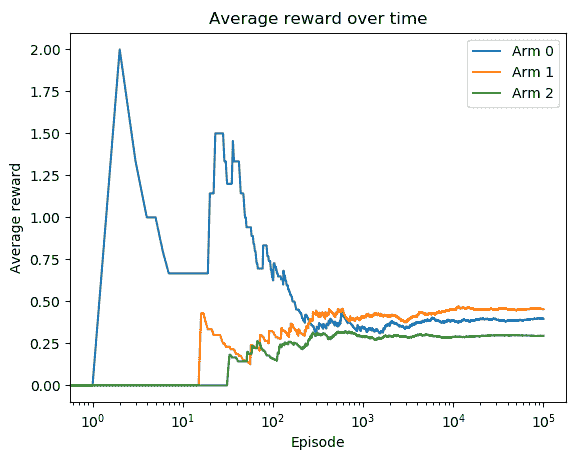

臂 1 是平均奖励最高的最佳臂。此外，平均奖励在大约 10,000 个 episode 后开始饱和。

此解决方案看起来非常幼稚，因为我们仅对所有臂进行了探索。在接下来的配方中，我们将提出更智能的策略。

# 使用ε-贪婪策略解决多臂老虎机问题

不再仅仅通过随机策略进行探索，我们可以通过探索与利用的结合做得更好。这就是著名的ε-贪婪策略。

对于多臂老虎机的ε-贪婪策略，大部分时间利用最佳动作，同时不时探索不同的动作。给定参数ε，其取值范围为 0 到 1，执行探索和利用的概率分别为ε和 1 - ε：

+   **ε**：每个动作的概率如下计算：

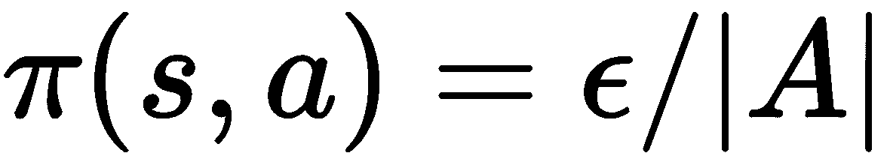

这里，|A|是可能动作的数量。

+   **贪婪**：优选具有最高状态-动作值的动作，并且其被选择的概率增加 1 - ε：

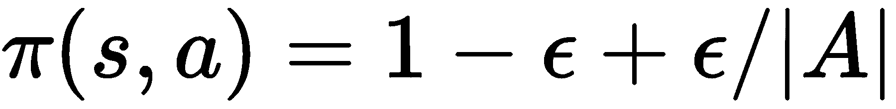

# 如何操作...

我们使用ε-贪婪策略解决多臂老虎机问题如下：

1.  导入 PyTorch 和我们在之前的配方中开发的老虎机环境，*创建多臂老虎机环境*（假设`BanditEnv`类在名为`multi_armed_bandit.py`的文件中）：

```py
>>> import torch
 >>> from multi_armed_bandit import BanditEnv
```

1.  定义三臂老虎机的支付概率和奖励，并创建一个老虎机环境的实例：

```py
>>> bandit_payout = [0.1, 0.15, 0.3]
 >>> bandit_reward = [4, 3, 1] >>> bandit_env = BanditEnv(bandit_payout, bandit_reward)
```

1.  指定要运行的 episode 数，并定义持有通过选择各个臂累积的总奖励、选择各个臂的次数以及每个臂随时间变化的平均奖励的列表：

```py
>>> n_episode = 100000
 >>> n_action = len(bandit_payout)
 >>> action_count = [0 for _ in range(n_action)]
 >>> action_total_reward = [0 for _ in range(n_action)]
 >>> action_avg_reward = [[] for action in range(n_action)]
```

1.  定义ε-贪婪策略函数，指定ε的值，并创建一个ε-贪婪策略实例：

```py
>>> def gen_epsilon_greedy_policy(n_action, epsilon):
 ...     def policy_function(Q):
 ...         probs = torch.ones(n_action) * epsilon / n_action
 ...         best_action = torch.argmax(Q).item()
 ...         probs[best_action] += 1.0 - epsilon
 ...         action = torch.multinomial(probs, 1).item()
 ...         return action
 ...     return policy_function >>> epsilon = 0.2
 >>> epsilon_greedy_policy = gen_epsilon_greedy_policy(n_action, epsilon)
```

1.  初始化`Q`函数，即各个臂获得的平均奖励：

```py
>>> Q = torch.zeros(n_action)
```

我们将随时间更新`Q`函数。

1.  现在，我们运行 100,000 个 episode。每个 episode，我们还会随时间更新每个臂的统计信息：

```py
>>> for episode in range(n_episode):
 ...     action = epsilon_greedy_policy(Q)
 ...     reward = bandit_env.step(action)
 ...     action_count[action] += 1
 ...     action_total_reward[action] += reward
 ...     Q[action] = action_total_reward[action] / action_count[action]
 ...     for a in range(n_action):
 ...         if action_count[a]:
 ...             action_avg_reward[a].append(
                         action_total_reward[a] / action_count[a])
 ...         else:
 ...             action_avg_reward[a].append(0)
```

1.  运行 100,000 个 episode 后，我们绘制了随时间变化的平均奖励结果：

```py
>>> import matplotlib.pyplot as plt
 >>> for action in range(n_action):
 ...     plt.plot(action_avg_reward[action])
 >>> plt.legend([‘Arm {}’.format(action) for action in range(n_action)])
 >>> plt.title(‘Average reward over time’)
 >>> plt.xscale(‘log’)
 >>> plt.xlabel(‘Episode’)
 >>> plt.ylabel(‘Average reward’)
 >>> plt.show()
```

# 工作原理...

类似于其他 MDP 问题，ε-贪婪策略以 1 - ε的概率选择最佳臂，并以ε的概率进行随机探索。ε管理着探索与利用之间的权衡。

在*Step 7*中，你将看到以下图表：

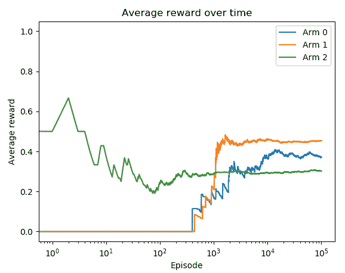

臂 1 是最佳臂，在最后具有最大的平均奖励。此外，它的平均奖励在大约 1,000 个剧集后开始饱和。

# 更多内容...

你可能想知道ε-贪婪策略是否确实优于随机策略。除了在ε-贪婪策略中最优臂的值较早收敛外，我们还可以证明，在训练过程中，通过ε-贪婪策略获得的平均奖励比随机策略更高。

我们可以简单地计算所有剧集的平均奖励：

```py
>>> print(sum(action_total_reward) / n_episode)
 0.43718
```

在 100,000 个剧集中，使用ε-贪婪策略的平均支付率为 `0.43718`。对随机策略解决方案进行相同计算后，得到平均支付率为 0.37902。

# 使用 softmax 探索解决多臂赌博问题

在本示例中，我们将使用 softmax 探索算法解决多臂赌博问题。我们将看到它与ε-贪婪策略的不同之处。

正如我们在ε-贪婪中看到的，当进行探索时，我们以 ε/|A| 的概率随机选择非最佳臂之一。每个非最佳臂在 Q 函数中的价值不管其值都是等效的。此外，无论其值如何，最佳臂都以固定概率被选择。在 **softmax 探索** 中，根据 Q 函数值的 softmax 分布选择臂。概率计算如下：

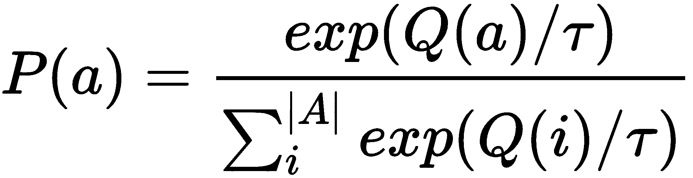

这里，τ 参数是温度因子，用于指定探索的随机性。τ 值越高，探索就越接近平等；τ 值越低，选择最佳臂的可能性就越大。

# 如何做到...

我们如下解决了使用 softmax 探索算法的多臂赌博问题：

1.  导入 PyTorch 和我们在第一个示例中开发的赌博环境，*创建多臂赌博环境*（假设 `BanditEnv` 类在名为 `multi_armed_bandit.py` 的文件中）：

```py
>>> import torch
 >>> from multi_armed_bandit import BanditEnv
```

1.  定义三臂赌博的支付概率和奖励，并创建赌博环境的实例：

```py
>>> bandit_payout = [0.1, 0.15, 0.3]
 >>> bandit_reward = [4, 3, 1] >>> bandit_env = BanditEnv(bandit_payout, bandit_reward)
```

1.  我们指定要运行的剧集数量，并定义保存通过选择各个臂累积的总奖励、选择各个臂的次数以及每个臂随时间的平均奖励的列表：

```py
>>> n_episode = 100000
 >>> n_action = len(bandit_payout)
 >>> action_count = [0 for _ in range(n_action)]
 >>> action_total_reward = [0 for _ in range(n_action)]
 >>> action_avg_reward = [[] for action in range(n_action)]
```

1.  定义 softmax 探索策略函数，指定 τ 的值，并创建 softmax 探索策略实例：

```py
>>> def gen_softmax_exploration_policy(tau):
 ...     def policy_function(Q):
 ...         probs = torch.exp(Q / tau)
 ...         probs = probs / torch.sum(probs)
 ...         action = torch.multinomial(probs, 1).item()
 ...         return action
 ...     return policy_function >>> tau = 0.1
 >>> softmax_exploration_policy = gen_softmax_exploration_policy(tau)
```

1.  初始化 Q 函数，即通过各个臂获得的平均奖励：

```py
>>> Q = torch.zeros(n_action)
```

我们将随时间更新 Q 函数。

1.  现在，我们运行 100,000 个剧集。对于每个剧集，我们还更新每个臂的统计信息：

```py
>>> for episode in range(n_episode):
 ...     action = softmax_exploration_policy(Q)
 ...     reward = bandit_env.step(action)
 ...     action_count[action] += 1
 ...     action_total_reward[action] += reward
 ...     Q[action] = action_total_reward[action] / action_count[action]
 ...     for a in range(n_action):
 ...         if action_count[a]:
 ...             action_avg_reward[a].append(                         action_total_reward[a] / action_count[a])
 ...         else:
 ...             action_avg_reward[a].append(0)
```

1.  运行了 100,000 个剧集后，我们绘制了随时间变化的平均奖励结果：

```py
>>> import matplotlib.pyplot as plt
 >>> for action in range(n_action):
 ...     plt.plot(action_avg_reward[action])
 >>> plt.legend([‘Arm {}’.format(action) for action in range(n_action)])
 >>> plt.title(‘Average reward over time’)
 >>> plt.xscale(‘log’)
 >>> plt.xlabel(‘Episode’)
 >>> plt.ylabel(‘Average reward’)
 >>> plt.show()
```

# 工作原理...

使用 softmax 探索策略，利用基于 Q 值的 softmax 函数解决了开发与探索的困境。它不是使用最佳臂和非最佳臂的固定概率对，而是根据τ参数作为温度因子的 softmax 分布调整概率。τ值越高，焦点就会更多地转向探索。

在*步骤 7*中，您将看到以下绘图：

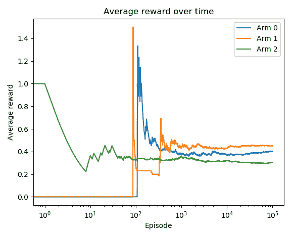

臂 1 是最佳臂，在最后具有最大的平均奖励。此外，在这个例子中，它的平均奖励在大约 800 个 episode 后开始饱和。

# 使用上置信度边界算法解决多臂赌博问题

在前两个配方中，我们通过在 epsilon-贪婪策略中将概率分配为固定值或者根据 Q 函数值计算 softmax 探索算法中的概率，探索了多臂赌博问题中的随机动作。在任一算法中，随机执行动作的概率并不随时间调整。理想情况下，我们希望随着学习的进行减少探索。在本配方中，我们将使用称为**上置信度边界**的新算法来实现这一目标。

**上置信度边界**（**UCB**）算法源于置信区间的概念。一般来说，置信区间是真值所在的一系列值。在 UCB 算法中，臂的置信区间是该臂获取的平均奖励所处的范围。该区间的形式为[下置信度边界，上置信度边界]，我们只使用上置信度边界，即 UCB，来估计该臂的潜力。UCB 的计算公式如下：

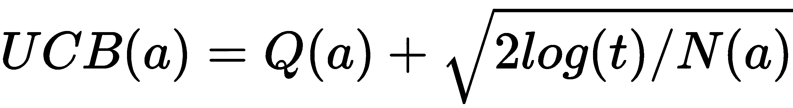

这里，t 是 episode 的数量，N(a)是在 t 个 episode 中臂 a 被选择的次数。随着学习的进行，置信区间收缩并变得越来越精确。应该拉动的臂是具有最高 UCB 的臂。

# 如何做...

我们使用 UCB 算法解决多臂赌博问题的步骤如下：

1.  导入 PyTorch 和第一个配方中开发的赌博环境，*创建多臂赌博环境*（假设`BanditEnv`类位于名为`multi_armed_bandit.py`的文件中）：

```py
>>> import torch
 >>> from multi_armed_bandit import BanditEnv
```

1.  定义三臂赌博的赔率概率和奖励，并创建赌博环境的一个实例：

```py
>>> bandit_payout = [0.1, 0.15, 0.3]
 >>> bandit_reward = [4, 3, 1] >>> bandit_env = BanditEnv(bandit_payout, bandit_reward)
```

1.  我们指定要运行的 episode 数量，并定义保存通过选择不同臂积累的总奖励、选择各个臂的次数以及各个臂随时间的平均奖励的列表：

```py
>>> n_episode = 100000
 >>> n_action = len(bandit_payout)
 >>> action_count = torch.tensor([0\. for _ in range(n_action)])
 >>> action_total_reward = [0 for _ in range(n_action)]
 >>> action_avg_reward = [[] for action in range(n_action)]
```

1.  定义 UCB 策略函数，根据 UCB 公式计算最佳臂：

```py
>>> def upper_confidence_bound(Q, action_count, t):
 ...     ucb = torch.sqrt((2 * torch.log(torch.tensor(float(t))))                                              / action_count) + Q
 ...     return torch.argmax(ucb)
```

1.  初始化 Q 函数，它是使用各个臂获取的平均奖励：

```py
>>> Q = torch.empty(n_action)
```

随着时间的推移，我们将更新 Q 函数。

1.  现在，我们使用我们的 UCB 策略运行 100,000 个 episode。对于每个 episode，我们还更新每个臂的统计信息：

```py
>>> for episode in range(n_episode):
 ...     action = upper_confidence_bound(Q, action_count, episode)
 ...     reward = bandit_env.step(action)
 ...     action_count[action] += 1
 ...     action_total_reward[action] += reward
 ...     Q[action] = action_total_reward[action] / action_count[action]
 ...     for a in range(n_action):
 ...         if action_count[a]:
 ...             action_avg_reward[a].append(                         action_total_reward[a] / action_count[a])
 ...         else:
 ...             action_avg_reward[a].append(0)
```

1.  在运行了 10 万个剧集后，我们绘制了随时间变化的平均奖励结果：

```py
>>> import matplotlib.pyplot as plt
 >>> for action in range(n_action):
 ...     plt.plot(action_avg_reward[action])
 >>> plt.legend([‘Arm {}’.format(action) for action in range(n_action)])
 >>> plt.title(‘Average reward over time’)
 >>> plt.xscale(‘log’)
 >>> plt.xlabel(‘Episode’)
 >>> plt.ylabel(‘Average reward’)
 >>> plt.show()
```

# 工作原理...

在这个示例中，我们使用了 UCB 算法解决了多臂赌博机问题。它根据剧集数调整开发-探索困境。对于数据点较少的动作，其置信区间相对较宽，因此选择此动作具有相对较高的不确定性。随着更多的动作剧集被选中，置信区间变窄并收缩到其实际值。在这种情况下，选择（或不选择）此动作是非常确定的。最后，在每个剧集中，UCB 算法拉动具有最高 UCB 的臂，并随着时间的推移获得越来越多的信心。

在*第 7 步*中运行代码后，您将看到以下绘图：

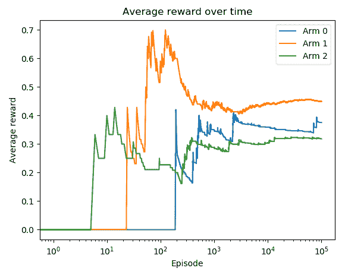

第一个臂是最佳的臂，最终平均奖励最高。

# 还有更多内容...

您可能想知道 UCB 是否真的优于ε-greedy 策略。我们可以计算整个训练过程中的平均奖励，平均奖励最高的策略学习速度更快。

我们可以简单地平均所有剧集的奖励：

```py
>>> print(sum(action_total_reward) / n_episode)
 0.44605
```

在 10 万个剧集中，使用 UCB 的平均支付率为 0.44605，高于ε-greedy 策略的 0.43718。

# 另请参阅

对于那些想要了解置信区间的人，请随时查看以下内容：[`www.stat.yale.edu/Courses/1997-98/101/confint.htm`](http://www.stat.yale.edu/Courses/1997-98/101/confint.htm)

# 解决互联网广告问题的多臂赌博机

想象一下，您是一位在网站上进行广告优化的广告商：

+   广告背景有三种不同的颜色 – 红色，绿色和蓝色。哪种将实现最佳点击率（CTR）？

+   广告有三种不同的文案 – *学习…*，*免费…* 和 *尝试…*。哪一个将实现最佳 CTR？

对于每位访客，我们需要选择一个广告，以最大化随时间的点击率（CTR）。我们如何解决这个问题？

或许您在考虑 A/B 测试，其中您随机将流量分成几组，并将每个广告分配到不同的组中，然后在观察一段时间后选择具有最高 CTR 的组中的广告。然而，这基本上是完全的探索，我们通常不确定观察期应该多长，最终会失去大量潜在的点击。此外，在 A/B 测试中，假设广告的未知 CTR 不会随时间而变化。否则，这种 A/B 测试应定期重新运行。

多臂赌博机确实可以比 A/B 测试做得更好。每个臂是一个广告，臂的奖励要么是 1（点击），要么是 0（未点击）。

让我们尝试用 UCB 算法解决这个问题。

# 如何做到...

我们可以使用 UCB 算法解决多臂赌博机广告问题，具体如下：

1.  导入 PyTorch 和我们在第一个示例中开发的老虎机环境，《创建多臂老虎机环境》（假设 `BanditEnv` 类位于名为 `multi_armed_bandit.py` 的文件中）：

```py
>>> import torch
>>> from multi_armed_bandit import BanditEnv
```

1.  定义三臂老虎机（例如三个广告候选项）的支付概率和奖励，并创建老虎机环境的实例：

```py
>>> bandit_payout = [0.01, 0.015, 0.03]
>>> bandit_reward = [1, 1, 1]>>> bandit_env = BanditEnv(bandit_payout, bandit_reward)
```

在这里，广告 0 的真实点击率为 1%，广告 1 为 1.5%，广告 2 为 3%。

1.  我们指定要运行的周期数，并定义包含通过选择各个臂累积的总奖励、选择各个臂的次数以及每个臂随时间的平均奖励的列表：

```py
>>> n_episode = 100000
>>> n_action = len(bandit_payout)
>>> action_count = torch.tensor([0\. for _ in range(n_action)])
>>> action_total_reward = [0 for _ in range(n_action)]
>>> action_avg_reward = [[] for action in range(n_action)]
```

1.  定义 UCB 策略函数，根据 UCB 公式计算最佳臂：

```py
>>> def upper_confidence_bound(Q, action_count, t):
...     ucb = torch.sqrt((2 * torch.log(
 torch.tensor(float(t)))) / action_count) + Q
...     return torch.argmax(ucb)
```

1.  初始化 Q 函数，即各个臂获得的平均奖励：

```py
>>> Q = torch.empty(n_action)
```

我们将随时间更新 Q 函数。

1.  现在，我们使用 UCB 策略运行 100,000 个周期。对于每个周期，我们还更新每个臂的统计信息：

```py
>>> for episode in range(n_episode):
...     action = upper_confidence_bound(Q, action_count, episode)
...     reward = bandit_env.step(action)
...     action_count[action] += 1
...     action_total_reward[action] += reward
...     Q[action] = action_total_reward[action] / action_count[action]
...     for a in range(n_action):
...         if action_count[a]:
...             action_avg_reward[a].append(
 action_total_reward[a] / action_count[a])
...         else:
...             action_avg_reward[a].append(0)
```

1.  运行 100,000 个周期后，我们绘制随时间变化的平均奖励结果：

```py
>>> import matplotlib.pyplot as plt
>>> for action in range(n_action):
...     plt.plot(action_avg_reward[action])
>>> plt.legend([‘Arm {}’.format(action) for action in range(n_action)])
>>> plt.title(‘Average reward over time’)
>>> plt.xscale(‘log’)
>>> plt.xlabel(‘Episode’)
>>> plt.ylabel(‘Average reward’)
>>> plt.show()
```

# 它的工作原理…

在这个示例中，我们以多臂老虎机的方式解决了广告优化问题。它克服了 A/B 测试方法所面临的挑战。我们使用 UCB 算法解决多臂（多广告）老虎机问题；每个臂的奖励要么是 1，要么是 0。UCB（或其他算法如 epsilon-greedy 和 softmax 探索）动态地在开发和探索之间切换。对于数据点较少的广告，置信区间相对较宽，因此选择此动作具有相对高的不确定性。随着广告被选择的次数增多，置信区间变窄，并收敛到其实际值。

您可以在 *第 7 步* 中看到生成的图表如下：

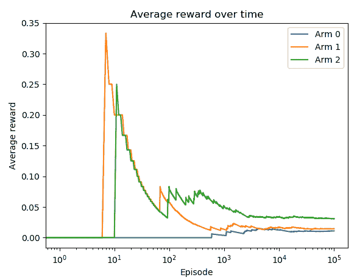

模型收敛后，广告 2 是预测的点击率（平均奖励）最高的广告。

最终，我们发现广告 2 是最优选择，这是真实的。而且我们越早发现这一点越好，因为我们会损失更少的潜在点击。在这个例子中，大约在 100 个周期后，广告 2 表现优于其他广告。

# 使用汤普森抽样算法解决多臂老虎机问题

在这个示例中，我们将使用另一种算法——汤普森抽样，解决广告老虎机问题中的开发和探索困境。我们将看到它与前三种算法的显著区别。

**汤普森抽样**（**TS**）也称为贝叶斯老虎机，因为它从以下角度应用贝叶斯思维：

+   这是一个概率算法。

+   它计算每个臂的先验分布并从每个分布中抽样一个值。

+   然后选择值最高的臂并观察奖励。

+   最后，根据观察到的奖励更新先验分布。这个过程称为**贝叶斯更新**。

正如我们在广告优化案例中看到的，每个臂的奖励要么是 1 要么是 0。我们可以使用**贝塔分布**作为我们的先验分布，因为贝塔分布的值在 0 到 1 之间。贝塔分布由两个参数α和β参数化。α表示我们获得奖励为 1 的次数，β表示我们获得奖励为 0 的次数。

为了帮助你更好地理解贝塔分布，我们将首先看几个贝塔分布，然后再实施 TS 算法。

# 怎么做……

让我们通过以下步骤来探索贝塔分布：

1.  导入 PyTorch 和 matplotlib 因为我们将可视化分布的形状：

```py
>>> import torch
>>> import matplotlib.pyplot as plt
```

1.  我们首先通过起始位置α=1 和β=1 来可视化贝塔分布的形状：

```py
>>> beta1 = torch.distributions.beta.Beta(1, 1)
>>> samples1 = [beta1.sample() for _ in range(100000)]
>>> plt.hist(samples1, range=[0, 1], bins=10)
>>> plt.title(‘beta(1, 1)’)
>>> plt.show()
```

你将看到以下的绘图：

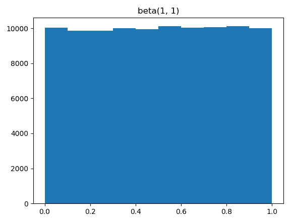

显然，当α=1 且β=1 时，它不提供有关真实值在 0 到 1 范围内位置的任何信息。因此，它成为均匀分布。

1.  我们随后用α=5 和β=1 来可视化贝塔分布的形状：

```py
>>> beta2 = torch.distributions.beta.Beta(5, 1)
>>> samples2 = [beta2.sample() for _ in range(100000)]
>>> plt.hist(samples2, range=[0, 1], bins=10)
>>> plt.title(‘beta(5, 1)’)
>>> plt.show()
```

你将看到以下的绘图：

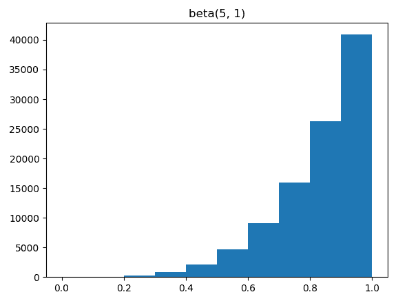

当α=5 且β=1 时，这意味着在 4 次实验中有 4 次连续的奖励为 1。分布向 1 偏移。

1.  现在，让我们实验α=1 和β=5：

```py
>>> beta3 = torch.distributions.beta.Beta(1, 5)
>>> samples3= [beta3.sample() for _ in range(100000)]
>>> plt.hist(samples3, range=[0, 1], bins=10)
>>> plt.title(‘beta(1, 5)’)
>>> plt.show()
```

你将看到以下的绘图：

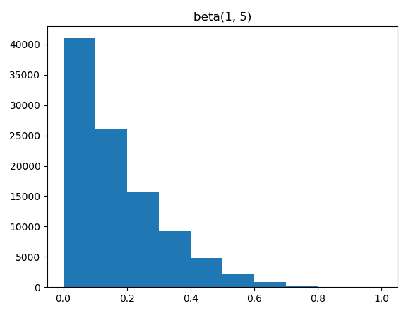

当α=1 且β=5 时，这意味着在 4 次实验中有 4 次连续的奖励为 0。分布向 0 偏移。

1.  最后，让我们看看当α=5 且β=5 时的情况：

```py
>>> beta4 = torch.distributions.beta.Beta(5, 5)
>>> samples4= [beta4.sample() for _ in range(100000)]
>>> plt.hist(samples4, range=[0, 1], bins=10)
>>> plt.title(‘beta(5, 5)’)
>>> plt.show()
```

你将看到以下的绘图：

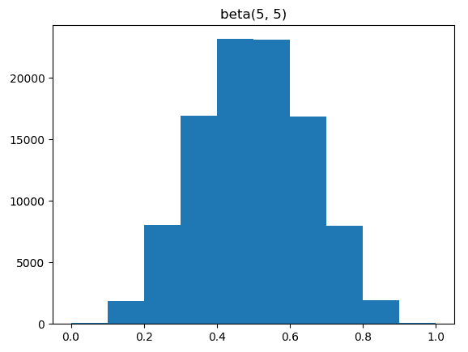

当α=5 且β=5 时，在 8 轮中观察到相同数量的点击和未点击。分布向中间点**0.5**偏移。

现在是时候使用汤普森采样算法来解决多臂老虎机广告问题了：

1.  导入我们在第一个示例中开发的老虎机环境，*创建多臂老虎机环境*（假设`BanditEnv`类在名为`multi_armed_bandit.py`的文件中）：

```py
>>> from multi_armed_bandit import BanditEnv
```

1.  定义三臂老虎机（三个广告候选项）的支付概率和奖励，并创建一个老虎机环境的实例：

```py
>>> bandit_payout = [0.01, 0.015, 0.03]
>>> bandit_reward = [1, 1, 1]>>> bandit_env = BanditEnv(bandit_payout, bandit_reward)
```

1.  我们指定要运行的剧集数，并定义包含通过选择各个臂累积的总奖励、选择各个臂的次数以及每个臂的平均奖励随时间变化的列表：

```py
>>> n_episode = 100000
>>> n_action = len(bandit_payout)
>>> action_count = torch.tensor([0\. for _ in range(n_action)])
>>> action_total_reward = [0 for _ in range(n_action)]
>>> action_avg_reward = [[] for action in range(n_action)]
```

1.  定义 TS 函数，从每个臂的贝塔分布中抽样一个值，并选择具有最高值的臂：

```py
>>> def thompson_sampling(alpha, beta):
...     prior_values = torch.distributions.beta.Beta(alpha, beta).sample()
...     return torch.argmax(prior_values)
```

1.  为每个臂初始化α和β：

```py
>>> alpha = torch.ones(n_action)
>>> beta = torch.ones(n_action)
```

注意，每个贝塔分布的起始值应为α=β=1。

1.  现在，我们使用 TS 算法运行了 100,000 个剧集。对于每个剧集，我们还根据观察到的奖励更新每个臂的 α 和 β：

```py
>>> for episode in range(n_episode):
 ...     action = thompson_sampling(alpha, beta)
 ...     reward = bandit_env.step(action)
 ...     action_count[action] += 1
 ...     action_total_reward[action] += reward
 ...     if reward > 0:
 ...         alpha[action] += 1
 ...     else:
 ...         beta[action] += 1
 ...     for a in range(n_action):
 ...         if action_count[a]:
 ...             action_avg_reward[a].append(                         action_total_reward[a] / action_count[a])
 ...         else:
 ...             action_avg_reward[a].append(0)
```

1.  运行 100,000 个剧集后，我们绘制了随时间变化的平均奖励结果：

```py
>>> import matplotlib.pyplot as plt
>>> for action in range(n_action):
...     plt.plot(action_avg_reward[action])
>>> plt.legend([‘Arm {}’.format(action) for action in range(n_action)])
>>> plt.title(‘Average reward over time’)
>>> plt.xscale(‘log’)
>>> plt.xlabel(‘Episode’)
>>> plt.ylabel(‘Average reward’)
>>> plt.show()
```

# 工作原理...

在本文中，我们使用 TS 算法解决了广告赌博机问题。TS 与另外三种方法的最大区别在于采用贝叶斯优化。它首先计算每个可能臂的先验分布，然后从每个分布中随机抽取一个值。然后选择具有最高值的臂，并使用观察到的结果更新先验分布。TS 策略既是随机的又是贪婪的。如果某个广告更有可能获得点击，则其贝塔分布向 1 移动，因此随机样本的值趋向于更接近 1。

运行*步骤 7* 中的代码行后，您将看到以下图表：

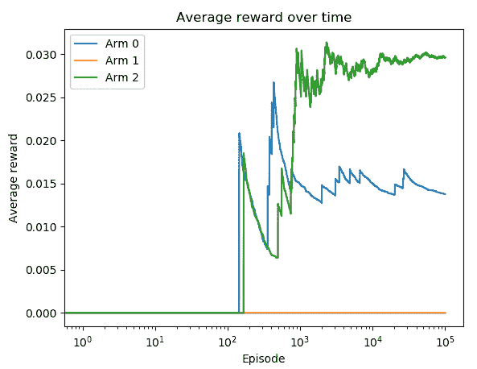

广告 2 是最佳广告，预测的点击率（平均奖励）最高。

# 另请参阅

对于希望了解贝塔分布的人，可以随时查看以下链接：

+   [`www.itl.nist.gov/div898/handbook/eda/section3/eda366h.htm`](https://www.itl.nist.gov/div898/handbook/eda/section3/eda366h.htm)

+   [`varianceexplained.org/statistics/beta_distribution_and_baseball/`](http://varianceexplained.org/statistics/beta_distribution_and_baseball/)

# 解决互联网广告问题的上下文赌博机

您可能会注意到，在广告优化问题中，我们只关心广告本身，而忽略可能影响广告是否被点击的其他信息，例如用户信息和网页信息。在本文中，我们将讨论如何考虑超出广告本身的更多信息，并使用上下文赌博机解决这个问题。

到目前为止，我们处理过的多臂赌博机问题不涉及状态的概念，这与 MDPs 非常不同。我们只有几个动作，并且会生成与所选动作相关联的奖励。**上下文赌博机**通过引入状态的概念扩展了多臂赌博机。状态提供了环境的描述，帮助代理人采取更加明智的行动。在广告示例中，状态可以是用户的性别（两个状态，男性和女性）、用户的年龄组（例如四个状态）或页面类别（例如体育、财务或新闻）。直观地说，特定人口统计学的用户更有可能在某些页面上点击广告。

理解上下文赌博机并不难。一个多臂赌博机是一台具有多个臂的单机，而上下文赌博机是一组这样的机器（赌博机）。上下文赌博机中的每台机器是一个具有多个臂的状态。学习的目标是找到每台机器（状态）的最佳臂（动作）。

我们将以两个状态的广告示例为例。

# 如何做...

我们使用 UCB 算法解决上下文老虎机广告问题如下：

1.  导入 PyTorch 和我们在第一个示例中开发的老虎机环境，*创建一个多臂老虎机环境*（假设`BanditEnv`类在名为`multi_armed_bandit.py`的文件中）：

```py
>>> import torch
>>> from multi_armed_bandit import BanditEnv
```

1.  定义两个三臂老虎机的支付概率和奖励：

```py
>>> bandit_payout_machines = [
...     [0.01, 0.015, 0.03],
...     [0.025, 0.01, 0.015]
... ]
>>> bandit_reward_machines = [
...     [1, 1, 1],
...     [1, 1, 1]
... ]
```

在这里，广告 0 的真实 CTR 为 1%，广告 1 为 1.5%，广告 2 为 3%适用于第一个状态，以及第二个状态的[2.5%，1%，1.5%]。

我们的情况下有两台老虎机：

```py
>>> n_machine = len(bandit_payout_machines)
```

根据相应的支付信息创建一个老虎机列表：

```py
>>> bandit_env_machines = [BanditEnv(bandit_payout, bandit_reward)
...           for bandit_payout, bandit_reward in
...           zip(bandit_payout_machines, bandit_reward_machines)]
```

1.  我们指定要运行的剧集数，并定义包含在每个状态下选择各个臂时累计的总奖励、每个状态下选择各个臂的次数以及每个状态下各个臂随时间的平均奖励的列表：

```py
>>> n_episode = 100000
>>> n_action = len(bandit_payout_machines[0])
>>> action_count = torch.zeros(n_machine, n_action)
>>> action_total_reward = torch.zeros(n_machine, n_action)
>>> action_avg_reward = [[[] for action in range(n_action)] for _ in range(n_machine)]
```

1.  定义 UCB 策略函数，根据 UCB 公式计算最佳臂：

```py
>>> def upper_confidence_bound(Q, action_count, t):
...     ucb = torch.sqrt((2 * torch.log( 
                 torch.tensor(float(t)))) / action_count) + Q
...     return torch.argmax(ucb)
```

1.  初始化 Q 函数，这是在各个状态下使用各个臂获得的平均奖励：

```py
>>> Q_machines = torch.empty(n_machine, n_action)
```

我们将随时间更新 Q 函数。

1.  现在，我们使用 UCB 策略运行 100,000 个剧集。对于每个剧集，我们还更新每个状态下每个臂的统计数据：

```py
>>> for episode in range(n_episode):
...     state = torch.randint(0, n_machine, (1,)).item()
...     action = upper_confidence_bound(                 Q_machines[state], action_count[state], episode)
...     reward = bandit_env_machines[state].step(action)
...     action_count[state][action] += 1
...     action_total_reward[state][action] += reward
...     Q_machines[state][action] =                              action_total_reward[state][action]                              / action_count[state][action]
...     for a in range(n_action):
...         if action_count[state][a]:
...             action_avg_reward[state][a].append(                             action_total_reward[state][a]                              / action_count[state][a])
...         else:
...             action_avg_reward[state][a].append(0)
```

1.  运行 100,000 个剧集后，我们绘制每个状态随时间变化的平均奖励结果：

```py
>>> import matplotlib.pyplot as plt
>>> for state in range(n_machine):
...     for action in range(n_action):
...         plt.plot(action_avg_reward[state][action])
...     plt.legend([‘Arm {}’.format(action)                      for action in range(n_action)])
...     plt.xscale(‘log’)
...     plt.title(       ‘Average reward over time for state {}’.format(state))
...     plt.xlabel(‘Episode’)
...     plt.ylabel(‘Average reward’)
...     plt.show()
```

# 工作原理如下...

在这个示例中，我们使用 UCB 算法解决了上下文广告问题的上下文老虎机问题。

运行*步骤 7*中的代码行，您将看到以下绘图。

我们得到了第一个状态的结果：

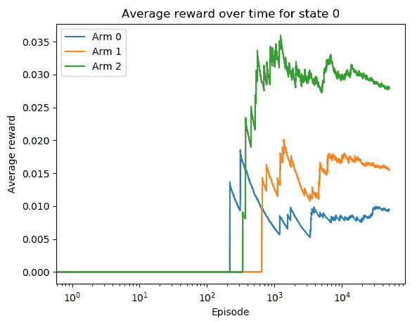

我们得到了第二个状态的结果：

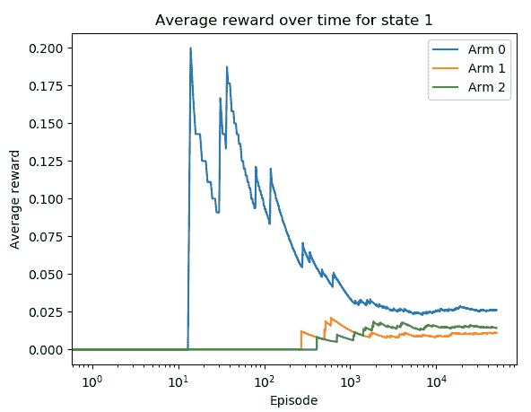

给定第一个状态，广告 2 是最佳广告，具有最高的预测点击率。给定第二个状态，广告 0 是最佳广告，具有最高的平均奖励。这两者都是真实的。

上下文老虎机是一组多臂老虎机。每个老虎机代表环境的唯一状态。状态提供了环境的描述，帮助代理者采取更明智的行动。在我们的广告示例中，男性用户可能比女性用户更有可能点击广告。我们简单地使用了两台老虎机来包含两种状态，并在每种状态下寻找最佳的拉杆臂。

请注意，尽管上下文老虎机涉及状态的概念，但它们仍然与 MDP 有所不同。首先，上下文老虎机中的状态不是由先前的动作或状态决定的，而只是环境的观察。其次，上下文老虎机中没有延迟或折现奖励，因为老虎机剧集是一步。然而，与多臂老虎机相比，上下文老虎机更接近 MDP，因为动作是环境状态的条件。可以说上下文老虎机介于多臂老虎机和完整 MDP 强化学习之间是安全的。
