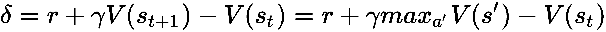

# 通过函数逼近扩展学习

到目前为止，在 MC 和 TD 方法中，我们已经以查找表的形式表示了值函数。TD 方法能够在一个 episode 中实时更新 Q 函数，这被认为是 MC 方法的进步。然而，TD 方法对于具有许多状态和/或动作的问题仍然不够可扩展。使用 TD 方法学习太多个状态和动作对的值将会非常缓慢。

本章将重点讲述函数逼近，这可以克服 TD 方法中的扩展问题。我们将从设置 Mountain Car 环境开始。在开发线性函数估计器之后，我们将其融入 Q-learning 和 SARSA 算法中。然后，我们将利用经验重放改进 Q-learning 算法，并尝试使用神经网络作为函数估计器。最后，我们将讨论如何利用本章学到的内容解决 CartPole 问题。

本章将涵盖以下示例：

+   设置 Mountain Car 环境的游乐场

+   使用梯度下降逼近估算 Q 函数

+   使用线性函数逼近开发 Q-learning

+   使用线性函数逼近开发 SARSA

+   使用经验重放进行批处理

+   使用神经网络函数逼近开发 Q-learning

+   使用函数逼近解决 CartPole 问题

# 设置 Mountain Car 环境的游乐场

TD 方法可以在一个 episode 中学习 Q 函数，但不具备可扩展性。例如，国际象棋游戏的状态数约为 1,040 个，围棋游戏为 1,070 个。此外，使用 TD 方法学习连续状态的值似乎是不可行的。因此，我们需要使用**函数逼近（FA）**来解决这类问题，它使用一组特征来逼近状态空间。

在第一个示例中，我们将开始熟悉 Mountain Car 环境，我们将在接下来的示例中使用 FA 方法来解决它。

Mountain Car ([`gym.openai.com/envs/MountainCar-v0/`](https://gym.openai.com/envs/MountainCar-v0/)) 是一个具有连续状态的典型 Gym 环境。如下图所示，其目标是将车辆驶上山顶：


在一维轨道上，车辆位于-1.2（最左侧）到 0.6（最右侧）之间，目标（黄旗）位于 0.5 处。车辆的引擎不足以使其在单次通过中驱动到顶部，因此它必须来回驾驶以积累动量。因此，每一步有三个离散动作：

+   向左推（0）

+   无推力（1）

+   向右推（2）

环境有两个状态：

+   车的位置：这是一个从-1.2 到 0.6 的连续变量。

+   车的速度：这是一个从-0.07 到 0.07 的连续变量。

每一步的奖励为-1，直到汽车达到目标位置（位置为 0.5）。

一集结束时，汽车到达目标位置（显然），或者经过 200 步之后。

# 准备工作

要运行山车环境，让我们首先在环境表中搜索其名称 – [`github.com/openai/gym/wiki/Table-of-environments`](https://github.com/openai/gym/wiki/Table-of-environments)。我们得到了`MountainCar-v0`，还知道观察空间由两个浮点数表示，有三种可能的动作（左=0，无推力=1，右=2）。

# 如何操作...

让我们按照以下步骤模拟山车环境：

1.  我们导入 Gym 库并创建山车环境的一个实例：

```py
>>> import gym
>>> env = gym.envs.make("MountainCar-v0")
>>> n_action = env.action_space.n
>>> print(n_action)
3
```

1.  重置环境：

```py
>>> env.reset()
array([-0.52354759,  0\. ])
```

汽车从状态`[-0.52354759, 0.]`开始，这意味着初始位置大约在-0.5，速度为 0。由于初始位置是从-0.6 到-0.4 随机生成的，你可能会看到不同的初始位置。

1.  现在让我们采取一种简单的方法：我们只需不断向右推车，希望它能够到达山顶：

```py
>>> is_done = False
 >>> while not is_done:
 ...     next_state, reward, is_done, info = env.step(2)
 ...     print(next_state, reward, is_done)
 ...     env.render()
 >>> env.render()
 [-0.49286453  0.00077561] -1.0 False
 [-0.4913191   0.00154543] -1.0 False
 [-0.48901538  0.00230371] -1.0 False
 [-0.48597058  0.0030448 ] -1.0 False
 ......
 ......
 [-0.29239555 -0.0046231 ] -1.0 False
 [-0.29761694 -0.00522139] -1.0 False
 [-0.30340632 -0.00578938] -1.0 True
```

1.  关闭环境：

```py
env.close()
```

# 工作原理...

在*Step 3*中，状态（位置和速度）会相应地改变，每一步的奖励是-1。

你也会在视频中看到，汽车反复向右移动，然后回到左边，但最终未能到达山顶：


正如你所想象的那样，山车问题并不像你想象的那么简单。我们需要来回驾驶汽车以积累动量。而状态变量是连续的，这意味着表格查找/更新方法（如 TD 方法）不起作用。在下一个配方中，我们将使用 FA 方法解决山车问题。

# 使用梯度下降逼近估计 Q 函数

从这个配方开始，我们将开发 FA 算法来解决具有连续状态变量的环境。我们将从使用线性函数和梯度下降逼近 Q 函数开始。

**FA**的主要思想是使用一组特征来估计 Q 值。这对于具有大状态空间的过程非常有用，其中 Q 表格变得非常庞大。有几种方法可以将特征映射到 Q 值上；例如，线性逼近是特征的线性组合和神经网络。通过线性逼近，动作的状态值函数可以用特征的加权和表示：


在这里，F1(s)，F2(s)，……，Fn(s)是给定输入状态 s 的一组特征；θ1，θ2，……，θn 是应用于相应特征的权重。或者我们可以将其表示为 V(s)=θF(s)。

正如我们在 TD 方法中所见，我们有以下公式来计算未来的状态：


在这里，r 是从状态 st 转换到 st+1 获得的相关奖励，α是学习率，γ是折扣因子。让我们将δ表示为 TD 误差项，现在我们有以下内容：


这与梯度下降的确切形式相同。因此，学习的目标是找到最优权重θ，以最佳方式逼近每个可能动作的状态值函数 V(s)。在这种情况下，我们尝试最小化的损失函数类似于回归问题中的损失函数，即实际值和估计值之间的均方误差。在每个 episode 的每一步之后，我们都有一个真实状态值的新估计，并且我们将权重θ朝向它们的最优值前进一步。

还要注意的一件事是特征集 F(s)，给定输入状态 s。一个好的特征集能够捕捉不同输入的动态。通常，我们可以在各种参数下使用一组高斯函数生成一组特征，包括均值和标准差。

# 如何做到…

我们基于线性函数开发 Q 函数的逼近器如下：

1.  导入所有必要的包：

```py
>>> import torch
>>> from torch.autograd import Variable
>>> import math
```

变量包装了张量并支持反向传播。

1.  然后，启动线性函数的`Estimator`类的`__init__method`：

```py
>>> class Estimator():
 ...     def __init__(self, n_feat, n_state, n_action, lr=0.05):
 ...         self.w, self.b = self.get_gaussian_wb(n_feat, n_state)
 ...         self.n_feat = n_feat
 ...         self.models = []
 ...         self.optimizers = []
 ...         self.criterion = torch.nn.MSELoss()
 ...         for _ in range(n_action):
 ...             model = torch.nn.Linear(n_feat, 1)
 ...             self.models.append(model)
 ...             optimizer = torch.optim.SGD(model.parameters(), lr)
 ...             self.optimizers.append(optimizer)
```

它接受三个参数：特征数量`n_feat`，状态数量和动作数量。它首先从高斯分布生成特征函数 F(s)的一组系数`w`和`b`，稍后我们将定义。然后初始化`n_action`个线性模型，其中每个模型对应一个动作，并相应地初始化`n_action`个优化器。对于线性模型，我们在此处使用 PyTorch 的 Linear 模块。它接受`n_feat`个单元并生成一个输出，即一个动作的预测状态值。随机梯度下降优化器也与每个线性模型一起初始化。每个优化器的学习率为 0.05。损失函数是均方误差。

1.  我们现在继续定义`get_gaussian_wb`方法，它生成特征函数 F(s)的一组系数`w`和`b`：

```py
>>>     def get_gaussian_wb(self, n_feat, n_state, sigma=.2):
 ...         """
 ...         Generate the coefficients of the feature set from 
             Gaussian distribution
 ...         @param n_feat: number of features
 ...         @param n_state: number of states
 ...         @param sigma: kernel parameter
 ...         @return: coefficients of the features
 ...         """
 ...         torch.manual_seed(0)
 ...         w = torch.randn((n_state, n_feat)) * 1.0 / sigma
 ...         b = torch.rand(n_feat) * 2.0 * math.pi
 ...         return w, b
```

系数`w`是一个`n_feat`乘以`n_state`的矩阵，其值从由参数 sigma 定义的方差高斯分布生成；偏置`b`是从[0, 2π]均匀分布生成的`n_feat`值的列表。

注意，设置特定的随机种子（`torch.manual_seed(0)`）非常重要，这样在不同运行中，状态始终可以映射到相同的特征。

1.  接下来，我们开发将状态空间映射到特征空间的函数，基于`w`和`b`：

```py
>>>     def get_feature(self, s):
 ...         """
 ...         Generate features based on the input state
 ...         @param s: input state
 ...         @return: features
 ...         """
 ...         features = (2.0 / self.n_feat) ** .5 * torch.cos(
                  torch.matmul(torch.tensor(s).float(), self.w) 
                  + self.b)
 ...         return features
```

状态 s 的特征生成如下：


使用余弦变换确保特征在[-1, 1]范围内，尽管输入状态的值可能不同。

1.  由于我们已经定义了模型和特征生成，现在我们开发训练方法，用数据点更新线性模型：

```py
>>>     def update(self, s, a, y):
 ...         """
 ...         Update the weights for the linear estimator with 
             the given training sample
 ...         @param s: state
 ...         @param a: action
 ...         @param y: target value
 ...         """
 ...         features = Variable(self.get_feature(s))
 ...         y_pred = self.modelsa
 ...         loss = self.criterion(y_pred, 
                     Variable(torch.Tensor([y])))
 ...         self.optimizers[a].zero_grad()
 ...         loss.backward()
 ...         self.optimizers[a].step()
```

给定一个训练数据点，它首先使用`get_feature`方法将状态转换为特征空间。然后将生成的特征馈送到给定动作`a`的当前线性模型中。预测结果连同目标值用于计算损失和梯度。然后通过反向传播更新权重θ。

1.  下一个操作涉及使用当前模型预测每个动作在给定状态下的状态值：

```py
>>>     def predict(self, s):
 ...         """
 ...         Compute the Q values of the state using 
                 the learning model
 ...         @param s: input state
 ...         @return: Q values of the state
 ...         """
 ...         features = self.get_feature(s)
 ...         with torch.no_grad():
 ...             return torch.tensor([model(features) 
                                     for model in self.models])
```

这就是关于`Estimator`类的全部内容。

1.  现在，让我们玩弄一些虚拟数据。首先，创建一个`Estimator`对象，将一个二维状态映射到一个十维特征，并与一个可能的动作配合使用：

```py
>>> estimator = Estimator(10, 2, 1)
```

1.  现在，生成状态[0.5, 0.1]的特征。

```py
>>> s1 = [0.5, 0.1]
>>> print(estimator.get_feature(s1))
tensor([ 0.3163, -0.4467, -0.0450, -0.1490,  0.2393, -0.4181, -0.4426, 0.3074,
         -0.4451,  0.1808])
```

正如您所看到的，生成的特征是一个 10 维向量。

1.  对一系列状态和目标状态值（在本例中我们只有一个动作）进行估算器训练：

```py
>>> s_list = [[1, 2], [2, 2], [3, 4], [2, 3], [2, 1]]
>>> target_list = [1, 1.5, 2, 2, 1.5]
>>> for s, target in zip(s_list, target_list):
...     feature = estimator.get_feature(s)
...     estimator.update(s, 0, target)
```

1.  最后，我们使用训练好的线性模型来预测新状态的值：

```py
>>> print(estimator.predict([0.5, 0.1]))
 tensor([0.6172])
>>> print(estimator.predict([2, 3]))
 tensor([0.8733])
```

对于状态[0.5, 0.1]，预测的值与动作为 0.5847，而对于[2, 3]，预测的值为 0.7969。

# 工作原理如下……

FA 方法通过比 TD 方法中的 Q 表计算更紧凑的模型来近似状态值。FA 首先将状态空间映射到特征空间，然后使用回归模型估算 Q 值。通过这种方式，学习过程变成了监督学习。类型回归模型包括线性模型和神经网络。在本文中，我们开发了一个基于线性回归的估算器。它根据从高斯分布中采样的系数生成特征。它通过梯度下降更新线性模型的权重，并根据状态预测 Q 值。

FA 显著减少了需要学习的状态数量，在 TD 方法中学习数百万个状态是不可行的。更重要的是，它能够推广到未见的状态，因为状态值是由给定输入状态的估计函数参数化的。

# 另请参阅

如果您对线性回归或梯度下降不熟悉，请查看以下资料：

+   [`towardsdatascience.com/step-by-step-tutorial-on-linear-regression-with-stochastic-gradient-descent-1d35b088a843`](https://towardsdatascience.com/step-by-step-tutorial-on-linear-regression-with-stochastic-gradient-descent-1d35b088a843)

+   [`machinelearningmastery.com/simple-linear-regression-tutorial-for-machine-learning/`](https://machinelearningmastery.com/simple-linear-regression-tutorial-for-machine-learning/)

# 开发具有线性函数逼近的 Q-learning

在前一篇文章中，我们基于线性回归开发了一个值估算器。我们将在 Q-learning 中使用这个估算器，作为我们 FA 旅程的一部分。

正如我们所看到的，Q-learning 是一种离线学习算法，它基于以下方程更新 Q 函数：


这里，*s'*是在状态*s*中采取动作*a*后得到的结果状态；*r*是相关的奖励；α是学习率；γ是折扣因子。此外，![] 表示行为策略是贪婪的，即在状态`s'`中选择最高的 Q 值以生成学习数据。在 Q-learning 中，根据ε-greedy 策略采取行动。同样地，Q-learning 与 FA 具有以下误差项：



我们的学习目标是将误差项最小化为零，这意味着估算的 V(st)应满足以下方程：


现在，目标是找到最优权重θ，例如 V(s)=θF(s)，以最佳方式逼近每个可能动作的状态值函数 V(s)。在这种情况下，我们试图最小化的损失函数类似于回归问题中的损失函数，即实际值和估算值之间的均方误差。

# 如何做到…

让我们使用前一篇文章中开发的线性估算器`linear_estimator.py`中的`Estimator`，开发 Q-learning 与 FA：

1.  导入必要的模块并创建一个 Mountain Car 环境：

```py
>>> import gym
>>> import torch
>>> from linear_estimator import Estimator >>> env = gym.envs.make("MountainCar-v0")
```

1.  然后，开始定义ε-greedy 策略：

```py
>>> def gen_epsilon_greedy_policy(estimator, epsilon, n_action):
 ...     def policy_function(state):
 ...         probs = torch.ones(n_action) * epsilon / n_action
 ...         q_values = estimator.predict(state)
 ...         best_action = torch.argmax(q_values).item()
 ...         probs[best_action] += 1.0 - epsilon
 ...         action = torch.multinomial(probs, 1).item()
 ...         return action
 ...     return policy_function
```

这里的参数ε取值从 0 到 1，|A|表示可能的动作数，估算器用于预测状态-动作值。每个动作以ε/ |A|的概率被选中，而具有最高预测状态-动作值的动作则以 1- ε + ε/ |A|的概率被选中。

1.  现在，定义执行使用线性估算器`Estimator`的 Q-learning 的函数：

```py
>>> def q_learning(env, estimator, n_episode, gamma=1.0, 
                    epsilon=0.1, epsilon_decay=.99):
 ...     """
 ...     Q-Learning algorithm using Function Approximation
 ...     @param env: Gym environment
 ...     @param estimator: Estimator object
 ...     @param n_episode: number of episodes
 ...     @param gamma: the discount factor
 ...     @param epsilon: parameter for epsilon_greedy
 ...     @param epsilon_decay: epsilon decreasing factor
 ...     """
 ...     for episode in range(n_episode):
 ...         policy = gen_epsilon_greedy_policy(estimator, 
                   epsilon * epsilon_decay ** episode, n_action)
 ...         state = env.reset()
 ...         is_done = False
 ...         while not is_done:
 ...             action = policy(state)
 ...             next_state, reward, is_done, _ = env.step(action)
 ...             q_values_next = estimator.predict(next_state)
 ...             td_target = reward + 
                             gamma * torch.max(q_values_next)
 ...             estimator.update(state, action, td_target)
 ...             total_reward_episode[episode] += reward
 ...
 ...             if is_done:
 ...                 break
 ...             state = next_state
```

`q_learning()`函数执行以下任务：

+   在每个 episode 中，创建一个ε-greedy 策略，其中ε因子衰减到 99%（例如，如果第一个 episode 中的ε为 0.1，则第二个 episode 中的ε将为 0.099）。

+   运行一个 episode：在每一步中，根据ε-greedy 策略采取一个动作*a*；使用当前的估算器计算新状态的*Q*值；然后计算目标值，![]，并用它来训练估算器。

+   运行`n_episode`个 episode 并记录每个 episode 的总奖励。

1.  我们指定特征数量为`200`，学习率为`0.03`，并相应地创建一个估算器：

```py
>>> n_state = env.observation_space.shape[0]
>>> n_action = env.action_space.n
>>> n_feature = 200
>>> lr = 0.03 >>> estimator = Estimator(n_feature, n_state, n_action, lr)
```

1.  我们使用 FA 进行 300 个 episode 的 Q-learning，并且记录每个 episode 的总奖励：

```py
>>> n_episode = 300
>>> total_reward_episode = [0] * n_episode
>>> q_learning(env, estimator, n_episode, epsilon=0.1)
```

1.  然后，我们显示随时间变化的 episode 长度的图表：

```py
>>> import matplotlib.pyplot as plt
>>> plt.plot(total_reward_episode)
>>> plt.title('Episode reward over time')
>>> plt.xlabel('Episode')
>>> plt.ylabel('Total reward')
>>> plt.show()
```

# 工作原理是…

如您所见，在 Q 学习中使用函数逼近时，它尝试学习最佳权重以便最佳估计 Q 值。它与 TD Q 学习类似，因为它们都从另一个策略生成学习数据。对于具有大状态空间的环境，Q 学习使用一组回归模型和潜在特征来近似 Q 值，而 TD Q 学习则需要精确的表查找来更新 Q 值。Q 学习使用函数逼近在每一步之后更新回归模型，这也使它类似于 TD Q 学习方法。

在训练 Q 学习模型后，我们只需使用回归模型预测所有可能动作的状态-动作值，并在给定状态时选择值最大的动作。在*步骤 6*中，我们导入`pyplot`以绘制所有奖励，结果如下图所示：


您可以看到，在大多数情况下，经过前 25 次迭代后，汽车在约 130 到 160 步内到达山顶。

# 开发使用线性函数逼近的 SARSA

我们在前面的步骤中使用了离策略 Q 学习算法成功解决了 Mountain Car 问题。现在，我们将使用**状态-动作-奖励-状态-动作**（**SARSA**）算法（当然是 FA 版本）来完成此任务。

一般来说，SARSA 算法根据以下方程更新 Q 函数：


这里，*s'*是在状态*s*中采取动作*a*后的结果状态；*r*是相关奖励；α是学习率；γ是折扣因子。我们通过遵循ε-greedy 策略来选择下一个动作*a'*来更新*Q*值。然后在下一步中执行动作*a'*。因此，带有函数逼近的 SARSA 具有以下误差项：


我们的学习目标是将误差项最小化为零，这意味着估计的 V(st)应满足以下方程：


现在，目标是找到最优权重θ，如 V(s)=θF(s)，以最佳方式逼近每个可能动作的状态值函数 V(s)。在这种情况下，我们试图最小化的损失函数类似于回归问题中的损失函数，即实际值与估计值之间的均方误差。

# 如何做…

让我们使用在*用梯度下降逼近估算 Q 函数*食谱中开发的线性估计器`linear_estimator.py`中的`Estimator`，来开发使用线性估计的 SARSA。

1.  导入必要的模块并创建一个 Mountain Car 环境：

```py
>>> import gym
>>> import torch
>>> from linear_estimator import Estimator >>> env = gym.envs.make("MountainCar-v0")
```

1.  我们将重用上一步骤中开发的ε-greedy 策略函数，*使用线性函数逼近开发 Q 学习*。

1.  现在，定义执行带有函数逼近的 SARSA 算法的函数：

```py
>>> def sarsa(env, estimator, n_episode, gamma=1.0, 
                 epsilon=0.1, epsilon_decay=.99):
 ...     """
 ...     SARSA algorithm using Function Approximation
 ...     @param env: Gym environment
 ...     @param estimator: Estimator object
 ...     @param n_episode: number of episodes
 ...     @param gamma: the discount factor
 ...     @param epsilon: parameter for epsilon_greedy
 ...     @param epsilon_decay: epsilon decreasing factor
 ...     """
 ...     for episode in range(n_episode):
 ...         policy = gen_epsilon_greedy_policy(estimator, 
                             epsilon * epsilon_decay ** episode,
                             env.action_space.n)
 ...         state = env.reset()
 ...         action = policy(state)
 ...         is_done = False
 ...
 ...         while not is_done:
 ...             next_state, reward, done, _ = env.step(action)
 ...             q_values_next = estimator.predict(next_state)
 ...             next_action = policy(next_state)
 ...             td_target = reward + 
                             gamma * q_values_next[next_action]
 ...             estimator.update(state, action, td_target)
 ...             total_reward_episode[episode] += reward
 ...
 ...             if done:
 ...                 break
 ...             state = next_state
 ...             action = next_action
```

`sarsa()`函数执行以下任务：

+   在每一集中，创建一个带有衰减至 99%的ε-greedy 策略。

+   运行一个 episode：在每一步中，根据ε-greedy 策略选择一个动作*a*；在新状态中，根据ε-greedy 策略选择一个新动作；然后，使用当前估算器计算新状态的 Q 值；计算目标值![]，并用它来更新估算器。

+   运行`n_episode`个 episode 并记录每个 episode 的总奖励。

1.  我们将特征数指定为 200，学习率为 0.03，并相应地创建一个估算器：

```py
>>> n_state = env.observation_space.shape[0]
>>> n_action = env.action_space.n
>>> n_feature = 200
>>> lr = 0.03
>>> estimator = Estimator(n_feature, n_state, n_action, lr)
```

1.  然后我们对 FA 执行 300 个 episode 的 SARSA，并且还跟踪每个 episode 的总奖励：

```py
>>> n_episode = 300
>>> total_reward_episode = [0] * n_episode
>>> sarsa(env, estimator, n_episode, epsilon=0.1)
```

1.  然后，我们显示随时间变化的 episode 长度的图表：

```py
>>> import matplotlib.pyplot as plt
>>> plt.plot(total_reward_episode)
>>> plt.title('Episode reward over time')
>>> plt.xlabel('Episode')
>>> plt.ylabel('Total reward')
>>> plt.show()
```

# 工作原理是…

使用 FA 的 SARSA 尝试学习最佳权重以估算最佳的 Q 值。它通过选择在同一策略下选择的动作来优化估算，而不是像 Q-learning 中那样从另一种策略中学习经验。

类似地，训练完 SARSA 模型后，我们只需使用回归模型预测所有可能动作的状态-动作值，并在给定状态时选择具有最大值的动作。

在*第 6 步*中，我们使用`pyplot`绘制奖励，将得到以下图表：


您可以看到，在大多数 episode 中，经过前 100 个 episode 后，汽车在大约 130 到 160 步内到达山顶。

# 使用经验重放来进行批处理整合

在前两个配方中，我们分别开发了两种 FA 学习算法：离线策略和在线策略。在本配方中，我们将通过引入经验重放来提高离线 Q-learning 的性能。

**经验重放**意味着我们在一个 episode 期间存储 agent 的经验，而不是运行 Q-learning。带有经验重放的学习阶段变成了两个阶段：获得经验和在 episode 完成后根据获得的经验更新模型。具体来说，经验（也称为缓冲区或内存）包括个别步骤中的过去状态、执行的动作、接收的奖励和下一个状态。

在学习阶段中，从经验中随机采样一定数量的数据点，并用于训练学习模型。经验重放可以通过提供一组低相关性样本来稳定训练，从而提高学习效率。

# 如何做…

让我们将经验重放应用于使用线性估算器`Estimator`的 FA Q-learning，该估算器来自我们在上一个配方中开发的*使用梯度下降逼近估算 Q 函数*：

1.  导入必要的模块并创建一个 Mountain Car 环境：

```py
>>> import gym
 >>> import torch
 >>> from linear_estimator import Estimator
 >>> from collections import deque
 >>> import random >>> env = gym.envs.make("MountainCar-v0")
```

1.  我们将在前一节*开发带有线性函数近似的 Q-learning*中开发的ε-greedy 策略函数进行重用。

1.  然后，将特征数量指定为`200`，学习率指定为`0.03`，并相应地创建估算器：

```py
>>> n_state = env.observation_space.shape[0]
 >>> n_action = env.action_space.n
 >>> n_feature = 200
 >>> lr = 0.03
 >>> estimator = Estimator(n_feature, n_state, n_action, lr)
```

1.  接下来，定义保存经验的缓冲区：

```py
>>> memory = deque(maxlen=400)
```

将新样本追加到队列中，并在队列中有超过 400 个样本时移除旧样本。

1.  现在，定义执行带有经验重播 FA Q-learning 的函数：

```py
>>> def q_learning(env, estimator, n_episode, replay_size, 
                 gamma=1.0, epsilon=0.1, epsilon_decay=.99):
 ...     """
 ...     Q-Learning algorithm using Function Approximation, 
             with experience replay
 ...     @param env: Gym environment
 ...     @param estimator: Estimator object
 ...     @param replay_size: number of samples we use to 
                             update the model each time
 ...     @param n_episode: number of episode
 ...     @param gamma: the discount factor
 ...     @param epsilon: parameter for epsilon_greedy
 ...     @param epsilon_decay: epsilon decreasing factor
 ...     """
 ...     for episode in range(n_episode):
 ...         policy = gen_epsilon_greedy_policy(estimator, 
                             epsilon * epsilon_decay ** episode,
                             n_action)
 ...         state = env.reset()
 ...         is_done = False
 ...         while not is_done:
 ...             action = policy(state)
 ...             next_state, reward, is_done, _ = env.step(action)
 ...             total_reward_episode[episode] += reward
 ...             if is_done:
 ...                 break
 ...
 ...             q_values_next = estimator.predict(next_state)
 ...             td_target = reward + 
                             gamma * torch.max(q_values_next)
 ...             memory.append((state, action, td_target))
 ...             state = next_state
 ...
 ...         replay_data = random.sample(memory, 
                              min(replay_size, len(memory)))
 ...         for state, action, td_target in replay_data:
 ...             estimator.update(state, action, td_target)
```

该函数执行以下任务：

+   在每个周期中，创建一个 epsilon-greedy 策略，其中 epsilon 因子衰减到 99%（例如，如果第一个周期的 epsilon 为 0.1，则第二个周期为 0.099）。

+   运行一个周期：在每个步骤中，根据 epsilon-greedy 策略选择一个动作*a*；使用当前估算器计算新状态的*Q*值；然后计算目标值，![]，并将状态、动作和目标值元组存储在缓冲内存中。

+   每个周期结束后，从缓冲内存中随机选择`replay_size`个样本，并使用它们来训练估算器。

+   运行`n_episode`个周期，并记录每个周期的总奖励。

1.  我们执行了 1,000 个周期的经验重播 Q-learning：

```py
>>> n_episode = 1000
```

我们需要更多的周期，仅仅因为模型尚未充分训练，所以代理在早期周期中采取随机步骤。

我们将 190 设置为重播样本大小：

```py
>>> replay_size = 190
```

我们还会跟踪每个周期的总奖励：

```py
>>> total_reward_episode = [0] * n_episode
>>> q_learning(env, estimator, n_episode, replay_size, epsilon=0.1)
```

1.  现在，我们展示随时间变化的情节长度的图表：

```py
>>> import matplotlib.pyplot as plt
>>> plt.plot(total_reward_episode)
>>> plt.title('Episode reward over time')
>>> plt.xlabel('Episode')
>>> plt.ylabel('Total reward')
>>> plt.show()
```

这将导致以下图表：


您可以看到使用经验重播的 Q-learning 性能变得更加稳定。在第一个 500 个周期后，大多数周期的奖励保持在-160 至-120 的范围内。

# 运作方式...

在这个示例中，我们使用 FA Q-learning 解决了 Mountain Car 问题，同时使用了经验重播。它比纯 FA Q-learning 表现更好，因为我们使用经验重播收集了更少的校正训练数据。我们不会急于训练估算器，而是首先将在周期期间观察到的数据点存储在缓冲区中，然后我们从缓冲区中随机选择一个样本批次并训练估算器。这形成了一个输入数据集，其中样本之间更独立，从而使训练更加稳定和高效。

# 开发带有神经网络函数逼近的 Q-learning

正如前文所述，我们还可以使用神经网络作为逼近函数。在这个示例中，我们将使用神经网络对 Q-learning 进行逼近来解决 Mountain Car 环境问题。

FA 的目标是使用一组特征通过回归模型估计 Q 值。使用神经网络作为估算模型，通过在隐藏层中引入非线性激活增加回归模型的灵活性（多层神经网络）和非线性。Q-learning 模型的其余部分与线性逼近非常相似。我们还使用梯度下降来训练网络。学习的最终目标是找到网络的最优权重，以最佳逼近每个可能动作的状态值函数 V(s)。我们试图最小化的损失函数也是实际值与估计值之间的均方误差。

# 如何做到这一点…

让我们从实现基于神经网络的估计器开始。我们将重用我们在*使用梯度下降逼近估算 Q 函数*一节中开发的线性估计器的大部分部分。不同之处在于，我们将输入层和输出层连接到一个隐藏层，然后是一个激活函数，在这种情况下是一个 ReLU（修正线性单元）函数。因此，我们只需要按照以下方式修改`__init__`方法：

```py
>>> class Estimator():
 ...     def __init__(self, n_feat, n_state, n_action, lr=0.05):
 ...         self.w, self.b = self.get_gaussian_wb(n_feat, n_state)
 ...         self.n_feat = n_feat
 ...         self.models = []
 ...         self.optimizers = []
 ...         self.criterion = torch.nn.MSELoss()
 ...         for _ in range(n_action):
 ...             model = torch.nn.Sequential(
 ...                              torch.nn.Linear(n_feat, n_hidden),
 ...                              torch.nn.ReLU(),
 ...                              torch.nn.Linear(n_hidden, 1)
 ...             )
 ...             self.models.append(model)
 ...             optimizer = torch.optim.Adam(model.parameters(), lr)
 ...             self.optimizers.append(optimizer)
```

正如你所见，隐藏层有`n_hidden`个节点，以及一个 ReLU 激活函数`torch.nn.ReLU()`，在隐藏层之后，接着是生成估算值的输出层。

神经网络`Estimator`的其他部分与线性`Estimator`相同。你可以将它们复制到`nn_estimator.py`文件中。

现在，我们继续使用经验回放的神经网络进行 Q-learning 如下：

1.  导入必要的模块，包括我们刚刚开发的神经网络估计器`Estimator`，从`nn_estimator.py`中，并创建一个 Mountain Car 环境：

```py
>>> import gym
>>> import torch
>>> from nn_estimator import Estimator
>>> from collections import deque
>>> import random >>> env = gym.envs.make("MountainCar-v0")
```

1.  我们将重用在*开发带有线性函数逼近的 Q-learning*一节中开发的 epsilon-贪婪策略函数。

1.  接着，我们将特征数设定为 200，学习率设定为 0.001，隐藏层大小设定为 50，并相应地创建一个估计器：

```py
>>> n_state = env.observation_space.shape[0]
>>> n_action = env.action_space.n
>>> n_feature = 200
>>> n_hidden = 50
>>> lr = 0.001 
>>> estimator = Estimator(n_feature, n_state, n_action, n_hidden, lr)
```

1.  接下来，定义保存经验的缓冲区：

```py
>>> memory = deque(maxlen=300)
```

新样本将被附加到队列中，只要队列中有超过 300 个样本，旧样本就会被移除。

1.  我们将重用我们在前一节*使用经验回放进行批处理*中开发的`q_learning`函数。它执行带有经验回放的 FA Q-learning。

1.  我们进行经验回放的 Q-learning，共 1,000 个 episodes，并将 200 设置为回放样本大小。

```py
>>> n_episode = 1000
>>> replay_size = 200
```

我们还会跟踪每个 episode 的总奖励：

```py
>>> total_reward_episode = [0] * n_episode
>>> q_learning(env, estimator, n_episode, replay_size, epsilon=0.1)
```

1.  然后，我们显示随时间变化的 episode 长度的图表：

```py
>>> import matplotlib.pyplot as plt
>>> plt.plot(total_reward_episode)
>>> plt.title('Episode reward over time')
>>> plt.xlabel('Episode')
>>> plt.ylabel('Total reward')
>>> plt.show()
```

# 工作原理…

使用神经网络进行 FA 非常类似于线性函数逼近。它不再使用简单的线性函数，而是使用神经网络将特征映射到目标值。算法的其余部分基本相同，但由于神经网络的更复杂结构和非线性激活，具有更高的灵活性和更强的预测能力。

在*第 7 步*中，我们绘制随时间变化的情节长度图表，结果如下：


您可以看到，与使用线性函数相比，使用神经网络的 Q-learning 性能更好。在第一个 500 个情节之后，大多数情节的奖励保持在-140 到-85 的范围内。

# 参见

如果您想了解有关神经网络的知识，请查看以下材料：

+   [`pytorch.org/tutorials/beginner/blitz/neural_networks_tutorial.html`](https://pytorch.org/tutorials/beginner/blitz/neural_networks_tutorial.html)

+   [`www.cs.toronto.edu/~jlucas/teaching/csc411/lectures/tut5_handout.pdf`](https://www.cs.toronto.edu/~jlucas/teaching/csc411/lectures/tut5_handout.pdf)

# 使用函数逼近解决 CartPole 问题

这是本章的一个额外配方，在这里我们将使用 FA 解决 CartPole 问题。

正如我们在第一章中看到的，*开始使用强化学习和 PyTorch*，我们在*模拟 CartPole 环境*配方中模拟了 CartPole 环境，并分别使用随机搜索、爬山和策略梯度算法解决了环境，包括*实施和评估随机搜索策略*、*开发爬山算法*和*开发策略梯度算法*。现在，让我们尝试使用本章讨论的内容解决 CartPole 问题。

# 如何做到...

我们演示了基于神经网络的 FA 解决方案，没有经验重演如下：

1.  导入必要的模块，包括神经网络`Estimator`，从我们在上一个配方中开发的`nn_estimator.py`中创建 CartPole 环境：

```py
>>> import gym
>>> import torch
>>> from nn_estimator import Estimator >>> env = gym.envs.make("CartPole-v0")
```

1.  我们将重用在上一个配方中开发的 epsilon-greedy 策略函数，*使用线性函数逼近开发 Q-learning*。

1.  我们然后指定特征数量为 400（请注意 CartPole 环境的状态空间是 4 维），学习率为 0.01，隐藏层大小为 100，并相应地创建神经网络估计器：

```py
>>> n_state = env.observation_space.shape[0]
 >>> n_action = env.action_space.n
 >>> n_feature = 400
 >>> n_hidden = 100
 >>> lr = 0.01 
 >>> estimator = Estimator(n_feature, n_state, n_action, n_hidden, lr)
```

1.  我们将重用在上一个配方中开发的`q_learning`函数，*使用线性函数逼近开发 Q-learning*。这执行 FA Q-learning。

1.  我们进行了 1,000 个情节的 FA Q-learning，并跟踪每个情节的总奖励：

```py
>>> n_episode = 1000
 >>> total_reward_episode = [0] * n_episode
 >>> q_learning(env, estimator, n_episode, epsilon=0.1)
```

1.  最后，我们展示随时间变化的情节长度的图表：

```py
>>> import matplotlib.pyplot as plt
 >>> plt.plot(total_reward_episode)
 >>> plt.title('Episode reward over time')
 >>> plt.xlabel('Episode')
 >>> plt.ylabel('Total reward')
 >>> plt.show()
```

# 它的工作原理...

我们使用神经网络中的 FA 算法解决了 CartPole 问题。请注意，环境具有四维观测空间，是 Mountain Car 的两倍，因此我们直观地增加了我们使用的特征数和隐藏层的大小。可以自由地尝试使用神经网络的 SARSA 或经验回放的 Q-learning，并查看它们是否表现更好。

在*第 6 步*中，我们绘制了随时间变化的集数长度，结果如下图所示：


大多数情况下，从第 300 集后的总奖励值为最大值+200。
