# 深度 Q 网络的实际应用

深度 Q 学习，或使用深度 Q 网络，被认为是最现代的强化学习技术。在本章中，我们将逐步开发各种深度 Q 网络模型，并将其应用于解决几个强化学习问题。我们将从基本的 Q 网络开始，并通过经验重播来增强它们。我们将通过使用额外的目标网络来提高鲁棒性，并演示如何微调深度 Q 网络。我们还将尝试决斗深度 Q 网络，并看看它们的价值函数如何与其他类型的深度 Q 网络不同。在最后两个实例中，我们将通过将卷积神经网络整合到深度 Q 网络中来解决复杂的 Atari 游戏问题。

本章将介绍以下内容：

+   开发深度 Q 网络

+   通过经验重播改进 DQN

+   开发双重深度 Q 网络

+   调整 CartPole 的双重 DQN 超参数

+   开发决斗深度 Q 网络

+   将深度 Q 网络应用于 Atari 游戏

+   使用卷积神经网络玩 Atari 游戏

# 开发深度 Q 网络

您将回忆起**函数逼近**（**FA**）是使用从原始状态生成的一组特征来逼近状态空间。**深度 Q 网络**（**DQN**）与使用神经网络进行特征逼近非常相似，但它们直接使用神经网络将状态映射到动作值，而不是使用生成的特征作为媒介。

在深度 Q 学习中，神经网络被训练以输出每个动作给定输入状态 s 下的适当 *Q(s,a)* 值。根据 epsilon-greedy 策略选择代理的动作 a，基于输出 Q(s,a) 值。具有两个隐藏层的 DQN 结构如下图所示：

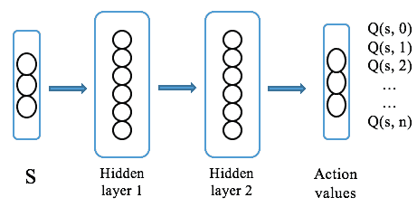

您将回忆起 Q 学习是一种离线学习算法，并且它根据以下方程更新 Q 函数：

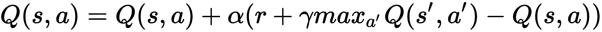

在这里，*s'* 是在状态 *s* 中采取动作 *a* 后得到的结果状态；*r* 是相关的奖励；α 是学习率；γ 是折扣因子。同时，![] 表示行为策略是贪婪的，其中在状态 *s'* 中选择最高的 Q 值以生成学习数据。类似地，DQN 学习以最小化以下误差项：

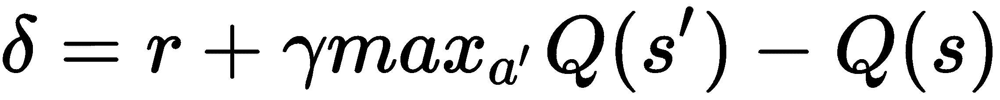

现在，目标变成寻找最佳网络模型以最好地逼近每个可能动作的状态值函数 *Q(s, a)*。在这种情况下，我们试图最小化的损失函数类似于回归问题中的均方误差，即实际值和估计值之间的均方误差。

现在，我们将开发一个 DQN 模型来解决 Mountain Car（[`gym.openai.com/envs/MountainCar-v0/`](https://gym.openai.com/envs/MountainCar-v0/)）问题。

# 怎么做……

我们使用 DQN 开发深度 Q 学习如下：

1.  导入所有必要的包：

```py
>>> import gym
>>> import torch
>>> from torch.autograd import Variable
>>> import random
```

变量包装了一个张量并支持反向传播。

1.  让我们从 `DQN` 类的 `__init__` 方法开始：

```py
>>> class DQN():
 ...     def __init__(self, n_state, n_action, n_hidden=50, 
                     lr=0.05):
 ...         self.criterion = torch.nn.MSELoss()
 ...         self.model = torch.nn.Sequential(
 ...                         torch.nn.Linear(n_state, n_hidden),
 ...                         torch.nn.ReLU(),
 ...                         torch.nn.Linear(n_hidden, n_action)
 ...                 )
 ...         self.optimizer = torch.optim.Adam( self.model.parameters(), lr)
```

1.  现在我们开发训练方法，用于更新神经网络与数据点：

```py
>>>     def update(self, s, y):
 ...         """
 ...         Update the weights of the DQN given a training sample
 ...         @param s: state
 ...         @param y: target value
 ...         """
 ...         y_pred = self.model(torch.Tensor(s))
 ...         loss = self.criterion(y_pred, 
                         Variable(torch.Tensor(y)))
 ...         self.optimizer.zero_grad()
 ...         loss.backward()
 ...         self.optimizer.step()
```

1.  接下来是给定状态预测每个动作的状态值：

```py
>>>     def predict(self, s):
 ...     """
 ...     Compute the Q values of the state for all 
              actions using the learning model
 ...     @param s: input state
 ...     @return: Q values of the state for all actions
 ...     """
 ...     with torch.no_grad():
 ...          return self.model(torch.Tensor(s))
```

这就是 `DQN` 类的全部内容！现在我们可以继续开发学习算法了。

1.  我们开始创建一个 Mountain Car 环境：

```py
>>> env = gym.envs.make("MountainCar-v0")
```

1.  然后，我们定义 epsilon-greedy 策略：

```py
>>> def gen_epsilon_greedy_policy(estimator, epsilon, n_action):
 ...     def policy_function(state):
 ...         if random.random() < epsilon:
 ...             return random.randint(0, n_action - 1)
 ...         else:
 ...             q_values = estimator.predict(state)
 ...             return torch.argmax(q_values).item()
 ...     return policy_function
```

1.  现在，使用 DQN 定义深度 Q 学习算法：

```py
>>> def q_learning(env, estimator, n_episode, gamma=1.0,
                   epsilon=0.1, epsilon_decay=.99):
 ...     """
 ...     Deep Q-Learning using DQN
 ...     @param env: Gym environment
 ...     @param estimator: Estimator object
 ...     @param n_episode: number of episodes
 ...     @param gamma: the discount factor
 ...     @param epsilon: parameter for epsilon_greedy
 ...     @param epsilon_decay: epsilon decreasing factor
 ...     """
 ...     for episode in range(n_episode):
 ...         policy = gen_epsilon_greedy_policy( estimator, epsilon, n_action)
 ...         state = env.reset()
 ...         is_done = False
 ...         while not is_done:
 ...             action = policy(state)
 ...             next_state, reward, is_done, _ = env.step(action)
 ...             total_reward_episode[episode] += reward
 ...             modified_reward = next_state[0] + 0.5
 ...             if next_state[0] >= 0.5:
 ...                 modified_reward += 100
 ...             elif next_state[0] >= 0.25:
 ...                 modified_reward += 20
 ...             elif next_state[0] >= 0.1:
 ...                 modified_reward += 10
 ...             elif next_state[0] >= 0:
 ...                 modified_reward += 5
 ...
 ...             q_values = estimator.predict(state).tolist()
 ...
 ...             if is_done:
 ...                 q_values[action] = modified_reward
 ...                 estimator.update(state, q_values)
 ...                 break
 ...             q_values_next = estimator.predict(next_state)
 ...             q_values[action] = modified_reward + gamma * 
                             torch.max(q_values_next).item()
 ...             estimator.update(state, q_values)
 ...             state = next_state
 ...         print('Episode: {}, total reward: {}, epsilon: 
                     {}'.format(episode,
                     total_reward_episode[episode], epsilon))
 ...         epsilon = max(epsilon * epsilon_decay, 0.01)
```

1.  然后，我们指定隐藏层的大小和学习率，并相应地创建一个 `DQN` 实例：

```py
 >>> n_state = env.observation_space.shape[0]
 >>> n_action = env.action_space.n
 >>> n_hidden = 50
 >>> lr = 0.001
 >>> dqn = DQN(n_state, n_action, n_hidden, lr)
```

1.  接下来，我们使用刚开发的 DQN 进行 1,000 个回合的深度 Q 学习，并且还跟踪每个回合的总（原始）奖励：

```py
>>> n_episode = 1000
>>> total_reward_episode = [0] * n_episode
>>> q_learning(env, dqn, n_episode, gamma=.99, epsilon=.3)
 Episode: 0, total reward: -200.0, epsilon: 0.3
 Episode: 1, total reward: -200.0, epsilon: 0.297
 Episode: 2, total reward: -200.0, epsilon: 0.29402999999999996
 ……
 ……
 Episode: 993, total reward: -177.0, epsilon: 0.01
 Episode: 994, total reward: -200.0, epsilon: 0.01
 Episode: 995, total reward: -172.0, epsilon: 0.01
 Episode: 996, total reward: -200.0, epsilon: 0.01
 Episode: 997, total reward: -200.0, epsilon: 0.01
 Episode: 998, total reward: -173.0, epsilon: 0.01
 Episode: 999, total reward: -200.0, epsilon: 0.01
```

1.  现在，让我们展示随时间变化的回合奖励图：

```py
>>> import matplotlib.pyplot as plt
>>> plt.plot(total_reward_episode)
>>> plt.title('Episode reward over time')
>>> plt.xlabel('Episode')
>>> plt.ylabel('Total reward')
>>> plt.show()
```

# 工作原理是...

在 *Step 2* 中，`DQN` 类接受四个参数：输入状态数和输出动作数，隐藏节点数（我们这里只使用一个隐藏层作为示例），以及学习率。它初始化一个具有一个隐藏层的神经网络，并使用 ReLU 激活函数。它接收 `n_state` 个单位并生成一个 `n_action` 的输出，这些是各个动作的预测状态值。一个优化器 Adam 与每个线性模型一起初始化。损失函数是均方误差。

*Step 3* 用于更新网络：给定一个训练数据点，使用预测结果和目标值计算损失和梯度。然后通过反向传播更新神经网络模型。

在 *Step 7* 中，深度 Q 学习函数执行以下任务：

+   在每个回合中，创建一个 epsilon-greedy 策略，其中 epsilon 的因子衰减到 99%（例如，如果第一个回合中的 epsilon 是 0.1，则第二个回合中将为 0.099）。我们还将 0.01 设置为较低的 epsilon 限制。

+   运行一个回合：在状态 *s* 的每一步中，根据 epsilon-greedy 策略选择动作 *a*；然后，使用 DQN 的 `predict` 方法计算上一个状态的 *Q* 值 `q_value`。

+   计算新状态 *s'* 的 *Q* 值 `q_values_next`；然后，通过更新旧的 *Q* 值 `q_values` 来计算目标值，用于动作的 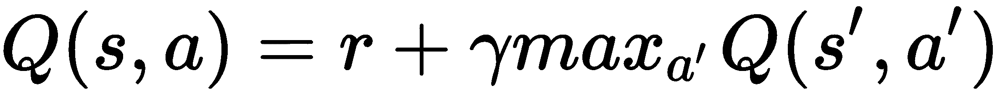。

+   使用数据点 *(s, Q(s))* 来训练神经网络。注意 *Q(s)* 包含所有动作的值。

+   运行 `n_episode` 个回合并记录每个回合的总奖励。

您可能注意到，我们在训练模型时使用了修改版奖励。它基于汽车的位置，因为我们希望它达到+0.5 的位置。而且，我们还为大于或等于+0.5、+0.25、+0.1 和 0 的位置提供分层激励。这种修改后的奖励设置区分了不同的汽车位置，并偏爱接近目标的位置；因此，与每步-1 的原始单调奖励相比，它大大加速了学习过程。

最后，在*第 10 步*，您将看到如下的结果图：

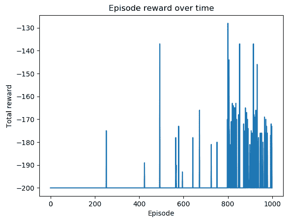

您可以看到，在最后的 200 个回合中，汽车在大约 170 到 180 步后达到山顶。

深度 Q 学习用神经网络而不是一组中间人工特征更直接地逼近状态值。给定一个步骤，其中旧状态通过采取行动转换为新状态，并接收奖励，训练 DQN 涉及以下阶段：

+   使用神经网络模型估计旧状态的*Q*值。

+   使用神经网络模型估计新状态的*Q*值。

+   使用奖励和新的*Q*值更新动作的目标 Q 值，如![]

+   注意，如果是终端状态，目标 Q 值将更新为 r。

+   使用旧状态作为输入，并将目标*Q*值作为输出训练神经网络模型。

它通过梯度下降更新网络的权重，并能预测给定状态的 Q 值。

DQN 显著减少了需要学习的状态数量，在 TD 方法中学习数百万个状态是不可行的。此外，它直接将输入状态映射到 Q 值，并不需要生成人工特征的额外函数。

# 另见

如果您对 Adam 优化器作为高级梯度下降方法不熟悉，请查看以下资料：

+   [`towardsdatascience.com/adam-latest-trends-in-deep-learning-optimization-6be9a291375c`](https://towardsdatascience.com/adam-latest-trends-in-deep-learning-optimization-6be9a291375c)

+   [`arxiv.org/abs/1412.6980`](https://arxiv.org/abs/1412.6980)

# 使用经验重播改进 DQNs

使用神经网络逐个样本逼近 Q 值的近似并不非常稳定。您将回忆起，在 FA 中，我们通过经验重播来提高稳定性。同样，在这个配方中，我们将应用经验重播到 DQNs 中。

使用经验回放，我们在训练会话的每个周期内存储代理的经验（一个经验由旧状态、新状态、动作和奖励组成）到内存队列中。每当我们积累到足够的经验时，从内存中随机抽取一批经验，并用于训练神经网络。学习经验回放分为两个阶段：积累经验和基于随机选择的过去经验更新模型。否则，模型将继续从最近的经验中学习，神经网络模型可能会陷入局部最小值。

我们将开发具有经验回放功能的 DQN 来解决山车问题。

# 如何实现...

我们将如下开发具有经验回放的 DQN：

1.  导入必要的模块并创建一个山车环境：

```py
 >>> import gym
 >>> import torch
 >>> from collections import deque
 >>> import random
 >>> from torch.autograd import Variable >>> env = gym.envs.make("MountainCar-v0")
```

1.  要添加经验回放功能，我们将在`DQN`类中添加一个`replay`方法：

```py
>>> def replay(self, memory, replay_size, gamma):
 ...     """
 ...     Experience replay
 ...     @param memory: a list of experience
 ...     @param replay_size: the number of samples we use to 
             update the model each time
 ...     @param gamma: the discount factor
 ...     """
 ...     if len(memory) >= replay_size:
 ...         replay_data = random.sample(memory, replay_size)
 ...         states = []
 ...         td_targets = []
 ...         for state, action, next_state, reward, 
                                     is_done in replay_data:
 ...             states.append(state)
 ...             q_values = self.predict(state).tolist()
 ...             if is_done:
 ...                 q_values[action] = reward
 ...             else:
 ...                 q_values_next = self.predict(next_state)
 ...                 q_values[action] = reward + gamma * 
                         torch.max(q_values_next).item()
 ...             td_targets.append(q_values)
 ...
 ...         self.update(states, td_targets)
```

`DQN`类的其余部分保持不变。

1.  我们将重用我们在*开发深度 Q 网络*配方中开发的`gen_epsilon_greedy_policy`函数，这里不再重复。

1.  然后，我们指定神经网络的形状，包括输入的大小、输出和隐藏层的大小，将学习率设置为 0.001，并相应地创建一个 DQN：

```py
 >>> n_state = env.observation_space.shape[0]
 >>> n_action = env.action_space.n
 >>> n_hidden = 50
 >>> lr = 0.001
 >>> dqn = DQN(n_state, n_action, n_hidden, lr)
```

1.  接下来，我们定义存储经验的缓冲区：

```py
>>> memory = deque(maxlen=10000)
```

如果队列中的样本超过`10000`个，则将新样本附加到队列中，并删除旧样本。

1.  现在，我们定义执行经验回放的深度 Q 学习函数：

```py
>>> def q_learning(env, estimator, n_episode, replay_size, 
             gamma=1.0, epsilon=0.1, epsilon_decay=.99):
 ...     """
 ...     Deep Q-Learning using DQN, with experience replay
 ...     @param env: Gym environment
 ...     @param estimator: Estimator object
 ...     @param replay_size: the number of samples we use to 
                 update the model each time
 ...     @param n_episode: number of episodes
 ...     @param gamma: the discount factor
 ...     @param epsilon: parameter for epsilon_greedy
 ...     @param epsilon_decay: epsilon decreasing factor
 ...     """
 ...     for episode in range(n_episode):
 ...         policy = gen_epsilon_greedy_policy( estimator, epsilon, n_action)
 ...         state = env.reset()
 ...         is_done = False
 ...         while not is_done:
 ...             action = policy(state)
 ...             next_state, reward, is_done, _ = env.step(action)
 ...             total_reward_episode[episode] += reward
 ...             modified_reward = next_state[0] + 0.5
 ...             if next_state[0] >= 0.5:
 ...                 modified_reward += 100
 ...             elif next_state[0] >= 0.25:
 ...                 modified_reward += 20
 ...             elif next_state[0] >= 0.1:
 ...                 modified_reward += 10
 ...             elif next_state[0] >= 0:
 ...                 modified_reward += 5
 ...             memory.append((state, action, next_state, 
                               modified_reward, is_done))
 ...             if is_done:
 ...                 break
 ...             estimator.replay(memory, replay_size, gamma)
 ...             state = next_state
 ...         print('Episode: {}, total reward: {}, epsilon: 
             {}'.format(episode, total_reward_episode[episode],
              epsilon))
 ...         epsilon = max(epsilon * epsilon_decay, 0.01)
```

1.  然后，我们为`600`个周期执行具有经验回放的深度 Q 学习：

```py
>>> n_episode = 600
```

我们将`20`设置为每步的重放样本大小：

```py
>>> replay_size = 20
```

我们还跟踪每个周期的总奖励：

```py
 >>> total_reward_episode = [0] * n_episode
 >>> q_learning(env, dqn, n_episode, replay_size, gamma=.9, epsilon=.3)
```

1.  现在，是时候显示随时间变化的周期奖励图了：

```py
 >>> import matplotlib.pyplot as plt
 >>> plt.plot(total_reward_episode)
 >>> plt.title('Episode reward over time')
 >>> plt.xlabel('Episode')
 >>> plt.ylabel('Total reward')
 >>> plt.show()
```

# 工作原理...

在*第 2 步*中，经验回放函数首先随机选择`replay_size`个经验样本。然后，将每个经验转换为由输入状态和输出目标值组成的训练样本。最后，使用选定的批量更新神经网络。

在*第 6 步*中，执行具有经验回放的深度 Q 学习，包括以下任务：

+   在每个周期中，创建一个带有衰减到 99%的ε贪婪策略。

+   运行一个周期：在每一步中，根据ε-贪婪策略选择一个动作*a*；将这一经验（旧状态、动作、新状态、奖励）存储在内存中。

+   在每一步中，进行经验回放来训练神经网络，前提是我们有足够的训练样本可以随机选择。

+   运行`n_episode`个周期，并记录每个周期的总奖励。

执行*第 8 步*中的代码行将产生以下图表：

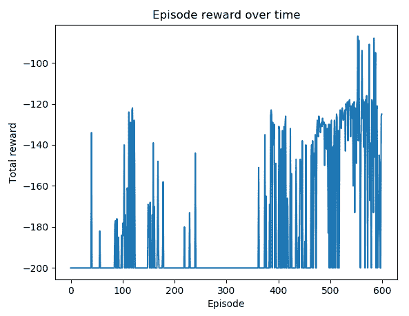

您可以看到，在最后 200 个周期的大多数周期中，车在大约 120 到 160 步内达到了山顶。

在深度 Q 学习中，经验重放意味着我们为每一步存储代理的经验，并随机抽取过去经验的一些样本来训练 DQN。 在这种情况下，学习分为两个阶段：积累经验和基于过去经验批次更新模型。 具体而言，经验（也称为**缓冲区**或**内存**）包括过去的状态、采取的动作、获得的奖励和下一个状态。 经验重放可以通过提供一组低相关性的样本来稳定训练，从而增加学习效率。

# 开发双深度 Q 网络

在我们迄今开发的深度 Q 学习算法中，同一个神经网络用于计算预测值和目标值。 这可能导致很多发散，因为目标值不断变化，而预测必须追赶它。 在这个配方中，我们将开发一种新的算法，使用两个神经网络代替一个。

在**双重 DQN**中，我们使用一个单独的网络来估计目标，而不是预测网络。 这个单独的网络与预测网络具有相同的结构。 其权重在每个*T*集后固定（*T*是我们可以调整的超参数），这意味着它们仅在每个*T*集后更新。 更新是通过简单地复制预测网络的权重来完成的。 这样，目标函数在一段时间内保持不变，从而导致更稳定的训练过程。

数学上，双重 DQN 被训练来最小化以下误差项：

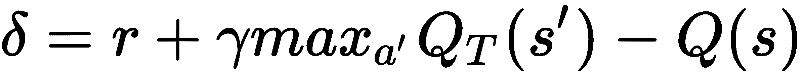

在这里，*s'*是采取行动*a*后的结果状态，*r*是相关的奖励；α是学习率；γ是折扣因子。 另外，![]是目标网络的函数，而 Q 是预测网络的函数。

现在让我们使用双重 DQN 来解决 Mountain Car 问题。

# 如何做…

我们按以下方式开发使用双重 DQN 的深度 Q 学习：

1.  导入必要的模块并创建一个 Mountain Car 环境：

```py
 >>> import gym
 >>> import torch
 >>> from collections import deque
 >>> import random
 >>> import copy
 >>> from torch.autograd import Variable >>> env = gym.envs.make("MountainCar-v0")
```

1.  在经验重放阶段，为了整合目标网络，我们首先在`DQN`类的`__init__`方法中对其进行初始化：

```py
>>> class DQN():
 ...     def __init__(self, n_state, n_action, 
                     n_hidden=50, lr=0.05):
 ...         self.criterion = torch.nn.MSELoss()
 ...         self.model = torch.nn.Sequential(
 ...                         torch.nn.Linear(n_state, n_hidden),
 ...                         torch.nn.ReLU(),
 ...                         torch.nn.Linear(n_hidden, n_action)
 ...                 )
 ...         self.optimizer = torch.optim.Adam( self.model.parameters(), lr)
 ...         self.model_target = copy.deepcopy(self.model)
```

目标网络与预测网络具有相同的结构。

1.  因此，我们添加了使用目标网络计算值的计算：

```py
>>>     def target_predict(self, s):
 ...         """
 ...         Compute the Q values of the state for all actions 
             using the target network
 ...         @param s: input state
 ...         @return: targeted Q values of the state for all actions
 ...         """
 ...         with torch.no_grad():
 ...             return self.model_target(torch.Tensor(s))
```

1.  我们还添加了同步目标网络权重的方法：

```py
>>>     def copy_target(self):
 ...         self.model_target.load_state_dict(self.model.state_dict())
```

1.  在经验重放中，我们使用目标网络来计算目标值，而不是预测网络：

```py
>>>     def replay(self, memory, replay_size, gamma):
 ...         """
 ...         Experience replay with target network
 ...         @param memory: a list of experience
 ...         @param replay_size: the number of samples 
             we use to update the model each time
 ...         @param gamma: the discount factor
 ...         """
 ...         if len(memory) >= replay_size:
 ...             replay_data = random.sample(memory, replay_size)
 ...             states = []
 ...             td_targets = []
 ...             for state, action, next_state, reward, is_done 
                                                 in replay_data:
 ...                 states.append(state)
 ...                 q_values = self.predict(state).tolist()
 ...                 if is_done:
 ...                     q_values[action] = reward
 ...                 else:
 ...                     q_values_next = self.target_predict( next_state).detach()
 ...                     q_values[action] = reward + gamma * 
                             torch.max(q_values_next).item()
 ...
 ...                 td_targets.append(q_values)
 ...
 ...             self.update(states, td_targets)
```

`DQN` 类的其余部分保持不变。

1.  我们将重用我们在《深度 Q 网络开发》配方中开发的`gen_epsilon_greedy_policy`函数，并且这里不会重复它。

1.  然后我们指定神经网络的形状，包括输入的大小、输出和隐藏层的大小，将`0.01`作为学习率，并相应地创建一个 DQN：

```py
 >>> n_state = env.observation_space.shape[0]
 >>> n_action = env.action_space.n
 >>> n_hidden = 50
 >>> lr = 0.01
 >>> dqn = DQN(n_state, n_action, n_hidden, lr)
```

1.  接下来，我们定义保存经验的缓冲区：

```py
>>> memory = deque(maxlen=10000)
```

只要队列中有超过`10000`个样本，新样本将被追加到队列中，并移除旧样本。

1.  现在，让我们开发双 DQN 的深度 Q 学习：

```py
>>> def q_learning(env, estimator, n_episode, replay_size, 
         target_update=10, gamma=1.0, epsilon=0.1,
         epsilon_decay=.99):
 ...     """
 ...     Deep Q-Learning using double DQN, with experience replay
 ...     @param env: Gym environment
 ...     @param estimator: DQN object
 ...     @param replay_size: number of samples we use 
             to update the model each time
 ...     @param target_update: number of episodes before 
             updating the target network
 ...     @param n_episode: number of episodes
 ...     @param gamma: the discount factor
 ...     @param epsilon: parameter for epsilon_greedy
 ...     @param epsilon_decay: epsilon decreasing factor
 ...     """
 ...     for episode in range(n_episode):
 ...         if episode % target_update == 0:
 ...             estimator.copy_target()
 ...         policy = gen_epsilon_greedy_policy( estimator, epsilon, n_action)
 ...         state = env.reset()
 ...         is_done = False
 ...         while not is_done:
 ...             action = policy(state)
 ...             next_state, reward, is_done, _ = env.step(action)
 ...             total_reward_episode[episode] += reward
 ...             modified_reward = next_state[0] + 0.5
 ...             if next_state[0] >= 0.5:
 ...                 modified_reward += 100
 ...             elif next_state[0] >= 0.25:
 ...                 modified_reward += 20
 ...             elif next_state[0] >= 0.1:
 ...                 modified_reward += 10
 ...             elif next_state[0] >= 0:
 ...                 modified_reward += 5
 ...             memory.append((state, action, next_state, 
                             modified_reward, is_done))
 ...             if is_done:
 ...                 break
 ...             estimator.replay(memory, replay_size, gamma)
 ...             state = next_state
 ...         print('Episode: {}, total reward: {}, epsilon: {}'.format(episode, total_reward_episode[episode], epsilon))
 ...         epsilon = max(epsilon * epsilon_decay, 0.01)
```

1.  我们执行双 DQN 的深度 Q 学习，共进行`1000`个回合：

```py
>>> n_episode = 1000
```

我们将每一步的回放样本大小设置为`20`：

```py
>>> replay_size = 20
```

我们每 10 个回合更新一次目标网络：

```py
>>> target_update = 10
```

我们还会跟踪每个回合的总奖励：

```py
 >>> total_reward_episode = [0] * n_episode
 >>> q_learning(env, dqn, n_episode, replay_size, target_update, gamma=.9, epsilon=1)
 Episode: 0, total reward: -200.0, epsilon: 1
 Episode: 1, total reward: -200.0, epsilon: 0.99
 Episode: 2, total reward: -200.0, epsilon: 0.9801
 ……
 ……
 Episode: 991, total reward: -151.0, epsilon: 0.01
 Episode: 992, total reward: -200.0, epsilon: 0.01
 Episode: 993, total reward: -158.0, epsilon: 0.01
 Episode: 994, total reward: -160.0, epsilon: 0.01
 Episode: 995, total reward: -200.0, epsilon: 0.01
 Episode: 996, total reward: -200.0, epsilon: 0.01
 Episode: 997, total reward: -200.0, epsilon: 0.01
 Episode: 998, total reward: -151.0, epsilon: 0.01
 Episode: 999, total reward: -200.0, epsilon: 0.01 
```

1.  然后，我们显示随时间变化的回合奖励图：

```py
 >>> import matplotlib.pyplot as plt
 >>> plt.plot(total_reward_episode)
 >>> plt.title('Episode reward over time')
 >>> plt.xlabel('Episode')
 >>> plt.ylabel('Total reward')
 >>> plt.show()
```

# 工作原理...

在*Step 5*中，经验回放函数首先随机选择`replay_size`个样本经验。然后将每个经验转换为由输入状态和输出目标值组成的训练样本。最后，使用选定的批次更新预测网络。

*Step 9*是双 DQN 中最重要的步骤：它使用不同的网络计算目标值，然后定期更新这个网络。函数的其余部分类似于带经验回放的深度 Q 学习。

*Step 11*中的可视化函数将生成以下图表：

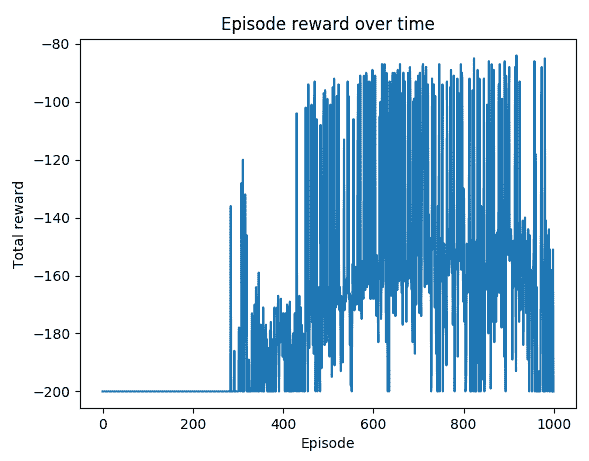

你可以看到，在大多数情况下，经过第一个**400**个回合后，小车在大约**80**到**160**步内到达山顶。

在双 DQN 的深度 Q 学习中，我们分别创建两个用于预测和目标计算的网络。第一个网络用于预测和检索*Q*值，而第二个网络用于提供稳定的目标*Q*值。并且，经过一段时间（比如每 10 个回合或 1500 个训练步骤），我们同步预测网络和目标网络。在这种双网络设置中，目标值是暂时固定的，而不是被不断修改的，因此预测网络有更稳定的目标来学习。我们获得的结果表明，双 DQN 优于单 DQN。

# 为 CartPole 调优双 DQN 超参数

在这个示例中，让我们使用双 DQN 解决 CartPole 环境。我们将展示如何调优双 DQN 的超参数以达到最佳性能。

为了调优超参数，我们可以应用**网格搜索**技术来探索一组不同的值组合，并选择表现最佳的那一组。我们可以从粗范围的值开始，并逐渐缩小范围。并且不要忘记为所有后续的随机数生成器固定种子，以确保可重现性：

+   Gym 环境随机数生成器

+   ε-贪心随机数生成器

+   PyTorch 神经网络的初始权重

# 如何做到...

我们使用双 DQN 解决 CartPole 环境如下：

1.  导入必要的模块并创建一个 CartPole 环境：

```py
 >>> import gym
 >>> import torch
 >>> from collections import deque
 >>> import random
 >>> import copy
 >>> from torch.autograd import Variable >>> env = gym.envs.make("CartPole-v0")
```

1.  我们将重用上一个*开发双深度 Q 网络*示例中开发的`DQN`类。

1.  我们将重复使用在《深度 Q 网络开发》食谱中开发的`gen_epsilon_greedy_policy`函数，并且不在这里重复。

1.  现在，我们将使用双重 DQN 开发深度 Q 学习：

```py
>>> def q_learning(env, estimator, n_episode, replay_size, 
                 target_update=10, gamma=1.0, epsilon=0.1,
                 epsilon_decay=.99):
 ...     """
 ...     Deep Q-Learning using double DQN, with experience replay
 ...     @param env: Gym environment
 ...     @param estimator: DQN object
 ...     @param replay_size: number of samples we use to 
                 update the model each time
 ...     @param target_update: number of episodes before 
                 updating the target network
 ...     @param n_episode: number of episodes
 ...     @param gamma: the discount factor
 ...     @param epsilon: parameter for epsilon_greedy
 ...     @param epsilon_decay: epsilon decreasing factor
 ...     """
 ...     for episode in range(n_episode):
 ...         if episode % target_update == 0:
 ...             estimator.copy_target()
 ...         policy = gen_epsilon_greedy_policy( estimator, epsilon, n_action)
 ...         state = env.reset()
 ...         is_done = False
 ...         while not is_done:
 ...             action = policy(state)
 ...             next_state, reward, is_done, _ = env.step(action)
 ...             total_reward_episode[episode] += reward
 ...             memory.append((state, action, 
                         next_state, reward, is_done))
 ...             if is_done:
 ...                 break
 ...             estimator.replay(memory, replay_size, gamma)
 ...             state = next_state
 ...         epsilon = max(epsilon * epsilon_decay, 0.01)
```

1.  然后，我们指定神经网络的形状，包括输入的大小、输出的大小、隐藏层的大小和周期数，以及用于评估性能的周期数：

```py
 >>> n_state = env.observation_space.shape[0]
 >>> n_action = env.action_space.n
 >>> n_episode = 600
 >>> last_episode = 200
```

1.  然后，我们为以下超参数定义了几个值，以便在网格搜索中探索：

```py
 >>> n_hidden_options = [30, 40]
 >>> lr_options = [0.001, 0.003]
 >>> replay_size_options = [20, 25]
 >>> target_update_options = [30, 35]
```

1.  最后，我们执行一个网格搜索，在每次迭代中，我们根据一组超参数创建一个 DQN，并允许其学习 600 个周期。然后，通过对最后 200 个周期的总奖励进行平均来评估其性能：

```py
>>> for n_hidden in n_hidden_options:
 ...     for lr in lr_options:
 ...         for replay_size in replay_size_options:
 ...             for target_update in target_update_options:
 ...                 env.seed(1)
 ...                 random.seed(1)
 ...                 torch.manual_seed(1)
 ...                 dqn = DQN(n_state, n_action, n_hidden, lr)
 ...                 memory = deque(maxlen=10000)
 ...                 total_reward_episode = [0] * n_episode
 ...                 q_learning(env, dqn, n_episode, replay_size, 
                         target_update, gamma=.9, epsilon=1)
 ...                 print(n_hidden, lr, replay_size, target_update, 
             sum(total_reward_episode[-last_episode:])/last_episode)
```

# 它是如何工作的...

执行了*第 7 步*后，我们得到了以下网格搜索结果：

```py
30 0.001 20 30 143.15
 30 0.001 20 35 156.165
 30 0.001 25 30 180.575
 30 0.001 25 35 192.765
 30 0.003 20 30 187.435
 30 0.003 20 35 122.42
 30 0.003 25 30 169.32
 30 0.003 25 35 172.65
 40 0.001 20 30 136.64
 40 0.001 20 35 160.08
 40 0.001 25 30 141.955
 40 0.001 25 35 122.915
 40 0.003 20 30 143.855
 40 0.003 20 35 178.52
 40 0.003 25 30 125.52
 40 0.003 25 35 178.85
```

我们可以看到，通过`n_hidden=30`、`lr=0.001`、`replay_size=25`和`target_update=35`的组合，我们获得了最佳的平均奖励，`192.77`。

随意进一步微调超参数，以获得更好的 DQN 模型。

在这个食谱中，我们使用双重 DQNs 解决了 CartPole 问题。我们使用网格搜索对超参数的值进行了微调。在我们的示例中，我们优化了隐藏层的大小、学习率、回放批量大小和目标网络更新频率。还有其他超参数我们也可以探索，如周期数、初始 epsilon 值和 epsilon 衰减值。为了确保实验的可重复性和可比性，我们保持了随机种子固定，使得 Gym 环境的随机性、epsilon-greedy 动作以及神经网络的权重初始化保持不变。每个 DQN 模型的性能是通过最后几个周期的平均总奖励来衡量的。

# 开发对抗深度 Q 网络

在这个食谱中，我们将开发另一种高级 DQN 类型，**对抗 DQNs**（**DDQNs**）。特别是，我们将看到在 DDQNs 中如何将 Q 值的计算分为两部分。

在 DDQNs 中，Q 值由以下两个函数计算：

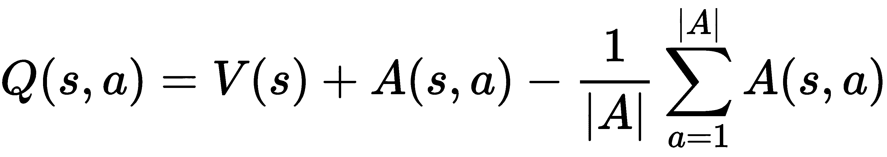

在这里，*V(s)*是状态值函数，计算处于状态*s*时的值；*A(s, a)*是状态相关的动作优势函数，估计采取动作*a*相比于在状态*s*下采取其他动作更好多少。通过解耦`value`和`advantage`函数，我们能够适应我们的代理在学习过程中可能不一定同时查看值和优势的事实。换句话说，使用 DDQNs 的代理可以根据其偏好有效地优化任一或两个函数。

# 如何做...

我们使用 DDQNs 解决 Mountain Car 问题如下：

1.  导入必要的模块并创建一个 Mountain Car 环境：

```py
 >>> import gym
 >>> import torch
 >>> from collections import deque
 >>> import random
 >>> from torch.autograd import Variable
 >>> import torch.nn as nn >>> env = gym.envs.make("MountainCar-v0")
```

1.  接下来，我们按以下方式定义 DDQN 模型：

```py
>>> class DuelingModel(nn.Module):
 ...     def __init__(self, n_input, n_output, n_hidden):
 ...         super(DuelingModel, self).__init__()
 ...         self.adv1 = nn.Linear(n_input, n_hidden)
 ...         self.adv2 = nn.Linear(n_hidden, n_output)
 ...         self.val1 = nn.Linear(n_input, n_hidden)
 ...         self.val2 = nn.Linear(n_hidden, 1)
 ...
 ...     def forward(self, x):
 ...         adv = nn.functional.relu(self.adv1(x))
 ...         adv = self.adv2(adv)
 ...         val = nn.functional.relu(self.val1(x))
 ...         val = self.val2(val)
 ...         return val + adv - adv.mean()
```

1.  因此，我们在`DQN`类中使用 DDQN 模型：

```py
>>> class DQN():
 ...     def __init__(self, n_state, n_action, n_hidden=50, lr=0.05):
 ...         self.criterion = torch.nn.MSELoss()
 ...         self.model = DuelingModel(n_state, n_action, n_hidden)
 ...         self.optimizer = torch.optim.Adam(self.model.parameters(), lr)
```

`DQN`类的其余部分保持不变。

1.  我们将重复使用我们在*开发深度 Q-Networks*配方中开发的`gen_epsilon_greedy_policy`函数，并且这里不会重复。

1.  我们将重复使用我们在*通过经验重播改进 DQNs*配方中开发的`q_learning`函数，并且这里不会重复。

1.  我们然后指定神经网络的形状，包括输入的大小，输出和隐藏层，将`0.001`设置为学习率，并相应创建一个 DQN 模型：

```py
 >>> n_state = env.observation_space.shape[0]
 >>> n_action = env.action_space.n
 >>> n_hidden = 50
 >>> lr = 0.001
 >>> dqn = DQN(n_state, n_action, n_hidden, lr)
```

1.  接下来，我们定义保存经验的缓冲区：

```py
>>> memory = deque(maxlen=10000)
```

新样本将被添加到队列中，并且只要队列中有超过`10000`个样本，旧样本就会被删除。

1.  然后，我们执行包含 DDQN 的 Deep Q-learning，进行了`600`个剧集：

```py
>>> n_episode = 600
```

我们将每步设置为`20`作为回放样本大小：

```py
>>> replay_size = 20
```

我们还会跟踪每一集的总奖励：

```py
 >>> total_reward_episode = [0] * n_episode
 >>> q_learning(env, dqn, n_episode, replay_size, gamma=.9,
 epsilon=.3)
```

1.  现在，我们可以显示随时间变化的剧集奖励的绘图：

```py
 >>> import matplotlib.pyplot as plt
 >>> plt.plot(total_reward_episode)
 >>> plt.title('Episode reward over time')
 >>> plt.xlabel('Episode')
 >>> plt.ylabel('Total reward')
 >>> plt.show()
```

# 工作原理...

*Step 2*是 Dueling DQN 的核心部分。它由两部分组成，动作**优势**（**adv**）和**状态值**（**val**）。同样，我们使用一个隐藏层作为示例。

执行*Step 9*将导致以下绘图：

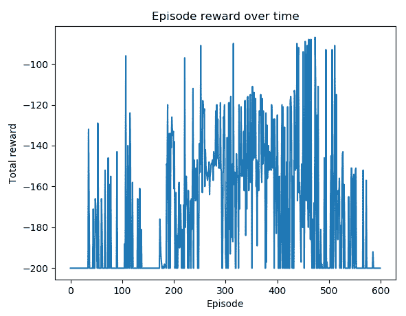

在 DDQNs 中，预测的 Q 值由两个元素组成：状态值和动作优势。第一个估计在某个状态下的表现有多好。第二个指示相比其他选择，采取特定动作有多好。这两个元素分别计算并结合到 DQN 的最后一层。您将记得，传统的 DQNs 只更新给定状态下某个动作的 Q 值。DDQNs 更新所有动作（而不仅仅是给定动作）可以利用的状态值，以及动作的优势。因此，认为 DDQNs 更加稳健。

# 将 Deep Q-Networks 应用于 Atari 游戏

到目前为止，我们处理的问题相当简单，有时应用 DQNs 可能有点过头了。在这个和下一个配方中，我们将使用 DQNs 来解决 Atari 游戏，这些游戏问题要复杂得多。

我们将在这个配方中以 Pong ([`gym.openai.com/envs/Pong-v0/`](https://gym.openai.com/envs/Pong-v0/))为例。它模拟了 Atari 2600 游戏 Pong，代理与另一玩家打乒乓球。这个环境的观察是屏幕的 RGB 图像（参考下面的截图）：

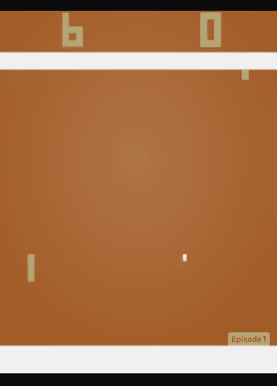

这是一个形状为（210，160，3）的矩阵，意味着图像的大小为*210 * 160*，有三个 RGB 通道。

代理（右侧）在比赛中上下移动以击打球。如果错过了，另一名玩家（左侧）将获得 1 分；同样，如果另一名玩家错过了球，代理将获得 1 分。比赛的胜者是首先得到 21 分的人。代理可以在 Pong 环境中采取以下 6 种可能的动作：

+   **0: NOOP**: 代理保持静止

+   **1: FIRE**: 不是一个有意义的动作

+   **2: RIGHT**: 代理向上移动

+   **3: LEFT**: 代理向下移动

+   **4: RIGHTFIRE**: 与 2 相同

+   **5: LEFTFIRE**: 与 5 相同

每个动作都会在*k*帧的持续时间内重复执行（*k*可以是 2、3、4 或 16，取决于 Pong 环境的具体变体）。奖励可以是以下任意一种：

+   *-1*: 代理错过球。

+   *1*: 对手错过球。

+   *0*: 否则。

Pong 中的观察空间*210 * 160 * 3*比我们通常处理的要大得多。因此，我们将把图像缩小到*84 * 84*并转换为灰度，然后使用 DQNs 来解决它。

# 怎么做…

我们将从以下内容开始探索 Pong 环境：

1.  导入必要的模块并创建一个 Pong 环境：

```py
 >>> import gym
 >>> import torch
 >>> import random >>> env = gym.envs.make("PongDeterministic-v4")
```

在这个 Pong 环境的变体中，一个动作是确定性的，并且在 16 帧的持续时间内重复执行。

1.  查看观察空间和动作空间：

```py
 >>> state_shape = env.observation_space.shape
 >>> n_action = env.action_space.n
 >>> print(state_shape)
 (210, 160, 3)
 >>> print(n_action)
 6
 >>> print(env.unwrapped.get_action_meanings())
 ['NOOP', 'FIRE', 'RIGHT', 'LEFT', 'RIGHTFIRE', 'LEFTFIRE']
```

1.  指定三个动作：

```py
 >>> ACTIONS = [0, 2, 3]
 >>> n_action = 3
```

这些动作分别是不移动、向上移动和向下移动。

1.  让我们采取随机动作并渲染屏幕：

```py
 >>> env.reset()
 >>> is_done = False
 >>> while not is_done:
 ...     action = ACTIONS[random.randint(0, n_action - 1)]
 ...     obs, reward, is_done, _ = env.step(action)
 ...     print(reward, is_done)
 ...     env.render()
 0.0 False
 0.0 False
 0.0 False
 ……
 ……
 0.0 False
 0.0 False
 0.0 False
 -1.0 True
```

您将在屏幕上看到两名玩家在打乒乓球，即使代理正在输。

1.  现在，我们开发一个屏幕处理函数来缩小图像并将其转换为灰度：

```py
 >>> import torchvision.transforms as T
 >>> from PIL import Image
 >>> image_size = 84
 >>> transform = T.Compose([T.ToPILImage(),
 ...                        T.Grayscale(num_output_channels=1),
 ...                        T.Resize((image_size, image_size),
                                 interpolation=Image.CUBIC),
 ...                        T.ToTensor(),
 ...                        ])
```

现在，我们只需定义一个调整图像大小至*84 * 84*的调整器：

```py
 >>> def get_state(obs):
 ...     state = obs.transpose((2, 0, 1))
 ...     state = torch.from_numpy(state)
 ...     state = transform(state)
 ...     return state
```

此函数将调整大小后的图像重塑为大小为(1, 84, 84)：

```py
 >>> state = get_state(obs)
 >>> print(state.shape)
 torch.Size([1, 84, 84])
```

现在，我们可以使用双 DQNs 开始解决环境，如下所示：

1.  这次我们将使用一个较大的神经网络，有两个隐藏层，因为输入大小约为 21,000：

```py
 >>> from collections import deque 
 >>> import copy
 >>> from torch.autograd import Variable
 >>> class DQN():
 ...     def __init__(self, n_state, n_action, n_hidden, lr=0.05):
 ...         self.criterion = torch.nn.MSELoss()
 ...         self.model = torch.nn.Sequential(
 ...                  torch.nn.Linear(n_state, n_hidden[0]),
 ...                  torch.nn.ReLU(),
 ...                  torch.nn.Linear(n_hidden[0], n_hidden[1]),
 ...                  torch.nn.ReLU(),
 ...                  torch.nn.Linear(n_hidden[1], n_action)
 ...                  )
 ...         self.model_target = copy.deepcopy(self.model)
 ...         self.optimizer = torch.optim.Adam( self.model.parameters(), lr)
```

1.  `DQN`类的其余部分与*Developing double deep Q-networks*食谱中的一样，只是对`replay`方法进行了小的更改：

```py
>>> def replay(self, memory, replay_size, gamma):
 ...     """
 ...     Experience replay with target network
 ...     @param memory: a list of experience
 ...     @param replay_size: the number of samples we use 
                         to update the model each time
 ...     @param gamma: the discount factor
 ...     """
 ...     if len(memory) >= replay_size:
 ...         replay_data = random.sample(memory, replay_size)
 ...         states = []
 ...         td_targets = []
 ...         for state, action, next_state, reward, 
                                 is_done in replay_data:
 ...             states.append(state.tolist())
 ...             q_values = self.predict(state).tolist()
 ...             if is_done:
 ...                 q_values[action] = reward
 ...             else:
 ...                 q_values_next = self.target_predict( next_state).detach()
 ...                 q_values[action] = reward + gamma * 
                         torch.max(q_values_next).item()
 ...             td_targets.append(q_values)
 ...         self.update(states, td_targets)
```

1.  我们将重复使用我们在*Developing Deep Q-Networks*食谱中开发的`gen_epsilon_greedy_policy`函数，并且这里不再重复。

1.  现在，我们将开发带有双 DQN 的深度 Q 学习：

```py
>>> def q_learning(env, estimator, n_episode, replay_size, 
             target_update=10, gamma=1.0, epsilon=0.1,
             epsilon_decay=.99):
 ...     """
 ...     Deep Q-Learning using double DQN, with experience replay
 ...     @param env: Gym environment
 ...     @param estimator: DQN object
 ...     @param replay_size: number of samples we use to 
                             update the model each time
 ...     @param target_update: number of episodes before 
                             updating the target network
 ...     @param n_episode: number of episodes
 ...     @param gamma: the discount factor
 ...     @param epsilon: parameter for epsilon_greedy
 ...     @param epsilon_decay: epsilon decreasing factor
 ...     """
 ...     for episode in range(n_episode):
 ...         if episode % target_update == 0:
 ...             estimator.copy_target()
 ...         policy = gen_epsilon_greedy_policy( estimator, epsilon, n_action)
 ...         obs = env.reset()
 ...         state = get_state(obs).view(image_size * image_size)[0]
 ...         is_done = False
 ...         while not is_done:
 ...             action = policy(state)
 ...             next_obs, reward, is_done, _ = 
                                 env.step(ACTIONS[action])
 ...             total_reward_episode[episode] += reward
 ...             next_state = get_state(obs).view( image_size * image_size)
 ...             memory.append((state, action, next_state, 
                                 reward, is_done))
 ...             if is_done:
 ...                 break
 ...             estimator.replay(memory, replay_size, gamma)
 ...             state = next_state
 ...         print('Episode: {}, total reward: {}, epsilon: 
             {}'.format(episode, total_reward_episode[episode],
             epsilon))
 ...         epsilon = max(epsilon * epsilon_decay, 0.01)
```

给定大小为*[210, 160, 3]*的观察结果，将其转换为更小尺寸的灰度矩阵*[84, 84]*并将其扁平化，以便我们可以将其馈送到我们的网络中。

1.  现在，我们指定神经网络的形状，包括输入和隐藏层的大小：

```py
 >>> n_state = image_size * image_size
 >>> n_hidden = [200, 50]
```

剩余的超参数如下：

```py
 >>> n_episode = 1000
 >>> lr = 0.003
 >>> replay_size = 32
 >>> target_update = 10
```

现在，我们相应地创建一个 DQN：

```py
>>> dqn = DQN(n_state, n_action, n_hidden, lr)
```

1.  接下来，我们定义保存经验的缓冲区：

```py
>>> memory = deque(maxlen=10000)
```

1.  最后，我们执行深度 Q 学习，并跟踪每个 episode 的总奖励：

```py
 >>> total_reward_episode = [0] * n_episode
 >>> q_learning(env, dqn, n_episode, replay_size, target_update, gamma=.9, epsilon=1)
```

# 它是如何工作的…

Pong 中的观察情况比本章中迄今为止我们处理过的环境复杂得多。它是一个 *210 * 160* 屏幕尺寸的三通道图像。因此，我们首先将其转换为灰度图像，将其缩小为 *84 * 84*，然后展平，以便馈送到全连接神经网络中。由于输入维度约为 6000，我们使用两个隐藏层来适应复杂性。

# 在 Atari 游戏中使用卷积神经网络

在上一篇文章中，我们将 Pong 环境中的每个观察图像视为灰度数组，并将其馈送到全连接神经网络中。将图像展平可能会导致信息丢失。为什么不直接使用图像作为输入呢？在这篇文章中，我们将**卷积神经网络**（**CNNs**）集成到 DQN 模型中。

CNN 是处理图像输入的最佳神经网络架构之一。在 CNN 中，卷积层能够有效地从图像中提取特征，这些特征将传递给下游的全连接层。下图展示了一个具有两个卷积层的 CNN 示例：

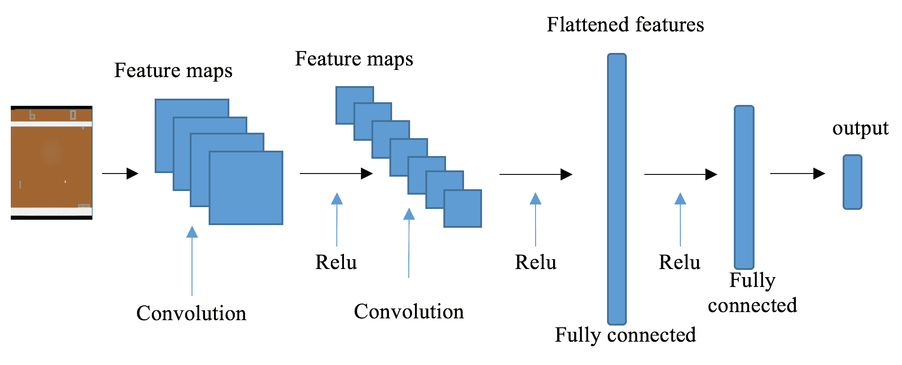

正如你可以想象的，如果我们简单地将图像展平成一个向量，我们将丢失一些关于球和两名玩家位置的信息。这些信息对于模型学习至关重要。在 CNN 中的卷积操作中，多个滤波器生成的一组特征映射可以捕捉到这些信息。

再次，我们将图像从 *210 * 160* 缩小到 *84 * 84*，但这次保留三个 RGB 通道，而不是将它们展平成数组。

# 怎么做...

让我们使用基于 CNN 的 DQN 来解决 Pong 环境，如下所示：

1.  导入必要的模块并创建 Pong 环境：

```py
 >>> import gym
 >>> import torch
 >>> import random >>> from collections import deque
 >>> import copy
 >>> from torch.autograd import Variable
 >>> import torch.nn as nn
 >>> import torch.nn.functional as F
 >>> env = gym.envs.make("PongDeterministic-v4")
```

1.  然后，我们指定三个动作：

```py
 >>> ACTIONS = [0, 2, 3]
 >>> n_action = 3
```

这些动作是不动、向上移动和向下移动。

1.  现在，我们开发一个图像处理函数来缩小图像：

```py
 >>> import torchvision.transforms as T
 >>> from PIL import Image
 >>> image_size = 84
 >>> transform = T.Compose([T.ToPILImage(),
 ...                        T.Resize((image_size, image_size), 
                              interpolation=Image.CUBIC),
 ...                        T.ToTensor()])
```

现在，我们定义一个调整器，将图像缩小为 *84 * 84*，然后将图像重塑为 (*3, 84, 84*)：

```py
>>> def get_state(obs):
 ...     state = obs.transpose((2, 0, 1))
 ...     state = torch.from_numpy(state)
 ...     state = transform(state).unsqueeze(0)
 ...     return state
```

1.  现在，我们开始通过开发 CNN 模型来解决 Pong 环境：

```py
>>> class CNNModel(nn.Module):
 ...     def __init__(self, n_channel, n_action):
 ...         super(CNNModel, self).__init__()
 ...         self.conv1 = nn.Conv2d(in_channels=n_channel, 
                     out_channels=32, kernel_size=8, stride=4)
 ...         self.conv2 = nn.Conv2d(32, 64, 4, stride=2)
 ...         self.conv3 = nn.Conv2d(64, 64, 3, stride=1)
 ...         self.fc = torch.nn.Linear(7 * 7 * 64, 512)
 ...         self.out = torch.nn.Linear(512, n_action)
 ...
 ...     def forward(self, x):
 ...         x = F.relu(self.conv1(x))
 ...         x = F.relu(self.conv2(x))
 ...         x = F.relu(self.conv3(x))
 ...         x = x.view(x.size(0), -1)
 ...         x = F.relu(self.fc(x))
 ...         output = self.out(x)
 ...         return output
```

1.  现在我们将使用刚刚在我们的`DQN`模型中定义的 CNN 模型：

```py
>>> class DQN():
 ...     def __init__(self, n_channel, n_action, lr=0.05):
 ...         self.criterion = torch.nn.MSELoss()
 ...         self.model = CNNModel(n_channel, n_action)
 ...         self.model_target = copy.deepcopy(self.model)
 ...         self.optimizer = torch.optim.Adam( self.model.parameters(), lr)
```

1.  `DQN`类的其余部分与“开发双重深度 Q 网络”一章中的相同，只是`replay`方法略有改变：

```py
>>> def replay(self, memory, replay_size, gamma):
 ...     """
 ...     Experience replay with target network
 ...     @param memory: a list of experience
 ...     @param replay_size: the number of samples we use 
                         to update the model each time
 ...     @param gamma: the discount factor
 ...     """
 ...     if len(memory) >= replay_size:
 ...         replay_data = random.sample(memory, replay_size)
 ...         states = []
 ...         td_targets = []
 ...         for state, action, next_state, reward,     
                                 is_done in replay_data:
 ...             states.append(state.tolist()[0])
 ...             q_values = self.predict(state).tolist()[0]
 ...             if is_done:
 ...                 q_values[action] = reward
 ...             else:
 ...                 q_values_next = self.target_predict( next_state).detach()
 ...                 q_values[action] = reward + gamma *         
                             torch.max(q_values_next).item()
 ...             td_targets.append(q_values)
 ...         self.update(states, td_targets)
```

1.  我们将重复使用我们在“开发深度 Q 网络”一章中开发的`gen_epsilon_greedy_policy`函数，这里不再重复。

1.  现在，我们使用双重 DQN 开发深度 Q-learning：

```py
 >>> def q_learning(env, estimator, n_episode, replay_size, 
             target_update=10, gamma=1.0, epsilon=0.1,   
             epsilon_decay=.99):
 ...     """
 ...     Deep Q-Learning using double DQN, with experience replay
 ...     @param env: Gym environment
 ...     @param estimator: DQN object
 ...     @param replay_size: number of samples we use to 
                             update the model each time
 ...     @param target_update: number of episodes before 
                             updating the target network
 ...     @param n_episode: number of episodes
 ...     @param gamma: the discount factor
 ...     @param epsilon: parameter for epsilon_greedy
 ...     @param epsilon_decay: epsilon decreasing factor
 ...     """
 ...     for episode in range(n_episode):
 ...         if episode % target_update == 0:
 ...             estimator.copy_target()
 ...         policy = gen_epsilon_greedy_policy( estimator, epsilon, n_action)
 ...         obs = env.reset()
 ...         state = get_state(obs)
 ...         is_done = False
 ...         while not is_done:
 ...             action = policy(state)
 ...             next_obs, reward, is_done, _ = 
                             env.step(ACTIONS[action])
 ...             total_reward_episode[episode] += reward
 ...             next_state = get_state(obs)
 ...             memory.append((state, action, next_state, 
                                 reward, is_done))
 ...             if is_done:
 ...                 break
 ...             estimator.replay(memory, replay_size, gamma)
 ...             state = next_state
 ...         print('Episode: {}, total reward: {}, epsilon: {}' .format(episode, total_reward_episode[episode], epsilon))
 ...         epsilon = max(epsilon * epsilon_decay, 0.01)
```

1.  然后，我们将剩余的超参数指定如下：

```py
 >>> n_episode = 1000
 >>> lr = 0.00025
 >>> replay_size = 32
 >>> target_update = 10
```

根据需要创建一个 DQN：

```py
 >>> dqn = DQN(3, n_action, lr)
```

1.  接下来，我们定义保存经验的缓冲区：

```py
>>> memory = deque(maxlen=100000)
```

1.  最后，我们执行深度 Q-learning，并追踪每个周期的总奖励：

```py
 >>> total_reward_episode = [0] * n_episode >>> q_learning(env, dqn, n_episode, replay_size, target_update, gamma=.9, epsilon=1)
```

# 它是如何工作的...

*步骤 3* 中的图像预处理函数首先将每个通道的图像缩小到 *84 * 84*，然后将其尺寸更改为 *(3, 84, 84)*。这是为了确保将具有正确尺寸的图像输入到网络中。

在 *步骤 4* 中，CNN 模型有三个卷积层和一个 ReLU 激活函数，每个卷积层后都跟随着。最后一个卷积层产生的特征映射然后被展平并输入到具有 512 个节点的全连接隐藏层，然后是输出层。

将 CNNs 结合到 DQNs 中首先由 DeepMind 提出，并发表在 *Playing Atari with Deep Reinforcement Learning*（[`www.cs.toronto.edu/~vmnih/docs/dqn.pdf`](https://www.cs.toronto.edu/~vmnih/docs/dqn.pdf)）。该模型以图像像素作为输入，并输出估计的未来奖励值。它还适用于其他 Atari 游戏环境，其中观察是游戏屏幕的图像。卷积组件是一组有效的分层特征提取器，它们可以从复杂环境中的原始图像数据中学习特征表示，并通过全连接层学习成功的控制策略。

请记住，即使在 GPU 上，前面示例中的训练通常也需要几天时间，在 2.9 GHz 英特尔 i7 四核 CPU 上大约需要 90 小时。

# 另见

如果您对 CNN 不熟悉，请查看以下资料：

+   *Hands-On Deep Learning Architectures with Python*（Packt Publishing，作者：刘宇熙（Hayden）和萨兰什·梅塔），第四章，*CNN 架构*。

+   *R Deep Learning Projects*（Packt Publishing，作者：刘宇熙（Hayden）和帕布罗·马尔多纳多），第一章，*使用卷积神经网络识别手写数字*，和第二章，*智能车辆的交通标志识别*。
