# 第八章：实现策略梯度和策略优化

在本章中，我们将专注于策略梯度方法，这是近年来最流行的强化学习技术之一。我们将从实现基础的 REINFORCE 算法开始，并继续改进算法基线。我们还将实现更强大的算法，演员-评论家及其变体，并将其应用于解决 CartPole 和 Cliff Walking 问题。我们还将体验一个具有连续动作空间的环境，并采用高斯分布来解决它。最后的有趣部分，我们将基于交叉熵方法训练一个代理来玩 CartPole 游戏。

本章将涵盖以下实例：

+   实现 REINFORCE 算法

+   开发带基线的 REINFORCE 算法

+   实现演员-评论家算法

+   使用演员-评论家算法解决 Cliff Walking

+   设置连续的 Mountain Car 环境

+   使用优势演员-评论家网络解决连续的 Mountain Car 环境

+   通过交叉熵方法玩 CartPole

# 实现 REINFORCE 算法

最近的一篇文章指出，策略梯度方法变得越来越流行。它们的学习目标是优化动作的概率分布，以便在给定状态下，更有益的动作将具有更高的概率值。在本章的第一个实例中，我们将讨论 REINFORCE 算法，这是高级策略梯度方法的基础。

**REINFORCE** 算法也被称为 **蒙特卡罗策略梯度**，因为它基于蒙特卡罗方法优化策略。具体而言，它使用当前策略从一个回合中收集轨迹样本，并用它们来更新策略参数 θ 。策略梯度的学习目标函数如下：

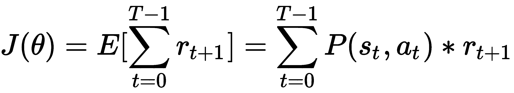

其梯度可以如下推导：

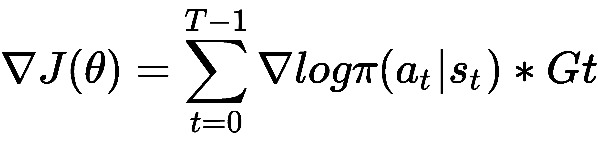

这里，![] 是返回值，即累积折扣奖励直到时间 t，![]并且是随机策略，确定在给定状态下采取某些动作的概率。由于策略更新是在整个回合结束后和所有样本被收集后进行的，REINFORCE 算法是一种离策略算法。

在计算策略梯度后，我们使用反向传播来更新策略参数。通过更新后的策略，我们展开一个回合，收集一组样本，并使用它们来重复更新策略参数。

现在我们将开发 REINFORCE 算法来解决 CartPole ([`gym.openai.com/envs/CartPole-v0/`](https://gym.openai.com/envs/CartPole-v0/)) 环境。

# 如何做...

我们将开发带基线的 REINFORCE 算法来解决 CartPole 环境如下：

1.  导入所有必要的包并创建一个 CartPole 实例：

```py
>>> import gym
>>> import torch
>>> import torch.nn as nn >>> env = gym.make('CartPole-v0')
```

1.  让我们从`PolicyNetwork`类的`__init__`方法开始，该方法使用神经网络逼近策略：

```py
>>> class PolicyNetwork():
 ...     def __init__(self, n_state, n_action, n_hidden=50, lr=0.001):
 ...         self.model = nn.Sequential(
 ...                         nn.Linear(n_state, n_hidden),
 ...                         nn.ReLU(),
 ...                         nn.Linear(n_hidden, n_action),
 ...                         nn.Softmax(),
 ...                 )
 ...         self.optimizer = torch.optim.Adam( self.model.parameters(), lr)
```

1.  接下来，添加`predict`方法，计算估计的策略：

```py
>>>     def predict(self, s):
 ...         """
 ...         Compute the action probabilities of state s using 
                 the learning model
 ...         @param s: input state
 ...         @return: predicted policy
 ...         """
 ...         return self.model(torch.Tensor(s))
```

1.  现在我们开发训练方法，使用一个情节中收集的样本更新神经网络：

```py
>>>     def update(self, returns, log_probs):
 ...         """
 ...         Update the weights of the policy network given 
                 the training samples
 ...         @param returns: return (cumulative rewards) for 
                 each step in an episode
 ...         @param log_probs: log probability for each step
 ...         """
 ...         policy_gradient = []
 ...         for log_prob, Gt in zip(log_probs, returns):
 ...             policy_gradient.append(-log_prob * Gt)
 ...
 ...         loss = torch.stack(policy_gradient).sum()
 ...         self.optimizer.zero_grad()
 ...         loss.backward()
 ...         self.optimizer.step()
```

1.  `PolicyNetwork`类的最终方法是`get_action`，它基于预测的策略对给定状态采样一个动作：

```py
>>>     def get_action(self, s):
 ...         """
 ...         Estimate the policy and sample an action, 
                 compute its log probability
 ...         @param s: input state
 ...         @return: the selected action and log probability
 ...         """
 ...         probs = self.predict(s)
 ...         action = torch.multinomial(probs, 1).item()
 ...         log_prob = torch.log(probs[action])
 ...         return action, log_prob
```

它还返回所选动作的对数概率，这将作为训练样本的一部分使用。

这就是`PolicyNetwork`类的全部内容！

1.  现在，我们可以开始开发**REINFORCE**算法，使用一个策略网络模型：

```py
>>> def reinforce(env, estimator, n_episode, gamma=1.0):
 ...     """
 ...     REINFORCE algorithm
 ...     @param env: Gym environment
 ...     @param estimator: policy network
 ...     @param n_episode: number of episodes
 ...     @param gamma: the discount factor
 ...     """
 ...     for episode in range(n_episode):
 ...         log_probs = []
 ...         rewards = []
 ...         state = env.reset()
 ...         while True:
 ...             action, log_prob = estimator.get_action(state)
 ...             next_state, reward, is_done, _ = env.step(action)
 ...             total_reward_episode[episode] += reward
 ...             log_probs.append(log_prob)
 ...             rewards.append(reward)
 ...
 ...             if is_done:
 ...                 returns = []
 ...                 Gt = 0
 ...                 pw = 0
 ...                 for reward in rewards[::-1]:
 ...                     Gt += gamma ** pw * reward
 ...                     pw += 1
 ...                     returns.append(Gt)
 ...                 returns = returns[::-1]
 ...                 returns = torch.tensor(returns)
 ...                 returns = (returns - returns.mean()) / (
 ...                     returns.std() + 1e-9)
 ...                 estimator.update(returns, log_probs)
 ...                 print('Episode: {}, total reward: {}'.format( episode, total_reward_episode[episode]))
 ...                 break
 ...
 ...             state = next_state
```

1.  我们指定策略网络的大小（输入、隐藏和输出层）、学习率，然后相应地创建`PolicyNetwork`实例：

```py
>>> n_state = env.observation_space.shape[0]
>>> n_action = env.action_space.n
>>> n_hidden = 128
>>> lr = 0.003
>>> policy_net = PolicyNetwork(n_state, n_action, n_hidden, lr)
```

我们将折扣因子设置为`0.9`：

```py
>>> gamma = 0.9
```

1.  我们使用刚开发的策略网络执行 REINFORCE 算法的学习，共 500 个情节，并跟踪每个情节的总回报：

```py
>>> n_episode = 500
>>> total_reward_episode = [0] * n_episode
>>> reinforce(env, policy_net, n_episode, gamma)
```

1.  现在让我们显示随时间变化的回报情节图：

```py
>>> import matplotlib.pyplot as plt
>>> plt.plot(total_reward_episode)
>>> plt.title('Episode reward over time')
>>> plt.xlabel('Episode') >>> plt.ylabel('Total reward')
>>> plt.show()
```

# 它的工作原理...

在*Step 2*中，为了简单起见，我们使用一个隐藏层的神经网络。策略网络的输入是一个状态，接着是一个隐藏层，输出是可能采取的个别动作的概率。因此，我们使用 softmax 函数作为输出层的激活函数。

*Step 4* 用于更新网络参数：给定在一个情节中收集的所有数据，包括所有步骤的回报和对数概率，我们计算策略梯度，然后通过反向传播相应地更新策略参数。

在 *Step 6* 中，REINFORCE 算法执行以下任务：

+   它运行一个情节：对于情节中的每一步，根据当前估计的策略采样一个动作；它在每一步存储回报和对数策略。

+   一旦一个情节结束，它计算每一步的折扣累积回报；通过减去它们的平均值然后除以它们的标准差来对结果进行归一化。

+   它使用回报和对数概率计算策略梯度，然后更新策略参数。我们还显示每个情节的总回报。

+   它通过重复上述步骤运行`n_episode`个情节。

*Step 8* 将生成以下训练日志：

```py
Episode: 0, total reward: 12.0
 Episode: 1, total reward: 18.0
 Episode: 2, total reward: 23.0
 Episode: 3, total reward: 23.0
 Episode: 4, total reward: 11.0
 ……
 ……
 Episode: 495, total reward: 200.0
 Episode: 496, total reward: 200.0
 Episode: 497, total reward: 200.0
 Episode: 498, total reward: 200.0
 Episode: 499, total reward: 200.0
```

您将在*Step 9*中观察以下情节：

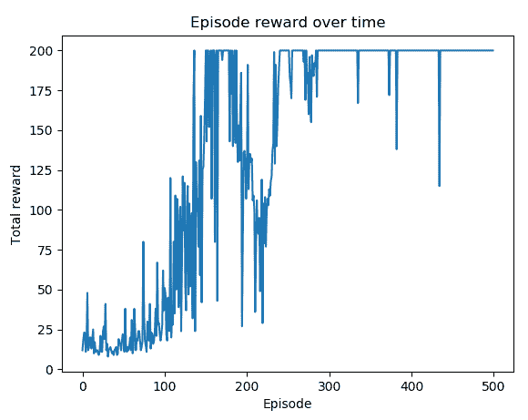

您可以看到最近 200 个情节中的大部分奖励最高值为+200。

**REINFORCE** 算法是一系列策略梯度方法的家族，通过以下规则直接更新策略参数：

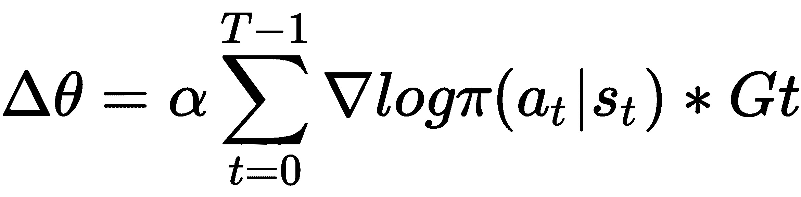

在这里，α是学习率，![]，作为动作的概率映射，而![]，作为累积折现奖励，是在一个 episode 中收集的经验。由于训练样本集仅在完成整个 episode 后构建，因此 REINFORCE 中的学习是以离线策略进行的。学习过程可以总结如下：

1.  随机初始化策略参数*θ*。

1.  根据当前策略选择动作执行一个 episode。

1.  在每个步骤中，存储所选动作的对数概率以及产生的奖励。

1.  计算各步骤的回报。

1.  使用对数概率和回报计算策略梯度，并通过反向传播更新策略参数θ。

1.  重复*步骤 2*至*5*。

同样地，由于 REINFORCE 算法依赖于由随机策略生成的完整轨迹，因此它构成了一种蒙特卡洛方法。

# 参见：

推导策略梯度方程相当棘手。它利用了对数导数技巧。如果你想知道，这里有一个详细的解释：

+   [`www.1-4-5.net/~dmm/ml/log_derivative_trick.pdf`](http://www.1-4-5.net/~dmm/ml/log_derivative_trick.pdf)

# 开发带基线的 REINFORCE 算法

在 REINFORCE 算法中，蒙特卡洛模拟在一个 episode 中播放整个轨迹，然后用于更新策略。然而，随机策略可能在不同的 episode 中在相同状态下采取不同的行动。这可能会导致训练时的混淆，因为一个采样经验希望增加选择某个动作的概率，而另一个采样经验可能希望减少它。为了减少这种高方差问题，在传统 REINFORCE 中，我们将开发一种变体算法，即带基线的 REINFORCE 算法。

在带基线的 REINFORCE 中，我们从回报 G 中减去基线状态值。因此，我们在梯度更新中使用了优势函数 A，描述如下：

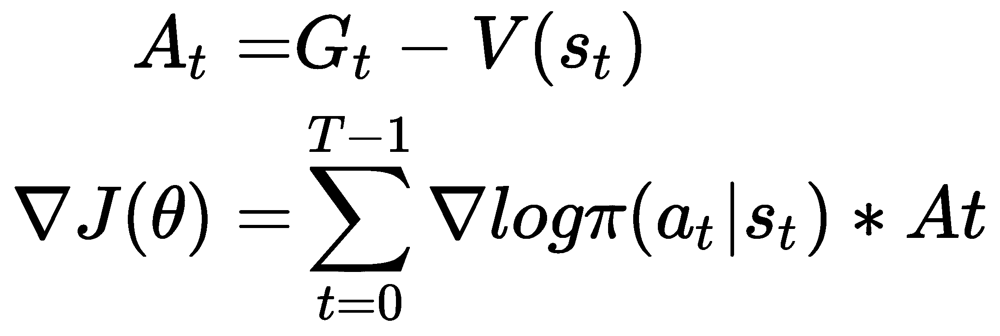

这里，V(s)是估计给定状态的状态值函数。通常，我们可以使用线性函数或神经网络来逼近状态值。通过引入基线值，我们可以根据状态给出的平均动作校准奖励。

我们使用两个神经网络开发了带基线的 REINFORCE 算法，一个用于策略，另一个用于值估计，以解决 CartPole 环境。

# 如何实现...

我们使用 REINFORCE 算法解决 CartPole 环境的方法如下：

1.  导入所有必要的包并创建一个 CartPole 实例：

```py
>>> import gym
>>> import torch
>>> import torch.nn as nn >>> from torch.autograd import Variable
>>> env = gym.make('CartPole-v0')
```

1.  关于策略网络部分，基本上与我们在*实现 REINFORCE 算法*配方中使用的`PolicyNetwork`类相同。请记住，在`update`方法中使用了优势值：

```py
>>> def update(self, advantages, log_probs):
 ...     """
 ...     Update the weights of the policy network given 
             the training samples
 ...     @param advantages: advantage for each step in an episode
 ...     @param log_probs: log probability for each step
 ...     """
 ...     policy_gradient = []
 ...     for log_prob, Gt in zip(log_probs, advantages):
 ...         policy_gradient.append(-log_prob * Gt)
 ...
 ...     loss = torch.stack(policy_gradient).sum()
 ...     self.optimizer.zero_grad()
 ...     loss.backward()
 ...     self.optimizer.step()
```

1.  对于价值网络部分，我们使用了一个带有一个隐藏层的回归神经网络：

```py
>>> class ValueNetwork():
 ...     def __init__(self, n_state, n_hidden=50, lr=0.05):
 ...         self.criterion = torch.nn.MSELoss()
 ...         self.model = torch.nn.Sequential(
 ...                         torch.nn.Linear(n_state, n_hidden),
 ...                         torch.nn.ReLU(),
 ...                         torch.nn.Linear(n_hidden, 1)
 ...                 )
 ...         self.optimizer = torch.optim.Adam( self.model.parameters(), lr)
```

它的学习目标是近似状态值；因此，我们使用均方误差作为损失函数。

`update`方法通过反向传播训练值回归模型，使用一组输入状态和目标输出，当然是：

```py
...     def update(self, s, y):
 ...         """
 ...         Update the weights of the DQN given a training sample
 ...         @param s: states
 ...         @param y: target values
 ...         """
 ...         y_pred = self.model(torch.Tensor(s))
 ...         loss = self.criterion(y_pred, Variable(torch.Tensor(y)))
 ...         self.optimizer.zero_grad()
 ...         loss.backward()
 ...         self.optimizer.step()
```

而`predict`方法则是用来估计状态值：

```py
...     def predict(self, s):
 ...         """
 ...         Compute the Q values of the state for all actions 
                 using the learning model
 ...         @param s: input state
 ...         @return: Q values of the state for all actions
 ...         """
 ...         with torch.no_grad():
 ...             return self.model(torch.Tensor(s))
```

1.  现在，我们可以继续开发基准 REINFORCE 算法，其中包括一个策略和价值网络模型：

```py
>>> def reinforce(env, estimator_policy, estimator_value, 
                     n_episode, gamma=1.0):
 ...     """
 ...     REINFORCE algorithm with baseline
 ...     @param env: Gym environment
 ...     @param estimator_policy: policy network
 ...     @param estimator_value: value network
 ...     @param n_episode: number of episodes
 ...     @param gamma: the discount factor
 ...     """
 ...     for episode in range(n_episode):
 ...         log_probs = []
 ...         states = []
 ...         rewards = []
 ...         state = env.reset()
 ...         while True:
 ...             states.append(state)
 ...             action, log_prob = 
                     estimator_policy.get_action(state)
 ...             next_state, reward, is_done, _ = env.step(action)
 ...             total_reward_episode[episode] += reward
 ...             log_probs.append(log_prob)
 ...             rewards.append(reward)
 ...
 ...             if is_done:
 ...                 Gt = 0
 ...                 pw = 0
 ...                 returns = []
 ...                 for t in range(len(states)-1, -1, -1):
 ...                     Gt += gamma ** pw * rewards[t]
 ...                     pw += 1
 ...                     returns.append(Gt)
 ...                 returns = returns[::-1]
 ...                 returns = torch.tensor(returns)
 ...                 baseline_values = 
                         estimator_value.predict(states)
 ...                 advantages = returns - baseline_values
 ...                 estimator_value.update(states, returns)
 ...                 estimator_policy.update(advantages, log_probs)
 ...                 print('Episode: {}, total reward: {}'.format( episode, total_reward_episode[episode]))
 ...                 break
 ...             state = next_state
```

1.  我们指定策略网络的大小（输入、隐藏和输出层）、学习率，然后相应地创建一个`PolicyNetwork`实例：

```py
>>> n_state = env.observation_space.shape[0]
>>> n_action = env.action_space.n
>>> n_hidden_p = 64
>>> lr_p = 0.003
>>> policy_net = PolicyNetwork(n_state, n_action, n_hidden_p, lr_p)
```

至于价值网络，我们也设置了其大小并创建了一个实例：

```py
>>> n_hidden_v = 64
>>> lr_v = 0.003
>>> value_net = ValueNetwork(n_state, n_hidden_v, lr_v)
```

我们将折扣因子设置为`0.9`：

```py
>>> gamma = 0.9
```

1.  我们使用基准的 REINFORCE 算法进行 2,000 个 episode 的学习，并且我们还会追踪每个 episode 的总奖励：

```py
>>> n_episode = 2000
>>> total_reward_episode = [0] * n_episode
>>> reinforce(env, policy_net, value_net, n_episode, gamma)
```

1.  现在，我们展示随时间变化的 episode 奖励的图表：

```py
>>> import matplotlib.pyplot as plt
>>> plt.plot(total_reward_episode)
>>> plt.title('Episode reward over time')
>>> plt.xlabel('Episode')
>>> plt.ylabel('Total reward')
>>> plt.show()
```

# 工作原理...

REINFORCE 高度依赖蒙特卡洛方法生成用于训练策略网络的整个轨迹。然而，在相同的随机策略下，不同的 episode 可能会采取不同的动作。为了减少采样经验的方差，我们从返回中减去状态值。由此产生的优势度量了相对于平均动作的奖励，这将在梯度更新中使用。

在*步骤 4*中，使用基准的 REINFORCE 算法执行以下任务：

+   它运行一个 episode——处理状态、奖励，并且每一步记录策略的日志。

+   一旦一个 episode 完成，它会计算每一步的折扣累积奖励；它通过价值网络估计基准值；它通过从返回中减去基准值计算优势值。

+   它使用优势值和对数概率计算策略梯度，并更新策略和价值网络。我们还显示每个 episode 的总奖励。

+   它通过重复上述步骤运行`n_episode`个 episode。

执行*步骤 7*中的代码将导致以下图表：

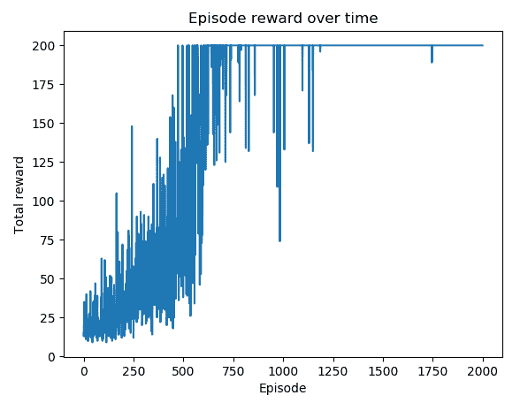

你可以看到，在大约 1,200 个 episode 后，性能非常稳定。

通过额外的价值基准，我们能够重新校准奖励并减少梯度估计的方差。

# 实施演员-评论家算法

在基准 REINFORCE 算法中，有两个独立的组成部分，策略模型和价值函数。实际上，我们可以结合这两个组件的学习，因为学习价值函数的目标是更新策略网络。这就是**演员-评论家**算法所做的事情，这也是我们将在本文中开发的内容。

演员-评论家算法的网络包括以下两个部分：

+   **演员**：它接收输入状态并输出动作概率。本质上，通过使用评论家提供的信息来更新模型，它学习最优策略。

+   **评论家**：这评估了在输入状态时表现良好的价值函数。价值指导演员如何调整。

这两个组件在网络中共享输入和隐藏层的参数，这样学习效率比分开学习更高。因此，损失函数是两部分的总和，具体是测量演员的动作的负对数似然和估计和计算回报之间的均方误差测量评论家。

演员-评论家算法的一个更受欢迎的版本是**优势演员-评论家**（**A2C**）。正如其名称所示，评论部分计算优势值，而不是状态值，这类似于带基线的 REINFORCE。它评估了一个动作在一个状态下相对于其他动作的优越性，并且已知可以减少策略网络中的方差。

# 如何做...

我们开发演员-评论家算法以解决 CartPole 环境，具体如下：

1.  导入所有必要的包并创建一个 CartPole 实例：

```py
>>> import gym
>>> import torch
>>> import torch.nn as nn
>>> import torch.nn.functional as F >>> env = gym.make('CartPole-v0')
```

1.  让我们从演员-评论家神经网络模型开始：

```py
>>> class ActorCriticModel(nn.Module):
 ...     def __init__(self, n_input, n_output, n_hidden):
 ...         super(ActorCriticModel, self).__init__()
 ...         self.fc = nn.Linear(n_input, n_hidden)
 ...         self.action = nn.Linear(n_hidden, n_output)
 ...         self.value = nn.Linear(n_hidden, 1)
 ...
 ...     def forward(self, x):
 ...         x = torch.Tensor(x)
 ...         x = F.relu(self.fc(x))
 ...         action_probs = F.softmax(self.action(x), dim=-1)
 ...         state_values = self.value(x)
 ...         return action_probs, state_values
```

1.  我们继续使用演员-评论家神经网络开发`PolicyNetwork`类的`__init__`方法：

```py
>>> class PolicyNetwork():
 ...     def __init__(self, n_state, n_action, 
                     n_hidden=50, lr=0.001):
 ...         self.model = ActorCriticModel( n_state, n_action, n_hidden)
 ...         self.optimizer = torch.optim.Adam( self.model.parameters(), lr)
 ...         self.scheduler = torch.optim.lr_scheduler.StepLR( self.optimizer, step_size=10, gamma=0.9)
```

请注意，我们在此处使用了一个学习率减少器，根据学习进展动态调整学习率。

1.  接下来，我们添加`predict`方法，它计算估计的动作概率和状态值：

```py
>>>     def predict(self, s):
 ...         """
 ...         Compute the output using the Actor Critic model
 ...         @param s: input state
 ...         @return: action probabilities, state_value
 ...         """
 ...         return self.model(torch.Tensor(s))
```

1.  现在，我们开发`training`方法，用于使用在一个 episode 中收集的样本更新神经网络：

```py
>>>     def update(self, returns, log_probs, state_values):
 ...         """
 ...         Update the weights of the Actor Critic network 
                 given the training samples
 ...         @param returns: return (cumulative rewards) for 
                 each step in an episode
 ...         @param log_probs: log probability for each step
 ...         @param state_values: state-value for each step
 ...         """
 ...         loss = 0
 ...         for log_prob, value, Gt in zip( log_probs, state_values, returns):
 ...             advantage = Gt - value.item()
 ...             policy_loss = -log_prob * advantage
 ...             value_loss = F.smooth_l1_loss(value, Gt)
 ...             loss += policy_loss + value_loss
 ...         self.optimizer.zero_grad()
 ...         loss.backward()
 ...         self.optimizer.step()
```

1.  `PolicyNetwork`类的最终方法是`get_action`，根据预测的策略在给定状态下对动作进行抽样：

```py
>>>     def get_action(self, s):
 ...         """
 ...         Estimate the policy and sample an action, 
                     compute its log probability
 ...         @param s: input state
 ...         @return: the selected action and log probability
 ...         """
 ...         action_probs, state_value = self.predict(s)
 ...         action = torch.multinomial(action_probs, 1).item()
 ...         log_prob = torch.log(action_probs[action])
 ...         return action, log_prob, state_value
```

它还返回所选动作的对数概率，以及估计的状态值。

这就是`PolicyNetwork`类的全部内容！

1.  现在，我们可以继续开发主函数，训练演员-评论家模型：

```py
>>> def actor_critic(env, estimator, n_episode, gamma=1.0):
 ...     """
 ...     Actor Critic algorithm
 ...     @param env: Gym environment
 ...     @param estimator: policy network
 ...     @param n_episode: number of episodes
 ...     @param gamma: the discount factor
 ...     """
 ...     for episode in range(n_episode):
 ...         log_probs = []
 ...         rewards = []
 ...         state_values = []
 ...         state = env.reset()
 ...         while True:
 ...             action, log_prob, state_value = 
                         estimator.get_action(state)
 ...             next_state, reward, is_done, _ = env.step(action)
 ...             total_reward_episode[episode] += reward
 ...             log_probs.append(log_prob)
 ...             state_values.append(state_value)
 ...             rewards.append(reward)
 ...
 ...             if is_done:
 ...                 returns = []
 ...                 Gt = 0
 ...                 pw = 0
 ...                 for reward in rewards[::-1]:
 ...                     Gt += gamma ** pw * reward
 ...                     pw += 1
 ...                     returns.append(Gt)
 ...                 returns = returns[::-1]
 ...                 returns = torch.tensor(returns)
 ...                 returns = (returns - returns.mean()) / 
                                     (returns.std() + 1e-9)
 ...                 estimator.update( returns, log_probs, state_values)
 ...                 print('Episode: {}, total reward: {}'.format( episode, total_reward_episode[episode]))
 ...                 if total_reward_episode[episode] >= 195:
 ...                     estimator.scheduler.step()
 ...                 break
 ...
 ...             state = next_state
```

1.  我们指定策略网络的大小（输入、隐藏和输出层）、学习率，然后相应地创建一个`PolicyNetwork`实例：

```py
>>> n_state = env.observation_space.shape[0]
>>> n_action = env.action_space.n
>>> n_hidden = 128
>>> lr = 0.03
>>> policy_net = PolicyNetwork(n_state, n_action, n_hidden, lr)
```

我们将折现因子设置为`0.9`：

```py
>>> gamma = 0.9
```

1.  我们使用刚刚开发的策略网络进行演员-评论家算法的学习，进行了 1,000 个 episode，并跟踪每个 episode 的总奖励：

```py
>>> n_episode = 1000
>>> total_reward_episode = [0] * n_episode
>>> actor_critic(env, policy_net, n_episode, gamma)
```

1.  最后，我们显示随时间变化的 episode 奖励的图表：

```py
>>> import matplotlib.pyplot as plt
>>> plt.plot(total_reward_episode)
>>> plt.title('Episode reward over time')
>>> plt.xlabel('Episode')
>>> plt.ylabel('Total reward')
>>> plt.show()
```

# 工作原理是...

正如您在*步骤 2*中所看到的，演员和评论家共享输入和隐藏层的参数；演员的输出包括采取各个动作的概率，评论家的输出是输入状态的估计值。

在*步骤 5*中，我们计算优势值及其负对数似然。演员-评论家中的损失函数是优势的负对数似然与回报与估计状态值之间均方误差的组合。请注意，我们使用`smooth_l1_loss`，当绝对误差低于 1 时，它是一个平方项，否则是一个绝对误差。

在*Step 7*中，演员-评论者模型的训练函数执行以下任务：

+   它运行一个 episode：对于每个步骤，根据当前估计的策略采样一个动作；它在每个步骤存储奖励、对数策略和估计的状态值。

+   一旦一个 episode 结束，它会计算每一步的折现累积奖励；然后通过减去它们的均值并除以它们的标准差来归一化返回结果。

+   它使用回报、对数概率和状态值更新策略参数。我们还会显示每个 episode 的总奖励。

+   如果一个 episode 的总奖励超过+195，我们会稍微降低学习率。

+   通过重复上述步骤，它运行`n_episode`个 episode。

在执行*Step 9*的训练后，您将看到以下日志：

```py
Episode: 0, total reward: 18.0
Episode: 1, total reward: 9.0
Episode: 2, total reward: 9.0
Episode: 3, total reward: 10.0
Episode: 4, total reward: 10.0
...
...
Episode: 995, total reward: 200.0
Episode: 996, total reward: 200.0
Episode: 997, total reward: 200.0
Episode: 998, total reward: 200.0
Episode: 999, total reward: 200.0
```

下面的图表展示了*Step 10*的结果：

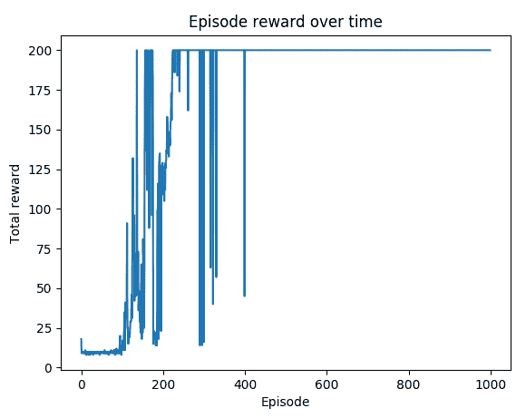

您可以看到大约 400 个 episode 后的奖励保持在+200 的最大值。

在优势演员-评论者算法中，我们将学习分解为两个部分 - 演员和评论者。A2C 中的评论者评估在状态下动作的好坏，这指导演员如何反应。再次，优势值被计算为 A(s,a) = Q(s,a) - V(s)，这意味着从 Q 值中减去状态值。演员根据评论者的指导估计动作的概率。优势的引入可以减少方差，因此 A2C 被认为比标准演员-评论者模型更稳定。正如我们在 CartPole 环境中看到的，经过数百个 episode 的训练后，A2C 的表现一直很稳定。它优于带基准的 REINFORCE 算法。

# 使用演员-评论者算法解决 Cliff Walking

在这个示例中，我们将使用 A2C 算法解决一个更复杂的 Cliff Walking 环境问题。

Cliff Walking 是一个典型的 Gym 环境，episode 很长且没有终止的保证。这是一个 4 * 12 的网格问题。代理在每一步可以向上、向右、向下和向左移动。左下角的瓦片是代理的起点，右下角是获胜点，如果到达则结束 episode。最后一行的其余瓦片是悬崖，代理在踩到它们后将被重置到起始位置，但 episode 继续。代理每走一步会产生-1 的奖励，但踩到悬崖时会产生-100 的奖励。

状态是一个从 0 到 47 的整数，表示代理的位置，如图所示：

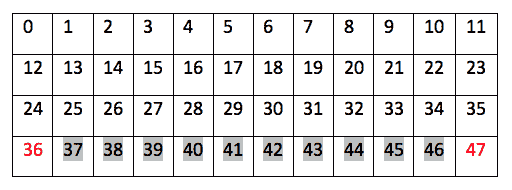

这样的值并不包含数值意义。例如，处于状态 30 并不意味着它比处于状态 10 多 3 倍。因此，在将状态输入策略网络之前，我们将首先将其转换为一个 one-hot 编码向量。

# 如何做到……

我们使用 A2C 算法解决 Cliff Walking 如下：

1.  导入所有必要的包，并创建一个 CartPole 实例：

```py
>>> import gym
>>> import torch
>>> import torch.nn as nn
>>> import torch.nn.functional as F >>> env = gym.make('CliffWalking-v0')
```

1.  由于状态变为 48 维，我们使用了一个更复杂的具有两个隐藏层的 actor-critic 神经网络：

```py
>>> class ActorCriticModel(nn.Module):
 ...     def __init__(self, n_input, n_output, n_hidden):
 ...         super(ActorCriticModel, self).__init__()
 ...         self.fc1 = nn.Linear(n_input, n_hidden[0])
 ...         self.fc2 = nn.Linear(n_hidden[0], n_hidden[1])
 ...         self.action = nn.Linear(n_hidden[1], n_output)
 ...         self.value = nn.Linear(n_hidden[1], 1)
 ...
 ...     def forward(self, x):
 ...         x = torch.Tensor(x)
 ...         x = F.relu(self.fc1(x))
 ...         x = F.relu(self.fc2(x))
 ...         action_probs = F.softmax(self.action(x), dim=-1)
 ...         state_values = self.value(x)
 ...         return action_probs, state_values
```

再次强调，actor 和 critic 共享输入和隐藏层的参数。

1.  我们继续使用刚刚在*Step 2*中开发的 actor-critic 神经网络来使用`PolicyNetwork`类。它与*Implementing the actor-critic algorithm*案例中的`PolicyNetwork`类相同。

1.  接下来，我们开发主函数，训练一个 actor-critic 模型。它几乎与*Implementing the actor-critic algorithm*案例中的模型相同，只是额外将状态转换为 one-hot 编码向量：

```py
>>> def actor_critic(env, estimator, n_episode, gamma=1.0):
 ...     """
 ...     Actor Critic algorithm
 ...     @param env: Gym environment
 ...     @param estimator: policy network
 ...     @param n_episode: number of episodes
 ...     @param gamma: the discount factor
 ...     """
 ...     for episode in range(n_episode):
 ...         log_probs = []
 ...         rewards = []
 ...         state_values = []
 ...         state = env.reset()
 ...         while True:
 ...             one_hot_state = [0] * 48
 ...             one_hot_state[state] = 1
 ...             action, log_prob, state_value = 
                     estimator.get_action(one_hot_state)
 ...             next_state, reward, is_done, _ = env.step(action)
 ...             total_reward_episode[episode] += reward
 ...             log_probs.append(log_prob)
 ...             state_values.append(state_value)
 ...             rewards.append(reward)
 ...
 ...             if is_done:
 ...                 returns = []
 ...                 Gt = 0
 ...                 pw = 0
 ...                 for reward in rewards[::-1]:
 ...                     Gt += gamma ** pw * reward
 ...                     pw += 1
 ...                     returns.append(Gt)
 ...                 returns = returns[::-1]
 ...                 returns = torch.tensor(returns)
 ...                 returns = (returns - returns.mean()) / 
                                 (returns.std() + 1e-9)
 ...                 estimator.update( returns, log_probs, state_values)
 ...                 print('Episode: {}, total reward: {}'.format( episode, total_reward_episode[episode]))
 ...                 if total_reward_episode[episode] >= -14:
 ...                     estimator.scheduler.step()
 ...                 break
 ...
 ...             state = next_state
```

1.  我们指定策略网络的大小（输入、隐藏和输出层）、学习率，然后相应地创建一个`PolicyNetwork`实例：

```py
>>> n_state = 48
>>> n_action = env.action_space.n
>>> n_hidden = [128, 32]
>>> lr = 0.03
>>> policy_net = PolicyNetwork(n_state, n_action, n_hidden, lr)
```

我们将折扣因子设为`0.9`：

```py
>>> gamma = 0.9
```

1.  我们使用刚刚开发的策略网络进行 1000 个 episode 的 actor-critic 算法学习，并跟踪每个 episode 的总奖励：

```py
>>> n_episode = 1000
>>> total_reward_episode = [0] * n_episode
>>> actor_critic(env, policy_net, n_episode, gamma)
```

1.  现在，我们展示自第 100 个 episode 开始训练后的奖励变化曲线图：

```py
>>> import matplotlib.pyplot as plt
>>> plt.plot(range(100, n_episode), total_reward_episode[100:])
>>> plt.title('Episode reward over time')
>>> plt.xlabel('Episode')
>>> plt.ylabel('Total reward')
>>> plt.show()
```

# 工作原理...

您可能会注意到在*Step 4*中，如果一个 episode 的总奖励超过-14，我们会略微降低学习率。-13 的奖励是我们能够通过路径 36-24-25-26-27-28-29-30-31-32-33-34-35-47 获得的最大值。

执行*Step 6*训练后，您将看到以下日志：

```py
Episode: 0, total reward: -85355
 Episode: 1, total reward: -3103
 Episode: 2, total reward: -1002
 Episode: 3, total reward: -240
 Episode: 4, total reward: -118
 ...
 ...
 Episode: 995, total reward: -13
 Episode: 996, total reward: -13
 Episode: 997, total reward: -13
 Episode: 998, total reward: -13
 Episode: 999, total reward: -13
```

下图显示了*Step 7*的结果：

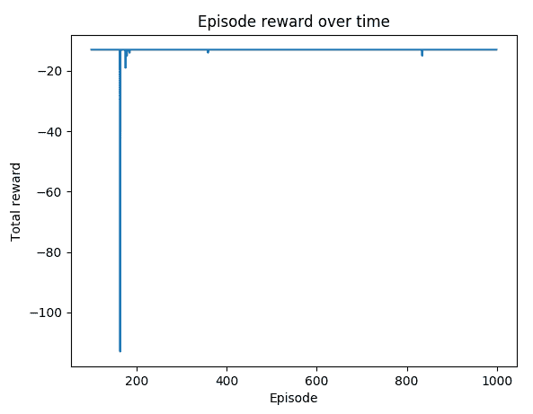

正如我们可以观察到的那样，在大约第 180 个 episode 之后，大多数 episode 的奖励达到了最优值-13。

在这个案例中，我们使用 A2C 算法解决了 Cliff Walking 问题。整数状态从 0 到 47 表示 4*12 棋盘中代理的位置，这些位置并没有数值意义，因此我们首先将其转换为 48 维的 one-hot 编码向量。为了处理 48 维输入，我们使用了一个稍微复杂的具有两个隐藏层的神经网络。在我们的实验中，A2C 已被证明是一个稳定的策略方法。

# 设置连续的 Mountain Car 环境

到目前为止，我们所处理的环境都具有离散的动作值，比如 0 或 1，代表上下左右。在这个案例中，我们将体验一个具有连续动作的 Mountain Car 环境。

连续的 Mountain Car（[`github.com/openai/gym/wiki/MountainCarContinuous-v0`](https://github.com/openai/gym/wiki/MountainCarContinuous-v0)）是一个具有连续动作的 Mountain Car 环境，其值从-1 到 1。如下截图所示，其目标是将汽车驶到右侧山顶上：

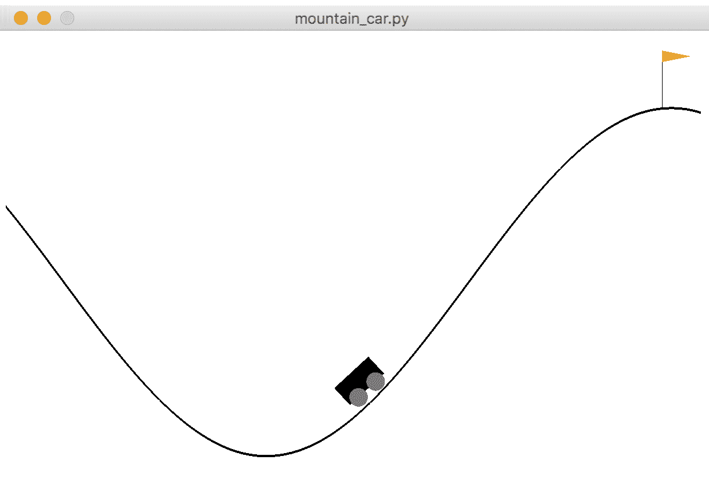

在一维赛道上，汽车位于-1.2（最左侧）到 0.6（最右侧）之间，并且目标（黄旗）位于 0.5 处。汽车的引擎不足以在一次通过中将其推上山顶，因此必须来回驾驶以积累动量。因此，动作是一个浮点数，表示如果其值在-1 到 0 之间则将汽车向左推，如果在 0 到 1 之间则将汽车向右推。

环境有两个状态：

+   **汽车的位置**：这是一个从-1.2 到 0.6 的连续变量

+   **汽车的速度**：这是一个从-0.07 到 0.07 的连续变量

初始状态包括位置在-0.6 到-0.4 之间，速度为 0。

每一步的奖励与动作 a 相关，为*-a²*。并且达到目标还会有额外的+100 奖励。因此，它惩罚了每一步中所采取的力量，直到汽车到达目标位置。一个 episode 在汽车到达目标位置（显然是），或者经过 1000 步后结束。

# 如何操作...

让我们通过以下步骤来模拟连续的山车环境：

1.  我们导入 Gym 库并创建一个连续山车环境的实例：

```py
>>> import gym
>>> import torch
>>> env = gym.envs.make("MountainCarContinuous-v0")
```

1.  看一下动作空间：

```py
>>> print(env.action_space.low[0])
-1.0
>>> print(env.action_space.high[0])
1.0
```

1.  然后我们重置环境：

```py
>>> env.reset()
array([-0.56756635,  0\. ])
```

汽车的初始状态为[-0.56756635, 0\. ]，这意味着初始位置大约为-0.56，速度为 0\. 由于初始位置是从-0.6 到-0.4 随机生成的，所以可能看到不同的初始位置。

1.  现在让我们采取一个简单的方法：我们只是随机选择一个动作从-1 到 1：

```py
>>> is_done = False
>>> while not is_done:
 ...     random_action = torch.rand(1) * 2 - 1
 ...     next_state, reward, is_done, info = env.step(random_action)
 ...     print(next_state, reward, is_done)
 ...     env.render()
 >>> env.render()
 [-0.5657432   0.00182313] -0.09924464356736849 False
 [-0.5622848   0.00345837] -0.07744002014160288 False
 [-0.55754507  0.00473979] -0.04372991690837722 False
 ......
 ......
```

状态（位置和速度）会相应地发生变化，每一步的奖励为*-a²*。

您还会在视频中看到汽车反复向右移动和向左移动。

# 工作原理是这样的...

正如你所想象的那样，连续的山车问题是一个具有挑战性的环境，甚至比仅有三种不同可能动作的原始离散问题更加困难。我们需要来回驾驶汽车以积累正确的力量和方向。此外，动作空间是连续的，这意味着值查找/更新方法（如 TD 方法、DQN）将不起作用。在下一个示例中，我们将使用 A2C 算法的连续控制版本来解决连续的山车问题。

# 使用优势演员-评论者网络解决连续山车环境

在这个示例中，我们将使用优势演员-评论者算法来解决连续的山车问题，这当然是一个连续版本。你会看到它与离散版本有何不同。

正如我们在具有离散动作的环境中看到的那样，在连续控制中，由于我们无法对无数个连续动作进行采样，我们如何建模？实际上，我们可以借助高斯分布。我们可以假设动作值服从高斯分布：

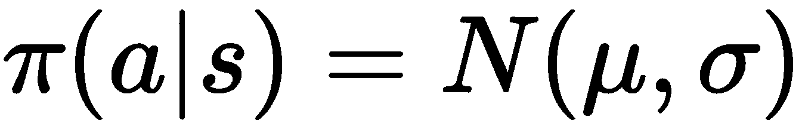

在这里，均值，![]，以及偏差，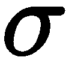，是从策略网络中计算出来的。通过这种调整，我们可以通过当前均值和偏差构建的高斯分布采样动作。连续 A2C 中的损失函数类似于我们在离散控制中使用的损失函数，它是在高斯分布下动作概率的负对数似然和优势值之间的组合，以及实际回报值与预估状态值之间的回归误差。

注意，一个高斯分布用于模拟一个维度的动作，因此，如果动作空间是 k 维的，我们需要使用 k 个高斯分布。在连续 Mountain Car 环境中，动作空间是一维的。就连续控制而言，A2C 的主要困难在于如何构建策略网络，因为它计算了高斯分布的参数。

# 如何做...

我们使用连续 A2C 来解决连续 Mountain Car 问题，具体如下：

1.  导入所有必要的包并创建一个连续 Mountain Car 实例：

```py
>>> import gym
>>> import torch
>>> import torch.nn as nn
>>> import torch.nn.functional as F >>> env = gym.make('MountainCarContinuous-v0')
```

1.  让我们从演员-评论神经网络模型开始：

```py
>>> class ActorCriticModel(nn.Module):
 ...     def __init__(self, n_input, n_output, n_hidden):
 ...         super(ActorCriticModel, self).__init__()
 ...         self.fc = nn.Linear(n_input, n_hidden)
 ...         self.mu = nn.Linear(n_hidden, n_output)
 ...         self.sigma = nn.Linear(n_hidden, n_output)
 ...         self.value = nn.Linear(n_hidden, 1)
 ...         self.distribution = torch.distributions.Normal
 ...
 ...     def forward(self, x):
 ...         x = F.relu(self.fc(x))
 ...         mu = 2 * torch.tanh(self.mu(x))
 ...         sigma = F.softplus(self.sigma(x)) + 1e-5
 ...         dist = self.distribution( mu.view(1, ).data, sigma.view(1, ).data)
 ...         value = self.value(x)
 ...         return dist, value
```

1.  我们继续使用刚刚开发的演员-评论神经网络的`PolicyNetwork`类中的`__init__`方法：

```py
>>> class PolicyNetwork():
 ...     def __init__(self, n_state, n_action, 
                     n_hidden=50, lr=0.001):
 ...         self.model = ActorCriticModel( n_state, n_action, n_hidden)
 ...         self.optimizer = torch.optim.Adam( self.model.parameters(), lr)
```

1.  接下来，我们添加`predict`方法，用于计算预估的动作概率和状态值：

```py
>>>     def predict(self, s):
 ...         """
 ...         Compute the output using the continuous Actor Critic model
 ...         @param s: input state
 ...         @return: Gaussian distribution, state_value
 ...         """
 ...         self.model.training = False
 ...         return self.model(torch.Tensor(s))
```

1.  我们现在开发训练方法，该方法使用一个 episode 中收集的样本来更新策略网络。我们将重用*实施演员-评论算法*食谱中开发的更新方法，这里不再重复。

1.  `PolicyNetwork`类的最终方法是`get_action`，它从给定状态的预估高斯分布中采样一个动作：

```py
>>>     def get_action(self, s):
 ...         """
 ...         Estimate the policy and sample an action, 
                 compute its log probability
 ...         @param s: input state
 ...         @return: the selected action, log probability, 
                 predicted state-value
 ...         """
 ...         dist, state_value = self.predict(s)
 ...         action = dist.sample().numpy()
 ...         log_prob = dist.log_prob(action[0])
 ...         return action, log_prob, state_value
```

它还返回所选动作的对数概率和预估状态值。

这就是用于连续控制的`PolicyNetwork`类的全部内容！

现在，我们可以继续开发主函数，训练一个演员-评论模型：

```py
>>> def actor_critic(env, estimator, n_episode, gamma=1.0):
 ...     """
 ...     continuous Actor Critic algorithm
 ...     @param env: Gym environment
 ...     @param estimator: policy network
 ...     @param n_episode: number of episodes
 ...     @param gamma: the discount factor
 ...     """
 ...     for episode in range(n_episode):
 ...         log_probs = []
 ...         rewards = []
 ...         state_values = []
 ...         state = env.reset()
 ...         while True:
 ...             state = scale_state(state)
 ...             action, log_prob, state_value = 
                         estimator.get_action(state)
 ...             action = action.clip(env.action_space.low[0],
 ...                                  env.action_space.high[0])
 ...             next_state, reward, is_done, _ = env.step(action)
 ...             total_reward_episode[episode] += reward
 ...             log_probs.append(log_prob)
 ...             state_values.append(state_value)
 ...             rewards.append(reward)
 ...             if is_done:
 ...                 returns = []
 ...                 Gt = 0
 ...                 pw = 0
 ...                 for reward in rewards[::-1]:
 ...                     Gt += gamma ** pw * reward
 ...                     pw += 1
 ...                     returns.append(Gt)
 ...                 returns = returns[::-1]
 ...                 returns = torch.tensor(returns)
 ...                 returns = (returns - returns.mean()) / 
                                 (returns.std() + 1e-9)
 ...                 estimator.update( returns, log_probs, state_values)
 ...                 print('Episode: {}, total reward: {}'.format( episode, total_reward_episode[episode]))
 ...                 break
 ...             state = next_state
```

1.  `scale_state`函数用于对输入进行标准化（规范化），以加快模型的收敛速度。我们首先随机生成 10,000 个观测数据，并用它们来训练一个缩放器：

```py
>>> import sklearn.preprocessing
 >>> import numpy as np
 >>> state_space_samples = np.array(
 ...     [env.observation_space.sample() for x in range(10000)])
 >>> scaler = sklearn.preprocessing.StandardScaler()
 >>> scaler.fit(state_space_samples)
```

一旦缩放器被训练好，我们就在`scale_state`函数中使用它来转换新的输入数据：

```py
>>> def scale_state(state):
 ...     scaled = scaler.transform([state])
 ...     return scaled[0]
```

1.  我们指定策略网络的大小（输入、隐藏和输出层），学习率，然后相应地创建一个`PolicyNetwork`实例：

```py
>>> n_state = env.observation_space.shape[0]
>>> n_action = 1
>>> n_hidden = 128
>>> lr = 0.0003
>>> policy_net = PolicyNetwork(n_state, n_action, n_hidden, lr)
```

我们将折现因子设为`0.9`：

```py
>>> gamma = 0.9
```

1.  我们使用刚刚开发的策略网络进行 200 个剧集的 actor-critic 算法进行连续控制，并且我们还跟踪每个剧集的总奖励：

```py
>>> n_episode = 200
>>> total_reward_episode = [0] * n_episode
>>> actor_critic(env, policy_net, n_episode, gamma)
```

1.  现在，让我们展示随时间变化的剧集奖励图：

```py
>>> import matplotlib.pyplot as plt
>>> plt.plot(total_reward_episode)
>>> plt.title('Episode reward over time')
>>> plt.xlabel('Episode')
>>> plt.ylabel('Total reward')
>>> plt.show()
```

# 如何工作...

在这个配方中，我们使用高斯 A2C 来解决连续的 Mountain Car 环境。

在*第 2 步*中，我们示例中的网络有一个隐藏层。输出层有三个单独的组件。它们是高斯分布的均值和偏差，以及状态值。分布均值的输出通过 tanh 激活函数缩放到[-1, 1]范围（或此示例中的[-2, 2]），而分布偏差使用 softplus 作为激活函数以确保正偏差。网络返回当前的高斯分布（actor）和估计的状态值（critic）。

在*第 7 步*的 actor-critic 模型训练函数与我们在*实施 actor-critic 算法*配方中开发的内容非常相似。您可能会注意到我们在采样动作时添加了一个值剪辑，以使其保持在[-1, 1]范围内。我们将在接下来的步骤中解释`scale_state`函数的作用。

在执行*第 10 步*的训练后，您将看到以下日志：

```py
Episode: 0, total reward: 89.46417524456328
 Episode: 1, total reward: 89.54226159679301
 Episode: 2, total reward: 89.91828341346695
 Episode: 3, total reward: 90.04199470314816
 Episode: 4, total reward: 86.23157467747066
 ...
 ...
 Episode: 194, total reward: 92.71676277432059
 Episode: 195, total reward: 89.97484988523927
 Episode: 196, total reward: 89.26063135086025
 Episode: 197, total reward: 87.19460382302674
 Episode: 198, total reward: 79.86081433777699
 Episode: 199, total reward: 88.98075638481279
```

以下图表是*第 11 步*的结果：

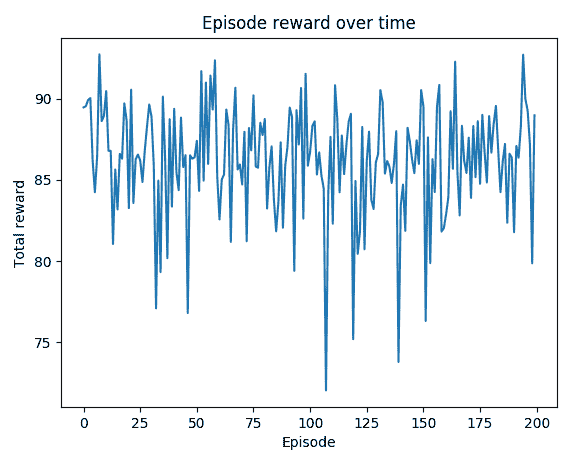

根据[`github.com/openai/gym/wiki/MountainCarContinuous-v0`](https://github.com/openai/gym/wiki/MountainCarContinuous-v0)中解决的要求，获得超过+90 的奖励被视为环境已解决。我们有多个剧集解决了环境问题。

在连续的 A2C 中，我们假设动作空间的每个维度都服从高斯分布。高斯分布的均值和偏差是策略网络输出层的一部分。输出层的其余部分用于估计状态值。从当前均值和偏差参数化的高斯分布中采样一个或多个动作。连续 A2C 的损失函数类似于其离散版本，即负对数似然与高斯分布下动作概率以及优势值之间的组合，以及实际回报值与估计状态值之间的回归误差。

# 还有更多内容...

到目前为止，我们一直是以随机的方式建模策略，从分布或计算的概率中采样动作。作为一个额外部分，我们将简要讨论**确定性策略梯度**（**DPG**），在这里我们将策略建模为确定性决策。我们简单地将确定性策略视为随机策略的特例，直接将输入状态映射到动作而不是动作的概率。DPG 算法通常使用以下两组神经网络：

+   **Actor-critic 网络**：这与我们之前体验过的 A2C 非常相似，但是是以确定性方式进行。它预测状态值和需要执行的动作。

+   **目标 actor-critic 网络**：这是 actor-critic 网络的定期副本，其目的是稳定学习。显然，你不希望目标一直在变化。该网络为训练提供了延迟的目标。

正如你所看到的，在 DPG 中并没有太多新东西，但它是 A2C 和延迟目标机制的良好结合。请随意自行实现该算法，并用它来解决连续的 Mountain Car 环境。

# 另请参阅

如果你对 softplus 激活函数不熟悉，或者想要了解更多关于 DPG 的内容，请查看以下材料：

+   Softplus: [`en.wikipedia.org/wiki/Rectifier_(neural_networks)`](https://en.wikipedia.org/wiki/Rectifier_(neural_networks))

+   DFP 的原始论文：[`hal.inria.fr/file/index/docid/938992/filename/dpg-icml2014.pdf`](https://hal.inria.fr/file/index/docid/938992/filename/dpg-icml2014.pdf)

# 通过交叉熵方法玩 CartPole

在这个最后的示例中，作为一个额外的（也很有趣的）部分，我们将开发一个简单而强大的算法来解决 CartPole 问题。它基于交叉熵，直接将输入状态映射到输出动作。事实上，它比本章中所有其他策略梯度算法更为直接。

我们已经应用了几种策略梯度算法来解决 CartPole 环境。它们使用复杂的神经网络架构和损失函数，这对于如 CartPole 这样的简单环境可能有些过度。为什么不直接预测给定状态下的动作呢？其背后的思想很简单：我们对过去最成功的经验进行建模，仅对正确的动作感兴趣。在这种情况下，目标函数是实际动作和预测动作之间的交叉熵。在 CartPole 中，有两种可能的动作：左和右。为了简单起见，我们可以将其转换为二元分类问题，并使用以下模型图表述：

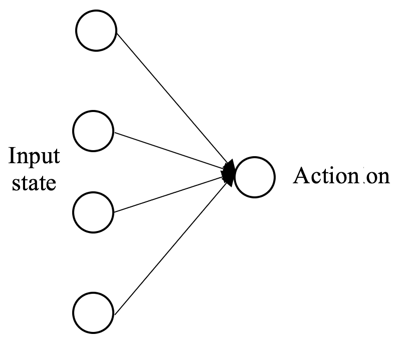

# 如何实现它...

我们使用交叉熵来解决 CartPole 问题如下：

1.  导入所有必要的包并创建一个 CartPole 实例：

```py
>>> import gym
>>> import torch
>>> import torch.nn as nn
>>> from torch.autograd import Variable >>> env = gym.make('CartPole-v0')
```

1.  让我们从动作估算器开始：

```py
>>> class Estimator():
 ...     def __init__(self, n_state, lr=0.001):
 ...         self.model = nn.Sequential(
 ...                         nn.Linear(n_state, 1),
 ...                         nn.Sigmoid()
 ...                 )
 ...         self.criterion = torch.nn.BCELoss()
 ...         self.optimizer = torch.optim.Adam( self.model.parameters(), lr)
 ...
 ...     def predict(self, s):
 ...         return self.model(torch.Tensor(s))
 ...
 ...     def update(self, s, y):
 ...         """
 ...         Update the weights of the estimator given 
                 the training samples
 ...         """
 ...         y_pred = self.predict(s)
 ...         loss = self.criterion( y_pred, Variable(torch.Tensor(y)))
 ...         self.optimizer.zero_grad()
 ...         loss.backward()
 ...         self.optimizer.step()
```

1.  现在我们为交叉熵算法开发主要的训练函数：

```py
>>> def cross_entropy(env, estimator, n_episode, n_samples):
 ...     """
 ...     Cross-entropy algorithm for policy learning
 ...     @param env: Gym environment
 ...     @param estimator: binary estimator
 ...     @param n_episode: number of episodes
 ...     @param n_samples: number of training samples to use
 ...     """
 ...     experience = []
 ...     for episode in range(n_episode):
 ...         rewards = 0
 ...         actions = []
 ...         states = []
 ...         state = env.reset()
 ...         while True:
 ...             action = env.action_space.sample()
 ...             states.append(state)
 ...             actions.append(action)
 ...             next_state, reward, is_done, _ = env.step(action)
 ...             rewards += reward
 ...             if is_done:
 ...                 for state, action in zip(states, actions):
 ...                     experience.append((rewards, state, action))
 ...                 break
 ...             state = next_state
 ...
 ...     experience = sorted(experience, 
                         key=lambda x: x[0], reverse=True)
 ...     select_experience = experience[:n_samples]
 ...     train_states = [exp[1] for exp in select_experience]
 ...     train_actions = [exp[2] for exp in select_experience]
 ...
 ...     for _ in range(100):
 ...         estimator.update(train_states, train_actions)
```

1.  然后我们指定动作估算器的输入大小和学习率：

```py
>>> n_state = env.observation_space.shape[0]
>>> lr = 0.01
```

然后我们相应地创建一个 `Estimator` 实例：

```py
>>> estimator = Estimator(n_state, lr)
```

1.  我们将生成 5,000 个随机的情节，并精选出最佳的 10,000 个（状态，动作）对用于估算器的训练：

```py
>>> n_episode = 5000
>>> n_samples = 10000
>>> cross_entropy(env, estimator, n_episode, n_samples)
```

1.  模型训练完成后，让我们来测试一下。我们将用它来玩 100 个情节，并记录总奖励：

```py
>>> n_episode = 100
>>> total_reward_episode = [0] * n_episode
>>> for episode in range(n_episode):
 ...     state = env.reset()
 ...     is_done = False
 ...     while not is_done:
 ...         action = 1 if estimator.predict(state).item() >= 0.5 else 0
 ...         next_state, reward, is_done, _ = env.step(action)
 ...         total_reward_episode[episode] += reward
 ...         state = next_state
```

1.  然后我们将性能可视化如下：

```py
>>> import matplotlib.pyplot as plt
>>> plt.plot(total_reward_episode)
>>> plt.title('Episode reward over time')
>>> plt.xlabel('Episode')
>>> plt.ylabel('Total reward')
>>> plt.show()
```

# 工作原理...

正如您在*Step 2*中所看到的，动作估计器有两层 - 输入层和输出层，接着是一个 sigmoid 激活函数，损失函数是二元交叉熵。

*Step 3*是为了训练交叉熵模型。具体而言，对于每个训练集，我们采取随机行动，累积奖励，并记录状态和行动。在体验了`n_episode`个集数后，我们提取最成功的集数（具有最高总奖励）并提取`n_samples`个（状态，行动）对作为训练样本。然后我们在刚构建的训练集上对估计器进行 100 次迭代的训练。

执行*Step 7*中的代码行将产生以下绘图：

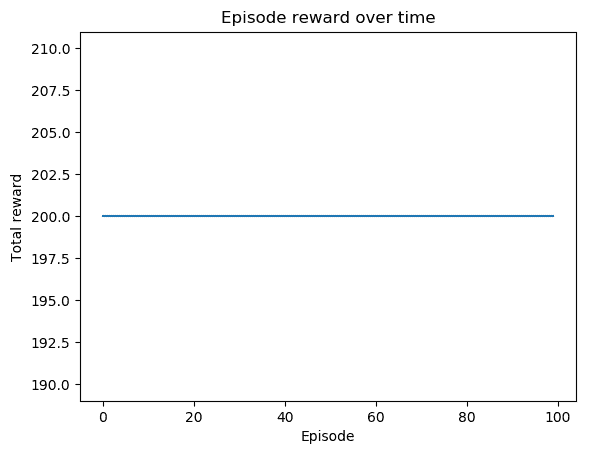

正如您所见，所有测试集都有+200 的奖励！

交叉熵对于简单环境非常简单，但却很有用。它直接建模输入状态和输出行动之间的关系。一个控制问题被构建成一个分类问题，我们试图在所有备选行动中预测正确的行动。关键在于我们只从正确的经验中学习，这指导模型在给定状态时应该选择哪个最有益的行动。
