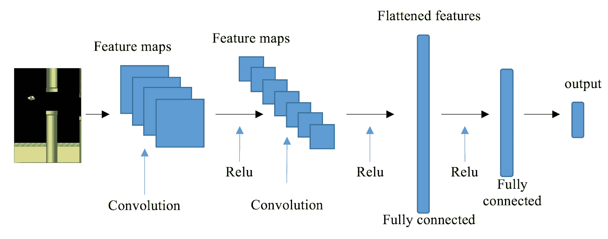
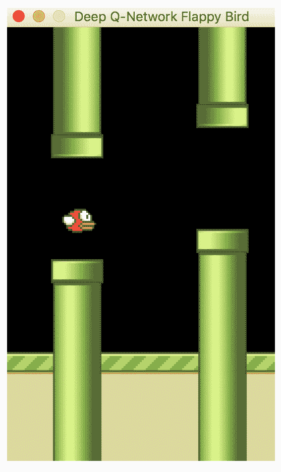

# 毕业项目 – 使用 DQN 玩 Flappy Bird

在这最后一章中，我们将致力于一个毕业项目——使用强化学习玩 Flappy Bird。我们将应用我们在本书中学到的知识来构建一个智能机器人。我们还将专注于构建**深度 Q 网络**（**DQNs**），微调模型参数并部署模型。让我们看看鸟能在空中停留多久。

最后一个章节将通过以下步骤逐步构建毕业项目：

+   设置游戏环境

+   构建一个深度 Q 网络来玩 Flappy Bird

+   训练和调整网络

+   部署模型并玩游戏

因此，每个食谱中的代码都将基于前面的食谱构建。

# 设置游戏环境

要使用 DQN 玩 Flappy Bird，我们首先需要设置环境。

我们将使用 Pygame 模拟 Flappy Bird 游戏。Pygame ([`www.pygame.org`](https://www.pygame.org/)) 包含一组为创建视频游戏而开发的 Python 模块。它还包括在游戏中需要的图形和声音库。我们可以按照以下方式安装 `Pygame` 包：

```py
pip install pygame
```

Flappy Bird 是由 Dong Nguyen 最初开发的一款著名移动游戏。你可以在 [`flappybird.io/`](https://flappybird.io/) 使用键盘自己尝试。游戏的目标是尽可能长时间地保持存活。当鸟触碰到地面或管道时游戏结束。因此，鸟需要在正确的时机振翅通过随机的管道，避免落到地面上。可能的动作包括振翅和不振翅。在游戏环境中，每一步的奖励是 +0.1，并有以下两个例外情况：

+   当发生碰撞时为 -1

+   当鸟通过两个管道之间的间隙时为 +1。原始的 Flappy Bird 游戏根据通过的间隙数量进行评分。

# 准备工作

从 [`github.com/yanpanlau/Keras-FlappyBird/tree/master/assets/sprites`](https://github.com/yanpanlau/Keras-FlappyBird/tree/master/assets/sprites) 下载我们需要的游戏环境资产。为简单起见，我们将只使用 `sprites` 文件夹中的图像。具体来说，我们需要以下图像：

+   `background-black.png`: 屏幕的背景图像

+   `base.png`: 地板的图像

+   `pipe-green.png`: 鸟需要避开的管道的图像

+   `redbird-downflap.png`: 鸟向下振翅时的图像

+   `redbird-midflap.png`: 鸟静止时的图像

+   `redbird-upflap.png`: 鸟向上振翅时的图像

如果您感兴趣，还可以使用音频文件使游戏更有趣。

# 如何做…

我们将使用 `Pygame` 开发 Flappy Bird 游戏环境，步骤如下：

1.  我们首先开发一个实用函数，加载图像并将其转换为正确的格式：

```py
>>> from pygame.image import load
 >>> from pygame.surfarray import pixels_alpha
 >>> from pygame.transform import rotate
 >>> def load_images(sprites_path):
 ...     base_image = load(sprites_path + 
                             'base.png').convert_alpha()
 ...     background_image = load(sprites_path + 
                             'background-black.png').convert()
 ...     pipe_images = [rotate(load(sprites_path + 
                        'pipe-green.png').convert_alpha(), 180),
 ...                    load(sprites_path + 
                             'pipe-green.png').convert_alpha()]
 ...     bird_images = [load(sprites_path + 
                           'redbird-upflap.png').convert_alpha(),
 ...                    load(sprites_path + 
                         'redbird-midflap.png').convert_alpha(),
 ...                    load(sprites_path + 
                         'redbird-downflap.png').convert_alpha()]
 ...     bird_hitmask = [pixels_alpha(image).astype(bool) 
                             for image in bird_images]
 ...     pipe_hitmask = [pixels_alpha(image).astype(bool) 
                             for image in pipe_images]
 ...     return base_image, background_image, pipe_images, 
                 bird_images, bird_hitmask, pipe_hitmask
```

1.  导入环境所需的所有包：

```py
>>> from itertools import cycle
>>> from random import randint
>>> import pygame
```

1.  初始化游戏和时钟，并将屏幕刷新频率设置为每秒 30 帧：

```py
>>> pygame.init()
>>> fps_clock = pygame.time.Clock() >>> fps = 30
```

1.  指定屏幕大小并相应地创建屏幕，然后为屏幕添加标题：

```py
>>> screen_width = 288
 >>> screen_height = 512
 >>> screen = pygame.display.set_mode((screen_width, screen_height)) >>> pygame.display.set_caption('Flappy Bird')
```

1.  然后，使用以下函数加载必要的图像（位于`sprites`文件夹中）：

```py
>>> base_image, background_image, pipe_images, bird_images, bird_hitmask, pipe_hitmask = load_images('sprites/')
```

1.  获取游戏变量，包括鸟和管道的大小，并设置两个管道之间的垂直间隙为 100：

```py
>>> bird_width = bird_images[0].get_width()
>>> bird_height = bird_images[0].get_height()
>>> pipe_width = pipe_images[0].get_width()
>>> pipe_height = pipe_images[0].get_height() >>> pipe_gap_size = 100
```

1.  鸟的振动运动依次为向上、中间、向下、中间、向上等：

```py
>>> bird_index_gen = cycle([0, 1, 2, 1])
```

这仅仅是为了使游戏更加有趣。

1.  在定义完所有常量后，我们从游戏环境的`FlappyBird`类的`__init__method`开始：

```py
>>> class FlappyBird(object):
 ...     def __init__(self):
 ...         self.pipe_vel_x = -4
 ...         self.min_velocity_y = -8
 ...         self.max_velocity_y = 10
 ...         self.downward_speed = 1
 ...         self.upward_speed = -9
 ...         self.cur_velocity_y = 0
 ...         self.iter = self.bird_index = self.score = 0
 ...         self.bird_x = int(screen_width / 5)
 ...         self.bird_y = int((screen_height - bird_height) / 2)
 ...         self.base_x = 0
 ...         self.base_y = screen_height * 0.79
 ...         self.base_shift = base_image.get_width() - 
                             background_image.get_width()
 ...         self.pipes = [self.gen_random_pipe(screen_width), 
                         self.gen_random_pipe(screen_width * 1.5)]
 ...         self.is_flapped = False
```

1.  我们继续定义`gen_random_pipe`方法，该方法在给定的水平位置和随机垂直位置生成一对管道（一个上管道和一个下管道）：

```py
>>>     def gen_random_pipe(self, x):
 ...         gap_y = randint(2, 10) * 10 + int(self.base_y * 0.2)
 ...         return {"x_upper": x,
 ...                 "y_upper": gap_y - pipe_height,
 ...                 "x_lower": x,
 ...                 "y_lower": gap_y + pipe_gap_size}
```

上下两个管道的`y`位置分别为`gap_y - pipe_height`和`gap_y + pipe_gap_size`。

1.  我们接下来开发的方法是`check_collision`，如果鸟与基座或管道碰撞，则返回`True`：

```py
>>>     def check_collision(self):
 ...         if bird_height + self.bird_y >= self.base_y - 1:
 ...             return True
 ...         bird_rect = pygame.Rect(self.bird_x, self.bird_y, 
                                     bird_width, bird_height)
 ...         for pipe in self.pipes:
 ...             pipe_boxes = [pygame.Rect(pipe["x_upper"], 
                          pipe["y_upper"], pipe_width, pipe_height),
 ...                           pygame.Rect(pipe["x_lower"], 
                          pipe["y_lower"], pipe_width, pipe_height)]
 ...             # Check if the bird's bounding box overlaps to 
                     the bounding box of any pipe
 ...             if bird_rect.collidelist(pipe_boxes) == -1:
 ...                 return False
 ...             for i in range(2):
 ...                 cropped_bbox = bird_rect.clip(pipe_boxes[i])
 ...                 x1 = cropped_bbox.x - bird_rect.x
 ...                 y1 = cropped_bbox.y - bird_rect.y
 ...                 x2 = cropped_bbox.x - pipe_boxes[i].x
 ...                 y2 = cropped_bbox.y - pipe_boxes[i].y
 ...                 for x in range(cropped_bbox.width):
 ...                     for y in range(cropped_bbox.height):
 ...                         if bird_hitmask[self.bird_index][x1+x, 
                                    y1+y] and pipe_hitmask[i][
                                    x2+x, y2+y]:
 ...                             return True
 ...         return False
```

1.  我们最后需要的最重要的方法是`next_step`，它执行一个动作并返回游戏的更新图像帧、收到的奖励以及本轮游戏是否结束：

```py
>>>     def next_step(self, action):
 ...         pygame.event.pump()
 ...         reward = 0.1
 ...         if action == 1:
 ...             self.cur_velocity_y = self.upward_speed
 ...             self.is_flapped = True
 ...         # Update score
 ...         bird_center_x = self.bird_x + bird_width / 2
 ...         for pipe in self.pipes:
 ...             pipe_center_x = pipe["x_upper"] + 
                                     pipe_width / 2
 ...             if pipe_center_x < bird_center_x 
                                 < pipe_center_x + 5:
 ...                 self.score += 1
 ...                 reward = 1
 ...                 break
 ...         # Update index and iteration
 ...         if (self.iter + 1) % 3 == 0:
 ...             self.bird_index = next(bird_index_gen)
 ...         self.iter = (self.iter + 1) % fps
 ...         self.base_x = -((-self.base_x + 100) % 
                                 self.base_shift)
 ...         # Update bird's position
 ...         if self.cur_velocity_y < self.max_velocity_y 
                             and not self.is_flapped:
 ...             self.cur_velocity_y += self.downward_speed
 ...         self.is_flapped = False
 ...         self.bird_y += min(self.cur_velocity_y, 
                 self.bird_y - self.cur_velocity_y - bird_height)
 ...         if self.bird_y < 0:
 ...             self.bird_y = 0
 ...         # Update pipe position
 ...         for pipe in self.pipes:
 ...             pipe["x_upper"] += self.pipe_vel_x
 ...             pipe["x_lower"] += self.pipe_vel_x
 ...         # Add new pipe when first pipe is     
                 about to touch left of screen
 ...         if 0 < self.pipes[0]["x_lower"] < 5:
 ...             self.pipes.append(self.gen_random_pipe( screen_width + 10))
 ...         # remove first pipe if its out of the screen
 ...         if self.pipes[0]["x_lower"] < -pipe_width:
 ...             self.pipes.pop(0)
 ...         if self.check_collision():
 ...             is_done = True
 ...             reward = -1
 ...             self.__init__()
 ...         else:
 ...             is_done = False
 ...         # Draw sprites
 ...         screen.blit(background_image, (0, 0))
 ...         screen.blit(base_image, (self.base_x, self.base_y))
 ...         screen.blit(bird_images[self.bird_index], 
                             (self.bird_x, self.bird_y))
 ...         for pipe in self.pipes:
 ...             screen.blit(pipe_images[0], (pipe["x_upper"], pipe["y_upper"]))
 ...             screen.blit(pipe_images[1], 
                       (pipe["x_lower"], pipe["y_lower"]))
 ...         image = pygame.surfarray.array3d( pygame.display.get_surface())
 ...         pygame.display.update()
 ...         fps_clock.tick(fps)
 ...         return image, reward, is_done
```

至此，关于`Flappy Bird`环境的介绍就完成了。

# 它的工作原理...

在*第 8 步*中，我们定义了管道的速度（每过 4 个单位向左移动一次）、鸟的最小和最大垂直速度（分别为`-8`和`10`）、其向上和向下加速度（分别为`-9`和`1`）、其默认垂直速度（`0`）、鸟图像的起始索引（`0`）、初始得分、鸟的初始水平和垂直位置、基座的位置，以及使用`gen_random_pipe`方法随机生成的管道的坐标。

在*第 11 步*中，默认情况下，每个步骤的奖励为`+0.1`。如果动作是振翅，我们会增加鸟的垂直速度及其向上加速度。然后，我们检查鸟是否成功通过了一对管道。如果是，则游戏得分增加 1，步骤奖励变为+1。我们更新鸟的位置、其图像索引以及管道的位置。如果旧的一对管道即将离开屏幕左侧，将生成新的一对管道，并在旧的一对管道离开屏幕后删除它。如果发生碰撞，本轮游戏将结束，奖励为-1；游戏也将重置。最后，我们会在游戏屏幕上显示更新的帧。

# 构建一个 Deep Q-Network 来玩 Flappy Bird

现在`Flappy Bird`环境已经准备就绪，我们可以开始通过构建 DQN 模型来解决它。

正如我们所见，每次采取行动后都会返回一个屏幕图像。CNN 是处理图像输入的最佳神经网络架构之一。在 CNN 中，卷积层能够有效地从图像中提取特征，这些特征将传递到下游的全连接层。在我们的解决方案中，我们将使用具有三个卷积层和一个全连接隐藏层的 CNN。CNN 架构示例如下：



# 如何做到...

让我们开发一个基于 CNN 的 DQN 模型，步骤如下：

1.  导入必要的模块：

```py
>>> import torch
>>> import torch.nn as nn
>>> import torch.nn.functional as F
>>> import numpy as np
>>> import random
```

1.  我们从 CNN 模型开始：

```py
>>> class DQNModel(nn.Module):
 ...     def __init__(self, n_action=2):
 ...         super(DQNModel, self).__init__()
 ...         self.conv1 = nn.Conv2d(4, 32, 
                             kernel_size=8, stride=4)
 ...         self.conv2 = nn.Conv2d(32, 64, 4, stride=2)
 ...         self.conv3 = nn.Conv2d(64, 64, 3, stride=1)
 ...         self.fc = nn.Linear(7 * 7 * 64, 512)
 ...         self.out = nn.Linear(512, n_action)
 ...         self._create_weights()
 ...
 ...     def _create_weights(self):
 ...         for m in self.modules():
 ...             if isinstance(m, nn.Conv2d) or 
                                 isinstance(m, nn.Linear):
 ...                 nn.init.uniform(m.weight, -0.01, 0.01)
 ...                 nn.init.constant_(m.bias, 0)
 ...
 ...     def forward(self, x):
 ...         x = F.relu(self.conv1(x))
 ...         x = F.relu(self.conv2(x))
 ...         x = F.relu(self.conv3(x))
 ...         x = x.view(x.size(0), -1)
 ...         x = F.relu(self.fc(x))
 ...         output = self.out(x)
 ...         return output
```

1.  现在使用我们刚刚构建的 CNN 模型开发一个带有经验回放的 DQN：

```py
>>> class DQN():
 ...     def __init__(self, n_action, lr=1e-6):
 ...         self.criterion = torch.nn.MSELoss()
 ...         self.model = DQNModel(n_action)
 ...         self.optimizer = torch.optim.Adam( self.model.parameters(), lr)
```

1.  `predict`方法根据输入状态估计输出 Q 值：

```py
>>>     def predict(self, s):
 ...         """
 ...         Compute the Q values of the state for all 
                 actions using the learning model
 ...         @param s: input state
 ...         @return: Q values of the state for all actions
 ...         """
 ...         return self.model(torch.Tensor(s))
```

1.  `update`方法根据训练样本更新神经网络的权重，并返回当前损失：

```py
>>>     def update(self, y_predict, y_target):
 ...         """
 ...         Update the weights of the DQN given a training sample
 ...         @param y_predict:
 ...         @param y_target:
 ...         @return:
 ...         """
 ...         loss = self.criterion(y_predict, y_target)
 ...         self.optimizer.zero_grad()
 ...         loss.backward()
 ...         self.optimizer.step()
 ...         return loss
```

1.  `DQN`类的最后部分是`replay`方法，它在给定一系列过去经验时执行经验重播：

```py
>>>     def replay(self, memory, replay_size, gamma):
 ...         """
 ...         Experience replay
 ...         @param memory: a list of experience
 ...         @param replay_size: the number of samples we 
                 use to update the model each time
 ...         @param gamma: the discount factor
 ...         @return: the loss
 ...         """
 ...         if len(memory) >= replay_size:
 ...             replay_data = random.sample(memory, replay_size)
 ...             state_batch, action_batch, next_state_batch, 
                     reward_batch, done_batch = zip(*replay_data)
 ...             state_batch = torch.cat( tuple(state for state in state_batch))
 ...             next_state_batch = torch.cat(    
                         tuple(state for state in next_state_batch))
 ...             q_values_batch = self.predict(state_batch)
 ...             q_values_next_batch = 
                         self.predict(next_state_batch)
 ...             reward_batch = torch.from_numpy(np.array( reward_batch, dtype=np.float32)[:, None])
 ...             action_batch = torch.from_numpy(
 ...                 np.array([[1, 0] if action == 0 else [0, 1] 
                     for action in action_batch], dtype=np.float32))
 ...             q_value = torch.sum( q_values_batch * action_batch, dim=1)
 ...             td_targets = torch.cat(
 ...             tuple(reward if terminal else reward + 
                         gamma * torch.max(prediction) for
                         reward, terminal, prediction
 ...                 in zip(reward_batch, done_batch, 
                         q_values_next_batch)))
 ...             loss = self.update(q_value, td_targets)
 ...             return loss
```

这就是 DQN 类的全部内容。在下一个示例中，我们将对 DQN 模型进行若干次迭代的训练。

# 工作原理...

在*步骤 2*中，我们组装了基于 CNN 的 DQN 的骨干部分。它有三个具有不同配置的卷积层。每个卷积层后面跟着一个 ReLU 激活函数。然后将最后一个卷积层的特征图展平，并输入到一个具有 512 个节点的全连接隐藏层，然后是输出层。

注意，我们还设置了权重的初始随机值界限和零偏置，以便模型更容易收敛。

*步骤 6*是使用经验回放进行逐步训练。如果我们有足够的经验，我们会随机选择一个大小为`replay_size`的经验集合进行训练。然后，我们将每个经验转换为一个训练样本，该样本由给定输入状态的预测值和输出目标值组成。目标值计算如下：

+   使用奖励和新的 Q 值更新动作的目标 Q 值，如下所示：![]

+   如果是终端状态，则目标 Q 值更新为`r`。

最后，我们使用选定的训练样本批次来更新神经网络。

# 训练和调整网络

在这个示例中，我们将训练 DQN 模型来玩 Flappy Bird。

在训练的每个步骤中，我们根据 epsilon-greedy 策略采取一个动作：在一定概率（epsilon）下，我们会随机采取一个动作，例如拍打或不拍打；否则，我们选择具有最高值的动作。我们还调整 epsilon 的值以便在 DQN 模型刚开始时更多地进行探索，在模型变得更加成熟时更多地进行利用。

正如我们所见，每一步观察的观察是屏幕的二维图像。我们需要将观察图像转换为状态。仅使用一步中的一个图像将无法提供足够的信息来指导代理程序如何反应。因此，我们使用四个相邻步骤的图像来形成一个状态。我们首先将图像重新形状为预期大小，然后将当前帧的图像与前三个帧的图像连接起来。

# 如何做...

我们按以下方式训练 DQN 模型：

1.  导入必要的模块：

```py
>>> import random
>>> import torch
>>> from collections import deque
```

1.  我们从开发ε-greedy 策略开始：

```py
>>> def gen_epsilon_greedy_policy(estimator, epsilon, n_action):
 ...     def policy_function(state):
 ...         if random.random() < epsilon:
 ...             return random.randint(0, n_action - 1)
 ...         else:
 ...             q_values = estimator.predict(state)
 ...             return torch.argmax(q_values).item()
 ...     return policy_function
```

1.  我们指定预处理图像的大小、批处理大小、学习率、γ值、动作数量、初始和最终ε值、迭代次数以及内存的大小：

```py
>>> image_size = 84
 >>> batch_size = 32
 >>> lr = 1e-6
 >>> gamma = 0.99
 >>> init_epsilon = 0.1
 >>> final_epsilon = 1e-4
 >>> n_iter = 2000000
 >>> memory_size = 50000
 >>> n_action = 2
```

我们还定期保存训练好的模型，因为这是一个非常漫长的过程：

```py
>>> saved_path = 'trained_models'
```

不要忘记创建名为`trained_models`的文件夹。

1.  我们为实验的可重现性指定随机种子：

```py
>>> torch.manual_seed(123)
```

1.  我们相应地创建一个 DQN 模型：

```py
>>> estimator = DQN(n_action)
```

我们还创建一个内存队列：

```py
>>> memory = deque(maxlen=memory_size)
```

只要队列中的样本超过 50,000 个，就会附加新样本并移除旧样本。

1.  接下来，我们初始化一个 Flappy Bird 环境：

```py
>>> env = FlappyBird()
```

然后我们获取初始图像：

```py
>>> image, reward, is_done = env.next_step(0)
```

1.  正如前面提到的，我们应该将原始图像调整为`image_size * image_size`：

```py
>>> import cv2
 >>> import numpy as np
 >>> def pre_processing(image, width, height):
 ...     image = cv2.cvtColor(cv2.resize(image, 
                     (width, height)), cv2.COLOR_BGR2GRAY)
 ...     _, image = cv2.threshold(image, 1, 255, cv2.THRESH_BINARY)
 ...     return image[None, :, :].astype(np.float32)
```

如果尚未安装`cv2`包，您可以使用以下命令安装：

```py
pip install opencv-python
```

让我们相应地预处理图像：

```py
>>> image = pre_processing(image[:screen_width, :int(env.base_y)], image_size, image_size)
```

1.  现在，我们通过连接四个图像来构造一个状态。因为现在我们只有第一帧图像，所以我们简单地将其复制四次：

```py
>>> image = torch.from_numpy(image) >>> state = torch.cat(tuple(image for _ in range(4)))[None, :, :, :]
```

1.  然后我们对`n_iter`步骤的训练循环进行操作：

```py
>>> for iter in range(n_iter):
 ...     epsilon = final_epsilon + (n_iter - iter) 
                 * (init_epsilon - final_epsilon) / n_iter
 ...     policy = gen_epsilon_greedy_policy( estimator, epsilon, n_action)
 ...     action = policy(state)
 ...     next_image, reward, is_done = env.next_step(action)
 ...     next_image = pre_processing(next_image[ :screen_width, :int(env.base_y)], image_size, image_size)
 ...     next_image = torch.from_numpy(next_image)
 ...     next_state = torch.cat(( state[0, 1:, :, :], next_image))[None, :, :, :]
 ...     memory.append([state, action, next_state, reward, is_done])
 ...     loss = estimator.replay(memory, batch_size, gamma)
 ...     state = next_state
 ...     print("Iteration: {}/{}, Action: {}, 
                 Loss: {}, Epsilon {}, Reward: {}".format(
 ...             iter + 1, n_iter, action, loss, epsilon, reward))
 ...     if iter+1 % 10000 == 0:
 ...         torch.save(estimator.model, "{}/{}".format( saved_path, iter+1))
```

在我们运行这部分代码后，我们将看到以下日志：

```py
Iteration: 1/2000000, Action: 0, Loss: None, Epsilon 0.1, Reward: 0.1 Iteration: 2/2000000, Action: 0, Loss: None, Epsilon 0.09999995005000001, Reward: 0.1
 Iteration: 3/2000000, Action: 0, Loss: None, Epsilon 0.0999999001, Reward: 0.1
 Iteration: 4/2000000, Action: 0, Loss: None, Epsilon 0.09999985015, Reward: 0.1
 ...
 ...
 Iteration: 201/2000000, Action: 1, Loss: 0.040504034608602524, Epsilon 0.09999001000000002, Reward: 0.1
 Iteration: 202/2000000, Action: 1, Loss: 0.010011588223278522, Epsilon 0.09998996005, Reward: 0.1
 Iteration: 203/2000000, Action: 1, Loss: 0.07097195833921432, Epsilon 0.09998991010000001, Reward: 0.1
 Iteration: 204/2000000, Action: 1, Loss: 0.040418840944767, Epsilon 0.09998986015000001, Reward: 0.1
 Iteration: 205/2000000, Action: 1, Loss: 0.00999421812593937, Epsilon 0.09998981020000001, Reward: 0.1
```

训练会花费一些时间。当然，您可以通过 GPU 加速训练。

1.  最后，我们保存最后训练的模型：

```py
>>> torch.save(estimator.model, "{}/final".format(saved_path))
```

# 工作原理...

在*Step 9*中，对于每一个训练步骤，我们执行以下任务：

+   稍微减小ε，并相应地创建ε-greedy 策略。

+   使用ε-greedy 策略计算采取的行动。

+   对生成的图像进行预处理，并通过将其附加到之前三个步骤的图像中来构造新的状态。

+   记录本步骤的经验，包括状态、行动、下一个状态、接收的奖励以及是否结束。

+   使用经验重播更新模型。

+   打印出训练状态并更新状态。

+   定期保存训练好的模型，以避免从头开始重新训练。

# 部署模型并玩游戏

现在我们已经训练好了 DQN 模型，让我们将其应用于玩 Flappy Bird 游戏。

使用训练模型玩游戏很简单。我们只需在每一步中采取与最高值相关联的动作。我们将播放几个剧集来查看其表现。不要忘记预处理原始屏幕图像并构造状态。

# 如何做...

我们在新的剧集上测试 DQN 模型的表现如下：

1.  我们首先加载最终模型：

```py
>>> model = torch.load("{}/final".format(saved_path))
```

1.  我们运行 100 集，并对每一集执行以下操作：

```py
>>> n_episode = 100 >>> for episode in range(n_episode):
 ...     env = FlappyBird()
 ...     image, reward, is_done = env.next_step(0)
 ...     image = pre_processing(image[:screen_width, 
                :int(env.base_y)], image_size, image_size)
 ...     image = torch.from_numpy(image)
 ...     state = torch.cat(tuple(image for _ in range(4)))[ None, :, :, :]
 ...     while True:
 ...         prediction = model(state)[0]
 ...         action = torch.argmax(prediction).item()
 ...         next_image, reward, is_done = env.next_step(action)
 ...         if is_done:
 ...             break
 ...         next_image = pre_processing(next_image[:screen_width, :int(env.base_y)], image_size, image_size)
 ...         next_image = torch.from_numpy(next_image)
 ...         next_state = torch.cat((state[0, 1:, :, :], 
                           next_image))[None, :, :, :]
 ...         state = next_state
```

希望您能看到类似以下图像的内容，鸟类通过一系列管道：



# 工作原理是这样的...

在*第 2 步*中，我们对每一集执行以下任务：

+   初始化 Flappy Bird 环境。

+   观察初始图像并生成其状态。

+   使用模型计算给定状态的 Q 值，并选择具有最高 Q 值的动作。

+   观察新图像以及集数是否结束。

+   如果集数继续，计算下一个图像的状态并将其分配给当前状态。

+   重复直到集数结束。
