# 章节 1. 机器学习——简介

> **“机器学习（CS229）是斯坦福最受欢迎的课程”——这是由劳拉·汉密尔顿在《福布斯》上的一篇文章的开头，然后她继续说“为什么？因为越来越多地，机器学习正在改变世界”。**

确实，机器学习技术正在被应用于各种领域，并且数据科学家在许多不同的行业中备受追捧。有了机器学习，我们可以确定从数据中并不容易发现的知识，以便能够做出决策。机器学习技术的应用可能差异巨大，并且适用于医学、金融和广告等多种学科领域。

在本章中，我们将介绍不同的机器学习方法和技术，以及它们在实际问题中的一些应用，并且我们将介绍 Python 中一种主要的开源机器学习软件包`scikit-learn`。这将为随后的章节打下基础，我们将专注于一种特定类型的机器学习方法，使用神经网络来模拟大脑功能，特别是深度学习。深度学习利用比 80 年代使用的更先进的神经网络，不仅得益于理论的最新发展，还得益于计算机速度的提高以及使用**GPU**（图形处理单元）而不是更传统的**CPU**（计算处理单元）。本章主要是对机器学习是什么以及能做什么的一个总结，并准备读者更好地了解深度学习如何与流行的传统机器学习技术有所不同。

特别是，本章我们将涵盖：

+   什么是机器学习？

+   不同的机器学习方法

+   机器学习系统涉及的步骤

+   流行的技术/算法的简要描述

+   现实生活中的应用

+   一个流行的开源软件包

# 什么是机器学习？

机器学习经常和术语“大数据”和“人工智能”，或者简称为 A.I.一起提到，但它与两者都大不相同。要理解机器学习是什么，以及它为何有用，了解大数据是什么以及机器学习如何应用于其中是很重要的。大数据是一个用来描述通过摄像头、传感器或互联网社交网站等方式产生的大规模数据集的术语。据估计，仅谷歌每天处理超过 20PB 的信息，而且这个数字还将继续增加。IBM 估计（[`www-01.ibm.com/software/data/bigdata/what-is-big-data.html`](http://www-01.ibm.com/software/data/bigdata/what-is-big-data.html)）每天都会产生 25 亿 GB 的数据，而且世界上 90%的数据是在过去两年内创建的。

显然，人类自己无法理解，更别说分析如此庞大的数据量了，而且机器学习技术被用来理解这些非常庞大的数据集。机器学习是用于大规模数据处理的工具，非常适用于具有大量变量和特征的复杂数据集。许多机器学习技术，特别是深度学习，其优势之一是在处理大量数据集时表现最好，从而提高了其分析和预测能力。换句话说，机器学习技术，尤其是深度学习神经网络，在可以访问大量数据集时“学习”最好，以发现数据中隐藏的模式和规律。

另一方面，机器学习的预测能力可以很好地适应人工智能系统。机器学习可以被认为是人工智能系统的“大脑”。人工智能可以被定义为（尽管这个定义可能不是独一无二的）一个能够与环境进行交互的系统：人工智能机器被赋予传感器，使它们可以了解所处的环境，以及可以进行关联的工具。因此，机器学习是允许机器分析经过传感器摄入的数据并制定适当答案的大脑。一个简单的例子是 iPhone 上的 Siri。Siri 通过麦克风听到命令，并通过扬声器或显示屏输出答案，但为了这样做，它需要“理解”所说的话来制定正确的答案。同样，无人驾驶汽车将配备摄像头、GPS 系统、声纳和激光雷达，但所有这些信息都需要被处理，以便提供正确的答案，即加速，刹车，转弯等。导致答案的信息处理代表了机器学习的内容。

# 不同的机器学习方法

机器学习这个术语，正如我们所看到的，被以非常普遍的方式使用，它指的是从大型数据集中外推模式的一般技术，或者是基于分析已知数据进行学习，并根据所学的内容对新数据进行预测的能力。这是一个非常普遍和广泛的定义，它囊括了许多不同的技术。机器学习技术可以大致分为两类：监督学习和无监督学习，尽管通常还会添加一类，称为强化学习。

## 监督学习

机器算法的第一类被称为*监督学习*。 监督学习算法是一类使用一组已标记数据以对相似未标记数据进行分类的机器学习算法。 已标记数据是已经被分类的数据，而未标记数据是还没有被分类的数据。 正如我们将看到的那样，标签可以是离散的或连续的。 为了更好地理解这个概念，让我们举个例子。 

假设一个用户每天收到大量电子邮件，其中一些是重要的商务邮件，一些是垃圾邮件或垃圾邮件。 一个监督式机器算法将拿到用户已标记为垃圾邮件或非垃邮件的大量邮件。 该算法将运行在所有已标记的数据上，并预测这些邮件是否属于垃圾邮件。 这意味着算法将检查每个示例，并为每个示例预测这封邮件是否是垃圾邮件。 通常情况下，算法首次运行未标记的数据时，会错误标记许多邮件，并且表现可能相当糟糕。 然而，每次运行之后，算法将比较其预测与期望结果（标记）。 这样一来，算法将学会提高其性能和准确性。 如上所述，这种方法将受益于大量数据，以便更好地学习每封邮件被分类为垃圾邮件或非垃圾邮件的特征（或特征）。

算法在标记数据上运行一段时间后（通常也称为训练数据），并且在其准确性停止改善后，它可以用于新的未标记数据来测试其在新的电子邮件上的准确性。

在我们所使用的例子中，我们描述了一个从已标记数据中学习的算法过程（已被分类为垃圾邮件或非垃圾邮件的邮件），以便对新的未分类邮件进行预测。 然而，重要的是要注意，我们可以将这个过程泛化到不仅仅是两个类别：例如，我们可以运行软件并在一组已标记的电子邮件上对其进行训练，其中标签称为**个人**，**商务/工作**，**社交**或**垃圾邮件**。

事实上，谷歌提供的免费电子邮件服务 Gmail 允许用户选择最多五种类别，分别标注为：

+   **主要**，包括人与人之间的对话

+   **社交**，包括社交网络和媒体分享网站的消息

+   **促销**，包括市场营销邮件、优惠和折扣

+   **更新**，包括账单、银行对账单和收据

+   **论坛**，包括在线群体和邮件列表的消息

在某些情况下，结果可能并不一定是离散的，我们可能没有一个有限的类别来对数据进行分类。例如，我们可能正在基于预先确定的健康参数来预测一群人的预期寿命。在这种情况下，由于结果是一个连续函数（我们可以指定寿命预期为表示人们预期活多少年的实数），我们不谈论分类任务，而是一个回归问题。

想象一下监督学习的一种方法是，我们试图构建一个在数据集上定义的函数*f*。我们的数据集将包含由*特征*组织的信息。在电子邮件分类的例子中，这些特征可能是在垃圾邮件中出现频率较高的特定单词。使用显式的与性相关的词语很可能可以识别出垃圾邮件而不是商务/工作邮件。相反，诸如“会议”，“商务”和“演示”之类的词可能更有可能描述一个工作邮件。如果我们有访问元数据的权限，发送方信息也可以用来更好地分类电子邮件。然后，每封电子邮件将关联一组特征，并且每个特征将有一个值（在这种情况下，特定单词在电子邮件正文中出现的次数）。机器学习算法将寻求将这些值映射到表示一组类别的离散范围，或者在回归的情况下是一个实值。该算法将运行多个示例，直到能够定义出最佳函数，以便正确匹配大部分标记数据。然后它可以在未标记数据上运行，以做出预测而不需要人为干预。这定义了一个函数：

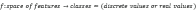

我们也可以将分类视为一种寻求分离不同数据点组的过程。一旦我们定义了我们的特征，任何例子，比如说，是我们数据集中的一个电子邮件，可以被视为特征空间中的一个点，每一个点代表一个不同的例子（或电子邮件）。机器算法的任务是画出一个超平面（即高维空间中的平面），将具有不同特征的点分开，正如我们想要将垃圾邮件与非垃圾邮件分开一样。

虽然在二维情况下可能看起来很简单，但在具有数百或数千维度的情况下可能非常复杂。

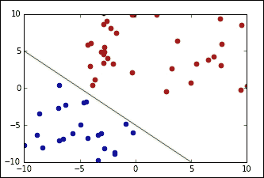

分类可以被看作是分隔输入数据的一种方式

在后面的章节中，我们将看到几个分类或回归问题的例子。我们将讨论其中一个问题是数字的分类：给定一组代表 0 到 9 的图像，机器学习算法将尝试对每个图像进行分类，并分配给它所描绘的数字。对于这样的例子，我们将使用最经典的数据集之一，即 MNIST 数据集。在这个例子中，每个数字由一个 28 x 28（=784）像素的图像表示，我们需要对每个数字进行分类，因此我们需要在 784 维空间中画出 9 个分隔超平面。

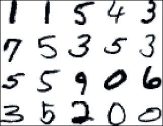

来自 MNIST 数据集的手写数字示例

## 无监督学习

机器学习算法的第二类称为*无监督学习*。在这种情况下，我们不事先为数据贴上标签，而是让算法得出结论。无监督学习中最常见、也许是最简单的例子之一是聚类。这是一种试图将数据分成子集的技术。

举例来说，在前述的垃圾邮件/非垃圾邮件的情况下，算法可能能够找到所有垃圾邮件共有的元素（例如，拼写错误的单词的存在）。尽管这可能提供比随机分类更好的结果，但不清楚垃圾邮件/非垃圾邮件是否能够如此轻松地分开。算法将数据分离成的子集是数据集的不同类别。为了使聚类有效，每个聚类中的每个元素在原则上应具有高的类内相似度和与其他类别的低相似度。聚类可以处理任意数量的类别，并且聚类方法（如 k 均值）背后的想法是找到原始数据的 k 个子集，这些子集的元素彼此之间比与其类外的任何其他元素更接近（更相似）。当然，为了做到这一点，我们需要定义*更接近*或*更相似*的含义，也就是说，我们需要定义某种度量，来定义点之间的距离。

在下图中，我们展示了一组点如何被分类成三个子集：

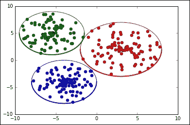

给定数据集的元素不一定需要聚集在一起形成一个有限集合，而聚类也可能包括给定数据集的无界子集，如下图所示：

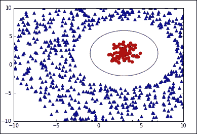

聚类并不是唯一的无监督技术，我们将看到深度学习最近的成功与其在无监督学习任务中如此有效有关。

每天都会快速产生新数据，而对所有新数据进行标记是一项相当费力和耗时的活动。无监督学习算法的一个优点是它们不需要标记数据。无监督深度学习技术和方法，比如受限玻尔兹曼机，通过从数据中抽象特征来工作。例如，使用 MNIST 数据集，受限玻尔兹曼机将提取出对每个数字独特的特征，检测每个数字的线条和曲线的形状。无监督学习通过揭示数据中的隐藏结构来分类数据，而不是通过将其与标签进行匹配。

此外，例如使用深度信念网络，我们可以通过用监督学习对其进行改进来改善无监督方法的性能。

## 强化学习

机器学习技术的第三类是*强化学习*。尽管它仍然使用反馈元素来提高性能，但它的工作方式与监督学习不同。强化学习技术的一个常见应用是教导机器如何玩游戏：在这种情况下，我们不会将每一步标记为好或坏，而是从游戏中获得反馈，要么通过游戏的结果，要么通过游戏过程中的信号，比如得分或失分。赢得游戏会反映为积极的结果，类似于识别正确的数字或电子邮件是垃圾邮件还是不是，而输掉游戏将需要进一步的“学习”。强化学习算法倾向于重复尝试过去导致成功结果的动作，就像在游戏中获胜一样。然而，在未知领域，算法必须尝试新的动作，根据结果，它将更深入地学习游戏的结构。因为通常，动作是相互关联的，因此不能将单个动作评价为“好”或“坏”，而是整体动作的动态评价。类似于在下棋时有时候牺牲一个兵可能被认为是积极的动作，如果它带来了更好的棋盘位置，尽管丢失一个棋子通常是一个负面的结果，在强化学习中，探索的是整个问题及其目标。例如，一个移动的清洁机器人可能必须决定是继续清洁房间还是开始回到充电站，并且这样的决定可以基于在类似情况下它是否能在电池耗尽之前找到充电站。在强化学习中，基本思想是*奖励*，算法将寻求最大化总奖励。

强化学习的一个简单示例可以用来玩经典的井字棋游戏。在这种情况下，棋盘上的每个位置都关联了一个概率（一个值），这是基于先前经验从该状态赢得游戏的概率。开始时，每个状态被设定为 50%，这意味着在开始时我们假设从任何位置开始我们赢得或输掉的概率是相等的。一般来说，机器将尝试朝着价值更高的位置前进以赢得游戏，并且如果失败则重新评估它们。在每个位置，机器将基于可能的结果而做出选择，而不是基于固定的确定规则。随着继续进行游戏，这些概率将得到精炼，并根据位置输出更高或更低的成功机会。

## 机器学习系统涉及的步骤

到目前为止，我们已经讨论了不同的机器学习方法，并且我们已经大致将它们组织在三种不同的类别中。另一个重要的方面是了解数据，以更好地理解手头的问题。我们需要定义的重要方面大致可以描述如下：

+   **学习者**：这代表着使用的算法及其"学习哲学"。正如我们将在下一段中看到的，有许多不同的机器学习技术可以应用于不同的学习问题。学习者的选择很重要，因为不同的问题可以更适合某些机器学习算法。

+   **训练数据**：这是我们感兴趣的原始数据集。这样的数据可能是未标记的，用于无监督学习，或者它可能包含标签，用于监督学习。确保学习者有足够的样本数据以理解问题的结构非常重要。

+   **表示**：这是数据以所选特征的方式表达，以便学习者可以摄入的方式。例如，如果我们试图使用图像对数字进行分类，这将代表描述图像像素的值数组。良好的数据表示选择对于取得更好的结果是重要的。

+   **目标**：这代表了从手头的问题中学习的原因。这与目标息息相关，并且有助于定义应该使用什么学习者和什么表示。例如，目标可能是清理我们的邮箱中不需要的邮件，目标定义了我们的学习者的目标，例如，检测垃圾邮件。

+   **目标**：这代表着正在学习和最终输出的内容。它可以是未标记数据的分类，可以是根据隐藏的模式或特征表示输入数据，可以是未来预测的模拟器，可以是对外部刺激的响应，也可以是强化学习中的策略。

无论如何强调都不为过，任何机器学习算法只能达到目标的近似值，而不能得到完美的数值描述。机器学习算法不是问题的精确数学解，而只是近似值。在前面的段落中，我们已经将学习定义为从特征空间（输入）到类别范围的函数；我们将在后面看到，某些机器学习算法，如神经网络，理论上可以被证明能够近似地逼近任何函数到任何程度。这个定理被称为通用逼近定理，但这并不意味着我们可以得到问题的精确解。此外，通过更好地理解训练数据，可以更好地解决问题。

通常，使用经典机器学习技术可解决的问题在部署之前可能需要对训练数据进行深入了解和清理。如果我们要陈述处理机器学习问题所需的一些步骤，我们可以总结如下：

+   **数据收集**：这意味着尽可能收集尽可能多的数据，并且在监督学习问题中还要正确标记数据。

+   **数据处理**：这意味着清理数据（例如删除多余或高度相关的特征，或填充缺失数据），并且理解定义训练数据的特征。

+   **测试用例的创建**：通常数据可以分为两到三组：一个用于训练算法的训练数据集，一个用于在训练算法后测试方法准确性的测试数据集。通常情况下，我们还会创建一个用于最终测试（或验证）的验证数据集，经过多次训练-测试流程后，我们最终满意结果，进而做最终测试（或验证）。

有充分的理由创建一个测试集和一个验证集。正如我们所提到的，机器学习技术只能产生期望结果的近似值。这是因为通常情况下，我们只能包括有限数量的变量，而可能有许多变量是我们无法控制的。如果我们只使用一个数据集，我们的模型可能最终会“记住”数据，并在已记住的数据上产生极高的准确性值，但这个结果可能无法在其他类似的数据集上重现。机器学习技术的一个关键目标是其泛化能力。这就是为什么我们既创建了一个用于训练后模型选择调整的测试数据集，又创建了一个仅在流程结束时才用于确认所选算法有效性的最终验证数据集。

为了理解在数据中选择有效特征的重要性以及避免“记忆”数据的重要性（更技术性的术语是文献中所称的“过拟合”，从现在开始我们将使用这个术语），让我们用一个来自*xkcd*漫画的笑话来举例（[`xkcd.com/1122`](http://xkcd.com/1122)）："直到 1996 年，没有一个现任的民主党美国总统候选人，且没有军事经验，曾经打败过任何人名的首字母在 Scrabble 中价值更高的人"。很显然，这种“规则”在这个例子中是没有意义的，但它突出了选择有效特征的重要性（一个人的名字在 Scrabble 中价值多少与选择美国总统有关吗？），而选择随机特征作为预测因子，虽然可能会预测当前数据，但不能用作更一般数据的预测器，而 52 次选举中这一点成立只是一个简单的巧合。这通常被称为过拟合，也就是说，做出与手头数据完全吻合的预测，但不能推广到更大的数据集。过度拟合是试图理解通常所说的“噪音”（即，没有任何实际意义的信息）的过程，并尝试适应模型的小扰动。

另一个例子可以通过尝试使用机器学习来预测从地面抛出并上升到又落回地面的球的轨迹（不是垂直向上）。物理学告诉我们，轨迹呈抛物线状，我们期望一个好的机器学习算法观察到数千次这样的抛掷会得出一个抛物线作为解。然而，如果我们放大球并观察空气湍流中最小的波动，我们可能会注意到球不会保持稳定的轨迹，而可能受到小的扰动。这就是我们所称的“噪音”。试图模拟这些小扰动的机器学习算法将无法看到整体图景，并得出一个不令人满意的结果。换句话说，过拟合是使机器学习算法看到树木而忘记了整个森林的过程。

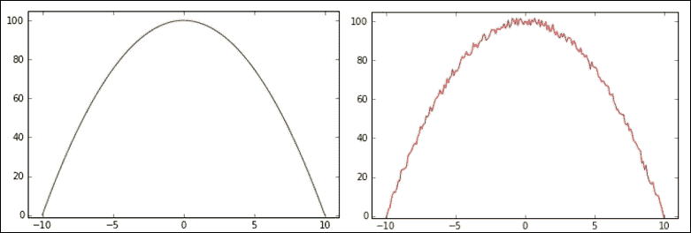

一个好的预测模型与一个糟糕的（过拟合的）预测模型有着不同的轨迹，对于一个从地面上抛出的球的轨迹来说。

这就是为什么我们将训练数据与测试数据分开的原因：如果测试数据的准确率与在训练数据上获得的结果不相似，那么这将是一个很好的指示，表明我们已经过度拟合了模型。当然，我们也需要确保我们不犯相反的错误，也就是说，不要欠拟合模型。但是在实践中，如果我们的目标是尽可能地使我们的预测模型在我们的训练数据上尽可能准确，那么欠拟合比过拟合的风险要小得多，因此我们应尽量避免过度拟合模型。

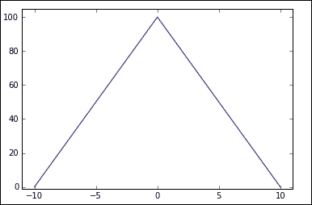

欠拟合也可能是一个问题

## 流行技术/算法的简要描述

除了根据它们的"学习风格"将算法分组之外，即本书开头讨论的三类，监督学习、无监督学习和强化学习，我们还可以根据它们的实现将它们分组。显然，上面讨论的每个类别都可以使用不同的机器学习算法来实现，例如，有许多不同的监督学习技术，每种技术可能最适合于手头的特定分类或回归任务。事实上，分类和回归之间的区别是最关键的之一，并且理解我们试图完成的任务是很重要的。

以下绝不意味着是一个详尽的列表或对每种机器学习方法的彻底描述，对于这些，我们建议读者参考 Sebastian Raschka 的书籍*Python Machine Learning* ([`www.packtpub.com/big-data-and-business-intelligence/python-machine-learning`](https://www.packtpub.com/big-data-and-business-intelligence/python-machine-learning))，而是意味着作为一个简单的回顾，为读者提供不同技术的简单味道以及深度学习与它们的区别。在接下来的章节中，我们将看到深度学习不仅仅是另一种机器学习算法，而且在很多方面与传统的机器学习技术不同。

我们将介绍一个回归算法，线性回归，经典的分类器，如决策树、朴素贝叶斯和支持向量机，以及无监督的聚类算法，如 k 均值，和强化学习技术，交叉熵方法，仅仅是对存在的各种机器学习技术的一个小小的了解，我们将通过介绍神经网络来结束这个列表，这是本书的主要焦点。

### 线性回归

回归算法是一种监督算法，它使用输入数据的特征来预测一个值，例如给定某些特征（如大小、年龄、浴室数量、楼层数、位置等）可以预测出房屋的价格。回归分析试图找到最能拟合输入数据集的函数参数值。在线性回归算法中，目标是通过找到适当的函数参数来最小化成本函数，使其最好地逼近目标值。成本函数是一个错误的函数，它表示我们离正确结果有多远。通常使用的成本函数是均方误差，其中我们计算预期值与预测结果之间的差的平方。对所有输入示例的总和给出了算法的错误值，它代表了成本函数。

假设我们有一所 100 平方米的房子，建于 25 年前，有三个浴室，两层。此外，假设我们将房子所在的城市分成 10 个不同的区域，用从 1 到 10 的整数表示，假设这所房子位于编号为 7 的区域。我们可以用一个 5 维向量 *x = (100, 25, 3, 2, 7)* 来对这所房子进行参数化。假设我们还知道这所房子的估计价值为€10,0000。我们想要实现的是创建一个函数 *f*，使得 *f(x) = 100000*。

在线性回归中，这意味着找到一个向量*w =（w*[1]*，w*[*2*]*，w*[*3*]*，w*[*4*]*，w*[*5*]*）*，使*100*w*[*1*]* + 25*w*[*2*]* + 3*w*[*3*]* + 2*w*[*4*]* + 7*w*[*5*]* = 100000*。如果我们有一千幢房子，我们可以为每栋房子重复相同的过程，理想情况下，我们希望找到一个* w*向量，可以为每栋房子预测正确的值（或足够接近）。假设我们最初选择了一些* w*的随机值。在这种情况下，我们不希望* f(x)* = 100* w*[*1*]* + 25* w*[*2*]* + 3* w*[*3*]* + 2* w*[*4*]* + 7* w*[*5*]* 等于 1,00,000，因此我们可以计算误差∆ =（100000 − * f(x) *）*[*2*]*。这是一个示例* x*的均方误差，所有示例的均方误差的均值代表了我们的成本，也就是我们的函数与真实值的差异有多少。因此，我们的目标是最小化此误差，为此我们计算成本函数相对于* w *的导数δ。导数指示函数增加（或减少）的方向，因此，把* w *移动到导数的相反方向会提高我们函数的准确性。这是线性回归的要点，向着成本函数的最小值移动，这代表了错误。当然，我们需要决定我们想以多快的速度沿着导数指示的方向移动，因为我们的导数只指明了一个方向。成本函数不是线性的，因此我们需要确保只在导数指示的方向上迈出小步。迈出太大的一步可能会导致我们超过最小值，因此无法收敛到最小值。这一步的大小就是所谓的*学习率*，让我们用符号“*lr*”表示它的大小。

通过设置*w = w -* δ**lr,* 我们因此改善了*w*向更好解决方案的选择。重复这个过程多次将产生表示* f*的最佳可能选择的*w*值。然而，我们应该强调，如果空间不是凸的，这个过程只在局部起作用，并且可能无法找到全局的最佳值。正如图像所暗示的，如果存在许多局部最小值，算法可能最终会被困在其中一个局部最小值中，无法逃脱到达误差函数的全局最小值，类似于一个小球从山上滚下来，可能会卡在一个小山谷中，无法到达山底。

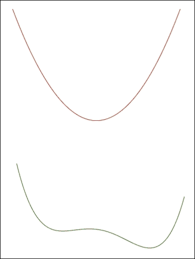

顶部图是凸的，因此只存在一个最小值。在底部图中，函数有两个局部最小值，因此，取决于初始化，该过程可能会找到第一个不是全局最小值的局部最小值。

### 决策树

另一个广泛使用的监督算法是决策树算法。决策树算法创建一个“树”形式的分类器。决策树由决策节点组成，其中对特定属性进行测试，以及指示目标属性值的叶节点。决策树是一种分类器，通过从根节点开始并通过决策节点向下移动直到达到叶子节点来工作。

该算法的一个经典应用是鸢尾花数据集（[`archive.ics.uci.edu/ml/datasets/Iris`](http://archive.ics.uci.edu/ml/datasets/Iris)），其中包含来自三种鸢尾花（山鸢尾、维吉尼亚鸢尾和变色鸢尾）的 50 个样本的数据。创建数据集的罗纳德·费舍尔测量了这些花的四种不同特征，即它们的萼片的长度和宽度，以及它们的花瓣的长度和宽度。根据这些特征的不同组合，可以创建一个决策树来决定每朵花属于哪个物种。在这里，我们将描述一个简单的简化决策树，它将只使用这两个特征，花瓣的长度和宽度，就能正确分类几乎所有的花。

我们从第一个节点开始，我们对花瓣长度进行第一个测试：如果花瓣长度小于 2.5，则该花属于山鸢尾物种。事实上，这将正确地对所有花瓣长度小于 2.5 厘米的山鸢尾花进行分类。因此，我们到达了一个标记为山鸢尾的叶子节点。如果花瓣长度大于 2.5，我们选择另一条分支，我们到达一个新的决策节点，并测试花瓣宽度是否大于 1.8。如果花瓣宽度大于或等于 1.8，则我们到达一个叶节点，并将我们的花分类为维吉尼亚鸢尾，否则我们到达一个新的决策节点，在这里我们再次测试花瓣长度是否大于 4.9。如果是，则我们到达一个标记为维吉尼亚鸢尾花的叶子节点，否则我们到达另一个标记为变色鸢尾花的叶子节点。

所讨论的决策树可以表示如下，其中左分支反映了决策节点中测试的积极答案，而右分支表示决策节点中测试的否定答案。每个分支的末端节点都是叶节点。

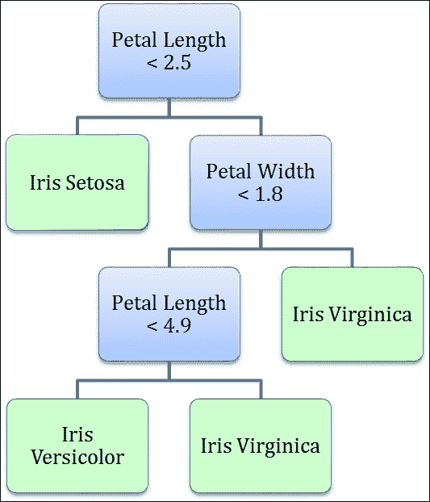

这个例子展示了决策树算法与线性回归有多么不同。此外，当我们介绍神经网络时，读者将能够通过使用相同的数据集来看到神经网络是如何工作的一个示例。在那个例子中，我们还将提供 Python 代码，并展示一些神经网络将如何基于它们的特征来尝试分离花朵的图片。

### K-means

如我们已经讨论过的，聚类算法是一种无监督的机器学习方法。最常见的聚类技术是称为 k-means 聚类的技术，它是一种将数据集中的每个元素分组到 k 个不同子集中的聚类技术（因此在名称中有 *k*）。K-means 是一个相对简单的过程，包括选择代表 k 个不同子集的随机 k 点，称为中心。然后，我们为每个中心选择所有最接近它的点。这将创建 k 个不同的子集。此时，对于每个子集，我们将重新计算中心。我们再次有 *k* 个新中心，然后重复上述步骤，为每个中心选择与中心最接近的新子集。我们继续这个过程，直到中心停止移动。

很明显，为了使这种技术起作用，我们需要能够识别一种允许我们计算点之间距离的度量标准。此过程可以总结如下：

1.  选择初始 k 点，称为中心点。

1.  将数据集中的每个点与最近的中心关联起来。

1.  计算与特定中心点关联的点集的新中心。

1.  将新中心定义为新的中心。

1.  重复步骤 3 和 4，直到中心停止移动。

需要注意的是，此方法对随机中心的初始选择非常敏感，可能重复使用不同的初始选择是个好主意。此外，某些中心可能不是数据集中任何点最近的中心，将子集数目减少到 k。值得一提的是，如果我们在上面讨论决策树的例子中使用 *k=3* 的 k-means，我们可能不会得到与使用决策树找到的鸢尾花数据集相同的分类，再次强调了如何重要地为每个问题选择和使用正确的机器学习方法。

现在，让我们讨论一个使用 k-means 聚类的实际示例。假设一个披萨外卖店想要在一个新城市开设四家新的连锁店，他们需要选择四个新店的位置。这是一个可以通过 k-means 聚类轻松解决的问题。其思想是找到最常订购披萨的地点；这些地点将成为我们的数据点。接下来，我们选择四个随机点作为站点位置。通过使用 k-means 聚类技术，我们可以后来确定最佳位置，以最小化到每个送货地点的距离。这是一个 k-means 聚类可以帮助解决业务问题的例子。

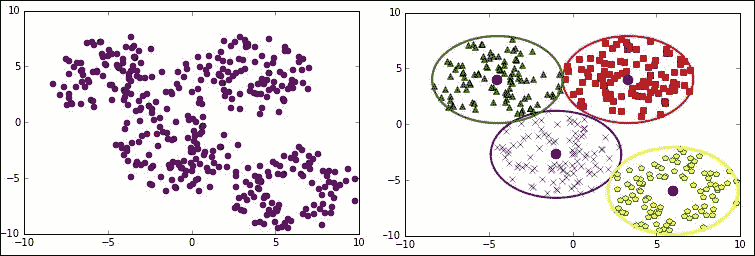

左边是披萨最常送达的点的分布。右边是圆点表示新的连锁店应该位于的位置及其相应的送货区域

### 朴素贝叶斯

朴素贝叶斯不同于许多其他机器学习算法。从概率上讲，大多数机器学习技术试图评估的是在给定条件*X*下某个事件*Y*的概率，我们用*p(Y|X)*表示。例如，给定描述数字的图片(即，具有特定像素分布的图片)，那么该数字为 5 的概率是多少？如果像素的分布接近于其他标记为 5 的示例的像素分布，那么该事件的概率将很高，否则概率将很低。

有时我们具有相反的信息，也就是说，我们知道我们有一个事件*Y*的情况下，我们知道样本为*X*的概率。贝叶斯定理说明：*p(X|Y) = p(Y|X)*p(X)/p(Y)*，其中*p(X|Y)*表示在知道*Y*的情况下生成实例*X*的概率，这也是为什么朴素贝叶斯被称为生成方法。简而言之，我们可以计算某个像素配置代表数字 5 的概率，知道在有 5 的情况下，即使随机像素配置可能与给定的一致，这是为什么。

这在医学测试领域是最容易理解的。假设我们针对特定疾病或癌症进行测试。我们想知道在我们测试结果为阳性的情况下，我们可能患有特定疾病的概率是多少。现在，大多数测试都有可靠性值，这是在针对患有特定疾病的人群时测试呈阳性的概率。通过颠倒表达式*p(X|Y) = p(Y|X)*p(X)/p(Y)*，我们有：

*p(癌症 | 测试=阳性) = p(测试=阳性 | 癌症) * p(癌症)/p(测试=阳性)*

假设测试的可靠率为 98%，这意味着在 98%的情况下，如果一个人患有癌症，那么测试结果为阳性，同样地，如果一个人没有癌症，测试结果将为阴性。还假设这种特定的癌症只影响年龄较大的人，50 岁以下的人中只有 2%的人患有这种癌症，对于这部分人群进行测试，结果呈阳性的概率仅占到人群的 3.9%（我们可以从数据中推导出这个事实，但为简单起见，我们提供这些信息）。

我们可能会提出这样一个问题：如果一项癌症测试的准确率为 98%，45 岁的人接受了测试，并且测试结果呈阳性，那么他/她可能患癌症的概率是多少？使用上述公式，我们可以计算：

*p(癌症 | 测试=阳性) = 0.98 * 0.02/0.039 = 0.50*

因此，尽管测试的准确性很高，朴素贝叶斯告诉我们我们还需要考虑这样一个事实：50 岁以下罹患癌症的情况相当罕见，因此仅仅通过测试结果的阳性并不能给出 98%的癌症患病概率。概率*p(癌症)*，或者更一般地说是我们试图估计的结果的概率 p，被称为先验概率，因为它代表了没有任何额外信息的事件概率，也就是在我们进行测试之前的概率。

此时，我们可能会想知道如果我们有更多信息会发生什么，例如如果我们使用了可靠性更高的不同测试，或者了解了一些人的信息，例如家族中的癌症复发情况。在上述方程中，我们使用了作为计算因素之一的概率 *p(test=positive | cancer)*，如果我们进行第二个测试，并且结果也为正，我们也会有 *p(test2=positive | cancer)*。朴素贝叶斯技术假设每个信息片段都是独立的（这意味着第二个测试的结果不知道第一个测试的结果，并且它与第一个测试无关，即进行第一个测试不能改变第二个测试的结果，因此它的结果不受第一个测试的影响）。朴素贝叶斯是一种分类算法，它假设不同事件之间是相互独立的，以计算它们的概率。因此：

*= p(当第一个测试和第二个测试都为正时，癌症的条件概率) =p(当第一个测试为正时，癌症的条件概率)*p(当第二个测试为正时，癌症的条件概率)*

这个方程也称为在人确实患有癌症的情况下，*test1*和*test2*为阳性的概率 *L(test1 和 test2 = pos)*。

我们可以将方程重写为：

*= p(癌症在两个测试都为正时的条件概率) =*

*= p(当两个测试为正时，癌症的条件概率)*p(癌症)/p(两个测试都为正)* =*

*= p(当第一个测试为正时，癌症的条件概率)*p(当第二个测试为正时，癌症的条件概率)*p(癌症)/p(两个测试都为正)*

### 支持向量机

支持向量机是一种用于分类的监督机器学习算法。支持向量机相对于其他机器学习算法的优势在于，它不仅将数据分成类别，而且还通过寻找最大化将每个点与超平面（多于三个维度的空间中的平面的类比）分离的分隔超平面来实现这一目标。此外，支持向量机还可以处理数据不是线性可分的情况。处理非线性可分数据的方法有两种，一种是引入软边界，另一种是引入所谓的核技巧。

松弛边界在保留算法大部分预测能力的同时允许存在少量错误分类的元素。正如我们上面所讨论的，在实践中，最好不要过度拟合任何机器学习模型，我们可以通过放宽一些支持向量机的假设来实现这一点。

相反，核技巧涉及将特征空间映射到另一个空间，在该空间中我们可以定义一个超平面，将其映射回特征空间时，它不再是一个线性超平面，从而允许分离数据集中看似不可分离的元素。由于本书主要关注深度学习，我们不会详细讨论支持向量机的实现方式，这可能会花费太多时间，而是要强调支持向量机之所以非常流行和有效的概念，这要归功于它们能够推广到非线性情况。正如我们之前所见，监督式机器学习算法的任务是找到从特征空间到一组类别的函数。每个输入*x= (x*[*1*]*, x*[2]*, …, x*[n])表示一个输入示例，而每个*x[i]*表示第*i*个特征的值。早些时候我们举了一个例子，试图根据一些特征（如浴室数量或位置）来估计某个房屋的转售价值。如果第*i*个特征对应于浴室数量，则*x[i]*将对应于房屋*x*中存在的浴室数量。我们可以从特征空间创建一个函数*k*到这个空间的另一个表示，称为核：例如，*k*可以将*x*[i]映射到*(x*[i]*)*²，并且通常将特征空间非线性地映射到另一个空间*W*。因此，在*W*中的分离超平面可以映射回特征空间，其中它将不再是线性超平面。这个条件确切的定义在哪些情况下成立是明确定义的，但超出了这个简短介绍的范围。然而，这再次突显了在经典机器学习算法中选择正确特征的重要性，这样的选择可以帮助找到特定问题的解决方案。

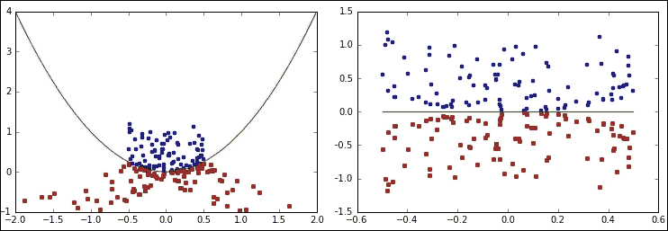

左侧是应用核之前的非线性可分数据集。右侧是应用了核之后的相同数据集，数据可以线性分离。

### 交叉熵方法

到目前为止，我们介绍了监督学习和无监督学习算法。相反，交叉熵方法属于强化学习类算法，将在本书的第七章和第八章中详细讨论，《棋类游戏的深度学习》和《电子游戏的深度学习》。交叉熵方法是解决优化问题的技术，即找到最佳参数以最小化或最大化特定函数。

通常，交叉熵方法包括以下阶段：

1.  生成我们试图优化的变量的随机样本。对于深度学习，这些变量可能是神经网络的权重。

1.  运行任务并存储性能。

1.  识别最佳运行并选择性能最佳的变量。

1.  根据表现最佳的运行，计算每个变量的新均值和方差，并生成变量的新样本。

1.  重复步骤，直到达到停止条件或系统停止改进。

假设我们正在尝试解决一个依赖于许多变量的函数，例如我们正在尝试建立一个模型飞机，当从特定高度发射时，它能够飞得最远。飞机飞行的距离将取决于其机翼的大小、它们的角度、重量等。每次，我们都可以记录每个变量，然后发射飞机并测量它飞行的距离。但是，我们不是尝试所有可能的组合，而是创建统计数据，我们选择最佳和最差的运行，并注意在最佳运行和最差运行期间变量设置的值。例如，如果我们发现每次最佳运行飞机都具有特定大小的机翼，我们可以得出结论，该特定大小可能对于飞机飞行很远是最优的。相反，如果对于每次最差运行，飞机的机翼都处于某个角度，我们会得出结论，该特定角度对于我们飞机的机翼是一个不好的选择。总的来说，我们将为应该产生最佳飞机的每个值产生一个概率分布，这些概率不再是随机的，而是基于我们收到的反馈。

因此，该方法利用运行的反馈（飞机飞了多远）来确定问题的最佳解决方案（每个变量的值），这是典型的强化学习过程。

### 神经网络

在给读者带来一些流行的经典机器学习算法之后，我们现在将介绍神经网络，并深入解释它们的工作原理以及它们与我们简要总结的算法的区别。

神经网络是另一种机器学习算法，它们有着高人气的时期和极少被使用的时期。理解神经网络，我们将在接下来的几章中专门介绍，确实是理解本书内容的关键。

第一个神经网络的例子被称为感知机，它是由弗兰克·罗森布拉特于 1957 年发明的。感知机是一个由输入层和输出层组成的网络。在二元分类的情况下，输出层只有一个神经元或单元。一开始，感知机似乎非常有前途，但很快就发现它只能学习线性可分的模式。例如，马文·明斯基和西摩·帕普特证明它无法学习异或逻辑函数。在其最基本的表示中，感知机只是一个神经元及其输入的简单表示，输入可以由多个神经元组成。

给定不同的输入到一个神经元，我们通过公式定义激活值，其中*x* [*i*]是输入神经元的值，而*w* [*i*]是神经元 *i* 和输出之间的连接值。我们将在下一章节中深入学习这个公式，现在我们只需要注意感知机与逻辑回归算法有许多相似之处，并且也受到线性分类器的限制。如果激活值（被视为神经元的内部状态）大于固定阈值 *b*，则神经元将被激活，即会发生激活，否则不会。

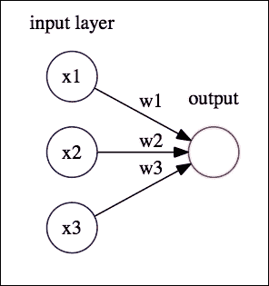

一个带有三个输入单元（神经元）和一个输出单元（神经元）的简单感知机。

上面定义的简单激活可以理解为向量**w**和向量**x**的点积。向量**w**是固定的，并且它定义了感知机的工作方式，而**x**表示输入。如果*<* **w,x** *> = 0*，则向量**x**垂直于权重向量**w**，因此所有满足*<* **w,x** *> = 0*的向量**x**定义了**R** ^(*3*) （其中*3*是**x**的维度，但通常可以是任何整数）中的一个超平面。因此，任何满足*<* **w,x** *> > 0*的向量**x**都是位于**w**定义的超平面的一侧的向量。这清楚地说明了感知机如何定义一个超平面，并且可以作为一个分类器工作。一般而言，我们可以将阈值设置为任何实数*b*，这使得超平面远离原点。然而，通常我们在网络中包含一个偏置单元，它是一个始终开启（*值为 1*）的特殊神经元，并具有连接权重*-b*。在这种情况下，如果连接权重的值为*-b*，激活值变为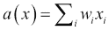，而设置*a(x) > 0*等同于设置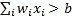。

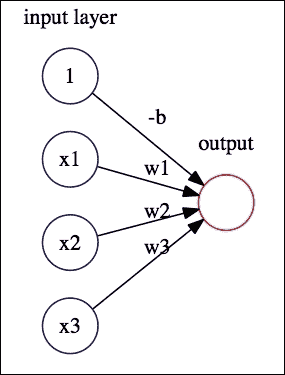

一个感知机加上一个偏置单元作为输出向量。偏置单元始终为开启状态。

感知机在性能上有限，但在历史上非常重要，因为它们是神经网络的第一个例子。

神经网络当然不需要只有一个输出神经元，事实上，一般情况下不会只有一个。如果网络有多个输出神经元，那么对于每个输出神经元，我们可以重复相同的过程。然后，每个权重都将被标记为两个指标，*i* 和 *j*，以指示权重连接了输入层的神经元 *i* 和输出层的神经元 *j*。还将从偏置单元连接到输出层的每个神经元，其值为 1。还应该注意，我们可以在激活值上定义不同的活动函数。我们已经将激活值定义为 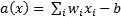（从现在开始，我们将假设偏差已包含在此公式中），并且我们已经说过，如果激活大于 *0*，则神经元激活。正如我们将看到的，这已经定义了一个活动函数，即在激活上定义的函数，即在神经元的内部状态上定义的函数，并且这被称为阈值活动，因为当激活大于 *0* 时，神经元激活。但是，我们将看到，神经网络可以具有许多不同的活动函数，这些函数可以在其激活值上定义，并且我们将在下一章中对其进行更详细的讨论。

### 深度学习

前面的段落介绍了一个非常简单的神经网络示例，即前馈 1 层网络。它们被称为前馈，因为信息从输入向输出传递，永远不会循环返回，而且是 1 层，因为除了输入层之外只有 1 个输出层。这不是一般情况。当我们提到它们只能处理线性可分数据时，我们已经讨论了前馈 1 层网络的局限性，特别是我们提到它们无法逼近逻辑异或函数。然而，存在具有额外层的网络，这些层位于输入和输出层之间：这些层称为隐藏层。具有隐藏层的前馈网络将信息从输入通过其隐藏层传递到输出层，这定义了一个接受输入并定义输出的函数。存在一个定理，称为通用定理，它说明任何函数都可以由具有至少一个隐藏层的神经网络逼近，并且我们将在下一章中给出为什么这是正确的直觉。

长时间以来，考虑到这个定理以及与复杂网络合作的困难，人们一直使用只有一个隐藏层的浅层网络。然而，最近人们意识到，具有许多隐藏层的更复杂的网络可以理解比浅层网络更多的抽象层次。此外，还引入了循环网络，其中神经元也可以将信息反馈给自身。一些神经网络的结构也可以允许定义能量函数，从而可以创建记忆。所有这些令人兴奋的功能将在接下来的章节中讨论，我们将深入研究深度学习的最新发展。

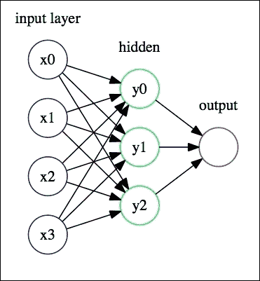

一个隐藏层的神经网络

## 在现实生活中的应用

一般来说，机器学习，尤其是深度学习，在预测质量、特征检测和分类方面正在产生越来越令人惊讶的结果。近年来，许多最近的结果都成为了新闻。进展如此之快，以至于许多专家担心很快机器将比人类更加智能。在 2015 年 10 月 14 日的联合国会议上，人工智能专家和其他许多领域的研究人员警告说，需要定义道德准则来防止超级智能机器可能给人类社会带来的危险。这些担忧源于一些最近的令人难以置信的结果，其中计算机已经能够击败人类最好的冠军，在人们认为直觉会给人类在与机器的比赛中带来优势的游戏中。

AlphaGo 是基于深度学习的人工智能机器，在 2016 年曾因击败世界围棋冠军李世石而成为新闻头条。在 2016 年 1 月，AlphaGo 已经因击败欧洲冠军范辉而成为新闻，尽管当时看起来不太可能击败世界冠军。几个月后，AlphaGo 成功通过以 4-1 的胜利系列横扫对手来实现这一非凡壮举。庆祝的原因在于围棋比其他游戏（如国际象棋）拥有更多可能的游戏变化，因此不可能事先考虑所有可能的走法。此外，在围棋中，即使是判断当前棋局上的单个棋子的位置或价值也是非常困难的，与国际象棋不同。

AlphaGo 的优势在于它不是被编程来玩游戏的，而是通过使用强化学习和深度学习技术与自身进行数千场比赛而*学会*玩游戏的。学习能力是使机器学习，尤其是深度学习，成为解决问题的完全不同方法的原因。深度学习是关于创建可以自己学习的程序，几乎不需要人类的帮助。

但是，深度学习获得重大成功的领域的种类不仅限于游戏。Kaggle([`www.kaggle.com`](http://www.kaggle.com))是一个主办许多不同机器学习竞赛的网站。这些竞赛在使用领域和应用领域上有很大的差异。2013 年，俄勒冈大学发起了一场竞赛，要求使用机器学习技术通过标准的实际音频数据录音来检测和识别鸟类。为了更好地了解鸟类种群趋势，通常需要付出昂贵的人力努力。机器学习通过仅仅通过听音频记录自动识别存在的鸟类来解决这个问题。

亚马逊最近启动了另一项竞赛，用于解决员工访问内部计算机和网络的问题，希望成功的解决方案能够减少人工监督干预带来的昂贵延迟。

2015 年，芝加哥卫生部举办了一场比赛，要求提供“根据天气、地点、检测和喷洒数据……在什么地方以及何时会检测到不同种类的蚊子携带西尼罗河病毒”的答案。

2015 年 8 月，一项竞赛要求预测西澳大利亚的租金价格，2016 年 2 月，法国巴黎银行 BNP Paribas 发起了一场竞赛，以加快其索赔管理流程。

这提供了一些用机器学习解决的问题的种类，值得注意的是，所有这些比赛都提供了最佳解决方案的奖励。2009 年，Netflix 推出了一项百万美元的竞赛，以提高其根据用户之前观看电影的排名预测用户可能喜欢的电影的准确性，而数据科学家的工作通常被排名为工资最高且最受欢迎的工作之一。

从自动驾驶汽车、军事无人机和目标侦查系统到医疗应用，例如能够读取医生笔记以发现潜在健康问题的应用以及能够提供面部识别的监控系统，机器学习在各种应用中得到了常规使用。

光学字符识别广泛应用于诸如邮局等机构，以读取信封上的地址，我们将展示如何使用 MNIST 数据集将神经网络应用于数字识别。自主无监督深度学习在**自然语言处理** (**NLP**)方面也有许多应用和出色的成果，我们每个人几乎在自己的智能手机上都有一个应用深度学习在 NLP 上的 NLP 应用，因为苹果和安卓都使用应用于 NLP 的深度学习来作为虚拟助手（例如，Siri）。机器学习还可以应用于生物特征识别，例如识别指纹、DNA 或视网膜。此外，自动驾驶汽车在近年来取得的进展已经到达了一个现实的阶段。

机器学习也可以应用于目录中的图片或者更重要的卫星图像，根据它们是不是城市环境，是否描述了森林、冰区、水域等不同环境进行描述。

总而言之，机器学习最近在我们生活的方方面面都找到了应用，并且其准确性和性能也得到了持续改善，这也要归因于越来越好和更快的计算机。

## 一个受欢迎的开源包

机器学习是一个受欢迎且竞争激烈的领域，有许多开源包实现了大多数经典的机器学习算法。其中最受欢迎的是`scikit-learn`（[`scikit-learn.org`](http://scikit-learn.org)），这是一个广泛使用的 Python 开源库。

`scikit-learn`提供了实现大多数经典机器学习分类器、回归器和聚类算法的库，例如**支持向量机**（**SVM**）、最近邻、随机森林、线性回归、k 均值、决策树和神经网络等许多机器学习算法。

基类`sklearn`有几个可用的包，取决于选择的算法类型，比如`sklearn.ensemble`、`sklearn.linear_model`、`sklearn.naive_bayes`、`sklearn.neural_network`、`sklearn.svm`和`sklearn.tree`。

也有一些辅助工具来进行交叉验证，以及帮助选择最佳特征。我们将不再花时间抽象地描述所有功能，而是从使用多层神经网络的一个简单示例开始。`scikit-learn`库使用类似签名的方法来实现每种机器学习算法，因此分类器共享相同的通用功能。此外，我们希望读者能够快速了解神经网络的功能，而无需花时间从头开始创建神经网络。下一章将讨论其他库以及更多复杂的深度学习神经网络类型的实现，但目前，用户可以快速了解它们的功能。

例如，如果想要在 scikit-learn 中使用多层神经网络，只需在程序中导入它即可：

```py
from sklearn.neural_network.multilayer_perceptron import MLPClassifier
```

每个算法都需要使用预定义的参数进行调用，尽管在大多数情况下可以使用默认值。对于 MLPClassifier 来说，不需要参数，可以使用默认值（所有参数都在 scikit-learn 网站上描述，特别是对于 MLPClassifier 可以在这里找到它们：[`scikit-learn.org/dev/modules/generated/sklearn.neural_network.MLPClassifier.html`](http://scikit-learn.org/dev/modules/generated/sklearn.neural_network.MLPClassifier.html)）。

然后在训练数据上调用该算法，使用标签来调整参数，使用`fit`函数：

```py
MLPClassifier().fit(data, labels)
```

一旦算法在训练数据上拟合好，它就可以使用`predict_proba`函数在测试数据上进行预测，该函数将为每个类输出概率：

```py
probabilities = MLPClassifier().predict_proba(data)
```

让我们写一个完整的例子，演示如何在我们简要介绍决策树时简要讨论的`iris`数据集上使用`MLPClassifier`分类器。

Scikit-learn 使加载重要的经典数据集变得很容易。要做到这一点，我们只需要：

```py
from sklearn import datasets
iris = datasets.load_iris() 
data = iris.data 
labels = iris.target
```

这将加载数据集。现在，要加载分类器，我们只需要：

```py
from sklearn.neural_network.multilayer_perceptron import MLPClassifier
```

现在我们使用数据来调整参数：

```py
mlp = MLPClassifier(random_state=1) 
mlp.fit(data, labels)
```

现在，由于权重是随机初始化的，`random_state`值只是为了强制初始化始终使用相同的随机值，以便在不同试验中获得一致的结果。这与理解过程完全无关。`fit`函数是调用的重要方法，它是通过使用提供的数据和标签，在受监督的方式下训练算法以找到最佳权重的方法。

现在我们可以检查我们的预测并将其与实际结果进行比较。由于函数`predict_proba`输出概率，而`predict`输出具有最高概率的类，因此我们将使用后者进行比较，并使用 sikit-learn 的一个辅助模块来给出准确度：

```py
pred = mlp.predict(data)
from sklearn.metrics import accuracy_score 
print('Accuracy: %.2f' % accuracy_score(labels, pred))
```

就是这样。当然，正如我们提到的，通常最好将我们的数据分为训练数据和测试数据，并且我们还可以通过对数据进行一些正则化来改进这个简单的代码。Scikit-learn 也提供了一些辅助函数：

```py
from sklearn.cross_validation import train_test_split 
from sklearn.preprocessing import StandardScaler
data_train, data_test, labels_train, labels_test = train_test_split(data, labels, test_size=0.5, random_state=1)  
scaler = StandardScaler() 
scaler.fit(data) 
data_train_std = scaler.transform(data_train) 
data_test_std = scaler.transform(data_test)  
data_train_std = data_train 
data_test_std = data_test
```

这段代码很容易理解，我们将数据拆分并对其进行归一化处理，这意味着我们减去均值并将数据缩放到单位方差。然后我们在训练数据上拟合我们的算法，然后在测试数据上进行测试：

```py
mlp.fit(data_train, labels_train)
pred = mlp.predict(data_test)
print('Misclassified samples: %d' % (labels_test != pred).sum())
from sklearn.metrics import accuracy_score print('Accuracy: %.2f' % accuracy_score(labels_test, pred))
```

然后我们得到以下输出：

```py
Misclassified samples: 3 Accuracy: 0.96

```

我们可以绘制一些图片来展示数据以及神经网络将空间分成三个区域以分离三种类型的花（由于我们只能绘制二维图片，我们一次只会绘制两个特征）。第一个图显示了算法如何根据花瓣的宽度和长度来分离花，而没有对数据进行归一化：

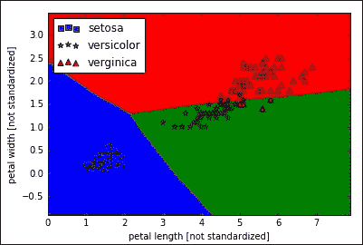

第二个图显示了基于花瓣宽度和花萼宽度的分离情况：

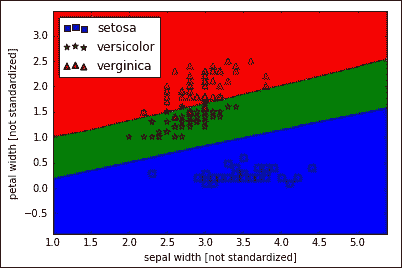

第三个图显示了第一个图的相同数据，在归一化数据之后：

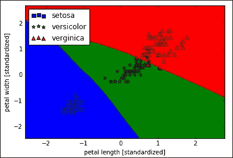

最后，第四个图与第二个图相同，只是数据已归一化：

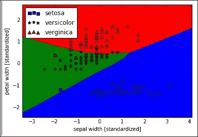

我们还展示了用于创建这些图形的代码。请注意，用于绘制这些图片的代码是根据 Sebastian Raschka 在他的*Python 机器学习*书籍中的类似代码进行调整的，该书由 Packt Publishing 出版，我们建议读者参考该书获取更多详情。

制作上述图形的代码如下。请注意，在数据之前必须设置为仅包含与两个变量相关的数据，例如对于萼片和花瓣长度，`data = iris.data[:,[1,3]]`，因为我们只能绘制二维图像。

```py
import numpy
from matplotlib.colors import ListedColormap 
import matplotlib.pyplot as plt
markers = ('s', '*', '^') 
colors = ('blue', 'green', 'red') 
cmap = ListedColormap(colors)   
x_min, x_max = data[:, 0].min() - 1, data[:, 0].max() + 1 
y_min, y_max = data[:, 1].min() - 1, data[:, 1].max() + 1 
resolution = 0.01  
x, y = numpy.meshgrid(numpy.arange(x_min, x_max, resolution), numpy.arange(y_min, y_max, resolution)) 
Z = mlp.predict(numpy.array([x.ravel(), y.ravel()]).T) 
Z = Z.reshape(x.shape)  
plt.pcolormesh(x, y, Z, cmap=cmap) 
plt.xlim(x.min(), x.max()) 
plt.ylim(y.min(), y.max())  
# plot the data 
classes = ["setosa", "versicolor", "verginica"] 
for index, cl in enumerate(numpy.unique(labels)):     
plt.scatter(data[labels == cl, 0], data[labels == cl, 1], c=cmap(index), marker=markers[index], s=50, label=classes[index])     
plt.xlabel('petal length') 
plt.ylabel('sepal length') 
plt.legend(loc='upper left') 
plt.show() 
```

如我们所述，`MLPClassifier`具有许多参数可供我们使用；我们仅引用激活函数和隐藏层数以及每个隐藏层可能具有的神经元数量，但所有可能参数的文档都可在 [`scikit-learn.org/dev/modules/generated/sklearn.neural_network.MLPClassifier.html`](http://scikit-learn.org/dev/modules/generated/sklearn.neural_network.MLPClassifier.html) 上找到。

隐藏层数和神经元数量可以通过添加`hidden_layer_sizes=(n`[1]`, n`[2]`, n`[3]`, …, n`[m]`)`来指定，其中`n`[i]是第*i*层的神经元数量。

对于一个具有分别为`200`和`100`个神经元的两个隐藏层的神经网络，我们会写成：

```py
mlp = MLPClassifier(random_state=1, hidden_layer_sizes=(200, 100,))
```

另一个重要的参数是激活函数，我们之前称之为活动函数。该模块支持以下三种类型的定义：

### 注意

**ReLU** 是最简单的，也是最受欢迎的之一（也是默认的激活函数），其定义简单地为 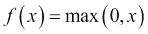

**逻辑** 函数用于计算事件的概率时使用，实际上它的值介于 0 和 1 之间，定义如下： 

最后，**tanh** 简单定义为： 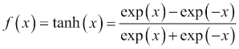

例如，要使用分别具有 200 个和 100 个神经元的两个隐藏层，其中一个逻辑激活函数，代码将修改为：

```py
mlp = MLPClassifier(random_state=1, hidden_layer_sizes=(200, 100,), activation = "logistic")
```

我们邀请读者尝试一些这些参数，并且使用`max_iter`参数，它将限制迭代次数。迭代次数是指对训练数据的传递次数。小值，例如`max_iter=100`，将不会产生很好的结果，因为算法没有时间收敛。但请注意，在这样一个小数据集上，更多的隐藏层不一定会产生更好的预测结果，反而可能会降低预测准确性。

这就结束了本章，我们向读者介绍了机器学习的重要性以及在现实世界中的许多应用。我们简要提到了一些问题和困难，并且涉及了下一章的重点——神经网络的主题。我们还介绍了如何使用标准的开源库，例如`scikit-learn`来开始实现一些简单的多层前馈网络。

现在我们转而深入讨论神经网络及其使用背后的动机。

# 总结

在本章中，我们已经介绍了什么是机器学习以及为什么它如此重要。我们提供了几个机器学习技术应用的示例，以及使用机器学习可以解决哪些问题。我们还介绍了一种特定类型的机器学习算法，称为神经网络，它是深度学习的基础，并提供了一个编码示例，在其中，使用一种流行的机器学习库，我们解决了一个特定的分类问题。在下一章中，我们将更详细地介绍神经网络，并根据从观察我们自己的大脑工作方式中得出的生物学考虑，提供它们的理论解释。
