# 第二章 神经网络

在上一章中，我们描述了几种机器学习算法，并介绍了不同的技术来分析数据以进行预测。例如，我们建议机器可以使用房屋销售价格的数据来预测新房屋的价格。我们描述了大型公司，例如 Netflix，如何使用机器学习技术来建议用户他们可能喜欢的新电影，这是一种在电子商务中被亚马逊或沃尔玛等巨头广泛使用的技术。然而，大多数这些技术需要有标签的数据才能对新数据进行预测，并且为了提高性能，需要人类描述数据以符合有意义的特征。

人类能够快速推断出模式并推断出规则，而不需要对数据进行清理和准备。如果机器也能学会做同样的事情，那就太好了。正如我们所讨论的，弗兰克·罗森布拉特于 50 多年前的 1957 年发明了感知器。感知器对于现代深度神经网络而言就像单细胞生物对于复杂多细胞生物一样重要，但了解和熟悉人工神经元的工作原理对于更好地理解和欣赏通过在许多不同层上组合许多神经元来生成的复杂性至关重要。神经网络试图模仿人脑的功能以及通过简单观察抽象出新规则的能力。尽管我们对人类大脑如何组织和处理信息还知之甚少，但我们已经对单个人类神经元的工作原理有了很好的理解。人工神经网络试图模仿相同的功能，将化学和电信号传递交换成数值和函数。在过去的十年中取得了很大进展，神经网络变得流行之后至少两次被遗忘：这种复苏部分原因是计算机的运行速度越来越快，使用**GPU**（**图形处理单元**）而不是最传统的**CPU**（**计算处理单元**），更好的算法和神经网络设计，以及越来越大的数据集，正如我们将在本书中看到的。

在本章中，我们将正式介绍神经网络是什么，我们将彻底描述神经元是如何工作的，并且我们将看到如何堆叠许多层来创建和使用深度前馈神经网络。

# 为什么要使用神经网络？

神经网络存在很多年了，并经历了几个时期的兴衰。然而，近年来，它们一直在与许多其他竞争的机器学习算法相比稳步地取得进展。这是因为先进的神经网络架构在许多任务上显示出的准确性远远超过其他算法。例如，在图像识别领域，准确性可能是针对一个名为 ImageNet 的包含 1600 万图像的数据库进行衡量的。

在引入深度神经网络之前，准确性一直以较慢的速度改善，但在引入深度神经网络之后，准确性从 2010 年的 40%的错误率下降到 2014 年的不到 7%，而且这个数值仍在下降。人类的识别率仍然较低，约为 5%。考虑到深度神经网络的成功，2013 年 ImageNet 竞赛的所有参赛者都使用了某种形式的深度神经网络。此外，深度神经网络会“学习”数据的表示，即不仅学习识别对象，还学习识别被识别对象所具有的重要特征。通过学习自动识别特征，深度神经网络可以成功地用于无监督学习，通过自然地将具有相似特征的对象分类在一起，而无需费力地人工标记。在其他领域，例如信号处理，也取得了类似的进展。现在，深度学习和使用深度神经网络是普遍存在的，例如在苹果的 Siri 中使用。当谷歌为其 Android 操作系统引入深度学习算法时，错误识别率降低了 25%。用于图像识别的另一个数据集是 MNIST 数据集，其中包含用不同手写方式书写的数字的示例。现在，使用深度神经网络进行数字识别的准确率可以达到 99.79%，与人类的准确率相当。此外，深度神经网络算法是人工智能中最接近人脑工作方式的例子。尽管它们可能仍然是我们大脑的一个更简化、基本版本，但它们比任何其他算法更多地包含了人类智能的种子，本书的其余内容将致力于研究不同的神经网络以及提供几个不同应用神经网络的示例。

# 基础知识

在第一章中，我们讨论了机器学习的三种不同方法：监督学习、无监督学习和强化学习。经典神经网络是一种监督式机器学习，尽管我们将在后面看到，现代深度神经网络的普及更多地归功于这样一个事实，即现代深度神经网络也可以用于无监督学习任务。在接下来的章节中，我们将重点介绍传统浅层神经网络和深度神经网络之间的主要区别。然而，现在我们将主要集中在以监督方式工作的经典前馈网络上。我们的第一个问题是，神经网络究竟是什么？也许解释神经网络的最佳方式是将其描述为信息处理的数学模型。虽然这可能听起来相当模糊，但在接下来的章节中，它将变得更加清晰。神经网络不是一个固定的程序，而是一个模型，一个处理信息或输入的系统，在某种程度上类似于生物实体被认为处理信息的方式。我们可以确定神经网络的三个主要特征：

+   **神经网络架构**：这描述了神经元之间的连接集合（前馈、循环、多层或单层等），层数以及每层中的神经元数量。

+   **学习**：这描述了我们通常定义为训练的内容。无论我们使用反向传播还是某种能量级训练，它都确定了我们如何确定神经元之间的权重。

+   **活动函数**：这描述了我们在传递给每个神经元的激活值上使用的函数，神经元的内部状态，以及它描述了神经元的工作方式（随机、线性等）以及在什么条件下它将激活或触发，以及它将传递给相邻神经元的输出。

但是，需要指出的是，一些研究人员会将活动函数视为架构的一部分；然而，对于初学者来说，现在将这两个方面分开可能更容易。需要注意的是，人工神经网络仅代表了生物大脑运作的近似方式。生物神经网络是一个更复杂的模型；然而，这不应该成为一个问题。人工神经网络仍然可以执行许多有用的任务，事实上，正如我们将在后面展示的那样，人工神经网络确实可以以我们希望的任何程度近似于输入到输出的任何函数。

神经网络的发展基于以下假设：

+   信息处理以其最简单的形式发生在称为神经元的简单元素上。

+   神经元之间相连并沿着连接链路交换信号。

+   神经元之间的连接可以更强或更弱，这决定了信息如何被处理。

+   每个神经元都有一个内部状态，该状态由来自其他神经元的所有传入连接确定。

+   每个神经元都有一个不同的活动函数，该函数是根据神经元的内部状态计算的，并确定其输出信号。

在下一节中，我们将详细定义神经元的工作原理以及它与其他神经元的交互方式。

## 神经元和层

什么是神经元？神经元是一个处理单元，接收一个输入值，并根据预定义的规则输出一个不同的值。

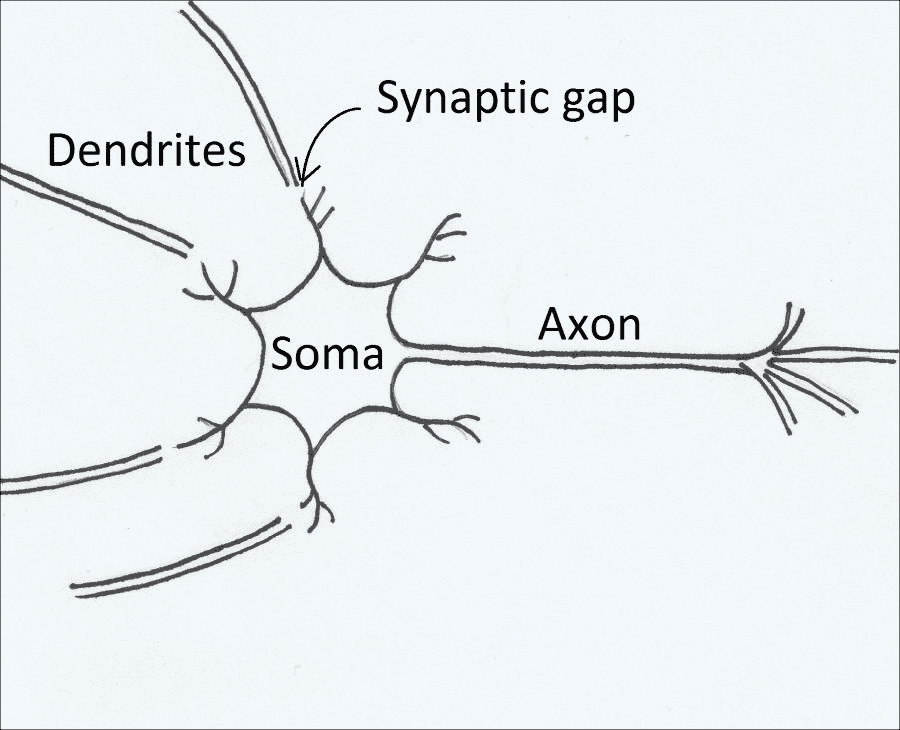

1943 年，Warren McCullock 和 Walter Pitts 发表了一篇文章（W. S. McCulloch 和 W. Pitts. A Logical Calculus of the Ideas Immanent in Nervous Activity, The Bulletin of Mathematical Biophysics, 5(4):115–133, 1943），其中描述了单个生物神经元的功能。生物神经元的组成部分包括树突、细胞体（细胞体）、轴突和突触间隙。在不同的名称下，这些也是人工神经元的组成部分。

树突将来自其他神经元的输入传递到细胞体，即神经元的主体。细胞体是输入被处理并汇总在一起的地方。如果输入超过一定的阈值，神经元将会“发射”，并传递一个单一的输出，该输出通过轴突以电信方式发送。在传输神经元的轴突和接收神经元的树突之间存在着介导化学脉冲的突触间隙，从而改变其频率。在人工神经网络中，我们通过一个数值权重来模拟频率：频率越高，脉冲越强，因此权重越高。然后，我们可以建立生物和人工神经元之间的等价表格（这是一个非常简化的描述，但适用于我们的目的）：

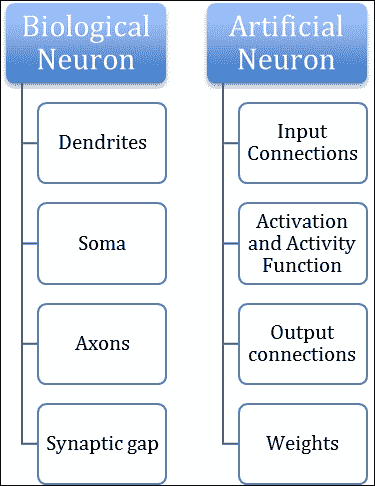

生物神经元与人工神经元的示意对应关系

因此，我们可以如下示意地描述一个人工神经元：

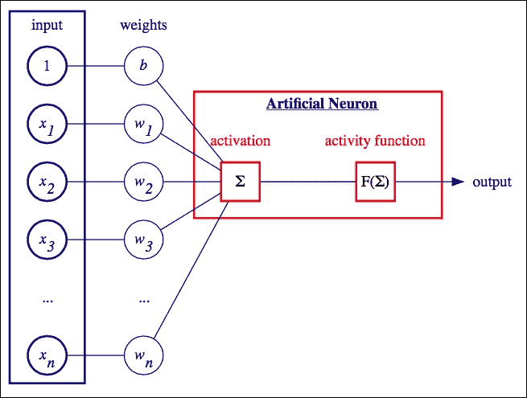

图片的中心是神经元，或称为细胞体，它接收输入（激活）并设置神经元的内部状态，从而触发输出（活动函数）。输入来自其他神经元，并且通过权重（突触间隙）的强度来调节。

神经元的简单激活值由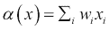给出，其中 *x*[i] 是每个输入神经元的值，*w*[i] 是神经元 *i* 与输出之间连接的值。在第一章中，我们在对神经网络的介绍中引入了偏差。如果我们包含偏差并希望使其存在明确化，我们可以将上述方程重写为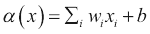。偏差的效果是将由权重定义的超平面进行平移，使其不一定通过原点（因此得名）。我们应该将激活值解释为神经元的内部状态值。

如前一章所述，先前定义的激活值可以解释为向量*w*和向量*x*的点积。 如果*<w,x> = 0*，则向量*x*将与权重向量*w*垂直，因此所有满足*<w,x> = 0*的向量*x*在**R**^n 中定义一个超平面（其中 n 是*x*的维数）。

因此，任何满足*<w,x> > 0*的向量*x*都是在由*w*定义的超平面的一侧的向量。 因此，神经元是线性分类器，根据此规则，在输入高于一定阈值时激活，或者在几何上，在由权重向量定义的超平面的一侧时激活输入。

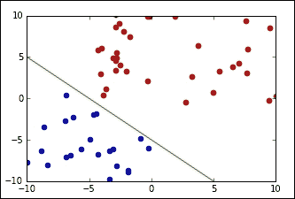

单个神经元是线性分类器

神经网络可以具有无限数量的神经元，但无论其数量如何，在传统网络中，所有神经元都将按层次排序。 输入层代表数据集，即初始条件。 例如，如果输入是灰度图像，则输入层由每个像素的输入神经元表示，其内部值为像素的强度。 但是，应该注意，输入层中的神经元不像其他神经元那样，因为它们的输出是恒定的，等于它们的内部状态的值，因此通常不计算输入层。 因此，1 层神经网络实际上是一个仅有一个层次的简单神经网络，即输出层之外的输入层。 我们从每个输入神经元绘制一条线连接到每个输出神经元，并且这个值由人工突触间隙中介，即连接输入神经元*x*i 到输出神经元*y*[j]的权重*w*[i,j]。 通常，每个输出神经元代表一个类别，例如，在 MNIST 数据集的情况下，每个神经元代表一个数字。 因此，可以使用 1 层神经网络进行预测，例如，输入图像表示的是哪个数字。 实际上，输出值集合可以视为图像表示给定类别的概率的度量，因此具有最高值的输出神经元将代表神经网络的预测。

必须注意，同一层中的神经元永远不会彼此连接，如下图所示； 相反，它们都连接到下一层的每个神经元，依此类推：

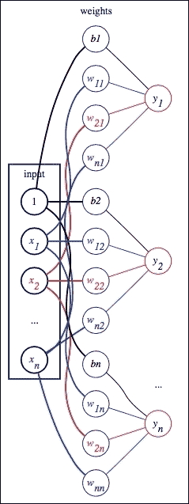

1 层神经网络的示例：左侧的神经元代表具有偏差 b 的输入，中间列代表每个连接的权重，而右侧的神经元代表给定权重*w*的输出。

这是经典神经网络的必要和定义条件之一，即不存在层内连接，而神经元连接到相邻层中的每个神经元。在前面的图中，我们明确显示了神经元之间每个连接的权重，但通常连接神经元的边隐含地代表权重。**1**代表偏置单元，值为 1 的神经元与之前引入的偏置相等的连接权重。

如多次提到的，1 层神经网络只能对线性可分类进行分类；但是，没有任何东西可以阻止我们在输入和输出之间引入更多层。这些额外的层称为隐藏层。

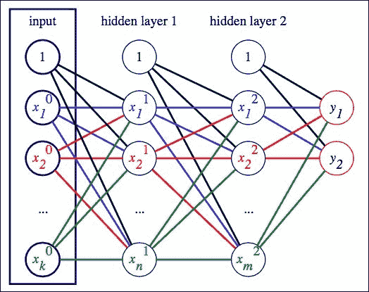

显示的是一个具有两个隐藏层的 3 层神经网络。输入层有 k 个输入神经元，第一个隐藏层有 n 个隐藏神经元，第二个隐藏层有 m 个隐藏神经元。原则上，可以有任意多个隐藏层。在本例中，输出是两个类别，*y*[1]和*y*[2]。顶部的始终开启的偏置神经元。每个连接都有自己的权重 w（为简单起见未显示）。

## 不同类型的激活函数

从生物学角度来看，神经科学已经确定了数百，也许是上千种不同类型的神经元（参见*大脑的未来*，作者 Gary Marcus 和 Jeremy Freeman），因此我们应该能够模拟至少一些不同类型的人工神经元。这可以通过使用不同类型的活动函数来完成，即定义在神经元内部状态上的函数，表示为从所有输入神经元计算的激活值。

活动函数是定义在*a(x)*上的函数，它定义了神经元的输出。最常用的活动函数包括：

+   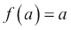：此函数允许激活值通过，并称为身份函数

+   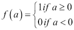：如果激活值高于某个特定值，则此函数激活神经元，称为阈值活动函数

+   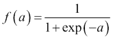：这个函数是最常用的之一，因为它的输出被限制在 0 和 1 之间，可以随机解释为神经元激活的概率，通常称为逻辑函数或逻辑 S 形函数。

+   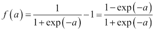：这个活动函数被称为双极 S 形函数，它简单地是一个逻辑 S 形函数重新缩放和平移，使其范围在(-1, 1)之间。

+   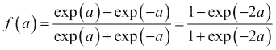：这个活动函数被称为双曲正切函数。

+   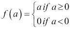：这个活动函数可能是与其生物学相似度最高的，它是标识和阈值函数的混合体，被称为整流器，或**ReLU**，如 **Rectfied Linear Unit**。

这些激活函数之间的主要区别是什么？通常，不同的激活函数对不同的问题效果更好。一般来说，标识活动函数或阈值函数，在神经网络的实现初始阶段广泛使用，例如 *感知器* 或 *Adaline*（自适应线性神经元），但最近逐渐失去了优势，转而使用 logistic sigmoid、双曲正切或 ReLU。虽然标识函数和阈值函数要简单得多，因此在计算机没有太多计算能力时是首选函数，但通常更倾向于使用非线性函数，例如 sigmoid 函数或 ReLU。还应该注意，如果我们只使用线性活动函数，那么添加额外的隐藏层就没有意义，因为线性函数的组合仍然只是一个线性函数。最后三个活动函数在以下方面有所不同：

+   它们的范围不同。

+   随着*x*的增加，它们的梯度可能会消失。

当我们增加*x*时，梯度可能消失的事实以及为什么这很重要，稍后会更清楚；现在，我们只需提一下，函数的梯度（例如，导数）对神经网络的训练很重要。这类似于在线性回归示例中我们在第一章介绍的，我们试图最小化函数，沿着与其导数相反方向进行。

logistic 函数的范围是(0,1)，这是这个函数被选择作为随机网络的首选函数的一个原因，即具有可能根据概率函数激活的神经元的网络。双曲函数与 logistic 函数非常相似，但其范围是(-1, 1)。相比之下，ReLU 的范围是(0, 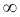)，因此它可能具有非常大的输出。

然而，更重要的是，让我们看一下这三个函数的导数。对于一个 logistic 函数 *f*，其导数是 *f * (1-f)*，而如果 *f* 是双曲正切，其导数是 *(1+f) * (1-f)*。

如果*f*是 ReLU，导数就简单得多，它简单地是 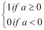。

### 提示

让我们简要地看一下如何计算 logistic sigmoid 函数的导数。通过简单地注意到，相对于*a*的导数  函数是以下形式的快速计算：

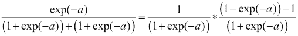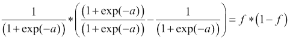

当我们讨论反向传播时，我们会发现深层网络的一个问题是*梯度消失*（如之前提到的），而 ReLU 激活函数的优势在于导数是恒定的，当*a*变大时不趋于*0*。

通常，同一层中的所有神经元具有相同的激活函数，但不同的层可能具有不同的激活函数。但为什么神经网络多于 1 层深（2 层或更多）如此重要？正如我们所见，神经网络的重要性在于它们的预测能力，即能够逼近以输入为定义的函数与所需输出。存在一个定理，称为通用逼近定理，它指出在*R*[n]的紧致子集上的任何连续函数都可以由至少有一个隐藏层的神经网络逼近。虽然该定理的正式证明过于复杂无法在此进行解释，但我们将尝试仅使用一些基本数学给出直观的解释，并且对此我们会使用逻辑 sigmoid 作为我们的激活函数。

逻辑 sigmoid 被定义为 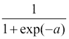 其中 。现在假设我们只有一个神经元 *x=x*[i]：

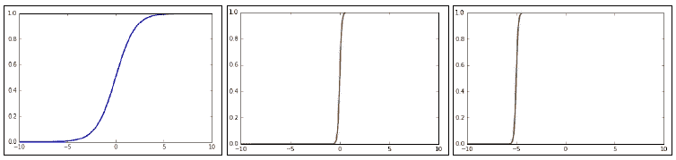

左侧是一个标准 sigmoid，权重为 1，偏差为 0。中间是一个权重为 10 的 sigmoid，右侧是一个权重为 10 且偏差为 50 的 sigmoid。

然后很容易证明，如果*w*非常大，逻辑函数会接近一个阶梯函数。*w*越大，它就越像一个高度为 1 的 0 阶梯函数。另一方面，*b*只会平移函数，并且平移将等于比值*b/w*的负数。让我们称*t = -b/w*。

有了这个基础知识，现在让我们考虑一个简单的神经网络，其中有一个输入神经元和一个具有两个神经元的隐藏层，输出层只有一个输出神经元：

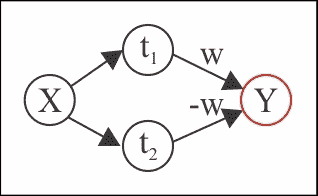

X 被映射到两个带有权重和偏差的隐藏神经元上，使得顶部隐藏神经元的比值 *–b/w* 是 *t*[1] 而底部隐藏神经元是 *t*[2]。两个隐藏神经元都使用逻辑 sigmoid 激活函数。

输入 x 映射到两个神经元，一个具有权重和偏差，使得比例为*t*[1]，另一个具有比例为*t**[2]*的权重和偏差。然后这两个隐藏神经元可以映射到输出神经元，其权重分别为*w*和*–w*。如果对每个隐藏神经元应用逻辑 S 形活动函数，并对输出神经元应用恒等函数（没有偏差），我们将获得一个步函数，从*t*[1]到*t*[2]，高度为*w*，就像下图中所示的一样。由于类似图中的一系列步函数可以近似于**R**的紧致子集上的任何连续函数，这为什么普适逼近定理成立提供了直观（这是一个数学定理称为“简单函数逼近定理”的简化版本）。

多做一点努力，就可以推广到**R**[n]。

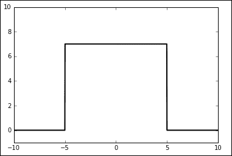

生成上述图像的代码如下：

```py
#The user can modify the values of the weight w 
#as well as biasValue1 and biasValue2 to observe
#how this plots to different step functions

import numpy 
import matplotlib.pyplot as plt
weightValue = 1000
#to be modified to change where the step function starts
biasValue1 = 5000 
#to be modified to change where the step function ends 
biasValue2 = -5000

plt.axis([-10, 10, -1, 10])  

print ("The step function starts at {0} and ends at {1}"
        .format(-biasValue1/weightValue, 
        -biasValue2/weightValue))  

y1 = 1.0/(1.0 + numpy.exp(-weightValue*x - biasValue1)) 
y2 = 1.0/(1.0 + numpy.exp(-weightValue*x - biasValue2)) 
#to be modified to change the height of the step function 
w = 7 
y = y1*w-y2*w  
plt.plot(x, y, lw=2, color='black') 
plt.show()
```

## 反向传播算法

我们已经看到了神经网络是如何将输入映射到确定的输出，取决于固定的权重。一旦神经网络的*架构*被定义（前馈，隐藏层数量，每层神经元数量），以及一旦为每个神经元选择了活动函数，我们需要设置权重，这将定义网络中每个神经元的内部状态。我们将看到如何为 1 层网络设置这些权重，然后如何将其扩展到深度前馈网络。对于深度神经网络，用于设置权重的算法称为反向传播算法，我们将在本节中讨论和解释这个算法，因为这是多层前馈神经网络中最重要的主题之一。然而，我们将首先快速讨论一层神经网络的情况。

我们需要理解的一般概念是：每个神经网络都是函数的近似，因此每个神经网络都不等于期望的函数，而是会有一些差异。这个差异被称为误差，目标是最小化这个误差。由于误差是神经网络中的权重的函数，我们希望在权重方面最小化误差。误差函数是许多权重的函数；因此它是许多变量的函数。数学上，此函数为零的点集因此代表一个超曲面，为了在这个超曲面上找到最小值，我们需要选择一个点，然后沿着最小值方向跟随一条曲线。

### 线性回归

我们已经在第一章介绍了线性回归，但由于我们现在处理的是许多变量，为了简化事情，我们将引入矩阵表示法。让*x*是输入；我们可以将*x*视为一个向量。在线性回归的情况下，我们将考虑一个单输出神经元*y*；因此，权重*w*的集合是一个与*x*的维度相同的向量。然后，激活值被定义为内积*<x, w>*。

让我们假设对于每个输入值*x*，我们想要输出一个目标值*t*，而对于每个*x*，神经网络将输出一个值*y*，由选择的激活函数定义，在这种情况下，绝对值差异（*y-t*）表示预测值和特定输入示例*x*的实际值之间的差异。如果我们有*m*个输入值*x*[i]，每个值都将有一个目标值*t*[i]。在这种情况下，我们使用均方误差计算误差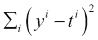，其中每个*y*[i]是*w*的函数。因此，误差是*w*的函数，并且通常用*J(w)*表示。

如前所述，这表示了与*w*的维度相等的超曲面（我们隐式地也考虑了偏差），对于每个*w*[j]，我们需要找到一个曲线，该曲线将导致表面的最小值。曲线沿特定方向增加的方向由其对该方向的导数给出，在这种情况下由以下公式给出：

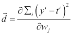

为了朝着最小值移动，我们需要按照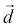设置的相反方向移动每个*w*[j]。

让我们计算以下：

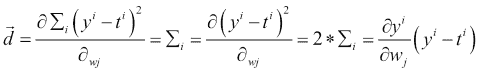

如果，那么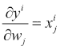，因此

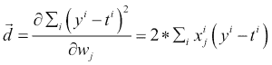

### 提示

符号有时可能令人困惑，特别是第一次看到它时。输入由向量**x**^i 给出，其中上标表示第 i 个示例。由于**x**和**w**是向量，下标表示向量的*j*^th 坐标。*y*^i 然后表示给定输入**x**^i 的神经网络输出，而*t*^i 表示目标值，即与输入**x**[i]对应的期望值。

为了朝向最小值移动，我们需要将每个权重按其导数方向移动一小步长 l，称为*学习速率*，通常远小于 1，（例如 0.1 或更小）。因此，我们可以重新定义导数并将“2”合并到学习率中，以获得以下给出的更新规则：

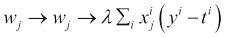

或者，更一般地，我们可以将更新规则写成矩阵形式如下：

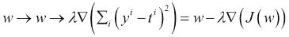

在这里，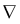（也称为 nabla）代表偏导数的向量。这个过程通常被称为梯度下降。

### 提示

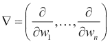是偏导数的向量。我们可以将对*w*的更新规则分别写为每个其分量*wj*，也可以用矩阵形式写出更新规则，其中，用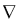代替为每个*j*写出偏导数。

最后一点；更新可以在计算所有输入向量后进行，但在某些情况下，权重可以在每个示例之后或在一定预设数量的示例后进行更新。

### 逻辑回归

在逻辑回归中，输出不是连续的；相反，它被定义为一组类。在这种情况下，激活函数不会像之前那样是恒等函数，而是我们将使用逻辑 sigmoid 函数。正如我们之前看到的，逻辑 sigmoid 函数输出(0,1)中的实值，因此它可以被解释为概率函数，这也是为什么在 2 类分类问题中它可以运行得很好的原因。在这种情况下，目标可以是两个类别中的一个，而输出表示它是其中两个类别之一（比如*t=1*）的概率。

### 提示

再次，符号可能令人困惑。*t*是我们的目标，它可以在这个例子中有两个值。这两个值通常被定义为类别 0 和类别 1。这些值 0 和 1 不应与逻辑 sigmoid 函数的值混淆，后者是介于 0 和 1 之间的连续实值函数。sigmoid 函数的实际值表示输出属于类别 0 或类别 1 的概率。

如果*a*是之前定义的神经元激活值，让我们用 s(*a*)表示逻辑 sigmoid 函数，因此，对于每个示例 x，给定权重*w*时输出为类别*y*的概率是：

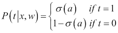

我们可以更简洁地将方程写为如下形式：

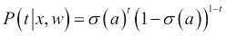

由于对每个样本*x*^i，概率*P(t*[i]*|x*[i]*, w)*是独立的，全局概率如下：

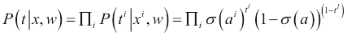

如果我们取前述方程的自然对数（将乘积变为和），我们得到如下结果：

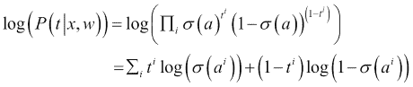

目标现在是最大化这个对数以获得预测正确结果的最高概率。通常，这是通过使用梯度下降最小化由*J(w)= -log(P(y¦* **x** *,w))*定义的损失函数*J(w)*来实现的，就像前面的情况一样。

与以前一样，我们计算相对于权重*w*[j]的损失函数的导数，得到：

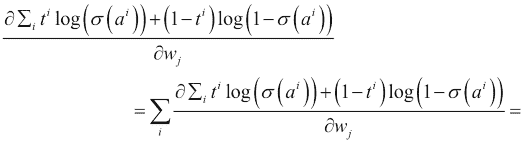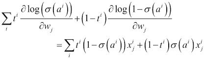

### 提示

要理解最后一个等式，让我们提醒读者以下事实：

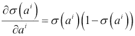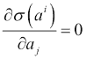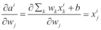

因此，根据链式法则：

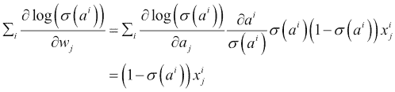

同样：

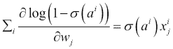

通常，在多类输出**t**的情况下，其中**t**是一个向量（*t*[1]，*…， *t*[n]），我们可以使用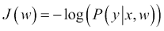 = 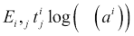来推导出权重的更新方程：


这类似于我们对线性回归所看到的更新规则。

### 反向传播

在单层情况下，权重调整很容易，因为我们可以使用线性或逻辑回归，并同时调整权重以获得更小的错误（最小化成本函数）。对于多层神经网络，我们可以对连接最后隐藏层与输出层的权重使用类似的论证，因为我们知道输出层的期望值，但我们无法对隐藏层做同样的操作，因为预先我们并不知道隐藏层神经元的值应该是什么。相反，我们计算最后一个隐藏层的误差，并估计前一层的误差，从最后一层向第一层反向传播误差，因此得名反向传播。

反向传播是最难理解的算法之一，但所需的只是对基本微分和链式法则的一些知识。首先让我们引入一些符号。我们用*J*表示成本（误差）*，*用*y*表示被定义为在激活值*a*上的活动函数（例如，y 可以是逻辑 Sigmoid），它是权重*w*和输入*x*的函数。让我们也定义*w*[i,j]，*i*^(th)输入值和*j*th 输出之间的权重。在这里，我们比对 1 层网络更泛化地定义输入和输出：如果*w*[i,j]连接一个前馈网络中的连续两层，我们将"输入"称为第一层包含的神经元，"输出"称为第二层包含的神经元。为了不使符号过于繁重，并且不必指出每个神经元在哪一层，我们假设第*i*个输入*y*[i]始终在包含第*j*^(th)输出 *y*[j]的层之前的那一层。

### 提示

请注意，字母*y*既用于表示输入，也用于表示活动函数的输出。 *y*[j]是下一层的输入，而 *y*[j]是活动函数的输出，但它也是下一层的输入。因此，我们可以将 *y*[j]*'s* 视为 *y*[j]*'s* 的函数。

我们还使用下标*i*和*j*，其中我们始终将带有下标*i*的元素归属于包含下标*j*的元素的层之前的那一层。

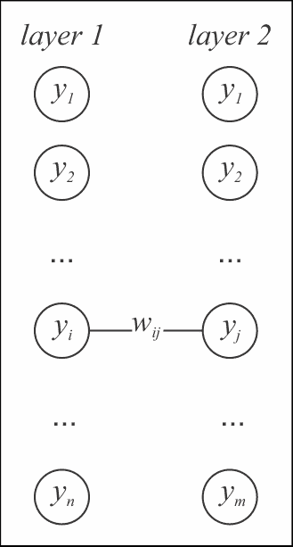

图 10

在这个例子中，第 1 层表示输入，*第 2 层*表示输出，所以 *w*[i,j] 是连接一层中的 *y*[j] 值和下一层中的 *y*[j] 值的数值。

使用这个符号表示法和导数的链式法则，我们可以为我们神经网络的最后一层写出以下结果：

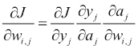

既然我们知道 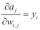，我们有以下结果：

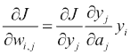

如果 *y* 是之前定义的逻辑 S 型函数，我们将得到与前一节末尾已经计算过的相同结果，因为我们知道成本函数，我们可以计算所有的导数。

对于前面的层，相同的公式成立：


实际上，*a* *j* 是活动函数，我们知道，这是权重的一个函数。*y*[j] 值，是“第二”层神经元的活动函数，是其激活值的函数，当然，成本函数是我们选择的活动函数的函数。

### 提示

即使我们有几个层，我们总是集中在连续层对中，因此，或许有点滥用符号，我们总是有一个“第一”层和一个“第二”层，就像*图 10* 中的那样，它是“输入”层和“输出”层。

既然我们知道 ，并且我们知道  是我们可以计算的活动函数的导数，我们只需要计算导数 。让我们注意到，这是相对于“第二”层的激活函数的误差的导数，如果我们可以计算出最后一层的这个导数，并且有一个允许我们计算下一层的导数的公式，我们可以从最后一层开始计算所有导数并向后移动。

让我们注意到，正如我们通过 *y[j]* 定义的那样，它们是“第二”层神经元的激活值，但它们也是活动函数，因此是第一层激活值的函数。因此，应用链式法则，我们有以下结果：


再次，我们可以计算  和 ，因此一旦我们知道 ，我们可以计算 ，由于我们可以计算出最后一层的 ，我们可以向后移动并计算任何一层的 ，因此可以计算出任何一层的 。

总结一下，如果我们有一系列层，其中


然后我们有了这两个基本方程，第二个方程中的求和应该是对从*y* *j*到任何神经元的传出连接的总和。


通过使用这两个方程，我们可以计算对每层成本的导数。

如果我们设置，表示成本对激活值的变化，我们可以将看作是*y*[j]神经元的误差。我们可以重写


这意味着。这两个方程给出了看待反向传播的另一种方式，即成本对激活值的变化，并提供了一种计算这种变化的公式，以便我们知道了如何为以下层的任何层计算这种变化：


我们还可以组合这些方程并证明：


更新权重的反向传播算法然后在每一层上给出


在最后一节，我们将提供一个代码示例，以帮助理解和应用这些概念和公式。

## 工业应用

在上一章中，我们提到了一些机器学习应用的例子。神经网络，特别是具有相似应用的神经网络。我们将回顾一些应用程序，它们在 1980 年代末和 1990 年代初变得流行之后使用了这些应用程序，后者发现了反向传播，并且可以训练更深的神经网络。

### 信号处理

在信号处理领域，神经网络有许多应用。神经网络最早的应用之一是抑制电话线上的回声，特别是在 1957 年由伯纳德·威德罗和马西安·霍夫开发，特别是在洲际电话中。*Adaline* 使用恒等函数作为其训练的激活函数，并寻求最小化激活和目标值之间的均方误差。Adaline 经过训练，通过将输入信号应用于* Adaline *（滤波器）和电话线来消除电话线上的回声。电话线输出和* Adaline *输出之间的差异是误差，用于训练网络并从信号中消除噪声（回声）。

### 医疗

该网络是由安德森于 1986 年开发的，其背后的思想是存储有关每种情况的症状、诊断和治疗信息的大量医疗记录。该网络经过训练，可以对不同症状的最佳诊断和治疗进行预测。

最近，IBM 利用深度神经网络开发了一个神经网络，可以预测可能的心脏衰竭，阅读医生的笔记，类似于经验丰富的心脏病专家。

### 自动驾驶汽车

1989 年，Nguyen 和 Widrow，以及 1990 年，Miller、Sutton 和 Werbos 开发了一个可以为大型拖车提供倒车到装货码头的方向指示的神经网络。神经网络由两个模块组成：第一个模块能够使用多层的神经网络计算新的位置，通过学习卡车对不同信号的反应。这个神经网络称为仿真器。第二个模块称为控制器，通过使用仿真器来了解其位置，学习给出正确的指令。近年来，自动驾驶汽车已经取得了巨大进步，并且已经成为现实，尽管更复杂的深度学习神经网络与来自摄像头、GPS、激光雷达和声纳单元的输入一起使用。

### 商业

1988 年，Collins、Ghosh 和 Scofield 开发了一个神经网络，可以用来评估是否应该批准和发放抵押贷款。利用抵押贷款评估员的数据，神经网络被训练来确定是否应该给予申请人贷款。输入是一些特征，如申请人的就业年限、收入水平、受抚养人数、财产的评估价值等等。

### 模式识别

我们已经多次讨论了这个问题。神经网络已经被应用的一个领域是字符识别。比如，这可以用于数字的识别，也可以用于手写邮政编码的识别。

### 语音产生

1986 年，Sejnowski 和 Rosenberg 提出了广为人知的 NETtalk 示例，通过阅读书面文字来产生口语。NETtalk 的要求是一组书面文字及其发音的示例。输入包括要发音的字母以及它前面和后面的字母（通常是三个），训练是使用最常见的单词及其语音转录进行的。在实现中，该网络首先学习识别元音和辅音，然后学习识别单词的开头和结尾。通常需要多次迭代才能使发音变得清晰，其进展有时类似于孩子学习如何发音单词。

## 一个用于 xor 函数的神经网络的代码示例

这是一个众所周知的事实，也是我们已经提到过的，即单层神经网络无法预测 XOR 函数。单层神经网络只能对线性可分集进行分类，然而，正如我们所见，通用逼近定理指出，一个具有足够复杂架构的 2 层网络可以近似任何函数。我们现在将创建一个隐藏层中具有两个神经元的神经网络，并演示如何模拟 XOR 函数。但是，我们将编写代码，让读者可以简单地修改它以允许任意数量的层和每层的神经元，以便读者可以尝试模拟不同的情景。我们还将使用双曲正切函数作为此网络的活动函数。为了训练网络，我们将实现之前讨论过的反向传播算法。

我们只需要导入一个库，`numpy`，尽管如果读者希望可视化结果，我们还建议导入`matplotlib`。因此，代码的前几行是：

```py
import numpy 
from matplotlib.colors import ListedColormap 
import matplotlib.pyplot as plt 
```

接下来我们定义我们的活动函数及其导数（在本示例中我们使用`tanh(x)`）：

```py
def tanh(x):     
    return (1.0 - numpy.exp(-2*x))/(1.0 + numpy.exp(-2*x))

def tanh_derivative(x):     
    return (1 + tanh(x))*(1 - tanh(x))
```

接下来我们定义`NeuralNetwork`类：

```py
class NeuralNetwork:
```

为了遵循 Python 语法，`NeuralNetwork`类中的任何内容都必须缩进。我们定义了`NeuralNetwork`类的“构造函数”，即其变量，这在本例中将是神经网络的架构，即有多少层以及每层有多少个神经元，并且我们还将随机初始化权重为介于负 1 和正 1 之间。`net_arch`将是一个包含每层神经元数量的一维数组：例如[2,4,1]表示具有两个神经元的输入层，具有四个神经元的隐藏层和具有一个神经元的输出层。

由于我们正在研究 XOR 函数，因此对于输入层，我们需要有两个神经元，对于输出层，只需要一个神经元：

```py
    #net_arch consists of a list of integers, indicating 
    #the number of neurons in each layer, i.e. the network 
    #architecture
    def __init__(self, net_arch): 
        self.activity = tanh
        self.activity_derivative = tanh_derivative 
        self.layers = len(net_arch)         
        self.steps_per_epoch = 1000   
        self.arch = net_arch

        self.weights = []         
        #range of weight values (-1,1)         
        for layer in range(self.layers - 1):             
            w = 2*numpy.random.rand(net_arch[layer] + 1, net_arch[layer+1]) - 1
            self.weights.append(w)
```

在此代码中，我们已定义活动函数为双曲正切函数，并定义了其导数。我们还定义了每个时期应有多少个训练步骤。最后，我们初始化了权重，确保我们也初始化了稍后将添加的偏置的权重。接下来，我们需要定义`fit`函数，这个函数将训练我们的网络。在最后一行中，`nn`代表`NeuralNetwork`类，`predict`是我们稍后将定义的`NeuralNetwork`类中的函数：

```py
    #data is the set of all possible pairs of booleans
    #True or False indicated by the integers 1 or 0 
    #labels is the result of the logical operation 'xor' 
    #on each of those input pairs
    def fit(self, data, labels, learning_rate=0.1, epochs=100):
        #Add bias units to the input layer         
        ones = numpy.ones((1, data.shape[0]))        
        Z = numpy.concatenate((ones.T, data), axis=1)
        training = epochs*self.steps_per_epoch
        for k in range(training):             
            if k % self.steps_per_epoch == 0:                  
                print('epochs: {}'.format(k/self.steps_per_epoch))
                for s in data:                     
                    print(s, nn.predict(s))
```

我们在这里所做的一切只是在输入数据中添加了一个“1”（始终开启的偏置神经元），并设置了代码以在每个时期结束时打印结果，以便跟踪我们的进度。我们现在将继续设置我们的前向传播：

```py
               sample = numpy.random.randint(data.shape[0])
               y = [Z[sample]]
               for i in range(len(self.weights)-1):
                   activation = numpy.dot(y[i], self.weights[i])
                   activity = self.activity(activation)
                   #add the bias for the next layer
                   activity = numpy.concatenate((numpy.ones(1), 
                              numpy.array(activity)))
                   y.append(activity)

               #last layer 
               activation = numpy.dot(y[-1], self.weights[-1])
               activity = self.activity(activation)
               y.append(activity)
```

我们将在每个步骤后更新我们的权重，因此我们随机选择其中一个输入数据点，然后设置前向传播，为每个神经元设置激活，然后在激活值上应用`tanh(x)`。由于我们有一个偏差，我们将偏差添加到我们的矩阵 y 中，该矩阵跟踪每个神经元的输出值。

现在我们进行错误的反向传播以调整权重：

```py
               #error for the output layer
               error = labels[sample] - y[-1]
               delta_vec = [error * self.activity_derivative(y[-1])] 
               #we need to begin from the back, 
               #from the next to last layer
               for i in range(self.layers-2, 0, -1):  
                   error = delta_vec[-1].dot(self.weights[i][1:].T) 
                   error = error*self.activity_derivative(y[i][1:])
                   delta_vec.append(error)
               #Now we need to set the values from back to front
               delta_vec.reverse()

               #Finally, we adjust the weights, 
               #using the backpropagation rules
               for i in range(len(self.weights)):
                   layer = y[i].reshape(1, nn.arch[i]+1)
                   delta = delta_vec[i].reshape(1, nn.arch[i+1])
                   self.weights[i] +=learning_rate*layer.T.dot(delta)
```

这结束了我们的反向传播算法；我们所要做的只是编写一个预测函数来检查结果：

```py
    def predict(self, x):          
        val = numpy.concatenate((numpy.ones(1).T, numpy.array(x)))      
        for i in range(0, len(self.weights)):             
            val = self.activity(numpy.dot(val, self.weights[i]))             
            val = numpy.concatenate((numpy.ones(1).T, 
                                     numpy.array(val)))         
        return val[1]
```

在这一点上，我们只需要按照下面的主函数进行编写：

```py
    if __name__ == '__main__':  
    numpy.random.seed(0)
    #Initialize the NeuralNetwork with 
    #2 input neurons
    #2 hidden neurons
    #1 output neuron    
    nn = NeuralNetwork([2,2,1])      
    X = numpy.array([[0, 0],
                    [0, 1],
                    [1, 0],
                    [1, 1]])

    #Set the labels, the correct results for the xor operation    
    y = numpy.array([0, 1, 1, 0])      

    #Call the fit function and train the network 
    #for a chosen number of epochs
    nn.fit(X, y, epochs=10)

    print "Final prediction"     
    for s in X:         
       print(s, nn.predict(s))
```

注意`numpy.random.seed(0)`的用法。这只是为了确保权重初始化在不同运行中的一致性，以便比较结果，但对于神经网络的实现并不是必需的。

这结束了代码，结果应该是一个四维数组，例如：（0.003032173692499，0.9963860761357，0.9959034563937，0.0006386449217567），表明神经网络学会了输出应该是（0,1,1,0）。

读者可以略微修改我们之前在本书中使用的`plot_decision_regions function`中创建的代码，看看不同的神经网络如何根据所选择的架构区分不同的区域。

输出图片将如下图所示。圆代表（**True**，**True**）和（**False**，**False**）的输入，而三角形代表（**True**，**False**）和（**False**，**True**）的输入对于 XOR 函数。


同一图，左边是缩小的，右边是放大选择的输入。神经网络学会了分离这些点，创建了一个含有两个**True**输出值的带状区域。

不同的神经网络架构（例如，实现具有不同隐藏层中神经元数量的网络，或者具有不止一个隐藏层）可能产生不同的分离区域。为了实现这一点，读者只需要改变代码中的一行`nn = NeuralNetwork([2,2,1]).`。第一个`2`必须保留（输入不变），但可以修改第二个`2`以表示不同隐藏层中的神经元数量。添加另一个整数将添加一个带有所添加的整数指示的神经元数的新的隐藏层。最后的`1`不能修改。例如，`([2,4,3,1])`将表示一个 3 层神经网络，第一个隐藏层中有四个神经元，第二隐藏层中有三个神经元。

然后读者会发现，虽然解决方案是一样的，但是根据所选择的架构，分离区域的曲线会有所不同。实际上，选择`nn = NeuralNetwork([2,4,3,1])`将给出以下图形：


例如，选择`nn = NeuralNetwork([2,4,1])`会产生以下结果：


因此，神经网络的架构定义了神经网络解决手头问题的方式，不同的架构提供了不同的方法（尽管它们可能都会产生相同的结果），类似于人类思维过程可以沿着不同的路径达到相同的结论。我们现在准备更仔细地研究深度神经网络及其应用。

# 摘要

在本章中，我们详细介绍了神经网络，并提到了它们在与其他竞争算法相比的成功。神经网络由它们所属的“单元”或神经元，以及属于它们的连接或权重组成，这些权重表征了不同神经元之间通信的强度以及它们的活动函数，即神经元如何处理信息。我们讨论了如何创建不同的架构，以及神经网络如何可以具有许多层，以及为什么内部（隐藏）层很重要。我们解释了信息如何通过基于权重和定义的活动函数从输入流向输出，最后我们展示了如何定义一种称为反向传播的方法来“调整”权重以提高所需的准确性。我们还提到了许多神经网络被应用的领域。

在下一章中，我们将继续讨论深度神经网络，特别是我们将解释“深度”一词的含义，就像深度学习一样，我们将解释它不仅仅是指网络中隐藏层的数量，更重要的是指神经网络学习的质量。为此，我们将展示神经网络如何学习识别特征并将它们组合成识别对象的表示，这将为使用神经网络进行无监督学习打开大门。我们还将描述几个重要的深度学习库，最后，我们将提供一个具体的例子，说明我们如何应用神经网络进行数字识别。
