# 第三章深度学习基础

在第一章*机器学习-简介*中，我们介绍了机器学习及其一些应用，并简要讨论了一些可用于实现机器学习的算法和技术。在第二章*神经网络*中，我们专注于神经网络；我们已经表明 1 层网络太简单，只能处理线性问题，而且我们介绍了通用逼近定理，展示了只有一个隐层的 2 层神经网络能以任意程度逼近 R*[n]*的紧致子集上的任何连续函数。

在本章中，我们将介绍深度学习和深度神经网络，也就是至少有两个或更多个隐层的神经网络。读者可能会想知道为什么要使用多个隐层，考虑到通用逼近定理，并无不合理之处，因为在很长一段时间内使用的神经网络非常浅，只有一个隐层。答案是 2 层神经网络确实可以以任意程度逼近任何连续函数，然而，增加层次也增加了可能更加难以模拟的复杂性，并且可能需要更多的神经元来模拟浅层网络。还有另一个更重要的原因是深度学习的术语“深度”并不仅仅指网络的深度或神经网络的层数，而是指“学习”的水平。在深度学习中，神经网络不仅仅是学习在给定输入*X*的情况下预测输出*Y*，而且还能理解输入的基本特征。在深度学习中，神经网络能够对构成输入示例的特征进行抽象化，理解示例的基本特征，并根据这些特征进行预测。在深度学习中，存在其他基本机器学习算法或浅层神经网络中缺乏的抽象层面。

在本章中，我们将涵盖以下主题：

+   什么是深度学习？

+   深度学习的基本概念

+   深度学习的应用

+   GPU 与 CPU 对比

+   流行的开源库

# 什么是深度学习？

2012 年，Alex Krizhevsky，Ilya Sutskever 和 Geoff Hinton 在《神经信息处理系统》（NIPS）（2012）的《ImageNet 分类与深度卷积神经网络》一文中，写道：

> *"值得注意的是，如果移除一个卷积层，我们网络的性能会下降。例如，移除任何一个中间层都会导致网络的 top-1 性能损失约为 2%。所以深度确实对于实现我们的结果至关重要。"*

在这个重要的论文中，他们明确提到了深度网络中隐藏层的数量的重要性。Krizheysky、Sutskever 和 Hilton 谈到了卷积层，我们将在第五章，*图像识别*中讨论它们，但基本问题仍然存在：*这些隐藏层到底做什么？*

一个典型的英语谚语是*一张图片胜过千言万语*。让我们使用这种方法来理解深度学习是什么。在 H. Lee、R. Grosse、R. Ranganath 和 A. Ng，*用于可扩展无监督学习分层表示的卷积深度置信网络*，发表于 2009 年国际机器学习会议(ICML)的论文中（参见[`web.eecs.umich.edu/~honglak/icml09-ConvolutionalDeepBeliefNetworks.pdf`](http://web.eecs.umich.edu/~honglak/icml09-ConvolutionalDeepBeliefNetworks.pdf)），作者使用了一些图片，我们在这里复制了一些。

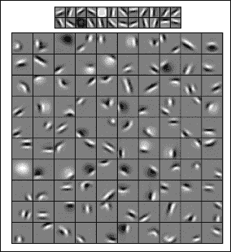

在他们的例子中，他们展示了不同类别的对象和/或动物的神经网络图片，并且网络学习了每个类别的一些基本特征。例如，网络可以学习一些非常基本的形状，如线条或边缘，这些是每个类别都共有的。然而，在下一层，网络可以学习这些线条和边缘如何组合在一起，以使每个类别的图像具有眼睛或车轮等特征。这类似于人类视觉皮层的工作方式，我们的大脑从简单的线条和边缘开始越来越复杂地识别特征。

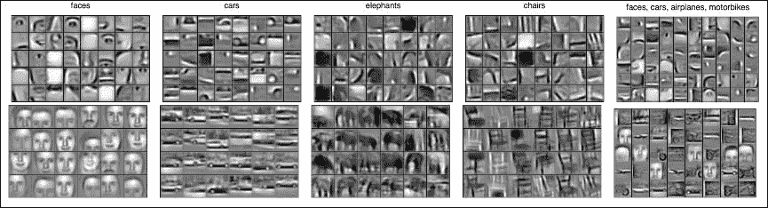

深度神经网络中的隐藏层也是通过逐层理解更加复杂的特征来工作的。如果我们想要定义什么是一个人脸，我们需要定义它的部分：眼睛、鼻子、嘴巴，然后我们需要上升到更高的层次，并定义它们相对于彼此的位置：两只眼睛在顶部的中间位置，处于同样的高度，鼻子在中间，嘴巴在下方中间位置，位于鼻子下方。深度神经网络通过自我学习来捕捉这些特征，首先学习图像的组成部分，然后学习它们的相对位置等等，就像在图像 1 和图像 2 中，我们可以看到深层抽象在每一层中的作用。一些深度学习网络实际上可以被看作是生成算法，例如**受限玻尔兹曼机**（**RBMs**），而不仅仅是一个预测算法，因为它们学会生成一个信号，然后根据已学习的生成假设进行预测。随着我们在本章中逐步深入，我们将使这个概念更加清晰。

## 基本概念

1801 年，约瑟夫·玛丽·查尔斯发明了雅卡尔织布机。查尔斯（Charles）并非科学家，而是一个简简单单的商人，雅卡尔织布机以他的名字命名。雅卡尔织布机使用一组打孔卡片，每个打孔卡片代表了需要在织布机上复制的图案。每个打孔卡片都代表了一个设计的抽象，一个图案的抽象，每个打孔卡片都是该图案的一个抽象表示。打孔卡片之后被用在其他地方，例如赫尔曼·荷里歇在 1890 年发明的制表机中，或者在最早的计算机中，它们被用来输入机器的代码。然而，在制表机中，打孔卡片只是对样本的抽象，用于计算人口的统计数据。而在雅卡尔织布机中，打孔卡片的使用更加微妙；在其中，每个卡片都代表一个图案的抽象，然后与其他卡片组合在一起，形成更复杂的图案。打孔卡片是对现实特征的一个抽象表示，最终成为织物的设计。

在某种程度上，Jacquard 织机具有使得深度学习成为今天的样子的种子：通过其特征的表示来定义现实。在深度学习中，神经网络不仅仅是识别使猫成为猫，松鼠成为松鼠的因素，而是了解猫中存在哪些特征，松鼠中存在哪些特征，并且学会使用这些特征设计猫或松鼠。如果我们要使用 Jacquard 织机设计成猫形状的编织图案，我们需要使用带有猫鼻子上胡子的打孔卡，以及优雅修长的身体。相反，如果我们要设计松鼠，我们需要使用制作毛茸茸尾巴的打孔卡，例如。一个学会基本输出表示的深度网络可以使用它所做出的假设进行分类；因此，如果没有毛茸茸的尾巴，它可能不会是松鼠，而更可能是猫。这有许多含义，正如我们将看到的那样，最重要的是，网络学到的信息量更加完整和稳健。通过学习*生成*模型（在技术术语中通过学习联合概率*p(x,y)*而不仅仅是*p(y|x)*，网络对*噪声*的敏感性大大降低，并且它学会了识别即使场景中存在其他物体或物体部分被遮挡的图像。最激动人心的部分是，深度神经网络自动学会做到这一点。

## 特征学习

Ising 模型是物理学家威廉·伦兹在 1920 年发明的，他把它作为问题交给了他的学生恩斯特·伊辛。该模型由可以处于两种状态（正或负）的离散变量组成，代表磁偶极子。

在第四章《无监督特征学习》中，我们将介绍限制玻尔兹曼机和自动编码器，并且我们将开始更深入地了解如何构建多层神经网络。迄今为止我们看到的神经网络类型都具有前馈架构，但我们将看到我们可以定义具有反馈环路的网络以帮助调整定义神经网络的权重。虽然 Ising 模型并不直接用于深度学习，但它是一个很好的物理示例，帮助我们理解调整深度神经结构的基本内部工作方式，包括限制玻尔兹曼机，特别是帮助我们理解表示的概念。

这一节我们将讨论的是对 Ising 模型进行的简单调整（和简化），以适应深度学习。在第二章 *神经网络*中，我们已经讨论了调整神经元之间连接权重的重要性。实际上，神经网络中的权重使网络学习。给定一个输入（固定），这个输入传播到下一层，并根据它们之间连接的权重设置下一层神经元的内部状态。然后，这些神经元会发射信号，并通过新的连接将信息传递到下一层，这些连接由新的权重定义，依此类推。权重是网络的唯一变量，它们使网络学习。通常情况下，如果我们的激活函数是一个简单的阈值函数，一个较大的正权重会倾向于使两个神经元一起激活。所谓一起激活，我们指的是，如果一个神经元激活，且连接权重很高，则另一个神经元也会激活（因为输入乘以较大的连接权重很可能会超过选择的阈值）。事实上，1949 年，在他的*行为的组织*中，唐纳德·赫布（[`s-f-walker.org.uk/pubsebooks/pdfs/The_Organization_of_Behavior-Donald_O._Hebb.pdf`](http://s-f-walker.org.uk/pubsebooks/pdfs/The_Organization_of_Behavior-Donald_O._Hebb.pdf)）提出了相反的观点也是真的。唐纳德·赫布是一位加拿大心理学家，生活在 20 世纪，他提出了以他的名字命名的规则，赫布规则，该规则指出当神经元一起激活时，它们的连接加强；当它们不一起激活时，它们的连接减弱。

在下面的示例中，我们将 Ising 模型看作是一种以二进制方式运作的神经元网络，即它们只能激活（发射）或不激活，并且，它们的相对连接越强，它们一起激活的可能性就越大。我们假设网络是随机的，因此如果两个神经元之间连接很强，它们只有很大的可能性一起激活。

### 小贴士

随机意味着概率性。在随机网络中，我们定义神经元激活的概率：概率越高，神经元激活的可能性就越大。当两个神经元之间的连接很强时，即它们之间连接的权重很大时，一个神经元激活将引起另一个神经元也激活的概率非常高（反之亦然，弱连接会导致低概率）。然而，神经元只会根据概率激活，因此我们无法确定它是否会激活。

另一方面，如果它们呈反相关（具有较大的负权重），它们非常可能不会一起激活。让我们举些例子：

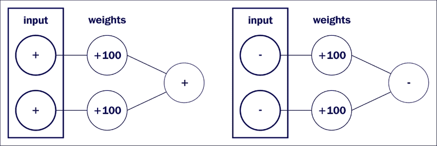

在第一张图中，前两个神经元处于活跃状态，并且它们与第三个神经元的连接很大且为正，因此第三个神经元也将处于活跃状态。在第二张图中，前两个神经元处于关闭状态，并且它们与第三个神经元的连接为正，因此第三个神经元也将处于关闭状态。

在第二张图中，前两个神经元处于关闭状态，并且它们与第三个神经元的连接为正，因此第三个神经元也将处于关闭状态。

可能会出现几种组合；我们将只展示其中几种。想法是第一层神经元的状态将以概率方式确定后续层神经元的状态，取决于连接的符号和强度。如果连接较弱，则后续层中连接的神经元可能以任何状态相等或几乎相等的概率存在。但如果连接非常强，则权重的符号将使连接的神经元以类似或相反的方式运作。当然，如果第二层的神经元具有超过一个神经元作为其输入，我们将像往常一样加权所有输入连接。如果输入神经元并非全部处于开启或关闭状态，并且它们的连接同样强，则连接的神经元可能以相等或几乎相等的概率处于开启或关闭状态。

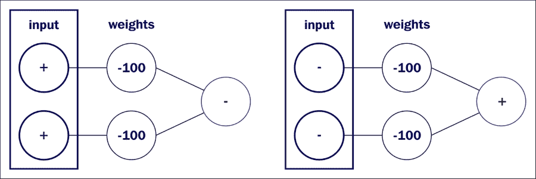

在第一张图中，前两个神经元处于活跃状态，并且它们与第三个神经元的连接很大且为负，因此第三个神经元也将处于关闭状态。在第二张图中，前两个神经元处于关闭状态，并且它们与第三个神经元的连接很大且为负，因此第三个神经元很可能处于打开状态。

接下来很明显，要最有可能地确定下一层神经元的状态，第一层神经元应该都处于相似的状态（开或关）并且都与强连接（即，较大的权重）连接。让我们看更多的例子：

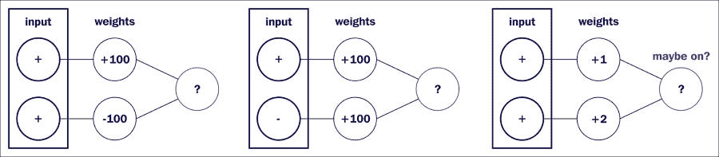

在第一张图中，前两个神经元处于活跃状态，并且它们与第三个神经元的连接很大但方向相反，因此第三个神经元可能同样有可能处于开启或关闭状态。在第二张图中，前两个神经元一个处于开启状态，一个处于关闭状态，并且它们与第三个神经元的连接都很大且为正，因此第三个神经元同样有可能处于开启或关闭状态。在最后一张图中，前两个神经元处于活跃状态，但它们与第三个神经元的连接很小，因此第三个神经元更有可能处于开启状态，但它也有相当高的几率处于关闭状态。

引入这种 Ising 模型的改编的目的是理解深度神经网络中的表示学习是如何工作的。我们已经看到，设置正确的权重可以使神经网络打开或关闭某些神经元，或者一般地影响它们的输出。然而，将神经元描绘成只有两种状态，有助于我们直观地理解神经网络中发生的事情。在二维平面中表示我们的网络层对我们的直观和视觉描述也有所帮助，而不是表示为一维层。让我们把我们的神经网络层想象成二维平面。然后我们可以想象每个神经元代表了二维图像上的像素，而“开”状态的神经元代表了白色平面上的黑点，而“关”状态的神经元则与白色背景融为一体（不可见）。我们的开/关状态的输入层可以被看作一个简单的二维黑白图像。比如，假设我们想要表示一个笑脸，或者一个悲伤的脸——我们只需激活正确的神经元，就可以得到以下图形：

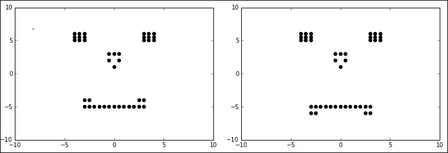

一个快乐的脸和一个悲伤的脸：区别在于嘴角的几个神经元，可能是开或关状态。

现在假设这对应于输入层，因此此层将连接到另一层，即隐藏层之一。然后，这幅图像中的每个像素（无论是黑色还是白色）与下一层的每个神经元之间都会有连接。特别是，每个黑色（开）像素将连接到下一层的每个神经元。现在假设每个使左眼的神经元的连接具有强（大正权重）连接到隐藏层中的特定像素，但与隐藏层中的其他任何神经元都有大的负连接：

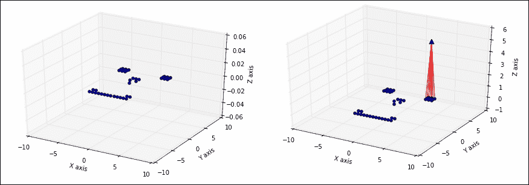

左边是一个笑脸，右边是相同的笑脸和其左眼与隐藏神经元之间的连接。

这意味着，如果我们在隐藏层和左眼之间设置大的正权重，以及左眼与任何其他隐藏神经元之间的大的负连接，每当我们向网络展示一个包含左眼的脸时（这意味着那些神经元处于开状态），这个特定的隐藏神经元将激活，而所有其他神经元往往会保持关闭。这意味着这个特定的神经元将能够检测左眼是否存在。我们也可以类似地创建右眼、鼻子和嘴巴主要部分之间的连接，这样我们就可以开始检测所有这些面部特征。

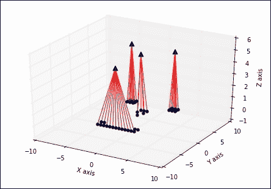

每个脸部特征, 眼睛、鼻子和嘴巴, 都与某些隐藏神经元具有大的正连接, 但与其他神经元具有大的负连接。

这展示了我们如何为我们的连接选择权重，让隐藏神经元开始识别输入的特征。

### 提示

作为一个重要的提醒，我们想向读者指出，事实上，我们并没有选择权重来开始识别输入的特征。相反，这些权重是由网络使用反向传播或其他调整方法自动选择的。

另外，我们可以拥有更多的隐藏层，它们可以识别特征的特征（*我们脸上的嘴是笑着的还是悲伤的？*），因此可以得到更精确的结果。

深度学习有几个优点。第一个优点就像我们所见，它可以识别特征。另一个更重要的优点是，它会自动识别特征。在这个例子中，我们自己设置了权重以识别我们选择的特征。这是许多机器学习算法的缺点之一，用户必须使用自己的经验来选择他/她认为最好的特征。因此，需要大量的时间来进行特征选择，这仍然需要人类来执行。相反，深度学习算法会自动选择最佳特征。正如我们在前一章中所见，这可以通过反向传播来完成，但事实上，还存在其他技术来选择这些权重，这些将是下一章将要讨论的重要点，如自动编码器和受限玻尔兹曼机（或*哈蒙尼姆*，1986 年由保罗·斯莫伦斯基发明）。然而，我们还要提醒读者，我们从自动特征选择中获得的优势必须付出这样的代价，即我们需要选择正确的神经网络结构。

在一些深度学习系统中（例如在受限玻尔兹曼机中，正如我们将在下一章中看到的那样），神经网络还可以学会“修复”自己。正如我们在前面的例子中提到的，我们可以通过激活我们分别与右/左眼、鼻子和嘴相联系的四个神经元来产生一个通用的面孔。由于它们与前一层之间的连接权重较大，这些神经元将被激活，我们将激活与这些特征对应的神经元，从而生成一个通用的面孔图像。同时，如果与面部对应的神经元被激活，那么眼睛、鼻子和嘴的四个对应神经元也将被激活。这意味着，即使没有所有定义面部的神经元都处于开启状态，如果连接足够强大，它们仍然可能激活四个对应的神经元，进而激活面部缺失的神经元。

这还有一个额外的优势：鲁棒性。人类视觉在视图部分被遮挡时也能识别物体。我们甚至可以在对方戴帽子或遮住嘴巴的围巾时认出人；我们对图像中的噪声不敏感。同样地，当我们创建这种对应关系时，如果我们稍微改变面部，比如通过微调嘴巴一两个像素，信号仍然足够强大，可以打开“嘴巴”神经元，这将打开正确的像素并关闭组成修改后眼睛的错误像素。这个系统对噪声不敏感，并且可以进行自动修正。

比如说，嘴巴有一对像素关闭（在图中那些带有**x**的像素）。

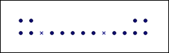

这幅图有一对构成嘴巴的像素没有打开。

然而，嘴巴可能仍然有足够数量的神经元在正确的位置上，可以打开代表它的对应神经元：

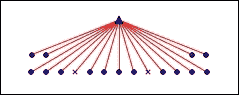

即使一对神经元关闭，与其他神经元的连接足够强大，下一层代表嘴巴的神经元仍然会打开。

另一方面，我们现在可以沿着连接逆向传播，每当代表嘴巴的神经元打开时，这将打开组成嘴巴的所有神经元，包括以前关闭的两个神经元：

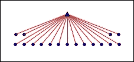

这两个神经元被顶部的神经元激活。

总之，深度学习相对于许多其他机器学习算法，特别是浅层神经网络的优势有：

+   深度学习可以学习表示

+   深度学习对噪声不太敏感。

+   深度学习可以是一种生成算法（在下一章中会更详细介绍）

为了进一步理解为什么许多隐藏层可能是必要的，让我们考虑识别一个简单几何图形，一个立方体的任务。假设 3D 中的每条可能的线与一个神经元相关联（让我们暂时忘记这将需要无限多的神经元）。

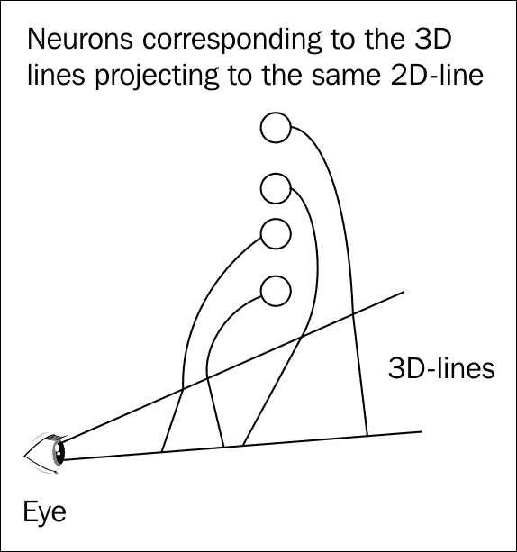

同一视野上的每一条线都与不同的神经元相关联。

如果我们限制自己只看一个眼睛，我们视野中不同角度的线条将投影到二维平面上的同一条线上。因此，我们看到的每条线都可以由任何对应的三维线条给出，这些三维线条投影到视网膜上的同一条线上。假设任何可能的三维线条都与一个神经元相关联。因此，构成立方体的两条不同线条各自与一个神经元族相关联。然而，这两条线相交的事实允许我们连接属于不同族的两个神经元。我们对于构成立方体一条边的线有许多神经元，对于构成立方体另一条边的线也有许多神经元，但因为这两条线相交，有两个神经元会被连接。同样，每条线也连接到构成立方体的其他线条，使我们能够进一步重新定义我们的表示。在更高的层次上，我们的神经网络还可以开始识别这些线不是以任意角度相连，而是以确切的 90 度角相连。通过这种方式，我们可以制作越来越抽象的表示，从而使我们能够将在一张纸上画出的线条组识别为一个立方体。

不同层中的神经元按层次结构组织，并表示图像中基本元素及其结构的不同抽象水平。这个玩具例子显示，每个层次在抽象系统中都可以将下层的不同神经元联系在一起，建立它们之间的连接，类似于我们如何在抽象线条之间建立连接。它可以利用这些连接意识到这些抽象线条在一个点上相连，在更高层次上，实际上以 90 度相连并组成一个立方体，就像我们描述如何通过识别眼睛、鼻子和嘴巴及其相对位置来学习识别脸部的方式一样。

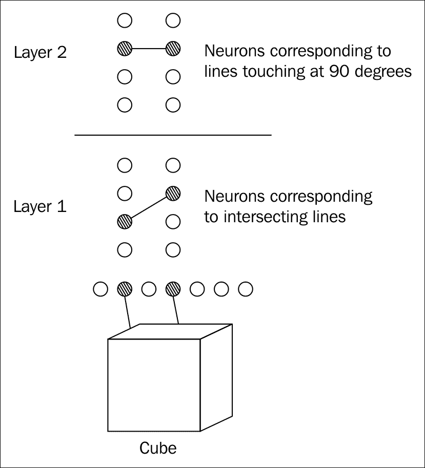

每条线都与一个神经元相关联，通过关联表示相交的线条来创建基本表示，通过关联表示特定角度的线条来创建更复杂的表示。

## 深度学习算法

在前面的段落中，我们对深度学习进行了直观的介绍。在本节中，我们将对下一章节中将彻底介绍的关键概念给出更精确的定义。具有许多层的深度神经网络也有存在的生物学原因：通过我们对人类理解语音的研究，实际上已经清楚地表明，我们天生具有一种分层的层次结构，它将听到的声音输入转化为语言水平。类似地，视觉系统和视觉皮层具有类似的分层结构，从 V1（或条纹皮层）到大脑中的 V2、V3 和 V4 视觉区域。深度神经网络模仿了我们大脑的本质，尽管以非常原始的方式。然而，我们应该警告读者，尽管理解我们的大脑可以帮助我们创建更好的人工神经网络，但最终，我们可能正在创建一种完全不同的架构，就像我们通过模仿鸟类创建了飞机，但最终得到了一个非常不同的模型。

在第二章 *神经网络* 中，我们介绍了反向传播算法作为一种流行的训练算法。在实践中，当我们有许多层时，反向传播可能是一种缓慢且难以使用的算法。事实上，反向传播主要是基于函数的梯度，而局部最小值的存在往往会阻止该方法的收敛。然而，深度学习这个术语适用于一类可能使用不同训练算法和权重调整的深度神经网络算法，它们不限于反向传播和经典的前馈神经网络。因此，我们应更加普遍地将深度学习定义为一类机器学习技术，其中信息在分层层次中进行处理，以便在逐渐增加的复杂性水平上理解数据的表示和特征。在这类算法中，我们通常可以包括：

+   **多层感知器（MLP）**：具有许多隐藏层的神经网络，采用前馈传播。正如讨论的那样，这是深度学习网络的第一个示例，但不是唯一可能的示例。

+   **玻尔兹曼机（BM）**：具有明确定义的能量函数的随机对称网络。

+   **受限玻尔兹曼机（RBM）**：与上面的伊辛模型示例类似，受限玻尔兹曼机由两层之间的对称连接组成，一个是可见层，一个是隐藏层，但与一般玻尔兹曼机不同，神经元之间没有层内连接。它们可以堆叠在一起形成 DBN。

+   **深度信念网络（DBN）**：一种随机生成模型，其中顶层之间具有对称连接（与前馈网络不同，是无向的），而底层通过来自上面层的定向连接接收来自处理后的信息。

+   **自动编码器**：一类无监督学习算法，其输出形状与输入相同，这使得网络能够更好地学习基本表示。

+   **卷积神经网络（CNN）**：卷积层通过将滤波器应用于输入图像（或声音），通过在传入信号上滑动此滤波器来生成二维激活图。CNN 允许增强输入中隐藏的特征。

每种深度学习实现都有其优缺点，它们的训练难度取决于每层的层数和神经元数量。虽然简单的前馈深度神经网络通常可以使用第二章讨论的反向传播算法进行训练，但对于其他类型的网络存在不同的技术，这将在下一章中进一步讨论。

# 深度学习应用

在接下来的几段中，我们将讨论深度神经网络在语音识别和计算机视觉领域的应用，以及近年来它们在这两个领域的应用如何通过完全超越许多其他不基于深度神经网络的机器学习算法而大大提高了准确性。

## 语音识别

深度学习开始在本年代（2010 年及以后，例如 2012 年一篇标题为*Deep Neural Networks for Acoustic Modeling in Speech Recognition*的文章，由 Hinton 等人撰写，可在[`static.googleusercontent.com/media/research.google.com/en//pubs/archive/38131.pdf`](http://static.googleusercontent.com/media/research.google.com/en//pubs/archive/38131.pdf)在线获取）中用于语音识别；在此之前，语音识别方法主要由称为 GMM-HMM 方法（具有高斯混合发射的隐马尔可夫模型）的算法主导。理解语音是一个复杂的任务，因为语音并不像天真地认为的那样，由清晰分隔开的单词组成，它们之间有明确的边界。实际上，语音中没有真正可辨识的部分，也没有清晰的单词边界。在组合单词时研究声音时，我们经常看到所谓的三音素，它们由三个区域组成，其中第一部分取决于前一个声音，中间部分通常是稳定的，下一个声音取决于后一个声音。此外，通常最好只检测三音素的部分，这些检测器称为 senones。

在*《语音识别中的深度神经网络用于声学建模》*中，对当时最先进的模型和作者采用的模型进行了几次比较，该模型由五个隐藏层组成，每层 2048 个单元。第一次比较是使用必应语音搜索应用程序，在 24 小时的训练数据上实现了 69.6％的准确率，而使用传统方法，名为 GMM-HMM 模型，在相同的训练数据上实现了 63.8％的准确率。该模型还在 Switchboard 语音识别任务上进行了测试，这是一个公共语音转文本转录基准（类似于用于数字识别的 MNIST 数据集），包括来自美国各地约 500 位发言者的大约 2500 次对话。此外，还使用了 Google 语音输入语音、YouTube 数据和英语广播新闻语音数据进行了测试和比较。在下一个表格中，我们总结了该文章的结果，显示了 DNN 与 GMM-HMM 的错误率对比。

| 任务 | 训练数据总小时数 | DNN（错误率） | 具有相同训练的 GMM-HMM（错误率） | 具有更长训练的 GMM-HMM（错误率） |
| --- | --- | --- | --- | --- |
| Switchboard（测试 1） | 309 | 18.5 | 27.4 | 18.6（2000 小时） |
| Switchboard（测试 2） | 309 | 16.1 | 23.6 | 17.1（2000 小时） |
| 英语广播新闻 | 50 | 17.5 | 18.8 |   |
| 必应语音搜索 | 24 | 30.4 | 36.2 |   |
| Google 语音 | 5870 | 12.3 |   | 16.0（>>5870 小时） |
| YouTube | 1400 | 47.6 | 52.3 |   |

另一篇文章，*《语音识别和相关应用的新型深度神经网络学习方法概述》*，由邓、欣顿和金斯伯里（[`www.microsoft.com/en-us/research/publication/new-types-of-deep-neural-network-learning-for-speech-recognition-and-related-applications-an-overview/`](https://www.microsoft.com/en-us/research/publication/new-types-of-deep-neural-network-learning-for-speech-recognition-and-related-applications-an-overview/)）撰写，作者们也注意到深度神经网络在嘈杂语音方面表现出色。

DNN 的另一个优点是在 DNN 出现之前，人们必须创建语音声谱图的变换。声谱图是信号中频率的视觉表示。通过使用 DNN，这些神经网络可以自主自动地选择原始特征，本例中以原始谱特征表示。使用卷积和池化等技术，可以应用于这种原始谱特征，以应对说话者之间的典型语音变化。近年来，更加复杂的具有循环连接的神经网络（RNN）取得了巨大成功（A. Graves、A. Mohamed 和 G. Hinton，《Speech Recognition with Deep Recurrent Neural Networks》发表于国际会议 *Acoustic Speech and Signal Processing(ICASSP)* (2013)；参见 [`www.cs.toronto.edu/~fritz/absps/RNN13.pdf`](http://www.cs.toronto.edu/~fritz/absps/RNN13.pdf)），例如，一种特定类型的深度神经网络称为 **LSTM**（**长短期记忆**神经网络），将在后面的章节中描述。

在第二章 *神经网络* 中，我们讨论了不同的活动函数，尽管逻辑 S 形函数和双曲正切函数通常是最为人知的，但它们往往训练速度较慢。最近，ReLU 活动函数在语音识别中取得了成功应用，例如 G. Dahl、T. Sainath 和 G. Hinton 在 *Improving Deep Neural Networks for LVCSR Using Rectified Linear Units and Dropout* 中提到的文章，发表于国际会议 *Acoustics Speech and Signal Processing (ICASSP)* (2013) ([`www.cs.toronto.edu/~gdahl/papers/reluDropoutBN_icassp2013.pdf`](http://www.cs.toronto.edu/~gdahl/papers/reluDropoutBN_icassp2013.pdf))。在第五章 *图像识别* 中，我们还将提及“Dropout”的含义，正如这篇论文中所讨论的（也在其标题中提到）。

## 对象识别和分类

这可能是深度神经网络取得成功并得到最好记录和理解的领域。就像语音识别一样，DNN 能够自动发现基本表示和特征。此外，手工选择的特征通常只能捕捉低级边缘信息，而 DNN 能够捕捉到更高级的表示，比如边缘交叉点。在 2012 年，来自 ImageNet 大规模视觉识别比赛的结果（结果可在[`image-net.org/challenges/LSVRC/2012/results.html`](http://image-net.org/challenges/LSVRC/2012/results.html)上找到）显示，由 Alex Krizhevsky，Ilya Sutskever 和 Geoff Hinton 组成的获胜团队使用了一个拥有 6000 万参数和 650,000 个神经元的大型网络，其中包括五个卷积层和紧随其后的最大池化层，以 16.4%的错误率击败了第二名团队的 26.2%的错误率。卷积层和最大池化层将是第五章，*图像识别*的焦点。这是一个巨大而令人印象深刻的成果，这一突破性的结果引发了当前神经网络的复兴。作者们使用了许多新颖的方法来通过结合卷积网络、GPU 的使用以及一些技巧，比如放弃方法和使用 ReLU 活性函数代替 Sigmoid 来帮助学习过程。

该网络是使用 GPU 进行训练的（我们将在下一节讨论 GPU 的优势），并展示了大量标记数据可以极大地提高深度学习神经网络的性能，大大超越了图像识别和计算机视觉的更传统方法。鉴于深度学习中卷积层的成功，Zeiler 和 Fergus 在两篇文章中（M. Zeiler 和 R. Fergus，*用于深度卷积神经网络的随机池化正则化*，国际学习代表大会(ICLR) , 2013 年（[`www.matthewzeiler.com/pubs/iclr2013/iclr2013.pdf`](http://www.matthewzeiler.com/pubs/iclr2013/iclr2013.pdf))和 M. Zeiler 和 R. Fergus，*视觉化和理解卷积网络*，arXiv:1311.2901, 页面 1-11, 2013 年，([`www.matthewzeiler.com/pubs/arxive2013/arxive2013.pdf`](http://www.matthewzeiler.com/pubs/arxive2013/arxive2013.pdf)）试图了解为什么在深度学习中使用卷积网络效果如此好，以及网络学到了哪些表示。Zeiler 和 Fergus 试图通过映射回他们的神经活动来可视化中间层捕捉到的内容。他们为每个层创建了一个反卷积网络，将其环绕回输入的图像像素。

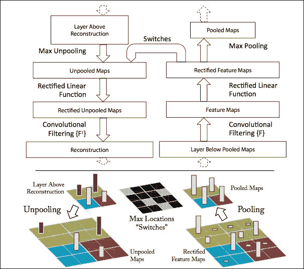

图片来源于 M. Zeiler 和 R. Fergus，《视觉化和理解卷积网络》。

文章展示了正在揭示的特征，其中**第二层**显示了角落和边缘，**第三层**显示了不同的网格图案，**第四层**显示了狗脸和鸟腿，而**第五层**显示了整个对象。

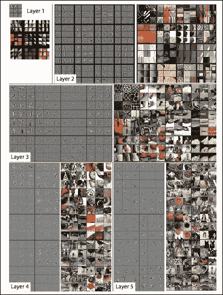

图像取自 M. Zeiler 和 R. Fergus，《可视化和理解卷积网络》

深度学习也可以通过使用包含 RBM 和自编码器的网络进行无监督学习。在 Q. Le、M. Ranzato、M. Devin、G. Corrado、K. Chen、J. Dean 和 A. Ng 的一篇文章中，*使用大规模无监督学习构建高级特征*，在国际机器学习大会（ICML）论文集中，作者使用了一个 9 层的自编码器网络，拥有十亿个连接，训练了来自互联网的 1000 万张图像。无监督特征学习使系统能够被训练以识别是否包含人脸的图像，而不需要告知。在文章中，作者表明：

> *"通过完全未标记的数据，可以训练神经元对高级概念进行选择性训练……通过对 YouTube 视频的随机帧进行训练，神经元可以成为面部、人体和猫脸的检测器……从这些表示开始，我们在 ImageNet 上的对象识别准确率达到了 15.8%，其中包括 20,000 个类别，相对于最先进技术的 70%的显著提高。"*

# GPU 与 CPU

如今深度学习受欢迎的一个原因是**GPU**（图形处理单元）的处理能力大幅增加。从架构上看，**CPU**（中央处理单元）由几个核心组成，每次只能处理几个线程，而 GPU 由数百个核心组成，可以同时处理数千个线程。与主要是串行单元的 CPU 相比，GPU 是高度可并行化的单元。

DNN 由几层组成，每一层的神经元的行为方式相同。此外，我们已经讨论了每个神经元的活动值是如何计算的，或者，如果用矩阵形式表示，我们有*a = wx*，其中*a*和*x*是向量，w 是矩阵。在整个网络中，所有激活值都是以相同的方式计算的。CPU 和 GPU 具有不同的架构，特别是它们的优化方式不同：CPU 是延迟优化的，而 GPU 是带宽优化的。在具有许多层和大量神经元的深度神经网络中，带宽成为瓶颈，而不是延迟，这就是为什么 GPU 性能如此出色的原因。此外，GPU 的 L1 缓存比 CPU 的 L1 缓存速度快得多，而且也更大。

L1 缓存表示程序下一步可能要使用的信息的内存，并存储这些数据可以加快处理速度。在深度神经网络中，许多内存会被重复使用，这就是为什么 L1 缓存内存很重要的原因。使用 GPU，你可以让你的程序的速度比单纯使用 CPU 快上一个数量级，并且这种加速也是近年来在使用深度神经网络进行语音和图像处理方面取得的许多进展背后的原因，这种计算能力的增加在十年前是不可用的。

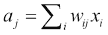

除了在 DNN *训练* 方面更快外，GPU 在运行 DNN *推理* 时也更有效率。推理是我们部署经过训练的 DNN 的后训练阶段。在 GPU 供应商 Nvidia 发布的一份名为*基于 GPU 的深度学习推理：性能和功耗分析*的白皮书中，对 AlexNet 网络（具有多个卷积层的 DNN）使用 GPU 和 CPU 的效率进行了比较，并在以下表格中总结了结果，该白皮书可在线获取：[`www.nvidia.com/content/tegra/embedded-systems/pdf/jetson_tx1_whitepaper.pdf`](http://www.nvidia.com/content/tegra/embedded-systems/pdf/jetson_tx1_whitepaper.pdf)。

| 网络：AlexNet | 批大小 | Tegra X1（FP32） | Tegra X1（FP16） | Core i7 6700K（FP32） |
| --- | --- | --- | --- | --- |
| 推理性能 | 1 | 47 img/sec | 67 img/sec | 62 img/sec |
| 功耗 | 5.5 W | 5.1 W | 49.7 W |
| 性能/瓦特 | 8.6 img/sec/W | 13.1 img/sec/W | 1.3 img/sec/W |
| 推理性能 | 128 (Tegra X1)48 (Core i7) | 155 img/sec | 258 img/sec | 242 img/sec |
| 功耗 | 6.0 W | 5.7 W | 62.5 W |
| 性能/瓦特 | 25.8 img/sec/W | 45 img/sec/W | 3.9 img/sec/W |

结果表明，在 Tegra X1 上的推理可以比基于 CPU 的推理节能一个数量级，同时实现可比较的性能水平。

直接编写访问 GPU 而不是 CPU 的代码并不容易，但这就是为什么大多数流行的开源库（如 Theano 或 TensorFlow）允许你简单地在代码中打开一个简单的*开关*来使用 GPU 而不是 CPU。使用这些库不需要编写专门的代码，但如果可用，同样的代码可以在 CPU 和 GPU 上运行。*开关*取决于开源库，但通常可以通过设置确定的环境变量或创建一个特定的资源（`.rc`）文件来完成，该文件由所选择的特定开源库使用。

# 流行的开源库——简介

有几个开源库可用，允许在 Python 中创建深度神经网络，而无需显式地从头编写代码。最常用的是：Keras、Theano、TensorFlow、Caffe 和 Torch。在本书中，我们将提供使用前三个库的示例，这些库都可以在 Python 中使用。这样做的原因是 Torch 不基于 Python，而是基于一种称为 Lua 的不同语言，而 Caffe 主要用于图像识别。对于这些库，我们将快速描述如何打开*我们在前一段讨论中讨论的 GPU 开关。然后，本书中的大部分代码都可以在 CPU 或 GPU 上运行，这取决于读者可用的硬件。*

## Theano

Theano（[`deeplearning.net/software/theano/`](http://deeplearning.net/software/theano/)）是一个用 Python 编写的开源库，实现了许多使编写神经网络代码变得容易的功能。此外，Theano 也可以很容易地利用 GPU 加速和性能。不深入讨论 Theano 如何工作的细节，Theano 使用符号变量和函数。在许多真正吸引人的功能中，Theano 允许我们通过为我们计算所有导数来很容易地使用反向传播。

正如前面提到的，Theano 也可以很容易地利用您计算机上的 GPU。有很多方法可以做到这一点，但最简单的方法是创建一个名为`.theanorc`的资源文件，并包含以下几行：

```py
[global]
device = gpu  
floatX = float32
```

您可以通过简单地输入以下命令来检查 Theano 是否配置为使用您的 GPU：

```py
print(theano.config.device)
```

我们参考 Theano 文档来学习如何使用 Theano 的第一步，并且我们将在本书中使用 Theano 实现一些深度学习的测试代码示例。

## TensorFlow

TensorFlow（[`www.tensorflow.org`](https://www.tensorflow.org)）与 Theano 非常相似，在 TensorFlow 中，计算也表示为图。因此，TensorFlow 图就是对计算的描述。在 TensorFlow 中，您不需要显式地要求使用 GPU，而是 TensorFlow 将自动尝试使用您的 GPU（如果有的话），但是如果您有多个 GPU，则必须显式地将操作分配给每个 GPU，否则只会使用第一个。要做到这一点，您只需键入以下行：

```py
with tensorflow.device("/gpu:1"):
```

在这里，可以定义以下设备：

+   `"/cpu:0"`：您的计算机的主 CPU

+   `"/gpu:0"`：如果存在的话，您计算机的第一个 GPU

+   `"/gpu:1"`：如果存在的话，您计算机的第二个 GPU

+   `"/gpu:2"`：如果存在的话，您计算机的第三个 GPU，以此类推

再次强调，我们参考 TensorFlow 文档来学习如何使用 TensorFlow 的第一步，并且测试使用 TensorFlow 的代码示例将在本书中实现。

## Keras

Keras ([`keras.io`](http://keras.io)) 是一个可以在 Theano 或 TensorFlow 上运行的神经网络 Python 库，尽管默认情况下会使用 TensorFlow 运行。在线提供了 [`keras.io/backend/`](http://keras.io/backend/) 的说明。Keras 可以在 CPU 或 GPU 上运行，如果你在 Theano 上运行它，你将需要像之前描述的那样设置一个 `.theanorc` 文件。Keras 允许不同的方式创建深度神经网络，它通过使用 *model* 来使其变得简单。主要类型的 *model* 是 `Sequential` model，它创建了一个线性堆叠的层。然后你可以通过简单调用 `add` 函数来新增层。在接下来的部分中，我们将使用 Keras 创建一些示例。Keras 可以通过以下简单命令轻松安装：

```py
pip install Keras

```

也可以通过从其 Git 存储库派生然后在上面运行设置来安装它：

```py
git clone https://github.com/fchollet/keras.git
cd keras
python setup.py install

```

然而，我们建议读者查阅在线文档以获取更多信息。

## 使用 Keras 的深度神经网络示例代码

在本节中，我们将介绍一些简单的代码，使用 Keras 对使用流行数据集 MNIST 正确分类数字。MNIST 是一个包含许多不同人手写数字的数据集，共有 70,000 个示例。通常，前 60,000 个用于训练，剩下的 10,000 个用于测试。

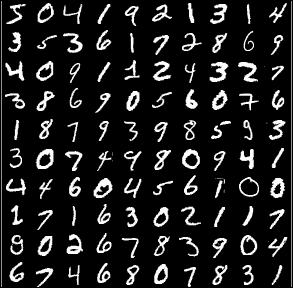

从 MNIST 数据集中获取的数字示例

Keras 的一个优点是它可以为你导入这个数据集，而无需显式从网络上下载它（Keras 会为你下载）。这可以通过一行简单的代码实现：

```py
from keras.datasets import mnist
```

我们需要从 Keras 导入一些类来使用经典的深度神经网络，它们是：

```py
from keras.models import Sequential 
from keras.layers.core import Dense, Activation
from keras.utils import np_utils
```

我们现在准备开始编写导入数据的代码，我们可以用一行代码完成：

```py
(X_train, Y_train), (X_test, Y_test) = mnist.load_data()
```

这导入了训练数据和测试数据；此外，这两个数据集被分为两个子集：一个包含实际图像，另一个包含标签。我们需要稍微修改数据以便使用它。事实上，`X_train` 和 `X_test` 数据包括了 60000 个小的 (28,28) 像素图像，但我们想将每个样本重新塑造为一个 784 像素长的向量，而不是一个 (28,28) 的二维矩阵。这可以通过以下两行轻松实现：

```py
X_train = X_train.reshape(60000, 784)     
X_test = X_test.reshape(10000, 784)
```

同样地，标签指示了图像所描述的数字的值，我们希望将其转换为一个包含全部零值和仅在对应于该数字的条目中有一个 1 的 10-entry 向量，因此例如 4 被映射为 [0, 0, 0, 0, 1, 0, 0, 0, 0, 0]。

```py
classes = 10
Y_train = np_utils.to_categorical(Y_train, classes)     
Y_test = np_utils.to_categorical(Y_test, classes)
```

最后，在调用我们的主函数之前，我们只需设置我们的输入大小（`mnist` 图像的大小）、隐藏层有多少个隐藏神经元、我们想要尝试我们网络的时期数量以及训练的批次大小：

```py
input_size = 784
batch_size = 100     
hidden_neurons = 100     
epochs = 15
main(X_train, X_test, Y_train, Y_test)
```

现在我们已经准备好为我们的主函数编写代码了。Keras 通过定义一个模型来工作，我们将使用`Sequential`模型，然后添加层（在这种情况下，我们将使用常规的* dense *，而不是稀疏层）指定输入和输出神经元的数量。对于每一层，我们指定其神经元的活动函数：

```py
model = Sequential()     
model.add(Dense(hidden_neurons, input_dim=input_size)) 
model.add(Activation('sigmoid'))     
model.add(Dense(classes, input_dim=hidden_neurons)) 
model.add(Activation('softmax'))
```

现在，Keras 提供了一种简单的方法来指定成本函数（`loss`）及其优化（训练速率、动量等）。我们不打算修改默认值，因此我们可以简单地传递：

```py
model.compile(loss='categorical_crossentropy', metrics=['accuracy'], optimizer='sgd')
```

在这个例子中，优化器是`sgd`，代表随机梯度下降。在这一点上，我们需要训练网络，这与 scikit-learn 类似，通过调用`fit`函数完成。我们将使用 verbose 参数，以便可以跟踪这个过程：

```py
model.fit(X_train, Y_train, batch_size=batch_size, nb_epoch=epochs, verbose=1)
```

唯一剩下的事情是添加代码来评估我们的网络在测试数据上的表现并打印准确率结果，这很简单：

```py
score = model.evaluate(X_test, Y_test, verbose=1)
print('Test accuracy:', score[1]) 
```

这就是全部。现在可以运行了。测试准确率大约为 94%，这不是一个很好的结果，但这个例子在 CPU 上运行时间不到 30 秒，是一个非常简单的实现。有一些简单的改进可以做，比如选择更多的隐藏神经元或选择更多的 epochs，我们把这些简单的改变留给读者自己去熟悉代码。

Keras 还允许我们查看它创建的权重矩阵。要做到这一点，只需键入以下行：

```py
weights = model.layers[0].get_weights()
```

通过在我们之前的代码中添加以下行，我们可以看看隐藏神经元学到了什么：

```py
import matplotlib.pyplot as plt     
import matplotlib.cm as cm     
w = weights[0].T          
for neuron in range(hidden_neurons):         
    plt.imshow(numpy.reshape(w[neuron], (28, 28)), cmap = cm.Greys_r) 
    plt.show()  
```

为了得到更清晰的图像，我们将 epochs 的数量增加到 100，得到以下的图形：

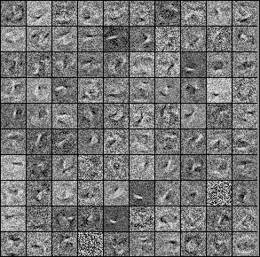

所有隐藏神经元学到的内容组成的复合图形

为了简单起见，我们将每个神经元的所有图像聚合到一个单独的图形中，表示所有神经元的复合图形。显然，由于初始图像非常小且没有很多细节（它们只是数字），隐藏神经元学到的特征并不是很有趣，但已经清楚每个神经元都学到了不同的“形状”。

上面的绘图代码应该立即清晰明了；我们只注意到以下行正在导入`cm`：

```py
import matplotlib.cm as cm 
```

这只是允许对神经元进行灰度表示，它在`imshow()`调用中使用，通过传递选项`cmap = cm.Greys_r`。这是因为`mnist`图像不是彩色图像，而是灰度图像。

Keras 的美妙之处在于它很容易创建神经网络，但也很容易下载测试数据集。让我们尝试使用`cifar10`数据集而不是`mnist`数据集。`cifar10`数据集不是数字，而是由 10 类对象组成：飞机、汽车、鸟类、猫、鹿、狗、青蛙、马、船和卡车。要使用`cifar10`数据集，只需写：

```py
from keras.datasets import cifar10
```

在前面的代码行的位置：

```py
from keras.datasets import mnist
```

然后，我们需要对上面编写的代码进行以下更改：

```py
(X_train, Y_train), (X_test, Y_test) = cifar10.load_data()
X_train = X_train.reshape(50000, 3072)     
X_test = X_test.reshape(10000, 3072)
input_size = 3072
```

这是因为训练图像仅有 50,000 张（而不是 60,000 张），并且图像是彩色（RGB）32 x 32 像素图像，因此它们的大小是 3 x 32 x 32。就目前而言，我们可以保持其他一切不变，但是，如果我们运行这个示例，我们会发现我们的性能现在非常差，只有大约 20%。这是因为数据更加复杂，需要更复杂的神经网络。事实上，大多数用于图像分类的神经网络都使用一些基本的卷积层，这将在第五章中讨论，*图像识别*，然而，现在我们可以尝试将隐藏神经元数提高到 3,000，并添加一个包含 2,000 个神经元的第二个隐藏层。我们还将在第一个隐藏层中使用 ReLU 激活函数。

要做到这一点，我们只需要写下以下定义模型的行，而不是之前的内容：

```py
    model = Sequential()     
    model.add(Dense(3000, input_dim=input_size)) 
    model.add(Activation('sigmoid'))
    model.add(Dense(2000, input_dim=3000)) 
    model.add(Activation('sigmoid'))     
    model.add(Dense(classes, input_dim=2000)) 
    model.add(Activation('softmax'))
```

如果我们运行这段代码，我们会发现训练时间要长得多，但是最后，我们的训练集准确率约为 60%，而测试数据的准确率只有约 50%。与较简单的`mnist`数据集相比，尽管网络更大，训练时间更长，但准确率要低得多，这是由于数据的复杂性更高。此外，通过将适配网络的行替换为以下行：

```py
model.fit(X_train, Y_train, batch_size=batch_size, nb_epoch=epochs, validation_split=0.1, verbose=1)
```

我们还可以在过程中输出训练数据分割为 90/10 的准确性如何提高。这也表明，尽管训练的准确性在训练过程中不断提高，但验证集的准确性在某一点上会达到饱和，表明网络开始过拟合并饱和一些参数。

尽管这可能看起来是深度网络在更丰富的数据集上无法提供良好准确性的失败，但事实上，我们将会看到，实际上有一些方法可以解决这个问题，让我们能够在更复杂更大的数据集上获得更好的性能。

# 摘要

在本章中，我们引导读者理解了深度学习的概念以及它与深度神经网络的关系。我们还讨论了除了经典的前馈实现之外，还存在许多不同的深度神经网络实现，并讨论了深度学习在许多标准分类任务上取得的最新成功。本章充满了从 Jacquard 织布机到伊辛模型的概念和想法，通过示例和历史评论进行了发展。这只是一个开始，我们将在许多示例中解释并更准确地发展本章介绍的思想。

我们将在接下来的章节开始这个过程，并向读者介绍许多我们在本章中涉及的概念，比如 RBM 和自编码器，以及清楚地展示我们如何创建比简单的前馈 DNN 更强大的深度神经网络。此外，在这些特定的神经网络中，表示和特征的概念如何自然地产生也将变得清晰。从上一个例子，使用 cifar10 数据集，可以清楚地看出经典的前馈 DNN 很难在更复杂的数据集上进行训练，我们需要更好的方法来设置权重参数。X. Glorot 和 Y. Bengio 在其论文《*Understanding the difficulty of training deep feed-forward neural* networks》中探讨了使用梯度下降来训练具有随机权重初始化的深度神经网络的性能不佳的问题。下一章将介绍并讨论可以成功训练深度神经网络的新算法。
