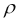

# 第四章：无监督特征学习

深度神经网络能够成功的一个原因是能够学习数据中实体（特征）的正确表示，而不需要（太多）人类和领域知识。

理论上，神经网络能够直接消耗原始数据，并通过隐藏的中间表示将输入层映射到所需的输出。传统的机器学习技术主要专注于最终映射，假定“特征工程”的任务已经完成。

特征工程是利用现有的领域知识创建智能数据表示的过程，以便它可以被机器学习算法处理。

Andrew Yan-Tak Ng 是斯坦福大学的教授，也是机器学习和人工智能领域最著名的研究者之一。他在出版物和讲话中描述了传统机器学习在解决实际问题时的局限性。

使机器学习系统正常工作最困难的部分是找到正确的特征表示：

> *提出特征是困难的，耗时的，需要专业知识。在应用学习应用程序时，我们花费了大量时间调整特征。*
> 
> *安德鲁·吴，机器学习和人工智能通过大脑模拟，斯坦福大学*

让我们假设我们正在将图片分类为几个类别，例如动物与车辆。原始数据是图像中的像素矩阵。如果我们直接在逻辑回归或决策树中使用这些像素，我们将为可能适用于给定的训练样本的每一张图片创建规则（或关联权重），但这将非常难以概括到相同图片的轻微变化。换句话说，假设我的决策树发现有五个重要的像素，它们的亮度（假设我们只显示黑白色调）可以确定大多数训练数据被分成两类--动物和车辆。相同的照片，如果裁剪、移位、旋转或重新着色，将不再遵循以前的那些规则。因此，模型可能会对它们进行随机分类。主要原因是我们正在考虑的特征太弱而不稳定。然而，我们可以首先预处理数据，以便提取这样的特征：

+   图片是否包含对称的，像车轮一样的形状？

+   它是否包含把手或方向盘？

+   它是否包含腿或头？

+   它是否有两只眼睛的脸？

在这种情况下，决策规则会非常容易和强大，如下所示：


需要多少努力才能提取这些相关特征？

由于我们没有把手检测器，我们可以尝试手动设计特征来捕捉图片的一些统计特性，例如，在不同的图片象限中找到不同方向的边缘。我们需要找到比像素更好的图像表示方法。

而且，强大和显著的特征通常是由先前提取的特征层次结构制成的。我们可以在第一步开始提取边缘，然后取得生成的“边缘向量”，并将它们组合起来识别物体部分，比如眼睛、鼻子、嘴巴，而不是光、镜子或者扰流板。最终的物体部分可以再次组合成对象模型；例如，两只眼睛，一只鼻子和一张嘴巴形成一张脸，或者两个车轮、一个座椅和一个把手形成一辆摩托车。整个检测算法可以以以下方式简化：


通过递归应用稀疏特征，我们设法获得更高级的特征。这就是为什么你需要比浅层算法更深的神经网络架构。单个网络可以学习如何从一个表示转移到另一个，但是将它们堆叠在一起将使整个端到端的工作流能够实现。

不过，真正的威力并不仅在于层次结构。重要的是要注意到，到目前为止我们只使用了无标签数据。我们通过对数据本身进行逆向工程来学习隐藏的结构，而不是依赖于手动标记的样本。监督学习仅表示最终的分类步骤，我们需要将其分配到车辆类别或动物类别。所有先前的步骤都是以无监督的方式执行的。

我们将在以下第五章中看到如何为图片执行特定的特征提取，*图像识别*。在本章中，我们将着重介绍学习任何类型数据（例如时间信号、文本或一般的属性向量）的特征表示的一般方法。

为此，我们将介绍两种最强大且广泛使用的无监督特征学习架构：自动编码器和受限波尔兹曼机。

# 自动编码器

自动编码器是用于无监督学习的对称网络，其中输出单元连接回输入单元：


H2O 训练手册中的自动编码器简单表示 (https://github.com/h2oai/h2o-training-book/blob/master/hands-on_training/images/autoencoder.png)

输出层的大小与输入层相同，因为它的目的是重构自己的输入，而不是预测一个依赖目标值。

这些网络的目标是通过编码层 Φ 充当压缩滤波器，将输入向量 *X* 适合到较小的潜在表示（编码） *c*，然后解码层 Φ 试图将其重构回 *X'*：


损失函数是重构误差，它将迫使网络找到训练数据的最有效的紧凑表示，同时最小化信息损失。对于数值输入，损失函数可以是均方误差：


如果输入数据不是数值型，而是表示为比特向量或多项分布的向量，我们可以使用重构的交叉熵：


这里，*d* 是输入向量的维度。

网络的中央层（编码）是数据的压缩表示。我们实际上将一个 n 维数组转换为一个较小的 m 维数组，其中 *m < n*。这个过程与使用**主成分分析**（**PCA**）进行降维非常相似。PCA 将输入矩阵分成正交轴（称为分量），以便您可以通过在这些轴上投影原始点来重构原始矩阵的近似值。通过按重要性对它们进行排序，我们可以提取出前 *m* 个组件，这些组件可以被视为原始数据的高级特征。

例如，在多元高斯分布中，我们可以将每个点表示为两个正交分量上的坐标，这两个分量描述了数据中可能的最大方差：


一个样本散点图，按照以(1,3)为中心，(0.866, 0.5)方向上标准差为 3，在正交方向上标准差为 1 的多元（双变量）高斯分布进行分布。这些方向表示与样本相关联的主成分（PC）。由 Nicoguaro（自己的作品）CC BY 4.0 (http://creativecommons.org/licenses/by/4.0)，通过维基媒体公共领域。

PCA 的局限性在于它只允许对数据进行线性变换，这并不总是足够的。

自编码器的优势在于可以使用非线性激活函数表示非线性表示。

自编码器的一个著名示例是 MITCHELL 在他的书 *机器学习* 中给出的。在这个例子中，我们有一个数据集，其中包含八个分类对象，用八个相互排斥的比特标记的二进制编码。网络将学习一个仅具有三个隐藏节点的紧凑表示：


Tom Mitchell 的自编码器示例。

通过应用正确的激活函数，学习到的紧凑表示与三比特二进制表示完全对应。

然而，在某些情况下，仅仅单个隐藏层不足以表示数据的整个复杂性和变异性。更深的架构可以学习输入和隐藏层之间更复杂的关系。然后，网络能够学习潜在特征并利用这些特征来最好地表示数据中的非平凡信息组成部分。

通过连接两个对称网络获得深度自动编码器，通常由最多五个浅层组成：


自动编码器的示意结构，具有 3 个完全连接的隐藏层（https://en.wikipedia.org/wiki/Autoencoder#/media/File:Autoencoder_structure.png）

深度自动编码器可以学习新的潜在表示，将先前学到的表示组合起来，以便每个隐藏级别可以被视为原始数据的某种压缩层次表示。然后，我们可以使用编码网络的代码或任何其他隐藏层作为描述输入向量的有效特征。

## 网络设计

在构建深度神经网络时，最常见的问题可能是：我们如何选择隐藏层的数量和每个层的神经元数量？此外，我们使用哪种激活和损失函数？

没有确定的答案。经验方法包括运行一系列试验和错误或标准网格搜索，其中深度和每个层的大小简单地被定义为调整超参数。我们将看一些设计准则。

对于自动编码器，问题略有简化。由于自动编码器有许多变体，我们将定义通用用例的指南。请记住，每个变体都将有其自己的规则需要考虑。我们可以建议以下内容：

+   输出层的大小与输入完全相同。

+   网络大多数情况下是对称的。拥有不对称网络意味着编码器和解码器函数的不同复杂性。除非有特殊原因，通常没有对称网络的优势。但是，您可以决定共享相同的权重或者决定在编码和解码网络中具有不同的权重。

+   在编码阶段，隐藏层比输入小，这种情况下，我们称之为“欠完备自动编码器”。多层编码器逐渐减小表示大小。隐藏层的大小通常最多是前一个的一半。如果数据输入层有 100 个节点，那么一个合理的架构可能是 100-40-20-40-100。比输入更大的层将导致没有任何压缩，这意味着不会学习到有趣的模式。我们将在*正则化*部分看到，这种约束在稀疏自动编码器的情况下并非必要。

+   中间层（代码）起着重要作用。在特征减少的情况下，我们可以将其保持较小，并且等于 2、3 或 4，以便允许高效的数据可视化。在堆叠的自编码器的情况下，我们应该将其设置得更大，因为它将代表下一个编码器的输入层。

+   在二进制输入的情况下，我们希望使用 sigmoid 作为输出激活函数，使用交叉熵，更确切地说，使用伯努利交叉熵的总和，作为损失函数。

+   对于实值，我们可以使用线性激活函数（ReLU 或 softmax）作为输出，并且使用**均方误差**（**MSE**）作为损失函数。

+   对于不同类型的输入数据（*x*）和输出*u*，您可以遵循一般方法，其中包括以下步骤：

    1.  找到观察到 x 的概率分布，给定*u*，P(x/u)

    1.  找到*u*和隐藏层 h(x)之间的关系

    1.  使用 

+   在深层网络（具有多个隐藏层）的情况下，为了不使编码器和解码器的复杂性失衡，使用相同的激活函数。

+   如果我们在整个网络中使用线性激活函数，我们将近似于 PCA 的行为。

+   除非是二进制的，否则最好对您的数据进行高斯缩放（0 均值和单位标准差），并且最好将输入值保留为 0 或 1。分类数据可以使用带有虚拟变量的独热编码来表示。

+   激活函数如下：

    +   ReLU 通常是大多数神经网络的默认选择。由于其拓扑结构，自编码器可能会受益于对称激活函数。由于 ReLU 往往过拟合，因此在与正则化技术（如 dropout）结合时更受欢迎。

    +   如果您的数据是二进制的或者可以缩放到[0,1]的范围内，则可能会使用 sigmoid 激活函数。如果您对输入分类数据使用了独热编码，则最好使用 ReLU。

    +   双曲正切（*tanh*）是在梯度下降情况下进行计算优化的不错选择。由于数据将围绕 0 中心化，导数将更高。另一个效果是减少梯度中的偏差，正如《高效的反向传播》一文中所解释的那样（[`yann.lecun.com/exdb/publis/pdf/lecun-98b.pdf`](http://yann.lecun.com/exdb/publis/pdf/lecun-98b.pdf)）。

    

    深度神经网络常用的不同激活函数

## 自编码器的正则化技术

在之前的章节中，我们已经看到了不同形式的正则化，例如 L1，L2，提前停止和 dropout。在本节中，我们将描述一些专门为自编码器量身定制的几种流行技术。

到目前为止，我们一直把自动编码器描述为"欠完备"，这意味着隐藏层比输入层小。这是因为拥有更大的层根本没有任何压缩。隐藏单元可能只是精确复制输入并将精确复制作为输出返回。

另一方面，拥有更多的隐藏单元将使我们有更多的自由学习智能表示。

我们将看到如何用三种方法解决这个问题：去噪自动编码器，压缩自动编码器和稀疏自动编码器。

### Denoising 自动编码器

想法是我们想训练我们的模型学习如何重建输入数据的嘈杂版本。

我们将使用 x 表示原始输入，表示带有噪音的输入，表示重建的输出。

带有噪声的输入，，是通过随机分配输入的子集为 0，概率为𝑝，再加上具有方差*v*的加性各向同性高斯噪声而生成的数值输入。

然后我们将有两个新的超参数要调整??和，它们代表噪音水平。

我们将使用带噪声的变体，，作为网络的输入，但损失函数仍然是输出与原始无噪声输入之间的误差。如果输入维度是*d*，编码函数*f*，解码函数*g*，我们将把损失函数*j*写成这样：


这里，*L*是重构误差，通常是均方误差或交叉熵。

有了这种变体，如果一个隐藏单元试图精确复制输入值，那么输出层就无法完全信任，因为它知道这可能是噪音而不是原始输入。我们正在强迫模型基于其他输入单元之间的相互关系来重建数据的有意义结构。

我们期望的是添加的噪声越大，在每个隐藏单元上应用的滤波器就越大。所谓的滤波器是指针对提取特定特征而激活的原始输入的部分。如果没有噪音，隐藏单元倾向于提取输入数据的一个小子集，并将其作为最不触及的版本提供给下一层。通过向单元添加噪声，对坏重构的错误惩罚将迫使网络保留更多信息，以便在可能存在噪音的情况下对特征进行上下文化。

请注意，只需添加一个小的白噪声就相当于使用权重衰减正则化。权重衰减是一种技术，它在每个训练时期将权重乘以小于 1 的因子，以便限制模型中的自由参数。虽然这是一种常用的神经网络正则化技术，但通过将输入设置为 0 的概率*p*，我们实际上实现了完全不同的结果。

我们不希望获得高频滤波器，这些滤波器组合在一起会给出更广义的模型。我们的去噪方法生成代表潜在数据结构的独特特征并具有独立含义的滤波器。

### 收缩自编码器

收缩自编码器旨在通过明确添加一个惩罚项来实现类似于去噪方法的目标，当模型试图学习无趣的变化并且仅促进在训练集中观察到的那些变化时，它就会受到惩罚。

换句话说，模型可能会试图通过产生代表训练数据中并非必然存在的变化的滤波器来逼近恒等函数。

我们可以将这种敏感性表示为所提取特征对输入维度的所有偏导数的平方和。

对于由编码函数*f*映射到大小为*d*[h]的隐藏表示*h*的维度为*x*的输入，以下数量对应于编码器激活的雅可比矩阵的 L2 范数（Frobenius）：


损失函数将修改如下：


在这里，λ是正则化因子。很容易看出，雅可比的 Frobenius 范数在线性编码器的情况下对应于 L2 权重衰减。主要的区别在于对于线性情况，实现收缩的唯一方法是保持权重非常小。在 sigmoid 非线性的情况下，我们还可以推动隐藏单元进入饱和状态。

让我们分析这两个术语。

误差*J*（MSE 或交叉熵）推动保留尽可能多的信息以完美重建原始值。

处罚推动了摆脱所有这些信息，使得隐藏单元对*X*的导数最小化。大值意味着所学到的表示对于输入变化太不稳定。当我们观察到输入值变化时，所观察到的隐藏表示几乎没有变化时，我们得到一个小的值。在这些导数限制为 0 的情况下，我们只保留了相对于输入*X*不变的信息。我们实际上摆脱了所有不够稳定且对微小扰动过于敏感的隐藏特征。

假设我们的输入是同一数据的许多变化。在图像的情况下，它们可能是同一主题的小旋转或不同曝光。在网络流量的情况下，它们可能是同一类型流量的数据包头部的增加/减少，可能是由于包装/解包协议。

如果我们只看这个维度，模型很可能会非常敏感。雅可比项将惩罚高敏感性，但它会被低重构误差所抵消。

在这种情况下，我们会有一个单位，对变化方向非常敏感，但对所有其他方向并不是很有用。例如，在图片的情况下，我们仍然拥有相同的主题；因此，所有其余的输入值都是常数。如果我们在训练数据中没有观察到给定方向的变化，我们希望丢弃该特征。

H2O 目前不支持收缩自编码器；但是，可以在[`0xdata.atlassian.net/browse/PUBDEV-1265`](https://0xdata.atlassian.net/browse/PUBDEV-1265)找到一个未解决的问题。

### 稀疏自编码器

自编码器，截至目前我们所见的，隐藏层始终小于输入。

主要原因是否则，网络将具有足够的能力只需记忆输入并完美地重构它。向网络添加额外的容量只会是多余的。

减少网络的容量会迫使基于输入的压缩版本进行学习。算法将不得不选择最相关的特征，以帮助更好地重构训练数据。

然而，有些情况下压缩是不可行的。让我们考虑每个输入节点由独立随机变量形成的情况。如果变量彼此不相关，则实现压缩的唯一方法是完全摆脱其中一些。我们实际上正在模拟 PCA 的行为。

为了解决这个问题，我们可以在隐藏单元上设置一个**稀疏**约束。我们将尝试推动每个神经元大部分时间处于不活跃状态，这对于 sigmoid 和 ReLU 来说意味着激活函数的输出接近于 0，对于 tanh 来说是-1。

如果我们称呼隐藏单元在输入为时的激活为，我们可以如下定义隐藏单元的平均激活：


在这里，是我们的训练数据集（或训练数据批次）的大小。

稀疏性约束包括强制，其中是**稀疏参数**，在区间[1,0]内且理想情况下足够接近 0。

原始论文([`web.stanford.edu/class/cs294a/sparseAutoencoder.pdf`](http://web.stanford.edu/class/cs294a/sparseAutoencoder.pdf))建议值接近 0.05。

我们将每个隐藏单元的平均激活值建模为具有均值的伯努利随机变量，并且我们希望所有这些都趋向于具有均值的伯努利分布。

为了实现这一点，我们需要添加一个额外的惩罚项，用于量化这两个分布之间的差异。我们可以根据我们希望实现的实际分布和理论分布之间的**Kullback-Leibler**（**KL**）散度来定义这个惩罚。

通常情况下，对于离散概率分布*P*和*Q*，以比特为单位测量信息时，*KL*散度定义如下：


其中一个要求是*P*对*Q*绝对连续，即对于任意可测的值*P*都满足。这也可以写成。每当时，该项的贡献将是，因为那时的。

在我们的案例中，单元*j*的稀疏自编码器散度如下：


当两个平均值相等且单调递增时，此函数的性质是，否则直到接近 8 时，会像这样增加。


或 1。

最终带有额外惩罚项的损失函数如下：


在这里，*J*是标准损失函数（均方根误差），是隐藏单元的数量，ß是稀疏项的权重。

这个额外的惩罚将导致反向传播算法出现一些小的低效。特别是，前述公式在计算每个示例的反向传播之前，将需要经过整个训练集进行额外的前向步骤来预先计算平均激活值。

## 自编码器总结

自编码器是强大的无监督学习算法，在异常检测或特征工程等领域越来越受欢迎，使用中间层的输出作为特征来训练监督模型，而不是使用原始输入数据。

无监督意味着在训练过程中不需要指定标签或地面真相。只要网络有足够的能力学习和表示内在的存在关系，它们就可以处理输入的任何数据。这意味着我们可以设定编码层的大小（减少的维度*m*），但根据隐藏层的数量和大小来获得不同的结果。

如果我们正在构建一个自动编码器网络，我们希望在避免错误表示的同时实现稳健性，但同时不要通过较小的顺序层压缩信息来限制网络的容量。

除噪声、收缩和自动编码器都是解决这些问题的很好的技术。

添加噪声通常更简单，而且不会在损失函数中增加复杂性，这会导致更少的计算。另一方面，嘈杂的输入使梯度变得不稳定，并且为了获得更好的特征而丢弃部分信息。

收缩自动编码器非常擅长使模型对训练分布的小偏差更加稳定。因此，它是减少误报的一个很好的选择。缺点是一种反效果，它会增加重构误差以减少敏感性。

稀疏自动编码器可能是最完整的解决方案。对于大型数据集来说，它计算成本最高，但由于梯度是确定的，它可以在二阶优化器的情况下提供很好的稳定性和低重构误差。

不管你做出什么选择，采用正则化技术都是强烈推荐的。它们都带有超参数需调整，我们将在相应的*Tuning*部分中看到如何优化。

除了迄今为止描述的技术外，值得一提的是变分自动编码器，它似乎是正则化自动编码器的最终解决方案。变分自动编码器属于生成模型类别。它不仅学习了最好地描述训练数据的结构，还学习了潜在单位高斯分布的参数，这些参数可以最好地再现输入数据。最终的损失函数将是重构误差和重构的潜在变量之间的 KL 散度的总和。编码器阶段将生成由均值和标准差向量组成的代码。从代码中，我们可以表征潜在分布参数，并通过从该分布中采样重构原始输入。

# 受限玻尔兹曼机

+   在 90 年代初，神经网络基本上已经过时。机器学习研究的大部分内容是关于其他技术，如随机森林和支持向量机。只有一个隐藏层的神经网络表现不如这些其他技术，而且人们认为训练更深的神经网络太困难。

+   兴趣再次高涨于神经网络，由 2004 年由**Geoffrey Hinton**领导的研究团队率先使用受限玻尔兹曼机（RBM）取得一系列突破，创造了具有多层的神经网络；他们将这种方法称为深度学习。在 10 年内，深度学习从一种小众技术发展到主导每一个人工智能竞赛。RBM 是这一巨大突破的一部分，使得 Hinton 和其他人在多种图像和语音识别问题上取得世界纪录成绩。

+   在这一部分中，我们将研究 RBM 的工作原理，如何实现它们以及如何将它们结合成深度信念网络。

一台受限玻尔兹曼机看起来很像是神经网络的一个单层。有一组输入节点与另一组输出节点相连：


图 1。受限玻尔兹曼机

输出节点被激活的方式也与自编码器完全相同。每个输入节点和输出节点之间有一个权重，每个输入节点的激活乘以这个权重映射矩阵，然后应用偏置向量，并且每个输出节点的总和将通过一个 sigmoid 函数。

使得受限玻尔兹曼机与众不同的是激活代表的内容、我们对它们的思考方式以及它们的训练方式。首先，当谈论 RBM 时，我们不是谈论输入和输出层，而是将层称为可见层和隐藏层。这是因为在训练时，可见节点代表我们已知的信息，而隐藏节点将旨在代表生成可见数据的一些变量。这与自编码器形成对比，自编码器的输出层不再明确地代表任何东西，只是通过信息传递的一种受限空间。

学习受限玻尔兹曼机的权重基础于统计物理学，并使用基于能量的模型（EBM）。在这些模型中，每个状态都经历一个能量函数，它与状态发生概率相关。如果能量函数返回一个高值，我们期望这种状态不太可能发生，很少发生。相反，能量函数的低结果意味着一个更稳定的状态，会更频繁发生。

一个很好的直观思考能量函数的方式是想象将大量的弹跳球扔进一个箱子中。起初，所有的球都具有很高的能量，因此会弹得很高。这里的状态是所有球的位置和它们关联速度的一个时间点快照。当球在弹跳时，这些状态将会非常短暂；它们只会存在片刻，因为球的移动范围很大，很不可能再次出现。但是当球开始平静下来，当能量离开系统时，一些球将开始越来越静止。这些状态一旦发生一次就稳定了，一旦发生就不会停止。最终，当球停止弹跳并且都变成静止时，我们有一个完全稳定的状态，具有很高的概率。

+   以应用于受限波尔兹曼机的例子，考虑学习一组蝴蝶图像的任务。我们在这些图像上训练我们的 RBM，并且希望它对任何蝴蝶图像分配低能量值。但是当给出来自不同集合的图像，比如汽车时，它会给它分配一个高能量值。相关的对象，如蛾子、蝙蝠或鸟，可能具有中等能量值。

+   如果我们定义了一个能量函数，那么给定状态的概率就如下所示：

+   在这里，v 是我们的状态，E 是我们的能量函数，Z 是分区函数；v 的所有可能配置的总和定义如下：

## 霍普菲尔德网络和波尔兹曼机

+   在我们进一步讨论受限波尔兹曼机之前，让我们简要谈谈霍普菲尔德网络；这应该有助于我们对如何到达受限波尔兹曼机有更多的理解。霍普菲尔德网络也是基于能量的模型，但与受限波尔兹曼机不同，它只有可见节点，并且它们都是相互连接的。每个节点的激活始终为-1 或+1。

    图 2. 霍普菲尔德网络，所有输入节点都相互连接。

+   在运行霍普菲尔德网络（或 RBM）时，您有两个选项。第一个选项是您可以将每个可见节点的值设置为您正在触发的数据项的相应值。然后，您可以触发连续的激活，在每次激活时，每个节点的值都根据其连接到的其他可见节点的值进行更新。另一个选项是仅随机初始化可见节点，然后触发连续的激活，以产生其已经训练过的数据的随机示例。这通常被称为网络做白日梦。

+   下一个时间步的每个可见节点的激活定义如下：

+   在这里，W 是一个矩阵，定义了时间步骤 t 时每个节点 v 之间的连接强度。然后对 a 应用阈值规则，得到 v 的新状态：

+   节点之间的权重 W 可以是正的也可以是负的，在激活时会导致节点相互吸引或排斥。霍普菲尔德网络还有一个连续变体，它只是用 tanh 函数替换了阈值函数。

+   该网络的能量函数如下：

+   用矩阵表示，如下所示：

+   方程中的是因为我们要遍历每对 i 和 j，因此重复计算每个连接（当 i=1 且 j=2 时，然后当 i=2 且 j=1 时又计算一次）。

+   这里可能出现的问题是：为什么只有可见节点的模型？我会给它激活，然后触发一些状态更新。但是这个新状态给我提供了什么有用的信息呢？能量基模型的特性在这里变得有趣。不同的 W 配置将改变与状态 v 相关的能量函数。如果我们将网络状态设置为具有高能量函数的东西，即不稳定状态（想象一下许多弹跳的球）；网络会在连续的迭代中移动到一个稳定状态。

+   如果我们对数据集训练霍普菲尔德网络，学习得到一个对数据集中每个条目都有低能量的 W，然后我们可以从数据中创建一个损坏的样本，比如，通过随机交换一些输入的正负状态。因为损坏使得这些样本不太可能是原数据集的成员，所以这些损坏的样本可能现在处于高能量状态。如果我们激活网络的可见节点上的损坏样本，运行网络的更多迭代直到达到低能量状态；那么网络有很大的可能性已经重构了原始未损坏的模式。

+   这导致 Hopfield 网络的一个用途是拼写纠正；你可以在单词库上对其进行训练，其中包含单词中使用的字母作为输入。然后，如果给出一个拼写错误的单词，它可能能够找到正确的原始单词。Hopfield 网络的另一个用途是作为内容寻址内存。计算机内存和人类内存之间的一个重要区别是，计算机内存是用地址存储的。如果计算机想要检索内存，它必须知道存储它的确切位置。另一方面，人类记忆可以给出该记忆的部分内容，该内容的特性可以用来恢复其余部分。例如，如果我需要记住我的密码，我知道我正在寻找的内容以及该内容的属性，一个四位数；我的大脑利用这一点返回值。

+   Hopfield 网络允许您存储内容寻址内存，这导致一些人推测人类记忆系统可能像 Hopfield 网络一样运作，人类的梦境是学习权重的尝试。

+   Hopfield 网络的最后一个用途是，它可以用于解决优化任务，例如旅行推销员任务。可以定义能量函数来表示要优化的任务的成本，网络的节点表示要优化的选择。同样，只需最小化网络权重的能量函数即可。

## Boltzmann 机器

+   Boltzmann 机器也被称为随机 Hopfield 网络。在 Hopfield 网络中，节点激活是基于阈值设置的；但在 Boltzmann 机器中，激活是随机的。Boltzmann 机器中的节点值始终设置为 +1 或 -1。节点处于状态 +1 的概率定义如下: 

+   这里，*a*[*i*] 是针对 Hopfield 网络定义的该节点的激活。

为了学习我们的 Boltzmann 机器或 Hopfield 网络的权重，我们希望最大化给定 W 的数据集的可能性，这简单地是每个数据项的可能性的乘积：


这里，W 是权重矩阵，*x**^((n))* 是大小为 N 的数据集 x 的第 n 个样本。现在让我们用来自我们的 Boltzmann 机器的实际可能性替换 ：


这里，*Z* 如下方程所示：


如果您查看我们能量函数和 Z 的原始定义，那么*x'*应该是基于概率分布*p(x)*的每个可能配置的*x*。我们现在的模型中有 W 的一部分，因此分布将更改为。不幸的是，如果不是完全棘手的，至少是计算成本太高，无法计算的。我们需要在所有可能的 W 的所有可能的 x 的配置中进行计算。

计算这种难以处理的概率分布的一种方法是所谓的蒙特卡罗采样。这涉及从分布中取大量样本，并使用这些样本的平均值来近似真实值。我们从分布中取的样本越多，它的准确性就越高。假设无限数量的样本将完全符合我们想要的数量，而 1 将是一个非常差的近似值。

由于概率的乘积可能变得非常小，因此我们将使用对数概率；另外，让我们也包括*Z*的定义：


这里，x'是从网络学习的概率分布中获取的网络状态样本。如果我们对节点 i 和 j 之间的单个权重取这个梯度，它看起来像这样：


这里，在所有 N 个样本中只是节点 i 和 j 之间的相关性。另一种写法是对所有 N 个样本，对于每个权重*i*和*j*，可以写成这样：


这个方程可以理解为学习的两个阶段，被称为正相和负相或者，更具诗意地说，醒和睡眠。在正相中，根据我们所给的数据增加权重。在负相中，，我们从模型中根据当前权重抽取样本，然后将权重远离该分布。这可以被认为是减少模型生成的项目的概率。我们希望我们的模型尽可能地反映数据，因此我们希望减少模型生成的选择。如果我们的模型产生的图像与数据完全相同，那么这两个术语将互相抵消，达到平衡。

玻尔兹曼机和霍普菲尔德网络可用于优化和推荐系统等任务。它们需要大量的计算资源。必须测量每个节点之间的相关性，然后对模型进行每一步训练时的蒙特卡洛样本的范围。此外，它可以学习的模式种类有限。如果我们在图像上训练以学习形状，它无法学习位置不变的信息。图像左侧的蝴蝶与图像右侧的蝴蝶完全不同。在第五章*图像识别*中，我们将看一下卷积神经网络，它提供了这个问题的解决方案。

## 受限玻尔兹曼机

受限玻尔兹曼机与玻尔兹曼机相比进行了两项改变：第一是添加了隐藏节点，每个节点都连接到每个可见节点，但彼此不连接。 第二是删除了可见节点之间的所有连接。这导致在给定隐藏层的情况下，可见层中的每个节点都是条件独立的。给定可见层后，隐藏层中的节点也是条件独立的。我们现在还将向可见和隐藏节点添加偏置项。玻尔兹曼机也可以在每个节点上训练有偏置项，但这在等式中被忽略了以便简化符号。

+   由于我们拥有的数据只针对可见单元，我们的目标是通过训练找到隐藏单元的配置，当与可见单元结合时，可以导致低能态。在我们的受限玻尔兹曼机中，状态*x*现在是可见和隐藏节点的完整配置。因此，我们将能量函数参数化为 E(v, h)。它现在看起来像这样：

+   在这里，a 是可见节点的偏置向量，b 是隐藏节点的偏置向量，W 是可见和隐藏节点之间的权重矩阵。此处， 是这两个向量的点积，等价于。现在我们需要对新能量函数计算出的偏置和权重进行梯度下降。

+   由于层之间的条件独立性，我们现在有这个：

    +   

    +   

+   这两个定义将用于归一化常数 Z。由于我们不再有可见节点之间的连接，我们的 发生了很大的变化：

+   在这里，i 遍历每个可见节点，j 遍历每个隐藏节点。如果我们对不同参数取梯度，那么最终你会得到这个：

与以前一样，是通过从分布中取蒙特卡洛样本来近似的。这最后三个方程给出了我们迭代地训练给定数据集的所有参数的完整方法。训练将是通过这些梯度以某个学习速率更新我们的参数的情况。

从概念层面上再次说明这里发生了什么是值得的。v 表示可见变量，即我们正在学习的来自世界的数据。h 表示隐藏变量，即我们将训练以生成可见变量的变量。隐藏变量并不明确地代表任何东西，但通过训练和最小化系统中的能量，它们最终应该找到我们正在查看的分布的重要组成部分。例如，如果可见变量是一系列电影，如果一个人喜欢这部电影，则其值为 1，如果不喜欢，则为 0，那么隐藏变量可能会表示电影的流派，如恐怖片或喜剧片，因为人们可能有流派偏好，所以这是一种编码人们口味的有效方式。

如果我们随机生成隐藏变量的样本，然后基于此激活可见变量，那么它应该给我们一个看起来合理的电影口味集。同样，如果我们将可见变量设置为在隐藏和可见节点的连续激活过程中的随机电影选择，那么它应该使我们找到一个更合理的选择。

## 在 TensorFlow 中的实现

现在我们已经通过了数学，让我们看看它的实现是什么样子的。为此，我们将使用 TensorFlow。TensorFlow 是一个谷歌开源数学图形库，用于深度学习很受欢迎。它没有内置的神经网络概念，比如网络层和节点，这是一个更高级别的库，比如 Keras 才有；它更接近于像 Theano 这样的库。之所以选择它，是因为能够直接处理网络底层的数学符号，使用户能够更好地理解他们在做什么。

TensorFlow 可以直接通过 `pip` 安装，使用命令 `pip install tensorflow` 安装 CPU 版本，或者如果您有 NVidea GPU 启用的机器，则使用命令 `pip install tensorflow-gpu` 安装 GPU 版本。

我们将构建一个小型的受限玻尔兹曼机，并对其进行 MNIST 手写数字集的训练。我们将比可见节点少的隐藏节点数，这将迫使 RBM 学习输入中的模式。训练的成功将通过网络在经过隐藏层后重构图像的能力来衡量；为此，我们将使用原始图像与我们的重构之间的均方误差。完整的代码示例在 GitHub 仓库 [`github.com/DanielSlater/PythonDeepLearningSamples`](https://github.com/DanielSlater/PythonDeepLearningSamples) 的 `restricted_boltzmann_machine.py` 文件中。

由于 MNIST 数据集被如此广泛地使用，TensorFlow 有一种很好的内置方式来下载和缓存 MNIST 数据集。只需简单地调用以下代码即可完成：

```py
from tensorflow.examples.tutorials.mnist import input_data
mnist = input_data.read_data_sets("MNIST_data/")
```

这将把所有 MNIST 数据下载到 `"MNIST_data/"` 目录下的 `MNIST_data` 文件夹中，如果还没有。`mnist` 对象有 `train` 和 `test` 属性，允许您访问 NumPy 数组中的数据。MNIST 图像都是 28x28 大小的，即每个图像有 784 个像素。我们将为我们的 RBM 需要每个像素一个可见节点：

```py
input_placeholder = tf.placeholder("float", shape=(None, 784))
```

TensorFlow 中的占位符对象表示在使用期间将传递到计算图中的值。在这种情况下，`input_placeholder` 对象将保存我们给它的 `MNIST` 图像的值。`"float"` 指定了我们将传递的值的类型，`shape` 定义了维度。在这种情况下，我们想要 784 个值，每个像素一个，`None` 维度用于批处理。有一个 None 维度意味着它可以是任何大小；因此，这将允许我们发送可变大小的 784 长度的数组的批次：

```py
weights = tf.Variable(tf.random_normal((784, 300), mean=0.0, stddev=1./784))
```

`tf.variable` 表示计算图上的变量。这是前述方程中的 *W*。传递给它的参数是变量值应该如何首先初始化的方式。在这里，我们将其初始化为一个大小为 784x300 的正态分布，即可见节点到隐藏节点的数量：

```py
hidden_bias = tf.Variable(tf.zeros([300]))
visible_bias = tf.Variable(tf.zeros([784]))
```

这些变量将是我们前述方程中的 `a` 和 `b`；它们被初始化为全部从值为 0 开始。现在我们将编写网络的激活：

```py
hidden_activation = tf.nn.sigmoid(tf.matmul(input_placeholder, weights) + hidden_bias)
```

这代表了在前述方程中隐藏节点的激活，。应用 `sigmoid` 函数后，这个激活可以被放入二项分布中，以便隐藏层中的所有值都变为 0 或 1，概率由给定；但事实证明，RBM 的训练与原始概率一样好。因此，没有必要通过这种方式复杂化模型：

```py
visible_reconstruction = tf.nn.sigmoid(tf.matmul(hidden_activation, tf.transpose(weights)) + visible_bias)
```

现在我们有了可见层的重构，。根据方程的规定，我们给它 `hidden_activation`，从中我们得到了可见层的样本：

```py
final_hidden_activation = tf.nn.sigmoid(tf.matmul(visible_reconstruction, weights) + hidden_bias)
```

现在我们计算我们需要的最终样本，来自我们的`visible_reconstruction`的隐藏节点的激活。这相当于方程中的 。我们可以继续使用连续迭代的隐藏和可视激活来从模型中获取一个更加无偏的样本。但只进行一次旋转就足够用于训练：

```py
Positive_phase = tf.matmul(tf.transpose(input_placeholder), hidden_activation)
Negative_phase = tf.matmul(tf.transpose(visible_reconstruction), final_hidden_activation)
```

现在我们计算正相位和负相位。第一阶段是我们的 `input_placeholder` 中的样本和第一个 `hidden_activation` 之间的相关性，。然后，负相位获取 `visible_reconstruction`，和`final_hidden_activation`之间的相关性，：

```py
LEARING_RATE = 0.01
weight_update = weights.assign_add(LEARING_RATE * (positive_phase – negative_phase))
```

在我们的`weights`变量上调用`assign_add`会创建一个操作，当运行时，会将给定的数量添加到变量中。这里，0.01 是我们的学习率，我们通过它来缩放正相位和负相位：

```py
visible_bias_update = visible_bias.assign_add(LEARING_RATE * tf.reduce_mean(input_placeholder - visible_reconstruction, 0))
hidden_bias_update = hidden_bias.assign_add(LEARING_RATE * tf.reduce_mean(hidden_activation - final_hidden_activation, 0))
```

现在我们创建缩放隐藏和可视偏置的操作。这些也会被我们的 0.01 学习率缩放：

```py
train_op = tf.group(weight_update, visible_bias_update, hidden_bias_update)
```

调用`tf.group`创建一个新操作，当调用时会同时执行所有的操作参数。我们总是希望同时更新所有的权重，所以创建一个单独的操作是有意义的：

```py
loss_op = tf.reduce_sum(tf.square(input_placeholder - visible_reconstruction))
```

这个`loss_op`将为我们提供有关我们的训练效果的反馈，使用 MSE。请注意，这仅用于信息；不会针对此信号进行反向传播。如果我们想将这个网络作为一个纯自动编码器来运行，我们将在这里创建一个优化器，并激活它以最小化`loss_op`：？

```py
session = tf.Session()
session.run(tf.initialize_all_variables())
```

然后，我们创建一个将用于运行计算图的会话对象。调用`tf.initialize_all_variables()`时，所有内容都会初始化到图中。如果你在 GPU 上运行 TensorFlow，这是硬件首先被接口化的地方。现在我们已经为 RBM 创建了每一步，让我们经历几个时代的 MNIST 运行，并看看它学到了多少：

```py
current_epochs = 0

for i in range(10):
    total_loss = 0
    while mnist.train.epochs_completed == current_epochs:
        batch_inputs, batch_labels = mnist.train.next_batch(100)
        _, reconstruction_loss = session.run([train_op, loss_op], feed_dict={input_placeholder: batch_inputs})
        total_loss += reconstruction_loss

    print("epochs %s loss %s" % (current_epochs, reconstruction_loss))
    current_epochs = mnist.train.epochs_completed
```

每次我们调用`mnist.train.next_batch(100)`，就会从`mnist`数据集中检索 100 张图片。在每个时代结束时，`mnist.train.epochs_completed`会增加 1，所有训练数据都会重新洗牌。如果你运行这个，你可能会看到类似这样的结果：

```py
epochs 0 loss 1554.51
epochs 1 loss 792.673
epochs 2 loss 572.276
epochs 3 loss 479.739
epochs 4 loss 466.529
epochs 5 loss 415.357
epochs 6 loss 424.25
epochs 7 loss 406.821
epochs 8 loss 354.861
epochs 9 loss 410.387
epochs 10 loss 313.583

```

现在我们可以通过在`mnist`数据上运行以下命令来看看图像重构是什么样的：

```py
reconstruction = session.run(visible_reconstruction, feed_dict={input_placeholder:[mnist.train.images[0]]})
```

这里有一些使用 300 个隐藏节点的重建图像的示例：


图 3. 使用不同数量的隐藏节点对受限玻尔兹曼机进行数字的重构

正如您所见，使用 300 个隐藏节点，不到像素数量的一半，它仍然可以几乎完美地重建图像，只有边缘周围有一点模糊。但是随着隐藏节点数量的减少，重建的质量也会降低。将隐藏节点减少到只有 10 个时，重建的图像可能会产生对于人眼来说看起来像是错误的数字，例如图 3 中的 2 和 3。

## 深信度网络

如果我们想象我们的 RBM 正在学习一组生成我们可见数据的潜在变量，并且我们感到好奇，我们可能会想知道：我们是否可以学习第二层生成隐藏层潜在变量的潜在变量？答案是肯定的，我们可以将先前训练的 RBM 堆叠在一起，以便学习有关可见数据的二阶、三阶、四阶等信息。这些连续的 RBM 层使网络能够学习越来越不变的表示底层结构：


图 4 深信度网络，包含许多链接的 RBM

这些堆叠的 RBM 被称为深度信度网络，是 Geoffrey Hinton 在他的 2002 年论文《通过最小化对比散度训练专家产品》中首次在 MNIST 上取得突破性成果时使用的深度网络。他发现有用的确切技术是在数据上训练连续的 RBM，每一层的尺寸都只稍微减小。一旦一个层训练到重建误差不再改善的程度，它的权重就被冻结，然后在其上堆叠一个新的 RBM，并再次训练直到误差率收敛。一旦整个网络训练完毕，最后添加一个监督层，以将最终 RBM 的隐藏层映射到数据的标签。然后使用整个网络的权重构建标准的深度前馈神经网络，使得这些预先计算的深度信度网络的权重能够通过反向传播进行更新。

起初，这些方法效果很好，但随着时间的推移，用于训练标准前馈网络的技术已经改进，RBMs 不再被认为是图像或语音识别的最佳方法。它们还存在一个问题，就是由于其两阶段性质，它们的训练速度可能会慢得多。但是它们在诸如推荐系统和纯无监督学习等方面仍然非常受欢迎。此外，从理论上讲，使用能量模型来学习深度表示是一种非常有趣的方法，并且为许多可以建立在该方法之上的扩展留下了大门。

# 摘要

在本章中，我们看到了许多实际深度学习实现核心的两种最强大的技术：自动编码器和受限玻尔兹曼机。

对于它们两个，我们都从一个隐藏层的浅层示例开始，并且探索了如何将它们堆叠在一起形成一个深度神经网络，能够自动学习高层次和分层次的特征，而不需要显式的人类知识。

它们都有类似的目的，但有一点小小的实质性差别。

自动编码器可以被看作是我们用来压缩数据的压缩过滤器，以保留其中最具信息量的部分，并能够确定性地重构原始数据的近似。自动编码器是对维度约简和非线性压缩的优雅解决方案，绕过了主成分分析（PCA）技术的限制。自动编码器的优点是，它们可以用作进一步分类任务的预处理步骤，其中每个隐藏层的输出是数据信息表示的可能级别之一，或者是其去噪和恢复版本。另一个巨大的优点是利用重构误差作为一个单点与其余组的不相似性的度量。这样的技术广泛用于异常检测问题，其中我们观察到的内容与内部表示之间的关系是恒定的和确定性的。在时间变化关系或取决于可观察维度的情况下，我们可以分组和训练不同的网络，以便适应，但一旦训练完成，网络就假设这些关系不受随机变化的影响。

另一方面，RBM 使用随机方法对样本进行采样和调整权重，以最小化重构误差。直觉可能是存在一些可见的随机变量和一些隐藏的潜在属性，目标是找出这两组之间的联系。举个例子，在电影评分的情况下，我们可以有一些隐藏的属性，比如电影类型，以及一些随机的观察，比如评分和/或评论。在这样的拓扑结构中，我们还可以将偏差项看作是调整每部电影不同内在流行度的一种方式。如果我们让用户从由*哈利·波特*、*阿凡达*、*指环王*、*角斗士*和*泰坦尼克号*组成的集合中评价他们喜欢哪部电影，我们可能会得到一个结果网络，其中两个潜在单元可能代表科幻电影和奥斯卡获奖电影：


可能的 RBM 示例，仅绘制与权重明显不同于 0 的链接。

虽然科幻和奥斯卡获奖的属性是确定性的（实际上，它们是电影的属性），但用户的评级受到概率方式的影响。学习到的权重是表征电影评分的概率分布的参数（例如，哈利·波特获得五星），假设用户喜欢特定的类型（例如，科幻）。

在这种关系不确定的情况下，我们更倾向于使用受限玻尔兹曼机（RBM）而不是自编码器。

总的来说，无监督特征学习是一种非常强大的方法，可以用最少的知识和人为干预来丰富特征工程。

根据一些基准测试（[Lee, Pham and Ng, 2009] 和 [Le, Zhou and Ng, 2011]）的结果，用于衡量不同特征学习技术准确性的，已经证明无监督特征学习相对于目前的最新技术有所提高。

不过，还存在一些挑战。如果您有一些知识，最好不要将其丢弃。我们可以在初始化阶段以先验的形式嵌入这些知识，在这一阶段我们可以手工设计网络拓扑和初始状态。

此外，由于神经网络本身已经很难解释，并且大多数时候被视为黑匣子，因此至少了解输入特征可能有所帮助。在我们的无监督特征学习中，我们希望直接使用原始数据。因此，理解模型的工作原理变得更加困难。

我们在本书中不会涉及这些问题。我们认为现在下结论还为时过早，深度学习的进一步发展以及人们和企业处理这些应用的方式将会趋于稳定和可靠。
