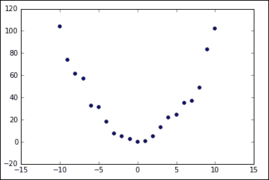
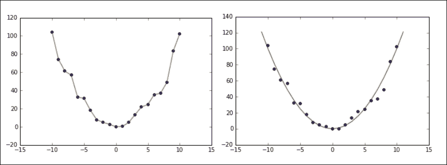
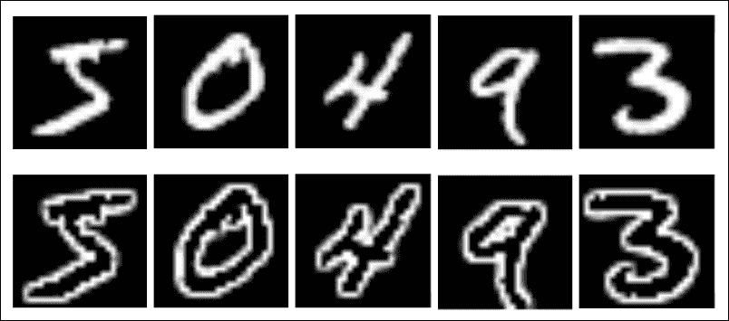
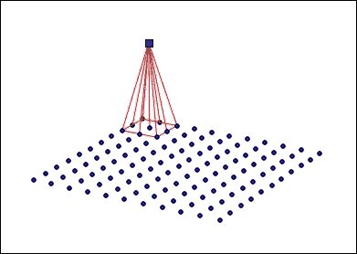
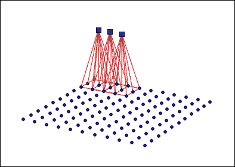
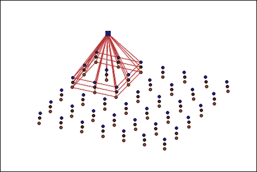
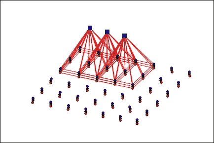

# 第五章。图像识别

视觉可以说是人类最重要的感官之一。我们依赖视觉来识别食物，逃离危险，认出朋友和家人，以及在熟悉的环境中找到方向。我们甚至依赖视觉来阅读这本书，并识别其中打印的每一个字母和符号。然而，图像识别一直以来一直是计算机科学中最困难的问题之一。因为要教会计算机如何识别不同的物体是非常困难的，因为很难向机器解释构成指定物体的特征。然而，正如我们所看到的，深度学习中的神经网络通过自身学习，也就是学会了构成每个物体的特征，因此非常适合图像识别这样的任务。

在本章中，我们将涵盖以下主题：

+   人造模型和生物模型之间的相似之处

+   CNN 的直觉和理由

+   卷积层

+   池层

+   丢弃

+   深度学习中的卷积层

# 人造模型和生物模型之间的相似之处

人类视觉是一个复杂且结构严谨的过程。视觉系统通过视网膜、丘脑、视觉皮层和颞下皮质等阶级性地理解现实。视网膜的输入是一个二维的颜色密度数组，通过视神经传递到丘脑。丘脑除了嗅觉系统的感官信息外，还接收从视网膜收集的视觉信息，然后将该信息传递到初级视觉皮层，也就是 V1 区，它提取基本信息，例如线条和运动方向。然后信息流向负责色彩解释和不同光照条件下的颜色恒定性的 V2 区，然后到达 V3 和 V4 区，改善色彩和形态感知。最后，信息传递到**颞下皮质**（**IT**），用于物体和面部识别（事实上，IT 区域还进一步细分为三个亚区，即后部 IT、中央 IT 和前部 IT）。因此，大脑通过在不同层级处理信息来处理视觉信息。我们的大脑似乎通过在不同层级上创建简单的抽象现实表示，然后将它们重新组合在一起来解决这个问题（详细参考：J. DiCarlo, D. Zoccolan, and N. Rust, *大脑是如何处理视觉物体识别的？*，[`www.ncbi.nlm.nih.gov/pmc/articles/PMC3306444`](https://www.ncbi.nlm.nih.gov/pmc/articles/PMC3306444)）。

我们目前看到的深度学习神经网络通过创建抽象表示来工作，就像我们在 RBM 中看到的那样，但是理解感官信息的重要拼图中还有另一个重要部分：我们从感官输入中提取的信息通常主要由最相关的信息确定。从视觉上看，我们可以假设附近的像素是最相关的，它们的集体信息比我们从彼此非常遥远的像素中得出的信息更相关。在理解语音方面，我们已经讨论过研究三音素的重要性，也就是说，对音频的理解依赖于其前后的声音。要识别字母或数字，我们需要理解附近像素的依赖性，因为这决定了元素的形状，从而区分例如 0 和 1 等之间的差异。总的来说，远离 0 的像素通常对我们理解数字"0"没有或几乎没有影响。卷积网络的构建正是为了解决这个问题：如何使与更近的神经元相关的信息比来自更远的神经元更相关的信息。在视觉问题中，这意味着让神经元处理来自附近像素的信息，并忽略与远离像素相关的信息。

# 直觉和理解

我们在第三章中已经提到了 Alex Krizhevsky、Ilya Sutskever 和 Geoffrey Hinton 在 2012 年发表的论文：*使用深度卷积神经网络进行 ImageNet 分类*。尽管卷积的起源可以追溯到 80 年代，但那是第一篇突出卷积网络在图像处理和识别中深刻重要性的论文之一，当前几乎没有用于图像识别的深度神经网络可以在没有某些卷积层的情况下工作。

我们在使用传统前馈网络时遇到的一个重要问题是它们可能会过拟合，特别是在处理中等到大型图像时。这通常是因为神经网络具有非常多的参数，事实上，在经典神经网络中，一层中的所有神经元都连接到下一层中的每一个神经元。当参数数量很大时，过拟合的可能性更大。让我们看以下图片：我们可以通过画一条穿过所有点的线来拟合数据，或者更好的是，一条不完全匹配数据但更可能预测未来示例的线。



图中的点表示输入数据点。虽然它们明显遵循抛物线的形状，但由于数据中的噪声，它们可能不会被精确地绘制到抛物线上。

在两幅图中的第一个例子中，我们对数据进行了过拟合。在第二个例子中，我们已经将我们的预测与数据匹配得更好，这样我们的预测更有可能更好地预测未来的数据。在第一种情况下，我们只需要三个参数来描述曲线：*y = ax² + bx + c*，而在第二种情况下，我们需要比三个参数多得多的参数来编写该曲线的方程。这直观地解释了为什么有时候拥有太多参数可能不是一件好事，而且可能导致过拟合。对于像 `cifar10` 示例中那样小的图像（`cifar10` 是一个经过验证的计算机视觉数据集，由 60000 张 32 x 32 图像组成，分为 10 类，在本章中我们将看到该数据集的几个示例），经典的前馈网络的输入大小为 3 x 32 x 32，已经约为简单 `mnist` 数字图像的四倍。更大的图像，比如 3 x 64 x 64，将拥有大约 16 倍于输入神经元数量的连接权重：



在左图中，我们画了一条与数据完全匹配的直线。在第二个图中，我们画了一条近似连接数据点形状的直线，但并不完全匹配数据点。尽管第二条曲线在当前输入上不够精确，但比第一张图中的曲线更有可能预测未来的数据点。

卷积网络减少了所需的参数数量，因为它们要求神经元仅在本地与对应于相邻像素的神经元连接，因此有助于避免过拟合。此外，减少参数数量也有助于计算。在下一节中，我们将介绍一些卷积层的示例来帮助理解，然后我们将正式定义它们。

# 卷积层

卷积层（有时在文献中称为 "滤波器"）是一种特殊类型的神经网络，它操作图像以突出显示某些特征。在深入了解细节之前，让我们使用一些代码和一些示例介绍一个卷积滤波器。这将使直觉更简单，也将更容易理解理论。为此，我们可以使用 `keras` 数据集，这使得加载数据变得容易。

我们将导入 `numpy`，然后是 `mnist` 数据集，以及 `matplotlib` 来展示数据：

```py
import numpy 
from keras.datasets import mnist  
import matplotlib.pyplot as plt 
import matplotlib.cm as cm
```

让我们定义我们的主函数，该函数接受一个整数，对应于 `mnist` 数据集中的图像，以及一个滤波器，这种情况下我们将定义 `blur` 滤波器：

```py
def main(image, im_filter):
      im = X_train[image]
```

现在我们定义一个新的图像 `imC`，大小为 `(im.width-2, im.height-2)`：

```py
      width = im.shape[0]       
      height = im.shape[1]
      imC = numpy.zeros((width-2, height-2))
```

此时我们进行卷积，我们将很快解释（正如我们将看到的，实际上有几种类型的卷积取决于不同的参数，现在我们只是解释基本概念，并稍后详细介绍）：

```py
      for row in range(1,width-1):
          for col in range(1,height-1):
              for i in range(len(im_filter[0])):
                  for j in range(len(im_filter)):
                      imC[row-1][col-1] += im[row-1+i][col-1+j]*im_filter[i][j]
              if imC[row-1][col-1] > 255:
                  imC[row-1][col-1] = 255
              elif imC[row-1][col-1] < 0:
                  imC[row-1][col-1] = 0 
```

现在我们准备显示原始图像和新图像：

```py
      plt.imshow( im, cmap = cm.Greys_r )         
      plt.show()
      plt.imshow( imC/255, cmap = cm.Greys_r )       
      plt.show()
```

现在我们准备使用 Keras 加载`mnist`数据集，就像我们在第三章中所做的那样，*深度学习基础*。此外，让我们定义一个滤波器。滤波器是一个小区域（在本例中为 3 x 3），每个条目定义一个实数值。在这种情况下，我们定义一个所有条目值都相同的滤波器：

```py
    blur = [[1./9, 1./9, 1./9], [1./9, 1./9, 1./9], [1./9, 1./9, 1./9]]
```

由于我们有九个条目，我们将值设置为 1/9 以归一化值。

我们可以对任何图像（用一个表示位置的整数表示）调用`main`函数在这样一个数据集中：

```py
if __name__ == '__main__':          
    (X_train, Y_train), (X_test, Y_test) = mnist.load_data()
    blur = [[1./9, 1./9, 1./9], [1./9, 1./9, 1./9], [1./9, 1./9, 1./9]]
    main(3, blur)
```

让我们看看我们做了什么。我们将滤波器的每个条目与原始图像的一个条目相乘，然后将它们全部加起来得到一个单一的值。由于滤波器的大小小于图像的大小，我们将滤波器移动 1 像素，并继续执行此过程，直到覆盖整个图像。由于滤波器由所有等于 1/9 的值组成，实际上我们已经用接近它的值的值平均了所有输入值，这就有了模糊图像的效果。

这就是我们得到的：


顶部是原始 mnist 图像，底部是我们应用滤波器后的新图像

在选择滤波器时，我们可以使用任何值；在这种情况下，我们使用的是全部相同的值。但是，我们可以使用不同的值，例如仅查看输入的相邻值，将它们相加，并减去中心输入的值。让我们定义一个新的滤波器，并将其称为边缘，如下所示：

```py
    edges = [[1, 1, 1], [1, -8, 1], [1, 1, 1]]
```

如果我们现在应用此滤波器，而不是之前定义的`模糊`滤波器，则会得到以下图像：



顶部是原始 mnist 图像，底部是我们应用滤波器后的新图像

因此很明显，滤波器可以改变图像，并显示可以用于检测和分类图像的“特征”。例如，要对数字进行分类，内部的颜色并不重要，而诸如“边缘”之类的滤波器有助于识别数字的一般形状，这对于正确分类是重要的。

我们可以将滤波器视为与神经网络相同，认为我们定义的滤波器是一组权重，并且最终值表示下一层中神经元的激活值（实际上，尽管我们选择了特定的权重来讨论这些示例，但我们将看到权重将通过反向传播由神经网络*学习*）：



滤波器覆盖了一个固定的区域，对于该区域中的每个神经元，它定义了与下一层中的神经元的连接权重。然后，下一层中的神经元将具有输入值，该输入值等于通过相应的连接权重中介的所有输入神经元的贡献总和计算得到的常规激活值。

然后我们保持相同的权重，滑动滤波器，生成一个新的神经元集，这些神经元对应于过滤后的图像：


我们可以不断重复这个过程，直到我们移动到整个图像上，我们可以使用尽可能多的滤波器重复这个过程，创建一组新的图像，每个图像都会突出显示不同的特征或特性。虽然我们在示例中没有使用偏置，但也可以向滤波器添加偏置，这将添加到神经网络中，我们还可以定义不同的活动函数。在我们的代码示例中，您会注意到我们强制值保持在范围(0, 255)内，这可以被认为是一个简单的阈值函数：



当滤波器在图像上移动时，我们为输出图像中的神经元定义新的激活值。

由于可以定义许多滤波器，因此我们应该将输出视为一组图像，每个滤波器定义一个图像。如果我们仅使用“边缘”和“模糊”滤波器，则输出层将有两个图像，每个选择的滤波器一个。因此，输出将除了宽度和高度外，还具有等于选择的滤波器数的深度。实际上，如果我们使用彩色图像作为输入，输入层也可以具有深度；图像实际上通常由三个通道组成，在计算机图形中用 RGB 表示，红色通道、绿色通道和蓝色通道。在我们的示例中，滤波器由二维矩阵表示（例如`模糊`滤波器是一个 3 x 3 矩阵，所有条目都相等于 1/9）。然而，如果输入是彩色图像，则滤波器也将具有深度（在这种情况下等于三，即颜色通道的数量），因此将由三个（颜色通道数）3 x 3 矩阵表示。一般来说，滤波器因此将由一个三维数组表示，具有宽度、高度和深度，有时被称为“体积”。在前面的示例中，由于`mnist`图像仅为灰度，因此滤波器的深度为 1。因此，深度为*d*的通用滤波器由具有相同宽度和高度的*d*个滤波器组成。这些*d*个滤波器中的每一个称为“切片”或“叶子”：



类似地，和以前一样，对于每个“叶片”或“片段”，我们连接小的子区域中的每个神经元以及一个偏置到一个神经元，并计算其激活值，其由滤波器中设置的连接权重定义，并滑动滤波器跨整个区域。这样的过程，因为它容易计算，所以需要的参数数量等于滤波器定义的权重数（在我们上面的示例中，这将是 3 x 3 = 9），乘以“叶片”的数量，也就是层的深度，再加上一个偏置。这定义了一个特征图，因为它突出显示了输入的特定特征。在我们上面的代码中，我们定义了两个特征图，一个“模糊”和一个“边缘”。因此，我们需要将参数的数量乘以特征图的数量。请注意，每个滤波器的权重是固定的；当我们滑动滤波器跨区域时，我们不会改变权重。因此，如果我们从尺寸为（宽度，高度，深度）的层开始，以及一个维度为`(filter_w，filter_h)`的滤波器，那么应用卷积后的输出层是`(width - filter_w + 1，height - filter_h + 1)`。新层的深度取决于我们想要创建多少特征图。在我们之前的`mnist`代码示例中，如果我们同时应用了`模糊`和`边缘`滤波器，我们将拥有一个尺寸为（28 x 28 x 1）的输入层，因为只有一个通道，因为数字是灰度图像，并且一个尺寸为（26 x 26 x 2）的输出层，因为我们的滤波器尺寸为（3 x 3），我们使用了两个滤波器。参数的数量仅为 18（3 x 3 x 2），如果我们添加一个偏置，则为 20（3 x 3 x 2 + 2）。这比我们在传统的前馈网络中所需的要少得多，因为由于输入是 784 像素，一个只有 50 个神经元的简单隐藏层将需要 784 x 50 = 39200 个参数，如果我们添加偏置，则为 39250 个：



我们将滤波器沿着包含在层中的所有“叶片”滑过图像。

此外，卷积层可以更好地工作，因为每个神经元仅从相邻的神经元获得其输入，并且不关心从彼此相距较远的神经元收集输入的情况。

## 卷积层中的步幅和填充

我们所展示的示例，辅以图片，实际上只讲述了滤波器的一个特定应用（正如我们之前提到的，根据所选参数，有不同类型的卷积）。实际上，滤波器的大小可能会有所不同，以及它在图像上的移动方式以及在图像边缘的行为。在我们的示例中，我们每次将滤波器沿图像移动 1 个像素。我们每次移动滤波器时跳过多少像素（神经元）称为步幅。在上面的示例中，我们使用了步幅为 1，但使用较大的步幅，如 2 甚至更大，也并不罕见。在这种情况下，输出层的宽度和高度将较小：


使用步长为 2 的滤波器应用——滤波器每次移动两个像素。

另外，我们可能也决定部分地在原始图片外应用滤镜。在这种情况下，我们会假设缺失的神经元值为 0。这就是所谓的填充；也就是，在原始图像外部添加值为 0 的神经元。如果我们想要输出图像与输入图像大小相同的话，这可能会很有用。在上面，我们写出了零填充情况下新输出图像大小的公式，即(`width - filter_w + 1, height – filter_h + 1`)，对应输入大小为(`width, height`)和滤波器尺寸为(`filter_w, filter_h`)。如果我们在图像的四周使用填充`P`，输出大小将为(`width + 2P - filter_w + 1, height + 2P – filter_h + 1`)。总结一下，在每个维度上（无论是宽度还是高度），让输入切片的大小称为*I=(I[w]*(I[h])*, 滤波器的大小为*F=(F[w],F[h])*, 步长的大小为*S=(S[w],S[h])*, 和填充的大小为*P=(P[w],P[h])，那么输出切片的大小*O=(O[w], O[h])就由下式给出：


当然，这也确定了*S*的约束之一，即它必须在宽度方向和高度方向上都能整除*(I + 2P – F)*。最终体积的尺寸通过乘以所需的特征映射数得到。

相反，使用的参数数目*W*与步长和填充无关，仅仅是滤波器大小的函数，输入的深度*D*（切片数量），以及选定的特征映射数量*M*：


使用填充（也称为零填充，因为我们用零填充图像）有时很有用，如果我们希望输出维度与输入维度相同的话。如果我们使用一个大小为(2 x 2)的滤波器，实际上可以清楚地看到通过应用值为 1 的填充和步长为 1，输出切片的尺寸与输入切片的大小相同。

# 池化层

在前一节中，我们已经推导出了卷积层中每个切片大小的公式。正如我们讨论过的那样，卷积层的优势之一是它减少了所需的参数数量，提升了性能，减少了过拟合。在执行卷积操作后，通常会执行另一个操作——池化。最经典的例子就是最大池化，这意味着在每个切片上创建(2 x 2)的网格，并在每个网格中选择具有最大激活值的神经元，丢弃其他的。很明显，这样的操作会丢弃 75%的神经元，仅保留在每个单元格中贡献最多的神经元。

对于每个汇集层来说有两个参数，类似于卷积层中的步幅和填充参数，它们是单元大小和步幅。一个典型的选择是选择单元大小为 2，步幅为 2，不过选择单元大小为 3，步幅为 2，创建一些重叠也不少见。然而需要注意的是，如果单元大小太大，汇集层可能会丢弃太多信息，这对于帮助并不利。我们可以推导出与我们推导卷积层的公式类似的汇集层输出的公式。\\


汇集层不会改变层的体积深度，保持相同数量的片，因为汇集操作是在每个片中独立地进行。

还需要注意的是，类似于我们可以使用不同的激活函数一样，我们也可以使用不同的汇集操作。取最大值是最常见的操作之一，不过取所有值的平均值或者*L ²*度量也并不少见，这是所有平方的平方根。在实践中，最大汇聚通常表现更好，因为它保留了图像中最相关的结构。

然而需要注意的是，虽然汇集层仍然被广泛使用，有时候只需使用步幅较大的卷积层而不是汇集层，就能达到类似或更好的结果（例如，见 J. Springerberg, A. Dosovitskiy, T. Brox, 和 M. Riedmiller，*追求简洁：全卷积网络*，(2015)，[`arxiv.org/pdf/1412.6806.pdf`](https://arxiv.org/pdf/1412.6806.pdf)）。

然而，如果使用汇集层，它们通常被用于在几个卷积层中间，通常是在每隔一个卷积操作之后。

还需要注意的是，汇集层不会增加新的参数，因为它们只是提取值（如最大值）而不需要额外的权重或偏置：


最大汇聚层的例子：计算每个 2x2 单元的最大值以生成一个新层。

# 丢弃

另一个重要的技术是可以在池化层之后应用的，但也通常可以应用于全连接层的技术是随机定期“丢弃”一些神经元及其相应的输入和输出连接。在一个丢弃层中，我们为神经元指定了一个概率*p*以随机方式“丢弃”。在每个训练周期中，每个神经元都有概率*p*被从网络中丢弃，概率*(1-p)*被保留。这是为了确保没有神经元过多地依赖其他神经元，并且每个神经元都“学到”了对网络有用的东西。这有两个优点：它加快了训练，因为我们每次训练一个较小的网络，还有助于防止过拟合（参见 N. Srivastava, G. Hinton, A. Krizhevsky, I. Sutskever, and R. Salakhutdinov 的*Dropout: A Simple Way to Prevent Neural Networks from Overfitting*，刊登于*机器学习研究杂志*15 (2014), 1929-1958, [`www.jmlr.org/papers/volume15/srivastava14a.old/source/srivastava14a.pdf`](http://www.jmlr.org/papers/volume15/srivastava14a.old/source/srivastava14a.pdf)）。

然而，重要的是要注意，丢弃层不仅仅限于卷积层；事实上，丢弃层在不同的神经网络架构中都有应用。丢弃层应被视为减少过拟合的正则化技术，我们提到它们是因为它们将在我们的代码示例中被明确使用。

# 深度学习中的卷积层

当我们介绍深度学习的概念时，我们讨论了“深度”一词不仅指的是我们在神经网络中使用了许多层，还指的是我们有一个“更深入”的学习过程。这种更深入的学习过程的一部分是神经网络自主学习特征的能力。在前一节中，我们定义了特定的滤波器来帮助网络学习特定的特征。这并不一定是我们想要的。正如我们讨论过的，深度学习的重点在于系统能够自主学习，如果我们不得不教会网络哪些特征或特性是重要的，或者如何通过应用*边缘*层来学习识别数字的形状，我们将会做大部分的工作，并可能限制网络学习可能对我们有用但对网络本身并不重要的特征，从而降低其性能。深度学习的重点在于系统必须自行学习。

在第二章 *神经网络*中，我们展示了神经网络中的隐藏层如何通过使用反向传播学习权重； 操作员没有设置权重。 同样，操作员设置滤波器中的权重是毫无意义的，我们希望神经网络通过使用反向传播再次学习滤波器中的权重。 操作员唯一需要做的是设置图层的大小、步长和填充，并决定我们要求网络学习多少个特征图。 通过使用监督学习和反向传播，神经网络将自主设置每个滤波器的权重（和偏差）。

还需要提及的是，虽然使用我们提供的卷积层描述可能更简单，但卷积层仍然可以被认为是我们在第三章 *深度学习基础*中介绍的普通全连接层。 实际上，卷积层的两个主要特征是每个神经元只连接到输入层的一个小区域，并且对应于相同小区域的不同切片共享相同的权重。 这两个属性可以通过创建一个稀疏的权重矩阵来呈现在普通层中，即具有许多零（由于卷积网络的局部连接性）和许多重复权重（由于切片之间的参数共享特性）。 理解这一点清楚地说明了为什么卷积层的参数要比全连接层少得多； 在卷积层中，权重矩阵主要由零条目组成。 然而，在实践中，将卷积层想象成本章节中描述的方式对直觉有所帮助，因为这样可以更好地欣赏卷积层如何突出显示原始图像的特征，正如我们通过模糊图像或突出我们示例中数字的轮廓来图形化展示的那样。

再要明确的一点是，卷积网络的深度通常应该等于可以通过 2 进行迭代除法的数字，例如 32，64，96，128 等。 这在使用池化层时很重要，比如 max-pool 层，因为池化层（如果其大小为（2,2））将使输入层的大小除以 2，类似于我们如何定义“步进”和“填充”，以使输出图像具有整数尺寸。 另外，可以添加填充以确保输出图像大小与输入相同。

# Theano 中的卷积层

现在我们已经知道卷积层是如何工作的，我们将使用 Theano 实现一个卷积层的简单示例。

让我们首先导入所需的模块：

```py
import numpy  
import theano  
import matplotlib.pyplot as plt 
import theano.tensor as T
from theano.tensor.nnet import conv
import skimage.data
import matplotlib.cm as cm
```

Theano 首先创建我们定义的操作的符号表示。我们稍后将通过另一个使用 Keras 的例子，它提供了一个很好的接口来更轻松地创建神经网络，但是使用 Theano（或者 TensorFlow）直接使用时可能缺少一些灵活性。

我们通过定义所需的变量和神经网络操作来定义特征图的数量（卷积层的深度）和滤波器的大小，然后我们使用 Theano 张量类来符号化地定义输入。Theano 把图像通道视为一个单独的维度，所以我们把输入定义为 tensor4。接下来，我们使用-0.2 和 0.2 之间的随机分布来初始化权重。我们现在可以调用 Theano 卷积操作，然后在输出上应用逻辑 sigmoid 函数。最后，我们定义函数`f`，它接受一个输入，并使用所使用的操作来定义一个输出：

```py
depth = 4
filter_shape = (3, 3) 

input = T.tensor4(name='input')  

w_shape = (depth, 3, filter_shape[0], filter_shape[1]) 
dist = numpy.random.uniform(-0.2, 0.2, size=w_shape)
W = theano.shared(numpy.asarray(dist, dtype=input.dtype), name = 'W')
conv_output = conv.conv2d(input, W)   
output = T.nnet.sigmoid(conv_output)
f = theano.function([input], output)
```

我们导入的`skimage`模块可以用来加载一个名为`lena`的图像，然后在将图像重塑为可传递给我们定义的 Theano 函数后，我们就可以在该图像上调用 Theano 函数：

```py
astronaut = skimage.data.astronaut()
img = numpy.asarray(astronaut, dtype='float32') / 255
filtered_img = f(img.transpose(2, 0, 1).reshape(1, 3, 512, 512))
```

就是这样。我们现在可以通过这段简单的代码打印出原始图片和经过滤波的图片。

```py
plt.axis('off') 
plt.imshow(img) 
plt.show()  
for img in range(depth):
    fig = plt.figure()   
    plt.axis( 'off')   
    plt.imshow(filtered_img[0, img, :, :, ], cmap = cm.gray)
    plt.show()
    filename = "astro" + str(img)
    fig.savefig(filename, bbox_inches='tight')
```

如果读者对可视化所使用的权重感兴趣，在 Theano 中，可以使用`print W.get_value()`来打印值。

这段代码的输出如下：（由于我们还没有固定随机种子，并且权重是随机初始化的，读者可能会得到略有不同的图像）：


原始图片和滤波后的图片。

# 一个使用 Keras 识别数字的卷积层示例

在第三章中，我们介绍了使用 Keras 对数字进行分类的简单神经网络，我们得到了 94%的准确率。在本章中，我们将努力使用卷积网络将该准确率提高到 99%以上。由于初始化的变化，实际值可能会略有不同。

首先，我们可以通过使用 400 个隐藏神经元来改进我们之前定义的神经网络，并将其运行 30 个周期；这样就应该已经将准确率提高到了大约 96.5%：

```py
    hidden_neurons = 400
    epochs = 30
```

接下来，我们可以尝试对输入进行缩放。图像由像素组成，每个像素的整数值在 0 到 255 之间。我们可以使该值成为浮点数，并将其在 0 到 1 之间缩放，只需在定义输入后添加这四行代码即可：

```py
X_train = X_train.astype('float32')     
X_test = X_test.astype('float32')     
X_train /= 255     
X_test /= 255
```

如果我们现在运行我们的网络，我们得到的准确率较低，略高于 92%，但我们不需要担心。通过重新缩放，我们实际上改变了我们函数的梯度值，因此它将收敛得更慢，但有一个简单的解决方法。在我们的代码中，在`model.compile`函数内，我们定义了一个优化器等于"sgd"。这是标准的随机梯度下降，它使用梯度收敛到最小值。然而，Keras 允许其他选择，特别是"adadelta"，它自动使用动量，并根据梯度调整学习率，使其与梯度成反比地变大或变小，以便网络不会学习得太慢，也不会通过采取太大的步骤跳过最小值。通过使用 adadelta，我们动态调整参数随时间改变（也见：Matthew D. Zeiler，*Adadelta：一种自适应学习率方法*，arXiv:1212.5701v1 ([`arxiv.org/pdf/1212.5701v1.pdf`](https://arxiv.org/pdf/1212.5701v1.pdf))）。

在主函数内部，我们现在将改变我们的编译函数并使用：

```py
model.compile(loss='categorical_crossentropy', 
              metrics=['accuracy'], optimizer='adadelta')
```

如果我们再次运行我们的算法，现在我们的准确率约为 98.25%。最后，让我们修改我们的第一个密集（全连接）层，使用`relu`激活函数而不是`sigmoid`：

```py
model.add(Activation('relu'))
```

这将带来大约 98.4%的准确率。问题在于，现在使用传统的前馈架构变得越来越难以改善我们的结果，由于过拟合，增加迭代次数或修改隐藏神经元的数量将带来任何额外的好处，因为网络将简单地学会对数据进行过度拟合，而不是学会更好地泛化。因此，我们现在将在示例中引入卷积网络。

为了做到这一点，我们保持我们的输入值在 0 和 1 之间。然而，为了被卷积层使用，我们将数据重塑成大小为（28，28，1）的体积=（图像宽度，图像高度，通道数），并将隐藏神经元的数量减少到 200 个，但现在我们在开始处添加了一个简单的卷积层，使用 3 x 3 的滤波器，不填充，步长为 1，然后是一个步幅为 2 且大小为 2 的最大池化层。为了将输出传递给密集层，我们需要将体积（卷积层是体积）拉直以传递给具有 100 个隐藏神经元的常规密集层，使用以下代码：

```py
from keras.layers import Convolution2D, MaxPooling2D, Flatten
hidden_neurons = 200
X_train = X_train.reshape(60000, 28, 28, 1)     
X_test = X_test.reshape(10000, 28, 28, 1)
model.add(Convolution2D(32, (3, 3), input_shape=(28, 28, 1)))
model.add(Activation('relu'))
model.add(MaxPooling2D(pool_size=(2, 2)))
model.add(Flatten())
```

我们还可以将迭代次数减少到 8 次，然后我们将得到大约 98.55%的准确率。通常情况下，常用成对的卷积层，所以我们添加了一个类似第一个卷积层的第二个卷积层（在池化层之前）：

```py
model.add(Convolution2D(32, (3, 3))) 
model.add(Activation('relu'))
```

现在我们的准确率已经达到了 98.9%。

为了达到 99%，我们按照我们所讨论的方法添加一个辍学层。这不会增加任何新的参数，但能帮助防止过拟合，并且我们将其添加在拉直层之前：

```py
from keras.layers import Dropout
model.add(Dropout(0.25))
```

在这个例子中，我们使用了约 25%的辍学率，因此每个神经元每四次就会被随机抛弃一次。

这将使我们的准确度达到 99%以上。如果我们想进一步提高（准确度可能因初始化的差异而有所不同），我们还可以添加更多的 dropout 层，例如在隐藏层之后，并增加时期的数量。这将迫使最终密集层中容易过拟的神经元被随机丢弃。我们的最终代码如下：

```py
import numpy as np      
np.random.seed(0)  #for reproducibility
from keras.datasets import mnist 
from keras.models import Sequential  
from keras.layers import Dense, Activation, Convolution2D, MaxPooling2D, Flatten, Dropout  
from keras.utils import np_utils

input_size = 784
batch_size = 100     
hidden_neurons = 200     
classes = 10     
epochs = 8          

(X_train, Y_train), (X_test, Y_test) = mnist.load_data()          
X_train = X_train.reshape(60000, 28, 28, 1)     
X_test = X_test.reshape(10000, 28, 28, 1)          
X_train = X_train.astype('float32')     
X_test = X_test.astype('float32')     
X_train /= 255     
X_test /= 255               
Y_train = np_utils.to_categorical(Y_train, classes)     
Y_test = np_utils.to_categorical(Y_test, classes)              
model = Sequential()
model.add(Convolution2D(32, (3, 3), input_shape=(28, 28, 1)))             
model.add(Activation('relu'))                     
model.add(Convolution2D(32, (3, 3)))
model.add(Activation('relu'))                  
model.add(MaxPooling2D(pool_size=(2, 2)))             
model.add(Dropout(0.25))                  
model.add(Flatten())         
model.add(Dense(hidden_neurons))
model.add(Activation('relu'))       
model.add(Dense(classes))       
model.add(Activation('softmax'))
model.compile(loss='categorical_crossentropy',             
              metrics=['accuracy'], optimizer='adadelta')    
model.fit(X_train, Y_train, batch_size=batch_size,        
        epochs=epochs, validation_split = 0.1, verbose=1) 
score = model.evaluate(X_train, Y_train, verbose=1)
print('Train accuracy:', score[1])                           
score = model.evaluate(X_test, Y_test, verbose=1) 
print('Test accuracy:', score[1])
```

这个网络可以进一步优化，但这里的重点不是获得一个获奖得分，而是理解过程，并了解我们采取的每一步是如何提高性能的。还要注意，通过使用卷积层，我们实际上也避免了网络的过拟合问题，因为利用了更少的参数。

# 使用 Keras 进行 cifar10 的卷积层示例

现在我们可以尝试在`cifar10`数据集上使用相同的网络。在第三章中的*深度学习基础知识*中，我们在测试数据上得到了 50%的低准确度，为了测试刚刚在`mnist`数据集上使用的新网络，我们只需要对代码进行一些小的修改：我们需要加载`cifar10`数据集（不进行任何重新调整，那些行将被删除）：

```py
(X_train, Y_train), (X_test, Y_test) = cifar10.load_data()
```

改变第一个卷积层的输入值：

```py
model.add(Convolution2D(32, (3, 3), input_shape=(32, 32, 3)))
```

运行这个网络 5 个时期将给我们约 60%的准确度（从约 50%提高）和 10 个时期后的 66%的准确度，但接着网络开始过拟合并停止改善性能。

当然，`cifar10`的图像有 32 x 32 x 3 = 3072 个像素，而不是 28 x 28 = 784 个像素，所以在前两层之后，我们可能需要添加几个额外的卷积层：

```py
model.add(Convolution2D(64, (3, 3))) 
model.add(Activation('relu'))     
model.add(Convolution2D(64, (3, 3)))     
model.add(Activation('relu'))     
model.add(MaxPooling2D(pool_size=(2, 2)))     
model.add(Dropout(0.25))
```

一般来说，最好将大型卷积层划分为较小尺寸的卷积层。例如，如果我们有两个连续的（3 x 3）卷积层，第一层将具有对输入图像的（3 x 3）视图，第二层将为每个像素提供对输入图像的（5 x 5）视图。然而，每层都会具有非线性特征，这些特征将堆叠起来，创建出比仅仅创建单个（5 x 5）滤波器时更复杂和有趣的输入特征。

如果我们将这个网络运行 3 个时期，我们的准确度也在 60%左右，但是经过 20 个时期后，通过使用简单的网络，我们的准确度达到了 75%。先进的卷积网络可以达到 90%的准确度，但需要更长的训练时间，并且更加复杂。我们将以图形方式展示一个重要的卷积神经网络的架构，称为 VGG-16，在下一段中，用户可以尝试使用 Keras 或其他他们熟悉的语言来实现它，例如 Theano 或 TensorFlow（该网络最初是使用 Caffe 创建的，Caffe 是在伯克利开发的一个重要的深度学习框架，详情请见：[`caffe.berkeleyvision.org`](http://caffe.berkeleyvision.org)）。

在使用神经网络时，能够“看到”网络学习的权重是很重要的。这使用户能够了解网络正在学习什么特征，并且能够进行更好的调整。这个简单的代码将输出每个层的所有权重：

```py
index = 0
numpy.set_printoptions(threshold='nan')     
for layer in model.layers:       
    filename = "conv_layer_" + str(index)       
    f1 = open(filename, 'w+')       
    f1.write(repr(layer.get_weights()))       
    f1.close()       
    print (filename + " has been opened and closed")     
    index = index+1
```

例如，如果我们对第 0 层，即第一个卷积层的权重感兴趣，我们可以将它们应用于图像，以查看网络正在突出显示的特征。如果我们将这些滤波器应用于图像`lena`，我们会得到：


我们可以看到每个滤波器如何突出显示不同的特征。

# 预训练

正如我们所见，神经网络，特别是卷积网络，通过调整网络的权重，就像它们是一个大型方程的系数一样来获得给定特定输入的正确输出。调整通过反向传播来移动权重，以使它们朝着给定选择的神经网络架构的最佳解决方案移动。因此，其中一个问题是找到神经网络中权重的最佳初始化值。诸如 Keras 的库可以自动处理这个问题。然而，这个话题足够重要，值得讨论这一点。

通过使用输入作为期望输出来预先训练网络来使用受限玻尔兹曼机，使网络自动学习输入的表示并相应地调整其权重，这个话题已经在第四章中讨论过，*无监督特征学习*。

此外，存在许多预训练网络提供良好的结果。正如我们所提到的，许多人一直在研究卷积神经网络，并取得了令人印象深刻的结果，通过重新利用这些网络学到的权重并将它们应用于其他项目，通常可以节省时间。

K. Simonyan, A. Zisserman 在*Very Deep Convolutional Networks for Large-Scale Image Recognition*中使用的 VGG-16 模型，[`arxiv.org/pdf/1409.1556v6.pdf`](http://arxiv.org/pdf/1409.1556v6.pdf)，是图像识别中的重要模型。在这个模型中，输入是一个固定的 224 x 224 的 RGB 图像，唯一的预处理是减去在训练集上计算的平均 RGB 值。我们在附图中概述了这个网络的架构，用户可以尝试自己实现这样一个网络，但也要注意运行这样一个网络的计算密集性。在这个网络中，架构如下：


Simonyan 和 Zisserman 的 VGG-16 卷积神经网络架构。

我们还将感兴趣的读者引荐到另一个值得注意的例子，即 AlexNet 网络，包含在 Alex Krizhevsky, Ilya Sutskeve, Geoffrey Hinton 的*使用深度卷积神经网络进行 ImageNet 分类*中，出自于 Advances in Neural Information Processing Systems 25 (NIPS 2012)，[`papers.nips.cc/paper/4824-imagenet-classification-with-deep-convolutional-neural-networks.pdf`](https://papers.nips.cc/paper/4824-imagenet-classification-with-deep-convolutional-neural-networks.pdf)，但我们出于简洁起见，在此不讨论它，但我们邀请感兴趣的读者去查看。我们还邀请感兴趣的读者查看 [`github.com/fchollet/deep-learning-models`](https://github.com/fchollet/deep-learning-models) 获取 VGG-16 和其他网络的代码示例。

# 总结

值得注意的是，正如可能已经清楚的，卷积神经网络没有通用的架构。但是，有一些一般性的指导原则。通常，池化层跟在卷积层后面，并且经常习惯于堆叠两个或更多连续的卷积层来检测更复杂的特征，就像在前面展示的 VGG-16 神经网络示例中所做的那样。卷积网络非常强大。然而，它们可能非常耗费资源（例如上面的 VGG-16 示例相对复杂），通常需要长时间的训练，这就是为什么使用 GPU 可以帮助加速性能的原因。它们的优势在于它们不专注于整个图像，而是专注于较小的子区域，以找到组成图像的有趣特征，从而能够找到不同输入之间的区别元素。由于卷积层非常耗费资源，我们引入了池化层来帮助减少参数数量而不增加复杂性，而使用丢弃层有助于确保没有神经元过于依赖其他神经元，因此神经网络中的每个元素都会有助于学习。

在本章中，我们从类比我们的视觉皮层如何工作开始，介绍了卷积层，并随后描述了它们为何有效的直观理解。我们介绍了滤波器，还涵盖了滤波器可以有不同的大小和不同的填充方式，我们还看到了如何设置零填充可以确保结果图像与原始图像具有相同的大小。如上所述，池化层可以帮助减少复杂性，而丢弃层可以使神经网络在识别模式和特征方面更加有效，并且特别适用于减少过拟合的风险。

一般来说，在给定的例子中，特别是在`mnist`的例子中，我们已经展示了神经网络中的卷积层在处理图像时，可以比普通的深度神经网络取得更好的准确性，在数字识别方面达到了超过 99%的准确度，而且通过限制参数的使用，避免了模型过拟合的问题。在接下来的章节中，我们将会研究语音识别，然后开始研究使用强化学习而不是监督或非监督学习的模型的例子，介绍在棋盘游戏和视频游戏中使用深度学习的例子。
