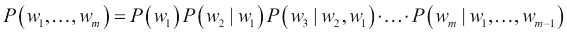

# 第六章：循环神经网络和语言模型

我们在前几章讨论的神经网络架构接受固定大小的输入并提供固定大小的输出。即使在图像识别中使用的卷积网络（第五章，“图像识别”）也被展平成一个固定输出向量。本章将通过引入**循环神经网络**（**RNNs**）来摆脱这一限制。RNN 通过在这些序列上定义递推关系来帮助我们处理可变长度的序列，因此得名。

处理任意输入序列的能力使得 RNN 可用于诸如语言建模（参见*语言建模*部分）或语音识别（参见*语音识别*部分）等任务。事实上，理论上，RNN 可以应用于任何问题，因为已经证明它们是图灵完备的 [1]。这意味着在理论上，它们可以模拟任何常规计算机无法计算的程序。作为这一点的例证，Google DeepMind 提出了一个名为“神经图灵机”的模型，该模型可以学习执行简单的算法，比如排序 [2]。

在本章中，我们将涵盖以下主题：

+   如何构建和训练一个简单的 RNN，基于一个简单的问题

+   RNN 训练中消失和爆炸梯度的问题以及解决方法

+   用于长期记忆学习的 LSTM 模型

+   语言建模以及 RNN 如何应用于这个问题

+   应用深度学习于语音识别的简要介绍

# 循环神经网络

RNN 之所以得名，是因为它们在序列上重复应用相同的函数。可以通过下面的函数将 RNN 写成递推关系:


这里的 *S*[t] —第 *t* 步的状态—是由函数 *f* 从前一步的状态，即 *t-1*，和当前步骤的输入 *X*[t] 计算得出。这种递推关系通过在先前状态上的反馈循环来定义状态如何逐步在序列中演变，如下图所示：


图来自[3]

左：RNN 递推关系的可视化示例：*S* *[t]* *= S* *[t-1]* ** W + X* *[t]* ** U*。最终输出将是 *o* *[t]* *= V*S* *[t]*

右：RNN 状态在序列 *t-1, t, t+1* 上递归展开。注意参数 U、V 和 W 在所有步骤之间共享。

这里 *f* 可以是任何可微分函数。例如，一个基本的 RNN 定义如下递推关系:


这里*W*定义了从状态到状态的线性变换，*U*是从输入到状态的线性变换。*tanh*函数可以被其他变换替代，比如 logit，tanh 或者 ReLU。这个关系可以在下图中进行解释，*O*[t]是网络生成的输出。

例如，在词级语言建模中，输入*X*将是一个序列的单词编码的输入向量*(X*[1]*…X*[t]*…)*。状态*S*将会是一个状态向量的序列*(S*[1]*…S*[t]*…)*。输出*O*将是下一个序列中的单词的概率向量的序列*(O*[1]*…O*[t]*…)*。

需要注意的是，在 RNN 中，每个状态都依赖于其之前的所有计算，通过这种循环关系。这个关系的一个重要含义是，RNN 在时间上有记忆，因为状态*S*包含了基于先前步骤的信息。理论上，RNN 可以记住任意长时间的信息，但在实践中，它们只能回顾几个步骤。我们将在*消失*和*爆炸梯度*部分更详细地讨论这个问题。

因为 RNN 不限于处理固定大小的输入，它们确实扩展了我们可以使用神经网络进行计算的可能性，比如不同长度的序列或不同大小的图像。下图直观地说明了我们可以制作的一些序列的组合。以下是这些组合的简要说明：

+   **一对一**：这是非顺序处理，比如前馈神经网络和卷积神经网络。请注意，一个前馈网络和 RNN 应用在一个时间步骤上没有太大的区别。一个一对一处理的例子是来自章节的图像分类（参见第五章，*图像识别*）。

+   **一对多**：这基于单一的输入生成一个序列，例如，来自图像的标题生成[4]。

+   **多对一**：这基于一个序列输出一个单一的结果，例如，文本的情感分类。

+   **多对多间接**：一个序列被编码成一个状态向量，之后这个状态向量被解码成一个新的序列，例如，语言翻译[5]，[6]。

+   **多对多直接**：这对每个输入步骤输出一个结果，例如，语音识别中的帧语素标记（见*语音识别*部分）。

    来自[7]的图片

    RNN 扩展了我们可以使用神经网络进行计算的可能性—红色：输入 X，绿色：状态 S，蓝色：输出 O。

## RNN — 如何实现和训练

在前面的部分，我们简要讨论了 RNN 是什么以及它们可以解决的问题。让我们深入了解 RNN 的细节，以及如何通过一个非常简单的玩具例子来训练它：在一个序列中计算“1”的个数。

在这个问题中，我们要教会最基本的循环神经网络如何计算输入中 1 的个数，并且在序列结束时输出结果。我们将在 Python 和 NumPy 中展示这个网络的实现。输入和输出的一个示例如下：

```py
In:  (0, 0, 0, 0, 1, 0, 1, 0, 1, 0)
Out:  3
```

我们要训练的网络是一个非常基本的网络，如下图所示：


基本的循环神经网络用于计算输入中的 1 的个数

网络只有两个参数：一个输入权重 *U* 和一个循环权重 *W*。输出权重 *V* 设为 1，所以我们只需读取最后一个状态作为输出 *y*。这个网络定义的循环关系是 *S* *[t]* *= S* *[t-1]* ** W + X* *[t]* ** U*。请注意，这是一个线性模型，因为在这个公式中我们没有应用非线性函数。这个函数的代码定义如下：

```py
def step(s, x, U, W):
    return x * U + s * W
```

因为 3 是我们想要输出的数字，而且有三个 1，这个问题的一个很好的解决方案就是简单地对整个序列进行求和。如果我们设置 *U=1*，那么每当接收到一个输入，我们将得到它的完整值。如果我们设置 *W=1*，那么我们累积的值将永远不会衰减。所以，对于这个例子，我们会得到期望的输出：3。

尽管，这个神经网络的训练和实现将会很有趣，正如我们将在本节的其余部分中看到的。所以让我们看看我们如何通过反向传播来得到这个结果。

### 通过时间的反向传播

通过时间的反向传播算法是我们用来训练循环网络的典型算法[8]。这个名字已经暗示了它是基于我们在 第二章 讨论的反向传播算法，*神经网络*。

如果你了解常规的反向传播，那么通过时间的反向传播就不难理解。主要区别在于，循环网络需要在一定数量的时间步长内进行展开。这个展开如前图所示（*基本的循环神经网络用于计算输入中的 1 的个数*）。展开完成后，我们得到一个与常规的多层前馈网络非常相似的模型。唯一的区别在于，每层都有多个输入（上一个状态，即 *S* *[t-1]*），和当前输入（*X* *[t]*），以及参数（这里的 *U* 和 *W*）在每层之间是共享的。

前向传播将 RNN 沿着序列展开，并为每个步骤构建一个活动堆栈。批处理输入序列 *X* 的前向步骤可实现如下：

```py
def forward(X, U, W):
    # Initialize the state activation for each sample along the sequence
    S = np.zeros((number_of_samples, sequence_length+1))
    # Update the states over the sequence
    for t in range(0, sequence_length):
        S[:,t+1] = step(S[:,t], X[:,t], U, W)  # step function
    return S
```

在进行这个前向步骤之后，我们有了每一步和每个样本在批处理中的激活，由 *S* 表示。因为我们想输出更多或更少连续的输出（全部为 1 的总和），我们使用均方误差代价函数来定义我们的输出成本与目标和输出 `y`，如下：

```py
cost = np.sum((targets – y)**2)
```

现在我们有了前向步骤和成本函数，我们可以定义梯度如何向后传播。首先，我们需要得到输出`y`相对于成本函数的梯度（*??/?y*）。

一旦我们有了这个梯度，我们可以通过向后传播堆栈中构建的活动来将其传播到每个时间步长处的误差导数。传播该梯度通过网络的循环关系可以写成以下形式：


参数的梯度通过以下方式累积：


在接下来的实现中，在反向步骤中，分别通过`gU`和`gW`累积`U`和`W`的梯度：

```py
def backward(X, S, targets, W):
    # Compute gradient of output
    y = S[:,-1]  # Output `y` is last activation of sequence
    # Gradient w.r.t. cost function at final state
    gS = 2.0 * (y - targets)
    # Accumulate gradients backwards
    gU, gW = 0, 0  # Set the gradient accumulations to 0    
    for k in range(sequence_len, 0, -1):
        # Compute the parameter gradients and accumulate the results.
        gU += np.sum(gS * X[:,k-1])
        gW += np.sum(gS * S[:,k-1])
        # Compute the gradient at the output of the previous layer
        gS = gS * W
    return gU, gW
```

现在我们可以尝试使用梯度下降优化我们的网络：

```py
learning_rate = 0.0005
# Set initial parameters
parameters = (-2, 0)  # (U, W)
# Perform iterative gradient descent
for i in range(number_iterations):
    # Perform forward and backward pass to get the gradients
    S = forward(X, parameters(0), parameters(1))
    gradients = backward(X, S, targets, parameters(1))
    # Update each parameter `p` by p = p - (gradient * learning_rate).
    # `gp` is the gradient of parameter `p`
    parameters = ((p - gp * learning_rate) 
                  for p, gp in zip(parameters, gradients))
```

不过存在一个问题。注意，如果尝试运行此代码，最终参数*U*和*W*往往会变为**不是一个数字**（**NaN**）。让我们尝试通过在错误曲面上绘制参数更新来调查发生了什么，如下图所示。注意，参数慢慢朝着最佳值（*U=W=1*）移动，直到超过并达到大约（*U=W=1.5*）。此时，梯度值突然爆炸，使参数值跳出图表。这个问题被称为梯度爆炸。下一节将详细解释为什么会发生这种情况以及如何预防。


参数更新通过梯度下降在错误曲面上绘制。错误曲面以对数颜色比例尺绘制。

### 梯度消失和梯度爆炸

RNN 相对于前馈或卷积网络更难训练。一些困难源于 RNN 的循环性质，其中同一权重矩阵用于计算所有状态更新[9]，[10]。

上一节的结尾，前面的图示了梯度爆炸，由于长期组件的膨胀导致 RNN 训练进入不稳定状态。除了梯度爆炸问题，还存在梯度消失问题，即相反的情况发生。长期组件以指数速度趋于零，模型无法从时间上遥远的事件中学习。在本节中，我们将详细解释这两个问题以及如何应对它们。

爆炸和消失梯度都源于通过时间向后传播梯度的循环关系形成了一个几何序列：


在我们简单的线性 RNN 中，如果*|W| > 1*，梯度会呈指数增长。这就是所谓的梯度爆炸（例如，50 个时间步长下的*W=1.5*为*W**[50]**=1.5*˜≈6 * 10**⁸*）。如果*|W**| < 1*，梯度会呈指数衰减；这就是所谓的梯度消失（例如，20 个时间步长下的*W=0.6*为*W**[20]**=0.6*˜≈3*10**^(-5)*）。如果权重参数*W*是矩阵而不是标量，则这种爆炸或消失的梯度与*W*的最大特征值（ρ）有关（也称为谱半径）。对于梯度消失，ρ < *1*足够，使得梯度消失，对于梯度爆炸，ρ > *1*是必要的。

以下图形直观地说明了梯度爆炸的概念。发生的情况是我们正在训练的成本表面非常不稳定。使用小步，我们可能会移动到成本函数的稳定部分，梯度很低，并突然遇到成本的跳跃和相应的巨大梯度。因为这个梯度非常巨大，它将对我们的参数产生很大影响。它们最终会落在成本表面上离它们最初的位置很远的地方。这使得梯度下降学习不稳定，甚至在某些情况下是不可能的。


梯度爆炸的插图[11]

我们可以通过控制梯度的大小来对抗梯度爆炸的效果。一些解决方案的例子有：

+   梯度截断，我们将梯度能获得的最大值设定为阈值[11]。

+   二阶优化（牛顿法），我们模拟成本函数的曲率。模拟曲率使我们能够在低曲率情况下迈出大步，在高曲率情况下迈出小步。出于计算原因，通常只使用二阶梯度的近似值[12]。

+   依赖于局部梯度较少的优化方法，例如动量[13]或 RmsProp [14]。

例如，我们可以利用 Rprop [15]重新训练我们无法收敛的网络（参见*梯度爆炸的插图*）。 Rprop 是一种类似于动量法的方法，仅使用梯度的符号来更新动量参数，因此不受梯度爆炸的影响。如果我们运行 Rprop 优化，可以看到训练收敛于下图。请注意，尽管训练开始于一个高梯度区域（*U=-1.5，W=2*），但它很快收敛直到找到最佳点（*U=W=1*）。


通过 Rprop 在误差表面绘制的参数更新。误差表面是以对数刻度绘制的。

消失梯度问题是爆炸梯度问题的逆问题。梯度在步数上呈指数衰减。这意味着早期状态的梯度变得非常小，保留这些状态历史的能力消失了。较早时间步的小梯度被较近时间步的较大梯度所淘汰。Hochreiter 和 Schmidhuber [16] 将其描述如下：*通过时间的反向传播对最近的干扰过于敏感*。

这个问题更难以检测，因为网络仍然会学习和输出一些东西（不像爆炸梯度的情况）。它只是无法学习长期依赖性。人们已经尝试用类似于我们用于爆炸梯度的解决方案来解决这个问题，例如二阶优化或动量。这些解决方案远非完美，使用简单 RNN 学习长期依赖性仍然非常困难。幸运的是，有一种聪明的解决方案可以解决消失梯度问题，它使用由记忆单元组成的特殊架构。我们将在下一节详细讨论这个架构。

## 长短期记忆

在理论上，简单的 RNN 能够学习长期依赖性，但在实践中，由于消失梯度问题，它们似乎只限于学习短期依赖性。Hochreiter 和 Schmidhuber 对这个问题进行了广泛的研究，并提出了一种解决方案，称为**长短期记忆**（**LSTM**）[16]。由于特别设计的记忆单元，LSTM 可以处理长期依赖性。它们工作得非常好，以至于目前在各种问题上训练 RNN 的大部分成就都归功于使用 LSTM。在本节中，我们将探讨这个记忆单元的工作原理以及它是如何解决消失梯度问题的。

LSTM 的关键思想是单元状态，其中的信息只能明确地写入或删除，以使单元状态在没有外部干扰的情况下保持恒定。下图中时间 t 的单元状态表示为 *c* *[t]*。

LSTM 单元状态只能通过特定的门来改变，这些门是让信息通过的一种方式。这些门由 logistic sigmoid 函数和逐元素乘法组成。因为 logistic 函数只输出介于 0 和 1 之间的值，所以乘法只能减小通过门的值。典型的 LSTM 由三个门组成：遗忘门、输入门和输出门。这些在下图中都表示为 *f*、*i* 和 *o*。请注意，单元状态、输入和输出都是向量，因此 LSTM 可以在每个时间步骤保存不同信息块的组合。接下来，我们将更详细地描述每个门的工作原理。


LSTM 单元

*x**[t]**、c**[t]**、h**[t]* 分别是时间 *t* 的输入、细胞状态和 LSTM 输出。

LSTM 中的第一个门是遗忘门；因为它决定我们是否要擦除细胞状态，所以被称为遗忘门。这个门不在 Hochreiter 最初提出的 LSTM 中；而是由 Gers 等人提出[17]的。遗忘门基于先前的输出 *h* *[t-1]* 和当前的输入 *x**[t]* *.* 它将这些信息组合在一起，并通过逻辑函数压缩它们，以便为细胞的矢量块输出介于 0 和 1 之间的数字。由于与细胞的逐元素乘法，一个输出为 0 的完全擦除特定的细胞块，而输出为 1 会保留该细胞块中的所有信息。这意味着 LSTM 可以清除其细胞状态向量中的不相关信息。


接下来的门决定要添加到内存单元的新信息。这分为两部分进行。第一部分决定是否添加信息。与输入门类似，它基于 *h**[t-1]* 和 *x**[t]* 进行决策，并通过每个细胞块的矢量的逻辑函数输出 0 或 1。输出为 0 意味着不向该细胞块的内存中添加任何信息。因此，LSTM 可以在其细胞状态向量中存储特定的信息片段：


要添加的输入 *a* *[t]* 是由先前的输出 (*h* *[t-1]*) 和当前的输入 (*x**[t]*) 派生，并通过 *tanh* 函数变换：


遗忘门和输入门完全决定了通过将旧的细胞状态与新的信息相加来确定新细胞：


最后一个门决定输出结果。输出门将 *h* *[t-1]* 和 *x**[t]* 作为输入，并通过逻辑函数输出 0 或 1，在每个单元块的内存中均可用。输出为 0 表示该单元块不输出任何信息，而输出为 1 表示整个单元块的内存传递到细胞的输出。因此，LSTM 可以从其细胞状态向量中输出特定的信息块：


最终输出的值是通过 *tanh* 函数传递的细胞内存：


因为所有这些公式是可导的，我们可以像连接简单的 RNN 状态一样连接 LSTM 单元，并通过时间反向传播来训练网络。

现在问题是 LSTM 如何保护我们免受梯度消失的影响？请注意，如果遗忘门为 1 且输入门为 0，则细胞状态会被逐步地从步骤复制。只有遗忘门才能完全清除细胞的记忆。因此，记忆可以长时间保持不变。还要注意，输入是添加到当前细胞记忆的 tanh 激活；这意味着细胞记忆不会爆炸，并且非常稳定。

实际上，以下图示了 LSTM 如何展开。

初始时，网络的输入被赋值为 4.2；输入门被设置为 1，所以完整的值被存储。接下来的两个时间步骤中，遗忘门被设置为 1。所以在这些步骤中保留了全部信息，并且没有添加新的信息，因为输入门被设置为 0。最后，输出门被设置为 1，4.2 被输出并保持不变。


LSTM 通过时间展开[18]

尽管在前面的图示中描述的 LSTM 网络是大多数应用中使用的典型 LSTM 版本，但有许多变体的 LSTM 网络，它们以不同的顺序组合不同的门[19]。深入了解所有这些不同的架构超出了本书的范围。

# 语言建模

语言模型的目标是计算单词序列的概率。它们对于许多不同的应用非常关键，例如语音识别、光学字符识别、机器翻译和拼写校正。例如，在美式英语中，短语"wreck a nice beach"和"recognize speech"在发音上几乎相同，但它们的含义完全不同。一个好的语言模型可以根据对话的上下文区分哪个短语最有可能是正确的。本节将概述基于单词和字符的语言模型以及如何使用循环神经网络来构建它们。

## 基于单词的模型

基于单词的语言模型定义了一个对单词序列的概率分布。给定长度为*m*的单词序列，它为完整的单词序列赋予了概率*P(w* *[1]* *, ... , w* *[m]* *)*。这些概率的应用有两个方面。我们可以用它们来估计自然语言处理应用中不同短语的可能性。或者，我们可以用它们来生成新的文本。

### N-gram 模型

推断一个长序列（如*w* *[1]* *, ..., w* *[m]*）的概率通常是不可行的。通过应用以下链式法则可以计算出*P(w* *[1]* *, ... , w* *[m]* *)*的联合概率：



特别是基于前面的单词给出后面单词的概率将很难从数据中估计出来。这就是为什么这个联合概率通常被一个独立假设近似，即第*i*个单词只依赖于前*n-1*个单词。我们只建模*n*个连续单词称为 n-grams 的联合概率。注意，n-grams 可以用来指代其他长度为*n*的序列，例如*n*个字符。

联合分布的推断通过 n-gram 模型进行近似，将联合分布拆分为多个独立部分。注意，n-grams 是多个连续单词的组合，其中*n*是连续单词的数量。例如，在短语*the quick brown fox*中，我们有以下 n-grams：

+   **1-gram**："The," "quick," "brown," 和 "fox"（也称为 unigram）

+   **2-grams**："The quick," "quick brown," 和 "brown fox"（也称为 bigram）

+   **3-grams**："The quick brown" 和 "quick brown fox"（也称为 trigram）

+   **4-grams**："The quick brown fox"

现在，如果我们有一个庞大的文本语料库，我们可以找到直到某个*n*（通常为 2 到 4）的所有 n-grams，并计算该语料库中每个 n-gram 的出现次数。从这些计数中，我们可以估计每个 n-gram 的最后一个单词在给定前*n-1*个单词的情况下的概率：

+   **1-gram**：

+   **2-gram**：

+   **n-gram**：

现在可以使用第*i*个单词仅依赖于前*n**-1*个单词的独立假设来近似联合分布。

例如，对于一个 unigram，我们可以通过以下方式近似联合分布：


对于 trigram，我们可以通过以下方式近似联合分布：


我们可以看到，基于词汇量，随着*n*的增加，n-grams 的数量呈指数增长。例如，如果一个小词汇表包含 100 个单词，那么可能的 5-grams 的数量将是*100**⁵* *= 10,000,000,000*个不同的 5-grams。相比之下，莎士比亚的整个作品包含大约*30,000*个不同的单词，说明使用具有大*n*值的 n-grams 是不可行的。不仅需要存储所有概率，我们还需要一个非常庞大的文本语料库来为较大的*n*值创建良好的 n-gram 概率估计。这个问题就是所谓的维度灾难。当可能的输入变量（单词）数量增加时，这些输入值的不同组合数量呈指数增长。当学习算法需要至少一个与相关值组合的示例时，就会出现这种维度灾难，这在 n-gram 建模中是这样的情况。我们的*n*越大，我们就越能近似原始分布，并且我们需要更多的数据来对 n-gram 概率进行良好的估计。

### 神经语言模型

在前面的部分中，我们用 n-grams 建模文本时展示了维度灾难。我们需要计算的 n-grams 数量随着*n*和词汇表中的单词数量呈指数增长。克服这个问题的一种方法是通过学习单词的较低维度、分布式表示来学习一个嵌入函数[20]。这个分布式表示是通过学习一个嵌入函数将单词空间转换为较低维度的单词嵌入空间而创建的，具体如下：


从词汇表中取出的单词被转换为大小为 V 的独热编码向量(V 中的每个单词都被唯一编码)。然后，嵌入函数将这个 V 维空间转换为大小为 D 的分布式表示（这里 D=4）。

这个想法是，学习的嵌入函数会学习关于单词的语义信息。它将词汇表中的每个单词与一个连续值向量表示相关联，即单词嵌入。在这个嵌入空间中，每个单词对应一个点，其中不同的维度对应于这些单词的语法或语义属性。目标是确保在这个嵌入空间中彼此接近的单词应具有相似的含义。这样，一些单词语义上相似的信息可以被语言模型利用。例如，它可能会学习到“fox”和“cat”在语义上相关，并且“the quick brown fox”和“the quick brown cat”都是有效的短语。然后，一系列单词可以转换为一系列捕捉到这些单词特征的嵌入向量。

可以通过神经网络对语言模型进行建模，并隐式地学习这个嵌入函数。我们可以学习一个神经网络，给定一个*n-1*个单词的序列(*w**[t-n+1]*，…，*w**[t-1]*)，试图输出下一个单词的概率分布，即*w**[t]*。网络由不同部分组成。

嵌入层接受单词*w* *[i]*的独热表示，并通过与嵌入矩阵*C*相乘将其转换为其嵌入。这种计算可以通过表查找有效地实现。嵌入矩阵*C*在所有单词上共享，因此所有单词使用相同的嵌入函数。*C*由一个*V * D*矩阵表示，其中*V*是词汇量的大小，*D*是嵌入的大小。得到的嵌入被连接成一个隐藏层；之后，可以应用一个偏置*b*和一个非线性函数，比如*tanh*。隐藏层的输出因此由函数*z = tanh(concat(w* *[t-n+1]* *, …, w* *[t-1]* *) + b)*表示。从隐藏层，我们现在可以通过将隐藏层与*U*相乘来输出下一个单词*w* *[t]*的概率分布。这将隐藏层映射到单词空间，添加一个偏置*b*并应用 softmax 函数以获得概率分布。最终层计算*softmax(z*U +b)*。这个网络如下图所示：


给定单词*w**[t-1]* *... w**[t-n+1]*，输出单词*w[t]*的概率分布的神经网络语言模型。*C*是嵌入矩阵。

这个模型同时学习词汇表中所有单词的嵌入以及单词序列的概率函数模型。由于这些分布式表示，它能够将这个概率函数推广到在训练过程中没有看到的单词序列。测试集中特定的单词组合在训练集中可能没有出现，但是具有类似嵌入特征的序列更有可能在训练过程中出现。

下图展示了一些词嵌入的二维投影。可以看到，在嵌入空间中，语义上接近的单词也彼此接近。


在这个空间中，二维嵌入空间中相关的单词彼此接近 [21]。

单词嵌入可以在大型文本数据语料库上无监督地训练。这样，它们能够捕捉单词之间的一般语义信息。得到的嵌入现在可以用于改进其他任务的性能，其中可能没有大量标记的数据可用。例如，试图对文章的情感进行分类的分类器可能是在使用先前学习的单词嵌入而不是独热编码向量进行训练的。这样，单词的语义信息就变得对情感分类器可用了。因此，许多研究致力于创建更好的单词嵌入，而不是专注于学习单词序列上的概率函数。例如，一种流行的单词嵌入模型是 word2vec [22]，[23]。

令人惊讶的是，这些词嵌入可以捕捉单词之间的类比作为差异。例如，它可能捕捉到"女人"和"男人"的嵌入之间的差异编码了性别，并且这个差异在其他与性别相关的单词，如"皇后"和"国王"中是相同的。


词嵌入可以捕捉单词之间的语义差异 [24]。

embed(女人) - embed(男人) ? embed(姑妈) - embed(叔叔)

embed(女人) - embed(男人) ? embed(皇后) - embed(国王)

虽然之前的前馈网络语言模型可以克服模拟大词汇输入的维度诅咒，但仍然仅限于建模固定长度的单词序列。为了克服这个问题，我们可以使用 RNN 来构建一个不受固定长度单词序列限制的 RNN 语言模型 [25]。这些基于 RNN 的模型不仅可以在输入嵌入中聚类相似的单词，还可以在循环状态向量中聚类相似的历史。

这些基于单词的模型的一个问题是计算每个单词在词汇表中的输出概率 *P(w* *[i]* *| context)*。我们通过对所有单词激活进行 softmax 来获得这些输出概率。对于一个包含*50,000*个单词的小词汇表 *V*，这将需要一个*|S| * |V|*的输出矩阵，其中*|V|*是词汇表的大小，*|S|*是状态向量的大小。这个矩阵非常庞大，在增加词汇量时会变得更大。由于 softmax 通过所有其他激活的组合来归一化单个单词的激活，我们需要计算每个激活以获得单个单词的概率。这两者都说明了在大词汇表上计算 softmax 的困难性；在 softmax 之前需要大量参数来建模线性转换，并且 softmax 本身计算量很大。

有一些方法可以克服这个问题，例如，通过将 softmax 函数建模为一个二叉树，从而只需要 *log(|V|)* 计算来计算单个单词的最终输出概率 [26]。

不详细介绍这些解决方法，让我们看看另一种语言建模的变体，它不受这些大词汇量问题的影响。

## 基于字符的模型

在大多数情况下，语言建模是在单词级别进行的，其中分布是在一个固定词汇量为*|V|*的词汇表上。在实际任务中，如语音识别中使用的语言模型，词汇表通常超过*100,000*个单词。这个巨大的维度使得建模输出分布非常具有挑战性。此外，这些单词级别的模型在建模包含非单词字符串的文本数据时受到相当大的限制，比如多位数字或从未出现在训练数据中的单词（词汇外单词）。

可以克服这些问题的一类模型称为字符级语言模型[27]。这些模型对字符序列的分布建模，而不是单词，从而使您可以计算一个更小的词汇表上的概率。这里的词汇表包括文本语料库中所有可能的字符。然而，这些模型也有一个缺点。通过对字符序列而不是单词进行建模，我们需要对更长的序列进行建模，以在时间上捕获相同的信息。为了捕获这些长期依赖关系，让我们使用 LSTM RNN 语言模型。

本节的后续部分将详细介绍如何在 Tensorflow 中实现字符级 LSTM 以及如何在列夫·托尔斯泰的《战争与和平》上进行训练。这个 LSTM 将建模下一个字符的概率，给定先前看到的字符：*P(c* *[t]* *| c* *[t-1]* *... c* *[t-n]* *)*。

因为完整文本太长，无法使用**时间反向传播**（**BPTT**）训练网络，我们将使用一种批量变体，称为截断的 BPTT。在这种方法中，我们将训练数据分成固定序列长度的批次，并逐批次训练网络。由于批次将相互跟随，我们可以使用最后一批的最终状态作为下一批的初始状态。这样，我们可以利用状态中存储的信息，而无需对完整输入文本进行完整的反向传播。接下来，我们将描述如何读取这些批次并将其馈送到网络中。

### 预处理和读取数据

要训练一个好的语言模型，我们需要大量的数据。在我们的示例中，我们将了解基于列夫·托尔斯泰的《战争与和平》的英文译本的模型。这本书包含超过*500,000*个单词，使其成为我们小范例的完美候选者。由于它是公有领域的作品，因此《战争与和平》可以从古腾堡计划免费下载为纯文本。作为预处理的一部分，我们将删除古腾堡许可证、书籍信息和目录。接下来，我们将去除句子中间的换行符，并将允许的最大连续换行数减少到两个。

要将数据馈送到网络中，我们必须将其转换为数字格式。每个字符将与一个整数相关联。在我们的示例中，我们将从文本语料库中提取总共 98 个不同的字符。接下来，我们将提取输入和目标。对于每个输入字符，我们将预测下一个字符。由于我们使用截断的 BPTT 进行训练，我们将使所有批次相互跟随，以利用序列的连续性。将文本转换为索引列表并将其分成输入和目标批次的过程如下图所示：


将文本转换为长度为 5 的整数标签的输入和目标批次。请注意，批次彼此相继。

### LSTM 网络

我们要训练的网络将是一个具有 512 个单元的两层 LSTM 网络。我们将使用截断的 BPTT 来训练这个网络，因此我们需要在批处理之间存储状态。

首先，我们需要为输入和目标定义占位符。输入和目标的第一维是批处理大小，即并行处理的示例数。第二维将沿着文本序列的维度。这些占位符接受包含字符索引的序列批次：

```py
inputs = tf.placeholder(tf.int32, (batch_size, sequence_length))
targets = tf.placeholder(tf.int32, (batch_size, sequence_length))
```

要将字符馈送到网络，我们需要将它们转换成向量。我们将它们转换为独热编码，这意味着每个字符将被转换为一个长度等于数据集中不同字符数量的向量。这个向量将全为零，除了与其索引对应的单元，该单元将被设置为 1。在 TensorFlow 中，可以轻松完成以下代码行：

```py
one_hot_inputs = tf.one_hot(inputs, depth=number_of_characters)
```

接下来，我们将定义我们的多层 LSTM 架构。首先，我们需要为每一层定义 LSTM 单元（`lstm_sizes`是每一层大小的列表，例如(512, 512)，在我们的情况下）：

```py
cell_list = (tf.nn.rnn_cell.LSTMCell(lstm_size) for lstm_size in lstm_sizes)
```

然后，使用以下方法将这些单元包装在单个多层 RNN 单元中：

```py
multi_cell_lstm = tf.nn.rnn_cell.MultiRNNCell(cell_list)
```

为了在批处理之间存储状态，我们需要获取网络的初始状态，并将其包装在要存储的变量中。请注意，出于计算原因，TensorFlow 会将 LSTM 状态存储在两个单独张量的元组中（来自*长短期记忆*部分的`c`和`h`）。我们可以使用`flatten`方法展平这个嵌套数据结构，将每个张量包装在变量中，并使用`pack_sequence``_as`方法重新打包成原始结构：

```py
initial_state = self.multi_cell_lstm.zero_state(batch_size, tf.float32)
# Convert to variables so that the state can be stored between batches
state_variables = tf.python.util.nest.pack_sequence_as(
    self.initial_state,
    (tf.Variable(var, trainable=False) 
     for var in tf.python.util.nest.flatten(initial_state)))
```

现在我们已经将初始状态定义为一个变量，我们可以开始通过时间展开网络。TensorFlow 提供了`dynamic_rnn`方法，根据输入的序列长度动态展开网络。该方法将返回一个包含表示 LSTM 输出和最终状态的张量的元组：

```py
lstm_output, final_state = tf.nn.dynamic_rnn(
    cell=multi_cell_lstm, inputs=one_hot_inputs,    
    initial_state=state_variable)
```

接下来，我们需要将最终状态存储为下一批处理的初始状态。我们使用变量的`assign`方法将每个最终状态存储在正确的初始状态变量中。`control_dependencies`方法用于强制状态更新在返回 LSTM 输出之前运行：

```py
store_states = (
    state_variable.assign(new_state)
    for (state_variable, new_state) in zip(
        tf.python.util.nest.flatten(self.state_variables),
        tf.python.util.nest.flatten(final_state)))
with tf.control_dependencies(store_states):
    lstm_output = tf.identity(lstm_output)
```

要从最终 LSTM 输出中获得 logit 输出，我们需要对输出应用线性变换，这样它就可以将*batch* *size * sequence length * number of symbols*作为其维度。在应用这个线性变换之前，我们需要将输出展平成大小为*number of outputs ** *number of output features*的矩阵：

```py
output_flat = tf.reshape(lstm_output, (-1, lstm_sizes(-1)))
```

然后，我们可以定义并应用线性变换，使用权重矩阵*W*和偏差*b*来获得 logits，应用 softmax 函数，并将其重塑为一个尺寸为*batch size ** *sequence length * number of characters*的张量：

```py
# Define output layer
logit_weights = tf.Variable(
    tf.truncated_normal((lstm_sizes(-1), number_of_characters), stddev=0.01))
logit_bias = tf.Variable(tf.zeros((number_of_characters)))
# Apply last layer transformation
logits_flat = tf.matmul(output_flat, self.logit_weights) + self.logit_bias
probabilities_flat = tf.nn.softmax(logits_flat)
# Reshape to original batch and sequence length
probabilities = tf.reshape(
    probabilities_flat, (batch_size, -1, number_of_characters))
```


LSTM 字符语言模型展开

### 训练

现在我们已经定义了网络的输入、目标和架构，让我们来定义如何训练它。训练的第一步是定义我们要最小化的损失函数。这个损失函数描述了在给定输入和目标的情况下输出错误序列的成本。因为我们是在考虑前面的字符来预测下一个字符，所以这是一个分类问题，我们将使用交叉熵损失。我们通过使用`sparse_softmax_cross_` `entropy_with_logits` TensorFlow 函数来实现这一点。该函数将网络的 logits 输出（softmax 之前）和目标作为类标签，计算每个输出与其目标的交叉熵损失。为了减少整个序列和所有批次的损失，我们取所有损失的均值。

请注意，我们首先将目标扁平化为一个一维向量，以使它们与网络的扁平化 logits 输出兼容：

```py
# Flatten the targets to be compatible with the flattened logits
targets_flat = tf.reshape(targets, (-1, ))
# Get the loss over all outputs
loss = tf.nn.sparse_softmax_cross_entropy_with_logits(
     logits_flat, targets_flat)
# Reduce the loss to single value over all outputs
loss = tf.reduce_mean(loss)
```

现在我们已经定义了这个损失函数，可以在 TensorFlow 中定义训练操作，来优化我们的输入和目标批次的网络。为了执行优化，我们将使用 Adam 优化器；这有助于稳定梯度更新。Adam 优化器只是在更受控制的方式下执行梯度下降的特定方式 [28]。我们还会裁剪梯度，以防止梯度爆炸：

```py
# Get all variables that need to be optimised
trainable_variables = tf.trainable_variables()
# Compute and clip the gradients
gradients = tf.gradients(loss, trainable_variables)
gradients, _ = tf.clip_by_global_norm(gradients, 5)
# Apply the gradients to those variables with the Adam optimisation algorithm.
optimizer = tf.train.AdamOptimizer(learning_rate=2e-3)
train_op = optimizer.apply_gradients(zip(gradients, trainable_variables))
```

已经定义了训练所需的所有 TensorFlow 操作，现在我们可以开始用小批量进行优化。如果`data_feeder`是一个生成器，返回连续的输入和目标批次，那么我们可以通过迭代地提供输入和目标批次来训练这些批次。我们每 100 个小批量重置一次初始状态，这样网络就能学习如何处理序列开头的初始状态。你可以使用 TensorFlow saver 来保存模型，以便稍后进行采样：

```py
with tf.Session() as session:
    session.run(tf.initialize_all_variables())
    for i in range(minibatch_iterations):
        input_batch, target_batch = next(data_feeder)
        loss, _ = sess.run(
            (loss, train_op),
            feed_dict={ inputs: input_batch,targets: target_batch})
    # Reset initial state every 100 minibatches
        if i % 100 == 0 and i != 0:
            for state in tf.python.util.nest.flatten(
                    state_variables):
                session.run(state.initializer)
```

### 采样

一旦我们的模型训练完成，我们可能想要从该模型中对序列进行采样以生成文本。我们可以使用与训练模型相同的代码初始化我们的采样架构，但我们需要将`batch_size`设置为`1`，`sequence_length`设置为`None`。这样，我们可以生成单个字符串并对不同长度的序列进行采样。然后，我们可以使用训练后保存的参数初始化模型的参数。为了开始采样，我们将一个初始字符串(`prime_string`)输入网络的状态。输入这个字符串后，我们可以根据 softmax 函数的输出分布对下一个字符进行采样。然后我们可以输入这个采样的字符并获取下一个字符的输出分布。这个过程可以继续进行一定数量的步骤，直到生成指定大小的字符串：

```py
# Initialize state with priming string
for character in prime_string:
    character_idx = label_map(character)
    # Get output distribution of next character
    output_distribution = session.run(
        probabilities, 
        feed_dict={inputs: np.asarray(((character_idx)))})
# Start sampling for sample_length steps
for _ in range(sample_length):
    # Sample next character according to output distribution
    sample_label = np.random.choice(
        labels, size=(1), p=output_distribution(0, 0))
    output_sample += sample_label
    # Get output distribution of next character
    output_distribution = session.run(
       probabilities,
       feed_dict={inputs: np.asarray((label_map(character))))
```

### 示例训练

现在我们已经有了用于训练和采样的代码，我们可以对列夫·托尔斯泰的《战争与和平》进行网络训练，并在每个批次迭代之后对网络学到的内容进行采样。让我们用短语“*她出生在年份*”来激活网络，看看它在训练期间如何完成它。

经过 500 批次，我们得到了这个结果：“*她出生在年份 sive 但* *us eret tuke Toffhin e feale shoud pille saky doctonas* *laft the comssing hinder to gam the droved at ay* *vime*”。网络已经学会了一些字符的分布，并且提出了一些看起来像是单词的东西。

经过 5,000 批次，网络掌握了许多不同的词语和名称：“*她出生在* *年份，他有许多的 Seffer Zsites。现在在* *他的冠军-毁灭中，eccention，形成了一个 Veakov 的狼* *也因为他是 congrary，他突然有了* *首次没有回答。*” 它仍然会创造出看起来合理的单词，比如“congrary”和“eccention”。

经过 50,000 批次，网络输出以下文本：“*她出生在年份* *1813。最后，天空可能会表现出莫斯科的房子* *有一个绝佳的机会必须通过* *Rostóvs'，所有的时间：坐退休，向他们展示* *confure the sovereigns.*” 网络似乎已经明白了一个年份是跟随我们激活字符串的一个非常合理的词。短字符串的词组似乎有意义，但是独立的句子还不具备意义。

经过 500,000 批次，我们停止了训练，网络输出了这个：“*她出生在* *年份 1806，当他在他的名字上表达了他的思想。公社不会牺牲他* *：“这是什么？”娜塔莎问。“你还记得吗？”* 我们可以看到，网络现在正在尝试构建句子，但这些句子彼此之间并不连贯。值得注意的是，在最后，它模拟了完整句子的小型对话，包括引号和标点符号。

尽管不完美，但 RNN 语言模型能够生成连贯的文本片段令人印象深刻。我们在此鼓励您尝试不同的架构，增加 LSTM 层的大小，将第三个 LSTM 层放入网络中，从互联网上下载更多文本数据，并查看您能够改进当前模型的程度。

到目前为止，我们讨论过的语言模型在许多不同的应用中被使用，从语音识别到创建能够与用户进行对话的智能聊天机器人。在接下来的部分中，我们将简要讨论深度学习语音识别模型，其中语言模型起着重要作用。

# 语音识别

在之前的章节中，我们看到了循环神经网络可以用来学习许多不同时间序列的模式。在本节中，我们将看看这些模型如何用于识别和理解语音的问题。我们将简要概述语音识别流水线，并提供如何在流水线的每个部分中使用神经网络的高层次视图。为了更多了解本节讨论的方法，我们希望您参考参考文献。

## 语音识别流水线

语音识别试图找到最有可能的单词序列的转录，考虑到提供的声学观察；这由以下表示：

*转录 = argmax(* *P(单词 | 音频特征))*

此概率函数通常由不同部分建模（请注意通常忽略归一化项 P(音频特征)）：

*P(单词 | 音频特征) = P(音频* *特征 | 单词) * P(单词)*

*= P(音频特征 | 音素) * P(音素* *| 单词) * P(单词)*

### 注意

**什么是音素？**

音素是定义单词发音的基本声音单位。例如，单词“bat”由三个音素`/b/`、`/ae/`和`/t/`组成。每个音素都与特定的声音相关联。英语口语大约由 44 个音素组成。

这些概率函数中的每一个都将由识别系统的不同部分建模。典型的语音识别流水线接收音频信号并执行预处理和特征提取。然后使用这些特征在一个声学模型中，该模型尝试学习如何区分不同的声音和音素：*P(音频特征 | 音素)*。然后，这些音素将与发音词典的帮助匹配到字符或单词上：*P(音素 | 单词)*。从音频信号中提取的单词的概率然后与语言模型的概率相结合，*P(单词)*。然后通过一个解码搜索步骤找到最可能的序列，该步骤搜索最可能的序列（参见*解码*部分）。此语音识别流水线的高级概述如下图所示：


典型语音识别流水线概述

大型、实际应用的词汇语音识别流水线基于同样的流水线；然而，它们在每个步骤中使用了许多技巧和启发式方法来使问题可解。虽然这些细节超出了本节的范围，但有开源软件可用——Kaldi [29]——允许您使用先进的流水线训练语音识别系统。

在接下来的章节中，我们将简要描述标准流水线中的每个步骤以及深度学习如何帮助改善这些步骤。

## 语音作为输入数据

语音是一种通常传递信息的声音类型。它是通过介质（如空气）传播的振动。如果这些振动在 20 Hz 和 20 kHz 之间，则对人类是可听见的。这些振动可以被捕捉并转换成数字信号，以便在计算机上用于音频信号处理。它们通常由麦克风捕获，之后连续信号被离散采样。典型的采样率是 44.1 kHz，这意味着每秒对传入音频信号的幅度进行了 44100 次测量。请注意，这大约是最大人类听力频率的两倍。一个人说“hello world”的采样录音如下图所示：


一个人说“hello world”在时域的语音信号

## 预处理

在前述图像中的音频信号的录制持续了 1.2 秒。为了将音频数字化，它以每秒 44100 次（44.1 kHz）进行采样。这意味着对于这 1.2 秒的音频信号大约采集了 50000 个振幅样本。

即使是一个小例子，这些在时间维度上是很多点。为了减小输入数据的大小，在馈送到语音识别算法之前，这些音频信号通常被预处理以减少时间步数。一个典型的转换将信号转换为谱图，它表示信号中的频率随时间的变化，见下图。

这种频谱转换是通过将时间信号分成重叠窗口并对每个窗口进行傅立叶变换来完成的。傅立叶变换将信号随时间分解为组成信号的频率 [30]。得到的频率响应被压缩到固定的频率箱中。这个频率箱的数组也称为滤波器组。滤波器组是将信号分离到多个频率带中的一组滤波器。

假设前述的“hello world”录音被分成了 25 ms 的重叠窗口，并以 10 ms 的跨度。然后，利用窗口化傅立叶变换将得到的窗口转换为频率空间。这意味着每个时间步的振幅信息被转换为每个频率的振幅信息。最终的频率根据对数尺度（也称为 Mel 尺度）映射到 40 个频率箱中。得到的滤波器组谱图如下图所示。这个转换将时间维度从 50000 减少到 118 个样本，其中每个样本的大小为 40 个向量。


前图中语音信号的 Mel 频谱

特别是在较旧的语音识别系统中，这些 Mel-scale 滤波器组会通过去相关处理来消除线性依赖关系。通常，这是通过对滤波器组的对数进行**离散** **余弦变换** (**DCT**)来完成的。这个 DCT 是傅立叶变换的一种变体。这种信号转换也被称为**梅尔频率倒谱系数** (**MFCC**)。

更近期，深度学习方法，如卷积神经网络，已学习了一些这些预处理步骤 [31], [32]。

## 声学模型

在语音识别中，我们希望将口语变成文本输出。这可以通过学习一个依赖时间的模型来实现，该模型接收一系列音频特征（如前一节所述），并输出可能的被说出的单词的序列分布。这个模型称为声学模型。

声学模型试图模拟一系列音频特征由一系列单词或音素生成的可能性：*P (音频* *特征 | 单词) = P (音频特征 | 音素) * P (音素 | 单词)*。

在深度学习变得流行之前，典型的语音识别声学模型将使用**隐马尔可夫模型** (**HMMs**) 来模拟语音信号的时间变化性 [33], [34]。每个 HMM 状态发射一组高斯混合以模拟音频信号的频谱特征。发射的高斯混合构成**高斯混合模型** (**GMM**)，它们确定每个 HMM 状态在短时间段内的声学特征拟合程度。HMMs 被用来模拟数据的序列结构，而 GMMs 则模拟信号的局部结构。

HMM 假设连续帧在给定 HMM 的隐藏状态的情况下是独立的。由于这种强条件独立假设，声学特征通常是去相关的。

### 深信度网络

在语音识别中使用深度学习的第一步是用**深度神经网络** (**DNN**) 替代 GMMs [35]。DNNs 将一组特征向量作为输入，并输出 HMM 状态的后验概率：*P (HMM 状态 | 音频特征)*。

在这一步中使用的网络通常是在一组频谱特征上以一个通用模型进行预训练的。通常，**深度信度网络** (**DBN**) 用于预训练这些网络。生成式预训练会创建多层逐渐复杂的特征检测器。一旦生成式预训练完成，网络会被判别性地微调以分类正确的 HMM 状态，基于声学特征。这些混合模型中的 HMMs 用于将由 DNNs 提供的段分类与完整标签序列的时间分类对齐。已经证明这些 DNN-HMM 模型比 GMM-HMM 模型具有更好的电话识别性能 [36]。

### 循环神经网络

本节描述了如何使用 RNN 模型来对序列数据进行建模。直接应用 RNN 在语音识别上的问题在于训练数据的标签需要与输入完全对齐。如果数据对齐不好，那么输入到输出的映射将包含太多噪音，网络无法学到任何东西。一些早期的尝试试图通过使用混合 RNN-HMM 模型来建模声学特征的序列上下文，其中 RNN 将模拟 HMM 模型的发射概率，很类似 DBNs 的使用 [37] 。

后来的实验尝试训练 LSTM（见*长* *短期记忆*一节）输出给定帧的音素后验概率 [38]。

语音识别的下一步将是摆脱需要对齐标记数据的必要性，并消除混合 HMM 模型的需要。

### CTC

标准 RNN 目标函数独立定义了每个序列步骤，每个步骤输出自己独立的标签分类。这意味着训练数据必须与目标标签完全对齐。然而，可以制定一个全局目标函数，最大化完全正确标记的概率。其思想是将网络输出解释为给定完整输入序列的所有可能标记序列的条件概率分布。然后可以通过搜索给定输入序列的最可能标记来将网络用作分类器。

**连接主义** **时间分类** (**CTC**) 是一种优化函数，它定义了所有输出序列与所有输出对齐的分布 [39]。它试图优化输出序列与目标序列之间的整体编辑距离。这种编辑距离是将输出标签更改为目标标签所需的最小插入、替换和删除次数。

CTC 网络在每个步骤都有一个 softmax 输出层。这个 softmax 函数输出每个可能标签的标签分布，还有一个额外的空白符（Ø）。这个额外的空白符表示该时间步没有相关标签。因此，CTC 网络将在输入序列的任何点输出标签预测。然后通过从路径中删除所有空白和重复标签，将输出转换为序列标记。这相当于在网络从预测无标签到预测标签，或者从预测一个标签到另一个标签时输出一个新的标签。例如，“ØaaØabØØ”被转换为“aab”。这样做的效果是只需要确保整体标签序列正确，从而消除了对齐数据的需要。

进行这种简化意味着可以将多个输出序列简化为相同的输出标签。为了找到最可能的输出标签，我们必须添加所有与该标签对应的路径。搜索这个最可能的输出标签的任务称为解码（见*解码*部分）。

在语音识别中这样的标注示例可以输出一系列音素，给定一系列声学特征。基于 LSTM 的 CTC 目标函数的功能是在声学建模上提供最先进的结果，并且消除了使用 HMM 对时间变化进行建模的需要 [40]，[41]。

### 基于注意力的模型

使用 CTC 序列到序列模型的替代方案是基于注意力的模型 [42]。这些注意力模型具有动态关注输入序列部分的能力。这使它们能够自动搜索输入信号的相关部分以预测正确的音素，而无需对部分进行明确的分割。

这些基于注意力的序列模型由一个 RNN 组成，它将输入的表示解码为一系列标签，在这种情况下是音素。在实践中，输入表示将由一个模型生成，该模型将输入序列编码为合适的表示。第一个网络称为解码器网络，而后者称为编码器网络 [43]。

解码器由一个注意力模型引导，该模型在编码的输入上的每一步都集中在一个注意力窗口上。注意力模型可以由上下文（它正在关注的内容）或基于位置的信息（它正在关注的位置）的组合驱动。然后，解码器可以使用先前的信息和注意力窗口的信息来输出下一个标签（音素）。

## 解码

一旦我们用声学模型对音素分布进行建模并训练了语言模型（参见*语言建模*部分），我们就可以将它们与发音词典结合起来得到一个单词在音频特征上的概率函数：

*P（单词|音频特征）= P（音频特征|音素*）* P（音素|单词）* P（单词）*

这个概率函数还没有给出最终的转录结果；我们仍然需要在单词序列的分布上进行搜索，以找到最可能的转录。这个搜索过程被称为解码。解码的所有可能路径可以用格数据结构来表示：


修剪后的词格 [44]

给定一系列音频特征序列，最可能的单词序列是通过搜索所有可能的单词序列来找到的 [33]。一种基于动态规划的流行搜索算法，它保证可以找到最可能的序列是维特比算法 [45]。这个算法是一种广度优先搜索算法，主要与在 HMM 中找到最可能的状态序列相关联。

对于大词汇量的语音识别，维特比算法在实践中变得难以处理。因此，在实践中，启发式搜索算法，如束搜索，被用来尝试找到最可能的序列。束搜索启发式只在搜索过程中保留前 n 个最佳解，并假设其余所有解不会导致最可能的序列。

存在许多不同的解码算法 [46]，而从概率函数中找到最佳转录的问题大多被视为未解决。

## 端到端模型

我们想要通过提及端到端技术来总结本章内容。深度学习方法，例如 CTC [47]、[48]和基于注意力的模型 [49]，使我们能够以端到端的方式学习完整的语音识别流程。它们这样做而不需要显式地建模音素。这意味着这些端到端模型将在一个单一模型中学习声学模型和语言模型，并直接输出单词的分布。这些模型通过将所有内容合并到一个模型中展示了深度学习的力量；通过这样做，模型在概念上变得更容易理解。我们推测这将导致语音识别在未来几年被认为是一个已解决的问题。

# 摘要

在本章的开头，我们学习了什么是 RNN，如何训练它们，在训练过程中可能出现的问题以及如何解决这些问题。在第二部分中，我们描述了语言建模的问题以及 RNN 如何帮助我们解决一些建模语言的困难。第三部分以一个实际示例的形式将这些信息汇集在一起，介绍了如何训练一个基于字符级的语言模型，以生成基于列夫·托尔斯泰的《战争与和平》的文本。最后一节简要概述了深度学习，特别是 RNN 如何应用于语音识别问题。

本章讨论的 RNN 是一种非常强大的方法，当涉及到许多任务时非常有前途，例如语言建模和语音识别。它们特别适用于建模序列问题，可以在序列上发现模式。

# 参考文献

+   [1] Siegelmann, H.T.（1995）。"超越图灵极限的计算"。《科学》238（28）：632–637。URL：[`binds.cs.umass.edu/papers/1995_Siegelmann_Science.pdf`](http://binds.cs.umass.edu/papers/1995_Siegelmann_Science.pdf)

+   [2] Alex Graves、Greg Wayne 和 Ivo Danihelka（2014）。"神经图灵机"。CoRR URL：[`arxiv.org/pdf/1410.5401v2.pdf`](https://arxiv.org/pdf/1410.5401v2.pdf)

+   [3] Yann LeCun, Yoshua Bengio & Geoffrey Hinton（2015）。"深度学习"。《自然》521。URL：[`www.nature.com/nature/journal/v521/n7553/full/nature14539.html`](http://www.nature.com/nature/journal/v521/n7553/full/nature14539.html)

+   [4] Oriol Vinyals 和 Alexander Toshev 和 Samy Bengio 和 Dumitru Erhan (2014). "Show and Tell: {A} Neural Image Caption Generator". CoRR. URL: [`arxiv.org/pdf/1411.4555v2.pdf`](https://arxiv.org/pdf/1411.4555v2.pdf)

+   [5] Kyunghyun Cho 等人 (2014). "Learning Phrase Representations using RNN Encoder-Decoder for Statistical Machine Translation". CoRR. URL: [`arxiv.org/pdf/1406.1078v3.pdf`](https://arxiv.org/pdf/1406.1078v3.pdf)

+   [6] Ilya Sutskever 等人 (2014). "Sequence to Sequence Learning with Neural Networks". NIPS'14. URL: [`papers.nips.cc/paper/5346-sequence-to-sequence-learning-with-neural-networks.pdf`](http://papers.nips.cc/paper/5346-sequence-to-sequence-learning-with-neural-networks.pdf)

+   [7] Andrej Karpathy (2015). "The Unreasonable Effectiveness of Recurrent Neural Networks". URL: [`karpathy.github.io/2015/05/21/rnn-effectiveness/`](http://karpathy.github.io/2015/05/21/rnn-effectiveness/)

+   [8] Paul J. Werbos (1990). "Backpropagation Through Time: What It Does and How to Do It" Proceedings of the IEEE. URL: [`axon.cs.byu.edu/~martinez/classes/678/Papers/Werbos_BPTT.pdf`](http://axon.cs.byu.edu/~martinez/classes/678/Papers/Werbos_BPTT.pdf)

+   [9] Razvan Pascanu 和 Tomas Mikolov 和 Yoshua Bengio. (2012). "Understanding the exploding gradient problem". URL: [`proceedings.mlr.press/v28/pascanu13.pdf`](http://proceedings.mlr.press/v28/pascanu13.pdf)

+   [10] Yoshua Bengio 等人 (1994). "Learning long-term dependencies with gradient descent is difficult". URL: [`proceedings.mlr.press/v28/pascanu13.pdf`](http://proceedings.mlr.press/v28/pascanu13.pdf)

+   [11] Razvan Pascanu 和 Tomas Mikolov 和 Yoshua Bengio. (2012). "Understanding the exploding gradient problem". URL: [`proceedings.mlr.press/v28/pascanu13.pdf`](http://proceedings.mlr.press/v28/pascanu13.pdf)

+   [12] James Martens, Ilya Sutskever. (2011). "Learning Recurrent Neural Networks with Hessian-Free Optimization". URL: [`www.icml-2011.org/papers/532_icmlpaper.pdf`](http://www.icml-2011.org/papers/532_icmlpaper.pdf)

+   [13] Ilya Sutskever 等人 (2013). "On the importance of initialization and momentum in deep learning". URL: [`proceedings.mlr.press/v28/sutskever13.pdf`](http://proceedings.mlr.press/v28/sutskever13.pdf)

+   [14] Geoffrey Hinton & Tijmen Tieleman. (2014) "Neural Networks for Machine Learning - Lecture 6a - Overview of mini-batch gradient descent". URL: [`www.cs.toronto.edu/~tijmen/csc321/slides/lecture_slides_lec6.pdf`](http://www.cs.toronto.edu/~tijmen/csc321/slides/lecture_slides_lec6.pdf)

+   [15] Martin Riedmiller 和 Heinrich Braun (1992). "Rprop - 一种快速自适应学习算法" URL: [`axon.cs.byu.edu/~martinez/classes/678/Papers/riedmiller92rprop.pdf`](http://axon.cs.byu.edu/~martinez/classes/678/Papers/riedmiller92rprop.pdf)

+   [16] Sepp Hochreiter 和 Jurgen Schmidhuber (1997). "Long Short-Term Memory". URL: [`www.bioinf.jku.at/publications/older/2604.pdf`](http://www.bioinf.jku.at/publications/older/2604.pdf)

+   [17] Gers 等人（2000 年）。"学习遗忘：带有 LSTM 的持续预测" 网址：[`pdfs.semanticscholar.org/1154/0131eae85b2e11d53df7f1360eeb6476e7f4.pdf`](https://pdfs.semanticscholar.org/1154/0131eae85b2e11d53df7f1360eeb6476e7f4.pdf)

+   [18] Nikhil Buduma（2015）。"深入研究循环神经网络"。网址：[`nikhilbuduma.com/2015/01/11/a-deep-dive-into-recurrent-neural-networks/`](http://nikhilbuduma.com/2015/01/11/a-deep-dive-into-recurrent-neural-networks/)

+   [19] Klaus Greff 等人（2015）。"LSTM：一场搜索空间的奥德赛"。网址：[`arxiv.org/pdf/1503.04069v1.pdf`](https://arxiv.org/pdf/1503.04069v1.pdf)

+   [20] Yoshua Bengio 等人（2003）。"神经概率语言模型"。网址：[`papers.nips.cc/paper/1839-a-neural-probabilistic-language-model.pdf`](https://papers.nips.cc/paper/1839-a-neural-probabilistic-language-model.pdf)

+   [21] Christopher Olah（2014）。"深度学习、自然语言处理和表示"。网址：[`colah.github.io/posts/2014-07-NLP-RNNs-Representations/`](http://colah.github.io/posts/2014-07-NLP-RNNs-Representations/)

+   [22] Tomas Mikolov 等人（2013 年）。"单词和短语的分布式表示及其组成性"。网址：[`papers.nips.cc/paper/5021-distributedrepresentations-of-words-and-phrases-and-theircompositionality.pdf`](http://papers.nips.cc/paper/5021-distributedrepresentations-of-words-and-phrases-and-theircompositionality.pdf)

+   [23] Tomas Mikolov 等人（2013）。"向量空间中单词表示的高效估计"。网址：[`arxiv.org/pdf/1301.3781.pdf`](https://arxiv.org/pdf/1301.3781.pdf)

+   [24] Tomas Mikolov 等人（2013）。"连续空间词表示的语言规律"。网址：[`www.microsoft.com/en-us/research/wp-content/uploads/2016/02/rvecs.pdf`](https://www.microsoft.com/en-us/research/wp-content/uploads/2016/02/rvecs.pdf)

+   [25] Thomas Mikolov 等人（2010 年）。"基于循环神经网络的语言模型"。网址：[`www.fit.vutbr.cz/research/groups/speech/publi/2010/mikolov_interspeech2010_IS100722.pdf`](http://www.fit.vutbr.cz/research/groups/speech/publi/2010/mikolov_interspeech2010_IS100722.pdf)

+   [26] Frederic Morin 和 Yoshua Bengio（2005）。"分层概率神经网络语言模型"。网址：[`www.iro.umontreal.ca/~lisa/pointeurs/hierarchical-nnlm-aistats05.pdf`](http://www.iro.umontreal.ca/~lisa/pointeurs/hierarchical-nnlm-aistats05.pdf)

+   [27] Alex Graves（2013）。"使用循环神经网络生成序列"。网址：[`arxiv.org/pdf/1308.0850.pdf`](https://arxiv.org/pdf/1308.0850.pdf)

+   [28] Diederik P. Kingma 和 Jimmy Ba（2014）。"Adam：一种随机优化方法"。网址：[`arxiv.org/pdf/1412.6980.pdf`](https://arxiv.org/pdf/1412.6980.pdf)

+   [29] Daniel Povey 等人（2011 年）。"Kaldi 语音识别工具包"。网址：[`kaldi-asr.org/`](http://kaldi-asr.org/)

+   [30] Hagit Shatkay（1995 年）。"傅里叶变换——入门"。URL：[`pdfs.semanticscholar.org/fe79/085198a13f7bd7ee95393dcb82e715537add.pdf`](https://pdfs.semanticscholar.org/fe79/085198a13f7bd7ee95393dcb82e715537add.pdf)

+   [31] Dimitri Palaz 等人（2015 年）。"使用原始语音作为输入进行基于 CNN 的语音识别系统分析"。URL：[`ronan.collobert.com/pub/matos/2015_cnnspeech_interspeech`](https://ronan.collobert.com/pub/matos/2015_cnnspeech_interspeech)

+   [32] Yedid Hoshen 等人（2015 年）"从原始多通道波形进行语音声学建模"。URL：[`static.googleusercontent.com/media/research.google.com/en//pubs/archive/43290.pdf`](https://static.googleusercontent.com/media/research.google.com/en//pubs/archive/43290.pdf)

+   [33] Mark Gales 和 Steve Young。（2007）。"隐马尔可夫模型在语音识别中的应用"。URL：[`mi.eng.cam.ac.uk/~mjfg/mjfg_NOW.pdf`](http://mi.eng.cam.ac.uk/~mjfg/mjfg_NOW.pdf)

+   [34] L.R. Rabiner。（1989）。"隐马尔可夫模型及其在语音识别中的应用教程"。URL：[`www.cs.ubc.ca/~murphyk/Bayes/rabiner.pdf`](http://www.cs.ubc.ca/~murphyk/Bayes/rabiner.pdf)

+   [35] Abdel-rahman Mohamed 等人（2011 年）。"使用深度置信网络进行声学建模"。URL：[`www.cs.toronto.edu/~asamir/papers/speechDBN_jrnl.pdf`](http://www.cs.toronto.edu/~asamir/papers/speechDBN_jrnl.pdf)

+   [36] Geoffrey Hinton 等人（2012 年）"语音识别中声学建模的深度神经网络"。URL：[`www.microsoft.com/en-us/research/wp-content/uploads/2016/02/HintonDengYuEtAl-SPM2012.pdf`](https://www.microsoft.com/en-us/research/wp-content/uploads/2016/02/HintonDengYuEtAl-SPM2012.pdf)

+   [37] Tony Robinson 等人（1996）"循环神经网络在连续语音识别中的应用"。URL：[`www.cstr.ed.ac.uk/downloads/publications/1996/rnn4csr96.pdf`](http://www.cstr.ed.ac.uk/downloads/publications/1996/rnn4csr96.pdf)

+   [38] Graves A，Schmidhuber J。（2005）"双向 LSTM 和其他神经网络架构的逐帧音素分类"。URL：[`www.cs.toronto.edu/~graves/nn_2005.pdf`](https://www.cs.toronto.edu/~graves/nn_2005.pdf)

+   [39] Alex Graves 等人（2006 年）。"使用循环神经网络标记未分段序列数据的连接时序分类法"。URL：[`www.cs.toronto.edu/~graves/icml_2006.pdf`](http://www.cs.toronto.edu/~graves/icml_2006.pdf)

+   [40] Alex Graves 等人（2013 年）"使用深度循环神经网络的语音识别"。URL：[`arxiv.org/pdf/1303.5778.pdf`](https://arxiv.org/pdf/1303.5778.pdf)

+   [41] Dario Amodei 等人（2015 年）。"深度语音 2：英语和普通话端到端语音识别"。URL：[`arxiv.org/pdf/1512.02595.pdf`](https://arxiv.org/pdf/1512.02595.pdf)

+   [42] Jan Chorowski 等人（2015 年）。"基于注意力的语音识别模型"，URL：[`arxiv.org/pdf/1506.07503.pdf`](https://arxiv.org/pdf/1506.07503.pdf)

+   [43] Dzmitry Bahdanau et al. (2015) "Neural Machine Translation by Jointly Learning to Align and Translate" URL: [`arxiv.org/pdf/1409.0473.pdf`](https://arxiv.org/pdf/1409.0473.pdf)

+   [44] The Institute for Signal and Information Processing. "Lattice tools". URL: [`www.isip.piconepress.com/projects/speech/software/legacy/lattice_tools/`](https://www.isip.piconepress.com/projects/speech/software/legacy/lattice_tools/)

+   [45] G.D. Forney. (1973). "The viterbi algorithm". URL: [`www.systems.caltech.edu/EE/Courses/EE127/EE127A/handout/ForneyViterbi.pdf`](http://www.systems.caltech.edu/EE/Courses/EE127/EE127A/handout/ForneyViterbi.pdf)

+   [46] Xavier L. Aubert (2002). "An overview of decoding techniques for large vocabulary continuous speech recognition". URL: [`www.cs.cmu.edu/afs/cs/user/tbergkir/www/11711fa16/aubert_asr_decoding.pdf`](http://www.cs.cmu.edu/afs/cs/user/tbergkir/www/11711fa16/aubert_asr_decoding.pdf)

+   [47] Alex Graves and Navdeep Jaitly. (2014). "Towards End-To-End Speech Recognition with Recurrent Neural Networks" URL: [`proceedings.mlr.press/v32/graves14.pdf`](http://proceedings.mlr.press/v32/graves14.pdf)

+   [48] Awni Hannun. (2014) "Deep Speech: Scaling up end-to-end speech recognition". URL: [`arxiv.org/pdf/1412.5567.pdf`](https://arxiv.org/pdf/1412.5567.pdf)

+   [49] William Chan (2015). "Listen, Attend and Spell" URL: [`arxiv.org/pdf/1508.01211.pdf`](https://arxiv.org/pdf/1508.01211.pdf)
