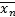
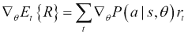

# 第七章：棋盘游戏的深度学习

也许你读过五六十年代的科幻小说；它们充满了对 21 世纪生活会是什么样子的设想。他们想象了一个人们拥有个人喷气背包、水下城市、星际旅行、飞行汽车和真正有独立思考能力的机器人的世界。21 世纪现在已经到来了；可悲的是，我们不会得到那些飞行汽车，但由于深度学习，我们可能会得到那些机器人。

这与棋盘游戏的深度学习有什么关系？在接下来的两个章节，包括当前章节，我们将看看如何构建**人工智能**（**AI**），以学习游戏环境。现实具有广阔的可能性空间。即使是进行简单的人类任务，如让机器人手臂抓取物体，也需要分析大量的感官数据并控制许多用于移动手臂的连续响应变量。

游戏作为测试通用学习算法的绝佳场所。它们给你一个庞大但可控制的可能性环境。此外，说到电脑游戏，我们知道人类可以仅通过屏幕上可见的像素和最微小的指示就学会玩游戏。如果我们将相同的像素以及一个目标输入到计算机代理中，我们知道我们有一个可解决的问题，只要使用正确的算法。实际上，对于电脑来说，问题更容易，因为人类可以识别出他们在视野中看到的东西实际上是游戏像素，而不是屏幕周围的区域。这就是为什么如此多的研究人员将游戏视为开发真正的人工智能的绝佳起点——能够独立于我们运行的自学习机器。此外，如果你喜欢游戏，它会非常有趣。

在本章中，我们将介绍解决棋盘游戏（如跳棋和国际象棋）的不同工具。最终，我们将积累足够的知识，以便理解并实现构建 AlphaGo 的深度学习解决方案，该解决方案击败了最伟大的人类围棋选手。我们将使用各种深度学习技术来实现这一点。接下来的章节将在此基础知识之上构建，并介绍如何使用深度学习来学习如何玩计算机游戏，如乒乓球和打砖块。

我们将在两个章节中涵盖的概念列表如下：

+   极小极大算法

+   蒙特卡洛树搜索

+   强化学习

+   策略梯度

+   Q 学习

+   演员-评论家

+   基于模型的方法

我们将使用一些不同的术语来描述任务及其解决方案。以下是一些定义。它们都使用基本迷宫游戏的示例，因为它是一个很好的、简单的强化学习环境的例子。在迷宫游戏中，有一组位置，它们之间有路径。在这个迷宫中有一个代理，它可以利用路径在不同的位置之间移动。一些位置与奖励相关联。代理的目标是通过迷宫找到最好的奖励。


图 1

+   **Agent** 是我们试图学习行动的实体。在游戏中，这是玩家，他将尝试找到迷宫的出口。

+   **环境** 是代理操作的世界/关卡/游戏，也就是迷宫本身。

+   **奖励** 是代理在环境中获得的反馈。在这个示例迷宫游戏中，它可能是出口方块或图像中的胡萝卜，代理正在尝试收集的物品。一些迷宫还可能有陷阱，会给予负面奖励，代理应该尽量避免。

+   **状态** 指的是代理关于其当前环境的所有可用信息。在迷宫中，状态就是代理的位置。

+   **行动** 是代理可以采取的可能响应或一组响应。在迷宫中，这是代理可以从一个状态到另一个状态的潜在路径。

+   **控制策略** 确定了代理将采取的行动。在深度学习的背景下，这是我们将要训练的神经网络。其他策略可能是随机选择行动或根据程序员编写的代码选择行动。

这一章大部分内容都是代码密集型的，因此，作为从书中复制所有示例的替代方法，你可以在 GitHub 仓库 [`github.com/DanielSlater/PythonDeepLearningSamples`](https://github.com/DanielSlater/PythonDeepLearningSamples) 中找到完整的代码。章节中的所有示例都是使用 TensorFlow 呈现的，但这些概念可以转化为其他深度学习框架。

# 早期游戏 AI

50 年代开始，研究人员构建了玩跳棋和国际象棋的程序，从而开始了构建 AI 来玩游戏的工作。这两个游戏有一些共同点：

+   它们是零和游戏。一个玩家获得的任何奖励都对应着另一个玩家的损失，反之亦然。当一个玩家赢了，另一个玩家输了。不存在合作的可能性。例如，考虑一个游戏，比如囚徒困境；在这里，两个玩家可以同意合作，并且都获得较小的奖励。

+   它们都是完全信息游戏。游戏的整个状态对于两个玩家始终是已知的，不像扑克牌这样的游戏，你的对手手中确切的牌是未知的。这个事实减少了人工智能必须处理的复杂性。它还意味着关于什么是最佳移动的决定可以基于当前状态。在扑克中，关于如何打牌的假设最佳决策需要的信息不仅仅是你目前的手牌和每个玩家可用的金额，还有关于对手的打法以及他们在之前位置中的出价。

+   这两个游戏都是确定性的。如果任一玩家采取了某个移动，那么下一个状态将是确切的。在某些游戏中，游戏可能基于掷骰子或从牌堆中随机抽取卡片；在这些情况下，将会有许多可能的下一个状态需要考虑。

在国际象棋和跳棋中完美信息和确定性的组合意味着鉴于当前状态，我们可以确切地知道如果当前玩家采取行动我们将处于什么状态。这个属性也适用于如果我们有一个状态，然后采取行动导致一个新的状态。我们可以再次在这个新状态中采取行动，以保持玩得尽可能长的时间。

为了尝试一些掌握棋盘游戏的方法，我们将使用名为*Tic-Tac-Toe*的游戏的 Python 实现来举例。也被称为*井字游戏*，这是一个简单的游戏，玩家轮流在一个 3 乘 3 的网格上做标记。第一个在一行中得到三个标记的玩家获胜。*Tic-Tac-Toe*是另一种确定性、零和、完全信息游戏，在这里选择它是因为它的 Python 实现比国际象棋简单得多。事实上，整个游戏可以用不到一页的代码来完成，这将在本章后面展示。

# 使用极大极小算法来评估游戏状态

假设我们想要计算在一个零和、确定性、完全信息游戏中的最佳移动。我们怎么做呢？首先，考虑到我们有完全信息，我们知道确切地哪些移动是可用的。鉴于游戏是确定性的，我们知道每一个移动会导致游戏状态的确切变化。对于对手的移动也是如此；我们也知道他们有哪些可能的移动以及每个移动导致的状态会是怎样。

寻找最佳移动的一种方法是为每个玩家在每个状态下构造每个可能移动的完整树，直到我们到达游戏结束的状态。游戏的最终状态也称为终端状态。我们可以为这个终端状态赋予一个值；赢得的可以是值 1，平局是 0，输掉是-1。这些值反映了对我们来说状态的可取之处。我们宁愿赢也不愿平局，而宁愿平局也不愿输。*图 2*显示了一个例子：


图 2：井字棋所有状态的树

在一个终止状态中，我们可以回到玩家选择导致终止状态的移动的状态。那位玩家，其目标是找到最佳的可能移动，可以确定他们将从他们将采取的行动中获得的确切值，即他们最终将游戏带入的终止状态。他们显然会选择将导致对自己可能获得的最佳值的移动。如果他们有选择要么导致赢得终止状态要么输掉终止状态的行动，他们将选择导致赢得状态的那个行动。

终止状态被选择的状态的值可以标记为玩家可能采取的最佳行动的值。这给了我们在这种状态下的玩家的价值。但是在这里我们正在玩一个双人游戏，所以如果我们回到一个状态，我们将处于另一位玩家要做出移动的状态。现在在我们的图中，我们有了对手在该状态下将从他们在该状态下的行动中获得的价值。

由于这是一个零和游戏，我们希望我们的对手表现得尽可能糟糕，因此我们将选择导致对方状态值最低的移动。如果我们不断回溯状态图，标记所有状态的值为任何动作可能导致的最佳状态值，我们就可以确定当前状态中的最佳动作。


图 3. 极小极大算法

通过这种方式，可以构建游戏的完整树，显示我们可以在当前状态下进行的最佳移动。这种方法称为极小极大算法，是早期研究者用于国际象棋和跳棋游戏的方法。

尽管这种方法告诉我们任何零和、确定性、完美信息游戏的确切最佳移动，但不幸的是它有一个主要问题。国际象棋平均每回合大约有 30 个可能的移动，并且游戏平均持续 40 回合。因此，要从国际象棋的第一个状态构建到所有终止状态将需要大约 30⁴⁰ 个状态。这比世界上最好的硬件可能的数量要大得多。在谈论游戏时，玩家每回合可以采取的移动数量称为**广度**，游戏每回合采取的移动数量称为**深度**。

要使极小极大算法在棋类游戏中可行，我们需要大幅减少搜索的深度。与其计算整个树直到游戏结束，我们可以构建我们的树到一个固定的深度，比如从当前状态开始后的六步。在每个不是实际终止状态的叶子节点上，我们可以使用一个评估函数来估计在该状态下玩家获胜的可能性。

对于国际象棋，一个良好的评估函数是对每个玩家可用的棋子数量进行加权计数。因此，兵的得分为 1 分，主教或骑士的为 3 分，车的为 5 分，后的为 8 分。如果我有三个兵和一个骑士，我得到六分；同样地，如果你有两个兵和一个车，你有七分。因此，你领先一分。通常情况下，在国际象棋中，剩下的棋子更多的玩家往往会取胜。然而，任何曾经与好的交换牺牲对手交战的国际象棋玩家都会知道，这个评估函数是有局限性的。

# 实现 Python 版的 Tic-Tac-Toe 游戏

让我们构建一个基本的*Tic-Tac-Toe*实现，这样我们就可以看到 min-max 算法的实现是什么样子的。如果你不想复制所有这些，你可以在 GitHub 仓库[`github.com/DanielSlater/PythonDeepLearningSamples`](https://github.com/DanielSlater/PythonDeepLearningSamples)的`tic_tac_toe.py`文件中找到完整的代码。 

在游戏棋盘中，我们将用一个 3 x 3 的整数元组表示。使用元组而不是列表，以便以后能够在匹配的棋盘状态之间得到相等。在这种情况下，**0**表示一个未被玩过的方格。两名玩家将分别用**1**和**-1**表示。如果玩家一在一个方格上下了一步，那么该方格将被标记为他们的数字。所以让我们开始：

```py
def new_board():
   return ((0,0,0),
          (0,0,0),
          (0,0,0))
```

在玩家进行下一步前，将会调用`new_board`方法，准备好一个新的棋盘：

```py
def apply_move(board_state, move, side):
    move_x, move_y = move
    state_list = list(list(s) for s in board_state)
    state_list[move_x][move_y] = side
    return tuple(tuple(s) for s in state_list)
```

`apply_move`方法接受`board_state`的 3 x 3 元组之一，并返回应用了给定方向移动的新的`board_state`。移动将是一个包含两个整数坐标的长度为 2 的元组。方向将是代表玩家的整数，要么是 1，要么是-1：

```py
import itertools

def available_moves(board_state):
    for x, y in itertools.product(range(3), range(3)):
            if board_state[x][y] == 0:
                  yield (x, y)
```

这个方法为给定的 3 x 3 `board_state`列出了合法的移动列表，它就是所有非零方格。现在我们只需要一个方法来确定玩家是否已经连成了三个获胜的标记：

```py
def has_3_in_a_line(line):
  return all(x==-1 for x in line) | all(x==1 for x in line)
```

`has_3_in_a_line`将获取棋盘上的三个方格的序列。如果所有的方格都是 1 或-1，这意味着其中一名玩家连成了三个获胜的标记，赢得了胜利。然后，我们需要对 Tic-Tac-Toe 棋盘上的每条可能的线运行这个方法，以确定玩家是否已经获胜：

```py
def has_winner(board_state):
    # check rows
    for x in range(3):
        if has_3_in_a_line (board_state[x]):
            return board_state[x][0]
    # check columns
    for y in range(3):
        if has_3_in_a_line([i[y] for i in board_state]):
            return board_state[0][y]
    # check diagonals
    if has_3_in_a_line([board_state[i][i] for i in range(3)]):
        return board_state[0][0]
    if has_3_in_a_line([board_state[2 - i][i] for i in range(3)]):
        return board_state[0][2]
    return 0 # no one has won
```

只需这几个功能，你就可以玩一局*Tic-Tac-Toe*游戏。简单地开始，获取一个新的棋盘，然后让玩家依次选择移动并将这些移动应用到`board_state`上。如果我们发现没有剩余可用的移动，游戏就是平局。否则，如果`has_winner`返回`1`或`-1`，这意味着其中一名玩家获胜。接下来，让我们编写一个简单的函数来运行一个 Tic-Tac-Toe 游戏，其中的移动由我们传递的方法来决定，这些方法将会是我们将尝试的不同 AI 玩家的控制策略：

```py
def play_game(plus_player_func, minus_player_func):

board_state = new_board()

player_turn = 1
```

我们宣告这个方法，并将其带到将为每个玩家选择动作的函数中。每个`player_func`将会有两个参数：第一个是当前的`board_state`，第二个是玩家所执的一方，1 或-1。`player_turn`变量将为我们跟踪这一切：

```py
    while True:
        _available_moves = list(available_moves(board_state))
        if len(_available_moves) == 0:
            print("no moves left, game ended a draw")
            return 0.
```

这是游戏的主要循环。首先，我们要检查`board_state`上是否还有可用的走法；如果有，游戏还没结束，就是平局：

```py
        if player_turn > 0:
            move = plus_player_func(board_state, 1)
        else:
            move = minus_player_func(board_state, -1)
```

运行与轮到哪个玩家的函数相关联的方法来决定一步棋：

```py
        if move not in _avialable_moves:
            # if a player makes an invalid move the other player wins
            print("illegal move ", move)
            return -player_turn
```

如果任一玩家走出违规步骤，那就是自动认输。代理应该更明白：

```py
        board_state = apply_move(board_state, move, player_turn)
        print(board_state)

        winner = has_winner(board_state)
        if winner != 0:
            print("we have a winner, side: %s" % player_turn)
            return winner
        player_turn = -player_turn
```

将走法应用到`board_state`上，并检查我们是否有获胜者。如果有，结束游戏；如果没有，切换`player_turn`到另一个玩家，并重新循环。

以下是我们如何编写一种控制策略的方法，该方法将完全随机选择可用的合法走法：

```py
def random_player(board_state, side):
    moves = list(available_moves(board_state))
    return random.choice(moves)
```

让我们运行两个随机玩家相互对战，然后检查输出是否可能看起来像这样：

```py
play_game(random_player, random_player)

((0, 0, 0), (0, 0, 0), [1, 0, 0])
([0, -1, 0], (0, 0, 0), [1, 0, 0])
([0, -1, 0], [0, 1, 0], [1, 0, 0])
([0, -1, 0], [0, 1, 0], [1, -1, 0])
([0, -1, 0], [0, 1, 1], [1, -1, 0])
([0, -1, 0], [0, 1, 1], [1, -1, -1])
([0, -1, 1], [0, 1, 1], [1, -1, -1])
we have a winner, side: 1

```

现在我们有了一种很好的方法来尝试在棋盘游戏上尝试不同的控制策略，所以让我们写些稍微好一点的东西。我们可以从一个 min-max 函数开始，该函数的水平应该比我们当前的随机玩家高得多。Min-max 函数的完整代码也可以在 GitHub 库的`min_max.py`文件中找到。

井字棋是一个可能性空间较小的游戏，所以我们可以简单地从棋盘的起始位置运行整个游戏的 min-max，直到我们遍历了每个玩家的每个可能走法。但是使用一个评估函数是个好习惯，因为对我们玩的大多数其他游戏来说，情况并非如此。这里的评估函数将为我们在后面得到两条线中的一个空位置时给我们一个分数；如果我们的对手实现了这一点，那么他将是相反的。首先，我们将需要一个为我们可能做出的每条线得分的方法。`score_line`将使用长度为 3 的序列并对它们进行评分：

```py
def score_line(line):
    minus_count = line.count(-1)
    plus_count = line.count(1)
    if plus_count == 2 and minus_count == 0:
        return 1
    elif minus_count == 2 and plus_count == 0:
        return -1
    return 0
```

然后`evaluate`方法简单地遍历井字棋棋盘上的每条可能的线，并将它们加总起来：

```py
def evaluate(board_state):
    score = 0
    for x in range(3):
        score += score_line(board_state[x])
    for y in range(3):
        score += score_line([i[y] for i in board_state])
    #diagonals
    score += score_line([board_state[i][i] for i in range(3)])
    score += score_line([board_state[2-i][i] for i in range(3)])

    return score
```

然后，我们来到实际的`min_max`算法方法：

```py
def min_max(board_state, side, max_depth):
    best_score = None
    best_score_move = None
```

该方法的前两个参数，我们已经熟悉了，是`board_state`和`side`；不过，`max_depth`是新的。Min-max 是一种递归算法，`max_depth`将是我们在停止沿树向下移动并仅评估其以获取结果之前所使用的最大递归调用次数。每次我们递归调用`min_max`时，我们将`max_depth`减少 1，当我们达到 0 时停止评估：

```py
    moves = list(available_moves(board_state))
    if not moves:
        return 0, None
```

如果没有可走的步骤，那么就没有必要评估任何东西；这是平局，所以让我们返回一个分数为 0：

```py
    for move in moves:
 new_board_state = apply_move(board_state, move, side)
```

现在我们将详细介绍每个合法走法，并创建一个应用了该走法的`new_board_state`：

```py

winner = has_winner(new_board_state)
        if winner != 0:
            return winner * 10000, move
```

检查这个`new_board_state`是否已经获胜。如果游戏已经获胜，则不需要再进行递归调用。在这里，我们将获胜者的分数乘以 1,000；这只是一个任意的大数字，以便实际的胜利或失败总是被认为比我们可能从对`evaluate`的调用中获得的最极端结果更好/更差：

```py
        else:
            if max_depth <= 1:
                score = evaluate(new_board_state)
            else:
                score, _ = min_max(new_board_state, -side, max_depth - 1)
```

如果您没有获胜位置，那么算法的真正精华就开始了。如果达到`max_depth`，那么现在就是评估当前`board_state`以获得我们的启发式的时候，这能告诉我们当前位置对第一个玩家有多有利。如果还没有达到`max_depth`，则递归调用`min_max`，直到达到底部：

```py
            if side > 0:
                if best_score is None or score > best_score:
                    best_score = score
                    best_score_move = move
            else:
                if best_score is None or score < best_score:
                    best_score = score
                    best_score_move = move
       return best_score, best_score_move
```

现在我们对`new_board_state`中的评分有了，我们想要获得最佳或最差的得分位置，取决于我们是哪一方。我们通过`best_score_move`变量跟踪导致这一点的移动，最终在方法结束时将其与分数一起返回。

现在可以创建一个`min_max_player`方法，以便回到我们之前的`play_game`方法：

```py
def min_max_player(board_state, side):
    return min_max(board_state, side, 5)[1]
```

现在，如果我们让`random_player`和`min_max`玩家进行一系列游戏，我们会发现`min_max`玩家几乎每次都会赢。

尽管重要理解 min-max 算法，但实际上从未被使用，因为有一个更好的版本：带有 alpha-beta 剪枝的 min-max。这利用了树的某些分支可以被忽略或剪枝的事实，而无需完全评估它们。alpha-beta 剪枝将产生与 min-max 相同的结果，但平均搜索时间减少了一半。

要解释 alpha-beta 剪枝背后的思想，让我们考虑在构建我们的 min-max 树时，一半的节点试图做出决策以最大化分数，另一半则试图最小化它。当我们开始评估一些叶子时，我们会得到对 min 和 max 决策都有利的结果。如果通过树的某条路径得分为-6，min 分支知道它可以通过跟随该分支获得这个分数。阻止它使用这个分数的是 max 决策必须做出决策，而且它不能选择对 min 节点有利的叶子。

但随着更多叶子的评估，另一个可能对 max 节点有利的叶子出现，得分为+5。max 节点永远不会选择比这更差的结果。但是现在我们对 min 和 max 都有了得分，我们知道如果开始沿着一个最佳 min 得分比-6 更糟糕，而最佳 max 得分比+5 更糟糕的分支，那么无论 min 还是 max 都不会选择这个分支，我们就可以节省对整个分支的评估。

Alpha beta 剪枝中的 alpha 存储了最大决策可以实现的最佳结果。Beta 存储了最小决策可以实现的最佳结果（最低分数）。如果 alpha 大于或等于 beta，我们知道可以跳过对当前分支的进一步评估。这是因为这两个决策已经有更好的选择。

*图 4*给出了这一点的一个示例。在这里我们看到，从第一个叶子开始，我们可以将 alpha 值设为 0。这是因为一旦最大玩家在一个分支中找到分数为 0，他们就不需要选择一个更低的分数。接下来，第三个叶子的位置上，分数再次为 0，所以最小玩家可以将他们的 beta 分数设为 0。读取*branch ignored*的分支不再需要进行评估，因为 alpha 和 beta 都是 0。

要理解这一点，考虑一下从评估分支中可能获得的所有可能结果。如果结果为 +1，则最小玩家只需选择已经获得分数为 0 的现有分支。在这种情况下，分支被忽略的分支向左（left）走。如果分数结果为 -1，那么最大玩家只需选择图像中得分为 0 的最左边分支。最后，如果分数为 0，这意味着没有人发生改进，因此我们的位置的评估保持不变。你永远不会得到一个结果，评估一个分支会改变位置的整体评估。以下是修改后使用 alpha beta 剪枝的 min-max 方法的示例：

```py
import sys

def
```


图 4：使用 alpha beta 剪枝的 min-max 方法

```py
min_max_alpha_beta(board_state, side, max_depth, 
                       alpha=-sys.float_info.max,
                       beta=sys.float_info.max):
```

现在我们传入 `alpha` 和 `beta` 作为参数；我们停止搜索那些小于 alpha 或大于 beta 的分支：

```py
    best_score_move = None
    moves = list(available_moves(board_state))
    if not moves:
        return 0, None

    for move in moves:
        new_board_state = apply_move(board_state, move, side)
        winner = has_winner(new_board_state)
        if winner != 0:
            return winner * 10000, move
        else:
            if max_depth <= 1:
                score = evaluate(new_board_state)
            else:
                score, _ = min_max_alpha_beta(new_board_state, -side, max_depth - 1, alpha, beta)
```

现在，当我们递归调用 `min_max_alpha_beta` 时，我们传入可能已经更新的新 alpha 和 beta 值作为搜索的一部分：

```py
        if side > 0:
            if score > alpha:
                alpha = score
                best_score_move = move
```

`side > 0` 表达式意味着我们希望最大化我们的分数，所以如果新的分数比我们当前的 alpha 更好，我们会将分数存储在 alpha 变量中：

```py
        else:
            if score < beta:
                beta = score
                best_score_move = move
```

如果 `side` 是 < 0，我们在进行最小化，所以把最低分数存储在 beta 变量中：

```py
        if alpha >= beta:
            break
```

如果 alpha 大于 beta，那么这个分支不能改善当前的分数，所以我们停止搜索：

```py
    return alpha if side > 0 else beta, best_score_move
```

1997 年，IBM 创建了一个名为*深蓝*的国际象棋程序。它是第一个击败现任世界象棋冠军加里·卡斯帕罗夫的程序。虽然这是一个了不起的成就，但很难称*深蓝*具有智能。尽管它具有巨大的计算能力，但其基础算法只是上世纪 50 年代的 min-max 算法。唯一的主要区别是*深蓝*利用了国际象棋的开局理论。

开局理论由一系列从起始位置开始的走法组成，这些走法被认为会导致有利或不利的局面。例如，如果白方棋手以 e4（王前的兵向前移动两格）开局，那么黑方应该回应 c5，这就是西西里防御，对于这个局面，有许多书籍介绍接下来可能出现的走法。深蓝计算机只是简单地遵循这些开局书籍推荐的最佳走法，并且只在开局走法结束时开始计算最佳的极小极大走法。这样，它既省去了计算时间，也利用了人类在国际象棋开局阶段找到最佳局面所进行的大量研究。

# 学习一个价值函数

让我们对极小极大算法需要计算的具体数量进行更详细的了解。如果我们的游戏广度为*b*，深度为*d*，那么使用极小极大评估一个完整游戏需要构建一棵树，最终有*d*^(*b*)个叶子。如果我们使用最大深度*n*和一个评估函数，它将把我们的树大小减小到*n*^(*b*)。但这是一个指数方程，即使*n*只有 4，*b*为 20，你仍然有 1,099,511,627,776 种可能性需要评估。这里的权衡是，随着*n*的降低，我们的评估函数在较浅的层次上被调用，这可能比局面的预估质量要差得多。再一次，以国际象棋为例，我们的评估函数只是简单地统计棋盘上剩下的棋子数量。在较浅的位置停止可能会忽略最后一步将皇后放在可以在下一步中被吃掉的位置的事实。更大的深度总是意味着更准确的评估。

# 训练 AI 掌握围棋

国际象棋中的可能性虽然很多，但并不是如此之多，以至于用一台强大的计算机无法击败世界上最伟大的人类棋手。围棋是一种源远流长的中国古老游戏，其起源可以追溯到 5500 多年前，远比国际象棋复杂得多。在围棋中，一子可以放在 19 x 19 的棋盘上的任何地方。首先有 361 个可能的走法。因此，要往前搜索*k*步，你必须考虑 361k 种可能性。使情况更加困难的是，在国际象棋中，你可以通过计算每一方的棋子数量相对精确地评估一个局势的好坏，但在围棋中，没有找到这样简单的评估函数。 要知道一个局势的价值，你必须计算到游戏结束，再往后走 200 多步。这使得游戏通过极小极大来达到一个良好水平几乎是不可能的。


图 5

要深入了解围棋的复杂性，值得思考人类学习围棋与国际象棋的方式。当初学国际象棋时，新手们会在棋盘向对手方向的一系列移动中前进。在某个时刻，他们会做出一步让自己的棋子暴露给对方吃掉的移动。于是对手就会乐意接受并吃掉这个棋子。这时新手玩家立刻就会意识到他们上一步走得不好，如果想要提高，就不能再犯同样的错误。对于玩家来说很容易找出他们做错了什么，尽管要一直自我纠正可能需要大量的实践。

另一方面，当初学围棋时，它看起来就像是棋盘上一系列几乎是随机的移动。在某个时刻，双方玩家都用完了他们的棋子，然后计算局面以确定谁赢了。初学者发现自己输了，盯着摆在不同位置的一堆棋子，想弄清楚到底发生了什么。对于人类来说，围棋是极其困难的，需要高度的经验和技巧才能理解玩家出错的地方。

另外，围棋没有像国际象棋那样的开局理论书籍。围棋的开局理论不是一系列计算机可以遵循的移动序列，而是许多通用原则，例如要追求的良好形状或者控制棋盘角落的方法。围棋中有一种叫做*定式*的东西，它是研究出的一系列走法，已知会导致不同的优势。但所有这些都必须在玩家意识到可能存在某种特定局面时应用；它们不是可以盲目遵循的动作。

对于围棋等游戏，评估如此困难的一个方法是**蒙特卡罗树搜索**（**MCTS**）。如果你学过贝叶斯概率，你会听说过蒙特卡罗采样。这涉及从概率分布中采样以获得无法计算的值的近似值。MCTS 类似。一个样本包括随机选择每个玩家的动作，直到达到终局状态。我们维护每个样本的统计数据，这样在完成后，我们就可以从当前状态中选择具有最高平均成功率的动作。这是我们之前提到的井字棋游戏的 MCTS 示例。完整的代码也可以在 GitHub 存储库的 `monte_carlo.py` 文件中找到：

```py
import collections

def monte_carlo_sample(board_state, side):
    result = has_winner(board_state)
    if result != 0:
        return result, None
    moves = list(available_moves(board_state))
    if not moves:
        return 0, None
```

这里的 `monte_carlo_sample` 方法从给定位置生成一个样本。同样，我们有一个方法，它的参数是 `board_state` 和 `side`。这个方法将被递归调用，直到我们达到一个终局状态，所以要么是平局因为不能再下新的棋了，要么是某一方玩家赢了：

```py
    # select a random move
    move = random.choice(moves)
    result, next_move = monte_carlo_sample(apply_move(board_state, move, side), -side)
    return result, move
```

将从局面中的合法移动中随机选择一个移动，并递归调用样本方法：

```py
def monte_carlo_tree_search(board_state, side, number_of_samples):
    results_per_move = collections.defaultdict(lambda: [0, 0])
    for _ in range(number_of_samples):
        result, move = monte_carlo_sample(board_state, side)
        results_per_move[move][0] += result
        results_per_move[move][1] += 1
```

从这个棋盘状态中取出蒙特卡罗样本，并根据它们更新我们的结果：

```py
    move = max(results_per_move, 
        key=lambda x: results_per_move.get(x)[0] /
                results_per_move[move][1])
```

获得同样结果最佳走法：

```py
    return results_per_move[move][0] / results_per_move[move][1], move
```

这就是将所有内容整合在一起的方法。我们将调用`monte_carlo_sample`方法`number_of_samples`次，跟踪每次调用的结果。然后我们返回平均表现最佳的走法。

考虑一下 MCTS 得到的结果与涉及最小最大的结果有多大不同是很有意义的。如果我们以国际象棋为例，以这个局面来说，白方有一个获胜的着法，将车移到后排 c8，将黑方将军。使用最小最大算法，这个局面会被评价为白方获胜的局面。但是使用 MCTS，考虑到这里的所有其他走法都会导致黑方潜在的胜利，这个局面将被评价为对黑方有利。这就是为什么 MCTS 在国际象棋中表现很差，并且应该让你感受到为什么只有在最小最大算法不可行时才应该使用 MCTS。在围棋这类游戏中，传统上使用 MCTS 找到了最佳的人工智能表现。


图 6：一个被蒙特卡洛采样严重低估的国际象棋局面。如果轮到白走，他们有一个获胜的着法；但是，如果随机走子，黑方有获胜的机会。

# 将置信上界应用到树结构

总结一下，最小最大算法可以给出具体的最佳着法，假设有完美的信息；但是 MCTS 只给出一个平均值；尽管它允许我们处理无法用最小最大算法评估的更大状态空间。有没有办法改进 MCTS，使其在给出足够的评价时能收敛到最小最大算法？是的，置信上界应用到树结构的蒙特卡洛树搜索（UCT）确实可以做到这一点。其背后的想法是把 MCTS 看作是一个多臂老虎机问题。多臂老虎机问题是我们有一组老虎机——单臂老虎机——每台机器都有一个未确定的赔付和每次游戏的平均赔付金额。每台机器的赔付是随机的，但平均赔付金额可能差异很大。我们该如何确定要玩哪些老虎机？

在选择老虎机时需要考虑两个因素。第一点是显而易见的，即利用价值，也就是给定老虎机预期的回报。为了最大化赔付，我们需要始终玩出预期赔付最高的机器。第二点是探索价值，我们希望我们玩的机器增加我们对不同机器赔付的信息。

如果我们玩机器*A*三次，你将得到 13、10 和 7 的回报，平均回报为 10。我们也有机器*B*；我们已经玩了它一次，得到了 9 的回报。在这种情况下，可能更倾向于玩机器*B*，因为尽管平均回报较低，为 9 对 10。我们只玩了一次的事实意味着较低的支付可能只是运气不佳。如果我们再次玩它并得到 13 的回报，机器 B 的平均为 11。因此，我们应该切换到玩那台机器以获得最佳回报。

多臂老虎机问题在数学领域得到了广泛研究。如果我们重构我们的 MCTS 评估，使其看起来像一个多臂老虎机问题，我们就可以利用这些成熟的理论。一种思考方式是，与其将问题视为最大化奖励，不如将其视为最小化遗憾的问题。这里的遗憾定义为我们为我们玩的机器获得的奖励与如果我们从一开始就知道最佳机器会得到的最大可能奖励之间的差异。如果我们遵循一项政策，*p(a)*每次选择一个能给予奖励的动作。给定*r*为最佳可能行动的奖励的*t*次玩后的遗憾如下：


如果我们选择一个始终选取奖励最高的机器的政策，它可能并不是真正的最佳机器。因此，我们的遗憾会随着每次玩而线性增加。同样，如果我们采取一个始终试图探索以找到最佳机器的政策，我们的遗憾也会线性增加。我们希望的是一项*p(a)*的政策，其增长呈次线性时间。

最好的理论解决方案是根据置信区间执行搜索。置信区间是我们期望真实均值落在其中的范围，具有一定的概率。在面对不确定性时，我们想要保持乐观。如果我们不知道某件事，我们想要找出答案。置信区间代表了我们对给定随机变量的真实均值的不确定性。根据你的样本均值加上置信区间选择某样本，这将鼓励你探索可能性的空间，并同时加以利用。

对于 i.i.d 在 0 到 1 范围内的随机变量*x*，在 n 个样本上，真实均值大于样本均值的概率，即加上常数*u*，由 Hoeffding 不等式给出：Hoeffding, Wassily (1963). *有界随机变量之和的概率不等式*，美国统计协会杂志：


我们希望使用这个方程来找到每台机器的上界置信度。* E {x}, x *, 和 * n *都是我们已经有的统计学的一部分。我们需要解这个方程来计算一个值 * u *。为了做到这一点，把方程的左边化简为 p，并找到它与右边相等的点：


我们可以重排它，让*u*用*n*和*p*表示：


现在我们希望选择一个* p *的值，这样我们的精度随时间增加而提高。如果我们设，那么当 n 趋近无穷大时，我们的损失将趋向于 0。代入这个值，我们可以简化为：


均值加上 u 是我们的上界置信界，所以我们可以用它来得到**UCB1**（**上置信界**）算法。我们可以用这些值代替我们之前在多臂老虎机问题中看到的值，其中* r * [* i *] 是从机器*i*得到的奖励的总和，* n * [* i *]是机器*i*的玩的次数，* n *是所有机器的总玩的次数：


我们总是希望选择能为我们带来最高分数的机器。如果我们这样做，我们的损失将以对数的方式随着玩的次数增加，这是我们可以实现的理论最佳情况。使用这个方程做出我们的行动选择会导致这样的行为，我们在早期会尝试各种各样的机器，但我们越多地尝试单一机器，它就会更鼓励我们最终尝试不同的机器。

还要记住，这一系列方程的假设是在早期方程中的 x 的范围，以及当我们将其应用到多臂老虎机问题时的* r *，它们的值都在 0 到 1 的范围内。所以，如果我们的工作不在这个范围内，我们需要缩放我们的输入。不过，我们并没有做出任何关于分布性质的假设；它可以是高斯的、二项式的等等。

现在我们已经找到了从一组未知分布中采样的最优解决方案；我们如何将其应用于 MCTS 呢？最简单的方法是将当前棋盘状态的第一个移动视为老虎机或投币机。尽管这样会稍微提高顶层的估计，但下面的每一步都会完全随机，这意味着* r * [* i *] 的估计将会非常不准确。

或者，我们可以将树的每个分支上的每个移动都视为一个多臂赌博机问题。问题在于，如果我们的树非常深，随着我们的评估越深入，我们将到达我们以前从未遇到过的位置，因此我们将没有样本用于我们需要在其中选择的移动范围。我们将为大范围的位置保留大量统计数据，其中大多数将永远不会被使用。

妥协解决方案称为树的上限置信，是我们接下来要讨论的内容。我们将从当前棋盘状态开始进行连续的模拟。在树的每个分支处，我们有一系列可供选择的操作，如果我们对每个潜在移动都有先前的样本统计数据，我们将使用 UCB1 算法来选择用于模拟的动作。如果我们没有每个移动的样本统计数据，我们将随机选择移动。

我们如何决定保留哪些样本统计数据？对于每次模拟，我们为我们以前没有统计数据的第一个遇到的位置保留新的统计数据。完成模拟后，我们更新我们跟踪的每个位置的统计数据。这样，我们忽略了模拟深处的所有位置。经过 x 次评估，我们应该恰好有 *x* 个树节点，每次模拟增加一个。更重要的是，我们跟踪的节点可能位于我们最常使用的路径周围，使我们能够通过增加我们在树深处评估的移动的准确性来增加我们的顶层评估准确性。

步骤如下：

1.  从当前棋盘状态开始进行一次模拟。当你选择一个移动时，请执行以下操作：

    1.  如果你对当前位置的每一步都有统计数据，就使用 UCB1 算法来选择移动。

    1.  否则，随机选择移动。如果这是第一个随机选择的位置，则将其添加到我们正在保留统计数据的位置列表中。

1.  运行模拟，直到达到终止状态，这将给出这次模拟的结果。

1.  更新你正在保留统计数据的每个位置的统计数据，指示你在模拟中经历了什么。

1.  重复，直到达到最大模拟次数。应用于树的上限置信边界，每个位置的统计数据显示在方框中：

1.  上图说明了这是如何发生的。在位置 A，四个可能的移动都收集了统计数据。因此，我们可以使用 UCB1 算法来选择最佳移动，平衡开发性和探索性的价值。在上图中，选择了最左边的移动。这将我们带到**位置 B**；在这里，只有三个可能的移动中的两个收集了统计数据。因此，你需要为这次模拟随机选择一个移动。由于巧合，选择了最右边的移动；剩下的移动是随机选择的，直到到达最终的**位置 C**，在那里圈圈玩家获胜。然后，将这些信息应用于一个图表，如下图所示：

1.  我们会为我们经过且已经有统计数据的任何一个位置添加统计信息，因此第一个图表中的 1/2 现在变成了 2/3。我们还会为我们遇到的第一个没有统计信息的位置添加统计信息。在这里，它是第二行中最右边的位置；它现在的分数是 1/1，因为圈圈玩家赢了。如果再次选择这条分支并且你到达位置 D，使用 UCB1 算法来选择移动，而不是随机选择。

1.  这是我们的*井字棋*游戏在 Python 中的实现：

    ```py
    def upper_confidence_bounds(payout, samples_for_this_machine, log_total_samples):
        return payout / samples_for_this_machine 
               + math.sqrt((2 * log_total_samples)
                           / samples_for_this_machine)
    ```

首先，我们需要一个计算 UCB1 值的方法；这是在 Python 中的 UCB1 公式。唯一的区别是这里我们使用`log_total_samples`作为输入，因为它允许我们稍后进行小优化：

```py
def monte_carlo_tree_search_uct(board_state, side, number_of_rollouts):

state_results = collections.defaultdict(float)

state_samples = collections.defaultdict(float)
```

声明该方法和两个字典，即`state_results`和`state_samples`。它们将跟踪我们在模拟期间遇到的不同棋盘状态的统计信息：

```py
    for _ in range(number_of_rollouts):
        current_side = side
        current_board_state = board_state

first_unvisited_node = True

rollout_path = []
        result = 0
```

主循环是我们每次模拟都会经历的过程。在模拟开始时，我们需要初始化将跟踪模拟进展的变量。`first_unvisited_node`将跟踪我们是否为此次模拟创建了一个新的统计跟踪节点。当遇到第一个没有统计信息的状态时，我们创建新的统计节点，将其添加到`state_results`和`state_samples`字典中，并将变量设置为`False`。`rollout_path`将跟踪我们在此次模拟中访问的每个节点，这些节点是我们保留了统计节点的节点。当我们在模拟结束时获得结果时，我们将更新沿路径的所有状态的统计信息：

```py
 while result == 0:

move_states = {move: apply_move(current_board_state, move, current_side)
                           for move in available_moves(current_board_state)}

            if not move_states:

result = 0
                break
```

当`result == 0`时，我们进入模拟的循环；这将一直运行，直到一方胜利。在模拟的每个循环中，我们首先构造一个字典`move_states`，将每个可用的移动映射到该移动将带我们进入的状态。如果没有可以进行的移动，那么我们处于终止状态，这是一局平局。所以你需要将其记录为结果，并跳出模拟循环：

```py
            if all((state in state_samples) for _, state in move_states):
                log_total_samples = math.log(sum(state_samples[s] for s in move_states.values()))
                move, state = max(move_states, key=lambda _, s:
                upper_confidence_bounds(state_results[s], state_samples[s], log_total_samples))
            else:
                move = random.choice(list(move_states.keys()))
```

现在我们需要选择在这次投掷中要采取的棋步。根据 MCTS-UCT 算法的规定，如果我们对每个可能的移动都有统计数据，我们选择具有最佳`upper_confidence_bounds`得分的移动；否则，我们随机选择。

```py

current_board_state = move_states[move]
```

现在我们已经选择了我们的走步，我们可以将`current_board_state`更新为移动将我们置于的状态：

```py
            if first_unvisited_node:

rollout_path.append((current_board_state, current_side))
                if current_board_state not in state_samples:
                    first_unvisited_node = False
```

现在我们需要检查我们是否已经到达了 MCTS-UCT 树的末端。我们将向`rollout_path`中添加我们访问的每个节点，直到第一个之前未访问的节点。一旦我们从这次投掷中得到结果，我们将更新所有这些节点的统计数据。

```py
            current_side = -current_side
            result = has_winner(current_board_state)
```

我们处于我们的投掷循环的最后，所以下一次迭代时要改变双方的位置，并检查当前状态是否有人获胜。如果是的话，当我们回到`while result == 0`语句时，它将导致我们退出投掷循环：

```py
        for path_board_state, path_side in rollout_path:
            state_samples[path_board_state] += 1.

result = result*path_side/2.+.5
            state_results[path_board_state] += result

```

现在我们已经完成了一次投掷，离开了投掷循环。我们现在需要用结果更新我们的统计数据。`rollout_path`中包含要更新的每个节点的`path_board_state`和`path_side`，因此我们需要遍历其中的每个条目。最后需要指出的两点是，我们的游戏结果介于-1 和 1 之间。但是 UCB1 算法期望其支付在 0 和 1 之间；行`result*path_side/2.+.5`就做到了这一点。其次，我们还需要转换结果以代表它们所代表的一方。对我来说一个好棋步是对手的坏棋步的对立面：

```py
    move_states = {move: apply_move(board_state, move, side) for move in available_moves(board_state)}

    move = max(move_states, key=lambda x: state_results[move_states[x]] / state_samples[move_states[x]])

    return state_results[move_states[move]] / state_samples[move_states[move]], move
```

最后，一旦完成了所需数量的投掷，我们可以基于最佳预期报酬从当前状态选择最佳的走步。不再需要使用 UCB1 来选择最佳走步。因为这是最终决定，不需要进行额外的探索，最佳走步就是最佳平均报酬。

这就是 MCTS-UCT 算法。它有许多不同的变体，针对特定情况具有不同的优势，但它们都有这个作为核心逻辑。MCTS-UCT 给了我们一种一般的方式来评判类似围棋这样具有庞大搜索空间的游戏的走步。而且，它并不仅限于完全信息的游戏；在具有部分观察状态的游戏中，如扑克牌游戏中，它通常也表现良好。甚至更一般地说，任何我们遇到的可以重新配置适应它的问题，例如，它被用作自动定理证明机器的基础。

# 蒙特卡洛树搜索中的深度学习

即使使用了 MCTS-UCT 算法，计算机仍然无法与最优秀的围棋选手相提并论；然而，在 2016 年， *Google Deep Mind* 团队开发了一个名为 AlphaGo 的人工智能。它在五局比赛中击败了世界顶尖的围棋选手李世石，以 4-1 的比分获胜。他们这样做的方式是在标准 MCTS UCT 方法的基础上进行了三项改进。

如果我们思考为什么 MCTS 如此不准确，一个直观的答案可能是，评估中使用的动作是随机选择的，而我们知道某些动作比其他动作更有可能。在围棋中，当争夺角落的控制权时，该区域周围的动作是更好的选择，而不是棋盘另一侧的动作。如果我们有一种良好的方法来选择哪些动作可能被下，我们将大大减少搜索的广度，从而增加我们 MCTS 评估的准确性。如果我们回到前面的国际象棋局面，尽管每个合法的动作理论上都可以被下，但是如果你对手没有任何国际象棋技巧，只会下赢棋的动作，评估其他动作就是在浪费 CPU 周期。

深度学习可以帮助我们解决这个问题。我们可以利用神经网络的模式识别特性来粗略估计在游戏中给定位置的棋子被下的概率。对于 AlphaGo，使用了一个具有 13 层卷积网络和 relu 激活函数的网络。网络的输入是 19 x 19 的棋盘状态，输出是另一个 19 x 19 的 softmax 层，表示每个棋盘方格中下棋的概率。然后，它在大量专家级人类围棋对局的数据库上进行训练。网络将接收一个单一的位置作为输入，以及从该位置下的棋子作为目标。损失函数是网络激活和人类下的棋子之间的均方误差。在充分的训练下，该网络学会了以 57%的准确率预测人类下棋的动作。在这里使用测试集特别重要，因为过度拟合是一个大问题。除非网络能够将对一个位置的理解推广到以前未见过的位置，否则它是无用的。

如果我们想在前面的井字棋示例中实现类似的东西，我们只需将`move = random.choice(moves)`这行替换为使用由训练过的神经网络选择的动作的`monte_carlo_sample`方法或 UCT 版本。如果你有一个大型的训练集合例子游戏，这种技术将适用于任何离散游戏。

如果你没有例子游戏的数据库，你可以使用另一种方法。如果你有一个稍微有技巧的代理程序，你甚至可以使用该代理程序来生成初始的例子游戏集合。例如，一个好的方法是使用极小-极大或 MCTS UCT 算法来生成例子位置和动作。然后，可以训练一个网络来从该集合中下棋。这是一个很好的方法，可以让网络学会如何以足够高的标准玩游戏，以至于它至少可以探索游戏空间的可能动作，而不是完全随机的动作。

如果我们实现这样的神经网络，用它来选择在蒙特卡洛展开中使用哪些移动，那么我们的评估将更加准确，但我们仍然会遇到这样的问题，即当我们仍然关心我们的移动带来的最佳结果时，我们的 MCTS 将评估平均值。这就是引入强化学习以改进我们的代理的地方。

# 强化学习快速回顾

我们在第一章中首次遇到强化学习，*机器学习 - 简介*，当我们研究了三种不同类型的学习过程时：监督，无监督和强化。在强化学习中，代理在环境中接收奖励。例如，代理可能是迷宫中的老鼠，奖励可能是迷宫中的某些食物。强化学习有时会感觉有点像监督循环网络问题。网络获得一系列数据并必须学会响应。

区分任务成为强化学习问题的关键区别是，代理给出的响应会改变它在未来时间步中接收的数据。如果老鼠在迷宫的一个*T*交叉口向左转而不是向右转，那么它将改变其下一个状态。相比之下，监督循环网络只是预测一系列。它们所做的预测不会影响系列中的未来值。

AlphaGo 网络已经通过监督训练，但现在问题可以重塑为一个强化学习任务，以进一步改进代理。对于 AlphaGo，创建了一个新的网络，该网络与监督网络共享结构和权重。然后，使用强化学习继续其训练，并专门使用称为政策梯度的方法。

# 用于学习策略函数的政策梯度

政策梯度旨在解决的问题是强化学习问题的更一般版本，即如何在任务上使用反向传播，该任务没有梯度，从奖励到我们参数的输出。为了给出更具体的例子，我们有一个神经网络，它产生采取动作*a*的概率，给定状态*s*和一些参数？，这些参数是我们神经网络的权重：


我们还有我们的奖励信号*R*。行动影响我们采取的奖励信号，但它们与参数之间没有梯度。没有方程式可以插入*R*；它只是我们从环境中响应*a*而获得的值。

然而，鉴于我们知道我们选择的*a*和*R*之间存在链接，有几件事情我们可以尝试。我们可以从高斯分布中创建一个?的值范围并在环境中运行它们。然后我们可以选择最成功的一部分，并获取它们的平均值和方差。然后，我们使用新的均值和方差在我们的高斯分布中创建一个新的?种群。我们可以反复执行此过程，直到在*R*中不再看到改进，然后将我们的最终均值作为参数的最佳选择。这种方法被称为**交叉熵方法**。

尽管它可能非常成功，但它是一种爬山法，不能很好地探索可能性空间。它很容易陷入局部最优解，这在强化学习中非常常见。此外，它仍然没有利用梯度信息。

要使用梯度，我们可以利用* a *和* R *之间虽然没有数学关系，但存在概率关系的事实。在某个* s *中采取特定的* a *往往会比其他* R *获得更多的* R *。我们可以将获得* R *的?对* R *的梯度的问题写成如下形式：


在这里，*r* [*t*] 是时间步骤 *t* 的奖励。这可以重新排列成：



如果我们乘以并除以，我们有以下结果：


使用事实并简化为以下形式：


这实际上是如果我们使参数沿着每个时间步骤的奖励梯度的对数方向推动，我们倾向于向所有时间步骤的奖励梯度移动。要在 Python 中实现这一点，我们需要执行以下步骤：

1.  创建一个输出是在给定输入状态下采取不同动作的概率的神经网络。根据先前的方程，它将表示。

1.  在我们的代理在其环境中运行的批次中运行若干个训练。根据网络输出的概率分布随机选择其动作。在每个时间步骤，记录输入状态、收到的奖励和实际采取的动作。

1.  在每个训练的最后，使用从该点开始的该训练中的奖励总和为每一步分配奖励。在围棋等游戏中，这将只是一个表示最终结果的 1、0 或-1 应用于每一步的值。这将代表方程中的*r* [*t*]。对于更动态的游戏，可以使用折扣奖励；折扣奖励将在下一章中详细解释。

1.  一旦在我们的情节中存储了一组数量的状态，我们就会通过更新我们的网络参数来训练它们，更新依据是网络输出的对数乘以实际的移动，乘以奖励。这被用作我们神经网络的损失函数。我们对每个时间步执行这一操作，作为单批次更新。

1.  然后从步骤 2 开始重复执行，直到达到停止点，要么在一定的迭代次数内，要么在环境内得到一定的分数。

此循环的效果是，如果一个动作与正向奖励相关联，我们会增加导致该状态下此动作的参数。如果奖励是负向的，我们会减少导致该动作的参数。需要注意的是，为了使其工作，我们需要具有一些负值的奖励；否则，随着时间的推移，所有动作都会被简单地提升。如果这种情况没有自然发生，最好的选择是在每个批次中对我们的奖励进行归一化。

已经证明政策梯度方法在学习一系列复杂任务时取得了成功，尽管训练速度可能会非常缓慢，并且对学习速率非常敏感。学习速率过高时，行为将会发生剧烈震荡，永远无法保持稳定，以至于无法学到有意义的东西。学习速率过低时，它永远无法收敛。这就是为什么在下面的示例中，我们使用 RMSProp 作为优化器。标准的梯度下降法带有固定学习率通常会不成功。另外，尽管这里展示的例子是针对棋盘游戏的，但政策梯度在学习更具动态性的游戏，如乒乓球，也表现得非常出色。

现在让我们为井字游戏的`play_game`方法创建`player_func`；它使用政策梯度来学习最佳策略。我们将建立一个神经网络，以棋盘的九个方格作为输入。数字 1 代表玩家的标记，-1 代表对手的标记，0 代表未标记的方格。在这里，网络将设置为三个隐藏层，每个隐藏层有 100 个隐藏节点和 relu 激活函数。输出层还将包含九个节点，每个代表一个方格。因为我们希望最终的输出是*移动是最佳移动的概率*，我们希望最后一层的所有节点的输出总和为 1。这意味着使用 softmax 激活函数是一个自然的选择。softmax 激活函数如下：


在这里，*x* 和 *y* 是具有相同维数的向量。

这是在 TensorFlow 中创建网络的代码。完整的代码也可以在 GitHub 仓库中的`policy_gradients.py`中找到。

```py
import numpy as np
import tensorflow as tf

HIDDEN_NODES = (100, 100, 100) 
INPUT_NODES = 3 * 3 
LEARN_RATE = 1e-4
OUTPUT_NODES = INPUT_NODES
```

首先，我们导入 NumPy 和 TensorFlow，它将用于网络，并创建一些常量变量，稍后将使用它们。3 * 3 输入节点是棋盘的大小：

```py
input_placeholder = tf.placeholder("float", shape=(None, INPUT_NODES))
```

`input_placeholder`变量是神经网络的输入占位符。在 TensorFlow 中，占位符对象用于向网络提供所有值。在运行网络时，它将设置为游戏的`board_state`。此外，`input_placeholder`的第一个维度是`None`。这是因为在训练时，使用小批量训练会更快。`None`将在训练时调整为我们的样本小批量的大小：

```py
hidden_weights_1 = tf.Variable(tf.truncated_normal((INPUT_NODES, HIDDEN_NODES[0]), stddev=1\. / np.sqrt(INPUT_NODES)))
hidden_weights_2 = tf.Variable(
tf.truncated_normal((HIDDEN_NODES[0], HIDDEN_NODES[1]), stddev=1\. / np.sqrt(HIDDEN_NODES[0])))
hidden_weights_3 = tf.Variable(
tf.truncated_normal((HIDDEN_NODES[1], HIDDEN_NODES[2]), stddev=1\. / np.sqrt(HIDDEN_NODES[1])))
output_weights = tf.Variable(tf.truncated_normal((HIDDEN_NODES[-1], OUTPUT_NODES), stddev=1\. / np.sqrt(OUTPUT_NODES)))
```

在这里，我们创建我们网络三层所需的权重。它们都将使用随机的 Xavier 初始化创建；在本章中会更详细讲解：

```py
hidden_layer_1 = tf.nn.relu(
    tf.matmul(input_placeholder, hidden_weights_1) +
 tf.Variable(tf.constant(0.01, shape=(HIDDEN_NODES[0],))))
```

创建第一个隐藏层，我们的`hidden_weights_1` 2 维张量，并将其与`input_placeholder`进行矩阵相乘。然后添加偏差变量`tf.Variable(tf.constant(0.01, shape=(HIDDEN_NODES[0],)))`，这可以使网络在学习模式中具有更大的灵活性。然后通过 relu 激活函数处理输出：`tf.nn.relu`。这就是我们在 TensorFlow 中写神经网络层的基本方程。另一点需要注意的是 0.01。使用`relu`函数时，添加一小部分正偏差是一个好的实践。这是因为 relu 函数是最大值并且为 0。这意味着值小于 0 将没有梯度，所以在学习过程中不会被调整。如果节点激活始终小于零，那么因为权重初始化不佳的不幸，这将被视为一个死节点，并且永远不会对网络产生影响，并且只会浪费 GPU/CPU 周期。一小部分正偏差极大地减少了网络中完全死节点的机会：

```py
hidden_layer_2 = tf.nn.relu(
tf.matmul(hidden_layer_1, hidden_weights_2) + 
tf.Variable(tf.truncated_normal((HIDDEN_NODES[1],), stddev=0.001)))
hidden_layer_3 = tf.nn.relu(
tf.matmul(hidden_layer_2, hidden_weights_3) + tf.Variable(tf.truncated_normal((HIDDEN_NODES[2],), stddev=0.001)))
output_layer = tf.nn.softmax(tf.matmul(hidden_layer_3, output_weights) + tf.Variable(tf.truncated_normal((OUTPUT_NODES,), stddev=0.001)))
```

接下来的几层以相同的方式创建：

```py
reward_placeholder = tf.placeholder("float", shape=(None,))
actual_move_placeholder = tf.placeholder("float", shape=(None, OUTPUT_NODES))
```

对于`loss`函数，我们需要两个额外的占位符。其中一个用于表示我们从环境中获得的奖励，即井字棋游戏的结果。另一个用于表示每个时间步我们将要采取的实际动作。请记住，我们将根据网络输出的随机策略选择我们的动作。当我们调整参数时，我们需要知道我们实际采取的动作，这样我们就可以根据奖励的正负移动参数的方向：

```py
policy_gradient = tf.reduce_sum(
    tf.reshape(reward_placeholder, (-1, 1)) * 
actual_move_placeholder * output_layer)

train_step = tf.train.RMSPropOptimizer(LEARN_RATE).minimize(-policy_gradient)
```

当激活`actual_move_placeholder`时，它将是一个独热向量，例如，`[0, 0, 0, 0, 1, 0, 0, 0, 0]`，其中 1 表示实际移动所在的方格。这将作为一个掩码应用到`output_layer`上，以便只调整该移动的梯度。到达第一个方格的成功与失败对第二个方格的成功与失败没有影响。将它与`reward_placeholder`相乘，可以告诉我们是否要增加导致这个动作的权重还是减少权重。然后将`policy_gradient`输入我们的优化器；我们想要最大化我们的奖励，这意味着最小化其的倒数。

最后一点是我们在这里使用了 `RMSPropOptimizer`。如前所述，策略梯度对使用的学习率和类型非常敏感。已经证明 `RMSProp` 效果很好。

在 TensorFlow 中，变量也需要在会话中初始化；然后会话将用于运行我们的计算：

```py
sess = tf.Session()
sess.run(tf.initialize_all_variables())
```

现在我们需要一个方法来运行我们的网络以选择要传递给之前创建的 `play_game` 方法的动作：

```py
board_states, actual_moves, rewards = [], [], []

def make_move(board_state):
    board_state_flat = np.ravel(board_state)
    board_states.append(board_state_flat)
 probability_of_actions = sess.run(output_layer, feed_dict={input_placeholder: [board_state_flat]})[0]
```

在 `make_move` 方法中，我们做了一些不同的事情。首先，我们将 `board_state` 展开，它起初是一个我们需要用作网络输入的一维数组中的第二个数组。然后，我们将该状态附加到我们的 `board_states` 列表中，以便稍后在我们拿到该场景奖励后用于训练。然后，我们使用 TensorFlow 会话运行网络： `probability_of_actions`。现在会有一个包含九个数字的数组，它们将加起来等于一；这些数字是网络将学习将每个动作设置为当前最有利的概率的数字：

```py
try:
        move = np.random.multinomial(1, probability_of_actions)
except ValueError:
        move = np.random.multinomial(1, probability_of_actions / (sum(probability_of_actions) + 1e-7))
```

现在我们使用 `probability_of_actions` 作为多项式分布的输入。`np.random.multinomial` 返回你传递给它的分布的一系列值。因为我们为第一个参数给了 1，所以只会生成一个值；这就是我们将要做出的移动。围绕 multinomial 调用的 `try…catch` 的存在是因为由于小的舍入误差，`probability_of_actions` 有时会加起来大于 1。这大约每 10,000 次调用会发生一次，因此我们将*pythonic*；如果失败了，只需通过一些小的 epsilon 调整它，然后再试一次：

```py
    actual_moves.append(move)

    move_index = move.argmax()
    return move_index / 3, move_index % 3
```

`make_move` 方法的最后一部分是我们需要在训练后存储我们实际使用的移动。然后将移动返回到我们的井字游戏期望的格式中，即作为两个整数的元组：一个是 *x* 位置，一个是 *y* 位置。

在训练之前的最后一步是，一旦我们有了一个完整的批次进行训练，我们需要对批次中的奖励进行归一化。这样做有几个优点。首先，在早期训练时，当几乎所有游戏都输了或赢了，我们希望鼓励网络朝着更好的示例迈进。归一化将使我们能够对罕见、更重要的示例施加额外的权重。此外，批量归一化倾向于加速训练，因为它减少了目标的方差：

```py
BATCH_SIZE = 100
episode_number = 1
```

我们为我们的 `BATCH_SIZE` 定义了一个大小常量。这定义了我们用于训练的小批量中有多少示例。许多不同的值都可以很好地工作；100 就是其中之一。`episode_number` 将跟踪我们已经完成了多少个游戏循环。这将追踪我们何时需要启动小批量训练：

```py
while True:
    reward = play_game(make_move, random_player)
```

`while True`将我们置于主循环中。我们需要在这里迈出的第一步是运行一场比赛，使用我们在本章前面使用过的老朋友`play_game`方法。为了简单起见，我们将始终让策略梯度玩家以`make_move`方法作为第一玩家，以`random_player`作为第二玩家。更改顺序也不难：

```py

last_game_length = len(board_states) - len(rewards)

    # we scale here 
    reward /= float(last_game_length)

rewards += ([reward] * last_game_length)
```

获取我们刚刚玩的游戏的长度，并将我们收到的奖励附加到`rewards`数组中，这样每个棋盘状态都可以得到我们收到的相同的最终奖励。实际上，有些移动可能对最终奖励产生了更大或更小的影响，但我们在这里无法知道。我们希望通过训练，随着类似的好状态更频繁地出现，并且有正向奖励，网络会随着时间学会这一点。我们还通过`last_game_length`来缩放奖励，所以快速获胜比慢速获胜更好，慢速失败比快速失败更好。另一个需要注意的是，如果我们运行的游戏奖励分布更不均匀——比如 Pong，大部分帧都没有奖励，只有偶尔才有——这就是我们可能会在剧集的时间步上应用未来的折现的地方：

```py

episode_number += 1

    if episode_number % BATCH_SIZE == 0:
        normalized_rewards = rewards - np.mean(rewards)
        normalized_rewards /= np.std(normalized_rewards)

        sess.run(train_step, feed_dict={input_placeholder: board_states, reward_placeholder: normalized_rewards, actual_move_placeholder: actual_moves})
```

增加`episode_number`，如果我们有一个`BATCH_SIZE`数量的样本，就进入训练代码。我们首先对我们的奖励进行批量归一化。这并不总是必需的，但几乎总是值得推荐的，因为它有很多好处。它倾向于通过减少训练中的差异来改善训练时间。如果我们的所有奖励都是正数/负数，这将解决问题，而无需您再考虑。最后，通过在 TensorFlow 会话对象上运行`train_step`操作来启动训练：

```py
        del board_states[:]
        del actual_moves[:]
        del rewards[:]
```

最后，清空当前的小批量以为下一个小批量让路。现在让我们看看策略梯度的表现如何：


可以看到，最终它实现了尊重的 85%的获胜率。随着更多的时间和超参数的调整，它可能会做得更好。另外，请注意这一点，这说明了只选择有效移动的随机玩家的获胜率超过 50%的原因。这是因为在这里，被观察到的玩家总是先行动的。

# AlphaGo 中的策略梯度

对于使用策略梯度的 AlphaGo，设置网络来与自己对弈。它每一步的奖励都是 0，直到最后一步游戏结束，游戏要么赢要么输，给出 1 或-1 的奖励。然后，将这个最终奖励应用到网络的每一步，并使用策略梯度训练网络，方式与我们的井字棋示例相同。为了防止过拟合，游戏是对抗随机选择的先前版本的网络进行的。如果网络不断地与自己对弈，风险是它可能会得出一些非常特定的策略，这些策略不适用于各种各样的对手，可以说是一种局部最小值。

构建最初的监督学习网络，以预测人类玩家最可能的走法，使得 AlphaGo 能够大幅减少在 MCTS 中需要执行的搜索范围。这使得他们可以更准确地评估每次模拟。问题在于运行一个大型多层神经网络非常慢，而不是只选择一个随机动作。在我们的蒙特卡洛模拟中，我们平均需要选择 100 步，而我们希望在数十万次模拟中完成这一过程以评估一个位置。以这种方式使用网络是不切实际的。我们需要找到一种方法来减少计算时间。

如果我们使用网络选出的最佳走法，而不是手动选择一个走法，那么我们的网络就是确定性的。给定棋盘上的一个位置，棋盘达到的结果也将是确定性的。当使用网络的最佳走法进行评估时，位置要么是白方或黑方的胜利，要么是平局。这个结果是在网络的最优策略下的位置值。因为结果是确定性的，所以我们可以训练一个新的深度神经网络来学习这个位置的值。如果表现良好，就可以仅通过神经网络的一次通行来准确评估一个位置，而不是每一步都要进行一次。

最终，使用与前面网络相同的结构创建了一个监督网络，不同之处在于最终的输出不再是整个棋盘上行动的概率，而是一个表示游戏预期结果的单个节点：白方赢、黑方赢或平局。

该网络的损失函数是其输出与强化学习网络实现的结果之间的均方误差。经过训练后发现，价值网络在训练集和测试集上的均方误差仅为 0.226 和 0.234。这表明它能够以很高的准确性学习结果。

总结一下，在这一点上，Alpha Go 有三种不同训练的深度神经网络：

+   **SL**：这是一个使用监督学习训练的网络，用于预测从棋盘位置到人类走法的概率。

+   **RL**：这是一个经过训练的网络，最初使用 SL 网络的权重，然后使用强化学习进一步训练，以选择给定位置的最佳移动。

+   **V**：这是一个再次通过监督学习训练的网络，用于学习在使用 RL 网络进行游戏时的位置的预期结果。它提供状态的值。

在与李世石进行真实比赛时，Alpha Go 使用了我们之前介绍的 MCTS-UCT 的变体。当从 MCTS 叶子节点模拟模拟时，选择的移动不是随机的，而是使用另一个更小的单层网络选择的。该网络称为快速模拟策略，并且在所有可能的移动上使用 softmax 分类器，其中输入是动作周围的 3 x 3 颜色模式和一系列手工特征，例如自由度计数。在我们的示例中，以下是一行：

```py
move = random.choice(list(move_states.keys()))

```

可以用类似下面的内容替换：

```py
probability_of_move = fast_rollout_policy.run(board_state)
move = np.random.binomial(1, probability_of_move)
```

这个小型网络用于运行蒙特卡罗模拟。SL 网络几乎肯定会更好，但速度会过慢。

在评估从叶子节点进行蒙特卡罗模拟的成功值时，分数是使用快速模拟策略的结果和由 V 网络给出的分数的组合来确定的。使用混合参数?来确定这些的相对权重：


这里，*s*是叶子的状态，*f*是使用快速模拟策略进行模拟的结果。在尝试了各种值的?之后，发现 0.5 产生了最佳结果，表明这两种评估方法是互补的。

李世石与 Alpha Go 之间的五局比赛于 2016 年 3 月 9 日开始，赛场上有大量观众，胜者将获得 100 万美元的奖金。李世石在备战中非常自信，宣称：“我听说谷歌 DeepMind 的人工智能异常强大且日益强大，但我确信我至少可以这次赢。”遗憾的是，Alpha Go 继续赢得了前三局，每局迫使李世石投降。在这一点上，竞争已经决定，他赢得了第四局，但输掉了第五局，比赛结果为 4-1。

这是人工智能方面的重大进步，标志着人工智能首次在如此复杂的游戏中几乎与顶级人类玩家相媲美。这引发了各种问题，比如在哪些其他领域可能会开发出能够超越最优秀人类的人工智能。比赛对人类的完全意义尚待观察。

# 摘要

在本章中，我们涵盖了很多内容，并查看了很多 Python 代码。我们简单讨论了离散状态和零和博弈的理论。我们展示了如何使用 Min-max 来评估位置的最佳移动。我们还展示了评估函数如何允许 Min-max 在可能的移动和位置状态空间过大的游戏中运行。

对于没有好的评估函数的游戏，我们展示了如何使用蒙特卡洛树搜索来评估位置，以及如何使用带有置信上界的蒙特卡洛树搜索来让 MCTS 的性能接近 Min-max。这使我们了解了 UCB1 算法。除了允许我们计算 MCTS-UCT 外，它还是一种在不同结果中选择的通用方法。

我们还研究了如何将强化学习与这些方法相结合。我们还看到了如何使用策略梯度来训练深度网络以学习复杂的模式，并在难以评估的状态下找到优势。最后，我们看到了这些技术如何应用在 AlphaGo 中击败了当时的世界冠军。

如果您有兴趣更深入地参与深度学习的棋盘游戏，Alpha Toe 项目（[`github.com/DanielSlater/AlphaToe`](https://github.com/DanielSlater/AlphaToe)）提供了在更广泛的游戏上运行深度学习的示例，包括在 5 x 5 棋盘上的连连看和井字棋。

尽管这些技术是为棋盘游戏引入的，但它们的应用范围更广。我们遇到的许多问题都可以被形式化，例如为送货公司优化路线、在金融市场上投资以及制定企业战略。我们只是刚刚开始探索所有的可能性。

在下一章中，我们将研究如何使用深度学习来学习电脑游戏。这将在本章的策略梯度知识基础上进行，并介绍处理动态环境的新技术。
