# 第八章 深度学习与电脑游戏

上一章关注的是解决棋盘游戏问题。在本章中，我们将研究更复杂的问题，即训练人工智能玩电脑游戏。与棋盘游戏不同，游戏规则事先是不知道的。人工智能不能预测它采取行动会发生什么。它不能模拟一系列按钮按下对游戏状态的影响，以查看哪些获得最高分。它必须纯粹通过观察、玩耍和实验来学习游戏的规则和约束。

在本章中，我们将涵盖以下主题：

+   Q 学习

+   经验重演

+   演员-评论家

+   基于模型的方法

# 游戏的监督学习方法

强化学习中的挑战在于找到我们网络的良好目标。我们在上一章中就一种方法，策略梯度。如果我们能够将强化学习任务转化为监督任务问题，那么问题就会变得容易得多。因此，如果我们的目标是构建一个玩电脑游戏的人工智能代理，我们可能会尝试观察人类的游戏方式，并让我们的代理从他们那里学习。我们可以录制一个专家玩家玩游戏的视频，同时跟踪屏幕图像和玩家按下的按钮。

正如我们在计算机视觉章节中所看到的，深度神经网络可以从图像中识别模式，因此我们可以训练一个以屏幕为输入，以每一帧中用户按下的按钮为目标的网络。这类似于上一章中 AlphaGo 的预训练。这种方法在一系列复杂的 3D 游戏上进行了尝试，例如《超级大乱斗》和《马里奥网球》。卷积网络用于其图像识别质量，而 LTSM 用于处理帧之间的长期依赖关系。使用这种方法，一个针对《超级大乱斗》训练过的网络可以在最困难的难度设置下击败游戏内 AI：

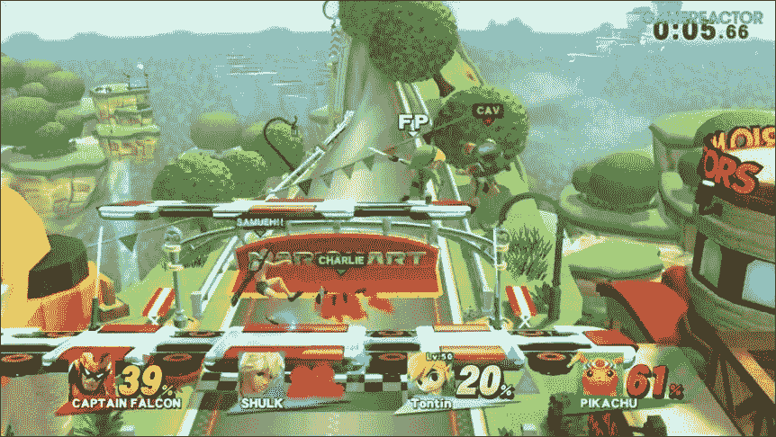

从人类身上学习是一个很好的起点，但我们进行强化学习的目标应该是实现超越人类的表现。此外，用这种方式训练的智能体将永远受到其能力的限制，而我们真正想要的是能够真正自我学习的智能体。在本章的其余部分，我们将介绍一些旨在超越人类水平的方法。

# 应用遗传算法玩游戏

长期以来，AI 在视频游戏环境中的最佳结果和大部分研究都围绕着遗传算法展开。这种方法涉及创建一组模块，这些模块接受参数以控制 AI 的行为。参数值的范围由一组基因的选择来确定。然后将创建一组代理，使用这些基因的不同组合，然后在游戏上运行。最成功的一组代理基因将被选择，然后将使用成功代理的基因的组合创建一个新的代理一代。这些代理再次在游戏上运行，直到达到停止条件，通常是达到最大迭代次数或游戏中的性能水平。偶尔，在创建新一代时，一些基因可以发生突变以创建新基因。一个很好的例子是 *MarI/O*，这是一个使用神经网络遗传演化学习玩经典的 SNES 游戏 *超级马里奥世界* 的 AI：

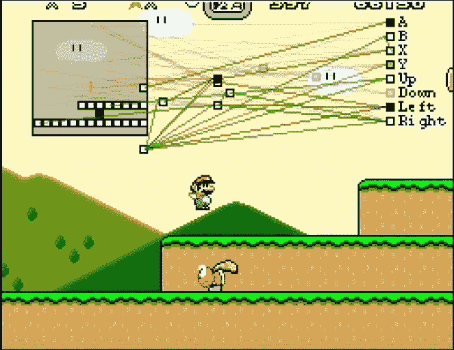

图 1：使用遗传算法学习马里奥（https://www.youtube.com/watch?v=qv6UVOQ0F44）

这些方法的一个很大的缺点是，它们需要大量的时间和计算能力来模拟所有参数的变化。每一代的每个成员都必须运行整个游戏直到终止点。该技术也没有利用游戏中人类可以使用的丰富信息。每当收到奖励或惩罚时，都会有关于状态和采取的行动的上下文信息，但遗传算法只使用运行的最终结果来确定适应度。它们不是那么多的学习而是试错。近年来，已经找到了更好的技术，利用反向传播来允许代理在玩耍时真正学习。与上一章一样，这一章也非常依赖代码；如果您不想花时间从页面上复制文本，您可以在 GitHub 仓库中找到所有代码：[`github.com/DanielSlater/PythonDeepLearningSamples`](https://github.com/DanielSlater/PythonDeepLearningSamples)。

# Q 学习

想象一下，我们有一个代理将在一个迷宫环境中移动，其中某处有一个奖励。我们的任务是尽快找到到达奖励的最佳路径。为了帮助我们思考这个问题，让我们从一个非常简单的迷宫环境开始：


图 2：一个简单的迷宫，代理可以沿着线移动从一个状态到另一个状态。如果代理到达状态 D，将获得奖励 4。

在所示的迷宫中，代理可以在任何节点之间来回移动，通过沿着线移动。代理所在的节点是它的状态；沿着线移动到不同的节点是一种行动。如果代理达到状态**D**的目标，就会得到**4**的奖励。我们希望从任何起始节点找到迷宫的最佳路径。

让我们思考一下这个问题。如果沿着一条直线移动将我们置于状态**D**，那么这将永远是我们想要采取的路径，因为这将在下一个时间步给我们**4**的奖励。然后退回一步，我们知道如果我们到达状态**C**，它直接通往**D**，我们可以获得那个 4 的奖励。

要选择最佳行动，我们需要一个能够为行动让我们置于的状态提供预期奖励的函数。在强化学习中，这个函数的名称是 Q 函数：

```py
  state, action => expected reward
```

如前所述，到达状态**D**的奖励是**4**。那么到达状态**C**的奖励应该是多少呢？从状态**C**，可以采取一个行动转移到状态**D**并获得**4**的奖励，所以也许我们可以将**C**的奖励设为**4**。但是如果我们在所示的迷宫中采取一系列随机行动，我们最终总是会到达状态**D**，这意味着每个行动都会获得相同的奖励，因为从任何状态，我们最终都会到达状态**D**的**4**奖励。

我们希望我们的预期奖励考虑到获得未来奖励需要的行动数。我们希望这种期望能够产生这样的效果，即当处于状态**A**时，我们直接转移到状态**C**而不是通过状态**B**，这将导致到达**D**需要更长的时间。所需的是一个考虑到未来奖励的方程，但与更早获得的奖励相比打折。

另一种思考这个问题的方式是考虑人们对待金钱的行为，这是对人们对待奖励的行为的良好代理。如果在一周后和十周后选择收到 1 美元的选择，人们通常会选择尽快收到 1 美元。生活在不确定的环境中，我们对以较少不确定性获得的奖励更加重视。我们推迟获得奖励的每一刻都是世界不确定性可能消除我们奖励的更多时间。

为了将这个应用于我们的代理，我们将使用用于评估奖励的时间差方程；它如下所示：

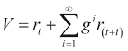

在这个方程中，*V* 是采取一系列动作的奖励，*r* [*t*] 是在这个序列中在时间 *t* 收到的奖励，*g* 是一个常数，其中 *0 < g < 1*，这意味着将来的奖励不如更早获得的奖励有价值；这通常被称为折扣因子。如果我们回到我们的迷宫，这个函数将为在一个动作中到达奖励的动作提供更好的奖励，而不是在两个或更多动作中到达奖励的动作。如果将 *g* 的值设为 1，方程简化为随时间的奖励总和。这在 Q 学习中很少使用；它可能导致代理不收敛。

## Q 函数

现在我们可以评估代理在迷宫中移动的路径，那么如何找到最优策略呢？对于我们的迷宫问题，简单的答案是，在面临动作选择时，我们希望选择导致最大奖励的动作；这不仅适用于当前动作，还适用于当前动作后我们将进入的状态的最大动作。

这个函数的名称是 Q 函数。如果我们有完美的信息，这个函数将给出我们在任何状态下的最优动作；它看起来如下：

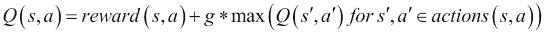

在这里，*s* 是一个状态，*a* 是在该状态下可以采取的动作，而 *0 < g < 1* 是折扣因子。*rewards* 是一个函数，它返回在某个状态下采取某个动作的奖励。*actions* 是一个函数，它返回在状态 *s* 中采取动作 *a* 后转移到的状态 *s'* 以及在该状态下所有可用的动作 *a'*。

让我们看看如果我们将 Q 函数应用于折扣因子为 *g=0.5* 的迷宫会是什么样子：

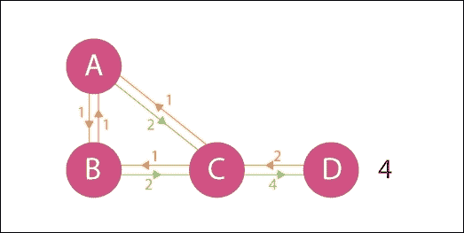

图 3：简单迷宫，现在带有 Q 值。箭头显示了在每个末端两个状态之间移动的预期奖励

您会注意到所示的 Q 函数是无限递归的。这是一个假设的完美 Q 函数，所以不是我们可以在代码中应用的东西。为了在代码中使用它，一个方法是简单地预先设定一个最大的动作数；那么它可能是这样的：

```py
def q(state, action, reward_func, apply_action_func, actions_for_state_func, max_actions_look_ahead, discount_factor=0.9):
    new_state = apply_action_func(state, action)
    if max_actions_look_ahead > 0:
        return reward_func(new_state) + discount_factor \ * max(q(new_state, new_action, reward_func, apply_action_func, actions_for_state_func, max_actions_look_ahead-1) 
for new_action in actions_for_state_func(new_state))
    else:
        return reward_func(new_state)
```

在这里，`state` 是定义环境状态的某个对象。`action` 是定义在状态中可以采取的有效动作的某个对象。`reward_func` 是一个函数，它返回给定状态的浮点值奖励。`apply_action_func` 返回将给定动作应用于给定状态后的新状态。`actions_for_state_func` 是一个函数，它返回给定状态的所有有效动作。

如果我们不必担心未来的奖励并且我们的状态空间很小，上述方法将获得良好的结果。它还要求我们能够准确地从当前状态模拟到未来状态，就像我们可以为棋盘游戏做的那样。但是，如果我们想要训练一个代理来玩动态电脑游戏，那么这些约束都不成立。当被提供来自电脑游戏的图像时，我们不知道在按下给定按钮后图像将会变成什么，或者我们将获得什么奖励，直到我们尝试为止。

# Q 学习的实践

一个游戏可能每秒有 16-60 帧，并且经常会根据许多秒前所采取的动作来获得奖励。此外，状态空间是广阔的。在电脑游戏中，状态包含作为游戏输入的屏幕上的所有像素。如果我们想象一个屏幕被降低到 80 x 80 像素，所有像素都是单色和二进制，黑色或白色，那仍然是 2⁶⁴⁰⁰ 个状态。这使得状态到奖励的直接映射变得不切实际。

我们需要做的是学习 Q 函数的近似值。这就是神经网络可以应用其通用函数近似能力的地方。为了训练我们的 Q 函数近似值，我们将存储游戏状态、奖励和我们的代理在游戏中采取的行动。我们网络的损失函数将是其对前一状态的奖励的近似值与其在当前状态获得的实际奖励之间的差的平方，加上其对游戏中达到的当前状态的奖励的近似值乘以折扣因子的差的平方：

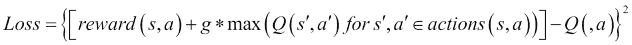

*s* 是先前的状态，*a* 是在该状态下采取的动作，而 *0 < g < 1* 是折扣因子。*rewards* 是返回在状态中采取行动的奖励的函数。*actions* 是返回在状态 *s* 中采取行动后你过渡到的 *s'* 状态和该状态中所有可用的动作 *a'*。*Q* 是先前介绍的 Q 函数。

通过以这种方式训练连续的迭代，我们的 Q 函数逼近器将慢慢收敛到真实的 Q 函数。

让我们先为世界上最简单的游戏训练 Q 函数。环境是一个一维状态地图。一个假设的代理必须通过向左或向右移动来最大化其奖励来导航迷宫。我们将为每个状态设置奖励如下：

```py
rewards = [0, 0, 0, 0, 1, 0, 0, 0, 0]
```

如果我们要可视化它，它可能会看起来像这样：


图 4：简单的迷宫游戏，代理可以在相连节点之间移动，并可以在顶部节点获得奖励 1。

如果我们把我们的代理放到这个“迷宫”中的第一个位置，他可以选择移动到 0 或 2 的位置。我们想要构建一个学习每个状态的价值的网络，并通过此可推断出采取移动到该状态的动作的价值。网络的第一次训练将仅学习每个状态的内在奖励。但在第二次训练中，它将利用从第一次训练中获得的信息来改进奖励的估计。在训练结束时，我们预期看到一个金字塔形状，在 1 个奖励空间中具有最大的价值，然后在离中心更远的空间上递减价值，因为您必须更进一步旅行，从而应用更多的未来折扣以获得奖励。以下是代码中的示例（完整示例在 Git 存储库中的`q_learning_1d.py`中）：

```py
import tensorflow as tf
import numpy as np

states = [0.0, 0.0, 0.0, 1.0, 0.0, 0.0, 0.0, 0.0, 0.0]
NUM_STATES = len(states)
```

我们创建一个`states`列表；列表中每个项的值是代理移动到该位置时获得的奖励。在这个示例中，它获得到第 5 个位置的奖励：

```py
NUM_ACTIONS = 2
DISCOUNT_FACTOR = 0.5

def one_hot_state(index):
    array = np.zeros(NUM_STATES)
    array[index] = 1.
    return array
```

这个方法将使用一个数字，并将其转换为我们状态空间的独热编码，例如，3 变为[0, 0, 0, 1, 0, 0, 0, 0, 0, 0]：

```py
session = tf.Session()
state = tf.placeholder("float", [None, NUM_STATES])
targets = tf.placeholder("float", [None, NUM_ACTIONS])
```

我们创建了一个 TensorFlow `session`和用于输入和目标的占位符；数组中的`None`用于小批量维度：

```py
weights = tf.Variable(tf.constant(0., shape=[NUM_STATES, NUM_ACTIONS]))
output = tf.matmul(state, weights)
```

对于这个简单的例子，我们可以使用状态和动作奖励之间的线性关系来准确地评估一切，所以我们只需要创建一个`output`层，它是`weights`的矩阵乘法。不需要隐藏层或任何非线性函数：

```py
loss = tf.reduce_mean(tf.square(output - targets))
train_operation = tf.train.GradientDescentOptimizer(0.05).minimize(loss)
session.run(tf.initialize_all_variables())
```

我们使用均方误差（MSE）作为损失函数和标准梯度下降训练。这就是我们最终将用作目标值的 Q-learning 的一部分：

```py
for _ in range(1000):
    state_batch = []
    rewards_batch = []

    for state_index in range(NUM_STATES):
        state_batch.append(one_hot_state(state_index))
```

我们创建一个`state_batch`，其中的每个项目都是游戏中的每个状态，以独热编码形式表示。例如，[1, 0, 0, 0, 0, 0, 0, 0, 0]，[0, 1, 0, 0, 0, 0, 0, 0, 0]，以此类推。然后，我们将训练网络来逼近每个状态的值：

```py
         minus_action_index = (state_index - 1) % NUM_STATES
         plus_action_index = (state_index + 1) % NUM_STATES
```

对于每个状态，我们现在获取如果我们从该状态采取每个可能动作后所在的位置。注意，在这个示例中，状态会循环，所以从位置 0 向-1 移动会使您处于位置 8：

```py
        minus_action_state_reward = session.run(output, feed_dict={state: [one_hot_state(minus_action_index)]})
        plus_action_state_reward = session.run(output, feed_dict={state: [one_hot_state(plus_action_index)]})
```

我们使用我们的网络，即我们的 q 函数近似器，来获取它认为如果我们采取每个动作（`minus_action_index`和`plus_action_index`），我们将获得的奖励，即网络认为我们在它将我们放入的状态中能够获得的奖励：

```py
        minus_action_q_value = states[minus_action_index] + DISCOUNT_FACTOR * np.max(minus_action_state_reward)

        plus_action_q_value = states[plus_action_index] + DISCOUNT_FACTOR * np.max(plus_action_state_reward)]
```

在这里，我们有了现在常见的 Q 函数方程的 Python 版本。我们将移动到一个状态的初始奖励与`DISCOUNT_FACTOR`乘以我们在该状态下采取的动作所能获得的最大奖励相加：

```py
action_rewards = [minus_action_q_value, plus_action_q_value]
rewards_batch.append(action_rewards)
```

我们将这些添加到`rewards_batch`中，它将用作训练操作的目标值：

```py
session.run(train_operation, feed_dict={
        state: state_batch,
        targets: rewards_batch})

print([states[x] + np.max(session.run(output, feed_dict={state: [one_hot_state(x)]}))
    for x in range(NUM_STATES)])
```

一旦我们获得了每个状态的完整奖励集，我们就会运行实际的训练步骤。如果我们运行此脚本并查看输出，我们可以感受到算法是如何迭代更新的。在第一次训练运行之后，我们看到了这个：

```py
[0.0, 0.0, 0.0, 0.05, 1.0, 0.05, 0.0, 0.0, 0.0, 0.0]

```

一切都是 0，除了奖励状态两边的项目。现在这两个状态基于你可以从它们移动到奖励方块上获得奖励。再向前走几步，你会发现奖励开始在状态之间传播：

```py
[0.0, 0.0, 0.013, 0.172, 1.013, 0.172, 0.013, 0.0, 0.0, 0.0]

```

此程序的最终输出将类似于这样：

```py
[0.053, 0.131, 0.295, 0.628, 1.295, 0.628, 0.295, 0.131, 0.053, 0.02]

```

正如你所看到的，数组中最高的奖励位于第五个位置，我们最初设置为有奖励的位置。但是我们给出的奖励只有 1；那么为什么这里的奖励比这个要高呢？这是因为 `1.295` 是在当前空间获得的奖励与我们可以在未来从这个空间移开并反复返回时获得的奖励的总和，这些未来的奖励通过我们的折扣因子 0.5 减少。

学习这种未来的无限奖励是好的，但是奖励通常是在执行具有固定结束的任务过程中学到的。例如，任务可能是在架子上堆放物体，当堆栈倒塌或所有物体都堆放完毕时结束。要将这个概念添加到我们的简单 1-D 游戏中，我们需要添加终端状态。这些将是达到后，任务就结束的状态；所以与其他任何状态相比，在评估其 Q 函数时，我们不会通过添加未来奖励来训练。要进行此更改，首先我们需要一个数组来定义哪些状态是终止状态：

```py
terminal = [False, False, False, False, True, False, False, False, False, False]
```

这将设置为第五个状态，我们从中获得奖励的状态为终止状态。然后，我们只需要修改我们的训练代码以考虑这个终止状态：

```py
        if terminal[minus_action_index]:
            minus_action_q_value = DISCOUNT_FACTOR * states[minus_action_index]
        else:
            minus_action_state_reward = session.run(output, feed_dict={state: [one_hot_state(minus_action_index)]})
            minus_action_q_value = DISCOUNT_FACTOR *(states[minus_action_index] + np.max(minus_action_state_reward))

        if terminal[plus_action_index]:
            plus_action_q_value = DISCOUNT_FACTOR * states[plus_action_index]
        else:
            plus_action_state_reward = session.run(output,
            feed_dict={state: [one_hot_state(plus_action_index)]})
            plus_action_q_value = DISCOUNT_FACTOR * (states[plus_action_index] + np.max(plus_action_state_reward))
```

如果我们现在再次运行代码，输出将稳定为这样：

```py
[0.049, 0.111, 0.242, 0.497, 1.0, 0.497, 0.242, 0.111, 0.0469, 0.018]

```

# 动态游戏

现在我们已经学习了世界上最简单的游戏，让我们尝试学习一些更加动态的内容。Cart pole 任务是一个经典的强化学习问题。代理必须控制一个小车，上面平衡着一个杆，通过一个关节连接到小车上。在每一步，代理可以选择将小车向左或向右移动，并且每一步平衡杆的时候都会获得奖励 1。如果杆与竖直方向偏差超过 15 度，游戏就结束：

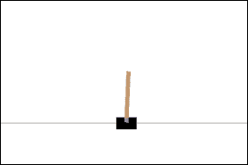

图 5：Cart pole 任务

要运行 Cart pole 任务，我们将使用 OpenAIGym，这是一个于 2015 年创建的开源项目，它以一致的方式提供了一种运行强化学习代理与一系列环境进行交互的方法。在撰写本文时，OpenAIGym 支持运行一系列 Atari 游戏，甚至还支持一些更复杂的游戏，如 doom，而且设置最少。可以通过运行以下命令来安装它：

```py
pip install gym[all]

```

在 Python 中运行 Cart pole 可以通过以下方式实现：

```py
import gym

env = gym.make('CartPole-v0')
current_state = env.reset()

```

`gym.make`方法创建了我们的代理将在其中运行的环境。传入`"CartPole-v0"`字符串告诉 OpenAIGym 我们希望这是车杆任务。返回的`env`对象用于与车杆游戏进行交互。`env.reset()`方法将环境置于其初始状态，并返回描述它的数组。调用`env.render()`将以可视方式显示当前状态，并对`env.step(action)`的后续调用允许我们与环境进行交互，以响应我们调用它的动作返回新的状态。

我们需要如何修改我们简单的一维游戏代码以学习车杆挑战？我们不再有一个明确定义的位置；相反，车杆环境将一个描述车和杆位置和角度的四个浮点值的数组作为输入给我们。这些将成为我们的神经网络的输入，它将由一个具有 20 个节点和一个`tanh`激活函数的隐藏层组成，导致一个具有两个节点的输出层。一个输出节点将学习当前状态向左移动的预期奖励，另一个输出节点将学习当前状态向右移动的预期奖励。以下是代码示例（完整的代码示例在 git repo 的`deep_q_cart_pole.py`中）：

```py
feed_forward_weights_1 = tf.Variable(tf.truncated_normal([4,20], stddev=0.01))
feed_forward_bias_1 = tf.Variable(tf.constant(0.0, shape=[20]))

feed_forward_weights_2 = tf.Variable(tf.truncated_normal([20,2], stddev=0.01))
feed_forward_bias_2 = tf.Variable(tf.constant(0.0, shape=[2]))

input_placeholder = tf.placeholder("float", [None, 4])
hidden_layer = tf.nn.tanh(tf.matmul(input_placeholder, feed_forward_weights_1) + feed_forward_bias_1)
output_layer = tf.matmul(hidden_layer, feed_forward_weights_2) + feed_forward_bias_2 
```

为什么使用一个具有 20 个节点的隐藏层？为什么使用`tanh`激活函数？挑选超参数是一门黑暗的艺术；我能给出的最好答案是，当尝试时，这些值表现良好。但是知道它们在实践中表现良好，以及知道一些关于解决车杆问题需要什么样的复杂程度的信息，我们可以猜测为什么这可能指导我们选择其他网络和任务的超参数。

一个关于在监督学习中隐藏节点数量的经验法则是，它应该在输入节点数量和输出节点数量之间。通常，输入数量的三分之二是一个不错的区域。然而，在这里，我们选择了 20，是输入节点数量的五倍。一般来说，偏爱更少的隐藏节点有两个原因：第一个是计算时间，更少的单元意味着我们的网络运行和训练速度更快。第二个是减少过拟合并提高泛化能力。你已经从前面的章节中了解到了过拟合以及过于复杂模型的风险，即它完全学习了训练数据，但没有能力泛化到新数据点。

在强化学习中，这些问题都不那么重要。虽然我们关心计算时间，但通常瓶颈大部分时间花在运行游戏上；因此，额外的几个节点不太重要。对于第二个问题，在泛化方面，我们没有测试集和训练集的划分，我们只有一个环境，一个代理人在其中获得奖励。因此，过度拟合不是我们必须担心的事情（直到我们开始训练能够跨多个环境运行的代理人）。这也是为什么你经常看不到强化学习代理人使用正则化器的原因。这个警告是，随着训练过程的进行，我们的训练集的分布可能会因为我们的代理人在训练过程中的变化而发生显著变化。存在的风险是代理人可能会对我们从环境中获得的早期样本过度拟合，并导致学习在后来变得更加困难。

鉴于这些问题，选择隐藏层中的任意大数量节点是有意义的，以便给予最大可能性学习输入之间的复杂交互。但是唯一真正的方法是测试。*图 6*显示了运行具有三个隐藏节点的神经网络与小车杆任务的结果。正如您所看到的，尽管它最终能够学会，但其表现远不及具有 20 个隐藏节点的情况，如*图 7*所示：

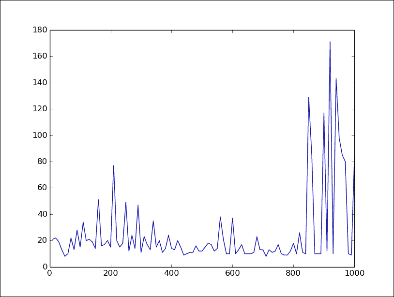

图 6：具有三个隐藏节点的小车杆，y = 最近 10 场比赛的平均奖励，x = 已玩的比赛

为什么只有一个隐藏层？任务的复杂性可以帮助我们估计这一点。如果我们考虑小车杆任务，我们知道我们关心输入参数的相互关系。杆的位置可能好也可能不好，这取决于小车的位置。这种交互水平意味着仅仅是权重的纯线性组合可能不够。通过快速运行，这个猜测可以得到确认，它将显示出尽管没有隐藏层的网络可以比随机更好地学习这个任务，但它的表现远不如单隐藏层网络。

更深的网络会更好吗？也许，但是对于只有这种轻微复杂性的任务来说，更多的层次往往不会改善事情。运行网络将确认额外的隐藏层似乎几乎没有什么影响。一个隐藏层为我们提供了我们在这个任务中所需要的容量。

至于选择*tanh*，有几个因素需要考虑。relu 激活函数之所以在深度网络中流行，是因为饱和。当运行一个具有激活函数范围受限的多层网络时，例如 logistic 函数的 0 到 1，许多节点会学会在接近 1 的最大值处激活。它们在 1 处饱和。但我们经常希望在输入更极端时信号更明显。这就是为什么 relu 如此流行的原因——它给一个层增加了非线性，同时不限制其最大激活。这在许多层网络中尤为重要，因为早期层可能会获得极端的激活，这对于向未来层发出信号是有用的。

只有一个层时，这不是一个问题，所以 sigmoid 函数是合理的。输出层将能够学习将来自我们隐藏层的值缩放到它们需要的值。有没有理由更喜欢 `tanh` 而不是 logistic 函数呢？我们知道我们的目标有时会是负数，并且对于一些参数组合，这可能是好的或坏的，具体取决于它们的相对值。这表明，提供由 `tanh` 函数提供的 -1 到 1 的范围可能比 logistic 函数更可取，其中要判断负相关性，首先必须学习偏差。这是事后的大量推测和推理；最好的答案最终是这种组合在这个任务中非常有效，但希望它能够在面对其他类似问题时给出一些最佳超参数的开始猜测的感觉。

要回到代码，我们的损失和训练函数在我们的推车杆任务中将是这样的：

```py
action_placeholder = tf.placeholder("float", [None, 2])
target_placeholder = tf.placeholder("float", [None])

q_value_for_state_action = tf.reduce_sum(tf.mul(output_layer, action_placeholder),reduction_indices=1)
```

`q_value_for_state_action` 变量将是网络为给定状态和动作预测的 `q-value`。将 `output_layer` 乘以 `action_placeholder` 向量，除了我们采取的动作外，其他所有值都将为 0，然后对其求和，这意味着我们的输出将是我们的神经网络对于仅仅那个动作的预期值的近似：

```py
cost = tf.reduce_mean(tf.square(target_placeholder – 
                        q_value_for_state_action))
train_operation = tf.train.RMSPropOptimizer(0.001).minimize(cost)
```

我们的成本是我们认为的状态和动作的预期回报与由 `target_placeholder` 定义的应该是的回报之间的差异。

描述在第七章*棋盘游戏的深度学习*中的策略梯度方法的一个缺点是，所有训练都必须针对环境进行。一组策略参数只能通过观察其对环境奖励的影响来评估。而在 Q 学习中，我们试图学习如何评估一个状态和动作的价值。随着我们对特定状态价值的理解能力提高，我们可以利用这些新信息更好地评估我们曾经经历过的先前状态。因此，与其总是在当前经历的状态上进行训练，我们可以让我们的网络存储一系列状态，并针对这些状态进行训练。这被称为**经验回放**。

## 经验回放

每次我们采取一个动作并进入一个新状态时，我们都会存储一个元组`previous_state, action_taken, next_reward, next_state`和`next_terminal`。这五个信息片段就足以运行一个 Q 学习训练步骤。当我们玩游戏时，我们将把这些信息存储为一系列观察。

另一个经验回放有助于解决的困难是，在强化学习中，训练很难收敛。部分原因是我们训练的数据之间存在非常强的相关性。学习代理人经历的一系列状态将密切相关；如果一系列状态和行动的时间序列一起训练，会对网络的权重产生很大影响，并可能撤销大部分之前的训练。神经网络的一个假设是训练样本都是来自某个分布的独立样本。经验回放有助于解决这个问题，因为我们可以让训练的小批量样本从内存中随机抽样，这样样本之间就不太可能相关。

从记忆中学习的学习算法称为离线学习算法。另一种方法是在线学习，其中我们只能根据直接玩游戏来调整参数。策略梯度、遗传算法和交叉熵方法都是其示例。

运行带有经验回放的车杆的代码如下：

```py
from collections import deque
observations = deque(maxlen=20000)
last_action = np.zeros(2)
last_action[0] = 1
last_state = env.reset()
```

我们从我们的`observations`集合开始。在 Python 中，一个 deque 是一个队列，一旦达到容量就会开始从队列开头删除项目。在这里创建 deque 时，其 maxlen 为 20,000，这意味着我们只会存储最近的 20,000 个观察。我们还创建了最后一个动作，`np.array`，它将存储我们从上一个主循环中决定的动作。它将是一个独热向量：

```py
while True:
    env.render()
    last_action = choose_next_action(last_state)
    current_state, reward, terminal, _ = env.step(np.argmax(last_action))
```

这是主循环。我们首先渲染环境，然后根据我们所处的`last_state`决定采取什么动作，然后采取该动作以获得下一个状态：

```py
    if terminal:
        reward = -1
```

OpenAIGym 中的小车杆任务始终在每个时间步长给出奖励 1。当我们达到终止状态时，我们将强制给予负奖励，以便代理有信号学习避免它：

```py
    observations.append((last_state, last_action, reward, current_state, terminal))
    if len(observations) > 10000:
        train()
```

我们将此转换的信息存储在我们的观察数组中。如果我们有足够的观察结果存储，我们也可以开始训练。只有在我们有足够多的样本时才开始训练非常重要，否则少量早期观察结果可能会严重偏倚训练：

```py
   if terminal:
        last_state = env.reset()
   else:
        last_state = current_state
```

如果我们处于终止状态，我们需要`重置`我们的`env`以便给我们一个新的游戏状态。否则，我们可以将`last_state`设置为下一个训练循环的`current_state`。我们现在还需要根据状态决定采取什么行动。然后是实际的`train`方法，使用与我们之前的 1-D 示例相同的步骤，但改为使用来自我们观察的样本：

```py
def _train():
    mini_batch = random.sample(observations, 100)
```

从我们的观察中随机取 100 个项目；这些将是要进行训练的`mini_batch`：

```py
    previous_states = [d[0] for d in mini_batch]
    actions = [d[1] for d in mini_batch]
    rewards = [d[2] for d in mini_batch]
    current_states = [d[3] for d in mini_batch]
```

将`mini_batch`元组解包为每种类型数据的单独列表。这是我们需要馈入神经网络的格式：

```py
    agents_reward_per_action = session.run(_output_layer, feed_dict={input_layer: current_states})
```

获取由我们的神经网络预测的每个`current_state`的奖励。这里的输出将是一个大小为`mini_batch`的数组，其中每个项目都是一个包含两个元素的数组，即采取左移动作的 Q 值估计和采取右移动作的 Q 值估计。我们取其中的最大值以获取状态的估计 Q 值。连续的训练循环将改进此估计值以接近真实的 Q 值：

```py
    agents_expected_reward = []
    for i in range(len(mini_batch)):
        if mini_batch[i][4]:
            # this was a terminal frame so there is no future reward...
            agents_expected_reward.append(rewards[i])
        else:
            agents_expected_reward.append(rewards[i] + FUTURE_REWARD_DISCOUNT * np.max(agents_reward_per_action[i]))
```

如果是非终止状态，将我们实际获得的奖励与我们的网络预测的奖励相结合：

```py
    session.run(_train_operation, feed_dict={
        input_layer: previous_states,
        action: actions,
        target: agents_expected_reward})
```

最后，对网络运行训练操作。

## Epsilon 贪心

Q 学习的另一个问题是，最初，网络会非常糟糕地估计动作的奖励。但是这些糟糕的动作估计决定了我们进入的状态。我们早期的估计可能非常糟糕，以至于我们可能永远无法从中学习到奖励的状态。想象一下，在小车杆中，网络权重被初始化，使代理始终选择向左移动，因此在几个时间步长后失败。因为我们只有向左移动的样本，所以我们永远不会开始调整我们的权重以向右移动，因此永远无法找到具有更好奖励的状态。

对此有几种不同的解决方案，例如为网络提供进入新颖情境的奖励，称为新颖性搜索，或者使用某种修改来寻找具有最大不确定性的动作。

最简单的解决方案，也是被证明效果良好的解决方案之一，是从随机选择动作开始，以便探索空间，然后随着网络估计变得越来越好，将这些随机选择替换为网络选择的动作。这被称为 epsilon 贪心策略，它可以作为一种轻松实现一系列算法的探索方法。这里的 epsilon 是指用于选择是否使用随机动作的变量，贪心是指如果不是随机行动，则采取最大行动。在单车杆示例中，我们将这个 epsilon 变量称为`probability_of_random_action`。它将从 1 开始，表示 0 的随机动作几率，然后在每个训练步骤中，我们将其减小一些小量，直到它为 0 为止：

```py
if probability_of_random_action > 0.and len(_observations) > OBSERVATION_STEPS:
 probability_of_random_action -= 1\. / 10000
```

在最后一步，我们需要的是将我们的神经网络输出转换为智能体动作的方法：

```py
def choose_next_action():
    if random.random() <= probability_of_random_action:
        action_index = random.randrange(2)
```

如果随机值小于`probability_of_random_action`，则随机选择一个动作；否则选择我们神经网络的最大输出：

```py
    else:
        readout_t = session.run(output_layer, feed_dict={input_layer: [last_state]})[0]
        action_index = np.argmax(readout_t)
    new_action = np.zeros([2])
new_action[action_index] = 1
return new_action
```

这是训练进度与单车杆任务的图表：

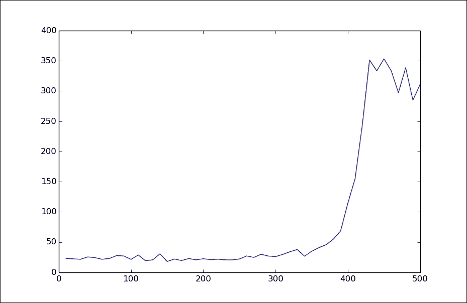

图 7：单车杆任务，y = 过去 10 次游戏的平均长度 x = 所玩游戏的数量

看起来很不错。单车杆任务的成功定义为能够持续超过 200 轮。在 400 次游戏后，我们轻松击败了这个标准，平均每局游戏持续时间远远超过 300 轮。因为我们使用 OpenAIGym 设置了这个学习任务，现在可以轻松地设置到其他游戏中。我们只需要将`gym.make`行更改为以新输入游戏字符串为输入，然后调整我们网络的输入和输出数量以适应该游戏。在 OpenAIGym 中还有一些其他有趣的控制任务，例如摆锤和杂技，q-learning 在这些任务上也应该表现良好，但作为挑战，让我们来玩一些 Atari 游戏。

# Atari Breakout

Breakout 是一款经典的 Atari 游戏，最初于 1976 年发布。玩家控制一个挡板，必须用它将球弹到屏幕顶部的彩色方块上。每次命中一个方块都会得分。如果球下落到屏幕底部超出挡板范围，玩家将失去一条生命。游戏在所有方块被销毁或玩家失去最初的三条生命后结束：

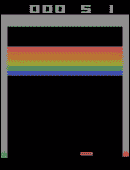

图 8：Atari Breakout

想想学习像 Breakout 这样的游戏比我们刚刚看过的单车杆任务要难多少。对于单车杆来说，如果做出了导致杆倾斜的错误动作，我们通常会在几个动作内收到反馈。在 Breakout 中，这样的反馈要少得多。如果我们将挡板定位不正确，可能是因为进行了 20 多次移动才导致的。

## Atari Breakout 随机基准测试

在我们进一步探讨之前，让我们创建一个通过随机选择移动来玩 Breakout 的代理程序。这样，我们将有一个基准来评价我们的新代理程序：

```py
from collections import deque

import random
import gym
import numpy as np

env = gym.make("Breakout-v0")
observation = env.reset()
reward_per_game = 0
scores = dequeu(maxlen=1000)

while True:
    env.render()

    next_action = random.randint(1, 3)
    observation, reward, terminal, info = env.step(next_action)
    reward_per_game += reward
```

我们随机选择我们的移动方向；在 Breakout 中，移动的方式如下：

+   1：向左移动

+   2：保持静止

+   3：向右移动

```py
    if terminal:
        scores.append(reward_per_game)
        reward_per_game = 0
        print(np.mean(scores))
        env.reset()

```

如果我们已经玩了很多游戏，那么我们将存储并打印我们的分数，然后调用`env.reset()`继续玩。通过让这个运行一段时间，我们可以看到随机 Breakout 倾向于每场比赛得分约为 1.4 分。让我们看看我们能用 Q-learning 做得更好多少。

我们必须处理的第一个问题是从我们的车杆任务中进行调整的状态空间要大得多。对于车杆输入，是 210 x 160 像素的完整屏幕，每个像素包含三个浮点数，分别是每种颜色的值。要理解游戏，这些像素必须与方块、球拍和球相关联，然后这些物体之间的交互必须在某种程度上被计算。更让事情变得更加困难的是，单个屏幕图像不足以理解游戏正在发生什么。球随时间以某种速度移动；要理解最佳移动，你不能仅仅依赖于当前屏幕图像。

处理这个问题有三种方法：一种是使用递归神经网络，它将根据先前的输出来判断当前状态。这种方法可以奏效，但训练难度较大。另一种方法是将屏幕输入作为当前帧和上一帧之间的增量。在*图 9*中，你会看到一个例子。由于在 Pong 中颜色并没有提供信息，因此两个帧都已经被转换为灰度。上一帧的图像已从当前帧的图像中减去。这可以让你看到球的路径和两个球拍移动的方向：

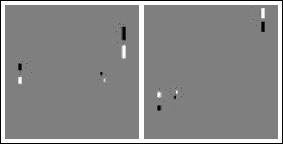

图 9：Pong 游戏的增量图像

这种方法对于只由移动元素组成的游戏（如 Pong）效果很好，但对于像 Breakout 这样的游戏，其中方块的位置是固定的，我们将丢失有关游戏状态的重要信息。事实上，我们只能在方块被击中时看到它的一瞬间，而我们尚未击中的方块将保持不可见。

对于 Breakout，我们将采取的第三种方法是将当前状态设置为游戏最近 *n* 个状态的图像，其中 *n* 为 2 或更多。这允许神经网络拥有做出对游戏状态的良好判断所需的所有信息。对于大多数游戏来说，默认值 *n* 为 4 是很好的选择；但对于 Breakout，已经发现 *n* 为 2 就足够了。尽可能使用较低的 *n* 值是很好的，因为这会减少我们的网络所需的参数数量。

## 屏幕预处理

全部代码在 Git 存储库中的`deep_q_breakout.py`中。但我们将在此处逐个讨论与杆平衡示例的一些重要修改。首先是神经网络的类型。对于杆平衡，一个具有单个隐藏层的网络就足够了。但这涉及到将四个值映射到只有两个动作。现在，我们要处理`screen_width * screen_height * color_channels * number_of_frames_of_state = 201600`被映射到三个动作，这是一个更高级别的复杂度。

我们可以做的第一件事是将屏幕调整大小，以便为自己省点力。经过实验，我们发现可以将屏幕缩小后仍可玩 Breakout。缩小两倍仍可看到球，球拍和所有方块。而且，图像空间中大部分都不是对代理有用的信息，顶部的得分、侧面和顶部的灰色区域，以及底部的黑色空间都可以从图像中裁剪掉。这使我们能够将 210 * 160 的屏幕缩减为更容易管理的 72 * 84，将参数数量减少了四分之三以上。

在 Breakout 游戏中，像素的颜色不包含任何有用的信息，所以我们可以用单一颜色代替三种颜色，这只有黑色或白色，将输入的数量再次减少到三分之一。现在我们只剩下 72 * 84 = 6048 个位，需要两帧的游戏才能学习。我们现在来写一个方法来处理 Breakout 的屏幕：

```py
def pre_process(screen_image):
```

`screen_image`参数将是我们从 OpenAIGym 的`env.reset`或`env.next_step`操作中获得的 Numpy 数组。它的形状为 210 * 160 * 3，每个项都是表示该颜色值的 0 到 255 之间的整数：

```py
    screen_image = screen_image[32:-10, 8:-8]
```

对 Numpy 数组的这个操作裁剪了图像，因此我们去掉了顶部的分数，底部的黑色空间和两侧的灰色区域：

```py
    screen_image = screen_image[::2, ::2, 0]
```

Python 数组的`::2`参数意味着我们取每隔一个项目，幸运的是 Numpy 也支持这种操作。末尾的 0 表示我们只取红色通道，这很好，因为我们马上就要把它变成只有黑白两种颜色。`screen_image`现在将被处理成 72 * 84 * 1 的大小：

```py
    screen_image[screen_image != 0] = 1
```

这将图像中不是完全黑色的一切设为 1。这在一些需要精确对比度的游戏中可能行不通，但对于 Breakout 游戏来说就有效了：

```py
    return screen_image.astype(np.float)
```

最后，这个方法返回的`screen_image`确保类型转换成浮点数。这会在以后将值放入 TensorFlow 时节省时间。*图 10*展示了处理前后屏幕的样子。经过处理后，尽管不太美观，图像仍然包含你玩游戏所需的所有元素：

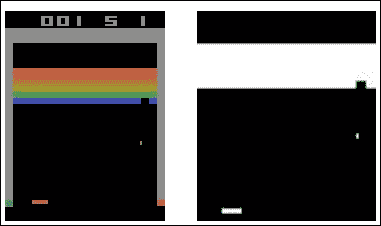

图 10：处理前后的 Breakout 样子

这使我们的状态为 72*84*2 = 12800 位，意味着我们需要将我们的三个动作映射到 *2*^(*12800*) 种可能的状态。这听起来很多，但问题变得更简单了，因为尽管这是打砖块游戏中可能的所有状态的完整范围，但只有一组相当小且可预测的状态会发生。挡板在固定区域水平移动；一个像素将激活球，一些方块将存在于中央区域。可以很容易地想象从图像中提取出一些特征，这些特征可能更好地与我们想要采取的动作相关联 —— 例如，我们的挡板与球的相对位置、球的速度等 —— 这是深度神经网络可以捕捉到的特征。

## 创建一个深度卷积网络

接下来，让我们用一个深度卷积网络来替换小车摆动示例中的单隐藏层网络。卷积网络首次出现在 第四章，“无监督特征学习”。卷积网络是有意义的，因为我们处理的是图像数据。我们创建的网络将有三个卷积层，导致一个单一的平坦层，导致我们的输出。使用四个隐藏层有一定的直观意义，因为我们知道我们将需要从像素中检测非常抽象的不变表示，但也已经被证明对于一系列架构是成功的。因为这是一个深度网络，relu 激活函数是有意义的。*图 11* 显示了网络的样子：

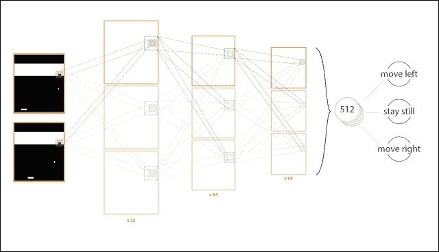

图 11：我们的网络架构，将学习玩打砖块游戏。

这是创建我们的深度卷积网络的代码：

```py
SCREEN_HEIGHT = 84
SCREEN_WIDTH = 74
STATE_FRAMES = 2

CONVOLUTIONS_LAYER_1 = 32
CONVOLUTIONS_LAYER_2 = 64
CONVOLUTIONS_LAYER_3 = 64
FLAT_HIDDEN_NODES = 512
```

这些常量将在我们的 `create_network` 方法中使用：

```py
def create_network():
    input_layer = tf.placeholder("float", [None, SCREEN_HEIGHT, SCREEN_WIDTH, STATE_FRAMES])
```

我们将我们的输入定义为高度、宽度和状态帧的乘积；none 维度将用于状态批次：

```py
convolution_weights_1 = tf.Variable(tf.truncated_normal([8, 8, STATE_FRAMES, CONVOLUTIONS_LAYER_1], stddev=0.01))
    convolution_bias_1 = tf.Variable(tf.constant(0.01, shape=[CONVOLUTIONS_LAYER_1]))
```

第一个卷积层将是一个 8x8 的窗口，跨越宽度和高度，同时接收状态帧。因此，它将获得关于当前图像的 8x8 部分和上一帧中该 8x8 补丁是什么样子的数据。每个补丁将映射到 32 个卷积，将成为下一层的输入。我们给偏置一个非常轻微的正值；这对于具有 relu 激活的层来说可能是有好处的，以减少 relu 函数造成的死神经元数量：

```py
    hidden_convolutional_layer_1 = tf.nn.relu(
        tf.nn.conv2d(input_layer, convolution_weights_1,         strides=[1, 4, 4, 1], padding="SAME") + convolution_bias_1)
```

我们将权重和偏置变量放入卷积层中。这是通过 `tf.nn.conv2d` 方法创建的。设置 `strides=[1, 4, 4, 1]` 意味着 8x8 的卷积窗口将在图像的宽度和高度上每四个像素应用一次。所有的卷积层都将通过 relu 激活函数：

```py
    convolution_weights_2 = tf.Variable(tf.truncated_normal([4, 4, CONVOLUTIONS_LAYER_1, CONVOLUTIONS_LAYER_2], stddev=0.01))
    convolution_bias_2 = tf.Variable(tf.constant(0.01, shape=[CONVOLUTIONS_LAYER_2]))

    hidden_convolutional_layer_2 = tf.nn.relu(
        tf.nn.conv2d(hidden_convolutional_layer_1, convolution_weights_2, strides=[1, 2, 2, 1], padding="SAME") + convolution_bias_2)
    convolution_weights_3 = tf.Variable(tf.truncated_normal([3, 3, CONVOLUTIONS_LAYER_2, CONVOLUTIONS_LAYER_3], stddev=0.01))
    convolution_bias_3 = tf.Variable(tf.constant(0.01, shape=[CONVOLUTIONS_LAYER_2]))
    hidden_convolutional_layer_3 = tf.nn.relu(
        tf.nn.conv2d(hidden_convolutional_layer_2, convolution_weights_3, strides=[1, 1, 1, 1], padding="SAME") + convolution_bias_3)
```

创建接下来的两个卷积层的步骤与之前相同。我们的最后一个卷积层`hidden_convolutional_layer_3`现在必须连接到一个扁平层：

```py
    hidden_convolutional_layer_3_flat = tf.reshape(hidden_convolutional_layer_3, [-1, 9*11*CONVOLUTIONAL_LAYER_3])
```

这将把我们的卷积层重新整形为单个扁平层，其维度为 none，9，11，64：

```py
    feed_forward_weights_1 = tf.Variable(tf.truncated_normal([FLAT_SIZE, FLAT_HIDDEN_NODES], stddev=0.01))
    feed_forward_bias_1 = tf.Variable(tf.constant(0.01, shape=[FLAT_HIDDEN_NODES]))

    final_hidden_activations = tf.nn.relu(
        tf.matmul(hidden_convolutional_layer_3_flat, feed_forward_weights_1) + feed_forward_bias_1)

    feed_forward_weights_2 = tf.Variable(tf.truncated_normal([FLAT_HIDDEN_NODES, ACTIONS_COUNT], stddev=0.01))
    feed_forward_bias_2 = tf.Variable(tf.constant(0.01, shape=[ACTIONS_COUNT]))

    output_layer = tf.matmul(final_hidden_activations, feed_forward_weights_2) + feed_forward_bias_2

    return input_layer, output_layer
```

我们接着按照标准方式创建最后两个扁平层。请注意，最后一层没有激活函数，因为我们在这里学习的是给定状态下动作的价值，它具有无界范围。

现在我们的主循环需要添加以下代码，以便当前状态是多个帧的组合，在打砖块游戏中，`STATE_FRAMES`设置为`2`，但较高的数字也会起效：

```py
screen_binary = preprocess(observation)

if last_state is None:
last_state = np.stack(tuple(screen_binary for _ in range(STATE_FRAMES)), axis=2)
```

如果我们没有`last_state`，那么我们就构造一个新的 Numpy 数组，它只是当前的`screen_binary`堆叠了我们想要的`STATE_FRAMES`次：

```py
else:
 screen_binary = np.reshape(screen_binary, (SCREEN_HEIGHT, SCREEN_WIDTH, 1))
 current_state = np.append(last_state[:, :, 1:], screen_binary, axis=2)
```

否则，我们将新的`screen_binary`添加到我们的`last_state`的第一个位置以创建新的`current_state`。然后我们只需要记住在主循环结束时将我们的`last_state`重新分配为等于我们的当前状态：

```py
last_state = current_state
```

现在可能遇到的一个问题是，我们的状态空间现在是一个大小为 84*74*2 的数组，并且我们想要以 100 万个这样的数组的顺序作为过去观察的列表，用于训练。除非您的计算机非常强大，否则可能会遇到内存问题。幸运的是，这些数组中很多将是非常稀疏的，并且只包含两种状态，因此可以使用内存压缩来解决这个问题。这将牺牲一些 CPU 时间来节省内存；因此在使用之前，请考虑哪个对您更重要。在 Python 中实现它只需要几行代码：

```py
import zlib
import pickle

observations.append(zlib.compress(
pickle.dumps((last_state, last_action, reward, current_state, terminal), 2), 2))
```

在这里，我们压缩数据然后将其添加到我们的观察列表中:

```py
mini_batch_compressed = random.sample(_observations, MINI_BATCH_SIZE)
mini_batch = [pickle.loads(zlib.decompress(comp_item)) for comp_item in mini_batch_compressed]
```

当从列表中取样时，我们只在使用时解压我们的小批量样本。

我们可能遇到的另一个问题是，尽管推车杆可能只需要几分钟就能训练好，但打砖块的训练时间可能会以天计算。为了防止出现意外情况，比如断电关机，我们希望在训练过程中随时保存我们的网络权重。在 Tensorflow 中，这只需要几行代码：

```py
CHECKPOINT_PATH = "breakout"

saver = tf.train.Saver()

if not os.path.exists(CHECKPOINT_PATH):
    os.mkdir(CHECKPOINT_PATH)

checkpoint = tf.train.get_checkpoint_state(CHECKPOINT_PATH)
if checkpoint:
    saver.restore(session, checkpoint.model_checkpoint_path)
```

这可以放在文件的开头，就在`session.run(tf.initialize_all_variables())`这一行上面。然后我们只需执行以下命令：

```py
saver.save(_session, CHECKPOINT_PATH + '/network')
```

这意味着每隔几千次训练迭代都要创建我们网络的定期备份。现在让我们看一下训练的效果如何：

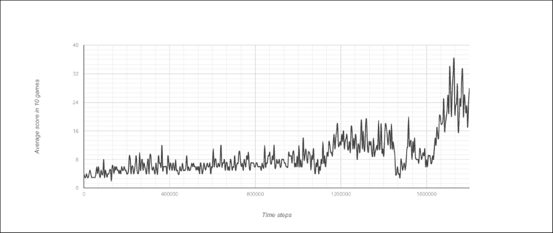

我们可以看到，在 170 万次迭代后，我们玩的水平远远超出了随机水平。这种相同的 Q 学习算法已经尝试过多种 Atari 游戏，并且通过良好的超参数调整，在 Pong、Space Invaders 和 Q*bert 等游戏中能够达到人类水平或更高的表现。

## Q 学习中的收敛问题

但是，并不是一帆风顺的。让我们看看在前面序列结束后代理的训练如何继续：

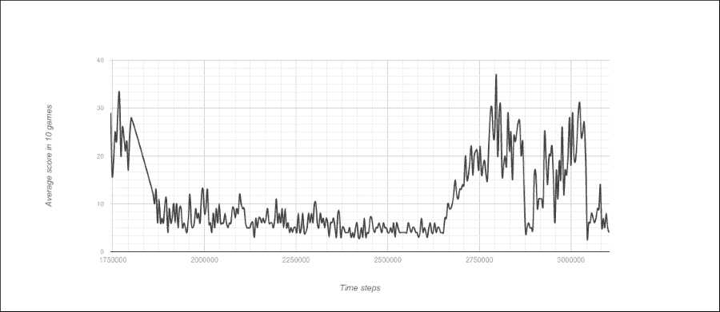

如您所见，在某个时刻，代理的能力出现了巨大且持续的下降，然后回到了类似的水平。这种情况的可能原因（尽管我们很难确切知道原因）之一是 Q 学习的问题之一。

Q 学习是针对其自身对状态动作对的表现期望进行训练的。这是一个移动的目标，因为每次运行训练步骤时，目标都会发生变化。我们希望它们朝着对奖励更准确的估计值的方向移动。但随着它们朝着那里前进，参数的小变化可能会导致相当极端的振荡。

一旦我们陷入了比先前的能力评估更差的状态，每个状态动作评估都必须调整到这个新现实。如果我们每场比赛平均得分为 30 分，而通过我们的新策略，我们只能得到 20 分，整个网络都必须调整到这个情况。

目标网络冻结（Minh 等人 2015 年，《通过深度强化学习实现人类水平控制》- 自然）可以帮助减少这种情况。第二个神经网络，称为目标网络，被创建为主训练网络的副本。在训练期间，我们使用目标网络生成用于训练主神经网络的目标值。通过这种方式，主网络正在学习针对更固定的点。目标网络的权重被冻结，但一旦过了一定数量的迭代次数或达到收敛标准，目标网络就会更新为来自主网络的值。已经证明，这个过程可以显著加快训练速度。

很多强化学习可能遇到的另一个问题与具有相当极端奖励的游戏相关。例如，吃下力量丸然后吃掉鬼魂给予了非常高的奖励。这些接收到的极端奖励可能会导致梯度问题，并导致次优学习。修复这个问题的非常简单但不够令人满意的方法叫做奖励剪切，它只是将从环境中接收到的奖励剪切在某个范围内（-1 和 +1 常用）。这种方法花费很少的精力，但它的问题在于代理已经丢失了关于这些更大奖励的信息。

另一种方法是所谓的归一化深度 Q 网络（**Hasselt 等人——跨多个数量级学习价值，2016)**。这涉及将神经网络设置为在 -1 到 1 范围内输出状态和动作的预期奖励。将输出放入此范围后，它通过以下方程进行处理：

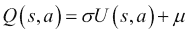

这里，*U(s, a)* 是神经网络的输出。参数 σ 和 µ 可以通过确保目标网络和主网络之间的缩放输出保持恒定来计算出，如目标网络冻结中所述：

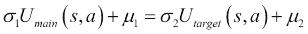

使用这种方法，神经网络梯度将更多地指向学习状态和动作的相对值，而不是简单地消耗精力学习 Q 值的规模。

## 策略梯度与 Q 学习

虽然我们举了一个例子，使用策略梯度来学习棋盘游戏，使用 Q 学习来学习计算机游戏，但这两种技术并不局限于此类型。最初，Q 学习被认为是更好的技术，但随着时间的推移和更好的超参数调整，策略梯度常常表现更好。1991 年利用神经网络和 Q 学习在博弈中取得了世界最佳表现，最新研究表明策略梯度对大多数雅达利游戏效果最佳。那么何时应该使用策略梯度而不是 Q 学习呢？

一个限制是，Q 学习只适用于离散动作任务，而策略梯度可以学习连续动作任务。此外，Q 学习是确定性算法，对于某些任务，最佳行为涉及一定程度的随机性。例如，石头、剪刀、布，任何偏离纯随机性的行为都可能被对手利用。

也存在在线学习与离线学习的方面。对于许多任务，特别是机器人控制任务，在线学习可能非常昂贵。需要从记忆中学习的能力，因此 Q 学习是最佳选择。不幸的是，无论是 Q 学习还是策略梯度的成功都会受到任务和超参数选择的影响很大；因此，在确定新任务的最佳学习方法时，实验似乎是最好的方法。

策略梯度也更容易陷入局部最小值。Q 学习更有可能找到全局最优解，但这样做的成本是未经证实的收敛，性能可能在达到全局最优解的过程中发生剧烈波动或完全失败。

但也有另一种方法，它兼具两者的优点，这就是演员-评论员方法。

# 演员-评论员方法

强化学习方法可以分为三大类：

+   **基于价值的学习**：这个方法试图学习处于某个状态的预期奖励/价值。然后可以根据其相对值来评估进入不同状态的可取性。Q 学习就是基于价值的学习的例子。

+   **基于策略的学习**：在这种方法中，不尝试评估状态，而是尝试不同的控制策略，并根据环境的实际奖励进行评估。策略梯度就是例子。

+   **基于模型的学习**：在这种方法中，代理试图对环境的行为进行建模，并选择基于模型模拟其可能采取的行动结果来评估其模型的行为。

演员评论方法都围绕着使用两个神经网络进行训练的想法。第一个，评论者，使用基于价值的学习来学习给定状态的值函数，即代理人实现的预期奖励。然后，演员网络使用基于策略的学习来最大化评论者的值函数。演员正在使用策略梯度进行学习，但现在其目标已经改变。不再是通过游戏获得的实际奖励，而是使用评论者对该奖励的估计。

Q 学习的一个重大问题是，在复杂情况下，算法很难收敛。由于 Q 函数的重新评估改变了选择的动作，实际的价值奖励可能会有很大的变化。例如，想象一个简单的走迷宫机器人。在迷宫中遇到的第一个 T 形交叉口，它最初向左移动。 Q 学习的连续迭代最终导致它确定右移是更可取的方式。但现在，因为其路径完全不同，现在必须重新计算每个其他状态评估; 先前学到的知识现在价值很低。 Q 学习由于策略的微小变化可能对奖励产生巨大影响而受到高方差的影响。

在演员评论中，评论者所做的事情与 Q 学习非常相似，但存在一个关键区别：不是学习给定状态的假设最佳动作，而是学习基于演员当前遵循的最可能的次优策略的预期奖励。

相反，策略梯度存在相反的高方差问题。由于策略梯度是随机地探索迷宫，某些移动可能被选择，实际上相当不错，但由于在同一次试验中选择了其他不良移动而被评估为不良。这是因为尽管策略更稳定，但与评估策略相关的方差很高。

这就是演员评论的目标，旨在共同解决这两个问题。基于价值的学习现在方差较低，因为策略现在更加稳定和可预测，而基于策略梯度的学习也更加稳定，因为现在它具有一个从中获取梯度的方差值函数。

## 方差减少的基线

演员评论方法有几种不同的变体：我们将首先看一下基线演员评论。在这里，评论者试图学习代理人从给定位置的平均表现，因此其损失函数将是这样的：

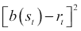

这里，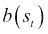是评论者网络在时间步*t*的状态的输出，*r*[*t*]是从时间步*t*开始的累积折现奖励。然后可以使用目标训练演员：

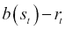

因为基线是从这个状态的平均表现中得出的，这样做的效果是大幅降低训练的方差。如果我们使用策略梯度一次运行小车杆任务，再使用基线一次，其中我们不使用批量规范化，我们可以看到基线表现更好。但如果我们加入批量规范化，结果并没有太大不同。对于比小车杆更复杂的任务，奖励可能随状态变化而变化很多，基线方法可能会更大程度地改善事物。这方面的一个例子可以在`actor_critic_baseline_cart_pole.py`中找到。

## 广义优势估计器

基线方法在减少方差方面做得很好，但它不是真正的演员评论家方法，因为演员不是在学习评论者的梯度，而只是使用它来规范化奖励。广义优势估计器进一步前进，并将评论者的梯度纳入演员的目标中。

为了做到这一点，我们需要学习的不仅仅是代理处于的状态的价值，还有它采取的状态动作对的价值。如果*V(s*[*t*]*)*是状态的价值，*Q(s*[*t*]*, a*[*t*]*)*是状态动作对的价值，我们可以这样定义一个优势函数：

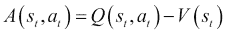

这将给我们带来动作*a*[*t*]在状态*s*[*t*]中的表现与代理在这个位置上平均动作之间的差异。向着这个函数的梯度移动应该会使我们最大化我们的奖励。而且，我们不需要另一个网络来估计*Q(s*[*t*]*, a*[*t*]*)*，因为我们可以利用我们在*s*[*t+1*]达到的状态的价值函数，而 Q 函数的定义如下：

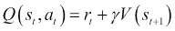

在这里，*r* *t* 现在是该时间步的奖励，而不是基线方程中的累积奖励，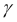 是未来奖励的折扣因子。我们现在可以将其代入，纯粹地给出我们的优势函数中的*V*项：

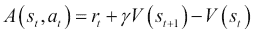

同样，这给我们提供了一个度量标准，用来判断评论者是否认为给定的动作改善了还是损害了位置的价值。我们将我们的演员损失函数中的累积奖励替换为优势函数的结果。这方面的完整代码在`actor_critic_advantage_cart_pole.py`中。这种方法用于小车杆挑战可以完成，但可能比仅使用批量规范化的策略梯度花费更长的时间。但对于像学习电脑游戏这样更复杂的任务，优势演员-评论家可能表现最好。

# 异步方法

在本章中我们看到了许多有趣的方法，但它们都受到训练速度非常慢的限制。当我们在基本控制问题上运行时，例如推车和杆子任务，这并不是什么问题。但是对于学习 Atari 游戏或者未来可能想要学习的更复杂的人类任务来说，数天到数周的训练时间就太长了。

对于策略梯度和演员-评论家来说，时间限制的一个重要部分是，在在线学习时，我们只能同时评估一个策略。我们可以通过使用更强大的 GPU 和更大的处理器获得显著的速度提升；在线评估策略的速度将始终作为性能的硬性限制。

这就是异步方法旨在解决的问题。其想法是在多个线程上训练相同的神经网络的多个副本。每个神经网络在线针对其线程上运行的环境的一个单独实例进行训练。不同于对每个训练步骤更新每个神经网络，更新跨多个训练步骤存储。每*x*个训练步骤，来自每个线程的累积批量更新被汇总在一起，并应用于所有网络。这意味着网络权重将根据所有网络更新中参数值的平均变化进行更新。

这种方法已经被证明适用于策略梯度、演员-评论家和 Q 学习。它极大地改善了训练时间，甚至提高了性能。在异步方法的最佳版本中，被认为是最成功的广义游戏学习算法的异步优势演员-评论家方法，在撰写本文时，被认为是最成功的广义游戏学习算法。

# 基于模型的方法

到目前为止，我们已经展示的方法可以很好地学习各种任务，但是通过这些方法训练出来的智能体仍然可能遭受重大限制：

+   它训练速度非常慢；一个人可以通过几次游玩学会像乒乓球一样的游戏，而对于 Q 学习，可能需要数百万次游玩才能达到类似的水平。

+   针对需要长期规划的游戏，所有技术表现都非常糟糕。想象一个平台游戏，玩家必须从房间的一侧取回一把钥匙，以打开另一侧的门。游戏中很少会发生这种情况，即使发生了，学习到这个钥匙是导致门获得额外奖励的机会也微乎其微。

+   它无法制定策略或以任何方式适应新颖的对手。它可能可以在与训练对手对战时表现良好，但在面对游戏玩法上有新颖性的对手时，学会适应将需要很长时间。

+   如果在环境中给出一个新的目标，就需要重新训练。如果我们正在训练打乒乓球作为左挡板，然后我们改为右挡板，我们将很难重新利用先前学到的信息。一个人可以毫不费力地做到这一点。

所有这些观点都可以说与一个中心问题相关。Q 学习和策略梯度在游戏中为奖励优化参数非常成功，但它们并没有学习如何理解游戏。人类学习在许多方面与 Q 学习有所不同，但一个显著的不同是，当人类学习一个环境时，他们在某种程度上正在学习这个环境的模型。然后他们可以使用该模型进行预测或者想象在环境中采取不同行动会发生什么事情。

想象一个玩家学习下棋的情景：他可以思考如果他进行某个特定的移动会发生什么。他可以想象在这一步之后棋盘会呈现什么样子，在那个新的位置他将会有哪些选择。他甚至可以将对手考虑进他的模型中，这个玩家是什么性格，倾向于采取什么样的走法，他的心情如何。

这就是基于模型的强化学习方法的目标。基于模型的 Pong 方法旨在建立一个模拟，模拟出它可能采取的不同行动的结果，并努力使该模拟尽可能接近现实。一旦建立起一个良好的环境模型，学习最佳行动就变得简单得多，因为代理可以将当前状态视为马尔可夫链的根，并利用一些来自第七章, *棋盘游戏的深度学习*的技术，比如 MCTS-UCT，从其模型中抽样以查看哪些行动有最佳结果。它甚至可以更进一步，使用在自身模型上训练的 Q 学习或策略梯度，而不是在环境上训练。

基于模型的方法还有一个优势，那就是它们可能使人工智能更容易适应变化。如果我们已经学会了一个环境模型，但想要在其中改变我们的目标，我们可以重复使用同一个模型，只需简单地调整模型内的策略。如果我们讨论的是机器人或者在物理世界中运作的其他人工智能，通过玩数百万次的情节来学习策略梯度是完全不切实际的，特别是考虑到现实世界中的每次实验都会耗费时间、能量，并且存在着由于意外事件而带来的风险。基于模型的方法可以缓解许多这些问题。

构建模型引发种种问题。如果你正在构建一个基于模型的代理来学习 Pong，你知道它发生在一个二维环境中，有两个球拍和一个球，并且基本的物理规则。你需要这些元素都在你的模型中才能成功。但如果你手工制作这些，那么学习就不会那么多，并且你的代理远离了泛化学习算法。对于模型来说，什么是正确的*先验*？我们如何构建一个足够灵活，可以学习世界中遇到的复杂事物，同时仍能成功学习特定内容的模型？

更正式地说，学习模型可以看作是学习一个函数，它给出下一个状态在给定当前状态和动作对的情况下：

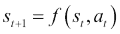

如果环境是随机的，此函数甚至可能返回可能的下一状态的概率分布。一个深度神经网络自然是该函数的一个很好的选择，然后学习将采取以下步骤:

1.  构建一个输入为当前状态，输出为下一个状态和奖励的动作网络。

1.  从环境中遵循一种探索性策略，收集一系列状态动作转换。简单地随机行动可能是一个很好的初始选择。

1.  使用状态动作转换的集合以监督的方式训练网络，以下一状态和状态奖励作为目标。

1.  使用训练好的网络转换来确定使用 MCTS、策略梯度或 Q-learning 的最佳移动。

如果我们以倒立摆任务为例，并以 MSE 作为损失函数，我们可以发现训练深度神经网络准确预测该环境的所有状态转换很容易，包括新状态何时终止。这个示例代码在 Git 仓库中。

甚至可以使用卷积和循环层来学习更复杂的 Atari 游戏模型。这是网络架构的一个例子:

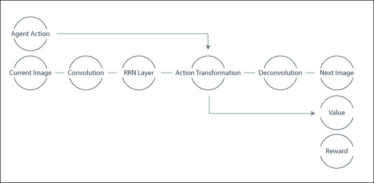

来源：http://cs231n.stanford.edu/reports2016/116_Report.pdf

一个这样的网络使用了两个卷积/反卷积层和 128 个节点的 RNN 来学习预测 Pong 游戏中的下一帧。它能够成功地预测模糊版本的下一帧，但发现该模型不够稳健，无法运行 MCTS 来预测未来一两帧的事件。

这种方法的修改版本效果好得多。在这种方法中，网络不再尝试进行反卷积来预测下一帧图像，而是仅仅尝试预测 RNN 输入在下一帧中将是什么，从而消除了反卷积的需要。该网络可以学会以足够高的水平玩乒乓球，以击败游戏内的人工智能，训练后平均每场比赛赢得 2.9 分。这离完全训练的深度 Q 网络可以达到的 20.0 分还有很长的路要走，但对于一种非常新的方法来说，这仍然是一个有希望的结果。类似的结果也在 Breakout 游戏中实现了。

# 摘要

在本章中，我们研究了使用强化学习构建计算机游戏代理的方法。我们介绍了三种主要方法：策略梯度、Q 学习和基于模型的学习，并展示了如何将深度学习与这些方法结合使用以实现人类或更高水平的表现。我们希望读者能够从本章中获得足够的知识，以便能够将这些技术应用到他们可能想要解决的其他游戏或问题中。强化学习是当前非常令人兴奋的研究领域。谷歌、Deepmind、OpenAI 和微软等公司都在大力投资以解锁这一未来。

在下一章中，我们将探讨异常检测以及如何应用深度学习方法来检测金融交易数据中的欺诈实例。
